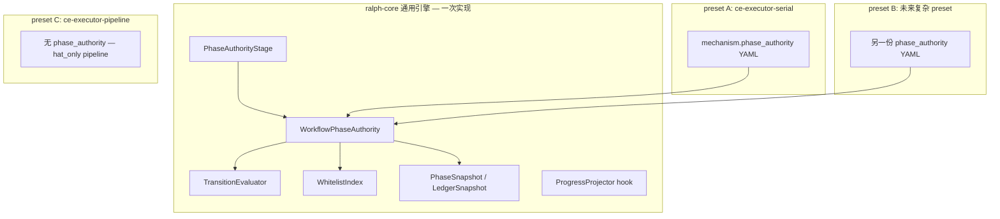
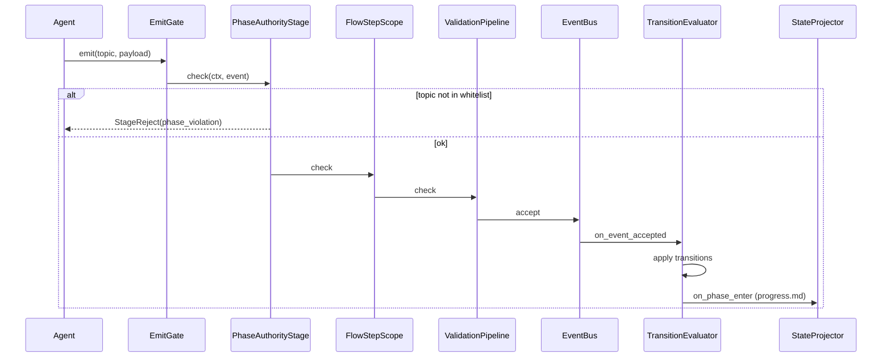
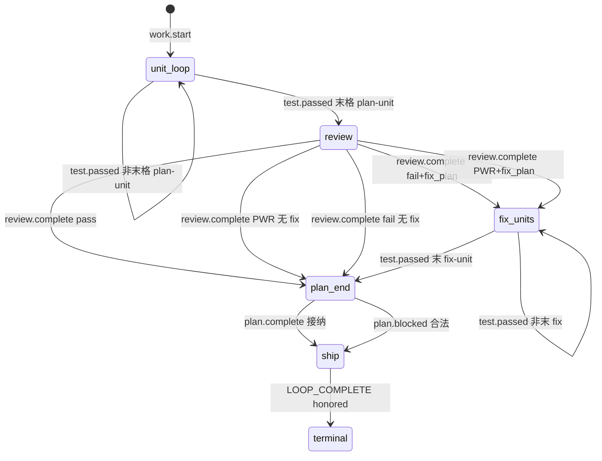

# feat: Workflow Phase Authority 通用引擎（首轮消费者 ce-executor-serial）

## Summary

在 `ralph-core` 新增 **可配置的 Workflow Phase Authority 通用引擎**：Rust 提供阶段枚举容器、声明式转换表、per-hat topic 白名单、内存快照投影与 emit 前拒收；preset 通过 `mechanism.phase_authority` YAML **声明**自己的阶段图，**不为单个 preset 写 `if preset == "…"` 分支**。

`builtin:ce-executor-serial` 是**第一个消费者**（验证金丝雀链坐稳 + preset 瘦身）；`builtin:ce-executor-pipeline` 等 hat-only preset **不启用**，行为零变更。

**执行模式（强制）：** 全部实现按 **U1→U28 严格串行、Unit 级绝对隔离、原子 TDD（红→绿→重构）** 推进；BDD 与全量基线仅属于 **Final Verification**（U28 完成后一次执行）。见「串行 TDD 执行纪律」。

---

## Problem Frame

`ce-executor-serial` preset 膨胀至 3000+ 行，根因是**阶段转换权威分裂**：coordinator PHASE GATE 表 vs runtime 多 gate vs `mechanism.flow` 声明，三套语义并行。每次 run 失败催生新 HARD RULE，终态边（fix-unit 后 `plan.complete` vs `review.start`）仍不稳定。

本 plan **不是**「为 serial 定制一段 Rust」，而是：

1. 抽出 **preset 无关** 的 phase engine（可复用模块）；
2. serial 只提供 **第一份 YAML 阶段实例** + BDD；
3. 未来第二个复杂 preset **只加 schema/YAML + 场景**，除非引擎缺新**转换原语**才改 Rust。

**与 005 plan：** `docs/plans/2026-07-02-005-fix-ce-executor-serial-p0-terminal-path-plan.md` 为症状缝补；重叠项以本 plan 为准。

---

## Engine vs Preset：通用架构与可扩展性

### 分层模型



| 层 | 职责 | 变更频率 |
|----|------|----------|
| **引擎** | 解析配置、维护当前 phase、评估转换、拒收非法 emit、写快照 | 低；仅新增转换**原语**时改 |
| **Preset YAML** | 定义 phases、transitions、per-hat 白名单、progress 写入规则 | 每个复杂 preset 一份 |
| **Preset prompt** | 角色质量、文案、plan 解析；**不含**路由决策大表 | 随 preset 迭代 |
| **共享 gate** | `execution_contracts`、`precheck`、`dedup` | 所有 preset 共用 |

### 何时用引擎 vs hat-only

| 信号 | 推荐 |
|------|------|
| 线性 hat 链，几乎无分支（pipeline） | **hat_only**：`triggers` / `publishes` + `event_policy` |
| ≤3 hat coordinator 模式、分支少 | 现有 contracts + lint，通常不必 phase |
| 多 phase、多终态边、coordinator 与 runtime gate 已打架 | **phase_authority** opt-in |
| 需要「fix 完后只能 plan.complete」类硬约束 | phase 白名单 + 转换表，而非 prompt 表 |

### 新 preset 接入清单（不写 Rust 为前提）

满足以下全部时，**仅 YAML + schema + BDD** 即可：

1. 阶段可用现有 **转换原语** 表达（见下节「原语目录」）；
2. 不需求 runtime 解析业务 markdown（硬禁止，见 solutions 文档）；
3. `preset_lint` 新规则校验 YAML 与 schema SSOT 一致；
4. `run_workflow_guard_scenario` 覆盖主链 + 终态边。

若缺原语（例：「连续 N 次 dimension 失败才转 blocked」），在引擎增加一个 **命名原语** + 单测，**不**为 preset 写 `match preset_name`。

### 原语目录（引擎内置；各原语对应独立 Unit U6–U9）

| 原语 ID | 含义 | serial 用法 |
|---------|------|-------------|
| `on_event` | 指定 topic 被接纳后评估 | `work.start` → `unit_loop` |
| `on_test_passed_step` | `test.passed` + step 模式/末格判定 | 末 plan-unit → `review`；末 fix-unit → `plan_end` |
| `on_review_complete_verdict` | 按 verdict + fix_plan 字段分支 | KTD4 矩阵 |
| `on_plan_terminal_accepted` | `plan.complete` / 合法 `plan.blocked` 接纳 | → `ship` |
| `on_loop_complete_honored` | 终态 honored | → `terminal` |

**扩展方式：** 新原语 = `crates/ralph-core/src/event_loop/phase_authority/primitives/` 新文件 + `preset_lint` 允许的配置关键字 + 文档一行。**禁止**在 `event_loop/mod.rs` 写 preset 名分支。

### 与 `mechanism.flow` 的关系

| | `mechanism.flow`（现状） | `mechanism.phase_authority`（本 plan） |
|--|--------------------------|----------------------------------------|
| 目的 | 声明式步骤 + lint SSOT | **执行层**阶段权威 |
| serial | 保留 YAML 块，lint/文档 | `enabled: true`，热路径 SSOT |
| pipeline | 无 | 无 |
| 冲突时 | serial 上 **phase 赢** | 逐步弱化 `FlowStepScope` 对 serial 的并行决策 |

长期：`mechanism.flow.steps` 可向 `phase_authority.phases` 合并；本轮不删 flow 块，避免 preset_lint 大爆炸。

---

## Requirements

来源：`docs/brainstorms/2026-07-02-ce-executor-serial-runtime-phase-authority-requirements.md`。

**引擎与 opt-in**

- R1. Phase authority 仅对 `mechanism.phase_authority.enabled: true` 的 preset 生效。
- R1b. 阶段集合由 preset YAML **声明**；serial 首轮至少 6 个 phase id（见 HTD）。
- R2. 每 phase 声明 per-hat 或 per-role 的 topic 白名单；非法 emit 拒收 + 结构化原因。
- R3. 转换由引擎按配置 + 已接纳事件推导，不读 coordinator prompt。

**引擎可扩展性（本 plan 新增，承接用户确认）**

- R1c. 引擎 API 与模块边界 **preset 无关**；serial 逻辑不得散落在 `if preset ==` 分支。
- R1d. 转换表 **配置驱动**（YAML → `PhaseAuthorityDeclaration`）；允许后续 preset 只换 YAML。
- R1e. 新增转换原语须带单测 + `preset_lint` 关键字白名单，文档记入 `phase_authority` 模块 README 注释。

- R1f. **执行纪律**：实现必须按 U1→U28 串行、Unit 隔离、原子 TDD；集成/BDD 仅 Final Verification。

**终态边、减法、单源、收口、回归** — 同 origin R4–R18（略述于各 U）。

---

## Key Technical Decisions

**KTD1. 配置形状：`mechanism.phase_authority` 声明式（非仅 `enabled: bool`）**

首轮即采用可扩展 schema（serial 填第一份实例），避免日后第二 preset 逼出 Rust 硬编码。

```yaml
# presets/en/ce-executor-serial.yml 内 mechanism 块追加（示意，实现以 schema SSOT 为准）
phase_authority:
  enabled: true
  initial_phase: unit_loop
  phases:
    - id: unit_loop
      allowed_emits:
        coordinator: [work.ready, queue.advance]
    - id: review
      allowed_emits:
        coordinator: [review.start]
    - id: fix_units
      allowed_emits:
        coordinator: [work.ready]
    - id: plan_end
      allowed_emits:
        coordinator: [plan.complete, plan.blocked]
    - id: ship
      allowed_emits:
        shipper: [REVIEW_COMPLETE]
        reporter: [report.done, LOOP_COMPLETE]
    - id: terminal
      allowed_emits: {}
  transitions:
    - on: { event: work.start }
      to: unit_loop
    - on: { primitive: on_test_passed_step, step_kind: plan_unit, when: last }
      from: unit_loop
      to: review
    - on: { primitive: on_review_complete_verdict, matrix: serial_default }
      from: review
      # 目标 phase 由矩阵定义，见 KTD4
    - on: { primitive: on_test_passed_step, step_kind: fix_unit, when: last }
      from: fix_units
      to: plan_end
    - on: { event: plan.complete, accepted: true }
      from: plan_end
      to: ship
    - on: { primitive: on_loop_complete_honored }
      from: ship
      to: terminal
  violation_policy:
    max_resume_per_hat: 3
    on_exhausted: plan_blocked
  progress_projection:
    on_enter:
      plan_end: { write_current_step: last_completed_step_or_none }
      fix_units: { write_current_step: active_fix_step }
```

- Rust：`MechanismConfig.phase_authority: Option<PhaseAuthorityConfig>`，serde 映射上述结构。
- `presets/schemas/ce-executor-serial.yml` 为 SSOT；`preset_lint/phase_authority.rs` 校验 phases/transitions 引用闭合。
- pipeline schema：**禁止**出现 `phase_authority` 键。

**KTD2–KTD8** — 保留初版决策（`test.passed` 驱动、独立 `fix_units`、verdict 矩阵、吸收 `CoordinatorDecisionGateStage`、resume 熔断、两阶段 PR、shipper 废止兜底）。

**KTD4. Verdict 矩阵（配置名 `serial_default`，可复用定义）**

| 条件 | → phase |
|------|---------|
| `verdict=pass` | `plan_end` |
| `verdict=pass_with_residuals`，无 `fix_plan_file` | `plan_end` |
| `verdict=pass_with_residuals`，有 `fix_plan_file` | `fix_units` |
| `verdict=fail`，有 `fix_plan_file` | `fix_units` |
| `verdict=fail`，无 fix_plan | `plan_end` |

**KTD9. `build_stage_pipeline_from_config` 四路分支**

现网（`event_loop/mod.rs:462-481`）两路：`flow` → `with_default_stages_for_loop_config`；无 flow → `with_hat_only_stages_for_loop_config`。

目标：

```
if !phase_authority.enabled:
    现网两路不变                    # pipeline、未启用 preset
else if phase_authority.enabled && flow:
    with_phase_authority_stages_for_loop_config(flow, phase_decl, loop_cfg)
else if phase_authority.enabled && !flow:
    with_phase_authority_only_stages_for_loop_config(phase_decl, loop_cfg)  # 远期
```

首轮 serial **同时有** `flow` + `phase_authority`；`PhaseAuthorityStage` 插在 `RepairDispatch` 之后、`FlowStepScope` 之前（非法 topic 先被拒，减少 flow scope 误报）。

Stage 顺序（phase 启用时）：

1. `RepairDispatchStage`
2. `EmitSchemaGateStage`
3. **`PhaseAuthorityStage`** ← 新增
4. `FlowStepScopeStage`（serial 暂保留，逐步降级为 lint 对齐）
5. `StepCloseObligationStage`
6. `VerdictGateStage`

**KTD10. 快照 SSOT：`PhaseSnapshot` 字段**

```text
PhaseSnapshot {
  phase_id: String,
  entered_at_seq: u64,           // events.jsonl 序号
  violation_counts: HashMap<(HatId, ViolationKind), u32>,
  review_walk_closed: bool,      // 吸收 CoordinatorDecisionGate 语义
  last_completed_step: Option<String>,
  fix_unit_queue_exhausted: bool,
}
```

- 投影到 `LedgerSnapshot` 新字段 `workflow_phase: Option<PhaseSnapshot>`。
- `ReviewStepTracker`、`StepHandoffRule`、`ValidationContext` 通过 `ctx.phase_snapshot()` 读取；**禁止** gate 内直接 `std::fs::read` progress/tasks。

**KTD11. 开发切分为 28 个原子 Unit + Final Verification**

- 原 11 个大 Unit 拆为 **28 个单职责 Unit**（配置→原语→facade→stage→纯 helper→接线→preset）。
- 每个 Unit：**仅** 本模块单元测试；**禁止** 跨 Unit 集成测试与 BDD。
- BDD、`run-tests.sh`、金丝雀 ×3 归入 **Final Verification**（U28 完成后一次执行）。
- 理由：用户要求「纯粹串行、绝对隔离、TDD 闭环」；避免 U2 未完成时 U8 写 BDD 假绿。

---

## High-Level Technical Design

### 模块布局（Output Structure）

```text
crates/ralph-core/src/event_loop/
  phase_authority/
    mod.rs                 # WorkflowPhaseAuthority facade
    config.rs              # PhaseAuthorityConfig serde（从 loop_config 迁入或 re-export）
    declaration.rs         # YAML → 内存声明
    evaluator.rs             # TransitionEvaluator：on_accepted 求下一 phase
    whitelist.rs             # per-phase per-hat allowed topics
    snapshot.rs              # PhaseSnapshot 类型
    primitives/
      mod.rs
      on_event.rs
      on_test_passed_step.rs
      on_review_complete_verdict.rs
      on_loop_complete_honored.rs
    tests/
      serial_declaration_roundtrip.rs
      serial_transition_matrix.rs
  stages/
    phase_authority_stage.rs
  workflow_phase_authority.rs  # 薄 re-export 或删除（仅保留目录）
```

### 组件与数据流



### Phase 状态机（serial 实例）



### serial 完整 per-hat 白名单（配置 SSOT 目标）

| phase | hat | 允许 topics |
|-------|-----|-------------|
| `unit_loop` | coordinator | `work.ready`, `queue.advance` |
| `unit_loop` | executor | `work.done`, `work.failed` |
| `unit_loop` | validator | `test.passed`, `test.failed` |
| `review` | coordinator | `review.start`（引擎计数 ≤1） |
| `review` | review-coordinator | `review.dimension.ready`, `review.dimensions.complete` |
| `review` | dimension hats | `review.*.done`, `review.*.failed` |
| `review` | review-synthesizer | `review.complete` |
| `fix_units` | coordinator | `work.ready` |
| `fix_units` | executor / validator | 同 unit_loop |
| `plan_end` | coordinator | `plan.complete`, `plan.blocked` |
| `ship` | shipper | `REVIEW_COMPLETE` |
| `ship` | reporter | `report.done`, `LOOP_COMPLETE` |
| `terminal` | * | （无新业务事件；`completion_after_terminal` 拦截） |

维度 hat 的 `review.goalalign.done` 等由 **订阅 hat 的 publishes 列表** 兜底；白名单默认「该 hat 在 preset 声明的 publishes 且 phase 未显式 deny」。

### 拒收与纠正（KTD6 细化）

| 步骤 | 行为 |
|------|------|
| 1 | `StageReject { code: "phase_violation", phase, topic, allowed[] }` |
| 2 | 写入 diagnostics / correction envelope |
| 3 | 若 `violation_counts < max_resume_per_hat` → 允许 orchestrator 发 **一次** `task.resume(reason_code=phase_violation)` |
| 4 | 超限 → `plan.blocked(reason=phase_violation_exhausted)` 或 silent drop（配置 `on_exhausted`） |

---

## Scope Boundaries

### 本次覆盖

- 通用 phase authority 引擎 + serial YAML 实例 + preset 减法。
- 原语目录 5 项（上表）；**不**实现任意 DSL 图灵完备。
- BDD + pipeline SC6。

### Deferred for later

- 第二 preset 接入（`autoresearch` / `merge-loop`）仅复用引擎，本轮不做。
- `ralph diagnose` / TUI 展示 `phase_id`。
- `mechanism.flow` 与 `phase_authority` 字段合并。

### Outside product identity

- Plan markdown 扫描拓扑；per-preset Rust 分支；pipeline 强制 phase 化。

---

## 串行 TDD 执行纪律（强制）

本 plan 所有开发 **必须** 遵守以下纪律；`ce-work` 不得并行开多个 Unit，不得「先写一半 U3 再回头补 U2」。

### 纪律 A — 严格串行

- **单向流水线**：`U1 → U2 → … → U28`，一个接着一个做。
- **前置闭环**：Unit *N* 的验收测试 **全部绿色** 后，才允许打开 Unit *N+1* 的 RED。
- **禁止交替开发**：同一 PR / 同一会话内不得同时处于两个 Unit 的「进行中」状态。

### 纪律 B — 绝对隔离

- 每个 Unit 是 **独立孤岛**：只实现本 Unit「边界 — 输出」列出的 API；不提前写后置 Unit 的代码。
- **禁止前向依赖**：不得 `use`、调用、或假设尚未完成的 Unit 的实现；仅可依赖 **已完结** 的更早 Unit 的 **公开类型/函数**。
- **自包含运行**：测试所需数据 = 本文件内联常量、最小 fixture 字符串、或 `#[cfg(test)]` 假结构；**禁止**「等 EventLoop 真跑起来才能测」。

### 纪律 C — 原子 TDD

每个 Unit 固定三步：

1. **RED**：只写本 Unit 验收测试，运行 **必须失败**。
2. **GREEN**：写 **最少** 实现使本 Unit 测试通过。
3. **REFACTOR**：仅在本 Unit 文件内整理；**不得** 把本 Unit 边界问题推给下一 Unit。

**测试范围**：每个 Unit 的 `测试唯一入口` 命令 **只能** 跑本 Unit 测试；**禁止** 在 Unit 内写 `run_workflow_guard_scenario`、全量 `scenarios`、或 `./scripts/run-tests.sh`（这些属于文末 **Final Verification**，非 Unit）。

### Unit 与 Final Verification 的分工

| 层级 | 内容 | 何时跑 |
|------|------|--------|
| **Unit 1–28** | 单模块输入/输出；单元测试 | 每完结一个 Unit 跑该 Unit 入口 |
| **Final Verification** | BDD、preset 全量 lint、workspace 基线 | **仅 U28 完结后** 一次性执行 |

---

## Implementation Units

> 每个 Unit 含：**边界（输入/输出）**、**串行门禁**、**向后依赖**、**本 Unit 禁止**、**TDD 循环**、**测试唯一入口**。`ce-work` 必须按编号顺序执行，不得跳号。

### U1. `PhaseAuthorityConfig` 纯 serde 类型

**Goal:** 仅定义配置数据结构；无 lint、无 runtime、无 preset 改动。

**边界 — 输入:** 测试内联 YAML/JSON 字符串。

**边界 — 输出:** `PhaseAuthorityConfig` 及嵌套类型 serde 往返相等。

**串行门禁:** 无（链首）。

**向后依赖:** 无。

**本 Unit 禁止:** `preset_lint`、`WorkflowPhaseAuthority`、`presets/*.yml`、`event_loop` 接线。

**TDD 循环:** RED（roundtrip 失败）→ GREEN（`MechanismConfig.phase_authority` + struct）→ REFACTOR。

**测试唯一入口:** `cargo nextest run -p ralph-core -- phase_authority_config_roundtrip`

**Files:** `crates/ralph-core/src/config/loop_config.rs`, `crates/ralph-core/src/event_loop/phase_authority/config.rs`

**Test scenarios:** 最小 YAML roundtrip；`enabled: false`；缺省 `violation_policy` 默认值。

**Verification:** 入口全绿；**不**跑 preset_lint / scenarios。

---

### U2. `PhaseAuthorityDeclaration` 解析

**Goal:** `PhaseAuthorityConfig` → 规范化 `PhaseAuthorityDeclaration`（纯函数）。

**边界 — 输入:** `PhaseAuthorityConfig` 字面量（测试构造）。

**边界 — 输出:** `Result<PhaseAuthorityDeclaration, DeclarationError>`。

**串行门禁:** U1 全绿。

**向后依赖:** U1 类型。

**本 Unit 禁止:** lint、evaluator、stage、preset 文件。

**TDD 循环:** RED → GREEN → REFACTOR；只测 `try_from_config`。

**测试唯一入口:** `cargo nextest run -p ralph-core -- phase_authority_declaration`

**Files:** `crates/ralph-core/src/event_loop/phase_authority/declaration.rs`

**Test scenarios:** 合法 2-phase → Ok；重复 phase id → Err；悬空 transition → Err。

---

### U3. `preset_lint` phase_authority（纯 YAML 字符串）

**Goal:** `check_phase_authority_block(&str) -> Vec<Finding>`。

**边界 — 输入:** 内联 YAML 片段。

**边界 — 输出:** findings 列表。

**串行门禁:** U2 全绿。

**向后依赖:** U2 错误语义。

**本 Unit 禁止:** 改真实 preset 文件、EventLoop、BDD。

**TDD 循环:** RED → GREEN → REFACTOR。

**测试唯一入口:** `cargo nextest run -p ralph-core -- preset_lint_phase_authority`

**Files:** `crates/ralph-core/src/preset_lint/phase_authority.rs`, `mod.rs`, `finding_id.rs`

**Test scenarios:** 未知 primitive → finding；pipeline 形 YAML 含 enabled → finding。

---

### U4. `WhitelistIndex`

**Goal:** `allows(hat, topic, phase_id, &decl) -> bool`（或带 allowed 列表的决策）。

**串行门禁:** U2 全绿。**向后依赖:** U2。**禁止:** Event、StageContext。

**测试唯一入口:** `cargo nextest run -p ralph-core -- phase_authority_whitelist`

**Files:** `crates/ralph-core/src/event_loop/phase_authority/whitelist.rs`

**Test scenarios:** `plan_end` + `review.start` → false；`plan.complete` → true。

---

### U5. `PhaseSnapshot` 值类型

**Goal:** 快照 struct + 纯更新 helper（无 I/O）。

**串行门禁:** U1 全绿（与 U4 顺序固定：U4 先）。**向后依赖:** 无。

**测试唯一入口:** `cargo nextest run -p ralph-core -- phase_snapshot`

**Files:** `crates/ralph-core/src/event_loop/phase_authority/snapshot.rs`

**Test scenarios:** `with_phase_id`；`violation_counts` 递增；`review_walk_closed` 标志。

---

### U6. 原语 `on_event`

**Goal:** 单原语匹配 `work.start` 等 → `Option<PhaseId>`。

**串行门禁:** U2 全绿。**向后依赖:** U2 spec 类型。

**测试唯一入口:** `cargo nextest run -p ralph-core -- primitive_on_event`

**Files:** `crates/ralph-core/src/event_loop/phase_authority/primitives/on_event.rs`

---

### U7. 原语 `on_test_passed_step`

**Goal:** `test.passed` + `StepProgressFixture`（测试内建）→ `Option<PhaseId>`。

**串行门禁:** U6 全绿。**禁止:** 读 plan md、磁盘 tasks、evaluator 全表。

**测试唯一入口:** `cargo nextest run -p ralph-core -- primitive_on_test_passed_step`

**Test scenarios:** 末 fix-unit → `plan_end`；末 plan-unit → `review`；`work.done` → 不匹配。

---

### U8. 原语 `on_review_complete_verdict`（`serial_default`）

**Goal:** KTD4 五行矩阵；矩阵名配置化，非 preset 名硬编码。

**串行门禁:** U7 全绿。**测试唯一入口:** `cargo nextest run -p ralph-core -- primitive_on_review_complete_verdict`

**Test scenarios:** PWR 无 fix → `plan_end`；fail+fix_plan → `fix_units`。

---

### U9. 原语 `on_loop_complete_honored`

**Goal:** honored → `terminal`。**串行门禁:** U8 全绿。

**测试唯一入口:** `cargo nextest run -p ralph-core -- primitive_on_loop_complete_honored`

---

### U10. `TransitionEvaluator::apply`

**Goal:** 单事件 + snapshot + decl + fixture → 新 snapshot；组合 U6–U9。

**串行门禁:** U9、U5 全绿。**禁止:** facade、event_loop 接线。

**测试唯一入口:** `cargo nextest run -p ralph-core -- transition_evaluator`

**Files:** `crates/ralph-core/src/event_loop/phase_authority/evaluator.rs`

---

### U11. `WorkflowPhaseAuthority` facade

**Goal:** `on_event_accepted`、`current_phase_id`、`allowed_topics`（U10+U4）。

**串行门禁:** U10、U4 全绿。**禁止:** 测 PhaseAuthorityStage。

**测试唯一入口:** `cargo nextest run -p ralph-core -- workflow_phase_authority`

**Files:** `crates/ralph-core/src/event_loop/phase_authority/mod.rs`

**Test scenarios:** disabled no-op；`work.start`→末 `test.passed` 序列 phase 变 `review`。

---

### U12. `LedgerSnapshot.workflow_phase` 字段

**Goal:** 仅增字段；不改 gate 行为。**串行门禁:** U5 全绿。

**测试唯一入口:** `cargo nextest run -p ralph-core -- ledger_snapshot_workflow_phase`

**Files:** `crates/ralph-core/src/state/snapshot.rs`

---

### U13. `PhaseAuthorityStage::check` + `StageReject::PhaseViolation`

**Goal:** EmitStage；测试注入 stub authority 固定 phase。**禁止:** `build_stage_pipeline`、真 EventLoop。

**串行门禁:** U11、U4 全绿。

**测试唯一入口:** `cargo nextest run -p ralph-core -- phase_authority_stage`

**Test scenarios:** stub `plan_end` + `review.start` → reject。

---

### U14. `with_phase_authority_stages_for_loop_config`（仅 `names()`）

**Goal:** stage 名单含 `PhaseAuthority` 且在 `FlowStepScope` 前。

**串行门禁:** U13 全绿。**禁止:** 改 `build_stage_pipeline`（U15）。

**测试唯一入口:** `cargo nextest run -p ralph-core -- with_phase_authority_stages`

---

### U15. `build_stage_pipeline_from_config` 分支（仅 `names()`）

**Goal:** enabled → 含 PhaseAuthority；pipeline → 不含。**串行门禁:** U14 全绿。

**测试唯一入口:** `cargo nextest run -p ralph-core -- build_stage_pipeline_phase_branch`

**Files:** `crates/ralph-core/src/event_loop/mod.rs`（仅此函数）

---

### U16. `plan_gate_should_skip_review_not_terminal` 纯 helper

**Goal:** `Option<phase_id>` → bool；`review_step_state` 一行调用。

**串行门禁:** U5 全绿。**测试唯一入口:** `cargo nextest run -p ralph-core -- plan_gate_phase_skip`

---

### U17. `progress_gate_should_skip_missing_current_step` 纯 helper

**Goal:** 同 U16，针对 progress gate。**串行门禁:** U16 全绿。

**测试唯一入口:** `cargo nextest run -p ralph-core -- progress_gate_phase_skip`

---

### U18. `ValidationContext::workflow_phase` getter

**Goal:** 只读访问器。**串行门禁:** U12 全绿。

**测试唯一入口:** `cargo nextest run -p ralph-core -- validation_context_workflow_phase`

---

### U19. `apply_progress_on_phase_enter` 纯函数

**Goal:** 配置 + phase + step → markdown 片段字符串；不写磁盘。

**串行门禁:** U1 全绿。**测试唯一入口:** `cargo nextest run -p ralph-core -- progress_on_phase_enter`

**Files:** `crates/ralph-core/src/event_loop/phase_authority/progress_projection.rs`

---

### U20. `shipper_requires_plan_complete_when_phase_enabled` 纯函数

**Goal:** shipper 路由判定（KTD8）。**串行门禁:** U1 全绿。

**测试唯一入口:** `cargo nextest run -p ralph-core -- shipper_phase_routing`

**Test scenarios:** stall recovery 子串 → Deny（AE4 子集）。

---

### U21. `parse_test_passed_step` / `is_fix_unit_completion` 纯函数

**Goal:** topic+payload → step 解析。**串行门禁:** U7 全绿。

**测试唯一入口:** `cargo nextest run -p ralph-core -- is_test_passed_fix_unit_completion`

**Files:** `crates/ralph-core/src/event_loop/phase_authority/step_parse.rs`

---

### U22. `phase_violation_resume_budget` 纯函数

**Goal:** 熔断计数（KTD6）。**串行门禁:** U1 全绿。

**测试唯一入口:** `cargo nextest run -p ralph-core -- phase_violation_resume_budget`

---

### U23. `handle_phase_on_event_accepted` 自由函数

**Goal:** slim `PhaseLoopState` + Event → 更新 snapshot；**禁止** `EventLoop::run`。

**串行门禁:** U11、U19 全绿。

**测试唯一入口:** `cargo nextest run -p ralph-core -- handle_phase_on_event_accepted`

**Files:** `crates/ralph-core/src/event_loop/phase_authority/on_accepted.rs`；`mod.rs` 一行委托。

---

### U24. serial preset + schema SSOT（仅 lint）

**Goal:** 落地 `presets/en` + `schemas` 的 `phase_authority` 块。

**串行门禁:** U3 全绿。**禁止:** 删 PHASE GATE、BDD。

**测试唯一入口:** `cargo nextest run -p ralph-cli --bin ralph -- preset_lint` + `cargo nextest run -p ralph-core -- preset_lint` + `cargo nextest run -p ralph-cli --bin ralph -- test_ce_executor_root_preset_matches_embedded`

---

### U25. 第二 preset 最小 fixture（扩展性）

**Goal:** 测试目录 2-phase YAML → `try_from_config` Ok。**串行门禁:** U2 全绿。

**测试唯一入口:** `cargo nextest run -p ralph-core -- fixture_minimal_second_preset`

---

### U26. `diagnosis_plan_complete_dual_check` 纯函数

**Goal:** main bus vs repair sink 双检（R14）。**串行门禁:** U23 全绿。

**测试唯一入口:** `cargo nextest run -p ralph-core -- diagnosis_plan_complete_dual_check`

---

### U27. `advance_step_on_test_passed` 纯函数

**Goal:** 从 `drive_step_transition` 抽出；`enabled=false` legacy 分支单测覆盖。

**串行门禁:** U21 全绿。

**测试唯一入口:** `cargo nextest run -p ralph-core -- advance_step_on_test_passed`

**Files:** `crates/ralph-core/src/event_loop/step_transition.rs`

---

### U28. Preset 瘦身（仅 YAML 删除 + lint）

**Goal:** 删 PHASE GATE / steward 表 / 重复 HARD RULE；行数 ≥25%↓。**禁止:** 改 Rust；**禁止:** BDD（Final）。

**串行门禁:** U24 全绿。

**测试唯一入口:** `cargo nextest run -p ralph-cli --bin ralph -- preset_lint` + `wc -l` 记录 PR

**删除清单:** coordinator PHASE GATE 大表；Branch A/B；progress-steward 决策表；DO NOT emit 墙；数 fix-plan 标题路由。

---

## 串行流水线总览（U1→U28）

```text
U1 config → U2 decl → U3 lint → U4 whitelist → U5 snapshot
  → U6 on_event → U7 on_test_passed → U8 on_verdict → U9 on_honored
  → U10 evaluator → U11 facade → U12 ledger field
  → U13 stage → U14 builder → U15 pipeline branch
  → U16 plan_gate helper → U17 progress helper → U18 validation ctx
  → U19 progress str → U20 shipper → U21 step_parse → U22 resume budget
  → U23 on_accepted → U24 preset YAML → U25 fixture → U26 diagnose
  → U27 step_transition → U28 preset 删文
```

**规则:** 任一 Unit 未绿，**不得** 开下一 Unit 的 RED。

---

## Final Verification（非 Unit — 仅 U28 完成后执行一次）

| 步骤 | 动作 | 覆盖 |
|------|------|------|
| FV1 | 新增 BDD YAML + `scenarios.rs` | AE1–AE3, F3, F4, R13 |
| FV2 | `cargo nextest run -p ralph-core --test scenarios` | SC5, SC6, AE5, AE6 |
| FV3 | `./scripts/run-tests.sh` | R16 |
| FV4 | 金丝雀 plan ×3（operator） | SC1, SC2 |

**BDD 文件（此阶段才创建）:**
- `crates/ralph-core/tests/scenarios/serial_phase_f3_test_passed_terminal.yml`
- `crates/ralph-core/tests/scenarios/serial_phase_f2_multi_fix_units.yml`
- `crates/ralph-core/tests/scenarios/serial_phase_post_loop_steward_silent.yml`
- `crates/ralph-core/tests/scenarios/serial_phase_violation_resume_budget.yml`

---

## Acceptance Examples

| ID | Unit 内可验证（子集） | Final Verification |
|----|----------------------|-------------------|
| AE1 | U7, U13 | FV1 |
| AE2 | U8, U17 | FV1 |
| AE3 | — | FV1/FV4 |
| AE4 | U20 | FV2 |
| AE5 | U15 | FV2 |
| AE6 | — | FV2（U28 后） |
| AE7 | U25 | — |

---

## System-Wide Impact

- **新模块** `event_loop/phase_authority/`：后续复杂 preset 的唯一状态管理扩展入口。
- **28 个原子 Unit** 各自闭环；集成证明推迟到 Final Verification。
- **`build_stage_pipeline_from_config`**：U15 接线；未启用 preset 零变更（R18）。

---

## Risks & Dependencies

| 风险 | 缓解 |
|------|------|
| Unit 过多导致流程摩擦 | 每 Unit 测试入口单一、范围极小；流水线图固定顺序 |
| 推迟 BDD 至最后集中爆雷 | 每个 Unit 纯函数边界钉死；FV 前跑 U1–U28 全绿清单 |
| 共享路径误伤 pipeline | U15 专测 names；FV pipeline 场景 |
| 005 plan 冲突 | 本 plan 优先 |

**金丝雀 plan:** 由 operator 在 U28 完成后自选;本 plan 不锁死具体金丝雀路径(以往常用 `docs/plans/2026-06-20-001-feat-python-sort-algorithms-plan.md` 之类的隔离小 plan,但该具体文件不在当前仓库,需 operator 当场指定)。

---

## Open Questions

| 问题 | 处置 |
|------|------|
| TUI/diagnose 展示 phase | Deferred |
| `FlowStepScope` serial 完全 no-op 时机 | U28 后评估 |
| `max_resume_per_hat` 默认 | 3（U22 单测钉死） |

---

## Sources & Research

- Origin: `docs/brainstorms/2026-07-02-ce-executor-serial-runtime-phase-authority-requirements.md`
- Pipeline: `stage_pipeline.rs:281-302`
- Builder: `event_loop/mod.rs:462-481`
- 禁止 plan 扫描: `docs/solutions/logic-errors/base-runtime-must-not-parse-business-markdown.md`

---

## Phased Delivery

**唯一开发阶段:** U1 → U28 严格串行（**禁止** 并行 Unit）。

**收尾阶段（非 Unit）:** Final Verification FV1–FV4（**仅 U28 绿后**）。

**Preset 删文:** U28（非单独 PR 与引擎并行；删文前引擎须 U1–U27 完结）。

---

## 合并前检查清单（R16 — 仅 Final Verification）

1. `cargo nextest run -p ralph-cli --bin ralph -- preset_lint`
2. `cargo nextest run -p ralph-core -- preset_lint`
3. `cargo nextest run -p ralph-core --test scenarios`
4. `cargo nextest run -p ralph-cli --bin ralph -- test_ce_executor_root_preset_matches_embedded`
5. `./scripts/run-tests.sh`
