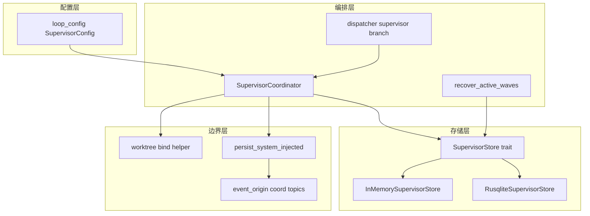
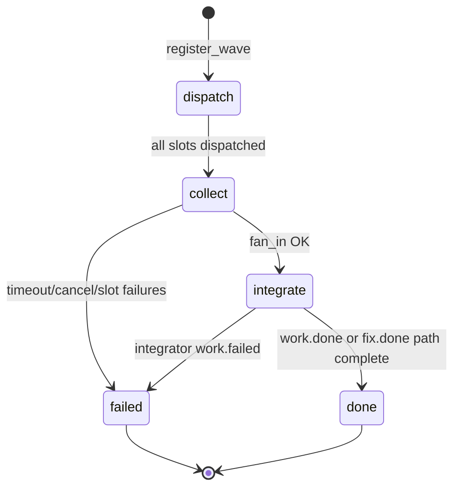

# feat: Supervisor rusqlite 编排与 ce-executor-supervisor preset

## Summary

在显式 `event_loop.supervisor.enabled: true` 时，用 `rusqlite`（`.ralph/supervisor.db`）持久化 Supervisor 编排态，实现六件套协议（反压、取消、持久化、幂等、内容去重、补偿），由 runtime 注入 wave 协调事件，并在独立 worktree 中并行执行/修复。交付 builtin preset `ce-executor-supervisor` 及 BDD 场景。`supervisor.enabled: false` 时行为与现网一致。

本计划按 **严格串行、绝对隔离、原子 TDD** 拆为 13 个 Implementation Unit：完成 Unit *N* 的编码与测试（红→绿→重构）后，方可开始 Unit *N+1*；每个 Unit 的测试只验证该 Unit 的输入/输出，禁止跨 Unit 集成测试。

---

## Problem Frame

并行 wave 当前依赖内存 `WaveTracker`，进程崩溃丢状态、无 DB 级幂等、取消与反压薄弱；worker 共享主工作区导致写冲突。用户需要微服务式并行：plan 拆解 → worktree 内并行执行 → 合并与全量测试 → 并行 review → 并行修复 → 报告，且编排态由嵌入式 SQL 账本管理，业务 JSONL 链路保留。

（详见 origin: `docs/brainstorms/2026-07-03-supervisor-rusqlite-parallel-preset-requirements.md`）

---

## Requirements

### 开关与配置

- R1. `event_loop.supervisor.enabled` 缺省为 `false`；仅显式 `true` 时启用 Supervisor 路径。（origin KD-2）
- R2. `SupervisorConfig` 支持 `db_path`、`max_concurrent_workers`、`aggregate_timeout_secs`，缺省与需求文档一致。（origin 开关语义）
- R3. `supervisor.enabled: false` 时不初始化 rusqlite、不创建 `.ralph/supervisor.db`；全量测试基线无回归。（origin SC1）
- R4. preset 启用 supervisor 时须 `execution_mode: isolated`；`preset_lint` 规则 R-SW-1 / R-SW-2 生效。（origin 开关语义）

### 存储与六件套

- R5. `SupervisorStore` trait + `RusqliteSupervisorStore` 实现需求文档 8 张表语义（waves、wave_slots、slot_resources、dispatch_records、worker_results、wave_queue、compensation_jobs、schema_migrations）。（origin 数据库设计）
- R6. 反压：active workers ≥ `max_concurrent_workers` 时 wave 入队 `wave_queue`；slot 完成后 FIFO 出队。（origin R-A1–R-A4）
- R7. 取消：`cancel_wave` 置 flag；未 spawn slot 标 cancelled；已 spawn 通过 PID kill。（origin R-B1–R-B4）
- R8. 持久化：wave/slot/resource 变更同事务提交；启动 `recover_active_waves`；DB 打不开时 supervisor 模式 fail closed。（origin R-C1–R-C4）
- R9. 幂等：`idempotency_key` UNIQUE；冲突不二次 spawn。（origin R-D1–D-D4）
- R10. 内容去重：同 slot 同 `content_hash` 不重复 merge JSONL；不同 hash 替换并记诊断。（origin R-E1–R-E4）
- R11. 补偿：`compensation_jobs` 在 failed/timeout/partial 时执行；失败不阻塞终态。（origin R-F1–R-F5）

### Worktree 与协调

- R12. exec/fix wave `isolation_mode=worktree`；review `shared_readonly`；dispatch 前绑定 `slot_resources`。（origin R-WT-1–R-WT-10）
- R13. worker 环境注入 `RALPH_WAVE_WORKER=1`、`RALPH_WAVE_WORKTREE_PATH` 等；agent 禁止自建 worktree。（origin R-WT-6–R-WT-7）
- R14. DB fan-in → merge slot 事件到 `events.jsonl` → 注入 `*.wave.complete` / `*.wave.failed`（`system_injected`）；agent 不得 emit 协调 topic。（origin R-COORD-1–R-COORD-4、R-MRG-1）
- R15. `exec-integrator` / `fix-integrator` 仅订阅 `exec.wave.complete` / `fix.wave.complete`；合并后全量集成测试通过才可 `work.done` / `fix.done`。（origin R-INT-1–R-INT-8、F-EXEC-INTEGRATE）

### Preset 交付

- R16. 交付 `builtin:ce-executor-supervisor`：16 功能 hat + progress-steward；schema、manifest、index、zsh 补全、CLAUDE.md 同步。（origin R-PST-3）
- R17. BDD 最小场景断言 `exec.wave.complete` → integrator → `work.done` 及 fix/review 对称链。（origin SC4）
- R18. `ralph diagnose` 可展示 active waves、queue depth、dedup 统计。（origin SC6）

---

## Key Technical Decisions

| ID | 决策 | 理由 |
|----|------|------|
| KTD-1 | Cargo feature `supervisor-db` 默认 **off**；CI 跑 default + `supervisor-db` 两矩阵 | 满足 R-IMPL-1；减小默认二进制（闭合 OQ1） |
| KTD-2 | v1 integrator 合并：**按 `slot_index` 升序 cherry-pick** | 需求 OQ2；可测、可复现 |
| KTD-3 | `plan_units.json` / `fix_units.json` 默认 `.ralph/agent/plan_units.json`、`.ralph/agent/fix_units.json` | 闭合 OQ3；与 agent 目录一致 |
| KTD-4 | 并发上限 = `min(supervisor.max_concurrent_workers, hat.concurrency)` | 闭合 OQ4 |
| KTD-5 | Wave 生命周期：`phase=collect` + `status=running` 直至 fan-in；fan-in 后 `phase=integrate` + `status=collecting_complete`；`work.done` 后 `phase=done` + `status=completed` | 避免 integrator 前标 `completed` 导致崩溃双 inject（flow 分析 Critical #1） |
| KTD-6 | integrator **只 emit 业务事件**；`slot_resources` 更新与协调事件注入均由 **Supervisor 单写者** 完成 | 闭合 KD-4 与 flow 分析 integrator 写 DB 矛盾 |
| KTD-7 | JSONL merge 失败时 **禁止** inject `*.wave.complete`；DB 保持 `phase=collect` 可重放 merge | R-MRG-2；对齐 flow 分析双写原子性 |
| KTD-8 | partial 策略：**任一 required slot 永久 failed → `*.wave.failed`**，不允许 silent partial complete | flow 分析；满足 SC2 |
| KTD-9 | 多 batch（R-PLN-2）：每 batch 独立 `wave_id`；下一 batch 仅上一 batch `work.done` 后由 task-planner/exec-coordinator 发起 | 避免 batch 间状态纠缠 |
| KTD-10 | 协调 topic 扩 `is_supervisor_coordination_topic()` + `system_injected` 注入；复用 `persist_system_injected_jsonl_event` 模式 | `event_origin.rs` 既有旁路；禁止 agent 伪造 |
| KTD-11 | 先 `InMemorySupervisorStore` 完整六件套，再 `RusqliteSupervisorStore` 镜像同一 trait 契约 | 支持 Unit 级隔离 TDD；rusqlite 仅替换持久化层 |
| KTD-12 | review wave 单次 batch emit（`--payloads` ×6）；preset 内 HARD RULE + `presets.rs` contract test | `docs/solutions/.../ce-executor-wave-emission-must-batch-in-single-emit-2026-06-09.md` |

---

## 执行纪律（串行 · 隔离 · TDD）

1. **单向流水线**：U1 → U2 → … → U13；禁止并行开发多个 Unit。
2. **前置闭环**：Unit *N* 全部测试绿后方可开始 Unit *N+1*。
3. **零前向依赖**：Unit *N* 不得 import 或调用 Unit *N+1..* 尚未存在的符号；未就绪能力用 **trait / stub / 内建假数据** 在本 Unit 内闭环。
4. **原子 TDD**：每个 Unit 先写失败测试 → 实现 → 重构；测试 **只断言本 Unit 公开边界**，禁止写「依赖后续 Unit 才绿」的集成测试。
5. **全量回归**：仅在 **U13 完成后** 跑 `./scripts/run-tests.sh`；开发中只跑当前 Unit 列出的 targeted nextest。

---

## High-Level Technical Design

### 组件关系



### Wave phase 状态机（KTD-5）



### Merge 与协调事件顺序（R-MRG-1）

```
DB txn: slot completed
→ worker_results + content_hash
→ fan_in check
→ append *.unit.done to events.jsonl
→ merged_to_events=1
→ inject *.wave.complete (system_injected)
→ hat: integrator
```

---

## Scope Boundaries

### In Scope

- 本计划 U1–U13 全部 Unit
- origin 文档 In Scope 条目

### Deferred for later（origin）

- 中文 preset `ce-executor-supervisor-zh.yml`
- review wave 可选 worktree 只读快照
- 全局 worker pool 跨 wave 共享反压
- Turso / 远程 DB / worker 直连 DB

### Outside this product's identity

- 修改 `ce-executor-pipeline` / `ce-executor-serial` 默认行为
- 将 `events.jsonl` / `tasks.jsonl` 全量迁入 SQL

### Deferred to Follow-Up Work

- `ralph-tools-wave.md` 大规模改写（仅当 U9 改变 CLI 可见行为时于 U13 同步）
- `/ce-compound` 沉淀 rusqlite 运维学习到 `docs/solutions/`（U13 后）

---

## System-Wide Impact

- **ralph-core**：新增 `supervisor/` 模块；`event_origin`、可选 `loop_config` 扩展
- **ralph-cli**：`loop_runner/wave/dispatcher` 分支；`preflight` / `config_resolution` 同步
- **presets**：新 builtin + schema；`preset_lint` 新规则
- **测试**：`ralph-cli` 仍须 nextest 串行；BDD `scenarios` 顺序跑
- **二进制**：`supervisor-db` feature 控制 rusqlite 链接

---

## Risks & Dependencies

| 风险 | 缓解 |
|------|------|
| DB/JSONL 双写不一致 | KTD-7；U8 单测覆盖 merge 失败不 inject |
| integrator 长测试触发 progress-steward 误恢复 | preset 对 integrator 声明 stall 豁免或拉长 TTL（U12 preset 配置） |
| worktree 磁盘与 merge 冲突 | integrator `work.failed` + `conflict_files[]`；BDD 覆盖 |
| isolated 单事件预算丢弃第二业务事件 | 若 preset 需 dual-publish handoff，须 orchestrator carve-out（参考 dispatch-gap 学习）；本 preset 优先单事件链 |
| loop_runner Mutex flake | 遵守 HARD RULE 1：仅 nextest 跑 ralph-cli |

**依赖**：git worktree（D1）、`ralph wave emit` 预检不回归（D3）、isolated 模式（D4）。

---

## Open Questions

| ID | 问题 | 计划处置 |
|----|------|----------|
| OQ-impl-1 | progress-steward 对 integrator 全量测试的 stall 阈值 | U12 preset 显式配置；若不足于 U13 BDD 再调 |
| OQ-impl-2 | `supervisor-db` CI 矩阵是否进默认 `run-tests.sh` | U4 添加 feature 门控测试；U13 文档化 |

---

## Implementation Units

> **纪律提醒**：一次只做一个 Unit。下列 Dependencies 仅表示「逻辑上需前者已合并」，不得在未完成前置 Unit 测试的情况下开始下一 Unit。

### U1. SupervisorConfig 与配置汇入

- **Goal**：引入 `SupervisorConfig` 及 YAML 反序列化；同步 preflight / config_resolution opt-in 列表；缺省 `enabled: false`。
- **Requirements**：R1, R2, R3
- **Dependencies**：无
- **Files**：
  - `crates/ralph-core/src/config/loop_config.rs`
  - `crates/ralph-cli/src/preflight.rs`
  - `crates/ralph-cli/src/config_resolution.rs`
  - `crates/ralph-core/src/config/loop_config.rs`（`#[cfg(test)]` 或同文件 tests）
- **Approach**：在 `EventLoopConfig` 增加 `supervisor: SupervisorConfig`（`#[serde(default)]`）。`Default::default()` 全 false/缺省路径。preflight / strip 列表加入 `"supervisor"` 键。不引入 rusqlite。
- **Execution note**：先写配置反序列化失败测试（红），再实现结构体。
- **Patterns to follow**：`ProgressStewardConfig`、`PhaseAuthorityConfig` 嵌套块
- **Test scenarios**：
  - 缺省 YAML 无 `supervisor` 块 → `enabled == false`
  - 完整 supervisor 块字段解析正确
  - `normalize()` 后路径为 `.ralph/supervisor.db`（相对 workspace）
  - preflight opt-in：operator 省略时 preset 值保留
- **Verification**：`cargo nextest run -p ralph-core -- supervisor_config`（或实际 test 名）全绿；无其他 crate 变更

---

### U2. Supervisor 领域类型与 SupervisorStore trait

- **Goal**：定义 wave/slot/resource 状态枚举、`WaveKind`、`IsolationMode`、`DispatchOutcome` 及 `SupervisorStore` trait 方法签名（无实现）。
- **Requirements**：R5（接口层）
- **Dependencies**：U1
- **Files**：
  - `crates/ralph-core/src/supervisor/mod.rs`
  - `crates/ralph-core/src/supervisor/types.rs`
  - `crates/ralph-core/src/supervisor/store.rs`
  - `crates/ralph-core/src/lib.rs`（`mod supervisor` 导出）
- **Approach**：trait 方法覆盖：open/close、`register_wave`、`enqueue_wave`、`try_dispatch_next`、`record_slot_result`、`record_slot_failure`、`bind_worktree`、`cancel_wave`、`fan_in_status`、`mark_merge_to_events`、`recover_active_waves`、`list_worktree_paths` 等。不含 coordinator/dispatcher 逻辑。
- **Execution note**：trait 编译测试 + 类型序列化 round-trip 测试先行。
- **Patterns to follow**：`WaveTracker` 公开 API 语义对齐（`wave_tracker.rs`）
- **Test scenarios**：
  - 枚举序列化/显示与需求文档字符串一致
  - 空白 `InMemorySupervisorStore` 占位实现（`unimplemented!`）仅用于 trait 对象编译 smoke（若需）；或 trait 无默认 impl
- **Verification**：`cargo build -p ralph-core`；trait 单元测试绿

---

### U3. InMemorySupervisorStore（waves + slots + resources）

- **Goal**：内存实现 `register_wave`、`wave_slots` 生命周期、`slot_resources` worktree 绑定；不含幂等/队列/补偿。
- **Requirements**：R5（子集）、R12（数据层）
- **Dependencies**：U2
- **Files**：
  - `crates/ralph-core/src/supervisor/memory.rs`
  - `crates/ralph-core/src/supervisor/memory_tests.rs`（或 `#[cfg(test)] mod tests`）
- **Approach**：`HashMap` + 显式状态迁移；强制执行 KTD-5 phase 迁移规则（本 Unit 仅测 register/dispatch/complete slot）。
- **Execution note**：TDD：每个 trait 方法一测试文件一组用例。
- **Patterns to follow**：`wave_tracker.rs` 测试风格
- **Test scenarios**：
  - register_wave 创建 expected_total slots
  - worktree isolation：bind 前 dispatch 失败；bind 后成功
  - slot pending → dispatched → completed
  - fan_in：completed_count 达 expected_total 返回 true
  - review shared_readonly：无 slot_resources 仍可完成
- **Verification**：仅 `memory` 模块测试绿；不引用 rusqlite

---

### U4. InMemorySupervisorStore（幂等、去重、反压、取消、补偿）

- **Goal**：在 U3 内存 store 上补齐六件套剩余表语义。
- **Requirements**：R6–R11
- **Dependencies**：U3
- **Files**：
  - `crates/ralph-core/src/supervisor/memory.rs`（扩展）
  - `crates/ralph-core/src/supervisor/memory_protocol_tests.rs`
- **Approach**：`dispatch_records` UNIQUE；`worker_results` content_hash；`wave_queue` FIFO；`cancel_requested`；`compensation_jobs` 执行钩子（`noop` / 记录 executed）。
- **Execution note**：每协议一项一组独立测试；不启动 coordinator。
- **Test scenarios**：
  - 重复 idempotency_key → DuplicateKey
  - 同 slot 同 hash dedup；不同 hash replace
  - active_workers 达上限 → BackpressureEnqueued；释放后 FIFO dispatch
  - cancel_wave：pending slot cancelled；running 标 cancelled
  - compensation on timeout → job executed
- **Verification**：`cargo nextest run -p ralph-core -- supervisor_memory` 绿

---

### U5. RusqliteSupervisorStore 与 schema migration

- **Goal**：`supervisor-db` feature、`rusqlite` bundled、WAL migration；`RusqliteSupervisorStore` 实现 **与 U3+U4 相同 trait 契约**。
- **Requirements**：R5, R8
- **Dependencies**：U4
- **Files**：
  - `crates/ralph-core/Cargo.toml`
  - `crates/ralph-core/src/supervisor/rusqlite.rs`
  - `crates/ralph-core/src/supervisor/migrations.rs`
  - `crates/ralph-core/src/supervisor/rusqlite_tests.rs`
- **Approach**：`spawn_blocking` 包装同步 SQL；`user_version` migration；feature off 时 stub 类型返回 `SupervisorDisabled` 错误。测试使用 tempdir `.db` 文件，**不**启动 loop_runner。
- **Execution note**：先 migration 测试（表存在），再逐方法对齐 U4 测试矩阵（复制场景名，换 Rusqlite 实现）。
- **Patterns to follow**：项目无先例；WAL + `foreign_keys=ON` per R-DB-0
- **Test scenarios**：
  - migration 从 0→最新 idempotent
  - U4 全部 happy path 在 rusqlite 重现（单测内自包含）
  - DB 文件损坏 → open 返回 Err（fail closed）
  - feature off 时 `enabled` 代码路径不链接 rusqlite（编译测试）
- **Verification**：`cargo nextest run -p ralph-core --features supervisor-db -- supervisor_rusqlite` 绿

---

### U6. Wave phase 纯函数与 fan-in 判定

- **Goal**：从 store 读数中判定 `FanInDecision`（complete / failed / partial）、`phase` 迁移；纯函数无 I/O。
- **Requirements**：R8, KTD-5, KTD-8
- **Dependencies**：U2
- **Files**：
  - `crates/ralph-core/src/supervisor/phase.rs`
  - `crates/ralph-core/src/supervisor/phase_tests.rs`
- **Approach**：输入：`WaveSnapshot` 结构（counts、cancel flag、timeout）；输出：`IntegrateGate` | `FailedGate` | `ContinueCollect`。不调用 store 实现。
- **Execution note**：表驱动测试；固定输入 JSON fixture。
- **Test scenarios**：
  - 全部 completed → IntegrateGate
  - 1 failed + retries exhausted → FailedGate
  - cancel_requested → FailedGate reason cancelled
  - timeout_at 过期 → FailedGate reason timeout
  - partial 不允许 → 2/4 complete + 1 failed → FailedGate
- **Verification**：仅 `phase` 模块测试；与 U3/U4 无交叉引用

---

### U7. 协调 topic 注册与 origin guard

- **Goal**：`exec.wave.complete` 等 6 topic 登记；agent emit 拒绝；`system_injected` 旁路保留。
- **Requirements**：R14
- **Dependencies**：U1
- **Files**：
  - `crates/ralph-core/src/event_origin.rs`
  - `crates/ralph-core/src/event_loop/tests/origin_guard.rs`（扩展）
- **Approach**：`is_supervisor_coordination_topic()`；单元测试 agent hat 发 complete → denied；`with_system_injected()` → allowed。
- **Execution note**：先写 failing origin_guard 测试。
- **Patterns to follow**：`task.resume` / `loop.resume` 控制 topic 模式
- **Test scenarios**：
  - agent 发 `exec.wave.complete` → OriginRejected
  - system_injected 同 topic → Accepted
  - 6 个 coord topic 均覆盖
- **Verification**：`cargo nextest run -p ralph-core -- origin_guard` 绿

---

### U8. SupervisorCoordinator（fan-in、merge 顺序、协调事件载荷）

- **Goal**：编排「DB 更新 → JSONL merge 门控 → 构造 coord payload」；**仅依赖 `SupervisorStore` trait + 可注入 `EventMergeSink` trait**。
- **Requirements**：R14, R7, KTD-6, KTD-7
- **Dependencies**：U4, U6, U7
- **Files**：
  - `crates/ralph-core/src/supervisor/coordinator.rs`
  - `crates/ralph-core/src/supervisor/coordinator_tests.rs`
  - `crates/ralph-core/src/supervisor/merge_sink.rs`（trait + 内存 Vec 实现）
- **Approach**：`EventMergeSink` 仅 `append_events(Vec<Event>) -> Result<()>`；测试用 in-memory sink。merge 失败不调用 `inject_complete`。payload 含 `worktree_paths` 升序。
- **Execution note**：Mock store = U4 `InMemorySupervisorStore`；禁止真实 dispatcher。
- **Test scenarios**：
  - fan-in 完成 + merge OK → sink 收到 `exec.wave.complete` 且 `system_injected`
  - merge Err → 无 complete 事件；store phase 仍为 collect
  - fan-in failed → `exec.wave.failed` payload 含 `missing_slots`
  - 重复调用 complete 注入幂等（第二次 no-op）
- **Verification**：`cargo nextest run -p ralph-core -- supervisor_coordinator` 绿

---

### U9. preset_lint Supervisor 规则

- **Goal**：R-SW-1/2；integrator triggers 不得含 `*.unit.done`；coord topic 不在 hat `publishes`；supervisor.enabled 须 isolated。
- **Requirements**：R4, R16
- **Dependencies**：U1
- **Files**：
  - `crates/ralph-core/src/preset_lint/supervisor.rs`
  - `crates/ralph-core/src/preset_lint/mod.rs`
  - `crates/ralph-core/src/preset_lint/finding_id.rs`
  - `crates/ralph-core/src/preset_lint/supervisor_tests.rs`
- **Approach**：对解析后 preset 结构跑静态检查；测试用最小 YAML fixture 字符串，不依赖 U12 真实 preset 文件。
- **Execution note**：每个 finding 一条测试。
- **Patterns to follow**：`phase_authority.rs` lint 模块
- **Test scenarios**：
  - supervisor.enabled + coordinator 模式 → Error
  - exec-integrator triggers 含 `exec.unit.done` → Error
  - hat publishes `exec.wave.complete` → Error
  - 合法最小 supervisor preset fixture → 无 supervisor finding
- **Verification**：`cargo nextest run -p ralph-core -- preset_lint_supervisor` 绿

---

### U10. Worktree 绑定辅助

- **Goal**：`bind_slot_worktree(loop_id, wave_kind, slot_index) -> WorktreeBinding` 封装命名 `{loop_id}-{wave_kind}-{slot_index}`；环境变量 map 生成。
- **Requirements**：R12, R13
- **Dependencies**：U2
- **Files**：
  - `crates/ralph-core/src/supervisor/worktree_bind.rs`
  - `crates/ralph-core/src/supervisor/worktree_bind_tests.rs`
- **Approach**：注入 `WorktreeFactory` trait（测试用固定 tempdir 路径）；生产实现委托 `worktree::create_worktree`。**本 Unit 不修改 dispatcher**。
- **Execution note**：测试只断言 factory 被调用参数与 env map 内容。
- **Patterns to follow**：`crates/ralph-core/src/worktree.rs`
- **Test scenarios**：
  - exec wave 生成 `RALPH_WAVE_WORKTREE_PATH` 等 5 个 env
  - review wave → `None` binding
  - branch 命名符合 R-WT-2
- **Verification**：`cargo nextest run -p ralph-core -- supervisor_worktree_bind` 绿

---

### U11. 启动恢复 recover_active_waves

- **Goal**：loop 启动时恢复 active waves；timeout 标 timeout；orphan slot 策略；不重复 inject complete。
- **Requirements**：R8, R18
- **Dependencies**：U5, U8
- **Files**：
  - `crates/ralph-core/src/supervisor/recover.rs`
  - `crates/ralph-core/src/supervisor/recover_tests.rs`
  - `crates/ralph-cli/src/loop_runner/runner.rs`（调用点，最小接入）
- **Approach**：`recover.rs` 纯逻辑 + store；runner 仅一行 `if config.supervisor.enabled { recover? }`。测试用 U5 temp db 预置行，**不**跑完整 loop。
- **Execution note**：TDD 各恢复场景。
- **Test scenarios**：
  - phase=integrate + events 已有 complete → 不重复 inject
  - running + timeout_at 过去 → status=timeout
  - running + PID 不存在 → slot failed 或 redispatch（实现选定一种，测试锁死）
  - merged_to_events=0 的 completed slot → 重放 merge 意图标记
- **Verification**：`cargo nextest run -p ralph-core -- supervisor_recover` 绿

---

### U12. loop_runner dispatcher Supervisor 分支

- **Goal**：`supervisor.enabled` 时走 `SupervisorCoordinator`；`false` 时原 `WaveTracker` 路径不变；注入 worktree env（调用 U10 helper）。
- **Requirements**：R3, R12, R14
- **Dependencies**：U8, U10, U11
- **Files**：
  - `crates/ralph-cli/src/loop_runner/wave/dispatcher.rs`
  - `crates/ralph-cli/src/loop_runner/wave/supervisor_bridge.rs`（新）
  - `crates/ralph-cli/src/loop_runner/tests/wave_supervisor.rs`
- **Approach**：`SupervisorBridge` trait 抽象 coordinator；单元测试 `MockSupervisorBridge` 记录调用，**不**跑真子进程 worker。`enabled=false` 回归测试对照现有 wave 测试快照。
- **Execution note**：先写 `supervisor disabled` 回归测试确保无变化；再写 enabled mock 测试。
- **Patterns to follow**：`dispatcher.rs` 内 `WaveWorkerExecutor` mock 模式
- **Test scenarios**：
  - enabled=false：仍使用 `WaveTracker::new()`（可通过 spy 或行为断言）
  - enabled=true：register_wave 被调用；worktree env 注入子进程 spawn 参数
  - enabled=true + feature off：明确错误路径
- **Verification**：`cargo nextest run -p ralph-cli --bin ralph -- wave_supervisor` 绿（串行）

---

### U13. ce-executor-supervisor preset 包与 BDD

- **Goal**：交付完整 preset、schema、manifest、presets.rs、index、zsh；BDD 最小 E2E；`ralph diagnose` 读 DB 摘要。
- **Requirements**：R16, R17, R18
- **Dependencies**：U9, U11, U12（须 U1–U12 全部测试绿）
- **Files**：
  - `presets/en/ce-executor-supervisor.yml`
  - `presets/schemas/ce-executor-supervisor.yml`
  - `presets/manifest.yml`
  - `presets/index.json`
  - `crates/ralph-cli/src/presets.rs`
  - `scripts/ralph-zsh-plugin.zsh`
  - `CLAUDE.md` / `AGENTS.md`
  - `crates/ralph-core/tests/scenarios/supervisor/ce_executor_supervisor_minimal.yml`
  - `crates/ralph-core/tests/scenarios.rs`
  - `crates/ralph-cli/src/diagnose.rs`（或等价，若已有则扩展）
  - `crates/ralph-core/data/ralph-tools-wave.md`（仅 CLI 行为变更时）
- **Approach**：preset 16 hat 拓扑按 origin F-MAIN；review batch emit HARD RULE；BDD mock wave worker + supervisor inject coord events；diagnose 子命令读 queue depth。
- **Execution note**：先写 BDD YAML + scenarios.rs 测试函数（红），再填 preset。
- **Patterns to follow**：`presets/en/ce-executor-pipeline.yml`、`ce_executor_serial_review.yml` BDD
- **Test scenarios**：
  - Covers SC4：`exec.wave.complete` → integrator → `work.done` 序；fix/review 对称
  - `preset_lint` 全绿 + SSOT byte test
  - `supervisor.enabled=false` 全 workspace 基线无新增失败
  - diagnose 输出含 `active_waves` / `queue_depth`
  - review coordinator 单次 batch（contract test 查 instructions 含 `--payloads`）
- **Verification**：`cargo nextest run -p ralph-core --test scenarios`；`cargo nextest run -p ralph-cli --bin ralph -- preset_lint`；`./scripts/run-tests.sh`

---

## Sources & Research

- Origin：`docs/brainstorms/2026-07-03-supervisor-rusqlite-parallel-preset-requirements.md`
- Wave 现状：`crates/ralph-core/src/wave_tracker.rs`、`crates/ralph-cli/src/loop_runner/wave/dispatcher.rs`
- Worktree：`crates/ralph-core/src/worktree.rs`
- Runtime 注入：`crates/ralph-core/src/event_loop/mod.rs`（`persist_system_injected_jsonl_event`）、`ralph-proto` `with_system_injected`
- 机构经验：`docs/solutions/integration-issues/ce-executor-wave-emission-must-batch-in-single-emit-2026-06-09.md`、`docs/solutions/2026-06-16-isolated-wave-stability-and-progress-steward.md`、`docs/solutions/architecture-patterns/orchestrator-expected-event-ledger-ssot.md`
- 外部研究：未执行（技术选型已在 origin 闭合）

---

## Acceptance Examples

- **AE1.** 2 unit 并行 exec：两 worktree 完成 → `exec.wave.complete` → integrator merge + 测试 → `work.done` → 6 维 review → `fix.wave.complete` → `fix.done` → `LOOP_COMPLETE`（BDD U13）
- **AE2.** kill 进程重启：`phase=collect` 的 wave 从 DB 恢复，不重复 `work.done`（U12 测试 + 手动 smoke）
- **AE3.** `ralph run -H builtin:ce-executor-supervisor` preset_lint 0 error（U13）
