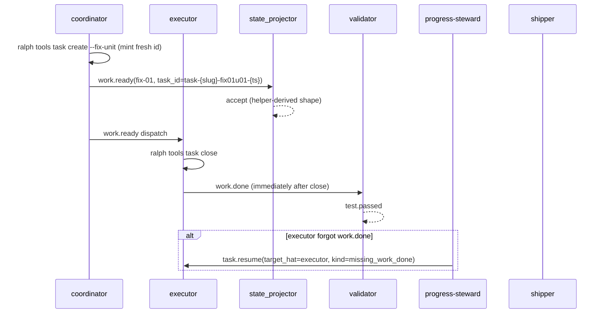

> **2026-07-04 supersession notice**: this plan is fully absorbed by U14 of the OPAC plan (`docs/plans/2026-07-04-001-feat-opac-isolated-agent-discipline-plan.md#u14`). The four P0 items — fix-unit mint via `ralph tools task ensure --for-fix-unit`, progress-steward `missing_work_done` resume, shipper `default_publishes` whitelist, and hat-channel diagnostic — landed as separate commits before the OPAC plan was opened:
>
> - `61602a0f fix(ce-executor-serial): 修复 093813/075227 P0-1~P0-4 编排链路阻断`
> - `54687b25 fix(ce-executor-serial): 同步 shipper_reason 移除 stall_recovery:* 兜底条目`
> - `d18f6e04 fix(shipper+supervisor): P0 修复 stall_recovery 静默升级 + coordinator hat 视角 instructions`
>
> Future work on this surface lives in the OPAC plan; do not re-open this file.

# fix: ce-executor-serial 093813 P0 编排链 + 机制白名单 gap 修复

## Summary

修复 `primary-20260703-093813` run 暴露的 4 个 P0 阻断点,使 ce-executor-serial 在 fix-unit 阶段能完整走通 `work.ready(fix-NN) → work.done → test.passed → plan.complete → REVIEW_COMPLETE → LOOP_COMPLETE`。

- **P0-1**(编排,70% 责任):coordinator fix-unit dispatch 复用已绑定 task_id,被 state_projector 拒绝,fix 链 0% 推进
- **P0-3**(编排):executor 关闭 task 后不 emit `work.done`,链路断在 fix-01
- **P0-2**(机制,20% 责任):shipper `recoverable_whitelist` 缺 `default_publishes`,075227 沉默入口走 hard-fail
- **P0-4**(机制,10% 责任):hat-channel 0 字节文件静默降级,无诊断 emit

与 `2026-07-02-005` plan **解耦**:不动 U1-U12 串行节奏,本 plan 独立推进 P0 闭环,BDD 验收同时覆盖两份 plan 的目标场景。

## 093813 报告定位修正

报告 §P0-4 原文写"目标文件:`crates/ralph-core/src/event_loop/mod.rs` `current-hat-events` 解析与写入段"——**此定位错误**。grep `current_hat_events` 在 `crates/ralph-core/src/` 下零结果,实际实现:

- 写入点:`crates/ralph-cli/src/loop_runner/hat_channel.rs:19-50`(`prepare_hat_channel`)
- 0 字节静默跳过:`crates/ralph-cli/src/loop_runner/hat_channel.rs:79`(`if !content.trim().is_empty()` 分支)
- merge 失败仅 `warn!`:`crates/ralph-cli/src/loop_runner/runner.rs:3420-3425`

本 plan 按实际定位修复。

## Problem Frame

### 业务 P0(必须在本 plan 闭合)

| ID | 现象 | 根因 | 证据 |
|----|------|------|------|
| **BP0-1** | fix-01 `work.ready` 被 state_projector 拒绝,fix-02/03/plan.complete/REVIEW_COMPLETE/LOOP_COMPLETE 全不触发 | coordinator 复用已绑定到 None key 的 `task-1783073243-0087`,违反 `presets/en/ce-executor-serial.yml:988-994` 的 `MUST be freshly minted` HARD RULE | `.ralph/diagnostics/logs/ralph-2026-07-03T17-38-12-398-1410405.log:138` |
| **BP0-2** | executor 关闭 task 后未 emit `work.done`,fix-01 链断 | preset 有 `ralph tools task close` 强制段(`presets/en/ce-executor-serial.yml:1271-1273`)但**无"close 后必须 emit work.done"强制段**,validator 也不订阅 `task.closed` 类事件兜底 | `tasks.jsonl:4 status:closed` + 事件流空白 |
| **BP0-3** | 075227 run 走 `default_publishes` 注入路径,shipper 拒收走 hard-fail | shipper `recoverable_whitelist`(`presets/en/ce-executor-serial.yml:2646-2675`)7 项不含 `default_publishes`;schema SSOT `plan.blocked.allowed_values.reason`(`presets/schemas/ce-executor-serial.yml:328-359`)18 项也不含 | `events-075227.jsonl:3` + shipper `STRICT-MATCH` 拒收 |
| **BP0-4** | hat-channel 0 字节文件静默降级到主 events,isolated 模式路由失效但无可见诊断 | `hat_channel.rs:79` 空文件直接跳过 merge,无诊断 emit;`runner.rs:3420` merge 失败仅 `warn!` | `.ralph/current-hat-events:1` 空文件(093813 run) |

### 非目标

- U1-U10+U12(active plan 2026-07-02-005)不在本 plan 范围
- P1-1/P1-2/P1-3 加固项不在本 plan 范围,留下一轮
- pipeline preset 族(2026-07-03-pipeline diagnosis)不在本 plan 范围

## Requirements

| ID | 要求 |
|----|------|
| R1 | coordinator 在 fix-unit dispatch 时**必须**调用 `ralph tools task create` mint fresh task_id,且输出必须是 `Task::fix_unit_task_id(plan, fix_round, fix_unit_index, unix_ts)` shape(`task-{plan_slug}-fix{NN}u{NN}-{ts_hex}`);手写 id 被静态 lint 拒绝 |
| R2 | executor 在 `ralph tools task close` 之后**必须**立即 emit `work.done`(或失败时 `work.failed`);progress-steward 看到 "task closed 但无 work.done" 时快速 `task.resume(target_hat=executor, kind=missing_work_done)`,不等 3 次无进展 |
| R3 | shipper `recoverable_whitelist` 和 schema SSOT `plan.blocked.allowed_values.reason` **同步**追加 `default_publishes`;coordinator 沉默 + runtime 注入 `default_publishes` 走可恢复路径,验证 1-2 通过时路由到 `pass_with_residuals` |
| R4 | hat-channel 0 字节文件时 emit 诊断到 `.ralph/diagnostics/channel-routing-fallback-{ts}.md`(不再静默跳过);merge 失败 emit 诊断 + 升级日志级别 |
| R5 | 每个 Unit 遵守 **Execution Protocol**;**模块完成 ≠ 目标完成**,仅 Final Verification 通过算闭环 |
| R6 | preset 改动必须同步跑 `preset_lint` 四件套 + SSOT byte-equality + zsh plugin + CLAUDE.md/AGENTS.md(见 AGENTS.md「preset/schema 改动后下游同步清单」HARD RULE) |

## Key Technical Decisions

| ID | 决策 | 理由 |
|----|------|------|
| KTD-1 | U1 新增 `preset_lint` 静态规则 `FINDING_FIX_UNIT_TASK_ID_NOT_HELPER_DERIVED`,扫描 coordinator instructions 是否含 `Task::fix_unit_task_id` 调用模板 + `ralph tools task create --fix-unit` 参数示范 | 093813 真实根因:preset 已有 `MUST be freshly minted` 文案(line 988-994)但**全仓 3 处提及 `ralph tools task create` 都没给 CLI 参数模板**,agent 推不出 `--plan-name`/`--step`/`--task-key` 怎么传。静态 lint 是事前守卫,比 runtime fail-closed 更早暴露 |
| KTD-2 | U2 在 progress-steward `publishes` 段不动(它已能 emit `task.resume`),改 instructions 加 "task closed 但无 work.done" 快速兜底规则 | progress-steward `triggers=["loop.stalled"]` 已能唤醒,问题是它现在的兜底规则要等 fix-unit 链尾才触发 `fix_unit_complete_plan_complete_pending`;新增 `missing_work_done` reason 在 task close 后立即触发,不等 3 次无进展 |
| KTD-3 | U3 `default_publishes` 双管齐下:先扩 schema SSOT `allowed_values.reason`(硬门),再扩 shipper `recoverable_whitelist`(软路由) | schema 是入口白名单,不扩则 `plan.blocked(reason=default_publishes)` 事件本身被 schema 拒;shipper 是路由白名单,不扩则走 hard-fail。两层都缺,两层都要改 |
| KTD-4 | U4 在 `hat_channel.rs:79` 空文件分支 emit 诊断文件,不 fail-closed(避免阻塞 loop) | 0 字节静默降级是真问题但 fail-closed 会让 loop 完全卡死;emit 诊断 + warn 升级为 error 级日志,让 operator 能看到,loop 继续走 fallback 路径 |
| KTD-5 | BDD 验收必须用 `run_workflow_guard_scenario`(真 EventLoop runner),**禁止** `run_scenario` stub | 093813 报告 §9 原文:stub 只查 iterations 数,会静默吞掉拓扑失配;2026-06-24 P0-2/P0-3 根因就是用了 stub |
| KTD-6 | 本 plan 不修改 active plan 2026-07-02-005 的 U1-U12,但 Final Verification 的 BDD-2 场景**与 2026-07-02-005 的 FV BDD-2 共享**同一文件 | 两份 plan 的验收场景在 fix-unit 链路上重叠,共享避免重复维护 |

## High-Level Technical Design




## Execution Protocol（强制）

1. **严格串行**：U1→U4;前一 Unit 测试全绿方可进入下一 Unit。
2. **模块所有权**：各 Unit **Files** 为编辑边界。
3. **零前向依赖**：Unit *N* 测试不得依赖 Unit *N+1* 符号。
4. **原子 TDD**：先 RED(仅本 Unit API)→ 实现 → 重构。
5. **preset 改动 HARD RULE**:U1/U2/U3 改 preset yml/schema 后必须同步跑 `preset_lint` + SSOT byte-equality + zsh plugin + CLAUDE.md/AGENTS.md(见 AGENTS.md「preset/schema 改动后下游同步清单」)。
6. **目标完成**:仅 **Final Verification** 的 BDD + `./scripts/run-tests.sh` 算 BP0 闭合。

## Scope Boundaries

### In scope

- U1-U4 + Final Verification
- `presets/en/ce-executor-serial.yml`(U1/U2/U3)
- `presets/schemas/ce-executor-serial.yml`(U3)
- `crates/ralph-core/src/preset_lint/`(U1 新增 lint 规则)
- `crates/ralph-cli/src/loop_runner/hat_channel.rs` + `runner.rs`(U4)

### Outside scope

- 2026-07-02-005 plan 的 U1-U10+U12(独立推进)
- P1-1/P1-2/P1-3 加固(下一轮)
- pipeline preset 族
- `event_loop/mod.rs` `default_publishes` 注入逻辑(U11 commit `5a58b8ac` 已做机制侧一半)

## Implementation Units

### U1. coordinator 强制 mint fresh task_id + preset_lint 静态守卫(PRESET + LINT)

**Kind:** PRESET + LINT

**Goal:** coordinator 在 fix-unit dispatch 时必须调用 `ralph tools task create` mint fresh task_id,输出必须是 `Task::fix_unit_task_id` shape;新增 preset_lint 规则静态扫描 coordinator instructions 是否含调用模板。

**Requirements:** R1, R5, R6

**Dependencies:** 无

**Files:**
- `presets/en/ce-executor-serial.yml`(line 988-994 后追加 Fix-Unit Task ID Minting 强制段)
- `crates/ralph-core/src/preset_lint/fix_unit_task_id.rs`(NEW)
- `crates/ralph-core/src/preset_lint/mod.rs`(wire 新规则)
- `crates/ralph-core/src/preset_lint/finding_id.rs`(新增 `FINDING_FIX_UNIT_TASK_ID_NOT_HELPER_DERIVED` 常量)

**Approach:**

1. **preset 改动**(`presets/en/ce-executor-serial.yml:988-994` 后追加):

```yaml
      ### Fix-Unit Task ID Minting (2026-07-03-002 plan U1)

      Before emitting `work.ready` for any `fix-NN` step, coordinator MUST:
      1. Call `ralph tools task create` to mint a fresh task_id. The CLI
         derives the canonical shape `task-{plan_slug}-fix{NN}u{NN}-{ts_hex}`
         (the same shape `Task::fix_unit_task_id(plan, fix_round, fix_unit_index, unix_ts)`
         produces in Rust). DO NOT hand-compose the suffix; hand-written ids
         like `task-1783073243-0087` (reusing a prior step's id) will be
         rejected by `state_projector/task.rs:253-260` with
         `task_id_reused_across_keys`.
      2. The minted task_id MUST be unique per (plan_name, fix_round,
         fix_unit_index). Reusing a task_id bound to a prior step or fix-unit
         violates this HARD RULE and is the root cause of the 093813 run
         stall at fix-01 dispatch.
      3. CLI invocation template (fill in `<plan_name>`, `<fix_round>`,
         `<fix_unit_index>` from the fix-plan):
         ```
         ralph tools task create --plan-name <plan_name> --fix-unit <fix_round> <fix_unit_index>
         ```
         Read back the canonical `task_id` from the CLI output before
         publishing `work.ready`.
      4. Verify `task_id` matches `task-{plan_slug}-fix{NN}u{NN}-{ts_hex}`
         shape before emit. If it does not, do NOT emit `work.ready`; emit
         `plan.blocked(reason=task_creation_failed_after_2_work_ready_retries)`.
```

2. **新增 lint 规则** `crates/ralph-core/src/preset_lint/fix_unit_task_id.rs`:

```rust
//! 2026-07-03-002 plan U1: 静态扫描 coordinator instructions 是否含
//! `Task::fix_unit_task_id` 或 `ralph tools task create --fix-unit` 调用模板。
//!
//! 093813 真实根因:preset 已有 `MUST be freshly minted` 文案但无 CLI 参数
//! 模板,agent 推不出参数怎么传。本规则强制 preset 作者必须给出调用模板。

pub fn check_fix_unit_task_id_helper_derived(config: &RalphConfig) -> Vec<LintFinding> {
    // 遍历 config.hats 中 coordinator_hats 列出的 hat
    // 读其 instructions 字符串
    // 若 instructions 含 "fix-NN" 或 "fix_unit" 但不含以下任一 marker:
    //   - "ralph tools task create"
    //   - "Task::fix_unit_task_id" 或 "task-{plan_slug}-fix{NN}u{NN}-{ts_hex}"
    // 则 emit FINDING_FIX_UNIT_TASK_ID_NOT_HELPER_DERIVED (Error)
}
```

3. **finding_id 常量**(`crates/ralph-core/src/preset_lint/finding_id.rs` 追加):

```rust
/// 2026-07-03-002 plan U1: coordinator fix-unit dispatch 没有给出
/// `ralph tools task create` 调用模板或 `Task::fix_unit_task_id` shape 示范。
/// 093813 根因:preset 有 `MUST be freshly minted` 文案但无 CLI 参数,
/// agent 推不出参数导致手写 id 被 state_projector 拒。Always `Error`.
pub const FINDING_FIX_UNIT_TASK_ID_NOT_HELPER_DERIVED: &str =
    "preset.fix_unit_task_id_not_helper_derived";
```

4. **wire 到 mod.rs**(`crates/ralph-core/src/preset_lint/mod.rs`):
   - 新增 `pub mod fix_unit_task_id;`
   - 新增 `pub use fix_unit_task_id::check_fix_unit_task_id_helper_derived;`
   - 在 `run_preset_lint` 调用链加入该规则

**Test scenarios:**
- Happy:coordinator instructions 含 `ralph tools task create` + `task-{plan_slug}-fix{NN}u{NN}-{ts_hex}` → no finding
- Edge:instructions 含 `fix-NN` 但无调用模板 → 1 finding(Error)
- Edge:coordinator 不在 `tasks.coordinator_hats` 列表 → skip
- Edge:instructions 完全不含 fix-unit → skip

**Verification:** `cargo nextest run -p ralph-core -- preset_lint` + `cargo nextest run -p ralph-cli --bin ralph -- preset_lint` + `cargo nextest run -p ralph-cli --bin ralph -- test_ce_executor_root_preset_matches_embedded`

---

### U2. executor close task 后强制 emit work.done + progress-steward 快速兜底(PRESET)

**Kind:** PRESET

**Goal:** executor instructions 新增 "Task Closure & Event Emission" 强制段;progress-steward instructions 新增 `missing_work_done` 快速兜底规则(不等 3 次无进展)。

**Requirements:** R2, R5, R6

**Dependencies:** U1

**Files:**
- `presets/en/ce-executor-serial.yml`(line 1132+ executor instructions 加 "Task Closure & Event Emission" 段;line 2933-2945 progress-steward instructions 加 `missing_work_done` 兜底)

**Approach:**

1. **executor instructions**(`presets/en/ce-executor-serial.yml:1273` 后,在现有 `ralph tools task close` HARD RULE 之后追加):

```yaml
      ### Task Closure & Event Emission (2026-07-03-002 plan U2)

      After `ralph tools task close <task_id>`, you MUST immediately emit
      `work.done` (or `work.failed` on failure). Closing the task without
      emitting `work.done` breaks the fix-unit chain — the validator never
      wakes, no `test.passed` is produced, and the loop stalls until
      progress-steward intervenes (3 turns of no progress by default).

      Mandatory sequence:
      1. `ralph tools task close <task_id>`
      2. `ralph emit work.done --json '{...}'` (within the same turn)
      3. On emit failure: `ralph emit work.failed --json '{"reason":"missing_work_done_after_close"}'`

      DO NOT close the task and exit without emitting. The 093813 run
      stalled at fix-01 because executor closed task-1783073243-0087
      (tasks.jsonl:4 status:closed) but never emitted work.done, leaving
      the validator with no trigger and the fix-unit chain broken.
```

2. **progress-steward instructions**(`presets/en/ce-executor-serial.yml:2933-2945` "Step 2 — Choose ONE emit" 段,在现有规则后追加):

```yaml
      - Task closed but no `work.done` within 1 iteration →
        `task.resume(target_hat=executor, reason=missing_work_done,
        kind=task_closure_without_emit)`. This is a FAST PATH — do NOT
        wait for 3 consecutive no-progress turns. Read
        `.ralph/agent/tasks.jsonl` for rows with `status:closed` and
        cross-check against `events.jsonl` for a matching `work.done`
        within the same iteration. Missing → emit task.resume immediately.
```

3. **schema SSOT**(`presets/schemas/ce-executor-serial.yml:405-409` `task.resume` 段):确认 `kind` 字段的 allowed_values 含 `task_closure_without_emit`(若 schema 已用 free-form string 则无需改)。

**Test scenarios:**
- preset_lint 通过
- SSOT byte-equality 通过
- zsh plugin 无需改(无新增 hat)

**Verification:** `cargo nextest run -p ralph-cli --bin ralph -- preset_lint` + `cargo nextest run -p ralph-core -- preset_lint` + `cargo nextest run -p ralph-cli --bin ralph -- test_ce_executor_root_preset_matches_embedded`

---

### U3. shipper 白名单扩 default_publishes + schema SSOT 同步(PRESET + SCHEMA)

**Kind:** PRESET + SCHEMA

**Goal:** schema SSOT `plan.blocked.allowed_values.reason` 和 shipper `recoverable_whitelist` **同步**追加 `default_publishes`,使 075227 场景(coordinator 沉默 + runtime 注入 `default_publishes`)走可恢复路径。

**Requirements:** R3, R5, R6

**Dependencies:** U2

**Files:**
- `presets/schemas/ce-executor-serial.yml`(line 328-359 `allowed_values.reason` 追加 `default_publishes`)
- `presets/en/ce-executor-serial.yml`(line 2675 `Recoverable reasons` 末尾追加 `default_publishes` + 注释)

**Approach:**

1. **schema SSOT**(`presets/schemas/ce-executor-serial.yml:359` `precheck_failed` 后追加):

```yaml
        # 2026-07-03-002 plan U3: runtime 在 coordinator 沉默时注入
        # `plan.blocked(reason=default_publishes)`(见 event_loop/mod.rs
        # `check_default_publishes`)。U11 commit 5a58b8ac 已做注入侧
        # 持久化,但 schema allowed_values 和 shipper recoverable_whitelist
        # 都未跟进,导致 075227 run 走 hard-fail。本项扩 schema 入口白名单;
        # shipper 侧在 preset yml 同步扩 recoverable_whitelist。
        - default_publishes
```

2. **preset yml**(`presets/en/ce-executor-serial.yml:2675` 末尾 `stall_recovery:dimension_reviewer:...` 后追加):

```yaml
          # 2026-07-03-002 plan U3: coordinator 沉默是 backpressure 而非
          # 实现失败。runtime 注入 plan.blocked(reason=default_publishes)
          # 后,验证 1-2(test + build/lint/typecheck)通过时路由到
          # pass_with_residuals。075227 run 因此从 REVIEW_COMPLETE(fail)
          # 变为可恢复路径。注意:default_publishes 是兜底 topic,扩白名单
          # 后任何 hat 沉默都会被路由到 pass — 必须配合 shipper verification
          # 1-2 双重检查(见 line 2676)。
          - `default_publishes`
```

3. **下游同步清单**(按 AGENTS.md HARD RULE):
   - `crates/ralph-core/src/event_loop/mod.rs`:检查 `check_default_publishes`(line 6690-6862)注入的 `plan.blocked` payload `reason` 字段值是否字面为 `"default_publishes"`(若是 `default_publishes_injected` 等变体需对齐)
   - `crates/ralph-core/src/preset_lint/strict_reason_routing.rs:57-92`:确认 STRICT-MATCH marker 仍存在(本 plan 不动该规则)
   - `crates/ralph-cli/src/presets.rs` `PRESETS` 数组:无新增 preset,无需改
   - `presets/manifest.yml` + `presets/index.json`:无新增,无需改
   - `CLAUDE.md` / `AGENTS.md`:无 preset 列表变更,无需改
   - `scripts/ralph-zsh-plugin.zsh`:无新增 hat,无需改

**Test scenarios:**
- `preset_lint` 通过(`cargo nextest run -p ralph-cli --bin ralph -- preset_lint` + `cargo nextest run -p ralph-core -- preset_lint`)
- SSOT byte-equality 通过(`cargo nextest run -p ralph-cli --bin ralph -- test_ce_executor_root_preset_matches_embedded`)
- BDD `ce_executor_serial_shipper_recoverable_reasons.yml` 扩展断言 `default_publishes` reason 路由到 pass

**Verification:** preset_lint + SSOT byte-equality + 扩展 BDD 场景全绿

---

### U4. hat-channel 0 字节 fallback 可见化(MECHANISM)

**Kind:** MECHANISM

**Goal:** `hat_channel.rs:79` 空文件分支 emit 诊断到 `.ralph/diagnostics/channel-routing-fallback-{ts}.md`(不再静默跳过);`runner.rs:3420` merge 失败 emit 诊断 + 升级日志级别。

**Requirements:** R4, R5

**Dependencies:** U3

**Files:**
- `crates/ralph-cli/src/loop_runner/hat_channel.rs`(line 79 空文件分支加诊断 emit)
- `crates/ralph-cli/src/loop_runner/runner.rs`(line 3420 merge 失败加诊断 emit + 日志升级)

**Approach:**

1. **hat_channel.rs:79 空文件分支**(`crates/ralph-cli/src/loop_runner/hat_channel.rs` 在 `if !content.trim().is_empty() { ... }` 的 else 分支加诊断):

```rust
    if !content.trim().is_empty() {
        // ... existing merge logic ...
    } else {
        // 2026-07-03-002 plan U4: 空文件不再静默跳过,emit 诊断
        // 到 .ralph/diagnostics/channel-routing-fallback-{ts}.md
        // 让 operator 能看到 isolated 模式 hat-channel 路由失效
        emit_channel_routing_fallback_diagnostic(
            ctx,
            hat_id_or_channel_name(&channel_path),
            "hat_channel_empty_after_activation",
        );
    }
```

2. **新增辅助函数** `emit_channel_routing_fallback_diagnostic`(同文件):

```rust
/// 2026-07-03-002 plan U4: hat-channel 0 字节或 merge 失败时 emit 诊断文件。
/// 不 fail-closed(避免阻塞 loop),但让 operator 能看到路由失效。
fn emit_channel_routing_fallback_diagnostic(
    ctx: &LoopContext,
    hat_id: &str,
    reason: &str,
) {
    let ts = chrono::Utc::now().format("%Y-%m-%dT%H-%M-%S");
    let diagnostics_dir = ctx.ralph_dir().join("diagnostics");
    let _ = std::fs::create_dir_all(&diagnostics_dir);
    let path = diagnostics_dir.join(format!("channel-routing-fallback-{}.md", ts));
    let content = format!(
        "# Hat-Channel Routing Fallback\n\n\
         - **hat**: {}\n\
         - **reason**: {}\n\
         - **timestamp**: {}\n\
         - **impact**: isolated mode hat-channel 路由失效,events 走主 events.jsonl fallback\n\
         - **action**: 检查 prepare_hat_channel 是否被 hat 中途崩溃/超时干扰;\n\
           验证 `current-hat-events` marker 是否残留指向旧 hat channel\n",
        hat_id, reason, ts
    );
    let _ = std::fs::write(&path, content);
    tracing::error!(
        hat = %hat_id,
        reason = %reason,
        diagnostic_path = %path.display(),
        "hat-channel routing fallback (see diagnostic file)"
    );
}
```

3. **runner.rs:3420 merge 失败**(`crates/ralph-cli/src/loop_runner/runner.rs:3414-3425` 升级):

```rust
            if let Err(e) = crate::loop_runner::hat_channel::merge_hat_channel(
                &ctx,
                &target_events_path,
                display_hat.as_str(),
                Some(&config),
            ) {
                // 2026-07-03-002 plan U4: 从 warn! 升级为 error! + emit 诊断
                crate::loop_runner::hat_channel::emit_channel_routing_fallback_diagnostic(
                    &ctx,
                    display_hat.as_str(),
                    "merge_hat_channel_failed",
                );
                error!(
                    error = %e,
                    hat = %display_hat.as_str(),
                    "Failed to merge isolated hat channel; events may be lost (see diagnostic file)"
                );
            }
```

**Test scenarios:**
- `test_merge_hat_channel_empty_file_emits_diagnostic`(NEW):prepare hat channel → 不写内容 → merge → 断言 `.ralph/diagnostics/channel-routing-fallback-*.md` 文件存在
- `test_merge_hat_channel_failure_emits_diagnostic`(NEW):mock merge 失败 → 断言诊断文件存在 + error 日志
- 现有 `test_merge_hat_channel_*` 4 个测试不回归

**Verification:** `cargo nextest run -p ralph-cli -- hat_channel` 全绿

---

## Final Verification

**前置:** U1-U4 全部完成。

| 项 | 内容 |
|----|------|
| BDD-1 | **新建** `crates/ralph-core/tests/scenarios/ce_executor_serial_full_happy_path.yml`(SC1-1 全正规链):`work.start → work.ready → work.done → test.passed → plan.complete → REVIEW_COMPLETE → report.done → LOOP_COMPLETE` ×1 |
| BDD-2 | **扩展** `crates/ralph-core/tests/scenarios/ce_executor_serial_fix_unit_terminal.yml`(SC1-2):去掉 phase_authority mock,改用真 fix-unit dispatch 链路验证 fresh task_id mint。期望事件链含 `review.complete(verdict=fail) → work.ready(fix-01, fresh_task_id) → work.done → test.passed → plan.complete → ...` |
| BDD-3 | **扩展** `crates/ralph-core/tests/scenarios/serial_phase_f2_multi_fix_units.yml`(SC1-3):同上,验证连续 fix-01/02/03 task_id 单调递增(`task-{slug}-fix01u01-{ts1}` < `fix02u02-{ts2}` < `fix03u03-{ts3}`) |
| BDD-4 | **扩展** `crates/ralph-core/tests/scenarios/ce_executor_serial_shipper_recoverable_reasons.yml`:新增 `default_publishes` reason 路由到 `pass_with_residuals` 的断言 |
| 回归 | `preset_lint` 四件套 + `hat_channel` 测试 + `state_projector/task.rs` 测试 + `scenarios` 全套 |
| 基线 | `./scripts/run-tests.sh`(含 preset_lint + WAC + scenarios + SSOT byte-equality) |

**所有 BDD 必须用 `run_workflow_guard_scenario`(真 EventLoop runner,断言 events),禁止 `run_scenario` stub。** 见 `crates/ralph-core/tests/scenarios.rs:1241`(run_workflow_guard_scenario)vs `:1276`(run_scenario stub)。

**成功标准(LOOP 级):**

- AE1:fix-01 `work.ready` 的 task_id 是 `Task::fix_unit_task_id` shape,被 state_projector accept(不再 `task_id_reused_across_keys`)
- AE2:executor close task 后立即 emit `work.done`,validator 收到 `test.passed` 触发
- AE3:`default_publishes` reason 路由到 `pass_with_residuals`(不再 hard-fail)
- AE4:hat-channel 0 字节时 `.ralph/diagnostics/channel-routing-fallback-*.md` 文件存在,error 日志可见
- AE5:`LOOP_COMPLETE` 恰好 1 次(不再卡死在 fix-unit 阶段)

## Risks & Dependencies

| 风险 | 缓解 |
|------|------|
| U1 lint 规则误报非 fix-unit preset | 仅扫描 `tasks.coordinator_hats` 列出的 hat + instructions 含 `fix-NN`/`fix_unit` marker 时才检查 |
| U2 progress-steward `missing_work_done` 误触发 | 加 1 iteration 宽限期 + cross-check tasks.jsonl `status:closed` 与 events.jsonl `work.done` 的 task_id 匹配 |
| U3 `default_publishes` 白名单过宽 | 必须配合 shipper verification 1-2(test + build/lint)双重检查;注释明确"任何 hat 沉默都会被路由到 pass" |
| U4 诊断文件膨胀 | 文件名带 ts,operator 可定期清理;不阻塞 loop |
| BDD-2/BDD-3 去 phase_authority mock 后测试变慢 | 真 fix-unit dispatch 链路需要 mock backend 响应;控制 mock_responses 数量 |

## Acceptance Examples

| ID | 场景 | 期望 |
|----|------|------|
| AE1 | 093813 形:fix-01 dispatch | `work.ready(fix-01, task_id=task-{slug}-fix01u01-{ts})` 被 state_projector accept |
| AE2 | 093813 形:executor close task | close 后同 turn emit `work.done`,validator 触发 `test.passed` |
| AE3 | 075227 形:coordinator 沉默 + runtime 注入 | `plan.blocked(reason=default_publishes)` 走 shipper 可恢复路径,验证 1-2 通过 → `REVIEW_COMPLETE(pass_with_residuals)` |
| AE4 | 093813 形:hat-channel 0 字节 | `.ralph/diagnostics/channel-routing-fallback-*.md` 文件存在,error 日志可见 |
| AE5 | 正常收口 | `LOOP_COMPLETE` ×1,不卡在 fix-unit |

## Sources & Research

- `docs/report/2026-07-03-ce-executor-serial-primary-20260703-093813-diagnosis.md`(本次 P0-1~P0-4 来源)
- `docs/report/2026-07-03-ce-executor-serial-primary-20260703-075227-diagnosis.md`(P0-2 default_publishes gap 来源)
- `docs/achieved/plan/2026-07-02-005-fix-ce-executor-serial-p0-terminal-path-plan.md`(相关 active plan,U1-U12 独立推进)
- `crates/ralph-core/src/state_projector/task.rs:253-260`(`task_id_reused_across_keys` 拒绝逻辑)
- `crates/ralph-core/src/task.rs:143-158`(`Task::fix_unit_task_id` 定义)
- `crates/ralph-cli/src/loop_runner/hat_channel.rs:19-50, 79`(hat-channel 写入 + 0 字节跳过)
- `crates/ralph-cli/src/loop_runner/runner.rs:3414-3425`(merge 失败 warn!)
- `crates/ralph-core/src/event_loop/mod.rs:6690-6862`(`check_default_publishes` 注入逻辑)
- `presets/en/ce-executor-serial.yml:988-994, 1132+, 2646-2675`(编排层目标)
- `presets/schemas/ce-executor-serial.yml:328-359`(schema SSOT 目标)
- `crates/ralph-core/src/preset_lint/state_projection.rs:33-57`(现有 lint 规则示范)
- `crates/ralph-core/src/preset_lint/finding_id.rs:146`(`FINDING_WORK_DONE_ACTION_CHAIN_ORDER` 范式)

## Revision Log

| 日期 | 变更 |
|------|------|
| 2026-07-03 v1 | 初稿 U1-U4 + Final Verification,与 2026-07-02-005 plan 解耦;修正 093813 报告 P0-4 定位错误(event_loop/mod.rs → ralph-cli/loop_runner/hat_channel.rs:79) |
