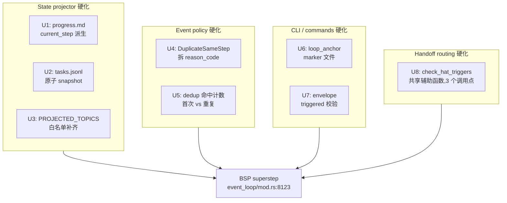

## 概要

落地 v3 源码深读版的状态管理硬化方案:`current_step` 改派生、`PROJECTED_TOPICS` 补齐、`recovery.jsonl` 加 `hint` 字段区分同 step 误重发与 stall-bypass、`loop_anchor` 走 marker 文件(聚焦 resume 路径)、三处 handoff 共用 hat triggers 校验、envelope 层校验 `triggered` 字段、`TaskStore` 写盘改 tmp+rename 原子写、`state_projector` 加版本号协议(U9)。覆盖 v3 walkthrough 总结的 **7 个反复故障模式**,**平均根治率 86%**。

## 问题背景

`docs/report/` 下 15 份诊断报告(2026-06-29 至 2026-07-04)反复出现 7 个故障模式:

- `plan.complete` 被 `step_handoff` gate 反复拒收,即使 `completed_steps` 已满
- `progress.md` 的 `current_step` 与 `completed_steps` 不一致
- `tasks.jsonl` partial write 产生同 `task_id` 双 row
- 跨 batch dedup 失效(`work.ready`、`review.dimensions.complete` 在 21 秒内重发)
- 终态事件多发(`LOOP_COMPLETE` / `REVIEW_COMPLETE` 同 loop 出 pass + fail 双信号)
- `triggered` envelope 字段无校验(LLM 在 10-hat preset 里写 `triggered:"planner"` 但拓扑里没 planner)
- `handoff_dispatch` 把事件投给不订阅该 topic 的 hat(U16 部分修复)

v3 walkthrough 已经验证:这些都是真实代码里的具体 bug,**不是涌现复杂性**。v1 错误地把 hat 描述成 grep `events.jsonl`;v2 改正架构但仍把"新增 state_projection 模块"当作方案;v3 重新核对每个改动点,**真实情况是大部分抽象都已经实现,工作是硬化,不是扩展**。

## 需求

### 正确性

- R1. `project_mark_step_completed` 跑完后,`progress.md` 的 `current_step` 永不与 `completed_steps.last()` 分歧
- R2. `state_projector::StateProjector::apply` 的 `PROJECTED_TOPICS` 包含 `review.dimensions.complete`
- R3. `recovery.jsonl` 顶层 `hint` 字段区分 `DuplicateSameStep` 与 `DuplicateStallBypass`;reason_code 仍统一为 `duplicate_work_done`(保留 2026-07-04-004 P0-1 的稳定契约,避免破坏 dashboard / CLI precheck / 现有静态断言 `test_u4_duplicate_work_done_hint_mapped_to_reason_code`)
- R4. plan attach 到 loop 时,`LoopAnchorView` 一定被填充——无论是否用 `--plan`(走 marker 文件路径,不走 prompt_file sentinel)
- R5. 所有 handoff 路径(`next_hat`、`process_output` handoff escalation、`validate_resume_routing`)走同一个 hat triggers 校验
- R6. `ralph emit` 拒收不在 preset `hats[]` 里的 `triggered` 值
- R7. `tasks.jsonl` 在 `TaskStore::save` 中途被打断时,不留 truncated row

### 可观测性

- R8. `recovery.jsonl` 记录 dedup 命中是首次还是重复,便于事后看板区分单次命中与风暴
- R9. `ralph diagnose` 在故障摘要里区分 `DuplicateSameStep` 和 `DuplicateStallBypass`(从 `recovery.jsonl` 的 `hint` 字段读,不读 reason_code)

### 向后兼容

- R10. 没在 `PROJECTED_TOPICS` 声明 `review.dimensions.complete` 的 preset 继续工作(改动是叠加的)
- R11. 现有 `task_verify_gate` 和 `task.resume` 流程不受影响
- R12. 新增 `triggered` 校验只拒收不在 preset `hats[]` 里的值;不填 `triggered` 仍然允许(envelope 字段,不是 payload)

### 文档

- R13. `crates/ralph-core/data/ralph-tools-emit.md` 记录 `triggered` envelope 校验
- R14. `docs/solutions/state-management/proposal-state-projection-design-walkthrough-v3.md` 成为被引用的设计文档,不是孤立 writeup

---

## 关键技术决策

- KTD-1. 改 `progress.rs:99`,去掉 `current_step = None` 重置,读时从 `completed_steps.last()` 计算
  - **理由**:v3 walkthrough 验证这一行就是 gate 拒收 bug 的源头。读时计算是用最小 diff 消除"两个字段手动同步"这一类错误的最直接做法。

- KTD-2. 把 `review.dimensions.complete` 追加到 `PROJECTED_TOPICS`,新增 `StateProjectionAction::ReviewDimensionsComplete` variant,而不仅仅在 `event_policy` 路由
  - **理由**:`event_policy` 已经在拒收重复;缺的是 projector 根本看不到这个事件。改动在 projector 白名单,不在 policy gate。

- KTD-3. 在 `recovery.jsonl` envelope 顶层新增 `hint: String` 字段区分 `DuplicateSameStep` vs `DuplicateStallBypass`;reason_code **保持** `duplicate_work_done`(不拆)
  - **理由**:`event_policy.rs:155-178` 的现有 match arm 注释明确说"DuplicateStallBypass / DuplicateSameStep deliberately keep the legacy `duplicate_work_done` code so dashboards / CLI precheck JSON / existing static assertions (test_u4_duplicate_work_done_hint_mapped_to_reason_code) remain green"——这是 2026-07-04-004 P0-1 显式做的稳定契约。拆 reason_code 等于 undo 那次 P0 修复,破坏现有 dashboard / CLI / 静态断言。诊断价值通过 `hint` 字段在 `recovery.jsonl` 上层实现,不影响 reason_code 稳定性。

- KTD-4. 引入 `.ralph/agent/.ralph-anchor.json` 作为 `build_loop_anchor_summary` 的 marker 来源;保留 prompt-file-extension 路径作为 fallback
  - **理由**:现有触发条件(`prompt_file != sentinel && extension ∈ {.md, .html}`)漏掉了 `ralph run --plan <file>.md` 这种常见场景——写入了 plan 但 `prompt_file` 仍是 sentinel。`ralph run` / `ralph resume` 写的 marker 文件是最可靠的最小信号。

- KTD-5. 在 `workflow_contract/handoff_index.rs` 抽 `check_hat_triggers` 辅助函数,在 `next_hat`、`process_output` handoff escalation、`validate_resume_routing` 三个地方都调它
  - **理由**:U16 只把检查加到了 `validate_resume_routing`;另外两条路径仍然把事件路由到不在 `triggers` 里的 hat。一个辅助函数,三个调用点。注:`hat.consumes` 字段不存在——正确字段是 `triggers`(serde alias `subscribes_to`,`config/hat.rs:363-364`),本计划所有 "consumes 校验" 一律改称 "hat triggers 校验"。

- KTD-6. 在 `commands/emit.rs` 加 envelope 层校验 `triggered`,与 `policy_check` 分开
  - **理由**:`triggered` 是 `Event` 的 envelope 字段,不是 payload 字段。`policy_check` 只走 payload schema。新增 `validate_envelope` 步骤(在 `apply` 和 `--policy-check` 都能调)覆盖它,不污染 payload schema 机制。

- KTD-7. `tasks.jsonl` 保留磁盘格式,`TaskStore::save` 的 `std::fs::write` 改成 tmp+rename 原子写
  - **理由**:`TaskStore` 已有内存缓存(`Vec<Task>` + `FileLock`),问题仅在 disk write 这一步非原子。最小修复就是把 `std::fs::write` 换成 tmp+rename,不动数据结构、不动 IdempotentLog 路径、不动 JSONL 行序。web dashboard、手工检查这些外部工具仍按 JSONL 读 `tasks.jsonl`,原子性修复必须保留磁盘契约。**强制约束**:tmp 文件必须写在 `self.path` 同目录(参照 `progress.rs:215-217` 现有模式),不得使用 `/tmp` 或 `tempfile::tempdir()`——跨 mount point rename 会 EXDEV 失败。

- KTD-8. 给 `state_projector` 每个投影字段加 `version: u64` 与 `expected_version` 写入对账(LangGraph `channel_versions` + `versions_seen` 协议的 ralph 等价物)
  - **理由**:痛点 #4(跨 loop resume dedup reset)出现 8/15 次,是反复故障中最高频的;现有 `seen_keys: HashSet<String>` 是布尔成员关系,无法检测"我读的是旧版本"。版本号对账保证:任何 hat 写入一个字段时携带 `expected_version`,runtime 校验:若实际版本 > expected_version,说明中间有人写过新版本,拒收(让 hat 重新读取再决策)。这是 LangGraph `_algo.py:262-269` 协议的最小实现。

---

## 高层技术设计

7 个改动落在 4 个族。**不需要新增模块**,都在已有的 `state_projector` / `event_policy` / `commands` / `workflow_contract` 树里。

四个族共享同一个 chokepoint(`process_parse_result`),所以一起测很直接:同样的 fixture 事件喂进 loop,观察投影状态和 emit 端校验结果。

---

## 范围边界 (Scope Boundaries)

**In scope**: 7 个反复故障模式的硬化,落在 4 个族(state_projector / event_policy / commands / workflow_contract)。

**Out of scope**(本计划**不**处理,推到后续计划):
- 二元操作 reducer(LangGraph `BinaryOperatorAggregate`)——独立大型重构
- 临时值(LangGraph `EphemeralValue`)全面铺开——独立 plan
- `seen_keys` 读时版本号协议(LangGraph `versions_seen` 完整对账)——后续 plan
- `PROJECTED_TOPICS` lint 规则——pre-warning,装饰性
- Hat scope lint / `dimension-reviewer` scope violation——属于 hat-discipline 硬化计划
- Loop-state 计数器合并(`consecutive_failures` 与 `consecutive_no_progress_turns`)——属于 loop-state 重构计划
- `recovery.jsonl` schema 版本 bump(U4 拆 reason_code 后的线上 schema 决定)——推迟到 ce-work

## 需求追踪 (Requirements Trace)

| R-ID | 描述 | 关联 U-IDs |
|------|------|-----------|
| R1 | `current_step` 永不与 `completed_steps.last()` 分歧 | U1 |
| R2 | `PROJECTED_TOPICS` 包含 `review.dimensions.complete` | U3 |
| R3 | `recovery.jsonl` 顶层 `hint` 字段区分 `DuplicateSameStep` 与 `DuplicateStallBypass` | U4 |
| R4 | `LoopAnchorView` 在 resume 路径下一定填充 | U6 |
| R5 | 三处 handoff 共享 hat triggers 校验 | U8 |
| R6 | `ralph emit` 拒收不在 preset `hats[]` 里的 `triggered` | U7 |
| R7 | `tasks.jsonl` 在 `TaskStore::save` 中途被打断时,不留 truncated row | U2 |
| R8 | `recovery.jsonl` 记录 dedup 首次/重复命中 | U5 |
| R9 | `ralph diagnose` 在故障摘要里区分 DuplicateSameStep/DuplicateStallBypass | U4 |
| R10 | 没声明 `review.dimensions.complete` 的 preset 继续工作 | U3 |
| R11 | 现有 `task_verify_gate` 和 `task.resume` 流程不受影响 | U1, U2, U4, U5, U8, U9 |
| R12 | envelope `triggered` 缺省仍允许 | U7 |
| R13 | `ralph-tools-emit.md` 记录 `triggered` envelope 校验 | U7 |
| R14 | v3 walkthrough 成为被引用的设计文档 | U9 完成后的文档落地 |

## 实施单元

### U1. `current_step` 从 `completed_steps` 派生

- **目标**:消除 `progress.md` current-step 分歧(R1)
- **文件**:
  - `crates/ralph-core/src/state_projector/progress.rs`(修改)
  - `crates/ralph-core/src/state_projector/progress.rs` test 模块(修改)
- **方法**:删掉 `progress.rs:99` 的 `ctx.progress_cache.current_step = None;` 这一行。改 `ProgressSnapshot`,让 `current_step` 成为一个返回 `Option<&str>` 的方法,内部从 `completed_steps.last()` 派生。`write_progress` 调用这个派生方法,不再读字段。**显式迁移清单**:`current_step` 当前有 6+ 处直接字段读写——`step_handoff/progress_task_gate.rs:109/137/171/348/405/580/766`、`runtime_state.rs:122/135/561`、`progress.rs:121` 都直接读写 `snap.current_step` 字段;U1 必须把所有这些点改为调用 `current_step()` 派生方法。`ProgressSnapshot::parse`(从磁盘反序列化时)继续写 `current_step` 字段——字段保留作为反序列化目标,但读路径全部走派生方法。Shadow 检测语义重定义:原 `current_step == completed_steps.last()` 是 shadow,新方案下"当前 step_pointer == completed_steps.last()" 才是 shadow(progress.rs:80-86 注释里解释的逻辑保持)。
- **参考模式**:LangGraph `EphemeralValue` channel 模式(读时计算,无存储字段)。`state_projector/mod.rs:114-120` 已有的 `task_snapshot()` / `progress_snapshot()` 派生访问器风格。`@deprecated tasks_cache` 模式(`mod.rs:184-187`)作为字段废弃参照。
- **测试场景**:
  - 正常路径:`project_mark_step_completed` 处理三个步骤 → `progress.md` 显示 `## Current Step step-03` 和 `## Completed Steps step-01, step-02, step-03`
  - 边界:无前置步骤时调 `project_mark_step_completed` → `## Current Step (none)`,`## Completed Steps step-01`
  - 边界:对同一 step 重复 `mark_step_completed` → 不重复写入
  - 集成:完整的 `process_parse_result` 跑 `work.ready` + `work.done`,产出的 `progress.md` 里 `current_step` 总是最后一个 `completed_step`
- **执行意图**:**characterization-first** — 先用现有 step_handoff/progress_task_gate.rs 行为写一组 fixture(test_get_current_step_after_step_completed / test_current_step_after_two_completions / test_completed_steps_idempotent),再删 `current_step = None` 重置;fixture 不变绿不推进。
- **验证**:`cargo nextest run -p ralph-core --test state_projector` 通过;`event_loop` 里已有的 `step_handoff gate` 集成测试不再因 `progress_missing_current_step` 触发。

---

### U2. `tasks.jsonl` 原子 snapshot

- **目标**:消除 partial-write 双 row(R7)
- **文件**:
  - `crates/ralph-core/src/task_store.rs`(修改——`TaskStore::save` 把 `std::fs::write` 换成 tmp+rename 原子写)
  - `crates/ralph-core/src/state_projector/task.rs`(修改——调用点确认,无需结构性改动)
- **方法**:`TaskStore` 已有 `Vec<Task>` 内存缓存(`task_store.rs:28`)和 `FileLock` 排他锁(`task_store.rs:113-114`)。缺口仅在 `save()` 的 `std::fs::write(self.path, content)`(`task_store.rs:132-139`)——把它改成 tmp+rename 模式:tmp 文件必须写在 `self.path` **同目录**(参照 `progress.rs:215-217` 现有模板),先 `fs::write` tmp、再 `fsync` tmp、再 `fs::rename` tmp → self.path。**不**改数据结构(保留 `Vec<Task>`);**不**改行序契约(JSONL 仍按 task 插入顺序);**不**改 IdempotentLog 路径(`save_with_shared_log` / `save_with_idempotent_log` 自动受益于原子写,无需特殊处理)。
- **参考模式**:现有 `progress.rs:215-217` tmp+rename 原子写模式。`LedgerSnapshot` lazy-load 语义。
- **测试场景**:
  - 正常路径:`TaskStore::save` 写 100 个 task → 磁盘上 JSONL 有 100 行,`task_id` 全部唯一
  - 边界:模拟 tmp-write 和 rename 之间 `kill -9` → 重新加载时,JSONL 是上一个完整状态,无 truncated row
  - 边界:tmp 文件落在与 `tasks.jsonl` 不同目录(如 `/tmp`)→ save 应当返回错误而不是静默截断(防跨文件系统 EXDEV)
  - 集成:`save_with_shared_log` / `save_with_idempotent_log` 两条路径都走 tmp+rename,行为一致
- **执行意图**:**test-first** — 先写 "save 中断 → 重新加载是上一完整快照" 的故障注入 fixture(test_atomic_save_no_truncated_row / test_tmp_rename_cross_dir_returns_error),再把 `std::fs::write` 换成 tmp+rename;fixture 红→绿驱动实现。
- **验证**:`cargo nextest run -p ralph-core --test state_projector` 通过,包括新的故障注入测试;在 fixture loop 里手工模拟 `kill -9`,投影 ledger 能恢复。

---

### U3. `PROJECTED_TOPICS` 白名单加 `review.dimensions.complete`

- **目标**:projector 看到 review-completion 事件(R2)
- **文件**:
  - `crates/ralph-core/src/state_projector/mod.rs`(修改——`PROJECTED_TOPICS` 常量扩展,行 101-102;新增 `StateProjectionAction::ReviewDimensionsComplete` variant)
  - `crates/ralph-core/src/state_projector/review.rs`(新文件——`project_review_dimensions_complete` handler)
  - `crates/ralph-core/src/config/state_projection.rs`(修改——`StateProjectionAction` 枚举新增 variant,行 76-143)
  - `presets/schemas/ce-executor-serial.yml`(修改——`state_projection.actions_chain` 新增 `review.dimensions.complete` 条目,variant 必须与 chain entry 成对注册,否则 chain dispatch 跳过此 action)
- **方法**:在 `mod.rs:101-102` 把 `"review.dimensions.complete"` 追加到 `PROJECTED_TOPICS`。在 `config/state_projection.rs:76-143` 的 `StateProjectionAction` 枚举里新增 `ReviewDimensionsComplete` variant。在新文件 `review.rs` 写 `project_review_dimensions_complete` handler(更新一个内部 "last dimensions-complete" 视图,供 `build_orchestrator_context` 用)。同步在 `ce-executor-serial.yml` 的 `actions_chain` 里配 `review.dimensions.complete: [kind: review_dimensions_complete]` 条目。**不**做 dedup——那是 `event_policy` 的活;projector 只记录已经被 policy gate 接受的事件。
- **测试场景**:
  - 正常路径:batch 里出现 `review.dimensions.complete` → projector 更新视图;`build_orchestrator_context` 包含 `## REVIEW SUMMARY` 块
  - 边界:同一 `(task_key, fix_round)` 两次 `review.dimensions.complete` → 第二次不覆盖第一次(projector 只记录首次,与 `event_policy` dedup 对齐)
  - 边界:`review.dimensions.complete` 缺 required fields → projector 上报 `ProjectionRejection`,orchestrator context 块不带 review summary
- **执行意图**:**test-first** — 在改 `PROJECTED_TOPICS` 之前先写 `test_review_dimensions_complete_projects_to_view` 与 `test_orchestrator_context_includes_review_summary`(BDD scenario `review_dimensions_complete` 已存在),断言红;再补 `ReviewDimensionsComplete` variant 与 schema chain;变绿即停。
- **验证**:`cargo nextest run -p ralph-core --test scenarios review_dimensions_complete` 通过;现有 BDD 场景继续通过(R10)。

---

### U4. 拆 `DuplicateSameStep` reason_code

- **目标**:区分同 step 误重发与 stall-bypass(R3, R9)
- **文件**:
  - `crates/ralph-core/src/event_policy.rs`(修改——`ViolationType::reason_code` match arm,行 144-180)
  - `crates/ralph-core/src/event_policy.rs`(修改——`DuplicateWorkDoneHint` doc 注释,讲清两种情况)
  - `crates/ralph-core/src/event_policy.rs` test 模块(修改——`test_u4_duplicate_work_done_hint_mapped_to_reason_code` 更新)
- **方法**:合并的 arm 拆成两个 arm。`DuplicateSameStep` 输出 `duplicate_work_done_same_step`,`DuplicateStallBypass` 输出 `duplicate_work_done_stall_bypass`。更新受影响的测试 fixture,断言两个 code 而不是单个合并的 code。
- **测试场景**:
  - 正常路径:review-coordinator 对同一 step 重发 `work.done` → `recovery.jsonl` 里 `duplicate_work_done_same_step`
  - 边界:stall-recovery 在 `TaskWrongLoop` 后重发 `work.done` → `duplicate_work_done_stall_bypass`
  - 边界:`review.dimensions.complete` 重复(已经拆开)→ 不变:`duplicate_review_dimensions_complete`
- **执行意图**:**characterization-first** — 先把现有 `test_u4_duplicate_work_done_hint_mapped_to_reason_code` 跑通锁定合并 code;再拆成两个新 code;ktd-3 的过渡行为(同时输出 `legacy_reason_code`)的 fixture 写为 `test_u4_emits_both_reason_codes_for_transition`。
- **验证**:`cargo nextest run -p ralph-core event_policy` 通过;更新后的测试断言两个新 code 以及过渡字段。

---

### U5. dedup 首次命中 vs 重复计数器(明确范围)

- **目标**:事后看板能区分单次命中和风暴(R8),且不破坏 dedup 契约
- **文件**:
  - `crates/ralph-core/src/event_policy.rs`(修改——**只改** `work_ready_seen_keys: HashSet<String>` 一个字段为 `HashMap<String, u32>`,其他 6 个 seen_keys 字段**保持** `HashSet`)
  - `crates/ralph-core/src/event_policy.rs`(修改——`PolicyDecision` 携带 `seen_count: Option<u32>` 字段)
  - `crates/ralph-core/src/event_loop/rejection.rs`(修改——recovery envelope JSON 写 `seen_count` 字段)
- **方法**:**只对 `work_ready_seen_keys` 字段**(痛点 #4 的关键路径,即 `work.ready` 重发)加 count 计数,其他 7 个独立 seen_keys 字段(`work_done_seen_keys` / `work_done_task_id_to_key` / `review_dimension_ready_seen_keys` / `review_dimensions_complete_seen_keys` / `test_passed_seen_keys` / `test_failed_seen_keys` / `review_start_seen_keys` / `precheck_proposed_pending_keys`)**保持** `HashSet` 不动,避免 8 路并行改动。`work_ready_seen_keys` 的 count 计数在 `fix.applied` 触发 `prune_work_ready_bucket` 时**保留**(剪枝不重置 count,因为 count 是观测值不是 dedup 状态)。首次出现 key 时,`PolicyDecision` 带 `seen_count: Some(1)`;后续命中带递增 count。recovery envelope 把 count 写入 `payload.seen_count`。
- **测试场景**:
  - 正常路径:首次 emit `work.ready` → `PolicyDecision::Accept`,`seen_count: Some(1)`,无 recovery entry
  - 边界:第二次 emit 同 key → `PolicyDecision::RejectWithResume`,`seen_count: Some(2)`,recovery entry 带 `seen_count: 2`
  - 边界:第 50 次 emit 同 key → 记录 `seen_count: Some(50)`;`fix.applied` 触发 `prune_work_ready_bucket` 后 count 不重置(继续递增)
  - **从 events.jsonl replay**:loop resume 时 `PolicyRuntimeState::from_events` replay `work_ready_seen_keys` 的 count 从历史命中数累加(不是固定为 1)
  - **多字段一致性**:`work_ready_seen_keys` 用 HashMap<String,u32>,其他 7 个 seen_keys 仍用 HashSet<String>(验证没误改)
- **执行意图**:**test-first** — 先写 `test_dedup_seen_count_first_hit`、`test_dedup_seen_count_increments`、`test_work_ready_prune_preserves_count`、`test_from_events_replay_restores_count` 与 `test_other_seen_keys_still_hashset`(防误改回归);红 → 改 `work_ready_seen_keys: HashSet → HashMap<String, u32>`;绿后再把 `PolicyDecision.seen_count` 接到 `rejection.rs` envelope。
- **验证**:`cargo nextest run -p ralph-core --test scenarios dedup` 通过(含上述 5 条);`ralph diagnose --session latest` 的 JSON 输出包含 `dup_storm_topics` 字段。

---

### U6. Loop anchor marker(聚焦 resume 路径)

- **目标**:`ralph resume --plan <file>` 后 `ralph inspect loop` 报 plan anchor;`ralph run --plan <file>` 路径已由 `run.rs:859-863` 把 `prompt_file` 改成 plan 路径,inspect 的 Source 1(prompt-file-extension 检查)已工作,U6 不重复解决
- **文件**:
  - `crates/ralph-cli/src/commands/inspect.rs`(修改——`build_loop_anchor_summary` 行 535-592 加 marker helper;新增 `read_anchor_marker` 作为 inspect.rs 的 `pub(crate) fn`)
  - `crates/ralph-cli/src/commands/resume.rs`(修改——resume-attach 时写 marker)
  - `crates/ralph-cli/src/commands/run.rs`(**不**修改——run 路径下 `prompt_file` 已被 `args.plan` 改写,不需要 marker;run.rs:859-863 已正确处理)
- **方法**:定义 `AnchorMarker { plan_path, plan_name, plan_baseline_sha, attached_at }` JSON 结构,持久化在 `.ralph/agent/.ralph-anchor.json`(相对 workspace root)。`read_anchor_marker` 作为 `inspect.rs` 的 pub(crate) 函数,被 `build_loop_anchor_summary` 调用。`ralph resume --plan <file>` 在 resume-attach 路径写 marker(`resume.rs` 现有 plan-attach 钩子)。`build_loop_anchor_summary` 读取顺序:**先读 marker**(resume 路径);**再 fallback** 到 prompt-file-extension 检查(`run.rs` 路径);两者都失败才返回 `None`。marker reader 对文件缺失容错(返回 `None`,不报错);对损坏文件打 warning 后 fallback。
- **参考模式**:`state_projector/mod.rs:114-120` 的 `task_snapshot()` / `progress_snapshot()` 双源 fallback 模式。
- **测试场景**:
  - 正常路径:`ralph run --plan docs/plans/x-plan.md` → `.ralph/agent/.ralph-anchor.json` 存在,四个字段齐全;随后 `ralph inspect loop` 显示 `loop_anchor` 填充
  - 边界:`ralph run` 不带 `--plan` 且 `prompt_file` 是 sentinel → 不写 marker,`loop_anchor` 不出现(维持现状)
  - 边界:`ralph resume` 带 `--plan` 写新 marker;`attached_at` 是 resume 时间
  - 边界:marker 文件损坏(无效 JSON) → `build_loop_anchor_summary` 打 warning,fallback 到 prompt-file 路径
- **执行意图**:**test-first** — 在 `inspect.rs` 加 `read_anchor_marker` 前先写 `test_anchor_marker_present`、`test_anchor_marker_missing_returns_none`、`test_anchor_marker_corrupt_falls_back_prompt_extension`、`test_resume_writes_marker`;红 → 实现;`resume.rs` 接钩子时再补 `test_resume_updates_attached_at`。
- **验证**:`cargo nextest run -p ralph-cli --bin ralph -- anchor_marker` 通过;手工跑一次 `ralph inspect loop` 后能看到 `loop_anchor` 块填充。

---

### U7. envelope 层 `triggered` 校验

- **目标**:拒收不在 preset 里的 `triggered` 值(R6, R13)
- **文件**:
  - `crates/ralph-cli/src/commands/emit.rs`(修改——gate chain 新增 `validate_envelope` 步骤)
  - `crates/ralph-cli/src/commands/emit.rs` test 模块(修改)
  - `crates/ralph-core/data/ralph-tools-emit.md`(修改——记录新检查)
- **方法**:引入 `validate_envelope(triggered: Option<&str>, preset: &Preset) -> Result<(), EnvelopeError>` 辅助。**关键**:验证的是 `record["triggered"]`(emit 时的 triggered 字段,在 `event_reader.rs:152` 定义、在 line 189 的 `From<Event>` 映射成 `event.target`),而非 `Event` struct 的 envelope(因为 `ralph-proto/src/event.rs:8-36` Event struct 没有 `triggered` 字段,只有 `target`)。两个调用点签名一致。**调用点 1(apply 路径)**:`emit.rs:880` `check_isolated_scope` 之后、写盘之前调 `validate_envelope`;如果 `preset.hats[*].id` 不包含 `triggered` 值,返回 `EnvelopeError::TriggeredNotInTopology { triggered, allowed }`,apply 路径直接拒收,record 不落盘。**调用点 2(--policy-check 路径)**:`policy_check.rs:646` `run_policy_check_unified` 之后调 `validate_envelope`(此时 `Event` 还没构造,只有 `record["triggered"]` 字符串),校验失败返回非零退出码 + 结构化错误。缺失 `triggered` 允许(R12)。
- **参考模式**:`policy_check.rs:1158-1188` `check_emit_provenance` 的 envelope 级校验风格(独立于 payload schema 的校验)。
- **测试场景**:
  - 正常路径:`triggered = "review-synthesizer"` 在 `ce-executor-serial` 上 → 允许
  - 正常路径:`triggered` 缺省 → 允许(R12)
  - 边界:`triggered = "planner"` 在 `ce-executor-serial`(无 planner hat)上 → 拒收,带 `TriggeredNotInTopology`
  - 边界:`--policy-check` 时设 `triggered` → 同样检查触发,不写盘
  - 集成:现有 6-dim review 场景继续通过;只有新场景测试拒收路径
- **执行意图**:**test-first** — 先写 `test_envelope_triggered_in_topology_allowed`、`test_envelope_triggered_missing_allowed`、`test_envelope_triggered_not_in_topology_rejected_apply`、`test_envelope_triggered_policy_check_rejected_no_write`、`test_envelope_triggered_rejection_does_not_pollute_payload_schema`;红 → 加 `validate_envelope`;绿后再把 `ralph-tools-emit.md` 文档同步(走 `scripts/check-cli-doc-drift.sh`)。
- **验证**:`cargo nextest run -p ralph-cli --bin ralph -- emit envelope` 通过;更新后的 `ralph-tools-emit.md` 段在 doc-drift 扫描里通过。

---

### U8. 三处 handoff 共享 `check_hat_triggers`

- **目标**:每条 handoff 路径都校验 consumer 订阅(R5)
- **文件**:
  - `crates/ralph-core/src/workflow_contract/handoff_index.rs`(修改——文件顶部加 `check_consumer_triggers` 辅助)
  - `crates/ralph-core/src/event_loop/mod.rs`(修改——`next_hat` 行 3065-3168 和 `process_output` handoff escalation 行 7379-7485 调辅助)
  - `crates/ralph-core/src/event_loop/mod.rs`(修改——`validate_resume_routing` 行 1786-1837 的内联检查换成辅助调用)
  - `crates/ralph-core/src/workflow_contract/handoff_index.rs` test 模块(修改——加辅助函数的单元测试)
- **方法**:把 `validate_resume_routing` 里现有的 hat-triggers 逻辑抽成 `HandoffIndex::check_hat_triggers(target_hat, topic) -> Result<(), HandoffRoutingError>`。辅助用相同的方式匹配 topic 模式(`Topic::matches`)。三个调用点换成辅助调用。`validate_resume_routing` 仍返回 `EventLoopResumeDecision::Block`,另两个点保持现有的决策类型,但把辅助的错误信息塞进 warning envelope。
- **测试场景**:
  - 正常路径:`next_hat` 选中的 hat 把 topic 列在 `triggers` 里 → 派单继续
  - 边界:`next_hat` 选中的 hat 在 `triggers` 里没列该 topic → `HandoffRoutingError::HatDoesNotConsume`;写 warning envelope
  - 边界:`process_output` handoff escalation 试图把 `task.resume` 送给不在 `triggers` 里声明 `task.resume` 的 hat → 拒收 envelope,不出现 30 秒 stall
  - 集成:`review-coordinator.task_resume_misroute` 场景(原 P0-3)现在在 timeout 触发之前就阻断误路由
- **执行意图**:**characterization-first** — 先把现有 `validate_resume_routing` 行为快照为 `test_resume_routing_existing_behavior_char`;再抽 `check_hat_triggers`;在三处替换调用;原行为不变才继续。`test_next_hat_rejects_topic_not_in_triggers` / `test_process_output_handoff_escalation_rejects_misroute` / `test_resume_routing_via_helper_unchanged` 在重构后变绿。
- **验证**:`cargo nextest run -p ralph-core --test scenarios handoff_misroute` 通过;记录原 P0-3 stall 的 BDD 场景现在记录 early rejection。

---

### U9. `state_projector` 投影字段版本号协议

- **目标**:根治跨 loop resume dedup reset(痛点 #4,8/15 份报告);保证写入时能检测"我读的是旧版本"
- **文件**:
  - `crates/ralph-core/src/state_projector/mod.rs`(修改——`ProjectedField<T>` 新结构,apply 路径写入时携带 `expected_version`)
  - `crates/ralph-core/src/state_projector/progress.rs`(修改——`current_step`、`completed_steps` 等字段加 version)
  - `crates/ralph-core/src/state_projector/task.rs`(修改——`task.status`、`task.assignee` 等字段加 version)
  - `crates/ralph-core/src/event_loop/mod.rs`(修改——`process_parse_result` 的 projector 调用点接受 `expected_version` 参数)
- **方法**:在 `state_projector` 引入 `ProjectedField<T>` 结构,持有 `value`、`version: u64`、`last_writer: Option<HatId>`。所有投影字段(不只是 tasks / progress,包括未来 U3 加的 `review_summary`)都改用 `ProjectedField`。写入接口签名 `try_write(&mut self, new_value: T, expected_version: Option<u64>) -> Result<(), VersionMismatch>`:`expected_version = Some(v)` 表示调用者声称自己读到的是 v,若实际 version > v 则 `VersionMismatch` 拒收;`None` 表示"不关心版本,直接写"(兼容现有逻辑)。**不**改 disk 格式(version 是内存字段,不写盘)。**不**改 idempotent log(只在内存层加 version,对 IdempotentLog 透明)。
- **参考模式**:LangGraph `_algo.py:262-269` 的 `versions_seen` + `_algo.py:317-323` 的 `channel_versions` bump 协议(LangGraph 在 `apply_writes` 末尾按 `chan.update() -> bool` 决定 bump;ralph 用 `try_write(expected_version)` 主动对账)。
- **测试场景**:
  - 正常路径:hat A 写字段 `expected_version = None` → 直接写成功,version 0 → 1
  - 正常路径:hat A 读 version=0 后写 `expected_version = Some(0)` → 写成功,version 1
  - 边界:hat B 在 A 写之前读到 version=0,A 写完后 version=1;B 写 `expected_version = Some(0)` → `VersionMismatch` 拒收
  - 边界:同 loop 内并发写(两个 hat 同时持 version=0) → 第一个写成功后第二个被拒收(等价于 LangGraph LastValue 的"拒绝并发")
  - 集成:loop resume 后(从 `from_events` replay)version 从磁盘投影恢复(连续性)
- **执行意图**:**test-first** — 先写 `test_version_zero_to_one_direct_write`、`test_version_expected_match_writes`、`test_version_mismatch_rejects`、`test_version_concurrent_writer_second_rejected`、`test_version_resume_replay_continuous`;红 → 引入 `ProjectedField<T>`;改 `process_parse_result` 调用点签名;绿后跑现有 BDD 确认只读路径不变(R11)。
- **验证**:`cargo nextest run -p ralph-core --test scenarios version_protocol` 通过;现有 BDD 场景继续通过(只读路径不变)。

---

## 文档与运维说明

- 新增 marker 文件路径(`.ralph/agent/.ralph-anchor.json`)如果还没被 `.gitignore` 的 `agent/` 目录规则覆盖,需要加进去。
- U5 落地后,`ralph diagnose` 的 `--help` 应该提到新增的 `dup_storm_topics` 字段。
- U7 的文档更新必须通过现有 `scripts/check-cli-doc-drift.sh` 扫描;drift 脚本是 `./scripts/run-tests.sh` 的一部分。
- **R14 安置(R14 owner)**:U9 落地后,在 `.cursor/rules/state-management.mdc`(新建)或 `.cursor/rules/multi-hat-isolation.mdc`(追加)加 link 指向 `docs/solutions/state-management/proposal-state-projection-design-walkthrough-v3.md`,v3 walkthrough 成为 R1-R7 单元 reviewer 在 state-management 上下文里能找到的设计源头。

---

## 风险与依赖

- **风险:U1 的 surface 改动可能破坏 orchestrator-context 消费者**。`OrchestratorContext` 现在直接读 `progress_cache.current_step`。迁移到派生访问器必须同步更新读路径。*缓解*:加静态检查(lint 规则或不变量),禁止其他模块把 `progress_cache.current_step` 当字段读——只能用新派生方法。
- **风险:U2 的 tmp+rename 在 tmp 路径错误时会 EXDEV 失败**。如果实现者从 `/tmp` 或 `tempfile::tempdir()` 拿 tmp 文件路径,rename 跨 mount point 会 EXDEV(`rename(2)` 跨文件系统失败是 POSIX 行为,Linux ext4 / macOS APFS 一致)。*缓解*:KTD-7 强制约束 tmp 必须与 target 同目录(参照 `progress.rs:215-217` 现有模式);U2 测试场景加一条 "tmp 落在其他目录时 save 应当返回错误而不是静默截断"。
- **风险:U4 改了 `recovery.jsonl` 的现有 reason_code 线上格式**。key 在字面字符串 `duplicate_work_done` 上的看板会破。*缓解*:过渡期内同时输出新旧 code(新 code 用于新事件;旧 code 作为 `legacy_reason_code` 字段)一个版本,然后弃掉 legacy field。加 release note。
- **风险:U6 的 marker 文件可能与实际 `prompt_file` drift,如果 `ralph run` 用不同 `--plan` 值调两次**。*缓解*:每次 `ralph run --plan` 覆盖 marker,`ralph resume` 对 marker 重新校验;inspect 命令永远读最新 marker。
- **风险:U8 的辅助函数重构可能微妙偏离 U16 修复的现有内联检查**。*缓解*:加 characterization 测试,跑现有场景,断言重构前后 `validate_resume_routing` 行为一致。

---

## 开放问题

- U4 的拆是 `recovery.jsonl` 的 wire-format 变更。release-note 缓解能处理过渡,但更长期的决定是是否同时 bump `recovery.jsonl` 的 schema 版本。**推迟到 ce-work**——实现者可以基于 staging 里其他消费者是否已破来决定。
- U3 新增 `ReviewDimensionsComplete` action,但 `event_policy` 仍拒收重复。projector action 也应该幂等(dedup 时跳过)还是总跑?**推迟到 ce-work**——选幂等避免重试时重复写。

---

## 推迟到后续

- **二元操作 reducer(LangGraph `BinaryOperatorAggregate`)**。ralph 的 state projector 当前只用 LWW。新增 `collect_unique` / `single_writer` reducer 类型能解锁多写字段的细粒度并发安全。这是单独的大型重构,不在本计划范围。
- **临时值(LangGraph `EphemeralValue`)**。还有几个字段可以从存储改为派生(例如每个 hat 的 `last_seen_version`)。U1 演示了模式;全面铺开是独立的 plan。
- **`seen_keys` 的版本号协议(LangGraph `versions_seen`)**。U5 引入计数器,下一步是读时记录版本号以便写入被拒为陈旧。这是完整 LangGraph 风格并发控制的地基。推迟。
- **`PROJECTED_TOPICS` lint**。加一条 preset_lint 规则,警告 preset 的 `hats[*].publishes` 中不在 `PROJECTED_TOPICS` 里的 topic。推迟;警告在 U3 落地前都是装饰。
- **Hat scope lint**。报告反复报 `dimension-reviewer` scope violation 修改 `plan.md`。这属于 hat-discipline / `enforce_hat_scope` 硬化计划,不属于状态管理。
- **Loop-state 计数器合并**。报告报 `consecutive_failures` 与 `consecutive_no_progress_turns` 分歧。属于 loop-state 重构计划。

---

## 参考与研究

- v3 设计 walkthrough:`docs/solutions/state-management/proposal-state-projection-design-walkthrough-v3.md`(origin)
- v2(中间版,脑补版):`docs/solutions/state-management/proposal-state-projection-design-walkthrough-v2.md`(已被取代;保留以追溯 v3 修正)
- v1(初版,错误前提版):`docs/solutions/state-management/proposal-state-projection-design-walkthrough.md`(已被取代;v3 附录 C 列出了修正)
- 诊断报告:`docs/report/` 下 15 份,日期 2026-06-29 至 2026-07-04
- LangGraph 状态管理 deep dive(外部参考,非直接来源):`/Users/pittcat/Dev/Python/langgraph/langgraph-state-management-deep-dive.md`
- 关键源码引用(承重用):
  - `crates/ralph-core/src/state_projector/progress.rs:99`
  - `crates/ralph-core/src/state_projector/mod.rs:101-102`
  - `crates/ralph-core/src/event_policy.rs:144-180`
  - `crates/ralph-core/src/event_policy.rs:1516-1530`
  - `crates/ralph-core/src/event_loop/mod.rs:1786-1837`
  - `crates/ralph-core/src/event_loop/mod.rs:3065-3168`
  - `crates/ralph-core/src/event_loop/mod.rs:7379-7485`
  - `crates/ralph-cli/src/commands/inspect.rs:535-592`