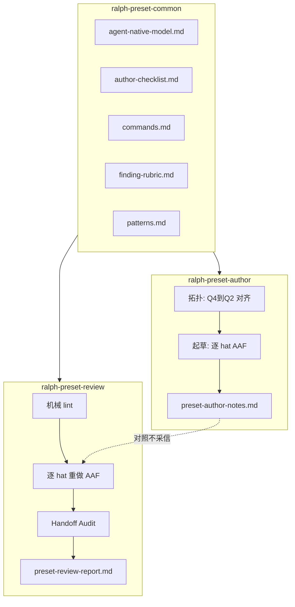

# feat: Ralph Preset Author & Review Skills

## Overview

在 `skills/` 下新增两个 operator skill（`ralph-preset-author`、`ralph-preset-review`）及共享 references 包（`ralph-preset-common`），以 **Agent 视角可行性（AAF）五问** 为脊柱，覆盖 preset 从拓扑设计、逐 hat 起草、机械 lint 门禁到结构化评审报告的全生命周期。技能为外部 harness 使用（同 `ralph-hats` / `ralph-loop`），不进入 `ralph tools skill` 运行时注入注册表。

## Problem Frame

Preset YAML 是作者视角单文件，但 isolated 模式下每个 hat activation 只见自己的 `instructions` 与 runtime 注入块。现有 `ralph-hats`（只管用户 hats）、`ralph preset check` / `preset_lint`（机械规则）、`docs/guide/preset-authoring.md`（人类文档）均无法强制 **per-hat 可执行性** 与 **Q4↔Q2 handoff 闭合** 审计。作者与评审常犯整文件视角谬误，导致 instructions 引用不可见 ledger、假设其它 hat 行为、或 handoff 字段未投影。(see origin: `docs/brainstorms/2026-07-05-ralph-preset-author-review-skills-requirements.md`)

## Requirements Trace

- **R0–R2**：两 skill 共享 Agent-Native 公理（禁止整文件视角、Per-Hat Activation 模拟、状态传递审计）
- **R3–R5**：author 起草 + AAF 表 → review 独立重做 AAF + 报告 handoff
- **R6–R7**：支持 local preset（`.ralph/hats/`）与 builtin（`presets/en/` + `presets/schemas/`）；与 `ralph-hats` 边界清晰
- **R8–R14**：author 双阶段大脑、AAF 五问表、`preset-author-notes.md`、builtin 7 点同步提醒
- **R15–R22**：review 机械门禁、`preset-review-report.md`、finding schema、confidence ≥ 60 入表、固定报告章节
- **R23–R28**：共享 references 五文件 + skill 目录布局
- **R29–R31**：非目标——默认不全量测试、不新增 Rust lint、不评 live loop UX
- **Success Criteria**：isolated Q2 缺口 → P0；每 hat 独立 AAF 表；不存在 CLI → P0 Q3；用户仅凭报告可改 preset

## Scope Boundaries

- 不实现新 `preset_lint` Rust 规则（U13 per-hat instructions lint 后续下沉）
- 不在 skill 内嵌完整 builtin preset 库
- 不默认跑 `./scripts/run-tests.sh` 全量或 BDD scenarios（review skill 文档中标注「合入前升级」路径）
- Coordinator 模式评审深度可低于 isolated，但须在报告 Executive Summary 标注模式差异

### Deferred to Separate Tasks

- **运行时 sample prompt 导出 API**：若未来 `ralph debug prompt` 类命令落地，review skill 可增加 confidence ≥ 85 的验证步骤；v1 用 `ralph hats show` + 源码测试引用代替
- **`finding_id` 机器可读 JSON 生成器**：v1 手写 `finding-rubric.md`；若 drift 频繁再考虑从 `finding_id.rs` 生成

## Context & Research

### Relevant Code and Patterns

| 资产 | 路径 | 用途 |
|------|------|------|
| Skill 结构范本 | `skills/ralph-hats/`、`skills/ralph-loop/` | SKILL.md + `references/` + `agents/openai.yaml` |
| Marketplace SSOT | `.claude-plugin/marketplace.json` | 注册 `./skills/*` |
| Claude 本地发现 | `.claude/skills/` | symlink 到 `skills/`（先例：`ralph-tools`） |
| preset check CLI | `crates/ralph-cli/src/commands/preset.rs` | `ralph preset check --strict --format json` |
| preset_lint finding IDs | `crates/ralph-core/src/preset_lint/finding_id.rs` | rubric 映射数据源 |
| OPAC instructions lint | `crates/ralph-core/src/preset_lint/instructions_opac.rs` | AAF Q3 硬绑定 |
| Isolated prompt 证明 | `crates/ralph-core/src/event_loop/tests/payload_types.rs` | 仅含 target hat instructions |
| 运行时 skill 文档（引用不复述） | `crates/ralph-core/data/ralph-tools*.md` | Q3 白名单 SSOT |
| 人类 preset 指南 | `docs/guide/preset-authoring.md`、`docs/handbook/serial-preset-development.md` | author references 素材 |
| OPAC 指南 | `docs/guide/opac.md` | 与 `ralph-tools-opac.md` 同源 |

### Institutional Learnings

- **WAC 接入顺序**（`docs/solutions/developer-experience/wac-rollout-tiered-gates-2026-06-12.md`）：先修拓扑再信 lint 计数
- **Schema SSOT**（`docs/handbook/serial-preset-development.md`）：`presets/schemas/<name>.yml` 为协议单一事实源；禁止在 instructions 复述 `required_fields`
- **状态传递**（`docs/solutions/state-management/proposal-state-projection-design-walkthrough-v3.md`）：emit → projection → task/progress → Observe；禁止读 ledger
- **Skill 文档漂移**（`docs/achieved/plan/2026-06-28-001-feat-ralph-core-data-agent-guide-refresh-plan.md`）：命令引用须对齐 CLI `--help`；行号引用用 `sed` 复核

### External References

- 无额外外部研究——仓库内 `ralph-hats` 与 brainstorm 已足够

## Key Technical Decisions

| 决策 | 理由 |
|------|------|
| **Canonical 路径在 `skills/`，非 `crates/ralph-core/data/`** | operator skill 与 loop 注入 skill 职责分离 (R28) |
| **共享 references 实体在 `ralph-preset-common/references/`，author/review 用 symlink** | 避免 R23–R27 双份漂移；与 `ralph-tools` symlink 先例一致 |
| **`finding-rubric.md` v1 手写 curated 表** | `finding_id.rs` 有 50+ ID；优先覆盖 OPAC/handoff/visibility/multi_hat；全量 JSON 推迟 |
| **Review 报告默认 `.ralph/reviews/`** | `.ralph/` 已 gitignore；本地产物不污染 PR |
| **Author notes 默认与 preset 同目录** | builtin 场景可提交；local preset 在 `.ralph/hats/` 则被 ignore（符合预期） |
| **confidence 入表门槛 60** | 用户已锁定 (origin) |
| **v1 不实现 prompt dump** | `ralph hats show` 提供 hat 配置；完整 isolated prompt 栈无稳定 CLI；用测试名作 evidence |

## Open Questions

### Resolved During Planning

- **共享 references symlink vs duplicate？** → symlink（author/review → `../ralph-preset-common/references`）
- **`preset-review-report.md` 是否纳入 git？** → 否，默认 `.ralph/reviews/`；skill 文档允许可选「与 tracked preset 同目录」供 PR review 会话
- **Sample prompt 验证步骤？** → v1 可选：`ralph hats show <hat>`；完整 prompt 导出 deferred
- **`finding_id` JSON？** → v1 手写 rubric；deferred 自动生成

### Deferred to Implementation

- symlink 在 Windows checkout 上是否需 duplicate fallback（若 CI/贡献者环境无 symlink 支持，README 注明 `ln -s` 或 duplicate 维护流程）
- `finding-rubric.md` 首批收录哪些 `finding_id`（implementer 从 `instructions_opac`、`multi_hat`、`workflow_activation`、`state_projection` 段优先抽取）

## Output Structure

```
skills/
├── ralph-preset-common/
│   └── references/
│       ├── agent-native-model.md
│       ├── author-checklist.md
│       ├── commands.md
│       ├── finding-rubric.md
│       └── patterns.md
├── ralph-preset-author/
│   ├── SKILL.md
│   ├── references -> ../ralph-preset-common/references
│   └── agents/openai.yaml
└── ralph-preset-review/
    ├── SKILL.md
    ├── references -> ../ralph-preset-common/references
    └── agents/openai.yaml

.claude/skills/
├── ralph-preset-author -> ../../skills/ralph-preset-author
└── ralph-preset-review  -> ../../skills/ralph-preset-review
```

## High-Level Technical Design

> *This illustrates the intended approach and is directional guidance for review, not implementation specification. The implementing agent should treat it as context, not code to reproduce.*



**AAF 五问**（每 hat 必填）贯穿 author 起草与 review 验收；**handoff 边**在拓扑层对齐 `上游 Q4 emit 字段` ↔ `下游 Q2 Observe 命令/字段`。

## Implementation Units

- [ ] **Unit 1: 共享 references（ralph-preset-common）**

**Goal:** 建立 author/review 共用的五份 reference 文档，作为 AAF 与验证命令的 SSOT。

**Requirements:** R23–R27, R0–R2

**Dependencies:** None

**Files:**
- Create: `skills/ralph-preset-common/references/agent-native-model.md`
- Create: `skills/ralph-preset-common/references/author-checklist.md`
- Create: `skills/ralph-preset-common/references/commands.md`
- Create: `skills/ralph-preset-common/references/finding-rubric.md`
- Create: `skills/ralph-preset-common/references/patterns.md`

**Approach:**
- `agent-native-model.md`：AAF 五问详解、isolated prompt 栈（`## HAT IDENTITY` → skills 注入顺序）、Q3 CLI 白名单（指向 `crates/ralph-core/data/ralph-tools*.md` 章节名，不复述参数表）、Q4↔Q5 与 `state_projection`、禁止读 ledger 清单
- `author-checklist.md`：双阶段大脑 checklist + AAF 五问表 markdown 模板（R10）+ 交 review 前门禁（R12）+ builtin 7 点同步清单摘要（链到 `docs/handbook/serial-preset-development.md`）
- `commands.md`：`ralph preset check`、`ralph emit --schema`、`ralph hats validate/show`、`cargo nextest run` 子集；local vs builtin 路径写法（`-H presets/en/foo.yml` vs `-H builtin:foo`）
- `finding-rubric.md`：表格列 `finding_id` | default_severity | default_confidence | aaf_question | category；首批 ≥25 条，覆盖 `instructions_opac`、`multi_hat_requires_isolated`、`handoff`/`WAC`、`state_projection` 相关 ID（对照 `finding_id.rs`）
- `patterns.md`：仅从拓扑阶段引用——`debug` / `ce-executor-serial` 事件流简图；注明「起草阶段不得抄拓扑句进 instructions」

**Patterns to follow:**
- `skills/ralph-hats/references/commands.md`（命令下沉、正文引用）
- `docs/brainstorms/2026-07-05-ralph-preset-author-review-skills-requirements.md`（AAF 表、finding schema、报告章节）

**Test scenarios:**
- Test expectation: none — 纯文档；验收靠 Unit 6 人工场景与 `scripts/check-cli-doc-drift.sh` 对 `commands.md` 中列出的命令做冒烟

**Verification:**
- 五文件互链一致；`commands.md` 中每条命令经 `ralph <cmd> --help` 可执行
- `finding-rubric.md` 中每个 `finding_id` 在 `finding_id.rs` 中存在

---

- [ ] **Unit 2: ralph-preset-author skill**

**Goal:** 实现 preset 起草 skill，强制双阶段大脑与每 hat AAF 五问表产出。

**Requirements:** R3, R6–R14, R28

**Dependencies:** Unit 1

**Files:**
- Create: `skills/ralph-preset-author/SKILL.md`
- Create: `skills/ralph-preset-author/agents/openai.yaml`
- Create: `skills/ralph-preset-author/references` → symlink to `../ralph-preset-common/references`

**Approach:**
- Frontmatter：`name: ralph-preset-author`，description 含 when-to-use（builtin/local preset、改 `presets/schemas`、AAF 起草）
- 正文结构镜像 `skills/ralph-hats/SKILL.md`：`Use For` / `Core Assumptions`（与 `ralph-hats` 边界：本 skill 管 preset 全链含 builtin）/ `Workflow` / `Guardrails` / `Output Expectations` / `Read These References`
- Workflow 强制顺序：
  1. 判定路径（local vs builtin）与 `execution_mode`
  2. **拓扑阶段**：读 schema SSOT、画事件流、对齐 Q4↔Q2（可读 `references/patterns.md`）
  3. **起草阶段**：逐 hat 切换 agent 视角，只写该 hat `instructions`
  4. 每 hat 填写 AAF 五问表 → 汇总 `preset-author-notes.md`
  5. 交 review 前门禁：表无「待定/同上」；自问 Q1 可完成性
  6. 建议调用 `ralph-preset-review`（不替代机械 lint）
- Guardrails：引用 `ralph-tools-opac` / `ralph-tools-tasks` / `ralph-tools-emit` 章节；emitter 强制 `--policy-check`；禁止拓扑句式；builtin 改动触发 7 点同步提醒（不自动执行，列清单）
- Output：`preset YAML` + `preset-author-notes.md`（与 preset 同目录，或用户指定）

**Patterns to follow:**
- `skills/ralph-hats/SKILL.md`
- `CLAUDE.md` HARD RULE 4（guardrails 摘要 + 指向 references）

**Test scenarios:**
- **Happy path:** 对 `presets/en/debug.yml`（或等效小 preset）模拟起草一轮 → 产出含 3+ hat 的 `preset-author-notes.md`，每 hat 五问齐全
- **Edge case:** 4+ hat 草稿未设 `execution_mode: isolated` → author workflow 在拓扑阶段拦截并提示
- **Error path:** 用户要求「把 reviewer 会通过写进 executor instructions」→ guardrails 拒绝并改写为 Q2 Observe 命令
- **Integration:** author 完成后显式 handoff 文案指向 `ralph-preset-review` 与 `preset-author-notes.md` 路径

**Verification:**
- SKILL.md 全文无复述 `ralph-tools*.md` 长参数表
- `openai.yaml` 含 `default_prompt: "Use $ralph-preset-author to ..."`

---

- [ ] **Unit 3: ralph-preset-review skill**

**Goal:** 实现 preset 评审 skill，独立重做 AAF、跑机械 lint、输出结构化 `preset-review-report.md`。

**Requirements:** R4–R5, R15–R22, R28

**Dependencies:** Unit 1

**Files:**
- Create: `skills/ralph-preset-review/SKILL.md`
- Create: `skills/ralph-preset-review/agents/openai.yaml`
- Create: `skills/ralph-preset-review/references` → symlink to `../ralph-preset-common/references`

**Approach:**
- Workflow 强制顺序（R16）：
  1. 读取 preset + 可选 `preset-author-notes.md`（对照用，不采信）
  2. 判定 `execution_mode` + hat 数
  3. 拓扑简图（事件流，非 prompt 流）
  4. **逐 hat**：声明「模拟 hat X activation」→ 填 AAF 五问 → 对照 instructions
  5. Handoff Audit 表：A.Q4 ↔ B.Q2 | fields | projection | finding id
  6. 机械 lint（`references/commands.md`）
  7. confidence 校准（R20）：lint Error→95, Warn→85；软性起点 ≤50；<60 舍弃或进 Unverified Suspicions（最多 2 轮重查）
  8. 写 `preset-review-report.md`（R21 八章节）
- Finding 记录遵循 R19 schema；P0/P1 映射遵循 `references/finding-rubric.md` 与 AAF 缺口规则（R17）
- 报告路径：默认 `.ralph/reviews/<preset-basename>-<YYYY-MM-DD>.md`；若用户要 PR 可审阅副本，允许 `<preset-dir>/preset-review-report.md`
- 自身纪律（R22）：每条 finding `evidence` 标注 hat-X 视角 vs 拓扑视角

**Patterns to follow:**
- `skills/ralph-loop/SKILL.md`（运维式命令门禁）
- brainstorm Finding 示例行（R21 §8）

**Test scenarios:**
- **Happy path:** 对干净 builtin preset 跑 review → 机械 lint 通过；报告含 Executive Summary + 空或仅 P2 Findings Table
- **Happy path:** 注入已知缺陷 fixture（见 Unit 6）→ 报告含 P0 finding，`confidence ≥ 60`，`aaf_question` 填 Q2/Q3
- **Edge case:** author notes 与 review AAF 答案不一致 → 额外 finding（visibility/feasibility）
- **Edge case:** 软性怀疑 confidence 55 → 不进入 Findings Table；重查后仍 <60 → 仅出现在 Unverified Suspicions
- **Integration:** `ralph preset check --strict --format json` 失败 → lint finding 默认 confidence 95 入表
- **Error path:** 用户只要聊天总结 → skill 拒绝， insist 写 `preset-review-report.md`

**Verification:**
- 报告模板八章节齐全
- 至少一条手工验收用例产生可操作的 Remediation Plan

---

- [ ] **Unit 4: Marketplace 与本地发现接线**

**Goal:** 使新 skills 可通过 marketplace 与 Claude Code 本地发现安装。

**Requirements:** R28

**Dependencies:** Unit 2, Unit 3

**Files:**
- Modify: `.claude-plugin/marketplace.json`
- Modify: `skills/README.md`
- Create: `.claude/skills/ralph-preset-author` → symlink
- Create: `.claude/skills/ralph-preset-review` → symlink

**Approach:**
- `marketplace.json` 的 `skills` 数组加入 `./skills/ralph-preset-author`、`./skills/ralph-preset-review`（`ralph-preset-common` 不作为独立 marketplace skill 列出，仅作依赖目录）
- `skills/README.md`：更新技能列表、安装示例（`npx skills add ... --skill ralph-preset-author --skill ralph-preset-review`）
- `.claude/skills/` symlink 与 `ralph-tools` 先例一致

**Patterns to follow:**
- `.claude-plugin/marketplace.json` 现有 `ralph-hats` / `ralph-loop` 条目

**Test scenarios:**
- Test expectation: none — 配置接线；验收为 `ls -la .claude/skills/ralph-preset-author` 解析到 `skills/ralph-preset-author/SKILL.md`

**Verification:**
- `skills/README.md` 列出三个目录职责（common 内部、author、review）
- marketplace JSON 语法有效

---

- [ ] **Unit 5: 文档交叉引用**

**Goal:** 让人类 preset 指南与 AGENTS 文档指向新 skills，避免 discoverability 缺口。

**Requirements:** R6–R7（边界说明）

**Dependencies:** Unit 2, Unit 3

**Files:**
- Modify: `docs/guide/preset-authoring.md`（短节「Agent Skills」链到 `skills/ralph-preset-author`）
- Modify: `CLAUDE.md` 与 `AGENTS.md`（Presets & Hats 段增加 operator skills 一行；`cp CLAUDE.md AGENTS.md`）

**Approach:**
- 说明：`ralph-hats` = 用户 hats；`ralph-preset-author/review` = preset 全链含 builtin
- 不重复 AAF 全文，链到 `skills/ralph-preset-common/references/agent-native-model.md`

**Test scenarios:**
- Test expectation: none — 文档链接

**Verification:**
- `CLAUDE.md` 与 `AGENTS.md` 字节一致

---

- [ ] **Unit 6: 验收场景与 fixture**

**Goal:** 用可复现场景证明 success criteria，供 implementer 与后续回归使用。

**Requirements:** Success Criteria 全条

**Dependencies:** Unit 1–3

**Files:**
- Create: `skills/ralph-preset-common/fixtures/aaf-review-negative-fixture.yml`（故意含 2–3 个 AAF 违规的极小 preset，不注册为 builtin）
- Create: `skills/ralph-preset-common/fixtures/README.md`（验收步骤与期望 finding）

**Approach:**
- Fixture 故意违规示例（至少包含）：
  - executor instructions 写「等 reviewer 通过」（isolated Q2 P0）
  - instructions 引 `read .ralph/events.jsonl`（Q3 P0，对齐 `preset.instructions_read_internal_ledger`）
  - handoff 字段上游未 emit / 未投影（Q5 P0）
- `fixtures/README.md` 列手动验收清单：
  1. author 对 fixture 起草应被门禁拦住或 notes Q2 填不出
  2. review 产出报告含映射到 Q1–Q5 的 P0，confidence ≥ 60
  3. 对真实 `presets/en/debug.yml` review，机械 lint 通过
  4. 3-hat preset → 报告 Per-Hat AAF 节 3 张表 + Handoff Audit 行

**Patterns to follow:**
- `crates/ralph-core/tests/fixtures/` 最小 preset 风格（仅 YAML，不接入 preset_lint 测试 harness）

**Test scenarios:**
- **Integration:** review fixture → ≥2 条 P0，categories 含 `feasibility` 或 `visibility`
- **Integration:** review `debug` → lint 通过，无 P0
- **Happy path:** author 对 lite preset 产出 notes 表数 = hat 数

**Verification:**
- `fixtures/README.md` 步骤可由新 agent 无歧义执行
- fixture 不被 `presets/manifest.yml` 引用（避免误发布）

## System-Wide Impact

- **Interaction graph:** 仅 `skills/`、`.claude/skills/`、`.claude-plugin/marketplace.json`、`docs/guide/preset-authoring.md`、`CLAUDE.md`/`AGENTS.md`；**不修改** Rust runtime、`preset_lint` 规则、`crates/ralph-core/data/`
- **Error propagation:** review skill 依赖 CLI exit code；SKILL 须写明 lint 失败时仍继续 AAF 评审但 Executive Summary 标 lint 失败
- **State lifecycle risks:** 报告写 `.ralph/reviews/` 不提交；author notes 在 tracked preset 旁可提交——skill 须警告勿把 secrets 写入 notes
- **API surface parity:** 无新 CLI；commands.md 必须与现有 `ralph preset` / `ralph hats` / `ralph emit` 一致
- **Integration coverage:** 单元测试不覆盖 skill 正文；靠 fixture + manual acceptance + `check-cli-doc-drift.sh` 对 commands 引用
- **Unchanged invariants:** `ralph-hats`、`ralph-loop` 行为不变；builtin preset 7 点同步仍由 author skill 提醒、人工执行

## Risks & Dependencies

| Risk | Mitigation |
|------|------------|
| symlink 在部分环境失效 | README 注明开发机需 symlink；Windows 贡献者可 duplicate references（接受短期 drift，或 CI check 文件 hash） |
| `finding-rubric.md` 与 `finding_id.rs` drift | rubric 只列高频 ID；review skill 要求未知 lint id 仍入表但 confidence 用命令输出校准 |
| SKILL 正文过长导致 agent 不读 references | 正文保持 <200 行；命令/AAF 细节只在 references |
| author/review 复述 `ralph-tools*.md` 造成双份漂移 | Guardrails + code review；引用章节名不抄参数表 |
| LLM 评审 false positive | confidence 门槛 60 + 2 轮重查 + Unverified Suspicions 隔离 |
| 与 `ralph-hats`  scope 混淆 | 两 skill SKILL.md 首段互链边界；preset-authoring.md 增一节 |

## Documentation / Operational Notes

- 安装：更新后的 `skills/README.md` marketplace / `npx skills` 指令
- 合入前可选升级路径（R29）：review skill 文档列 `./scripts/run-tests.sh` 与 BDD，不作为默认步骤
- 不在本计划修改 `scripts/ralph-zsh-plugin.zsh`（无新 CLI 子命令）

## Sources & References

- **Origin document:** [docs/brainstorms/2026-07-05-ralph-preset-author-review-skills-requirements.md](docs/brainstorms/2026-07-05-ralph-preset-author-review-skills-requirements.md)
- Skill 范本: `skills/ralph-hats/SKILL.md`, `skills/ralph-loop/SKILL.md`
- Lint IDs: `crates/ralph-core/src/preset_lint/finding_id.rs`
- Preset CLI: `crates/ralph-cli/src/commands/preset.rs`
- OPAC: `docs/guide/opac.md`, `crates/ralph-core/data/ralph-tools-opac.md`
