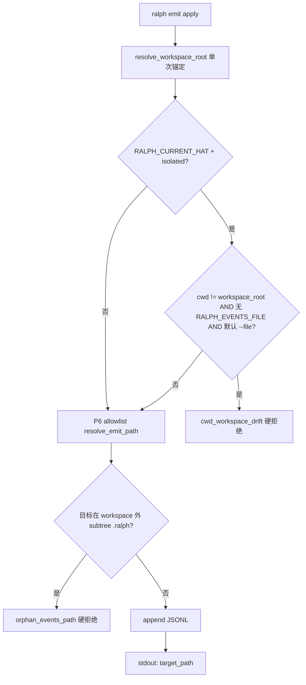

# fix: ralph emit workspace_root 硬约束与 hat-channel 路由 fail-closed

## Summary

修复 isolated hat 在子目录 `cd` 后 `ralph emit` 把事件写到 `sorts/.ralph/events.jsonl` 孤儿路径、以及 stderr 截断导致 agent 误判「假成功」的问题。核心机制：**workspace_root 锚定 `RALPH_WORKSPACE_ROOT`（消除 shadowing）**、**hat 上下文 fail-closed 路由**、**cwd 漂移硬拒绝**、**成功/失败输出可验证**。

---

## Problem Frame

诊断报告 `docs/report/2026-07-06-ce-executor-ralph-emit-pwd-sorts-diagnosis.md` 确认：`primary-20260706-122745` 期间 validator hat 在 `sorts/` 子目录执行 `ralph emit test.passed`，CLI 打印 `Event emitted`，但主 events 文件不变——事件实际落入 `sorts/.ralph/events.jsonl`。

根因链：

1. `crates/ralph-cli/src/commands/emit.rs` 在 line 397 用 `resolve_workspace_root` 正确解析后，line 561–563 又用 `std::env::current_dir()` **遮蔽** `workspace_root`，导致 marker/allowlist 从 hat PWD 子树解析。
2. agent 手动 `unset RALPH_EVENTS_FILE` 后，implicit default 落到 `cwd/.ralph/events.jsonl`，绕过 hat-channel 合并路径。
3. P6 allowlist 拒绝写在 stderr，被 tracing 噪声截断，agent 只看到 policy-check INFO。

本 plan 在 **机制层** 闭环，不依赖 preset instructions 软约束作为唯一防线。

---

## Requirements

| ID | 要求 |
|----|------|
| R1 | `ralph emit` 全程使用 `resolve_workspace_root` 作为 workspace 锚点；禁止在 emit 路径内用 `current_dir()` 二次覆盖 |
| R2 | isolated 模式 + `RALPH_CURRENT_HAT` 已设置时，emit **禁止**创建或写入 workspace 根 `.ralph/` 以外的孤儿 `*/.ralph/events*.jsonl` |
| R3 | isolated 模式 + `RALPH_CURRENT_HAT` 已设置 + `RALPH_EVENTS_FILE` 未设置 + 使用默认 `--file` 时，若 `canonicalize(cwd) ≠ canonicalize(RALPH_WORKSPACE_ROOT)` → **硬拒绝**，错误码 `cwd_workspace_drift` |
| R4 | isolated 模式 + `RALPH_CURRENT_HAT` 已设置时，若 workspace 根存在 `current-hat-events` marker，resolved 目标 **必须** 为该 marker 指向的 hat-channel（或 allowlist 中等价路径） |
| R5 | apply 成功时 text 模式 stdout 披露实际落盘路径；`--output json` 的 `EmitResult` 增加 `target_path` 字段（`recorded: true` 时必填） |
| R6 | emit 失败时 stdout 输出一行机器可读摘要（含稳定 `code`），避免仅 stderr 被前端截断 |
| R7 | `merge_hat_channel` 完成后扫描 workspace 内孤儿 subtree events 文件，写入 `.ralph/diagnostics/orphan-emit-*.md` |
| R8 | `crates/ralph-core/data/ralph-tools-emit.md` 同步新约束与 `target_path` 字段；跑 `scripts/check-cli-doc-drift.sh` |

---

## Key Technical Decisions

| ID | 决策 | 理由 |
|----|------|------|
| KTD1 | **硬约束 cwd 漂移**（用户选定）：子目录 cwd + 无 `RALPH_EVENTS_FILE` + 默认 `--file` → 拒绝 | 阻断 agent `unset RALPH_EVENTS_FILE` 后的 silent orphan 路径；runner 正常注入 env 时不受限 |
| KTD2 | **不修改** `cli_executor.rs` env 注入与 `emit_path.rs` P6 guard 语义 | 诊断已验证：workspace_root 正确时 guard 工作正常 |
| KTD3 | workspace_root SSOT = `resolve_workspace_root`（`RALPH_WORKSPACE_ROOT` > `discover_workspace_root(cwd)` > cwd） | 与 `config_loader.rs` 及 runner 注入契约一致 |
| KTD4 | `EmitResult.target_path` 作为 **additive** 字段（`emit_result.v1` 向后兼容，`skip_serializing_if` 空） | 与 U6 EmitResult SSOT 计划对齐，不 bump schema version |
| KTD5 | 孤儿扫描放在 `merge_hat_channel` 而非 emit 时全量 walk | emit 热路径保持轻量；merge 是 hat activation 结束点，诊断时机正确 |
| KTD6 | **不改** `ce-executor-serial` preset topology/schema | 机制修复后 validator 可在 `sorts/` 编码，只要保留 runner 注入的 `RALPH_EVENTS_FILE`；cwd 硬约束仅拦截 unset-env 场景 |

---

## High-Level Technical Design

### 路径解析（修复后）



### 与 hat-channel 合并的关系

```
hat activation
  → prepare_hat_channel (RALPH_EVENTS_FILE = channel abs path)
  → agent 可在 sorts/ 内编码
  → ralph emit (workspace_root = RALPH_WORKSPACE_ROOT, 写入 channel)
  → merge_hat_channel → 主 events
  → orphan scan（兜底发现 sorts/.ralph/events.jsonl）
```

---

## Scope Boundaries

**In scope**

- `ralph emit` workspace 锚定、fail-closed 路由、cwd 硬约束
- `EmitResult` / text 成功输出可观测性
- `merge_hat_channel` 孤儿诊断
- `ralph-tools-emit.md` 同步

**Out of scope**

- preset `instructions:` 改写（机制修复后 optional follow-up）
- 前端 stderr tail 截断行为（本 plan 用 stdout 摘要规避）
- `ralph events` 默认 `--events-source` 变更（诊断 P3，另开 plan）

### Deferred to Follow-Up Work

- preset author skill 增加「子目录 cd 后禁止 unset RALPH_EVENTS_FILE」检查项
- BDD scenario 复现 `ralph-e2e` validator + `cd sorts/` 全链路（依赖 mock backend 编排）

---

## System-Wide Impact

| 面 | 影响 |
|----|------|
| isolated hat agent | `unset RALPH_EVENTS_FILE` 后从子目录 emit 将 **失败**（预期行为） |
| 正常 runner 注入路径 | 不受影响：`RALPH_EVENTS_FILE` 已设置时 cwd 硬约束不触发 |
| 脚本消费 `--output json` | 可读取新 `target_path` 字段验证落盘 |
| OPAC / preset_lint | 无 schema 变更；不触发 preset 下游同步清单 |

---

## Implementation Units

### U1. 消除 workspace_root shadowing

**Goal:** emit 全路径使用单一 `resolve_workspace_root` 结果。

**Requirements:** R1

**Dependencies:** 无

**Files:**

- `crates/ralph-cli/src/commands/emit.rs`
- `crates/ralph-cli/src/commands/emit.rs`（`#[cfg(test)]`）

**Approach:**

- 删除 line 561–563 对 `workspace_root` 的二次 `let` 遮蔽；后续 policy-check / provenance / `resolve_emit_path` 复用 line 397 的 `workspace_root`。
- 新增测试：`test_emit_from_nested_cwd_uses_ralph_workspace_root_for_markers`——在 `workspace/sorts/` 设 `current_dir`，设 `RALPH_WORKSPACE_ROOT=workspace`，写 `current-hat-events` marker，emit 应写入 channel 而非 `sorts/.ralph/events.jsonl`。

**Patterns to follow:** 现有 `test_emit_command_resolves_marker_relative_to_workspace_root_from_nested_dir`（但当前测试传 `Some(&workspace)` 为 root，未覆盖 env 锚定场景）。

**Test scenarios:**

- Happy path：`RALPH_WORKSPACE_ROOT` 指向父目录，cwd 在 `sorts/`，marker 在父 `.ralph/`，emit 写入 marker 目标。
- Edge：`RALPH_WORKSPACE_ROOT` 未设置，cwd 在子目录，`discover_workspace_root` 向上找到父 `.ralph/`，仍写入正确 marker 目标。
- Error：不应创建 `sorts/.ralph/events.jsonl`。

**Verification:** `cargo nextest run -p ralph-cli --bin ralph -- nested_cwd_uses_ralph_workspace_root` 通过。

---

### U2. Isolated hat fail-closed 路由守卫

**Goal:** hat 上下文禁止 implicit default 落到孤儿 subtree events 文件。

**Requirements:** R2, R4

**Dependencies:** U1

**Files:**

- `crates/ralph-cli/src/cli/emit_path.rs`
- `crates/ralph-cli/src/commands/emit.rs`
- `crates/ralph-cli/src/cli/emit_path.rs`（`#[cfg(test)]`）

**Approach:**

- 在 `resolve_emit_path` 末尾（allowlist 匹配成功后）增加 **orphan guard**：
  - 当 `RALPH_CURRENT_HAT` 已设置且 resolved 路径的 canonical parent 形如 `{workspace_root}/{subdir}/.ralph/...`（`subdir` 非空且不是 workspace 根本身）→ `bail!` 错误码 `orphan_events_path`。
- 当 isolated（由 caller 传入 flag 或读取 env hat + config）且 workspace 根存在非空 `current-hat-events` marker，禁止 fallback 到 `workspace_root/.ralph/events.jsonl` default——必须解析到 hat-channel。

**Test scenarios:**

- Happy path：isolated + hat marker 存在，`RALPH_EVENTS_FILE` 指向 channel → 写入 channel。
- Error path：isolated + hat marker 存在，无 explicit target，cwd 在 `sorts/` → 拒绝 `orphan_events_path`，不创建 `sorts/.ralph/`。
- Error path：isolated + hat marker 存在，试图 `--file sorts/.ralph/events.jsonl` → P6 或 orphan guard 拒绝。

**Verification:** `cargo nextest run -p ralph-cli --bin ralph -- orphan_events_path` 通过。

---

### U3. cwd 漂移硬约束（`cwd_workspace_drift`）

**Goal:** 拦截诊断中的核心事故模式：`unset RALPH_EVENTS_FILE` + 子目录 cwd + 默认 `--file`。

**Requirements:** R3

**Dependencies:** U1

**Files:**

- `crates/ralph-cli/src/commands/emit.rs`
- `crates/ralph-core/src/emit_result/map_errors.rs`（若需新稳定错误码映射）
- `crates/ralph-cli/src/commands/emit.rs`（`#[cfg(test)]`）

**Approach:**

- 在 `resolve_emit_path` 调用前增加 gate：
  - 条件：`config.event_loop.execution_mode == Isolated` && `RALPH_CURRENT_HAT` 非空 && `RALPH_EVENTS_FILE` 未设置 && `--file` 为默认值。
  - 判定：`canonicalize(cwd) != canonicalize(workspace_root)` → `bail!`，message 含 `cwd_workspace_drift`、当前 cwd、期望 workspace_root、修复提示（保留 `RALPH_EVENTS_FILE` 或 `cd $RALPH_WORKSPACE_ROOT`）。
- **豁免**：显式非默认 `--file` 且命中 allowlist 的绝对路径（供高级场景）。

**Test scenarios:**

- Error：`unset RALPH_EVENTS_FILE`，cwd=`sorts/`，`RALPH_WORKSPACE_ROOT=parent`，默认 `--file` → 拒绝 `cwd_workspace_drift`。
- Happy path：`RALPH_EVENTS_FILE` 已设置（runner 注入），cwd=`sorts/` → 允许（U1+U2 路由到 channel）。
- Happy path：cwd=workspace_root，unset env → 允许（marker 解析正常）。

**Verification:** `cargo nextest run -p ralph-cli --bin ralph -- cwd_workspace_drift` 通过。

---

### U4. 成功输出披露 `target_path`

**Goal:** agent/脚本可验证事件写到了哪里。

**Requirements:** R5

**Dependencies:** U1

**Files:**

- `crates/ralph-core/src/emit_result/mod.rs`
- `crates/ralph-core/src/emit_result/assemble.rs`
- `crates/ralph-cli/src/policy_check.rs`
- `crates/ralph-cli/src/commands/emit.rs`
- `crates/ralph-core/src/emit_result/tests.rs`

**Approach:**

- `EmitResult` 增加 `target_path: Option<String>`，`recorded: true` 时填充绝对路径；policy-check 分支保持 `None`。
- text 模式成功行改为：`Event emitted: {topic} → {path}`（无颜色模式同理）。
- `--schema EMIT_RESULT` 占位视图同步新字段（optional null）。

**Test scenarios:**

- Happy path：`--output json` apply 成功 → `recorded: true` 且 `target_path` 非空、路径文件有新行。
- Happy path：policy-check → `recorded: false`，`target_path` 省略。
- Integration：text 模式 stdout 含 `→` 与 channel 路径。

**Verification:** `cargo nextest run -p ralph-core -- emit_result` + `cargo nextest run -p ralph-cli --bin ralph -- target_path` 通过。

---

### U5. 失败输出 stdout 摘要

**Goal:** P6 拒绝与 cwd 硬约束错误不被 stderr 截断吞掉。

**Requirements:** R6

**Dependencies:** U2, U3

**Files:**

- `crates/ralph-cli/src/commands/emit.rs`
- `crates/ralph-cli/src/main.rs`（若顶层 error 打印需调整）

**Approach:**

- 在 emit apply 路径的 `resolve_emit_path` / cwd gate `bail!` 前，向 **stdout** 打印一行：
  - text：`emit rejected [{code}]: {short_message}`
  - `--output json`：打印 `EmitResult { ok: false, recorded: false, errors: [{code, message}], ... }` 后 exit 非零。
- 保持 stderr tracing 不变；stdout 行必须在前置 policy INFO 之后、进程退出前可见（即 bail 前打印）。

**Test scenarios:**

- Error path：触发 P6 allowlist 拒绝 → stdout 含 `emit rejected` 与 `not in this loop's events allowlist`。
- Error path：触发 `cwd_workspace_drift` → stdout 含稳定 code。
- `--output json` 拒绝 → stdout 为合法 JSON，`ok: false`。

**Verification:** `cargo nextest run -p ralph-cli --bin ralph -- emit_rejected_stdout` 通过。

---

### U6. merge 后孤儿 events 扫描诊断

**Goal:** 兜底发现历史/绕过 CLI 的 subtree 孤儿文件。

**Requirements:** R7

**Dependencies:** U2

**Files:**

- `crates/ralph-cli/src/loop_runner/hat_channel.rs`
- `crates/ralph-cli/src/loop_runner/hat_channel.rs`（`#[cfg(test)]`）

**Approach:**

- `merge_hat_channel` 成功末尾调用 `scan_orphan_subtree_events(ctx)`：
  - `walkdir` 或受限 `glob`：查找 `{workspace}/**/.ralph/events*.jsonl`，排除 `{workspace}/.ralph/**` 主树与 `{workspace}/.ralph/agent/**` hat-channel。
  - 若发现非空文件 → 写 `.ralph/diagnostics/orphan-emit-{ts}.md`，`tracing::error!` 含路径列表。
- 不 fail-close loop（与 `channel-routing-fallback` 一致）。

**Patterns to follow:** `emit_channel_routing_fallback_diagnostic` 同文件。

**Test scenarios:**

- Happy path：无孤儿文件 → 无 diagnostic。
- Error path：预置 `workspace/sorts/.ralph/events.jsonl` 有内容 → merge 后 diagnostic 文件存在且列出路径。
- Edge：空孤儿文件 → 可选忽略或仍报告（实现时二选一，写入 KTD 注释）。

**Verification:** `cargo nextest run -p ralph-cli --bin ralph -- orphan_subtree` 通过。

---

### U7. Skill 文档与 drift 校验

**Goal:** agent 指南与机制行为一致。

**Requirements:** R8

**Dependencies:** U1–U6

**Files:**

- `crates/ralph-core/data/ralph-tools-emit.md`
- `docs/solutions/integration-issues/emit-workspace-root-cwd-drift.md`（新建案例文档）
- `scripts/check-cli-doc-drift.sh`

**Approach:**

- `ralph-tools-emit.md` 增补：
  - `RALPH_WORKSPACE_ROOT` 锚定说明
  - `cwd_workspace_drift` / `orphan_events_path` 错误码与修复步骤
  - `target_path` 字段与 text 成功行格式
  - 反模式：🔴 禁止 `unset RALPH_EVENTS_FILE` 后从子目录 emit
- 新建 solutions 文档（YAML frontmatter 含 `module: ralph-cli`, `tags: [emit, isolated, cwd]`）。
- 跑 drift 脚本；`ralph emit --help` 冒烟。

**Verification:** `scripts/check-cli-doc-drift.sh` exit 0。

---

## Risks & Dependencies

| 风险 | 缓解 |
|------|------|
| cwd 硬约束误伤手动调试 | 豁免显式 `--file` allowlist 绝对路径；runner 注入 `RALPH_EVENTS_FILE` 时 gate 不触发 |
| `EmitResult` 下游 jq 脚本严格 schema | `target_path` optional + `skip_serializing_if` |
| U6 walk 性能 | 限定深度、仅在 merge 时运行、跳过 `node_modules` / `.git` |

**与 2026-07-06-001 plan 关系：** U4 的 `target_path` 可与 EmitResult SSOT 计划并行；若 001 已合并，在本 branch rebase 后对齐 `assemble` API。无硬阻塞。

---

## Acceptance Examples

| ID | 场景 | 期望 |
|----|------|------|
| AE1 | validator 在 `sorts/`、`RALPH_EVENTS_FILE` 由 runner 注入，emit `test.passed` | 写入 hat-channel，merge 后进主 events；stdout 含 `target_path` |
| AE2 | agent `unset RALPH_EVENTS_FILE`，cwd=`sorts/`，默认 emit | 退出非零，stdout `cwd_workspace_drift`，**不**创建 `sorts/.ralph/events.jsonl` |
| AE3 | 错误 allowlist 路径 | stdout `emit rejected`，stderr 仍有完整 trace |
| AE4 | merge 后发现历史孤儿 `sorts/.ralph/events.jsonl` | `.ralph/diagnostics/orphan-emit-*.md` 存在 |

---

## Sources & Research

- `docs/report/2026-07-06-ce-executor-ralph-emit-pwd-sorts-diagnosis.md` — 事故因果链与证据
- `crates/ralph-cli/src/commands/emit.rs:397,561-563` — shadowing 根因
- `crates/ralph-cli/src/cli/config_loader.rs:33-46` — `resolve_workspace_root` SSOT
- `crates/ralph-cli/src/loop_runner/hat_channel.rs` — hat-channel 设计意图
- `crates/ralph-adapters/src/cli_executor.rs:411-422` — runner env 注入（不改）

---

## Verification (full baseline)

各 Unit 开发中跑 targeted nextest；全部完成后：

```bash
cargo nextest run -p ralph-cli --bin ralph -- emit
cargo nextest run -p ralph-cli --bin ralph -- emit_path
cargo nextest run -p ralph-core -- emit_result
scripts/check-cli-doc-drift.sh
./scripts/run-tests.sh
```
