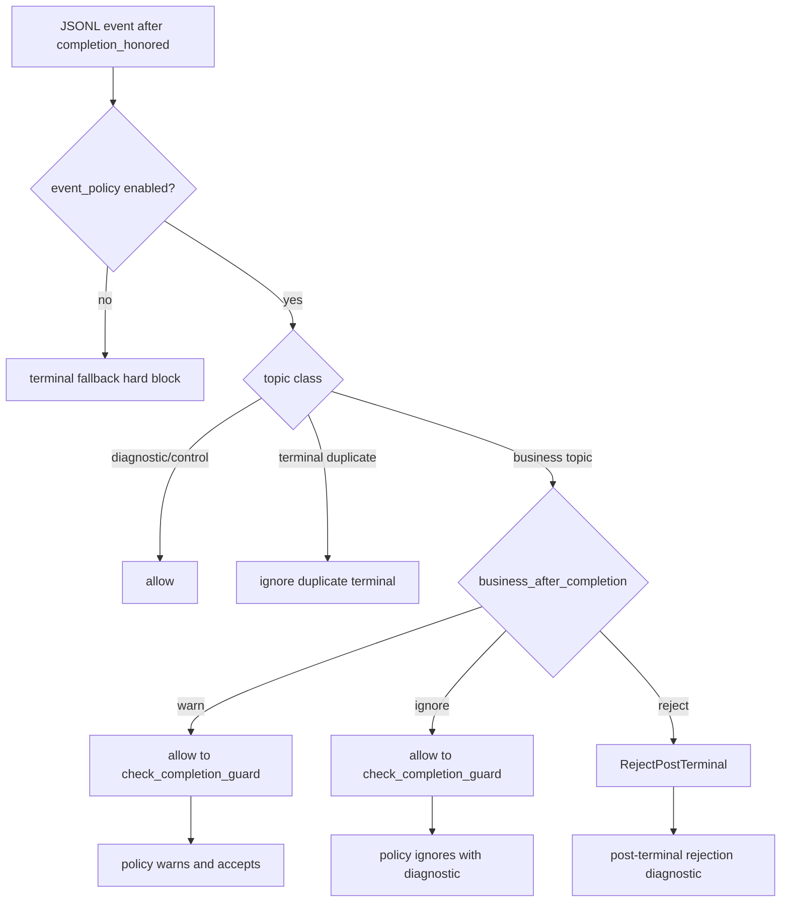

# fix: Restore terminal guard policy semantics

## Goal Capsule

| Field | Value |
|---|---|
| Objective | 修复 Unit 4 引入的 post-terminal hard-reject 回归，让 `terminal_closed_guard` 尊重 `event_policy.completion_after_terminal` 的 `warn` / `ignore` / `reject` 语义，同时保留 `ce-executor-serial` 配置为 `reject` 时的冻结行为。 |
| Authority | `event_policy.completion_after_terminal` 是 post-completion 行为的配置权威；`terminal_closed_guard` 是早期 guard，不得绕过 policy 配置。 |
| Execution profile | 小范围 runtime bugfix，优先 characterization test，再做最小 wiring 调整。 |
| Stop condition | `business_after_completion: warn` 的旧合约恢复为 warn-and-allow-through；`business_after_completion: reject` 的 serial 场景仍拒收；相关 targeted nextest 通过。 |

---

## Product Contract

### Summary

`2026-07-07-002` 的 Unit 4 在 `process_events_from_jsonl` 早期加入 `terminal_closed_guard`，目标是防止 `LOOP_COMPLETE` honored 后业务流继续推进。
实际实现对所有 post-completion business topic 无条件 `RejectPostTerminal`，导致已有 `event_policy.completion_after_terminal.business_after_completion: warn` 配置不再生效。
本修复恢复配置语义：`warn` 继续允许事件通过并记录 warning，`ignore` 走 ignore-with-diagnostic，`reject` 才 fail-closed。

### Problem Frame

旧合约中，`CompletionAfterTerminalAction::Warn` 的含义是“记录 warning 但允许事件进入 accepted path”。
当前 `terminal_closed_guard::evaluate_terminal_closed` 在 policy gate 之前执行，且对 `TopicClass::Business` 无条件返回 `RejectPostTerminal`。
这会让下游 `check_completion_guard` 没机会执行 `Warn` 或 `Ignore` 分支，表现为 `had_events=false`、`validated_events` 为空、旧测试和旧 preset 配置语义被破坏。

### Requirements

- R1. 当 `completion_honored=true` 且 topic 是 business topic 时，runtime 必须按 `event_policy.completion_after_terminal.business_after_completion` 决定后续行为。
- R2. `business_after_completion: warn` 必须恢复为 warn-and-allow-through：事件进入 accepted path，且 policy warning 仍可发布。
- R3. `business_after_completion: reject` 必须保持 fail-closed：post-terminal business event 不得进入 accepted events，并按现有诊断路径暴露原因。
- R4. `business_after_completion: ignore` 必须保持 ignore-with-diagnostic 语义：不推进业务事件，不误报为 hard reject。
- R5. terminal-adjacent duplicate 仍必须被 dedup/ignore；`LOOP_COMPLETE`、`REVIEW_COMPLETE`、`report.done` 的重复终态保护不能回退。
- R6. 没有启用 `event_policy` 的配置继续走 hard fallback，避免无策略 preset 在 completion honored 后继续推进业务流。
- R7. 文档和注释必须说明 `terminal_closed_guard` 不再是全局无条件 business freeze；freeze 由 policy 配置中的 `reject` 表达，`ce-executor-serial` 继续使用 `reject`。

### Scope Boundaries

- 本计划只修复 post-terminal guard 与 `completion_after_terminal` 配置的语义冲突。
- 不改 bounded retry 次数、`TaskStore::ensure` 幂等键、机制级 `plan.blocked` 是否进入 accepted events 这三个独立 P1。
- 不改变 `ce-executor-serial` 的 preset 配置：它已经显式设置 `business_after_completion: reject`。
- 不新增 event topic，不修改 handoff envelope 字段，不修改 preset schema。

### Deferred to Follow-Up Work

- 统一 protocol violation bounded retry 的“第二次 fail-close”文档语义与当前 `U2_REJECTION_RETRY_LIMIT=3` 实现。
- 审核 `TaskStore::ensure` 按 step locus 合并任务是否应收窄到 serial runtime 路径。
- 明确机制级 fail-close `plan.blocked` 的 accepted ledger 与 diagnostics 权威边界。

---

## Planning Contract

### Key Technical Decisions

- KTD1. `event_policy` 仍是 post-completion 行为权威。
  `terminal_closed_guard` 不应复制或覆盖 `CompletionAfterTerminalAction` 的最终语义；它只做早期分类和 reject 配置的快速拦截。
- KTD2. `warn` 和 `ignore` 应放行到既有 `check_completion_guard`。
  既有 policy path 已经实现 `Warn -> accept_event!`、`Ignore -> diagnostic + continue`、`Reject -> block`，复用它比在 guard 里重写诊断逻辑更稳。
- KTD3. 保留无 policy fallback。
  当 `event_policy` 不存在或未启用时，runtime 没有可配置语义可参考，继续 hard-block post-completion business events，维持 2026-07-01 的安全兜底。
- KTD4. serial freeze 通过配置表达。
  `ce-executor-serial` 的 `presets/en/ce-executor-serial.yml` 已配置 `business_after_completion: reject`，修复后仍会得到 Unit 4 期望的 freeze 行为。

### High-Level Technical Design

### Assumptions

- `check_completion_guard` remains the canonical implementation of `CompletionAfterTerminalAction` decisions.
- Existing failing tests in `completion_honored.rs` are valid characterization coverage, not stale tests to delete.
- `terminal_closed_guard` can import or receive `CompletionAfterTerminalAction` without creating an undesirable dependency cycle; if the direct type dependency is awkward, the runtime wrapper can translate config into a small local enum.

### Sources & Research

- `crates/ralph-core/src/event_loop/mod.rs` contains the new Unit 4 guard before the existing persistent and same-batch completion policy gates.
- `crates/ralph-core/src/event_loop/terminal_closed_guard.rs` currently maps all post-completion `TopicClass::Business` events to `RejectPostTerminal`.
- `crates/ralph-core/src/event_policy.rs` defines `check_completion_guard` and maps `CompletionAfterTerminalAction::{Warn, Ignore, Reject}` to `PolicyDecision::{Warn, Ignore, Block}`.
- `crates/ralph-core/src/event_loop/tests/completion_honored.rs` already contains the `warn` contract regression case.
- `crates/ralph-core/src/event_loop/tests/post_terminal_rejection.rs` covers the `reject` behavior expected by Unit 4.

---

## Implementation Units

### U1. Characterize policy-configured post-terminal decisions

- **Goal:** Pin the intended interaction between `terminal_closed_guard` and `completion_after_terminal` before implementation changes.
- **Requirements:** R1, R2, R3, R4, R5
- **Dependencies:** None
- **Files:**
  - Modify: `crates/ralph-core/src/event_loop/terminal_closed_guard.rs`
  - Modify: `crates/ralph-core/src/event_loop/tests/completion_honored.rs`
  - Modify: `crates/ralph-core/src/event_loop/tests/post_terminal_rejection.rs`
- **Approach:** Add pure guard tests or runtime tests that explicitly cover `business_after_completion: warn`, `ignore`, and `reject`.
  Prefer using existing `completion_honored.rs` tests as characterization when they already fail for the right reason; add only the missing `ignore` or terminal-adjacent cases.
- **Execution note:** Start from the failing `warn` behavior so the test proves the regression before changing guard logic.
- **Patterns to follow:** Existing `test_completion_honored_warn_action_allows_event_with_warning` and `test_post_terminal_work_done_rejected_with_diagnostic`.
- **Test scenarios:**
  - Happy path: with `completion_honored=true` and `business_after_completion: warn`, `experiment.planned` sets `result.had_events=true`.
  - Error path: with `business_after_completion: reject`, `work.done` does not appear in `accepted_events` and emits the existing post-terminal diagnostic.
  - Edge case: with `duplicate_terminal: ignore`, repeated `LOOP_COMPLETE` remains ignored, not accepted as a business event.
  - Edge case: with `business_after_completion: ignore`, a business topic does not enter accepted events but is not reported as `RejectPostTerminal`.
- **Verification:** The characterization tests fail on current HEAD for the `warn` path and pass after U2.

### U2. Make terminal guard respect policy action

- **Goal:** Change the guard or its event-loop wrapper so policy-configured `warn` / `ignore` business events reach the existing `check_completion_guard` path.
- **Requirements:** R1, R2, R3, R4, R6
- **Dependencies:** U1
- **Files:**
  - Modify: `crates/ralph-core/src/event_loop/terminal_closed_guard.rs`
  - Modify: `crates/ralph-core/src/event_loop/mod.rs`
- **Approach:** Extend the guard input with the post-terminal business action, or add a wrapper that evaluates policy action before converting a business topic into `RejectPostTerminal`.
  For business topics, return `RejectPostTerminal` only when action is `Reject`; return `Allow` for `Warn` and `Ignore` so the existing policy gate publishes warning/ignore diagnostics and controls acceptance.
  Keep diagnostic/control topics allowed and terminal-adjacent duplicate handling unchanged.
- **Technical design:** Directional shape:
  - `policy disabled` remains event-loop fallback hard block.
  - `policy enabled + business_after_completion=Warn` returns `Allow`.
  - `policy enabled + business_after_completion=Ignore` returns `Allow`.
  - `policy enabled + business_after_completion=Reject` returns `RejectPostTerminal`.
- **Patterns to follow:** `event_policy::check_completion_guard` owns the final `CompletionAfterTerminalAction` mapping; avoid duplicating its `PolicyDecision` behavior in the guard.
- **Test scenarios:**
  - Happy path: `warn` action reaches policy warning branch and accepts the event.
  - Error path: `reject` action is still intercepted before main events commit.
  - Edge case: no policy config still hard-blocks post-completion business events.
  - Integration scenario: same-batch completion guard still handles events after a completion topic in the same JSONL batch.
- **Verification:** `completion_honored` targeted tests and `post_terminal_rejection` targeted tests pass together.

### U3. Reconcile docs and comments with configurable semantics

- **Goal:** Remove misleading “all post-terminal business is always hard reject” language from runtime docs and agent-facing skill docs where this fix changes the statement.
- **Requirements:** R7
- **Dependencies:** U2
- **Files:**
  - Modify: `crates/ralph-core/src/event_loop/terminal_closed_guard.rs`
  - Modify: `crates/ralph-core/data/ralph-tools-recovery-directives.md`
  - Modify: `crates/ralph-core/data/ralph-tools.md`
  - Modify: `presets/en/ce-executor-serial.yml` only if instructions currently imply a global behavior rather than the serial preset's configured `reject` behavior
- **Approach:** Phrase the rule as configuration-aware: post-terminal business behavior is governed by `completion_after_terminal`; serial freezes because it sets `business_after_completion: reject`.
  Keep agent-facing docs generic and avoid serial-only topology details in `crates/ralph-core/data/*.md`.
- **Patterns to follow:** Existing data-doc split: generic `ralph-tools-*` files describe command and runtime semantics; serial-specific state tables stay in `presets/en/ce-executor-serial.yml`.
- **Test scenarios:** Test expectation: none -- this is documentation/comment alignment; behavior is covered by U1 and U2.
- **Verification:** `scripts/check-cli-doc-drift.sh` passes if data docs with source references are touched; `CLAUDE.md` / `AGENTS.md` remain unchanged unless their text is modified together.

### U4. Runtime scenario verification for serial reject behavior

- **Goal:** Ensure restoring `warn` compatibility does not weaken `ce-executor-serial` post-terminal freeze.
- **Requirements:** R3, R5, R6
- **Dependencies:** U2, U3
- **Files:**
  - Modify: `crates/ralph-core/tests/scenarios/ce_executor_serial_rejects_post_terminal_business_event.yml` only if expected diagnostics need wording updates
  - Modify: `crates/ralph-core/tests/scenarios.rs` only if the scenario harness needs a missing assertion surface
- **Approach:** Keep the serial fixture configured with `business_after_completion: reject` and prove post-terminal `work.done` / `plan.blocked` does not enter accepted events.
  Do not loosen the serial scenario to `warn`; the point is compatibility for other presets while serial remains strict.
- **Patterns to follow:** Existing true runtime scenario files under `crates/ralph-core/tests/scenarios/` and `run_workflow_guard_scenario`-backed tests in `crates/ralph-core/tests/scenarios.rs`.
- **Test scenarios:**
  - Integration scenario: `ce_executor_serial_rejects_post_terminal_business_event` still observes rejection diagnostics and completion remains honored.
  - Integration scenario: a non-serial or test-local config with `warn` accepts the business event after completion.
  - Edge case: terminal-adjacent duplicate remains ignored even when business action is `warn`.
- **Verification:** Targeted scenario test passes and no `ce-executor-serial` fixture changes to `warn`.

---

## Verification Contract

| Gate | Scope | Done signal |
|---|---|---|
| Targeted runtime tests | `cargo nextest run -p ralph-core -- completion_honored post_terminal_rejection` | `warn`, `ignore`, and `reject` completion-after-terminal paths pass together. |
| Serial scenario | `cargo nextest run -p ralph-core --test scenarios -- ce_executor_serial_rejects_post_terminal_business_event` | Serial post-terminal business event remains rejected under `business_after_completion: reject`. |
| Preset lint if preset/docs touched | `cargo nextest run -p ralph-cli --bin ralph -- preset_lint` and `cargo nextest run -p ralph-core -- preset_lint` | No preset/schema drift introduced. |
| Doc drift if data docs touched | `scripts/check-cli-doc-drift.sh` | Source references and CLI doc snippets remain accurate. |
| Final baseline | `./scripts/run-tests.sh` | Workspace nextest/doctest baseline passes before declaring done. |

---

## Definition of Done

- `terminal_closed_guard` no longer hard-rejects policy-configured `warn` business events after completion.
- `business_after_completion: warn` accepts the event through the existing policy warning path.
- `business_after_completion: ignore` and `reject` retain their distinct semantics.
- `ce-executor-serial` keeps strict post-terminal freeze because its preset remains configured with `business_after_completion: reject`.
- Tests cover `warn`, `ignore`, `reject`, duplicate terminal-adjacent events, and no-policy fallback.
- Agent-facing docs and runtime comments describe configurable semantics accurately.
- No unrelated P1 fixes are mixed into this change; bounded retry, task identity scope, and fail-close ledger semantics remain separate follow-up work.
