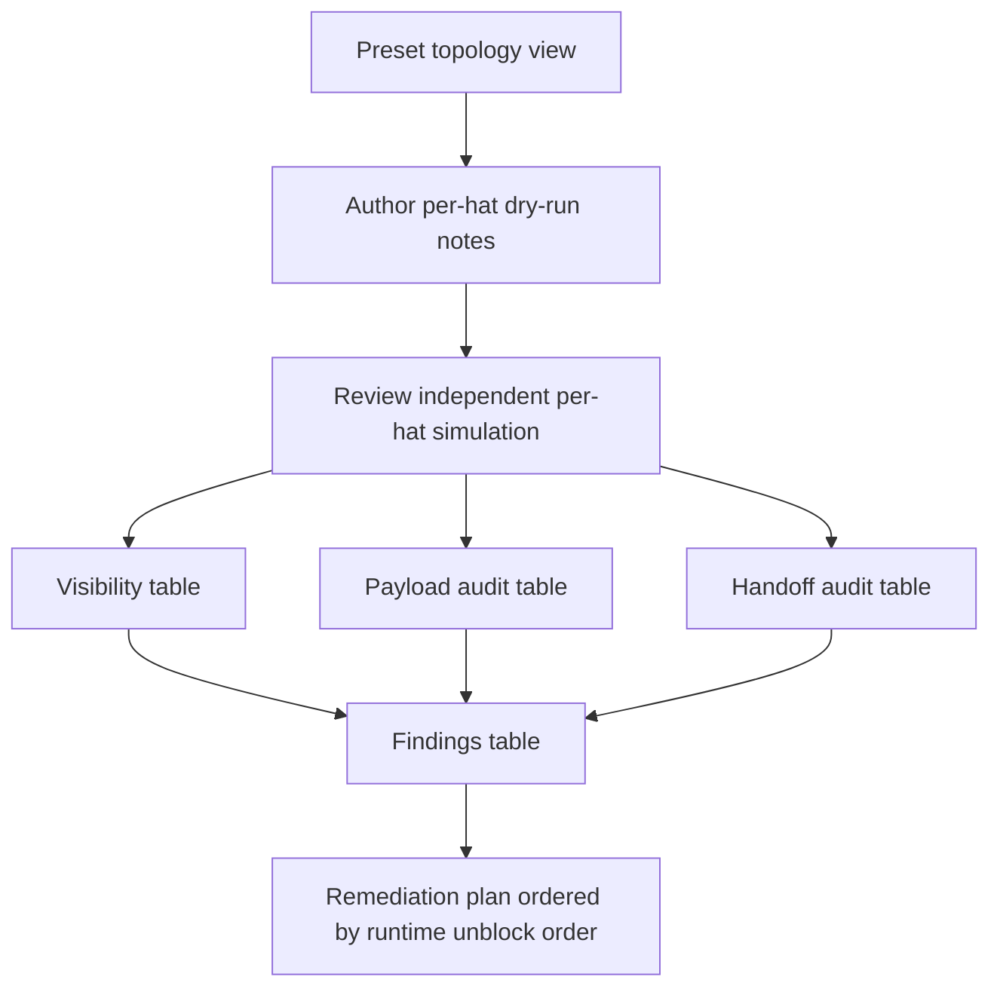
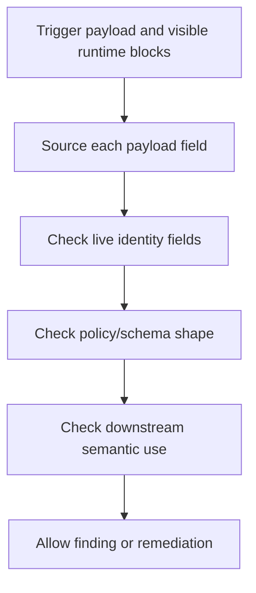

# Preset Skills Agent Flow Review - Plan

## Goal Capsule

- **Objective:** Upgrade `ralph-preset-author` and `ralph-preset-review` so preset authoring and review are driven by what a single activated hat agent can actually see, infer, execute, and hand off.
- **Product authority:** The review skill is the primary authority for catching invisible inputs and soft reports; the author skill must produce enough structured notes for the review skill to challenge them independently.
- **Open blockers:** None before planning.

---

## Product Contract

### Summary

`ralph-preset-author` and `ralph-preset-review` should become a closed-loop agent-flow audit system.
Authoring must produce per-hat visibility, payload, and handoff notes, and review must independently simulate each hat activation from the agent's visible prompt context to find wrong descriptions, missing information, broken logic, and invalid payload assumptions.

### Problem Frame

The current skills already define AAF questions, mechanical lint, and a negative fixture, but the workflow still reads like a checklist around YAML.
The failure mode to prevent is a reviewer accepting a preset because the whole file makes sense, while the actual activated hat would not see the input, field, state, or downstream expectation required to complete its task.

The highest-value improvement is not more lint breadth.
It is forcing the operator skill to reason from the activated agent's prompt stack: identity, pending event, orchestrator context, the single hat's instructions, injected tool docs, and allowed command surface.
Payload content is part of that reasoning, not a mechanical afterthought.
A payload can pass shape checks while still being impossible for the hat to construct, too vague for the next hat to act on, or inconsistent with live task identity.

### Key Decisions

- **Review is the hard gate.** `ralph-preset-review` must prioritize invisible input findings and weak remediation over stylistic issues, because missed P0 feasibility issues are more damaging than imperfect author notes.
- **Author notes become challengeable evidence, not truth.** `preset-author-notes.md` should help reviewers trace author intent, but review must rebuild the per-hat view independently and report mismatches.
- **Agent-flow dry-run is the core workflow.** Both skills should reason in activation order and ask: what does this hat see, what does it do, what does it emit, and how does the next hat observe that result.
- **Payload review is a first-class gate.** Review must inspect not only whether payload fields exist, but whether each value is visible to the hat, semantically useful, consistent with runtime identity, and sufficient for downstream handoff.
- **Reports must be actionable.** A P0/P1 finding is not complete unless it names the agent-visible failure and the concrete repair surface: instructions, `publishes`, payload contract, schema, `state_projection`, event policy, author notes, or fixture expectation.

### Actors

- A1. **Preset author:** The operator or agent drafting builtin or local preset YAML and `preset-author-notes.md`.
- A2. **Preset reviewer:** The operator or agent running `ralph-preset-review` to independently simulate each hat activation and produce `preset-review-report.md`.
- A3. **Activated hat agent:** The future runtime agent that receives only its own hat context and injected runtime blocks.
- A4. **Planning agent:** The downstream `ce-plan` consumer that turns the Product Contract into implementation-ready work.

### Requirements

**Shared runtime model**

- R1. The shared references must describe the agent-visible prompt stack as the review starting point, including hat identity, pending event context, orchestrator context, the active hat's instructions, injected tool docs, and task/progress views.
- R2. The shared references must distinguish whole-preset topology view from activated-hat view, and must treat contradictions between those views as review material.
- R3. The shared references must explain that `state_projection` is only useful to a downstream hat when it produces an observable runtime view the hat is instructed to use.

**Authoring workflow**

- R4. `ralph-preset-author` must require an author dry-run for every hat before delivery: visible inputs, required observations, allowed commands, emitted payload fields, payload value sources, and downstream observation path.
- R5. `preset-author-notes.md` must include enough per-hat detail for a reviewer to test whether the hat can complete its mission without reading other hats' instructions.
- R6. Authoring must stop or mark the preset non-deliverable when a hat depends on another hat's private instructions, an internal ledger, an unprojected field, or a hand-written task identity.
- R7. Authoring guidance must make trigger-specific logic explicit when one hat handles multiple trigger topics, so the future agent does not infer a route from ambiguous prose.
- R8. Author notes must record the intended payload contract for each emitted topic: required fields, where each field value comes from, which fields are derived from live runtime state, and which fields downstream hats rely on.

**Review workflow**

- R9. `ralph-preset-review` must independently rebuild a per-hat visibility table before reading or trusting author notes.
- R10. Review must simulate each hat activation in a strict sequence: trigger received, visible context inspected, command plan checked, payload construction checked, emit checked, handoff checked.
- R11. Review must classify a missing observe path, invisible field, unprojected handoff, fabricated payload value, or reliance on another hat's private state as P0 unless code or runtime evidence proves the input is visible.
- R12. Review must include a payload audit for each material emitted topic, covering required fields, value source, identity consistency, semantic sufficiency, and downstream consumption.
- R13. Review must include a cross-hat handoff table that traces every material edge from upstream emitted fields to projection or runtime view to downstream observation.
- R14. Review must continue AAF analysis even when mechanical lint fails, because lint failure can hide softer agent-visible failures.

**Report quality**

- R15. Every P0/P1 finding in `preset-review-report.md` must include the simulated hat view, the missing or wrong input, the affected payload or handoff path, evidence, and an actionable fix.
- R16. Findings that cannot name a repair surface must not be reported as main-table P0/P1; they belong in `Unverified Suspicions` until investigated.
- R17. The remediation plan must be ordered by runtime unblock order, not by file order or discovery order.
- R18. The report must be usable as a work queue for implementation without rereading the full preset first.

**Fixtures and acceptance**

- R19. The negative fixture acceptance must require at least one invisible-input P0, at least one payload-content P0, and at least one “soft report would be insufficient” check.
- R20. The clean builtin review acceptance must prove that the report includes one per-hat dry-run section per hat, payload audit rows for material emits, and handoff rows for adjacent material edges.
- R21. Skill documentation must avoid duplicating `crates/ralph-core/data/ralph-tools*.md` command tables and instead cite the relevant injected tool docs.

### Key Flows

- F1. **Author dry-run before handoff**
  - **Trigger:** A preset author creates or edits a preset.
  - **Actors:** A1, A3.
  - **Steps:** The author sketches topology, then switches to one hat at a time and records what that hat can observe, which commands it can run, what payload it can construct, what it emits, and how downstream state becomes visible.
  - **Outcome:** `preset-author-notes.md` contains challengeable per-hat evidence instead of broad topology prose.
  - **Covered by:** R4, R5, R6, R7, R8.

- F2. **Review activation simulation**
  - **Trigger:** A reviewer runs `ralph-preset-review` on a local or builtin preset.
  - **Actors:** A2, A3.
  - **Steps:** The reviewer reads topology-only fields, then simulates each hat's activation from the visible context outward, including payload construction, before comparing author notes.
  - **Outcome:** Invisible inputs and impossible handoffs become P0 findings even when the full YAML looks coherent.
  - **Covered by:** R9, R10, R11, R12, R13, R14.

- F3. **Actionable report production**
  - **Trigger:** Review findings are ready to write.
  - **Actors:** A2, A4.
  - **Steps:** The reviewer writes each main-table finding with hat-visible evidence, confidence, and a concrete repair surface, then orders remediation by runtime unblock order.
  - **Outcome:** The report can drive implementation without turning into a vague critique.
  - **Covered by:** R15, R16, R17, R18.

### Acceptance Examples

- AE1. **Invisible field**
  - **Covers R9, R11, R13, R15.**
  - **Given:** A downstream hat instruction says to read `secret_handoff_token`.
  - **When:** No upstream emit field, projection action, or visible runtime block exposes that value.
  - **Then:** Review reports a P0 invisible-input finding with the downstream hat view and a fix targeting the missing emit/projection/instruction contract.

- AE2. **Whole-file illusion**
  - **Covers R2, R9, R10.**
  - **Given:** The full preset topology implies a reviewer runs before a worker.
  - **When:** The worker's own activation cannot observe reviewer state.
  - **Then:** Review treats “wait for reviewer approval” as an invalid instruction unless a visible runtime event or task state is available to that worker.

- AE3. **Soft finding rejected**
  - **Covers R15, R16, R18.**
  - **Given:** A report says “handoff is unclear” without naming the missing field or repair surface.
  - **When:** The finding is confidence-scored for the main table.
  - **Then:** The finding must be rewritten with evidence and a concrete fix, or moved to `Unverified Suspicions`.

- AE4. **Author notes mismatch**
  - **Covers R5, R9.**
  - **Given:** Author notes claim a hat can observe task identity from context.
  - **When:** The reviewer cannot find that identity in the simulated prompt-visible sources.
  - **Then:** Review reports the mismatch as evidence and does not treat author notes as authority.

- AE5. **Payload value is fabricated**
  - **Covers R8, R11, R12, R15.**
  - **Given:** A hat emits a payload containing `task_id`, `task_key`, `step`, `verdict`, and `reason`.
  - **When:** The hat can see `verdict` and `reason` from its own work, but the `task_id` is not available from a live task view or allowed observe command.
  - **Then:** Review reports a P0 payload-content finding and fixes the instructions or projection so the value is observable before emit.

- AE6. **Payload is structurally valid but semantically unusable**
  - **Covers R12, R13, R15.**
  - **Given:** A payload satisfies `required_fields` but uses a vague `summary` such as “done” where the downstream hat must decide whether to fix, block, or complete.
  - **When:** The downstream hat's Q2 depends on that field to choose its next action.
  - **Then:** Review reports a payload semantic-sufficiency finding with a fix to require the decision-bearing fields or revise the downstream observation contract.

### Success Criteria

- `ralph-preset-review` guidance makes invisible inputs the first-class P0 class, not a side effect of generic AAF.
- Payload content review becomes visible in the review report as its own audit surface, not only as schema or policy-check output.
- A reviewer following the skill can inspect the negative fixture and produce concrete remediation without relying on unstated knowledge of Ralph internals.
- A planner can turn this artifact into edits to `skills/ralph-preset-author`, `skills/ralph-preset-review`, shared references, and fixtures without inventing the behavioral standard.
- The resulting skills make it harder to write or accept preset instructions that only work from a whole-file author perspective.

### Scope Boundaries

- No new Rust `preset_lint` rules are required in this scope.
- No new CLI for exporting full prompt snapshots is required in this scope.
- No default full workspace test run is required for the operator skill update; targeted docs/fixture validation is enough until implementation changes code.
- No serial-preset-specific status table should be copied into generic `crates/ralph-core/data/*.md`.

### Dependencies / Assumptions

- The current runtime contract remains that isolated hat prompts include only active hat instructions, not all hats' instructions.
- The current state handoff model remains emit to projection to task/progress or orchestrator context to downstream observation.
- `skills/ralph-preset-common/references/` remains the shared reference location for both author and review skills.

### Sources / Research

- `skills/ralph-preset-author/SKILL.md`
- `skills/ralph-preset-review/SKILL.md`
- `skills/ralph-preset-common/references/agent-native-model.md`
- `skills/ralph-preset-common/references/author-checklist.md`
- `skills/ralph-preset-common/references/finding-rubric.md`
- `skills/ralph-preset-common/fixtures/aaf-review-negative-fixture.yml`
- `crates/ralph-core/src/event_loop/tests/payload_types.rs`
- `crates/ralph-core/src/hatless_ralph.rs`
- `crates/ralph-core/src/state_projector/orchestrator_context.rs`
- `crates/ralph-cli/src/policy_check.rs`

---

## Planning Contract

### Product Contract Preservation

Product Contract changed: A4 wording only — readiness transition made the original “requirements-only artifact” phrase stale.

### Key Technical Decisions

- KTD-1. **Keep this as an operator-skill update.** The active scope changes `skills/ralph-preset-author`, `skills/ralph-preset-review`, shared references, and fixtures; it does not add Rust `preset_lint` rules or runtime prompt export.
- KTD-2. **Make payload audit explicit rather than implicit in Q4.** Existing Q4 text mentions payload fields, but the implementation must introduce a named payload audit surface so reviewers check field source, identity consistency, semantic sufficiency, and downstream consumption.
- KTD-3. **Use shared references as the single review vocabulary.** The author and review skills should stay short and procedural; detailed prompt-stack, payload, visibility, confidence, and report-shape rules belong in `skills/ralph-preset-common/references/`.
- KTD-4. **Strengthen fixtures instead of inventing a runtime harness.** Acceptance should be pinned by fixture YAML plus expected finding categories and report structure, because these are external agent skills rather than compiled runtime features.
- KTD-5. **Preserve command-table boundaries.** The plan may cite `ralph emit --schema`, `ralph emit --policy-check`, and `ralph tools task verify-emit-bridge`, but skill docs must not duplicate long `crates/ralph-core/data/ralph-tools*.md` parameter tables.

### High-Level Technical Design

The implementation should convert the current AAF checklist into a visible dry-run pipeline.

Payload audit sits between per-hat visibility and handoff audit.
The reviewer first proves a field value is constructible by the emitting hat, then proves the downstream hat can observe and use it.

### Assumptions

- `skills/ralph-preset-author/references` and `skills/ralph-preset-review/references` remain symlinks to `skills/ralph-preset-common/references`.
- The implementer can validate the skills through document/fixture inspection and targeted preset lint commands without running live Ralph loops.
- Existing runtime facts about isolated prompt visibility and payload policy-check behavior are sufficient; no new runtime evidence API is required.

### Scope Boundaries

- No changes to `crates/ralph-core/data/*.md` are planned unless implementation discovers the operator skills are citing a missing or stale injected-tool section.
- No changes to builtin preset YAML are planned.
- No `.ralph/` runtime state files should be created or committed as part of this work.
- No marketplace packaging changes are planned unless implementation changes skill names, paths, or install instructions.

### Risks & Dependencies

| Risk | Impact | Mitigation |
|---|---|---|
| Payload audit becomes vague prose | Review remains too soft to catch fabricated values | Require table columns and fixture acceptance for payload-content P0 |
| Shared reference grows into a duplicated command manual | Drift against `ralph-tools*.md` | Cite injected skill sections and keep command examples minimal |
| Negative fixture only checks missing fields | Semantic payload failures still slip through | Add or revise fixture expectations for structurally valid but unusable payload |
| Report schema changes break existing readers | Operator reports become inconsistent | Preserve the fixed eight-section report structure and add payload audit as a section/table inside it |

### Sources & Research

- `skills/ralph-preset-author/SKILL.md`
- `skills/ralph-preset-review/SKILL.md`
- `skills/ralph-preset-common/references/agent-native-model.md`
- `skills/ralph-preset-common/references/author-checklist.md`
- `skills/ralph-preset-common/references/commands.md`
- `skills/ralph-preset-common/references/finding-rubric.md`
- `skills/ralph-preset-common/fixtures/README.md`
- `skills/ralph-preset-common/fixtures/aaf-review-negative-fixture.yml`
- `crates/ralph-cli/src/commands/emit.rs`
- `crates/ralph-cli/src/task_cli.rs`
- `docs/plans/2026-07-05-006-feat-ralph-preset-author-review-skills-plan.md`

---

## Implementation Units

### U1. Shared Agent-Flow And Payload Model

**Goal:** Update the shared references so author and review skills use the same vocabulary for activated-hat visibility, payload construction, and handoff closure.

**Requirements:** R1, R2, R3, R12, R21.

**Dependencies:** None.

**Files:**

- Modify: `skills/ralph-preset-common/references/agent-native-model.md`
- Modify: `skills/ralph-preset-common/references/commands.md`
- Modify: `skills/ralph-preset-common/references/finding-rubric.md`
- Test/fixture reference: `skills/ralph-preset-common/fixtures/README.md`

**Approach:** Add a named payload audit model next to the AAF five questions.
Define the required checks as field set, value source, runtime identity consistency, semantic sufficiency, and downstream consumption.
Clarify that `ralph emit --schema` and `ralph emit --policy-check` prove shape only, while the reviewer still owns agent-visible source and semantic checks.
Extend the soft AAF severity table with payload-specific P0/P1 cases, including fabricated identity values and structurally valid but unusable decision fields.

**Patterns to follow:** Keep the existing table-driven style in `agent-native-model.md` and `finding-rubric.md`.
Keep `commands.md` examples short and point back to `ralph-tools-emit` / `ralph-tools-tasks` for detailed command semantics.

**Test scenarios:**

- Verify the shared model states that a required field passing schema is not enough if the emitting hat cannot observe or derive its value.
- Verify `finding-rubric.md` maps fabricated payload value to P0 and weak semantic payload to at least P1 unless it blocks downstream execution.
- Verify `commands.md` still distinguishes `--schema`, `--policy-check`, `--triggered`, and `verify-emit-bridge` without duplicating full command manuals.

**Verification:** A reviewer can read only the shared references and know how to audit a payload value from source to downstream use.

### U2. Author Skill Payload Notes Contract

**Goal:** Make `ralph-preset-author` require payload-aware notes before a preset can be handed to review.

**Requirements:** R4, R5, R6, R7, R8, F1.

**Dependencies:** U1.

**Files:**

- Modify: `skills/ralph-preset-author/SKILL.md`
- Modify: `skills/ralph-preset-common/references/author-checklist.md`
- Test/fixture reference: `skills/ralph-preset-common/fixtures/README.md`

**Approach:** Extend the author workflow from “Q4 topic + payload fields” to “payload contract per emitted topic”.
The AAF template should ask for required fields, value source, live runtime fields, downstream-dependent fields, and the precheck or observe command that proves constructibility.
The pre-review gate should fail when payload cells are empty, use “upstream will handle it”, invent `task_id`, or omit trigger-specific differences for multi-trigger hats.

**Patterns to follow:** Preserve the current two-phase author brain: topology first, then single-hat drafting.
Do not make author instructions read like a review report.

**Test scenarios:**

- Given a hat emits `work.progress`, author notes must record each payload field and its source rather than only naming the topic.
- Given a payload uses `task_id`, author notes must cite the live task observation path or mark the draft non-deliverable.
- Given one hat handles two trigger topics, author notes must separate payload differences by trigger instead of leaving a single ambiguous Q4 line.

**Verification:** The author skill refuses to present YAML as complete when the payload contract cannot be filled from the hat's own visible context.

### U3. Review Skill Dry-Run And Payload Audit Report

**Goal:** Make `ralph-preset-review` perform and report a strict per-hat activation dry-run with a first-class payload audit table.

**Requirements:** R9, R10, R11, R12, R13, R14, R15, R16, R17, R18, F2, F3, AE1, AE2, AE3, AE4, AE5, AE6.

**Dependencies:** U1.

**Files:**

- Modify: `skills/ralph-preset-review/SKILL.md`
- Modify: `skills/ralph-preset-common/references/agent-native-model.md`
- Modify: `skills/ralph-preset-common/references/finding-rubric.md`
- Test/fixture reference: `skills/ralph-preset-common/fixtures/README.md`

**Approach:** Revise the review workflow so each simulated activation has a fixed sequence: trigger, visible context, command plan, payload construction, emit precheck, handoff.
Add a required payload audit table to the report structure, either as a standalone section or as a required subsection under Per-Hat AAF Reviews and Handoff Audit.
Each row should name the topic, field, source, visibility evidence, identity check, semantic downstream use, verdict, and repair surface.
Main-table P0/P1 findings must reference the affected payload or handoff path.

**Patterns to follow:** Keep the report's eight-section skeleton.
Do not trust `preset-author-notes.md`; compare it after the independent table is drafted.

**Test scenarios:**

- Given `secret_handoff_token` is referenced downstream but absent upstream, review produces a P0 with downstream hat view and fix surface.
- Given `task_id` appears in a payload but no visible source exists, review produces a P0 payload-content finding.
- Given `summary: done` satisfies shape but downstream needs a branch decision, review produces a semantic-sufficiency finding with a concrete fix.
- Given mechanical lint fails, review still completes per-hat AAF and payload audit sections.

**Verification:** A generated `preset-review-report.md` can be used as an implementation work queue without rereading the full preset first.

### U4. Fixture Acceptance For Invisible Inputs And Payload Content

**Goal:** Strengthen fixture-based acceptance so future reviews must catch invisible inputs and payload-content failures.

**Requirements:** R19, R20, AE1, AE5, AE6.

**Dependencies:** U1, U3.

**Files:**

- Modify: `skills/ralph-preset-common/fixtures/aaf-review-negative-fixture.yml`
- Modify: `skills/ralph-preset-common/fixtures/README.md`
- Optional create: `skills/ralph-preset-common/fixtures/payload-audit-negative-fixture.yml`

**Approach:** Either extend the existing negative fixture or add a second small fixture when mixing cases would make the original unclear.
The fixture should include a payload that is structurally plausible but impossible or semantically insufficient from the emitting hat's view.
The README acceptance checklist should name expected P0/P1 categories, report sections that must appear, and the difference between mechanical lint findings and soft AAF payload findings.

**Patterns to follow:** Keep fixtures out of `presets/manifest.yml`.
Use intentionally small YAML so reviewers can inspect the entire scenario.

**Test scenarios:**

- Negative fixture review must identify at least one invisible-input P0.
- Negative fixture review must identify at least one payload-content P0.
- Negative fixture review must reject a report that says only “handoff unclear” without field, source, and repair surface.
- Clean builtin review of `builtin:debug` must still require per-hat dry-run sections and material payload/handoff rows without inventing false positives.

**Verification:** The fixture README is precise enough that a human or agent can judge whether `ralph-preset-review` met the acceptance contract.

### U5. Documentation And Installation Surface Alignment

**Goal:** Keep public skill documentation aligned with the stronger author/review contract without widening runtime agent docs.

**Requirements:** R21.

**Dependencies:** U1, U2, U3, U4.

**Files:**

- Modify: `skills/README.md`
- Modify: `docs/guide/preset-authoring.md`
- Optional modify: `skills/ralph-preset-author/agents/openai.yaml`
- Optional modify: `skills/ralph-preset-review/agents/openai.yaml`

**Approach:** Update short public descriptions so operators understand that preset review includes per-hat flow simulation and payload audit.
Only adjust `agents/openai.yaml` if the default prompts need to mention payload audit to route agents correctly.
Do not edit `crates/ralph-core/data/*.md` unless a cited section is missing or stale.

**Patterns to follow:** Existing `skills/README.md` skill table and `docs/guide/preset-authoring.md` Agent Skills section.

**Test scenarios:**

- Documentation points users to `ralph-preset-author` for notes and to `ralph-preset-review` for independent flow/payload audit.
- Documentation does not claim these skills replace `ralph preset check`.
- Documentation does not duplicate long CLI parameter tables.

**Verification:** Public docs describe the new review standard consistently across skill README and preset authoring guide.

### U6. Validation Pass And Drift Checks

**Goal:** Verify the updated skills and fixtures against repository conventions and existing preset validation commands.

**Requirements:** R19, R20, R21.

**Dependencies:** U1, U2, U3, U4, U5.

**Files:**

- Read/verify: `skills/ralph-preset-author/SKILL.md`
- Read/verify: `skills/ralph-preset-review/SKILL.md`
- Read/verify: `skills/ralph-preset-common/references/*.md`
- Read/verify: `skills/ralph-preset-common/fixtures/*.yml`
- Read/verify: `skills/ralph-preset-common/fixtures/README.md`

**Approach:** Run static text checks for required terms and prohibited duplication patterns, then run targeted preset validation commands.
The negative fixture command is expected to fail with known lint findings; the acceptance check is that the README and manual review expectations identify both mechanical and soft AAF failures.

**Execution note:** Use `cargo nextest run` for Rust test subsets if any Rust tests are run; do not use bare `cargo test` for `ralph-cli`.

**Patterns to follow:** Project hard rule requires `cargo nextest run` for test entrypoints.
Use `scripts/check-cli-doc-drift.sh` when command syntax or CLI references change.

**Test scenarios:**

- `ralph preset check -H builtin:debug --strict` passes.
- `ralph preset check -H skills/ralph-preset-common/fixtures/aaf-review-negative-fixture.yml --strict --format json` fails only in expected, documented ways.
- `cargo nextest run -p ralph-cli --bin ralph -- preset_lint` passes.
- `cargo nextest run -p ralph-core -- preset_lint` passes.
- `scripts/check-cli-doc-drift.sh --strict` passes if CLI command references changed.

**Verification:** The final diff contains no runtime state files, no duplicated `ralph-tools*.md` command tables, and no plan-only checklist markers left in user-facing skill docs.

---

## Verification Contract

| Gate | Applies To | Expected Result |
|---|---|---|
| `rg -n "payload audit|Payload Audit|payload-content|fabricated payload|semantic" skills/ralph-preset-*` | U1-U4 | Required payload-audit vocabulary is present in shared references, review skill, and fixtures |
| `rg -n "events.jsonl|supervisor.db|loops.json" skills/ralph-preset-*` | U1-U4 | Any internal ledger mentions appear only as prohibited examples |
| `ralph preset check -H builtin:debug --strict` | U4, U6 | Clean builtin still passes mechanical lint |
| `ralph preset check -H skills/ralph-preset-common/fixtures/aaf-review-negative-fixture.yml --strict --format json` | U4, U6 | Negative fixture fails with documented mechanical findings; soft AAF expectations are listed in fixture README |
| `cargo nextest run -p ralph-cli --bin ralph -- preset_lint` | U6 | CLI preset lint subset passes |
| `cargo nextest run -p ralph-core -- preset_lint` | U6 | Core preset lint subset passes |
| `scripts/check-cli-doc-drift.sh --strict` | U5, U6 | Run when command syntax or command examples are changed |

Full workspace `./scripts/run-tests.sh` is not required for this documentation/skill-only change unless implementation touches Rust code or preset YAML that participates in builtin runtime behavior.

---

## Definition of Done

- The Product Contract is preserved except the A4 readiness wording noted in Product Contract Preservation, and the artifact is `artifact_readiness: implementation-ready`.
- `ralph-preset-author` requires payload-aware per-hat notes before review handoff.
- `ralph-preset-review` requires per-hat activation simulation, payload audit, handoff audit, and actionable remediation.
- Shared references define payload-content P0/P1 classes and keep command syntax delegated to injected `ralph-tools*.md` docs.
- Fixture acceptance covers invisible input, fabricated payload value, semantic payload insufficiency, and insufficiently actionable findings.
- Public docs mention the stronger author/review contract without claiming these skills replace mechanical preset lint.
- Targeted verification gates in the Verification Contract have been run or explicitly skipped with a documented reason.
