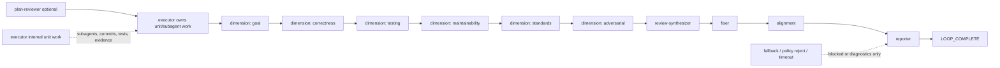

# refactor: make single-chain execution the Ralph primary path

## Overview

本计划把 Ralph 的 CE 执行主线从 `ce-executor-serial` 收敛到单链 `ce-executor-pipeline`。目标不是再修 serial，而是把 serial 暴露出的有价值机制迁移到单链路径，把无效复杂度、专用测试、专用文档和专用 runtime/lint 残留清理干净。

本计划必须按 **纯粹串行、绝对隔离、TDD 闭环** 执行。所有 Unit 必须一个接一个完成；当前 Unit 没有完成编码、测试、复核，不允许进入下一个 Unit。

### Pipeline 硬约束（贯穿所有 Unit）

`presets/en/ce-executor-pipeline.yml` 是已经调好的主线，本计划**不动它的行为层**。允许的改动只有：

- **顶部说明性注释**（文件开头几行 `# ce-executor-pipeline: ...` 等说明文字）
- **`description` 字段**（在不改语义前提下调整措辞）

禁止改动：

- schema（`event_policy.schemas.*`、`required_fields`）
- 任何 hat 的 `instructions:`
- 拓扑（`triggers` / `publishes` / `terminal_events` / `event_filter` / `topic_deny_rules`）
- `event_policy` 整体（mode / on_violation / terminal_topics / business_topics / completion_after_terminal）
- `core.guardrails` 内容
- `event_loop.execution_mode` / `max_iterations` / `max_runtime_seconds`

unit evidence 走现有 `work.done` payload 字段（`tests_run` / `tests_passed` / `commit_count` / `executor_head_sha` / `changed_lines`），不扩 schema、不加新字段。

如果 Unit 2 自检发现现有 schema 缺 unit evidence 必需字段，**整个 plan 暂停**并 raise 给用户决定（见 Unit 2 的 Approach）。

## Execution Contract

每个 Unit 都必须遵守以下硬约束：

- **严格串行**：只允许按 Unit 1 -> Unit 2 -> Unit 3 ... 顺序推进。不得交替开发，不得提前改后续 Unit 的文件。
- **当前 Unit 是孤岛**：当前 Unit 只解决本 Unit 明确列出的边界；不得依赖后续 Unit 才能编译、运行或通过本 Unit 测试。
- **测试先行**：每个 feature-bearing Unit 必须先写当前 Unit 的验收/特征测试。测试只验证当前 Unit 的输入输出或当前文件边界，不写跨后续 Unit 的集成断言。
- **闭环完成**：当前 Unit 的测试红 -> 绿 -> 重构完成后，才算 Unit 完结。不能把当前 Unit 的边界问题留给下一个 Unit。
- **最终全量验证在所有 Unit 后**：Unit 内只跑当前 Unit 的 targeted tests；所有 Unit 完成后再跑全量基线。

## Problem Frame

来源需求明确：`ce-executor-serial` 的重型 runtime unit loop 已经带来多状态源、fallback 成功路径、shipper reason promotion、terminal 后业务事件等复发问题。业务上更稳定的方向是单链执行：executor 内部可以按 unit 分配 subagent，但 Ralph trusted events 主链只看到一个 `work.done` / `work.failed`。

因此本计划做三件事：

1. 扶正 `ce-executor-pipeline`，让它成为推荐 CE executor。
2. 从 active builtin、测试、runtime/lint、docs/skills 中剔除 serial 主线。
3. 保留可复用的通用边界机制，不保留 serial 专用救场和状态机复杂度。

## Requirements Trace

- R1-R4：单链 preset 成为主线；serial 不再作为主力执行模型。
- R5-R9：单消费者、单阶段决策者、fallback fail-close、tasks/progress 不作为业务事实源。
- R10-R15：保留 policy/schema/origin/terminal/diagnostics/review artifact/alignment 等通用机制。
- R16-R22：删除或停用 progress-steward、serial phase authority、shipper success promotion、fallback success path、serial prompt wall、serial-only runtime gate。
- R23-R27：unit 支持移入 executor 内部证据，不引入 runtime unit topic。
- R28-R32：preset author/review skill 增加单链优先审计。
- R33-R35：同步 builtin metadata、CLI docs/completion、agent docs、preset skills。

## Scope Boundaries

- 不保留 `builtin:ce-executor-serial` 兼容 alias。
- 不删除通用 `event_policy`、schema validation、origin guard、terminal guard、diagnostics、policy-check。
- 不禁用 `ce-executor-supervisor`；如发现它直接依赖 serial 文件，只做最小断链修复，不重构 supervisor。
- 不创建 pipeline v2。先扶正并硬化现有 `ce-executor-pipeline`。
- 不把 subagent 禁掉；subagent 只能由 executor 内部管理，不成为 Ralph runtime 主链 topic。

## Context & Research

### Relevant Code and Patterns

- `presets/en/ce-executor-pipeline.yml` 已经是目标单链模式：`tasks.enabled: false`、无 `mechanism.flow`、无 coordinator unit loop。
- `crates/ralph-cli/src/presets.rs`、`presets/manifest.yml`、`presets/index.json`、`scripts/ralph-zsh-plugin.zsh` 是 builtin preset 同步面。
- `crates/ralph-core/tests/scenarios/` 有 pipeline fixtures，也有大量 serial fixtures，需要逐一删除或迁移。
- `crates/ralph-core/src/preset_lint/` 有 serial-derived lint 规则，需要区分通用规则与 serial 专用规则。
- `skills/ralph-preset-common/references/` 是 preset author/review 的共享知识面，必须同步单链优先规则。
- `crates/ralph-core/data/ralph-tools*.md` 会注入给 agent，不能继续把 serial 作为推荐执行路径。

### Institutional Learnings

- `docs/brainstorms/2026-07-02-ce-executor-pipeline-preset-requirements.md`：单链模型稳定性来自无 multi-consumer、无 coordinator loop、无 validator hat、无 re-review loop。
- `docs/brainstorms/2026-07-06-ce-executor-serial-protocol-ssot-convergence-requirements.md`：EmitResult、prompt 减法等思想可保留，但 serial-preservation 方向被本计划取代。
- `docs/report/2026-07-07-*diagnosis.md`：fallback success、task/events drift、shipper reason promotion、terminal window 是必须清理的复发模式。

## Key Technical Decisions

- **直接扶正 `ce-executor-pipeline`**：不先建 pipeline v2，避免新增并行主线。
- **彻底移除 public serial builtin**：registry、manifest、index、completion、active docs 一起清理。
- **无兼容 alias**：兼容会保留错误入口。
- **测试也删干净**：serial-only fixtures/tests 删除，不保留 ignored tests。
- **先删 active surface，再删 runtime/lint 残留**：避免边删 runtime 边让 public preset 仍引用它。
- **每个 Unit 自测闭环**：不允许依赖后续 Unit 的测试或文件改动来证明当前 Unit 正确。

## High-Level Technical Design

> *This illustrates the intended approach and is directional guidance for review, not implementation specification. The implementing agent should treat it as context, not code to reproduce.*



## Implementation Units

- [ ] **Unit 1: Registry 边界切换为 pipeline 主线**

**Goal:** 只处理 builtin registry / manifest / index / completion 的主入口切换，让 `ce-executor-serial` 不再是 public embedded builtin，`ce-executor-pipeline` 成为推荐 CE executor。

**Requirements:** R1-R4, R33, SC4

**Dependencies:** 无。不得修改 scenario fixtures、runtime/lint 逻辑、agent docs；这些属于后续 Unit。

**Files:**
- Modify: `presets/manifest.yml`
- Modify: `presets/index.json`
- Modify: `crates/ralph-cli/src/presets.rs`
- Modify: `scripts/ralph-zsh-plugin.zsh`
- Modify: `presets/en/ce-executor-pipeline.yml`（**仅顶部注释 + `description` 字段**；详见 Approach 与 Overview 硬约束）
- Delete: `presets/en/ce-executor-serial.yml`
- Delete: `presets/schemas/ce-executor-serial.yml`
- Test: `crates/ralph-cli/src/presets.rs`
- Test: `crates/ralph-cli/src/init.rs`

**Pre-flight checklist（动手前先确认）:**
- [ ] `git status` 干净，工作区无未提交改动。
- [ ] 当前 commit 在 `pittcat-dev` 分支。
- [ ] `ls presets/en/ce-executor-pipeline.yml presets/en/ce-executor-serial.yml presets/schemas/ce-executor-serial.yml` 三个文件都存在（如果某个缺失，停下来 raise）。
- [ ] 上一轮 baseline `cargo nextest run -p ralph-cli --bin ralph -- preset` 是绿的（如果不是，先修）。
- [ ] 没有 worktree 正在跑 serial preset（避免 Unit 1 中途被别的 loop 改回）。

**Step-by-step:**

1. **Step 1.1 — 写 TDD 失败用例（红）**：`crates/ralph-cli/src/presets.rs` 增加 3 个失败断言：
   - `test_preset_names_contains_pipeline`：断言 `preset_names()` 包含 `"ce-executor-pipeline"`。
   - `test_preset_names_excludes_serial`：断言 `preset_names()` 不包含 `"ce-executor-serial"`。
   - `test_get_preset_serial_returns_none`：断言 `get_preset("ce-executor-serial")` 返回 `None`（不是错误，是真的 None）。
   - `test_no_serial_to_pipeline_alias`：断言没有把 `ce-executor-serial` 当成 `ce-executor-pipeline` 别名的代码路径。
   - 跑 `cargo nextest run -p ralph-cli --bin ralph -- preset` 看到 3 个新断言红（serial 还在所以 1 还会失败）。
2. **Step 1.2 — 从 `presets/manifest.yml` 移除 serial**：删除 `embedded:` 列表中 `ce-executor-serial` 行。同步把 `presets/index.json` 的 `presets[]` 数组删掉 `ce-executor-serial` 条目。
3. **Step 1.3 — 从 `crates/ralph-cli/src/presets.rs` 移除 serial**：
   - 从 `PRESETS` 数组删除 `EmbeddedPreset { name: "ce-executor-serial", ... }`。
   - 删除 `description` 字面量里引用 serial 的注释/字符串。
   - 如果有 `TIER_0_WAC_PRESETS` 常量，从数组移除 `"ce-executor-serial"`。
   - 如果 pipeline 还没在 Tier-0，根据 lint 状态加进去；不加进去也要把 Tier-0 收紧为「当前有效 entries」（不要为了让数量不变硬塞）。
4. **Step 1.4 — 从 `scripts/ralph-zsh-plugin.zsh` 移除 serial**：删除所有 `compadd ... builtin:ce-executor-serial ...` 段。保留 `compadd` 写法，不要切到 `_describe`（项目硬约束）。
5. **Step 1.5 — 微调 `presets/en/ce-executor-pipeline.yml` 顶部注释和 description（Pipeline 硬约束边界内）**：
   - 仅改文件顶部 `# ce-executor-pipeline: ...` 块（含 "Pattern: ..." / "Why this architecture:" 等说明文字）和顶层的 `description` 字段（如改为 `"Linear single-chain plan-driven CE executor (Ralph primary path). Executor owns unit/subagent work."`）。
   - **绝对不动** `event_loop`、`event_policy`、`topic_deny_rules`、`event_policy.schemas`、`core.guardrails`、任何 hat 的 `instructions:`、execution_mode / max_iterations / max_runtime_seconds。
   - 在 PR description 写明「Pipeline 改动仅限顶部注释 + description，behavior 层零改动」，作为审阅快速索引。
6. **Step 1.6 — 删 serial 文件**：
   - `rm presets/en/ce-executor-serial.yml`
   - `rm presets/schemas/ce-executor-serial.yml`
   - 这两步**必须**在 Step 1.3 之后执行；如果还有别处引用 serial 文件，先在 Step 1.7 之前把引用清掉。
7. **Step 1.7 — 修 `crates/ralph-cli/src/init.rs` 默认 preset**：把所有默认 preset 引用从 `ce-executor-serial` 改为 `ce-executor-pipeline`。如果有 init test 期望 serial，改成期望 pipeline。
8. **Step 1.8 — 重跑 Step 1.1 的测试（绿）**：`cargo nextest run -p ralph-cli --bin ralph -- preset` 应全绿。

**Code skeleton（Step 1.1 关键断言示意）:**

```rust
// crates/ralph-cli/src/presets.rs
#[test]
fn test_preset_names_excludes_serial() {
    let names = crate::presets::preset_names();
    assert!(!names.iter().any(|n| n == "ce-executor-serial"),
        "ce-executor-serial must not appear in preset_names(); got {names:?}");
}

#[test]
fn test_get_preset_serial_returns_none() {
    assert!(crate::presets::get_preset("ce-executor-serial").is_none(),
        "ce-executor-serial lookup must return None, not a redirect");
}

#[test]
fn test_no_serial_to_pipeline_alias() {
    // grep-style assertion: there is no code path that maps "ce-executor-serial"
    // to "ce-executor-pipeline" (which would silently re-introduce serial as a
    // public surface under a different name).
    for (alias, canonical) in crate::presets::builtin_aliases() {
        assert!(!(alias == "ce-executor-serial" && canonical == "ce-executor-pipeline"),
            "ce-executor-serial must not be aliased to ce-executor-pipeline");
    }
}
```

**Completion gate（本 Unit 完结前必须满足）:**
- 4 个 Step 1.1 新增断言全绿。
- `presets/en/ce-executor-serial.yml` 与 `presets/schemas/ce-executor-serial.yml` 已从磁盘删除，且 `git status` 不显示它们。
- `presets/en/ce-executor-pipeline.yml` 与本 git diff 中只动了顶部注释和 description 字段（用 `git diff presets/en/ce-executor-pipeline.yml` 人工复核）。
- 所有 init test 绿；不再有断言 `ce-executor-serial` 是默认 preset。

**Isolation guardrails:**
- Do not edit scenario files in this Unit.
- Do not edit runtime fallback code in this Unit.
- Do not update injected agent docs in this Unit.
- Unit 1 must compile/test its registry boundary without relying on any later cleanup.

**Test scenarios:**
- Happy path: public preset list contains pipeline and no serial.
- Error path: lookup of `ce-executor-serial` fails explicitly.
- Regression: supervisor/debug/autoresearch/merge-batch listings are unchanged.
- Completion: zsh builtin values no longer contain serial.

**Verification:**
- Targeted:
  - `cargo nextest run -p ralph-cli --bin ralph -- preset`
  - `cargo nextest run -p ralph-cli --bin ralph -- preflight`
  - `rtk grep "builtin:ce-executor-serial" scripts/ralph-zsh-plugin.zsh presets/index.json crates/ralph-cli/src/presets.rs` 无 active recommendation 或 registry 条目。
- 复核：`git diff --stat presets/en/ce-executor-pipeline.yml` 只触碰 description / 顶部注释行（人工核对）。

- [ ] **Unit 2: Pipeline schema 静态自检 — 证明现有 payload 已承载 unit evidence**

**Goal:** 不修改 pipeline，只做静态校验：证明 pipeline 现有的 `work.done` payload schema（`tests_run` / `tests_passed` / `commit_count` / `executor_head_sha` / `changed_lines`）已能承载 unit-level evidence，无需扩字段。如果自检发现缺失，**立即停止 plan 后续 Unit**，raise 给用户决定是否扩 pipeline（违反 Overview 的 Pipeline 硬约束）。

**Requirements:** R4, R23-R27 (无 schema 扩展语义), SC1, SC2

**Dependencies:** Unit 1 完成。**本 Unit 不修改 pipeline 任何字段**（连 Unit 1 中允许的顶部注释/description 改动都已完成）。

**Files:**
- Test: `crates/ralph-cli/src/presets.rs`（断言 pipeline 的 `event_policy.schemas.work.done.required_fields` 包含 unit evidence 必需字段集合）
- Test: `crates/ralph-core/tests/scenarios/ce_executor_pipeline.yml`（仅断言 mock payload 已携带必需字段，不改 fixture）
- Test: `crates/ralph-core/tests/scenarios.rs`（断言 pipeline scenario 的 `work.done` payload 字段已满足下游 review/fix/report 读取证据的需求）

**Pre-flight checklist:**
- [ ] Unit 1 已完成（serial 公共入口已删）。
- [ ] `presets/en/ce-executor-pipeline.yml` 内容未被人动过（`git diff presets/en/ce-executor-pipeline.yml` 只显示 Unit 1 允许的顶部注释 + description 改动）。
- [ ] `crates/ralph-core/tests/scenarios/ce_executor_pipeline.yml` 存在并能跑（先跑一遍 baseline）。

**Step-by-step:**

1. **Step 2.1 — 写 schema 静态校验 helper（红）**：
   - 在 `crates/ralph-cli/src/presets.rs` 加一个 test-only helper `parse_pipeline_work_done_required_fields() -> BTreeSet<String>`：读 `presets/en/ce-executor-pipeline.yml`，定位 `event_loop.event_policy.schemas.work.done.required_fields`，返回集合。
   - 写 `test_pipeline_work_done_required_fields_covers_unit_evidence`：断言该集合**等于** `{plan_name, plan_path, executor_head_sha, resolved_baseline_sha, tests_run, tests_passed, changed_lines, commit_count}`（用 `BTreeSet::eq` 比较，避免顺序敏感）。
2. **Step 2.2 — 跑 pipeline scenario happy path（绿/红？）**：
   - `cargo nextest run -p ralph-core --test scenarios -- ce_executor_pipeline` 跑现有 fixture。
   - 在 `crates/ralph-core/tests/scenarios.rs` 加测试 `test_pipeline_work_done_payload_carries_unit_evidence`：加载 fixture，从 mock_response 中取 `work.done` 事件，断言 payload 字段集合 ⊇ unit evidence 必需字段集合。
3. **Step 2.3 — 跑 blocked scenario**：
   - 跑 `crates/ralph-core/tests/scenarios/ce_executor_pipeline_blocked.yml`（如不存在先建最简 fixture：`work.failed{plan_name, reason}`）。
   - 加测试 `test_pipeline_work_failed_payload_minimal`：断言 `work.failed` payload 字段 ⊇ `{plan_name, reason}`。
4. **Step 2.4 — 写「下游不依赖 runtime 中间 topic」断言**：
   - 加测试 `test_pipeline_schema_has_no_runtime_unit_loop_topics`：解析 pipeline YAML，对所有 hat 的 `triggers` + `publishes` 联合集合求并集，断言它**与** `{unit.ready, unit.done, unit.validated, test.passed, test.failed}` 的交集为空。
   - 这一条防止未来误把 unit-loop topic 加回 pipeline（静态锁门）。
5. **Step 2.5 — 失败兜底 path**：
   - 如果 Step 2.1 / 2.2 / 2.4 任一失败：
     - 写 diagnostics 到 `.ralph/agent/decisions.md`，记录「Pipeline schema 自检失败：缺失字段 = {...}」；
     - **停止整个 plan**：在 PR body / 当前对话 raise 给用户，给出两个选项：
       - (a) 接受缺字段，在 SC 中记录限制，Unit 3-7 继续按「pipeline 现有能力」执行；
       - (b) 重新评估 Pipeline 硬约束，授权扩 schema（需用户明确 approve，本 Unit 不擅自扩）。
   - 如果 Step 2.3 失败（blocked scenario 缺失），由本 Unit 补一个最简 blocked fixture（read-only 补 scenario，不动 pipeline），重跑直到绿。

**Code skeleton（Step 2.1 + Step 2.4 示意）:**

```rust
// crates/ralph-cli/src/presets.rs
use std::collections::BTreeSet;

const UNIT_EVIDENCE_FIELDS: &[&str] = &[
    "executor_head_sha",
    "tests_run",
    "tests_passed",
    "commit_count",
    "changed_lines",
];

fn parse_pipeline_work_done_required_fields() -> BTreeSet<String> {
    let yaml = std::fs::read_to_string("presets/en/ce-executor-pipeline.yml")
        .expect("read pipeline preset");
    let v: serde_yaml::Value = serde_yaml::from_str(&yaml).expect("parse pipeline yaml");
    v["event_loop"]["event_policy"]["schemas"]["work.done"]["required_fields"]
        .as_sequence()
        .expect("work.done.required_fields must be a list")
        .iter()
        .map(|s| s.as_str().unwrap().to_string())
        .collect()
}

#[test]
fn test_pipeline_work_done_required_fields_covers_unit_evidence() {
    let required: BTreeSet<String> = parse_pipeline_work_done_required_fields();
    let needed: BTreeSet<String> = UNIT_EVIDENCE_FIELDS.iter().map(|s| s.to_string()).collect();
    assert!(required.is_superset(&needed),
        "pipeline work.done schema missing unit evidence fields. missing = {:?}",
        needed.difference(&required).collect::<Vec<_>>());
}

#[test]
fn test_pipeline_schema_has_no_runtime_unit_loop_topics() {
    let yaml = std::fs::read_to_string("presets/en/ce-executor-pipeline.yml").unwrap();
    let v: serde_yaml::Value = serde_yaml::from_str(&yaml).unwrap();
    let forbidden: BTreeSet<&str> = ["unit.ready", "unit.done", "unit.validated",
        "test.passed", "test.failed"].iter().copied().collect();
    let hats = v["hats"].as_mapping().unwrap();
    let mut all_topics: BTreeSet<String> = BTreeSet::new();
    for (_name, hat) in hats {
        for key in ["triggers", "publishes"] {
            if let Some(seq) = hat[key].as_sequence() {
                for t in seq {
                    if let Some(s) = t.as_str() {
                        all_topics.insert(s.to_string());
                    }
                }
            }
        }
    }
    let hit: Vec<&String> = all_topics.iter()
        .filter(|t| forbidden.contains(t.as_str())).collect();
    assert!(hit.is_empty(),
        "pipeline must not reference runtime unit-loop topics; found = {hit:?}");
}
```

**Completion gate:**
- Step 2.1 / 2.2 / 2.3 / 2.4 全部绿。
- `presets/en/ce-executor-pipeline.yml` 在 `git diff` 中只显示 Unit 1 允许的顶部注释 + description 改动；本 Unit 零 schema 改动。
- Step 2.5 失败兜底 path 未触发（即自检通过）。

**Isolation guardrails:**
- **不修改 `presets/en/ce-executor-pipeline.yml` 任何字段**（含 Unit 1 允许的注释/description 改动也已收敛）。
- **不修改 `presets/schemas/`** 任何内容。
- 不改 builtin registry、runtime fallback、serial 文件。
- 本 Unit 是 read-only 自检；不动 schema，不动 code。

**Test scenarios:**
- Happy path: pipeline schema 自检通过，work.done payload 字段完备。
- Edge case: blocked scenario 中 `work.failed` payload 字段满足需求。
- Regression: pipeline scenario 跑完后下游 review/fix/report 不依赖任何 runtime 中间 topic。
- 失败兜底: 自检失败时测试套件失败并提示需要 raise 给用户。

**Verification:**
- Targeted:
  - `cargo nextest run -p ralph-cli --bin ralph -- pipeline_schema_static_check`（新测试函数名）
  - `cargo nextest run -p ralph-core --test scenarios -- ce_executor_pipeline`
- 静态复核：`git diff --stat presets/en/ce-executor-pipeline.yml` 与 Unit 1 末态一致；本 Unit 没新增行。
- `rtk grep "unit.ready\\|unit.done\\|test.passed\\|validator" presets/en/ce-executor-pipeline.yml` **不要求清空**（pipeline 是 read-only，仅断言不引入新的 runtime unit-loop 依赖；如果 grep 发现既有引用是历史解释性文本，保持不动）。

- [ ] **Unit 3: Serial scenario 与 fixture 清理**

**Goal:** 只处理测试面，把 serial-only scenarios、fixtures、CLI integration tests 清理或迁移为 generic/pipeline 测试。

**Requirements:** R2, R16-R22, R33, SC3, SC4, SC6

**Dependencies:** Unit 2 完成。不得修改 runtime/lint 实现；只删/迁测试和 fixture。

**Files:**
- Delete or modify: `crates/ralph-core/tests/scenarios/ce_executor_serial_*.yml`
- Delete or modify: `crates/ralph-core/tests/scenarios/serial_phase_*.yml`
- Delete or modify: `crates/ralph-core/tests/scenarios/2026-06-29-007-*.yml`
- Delete or modify: `crates/ralph-core/tests/scenarios/2026-06-30-001-*.yml`
- Delete or modify: `crates/ralph-core/tests/scenarios/2026-07-01-002-*.yml`
- Delete or modify: `crates/ralph-core/tests/scenarios/2026-07-06-task-not-terminal-coordinator-recovery.yml`
- Delete or modify: `crates/ralph-core/tests/scenarios/2026-07-07-004-u1-coordinator-task-create-forbidden.yml`
- Modify: `crates/ralph-core/tests/scenarios.rs`
- Modify: `crates/ralph-cli/tests/integration_emit_policy.rs`

**Pre-flight checklist:**
- [ ] Unit 2 通过；pipeline scenario 仍在跑。
- [ ] 当前 commit hash 记下来（用于 rollback）。
- [ ] 工作区只有 Unit 2 的改动。
- [ ] `git ls-files crates/ralph-core/tests/scenarios/ | grep -E '(ce_executor_serial|serial_phase|2026-06-29-007|2026-06-30-001|2026-07-01-002|2026-07-06-task-not-terminal|2026-07-07-004-u1-coordinator)'` 输出待删清单（如果某些文件已被人删，跳过）。

**Step-by-step:**

1. **Step 3.1 — 本地清单（在动手前写 PR body / `.ralph/agent/decisions.md`）**：

   对每个待删/待迁 fixture 做三分类（Delete / Migrate / Keep），示例格式：

   ```text
   ## Unit 3 fixture inventory (2026-07-07)
   - crates/ralph-core/tests/scenarios/ce_executor_serial_happy_path.yml
     - classification: Delete
     - reason: serial unit-loop fixture; pipeline scenario 已覆盖同等行为
     - replacement: `ce_executor_pipeline.yml` 已存在，无需新建
   - crates/ralph-core/tests/scenarios/serial_phase_authority_branching.yml
     - classification: Delete
     - reason: serial phase authority 专用；Unit 4 删 phase_authority 模块后该 fixture 无所依附
     - replacement: 无（runtime 已删，fixture 失去保护目标）
   - crates/ralph-core/tests/scenarios/2026-07-06-task-not-terminal-coordinator-recovery.yml
     - classification: Migrate → generic blocked/fail 断言
     - reason: 后置业务事件拒绝是 generic 行为，不属于 serial 专用
     - replacement: 新建 `generic_post_terminal_business_rejected.yml`
   ```

2. **Step 3.2 — 先 Migrate 再 Delete**：先把「Migrate」类条目替换为 generic/pipeline fixture，确认绿再删 Delete 类；不要一次性删，避免一次 rollback 多个。
3. **Step 3.3 — 写 TDD 失败用例（红）**：
   - 在 `crates/ralph-core/tests/scenarios.rs` 加测试 `test_no_serial_only_scenario_registration`：枚举所有 `inventory_scenario()` 调用，断言没有文件名匹配 `ce_executor_serial_*` 或 `serial_phase_*`。
   - 加测试 `test_retained_scenarios_pipeline_or_generic_only`：枚举所有保留的 fixture，对每个解析 frontmatter，断言要么 `preset == "ce-executor-pipeline"`，要么是 generic（不绑定具体 preset）。
4. **Step 3.4 — 删 serial-only fixture 文件**：
   - 按 Step 3.1 清单的 Delete 部分逐个 `git rm <file>`。
   - **不留 ignored test**：不要 `git rm --cached` 后保留 .gitignore 痕迹。
5. **Step 3.5 — 改 `crates/ralph-core/tests/scenarios.rs` 注册表**：移除所有指向已删 fixture 的 `inventory_scenario!(...)` 调用；如果 Step 3.1 标记 Migrate 的 fixture 已替换，改 `inventory_scenario!` 宏里的路径。
6. **Step 3.6 — 改 `crates/ralph-cli/tests/integration_emit_policy.rs`**：把所有仅需 preset 的 case 的 `preset_name` 参数从 `ce-executor-serial` 改为 `ce-executor-pipeline`。如果某 case 专门验证 serial 独有行为，删除该 case（不保留）。
7. **Step 3.7 — 跑测试（绿）**：
   - `cargo nextest run -p ralph-core --test scenarios`。
   - `cargo nextest run -p ralph-cli --test integration_emit_policy`。
   - `cargo nextest run -p ralph-core -- preset_lint`（如果 preset_lint 测试仍引用已删 serial fixture，会失败；按报错继续清理）。

**Code skeleton（Step 3.3 示意）:**

```rust
// crates/ralph-core/tests/scenarios.rs
#[test]
fn test_no_serial_only_scenario_registration() {
    let registered = inventory_scenario_names(); // helper 你需要在 scenarios.rs 加
    let serial_only: Vec<&str> = registered.iter()
        .filter(|n| n.contains("ce_executor_serial")
                  || n.contains("serial_phase")
                  || n.starts_with("2026-06-29-007")
                  || n.starts_with("2026-06-30-001")
                  || n.starts_with("2026-07-01-002")
                  || n.contains("2026-07-06-task-not-terminal-coordinator")
                  || n.contains("2026-07-07-004-u1-coordinator"))
        .map(|s| s.as_str())
        .collect();
    assert!(serial_only.is_empty(),
        "serial-only scenarios must be removed in Unit 3; remaining = {serial_only:?}");
}
```

**Completion gate:**
- Step 3.3 两个测试全绿。
- `git ls-files crates/ralph-core/tests/scenarios/ | grep -E '(ce_executor_serial|serial_phase|2026-06-29-007|2026-06-30-001|2026-07-01-002|2026-07-06-task-not-terminal|2026-07-07-004-u1-coordinator)'` 输出为空。
- `integration_emit_policy` 不再引用 `ce-executor-serial` 作为 preset 字符串。
- 无 `#[ignore]` / `#[cfg(not(test))]` 残留在已删 fixture 的引用上。

**Isolation guardrails:**
- Do not edit runtime/lint source in this Unit.
- Do not edit docs/skills in this Unit.
- Unit 3 must leave scenario tests compiling with current runtime even before Unit 4 cleanup.

**Test scenarios:**
- Cleanup: no active scenario filename starts with `ce_executor_serial` or `serial_phase`.
- Cleanup: no active scenario asserts progress-steward, shipper recoverable whitelist, or serial handoff envelope behavior.
- Happy path: pipeline scenarios still cover success.
- Error path: retained non-serial scenario covers post-terminal rejection.
- Error path: retained non-serial scenario covers fallback blocked/fail without success.

**Verification:**
- Targeted:
  - `cargo nextest run -p ralph-core --test scenarios`
  - `cargo nextest run -p ralph-cli --test integration_emit_policy`
  - `cargo nextest run -p ralph-core -- preset_lint`
  - `rtk grep -l "ce_executor_serial\\|serial_phase\\|progress.steward\\|shipper.*recoverable" crates/ralph-core/tests/scenarios/ crates/ralph-cli/tests/` 无输出。

- [ ] **Unit 4: Serial-only runtime/lint 清算**

**Goal:** 只处理 runtime/lint 中依赖 serial 的专用分支，删除或降级为 generic blocked/diagnostic 行为。

**Requirements:** R7-R9, R16-R22, SC3, SC6

**Dependencies:** Unit 3 完成。不得再改 registry/pipeline executor/scenario inventory，除非 Unit 4 的测试必须迁移一个当前 runtime generic assertion。

**Files:**
- Modify: `crates/ralph-core/src/config/loop_config.rs`
- Modify: `crates/ralph-core/src/event_loop/mod.rs`
- Modify: `crates/ralph-core/src/event_loop/loop_state.rs`
- Modify: `crates/ralph-core/src/drift/engine.rs`
- Modify: `crates/ralph-core/src/correction/mod.rs`
- Modify: `crates/ralph-core/src/preset_lint/mod.rs`
- Modify: `crates/ralph-core/src/preset_lint/finding_id.rs`
- Modify or delete: `crates/ralph-core/src/preset_lint/phase_authority.rs`
- Modify or delete: `crates/ralph-core/src/preset_lint/strict_reason_routing.rs`
- Modify or delete: `crates/ralph-core/src/preset_lint/review_complete_misrouted.rs`
- Test: `crates/ralph-core/src/preset_lint/tests/`
- Test: retained non-serial scenarios from Unit 3

**Pre-flight checklist:**
- [ ] Unit 3 通过；`scenarios` 和 `integration_emit_policy` 测试全绿。
- [ ] 当前工作区 baseline：`cargo nextest run -p ralph-core -- preset_lint` 是绿的。
- [ ] 没有 supervisor-specific lint 修改计划（supervisor 必须保持工作）。
- [ ] 已 grep `crates/ralph-core/src/preset_lint/` 确认 serial 专用模块是 `phase_authority.rs` / `strict_reason_routing.rs` / `review_complete_misrouted.rs` 三件（如果发现更多，append 到 Files 列表）。

**Step-by-step:**

1. **Step 4.1 — 写 fallback 失败兜底测试（红）**：
   - 在 `crates/ralph-core/src/event_loop/tests/` 加测试 `test_fallback_recovery_cannot_produce_success`：
     - 构造一个 fallback/recovery 注入事件，使其走到 fallback branch；
     - 断言终态 verdict ∈ {`blocked`, `failed`}，**绝不**等于 `pass` 或 `pass_with_residuals`。
   - 在 `crates/ralph-core/src/correction/tests/` 加测试 `test_correction_module_no_success_promotion_for_shipper`：
     - 注入一个 `recovery_reason` 形如 `shipper_recoverable: ...` 的事件；
     - 断言结果走 blocked/fail 分支，不是 success 分支。
2. **Step 4.2 — 删 `phase_authority.rs` 模块**：
   - 删 `crates/ralph-core/src/preset_lint/phase_authority.rs`。
   - 从 `crates/ralph-core/src/preset_lint/mod.rs` 删 `mod phase_authority;` 和 `pub use phase_authority::*;`。
   - 从 `crates/ralph-core/src/preset_lint/finding_id.rs` 删相关 finding 常量。
   - 在 `tests/` 删相关测试。
   - 跑 `cargo nextest run -p ralph-core -- preset_lint`，期望清理后仍绿（如果某些 supervisor preset 还引用 `phase_authority`，停下来 raise——这是 Unit 4 与 supervisor 的硬冲突，先讨论再删）。
3. **Step 4.3 — 删 `strict_reason_routing.rs` 模块**（如果它**仅**服务于 serial shipper whitelist）：
   - 同 Step 4.2 的删除流程。
   - **判断标准**：搜 `strict_reason_routing` 的所有调用点；如果有任何调用点是「非 shipper / 非 serial / generic reason routing」，则降级为 generic（保留模块，删 shipper 分支），不是直接删。
4. **Step 4.4 — 删 `review_complete_misrouted.rs`**：
   - 同 Step 4.2 流程。
   - 这一条历史上是为 serial `review.complete` 误投递设计；pipeline 已有 `topic_deny_rules` 覆盖同样语义。
5. **Step 4.5 — 改 `event_loop/mod.rs` + `loop_state.rs` + `drift/engine.rs` + `correction/mod.rs`**：
   - 删所有针对 `shipper` 这个 hat-id 的成功 promotion 分支（grep `shipper` 在这些文件里，逐个核对）。
   - `default_publishes` 路径如果会把 stall / ForcePlanBlocked 推到成功终态，改成只能到 blocked/fail 或 diagnostics。
   - 注释里"for serial"或"for serial recovery"的描述性文本改写为"generic blocked reporting"或删。
6. **Step 4.6 — 写 finding_id 静态锁门测试（红→绿）**：
   - 在 `crates/ralph-core/src/preset_lint/tests/` 加测试 `test_no_serial_only_finding_id_exported`：
     - 反射枚举 `finding_id.rs` 中的所有 `pub const`；
     - 对每个常量名字符串，断言它不是 `phase_authority_*` / `strict_reason_*` / `serial_*` / `shipper_*` 中缀；
     - 这一条防止未来又把 serial-only finding_id 偷偷加回来。
7. **Step 4.7 — 跑全 preset_lint 测试**：
   - `cargo nextest run -p ralph-core -- preset_lint`。
   - 期望绿；如果有 supervisor-specific lint 因引用被删模块而崩，停下来回滚 Step 4.2-4.4 中相关项，并重新评估。
8. **Step 4.8 — 跑 Unit 3 留下的非 serial scenario**：
   - `cargo nextest run -p ralph-core --test scenarios`。
   - 重点看 fallback/policy reject 的 generic scenario 仍是 blocked/fail。

**Code skeleton（Step 4.1 + Step 4.6 示意）:**

```rust
// crates/ralph-core/src/event_loop/tests/fallback.rs (新增)
#[test]
fn test_fallback_recovery_cannot_produce_success() {
    let mut state = make_test_state();
    state.inject_event(test_event(
        topic: "fallback.blocked",
        payload: serde_json::json!({"reason": "policy_rejected"}),
    ));
    let terminal = run_until_terminal(&mut state);
    assert!(matches!(terminal.verdict(),
        TerminalVerdict::Blocked | TerminalVerdict::Failed),
        "fallback must not promote to success; got {:?}", terminal.verdict());
    assert!(!matches!(terminal.verdict(),
        TerminalVerdict::Pass | TerminalVerdict::PassWithResiduals),
        "fallback must NEVER reach pass / pass_with_residuals");
}
```

```rust
// crates/ralph-core/src/preset_lint/tests/finding_id_lock.rs (新增)
use crate::preset_lint::finding_id;

#[test]
fn test_no_serial_only_finding_id_exported() {
    // 反射枚举（如果 finding_id 是 enum，用 variants；如果 是 const，用 inventory）
    let all = finding_id::all_finding_id_strings();
    let forbidden_substr = ["phase_authority", "strict_reason", "serial_", "shipper_"];
    let hits: Vec<&str> = all.iter()
        .filter(|id| forbidden_substr.iter().any(|p| id.contains(p)))
        .map(|s| s.as_str())
        .collect();
    assert!(hits.is_empty(),
        "no serial-only finding_id may remain exported; got {hits:?}");
}
```

**Completion gate:**
- Step 4.1 / 4.6 / 4.7 / 4.8 全部绿。
- `phase_authority.rs` / `strict_reason_routing.rs` / `review_complete_misrouted.rs` 三件已删或已降级为 generic。
- `finding_id.rs` 中无 `phase_authority_*` / `strict_reason_*` / `serial_*` / `shipper_*` 中缀的常量。
- `event_loop/mod.rs` + `loop_state.rs` + `drift/engine.rs` + `correction/mod.rs` 中无 shipper 分支的成功 promotion 路径。
- supervisor preset 仍能 `cargo run -p ralph-cli --bin ralph -- preset_lint <supervisor preset>` 通过。

**Isolation guardrails:**
- Do not edit docs/skills in this Unit.
- Do not reintroduce serial fixtures to make runtime tests pass.
- Unit 4 must leave generic non-serial runtime behavior covered by its own tests.

**Test scenarios:**
- Error path: fallback-injected blocked/fail reaches reporter as blocked/fail, never success.
- Error path: post-terminal business event is rejected in non-serial fixture.
- Cleanup: no test imports deleted serial-only finding IDs.
- Regression: generic preset lint rules still report expected findings.
- Regression: supervisor-specific lint remains intact.

**Verification:**
- Targeted:
  - `cargo nextest run -p ralph-core -- preset_lint`
  - `cargo nextest run -p ralph-core --test scenarios`
  - `cargo nextest run -p ralph-core -- event_loop`（如果存在针对 event_loop 的 test target）
  - `rtk grep "shipper\\|serial.*recovery\\|phase_authority\\|strict_reason_routing" crates/ralph-core/src/event_loop/ crates/ralph-core/src/correction/ crates/ralph-core/src/drift/ crates/ralph-core/src/preset_lint/` 仅剩 generic / 历史注释。

- [ ] **Unit 5: 人类文档与 agent-facing 文档同步**

**Goal:** 只处理人类文档、CLI 示例、agent 注入指南，确保不再把 serial 当推荐路径。

**Requirements:** R1-R4, R10-R15, R33-R35

**Dependencies:** Unit 4 完成。不得修改 code behavior；只改文档/示例/帮助文案。

**Files:**
- Modify: `AGENTS.md`
- Modify: `CLAUDE.md`
- Modify: `.cursor/rules/multi-hat-isolation.mdc`
- Modify: `crates/ralph-core/data/ralph-tools.md`
- Modify: `crates/ralph-core/data/ralph-tools-cmdref.md`
- Modify: `crates/ralph-core/data/ralph-tools-emit.md`
- Modify: `crates/ralph-core/data/ralph-tools-tasks.md`
- Modify: `crates/ralph-core/data/ralph-tools-recovery-directives.md`
- Modify: `crates/ralph-cli/sops/addendums/pdd-ralph.md`
- Modify: `crates/ralph-cli/sops/code-task-generator.md`
- Modify: `crates/ralph-cli/sops/pdd.md`
- Modify: `crates/ralph-cli/src/commands/init.rs`
- Modify: `crates/ralph-cli/src/commands/tutorial.rs`
- Test: `scripts/check-cli-doc-drift.sh`

**Pre-flight checklist:**
- [ ] Unit 4 通过；preset_lint / scenarios / event_loop 测试全绿。
- [ ] `diff CLAUDE.md AGENTS.md` 当前内容一致（如果不一致，先在 Unit 5 之前 `cp CLAUDE.md AGENTS.md` 同步，作为 baseline）。
- [ ] 当前 docs 检查脚本 `scripts/check-cli-doc-drift.sh` baseline 绿。
- [ ] 已 grep 出每个 doc 文件中提到 `ce-executor-serial` 的行号清单（用 `rg -n "ce-executor-serial" <file>` 准备改写位置）。

**Step-by-step:**

1. **Step 5.1 — 写 doc-drift 静态锁门测试（红）**：
   - 在 `scripts/check-cli-doc-drift.sh`（或新加一个 `scripts/check-serial-stale-references.sh`）加规则：
     - 主动扫描 `AGENTS.md` / `CLAUDE.md` / `.cursor/rules/multi-hat-isolation.mdc` / `crates/ralph-core/data/*.md` / `crates/ralph-cli/sops/**/*.md` / `init.rs` / `tutorial.rs`；
     - 排除 `docs/report/` / `docs/brainstorms/` / 旧 `docs/plans/` / `skills/`（skill 是 Unit 6 范围）；
     - 任何 active 文档命中 `ce-executor-serial` 或 `progress-steward` 或 `shipper reason` 时，exit 1。
   - 跑：脚本应失败（red），因为还没改。
2. **Step 5.2 — 改 `AGENTS.md` 与 `CLAUDE.md`**：
   - 「Presets & Hats System」段 builtin preset 列表：`ce-executor-serial` 整行删，pipeline 的 description 改成「Ralph primary path」基调。
   - 「Build & Test」段、`Quick Reference`、其他提到 serial 的段落：替换为 pipeline 或直接删除。
   - 「Multi-Hat Isolation Policy」段：保留通用规则，删任何「serial 专用」举例。
   - **改完后** `cp CLAUDE.md AGENTS.md`（保持完全一致；如果有偏差会被 Unit 7 抓到）。
3. **Step 5.3 — 改 `.cursor/rules/multi-hat-isolation.mdc`**：
   - 删 `ce-executor-serial` 的引用，必要时改为 historical anti-pattern 段落。
   - 保留通用 3-hat / 4+ hat 规则；pipeline 仍需 `event_loop.execution_mode: isolated`，不因文档改而改。
4. **Step 5.4 — 改 `crates/ralph-core/data/*.md`**（agent 注入文档）：
   - `ralph-tools.md`：删任何 serial 推荐路径示例；提到 `ce-executor-pipeline` 作为单链代表。
   - `ralph-tools-cmdref.md`：preset 推荐表把 pipeline 标 primary，serial 整行删。
   - `ralph-tools-emit.md`：如果「handoff envelope」段是 serial 专用，整段删或改写为 generic 事件 envelope。
   - `ralph-tools-tasks.md`：保留 generic task API；删任何「serial 用 tasks 当业务事实源」描述。
   - `ralph-tools-recovery-directives.md`：删任何「shipper reason recovery → success」描述。
   - **不泄漏内部实现细节**（per CLAUDE.md 硬约束）：不要在注入 doc 里说 `phase_authority` / `enforce_hat_scope` / `recovery_runtime::*` 这些内部名。
   - **写「agent 下一步能做什么」格式**：trigger condition → command → field source → failure stop condition。
5. **Step 5.5 — 改 SOP 文件**：
   - `crates/ralph-cli/sops/addendums/pdd-ralph.md`：把示例 preset 从 serial 改成 pipeline。
   - `crates/ralph-cli/sops/code-task-generator.md`：同上。
   - `crates/ralph-cli/sops/pdd.md`：同上。
6. **Step 5.6 — 改 `init.rs` 与 `tutorial.rs`**：
   - 把所有提示用户用 `ce-executor-serial` 的字符串改为 `ce-executor-pipeline`。
   - 如果有断言 serial 是默认的 init test，改成断言 pipeline。
7. **Step 5.7 — 跑 Step 5.1 的脚本（绿）**：
   - `bash scripts/check-cli-doc-drift.sh` 跑通。
   - 自写的 `check-serial-stale-references.sh` 也跑通（无 active 文档引用 serial）。
   - `diff CLAUDE.md AGENTS.md` 无输出。

**Code skeleton（Step 5.1 示意）:**

```bash
# scripts/check-serial-stale-references.sh
#!/usr/bin/env bash
set -euo pipefail
forbidden=("ce-executor-serial" "progress-steward" "shipper reason")
include_paths=(
  AGENTS.md CLAUDE.md
  .cursor/rules/multi-hat-isolation.mdc
  crates/ralph-core/data
  crates/ralph-cli/sops
  crates/ralph-cli/src/commands/init.rs
  crates/ralph-cli/src/commands/tutorial.rs
)
# 排除：docs/report/ docs/brainstorms/ docs/plans/ skills/（后两类由 Unit 6 / Unit 7 处理）
exclude_regex='^docs/(report|brainstorms|plans)/|^skills/'
fail=0
for path in "${include_paths[@]}"; do
  while IFS= read -r hit; do
    if ! grep -qE "$exclude_regex" <<<"$hit"; then
      echo "STALE: $hit"; fail=1
    fi
  done < <(grep -rnE "${forbidden[0]}|${forbidden[1]}|${forbidden[2]}" "$path" || true)
done
exit $fail
```

**Completion gate:**
- Step 5.1 / 5.7 全绿。
- `diff CLAUDE.md AGENTS.md` 无输出。
- `bash scripts/check-cli-doc-drift.sh` 跑通。
- 自写 `check-serial-stale-references.sh`（如新增）跑通；无 STALE 输出。
- 注入 doc `crates/ralph-core/data/*.md` 不含内部 Rust 函数/模块名（人工 grep `phase_authority` / `enforce_hat_scope` / `recovery_runtime` 应无输出，或仅历史解释性段落）。

**Isolation guardrails:**
- Do not edit preset YAML or runtime source in this Unit.
- Do not delete tests in this Unit.
- Unit 5 must pass doc/static checks without relying on Unit 6 skill changes.

**Test scenarios:**
- Documentation check: active agent-facing docs do not recommend serial.
- Documentation check: active examples use pipeline.
- Sync check: `AGENTS.md` and `CLAUDE.md` are identical.
- Drift check: command docs match CLI help/drift script.

**Verification:**
- Targeted:
  - `bash scripts/check-cli-doc-drift.sh`
  - `bash scripts/check-serial-stale-references.sh`（如新增）
  - `diff CLAUDE.md AGENTS.md`（应无输出）
  - `rtk grep "ce-executor-serial\\|progress-steward\\|shipper reason" AGENTS.md CLAUDE.md .cursor/rules/multi-hat-isolation.mdc crates/ralph-core/data crates/ralph-cli/sops crates/ralph-cli/src/commands/init.rs crates/ralph-cli/src/commands/tutorial.rs` 无 active 文档命中。

- [ ] **Unit 6: Preset author/review skills 单链优先化**

**Goal:** 只处理 preset author/review skill 和共享 references，让未来 preset 在设计阶段就被单链优先原则约束。

**Requirements:** R28-R32, R35, SC5

**Dependencies:** Unit 5 完成。不得修改 runtime/code/preset registry。

**Files:**
- Modify: `skills/ralph-preset-author/SKILL.md`
- Modify: `skills/ralph-preset-review/SKILL.md`
- Modify: `skills/ralph-preset-common/references/finding-rubric.md`
- Modify: `skills/ralph-preset-common/references/author-checklist.md`
- Modify: `skills/ralph-preset-common/references/patterns.md`
- Modify: `skills/ralph-preset-common/references/commands.md` only if validation commands changed
- Modify or add fixture: `skills/ralph-preset-common/fixtures/aaf-review-negative-fixture.yml` if present

**Pre-flight checklist:**
- [ ] Unit 5 通过；active 文档已不引用 serial。
- [ ] `skills/ralph-preset-common/fixtures/` 是否已有 `aaf-review-negative-fixture.yml`（如没有，append 到 Files 列表标"create"）。
- [ ] 已 grep `skills/` 命中 `ce-executor-serial` 的所有位置（清单准备好）。
- [ ] 当前 Unit 5 末态下 `diff CLAUDE.md AGENTS.md` 无输出（保持 sync）。

**Step-by-step:**

1. **Step 6.1 — 写 fixture 验收断言（先建 fixture 再写断言）**：
   - 在 `skills/ralph-preset-common/fixtures/` 加 2 个 fixture（如已存在则更新）：
     - `aaf-fallback-success-terminal.yml`：构造一个 preset，其 fallback 路径能走到 success 终态。
     - `aaf-runtime-unit-loop.yml`：构造一个 preset，用 coordinator/executor/validator 三 hat 拆 unit loop，且 tasks/progress 是业务事实源。
   - 在 `skills/ralph-preset-review/` 加一个自检脚本（或 doc-test）`scripts/check-aaf-fixtures.sh`：
     - 跑 `ralph preset check <fixture 1>` 期望 `fallback_reaches_success_terminal` 命中且 severity=P0。
     - 跑 `ralph preset check <fixture 2>` 期望 `runtime_unit_loop_multiple_fact_sources` 命中且建议 `migrate-into-executor`。
   - 如果项目内没有 fixture 自检 harness，就在 `finding-rubric.md` 顶部写一段「manual review checklist」明确列出两个 fixture 是必跑项。
2. **Step 6.2 — 改 `author-checklist.md`**：在「Hard questions」段加 5 条问：
   - 「本 preset 的 unit 拆分能否由 executor 内部 subagent 完成？」
   - 「任何业务 topic 是否超过一个消费者？」
   - 「fallback 是否可能路由到 success？」
   - 「是否有 hat 把 tasks / progress / recovery 当业务事实？」
   - 「是否有 rescue hat 能改变业务链路？」
   每条问：✓ / ✗ + 理由（≤50 字）。
3. **Step 6.3 — 改 `finding-rubric.md`**：在 finding_id 映射表加：
   - `fallback_reaches_success_terminal` → P0，建议 `delete or downgrade to diagnostic`
   - `runtime_unit_loop_multiple_fact_sources` → P0，建议 `migrate-into-executor`
   - `blocked_failed_promoted_to_pass` → P0，建议 `delete promotion path`
   - `topic_multi_consumer` → P1（默认）或 P0（如果 blast radius 大）
   - `hidden_phase_decision` → P1（默认）或 P0（如果改变业务事实）
   - `prompt_wall_serial_style` → P1，建议 `reference skill doc, don't inline`
   每条加 1 个最小 YAML 例子片段，让 reviewer 一眼看出是什么。
4. **Step 6.4 — 改 `patterns.md`**：
   - 在「Positive patterns」段把 `ce-executor-pipeline` 列为**唯一**推荐 CE executor，给完整拓扑示例（13-hat 线性链 + executor 内部 subagent）。
   - 在「Anti-patterns」段加 `ce-executor-serial-style`：写明它是历史实验品、复发问题、已被本 plan 替换。**不要**给完整示例，只写 1 段「为什么不行」（多状态源、fallback 救场、prompt wall、terminal 后业务事件）。
   - 强调「unit-by-unit 是 executor 内部策略，不是 runtime 拓扑」。
5. **Step 6.5 — 改 `commands.md`**（只在 Unit 5 改了 validation 命令的情况下）：
   - 同步 `ralph preset check`、`preset_lint`、`test_ce_executor_root_preset_matches_embedded` 等命令的当前参数（按 `ralph <cmd> --help` 实际输出）。
   - 如未改命令，跳过本步。
6. **Step 6.6 — 改 `ralph-preset-author/SKILL.md` 与 `ralph-preset-review/SKILL.md`**：
   - author SKILL：把「Step 1: 选择执行模型」段落改为「首选 single-chain（ce-executor-pipeline 同型）；只有明确证明单链无法表达时，才允许引入多角色 runtime orchestration」。
   - review SKILL：在「Step 3: AAF 审查」中加「单链优先 / serial 复杂度清算」审计段，引用 finding-rubric.md 新增条目。
7. **Step 6.7 — 跑断言（绿）**：
   - `bash scripts/check-aaf-fixtures.sh`（如新增）或手工跑 fixture 验证。
   - 人工 spot-check `finding-rubric.md` / `author-checklist.md` / `patterns.md` 内容与 Step 6.2-6.5 描述一致。

**Code skeleton（Step 6.1 fixture 示意）:**

```yaml
# skills/ralph-preset-common/fixtures/aaf-fallback-success-terminal.yml
name: aaf-fallback-success-terminal
description: |
  Anti-pattern fixture: fallback path can produce success terminal.
  Used by ralph-preset-review to assert `fallback_reaches_success_terminal` finding.
event_loop:
  execution_mode: isolated
  completion_promise: LOOP_COMPLETE
hats:
  executor:
    triggers: [work.start]
    publishes: [work.done]
    default_publishes: work.done
  rescue:
    triggers: [fallback.needed]   # <-- 救场 hat 决定 business outcome
    publishes: [work.done]        # <-- 多消费者 + fallback 可达 success
```

```yaml
# skills/ralph-preset-common/fixtures/aaf-runtime-unit-loop.yml
name: aaf-runtime-unit-loop
description: |
  Anti-pattern fixture: runtime unit loop split across coordinator/executor/validator
  with tasks/progress as business truth.
hats:
  coordinator:
    triggers: [work.start]
    publishes: [unit.ready]
  executor:
    triggers: [unit.ready]
    publishes: [unit.done]
  validator:
    triggers: [unit.done]
    publishes: [unit.validated]
  # tasks/progress 是 unit.ready/done/validated 的「事实源」——违反 R9
```

**Completion gate:**
- Step 6.1 fixture + 自检脚本跑通；fallback-success fixture 报 P0；unit-loop fixture 报 `migrate-into-executor`。
- `author-checklist.md` 5 问齐全。
- `finding-rubric.md` 新增 ≥5 行 finding_id 映射齐全。
- `patterns.md` 把 pipeline 列为唯一正例、serial 列为唯一反例（且只有警告级描述，不是完整示例）。
- 没有泄漏内部 Rust 实现细节（grep `phase_authority` / `enforce_hat_scope` / `recovery_runtime` 在 `skills/` 应无命中或仅作术语解释）。

**Isolation guardrails:**
- Do not edit `crates/ralph-core/data/*.md` in this Unit; that was Unit 5.
- Do not add runtime lint in this Unit.
- Skill docs must avoid internal Rust implementation details in agent-facing guidance.

**Test scenarios:**
- Fixture: fallback success is P0 with confidence >= 60.
- Fixture: runtime unit loop gets “migrate into executor” recommendation.
- Author checklist: a new author is guided to pipeline-style flow unless they justify complex runtime orchestration.
- Regression: AAF visibility and payload audit guidance remain intact.

**Verification:**
- `bash scripts/check-aaf-fixtures.sh`（如新增）
- `rtk grep "phase_authority\\|enforce_hat_scope\\|recovery_runtime" skills/`（应无命中，或仅历史解释）
- `rtk grep "ce-executor-pipeline" skills/ralph-preset-common/references/patterns.md` 应有命中且在正例段。
- `rtk grep "ce-executor-serial" skills/ralph-preset-common/references/patterns.md` 应只在 anti-pattern 段出现。

- [ ] **Unit 7: 最终 stale-reference sweep 与全量验证**

**Goal:** 只做最终清扫和验证，不引入新功能。确认 serial 不再作为 active primary path 存在，且所有测试/文档/技能与单链方向一致。

**Requirements:** R33-R35, SC1-SC6

**Dependencies:** Unit 6 完成。

**Files:**
- Modify any active file surfaced by final search for `ce-executor-serial`, `progress-steward`, `shipper reason`, `phase_authority`, `serial_phase`, `handoff_envelope`
- Test: `crates/ralph-core/tests/scenarios.rs`
- Test: `crates/ralph-cli/src/presets.rs`
- Test: `crates/ralph-cli/tests/integration_emit_policy.rs`
- Test: `scripts/check-cli-doc-drift.sh`

**Pre-flight checklist:**
- [ ] Unit 1-6 全绿；所有针对 Unit 1-6 的 grep / 自检脚本无 STALE 输出。
- [ ] 当前 commit 已合并 Unit 1-6 全部 commits 到 `pittcat-dev`。
- [ ] 没有 in-flight loop（避免外部流程引入新引用）。
- [ ] 准备好 6 类分类表（active / historical / experimental-compat），用于 Step 7.2。

**Step-by-step:**

1. **Step 7.1 — 6 类清单生成（先盘点再动）**：跑 6 类 grep 并把输出写到 `.ralph/agent/decisions.md` 或 PR body：

   ```bash
   # 1. active public preset surfaces
   rg -n "ce-executor-serial" presets/manifest.yml presets/index.json \
      crates/ralph-cli/src/presets.rs scripts/ralph-zsh-plugin.zsh
   # 2. active CLI examples
   rg -n "ce-executor-serial" crates/ralph-cli/src/commands/ \
      crates/ralph-cli/sops/ AGENTS.md CLAUDE.md
   # 3. injected agent docs
   rg -n "ce-executor-serial\|progress-steward\|shipper reason\|handoff_envelope" \
      crates/ralph-core/data/
   # 4. preset skill references
   rg -n "ce-executor-serial\|serial_phase" skills/ralph-preset-common/ \
      skills/ralph-preset-author/ skills/ralph-preset-review/
   # 5. scenario registrations
   rg -n "ce_executor_serial\|serial_phase\|ce-executor-serial" \
      crates/ralph-core/tests/scenarios/ crates/ralph-core/tests/scenarios.rs \
      crates/ralph-cli/tests/
   # 6. Rust comments claiming serial must remain primary
   rg -n "serial must remain primary\|primary.*serial\|serial.*primary path" \
      crates/ --type rust
   ```

   把 6 类输出分类成 active / historical / experimental-compat。
2. **Step 7.2 — 分类后按规则处置**：
   - **active stale**：在本 Unit 修或删；
   - **historical**：`docs/report/` / `docs/brainstorms/` / 旧 `docs/plans/` 命中不动；
   - **experimental-compat**：仅在显式标 `non-primary` 且非 user-facing 推荐时保留；否则降级到 active stale 处理。
3. **Step 7.3 — 修或删 active stale 行**：按 Step 7.2 分类逐条改写或删。不要为了把 `rg` 清空改写历史 report / plan。
4. **Step 7.4 — 装 zsh 插件**：如果 Unit 1 改了 zsh builtin completion，按项目硬规则执行：
   ```bash
   cp scripts/ralph-zsh-plugin.zsh ~/.oh-my-zsh/plugins/ralph/ralph.plugin.zsh
   ```
   并跑 `compinit` 重载验证 `ralph run -H builtin:<TAB>` 不再列出 `ce-executor-serial`。
5. **Step 7.5 — 跑 targeted 命令清单**（按顺序，每条独立）：
   - `cargo nextest run -p ralph-cli --bin ralph -- preset`
   - `cargo nextest run -p ralph-cli --bin ralph -- preflight`
   - `cargo nextest run -p ralph-cli --test integration_emit_policy`
   - `cargo nextest run -p ralph-core -- preset_lint`
   - `cargo nextest run -p ralph-core --test scenarios`
   - `bash scripts/check-cli-doc-drift.sh`
6. **Step 7.6 — 跑全量 baseline**：
   - `./scripts/run-tests.sh`
   - 如出现已知 timing/concurrency flake：`RALPH_BASELINE_SERIAL=1 ./scripts/run-tests.sh` 仅作为兜底诊断（不要默认走这条）。
   - 如果 serial fallback 仍失败，说明是真失败，回到 Unit 4 修。
7. **Step 7.7 — 写 PR description / commit message**：说明本 plan 完成的范围、未完成项（如有）、pipeline 硬约束零破坏证据。

**Completion gate:**
- Step 7.1 6 类 grep 输出 active stale 段全为空（或已分类为 historical 且 PR body 注明）。
- Step 7.5 全绿。
- Step 7.6 全绿（或 flake 已识别 + raise 用户）。
- Unit 1-6 的所有 grep / 自检脚本仍绿（确认没有回退）。
- zsh 插件已装（如有改）。

**Isolation guardrails:**
- Do not add new architecture decisions in this Unit.
- Do not rework previous Units; only fix stale references or validation failures directly caused by cleanup.
- No new tests except tiny assertions needed to lock final stale-reference expectations.

**Test scenarios:**
- Active code/config/docs do not recommend or embed serial.
- Pipeline preset tests pass.
- Scenario tests pass after serial fixture cleanup.
- Preset lint tests pass after serial-specific lint cleanup.
- CLI doc drift passes.
- Full project baseline passes.

**Verification:**
- Targeted（Step 7.5 已列）。
- Final（Step 7.6 已列）。
- 历史保活校验：
  - `rtk grep "ce-executor-serial" docs/report/ docs/brainstorms/ docs/plans/` 仅命中历史文件（如 `2026-07-07-006-...plan.md`、`2026-07-06-...brainstorm.md`、`docs/report/2026-07-07-ce-executor-serial-primary-...diagnosis.md`），且这些命中在 PR body 中显式列出「保留为历史」。

## System-Wide Impact

- **Interaction graph:** builtin preset registry, CLI completion, preset lint, event-loop fallback, scenario tests, injected agent docs, and preset skills all change in a strict sequence.
- **Error propagation:** fallback/recovery can report blocked/fail or diagnostics only; no success promotion.
- **State lifecycle risks:** deleting serial can expose hidden compile/test references. The plan isolates this by removing registry first, then tests, then runtime/lint, then docs/skills.
- **API surface parity:** `ralph preset list`, zsh completion, tutorial/init examples, SOPs, injected docs, and author/review skills must all point to pipeline.
- **Integration coverage:** retained coverage must prove pipeline success, pipeline blocked/fail, generic post-terminal rejection, and no fallback success terminal.
- **Unchanged invariants:** generic policy/schema/origin/terminal/diagnostics stay available.

## Risks & Dependencies

| Risk | Mitigation |
|------|------------|
| Unit boundaries become tangled | Follow the Unit order strictly; do not edit later Unit files early |
| Deleting serial tests removes generic protection | Unit 3 inventory classifies Delete/Migrate/Keep before deletion |
| Pipeline schema 缺 unit evidence 必需字段（与「不动 pipeline」硬约束冲突） | Unit 2 是静态自检，先证明现有 schema 已能承载；若自检失败立即 stop plan 并 raise 给用户决定是否破例扩 schema |
| Runtime cleanup breaks non-serial preset | Unit 4 keeps generic guards and supervisor-specific lint unless proven serial-only |
| Docs still teach serial | Unit 5 and Unit 7 both include active-reference sweeps |
| Skills drift from runtime cleanup | Unit 6 updates shared references after docs/runtime direction is settled |

## Documentation / Operational Notes

- `AGENTS.md` and `CLAUDE.md` must remain identical.
- `scripts/ralph-zsh-plugin.zsh` must be updated and installed for current user if builtin completion changes.
- `crates/ralph-core/data/*.md` must stay agent-action-oriented and must not leak internal implementation details.
- `skills/ralph-preset-common/references/*` must encode single-chain-first review rules.
- Historical `docs/report/`, old `docs/plans/`, and old `docs/brainstorms/` can retain serial references as history.

## Validation Plan

### Per-Unit 验收命令（每个 Unit 完成时跑，red→green 闭环）

| Unit | Targeted 命令（按顺序跑） | Completion 标志 |
|------|---------------------------|-----------------|
| **Unit 1** Registry 切换 | `cargo nextest run -p ralph-cli --bin ralph -- preset`<br>`cargo nextest run -p ralph-cli --bin ralph -- preflight`<br>`rtk grep "builtin:ce-executor-serial" scripts/ralph-zsh-plugin.zsh presets/index.json crates/ralph-cli/src/presets.rs` 应空<br>`git diff --stat presets/en/ce-executor-pipeline.yml` 仅顶部注释 + description | 4 个新断言全绿；serial 文件已删；zsh 无 serial |
| **Unit 2** Pipeline schema 自检 | `cargo nextest run -p ralph-cli --bin ralph -- pipeline_schema_static_check`<br>`cargo nextest run -p ralph-core --test scenarios -- ce_executor_pipeline`<br>`git diff --stat presets/en/ce-executor-pipeline.yml` 与 Unit 1 末态一致 | schema 字段集合 ⊇ unit evidence；禁止 runtime unit-loop topic 命中 pipeline |
| **Unit 3** Scenario 清理 | `cargo nextest run -p ralph-core --test scenarios`<br>`cargo nextest run -p ralph-cli --test integration_emit_policy`<br>`cargo nextest run -p ralph-core -- preset_lint`<br>`rtk grep -l "ce_executor_serial\\|serial_phase\\|progress.steward\\|shipper.*recoverable" crates/ralph-core/tests/scenarios/ crates/ralph-cli/tests/` 应空 | serial-only fixture 全删；integration_emit_policy 不引用 serial |
| **Unit 4** Runtime/lint 清算 | `cargo nextest run -p ralph-core -- preset_lint`<br>`cargo nextest run -p ralph-core --test scenarios`<br>`cargo nextest run -p ralph-core -- event_loop`<br>`rtk grep "shipper\\|serial.*recovery\\|phase_authority\\|strict_reason_routing" crates/ralph-core/src/event_loop/ crates/ralph-core/src/correction/ crates/ralph-core/src/drift/ crates/ralph-core/src/preset_lint/` 仅剩 generic/历史 | 三件 lint 模块已删或降级；finding_id 无 serial-only；supervisor 仍能过 |
| **Unit 5** 文档同步 | `bash scripts/check-cli-doc-drift.sh`<br>`bash scripts/check-serial-stale-references.sh`（如新增）<br>`diff CLAUDE.md AGENTS.md` 应无输出<br>`rtk grep "ce-executor-serial\\|progress-steward\\|shipper reason" AGENTS.md CLAUDE.md .cursor/rules/multi-hat-isolation.mdc crates/ralph-core/data crates/ralph-cli/sops crates/ralph-cli/src/commands/init.rs crates/ralph-cli/src/commands/tutorial.rs` 应无 active 命中 | 注入 doc 不含内部 Rust 函数名；CLAUDE.md ↔ AGENTS.md 完全一致 |
| **Unit 6** Skill 单链优先 | `bash scripts/check-aaf-fixtures.sh`（如新增）<br>`rtk grep "phase_authority\\|enforce_hat_scope\\|recovery_runtime" skills/` 应无命中或仅历史<br>`rtk grep "ce-executor-pipeline" skills/ralph-preset-common/references/patterns.md` 应有命中且在正例段<br>`rtk grep "ce-executor-serial" skills/ralph-preset-common/references/patterns.md` 应仅在 anti-pattern 段 | 2 个 fixture 触发对应 finding；finding-rubric +5 行；author-checklist +5 问 |
| **Unit 7** Stale sweep | `cargo nextest run -p ralph-cli --bin ralph -- preset`<br>`cargo nextest run -p ralph-cli --bin ralph -- preflight`<br>`cargo nextest run -p ralph-cli --test integration_emit_policy`<br>`cargo nextest run -p ralph-core -- preset_lint`<br>`cargo nextest run -p ralph-core --test scenarios`<br>`bash scripts/check-cli-doc-drift.sh`<br>`./scripts/run-tests.sh`（最终全量基线） | 6 类 grep 输出 active stale 段全空；全量基线绿 |

### 最终 Validation（Unit 7 完成后跑）

- `cargo nextest run -p ralph-cli --bin ralph -- preset`
- `cargo nextest run -p ralph-cli --bin ralph -- preflight`
- `cargo nextest run -p ralph-cli --test integration_emit_policy`
- `cargo nextest run -p ralph-core -- preset_lint`
- `cargo nextest run -p ralph-core --test scenarios`
- `scripts/check-cli-doc-drift.sh`
- `./scripts/run-tests.sh`

If full baseline shows a known timing/concurrency flake, use `RALPH_BASELINE_SERIAL=1 ./scripts/run-tests.sh` only as the project-approved flake diagnostic fallback.

## Sources & References

- **Origin document:** `docs/brainstorms/2026-07-07-ralph-single-chain-execution-primary-requirements.md`
- Related requirements: `docs/brainstorms/2026-07-02-ce-executor-pipeline-preset-requirements.md`
- Related requirements: `docs/brainstorms/2026-07-05-ralph-preset-author-review-skills-requirements.md`
- Related requirements now superseded in direction: `docs/brainstorms/2026-07-06-ce-executor-serial-protocol-ssot-convergence-requirements.md`
- Related reports: `docs/report/2026-07-07-ce-executor-serial-primary-20260707-110748-diagnosis.md`
