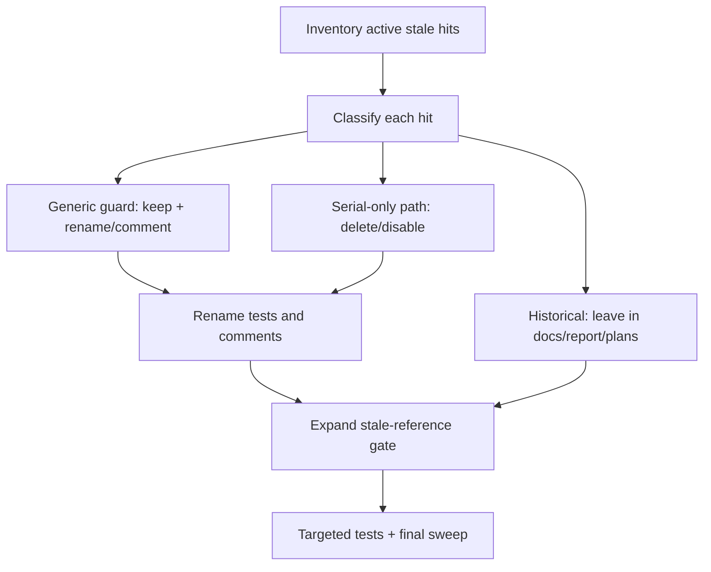

# refactor: clean single-chain residual serial semantics

## Overview

本计划清理 `docs/plans/2026-07-07-006-refactor-ralph-single-chain-execution-primary-plan.md` 完成后仍残留的 serial 语义污染。目标不是再删除一批机制，而是把机制按用途重新归类：

| 类别 | 处理方式 | 判断标准 |
|------|----------|----------|
| 通用边界机制 | 保留并改名/改注释为 generic | 防止坏 payload、越权 emit、terminal 后业务事件、失败升成功 |
| serial-only 救场机制 | 删除、默认关闭或降级为诊断 | 依赖 `ce-executor-serial`、progress-steward、shipper success promotion、runtime unit loop |
| 历史证据 | 保留在历史文档 | `docs/report/`、旧 `docs/plans/`、旧 brainstorm，用于追溯事故 |
| 用户/agent 可见 stale 文案 | 必须改 | README、CONCEPTS、注入 skill、CLI docs、active scripts |

这次不改 `presets/en/ce-executor-pipeline.yml` 行为层，不新增 pipeline schema，不创建新 preset。所有改动都应服务于一个目标：pipeline 是主线，通用 guard 继续可复用，serial 主线和 serial 术语不再污染 active surfaces。

## Problem Frame

上一次单链主线计划已经移除了 public `ce-executor-serial` preset，并保留了 `event_policy`、schema、origin guard、terminal guard、diagnostics、policy-check 等有价值机制。但核验发现仍有几类问题：

- 用户可见文档仍把 `ce-executor-serial` 写成 supported builtin 或概念示例。
- agent 注入文档泄漏 `recovery_runtime::*` 内部函数名，违反 `AGENTS.md` 对 `crates/ralph-core/data/*.md` 的可读性规则。
- 源码注释仍写 `ce-executor-serial opts in`、`non-serial presets`，让默认关闭的通用机制看起来像 serial 私有残留。
- `serial_lint.rs` 实际测试的是通用 event policy lint resume，但文件名和 helper 名仍是 serial。
- `phase_authority::shipper_helper`、shipper validator gate、silent-success 防线中混有两类内容：一类是有价值的“失败不能升成功”保护，另一类是 serial/shipper 主线残留。
- `progress_steward` 配置和测试还在，需要明确是保留为非主线实验/诊断，还是彻底删除。

## Requirements Trace

- R1. README、CONCEPTS、active changelog/handbook 不得继续把 `ce-executor-serial` 描述为当前 supported builtin 或推荐执行路径。
- R2. `crates/ralph-core/data/*.md` 不得泄漏内部 Rust 函数名、内部 ledger 路径或 reviewer-only 实现说明。
- R3. 默认关闭的通用机制必须用 generic 语义描述，不能再写成 “serial opts in” 或 “non-serial presets unaffected”。
- R4. 通用测试不得用 `serial_*` 文件名、helper 名或测试名表达当前行为；历史事故引用可以保留在注释中，但必须明确是 historical regression。
- R5. shipper/silent-success 相关代码必须分类：保留“失败不得升成功”的通用 guard，删除或改名 serial/shipper 专用成功 promotion 语义。
- R6. `progress_steward` 必须有明确决策：若保留，只能默认关闭、非主线、诊断/实验语义；若仍默认开启或影响 pipeline，需要停用或删除。
- R7. stale-reference gate 必须覆盖这次漏扫的 active surfaces，包括 README、CONCEPTS、CHANGELOG 当前段、`crates/ralph-core/src/config/loop_config.rs`、event-loop 通用测试命名。
- R8. `AGENTS.md` 与 `CLAUDE.md` 如有更新必须保持完全一致。

## Scope Boundaries

- 不修改 `presets/en/ce-executor-pipeline.yml` 的 schema、拓扑、hat instructions、event policy 或 terminal 行为。
- 不删除 `event_policy`、payload schema、origin/hat scope guard、terminal guard、policy-check、diagnostics、verdict gate 这类通用防线。
- 不为了让 grep 归零而改写历史 `docs/report/`、旧 `docs/plans/`、旧 `docs/brainstorms/`。
- 不在本计划里重新设计 phase authority 或 supervisor；只做分类、命名、默认值和 stale 文案清理。
- 不在本计划里新增新的 runtime guard，除非只是把现有 serial 命名的测试重命名为通用回归测试。

## Context & Research

### Relevant Code and Patterns

- `scripts/check-serial-stale-references.sh` 已存在，但 active include set 漏掉 README、CONCEPTS、CHANGELOG、部分 Rust 注释/测试命名。
- `README.md` 当前仍写 `ce-executor-serial` 是 supported builtin，属于用户可见 stale。
- `CONCEPTS.md` 当前用 `ce-executor-serial` 解释 dimension reviewer，属于概念层 stale。
- `crates/ralph-core/data/ralph-tools-recovery-directives.md` 末尾列出 `recovery_runtime::*`，违反 agent 注入文档规则。
- `crates/ralph-core/src/config/loop_config.rs` 中 `ephemeral_isolation`、`enforce_current_unit`、`state_projection`、`handoff_envelope`、`max_residuals` 等注释仍绑定 serial 语境。
- `crates/ralph-core/src/event_loop/tests/serial_lint.rs` 的内容是通用 lint resume / engine gate circuit breaker，可迁移为 generic 测试模块。
- `crates/ralph-core/src/event_loop/phase_authority/shipper_helper.rs` 与相关测试包含 “shipper 必须等待 validator terminal” 和 “stall recovery 不得成功” 的保护，需要区分保留防线与 serial-only routing。

### Institutional Learnings

- `docs/brainstorms/2026-07-07-ralph-single-chain-execution-primary-requirements.md` 明确要求保留通用边界机制，删除/停用 progress-steward、serial phase authority、shipper success promotion、fallback success path。
- `docs/plans/2026-07-07-006-refactor-ralph-single-chain-execution-primary-plan.md` 已完成 public serial 移除方向，但最终 sweep 的 include set 不完整。
- `AGENTS.md` 明确要求注入 skill 按 agent 下一步可执行动作来写，禁止泄漏内部函数名、内部 ledger 路径、reviewer-only 注释。

### External References

- 不需要外部研究。本计划是仓库内部清理和文档/测试命名收敛，代码库现有规则足够约束实现。

## Key Technical Decisions

- **先分类再删除**：对 shipper、phase authority、progress steward 这类残留先判定“通用 guard / serial-only / historical”，避免误删有价值防线。
- **默认保留通用 fail-close guard**：凡是防止 fallback、blocked、stall、validator 缺失被升为成功的逻辑，除非证明只服务于已删除 preset，否则先保留并改成 generic 命名。
- **active 文档零 serial 推荐**：README、CONCEPTS、agent 注入文档、CLI docs 不允许继续把 serial 当当前能力描述；历史文档可以保留。
- **测试改名优先于删测试**：`serial_lint.rs` 这类实际覆盖通用行为的测试要迁移命名，而不是删除覆盖。
- **stale gate 扩 include set**：脚本必须扫到这次人工发现的漏网 active surfaces，避免再靠人工 grep 发现。
- **progress-steward 必须显式决策**：不能让它以默认开启但“无人知道是否主线”的状态继续存在。

## Open Questions

### Resolved During Planning

- `CHANGELOG.md` 是否必须全删 serial？结论：历史 changelog 可以保留历史条目，但顶部/current release 摘要如果描述当前 supported builtin 或 opt-in 默认行为，应改写或明确为 historical。
- `phase_authority` 是否直接删除？结论：不能直接删。它可能承载通用 workflow guard；本计划只清理 serial/shipper 语义和 success promotion 路径。
- `handoff_envelope` 是否直接删除？结论：不能直接删。代码默认关闭，可能是通用 typed handoff/summary 机制；本计划先改注释和 agent 可见文档，不删除机制。

### Deferred to Implementation

- `progress_steward` 最终是删除还是默认关闭保留：需要实现时查看当前默认值、preset 启用情况、测试依赖和 runtime 分支后决定，但本计划要求结论必须落在代码注释和测试里。
- `shipper_helper` 是否可重命名为 generic verdict/recovery helper：取决于调用点是否仍以 shipper hat 为协议名。如果 API 面只在内部使用，可以重命名；如果仍与旧测试 fixture 强绑定，先改注释和测试名。

## High-Level Technical Design

> *This illustrates the intended approach and is directional guidance for review, not implementation specification. The implementing agent should treat it as context, not code to reproduce.*

## Implementation Units

- [ ] **Unit 1: Active 文档与 agent 注入文档清理**

**Goal:** 清理用户和 agent 会直接读到的 stale serial 文案，并补上脚本 include set，防止 README/CONCEPTS 这类漏扫再次发生。

**Requirements:** R1, R2, R7, R8

**Dependencies:** 无。

**Files:**
- Modify: `README.md`
- Modify: `CONCEPTS.md`
- Modify: `CHANGELOG.md`
- Modify: `crates/ralph-core/data/ralph-tools-recovery-directives.md`
- Modify: `scripts/check-serial-stale-references.sh`
- Modify: `AGENTS.md` if stale builtin list or hard-rule text changes
- Modify: `CLAUDE.md` if `AGENTS.md` changes
- Test: `scripts/check-serial-stale-references.sh`
- Test: `scripts/check-cli-doc-drift.sh`

**Approach:**
- 把 README 的 supported builtin 列表改成当前真实 builtin，不再列 `ce-executor-serial`。
- 把 CONCEPTS 的 dimension reviewer 例子改成 pipeline 当前维度 review 链，或描述为“historical serial terminology”并指向当前 pipeline 术语。
- CHANGELOG 只清理当前/顶部摘要中的 active recommendation；历史版本条目可保留，但必须避免读者以为 serial 仍是当前主线。
- 删除 `ralph-tools-recovery-directives.md` 末尾 reviewer-only runtime 函数名。若需要保留维护者背景，移到非注入开发文档或代码注释，不留在 `crates/ralph-core/data/*.md`。
- 扩展 `scripts/check-serial-stale-references.sh` 的 include paths，覆盖 README、CONCEPTS、CHANGELOG 当前段、`crates/ralph-core/src/config/loop_config.rs` 和 event-loop 测试命名。

**Execution note:** 文档改动后先用 stale-reference 脚本证明红/绿边界，避免只做人工 grep。

**Patterns to follow:**
- `AGENTS.md` 的 “AI skill guide 可读性规则”。
- 现有 `scripts/check-serial-stale-references.sh` 的 STALE 输出格式。

**Test scenarios:**
- Happy path: stale-reference 脚本扫描 README/CONCEPTS 后不再命中 active `ce-executor-serial` 推荐。
- Error path: 在 include set 中临时出现 `progress-steward` 或 `recovery_runtime::` 时脚本能报 STALE。
- Integration: `check-cli-doc-drift` 仍通过，说明命令文档未因文案清理漂移。

**Verification:**
- active 用户文档不再推荐 serial。
- agent 注入文档不含内部 Rust 函数名或 reviewer-only 段落。
- `AGENTS.md` 与 `CLAUDE.md` 如有改动保持完全一致。

- [ ] **Unit 2: config 注释和默认值事实收敛**

**Goal:** 把 `loop_config.rs` 中仍绑定 serial 的注释改成通用机制语义，并盘点 `progress_steward` 当前默认值与启用面。实际启停/删除决策留给 Unit 5。

**Requirements:** R3, R6, R7

**Dependencies:** Unit 1 完成，stale-reference 脚本能覆盖 config 注释。

**Files:**
- Modify: `crates/ralph-core/src/config/loop_config.rs`
- Test: existing config serde tests in `crates/ralph-core/src/config/loop_config.rs`
- Test: stale-reference gate coverage in `scripts/check-serial-stale-references.sh`

**Approach:**
- 将 `ce-executor-serial opts in`、`non-serial presets unaffected` 改成“disabled by default / opt-in presets only / generic boundary mechanism”一类的当前事实描述。
- 对 `ephemeral_isolation`、`enforce_current_unit`、`state_projection`、`handoff_envelope`、`max_residuals` 分别确认是否仍有 preset 启用；注释必须描述当前行为，不引用已删除 preset 文件。
- 专门审查 `ProgressStewardConfig::default()` 和 builtin preset 启用面，但本 Unit 不改变 runtime auto-wake 行为。
- 如果发现默认开启或 pipeline 可达，记录为 Unit 5 必修项；Unit 5 负责默认关闭、删除或改成 opt-in diagnostic。

**Patterns to follow:**
- `SupervisorConfig` 的默认关闭注释模式：明确 master switch、disabled branch、opt-in 行为。
- `HandoffEnvelopeConfig` 的 `deny_unknown_fields` 和默认字段测试。

**Test scenarios:**
- Happy path: `loop_config.rs` 中通用机制注释不再引用已删除 serial preset。
- Edge case: stale-reference 脚本能捕获未来新增的 `ce-executor-serial opts in` / `non-serial presets` 注释。
- Regression: `handoff_envelope`、`state_projection`、`ephemeral_isolation` 的 serde 默认行为不变。

**Verification:**
- `loop_config.rs` 不再出现 `ce-executor-serial opts in` 或 `non-serial presets` 这类过期措辞。
- `progress_steward` 当前默认值、启用 preset、runtime auto-wake 路径已在 Unit 5 输入清单中明确列出。

- [ ] **Unit 3: 通用 lint resume 测试去 serial 化**

**Goal:** 将 `serial_lint.rs` 迁移为通用 event policy / lint resume 测试，保留覆盖但去掉 serial 命名。

**Requirements:** R4, R7

**Dependencies:** Unit 2 完成。

**Files:**
- Rename/Modify: `crates/ralph-core/src/event_loop/tests/serial_lint.rs`
- Modify: `crates/ralph-core/src/event_loop/tests/mod.rs`
- Test: renamed event-loop test module

**Approach:**
- 将文件名改成表达真实行为的名称，例如 `event_policy_lint_resume.rs` 或 `engine_gate_lint_resume.rs`。
- 将 helper `serial_lint_config` 改成 generic 名称，例如 `event_policy_lint_config`。
- 更新模块注释：说明这些测试来自历史 serial 事故，但当前保护的是通用 event policy reject-with-resume 行为。
- 不删除 circuit breaker、pending lint resume、PlanBlocked dispatch 等通用覆盖。

**Patterns to follow:**
- `crates/ralph-core/src/event_loop/tests/terminal_state_guard_stage` 类测试命名：按机制命名，不按旧 preset 命名。
- `mod.rs` 中现有测试模块注册方式。

**Test scenarios:**
- Happy path: 合法 `work.done` 不 seed `pending_lint_resume`。
- Error path: 缺 required field 的 `work.done` seed `pending_lint_resume` 并在下次 prompt 消费。
- Edge case: 当前 hat 不拥有 hint topic 时 hint 被恢复而不是丢失。
- Regression: 连续 rejection circuit breaker 和 PlanBlocked dispatch 行为保持不变。

**Verification:**
- `crates/ralph-core/src/event_loop/tests/` 下不再有 `serial_lint.rs`。
- event-loop targeted test 仍覆盖原有 lint resume 行为。
- stale-reference 脚本能抓到未来新增的 `serial_lint` 命名。

- [ ] **Unit 4: shipper / phase authority / silent-success 残留分类清算**

**Goal:** 对 shipper、phase authority、silent-success 相关代码做分类处理：通用 fail-close 防线保留并改名/改注释，serial-only promotion/routing 语义删除或降级。

**Requirements:** R5, R7

**Dependencies:** Unit 3 完成，测试命名已从 serial 语义中脱离。

**Files:**
- Modify: `crates/ralph-core/src/event_loop/phase_authority/shipper_helper.rs`
- Modify: `crates/ralph-core/src/event_loop/phase_authority/mod.rs` if helper module is renamed
- Modify: `crates/ralph-core/src/event_loop/mod.rs`
- Modify: `crates/ralph-core/src/event_loop/loop_state.rs`
- Modify: `crates/ralph-core/src/event_loop/tests/handoff_dispatch.rs`
- Modify: `crates/ralph-core/src/event_loop/tests/fallback_recovery_fail_close.rs`
- Modify: `crates/ralph-core/src/event_loop/tests/state_machine.rs`
- Modify: `crates/ralph-core/src/event_loop/tests/termination.rs`
- Test: affected event-loop tests

**Approach:**
- 先列出所有 `shipper` 命中并标注为三类：协议名仍需要、可改成 generic verdict/reporter、可删除。
- 对 “blocked/failed/stall recovery 不得被翻译为 pass/pass_with_residuals” 的测试保留，并改成 generic “verdict/fail-close” 语义。
- 删除或改写 “shipper reason whitelist promotes success” 一类注释；如果仍有生产代码能从 fallback reason 产生 success terminal，必须改为 blocked/fail 或 diagnostic。
- `phase_authority` 若保留，应描述为 opt-in workflow guard，而不是 serial unit-loop authority。
- 历史事故链接可以保留，但必须明确是 historical regression source，不是当前 preset 依赖。

**Patterns to follow:**
- `terminal_state_guard_stage` 的通用 terminal guard 语义。
- `verdict_gate` 的 fail-field/fail-value gating 语义。

**Test scenarios:**
- Happy path: 合法 success verdict 仍能通过 terminal/verdict guard。
- Error path: stall recovery、missing validator terminal、blocked reason 不能产生 success terminal。
- Regression: terminal honored 后业务事件仍被拒或只记录诊断。
- Integration: phase authority disabled 时不影响 pipeline 或普通 event loop。

**Verification:**
- active Rust 注释不再声明 serial/shipper 是当前主线。
- 保留下来的 shipper 命中都有明确理由：协议名、historical regression、或待后续重命名的内部兼容。
- 不存在 fallback/recovery reason 到 success terminal 的生产路径。

- [ ] **Unit 5: progress-steward 终态处理**

**Goal:** 明确 `progress_steward` 的最终状态，并让代码、测试、文档一致表达这个状态。

**Requirements:** R6, R7

**Dependencies:** Unit 4 完成。

**Files:**
- Modify or Delete: `crates/ralph-core/src/event_loop/tests/progress_steward.rs`
- Modify or Delete: `crates/ralph-core/src/event_loop/tests/progress_steward_disabled.rs`
- Modify: `crates/ralph-core/src/event_loop/mod.rs`
- Modify: `crates/ralph-core/src/event_loop/loop_state.rs`
- Modify: `crates/ralph-core/src/config/loop_config.rs`
- Modify: `scripts/check-serial-stale-references.sh`
- Test: affected progress-steward tests or replacement diagnostic tests

**Approach:**
- 如果实现确认 progress-steward 不再被任何 builtin preset 使用，优先删除 runtime auto-wake 路径和专用测试，只保留通用 stall diagnostic。
- 如果仍需保留，必须满足三点：默认关闭、非 pipeline 主线、不能 emit success 或改变业务链路。
- 将测试从 “progress-steward fallback hat” 改成 “stall diagnostic / opt-in recovery diagnostic” 命名。
- stale-reference gate 对 `progress-steward` 默认视为 STALE；只有明确路径白名单可保留，例如历史 fixture 或 opt-in diagnostic 测试。

**Patterns to follow:**
- `SupervisorConfig` 的 opt-in master switch 模式。
- `diagnostics` 类测试只验证观测输出，不推动业务成功链。

**Test scenarios:**
- Happy path: 默认配置下 stall 不会自动唤醒 LLM 救场 hat。
- Error path: 连续 stall 只能产生 blocked/fail/diagnostic，不能产生 success terminal。
- Edge case: 显式 opt-in 但没有对应 hat 时 fail-close 或 no-op diagnostic，不 panic、不成功推进。
- Regression: pipeline preset 不声明或不依赖 progress-steward。

**Verification:**
- `progress-steward` 不再作为 active 主线能力出现在文档、默认配置或 builtin preset。
- 若保留 opt-in，测试和注释明确它不能改变业务事实。

- [ ] **Unit 6: 最终 sweep 与验收门补强**

**Goal:** 做最终 stale-reference sweep、补强脚本覆盖范围，并跑 targeted / full validation。

**Requirements:** R1-R8

**Dependencies:** Unit 1-5 完成。

**Files:**
- Modify: `scripts/check-serial-stale-references.sh`
- Modify: any active file surfaced by final sweep
- Test: `scripts/check-serial-stale-references.sh`
- Test: `scripts/check-cli-doc-drift.sh`
- Test: affected Rust test modules

**Approach:**
- 最终 sweep 分类必须包含：public docs、agent injected docs、config comments、event-loop tests、preset_lint comments、active scripts、README/CONCEPTS/CHANGELOG。
- 对每个命中标注：active stale / generic allowed / historical allowed。active stale 必须修；generic allowed 应尽量改名或加注释；historical allowed 不动。
- 脚本输出应能帮助 reviewer 看到哪些命中是被白名单允许的，哪些是失败。
- 最终验证必须包含项目规定的 nextest 入口；不要用裸 `cargo test` 跑 `ralph-cli`。

**Patterns to follow:**
- `scripts/check-cli-doc-drift.sh` 的静态 drift gate 模式。
- 上一计划 Unit 7 的 6 类清单，但扩展漏扫路径。

**Test scenarios:**
- Happy path: active surfaces 无 serial 主线推荐、无 internal runtime function 泄漏。
- Error path: 在 README 或 injected docs 中出现 `ce-executor-serial` active 推荐会被脚本拦截。
- Integration: targeted preset/event-loop/preset_lint/scenario tests 通过，说明清理没有破坏通用机制。

**Verification:**
- stale-reference 脚本通过且 include set 覆盖本计划列出的漏扫文件。
- CLI doc drift 通过。
- 相关 Rust targeted tests 通过。
- 最终 `./scripts/run-tests.sh` 通过；若遇到已知 nextest timing flake，只按项目规则使用 serial fallback 诊断。

## System-Wide Impact

- **Interaction graph:** 文档、agent 注入 skill、event-loop 配置、runtime recovery、phase authority、progress-steward、测试命名和 stale-reference 脚本都会被触碰。
- **Error propagation:** 清理后 fallback/recovery/stall 只能导向 blocked/fail/diagnostic，不得通过 shipper/reason whitelist 进入 success。
- **State lifecycle risks:** 删除 progress-steward 或改默认值可能改变 stall 后行为；必须用测试证明默认路径不再唤醒 LLM 救场，同时不会 panic。
- **API surface parity:** README、CONCEPTS、preset list、zsh completion、agent docs 必须一致表达 pipeline 为主线。
- **Integration coverage:** 需要保留 terminal guard、event policy lint resume、verdict/fail-close、pipeline preset 测试，避免为了去 serial 名称删掉保护。
- **Unchanged invariants:** pipeline preset 行为层不变；通用 event policy/schema/origin/terminal/diagnostics 不删除。

## Risks & Dependencies

| Risk | Mitigation |
|------|------------|
| 误删有价值 guard | Unit 4 先分类，保留 fail-close/terminal/verdict 通用测试 |
| 只改文案不改 gate，未来再漏 | Unit 1 和 Unit 6 扩 stale-reference 脚本 include set |
| progress-steward 默认值改动影响旧测试 | Unit 5 把测试改成 opt-in 或 diagnostic 语义 |
| 历史引用被过度清理 | 明确历史 docs/report/plans/brainstorms 不作为 active stale |
| `AGENTS.md` / `CLAUDE.md` 漂移 | 任何一方改动后同步另一方并 diff 验证 |

## Documentation / Operational Notes

- `crates/ralph-core/data/*.md` 是 agent prompt 注入面，必须只写 agent 可执行动作和停止条件，不写内部函数名。
- `README.md` 和 `CONCEPTS.md` 是用户理解当前能力的入口，不能继续以 serial 举当前例子。
- `CHANGELOG.md` 可保留历史，但当前 release 摘要不能误导当前 builtin 列表。
- 如果改动 `AGENTS.md`，必须同步 `CLAUDE.md`。
- 计划执行完成后，应在 PR 描述中列出保留的通用机制和删除/降级的 serial-only 机制。

## Validation Plan

- Unit 级验证：
  - 文档/脚本：`scripts/check-serial-stale-references.sh`、`scripts/check-cli-doc-drift.sh`。
  - CLI/preset：`cargo nextest run -p ralph-cli --bin ralph -- preset`、`cargo nextest run -p ralph-cli --bin ralph -- preflight`。
  - Core lint/runtime：`cargo nextest run -p ralph-core -- preset_lint`、`cargo nextest run -p ralph-core -- event_loop`。
  - Scenarios：`cargo nextest run -p ralph-core --test scenarios`。
- 最终验证：
  - `./scripts/run-tests.sh`。
  - 若出现已知 timing/concurrency flake，仅按项目规则用 `RALPH_BASELINE_SERIAL=1 ./scripts/run-tests.sh` 做诊断兜底。

## Sources & References

- **Origin document:** `docs/brainstorms/2026-07-07-ralph-single-chain-execution-primary-requirements.md`
- Related plan: `docs/plans/2026-07-07-006-refactor-ralph-single-chain-execution-primary-plan.md`
- Related requirements: `docs/brainstorms/2026-07-02-ce-executor-pipeline-preset-requirements.md`
- Related requirements superseded in direction: `docs/achieved/brainstorms/2026-07-06-ce-executor-serial-protocol-ssot-convergence-requirements.md`
- Active stale gate: `scripts/check-serial-stale-references.sh`
- Agent doc rule source: `AGENTS.md`
