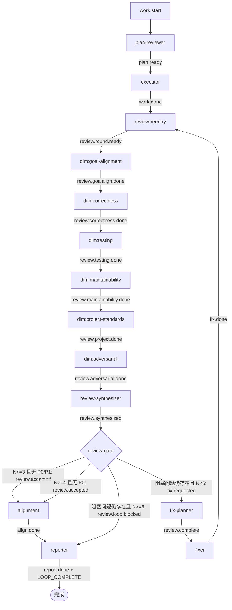

# ce-executor-pipeline-loop 开发计划

## Goal Capsule

新增一个公开 builtin preset：`ce-executor-pipeline-loop`。它以现有 `ce-executor-pipeline` 为蓝本，保留 plan-reviewer、executor、六个串行维度 review hat、review-synthesizer、fix-planner、fixer、alignment、reporter 的工作方式，但把“执行一次 -> review 一次 -> fix 一次 -> 收尾”改成“执行一次 -> review -> 若无 P0/P1 则直接终止；若仍有 P0/P1 则 fix 后回到下一轮 review”。

核心不变量：

1. 同一个 hat activation 只能发一个业务事件。`review-gate` 必须三选一：`review.accepted`、`fix.requested`、`review.loop.blocked`，不能同时发两个事件。
2. 每个业务 topic 只能有一个显式消费者。Ralph 当前的 handoff 机制只会为“唯一消费者 topic”推导 `triggered`，多消费者 topic 会失去确定性路由。
3. 环形结构通过 topic 串起来，不使用旁路广播。`work.done` 和 `fix.done` 都只进入 `review-reentry`，由它统一发出下一轮 `review.round.ready`。
4. 终止条件分两段：第 1-3 轮必须 `p0_count == 0 && p1_count == 0` 才结束；第 4 轮开始只要 `p0_count == 0` 就结束，P1 不再驱动继续修复。
5. 仍存在 P0/P1 时走 `fix.requested -> fix-planner -> review.complete -> fixer -> fix.done -> review-reentry -> review.round.ready`，开始下一轮完整六维 review。
6. 达到最大 review 轮数仍存在 P0/P1 时，走 `review.loop.blocked -> reporter -> LOOP_COMPLETE`，而不是无限循环；v1 最大 review 轮数固定为 6。
7. `git_base_sha` 是整次 loop 的固定 git 基线，不能在每轮 fix 后重置；每轮只更新 `round_base_sha` / `head_sha`。

## Product Contract

### 用户可见结果

- 用户可以运行 `ralph run -H builtin:ce-executor-pipeline-loop --plan <plan.md>`。
- 新 preset 的 hat 行为基于 `ce-executor-pipeline`，不要求用户学习新的执行模型。
- 当 review 没有 P0/P1 问题时，loop 直接完成。
- 当 review 有 P0/P1 问题时，loop 自动修复并重新 review。
- 当超过最大 review 轮数仍有 P0/P1 时，loop 明确失败/阻塞并生成报告。
- 任何一个 topic 在拓扑上最多只有一个消费者，避免一个事件同时触发多个 hat。

### 功能需求

| 编号 | 需求 |
|---|---|
| R1 | 新增 `presets/en/ce-executor-pipeline-loop.yml`，不要改坏现有 `ce-executor-pipeline.yml`。 |
| R2 | 新 preset 默认 `event_loop.execution_mode: isolated`。 |
| R3 | 新 preset 复用 pipeline 里现有 hat 的职责、命名风格、skill 引用方式和 event schema 写法。 |
| R4 | 新 preset 增加 `review-reentry` hat，统一接收 `work.done` 与 `fix.done`，并发出 `review.round.ready`。 |
| R5 | 六个维度 review hat 的首个触发 topic 从 `work.done` 改为 `review.round.ready`。 |
| R6 | 六个维度 review hat 仍然串行执行，不并行 fan-out。 |
| R7 | `review-synthesizer` 继续汇总六维 review，并在 payload 中稳定提供 `p0_count`、`p1_count`、`findings_summary`、`verdict`、`review_round`。 |
| R8 | 新增 `review-gate` hat，唯一触发 topic 是 `review.synthesized`。 |
| R9 | `review-gate` 在 `review_round <= 3 && p0_count == 0 && p1_count == 0` 时只发 `review.accepted`，所以第一轮无 P0/P1 会直接结束。 |
| R10 | `review-gate` 在 `review_round >= 4 && p0_count == 0` 时只发 `review.accepted`，即使仍有 P1 也直接结束。 |
| R11 | `review-gate` 在仍有阻塞问题且 `review_round < 6` 时只发 `fix.requested`；第 1-3 轮的阻塞问题是 P0 或 P1，第 4 轮起的阻塞问题只有 P0。 |
| R12 | `review-gate` 在仍有阻塞问题且 `review_round >= 6` 时只发 `review.loop.blocked`。 |
| R13 | `fix-planner` 的触发 topic 改为 `fix.requested`，发布 `review.complete` 并把当前 `review_round` 传给 `fixer`。 |
| R14 | `fixer` 触发 `review.complete`，完成修复后只发 `fix.done`。 |
| R15 | `fix.done` 的唯一消费者是 `review-reentry`，不能直接触发 alignment 或 reporter。 |
| R16 | `review.accepted` 的唯一消费者是 `alignment`。 |
| R17 | `review.loop.blocked` 的唯一消费者是 `reporter`。 |
| R18 | `alignment` 只在 review 已接受后运行，触发 topic 是 `review.accepted`。 |
| R19 | `reporter` 继续负责最终报告和 `LOOP_COMPLETE`。 |
| R20 | 每个新 topic 都必须有 schema，且必填字段能支持下一跳 hat 不读内部 ledger 也能工作。 |
| R21 | 每个需要发业务事件的 hat instructions 必须要求先跑 `ralph emit --policy-check`，再真实 emit。 |
| R22 | instructions 只能写该 hat 在自己 activation 中能看到、能调用、应输出的内容，不要求 hat 读取 `.ralph/events.jsonl`、`.ralph/supervisor.db`、`.ralph/loops.json`。 |
| R23 | 新 builtin 必须同步 manifest、CLI embedded preset 列表、preset index、zsh 补全和 AGENTS/CLAUDE builtin 列表。 |
| R24 | 修改 preset/schema 后必须同步检查 runtime、preset_lint、BDD 场景、config 字段、AI skill guide、preset operator skill 是否需要更新。 |
| R25 | 计划执行完成前必须跑 targeted preset 校验，最终跑全量 `./scripts/run-tests.sh` 或记录不可运行原因。 |
| R26 | 最大 review 轮数固定为 6；第 6 轮仍有阻塞问题时，`review-gate` 必须只发 `review.loop.blocked`。 |
| R27 | `fixer -> review-reentry` 的 `fix.done` payload 必须携带下一轮 review plan，避免 `review-reentry` 读取内部 ledger 或重新推断修复意图。 |
| R28 | 所有进入 review/fix 的事件必须贯穿 `git_base_sha`、`round_base_sha`、`head_sha`，其中 `git_base_sha` 在整个 loop 内保持不变。 |

### 关键设计决定

| 决定 | 结论 | 原因 |
|---|---|---|
| 每次能否发两个事件 | 不能。一个 activation 只允许一个业务事件。 | 否则 `review-gate` 同时发“需要修复”和“完成”会造成同轮状态错乱。 |
| 一个 event 是否只有一个消费者 | preset 设计上必须保证一个业务 topic 只有一个显式消费者。 | 源码中的 handoff index 只为唯一消费者 topic 推导下游 hat；多消费者 topic 不会得到确定性 triggered 路由。 |
| `review-gate` 是否发两个 event | 不发。它是互斥三路 gate。 | `review.accepted`、`fix.requested`、`review.loop.blocked` 三者只能出现一个。 |
| 是否沿用 `review.complete` | 不沿用。新 preset 用 `review.accepted` 表示通过，用 `fix.requested` 表示进入修复规划。 | `review.complete` 在现有链路里接近终态语义，且终态相邻 topic 有重复事件处理逻辑；新环形 preset 需要更明确的非终态 handoff。 |
| 阻塞 topic 名称 | 用 `review.loop.blocked`，不用泛化的 `review.blocked`。 | 避免和已有 runtime/review 语义中的 `review.blocked` 混淆，让 reporter 消费的是本 preset 的 review-loop 阻塞结果。 |
| 轮次字段 | 新增并贯穿 `review_round`。 | 不依赖 hat 读取内部事件 ledger；下一跳只靠触发 payload 就能知道当前轮次。 |
| P1 截止线 | 第 1-3 轮 P1 仍然驱动修复；第 4 轮开始 P1 不再阻塞结束，只要没有 P0 就接受。 | P1 很容易被 review 找出来，三轮后继续追 P1 容易过拟合；P0 仍然必须拦截。 |
| 最大轮数 | v1 固定 `max_review_rounds = 6`，写入 gate instructions 和 payload 约定，不新增 runtime 配置字段。 | 第 4 轮起无 P0 即可结束；若 P0 持续存在，最多继续到第 6 轮。 |
| Git baseline | `git_base_sha` 在 executor 完成首轮实现时确定，并在后续所有 review/fix/reentry 事件中原样传递。 | reviewer 需要稳定比较“本次任务相对原始基线”的完整变化；fixer 还需要 `round_base_sha` 判断本轮修复范围。 |
| 下一轮 review plan | `fixer` 在 `fix.done` 中输出 `next_review_plan`，`review-reentry` 只负责增轮次和转发。 | `review-reentry` 是路由/归一化 hat，不重新做规划；下一轮 review 的重点由刚完成修复的 fixer 明确交给 reviewer。 |

### 目标拓扑

```text
work.start
  |
  v
plan-reviewer
  | plan.ready
  v
executor
  | work.done
  v
review-reentry
  | review.round.ready
  v
dim:goal-alignment
  | review.goalalign.done
  v
dim:correctness
  | review.correctness.done
  v
dim:testing
  | review.testing.done
  v
dim:maintainability
  | review.maintainability.done
  v
dim:project-standards
  | review.project.done
  v
dim:adversarial
  | review.adversarial.done
  v
review-synthesizer
  | review.synthesized
  v
review-gate
  |--------------------------|
  |                          |
  | review.accepted          | fix.requested
  v                          v
alignment                 fix-planner
  | align.done                | review.complete
  v                           v
reporter                   fixer
  | report.done               | fix.done
  v                           |
LOOP_COMPLETE <------------- review-reentry

review-gate --review.loop.blocked--> reporter --LOOP_COMPLETE
```



### 单 topic 单消费者表

| Topic | 唯一消费者 | 说明 |
|---|---|---|
| `work.start` | `plan-reviewer` | 入口。 |
| `plan.ready` | `executor` | plan 通过后执行。 |
| `work.done` | `review-reentry` | 首轮 review 统一入口。 |
| `review.round.ready` | `dim:goal-alignment` | 每轮 review 的统一开始。 |
| `review.goalalign.done` | `dim:correctness` | 六维串行 review。 |
| `review.correctness.done` | `dim:testing` | 六维串行 review。 |
| `review.testing.done` | `dim:maintainability` | 六维串行 review。 |
| `review.maintainability.done` | `dim:project-standards` | 六维串行 review。 |
| `review.project.done` | `dim:adversarial` | 六维串行 review。 |
| `review.adversarial.done` | `review-synthesizer` | 汇总前最后一维。 |
| `review.synthesized` | `review-gate` | 根据 P0/P1 和轮次决策。 |
| `review.accepted` | `alignment` | 通过后进入最终对齐。 |
| `fix.requested` | `fix-planner` | 进入修复规划。 |
| `review.complete` | `fixer` | 修复计划已产出。 |
| `fix.done` | `review-reentry` | 修复后重新 review。 |
| `review.loop.blocked` | `reporter` | 超轮数阻塞。 |
| `align.done` | `reporter` | 通过后的正常报告。 |

注意：`fix.requested` 和 `review.complete` 必须保持拆分。前者由 `review-gate` 发给 `fix-planner`，后者由 `fix-planner` 发给 `fixer`；不能让两个 downstream hat 同时消费同一个 `review.complete`。

## Planning Contract

### 最终 topic 表

| Topic | 发布者 | 唯一消费者 | 必填字段 |
|---|---|---|---|
| `work.start` | runtime/user | `plan-reviewer` | 既有字段 |
| `plan.ready` | `plan-reviewer` | `executor` | 既有字段 |
| `plan.blocked` | `plan-reviewer` | `reporter` | 既有字段 |
| `work.failed` | `executor` | `reporter` | 既有字段 |
| `work.done` | `executor` | `review-reentry` | 既有字段 + `git_base_sha`、`head_sha`、`changed_files` |
| `review.round.ready` | `review-reentry` | `dim:goal-alignment` | `review_round`、`source_topic`、`git_base_sha`、`round_base_sha`、`head_sha`、`review_plan` |
| `review.goalalign.done` | `dim:goal-alignment` | `dim:correctness` | 既有 review 字段 + `review_round`、`git_base_sha`、`round_base_sha`、`head_sha` |
| `review.correctness.done` | `dim:correctness` | `dim:testing` | 既有 review 字段 + `review_round`、`git_base_sha`、`round_base_sha`、`head_sha` |
| `review.testing.done` | `dim:testing` | `dim:maintainability` | 既有 review 字段 + `review_round`、`git_base_sha`、`round_base_sha`、`head_sha` |
| `review.maintainability.done` | `dim:maintainability` | `dim:project-standards` | 既有 review 字段 + `review_round`、`git_base_sha`、`round_base_sha`、`head_sha` |
| `review.project.done` | `dim:project-standards` | `dim:adversarial` | 既有 review 字段 + `review_round`、`git_base_sha`、`round_base_sha`、`head_sha` |
| `review.adversarial.done` | `dim:adversarial` | `review-synthesizer` | 既有 review 字段 + `review_round`、`git_base_sha`、`round_base_sha`、`head_sha` |
| `review.synthesized` | `review-synthesizer` | `review-gate` | `review_round`、`git_base_sha`、`round_base_sha`、`head_sha`、`p0_count`、`p1_count`、`findings_summary`、`verdict` |
| `review.accepted` | `review-gate` | `alignment` | `review_round`、`git_base_sha`、`head_sha`、`p0_count`、`p1_count`、`verdict` |
| `fix.requested` | `review-gate` | `fix-planner` | `review_round`、`git_base_sha`、`round_base_sha`、`head_sha`、`p0_count`、`p1_count`、`findings_summary` |
| `review.complete` | `fix-planner` | `fixer` | `review_round`、`git_base_sha`、`fix_base_sha`、`fix_plan`、`findings_summary` |
| `fix.done` | `fixer` | `review-reentry` | `review_round`、`git_base_sha`、`fixed_from_sha`、`head_sha`、`fix_summary`、`next_review_plan` |
| `review.loop.blocked` | `review-gate` | `reporter` | `review_round`、`max_review_rounds`、`git_base_sha`、`head_sha`、`p0_count`、`p1_count`、`reason` |
| `align.done` | `alignment` | `reporter` | 既有字段 + `review_round`、`git_base_sha`、`head_sha` |
| `report.done` | `reporter` | 终态 | 既有字段 |
| `LOOP_COMPLETE` | `reporter` | 终态 | 既有字段 |

### 实施范围

本轮要做：

- 新增 preset YAML 与 schema mirror。
- 注册新 builtin preset 到 CLI、manifest、index、completion 和文档。
- 增加针对该 preset 的 lint/graph/BDD 测试。
- 更新受影响的开发文档和 agent-facing skill 文档。
- 验证 Mermaid、preset lint、scenario、SSOT 和全量测试。

本轮不做：

- 不改造 runtime 为通用循环引擎。
- 不新增全局 `event_loop.max_review_rounds` 配置字段。
- 不修改现有 `ce-executor-pipeline` 行为。
- 不引入多消费者 topic 或 wildcard 路由。
- 不让任何 hat 读取内部 `.ralph/*` ledger。

### 轮次与 Git baseline 设计

轮次规则：

- `max_review_rounds` 固定为 6。
- 首轮 review 的 `review_round` 是 1。
- `review-reentry` 收到 `work.done` 时发出 `review.round.ready.review_round = 1`。
- `review-reentry` 收到 `fix.done.review_round = N` 时发出 `review.round.ready.review_round = N + 1`。
- `review-gate` 收到 `review.synthesized.review_round = N` 后：
  - 若 `N <= 3` 且 `p0_count == 0 && p1_count == 0`，发 `review.accepted`。
  - 若 `N >= 4` 且 `p0_count == 0`，发 `review.accepted`，即使仍有 P1 也结束。
  - 若阻塞问题仍存在且 `N < 6`，发 `fix.requested`。阻塞问题定义：第 1-3 轮是 P0 或 P1；第 4 轮起只有 P0。
  - 若阻塞问题仍存在且 `N >= 6`，发 `review.loop.blocked`，payload 中 `max_review_rounds = 6`。

Git baseline 规则：

- `git_base_sha` 是整次 loop 的固定基线，表示执行本 plan 前或 executor 开始工作前的 HEAD。
- `executor` 在 `work.done` 中输出 `git_base_sha` 与实现完成后的 `head_sha`。
- `review-reentry` 首轮把 `round_base_sha = head_sha`，并把 `git_base_sha` 原样传给 `review.round.ready`。
- 每个 review hat 只传递这些字段，不重新计算 baseline。
- `review-synthesizer` 汇总时保留 `git_base_sha`、`round_base_sha`、`head_sha`，让 `review-gate` 和后续 fix 流程能继续传递。
- `fix-planner` 输出 `review.complete.fix_base_sha = head_sha`，表示 fixer 应从哪个提交开始修。
- `fixer` 在 `fix.done` 中输出：
  - `git_base_sha`：整次 loop 的固定基线，原样传递。
  - `fixed_from_sha`：本轮修复开始前的提交，等于 `review.complete.fix_base_sha`。
  - `head_sha`：本轮修复完成后的提交。
  - `next_review_plan`：下一轮 review 要重点检查的范围和风险。
- `review-reentry` 收到 `fix.done` 后，不读取 git 或内部 ledger；它只把 `fix.done.head_sha` 作为下一轮 `round_base_sha/head_sha`，并把 `fix.done.next_review_plan` 作为下一轮 `review_plan`。

`next_review_plan` 必须包含：

| 字段 | 含义 |
|---|---|
| `focus_areas` | 下一轮 reviewer 必须重点看的文件、模块或风险点。 |
| `fixed_findings` | 本轮声称已经修掉的 P0/P1 finding 摘要。 |
| `verification_performed` | fixer 已经跑过的验证命令或无法验证原因。 |
| `residual_risks` | fixer 已知但未完全消除的风险。 |
| `diff_ranges` | 建议 reviewer 对比的 git 范围，至少包含 `git_base_sha..head_sha` 和 `fixed_from_sha..head_sha`。 |

### 需要先核实的源码点

实施前先用 `rg`/`sed` 核实以下位置，不凭记忆改：

- `presets/en/ce-executor-pipeline.yml`：复制源、hat instructions、schemas、deny rules。
- `presets/schemas/`：确认是否已有 pipeline schema mirror；新增 loop schema 时保持字段一致。
- `presets/manifest.yml`：新增 embedded/public 条目。
- `crates/ralph-cli/src/presets.rs`：新增 `EmbeddedPreset`，并检查 byte-equality 测试。
- `presets/index.json`：新增用户可见 preset。
- `scripts/ralph-zsh-plugin.zsh`：新增 `builtin:ce-executor-pipeline-loop`。
- `crates/ralph-cli/src/loop_runner/hat_channel.rs`：确认唯一消费者 topic 才会推导 `triggered`。
- `crates/ralph-core/src/preset_lint/workflow_activation.rs`：确认 WAC 对单消费者和 handoff 的静态检查能力。
- `crates/ralph-core/tests/scenarios/` 与 `crates/ralph-core/tests/scenarios.rs`：新增真实 EventLoop runner 场景。
- `crates/ralph-core/data/ralph-tools*.md`：确认是否需要新增 preset/event 说明。
- `skills/ralph-preset-common/references/*.md`：确认是否需要更新 preset author/review 指南。
- `CLAUDE.md` 与 `AGENTS.md`：更新 builtin preset 列表后保持完全一致。

## Implementation Units

### U1：确认现有 pipeline 与 handoff 约束

目标：在动 YAML 前确认当前能力确实支持新 preset。

步骤：

1. 阅读 `presets/en/ce-executor-pipeline.yml`，记录现有 hats、triggers、publishes、schemas、contracts。
2. 阅读 `crates/ralph-cli/src/loop_runner/hat_channel.rs`，确认 `triggered` 只为唯一消费者 topic 推导。
3. 阅读 `crates/ralph-core/src/preset_lint/workflow_activation.rs`，确认 lint 能覆盖哪些唯一消费者问题。
4. 阅读 `crates/ralph-core/src/event_policy.rs` 与相关 duplicate tests，确认哪些 topic 有终态相邻去重或特殊重复处理。
5. 输出实施笔记到代码注释或测试命名中，不新增单独临时文件。

验收：

- 明确记录为什么 `review-gate` 不能双发事件。
- 明确记录为什么 `fix.requested` 与 `review.complete` 必须拆开。
- 未修改业务代码。

### U2：新增 `ce-executor-pipeline-loop` preset YAML

目标：新增可 lint 的环形 preset。

步骤：

1. 复制 `presets/en/ce-executor-pipeline.yml` 为 `presets/en/ce-executor-pipeline-loop.yml`。
2. 保持 `event_loop.execution_mode: isolated`。
3. 新增 `review-reentry` hat：
   - triggers：`work.done`、`fix.done`
   - publishes：`review.round.ready`
   - instructions：只根据触发 payload 计算下一轮 `review_round`；首轮为 1，`fix.done.review_round + 1` 为下一轮。
   - instructions：从 `work.done` 或 `fix.done` 读取 `git_base_sha`、`head_sha`；不得读取 `.ralph/*` 内部 ledger。
   - instructions：首轮生成基础 `review_plan`；修复后必须转发 `fix.done.next_review_plan`。
4. 修改 `dim:goal-alignment` trigger 为 `review.round.ready`。
5. 给六维 review 输出 schema 增加并贯穿 `review_round`。
6. 新增 `review-gate` hat：
   - triggers：`review.synthesized`
   - publishes：`review.accepted`、`fix.requested`、`review.loop.blocked`
   - instructions：三选一；先 `--policy-check`，再真实 emit；禁止同轮发第二个业务事件。
   - instructions：第 1-3 轮无 P0/P1 时发 `review.accepted`；第 4 轮起无 P0 时发 `review.accepted`，P1 不再阻塞。
   - instructions：阻塞问题仍存在且未满 6 轮时发 `fix.requested`；阻塞问题仍存在且已到第 6 轮时发 `review.loop.blocked`。
7. 修改 `fix-planner`：
   - triggers：`fix.requested`
   - publishes：`review.complete`
   - 输出带 `review_round`。
8. 修改 `fixer`：
   - triggers：`review.complete`
   - publishes：`fix.done`
   - 输出带同一轮 `review_round`、`git_base_sha`、`fixed_from_sha`、`head_sha`。
   - 输出 `next_review_plan`，交给 `review-reentry` 作为下一轮 review 的输入。
9. 修改 `alignment`：
   - triggers：`review.accepted`
   - publishes：`align.done`
10. 修改 `reporter`：
   - triggers：`align.done`、`plan.blocked`、`work.failed`、`review.loop.blocked`
   - publishes：`report.done`、`LOOP_COMPLETE`
11. 更新 event schema、required fields、topic deny rules、execution contracts，确保没有多消费者 topic。

验收：

- `fix.requested` 只有 `fix-planner` 消费。
- `review.complete` 只有 `fixer` 消费。
- `work.done` 和 `fix.done` 只有 `review-reentry` 消费。
- `fix.done` schema 要求 `next_review_plan`，且 `review-reentry` 不重新推断 review 计划。
- `review.accepted` 只有 `alignment` 消费。
- `review.loop.blocked` 只有 `reporter` 消费。
- 所有 emitter instructions 都引用 `ralph-tools` 的 policy-check 规则，而不是复制命令细节。

### U3：新增 schema mirror 与 preset 静态校验覆盖

目标：让 preset/schema 不漂移。

步骤：

1. 检查 `presets/schemas/ce-executor-pipeline.yml` 是否存在。
2. 若存在，新增 `presets/schemas/ce-executor-pipeline-loop.yml`，与新 preset 的 event schema、required_fields、contracts、deny rules 保持一致。
3. 若当前 schema 机制按 manifest 或测试枚举加载，补齐新文件引用。
4. 在 `crates/ralph-core/src/preset_lint/` 或现有测试处增加覆盖：
   - 新 preset lint 通过。
   - 新 preset 没有 multi-consumer topic。
   - gate 三个输出 topic 都有唯一消费者。
   - `fix.requested` 与 `review.complete` 不混用。
5. 添加或更新 CLI 侧 embedded byte-equality 测试所需数据。

验收：

- `cargo nextest run -p ralph-cli --bin ralph -- preset_lint` 通过。
- `cargo nextest run -p ralph-core -- preset_lint` 通过。
- `cargo nextest run -p ralph-cli --bin ralph -- test_ce_executor_root_preset_matches_embedded` 通过。

### U4：注册公开 builtin preset

目标：用户可以通过 builtin 名称发现和运行新 preset。

步骤：

1. 更新 `presets/manifest.yml`，新增 `ce-executor-pipeline-loop`。
2. 更新 `crates/ralph-cli/src/presets.rs` 的 `PRESETS` 数组。
3. 更新 `presets/index.json`，新增用户可见描述。
4. 更新 `scripts/ralph-zsh-plugin.zsh` 的 builtin completion 列表。
5. 安装当前用户 zsh 插件：
   ```bash
   cp scripts/ralph-zsh-plugin.zsh ~/.oh-my-zsh/plugins/ralph/ralph.plugin.zsh
   ```
6. 验证 zsh completion 能加载；若当前环境不可交互验证，记录不可验证原因。

验收：

- `ralph run -H builtin:ce-executor-pipeline-loop --help` 不要求实际启动，但 builtin 名称应能被 CLI 解析/枚举。
- completion 文件包含 `builtin:ce-executor-pipeline-loop`。
- manifest、index、embedded preset 三处名称一致。

### U5：新增真实 workflow 场景测试

目标：用真实 EventLoop runner 验证三条主路径。

步骤：

1. 在 `crates/ralph-core/tests/scenarios/` 新增或扩展场景 YAML。
2. 在 `crates/ralph-core/tests/scenarios.rs` 用 `run_workflow_guard_scenario` 注册测试，禁止用只断言 iteration 的 stub。
3. 场景 A：首轮 review 无 P0/P1。
   - 期望事件：`work.done -> review.round.ready -> ... -> review.synthesized -> review.accepted -> align.done -> report.done -> LOOP_COMPLETE`
   - 不应出现：`fix.requested`、`review.complete`、`fix.done`
4. 场景 B：前三轮仍有 P1，第四轮无 P0 但仍有 P1。
   - 期望出现一轮 `fix.requested -> review.complete -> fix.done`
   - 期望第 2、3 轮如果仍有 P1，会继续 `fix.requested`
   - 期望第 4 轮 `p0_count == 0 && p1_count > 0` 时直接 `review.accepted -> LOOP_COMPLETE`
5. 场景 C：达到最大 review 轮数仍有 P0/P1。
   - 期望最终 `review.loop.blocked -> report.done -> LOOP_COMPLETE`
   - 不应出现 `review.accepted`
   - 期望 `review.loop.blocked.max_review_rounds == 6`
   - 期望最后一轮 `review.synthesized.review_round == 6`
6. 场景 D：修复后 reentry 传递 review plan。
   - mock `fix.done.next_review_plan`
   - 期望下一轮 `review.round.ready.review_plan` 与该 payload 一致
   - 期望 `git_base_sha` 不变，`round_base_sha` 更新为 `fix.done.head_sha`
7. 场景 E：静态拓扑防回归。
   - 对新 preset 建 graph，断言每个业务 topic 的消费者数量为 1。

验收：

- `cargo nextest run -p ralph-core --test scenarios ce_executor_pipeline_loop` 通过。
- 失败输出能定位到具体缺失或错误 topic。

### U6：同步 agent-facing 与 operator-facing 文档

目标：所有会影响 agent 或 preset 作者的指南保持准确。

步骤：

1. 检查 `crates/ralph-core/data/ralph-tools.md`、`ralph-tools-emit.md`、`ralph-tools-cmdref.md` 是否需要补充：
   - 单 activation 单业务事件约束是否已清楚。
   - `--policy-check` 先验检查是否已清楚。
   - 若新增 preset 名称出现在用户指南里，则补齐。
2. 检查 `skills/ralph-preset-common/references/{agent-native-model,author-checklist,commands,finding-rubric,patterns}.md` 是否需要更新：
   - 单 topic 单消费者设计规则。
   - gate hat 三选一输出规则。
   - AAF review 对 loop preset 的检查点。
3. 更新 `CLAUDE.md` 的 builtin preset 列表。
4. 同步 `AGENTS.md`：
   ```bash
   cp CLAUDE.md AGENTS.md
   ```
5. 若修改了 CLI 命令或帮助文本，运行：
   ```bash
   scripts/check-cli-doc-drift.sh
   ```

验收：

- `CLAUDE.md` 与 `AGENTS.md` 内容完全一致。
- agent-facing 文档不泄漏内部 ledger 路径、不引用源码行号作为 agent 操作依据。
- preset operator skill 不会把新环形 preset 误判为旁路或多消费者结构。

### U7：验证与收尾

目标：证明改动可交付。

步骤：

1. 格式化：
   ```bash
   cargo fmt
   ```
2. targeted preset 校验：
   ```bash
   cargo nextest run -p ralph-cli --bin ralph -- preset_lint
   cargo nextest run -p ralph-core -- preset_lint
   cargo nextest run -p ralph-cli --bin ralph -- test_ce_executor_root_preset_matches_embedded
   cargo nextest run -p ralph-core --test scenarios ce_executor_pipeline_loop
   ```
3. 若改了 CLI help 或 agent skill 文档，运行：
   ```bash
   scripts/check-cli-doc-drift.sh
   ```
4. 全量验证：
   ```bash
   ./scripts/run-tests.sh
   ```
5. 若全量出现时序 flake，再按项目规则兜底：
   ```bash
   RALPH_BASELINE_SERIAL=1 ./scripts/run-tests.sh
   ```
6. 检查 git diff，确认没有临时文件、运行时 `.ralph/` 状态文件或无关改动。

验收：

- targeted 校验全部通过。
- 全量测试通过；若无法运行，最终说明必须写明具体命令、失败原因和残余风险。
- diff 只包含本功能需要的文件。

## Verification Contract

### 必跑命令

```bash
cargo fmt
cargo nextest run -p ralph-cli --bin ralph -- preset_lint
cargo nextest run -p ralph-core -- preset_lint
cargo nextest run -p ralph-cli --bin ralph -- test_ce_executor_root_preset_matches_embedded
cargo nextest run -p ralph-core --test scenarios ce_executor_pipeline_loop
./scripts/run-tests.sh
```

### 条件必跑命令

```bash
scripts/check-cli-doc-drift.sh
```

触发条件：修改 `crates/ralph-core/data/*.md`、CLI help、命令参数、或被 skill 文档引用的行为。

```bash
cp scripts/ralph-zsh-plugin.zsh ~/.oh-my-zsh/plugins/ralph/ralph.plugin.zsh
```

触发条件：更新 builtin preset completion。

### 手工检查清单

- `presets/en/ce-executor-pipeline.yml` 未被破坏。
- `presets/en/ce-executor-pipeline-loop.yml` 中不存在同一个 topic 被两个 hat 触发。
- `review-gate` instructions 明确写出三选一输出，且没有“先发 fix 再发 accepted”的表达。
- `review-reentry` 不读取内部 `.ralph/*` 文件，只使用触发 payload。
- `review-reentry` 会把 `fix.done.next_review_plan` 传给下一轮 `review.round.ready.review_plan`。
- `git_base_sha` 在所有轮次保持不变；`round_base_sha` / `head_sha` 随每轮实现或修复推进。
- `fix-planner` 与 `fixer` 之间使用 `review.complete`，`review-gate` 与 `fix-planner` 之间使用 `fix.requested`。
- reporter 能消费 `plan.blocked`、`work.failed`、`review.loop.blocked`、`align.done` 四类收尾路径。
- `CLAUDE.md` 与 `AGENTS.md` 完全一致。
- zsh completion 已包含新 builtin。

## Definition of Done

完成标准：

1. `builtin:ce-executor-pipeline-loop` 可以被 CLI 发现并加载。
2. 新 preset 通过 preset lint、schema parity 和 embedded byte-equality 检查。
3. 首轮无 P0/P1 直接通过、第四轮 P1 不阻塞、六轮超限阻塞三类 scenario 都通过。
4. 所有业务 topic 都只有一个显式消费者。
5. `review-gate` 的三个出口互斥，任何路径都不会在同一 activation 中发两个业务事件。
6. review 轮数上限为 6；第 1-3 轮 P0/P1 都阻塞，第 4 轮起只有 P0 阻塞，第 6 轮仍有阻塞问题时只走 `review.loop.blocked`。
7. `fixer -> review-reentry` 的 `next_review_plan` 和 git baseline 字段有 schema 与场景测试覆盖。
8. 文档、completion、manifest、index、embedded preset 列表全部同步。
9. `./scripts/run-tests.sh` 通过，或最终记录不可运行原因和风险。
