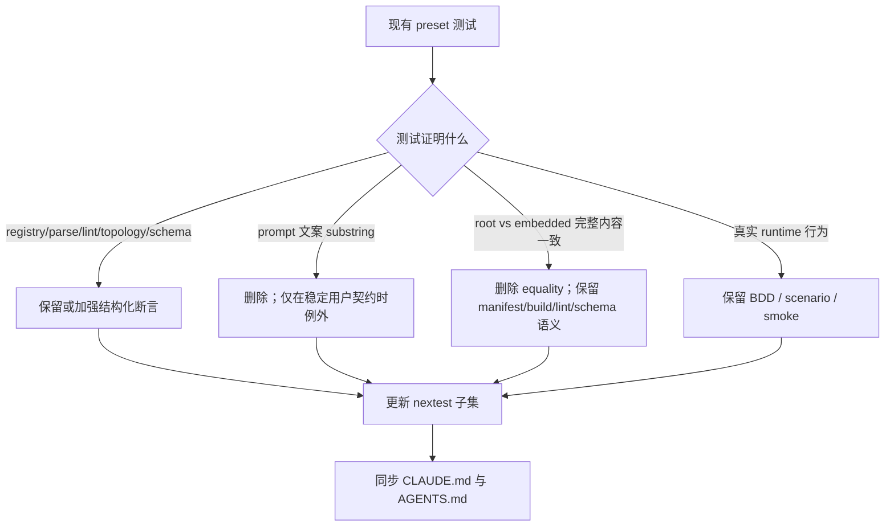

# refactor: Remove brittle preset text tests

## Goal Capsule

| Field | Value |
|---|---|
| Objective | 移除或改写只校验 preset YAML / hat instructions / embedded preset 完整文本的脆弱测试，并把禁止新增这类测试的规则写入 `CLAUDE.md` 与 `AGENTS.md`。 |
| Authority | 用户明确要求去掉“check preset 文件里面的文本内容对不对”的 testcase，并把规则写入两份 agent 指南。 |
| Execution profile | 小到中等范围的测试清理与文档规则同步；不改变 preset runtime 行为。 |
| Stop conditions | `crates/ralph-cli/src/presets.rs` 中不再保留目标文本/字节一致性测试；`CLAUDE.md` 与 `AGENTS.md` 完全一致；相关 nextest 子集通过。 |
| Tail ownership | 实现者负责删除/改写测试、同步文档、运行验证；若发现某个文本测试实际保护稳定用户契约，需保留并在代码注释中说明例外理由。 |

---

## Product Contract

### Summary

当前测试套件中存在一组直接扫描 preset 内容的测试，例如对 `preset.content.contains(...)`、hat instructions 文案、root preset 与 embedded preset 完整内容一致性的断言。
这些测试把易变 prompt 文案和 YAML 序列化细节当成稳定契约，导致 preset 文本正常演进时频繁触发维护成本。
本计划将这些测试替换为结构化语义验证，或在没有真实行为价值时直接删除。

### Problem Frame

Preset 的文本内容本质上是 agent 指令和配置载体，会随着经验、术语和流程改进持续变化。
测试应该保护行为契约：registry 可解析、topic 拓扑合法、schema 字段可用、lint 能拦截违规、runtime 路径能跑通。
直接锁定文案片段或整份 YAML 字节内容，会把“文案是否完全没变”误当成“行为是否正确”。

### Requirements

- R1. 删除或改写 `crates/ralph-cli/src/presets.rs` 中只检查 preset 文本内容、hat instructions 文案、embedded/root full-content equality 的测试。
- R2. 保留或补足结构化语义测试，覆盖 registry、YAML 解析、hat `triggers` / `publishes`、`event_policy.schemas`、`required_fields`、preset lint 或真实 runtime 行为。
- R3. 不扩大到所有 `contains` 测试；只处理与 preset 文本/prompt 文案/full-content equality 直接相关的脆弱测试。
- R4. 在 `CLAUDE.md` 和 `AGENTS.md` 写入新的 hard rule：禁止新增仅校验 preset 文本内容或 byte-equality 的测试，优先用结构化语义或 runtime path 验证。
- R5. 更新两份文档中现有与 `test_ce_executor_root_preset_matches_embedded`、`SSOT byte-equality` 相关的旧验收要求，避免规则自相矛盾。
- R6. 保持 `CLAUDE.md` 与 `AGENTS.md` 内容完全一致。
- R7. 使用仓库规定的 `cargo nextest run` 系列命令验证，不使用裸 `cargo test -p ralph-cli`。

### Scope Boundaries

- 本轮不修改任何 `presets/en/*.yml` 或 `presets/schemas/*.yml` 的业务内容。
- 本轮不删除输出格式、summary、memory、handoff 等非 preset 领域的普通 `contains` 测试。
- 本轮不重新设计 embedded preset 构建机制；如果需要证明 embedded 内容生成正确，优先依赖 build 脚本、manifest 清单、parse/lint/schema 语义，而不是完整文本一致性断言。
- 本轮不改历史计划或 `docs/solutions/` 中的旧记录；它们是历史快照，除非实现者发现当前文档规则会直接引用旧测试名。

### Acceptance Examples

- AE1. 当 `ce-executor-pipeline.yml` 的 agent 指令措辞调整但结构化 topic/schema 没变时，目标测试不会因为 substring 或 full-content equality 失败。
- AE2. 当某个 preset 丢失关键 schema 字段或 hat publish/trigger 拓扑断裂时，结构化测试、preset lint 或 BDD/runtime 测试仍能失败。
- AE3. 当贡献者查看 `CLAUDE.md` 或 `AGENTS.md` 时，能明确知道不要新增 preset 文本内容锁定测试，并知道应使用什么替代验证方式。

---

## Planning Contract

### Key Technical Decisions

- KTD1. 将“文本锁定”替换为“结构化语义验证”。
  断言目标应从 `preset.content.contains("...")`、完整 YAML 字节一致性，转向 `RalphConfig::parse_yaml` 后的配置字段、preset lint findings、BDD scenario 或 runtime path。

- KTD2. 删除没有结构化价值的别名/文案测试，而不是机械迁移。
  例如 duplicate-content alias 检查依赖完整 content normalize，比 registry 无 alias 机制更脆弱；保留 `get_preset("ce-executor-serial").is_none()` 等 registry 断言即可覆盖用户可见契约。

- KTD3. 对 schema metadata 测试只保留字段级语义。
  `test_ce_executor_pipeline_loop_embedded_includes_u8_field_docs` 目前同时做 merge/full-content equality 和 `field_docs` 字段检查；应去掉 equality 前半段，只解析实际 embedded preset 并检查相关 topics 的 `field_docs` / `examples` 等结构化字段。

- KTD4. 文档 hard rule 必须替换旧验收命令。
  `CLAUDE.md` 与 `AGENTS.md` 当前仍要求跑 `test_ce_executor_root_preset_matches_embedded` 和 “SSOT byte-equality”；实现时需要改为 schema/preset lint、结构化 field parity 或全量 `./scripts/run-tests.sh`，否则新规则与旧规则冲突。

### High-Level Technical Design



### Assumptions

- `presets_array_matches_manifest` 这类清单一致性测试不属于“preset 文本内容测试”，可以保留。
- `RalphConfig::parse_yaml(preset.content)` 这类解析测试不属于脆弱文本测试，可以保留。
- 若某段 prompt 文本被产品定义为稳定用户可见契约，允许保留精确文本断言，但必须在测试注释中写明为什么它是稳定契约。

### Sources and Research

- `crates/ralph-cli/src/presets.rs` 当前包含目标测试：`test_no_serial_to_pipeline_alias`、`test_merge_loop_preset_is_embedded`、`test_ce_executor_forbids_agent_branch_creation`、`test_autoresearch_forbids_agent_branch_creation`、`test_ce_executor_root_preset_matches_embedded`、`test_ce_executor_pipeline_loop_embedded_includes_u8_field_docs`、`test_ce_executor_supervisor_root_preset_matches_embedded`。
- `CLAUDE.md` 与 `AGENTS.md` 当前 hard rule 仍提到 `test_ce_executor_root_preset_matches_embedded` 和 `SSOT byte-equality`。
- `docs/solutions/tooling-decisions/ralph-preset-embedded-compilation-2026-05-26.md` 说明 embedded preset 的构建/发布背景；本轮不改构建机制，只调整测试策略。

---

## Implementation Units

### U1. Classify and remove preset text-lock tests

- **Goal:** 删除 `crates/ralph-cli/src/presets.rs` 中没有结构化行为价值的 preset 文本/字节锁定测试。
- **Requirements:** R1, R2, R3
- **Dependencies:** None
- **Files:**
  - Modify: `crates/ralph-cli/src/presets.rs`
- **Approach:**
  - 删除 `normalize_for_compare` 与 `test_normalize_for_compare_handles_bom_crlf_case`，前提是只被 alias full-content 测试使用。
  - 删除 `test_no_serial_to_pipeline_alias`，保留已有 registry 层断言：`get_preset("ce-executor-serial").is_none()`、`preset_names()` 不包含 legacy 名称。
  - 将 `test_merge_loop_preset_is_embedded` 改为只验证 registry entry 存在、描述不空、content 可解析为 `RalphConfig`；不要检查 `RALPH_MERGE_LOOP_ID`、`git merge` 等文案 substring。
  - 删除 `test_ce_executor_forbids_agent_branch_creation` 与 `test_autoresearch_forbids_agent_branch_creation`，因为它们扫描 prompt 文案而非结构化配置；如需要长期防线，后续应设计结构化 lint 或 runtime/worktree 行为测试。
- **Patterns to follow:**
  - `assert_public_preset_has_completion_path` 使用 `RalphConfig::parse_yaml` 后检查结构化字段。
  - `test_ce_executor_reporter_publishes_report_done` 检查 hat `publishes`，是应保留的结构化断言模式。
- **Test scenarios:**
  - 删除后 `cargo nextest run -p ralph-cli --bin ralph -- presets` 不再编译引用已删除 helper。
  - `test_get_preset_serial_returns_none` 和 legacy `ce-executor` unknown 测试仍覆盖“不要 alias 回旧 preset”的 registry 契约。
  - `merge-loop` builtin 仍能通过 parse/registry 测试证明可用。
- **Verification:** `presets.rs` 不再出现目标文本锁定测试名；相关 nextest 子集通过。

### U2. Replace embedded/root equality with structured schema assertions

- **Goal:** 移除 root preset 与 embedded preset 完整内容一致性测试，同时保留必要 schema metadata 语义检查。
- **Requirements:** R1, R2, R5
- **Dependencies:** U1
- **Files:**
  - Modify: `crates/ralph-cli/src/presets.rs`
- **Approach:**
  - 删除 `test_ce_executor_root_preset_matches_embedded`。
  - 删除 `test_ce_executor_supervisor_root_preset_matches_embedded`。
  - 改写 `test_ce_executor_pipeline_loop_embedded_includes_u8_field_docs`：直接解析 `get_preset("ce-executor-pipeline-loop").content`，检查 `event_loop.event_policy.schemas` 中相关 topics 的 `field_docs` 是非空 mapping；不要调用 `merge_root_with_ssot` 或 assert full-content equality。
  - 删除不再使用的 `read_root_preset`、`read_root_schema`、`merge_root_with_ssot`、`merge_preset_with_schema_yaml`、`ensure_yaml_mapping`、`deep_merge_yaml_mapping`，以及 `SSOT_SECTION_TARGETS` 测试模块 import。
  - 若删除 helper 后 `crate::preset_merge_table::SSOT_SECTION_TARGETS` 仅剩 build 脚本或非测试使用，保持生产代码不动。
- **Patterns to follow:**
  - `test_ce_executor_pipeline_loop_fix_reentry_contract` 直接从 parsed config 中读取 schema，是本单元的替代模式。
  - `presets_array_matches_manifest` 保留清单层一致性，不替代为 full-content equality。
- **Test scenarios:**
  - 删除 schema SSOT merge helper 后，`presets.rs` 测试模块无 unused import。
  - `ce-executor-pipeline-loop` 的 `field_docs` 语义仍由结构化测试覆盖。
  - 修改 preset YAML 注释、缩进或 prompt 文案不会触发本单元测试失败。
- **Verification:** `rg -n "root_preset_matches_embedded|merge_root_with_ssot|read_root_preset|byte-equality" crates/ralph-cli/src/presets.rs` 不再命中当前测试实现；相关 nextest 子集通过。

### U3. Update project hard rules in CLAUDE.md and AGENTS.md

- **Goal:** 写入新的 preset 测试规则，并移除与 byte-equality 测试冲突的旧验收要求。
- **Requirements:** R4, R5, R6, R7
- **Dependencies:** U1, U2
- **Files:**
  - Modify: `CLAUDE.md`
  - Modify: `AGENTS.md`
- **Approach:**
  - 在 Hard Rules 中新增规则：禁止新增只校验 preset YAML / hat instructions / prompt 文案 / full-content byte-equality 的测试；优先用结构化配置、lint、BDD scenario 或 runtime path 验证。
  - 修改 “preset yml 改动后必须同步 schema 并跑校验” 段，删除 `test_ce_executor_root_preset_matches_embedded`，替换为适用的 schema/preset lint 与结构化 parity 子集。
  - 修改 “preset/schema 改动后的下游同步清单” 的全量校验说明，删除 “SSOT byte-equality” 表述，改为 “preset_lint + WAC + scenarios + 结构化 schema/preset parity”。
  - 先编辑 `CLAUDE.md`，再复制或等价同步到 `AGENTS.md`，保证完全一致。
- **Suggested rule text:**

```md
- **Preset 测试规则(HARD RULE)**: 不要新增只校验 preset YAML / hat instructions / prompt 文案是否包含某段文本的测试，也不要用 byte-equality 锁定 root preset 与 embedded preset 的完整内容。Preset 文本和 prompt 内容会频繁演进，这类测试维护成本高且不能证明行为正确。需要覆盖 preset 约束时，优先测试结构化语义：`RalphConfig::parse_yaml`、hat `triggers` / `publishes`、`event_policy.schemas`、`required_fields`、preset lint findings、BDD scenario 或真实 runtime path。只有当某段文本本身是稳定的用户可见契约时，才允许断言精确文案，并必须在测试注释中说明例外理由。
```

- **Test scenarios:**
  - `diff -u CLAUDE.md AGENTS.md` 无差异。
  - `rg -n "test_ce_executor_root_preset_matches_embedded|SSOT byte-equality" CLAUDE.md AGENTS.md` 不再命中当前强制验收规则。
  - 新 hard rule 明确说明允许的例外条件。
- **Verification:** 文档同步检查通过；不触碰 `.ralph/` 运行时状态文件。

### U4. Run targeted and final verification

- **Goal:** 用 nextest 系列命令证明测试清理没有破坏 preset 相关测试与文档同步约束。
- **Requirements:** R7
- **Dependencies:** U1, U2, U3
- **Files:**
  - Test: `crates/ralph-cli/src/presets.rs`
  - Test: `CLAUDE.md`
  - Test: `AGENTS.md`
- **Approach:**
  - 先跑 `cargo nextest run -p ralph-cli --bin ralph -- presets` 覆盖 `presets.rs` 单测子集。
  - 再跑 `cargo nextest run -p ralph-cli --bin ralph -- preset_lint` 和 `cargo nextest run -p ralph-core -- preset_lint`，确认 preset lint 相关契约仍通过。
  - 跑 `scripts/check-cli-doc-drift.sh`，因为本轮修改 CLI/preset 相关 hard rule 文档。
  - 最终按项目规则跑 `./scripts/run-tests.sh`；如遇竞态/时序 flake，再按仓库规则使用 `RALPH_BASELINE_SERIAL=1 ./scripts/run-tests.sh` 兜底。
- **Test scenarios:**
  - ralph-cli preset 子集通过，且不再执行已删除的 byte-equality 测试。
  - preset lint 子集通过，证明行为契约仍由 lint/结构化检查覆盖。
  - 文档 drift 脚本通过，避免命令名或文档规则漂移。
- **Verification:** 所有验证命令通过；若全量 suite 因已知 flake 失败，记录 serial fallback 结果和失败原因。

---

## Verification Contract

| Gate | Applies To | Done Signal |
|---|---|---|
| `cargo nextest run -p ralph-cli --bin ralph -- presets` | U1, U2 | `presets.rs` 相关测试编译并通过；无已删除 helper/test 引用。 |
| `cargo nextest run -p ralph-cli --bin ralph -- preset_lint` | U2, U4 | CLI preset lint 子集通过。 |
| `cargo nextest run -p ralph-core -- preset_lint` | U2, U4 | core preset lint 子集通过。 |
| `scripts/check-cli-doc-drift.sh` | U3 | 文档与 CLI/preset 命令引用无静态漂移。 |
| `diff -u CLAUDE.md AGENTS.md` | U3 | 两份 agent 指南完全一致。 |
| `./scripts/run-tests.sh` | U4 | 最终 workspace 验证通过，或按仓库规则记录 serial fallback 结果。 |

---

## Definition of Done

- `crates/ralph-cli/src/presets.rs` 不再包含仅服务于 preset full-content equality、prompt substring、instructions 文本扫描的目标测试。
- 必要 preset 行为由结构化 config、schema、lint、BDD 或 runtime 测试覆盖，而不是由 YAML 文案锁定覆盖。
- `CLAUDE.md` 与 `AGENTS.md` 都包含新的 Preset 测试规则，并且删除对 `test_ce_executor_root_preset_matches_embedded` / `SSOT byte-equality` 的强制验收依赖。
- `CLAUDE.md` 与 `AGENTS.md` 完全一致。
- 所有 verification gates 已运行并通过；若全量验证触发已知 flake，按仓库规则记录 fallback。
- 实现 diff 中没有遗留无用 helper、unused import、或为旧测试保留的死代码。
