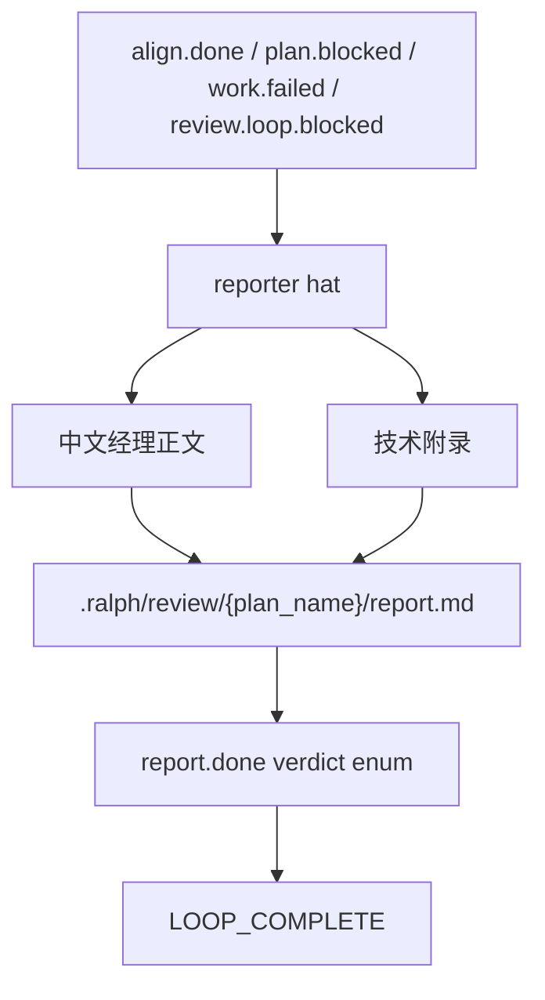

# feat: Pipeline reporter 中文经理结项报告

## Summary

把 `ce-executor-pipeline` 与 `ce-executor-pipeline-loop` 的 `reporter` hat 从「英文事件字段流水账」改成固定结构的**中文经理结项报告**（正文）+ **短技术附录**；仍写入 `.ralph/review/{plan_name}/report.md`。`report.done.verdict` 继续用英文三态枚举，不改 schema / runtime。

## Problem Frame

当前两套 preset 的 reporter instructions 要求按 Plan Review / Execution / 6-dim / Fix / Alignment 摊平 `tests_run`、`baseline_existing_count` 等字段。产物面向工程师遥测，不适合给不懂或略懂技术的 manager：缺「做了什么 / 试过什么 / 为什么 / 能不能继续」的叙事，也无中文固定骨架。

同时 loop preset 已触发 `review.loop.blocked`，但 instructions 缺少对应分支，容易漏写多轮未收敛证据。

## Requirements Trace

- R1. 报告正文为中文，固定 H2 章节；专有名词 / 命令 / SHA 可保留英文。
- R2. 受众分层：正文给 manager；技术附录给需要核对证据的人；经理可不看附录仍能决策。
- R3. 落盘路径仍为 `.ralph/review/{plan_name}/report.md`（mkdir 后写入）。
- R4. `report.done.verdict` 仍为 `pass` | `pass_with_residuals` | `blocked`；正文用对应中文结论，不发明新枚举。
- R5. 两套 preset 共用同一正文骨架；loop 仅在「质量与风险」增加「多轮修复经过」小节。
- R6. 失败路径（`plan.blocked` / `work.failed` / loop 的 `review.loop.blocked`）使用同一骨架，结论为未完成，并写清卡点与建议动作。
- R7. 禁止把 payload 字段名当正文（须先映射成人话）；禁止 silent-success 话术。
- R8. 不新增锁定 instructions / report.md 文案的测试；验证靠 preset_lint、embedded presets、现有 scenarios（只断言 `report.done` 事件）。
- R9. **报告产物**不做 mermaid / AACIM 图（本计划明确排除；计划文档内的设计示意图不受此限）。

## Scope Boundaries

### In Scope

- `presets/en/ce-executor-pipeline.yml` 的 `reporter.instructions`（及必要时 description）
- `presets/en/ce-executor-pipeline-loop.yml` 的 `reporter.instructions`（及必要时 description）
- 可选：`skills/ralph-preset-common/references/patterns.md`、`skills/ralph-preset-common/references/author-checklist.md` 增加通用「经理可读终态报告」模式/检查项（不写具体 preset 名进注入 skill）

### Out of Scope

- 不改 `report.done` / `LOOP_COMPLETE` schema 或 required_fields
- 不改 runtime、`audit_file_modifications`、事件拓扑
- 不把报告改写到 `docs/report/`
- 不新增 zh preset 变体
- 不让 runtime 解析 `report.md` 章节
- 不在**报告产物**中做 mermaid / 图示
- 不新增 prompt 文案 byte-equality 测试

### Deferred to Follow-Up Work

- 落地后可用 `/ce-compound` 沉淀 `docs/solutions/` 条目（中文经理报告 + 技术附录）
- 将来若要 AACIM / mermaid，另开计划

## Key Technical Decisions

- D1. **双层报告**：固定中文经理正文 + 短技术附录（用户确认）。附录放证据路径、SHA、counts、维度 finding 摘要；正文禁止字段名堆砌。
- D2. **中文结论映射英文 verdict**：正文写「通过 / 有遗留可跟进 / 未完成需介入」；emit 仍用 `pass` / `pass_with_residuals` / `blocked`（用户确认）。
- D3. **共用骨架**：两 preset 同一套 H2；loop 多一小节「多轮修复经过」（每轮一行：轮次、是否请求修复/接受、要点；末轮可稍详）。
- D4. **`review.loop.blocked` → 一律 `blocked`**：即使部分 finding 已修，经理结论与 emit 均为未完成/blocked，避免与 `pass_with_residuals` 混淆。
- D5. **ledger 聚合**：loop 侧禁止只靠 `tail -1` 讲多轮故事；按 `review_round` 聚合 round 目录与相关事件。无 fix 轮时正文写明「本轮未进入修复」。
- D6. **instruction-only**：改 hat instructions；保留 OPAC / emit skill 引用与 `--policy-check`；第二 activation 只发 `LOOP_COMPLETE` 时禁止重写 `report.md`。
- D7. **验证策略**：跑 preset_lint / presets / 相关 scenarios；人工对照报告骨架 checklist；不测正文句子。

## High-Level Technical Design

### 固定报告骨架（实现时写入 instructions 的 HARD RULE 示例）

经理正文（中文 H2）：

1. 一句话结论（含中文三态之一）
2. 我们想解决什么
3. 实际做了什么
4. 尝试过但未做成 / 刻意没做的
5. 为什么这样决策
6. 质量与风险（loop 含「多轮修复经过」）
7. 请你决定的事（与 §1 三态对应的行动：可继续 / 有条件跟进 / 需介入 + 建议下一步）

技术附录（短）：

- 计划与产物路径
- 关键 SHA / commit 摘要
- 验证与计数（人话标签 + 数值）
- 评审/修复证据指针（维度文件、round 目录、residuals）

失败短路路径仍用上述骨架：§3–§6 标明未跑或仅部分证据；§1/§4/§7 写清卡点。

## Implementation Units

### U1. 定义共用中文报告契约并改写普通 pipeline reporter

**Goal:** `ce-executor-pipeline` 的 reporter 按双层中文骨架写 `report.md`，并保持现有 emit 契约。

**Requirements:** R1–R8（本单元定义 R5 共用骨架，供 U2 复用）

**Dependencies:** None

**Files:**

- Modify: `presets/en/ce-executor-pipeline.yml`

**Approach:**

- 替换现有 instructions 里 Branch A 的旧英文字段清单（原 §1 Verdict … §7 Conclusion）为上述中文骨架 + 附录清单。
- 保留现有 verdict 派生规则；增加正文中文话术与 enum 的对照表。
- Branch B（`plan.blocked` / `work.failed`）改用同一骨架。
- 强化：禁止字段名当正文、禁止第二轮重写报告、emit 前 `--policy-check`。
- 证据仍从 trigger + `ralph events` + `.ralph/review/{plan}/` 读取（hat 视角）。

**Test scenarios:**

- Test expectation: none for report.md prose -- 禁止文案锁死；现有 scenario 仍期望 `report.done` 三字段即可。
- Happy path: align.done 后仍发出 `report.done` + `LOOP_COMPLETE`（既有 BDD）。
- Error path: plan.blocked / work.failed 仍 blocked（既有 BDD）。

**Verification:**

- 人工对照：报告含固定中文 H2 + 附录；`verdict` 仍为英文三态之一。
- `cargo nextest run -p ralph-cli --bin ralph -- preset_lint`
- `cargo nextest run -p ralph-core --test scenarios -- ce_executor_pipeline`

### U2. 同步 loop reporter（含多轮小节与 review.loop.blocked）

**Goal:** loop reporter 与 U1 同骨架；补多轮叙事与 Branch C。

**Requirements:** R5–R8（正文契约经 U1 复用）

**Decisions:** D3–D5

**Dependencies:** U1

**Files:**

- Modify: `presets/en/ce-executor-pipeline-loop.yml`

**Approach:**

- 复用 U1 正文/附录契约（同时落实 R5 共用骨架）；在「质量与风险」增加「多轮修复经过」。
- 证据读取强调 `round-<NN>/` 全量扫描，禁止只用最新一轮讲完整故事。
- 新增 Branch C：`review.loop.blocked` → 骨架报告 + `verdict: blocked`；description 改为包含该 trigger。
- 无 fix 轮：附录/正文明确「未进入修复」。

**Test scenarios:**

- Happy / fix-reentry / max-round blocked：既有 scenarios 仍通过（只断言事件）。
- Error path 文案：instructions 显式覆盖 `review.loop.blocked`（人工核对，无 substring 测试）。

**Verification:**

- `cargo nextest run -p ralph-cli --bin ralph -- presets`
- `cargo nextest run -p ralph-core --test scenarios -- ce_executor_pipeline_loop`

### U3. Operator pattern 轻量同步与验收

**Goal:** 让 preset 作者知道「终态报告应经理可读 + 附录」，并完成 lint/scenario 验收。

**Requirements:** R8

**Dependencies:** U1, U2

**Files:**

- Modify: `skills/ralph-preset-common/references/patterns.md`（可选但推荐）
- Modify: `skills/ralph-preset-common/references/author-checklist.md`（可选一行 checklist）

**Approach:**

- 写通用规则：终态 reporter 类 hat 应用中文经理正文 + 技术附录；禁止字段流水账；不改 CLI/finding。
- 注入 skill（`crates/ralph-core/data/*.md`）预计无需改；反向确认。
- 跑 targeted + 相关 scenarios；不跑全仓除非准备合并。

**Test scenarios:**

- Test expectation: none -- 文档同步人工审计。

**Verification:**

- checklist / patterns 与两 preset instructions 语义一致。
- preset_lint + presets + pipeline/loop scenarios 通过。

## Risks And Mitigations

| Risk | Impact | Mitigation |
|---|---|---|
| Agent 仍输出英文字段流水账 | 经理不可读 | HARD RULE + 完整中文 H2 示例；明确「禁止字段名当正文」 |
| 正文与 `verdict` 不一致 | 误导决策 | 强制中文三态 ↔ enum 对照表；`LOOP_COMPLETE.reason` 与结论同语义 |
| loop 多轮叙事丢失中间轮 | 报告不诚实 | 禁止只 `tail -1`；强制 round 目录聚合 |
| `review.loop.blocked` 仍被当成普通 Branch B | 缺多轮证据 | 独立 Branch C + 更新 description |
| 文案测试诱惑 | 维护成本 / 违规 | R8：只用结构化事件测试 |

## Acceptance Criteria

- [x] 两套 preset reporter 按固定中文 H2 写经理正文，并含短技术附录
- [x] 报告仍落在 `.ralph/review/{plan_name}/report.md`
- [x] `report.done.verdict` 仍为英文三态；正文有对应中文结论
- [x] loop 含多轮小节；`review.loop.blocked` 有明确分支且 verdict=blocked
- [x] 失败路径使用同一骨架
- [x] 报告产物无 mermaid；无 report.md / instructions 文案锁死测试
- [x] preset_lint、presets、相关 BDD scenarios 通过

## Recommended Execution Order

1. U1 普通 pipeline reporter 模板落地
2. U2 loop 同步 + Branch C + 多轮聚合
3. U3 operator skill 轻量同步与验证
