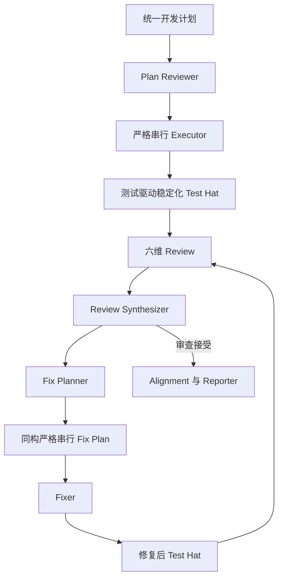

# CE 统一计划契约与全链路 Hat 适配需求

## Problem Frame

现有 `ce-executor-pipeline` 与 `ce-executor-pipeline-loop` 围绕旧版计划结构工作：
它们主要识别 `Implementation Units`、`U1`、`Goal`、`Approach`、
`Test scenarios`、`Verification` 等字段，并让 executor、reviewer、fix-planner、
fixer 各自以局部约定解释计划。新的开发计划已经升级为统一的工程实践契约：先定义
Spec-First 范围，再用 BDD Scenario 描述外部行为，以 ATDD 和需求—测试追踪矩阵落地
验收，最后按严格串行 Unit 完成 Red → Green → Refactor、集成和回归闭环。

如果只适配 plan-reviewer 或 executor，后续 review、综合、修复计划、fixer、alignment 和
reporter 仍会丢失 Requirement、Scenario、Unit 与测试之间的联系，fix-planner 也会重新生成
一份语义降级的旧式修复清单。因此这次工作的真实目标是：让两个 preset 的所有 hat 共享
同一种计划语言，并让修复阶段产出与原始计划同构、可直接串行执行的修复计划。

本次属于 preset 层的端到端契约重构，不建设新的通用编排平台。优先复用现有 isolated
hat、单业务事件、event policy、artifact 文件和 review/fix loop 能力。

## Target Flow

图只表达共同语义链路。任何 Test Hat 生产修改都必须进入独立六维 Review，不能由 Test Hat
自行放行；linear preset 在一次计划化 fix 后执行最终审查并接受或阻塞，不再开启第二个 fix
round，loop preset 则由现有 review-gate 决定继续 review/fix 或退出。下文的文字需求为准。

## Requirements

**统一计划契约**

- R1. 两个 preset 必须把新版计划视为一个完整契约，而不是只提取 Unit 清单。契约至少
  包含：功能目标与范围、BDD Feature/Scenario、验收与测试策略、需求—测试追踪矩阵、
  严格串行 Unit、最终质量门禁。这六部分是一份供 Planner 和各 hat 对齐意图的参考骨架，
  不是要求输入文档逐字、逐标题、逐层级匹配的刚性 schema。
- R2. Requirement、Scenario 和 Unit 必须有稳定、可追踪的身份。计划显式提供的 ID
  必须原样保留；没有显式 ID 时，plan-reviewer 按各自已确认的文档顺序一次性分配内部
  `R1`、`S1`、`U1` 等稳定 ID，并记录原始标题到内部 ID 的映射。下游 hat 必须复用该映射，
  不得独立重新编号。内部归一化不得要求作者重写面向人的标题，也不得把某一种语言、编号
  符号或 Markdown 标题写法当作合法性的前提。
- R3. 每个 Unit 必须保留其完整执行边界：目标、对应 Scenario、外部结果、输入输出、
  已完成依赖、禁止依赖的未来能力、验收测试、单元测试拆分、预期 RED 原因、最小实现、
  集成验证、回归范围、完成标准和风险。任何 hat 不得只取其中一部分后自行补全语义。
- R4. 统一计划契约必须固定“严格串行、前一 Unit 完整关闭后才允许下一 Unit 开始”的
  含义。Unit 失败时不得以文件不重叠或看似独立为由继续后续 Unit；未开始的后续 Unit
  必须明确标为被前置门禁阻塞，而不是伪装成完成或普通跳过。
- R5. 计划的最终质量门禁是执行契约的一部分。若最终验证发现属于较早 Unit 的问题，
  必须回到责任 Unit 修正，并按顺序重新验证受影响的后续 Unit；不得在最后一个 Unit
  偷补前序生产逻辑。

**Plan Reviewer**

- R6. plan-reviewer 必须采用“参考格式优先、容错识别、实质门禁”的识别原则：
  当计划接近六段式参考骨架时，应利用现有章节、编号和字段快速定位内容；当标题名称、
  Markdown 层级、编号风格、字段顺序、语言或措辞与参考格式不完全一致时，应根据上下文和
  内容含义继续识别，不能因为格式漂移直接拒绝；只有目标、Unit 边界、执行顺序、依赖或验证
  等实质信息缺失或互相矛盾，且无法在不改变需求的前提下补齐时，才允许阻塞。
  Unit 识别应综合判断：是否存在有序的执行切片、每个切片是否具有独立目标和外部可观察
  结果、是否声明依赖边界、是否包含可执行验证、以及计划是否表达前一切片完成后再进入下一
  切片。`Implementation Units`、`严格串行开发单元`、`U1`、`Unit 1` 等是有用线索，但
  不是硬编码门槛。识别必须保持保守：不得把需求编号、普通步骤列表、测试用例编号或普通文档
  章节误判为 Unit；不得静默合并两个独立行为或拆分一个原子行为。
- R7. plan-reviewer 必须验证 Scenario 可观察、需求—测试追踪无孤儿项、每个 Unit 有
  可执行且成本合适的验证入口、风险驱动测试选择有理由、E2E 数量受控，并确认最终门禁
  覆盖计划承诺。
- R8. 对缺失但可机械补齐的计划信息，plan-reviewer 可以就地修订并保留稳定 ID；对会
  改变产品行为、范围、Unit 边界、测试真值或外部前置条件的缺口必须阻塞，不得猜测接口、
  fixture、用户决策或不存在的文件。

**Executor 与严格串行执行**

- R9. executor 必须按规范化 U-ID 顺序执行全部 Unit，并把当前 Unit 的完整契约交给
  Unit subagent。主 executor 负责边界检查、RED/GREEN/REFACTOR 证据、Unit 回归、原子
  提交、进度结算和最终全量验证，不得直接替 Unit 偷做未授权实现。
- R10. 每个 Unit 必须形成独立 TDD 闭环：先让验收测试以正确原因失败，再拆最小单测，
  完成 GREEN 和重构，运行相关集成及受影响回归，满足完成标准后才关闭。删除或削弱断言、
  跳过测试、`.only`、无解释 snapshot/golden 更新和 Mock 掉真实行为均不得用于过门。
- R11. executor 的结果必须保留 Requirement → Scenario → Unit → 测试证据追踪，并区分
  planned、attempted、completed、failed、blocked 和 legitimately skipped；严格串行门禁
  导致的未执行 Unit 必须有可审计原因。
- R12. 原计划已完成的 skip path 仍可存在，但只有在每个 Unit 的实现证据、Scenario
  验收和最终门禁都重新验证后才能跳过重新实现，不能只依赖 commit subject 或计划状态。

**测试驱动稳定化 Test Hat**

- R13. 在 executor 完成后必须增加一等公民 Test Hat。首次 activation 以原始计划、executor
  HEAD/diff、验证证据和追踪矩阵为输入；修复后 activation 还必须读取 Fix Plan、fixer HEAD/diff、
  已处理 finding、上一轮 Test Hat 审计及原始追踪关系，不得复用过期 HEAD 或证据。它从测试
  视角独立执行动态验证、证伪和稳定化，可以
  修改并提交测试代码或生产代码，但只能处理测试过程中实际暴露、且属于原计划范围的缺陷；
  不得借测试之名增加产品需求、改变已确认的业务语义、扩大原 Unit 范围，或替代后续 review、
  fix-planner 的职责。
- R14. Test Hat 必须覆盖计划内 Scenario，并按风险选择必要的 Characterization、
  Contract、Property-Based、State-Machine、Idempotency/Concurrency、Fault Injection、
  Differential、Mutation 或 Fuzz 测试；不得机械运行所有技术，也不得把所有 Scenario
  升级为 E2E。
- R15. Test Hat 对每个动态失败必须先分类并给出证据：测试资产缺陷、生产代码缺陷、已有
  baseline、环境或 flaky、需求/计划歧义。测试资产缺陷应修复测试、fixture、Fake/Stub 或测试
  基础设施；原计划范围内的生产代码缺陷应在不削弱测试的前提下修复生产代码。不得通过删除或
  弱化断言、跳过测试、添加 `.only`、无解释更新 snapshot/golden、把真实协作 Mock 掉，或把
  失败重新标成 baseline 来获得绿色结果。无法可靠分类、需要新产品决策或要求扩大范围时必须
  停止修改并明确上报，不得自行猜测。
- R15a. 每次 Test Hat activation 必须在首次写入前记录输入 HEAD，并执行适用的基线验证，或
  复用绑定相同 HEAD、命令和环境口径且已经校验的基线产物；修改后必须以同一口径生成 delta。
  无法建立可信基线时，不得把失败归为 baseline，也不得实施依赖该归因才能成立的修改。
- R15b. 原始计划的 Scenario、验收条件和已确认业务语义构成 Test Hat 不得自行重定义的权威
  oracle。Test Hat 可以新增测试，也可以修复错误测试，但若修改既有验收测试、Scenario 映射、
  snapshot/golden 或关键断言，必须提供语义不变证据并由后续独立 reviewer 审查。不得同时改写
  被测实现与预期行为后，以自己修改后的测试结果作为唯一成功证明。
- R15c. Test Hat 的最小归因证据必须包含可复现失败、权威预期来源、足以区分测试缺陷与生产
  缺陷的隔离或反事实验证，以及已排除的主要备选原因。双因、证据冲突或需求歧义必须保留 RED
  证据并上报，不得选择最容易变绿的一侧。
- R16. loop preset 中 fixer 产生新实现状态后也必须经过 Test Hat，再进入下一轮 review
  或最终对齐；不得只测试首次 executor 结果而默认修复不会引入回归。Test Hat 每次必须输出
  统一审计产物，至少报告已验证/未验证 Scenario、实际命令、失败分类与证据、baseline、新增
  回归、采用的测试技术、测试与生产代码修改、提交与 HEAD、剩余风险。发生修改后必须运行直接
  相关测试、受影响回归和项目规定的全量测试门禁；只有全量门禁通过且没有新增跳过或 ignored
  测试，才能报告稳定化成功。Test Hat 的生产修改必须归属到稳定的 correction/attempt 身份，
  关联原 Requirement、Scenario、Unit 或 Fix Unit，并以稳定化后的 HEAD 作为下游审查基线；
  任何生产修改均须重新进入六维 Review。每次 activation 仍只发一个确定的完成事件。

**六维 Review 与综合**

- R17. 所有 dimension reviewer 必须读取权威规范化计划中与其职责相关的投影、Test Hat 审计和
  追踪信息，不得自行重新解释计划。review finding 不能只有自由文本；至少要指明稳定 finding
  ID、证据、严重性、是否阻塞主目标和所需验证。Requirement/Scenario/Unit 关联适用时必须填写；
  对真正跨切面或结构性问题，允许明确记录 `scope: global`、空关联及原因，不得伪造业务映射。
- R18. goal-alignment 必须对照业务目标、范围、非目标和 Scenario；correctness 必须审查
  外部行为及边界；testing 必须审查测试资产与 Test Hat 证据质量而不是重复充当 Test Hat；
  maintainability、project-standards 和 adversarial 也必须尊重 Unit 范围及追踪关系。
- R19. review-synthesizer 必须去重并合并跨维度发现，同时保留原始 finding ID、适用的
  Requirement/Scenario/Unit 关联或明确的 global scope、证据和验证要求。综合不得把多个不同
  外部行为压成一个无法原子修复的大任务。
- R20. loop preset 的 review-gate 必须根据综合后的“当前必须修复”问题和 Test Hat 新增
  回归信号决定继续、接受或阻塞；baseline、范围外和明确残余可以报告，但不能伪装成已修复。

**同构 Fix Plan 与 Fixer**

- R21. fix-planner 必须输出一个可直接交给 fixer 的统一修复计划，而不是旧式 finding
  清单。修复计划应采用与原始开发计划相同的六段结构：修复目标与范围、BDD 回归行为规格、
  验收与测试策略、Finding/Requirement/Scenario—测试追踪矩阵、严格串行 Fix Unit、最终
  质量门禁。
- R22. fix-planner 必须把行为型 finding 转换为外部可观察的回归 Scenario；结构、可维护性和
  项目规范类 finding 则转换为可执行的静态验收规则、characterization、lint、typecheck、build
  或差分验证，并保持指向适用的原始 Requirement/Scenario/Unit 和 finding ID 的追踪。不得为
  满足格式虚构业务 Scenario，不得凭空增加新产品需求，也不得把 baseline、范围外或仅建议项
  塞入必须执行的 Fix Unit。
- R23. 每个 Fix Unit 必须和开发 Unit 一样原子、可独立验证、严格串行并形成完整 TDD
  闭环；包含目标、受影响 finding/Scenario、外部结果、输入输出、依赖/禁止未来依赖、验收
  测试、RED 原因、最小修复、集成、回归、完成标准和风险。
- R24. fixer 只能执行 fix-planner 产出的 Fix Plan，按 Fix Unit 严格串行工作；不得重新
  执行原始计划、顺手处理未纳入的 finding，或在后续 Fix Unit 偿还前序测试债务。
- R25. fixer 的提交、验证、失败结算和责任 Unit 回退语义必须与 executor 一致。修复完成
  后必须提供 Finding → Regression Scenario → Fix Unit → 测试证据追踪，供 Test Hat、下一
  review round、alignment 和 reporter 使用。

**Alignment、Reporting 与两种 Preset 一致性**

- R26. alignment 必须分别核对原始计划执行与 Fix Plan 执行，确认每个 Requirement、
  Scenario、原 Unit、finding 和 Fix Unit 的状态；残余必须分类为已接受、范围外、baseline、
  未验证或仍阻塞，不得用单一总数掩盖。
- R27. reporter 必须输出面向操作者的端到端结果：原计划完成度、Scenario 验证状态、
  Test Hat 结果、review findings、Fix Plan 执行、修复后测试、残余与最终 verdict。报告必须
  明确哪些内容未验证，不能仅以“测试命令退出 0”宣称计划完成。
- R28. linear 与 loop preset 必须共享同一计划、测试审计、finding 和 Fix Plan 语义；差异
  只在 review/fix 是否循环收敛。任何一方的契约升级不得让另一方继续使用旧格式。
- R29. 新增 Test Hat、事件和字段后，preset YAML、对应 schema、event policy、topic owner/
  deny rules、trigger/publish、WAC 路径、结构化 lint/BDD 场景、用户可见 preset 描述及项目
  要求的同步文档必须一致。不得用只匹配 prompt 文案的脆弱测试代替结构化和真实 runtime
  路径验证。

## Success Criteria

- 一份采用新版格式的真实计划可以被两个 preset 直接接受，不需要人工改写为旧英文模板。
- 同一组 Unit 采用不同自然语言、标题层级、编号风格或字段顺序表达时，plan-reviewer 能得到
  等价的 Unit 顺序与边界；普通编号列表、Scenario 和需求项不会被误识别为 Unit。
- 语义识别通过仓库内可复用的正例、负例和歧义语料验收：覆盖等价格式变体、非 Unit 编号列表、
  Scenario/Requirement 误判诱饵、缺失边界的应阻塞样本和真正歧义样本，并断言规范化 Unit 顺序、
  边界、ID 映射及阻塞结论，而不是锁定 prompt 文案。
- 一份“大致遵循”参考骨架但存在轻微标题漂移、章节合并、字段换序或措辞变化的计划，不会仅因
  格式不完全一致被阻塞；相反，一份标题完全匹配但缺少真实 Unit 边界或验证内容的计划不能
  因为形式正确而被放行。
- 从 plan-reviewer 到 reporter，任意 Requirement、Scenario 和 Unit 都能追踪到实现、测试、
  finding、Fix Unit、修复后验证和最终状态。
- executor 与 fixer 均严格串行；前一 Unit 未关闭时不会启动后一 Unit，失败和阻塞分类可审计。
- Test Hat 在首次实现后和 loop 修复后都实际运行；它能基于证据区分测试缺陷与生产代码缺陷，
  修复原计划范围内的对应代码，并在全量测试门禁通过后将动态证据送入 review/fix 决策。
- fix-planner 生成的 Fix Plan 具备与原计划同等级的 BDD、ATDD、TDD、Regression 和最终门禁，
  fixer 无需自行发明修复范围或测试策略。
- linear 与 loop preset 的结构化 lint、schema parity、真实 workflow 场景和全量回归通过，且没有
  新增跳过、ignored、弱化断言或仅靠 prompt 文案锁定的测试。

## Scope Boundaries

- 本次不创建通用 workflow DSL、不新增 coordinator 模式，也不把 Unit 调度下沉成新的 runtime
  task engine；hat 仍在 isolated 模式下通过单事件链协作。
- 本次不重写通用 planner 产品；目标是定义并消费新版计划契约，以及让 fix-planner 输出同构
  Fix Plan。
- 本次允许 Test Hat 修复动态测试实际暴露的测试代码或生产代码缺陷，但不允许它改变产品语义、
  扩大原计划范围、处理未由测试证据支持的顺手问题，或替代六维 reviewer 与 fix-planner。
- 本次不取消现有六维 review；动态测试与测试质量审查保持不同职责。
- 本次提供六段式参考格式，但不要求计划服从固定标题、语言、编号符号、Markdown 层级或字段
  排列。允许实际输出“大致符合”参考结构并出现合理漂移；同时不承诺从缺少明确目标、顺序、
  边界和验证信息的任意散文中猜出 Unit。支持边界最终由实质语义是否完整、可可靠识别决定，
  而不是由模板匹配率决定。
- 本次不改变“单 activation 只允许一个业务事件”和“单 topic 单 consumer”的治理原则。

## Key Decisions

- 采用全链路契约迁移，而不是局部解析补丁：否则 review 与 fix 阶段会丢失新版计划的核心价值。
- 六段式是参考格式而不是解析 schema；识别采用参考结构优先、合理漂移容错、实质缺失阻塞。
  稳定的是执行身份与边界，不是标题写法。显式 ID 原样保留；缺少 ID 时才按确认后的执行顺序
  分配内部 U-ID，并保存原始标题映射。
- 严格串行采用 fail-stop 语义：这与新版计划的明确承诺一致，避免失败后继续堆叠不可验证状态。
- Test Hat 位于实现状态之后：executor 保留计划内 TDD，Test Hat 负责独立证伪、失败归因与
  范围内稳定化。它拥有测试和生产代码写权限，但成功条件不是“改过代码”，而是分类证据充分、
  未削弱测试、修改保持原计划语义且项目规定的全量测试门禁通过。
- Fix Plan 与原计划同构：修复也是开发工作，不能降低为没有 Scenario、验收层级和回归门禁的清单。
- linear 与 loop 使用同一 artifact 语义：减少两套 preset 长期漂移，只保留循环策略差异。

## Dependencies / Assumptions

- 现有 isolated hat、event policy、artifact 文件和 review/fix 链足以表达本需求；若计划阶段发现
  新 Test Hat 使 WAC hop 或现有事件模型无法承载，应优先调整 preset 拓扑与静态约束，而不是
  引入新的通用 runtime 机制。
- 新版开发计划的权威结构以本需求列出的六段式契约为准；示例计划
  `docs/plans/2026-07-15-001-feat-quota-auto-resume-plan.md` 用于验收真实兼容性，但不得把该计划
  的 MiniMax 领域内容硬编码进 preset instructions。
- Fix Plan 的 Scenario 是针对已证实 finding 的回归行为，允许引用原始 Scenario，也允许为此前
  漏掉的边界创建新的回归 Scenario，但必须保留 finding 来源并遵守原始范围。

## Outstanding Questions

### Resolve Before Planning

- 无。Test Hat 已确定拥有测试代码和生产代码写权限，但只能修复动态测试证据支持且属于原计划
  范围的缺陷；遇到计划歧义、新产品决策或范围扩张必须停止并上报。

### Deferred to Planning

- [Affects R1–R8][Technical] plan-reviewer 完成语义识别后，应采用何种最小规范化 artifact 保存
  稳定 ID、原始标题映射、Unit 边界和追踪关系，使后续 hat 复用识别结果而不是重复解析计划。
- [Affects R16, R20, R28–R29][Technical] loop preset 中 Test Hat 插入 `fix.done` 回路后的最短单
  consumer 拓扑、event schema 和 WAC hop 配置如何安排。
- [Affects R5, R9–R12, R25][Technical] 在保持“一个 Unit 一个实现 subagent”原则时，责任 Unit
  回退应复用原 subagent、允许同 U-ID 多 attempt，还是由主 agent 重新派发并记录 attempt identity。
- [Affects R29][Technical] 哪些现有 BDD workflow 场景可扩展，哪些需要新增真实 EventLoop 场景，
  由计划阶段基于当前测试覆盖确定。

## Next Steps

直接进入 `/ce:plan`，以 Test Hat 已拥有测试与生产代码写权限为既定输入，形成严格串行的
preset、schema、测试与同步文档实施计划。规划重点包括权威规范化 artifact、阶段化 topic、
稳定化 HEAD handoff、correction/attempt 身份、单消费者拓扑和失败结算。
