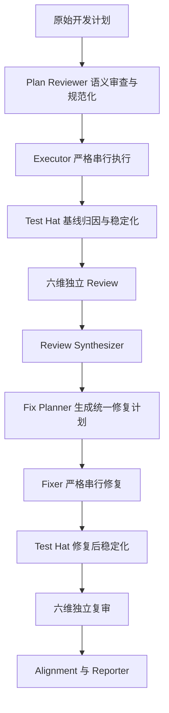
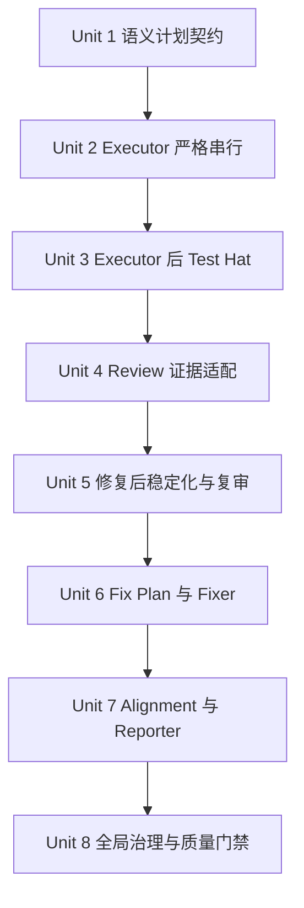

# 1. 功能目标

## 1.1 业务目标

将 `ce-executor-pipeline` 与 `ce-executor-pipeline-loop` 从依赖旧式固定标题的执行提示，升级为贯穿 Planner、Plan Reviewer、Executor、Test Hat、六维 Review、Fix Planner、Fixer、Alignment 与 Reporter 的统一语义计划流水线。

最终效果是：输入计划只要在语义上表达了目标、行为规格、验收策略、需求—测试追踪、严格串行 Unit 与质量门禁，即使标题、编号、语言或 Markdown 排版存在合理漂移，也能被审查和执行；每次代码交付都先经过一个可修改测试代码和生产代码的 Test Hat 稳定化，再由独立 Review Hat 审查 Test Hat 产生的新 HEAD。

## 1.2 本次范围

- 同时适配以下两个内置 preset：
  - `presets/en/ce-executor-pipeline.yml`
  - `presets/en/ce-executor-pipeline-loop.yml`
- Plan Reviewer 以语义识别计划能力，不以固定标题、固定编号或正则格式作为接收条件。
- Plan Reviewer 为缺失的 Requirement、Scenario、Unit 分配稳定 `R*`、`S*`、`U*` 标识，并生成一次性的规范化计划产物；下游复用该产物，不重复解释原始计划。
- Executor 与 Fixer 按 Unit 严格串行执行；任一 Unit 未关闭时，立即停止，不得继续所谓“独立”的后续 Unit。
- 新增可写 Test Hat（配置标识建议为 `test-stabilizer`）：
  - 在 Executor 完成后执行；
  - 在 Fixer 完成后再次执行；
  - 可以修改并提交测试代码和生产代码；
  - 修改前必须建立基线并区分测试缺陷、生产缺陷、既有失败、环境或 flaky、归因不明；
  - 不得削弱权威测试 Oracle；
  - 成功前必须运行项目要求的全量测试；
  - 只要修改生产代码，就必须产生可追踪 correction 身份、新 HEAD，并进入独立六维复审。
- 六个 Review Hat、Review Synthesizer、Fix Planner、Fixer、Alignment、Reporter 全部适配统一计划契约和稳定化产物。
- Fix Planner 输出与源计划同构的严格串行修复计划：行为缺陷转为回归 Scenario；结构性缺陷转为可执行静态验证，不伪装成业务 BDD。
- 更新事件拓扑、schema、真实 EventLoop BDD 场景、preset lint、AAF 作者说明、operator skill、项目文档与必要的注入 skill 文档。

## 1.3 非目标

- 不在 Rust 基础 runtime 中新增业务 Markdown 解析器、标题正则或通用 Unit DSL。
- 不要求所有输入计划使用完全相同的标题、编号、表格列名或语言。
- 不引入第二套重试引擎、通用工作流引擎或 Test Hat 自循环。
- 不把全部 Scenario 都提升为 E2E，也不通过 mock 掉真实事件拓扑来证明流程正确。
- 不要求 Test Hat 自动修复所有失败；归因不明、环境不稳定、无法保持 Oracle 或无法跑完全量测试时必须显式阻塞。
- 不改变 preset 名称、CLI 命令或用户选择 preset 的方式。
- 不承诺旧事件 payload 的向后兼容；本次以两个 preset 内部契约一致、可验证为准。

## 1.4 已知约束和假设

- `event_loop.execution_mode` 保持 `isolated`；每个 activation 只能依靠可见文件、Git 状态、runtime task API 与事件通信。
- 每个 activation 只允许一个业务事件；所有 emitter 必须先执行 `--policy-check`，再真正 emit。
- 每个业务 topic 维持单一消费者，禁止为“顺手 fan-out”破坏 OPAC/WAC 约束。
- 计划语义识别由 Plan Reviewer 的 agent 判断完成；runtime 只校验事件、artifact 引用、版本、摘要与路由字段。
- 规范化产物是审查后的权威投影，不是第二份可自由漂移的计划；必须记录源计划路径、版本/摘要和稳定 ID 映射。
- Test Hat 可以修改生产代码，但不能自证正确；其输出 HEAD 必须由后续独立 Review Hat 审查。
- Test Hat 必须在写入前记录输入 SHA、工作树状态和基线验证；存在无法归属的脏改动时不得覆盖或伪造 clean 状态。
- Fix Planner 可继续使用规范的 `### U<N>.` 作为受控输出约定，以兼容现有 `review_step_state` 的非空修复计划扫描；这不是对外部输入计划的格式限制。
- 线性 preset 只允许一次计划内修复：首次审查进入 Fix Planner；修复后稳定化和最终复审只能接受或阻塞，不再开启第二轮 Fix Plan。
- loop preset 保留现有最多六轮的收敛策略，但每次 `work.done` 或 `fix.done` 后都必须先经 Test Hat，才能进入下一轮 Review。
- 若新增拓扑导致 WAC 最大跳数不足，只允许在真实 lint 失败后最小调整 `EGRESS_MAX_HOPS` 并增加正反例；不得添加 preset 豁免。

## 1.5 统一 artifact 与事件契约

事件只携带路由和证据索引，不承载整张追踪矩阵。建议统一字段如下，最终名称以 schema 同步后的单一事实源为准：

| 字段 | 语义 |
|---|---|
| `plan_name` / `plan_path` | 原始计划身份 |
| `plan_contract_version` | 规范化契约版本，首版为 `ce-unified-plan/v1` |
| `normalized_plan_file` | Plan Reviewer 生成的权威语义投影 |
| `plan_contract_digest` | 原计划与规范化投影的绑定摘要 |
| `trace_file` | Requirement → Scenario → Unit → commit/test/finding 的追加式追踪文件 |
| `review_phase` | `initial` 或 `post_fix`，用于线性流程确定审查终点 |
| `tested_from_sha` | Test Hat 建立基线时的输入 HEAD |
| `head_sha` | 当前稳定化后、待独立审查的 HEAD |
| `stabilization_audit_file` | 失败分类、Oracle 判断、修改、测试命令与结果 |
| `correction_ids` | Test Hat 修改生产代码时生成的稳定 correction 身份集合 |
| `worktree_status` | 事件发出时真实工作树状态 |

规范化计划至少包含：目标/范围/约束、Requirement 列表、Scenario 与 Given/When/Then、验收测试层级、需求—测试追踪、严格排序 Unit、每个 Unit 的完成门禁、最终质量门禁。标题可以不同，但这些语义能力不可缺失。

## 1.6 Outside-In 流程



loop preset 在 `F` 后由现有 Review Gate 决定接受、请求下一轮修复或达到上限阻塞；线性 preset 在 `J` 后不再产生第二份 Fix Plan。

## 1.7 关键技术决策

| 决策 | 选择 | 原因 |
|---|---|---|
| 输入计划识别 | agent 语义识别 + 正/负/歧义语料 | 避免标题漂移造成假拒绝，也避免普通列表被误判为 Unit |
| 下游计划理解 | Plan Reviewer 一次规范化，下游复用 | 防止每个 Hat 独立解析产生语义漂移 |
| Test Hat 权限 | 可修改并提交测试与生产代码 | 测试视角发现的问题可能来自任一侧；用归因、Oracle、全量测试和独立复审约束风险 |
| Test Hat 成功定义 | 全量门禁通过且 HEAD/审计可追踪 | 局部测试通过不能证明稳定化完成 |
| 修复计划 | 与源计划语义同构、可适度压缩 | Fixer 获得同样明确的 BDD/ATDD/TDD/Regression 契约 |
| 结构性 finding | 静态/集成验证，不伪造 BDD | BDD 只描述外部可观察行为 |
| 线性最终复审 | phase-aware 终态，接受或阻塞 | 保持线性 preset 有界，不演化为隐式 loop |

# 2. BDD 行为规格

```gherkin
Feature: 统一语义计划贯穿 CE 执行、测试、审查和修复流水线

  Scenario S1: 接受语义完整但格式有漂移的计划
    Given 计划包含目标、行为规格、验收映射、严格排序 Unit 和质量门禁
    And 标题、编号、语言或 Markdown 结构与参考格式不完全相同
    When Plan Reviewer 审查该计划
    Then 它应按语义识别 Requirement、Scenario 和 Unit
    And 为缺失标识分配稳定 R、S、U ID
    And 产出绑定源计划摘要的规范化计划与追踪文件

  Scenario S2: 拒绝外观相似但语义不完整或存在歧义的计划
    Given 计划含有编号列表或 Unit 字样
    But 缺少可观察结果、可执行验收、依赖边界或完成门禁
    When Plan Reviewer 审查该计划
    Then 不应仅凭标题或编号认定它可执行
    And 应通过 plan.blocked 报告具体语义缺口

  Scenario S3: Executor 按规范化 Unit 严格串行完成
    Given Plan Reviewer 已发布有效规范化计划
    When Executor 执行 U1 到 Un
    Then 每个 Unit 应依次完成验收 Red、单元 Red-Green-Refactor、集成和回归验证
    And U(n+1) 只能在 Un 关闭后开始
    And work.done 应引用实际 HEAD、测试证据和完整追踪文件

  Scenario S4: Executor 在任一 Unit 失败后停止
    Given Executor 正在执行 Un
    When Un 失败、阻塞或无法满足完成标准
    Then 不得开始任何后续 Unit
    And work.failed 应准确区分 attempted、completed、failed、blocked、skipped Unit

  Scenario S5: Test Hat 修复测试实现缺陷
    Given Executor 产出的 HEAD 在测试阶段失败
    And 基线与证据表明生产行为符合权威规格、测试实现错误
    When Test Hat 进行稳定化
    Then 它可以修改并提交测试代码
    And 不得削弱权威 Oracle
    And 全量测试通过后发布新的可审查 HEAD 与审计文件

  Scenario S6: Test Hat 修复生产代码缺陷
    Given Executor 或 Fixer 产出的 HEAD 未满足权威 Scenario
    And 证据表明失败源于生产代码
    When Test Hat 进行最小生产修正
    Then 它应创建 correction ID、提交修改并更新追踪关系
    And 全量测试通过后发布 stabilization.done
    And 新 HEAD 必须进入独立六维 Review，不得直接进入 Alignment

  Scenario S7: Test Hat 对无法安全归因的失败保守阻塞
    Given 失败属于既有基线、flaky/环境、测试与生产均可能错误或工作树存在不明脏改动
    When Test Hat 无法用证据完成归因或无法运行全量测试
    Then 它不得删除测试、跳过测试、降低断言、无解释更新快照或掩盖失败
    And 应发布 stabilization.blocked 并保留诊断和未验证风险

  Scenario S8: Review Hat 审查稳定化后的真实 HEAD
    Given Test Hat 已发布 stabilization.done
    When 六个维度 Hat 和 Review Synthesizer 执行
    Then 它们应使用相同 normalized_plan_file、trace_file、head_sha 和 stabilization_audit_file
    And finding 应关联适用的 R、S、U 或 correction ID
    And 无法归属单一 Unit 的全局 finding 可以保留全局作用域

  Scenario S9: Fix Planner 生成可直接执行的统一修复计划
    Given Review Synthesizer 产出必须修复的 findings
    When Fix Planner 生成修复计划
    Then 行为缺陷应转为回归 Scenario 与可执行验收
    And 结构性缺陷应转为静态、单元或集成验证
    And Fix Unit 应严格串行、原子、可独立验证并具备完整 TDD 闭环
    And 修复计划应保留 finding 到测试和 Fix Unit 的追踪

  Scenario S10: Fixer 严格串行执行修复计划
    Given Fix Planner 已产出规范化修复计划
    When Fixer 执行 Fix Unit
    Then 任一 Fix Unit 未关闭时不得执行后续 Fix Unit
    And fix.done 应引用实际修复 HEAD、测试证据和追踪文件

  Scenario S11: 线性 preset 对修复结果强制再次稳定化和复审
    Given 线性 preset 的 Fixer 已发布 fix.done
    When 流程继续
    Then Test Hat 必须先对修复 HEAD 建立基线、归因并运行全量测试
    And 六维 Review 必须审查 Test Hat 的最终 HEAD
    And 最终复审只能接受或阻塞，不得隐式开启第二轮修复

  Scenario S12: loop preset 每轮修复后重新进入稳定化与审查
    Given loop preset 的 Fixer 已发布 fix.done
    When 下一轮开始
    Then fix.done 应先路由给 Test Hat
    And stabilization.done 才能进入 review-reentry 和下一轮六维 Review
    And Review Gate 应基于新 HEAD 和该轮证据决定接受、继续修复或阻塞

  Scenario S13: loop preset 达到最大轮次后阻塞
    Given Review Gate 已达到 max_review_rounds
    And 仍存在 must-fix 或阻塞性主线冲突
    When Gate 评估该轮结果
    Then 不得继续请求 Fixer
    And Reporter 应报告 review.loop.blocked、残留 finding 和最后验证 HEAD

  Scenario S14: Alignment 和 Reporter 验证端到端血缘
    Given执行流程已进入接受或阻塞终态
    When Alignment 与 Reporter 汇总结果
    Then 应能从 Requirement 追踪到 Scenario、Unit、commit、测试、finding、Fix Unit 和 correction
    And 不得将未验证内容报告为完成
    And 最终报告应明确 verdict、残留风险和工作树状态

  Scenario S15: 非法事件或绕过 Test Hat 的路径被拒绝
    Given 某 Hat 发出缺字段、错误 plan identity、未通过 policy-check 或绕过 stabilization 的业务事件
    When event policy 和 preset lint 校验该事件或拓扑
    Then 应拒绝该事件或 preset
    And 不得静默进入下游 Review、Alignment 或完成终态
```

# 3. 验收与测试策略

| Scenario | 验收条件 | 推荐测试层级 | 是否需要 E2E |
|---|---|---|---|
| S1 | 正常标题、改写标题、中文/英文、非连续编号均形成同一语义规范化产物 | 语义语料验收 + provider/replay 评估 + artifact 集成测试 | 否 |
| S2 | 普通清单、缺验收 Unit、矛盾依赖和歧义输入均明确阻塞 | 负向/歧义语料验收 | 否 |
| S3 | Unit 顺序、TDD 证据、完成门禁和 work.done 字段完整 | 真实 EventLoop 集成 + replay | 是，线性主路径一条 |
| S4 | 失败 Unit 后无后续 Unit 行为，统计字段真实 | 集成测试 | 否 |
| S5 | 测试缺陷可修复提交，Oracle 未削弱，全量门禁通过 | 集成 + Git fixture | 否 |
| S6 | 生产修正产生 correction、commit、新 HEAD，并强制复审 | 集成 + 契约测试 | 是，与线性主路径合并 |
| S7 | 不明归因、脏树、无法全测均阻塞且保留证据 | 故障注入 + 集成测试 | 否 |
| S8 | 六维审查共享同一 HEAD/产物，finding 可局部或全局归属 | 契约 + EventLoop 集成 | 否 |
| S9 | 行为 finding 生成回归 Scenario；结构 finding 生成静态验证；Fix Unit 完整 | 计划语料验收 + artifact 契约测试 | 否 |
| S10 | Fix Unit 严格串行，失败即停止 | 集成测试 | 否 |
| S11 | 线性 fix.done 必经 Test Hat 和最终复审，不能二次修复 | 真实 EventLoop BDD | 是，线性修复路径一条 |
| S12 | loop 每轮 fix.done 必经 Test Hat 再 reentry | 真实 EventLoop BDD | 是，loop 修复回环一条 |
| S13 | 最大轮次后终止并报告残留 | 真实 EventLoop BDD | 否 |
| S14 | 报告可追踪全链路且未验证项不冒充完成 | 集成 + 报告 artifact 验收 | 否 |
| S15 | schema、ownership、单消费者、WAC 和 policy-check 违规被拒绝 | preset lint + 契约负测 | 否 |

风险驱动补充测试：

- 对现有旧 prompt 行为先做 Characterization Test，锁定当前线性/loop 事件序列和失败统计，而不是锁定 prompt 文本。
- 计划输入采用正向、负向、歧义三类语料；该语料验证 agent 行为，不在 Rust 中实现 Markdown parser。
- 事件 payload 与 artifact version/digest 使用 Contract Test。
- loop 轮次和 phase 转换使用 State-Machine Test。
- Test Hat 的 flaky、命令失败、全量测试不可用和脏工作树使用 Fault Injection。
- Test Hat 修改前后 HEAD、追踪和报告使用 Differential Test。
- 禁止新增仅断言 YAML/prompt 包含某段文字的测试；必须覆盖结构化 schema、lint 或真实 runtime 路径。

# 4. 需求—测试追踪矩阵

| 需求 | Scenario | 验收测试 | 单元测试 | 集成/契约测试 | E2E |
|---|---|---|---|---|---|
| R1-R4：语义计划、稳定 ID、规范化产物 | S1、S2 | 三类计划语料 | ID/摘要/artifact 字段规则 | plan.ready/plan.blocked schema 与产物引用 | — |
| R5-R7：Executor 严格串行和完整 TDD | S3、S4 | Unit 成功/失败样例 | Unit 状态统计规则 | EventLoop work.done/work.failed | 线性主路径 |
| R8-R13：可写 Test Hat、归因、Oracle、全量测试 | S5-S7 | 测试缺陷/生产缺陷/歧义样例 | 分类和 correction 规则 | Git fixture、fault injection、stabilization schema | 生产修正路径 |
| R14-R17：稳定化后独立六维审查 | S6、S8 | HEAD 与 finding 归属 | phase/route 规则 | 六维 topic、schema、单消费者契约 | 与主路径合并 |
| R18-R21：统一 Fix Plan 与严格 Fixer | S9、S10 | 行为/结构 finding 样例 | Fix Unit 统计规则 | fix plan artifact、fix.done/fix.failed | — |
| R22-R24：线性最终复审 | S11 | 修复后接受/阻塞 | review_phase 规则 | 真实 EventLoop BDD | 线性修复路径 |
| R25-R27：loop 收敛 | S12、S13 | 接受/继续/上限阻塞 | review round 状态规则 | loop reentry/gate BDD | loop 回环路径 |
| R28：端到端可追踪报告 | S14 | 完成与残留报告样例 | trace 完整性规则 | alignment/report 契约 | 与主路径合并 |
| R29：治理与防绕过 | S15 | 非法拓扑/事件样例 | preset_lint 规则 | strict lint、schema parity、WAC | — |

# 5. 严格串行开发单元

以下 Unit 必须按 `Unit 1 → Unit 2 → … → Unit 8` 线性执行。每个 Unit 的实现、测试、重构、相关集成和受影响回归全部通过后，才允许开始下一个 Unit。



## Unit 1：Plan Reviewer 生成稳定的语义计划契约

- **Unit 目标**：两个 preset 的 Plan Reviewer 都能接受语义完整但格式漂移的计划，拒绝语义缺失/歧义计划，并一次性生成稳定 R/S/U ID、规范化计划与追踪文件。
- **对应 Scenario**：S1、S2、S15。
- **外部可观察结果**：合法输入发布字段完整的 `plan.ready`；非法或歧义输入发布 `plan.blocked`；下游无需依赖原始标题定位 Unit。
- **输入与输出**：输入为 `work.start`、源计划路径和 Git baseline；输出为 `plan.ready` 或 `plan.blocked`，以及 `normalized_plan_file`、`plan_contract_version`、`plan_contract_digest`、`trace_file`。
- **可依赖的已完成能力**：现有 isolated activation、event policy、artifact 文件写入、Git baseline 解析、`plan.ready/plan.blocked` 路由。
- **明确禁止依赖的未来能力**：不得依赖尚未新增的 Test Hat、Review phase、Fix Plan；不得要求 runtime 先实现 Markdown parser。
- **主要文件**：两个 preset 的 Plan Reviewer instructions/event schema；`presets/schemas/ce-executor-pipeline-loop.yml`；对应 AAF author notes；计划语义正/负/歧义 fixture 和真实 scenario 定义。
- **验收测试**：至少覆盖参考格式、标题改写、语言变化、编号缺失、普通编号清单、缺少完成门禁、依赖矛盾和无法确定 Unit 边界。
- **需要拆分的单元测试**：稳定 ID 不重复；同一规范化产物内引用闭合；digest/路径字段非空；blocked 不携带伪造 ready 产物；plan identity 一致。
- **Red 预期失败原因**：当前 instructions 依赖 `## Implementation Units`、`## Work Breakdown` 和 `### U<number>.`，schema 也不要求规范化 artifact 字段。
- **最小实现范围**：只改 Plan Reviewer 的职责、事件契约和验证语料；不提前改 Executor 行为。
- **TDD 闭环**：
  1. 先启用 S1/S2 的语料验收和 plan.ready/blocked 契约测试；
  2. 运行并确认因固定格式假设或缺失 artifact 字段而失败；
  3. 为 ID、引用闭合、digest、plan identity 拆最小规则测试；
  4. 逐个 Red → Green → Refactor，保持语义判断在 agent instructions 中；
  5. 运行 Plan Reviewer 的真实 EventLoop scenario；
  6. 运行两个 preset 的 schema、ownership、single-consumer 和 strict lint 回归；
  7. 确认合法与阻塞路径均有可审计证据后关闭 Unit；
  8. 才进入 Unit 2。
- **集成验证**：使用 `run_workflow_guard_scenario` 验证真实 `work.start → plan.ready/plan.blocked` 事件，不使用只检查 iteration 次数的 stub。
- **回归范围**：现有 plan blocked、baseline SHA、plan name equality、单业务事件预算和 CLI 内置 preset 解析。
- **完成标准**：格式漂移不造成假拒绝；普通列表不被误判为 Unit；所有下游所需计划字段已由 plan.ready 提供。
- **风险与注意事项**：语义识别不能靠源码字符串断言证明；必须保留歧义语料并要求保守阻塞。若 provider/replay 评估暂不能进入 CI，应记录命令、样例和人工/回放证据，不得用 Rust parser 替代。

## Unit 2：Executor 按规范化 Unit 严格串行执行

- **Unit 目标**：Executor 只消费 Unit 1 的规范化计划，逐 Unit 完成完整 TDD 闭环；任一 Unit 未关闭立即 fail-stop。
- **对应 Scenario**：S3、S4。
- **外部可观察结果**：成功时 `work.done` 的 planned/completed Unit 完全一致；失败时后续 Unit 全部为 skipped，且没有后续 Unit commit/test 证据。
- **输入与输出**：输入为 `plan.ready` 和规范化 artifact；输出为 `work.done` 或 `work.failed`，附实际 HEAD、trace、验证文件和 Unit 统计。
- **可依赖的已完成能力**：Unit 1 的稳定 R/S/U、artifact version/digest、现有 Git 提交和 baseline/post verification 机制。
- **明确禁止依赖的未来能力**：不得把当前 Unit 的必需测试、边界或回归留给 Test Hat；不得因 Test Hat 将来存在而降低 Executor 完成标准。
- **主要文件**：两个 preset 的 Executor instructions、`work.done/work.failed` schema、对应 author notes、线性/loop executor scenario。
- **验收测试**：三 Unit 全成功；U2 失败后 U3 不执行；U2 阻塞后 U3 不执行；work.done 中 trace 与 HEAD 可读取。
- **需要拆分的单元测试**：Unit 顺序；attempted/completed/failed/blocked/skipped 集合互斥且完备；完成前验证证据存在；HEAD 与 commit_count 一致。
- **Red 预期失败原因**：当前 Executor 允许失败后继续执行“独立”Unit，并依赖旧格式抽取 Unit。
- **最小实现范围**：收紧 Executor 提示和 work 事件契约；不接入 Test Hat 路由。
- **TDD 闭环**：先写 Unit fail-stop 验收 → 确认当前继续执行导致 Red → 拆统计/顺序规则单测 → 最小改 instructions/schema → 运行 executor 集成 → 跑受影响 preset 回归 → 满足证据门禁 → 关闭后进入 Unit 3。
- **集成验证**：真实 EventLoop scenario 断言失败事件之后不存在后续 Unit 相关业务事件，并检查 trace artifact。
- **回归范围**：baseline/post verification、测试分类计数、工作树 clean、提交计数、plan identity。
- **完成标准**：Executor 无法跳过失败 Unit，且 Test Hat 尚不存在时 `work.done/work.failed` 仍独立真实。
- **风险与注意事项**：不要通过删去失败 Unit 或重写 planned_units 让集合“相等”；计划修订必须回到 Plan Reviewer 重新生成契约。

## Unit 3：在 Executor 后接入可写 Test Hat

- **Unit 目标**：两个 preset 的 `work.done` 都先进入 Test Hat；Test Hat 完成基线、失败归因、必要的测试/生产代码修正、提交和全量测试后，才允许进入 Review。
- **对应 Scenario**：S5、S6、S7、S15。
- **外部可观察结果**：`work.done` 不再直接触发六维 Review；成功发布 `stabilization.done`，阻塞发布 `stabilization.blocked`；生产修正必有 correction ID、新 HEAD 和 commit。
- **输入与输出**：输入为 work.done 的 HEAD、验证和 trace；输出为稳定化 HEAD、`tested_from_sha`、audit、classification counts、correction IDs、全量测试结果、worktree status。
- **可依赖的已完成能力**：Unit 2 的真实 work.done、项目 nextest 基线、Git 状态和现有 recovery directive/skill 文档。
- **明确禁止依赖的未来能力**：不得依赖 Unit 4 才发现 Test Hat 输出不完整；本 Unit 必须完成 schema、路由、阻塞恢复和独立可验证结果。不得直接进入 Alignment。
- **主要文件**：两个 preset 新增 `test-stabilizer` hat；business/terminal topics、deny rules、schemas、triggers/publishes/event filters；loop schema SSOT；对应 author notes；线性和 loop BDD scenario；必要的结构化 preset 测试。
- **验收测试**：无修改全量通过；只修测试；修生产代码；baseline 已失败；flaky/环境；归因不明；不明脏树；全量测试命令失败；试图绕过 Test Hat。
- **需要拆分的单元测试**：分类枚举和计数；input/output SHA 关系；生产修改必须有 correction+commit；测试修改不得无解释改 Oracle；blocked 不得伪造 success；单 activation 单事件。
- **Red 预期失败原因**：当前两个 preset 没有 Test Hat，work.done 直接触发 Review；现有 schema 无 stabilization topic。
- **最小实现范围**：只实现 Executor 后的 Test Hat 和 Review 前置门禁；Fixer 后路由留到 Unit 5。
- **TDD 闭环**：先添加真实事件路径和 Git fixture 验收 → 确认缺 hat/topic 而 Red → 拆 SHA/correction/classification/Oracle 规则 → 最小新增 hat 和 schema → 运行 work.done 稳定化集成 → 跑 strict lint/WAC/schema 回归 → 确认成功和阻塞均闭合 → 关闭后进入 Unit 4。
- **集成验证**：BDD 必须断言 `work.done → stabilization.done → review...` 的事件顺序，以及 `stabilization.blocked` 后没有 Review 事件。
- **回归范围**：single-consumer、topic ownership、plan name equality、policy-check、one-business-event、ephemeral isolation、现有 full-suite 命令约束。
- **完成标准**：Test Hat 具有测试和生产代码写权限，但没有自批权限；任何 Review 接收到的 HEAD 都是 Test Hat 明确交付的 HEAD。
- **风险与注意事项**：Test Hat instructions 必须以该 hat 可见能力编写，只引用注入 skill 的命令契约，不复制内部实现细节；不能直接读 runtime ledger。

## Unit 4：六维 Review 与 Synthesizer 消费统一证据

- **Unit 目标**：六个维度 Hat 和 Synthesizer 统一审查 Test Hat 的最终 HEAD，并以规范化计划、trace 和 stabilization audit 为事实基础。
- **对应 Scenario**：S8、S15。
- **外部可观察结果**：所有维度 finding 使用同一 executor/stabilized HEAD 和 baseline；局部 finding 关联 R/S/U/correction，全局 finding 明确标记 global；Synthesizer 不混合不同 HEAD 的结果。
- **输入与输出**：输入为 `stabilization.done`；输出为六类 review done 和 synthesized artifact，携带 review_phase、artifact refs、finding counts/verdict。
- **可依赖的已完成能力**：Unit 3 的 stabilization 事件和审计文件，现有六维串行 review 链。
- **明确禁止依赖的未来能力**：不得依赖 Fix Planner 补全 finding 证据；Review 输出本身必须足以独立复核。
- **主要文件**：两个 preset 的六维 Hat 与 Review Synthesizer instructions/schema/triggers；loop schema；review scenario 与 author notes。
- **验收测试**：无 finding；Unit/Scenario 级 finding；correction 级 finding；跨 Unit 全局 finding；HEAD/digest 不一致；缺 audit 文件。
- **需要拆分的单元测试**：review_phase 透传；六维 HEAD 一致；finding scope 合法；summary counts 与 artifact 一致；缺失证据 fail-close。
- **Red 预期失败原因**：当前 review 从 work.done/fix.done 读取旧字段，并不了解 normalized plan、Test Hat audit 或 correction。
- **最小实现范围**：只适配 Review 输入输出和 Synthesizer 聚合；不实现修复后 phase 路由。
- **TDD 闭环**：先写同 HEAD/同 artifact/全局 finding 契约测试 → 确认旧 payload Red → 拆 phase、scope、count 单测 → 更新六维与合成契约 → 运行 review 链集成 → 回归六维顺序和单消费者 → 证据一致后关闭 → 进入 Unit 5。
- **集成验证**：真实事件链验证六维仍按既定顺序串行，每个 topic 只有一个消费者，Synthesizer 收齐六维后才发布。
- **回归范围**：goal alignment、correctness、testing、maintainability、project standards、adversarial 的既有职责边界和只读限制。
- **完成标准**：Review 可明确回答“审查了哪个 HEAD、依据哪个计划、Test Hat 改了什么、finding 对应哪里”。
- **风险与注意事项**：不要强迫所有 finding 伪造 Unit ID；真正跨切面的 finding 应保持 global，同时在 Fix Plan 中给出可验证落点。

## Unit 5：Fixer 后再次稳定化并强制独立复审

- **Unit 目标**：将两个 preset 的 `fix.done` 都改为先触发 Test Hat；线性流程以 `post_fix` phase 进入最终复审，loop 通过 review-reentry 进入下一轮。
- **对应 Scenario**：S11、S12、S13、S15。
- **外部可观察结果**：不存在 `fix.done → Review/Alignment` 直通路径；Test Hat 修改后的 HEAD 被六维复审；线性最终复审不会产生第二轮 Fix Plan；loop 仍受 max_review_rounds 控制。
- **输入与输出**：输入为 fix.done 的 HEAD/fix plan/trace；输出为 post-fix stabilization 事件，再进入 phase-aware Review。
- **可依赖的已完成能力**：Unit 3 Test Hat、Unit 4 Review evidence contract、现有 loop review-reentry/gate。
- **明确禁止依赖的未来能力**：不得依赖 Unit 6 的新版 Fix Plan 内容才能验证路由；使用现有合法 fix.done fixture 即可。
- **主要文件**：两个 preset 的 Test Hat triggers 和 phase 路由；线性 post-fix review 终点 topic/schema；loop review-reentry/gate schema；loop SSOT；fix reentry/max round scenarios；必要时 WAC hop 限制及其正负测试。
- **验收测试**：线性 post-fix 接受；线性 post-fix 阻塞；loop fix reentry；loop 多轮接受；loop 最大轮次阻塞；Test Hat post-fix 阻塞。
- **需要拆分的单元测试**：source_topic→review_phase 映射；线性 initial/post_fix 分支；loop round+HEAD 递增；禁止二次 linear fix request；最大轮次边界。
- **Red 预期失败原因**：当前线性 alignment 直接消费 fix.done，loop review-reentry 也直接消费 fix.done。
- **最小实现范围**：完成 post-fix 稳定化和复审拓扑；不在本 Unit 重写 Fix Planner/Fixer instructions。
- **TDD 闭环**：先改真实 BDD 期望事件顺序 → 确认旧直通路径 Red → 拆 phase/round/gate 边界测试 → 最小改 triggers/topics/schema → 运行 linear/loop 集成 → strict lint/WAC/ownership 回归 → 接受和阻塞路径均闭合 → 进入 Unit 6。
- **集成验证**：`ce_executor_pipeline_loop_fix_reentry.yml` 和 max-round 场景必须使用真实 EventLoop runner；新增线性 post-fix 场景断言最终 Review 的 HEAD 等于 Test Hat 输出 HEAD。
- **回归范围**：duplicate terminal、business-after-completion、review round 去重、fix.done ownership、completion correction。
- **完成标准**：所有生产代码变更——包括 Test Hat 在修复后再改的代码——都经过独立六维审查。
- **风险与注意事项**：若 WAC hop 上限触发，只按实际最长合法路径调整并增加过长非法图负测；不得以关闭 lint 解决。

## Unit 6：Fix Planner 输出统一修复计划，Fixer 严格串行执行

- **Unit 目标**：Fix Planner 将 synthesized findings 转为可直接执行、语义同构的修复计划；Fixer 按 Fix Unit 严格串行执行并保留追踪。
- **对应 Scenario**：S9、S10。
- **外部可观察结果**：修复计划含目标/范围、行为或结构验证、追踪矩阵、严格串行 Fix Unit 和最终门禁；任一 Fix Unit 失败后没有后续 Fix Unit 修改。
- **输入与输出**：输入为 synthesized review 和 normalized source plan；输出为 fix plan artifact、`review.complete/fix.requested` 所需字段，以及 `fix.done` 或失败事件。
- **可依赖的已完成能力**：Unit 4 findings contract、Unit 5 post-fix 路由、现有 fix plan 文件和 Git 提交机制。
- **明确禁止依赖的未来能力**：不得把 Fix Unit 必需测试留给 post-fix Test Hat；Test Hat 是独立稳定化门禁，不是 Fixer 的测试债务接收者。
- **主要文件**：两个 preset 的 Fix Planner/Fixer instructions 和 schema；loop SSOT；修复计划语料；fix 相关 BDD；必要的 `review_step_state` characterization test。
- **验收测试**：行为 finding；纯结构 finding；混合 finding；global finding；单 Fix Unit；多 Fix Unit；中间 Fix Unit 失败。
- **需要拆分的单元测试**：finding→Scenario/static validation 映射；finding→Fix Unit 覆盖；Fix Unit 顺序和集合统计；空修复计划规则；trace 引用闭合。
- **Red 预期失败原因**：当前 Fix Planner 和 Fixer依赖旧式 Goal/Test scenarios/Verification 结构，且 Fixer 允许继续“独立”后续 Unit。
- **最小实现范围**：重写两个角色的计划/执行契约，保留受控的 `### U<N>.` Fix Plan 标题以兼容现有 runtime 非空扫描；除非 characterization 证明必要，不改 runtime parser。
- **TDD 闭环**：先写行为/结构 finding 的计划验收与 Fixer fail-stop 测试 → 确认旧输出 Red → 拆映射/统计/空计划规则 → 最小改 instructions/schema → 运行 fix plan→fixer→post-fix Test Hat 集成 → 回归 review_step_state 和 loop gate → 完整追踪后关闭 → 进入 Unit 7。
- **集成验证**：验证 Fixer 输出进入 Unit 5 已建成的 Test Hat 路径；中间失败时 `failed_fix_units/blocked_fix_units/skipped_fix_units` 真实。
- **回归范围**：现有 fix plan 非空检测、fix_base_sha、fix_attempt_commit_sha、worktree status、review verdict、round base SHA。
- **完成标准**：Coding Agent 可不回看 review 对话，仅凭 fix plan 逐 Unit 执行；结构问题不被伪装成 Given/When/Then。
- **风险与注意事项**：参考格式是写作契约，不是僵硬 parser；Fix Planner 作为受控作者可以输出规范标题，但 Plan Reviewer 对外部计划仍保持语义识别。

## Unit 7：Alignment 与 Reporter 完成端到端血缘和真实终态

- **Unit 目标**：Alignment 与 Reporter 能验证完整计划/修复/稳定化/复审链，准确报告 accepted、blocked、残留和未验证内容。
- **对应 Scenario**：S13、S14。
- **外部可观察结果**：最终报告明确 source plan、normalized contract、执行/修复/稳定化 HEAD、测试结果、findings、corrections、残留风险和 worktree 状态；未验证项不会被标记完成。
- **输入与输出**：输入为线性最终 review、loop review.accepted/review.loop.blocked 或 stabilization.blocked；输出为 align.done、report.done、LOOP_COMPLETE 的既有有界终态。
- **可依赖的已完成能力**：Units 1-6 的 artifact 和事件血缘。
- **明确禁止依赖的未来能力**：不得把缺失 trace 或测试证据留给 Unit 8 文档修复；本 Unit 必须 fail-close。
- **主要文件**：两个 preset 的 Alignment/Reporter instructions、trigger/event filter/schema；loop SSOT；终态 BDD 与 author notes。
- **验收测试**：无修复接受；修复后接受；Test Hat 阻塞；线性最终 review 阻塞；loop max-round 阻塞；trace 缺失/HEAD 不一致。
- **需要拆分的单元测试**：trace 覆盖完整性；最终 HEAD 选择；residual count/summary；plan_executed/fix_plan_executed；blocked verdict 不冒充 success。
- **Red 预期失败原因**：当前 Alignment/Reporter 只理解 executor/fixer 旧 HEAD 和旧 fix plan，无法验证 Test Hat correction 与最终复审。
- **最小实现范围**：适配终态输入和报告 artifact；不改变 LOOP_COMPLETE 的基本语义。
- **TDD 闭环**：先写血缘缺口和阻塞报告验收 → 确认旧报告 Red → 拆 HEAD/trace/residual 规则 → 最小改终态 hats/schema → 运行端到端场景 → 回归 terminal policy → 报告可审计后关闭 → 进入 Unit 8。
- **集成验证**：线性和 loop 各至少一条 accepted 与 blocked 真实 EventLoop 路径，断言 report.done 只在对应该终态证据齐备后出现。
- **回归范围**：duplicate terminal、reporter 单消费者、LOOP_COMPLETE required reason、plan identity、终态后禁止业务事件。
- **完成标准**：Reporter 可以回答“最终审查的是哪个 HEAD、有哪些 Test Hat 修改、哪些 Scenario 已验证、哪些风险仍残留”。
- **风险与注意事项**：报告是证据索引，不复制所有 artifact；路径必须可读，摘要必须与事件一致。

## Unit 8：完成 preset 治理、文档同步和全局质量门禁

- **Unit 目标**：在不新增业务行为的前提下，完成两个 preset 的 schema/AAF/operator skill/项目文档同步，并通过所有结构化与真实流程门禁。
- **对应 Scenario**：S15，以及 S1-S14 的全量回归。
- **外部可观察结果**：两个内置 preset 均可解析、strict lint、真实 BDD、mock E2E；作者和评审指南准确描述新 hat 数量、拓扑、事件和 AAF 风险。
- **输入与输出**：输入为 Units 1-7 已完成的 preset；输出为同步后的治理文档、验证报告和 clean worktree/明确残留。
- **可依赖的已完成能力**：Units 1-7 的全部实现和测试。
- **明确禁止依赖的未来能力**：不得在本 Unit 补做任何前置 Unit 的生产逻辑或测试债务；发现缺口必须回到对应 Unit 修复并重新跑其门禁。
- **主要文件**：
  - `presets/en/*-preset-author-notes.md`
  - `skills/ralph-preset-author/SKILL.md`、`skills/ralph-preset-review/SKILL.md`
  - `skills/ralph-preset-common/references/{agent-native-model,author-checklist,commands,finding-rubric,patterns}.md` 及必要 fixture
  - `CLAUDE.md` 与 `AGENTS.md`（保持完全一致）
  - `.cursor/rules/multi-hat-isolation.mdc`
  - `docs/handbook/serial-preset-development.md`
  - `presets/manifest.yml`、`presets/index.json`、`crates/ralph-cli/src/presets.rs`（仅在描述/结构断言确需同步时）
  - `scripts/ralph-zsh-plugin.zsh`（preset 名称不变时只验证，无需制造改动）
  - `crates/ralph-core/data/ralph-tools*.md`（审计通用命令/事件行为；禁止写入本计划专属 topic）
- **验收测试**：所有 schema 与 preset parity；AAF 负向 fixture；operator commands 与 `--help` 一致；项目文档 hat 数量/拓扑无旧描述；两个主路径和阻塞路径完整。
- **需要拆分的单元测试**：preset parse；strict lint；single consumer；ownership；topic format；WAC；state projection；manifest/PRESETS parity；schema required fields。
- **Red 预期失败原因**：新增 hat/topic 后，旧 author notes、patterns、项目文档、场景 payload 和结构断言仍描述 13/15-hat 旧拓扑。
- **最小实现范围**：只做治理同步和最终验证；preset 名称未变，不修改 manifest/index/zsh 补全入口，除非检查发现其描述含旧拓扑。
- **TDD 闭环**：先运行治理/结构化测试获得真实 Red 清单 → 按 schema、lint、BDD、文档逐项最小修复 → 每项修复后运行 targeted nextest → 运行 operator skill fixture 与 CLI help/drift 检查 → 运行两个 preset 的 mock E2E → 运行全 workspace 回归 → 记录未验证风险 → 关闭计划。
- **集成验证**：按项目规则至少运行：
  - `cargo nextest run -p ralph-cli --bin ralph -- preset_lint`
  - `cargo nextest run -p ralph-core -- preset_lint`
  - `cargo nextest run -p ralph-cli --bin ralph -- presets`
  - `cargo nextest run -p ralph-core --test scenarios`
  - `cargo run -p ralph-e2e -- --mock`
  - `scripts/check-cli-doc-drift.sh`
  - 最终 `./scripts/run-tests.sh`
- **回归范围**：全 workspace；doctest；两个 preset 的全部 accepted/blocked/fix-reentry/max-round 场景；operator AAF 审查流程。
- **完成标准**：所有门禁通过；无新增 skipped/only；`CLAUDE.md` 与 `AGENTS.md` 完全一致；没有残留旧 hat 数量/旧直通拓扑；未验证内容单独列出。
- **风险与注意事项**：测试命令必须走 nextest 入口；不得新增锁定 prompt 文案的脆弱测试；若修改 injected skill，必须以 agent 可执行视角写通用规则，并完成命令 drift 反向验证。

# 6. 最终质量门禁

只有同时满足以下条件，才能宣布本计划完成：

- S1-S15 所有计划内 Scenario 均通过，且 BDD 场景使用真实 EventLoop runtime path。
- 正向、负向、歧义计划语料均有证据；没有用固定标题 parser 代替语义识别。
- Executor 与 Fixer 的严格串行 fail-stop 已被失败路径测试证明。
- Test Hat 对测试缺陷、生产缺陷、既有失败、flaky/环境和归因不明均有明确结果；所有成功路径都完成项目规定的全量测试。
- Test Hat 修改生产代码时必有 correction ID、commit、新 HEAD、trace 更新和独立六维复审。
- 所有单元测试通过。
- 所有必要的集成、契约、状态机、故障注入和 preset lint 测试通过。
- 线性主路径、线性修复后复审路径、loop 修复回环关键 E2E 通过。
- `cargo fmt --check`、Clippy、Typecheck（如受影响）、Build、doctest 和全 workspace 测试通过。
- 没有新增失败、跳过测试、`.only`、被削弱断言或无解释 Snapshot/Golden 更新。
- `presets/en/*.yml` 与适用 schema、BDD、author notes、operator skill 和项目文档一致。
- `CLAUDE.md` 与 `AGENTS.md` 内容完全一致；不存在旧的 13/15-hat 或 fix.done 直通描述。
- 所有 emitter instructions 都要求 `--policy-check`，且遵守单 activation 单业务事件。
- 所有 artifact 路径可读取，plan/digest/HEAD/trace 一致；Reporter 未把未验证项标记为完成。
- 未验证内容、环境限制、provider/replay 语义评估证据和剩余风险已在最终报告中明确。

## 实施交接说明

- Executor 必须从 Unit 1 开始，严格按 Unit 1 → Unit 8 执行，不得交替开发。
- 每个 Unit 先制造能证明当前行为缺失的 Red，再做最小 Green 和 Refactor。
- 每个 Unit 都要同步其直接影响的 schema、真实 BDD 和 author notes，Unit 8 只负责全局审计，不能承接前置测试债务。
- 任何需要新增 runtime 代码的判断都必须先用现有 preset/schema/lint/BDD 证明仅靠 preset 无法实现；优先保持本次为 preset 主导的重构。
