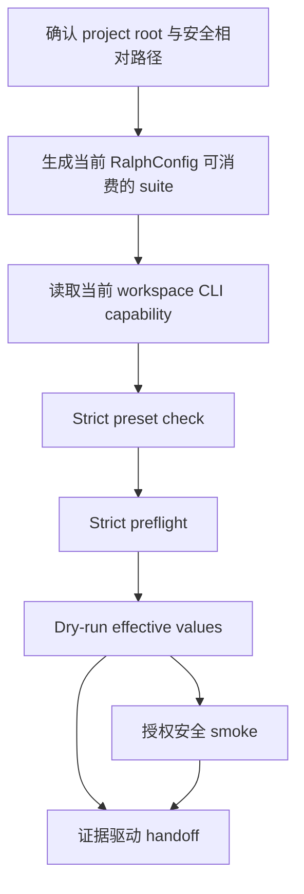
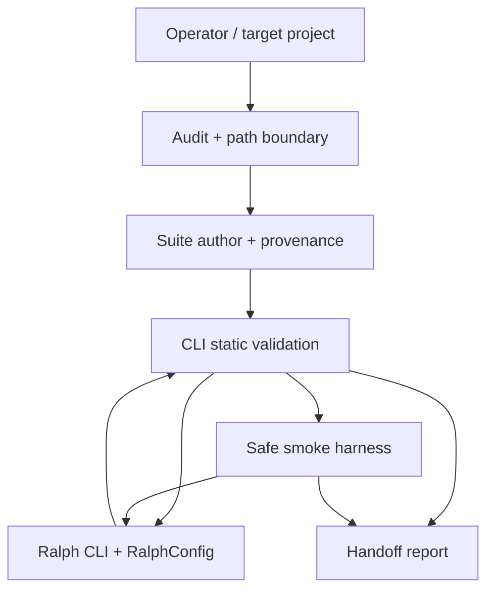

# fix: 修复 ralph-project-bootstrap 真实运行契约

## 1. 功能目标

### 业务目标

- 恢复 `ralph-project-bootstrap` 的核心承诺：生成的项目套件必须被当前仓库构建出的真实 Ralph CLI 按预期字段加载，静态门禁与安全 smoke 必须使用真实存在的命令行参数，且只有真实证据满足时才能交付 `complete` handoff（see origin: `docs/brainstorms/2026-07-18-ralph-cross-project-runtime-bootstrap-skill-requirements.md` R7、R11-R17）。
- 修复 2026-07-19 独立 Review 已确认的 3 个 P0：虚构 `run --strict` 与虚假 dry-run source 证据、错误的 pipeline 配置 schema、无效的 smoke timeout 参数；修复 2 个 P1：项目根错误锚定与 repo-relative 路径逃逸。
- 把“当前 Ralph CLI / `RalphConfig` 是事实源”固化为可执行的跨语言契约，防止 fake transcript、Python helper、skill 文档再次形成与 Rust 实现自洽但与产品脱节的平行接口。

### 本次范围

- 修正 `skills/ralph-project-bootstrap/scripts/cli_probe.py` 的能力探测、真实 argv 和 dry-run 结果判定；保留 strict preset check 与 strict preflight，删除对不存在的 `ralph run --strict` 的依赖。
- 修正 `skills/ralph-project-bootstrap/scripts/pipeline_suite.py` 生成的 `ralph.pipeline.yml`，使 backend、prompt、iteration/runtime 上限及诊断相关设置落到当前 `RalphConfig` 实际消费的字段，并保持 owned 内容幂等、provenance 可升级、用户内容不丢失。
- 为 audit、pipeline、handoff 和 smoke 的所有路径输入建立同一套 project-root confinement；正确区分“用户确认的项目根”“调用 cwd”“VCS 根”“agent instruction scope”。
- 修正安全 smoke 的 CLI 参数和边界语义：CLI 只接收真实支持的 iteration/idle 参数，wall-clock 由 harness 外层强制执行；超时继续回收完整子进程组。
- 新增真实当前 workspace CLI 驱动的 contract/E2E 证据，同时保留 fake/fault-injection 测试覆盖难以稳定制造的失败分支。
- 同步 `SKILL.md`、references、fixtures、operator guide、原功能 Plan 的实现偏差说明及已有 review residual 中与本次触碰面相关的 C1/C2/G1/G2-S2/M3/A3/A4/A5。
- 反向检查 `crates/ralph-core/data/ralph-tools*.md` 与 preset operator skills；本计划默认不修改 Ralph CLI、runtime config schema、preset/event topic，因此预计前者无需改动。若实现阶段意外改变这些产品契约，必须立即扩充文档同步与对应验收，不能静默越界。

### 非目标

- 不新增、删除或重命名 Ralph CLI 参数，不修改 `RalphConfig` schema 来迎合当前 Python helper；helper 必须适配已存在的 CLI/config 契约。
- 不重新设计、创建、修复或评审 preset，不改 builtin preset、event topic、preset schema 或 zsh builtin completion。
- 不恢复 `ralph-hats`，不新增 alias、shim、deprecated wrapper 或职责迁移；已完成的删除契约只做回归验证。
- 不默认执行真实付费 backend，不自动安装 backend、凭据或系统依赖，不修改目标项目业务代码。
- 不把所有 fault path 都改成真实进程 E2E；真实 CLI 测试只覆盖不能被 mock 替代的接口边界，timeout/nonzero/损坏输入继续使用可审计 fixture 与 fault injection。
- 不顺带重构整个 skills 测试框架；仅提取本次契约所需的最小共享测试支持。

### 已知约束和假设

- **严格串行：** Unit 1 → Unit 2 → Unit 3 → Unit 4 → Unit 5 → Unit 6。每个 Unit 的验收测试、最小单元测试、Red→Green→Refactor、相关集成和回归全部完成后才能进入下一 Unit，禁止交替开发。
- Python 测试必须使用仓库 `.venv`；Rust 测试必须使用 `cargo nextest run` 系列，最终必须运行 `./scripts/run-tests.sh`，禁止裸跑 `cargo test -p ralph-cli`。
- 真实 CLI 契约测试必须使用当前 workspace 构建产物或 `CARGO_BIN_EXE_ralph`，不得调用 PATH 上无法追溯版本的另一个 `ralph`，也不得联网或调用付费 backend。
- Rust CLI/config 是命令与字段事实源：`crates/ralph-cli/src/commands/run.rs`、`crates/ralph-cli/src/preflight.rs`、`crates/ralph-cli/src/commands/preset.rs`、`crates/ralph-core/src/config/cli.rs`、`crates/ralph-core/src/config/loop_config.rs`。测试 fixture 只能记录已由真实 surface 证明的事实，不能反向定义产品契约。
- `ralph run --dry-run` 的可观察输出能证明 effective backend、prompt、iteration/runtime 等配置，但当前不会输出 config source path；显式 `-c` / `-H` argv 证明 source 选择，effective value 证明解析结果，二者必须共同构成证据，禁止搜索不存在的 `config_path=...` 文本。
- strict 语义分别属于 `ralph preset check --strict` 与 `ralph preflight --strict`；`ralph run --dry-run` 没有 `--strict`。dry-run 不能替代前两层，也不能证明 loop 闭环。
- CLI 的 `--idle-timeout` 单位为秒；当前没有 `--idle-timeout-ms` 或 `--wall-clock-timeout-s`。wall-clock 是 harness 自身的外层生命周期约束，不得伪装为 CLI capability。
- repo-relative 不只意味着“不是绝对路径”：所有外部输入都必须经 lexical 检查与 root-anchored resolution，拒绝 `..` 逃逸、NUL、POSIX 下的 Windows drive/UNC 形式以及最终落点越过确认 root；写盘边界还必须拒绝 symlink target/竞态。
- 现有 AGENTS/CLAUDE 原子写、rollback、子进程组回收、installer/catalog 和 `ralph-hats` 删除行为是需保留的已完成能力，不得为修复 P0/P1 而削弱。

### 需求编号

- **F1：真实 CLI surface。** capability、preset check、preflight、dry-run 和 smoke argv 必须只包含当前 CLI 支持的命令/参数。
- **F2：真实 effective config。** 生成配置中的 backend、prompt、iteration/runtime 上限必须由 `RalphConfig` 实际消费，真实 dry-run 显示期望值。
- **F3：可信静态证明。** 静态门禁必须同时证明显式 source argv、阶段顺序、exit status 与关键 effective values；不得依赖虚构 stdout。
- **F4：单一项目根。** root 决策输出必须成为输入校验、事实采集、写盘和 handoff 的唯一锚点；歧义时写盘前停止。
- **F5：路径 confinement。** 所有输入/输出路径保持在确认 root 内并拒绝跨平台逃逸形式；重复运行与写盘前重新验证。
- **F6：有界 smoke。** 安全 smoke 使用真实 CLI 参数，外层 wall-clock 超时可终止并回收子进程组，未授权 backend 零 spawn。
- **F7：证据驱动 handoff。** 只有真实静态门禁与授权安全 smoke 均通过才允许 `complete`；任何缺证据、source/effective mismatch 或 smoke 失败只能 incomplete/blocked。
- **F8：防假阳性测试。** 至少一条测试必须跨过 Python helper → 生成 fixture/config → 当前 workspace Ralph CLI；fake runner 不能是 CLI surface 的唯一证明。
- **F9：文档同源。** skill/reference/fixture/guide 对参数、字段、单位、证明等级和 root fallback 的描述与代码及 `--help` 一致。
- **F10：既有行为无回归。** 原子写/rollback、幂等/provenance、安装发现、`ralph-hats` 删除、AGENTS/CLAUDE 同步和全仓测试保持通过。

### 关键技术决策

- **Rust integration 是 config/CLI effective-value 的权威验收层。** 使用现有 `CARGO_BIN_EXE_ralph` 模式直接加载 bootstrap fixture，证明 clap、config loader、preset overlay 与 dry-run effective values；Python 测试负责证明 renderer/helper 生成的结构与该 fixture 契约一致。这样既不让 Python 测试依赖开发机 PATH，也不让 Rust 测试执行 Python 自然语言流程。
- **Python differential contract 只验证跨语言 parity，不重新定义 CLI。** 它读取或接收当前 workspace 构建产物，并把 helper 生成的 argv/fixture 与真实 help、真实退出状态和稳定 effective labels 对照；fake runner 只负责 timeout、missing binary、nonzero 等故障注入。
- **真实 preflight/E2E 使用仓库固定的本地 test backend 与最小 preset。** fixture 必须内容固定、无网络、无需用户凭据且不能修改业务文件；它可证明 CLI/config/preset/prompt/backend wiring，但不得被产品代码当作新的 public backend。测试不得依赖开发机已安装 Claude/Codex/Gemini 等 backend。
- **真实 subprocess 使用最小环境 allowlist。** contract/E2E 只传递执行所需的 PATH、临时 HOME、locale 和明确测试变量，显式移除 provider API key、token、`RALPH_CONFIG` 及会改变 config/backend 选择的环境变量；stdout/stderr 断言与失败报告不得回显完整环境。
- **显式 argv 与 effective values 共同证明 config source。** 当前 dry-run 不输出 config path，因此 `-c ralph.pipeline.yml -H <preset>` 证明选择意图，非默认 backend/prompt/budget 的 effective output 证明实际装载；任一缺失都不能升级 proof level。
- **诊断配置只采用当前 schema 已存在的 `telemetry.runtime_diagnosis`。** Unit 2 必须先用 `crates/ralph-core/src/config/telemetry.rs` 的字段与验证规则建立 contract；若 operator 需求无法映射到现有字段，则返回需用户决策的 blocker，而不是生成顶层 `diagnostics` 或新增 runtime schema。
- **canonical root 与 repo-relative display 分离。** 内部 IO/containment 始终使用唯一 canonical root，operator report/argv 中的项目文件始终使用相对该 root 的规范路径；不得让 display fallback 反向决定安全边界。
- **wall-clock 属于 harness，而非 Ralph CLI。** CLI 只接收当前支持的 iteration/idle 控制，harness 独立负责 wall-clock wait、TERM/KILL 与进程组回收；两层证据分别记录，避免再次发明 CLI 参数。

### 规划期已解决问题与实施期停止条件

- **真实 CLI 测试放在哪里：** config/effective-value authority 放在 `crates/ralph-cli/tests/integration_project_bootstrap_config.rs`；Python helper parity 与端到端 wiring 放在 `skills/tests/test_project_bootstrap_real_cli.py`。两者都必须存在，不能二选一。
- **Python 如何定位同一构建产物：** 测试支持层只接受测试入口显式注入的 workspace Ralph 路径，并在缺失时以配置错误失败；不得扫描 PATH、猜测 `target/debug` 或自动下载/安装。Rust integration 继续使用 `CARGO_BIN_EXE_ralph`。
- **是否新增 CLI/config 字段：** 不新增。当前 helper 适配已有 clap 与 `RalphConfig`；发现需求无法表达时停止并报告，而非扩生产接口。
- **安全 replay 是否等同生产 backend：** 不等同。Rust recording/replay 只证明固定机制；真实 `ralph run` smoke 只有在现有 CLI 已有安全、无网络 backend 路径时才能声明 loop-closed，否则 handoff 必须明确“CLI argv/config 已验证 + replay 机制已验证，但目标 backend 闭环未验证”。
- **实施期允许推迟的未知：** 仅限 helper 内部名称、fixture 组织和 dry-run 稳定 label 的最小解析细节；不得推迟字段层级、命令参数、root/path 语义、proof level 或 complete 门禁。

## 2. BDD 行为规格

### Feature A：按真实 Ralph 契约生成并静态验证套件

#### Scenario S1：当前 CLI 的静态门禁完整通过

```gherkin
Given 当前 workspace 已构建出 Ralph CLI
And 目标项目包含兼容 preset、plan 与按当前 schema 生成的 pipeline config
When bootstrap 依次执行 capability、preset check、preflight 与 dry-run
Then capability 只要求当前 help 中真实存在的参数
And preset check 与 preflight 都以 strict 模式通过
And dry-run 不携带 run 不支持的 strict 参数
And 结果记录显式 config/preset argv 与 effective backend、prompt、iteration/runtime 值
And 静态结果只提升到 static-only
```

#### Scenario S2：CLI surface 发生不兼容变化时 fail closed

```gherkin
Given 被探测 Ralph CLI 缺少 preset strict、preflight strict 或 run dry-run 中任一真实能力
When bootstrap 执行 capability gate
Then 返回 blocked_cli 并指出缺少的具体命令或参数
And 不执行后续阶段
And 不从版本号或其他子命令的帮助文本猜测能力
```

#### Scenario S3：生成配置的 effective values 与输入一致

```gherkin
Given operator 选择 backend、prompt、iteration 上限与 runtime 上限
When bootstrap 生成 ralph.pipeline.yml 并由真实 Ralph dry-run 加载
Then dry-run 展示的 effective values 与 operator 输入逐项一致
And 不回退到 Ralph 默认值
And 显式 -c 与 -H 阻止环境变量或 ralph.yml 抢占
```

#### Scenario S4：已有用户配置只更新 owned 字段

```gherkin
Given ralph.pipeline.yml 含用户自定义且有效的非 owned 配置
And provenance 与当前 owned 内容一致
When bootstrap 升级 backend 或运行边界
Then 仅 owned 字段发生变化
And 用户字段、注释和顺序保持不变
And 第二次相同运行返回 no-op
```

### Feature B：项目根与路径安全边界

#### Scenario S5：从仓库子目录调用时使用确认后的真实根

```gherkin
Given 当前 cwd 位于目标 Git 仓库的子目录
And VCS 根与生效的 agent instruction scope 一致
When bootstrap 审计项目
Then 返回该 VCS 根作为唯一 project root
And plan/preset 校验与技术栈事实采集都相对该根执行
And 不把调用子目录误报为 ./ 根
```

#### Scenario S6：根候选冲突时停止

```gherkin
Given cwd、VCS 根和最近 agent instruction scope 指向不同有效根
When bootstrap 审计项目
Then 返回包含全部候选与 repo-relative 证据的 root_ambiguous blocker
And 在任何持久写盘或 backend 调用前停止
```

#### Scenario S7：路径逃逸和跨平台绝对形式被拒绝

```gherkin
Given preset、plan、prompt、config、provenance 或 handoff 路径包含父目录逃逸、NUL、Windows drive、UNC 或解析后越过 root
When 任一 bootstrap API 校验该路径
Then 返回稳定的 unsafe_path blocker
And 不读取、写入或把该路径放入可执行命令
And POSIX 与 Windows 风格输入得到一致的拒绝结果
```

### Feature C：安全 smoke 与交付状态

#### Scenario S8：授权安全 smoke 使用真实参数并到达有界终态

```gherkin
Given 静态门禁已通过
And operator 已授权仓库固定的安全 smoke 路径
When smoke harness 启动当前 Ralph CLI
Then argv 只包含当前 run 支持的参数与正确单位
And iteration、idle 与 harness wall-clock 三重边界均生效
And 观察到约定事件或有界终态后返回 smoke verified
And 目标项目业务文件保持无 diff
```

#### Scenario S9：smoke 超时、无事件或未授权时不会假成功

```gherkin
Given smoke 未授权、超过 wall-clock、无可观察事件或退出非零
When harness 处理结果
Then 未授权路径不创建子进程
And 超时路径有界终止并回收整个子进程组
And 结果保留诊断并分类为 suite、preset、backend 或 project-command
And handoff 不得提升到 complete
```

#### Scenario S10：只有真实证据完整时交付正式命令

```gherkin
Given pipeline suite 已生成
When bootstrap 构造 handoff
Then 真实静态门禁与授权 smoke 都通过时输出 complete 与正式命令
And 仅静态通过时输出 incomplete 与候选命令
And 任一 source/effective mismatch、路径 blocker 或 smoke 失败时输出 blocked
And worktree 命令仍要求显式 plan 或 worktree-name 复用键
```

### Feature D：契约漂移与既有能力回归

#### Scenario S11：fake fixture 与真实 CLI 漂移时测试失败

```gherkin
Given fake transcript 声称存在真实 CLI 未提供的参数、字段或输出文本
When contract suite 对照当前 workspace Ralph surface
Then 测试以明确的 contract drift 原因失败
And 不允许仅更新 fake golden 使测试转绿
```

#### Scenario S12：修复后既有安全与安装行为保持不变

```gherkin
Given agent docs 原子写、provenance、installer catalog 与 ralph-hats 删除测试已通过
When 本修复全部完成
Then rollback、幂等、symlink 拒绝、public skill 安装和旧 skill 不可安装仍通过
And AGENTS.md 与 CLAUDE.md 保持完全一致
And 全量 baseline 没有新增失败或跳过
```

## 3. 验收与测试策略

| Scenario | 验收条件 | 推荐测试层级 | 是否需要 E2E |
|---|---|---|---|
| S1 | 当前 workspace CLI 完成 capability→strict preset→strict preflight→dry-run，argv 与 effective values 可核验 | Python contract + Rust CLI integration | 是，真实 CLI 静态 E2E |
| S2 | 缺真实 capability 时精准 blocked_cli 且后续零调用 | 单元测试 + fake CLI contract | 否 |
| S3 | 输入的 backend/prompt/iteration/runtime 与真实 dry-run 输出一致 | Rust config/CLI integration + 跨语言 contract | 是，1 条无 backend spawn 的 dry-run |
| S4 | 用户 YAML 保留、owned 更新、重复运行 no-op、provenance 正确 | 单元测试 + property-based/参数化幂等测试 | 否 |
| S5 | 子目录调用仍锚定仓库根并读取根级 plan/技术栈 | 临时 Git fixture 集成测试 | 否 |
| S6 | root/scope 冲突在写盘前 blocker | 临时 Git fixture + no-write spy | 否 |
| S7 | `..`、NUL、drive、UNC、symlink/解析逃逸全部拒绝 | 表驱动单元测试 + filesystem integration/fault injection | 否 |
| S8 | 真实 argv 可被当前 CLI 解析，安全路径达到约定事件/终态且业务树无 diff | CLI contract + 固定 replay smoke integration | 是，固定无网络路径 |
| S9 | 未授权零 spawn；timeout 回收进程组；失败分类与 handoff 降级 | 单元测试 + fault injection + process integration | 否 |
| S10 | complete/incomplete/blocked 三态仅由结构化证据决定，命令字段完整 | 状态机单元测试 + handoff contract | 否 |
| S11 | 真实 help/config output 与 fixture 不一致会直接失败 | Differential contract test | 是，复用 S1/S3 |
| S12 | 已有 bootstrap、installer、删除契约和全仓 baseline 无回归 | 回归测试 + full workspace | 否 |

测试分层原则：

- **真实边界不可 mock：** CLI help、argv parse、`RalphConfig` effective values、dry-run stdout、固定 replay 可启动性。
- **环境可重复且无凭据：** 真实 contract 使用固定本地 backend/preset 与 sanitized environment；不以开发机 backend 可用性或凭据作为 Green 条件。
- **失败注入应可控：** binary missing、timeout、nonzero、损坏 YAML、write failure、symlink swap 使用 fake/stub 或临时文件系统，避免让 E2E 变慢和不稳定。
- **Differential 防漂移：** fake transcript 中的 capability/argv/effective fields 必须能由同一构建产物的 help 或 dry-run 证明；fixture 变更必须附真实证据测试变化，不能只改 golden。
- **Property/表驱动边界：** 路径 validator 覆盖 POSIX、Windows、Unicode separator、空白/NUL、`.`/`..` normalization；YAML owned compose 覆盖重复运行和用户字段排列。
- **State-machine：** validation proof 与 handoff level 只能单向提升，任一 blocker 不能被后续 fake success 覆盖。

## 4. 需求—测试追踪矩阵

| 需求 | Scenario | 验收测试 | 单元测试 | 集成/契约测试 | E2E |
|---|---|---|---|---|---|
| F1 | S1、S2、S8、S11 | 当前 CLI 支持的 static/smoke argv | capability token 与 stage argv | `--help` differential、CLI parse contract | 当前 workspace CLI |
| F2 | S3、S4 | effective values 与 operator 输入一致 | config render/owned compose/provenance | `RalphConfig`/dry-run config contract | 无 spawn dry-run |
| F3 | S1-S3、S11 | source argv + effective values + exit status 共同证明 | proof/evidence classifier | staged validation contract | 静态主路径 |
| F4 | S5、S6 | root 唯一、歧义 no-write | root candidate/decision | 临时 Git + instruction scope | 否 |
| F5 | S7、S10 | 所有外部路径 confined | cross-platform path table/property | symlink/TOCTOU filesystem test | 否 |
| F6 | S8、S9 | 真实参数、三重边界、超时回收 | argv/unit conversion/outcome classifier | safe fixture + process fault injection | 固定 replay |
| F7 | S9、S10 | evidence 不完整不得 complete | handoff state-machine | validation/smoke/handoff wiring | S1/S8 汇总 |
| F8 | S1、S3、S8、S11 | 至少一条真实跨层路径捕获 drift | fixture provenance/shape | Python↔Rust CLI contract | 是 |
| F9 | S1、S8、S11 | docs/fixtures 与 help/schema 一致 | 静态 reference scan | CLI doc drift + contract fixture parity | 否 |
| F10 | S4、S9、S12 | 既有安全、安装、删除契约保持 | 原有 contract suite | installer/filesystem/full nextest | 否 |

## 高层技术方向

> 本图仅用于审查整体证据链，是方向性说明，不是实现规范；Executor 不应把节点名称当作必须照抄的代码结构。



证据权威顺序：

| 表面 | 权威来源 | fixture 的角色 | 禁止做法 |
|---|---|---|---|
| CLI 参数 | 当前 workspace `ralph <cmd> --help` 与 clap 定义 | 记录已验证的输入/输出用于 fault path | 由 fixture 发明 flag 后要求 CLI 配合 |
| 配置字段 | `RalphConfig` / nested config structs 与真实 dry-run effective values | 构造外部项目样例 | 只检查 YAML 可解析或包含字符串 |
| static proof | stage exit status、显式 argv、effective values | 重放异常分类 | 搜索真实 CLI 不输出的 marker |
| smoke proof | 当前 CLI 可解析 argv、harness 外层 timeout、观察事件/终态 | 固定 replay/fault injection | 把未知 flag 或 exit 0 当闭环 |
| handoff | 结构化 static + smoke evidence | 报告 rendering 样例 | 从自由文本关键词自行升级状态 |

## 5. 严格串行开发单元

> 每个 Unit 都必须完整执行：先写/启用验收测试并确认以预期原因 Red；再拆最小单元测试逐个 Red→Green→Refactor；运行当前 Unit 集成与受影响回归；满足完成标准后关闭 Unit；随后才能进入下一 Unit。不得删除/削弱断言、跳过测试、增加 `.only`、无解释更新 fixture/golden，或用 fake 替代本 Unit 明确要求的真实边界。

### Unit 1：让静态门禁遵循当前真实 CLI surface

- **Unit 目标：** 修复 capability、preset check、preflight 和 dry-run 的命令契约，使真实当前 workspace CLI 能通过静态主路径，CLI 缺能力时仍精准 fail closed。
- **对应 Scenario：** S1、S2、S11 的 CLI surface 部分。
- **对应需求：** F1、F3、F8、F9。
- **外部可观察结果：** `validate_pipeline` 对当前 CLI 不再因不存在的 `run --strict` 阻塞；dry-run argv 可被 clap 解析；结果不再要求 stdout 包含不存在的 config path，而是记录显式 argv 和真实 effective evidence。
- **输入与输出：** 输入为当前 workspace Ralph binary、config、preset、prompt、plan；输出为四阶段 `StageDecision`，每阶段携带真实 argv、exit status、必要 effective evidence 与下一状态。
- **可依赖的已完成能力：** 现有 `probe_capability`/`validate_pipeline` 状态机、`crates/ralph-cli/tests/integration_config_precedence.rs` 的 `CARGO_BIN_EXE_ralph` 模式、strict preset/preflight 命令。
- **明确禁止依赖的未来能力：** 不依赖 Unit 2 的新生成配置；当前 Unit 使用一份按现有 Rust schema 手工构造且经真实 CLI 验证的最小 fixture。不得等待 Unit 5 才补真实 CLI 测试。
- **Files：**
  - Modify: `skills/ralph-project-bootstrap/scripts/cli_probe.py`
  - Modify: `skills/ralph-project-bootstrap/scripts/_probe_runner.py`
  - Modify: `skills/ralph-project-bootstrap/fixtures/cli/green/*.json`
  - Modify: `skills/ralph-project-bootstrap/fixtures/cli/missing-flag/*.json`
  - Modify: `skills/ralph-project-bootstrap/fixtures/cli/dry-run-source-mismatch/*.json`
  - Modify: `skills/tests/test_project_bootstrap_contract.py`
  - Create: `skills/tests/test_project_bootstrap_real_cli.py`
  - Modify if shared fixture wiring is needed: `skills/tests/conftest.py`
  - Add test-only fixtures: `skills/ralph-project-bootstrap/fixtures/cli/real-contract/`
- **验收测试：**
  - 当前 workspace `ralph run --help` 不含 `--strict` 时，capability 仍通过，只要求 `run --dry-run`。
  - dry-run argv 不含 `--strict`/`--skip-preflight`，真实 CLI 返回成功且输出包含期望 backend、prompt、max iterations、max runtime。
  - preset check/preflight 的 strict 仍分别存在并执行；任一缺失时后续 stage 零调用。
  - 明确传入的 config/preset argv 被记录；effective value mismatch 返回 `blocked_command`，而非依赖 `config_path=` marker。
  - 真实 preflight 使用固定本地 test backend，在清理 provider credentials、`RALPH_CONFIG` 和用户 HOME 配置后仍可重复通过；缺 fixture executable 时精准失败。
  - fake green transcript 若声明真实 help 不存在的 flag 或真实 dry-run 不输出的字段，differential contract 测试 Red。
- **需要拆分的单元测试：** capability 与 help target 一一对应；per-command flag parser 不跨 help 页面串台；dry-run effective field parser；缺字段、重复字段、格式变化与 mismatch 分类；stage monotonic/skip；runner timeout/missing/nonzero。
- **Red 预期失败原因：** 当前 REQUIRED_FLAGS 包含 `run --dry-run --strict`，dry-run argv 携带未知 flag，source classifier 搜索真实 CLI 不输出的 config path，真实 contract test 必然失败。
- **最小实现范围：** 只调整 helper 的 capability/argv/evidence 规则和对应 fixtures；可以在当前模块内提取一次 `_safe_invoke` 以消除 residual M3 的重复，但不得重构无关状态机或修改 CLI。
- **集成验证：** 使用当前 workspace 构建产物、最小 preset、固定本地 test backend 与 sanitized environment 运行真实 preset check、preflight、dry-run；不 spawn backend、不联网、不依赖用户凭据。
- **回归范围：** 现有 cli-probe fake fixtures、timeout/missing/nonzero 分类、静态证明等级、`crates/ralph-cli/tests/integration_run.rs` 与 `integration_config_precedence.rs` 的相关 nextest。
- **完成标准：** S1/S2 的静态命令部分与 S11 CLI surface 部分通过；真实和 fake contract 对同一 capability/argv 达成一致；无新增 skip；Unit 1 全部相关回归通过后才进入 Unit 2。
- **风险与注意事项：** dry-run human output 是用户可见接口但未承诺 JSON schema；parser 必须只依赖稳定标签并对缺失 fail closed。若当前 CLI 没有足够稳定的 effective output，计划允许在测试层直接调用现有 config loader/struct 验证，但不允许新增生产 CLI 参数。

### Unit 2：生成并幂等维护 Ralph 实际消费的 pipeline config

- **Unit 目标：** 让生成配置的 backend、prompt、iteration/runtime 上限及诊断/guardrail 选择落到当前 `RalphConfig` 正确层级，并保持 owned 更新、用户内容与 provenance 契约。
- **对应 Scenario：** S3、S4、S11 的 config 部分。
- **对应需求：** F2、F3、F8-F10。
- **外部可观察结果：** operator 输入 `backend=X`、`max_iterations=N`、`max_runtime_seconds=T` 后，真实 dry-run 输出同样的 X/N/T，而不是默认值；已有配置只改 owned 值，重复运行 no-op。
- **输入与输出：** 输入为已确认的 preset/plan/prompt/backend/budget/diagnostic 选择及现有 config/provenance；输出为可被 `RalphConfig` 消费的 `ralph.pipeline.yml`、匹配 prompt/provenance 和 created/updated/noop/blocker。
- **可依赖的已完成能力：** Unit 1 真实静态门禁；现有 YAML compose、provenance SHA、AtomicWriter；Rust config structs 和 config precedence 集成模式。
- **明确禁止依赖的未来能力：** 不依赖 Unit 3 的新 root validator；本 Unit 测试使用已知安全的 repo-relative 输入。不得等待 Unit 5 才证明 effective values。
- **Files：**
  - Modify: `skills/ralph-project-bootstrap/scripts/pipeline_suite.py`
  - Modify: `skills/ralph-project-bootstrap/fixtures/projects/config-precedence/ralph.pipeline.yml`
  - Modify: `skills/ralph-project-bootstrap/fixtures/projects/existing-suite/ralph.pipeline.yml`
  - Modify: `skills/ralph-project-bootstrap/fixtures/projects/existing-suite/ralph.bootstrap.yml`
  - Modify: `skills/ralph-project-bootstrap/fixtures/projects/ralph.bootstrap.yml.example`
  - Modify: `skills/tests/test_project_bootstrap_contract.py`
  - Modify: `skills/tests/test_project_bootstrap_real_cli.py`
  - Create or modify: `crates/ralph-cli/tests/integration_project_bootstrap_config.rs`
- **验收测试：**
  - 新 config 使用 `cli.backend`、`event_loop.prompt_file/max_iterations/max_runtime_seconds` 等当前字段；真实 loader/dry-run显示输入值。
  - 同目录有 `RALPH_CONFIG`/`ralph.yml` 时，显式 `-c ralph.pipeline.yml -H ...` 的 effective values 仍来自 pipeline suite。
  - 已有非 owned `core`/adapter/hooks/comments/order 保留；owned nested field 只替换自身，不重复顶层 mapping。
  - provenance 针对新的 owned representation 正确计算；旧 0.1.0 provenance 不满足安全自动迁移条件时返回三方差异 blocker，不静默覆盖用户改动。
  - 预算 0、负数、超范围或空 backend 在写盘前拒绝；合法边界值 round-trip。
- **需要拆分的单元测试：** nested owned path 表达；YAML duplicate/alias/type mismatch；render→parse round-trip；用户 block byte preservation；input/generator signature；legacy provenance migration/noop/blocker；numeric boundary。
- **Red 预期失败原因：** 当前 renderer 写 `event_loop.backend/project_root` 与顶层 `budget/diagnostics`，真实 dry-run回退默认 backend/budget；现有测试只断言自造文本。
- **最小实现范围：** 调整 suite 的 owned schema、compose/provenance 与 fixtures；不增加 `RalphConfig` 字段，不改变 CLI precedence。若 `_bootstrap` 继续作为 metadata，必须明确它不承担 runtime config 语义；若移出 config 更简单，应以用户内容保留和 provenance 可验证为决策标准。
- **集成验证：** Rust integration 通过 `CARGO_BIN_EXE_ralph` 加载 fixture 并断言 effective values；Python renderer 与同一 fixture 做结构化 parity，而非整文件 byte equality。
- **回归范围：** pipeline compose/provenance/AtomicWriter、config precedence、preflight/dry-run、existing-suite no-op、invalid YAML。
- **完成标准：** S3/S4 与 S11 config 部分通过；真实 CLI 显示非默认 operator 值；用户内容和 provenance 无回归；Unit 2 回归全绿后进入 Unit 3。
- **风险与注意事项：** owned nested keys 与用户已存在同名 runtime keys 的冲突策略必须 fail closed，不能擅自决定谁覆盖谁；配置注释保留不能通过全量 re-serialize 实现。

### Unit 3：统一项目根与跨平台路径 confinement

- **Unit 目标：** 建立单一 root decision 和共享安全路径规则，使 audit、suite、handoff、写盘与重复运行全部锚定确认 root，任何路径逃逸在 IO 前被拒绝。
- **对应 Scenario：** S5-S7。
- **对应需求：** F4、F5、F10。
- **外部可观察结果：** 从 repo 子目录调用仍找到根级 plan/preset/技术栈；root/scope 冲突无写盘；`../`、NUL、drive/UNC、解析逃逸和 symlink target 均被拒绝且不进入命令/report。
- **输入与输出：** 输入为调用 cwd、VCS/agent scope 证据和用户路径；输出为唯一 canonical project root + repo-relative display path，或结构化 `root_ambiguous` / `unsafe_path` blocker。
- **可依赖的已完成能力：** Unit 1-2 的真实 CLI/config；现有 `AtomicWriter` symlink 拒绝与临时 Git fixtures。
- **明确禁止依赖的未来能力：** 不依赖 smoke/handoff state 修复；当前 Unit 必须同步改完所有现存 path-bearing API，不能把某个模块的验证债留给 Unit 4/5。
- **Files：**
  - Modify: `skills/ralph-project-bootstrap/scripts/_paths.py`
  - Modify: `skills/ralph-project-bootstrap/scripts/audit.py`
  - Modify: `skills/ralph-project-bootstrap/scripts/pipeline_suite.py`
  - Modify: `skills/ralph-project-bootstrap/scripts/handoff.py`
  - Modify if config fields carry paths: `skills/ralph-project-bootstrap/scripts/cli_probe.py`
  - Modify if smoke fields carry paths: `skills/ralph-project-bootstrap/scripts/smoke_runner.py`
  - Modify: `skills/tests/test_project_bootstrap_contract.py`
  - Modify: `skills/tests/test_project_bootstrap_e2e.py`
  - Add fixtures as needed: `skills/ralph-project-bootstrap/fixtures/projects/ambiguous-root/`
- **验收测试：**
  - cwd 为 `<repo>/nested`、plan 位于 `<repo>/docs/...` 时，audit root 为 repo，input/facts 成功且输出路径相对 repo。
  - 无 VCS 的单 scope、多个 scope、VCS 与最近 scope 一致/冲突分别得到明确决策；冲突路径无 AtomicWriter 调用。
  - 表驱动拒绝 `../x`、`a/../../x`、NUL、`C:\\x`、UNC、leading slash、Unicode separator 混淆；接受规范的 `docs/plan.md` 与 `./docs/plan.md` 并归一化。
  - lexical 合法但 resolve 后越 root 的 symlink 被拒绝；stage 后 commit 前 symlink swap 仍由 AtomicWriter fail closed 并 rollback。
  - handoff 的 binary 与 shell 展示字段按“可执行名称”和“路径”分别校验，避免把 `ralph` 当文件路径或放过 path-like reuse key。
- **需要拆分的单元测试：** root candidate collection/decision；canonical vs display separation；safe-relative parser；Windows/UNC detection；root containment；path field registry；重复运行 revalidation；Markdown/shell newline/control-char rejection。
- **Red 预期失败原因：** `run_audit` 忽略解析出的 root 并继续使用 cwd；`_paths.rel` 对上级 root fallback 到进程 cwd；多个模块只做 `is_absolute()`，允许 parent escape 和 Windows absolute form。
- **最小实现范围：** 提供共享、纯确定性的 root/path primitive 并迁移所有 bootstrap path entry；修复 residual C2/A3/A5。不得改目标项目目录布局或自动 `chdir`。
- **集成验证：** 临时 Git repo/subdir/scope fixture，配合 no-read/no-write spy 与 symlink fault injection；验证 root 决策贯穿 audit→suite→handoff。
- **回归范围：** dirty tree、AtomicWriter rollback/symlink tests、agent docs markers、pipeline idempotency、worktree reuse key、shell-safe command。
- **完成标准：** S5-S7 全通过；所有 path-bearing public dataclass/helper 共用同一 confinement 语义；没有外部路径进入 IO/argv/report；Unit 3 回归全绿后进入 Unit 4。
- **风险与注意事项：** `Path.resolve()` 会跟随 symlink，不能单独承担 lexical 校验；先拒绝危险语法，再做 root containment，写盘时再次验证 target。跨平台测试不能依赖当前 OS 对 Windows path 的默认解释。

### Unit 4：让安全 smoke 使用真实 CLI 参数和正确生命周期边界

- **Unit 目标：** 修正 smoke argv 与单位，把 wall-clock 明确留在 harness 外层，并证明授权安全路径可启动、未授权/超时路径不会泄漏进程或升级状态。
- **对应 Scenario：** S8、S9、S11 的 smoke surface 部分。
- **对应需求：** F1、F6-F10。
- **外部可观察结果：** 当前 CLI 能解析 smoke argv；idle timeout 使用秒；wall-clock 只控制 harness wait/reap；安全 fixture 到达事件/终态，timeout 回收进程组，未授权零 spawn。
- **输入与输出：** 输入为 Unit 1-3 通过的 suite、`SafeBackend`/`UnsafeBackend` capability、operator authorization 和三重边界；输出为结构化 smoke outcome/evidence/argv/elapsed/failure bucket。
- **可依赖的已完成能力：** Unit 1 CLI surface、Unit 2 有效 config、Unit 3 安全路径、现有 `_spawn_real_backend` 与 `_reap_child_group`。
- **明确禁止依赖的未来能力：** 不依赖 Unit 5 handoff 重新解释 smoke 文本；本 Unit 必须输出结构化、足够直接消费的结果。不得用 fake runner 代替“当前 CLI 接受 argv”的测试。
- **Files：**
  - Modify: `skills/ralph-project-bootstrap/scripts/smoke_runner.py`
  - Modify: `skills/ralph-project-bootstrap/fixtures/cli/smoke/*/transcript.json`
  - Modify fixture scripts only when their observable contract changes: `skills/ralph-project-bootstrap/fixtures/cli/smoke/*/script.py`
  - Add or adapt a test-only content-fixed backend fixture: `skills/ralph-project-bootstrap/fixtures/cli/smoke/real-safe-backend/`
  - Modify: `skills/tests/test_project_bootstrap_contract.py`
  - Modify: `skills/tests/test_project_bootstrap_real_cli.py`
  - Modify: `skills/tests/test_project_bootstrap_e2e.py`
- **验收测试：**
  - smoke argv 含真实 `--max-iterations` 与 `--idle-timeout`，不含 `--idle-timeout-ms`/`--wall-clock-timeout-s`；当前 CLI 至少完成 clap parse/dry boundary 验证。
  - millisecond 输入若仍保留在内部 API，转换到 CLI seconds 的 rounding/minimum/zero 语义明确并测试；更简单时可把 public config 统一成 seconds，但需同步 provenance/docs。
  - wall-clock 超时触发 TERM→grace→KILL 的进程组回收，stdout/stderr partial evidence 保留；正常终态不发送 kill。
  - 未授权 unsafe backend、未设置真实执行授权、路径 blocker 均在 argv/spawn 前停止。
  - 固定 replay/无网络路径观察约定事件或终态；nonzero/no-event/error-event 分桶不变。
  - test-only content-fixed backend 在 sanitized environment 下运行，不读取 provider credentials、不访问网络、不写业务文件；它的授权能力不能被任意目标项目 custom backend 复用。
- **需要拆分的单元测试：** argv builder；unit conversion boundaries；authorization matrix；outer timeout calculation；terminal/event recognition；failure precedence；process reap escalation；dirty-tree diff。
- **Red 预期失败原因：** 当前 argv 包含两个不存在的 flag，真实 CLI 在 loop 前退出；fake runner 无条件返回 success 掩盖该错误。
- **最小实现范围：** 修正 argv/单位、真实 parse contract 与 fixture；保留现有进程回收 hardening，不引入新 CLI flag 或真实付费 backend。
- **集成验证：** 当前 workspace CLI 的无网络参数解析，以及仓库固定、内容可审计的 test backend 主路径；独立 helper child 验证 timeout/reap，业务树前后 diff 为零，测试环境不继承 provider 凭据。
- **回归范围：** 所有 smoke fixture、U1 static gate、U2 config、U3 path、AtomicWriter、现有 recording smoke nextest（若复用）。
- **完成标准：** S8/S9 与 S11 smoke 部分通过；真实 CLI 接受 argv；未授权零 spawn；timeout 无残留进程；Unit 4 回归全绿后进入 Unit 5。
- **风险与注意事项：** 当前 Rust `ReplayBackend` 是测试 feature，不等于生产 CLI backend 名；若无法通过 `ralph run` 安全接入，真实 E2E 应验证 CLI parse + 仓库 replay runner 机制的组合证据，并在 handoff 中明确层级，不能伪造一个 `replay` CLI backend。

### Unit 5：用结构化证据驱动 handoff 与真实跨层 E2E

- **Unit 目标：** 把 Unit 1-4 的真实证据贯穿至 handoff，替换自由文本关键词升级逻辑，并用少量真实跨层 E2E 证明 blank/existing/blocker 三条关键路径。
- **对应 Scenario：** S10-S12（除最终全仓门禁）。
- **对应需求：** F3、F7-F10。
- **外部可观察结果：** complete/incomplete/blocked 只由 typed stage/smoke outcomes 决定；fake evidence 字符串不能伪造 complete；至少一条 E2E 使用当前 workspace Ralph，而不是全程 fake runner。
- **输入与输出：** 输入为 created/updated/noop、typed validation decisions、typed smoke result、residual risks；输出为 level、正式/候选/空命令与中文 operator report。
- **可依赖的已完成能力：** Unit 1-4 全部已关闭；现有 handoff command/worktree reuse key contract。
- **明确禁止依赖的未来能力：** 不依赖 Unit 6 文档或全量回归来发现 wiring 缺口；本 Unit 内暴露的任何行为缺口必须回到当前 Unit 未关闭状态修复并重新运行 Unit 1→5 受影响链。
- **Files：**
  - Modify: `skills/ralph-project-bootstrap/scripts/handoff.py`
  - Modify: `skills/tests/test_project_bootstrap_contract.py`
  - Modify: `skills/tests/test_project_bootstrap_e2e.py`
  - Modify: `skills/tests/test_project_bootstrap_real_cli.py`
  - Modify as needed: `skills/tests/conftest.py`
- **验收测试：**
  - static real green + authorized smoke terminal → complete/正式命令；static green + no authorization → incomplete/候选命令；任一 mismatch/blocker/failure → blocked/无命令。
  - `smoke_evidence=("bounded_terminal_reached",)` 等自由文本不能单独升级；必须传入结构化 outcome 且与 validation proof 一致。
  - blank project 跨层路径生成 suite→真实 static gate→安全 smoke 机制→handoff；existing project 第二次 no-op；root/path/config conflict 在 IO 或后续 stage 前停止。
  - 正式命令显式 config/preset/plan/prompt；worktree 仍含 reuse-worktree + plan/worktree-name；所有路径已由 Unit 3 验证。
  - fake CLI drift、真实 effective mismatch 或 smoke invalid argv 任一重新出现时 E2E 失败。
- **需要拆分的单元测试：** handoff transition table；evidence completeness/inconsistency；typed-to-report mapping；command argv/quote；report control-char/Markdown fence safety；created/updated/noop normalization。
- **Red 预期失败原因：** 当前 handoff 从 `smoke_evidence` 文本搜索 terminal/bucket，fake green runner 可在没有真实 CLI 的情况下制造 complete；E2E 明确声明所有 subprocess 都 stub。
- **最小实现范围：** 调整 handoff input/evidence wiring 和 E2E；不启动正式长 loop，不增加新状态层级。若接口变更破坏 fixture，必须用结构化迁移而非兼容 shim。
- **集成验证：** 当前 workspace binary 驱动的静态主路径 + 固定安全 smoke 机制；验证业务树无 diff、无网络、无凭据读取；fake 仅覆盖 fault branches。
- **回归范围：** Unit 1-4 全部 contract/integration、handoff command、installer/catalog、ralph-hats negative install。
- **完成标准：** S10-S12 行为部分通过；E2E 不再宣称“跨层”却完全绕过真实 CLI；complete 无法由文本伪造；Unit 5 回归全绿后进入 Unit 6。
- **风险与注意事项：** 真实 CLI contract test 需要稳定定位构建产物；应沿用 `CARGO_BIN_EXE_ralph` 或显式 test fixture 注入，不得隐式使用开发机 PATH。

### Unit 6：同步 operator 文档、清理残件并执行最终回归门禁

- **Unit 目标：** 让 skill/reference/fixture/guide 与修复后的真实契约一致，关闭相关 review residual，并用完整门禁确认无 bootstrap、installer、CLI 或 workspace 回归。
- **对应 Scenario：** S11、S12 汇总；不新增产品行为。
- **对应需求：** F9、F10，以及 F1-F8 的最终追踪证据。
- **外部可观察结果：** operator 不再看到 `run --strict`、`--idle-timeout-ms`、`--wall-clock-timeout-s` 或错误 config 字段；root fallback/path stop 条件可执行；全部计划 Scenario 与全仓 baseline 通过。
- **输入与输出：** 输入为 Unit 1-5 已验证的真实行为；输出为同步文档、fixture parity、原 Plan 偏差说明、关闭/保留 residual 清单与最终验证报告。
- **可依赖的已完成能力：** Unit 1-5 全部完成。
- **明确禁止依赖的未来能力：** 无。不得把本计划内 P0/P1 或触碰面内 P2 推迟到新任务；若发现真实 CLI/config drift，Unit 6 保持未关闭并回到相应 Unit 的验证链重新证明。
- **Files：**
  - Modify: `skills/ralph-project-bootstrap/SKILL.md`
  - Modify: `skills/ralph-project-bootstrap/references/validation.md`
  - Modify: `skills/ralph-project-bootstrap/references/suite-authoring.md`
  - Modify: `skills/ralph-project-bootstrap/references/smoke.md`
  - Modify: `skills/ralph-project-bootstrap/references/handoff.md`
  - Modify: `skills/ralph-project-bootstrap/references/context-audit.md`
  - Modify: `docs/guide/project-bootstrap.md`
  - Modify: `docs/guide/index.md` only if link/summary changes
  - Modify: `docs/plans/2026-07-18-001-feat-cross-project-ralph-bootstrap-plan.md`（追加实现偏差/修复 Plan 指针，不重写历史验收叙述）
  - Read-only evidence: `.ralph/review/2026-07-18-001-feat-cross-project-ralph-bootstrap-plan/residuals.md`（只用于建立关闭映射；不得手工修改）
  - Modify identically if project rules change: `AGENTS.md`, `CLAUDE.md`
- **验收测试：**
  - active skill/reference/guide 对 CLI flag、字段层级、timeout 单位、proof level 与 root/path 规则做结构化 drift 扫描。
  - 文档列出的 static/smoke 命令均可由当前 `--help` 证明；示例 config 可由 `RalphConfig`/dry-run 加载并显示期望值。
  - C1/C2/M3/A3/A4/A5 随对应代码/文档关闭；G1 在原 Plan 记录模块拆分偏差；G2-S2 同步 author/review boundary 或明确保持当前无漂移证据。
  - public skills list/install/prune、`ralph-hats` 不可安装、AGENTS/CLAUDE parity、AtomicWriter/provenance、真实 CLI contract、bootstrap E2E 全部通过。
- **需要拆分的单元测试：** 本 Unit 不新增生产逻辑；只允许增加 doc/fixture parity、active reference scan 和 residual closure mapping。任何新增行为测试必须回到所属 Unit 补齐。
- **Red 预期失败原因：** 当前 docs/fixtures 明确包含不存在的 flag、错误字段与“全 stub E2E”说明；原 report 仍宣称无 P0/P1。
- **最小实现范围：** 同步受影响文档与 review trace；不编辑 `.ralph/` runtime state 文件，不借机修改无关历史归档或扩大 preset/CLI 功能。
- **集成验证：** Python full skills suite；相关 ralph-cli/ralph-core nextest；CLI doc drift；真实 help/config contract；installer custom-dir E2E；AGENTS/CLAUDE byte equality。
- **回归范围：** 全 workspace `./scripts/run-tests.sh`（nextest + doctest）、format/lint/build、全部 bootstrap tests、public skill packaging、active `ralph-hats` negative scan。
- **完成标准：** S1-S12、F1-F10 全部有可执行证据；没有新增失败/skip/only；所有 P0/P1 关闭；触碰面 P2 关闭或以明确理由和 owner 留档；最终验证区分 static 与 smoke；Unit 6 关闭即本 Plan 完成。
- **风险与注意事项：** `.ralph/review/**` 属于运行产物，默认不得手工编辑；如需更新 residual 状态必须通过拥有该 artifact 的 review/fix 流程。`AGENTS.md` 与 `CLAUDE.md` 若有任何修改必须完全同步。

## 系统影响与回归关注



- **Interaction graph：** operator 输入 → root/path gate → suite compose/provenance/AtomicWriter → CLI capability/preset/preflight/dry-run → optional safe smoke → typed handoff。Rust CLI/config 是下游事实源，也是 contract test 的校验方。
- **错误传播：** root/path/config/capability/preset/preflight/dry-run/smoke 任一失败都保留所在 proof level 并停止提升；hand off 不得从 stderr/stdout 自由文本逆推出更高状态。
- **状态生命周期：** 写盘前完成 root/path/ownership 校验；写盘失败 rollback；验证失败保留 suite 但标记未验证；重复运行先重新校验 root/path/provenance，再决定 no-op/update/blocker。
- **接口一致性：** Python argv 与 clap、Python YAML 与 `RalphConfig`、fixtures 与真实 help/output、SKILL/reference 与两者必须一致。
- **不变约束：** 不改变 CLI 参数和 config schema；不改 preset/event/runtime；不恢复 `ralph-hats`；不削弱 AtomicWriter、dirty-tree、worktree reuse、installer/catalog 契约。
- **集成覆盖：** 单元测试不能证明的边界集中在当前 workspace binary 的 help/argv/config/dry-run 与安全 smoke lifecycle；这些必须由 contract/E2E 覆盖。

## 风险与缓解

| 风险 | 影响 | 缓解 |
|---|---|---|
| 再次用 fixture 定义 CLI 事实 | 测试全绿但生产永远 blocked | differential contract：fixture 必须由当前 workspace help/dry-run 证明 |
| nested owned YAML 覆盖用户字段 | 用户 config 语义丢失 | nested ownership + provenance 三方比较 + byte-preservation + conflict fail closed |
| root/cwd 修正造成路径展示绝对化 | handoff 不可移植或泄漏本机路径 | canonical root 仅内部使用，展示统一 repo-relative；两者分型/分层 |
| 跨平台路径判断依赖 POSIX `Path` | Windows escape 在 macOS CI 被放过 | 独立 lexical validator + Windows/UNC 表驱动样例 + root containment |
| smoke wall-clock 只靠 CLI | 未知参数或子进程泄漏 | wall-clock 保持 harness 外层，TERM/KILL group fault injection |
| 真实 CLI E2E 调用付费 backend | 成本/副作用 | dry-run + fixed replay/parse contract；不读取真实凭据，不联网 |
| 开发机环境让 preflight 假绿或泄漏凭据 | CI 不可重复、敏感状态进入日志 | 固定本地 test backend/preset + 临时 HOME + 环境 allowlist + 禁止回显完整 env |
| human dry-run 输出未来变化 | parser 脆弱 | 只依赖稳定标签并 fail closed；可复用 Rust loader 直接验证 config 语义 |
| 文档与实现再次漂移 | operator 复制无效命令 | help/schema parity 检查 + CLI doc drift + Unit 6 反向审计 |

## 6. 最终质量门禁

- [ ] S1-S12 全部通过；F1-F10 在追踪矩阵中均有验收、单元、集成/契约与必要 E2E 证据。
- [ ] 每个 Unit 都留下正确 Red 原因与 Green 证据；未删除/削弱断言，未新增 skip/`.only`，未用无解释 golden/snapshot 更新替代修复。
- [ ] `skills/tests/test_project_bootstrap_contract.py`、`skills/tests/test_project_bootstrap_e2e.py`、`skills/tests/test_project_bootstrap_real_cli.py`、`skills/tests/test_install.py` 在仓库 `.venv` 中全部通过。
- [ ] 当前 workspace Ralph 的 capability、strict preset check、strict preflight、dry-run effective config 与 smoke argv contract 测试全部通过；测试不依赖 PATH 上的其他 Ralph 版本。
- [ ] 真实 subprocess contract 使用固定本地 test backend/preset 与 sanitized environment；在没有用户 backend 凭据、用户级 Ralph config 和 provider token 时仍通过，日志不包含环境秘密。
- [ ] 生成 config 经真实 `RalphConfig`/CLI 加载后，backend、prompt、max iterations、max runtime 与输入一致，不出现默认值静默替代。
- [ ] 固定安全 smoke 机制、未授权零 spawn、timeout/no-event/nonzero/error-event、进程组回收和 dirty-tree 无 diff 全部通过；没有真实付费或网络调用。
- [ ] root/subdir/scope ambiguity、POSIX/Windows path escape、NUL、symlink target/竞态、重复运行 revalidation 全部通过。
- [ ] handoff complete/incomplete/blocked 状态机测试通过；自由文本不能伪造 complete；worktree 复用键硬规则保持通过。
- [ ] 相关 Rust tests 仅用 `cargo nextest run` 执行；`./scripts/run-tests.sh` 全量 nextest + doctest 通过。若并发基线仅出现已确认时序 flake，才可按项目规则使用 `RALPH_BASELINE_SERIAL=1 ./scripts/run-tests.sh`，serial 仍失败即视为真实失败。
- [ ] Format、lint、typecheck/build 全部通过；Python 使用仓库既有静态检查配置（若存在），Rust 完成 `cargo fmt --check` 与项目规定的 clippy/build 门禁。
- [ ] `scripts/check-cli-doc-drift.sh` 通过；skill/reference/guide/fixtures 中不存在 `run --dry-run --strict`、`--idle-timeout-ms`、`--wall-clock-timeout-s` 或旧错误 config schema 的有效说明。
- [ ] 反向检查 `crates/ralph-core/data/ralph-tools*.md`：若未修改 agent 可见 CLI/runtime 行为，记录无需同步；若实现意外触及，必须同步对应 guide、运行所列 smoke 与 drift 检查后才能完成。
- [ ] 反向检查 `skills/ralph-preset-author`、`skills/ralph-preset-review` 与 shared references；如仅修复 bootstrap，不应改变 preset AAF/命令契约。任何边界文本修改都必须对称并通过 fixture review。
- [ ] `AGENTS.md` 与 `CLAUDE.md` 如有修改则内容完全一致；`skills/ralph-hats` 仍不可发现/安装/调用，历史归档不被改写。
- [ ] Git diff 不含 `.ralph/` runtime state、临时输出、凭据、本机绝对路径或其他 ephemeral 文件。
- [ ] 最终报告明确列出：真实 CLI/config 证据、static-only 与 smoke-verified 的区别、关闭的 P0/P1/P2、未验证内容及剩余风险；不得复用原 report 的“无 P0/P1”结论。

## 参考来源

- Origin: `docs/brainstorms/2026-07-18-ralph-cross-project-runtime-bootstrap-skill-requirements.md`
- 原功能 Plan: `docs/plans/2026-07-18-001-feat-cross-project-ralph-bootstrap-plan.md`
- 原 Review: `.ralph/review/2026-07-18-001-feat-cross-project-ralph-bootstrap-plan/report.md`
- 原 residuals: `.ralph/review/2026-07-18-001-feat-cross-project-ralph-bootstrap-plan/residuals.md`
- Bootstrap implementation: `skills/ralph-project-bootstrap/scripts/`
- Bootstrap tests: `skills/tests/test_project_bootstrap_contract.py`, `skills/tests/test_project_bootstrap_e2e.py`
- CLI/config facts: `crates/ralph-cli/src/commands/run.rs`, `crates/ralph-cli/src/preflight.rs`, `crates/ralph-cli/src/commands/preset.rs`, `crates/ralph-core/src/config/cli.rs`, `crates/ralph-core/src/config/loop_config.rs`
- Existing real CLI test pattern: `crates/ralph-cli/tests/integration_config_precedence.rs`, `crates/ralph-cli/tests/integration_run.rs`, `crates/ralph-cli/tests/integration_run_presets.rs`
- Institutional learning: `docs/solutions/integration-issues/traecli-ndjson-parser-schema-mismatch.md`（必须基于真实 CLI 样本，而非假设 schema）
- Institutional learning: `docs/solutions/integration-issues/emit-workspace-root-cwd-drift.md`（单一 workspace root、fail-closed 与 target disclosure）
- Institutional learning: `docs/solutions/developer-experience/agent-execution-contract-gates-2026-06-03.md`（完成声明必须由可验证契约支撑，不能由 fallback 制造成功）
