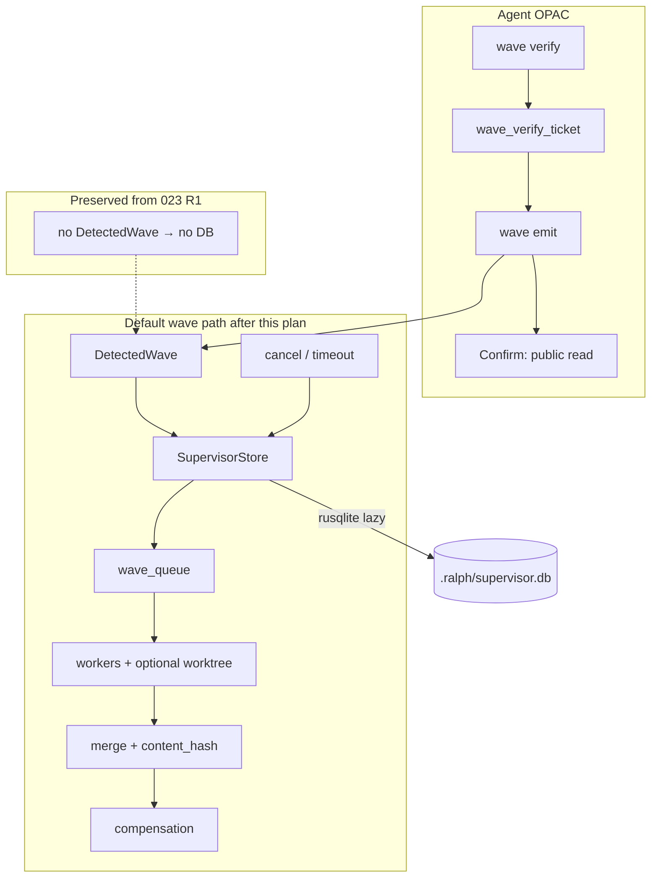
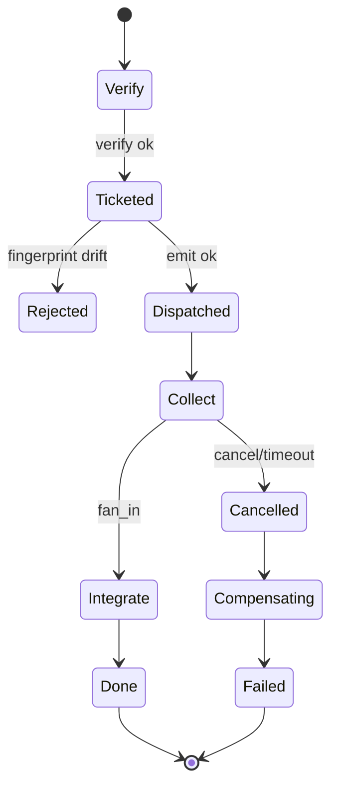

# feat: 默认 Wave 路径吸收协议六件套 + OPAC Precheck/Apply 硬化

## Goal Capsule

- Objective: 让**每一次** `ralph wave` fan-out（不依赖 `supervisor.enabled`）都具备可崩溃恢复、可取消、可反压、可幂等/去重、可补偿的协议能力，并把 wave OPAC 的 **Precheck→Apply 一致性**从 skill 纪律升级为 CLI ticket 硬闸；Apply 后的 Confirm 仍以公开只读证据完成，不把 ticket 消费误称为 Confirm。
- Authority: 本计划 Product Contract + KTDs；冲突时以本计划为准。与 **023-closure**（`docs/achieved/plan/2026-07-23-001-…`）冲突时：不得回退其 pipeline 非干扰回归门禁（R1），但会在「有 wave 且 `enabled=false`」路径上**有意扩展** store 语义（见 KTD-1 / Baseline）。与并行中的 **004 runtime P0** 冲突时：worker 控制面路径 / 空结果 fail-close / public↔store wave ID 边界以 004 冻结契约为准，本计划默认路径 **consume** 之，不另造平行语义。
- Sequencing: **U1 可立即开工**（与 004/005 文件写集正交）。**U2–U9 的 023 技术前置已满足**（生产 `build_supervisor_bridge` / `bind_slot` / `try_dispatch_next` / `record_slot_*` / `run_supervisor_fan_in` 可复用）；禁止另写第二套账本或用测试专用 factory 冒充生产证据。触及 worker spawn/终态判定时对齐 004 契约，但不串行等待 004/005 全部收尾。
- Stop when: Verification Contract 全部绿灯；非目标（P2 fail-fast / 增量 emit / 成本帽 / 改 pipeline 拓扑 / 005 preset DAG）未潜入 diff。
- Out of scope reminder: 不把 wave 升为 CE 主路径；不替代 executor 内 subagent；不吸收已 achieved 的 payload-consistency 引擎；不重做 002 operator-skills；不改 `ce-executor-supervisor` preset 拓扑（005 范围）；不替代 004 的 worker 控制面 P0。

Product Contract preservation: 本计划为 `ce-plan-bootstrap` 直接规划；会话确认 `1A / 2B / 3A` 已写入 KTDs。本次 post-023 rebaseline **不改变 Product Contract ID**，只改 Planning/Unit 相对当前代码的落地路径与前置依赖。

---

## Baseline Audit（2026-07-23 · post-023-closure）

> 审计基准：当前工作区源码（023-closure U1–U9 已代码闭合；文档归档于 `docs/achieved/plan/`）。相对同日上午 rebaseline，**最大漂移**是「enabled=true 生产 bridge 假绿 / 023 在途」已过期。

| 本计划原条目 | 审计结论 | 证据 / 对执行的含义 |
| --- | --- | --- |
| KTD-2 / 原 U3「`ralph-cli` 默认 `supervisor-db`」 | **已落地** | `crates/ralph-cli/Cargo.toml`：`default = ["supervisor-db"]`；无 feature 时 `enabled: true` fail-closed。本计划**不再**以「打开 feature」为 Unit 目标 |
| DB 路径无双 `.ralph` | **已落地** | `resolve_supervisor_db_path`（`runner.rs`）+ `wave_supervisor` 路径测。复用即可 |
| `SupervisorStore` 六件套 API（enqueue / try_dispatch / cancel / content_hash / compensation 表） | **API 存在；补偿执行仍半成品** | `memory.rs` / `rusqlite.rs` / `memory_protocol_tests`；`CompensationEntry` 仍 `dead_code`；`recover.rs` 明确「不跑补偿」 |
| `supervisor.enabled=true` 生产 bridge | **已落地（023 U1–U9）** | `build_supervisor_bridge` → `with_context_and_factory_with_cap` + `ProductionBridgeContext`；Exec/Fix 真实 `bind_slot`；dispatcher 经 `try_dispatch_next` / `record_slot_*` / `run_supervisor_fan_in`；`integration_supervisor_primary.rs` U9 E2E。**本计划复用，禁止重写** |
| 默认 wave（`enabled=false`）账本 | **仍为 legacy `WaveTracker`（核心缺口）** | `runner.rs`：仅 `supervisor_path_enabled` 时建 bridge；`dispatcher.rs`：`supervisor_bridge: None` → `WaveTracker::new()`。本计划 U2+ 主战场 |
| register 失败回退 legacy | **仍存在（本计划须删）** | `execute_wave_via_supervisor`：`register_wave_if_absent` Err → warn + `execute_wave_structured(..., None)` |
| 幂等 SSoT | **仍为 CLI sidecar** | `wave.rs`：`.<basename>.idempotency.jsonl`；`ralph-tools-wave.md` 仍描述 sidecar |
| wave OPAC ticket gate | **未做（U1）** | 全仓无 `wave_verify_gate`；仅有 `wave verify` + skill 纪律 + `task_verify_gate` 可仿 |
| 取消杀进程 | **部分** | worker timeout → `child.kill()` 有；store `cancel_wave` 有测；**dispatcher 热路径未统一调用**（默认路径与 enabled 路径均缺显式 cancel 出口） |
| 反压 / worktree 写隔离 | **拆分：enabled=true 已落地；默认路径仍无** | enabled：`try_dispatch_next` + per-slot worktree（023）。默认：`WaveTracker` 不读 `max_concurrent_workers` / `isolation_mode` |
| pipeline 无 wave 非干扰 | **已成硬回归（023 R1）** | `bridge_build_invocations` + disabled 无 `supervisor.db`。本计划惰性开店必须保住「无 DetectedWave → 零 DB」 |
| CONCEPTS「六件套」词条 | **已有** | `CONCEPTS.md` wave protocol suite；U8 只需对齐最终行为 |
| 002 operator skills 执行模型 | **已落地（achieved）** | 本计划 U8 **不**重写 `skills/ralph-preset-*`；只改 agent 注入 `crates/ralph-core/data/*.md` |
| 004 payload consistency | **已落地（achieved，正交）** | 不替代本计划 R9 ticket gate |
| 004 runtime P0（并行 draft） | **正交；契约需对齐** | `docs/plans/2026-07-23-004-…`：控制面路径 / 空结果 / public wave ID。本计划默认路径 worker 语义 **consume** 其冻结契约，不实现其 Unit |
| 005 supervisor concurrent pipeline | **正交（preset only）** | 不改 dispatcher/store；本计划禁止改 `ce-executor-supervisor` 拓扑 |
| HARD RULE 5 hat env scrub | **已入库** | spawn `ralph` 的测必须 `scrub_agent_runtime_env` / `common::ralph_bin()` |
| 023 U10 文档 residual | **不阻塞本计划** | guide/preset 注释仍可能写「需 `--features supervisor-db`」；归 023 U10 / 运维文档，非本计划 U8 范围 |

### 双账本现状与目标（写入 U2）

```text
今日分叉（post-023）:
  supervisor.enabled=true  → bridge(+store+worktree+反压+fan-in)  [023 U1–U9 已闭合]
  supervisor.enabled=false → WaveTracker only                    [本计划要吸收六件套]

本计划落地后目标:
  任意 DetectedWave → SupervisorStore 热路径（复用 023 bridge/store API）
  supervisor.enabled 仅保留「全量 supervisor preset 语义」
    （协调 topic / 默认 Exec·Fix worktree 策略 / 虚拟 supervisor consumer / inspect 扩展块）
  无 DetectedWave 的 pipeline → 仍不建 bridge、不建 DB（保住 023 R1）
```

### 可复用资产（不要重写）

- `crates/ralph-core/src/supervisor/{mod,memory,rusqlite,worktree_bind,coordinator,recover,bridge}.rs`
- `crates/ralph-cli/src/loop_runner/wave/{dispatcher,supervisor_bridge}.rs` — **优先扩展默认路径开店条件**，复用已闭合的 `CoordinatorSupervisorBridge` / `bind_slot` / `try_dispatch_next` / `run_supervisor_fan_in`
- `crates/ralph-cli/src/loop_runner/runner.rs` — `build_supervisor_bridge`（`with_context_and_factory_with_cap`）、`recover_active_waves_at_startup` 调用点（今日仅挂在 enabled 分支）
- `crates/ralph-cli/src/task_verify_gate.rs`（ticket 行为结构模板）
- `memory_protocol_tests` / `wave_supervisor` characterization / `integration_supervisor_primary`（enabled 路径金样，默认路径 differential 对照）
- `CONCEPTS.md` 六件套词条；002 已落地的 operator 执行模型词汇（引用，不复制）
- 004 冻结的 public wave ID / 控制面路径契约（consume，不复制实现）
---

## 1. 功能目标

### 业务目标

- 修复默认 wave「有形无实」：进程挂了丢状态、超时后 worker 仍烧 token、无跨 wave 反压、无可靠写隔离、verify 后 payload 可漂移。
- 让只读/写并行 fan-out 在**不显式打开** `ce-executor-supervisor` 时也能获得 Supervisor 六件套语义。
- 把 wave OPAC 的 **Precheck→Apply ticket gate** 做成与 `task_verify_gate` 同级的硬约束，堵住 verify→改 payload→直 emit 漂移窗；Confirm 继续要求 agent 用 `wave emit` 返回的 `wave_id` 经公开只读接口验证，不声称 CLI 能强制 agent 已执行 Confirm。

### 本次范围（P0 + P1，已确认 2B）

| ID | 能力 | 外部可观察结果 | 相对 post-023 基线 |
|----|------|----------------|----------------------|
| R1 | 默认 wave 走统一协议 store（非仅内存 `WaveTracker` 孤岛） | 任意 preset 触发 wave 时，ledger 可查询 slot/wave 状态 | **仍缺口**（enabled 路径已有） |
| R2 | 状态持久化 + 启动恢复 | 杀进程重启后未完成 wave 可恢复，不重复 inject `*.wave.complete` | feature/默认 DB **已有**；enabled recover **有**；**默认路径 recover 未接** |
| R3 | 分布式取消 | `cancel` / 超时收摊后 in-flight worker 被终止 | **部分**；timeout kill 有，显式 `cancel_wave` 热路径未统一 |
| R4 | 跨 wave 反压 | 达 `max_concurrent_workers` 时新 wave 入队，slot 释放后 FIFO 出队 | **enabled 已落地**；默认路径 **无** |
| R5 | 幂等键 SSoT | 同 key 重复 `wave emit` / `register_wave` 不二次 spawn | **仍 sidecar** |
| R6 | 内容哈希去重 | 同 slot 同 `content_hash` 不重复 merge JSONL | store **有**；默认路径 **无** |
| R7 | 补偿执行 | failed/timeout/cancelled 后跑补偿 job | **半成品**（表/结构在，热路径未跑） |
| R8 | 写隔离 | `isolation_mode=worktree` 的 wave 每 slot 绑定独立 worktree | **enabled 已落地**；默认路径须复用同一 `bind_slot` |
| R9 | Wave Precheck/Apply ticket 硬闸 | 无有效 verify-ticket 禁止 `wave emit`；fingerprint 漂移拒绝 | **未做**（U1） |
| R10 | 可观测性 | `inspect` / `diagnose` 在默认路径也能展示 active waves / queue / 缺 slot | 仍偏 `enabled` 路径 |

### 非目标

- 不把 `ce-executor-pipeline` / `-loop` 改成 wave 主拓扑（仍串行 hat + 内部 subagent）。
- 不做 P2：`fail-fast` 可配、`wave start/end` 增量 emit、`max_wave_cost`、subagent/wave 边界 lint 产品化。
- 不把 `events.jsonl` / `tasks.jsonl` 全量迁入 SQL。
- 不交付中文 `ce-executor-supervisor-zh`、Turso/远程 DB、跨 loop 全局 worker pool。
- 不改变「协调 topic（`*.wave.complete`）仅 runtime 注入」契约。
- 不实现已 achieved 的 payload-consistency 引擎；不重做 002 的 operator skill 矩阵。
- 不改 `ce-executor-supervisor` preset DAG / 删 hat（005 范围）。
- 不替代 004 的 worker 控制面 / 空结果 / public wave ID P0 实现。
- 禁止用测试专用 `with_context_and_factory` 冒充「默认路径生产接线」完成证据（023 假绿教训仍适用）。

### 跨计划边界

| 计划 | 关系 |
|------|------|
| 023-closure（achieved） | **U1–U9 代码已闭合**；本计划复用其 bridge/store/fan-in。U10 文档 residual 不阻塞。吸收六件套到**默认 wave**是本计划职责（023 明确 non-goal） |
| 003（superseded → achieved） | 仅历史；勿再按旧 U5–U13 执行清单 |
| 002 execution-model skills（achieved） | operator 侧引用其词汇。本计划 U8 只动 `crates/ralph-core/data/*.md` |
| payload-consistency（achieved） | 正交；同属 Precheck 层但不共享 ticket/store |
| 004 runtime P0（并行 draft） | 写集重叠于 `loop_runner/wave/` + supervisor；**契约对齐、实现不抢**：本计划默认路径开店/六件套；004 负责控制面路径与终态 fail-close |
| 005 concurrent pipeline（并行 draft） | preset-only；本计划不改其 YAML/拓扑 |

### 已知约束和假设

- 会话确认：架构 **1A**（默认路径吸收六件套）、范围 **2B**（P0+P1）、OPAC 硬化 **3A**（纳入本计划）；术语经复核明确为 Precheck→Apply ticket gate，不宣称技术上强制 Apply 后的 Confirm 动作。
- 覆盖既有决策：07-03 KD-2「六件套仅 `supervisor.enabled`」在**默认 wave 执行路径**上被本计划取代；pipeline **拓扑**零改动承诺仍成立。
- **修订（rebaseline）**：07-03 / 旧 001 文中「默认引入 SQLite feature」已由 003/023 U2 完成；本计划剩余持久化工作是 **默认 wave 热路径接入同一 store + 惰性开店 + recover**，不是再开一次 feature。
- **修订（post-023）**：`enabled=true` 生产 bridge 假绿已闭合；U2+ **不再**「等 023 修假绿」，改为「复用已闭合 API + 扩展开店门控」。
- **修订（rebaseline）**：无 `supervisor-db` 构建对 `enabled: true` 已 fail-closed；对默认 wave 吸收路径，无 feature 时仍允许 InMemory + stderr warn `wave_ledger_ephemeral`（诚实降级），**禁止**静默假装已持久化。
- 假设：`SupervisorStore` / `InMemorySupervisorStore` / `RusqliteSupervisorStore` / `memory_protocol_tests` 仍是六件套语义 SSOT；默认路径**复用**，不写 JSON wave-state 旁路。
- 假设：未发 wave 的 loop（纯 pipeline）行为与今日一致——**不创建** `supervisor.db` / slot worktree（与 023 R1 对齐）；开店策略 = **首次 DetectedWave 或 recover 需要时**再 open。
- 假设：默认路径 worker 成功/失败判定若触及 004 冻结字段（控制面绝对路径、`event_count=0`、public wave ID），以 004 契约为准；本计划不另发明终态语义。

---

## Product Contract

### Requirements

- R1–R10：见上表。
- R11. 人类 CLI（非 agent context）bypass wave verify ticket，与 task gate 一致。
- R12. Agent 不可 emit 协调 topic；本计划不放松 origin guard。
- R13. Wave 仍必须单次 batch emit（历史教训：禁止每维一次 emit）。
- R14. `crates/ralph-core/data/*.md` / CONCEPTS 与最终 CLI 行为同步：明确 Precheck→Apply ticket 为硬闸、Confirm 为 Apply 后独立阶段；禁止把 ticket 消费写成 Confirm，禁止保留 sidecar、`supervisor.enabled` 可见性或 unsafe bypass 等旧语义。
- R15. 注入 skill 只描述 agent 可执行动作、关键字段来源、公开证据和失败停止条件；不得新增或保留 ticket/DB/sidecar/events 文件路径、内部 store/函数/源码行号、PID/process-group、补偿队列等 agent 不可见实现细节，也不得指导手工修改 `.ralph/` 状态文件。
- R16. 新增/修改会 spawn `ralph` 的测试必须 scrub agent-context env（HARD RULE 5）；污染复跑仍绿。

### Actors

- A1. Dispatcher hat（可 `ralph wave emit`）
- A2. Wave worker（`RALPH_WAVE_WORKER=1`，禁嵌套 wave）
- A3. Aggregator hat（`wait_for_all`）
- A4. Runtime / dispatcher（唯一协调 topic 写入者）
- A5. 人类 operator（bypass wave verify ticket）

### Key Flows

- F1. Precheck（Verify）→ ticket → Apply（Emit）→ Confirm（用 emit 返回的 `wave_id` 调公开只读查询）；ticket 仅约束前两步的一致性
- F2. Fan-out → slot 完成 → fan-in → inject `*.wave.complete`（若拓扑需要）
- F3. 超时/取消 → kill in-flight → 补偿 → 终态可观测
- F4. 进程崩溃 → 重启 → recover → 不重复 complete
- F5. 反压：超并发 → 入队 → 出队再 spawn

### Acceptance Examples

- AE1. Agent：`wave verify` 通过后改动某一 payload 再 `wave emit` → 非 0，提示 fingerprint mismatch。
- AE2. 杀进程于 collect 阶段 → 重启 loop → 同一 `wave_id` 恢复，不二次 spawn 已 completed 且已 merge 的 slot。
- AE3. 达并发上限后再 emit 新 wave → 入队；一 slot 释放后 FIFO 出队 spawn。
- AE4. Cancel 后 worker 进程退出；ledger 标记 cancelled；补偿 job 记一条诊断。
- AE5. 同 `idempotency_key` 二次 emit → 返回原 `wave_id`，`deduplicated=true`，无新 slot。
- AE6. `isolation_mode=worktree` 两 slot 的 cwd 不同且互不写入对方树。
- AE7. 未使用 wave 的 `ce-executor-pipeline` mock/BDD 场景行为与基线一致（回归）；且不强制出现 `supervisor.db`。
- AE8. 注入后的 skill 不包含内部 ticket/DB/sidecar/events 路径或源码行号；不把 ticket 消费描述成 Confirm；verify/emit 示例复用同一份 payload 输入。

---

## Planning Contract

### Key Technical Decisions

| ID | 决策 | 理由 |
|----|------|------|
| KTD-1 | **统一热路径**：任意 `DetectedWave` 默认走 `SupervisorStore`（废除「仅 enabled 才有六件套」分叉）；`supervisor.enabled` 保留为「全量 supervisor preset 语义」（协调 topic 注入、虚拟 supervisor consumer、默认 Exec/Fix worktree 策略、inspect 扩展块）的兼容开关，**store/六件套不再依赖它**。无 wave 的 loop 仍不建 bridge/DB | 兑现 1A；与 023 R1 共存：非干扰 = 无 wave，不是「有 wave 也禁止 store」 |
| KTD-2 | **持久化（修订）**：`supervisor-db` 已是 CLI 默认 feature（不再作为本计划交付物）。有 feature 时默认 wave 用 `RusqliteSupervisorStore`（惰性 open）；无 feature 时 InMemory + stderr warn `wave_ledger_ephemeral` | 复用已落地 feature；诚实降级 |
| KTD-3 | **惰性开店**：loop 启动不因 `enabled=false` 建 DB；**首次 DetectedWave 或 recover 需要时**再 open；open 失败 → fail-closed；**删除**今日 `register_wave_if_absent` 失败回退 legacy | 修不一致；pipeline 无 wave 时零 DB |
| KTD-4 | **幂等 SSoT**：store `idempotency_key` 权威；删除 CLI sidecar 双写（过渡期可一版本 deprecation warn，默认倾向删除） | 消除双账本 |
| KTD-5 | **Precheck→Apply ticket 硬闸**：新建 `wave_verify_gate`，镜像 `task_verify_gate`；仅 agent context 强制；skill 不得暴露 ticket 路径，不得把消费称为 Confirm | 兑现 3A |
| KTD-6 | **写隔离默认**：未声明 `isolation_mode` 时 = `shared_readonly`；仅显式 `worktree` 才绑 worktree。实现**复用** 023 已闭合的 `bind_slot` / `worktree_bind` / `ProductionBridgeContext`，禁止测试专用 factory 充当生产证据 | 避免静默改变只读 review；防假绿复发 |
| KTD-7 | **补偿**：必须接到 dispatcher 热路径；最小 = diagnostics + 可选 hook；补偿失败只 warn，不阻止终态 | 补齐半成品 |
| KTD-8 | **取消**：超时/显式 cancel → store `cancel_wave` + kill child；与 incomplete wave gate 共用出口 | 止烧 token |
| KTD-9 | **反压**：复用 `max_concurrent_workers`（可挂 `event_loop.supervisor` 或 `event_loop.wave` 别名）；跨 wave FIFO `wave_queue`；接线复用 store `enqueue_wave` / `try_dispatch_next`（enabled 路径已示范） | 复用协议测 + 023 dispatcher 模式 |
| KTD-10 | **测试入口**：一律 `cargo nextest`；默认路径覆盖 `supervisor-db`；spawn 测 scrub HARD RULE 5 | HARD RULE 1+5 |
| KTD-11 | **与 023/004 排序（修订）**：023 U1–U9 **已闭合**，U2+ 可立即复用其 API。U1 与 004/005 文件写集正交可并行。U2+ 与 004 共享 `loop_runner/wave/` 时：本计划改「开店门控 / 默认路径 store」；004 改「控制面路径 / 终态 fail-close」——合并前对撞测，禁止双写平行 spawn 语义 | 防合并冲突与契约漂移 |

session-settled: user-directed — 1A 默认路径吸收六件套（chosen over 仅完善 opt-in supervisor）
session-settled: user-directed — 2B P0+P1（chosen over 仅 P0 或 P0+P1+P2）
session-settled: user-directed — 3A OPAC 硬化纳入本计划（chosen over 另开计划；实现边界明确为 Precheck→Apply ticket gate，Confirm 仍由公开证据完成）

### High-Level Technical Design





> 注：`enabled=true` 路径上的 Collect→Integrate（`run_supervisor_fan_in` / `record_slot_*`）已由 023 落地；本图描述本计划落地后**默认路径**也应到达的同一状态机。
### Assumptions

- `SupervisorStore` 协议测试矩阵可直接作为默认路径契约；差异用 differential 锁定（对照 enabled 路径 `wave_supervisor` / `integration_supervisor_primary`）。
- CI 已能编译默认 `supervisor-db`（003/023 U2 已验证）。
- Ticket gate 只保证 verify 与 emit 的 topic/payload/loop/hat 一致，不能证明 agent 已执行 Apply 后 Confirm。
- Confirm 的完成证据是：从 `wave emit --output json` 取得 `wave_id`，再通过当前 CLI 提供的公开只读查询确认对应 wave 可见；只证明本次 wave 已登记，不证明下游 aggregator 已完成。
- 023-closure U1–U9 已把 `enabled=true` 路径上的 bind/dispatch/record/fan-in 做成可复用生产接线；本计划默认路径应调用同一套 API（或同一 bridge 构造模式的惰性开店变体），而不是复制一套。
- 004 冻结的 public wave ID / 控制面绝对路径 / 空结果 fail-close 是默认路径 worker 语义的上游契约；若 004 尚未合并，本计划实现不得引入与之冲突的终态判定。

### Open Questions（非阻塞）

- OQ1. CLI idempotency sidecar：U5 执行时选择「删除」还是「一个版本 deprecation warn」——默认倾向删除双写。
- OQ2. `event_loop.wave.max_concurrent_workers` 是否作为 `supervisor.max_concurrent_workers` 的配置别名写入 schema——实现时选最小 diff。
- OQ3. 补偿 hook 命令的沙箱/超时上限数值——实现时用现有 aggregate_timeout 量级或固定 30s。
- OQ4. 与 004 并行时：默认路径 U2 InMemory 统一账本可先落地；若 U4/U7 触及 worker spawn 终态字段，以 004 已合并契约为准，未合并则在 scratch 冻结接口点并保持与 enabled 路径现有行为一致。

### Scope Boundaries

#### Deferred for later（P2）

- fail-fast 策略可配、`wave start/end`、wave 级成本帽、subagent/wave 产品化 lint、中文 supervisor preset、远程 DB。

#### Outside this product's identity

- 将 CE 主执行改为 wave；禁止 agent 读 `supervisor.db` 当业务输入。

#### Deferred to Follow-Up Work

- 删除所有 legacy `WaveTracker` 类型（本计划可保留为 thin adapter / 测试 shim）。
- `/ce-compound` 运维学习沉淀。
- 004 跨事件历史一致性（若需要）。

---

## 2. BDD 行为规格

```gherkin
Feature: 默认 Wave 协议六件套与 OPAC Precheck/Apply ticket gate
  作为 dispatcher hat
  我希望 wave 扇出具备可恢复、可取消、可反压的账本
  并且 verify 与 emit 之间的输入漂移不能绕过 ticket gate

  Scenario: OPAC ticket 硬闸 — 无 ticket 拒绝 emit
    Given agent context 且当前 hat 为 dispatcher
    And 未成功执行过匹配的 "ralph wave verify"
    When 执行 "ralph wave emit" 带合法 payloads
    Then 命令以非 0 退出
    And stderr 含稳定前缀 "wave_verify_gate denied"
    And events 主账本无新 wave_id

  Scenario: OPAC ticket 硬闸 — fingerprint 漂移拒绝
    Given agent 已对 payload 集合 P 执行 wave verify 并获得 ticket
    When agent 将 payloads 改为 P' 后执行 wave emit
    Then 命令以非 0 退出
    And ticket 仍存在（未消费）或按设计要求重新 verify
    And 无 worker 被 spawn

  Scenario: OPAC 正常路径 — verify 后 emit 并 Confirm 可见
    Given agent 对 payload 集合 P verify 通过
    When agent 用同一 P 执行 wave emit
    Then stdout/json 返回 wave_id
    And 公开只读查询能按 wave_id 确认 wave 已登记
    And ticket 已被消费

  Scenario: ticket 消费不替代 Confirm
    Given agent 已成功执行匹配的 verify 与 emit
    When agent 仅观察到 emit 成功但尚未按返回的 wave_id 查询
    Then OPAC 仍处于 Confirm 未完成状态
    When 公开只读查询确认该 wave_id 可见
    Then 只确认 wave 已登记，不推断下游 worker 或 aggregator 已完成

  Scenario: 人类 CLI bypass wave verify ticket
    Given 非 agent context
    When 直接 wave emit 合法 payloads
    Then 命令成功且写入 wave 事件

  Scenario: 非法输入 — 空 payloads
    Given dispatcher hat
    When wave verify/emit 不提供任何 payload
    Then 非 0 且提示至少 1 个 payload

  Scenario: 权限 — worker 禁止 wave emit
    Given RALPH_WAVE_WORKER=1 或 hat 非 dispatcher
    When 调用 wave emit
    Then ACL/嵌套检查拒绝

  Scenario: 持久化恢复 — collect 中崩溃
    Given 一 wave 处于 collect 且部分 slot completed
    When runtime 进程被杀死并重新启动同一 loop
    Then recover 恢复该 wave_id
    And 已 merge 的 slot 不重复 merge
    And 未完成 slot 可继续或按策略失败收摊

  Scenario: 反压入队
    Given max_concurrent_workers=1 且已有 1 个 active worker
    When 再 register/emit 新 wave
    Then 新 wave 进入 queue
    And active workers 不超过 1
    When 前一 slot 完成
    Then 队列头 wave 被 dispatch

  Scenario: 取消 in-flight
    Given wave 有 running worker 进程
    When 触发 cancel_wave 或 aggregate timeout 收摊
    Then worker 进程退出
    And ledger 标记 cancelled/failed
    And 补偿 job 被记录（执行成功或 warn）

  Scenario: 幂等键去重
    Given 使用同一 idempotency_key 成功 emit 过
    When 再次 emit 相同 key
    Then 返回同一 wave_id 且 deduplicated=true
    And 不新增 slot/spawn

  Scenario: 内容哈希去重
    Given slot 已 merge 某 content_hash 的结果
    When 再次提交相同 content_hash 的 worker 结果
    Then 不重复追加 JSONL 业务行
    And 诊断可观测 dedup

  Scenario: worktree 写隔离
    Given isolation_mode=worktree 的 exec wave 含 2 slots
    When 两 worker 分别写入文件
    Then 各自写入自己的 worktree_path
    And 不污染对方树（在 merge 前）

  Scenario: 无 wave 的 pipeline 回归
    Given builtin ce-executor-pipeline 场景不触发 wave
    When 跑既有 BDD/workflow 场景
    Then 事件序列与基线一致
    And 不出现 supervisor.db / slot worktree
    And 不强制出现 supervisor 业务行为变化
```

---

## 3. 验收与测试策略

| Scenario | 验收条件 | 推荐测试层级 | 是否需要 E2E |
| -------- | ---- | ------ | -------- |
| 无 ticket 拒绝 emit | 非 0 + `wave_verify_gate denied` + 无写盘 | 单元（CLI） | 否 |
| fingerprint 漂移 | 非 0 + 无 spawn | 单元 | 否 |
| verify→emit→Confirm 可见 | wave_id 可公开查询 | 单元 + 轻集成 | 否 |
| 人类 bypass | 无 ticket 也可 emit | 单元 | 否 |
| 空 payloads | 非 0 | 单元 | 否 |
| worker ACL | Deny | 单元（既有加强） | 否 |
| 崩溃恢复 | recover 后无重复 merge | 集成（store+recover） | 否 |
| 反压入队 | queue depth 与并发上限 | 单元（协议）+ 集成 | 否 |
| 取消 in-flight | 进程退出 + 状态 | 集成（含假进程/fixture） | 否 |
| 幂等键 | deduplicated | 单元 + CLI | 否 |
| content_hash | 不双写 JSONL | 集成 | 否 |
| worktree 隔离 | cwd/path 分离（生产 bridge，非 helper-only） | 集成 | 否 |
| pipeline 无 wave 回归 | 场景绿 + 无 DB | BDD scenarios | 否（mock BDD） |

额外风险驱动：

- Characterization / Differential：`WaveTracker` 旧路径 vs 新 store 路径关键断言对齐。
- Idempotency / Concurrency：反压 + 双 emit。
- State-machine：wave phase collect→integrate→done / cancelled。
- Fault injection：DB open 失败 fail-closed；禁止 register 失败回退 legacy。
- Env scrub：污染 `RALPH_CURRENT_HAT` 等复跑相关 CLI 集成测。

---

## 4. 需求—测试追踪矩阵

| 需求 | Scenario | 验收测试 | 单元测试 | 集成/契约测试 | E2E |
| -- | -------- | ---- | ---- | ------- | --- |
| R9 | 无 ticket / 漂移 / 正常 / 人类 bypass | `wave_verify_gate` 测 | fingerprint / consume | CLI tempdir emit | — |
| R1 | 恢复/反压/取消共用 ledger | dispatcher 分支测 | store trait | 默认路径（enabled=false）有 store | — |
| R2 | 崩溃恢复 | recover 测 | rusqlite roundtrip | 默认路径启动 recover | — |
| R3 | 取消 in-flight | cancel 测 | — | kill fixture | — |
| R4 | 反压入队 | protocol 测 | queue FIFO | dispatcher 集成 | — |
| R5 | 幂等键 | CLI + store DuplicateKey | sidecar 移除/兼容 | — | — |
| R6 | content_hash | merge 测 | hash 字段 | io merge | — |
| R7 | 取消后补偿 | compensation 执行测 | job 状态 | dispatcher hook | — |
| R8 | worktree | bind 测（生产路径） | — | 双 slot tmp | — |
| R10 | inspect 有 wave 摘要 | inspect JSON 断言 | summarize | — | — |
| R14/R15 | skill 契约 | 文档契约 + drift + help | 禁词/必备语义 | skill 注入 | — |
| R16 | hat env scrub | 污染复跑 | — | CLI 集成 | — |
| 回归 | pipeline 无 wave | scenarios | — | `ce_executor_pipeline*` + 无 DB | — |

---

## 5. 严格串行开发单元

执行纪律：Unit N 的验收、相关集成、受影响回归全部绿灯后，才能开始 Unit N+1。**本计划内**禁止并行开发多个 Unit（U1 与 004/005 **跨计划**并行除外，见 Goal Capsule / KTD-11）。

**全局前置：** U2–U9 **不再**等待 023「修假绿」——023 U1–U9 生产 API 已可复用。执行者须在开 U2 前确认：`build_supervisor_bridge` 走 `with_context_and_factory_with_cap`（非 `from_store`），且 `wave_supervisor` / `integration_supervisor_primary` 相关测仍绿。U1 无此前置。

### U1. Wave OPAC Precheck→Apply ticket 硬闸（wave_verify_gate）

- Unit 目标：agent 上下文强制 verify→ticket→emit；漂移拒绝；人类 bypass。
- 对应 Scenario：无 ticket / 漂移 / 正常 / 人类 bypass / 空 payloads（与 verify 交互）。
- 外部可观察结果：无匹配 ticket 时 `wave emit` 非 0；成功 emit 后 ticket 消费；公开查询可见 wave。
- 输入与输出：输入 = verify 的 topic+payloads；输出 = 内部 one-shot ticket 或 deny。ticket 物理位置仅实现细节。
- 可依赖的已完成能力：`task_verify_gate`、`wave verify`、`HatCommandPolicy::check_wave_emit`。
- 明确禁止依赖的未来能力：SupervisorStore、持久化、取消、反压、默认路径开店。
- 验收测试：`crates/ralph-cli/src/wave_verify_gate.rs`（新）+ `wave.rs` CLI 测；spawn 测 scrub env。
- 需要拆分的单元测试：fingerprint 稳定性；consume one-shot；loop/hat 不匹配；人类 bypass。
- Red 预期失败原因：emit 路径尚无 `require_ticket`。
- 最小实现范围：`wave_verify_gate.rs`；`wave.rs` verify 成功写 ticket、emit 前检查。**本 Unit 不编辑 data skill**（文档收敛留 U8）。
- 集成验证：tempdir 下 verify→emit→公开查询。
- 回归范围：既有 `wave.rs` policy/ACL 测；`hat_command_policy` wave 测。
- 完成标准：R9/R11 相关 Scenario 绿；ticket gate 与 `--policy-check` 正交；未把 ticket 消费当作 Confirm；`--unsafe-no-policy-check` **不绕过** ticket。
- 风险：ticket 路径勿进 git。
- Execution note: Implement test-first；可与 004/005 **并行**。

### U2. 默认路径统一到 SupervisorStore（内存先行）

- Unit 目标：`supervisor.enabled=false` 但存在 `DetectedWave` 时，不再独走裸 `WaveTracker` 作为唯一账本；惰性构造与 023 同构的 bridge facade（起步可用 `InMemorySupervisorStore`）注册/记账。
- 对应 Scenario：为后续恢复/反压铺契约；本 Unit 外部可见 = 测试可读取 store snapshot。
- 外部可观察结果：wave 生命周期写入 store phases；legacy 行为 differential 对齐；**无 wave 的 pipeline 仍不建 store/DB**（023 R1 门禁仍绿）。
- 可依赖：U1；023 已闭合的 bridge/store 表面；现有 `memory_protocol_tests`。
- 禁止依赖：强制改 pipeline YAML；用测试 factory 宣称 worktree 生产完成（worktree 属 U7）；抢写 004 控制面终态语义。
- 验收测试：扩展 `loop_runner/tests/wave.rs` + `wave_supervisor.rs`（**enabled false + 有 wave** 也有 store；**enabled false + 无 wave** 仍零 bridge/`supervisor.db`）。
- 单元测试：register / fan_in 计数；与旧 WaveTracker 关键断言 differential。
- Red：默认路径仍无 store。
- 最小实现：`runner.rs` / `dispatcher.rs` 在 DetectedWave 时惰性开店；**删除 register 失败 fallback legacy**（改为错误上抛）。
- 集成验证：既有 wave 测全绿 + 新 store 断言 + pipeline 非干扰回归。
- 回归：`event_loop/tests/wave_*.rs`、flow_reliability wave scenarios、023 R1 门禁、`enabled_false_uses_wave_tracker` 期望更新。
- 完成标准：R1 在内存语义下成立；无行为回退洞。
- 风险：大 diff；保持 shared_readonly 默认；与 004 并行时锁定开店门控接口。

### U3. 默认路径持久化 + 启动恢复（复用已默认的 supervisor-db）

- Unit 目标：**不再**「打开 feature」；在默认 build 上让**默认 wave 路径**惰性 open `RusqliteSupervisorStore`；启动 `recover_active_waves` 不依赖 `supervisor.enabled`；open 失败 fail-closed。
- 对应 Scenario：崩溃恢复；无 wave 零 DB。
- 外部可观察结果：仅在首次 wave（或 recover 需要）后出现 `.ralph/supervisor.db`；重启后状态仍在；纯 pipeline 场景无该文件。
- 可依赖：U2；已落地的 `default = ["supervisor-db"]` 与路径解析；023 U8 rusqlite reopen 测作金样。
- 禁止依赖：补偿完整语义、worktree（可标资源但不要求本 Unit 绑）。
- 验收测试：写盘→drop store→reopen→snapshot；pipeline 场景断言无 DB。
- 单元测试：migrations；DuplicateKey；merged_to_events 不双 inject。
- Red：recover 仍仅挂在 `supervisor_path_enabled` / `enabled=true` 分支（`runner.rs`）。
- 最小实现：runner/dispatcher 在默认 wave 路径调用 recover；文档说明惰性策略。
- 回归：无 wave pipeline scenarios；nextest 下 DB 路径 per-tempdir。
- 完成标准：R2 + AE2 + AE7（无 DB）。
- Execution note: Characterization of `recover_active_waves_at_startup` call sites before moving them.

### U4. 分布式取消 + 超时收摊杀进程

- Unit 目标：cancel/timeout → store 状态 + 杀 in-flight worker（默认路径与 supervisor 路径同一出口）。
- 对应 Scenario：取消 in-flight。
- 外部可观察结果：worker 退出；ledger cancelled/failed；不再产生新业务 emit。
- 可依赖：U2–U3。
- 禁止依赖：补偿执行（可只置 job；U6 执行）、反压队列实现（本 Unit 不实现 queue）。
- 验收测试：dispatcher 集成用短命假 backend / fake PID fixture。
- 单元测试：`cancel_wave` 状态机。
- Red：timeout 只合成事件不杀进程 / 默认路径不调 `cancel_wave`；dispatcher 热路径无 `cancel_wave`。
- 最小实现：dispatcher 持有 child handles；cancel 路径 kill；与 incomplete wave gate 共用。
- 回归：partial-wave / incomplete_wave scenarios。
- 完成标准：R3。
- 风险：误杀；Unix process group；Windows 非目标可文档化；与 004 超时收敛语义对齐。

### U5. 反压队列 + 幂等 SSoT + content_hash 去重

- Unit 目标：跨 wave FIFO 反压；idempotency 只认 store；merge 去重；移除/deprecate sidecar。
- 对应 Scenario：反压入队、幂等键、content_hash。
- 外部可观察结果：queue_depth；deduplicated；JSONL 无重复 hash 行。
- 可依赖：U2–U4；store 既有 `enqueue_wave` / `try_dispatch_next`；enabled 路径 dispatcher 反压模式（023 U3–U4）。
- 禁止依赖：补偿、worktree。
- 验收测试：复用/扩展 `memory_protocol_tests`；CLI idempotency 测改为 store；merge io 测。
- Red：超并发仍立刻 spawn；sidecar 与 store 双写不一致。
- 最小实现：默认路径接线 enqueue/dispatch（镜像 enabled）；删或 deprecate sidecar；merge 读 content_hash。
- 回归：既有 wave emit idempotency 测更新期望。
- 完成标准：R4/R5/R6。
- 风险：配置字段别名文档（OQ2）。

### U6. 补偿执行器接线

- Unit 目标：failed/timeout/cancelled 后执行 compensation_jobs（最小：诊断记录 + 可选命令 hook）。
- 对应 Scenario：取消后补偿。
- 外部可观察结果：diagnostics 或 job 状态 completed/failed_warn；wave 终态仍可达成。
- 可依赖：U4–U5。
- 禁止依赖：worktree 清理以外的业务合并策略。
- 验收测试：job 从 pending→done；hook 失败不阻塞；清除相关 `dead_code` 允许项须有执行证据。
- Red：CompensationEntry 仍 dead_code、recover「不跑补偿」。
- 最小实现：dispatcher/coordinator tick 执行队列；agent 可观察状态交 U8 写 skill。
- 回归：取消场景。
- 完成标准：R7。

### U7. 写隔离 worktree 绑定（显式 isolation_mode）

- Unit 目标：`isolation_mode=worktree` 时 per-slot worktree；默认 shared_readonly 不变；**复用 023 已闭合生产 `bind_slot`**，禁止 helper-only 假绿。
- 对应 Scenario：worktree 写隔离。
- 外部可观察结果：公开 cwd/env；双 slot 文件隔离。
- 可依赖：U2–U3；023 生产 `bind_slot` / `ProductionBridgeContext` / `DefaultWorktreeFactory`。
- 禁止依赖：改 pipeline preset；用 `with_context_and_factory` 测试构造器冒充 runner 惰性开店接线；改 005 supervisor preset。
- 验收测试：经 runner 默认路径开店入口（或与 `build_supervisor_bridge` 等价的惰性入口）的 dispatcher 集成，断言真实 cwd。
- Red：默认路径忽略 isolation_mode；或仅测试 factory 绿、生产 `cwd: None`。
- 最小实现：把 023 的 bind 接到默认 store 路径的 DetectedWave。
- 回归：只读 review 类 wave 测仍共享 cwd。
- 完成标准：R8 + AE6。

### U8. 可观测性 + agent skill / CONCEPTS 同步

- Unit 目标：inspect/diagnose 在默认路径展示 wave ledger 摘要；按 U1–U7 **最终外部行为**一次性重写受影响 **agent 注入** skill；删除 sidecar /「仅 enabled 可见」旧语义。
- 对应 Scenario：可观测；文档一致性。
- 外部可观察结果：`ralph inspect loop --format json` 含 agent-safe wave 摘要（无 db 绝对路径泄露）。
- 可依赖：U1–U7（含 U1 ticket gate 最终语义，供 skill 一次写对）。
- **不在本 Unit**：重写 `skills/ralph-preset-*`（002 已覆盖）；023 U10 guide/zsh residual；005 preset 文档；若 inspect 字段变更需同步 operator 文档，仅做最小交叉引用。
- 验收测试：inspect 单测；skill registry 注入测试；文档契约测试；`--help` 冒烟；`scripts/check-cli-doc-drift.sh`；`rg` 禁词扫描。
- Red：仅 `supervisor.enabled` 才有摘要；skill 仍教 sidecar。
- 最小实现：`inspect.rs` / `diagnose.rs`；`CONCEPTS.md`（已有词条则按最终行为修订）；逐文件处理 `ralph-tools-wave.md`、`ralph-tools-opac.md`，并核对 `ralph-tools.md` / `cmdref` / `emit`。
- 回归：OPAC scenarios。
- 完成标准：R10/R14/R15；禁止内容扫描为零。

#### U8-A. skill 修改总原则（写入前门禁）

1. **先代码、后文档**：只有 U1–U7 相关测试已绿，才允许编辑 `crates/ralph-core/data/*.md`。
2. **四阶段不得混写**：`Observe → Precheck → Apply → Confirm`；ticket 消费 ≠ Confirm。
3. **只写 agent 视角**：触发条件、命令/动作、字段来源、失败停止条件。
4. **公开接口优先**：Confirm 只用公开只读 CLI。
5. **不泄漏实现**：禁止内部模块/函数/trait、源码行号、DB/ticket/sidecar 路径、PID/process group、dispatcher tick、补偿队列表。
6. **不计划化**：禁止本计划名、U-ID、具体 preset 名、事故路径。
7. **失败即停止**：verify 拒绝 / fingerprint mismatch / emit 失败 / Confirm 查无 / inspect warning → 停止后续状态变更。
8. **同源 payload**：verify 与 emit 读同一未修改输入。

#### U8-B. `ralph-tools-wave.md` 具体修改规格

1. **重写「Wave OPAC 四阶段」表**：Observe 用 `inspect loop`；Precheck = `wave verify`；Apply = 同输入 `wave emit`；Confirm = 用返回 `wave_id` 的公开查询；写明 unsafe 不绕过 ticket。
2. **重写 verify→emit 示例**：同一 payload 输入；捕获 `wave_id`；演示 Confirm；禁止读内部 events 文件。
3. **修订参数和错误表**：以 clap/help 为准；补无 ticket / fingerprint / 已消费 / ACL 等稳定错误类。
4. **修订幂等说明**：只写公开契约（`deduplicated=true`）；**删除 sidecar 文件名/锁/扫 events**。
5. **修订可观测说明**：删除「仅 `supervisor.enabled: true` 才可见」；按最终 inspect 字段写。
6. **修订取消/补偿说明**：只写公开状态机语义；不写 PID/hook runner。
7. **修订 worktree 说明**：只写 `isolation_mode=worktree` 时 runtime 提供隔离 cwd；禁止 agent 自建/删 worktree。
8. **删除现有违规内容**：源码行号、sidecar 路径、手工修 ledger 的 jq 示例等。

#### U8-C. `ralph-tools-opac.md` 具体修改规格

1. Wave Precheck = `ralph wave verify`；Apply = 同输入 emit；Confirm 指向 `ralph-tools-wave`。
2. 新增短「Wave ticket gate」行为段（无路径/哈希算法/函数名）。
3. 与 task gate 边界清晰，不机械套用 task 的 unsafe recovery。
4. 默认 wave 路径也可 `inspect`；不再以 `supervisor.enabled` 为必要条件。
5. Confirm：ticket 消费与 exit 0 只是 Apply 证据。
6. 删除 ticket 路径、内部 ledger 名、trait/常量名。

#### U8-D. 其余 data skill 的逐文件核对

- `ralph-tools.md`：拆清 policy precheck 与 wave ticket gate 两层约束。
- `ralph-tools-cmdref.md` / `ralph-tools-emit.md`：有则按 help 更新，无则记录「无需修改」及证据。
- `skill_registry.rs` 相关测试：frontmatter / 可见性不破坏。
- `CLAUDE.md` / `AGENTS.md`：若需把 `ralph-tools-opac.md` 写入允许编辑范围，两文件必须 `cp` 后 byte-equal。

#### U8-E. 防漂移自动化与负面断言

- 必备语义：`wave verify`、同输入 Apply、漂移需重新 verify、ticket one-shot、人类 bypass、unsafe 不绕过、用 `wave_id` Confirm、Confirm ≠ 下游完成。
- 禁止语义：ticket/DB/sidecar/events 内部路径、`.rs:NN`、内部函数/trait、手工改 `.ralph/`、`supervisor.enabled` 作为摘要必要条件、ticket 消费 = Confirm。
- 示例可执行：同一 fixture 串 verify/emit；改一条 payload 必失败；重新 verify 后成功。
- `check-cli-doc-drift.sh` 覆盖 `wave verify` 与 `wave emit`。

### U9. BDD 场景包 + 全量回归门禁

- Unit 目标：为默认路径六件套增加真 runner 场景；跑全量回归。
- 对应 Scenario：全表；pipeline 无 wave 回归。
- 外部可观察结果：新 scenario 文件 + `./scripts/run-tests.sh` 绿。
- 可依赖：U1–U8 全部。
- 验收测试：`run_workflow_guard_scenario`（禁止 stub `run_scenario` 只数 iteration）。
- Red：场景期望事件不存在。
- 最小实现：2–4 个 scenario（confirm gate 可用 CLI 测为主；恢复/反压/取消至少各 1；**覆盖 `enabled=false` + DetectedWave**）。
- 回归：`ralph-cli` wave*；`ralph-core` scenarios；preset_lint；doctest 按惯例；HARD RULE 5 污染复跑抽样；023 R1；`integration_supervisor_primary`（enabled 路径不回退）。
- 完成标准：AE1–AE8；最终质量门禁清单全部勾选。

---

## Implementation Units（ce-work 索引）

与上节 U1–U9 一一对应。执行时仅按 Unit 序号串行（U1 可与 004/005 并行）。

| U-ID | 名称 | 依赖 | 相对基线备注 |
|------|------|------|--------------|
| U1 | wave_verify_gate | — | 全新；可并行 004/005 |
| U2 | 默认路径 SupervisorStore | U1；复用 023 bridge API | **核心缺口**；023 前置已满足 |
| U3 | 默认路径 rusqlite + recover | U2 | feature 已默认；改接线出门控 |
| U4 | cancel + kill | U2, U3 | 统一出口（含 enabled） |
| U5 | 反压 + 幂等 + content_hash | U2–U4 | 删 sidecar；镜像 enabled 反压 |
| U6 | 补偿执行 | U4, U5 | 清 dead_code |
| U7 | worktree 隔离 | U2–U3 + 023 bind | 复用已闭合 bind；禁假绿 |
| U8 | inspect + agent skills | U1–U7 | 不动 002/005/023-U10 |
| U9 | BDD + 全量回归 | U1–U8 | 含 enabled=false+wave |

### Patterns to follow

- `crates/ralph-cli/src/task_verify_gate.rs` — Precheck→Apply one-shot ticket 模式
- `crates/ralph-core/src/supervisor/memory_protocol_tests.rs` — 六件套契约
- `crates/ralph-cli/src/loop_runner/wave/dispatcher.rs` — `execute_wave_via_supervisor` / legacy 分叉（本计划收拢默认路径到 store）
- `crates/ralph-cli/src/loop_runner/runner.rs` — `build_supervisor_bridge`（已 `with_context_and_factory_with_cap`）；默认路径惰性开店时复用同一构造模式
- `crates/ralph-cli/src/loop_runner/wave/supervisor_bridge.rs` — `bind_slot` / `try_dispatch_next` / cap
- `crates/ralph-cli/tests/integration_supervisor_primary.rs` — enabled 路径金样（默认路径 differential）
- `docs/achieved/plan/2026-07-23-001-fix-supervisor-worktree-dispatch-closure-plan.md` — 生产接线与假绿禁令（历史）
- `docs/plans/2026-07-23-004-fix-supervisor-p0-runtime-contracts-plan.md` — worker 控制面 / 终态契约（并行对齐）
- `docs/solutions/integration-issues/ce-executor-wave-emission-must-batch-in-single-emit-2026-06-09.md` — batch emit
- `docs/solutions/2026-06-16-isolated-wave-stability-and-progress-steward.md` — 预算/provenance
---

## Verification Contract

- 单测/集成：`cargo nextest run -p ralph-cli --bin ralph -- wave`
- Store 协议：`cargo nextest run -p ralph-core -- supervisor`
- BDD：`cargo nextest run -p ralph-core --test scenarios -- supervisor` 与新增默认 wave 场景名
- skill registry / 注入：`cargo nextest run -p ralph-core -- skill_registry`
- CLI help 冒烟：`ralph wave verify --help`、`ralph wave emit --help`、`ralph inspect loop --help`、`ralph diagnose --help`
- 文档漂移：`scripts/check-cli-doc-drift.sh` + U8-E 语义/禁词/示例契约测试
- 文档源码引用复核：对受影响 `crates/ralph-core/data/*.md` 执行 `rg -n '\.rs:[0-9]'`；原则上清零
- 规则同步：若改 `CLAUDE.md` 允许编辑 opac，立即 `cp CLAUDE.md AGENTS.md` 且 `cmp -s`
- HARD RULE 5：`RALPH_CURRENT_HAT=executor RALPH_EVENTS_FILE=/tmp/x.jsonl cargo nextest run -p ralph-cli --test <相关>` 仍绿
- 最终：`./scripts/run-tests.sh`（默认 `supervisor-db`）
- Lint/format：`cargo clippy`、`cargo fmt`（按仓库惯例）

---

## 6. 最终质量门禁

- [ ] 计划内全部 Scenario 有对应自动化且通过
- [ ] U1–U9 各自完成标准满足；无跨 Unit 未关闭债务
- [ ] 所有单元测试通过（含 wave_verify_gate / store / cancel / dedup）
- [ ] 必要集成与 BDD 通过；**无**新增 `#[ignore]` / 删断言 / 无解释刷新 golden
- [ ] `./scripts/run-tests.sh` 通过
- [ ] clippy / fmt /（如适用）doc 通过
- [ ] skill 与 CONCEPTS 已同步；ticket gate ≠ Confirm
- [ ] `ralph-tools-wave.md` 已按 U8-B 八项逐项完成，`ralph-tools-opac.md` 已按 U8-C 六项逐项完成
- [ ] `ralph-tools.md` / `cmdref` / `emit` 已逐文件记录修改或「无需修改」证据
- [ ] 注入 skill 无 ticket/DB/sidecar/events 内部路径、源码行号、内部函数/trait、手工修改 `.ralph/` 建议
- [ ] verify/emit 示例同源 fixture；漂移拒绝与 Confirm 有可执行测试
- [ ] `CLAUDE.md` 与 `AGENTS.md` 在需要时已同步且 byte-equal
- [ ] `ce-executor-pipeline` 无 wave 场景相对基线无回归，且无强制 `supervisor.db`
- [ ] 023 R1 非干扰门禁仍绿；本计划未引入第二套账本；enabled 路径 `integration_supervisor_primary` 不回退
- [ ] 未验证内容与剩余风险已记录：P2 全项、Windows 杀进程、补偿 hook 幂等深化、WaveTracker 类型完全删除、023 U10 / 004 / 005 范围外项
### 剩余风险（门禁后仍可接受）

- 默认 wave 也用 sqlite 时，首次 wave 的 IO/CI 时间略增（纯 pipeline 仍惰性零开销）。
- 历史「best-effort partial」与强取消并存——aggregator 指令需理解 cancelled slots。
- Confirm 只证明 ledger 写入，不证明下游 aggregator 已跑完。
- 与 004 并行开发共享 `loop_runner/wave/` 时，若违反 KTD-11 写集边界，易出现 spawn/终态语义冲突——用契约对齐 + 对撞测规避。
- 023 U10 文档 residual（guide/preset 仍可能写「需手工 `--features supervisor-db`」）不在本计划范围，可能造成 operator 困惑但不影响本计划代码验收。

---

## Definition of Done

- R1–R16 均有测试或文档门禁证明。
- 默认路径不再依赖 `supervisor.enabled` 才能获得六件套；无 wave 的 pipeline 仍零 DB。
- OPAC wave Precheck→Apply ticket gate 在 agent context 下不可绕过；skill 不把 ticket 消费误称为 Confirm。
- Apply 后 Confirm 使用公开只读证据，且明确不代表下游 aggregator 已完成。
- 无 P2 范围潜入；无 CE 主路径拓扑改动；未重写 023 已闭合的 enabled 生产 bridge；未抢写 004/005 范围。

---

## Sources & Research

- `docs/achieved/brainstorms/2026-06-18-supervisor-wave-protocol-upgrade-requirements.md`
- `docs/achieved/plan/2026-07-03-001-feat-supervisor-rusqlite-parallel-preset-plan.md`
- `docs/achieved/brainstorms/2026-07-03-supervisor-rusqlite-parallel-preset-requirements.md`
- `docs/achieved/plan/2026-07-23-001-fix-supervisor-worktree-dispatch-closure-plan.md`（U1–U9 代码闭合；本计划复用 API）
- `docs/achieved/plan/2026-07-22-003-fix-supervisor-worktree-dispatch-plan.md`（superseded，仅历史）
- `docs/achieved/plan/2026-07-22-002-feat-preset-skills-execution-model-wave-supervisor-plan.md`（operator skills，正交）
- `docs/achieved/plan/2026-07-22-004-feat-payload-consistency-gates-plan.md`（正交 Precheck）
- `docs/plans/2026-07-23-004-fix-supervisor-p0-runtime-contracts-plan.md`（并行；控制面/终态契约）
- `docs/plans/2026-07-23-005-refactor-supervisor-concurrent-pipeline-plan.md`（并行；preset only）
- `specs/agent-waves/{requirements,design,summary}.md`
- `docs/solutions/2026-06-16-isolated-wave-stability-and-progress-steward.md`
- `docs/solutions/integration-issues/ce-executor-wave-emission-must-batch-in-single-emit-2026-06-09.md`
- `crates/ralph-cli/src/{wave.rs,task_verify_gate.rs,loop_runner/wave/dispatcher.rs,loop_runner/wave/supervisor_bridge.rs,loop_runner/runner.rs}`
- `crates/ralph-cli/tests/integration_supervisor_primary.rs`
- `crates/ralph-core/src/supervisor/*`
- 会话调研：[wave/supervisor 代码](6308163f-fa51-47b3-a328-c0a7301a440a)、[学习库](6f8f9691-3370-4ba3-bfd5-7ca9994165e3)
- 2026-07-23 上午 rebaseline：当时仍视 023 为「在途/假绿」
- **2026-07-23 post-023 rebaseline 代码证据**：`runner.rs` `with_context_and_factory_with_cap`；`dispatcher.rs` 仍 `WaveTracker` 默认分叉 + register fallback；`wave.rs` sidecar；全仓无 `wave_verify_gate`；`CompensationEntry`/`recover` 不跑补偿；023 文档已迁 `docs/achieved/plan/`
