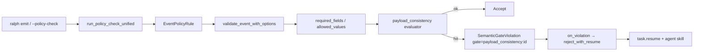

# feat: Payload Consistency Gates（同 payload 验收硬闸）

## Goal Capsule

- **Objective:** 在 `ralph emit` / `--policy-check` 同源路径上，为 preset 提供可声明的**同 payload 字段一致性硬闸**（验收 checkpoint）：当交卷 JSON 自相矛盾时拒收，并给出 agent 可读恢复说明，使人不必进环。
- **Authority:** 本计划 + 现有 `event_policy` / OPAC Precheck 合同；注入 skill 仅描述通用能力，禁止写具体 preset / 计划 / 事故。
- **Out of scope (stop if asked):** 跨事件历史比对；HITL 审批主路径；把规则写死进 runtime 专供某一 preset；把专用案例塞进 `crates/ralph-core/data/*.md`。
- **Definition of done (capsule):** 引擎默认可关；`--policy-check` 与真 emit 行为一致；fixture BDD + pipeline 1～2 条真实规则绿；通用 data skill + `skills/` 操作规程已适配；相关开发者文档 / 词表已同步；全量相关 nextest / preset_lint 绿。

---

## Product Contract

### Summary

空箱子问题：OPAC / schema 保证「面单填得对」，但不保证「货齐」。本能力在交卷瞬间检查**同一张 JSON 交卷单**是否自洽，作为 agent-native 验收 checkpoint。配置挂在新建的 `event_policy.payload_consistency`；规则由各 preset 声明；第一期只做同事件谓词。

Product Contract preservation: n/a（ce-plan-bootstrap，无上游 brainstorm 文件）

### Requirements

- R1. Preset 可在 `event_loop.event_policy.payload_consistency` 声明启用开关与规则列表；缺省 `enabled: false`，旧 preset 零行为变化。
- R2. 规则只检查**当前 emit 的 payload**（同事件）；禁止依赖 events 历史或其他 topic 快照。
- R3. 谓词最小闭包：`eq` / `ne` / `gt` / `gte` / `exists` / `non_empty`，以及 `all` / `any` 组合；非法规则配置在解析或 lint 期失败（fail-close）。
- R4. 校验接入点与现有 schema / topic_deny 同源：`validate_event*` → CLI `--policy-check` 与真 apply 行为一致；拒收走 `on_violation`（pipeline 使用 `reject_with_resume`）。
- R5. 拒收产出可机读反馈：`gate` / `reason_code` / `message`（及现有 validation_errors 形状），agent 可据此改字段或改 `fix_status`，无需人拍板。
- R6. `ce-executor-pipeline`（及必要的 loop 变体）挂 **1～2 条真实规则**（至少覆盖「blocked + 零必修落地却声称 applied」类互斥）；规则示例只存在于 preset YAML，不进注入 skill。
- R7. 通用注入 skill（`crates/ralph-core/data/*.md`）说明：存在此类闸、Precheck 会拦、恢复读 reason；禁止具体 preset / U-ID / 事故。
- R8. 操作规程 skill（`skills/ralph-preset-author|review`、bootstrap、common references）说明：如何声明、如何评审、如何与 schema SSOT / OPAC 分工；禁止专用迷惑案例。
- R9. 不替代 OPAC；不替代 `execution_contracts`（任务/git/测试证据义务仍在 PostCommit 层）。
- R10. 相关**非注入**开发者文档与域词表同步：`CONCEPTS.md`、`docs/guide/opac.md`（及 guide 索引若需入口）、必要时 handbook 一句分工；禁止把专用规则示例写进注入 skill。

### Actors

- A1. In-loop agent（emitter hat）— 被闸门拒收后自修复
- A2. Preset 作者 / 评审 — 声明与审计规则
- A3. Runtime — Precheck/Enforce 执行闸门

### Key Flows

- F1. Agent `--policy-check` → 互斥命中 → dry-run 拒收 + 可读错误 → agent 改 payload → 再 check → apply
- F2. Agent 跳过 check 直接 apply（若配置强制 check）→ 同源拒收 + `task.resume`
- F3. Preset 未启用 `payload_consistency` → 行为与今日完全一致

### Acceptance Examples

- AE1. Fixture preset：一条规则 `when all(review_verdict=blocked, fixes_applied=0, fix_status=applied)` → `fix.done` policy-check 拒收；合法 `fix_status=blocked` + `failure_reason` 放行。
- AE2. `ce-executor-pipeline` 真实规则下，复现「blocked + fixes_applied=0 + fix_status=applied」必拒；合规 partial/blocked 出口可过。
- AE3. 注入 skill 全文检索无具体 builtin preset 名作为规则示例；author checklist 有通用声明项。

### Scope Boundaries

**In scope**

- `event_policy.payload_consistency` 配置 + 求值引擎 + event_policy 接入
- policy-check / apply 同源
- fixture BDD + pipeline 真实规则
- data skill + skills/ 通用适配
- 非注入文档与 CONCEPTS 词表同步（独立 Unit）

**Out of scope / Deferred**

- 跨事件历史互斥（ROI 低；靠字段透传 + 同 payload 闸覆盖主矛盾）
- HITL / 控制台审批
- 通用任意表达式语言 / CEL
- 机检跑测试命令（属 `execution_contracts` / hook）
- 把 hardcoded `ReviewStepTracker::check_semantic_gates` 全部迁到配置（可后续）

### Key Decisions (product)

- KD1. 配置挂 `event_policy.payload_consistency`，不扩 `execution_contracts`。(session-settled: user-directed — chosen over 扩 execution_contracts: 语义是交卷自洽 checkpoint，不是完成义务证据层)
- KD2. 第一期只做同 payload。(session-settled: user-approved — chosen over 跨事件: ROI 低且实现贵)
- KD3. Agent-native：拒收 + 恢复信号，不做 HITL 主路径。(session-settled: user-directed)
- KD4. Skill 必须通用；真实规则只进 preset。(session-settled: user-directed)

---

## Planning Contract

### Assumptions

- `on_violation: reject_with_resume` 对 `SemanticGateViolation` 已可恢复；新闸复用该类型，gate id 使用 `payload_consistency:<rule_id>` 前缀以区分时序门。
- Wave batch 若已走 `run_policy_check_unified` / 同一 `EventPolicyRule`，则自动受益；若发现漏接，在 U3 补齐或记入 Open Questions（实现期探测）。
- `ce-executor-pipeline-loop` 是否同步挂规则：默认与 linear 同步同类规则（若字段合同一致）；若 loop 语义不同，实现期以 schema 字段为准，可只挂 linear。

### Key Technical Decisions

- KTD1. **求值放在 `validate_event_with_options`，schema 校验之后、决策映射之前** — 保证字段存在性先于互斥；CLI 与 loop 同源。(session-settled: user-approved — chosen over 新 ValidationPipeline 规则 / 塞进 ReviewStepTracker)
- KTD2. **谓词闭包白名单 + `all`/`any`** — 禁止脚本；非法配置 fail-close。
- KTD3. **拒收类型复用 `ViolationType::SemanticGateViolation`**，更新注释说明可覆盖同 payload 一致性；reason 走现有 `EVENT_POLICY_SEMANTIC_GATE` + recovery skill 通用指引。
- KTD4. **与 `execution_contracts` 分工**：PreCommit 同 payload 自洽 vs PostCommit 证据义务；文档与 checklist 明确。
- KTD5. **preset_lint**：新增轻量检查（规则 id 唯一、topic 存在、引用字段在 schema 字段集中）；finding 进 rubric。
- KTD6. **测试入口**：`cargo nextest`；BDD 必须 `run_workflow_guard_scenario`。

### High-Level Technical Design



**定向 DSL（非实现规格）：**

```yaml
event_policy:
  payload_consistency:
    enabled: true
    rules:
      - id: example_rule
        topic: some.topic
        when:
          all:
            - { field: status, eq: applied }
            - { field: count, eq: 0 }
        message: "status=applied is inconsistent with count=0"
```

### Alternative Approaches Considered

| 方案 | 为何不选 |
|------|----------|
| 只改 preset instructions / fill_rule | 软约束，拦不住空箱子 |
| 扩 `execution_contracts` | 层错误：那是证据义务，且 PostCommit，冷 policy-check 行为易漂 |
| 跨事件引擎一并做 | ROI 低、状态复杂；透传字段 + 同 payload 已覆盖主路径 |
| Runtime 写死 pipeline if | 无普适性，违背「编排其他 preset 也能用」 |

### Risks & Dependencies

| 风险 | 缓解 |
|------|------|
| 规则过严误伤合法 partial 出口 | 规则 when 必须含 `fix_status=applied`（或等价「声称成功」信号）；BDD 覆盖合法 blocked/partial |
| SemanticGateViolation 语义混淆 | gate 前缀 + 文档；时序门保留原 gate 名 |
| Skill 写入专用案例 | U6/U7 完成标准含 grep 禁词（preset 名 / plan id） |
| schema SSOT 漏同步 | 若规则引用新字段，走现有 preset/schema 双写清单 |

---

## 1. 功能目标（执行摘要）

### 业务目标

让关键交卷事件在 **OPAC Precheck** 阶段就能被机器拒绝「自相矛盾的成功声明」，并让 agent 靠错误信息自修复，提升自治收敛硬度。

### 本次范围

- 通用引擎 + 配置
- policy-check 同源
- fixture BDD
- pipeline 1～2 条真实规则
- `crates/ralph-core/data` + `skills/` 通用适配
- 非注入文档同步（`CONCEPTS.md`、`docs/guide/opac.md` 等，U8）

### 非目标

- 跨事件；HITL；预言机跑测；任意表达式语言；注入 skill 专用案例

### 已知约束和假设

- 严格串行 Unit；TDD；nextest；HARD RULE skill 去计划化
- 默认关闭；opt-in per preset

---

## 2. BDD 行为规格

```gherkin
Feature: Payload consistency gates
  作为 emitter agent
  我希望交卷 JSON 自相矛盾时在 policy-check 被拒
  以便我修改字段后重试，而不是带着空箱子走完流程

  Scenario: S1 Happy — 合规 payload 通过
    Given preset 启用 payload_consistency 且存在规则 R
    And 当前 payload 不满足 R.when
    When 我对 topic T 执行 ralph emit --policy-check
    Then 检查通过且不写盘
    And 随后真实 emit 可被接受（其它闸也通过时）

  Scenario: S2 Reject — 互斥命中
    Given 规则 when: all(review_verdict=blocked, fixes_applied=0, fix_status=applied)
    And payload 命中该 when
    When ralph emit fix.done --policy-check
    Then 拒收
    And 错误含 gate 前缀 payload_consistency:
    And 错误 message 可指导改为 fix_status=partial|blocked 或补齐修复

  Scenario: S3 Illegal config — 未知谓词 / 缺 field
    Given rules 含未知 op 或空 field
    When 加载 RalphConfig / preset_lint
    Then 解析失败或 lint Error（fail-close）
    And 不得静默忽略规则

  Scenario: S4 Disabled — 未启用无行为变化
    Given payload_consistency.enabled=false 或块缺失
    When emit 自相矛盾 payload（仅就该新闸而言）
    Then 新闸不拒收（其它既有闸仍生效）

  Scenario: S5 Recovery — reject_with_resume
    Given enforce + reject_with_resume
    When 真实 emit 命中一致性闸
    Then 事件不入主业务成功路径
    And 产生可恢复路径（task.resume / 既有 recovery 合同）
    And agent 按 recovery / emit skill 修改后可再次 precheck

  Scenario: S6 Pipeline real rule
    Given builtin ce-executor-pipeline 已声明真实规则
    When 复现 blocked+零修复+applied 的 fix.done
    Then policy-check 拒收
    And 合法 fix_status=blocked 带 failure_reason 可通过一致性闸
```

---

## 3. 验收与测试策略

| Scenario | 验收条件 | 推荐测试层级 | 是否需要 E2E |
| -------- | ---- | ------ | -------- |
| S1 | check 通过；无一致性拒收 | 单元 + 集成 | 否 |
| S2 | 拒收 + gate id + message | 单元 + 集成（policy-check） | 否 |
| S3 | 配置/lint 失败 | 单元 + preset_lint | 否 |
| S4 | enabled=false 不触发新闸 | 单元 | 否 |
| S5 | resume/recoverable 合同 | 集成 `run_workflow_guard_scenario` | 否 |
| S6 | pipeline 真实规则行为 | 集成 / preset 结构化测 | 否（不跑真 LLM） |

额外风险测试：谓词求值 Property-ish 表驱动；非法 YAML 边界；不引入并发/fuzz 除非实现期发现解析器脆弱。

---

## 4. 需求—测试追踪矩阵

| 需求 | Scenario | 验收测试 | 单元测试 | 集成/契约测试 | E2E |
| -- | -------- | ---- | ---- | ------- | --- |
| R1 | S4 | 默认关闭测 | EventPolicyConfig parse | — | — |
| R2 | S1/S2 | 无历史依赖断言 | evaluator 纯测 | — | — |
| R3 | S3 | 非法 op | evaluator / parse | preset_lint | — |
| R4 | S1/S2 | policy-check 与 validate 同源 | — | policy_check / EventPolicyRule | — |
| R5 | S2/S5 | 错误形状 | finding 构造测 | recovery 场景 | — |
| R6 | S6 | pipeline 规则 | — | scenario 或 cli policy-check fixture | — |
| R7 | — | skill grep 禁词 + 章节存在 | — | `check-cli-doc-drift` 相关 | — |
| R8 | — | checklist/rubric 项 | — | fixture review 说明仍成立 | — |
| R9 | — | 文档分工句 | — | — | — |
| R10 | — | guide/CONCEPTS 存在且与实现对齐 | — | 链接/入口抽查 | — |

---

## Implementation Units

> 严格串行：`U1 → U2 → …`。每 Unit 内 TDD：验收测 Red → 最小单测 Red/Green → 集成 → 回归 → 关闭。

### U1. 配置模型：`payload_consistency` 解析与默认关闭

- **Goal:** `EventPolicyConfig` 可解析新块；缺省关闭；非法结构可测失败。
- **Requirements:** R1, R3（结构部分）
- **Dependencies:** 无
- **禁止依赖:** 求值器、pipeline 规则、skill 文案
- **Files:**
  - modify: `crates/ralph-core/src/config/event_policy.rs`
  - modify: `crates/ralph-core/src/config/mod.rs`（若需 re-export）
  - test: `crates/ralph-core/src/config/event_policy.rs` 内 `#[cfg(test)]` 或邻近 tests 模块
- **Approach:** 增加 `PayloadConsistencyConfig { enabled, rules: Vec<Rule> }` 与规则骨架字段（`id`, `topic`, `when`, `message`）；`when` 先以 `serde_json::Value` 或专用 enum 占位，U2 固化谓词类型。`Default` / 缺字段 → `enabled: false`。
- **Execution note:** 先写 parse 单测（缺失块、enabled false、最小合法 rules）确认 Red。
- **对应 Scenario:** S3（结构）, S4
- **外部可观察结果:** YAML 可加载；旧配置 bit 兼容
- **验收测试:** 加载无块的 pipeline-like YAML 片段成功且 `enabled==false`
- **单元测试:** 合法 rules 反序列化；未知顶层键策略与邻域一致（serde deny 与否跟现有 EventPolicyConfig）
- **Red 预期:** 字段不存在导致编译/断言失败
- **最小实现范围:** 仅 config 类型 + Default + 测试
- **集成验证:** 解析真实 `ce-executor-pipeline.yml` 在未改规则前仍成功
- **回归:** `cargo nextest run -p ralph-core -- config::event_policy`（或等价过滤）
- **完成标准:** 旧 preset 解析绿；新字段文档注释标明 opt-in
- **风险:** when 类型在 U1/U2 边界漂移 — U1 可用宽松 Value，U2 收紧并迁移测试

### U2. 同 payload 谓词求值器

- **Goal:** 纯函数：给定 `Value` payload + `when` → hit/miss；支持白名单谓词与 all/any。
- **Requirements:** R2, R3
- **Dependencies:** U1
- **禁止依赖:** event_policy 接入、preset 规则
- **Files:**
  - create: `crates/ralph-core/src/event_policy/payload_consistency.rs`（或 `crates/ralph-core/src/payload_consistency/`）
  - modify: `crates/ralph-core/src/lib.rs` / `event_policy` 模块树
  - test: 同文件 `#[cfg(test)]`
- **Approach:** 表驱动单测覆盖 eq/ne/gt/gte/exists/non_empty（数组与字符串）、嵌套 all/any、缺字段、类型不匹配（定义为 miss 或显式错误 — **实现期选定并写进测试**；推荐：类型不匹配 = 规则命中失败即 **reject 配置或 treat as not-hit？** 计划默认：**比较类谓词类型不匹配 → 视为违反（fail-close on emit）** 以免静默放过撒谎字段）。
- **对应 Scenario:** S1, S2, S3
- **外部可观察结果:** 库函数可单测
- **验收测试:** 一组 golden 表（命中/未命中/非法 when）
- **Red 预期:** 模块不存在
- **最小实现范围:** 求值器 + 错误类型；不接 validate_event
- **集成验证:** 无
- **回归:** ralph-core 相关单测
- **完成标准:** 谓词闭包测试全绿；未知 op 返回 Err
- **风险:** 数字 JSON 为 f64 vs i64 — 测试钉死比较策略

### U3. 接入 `validate_event*` + policy-check 同源拒收

- **Goal:** 启用时，schema 通过后跑一致性规则；命中 → `SemanticGateViolation { gate: "payload_consistency:<id>" }` → 既有 `on_violation`。
- **Requirements:** R4, R5
- **Dependencies:** U1, U2
- **禁止依赖:** pipeline 真实规则文案、skill
- **Files:**
  - modify: `crates/ralph-core/src/event_policy.rs`（`validate_event_with_options`）
  - modify: `crates/ralph-core/src/validation/rules_event_policy.rs`（若需透传 message）
  - test: `crates/ralph-core/src/event_policy.rs` tests 或 `validation` 测试
  - 可选: `crates/ralph-cli` policy_check 集成测（若已有模式）
- **Approach:** 仅当 `payload_consistency.enabled`；按 topic 过滤 rules；第一条命中即拒（顺序稳定）。更新 `SemanticGateViolation` 文档注释。确认 wave 路径是否同源；若否，最小补齐或记 Open Question 并在本 Unit 解决「单 emit 路径」优先。
- **Execution note:** 先写 validate_event 集成单测（mock config）Red。
- **对应 Scenario:** S1, S2, S5（决策映射层）
- **外部可观察结果:** `--policy-check` 对命中规则返回非零/JSON errors
- **验收测试:** 构造最小 EventPolicyConfig 启用一条规则
- **单元测试:** gate 字符串格式；多规则只报第一条
- **Red 预期:** 命中仍 Accept
- **最小实现范围:** validate 路径；不改 preset
- **集成验证:** `run_policy_check_unified` 或现有 CLI 测夹具
- **回归:** event_policy / validation / 既有 semantic gate 场景
- **完成标准:** S1/S2 在单元+集成层可演示；旧 semantic gate 场景不红
- **风险:** 与 RequiredFields 抢 reason — 保持 schema 先跑

### U4. Fixture BDD：引擎可观测拒收与恢复

- **Goal:** 用最小 fixture preset + `run_workflow_guard_scenario` 锁定 S2/S5 外部行为。
- **Requirements:** R4, R5
- **Dependencies:** U3
- **禁止依赖:** 改 builtin pipeline 规则（那是 U5）
- **Files:**
  - create: `crates/ralph-core/tests/scenarios/payload_consistency/*.yml`
  - modify: `crates/ralph-core/tests/scenarios.rs`（注册测试函数）
  - 可能需要: `crates/ralph-core/tests/fixtures/...` 最小 preset YAML
- **Approach:** 仿 `flow_reliability/review_passed_while_wave_open.yml`；断言一致性拒收可恢复、事件不错误成功。
- **对应 Scenario:** S2, S5
- **外部可观察结果:** nextest 场景绿
- **验收测试:** 本 scenario 即验收
- **单元测试:** 无新增
- **Red 预期:** 场景失败因无拒收
- **最小实现范围:** fixture + 测试注册
- **集成验证:** `cargo nextest run -p ralph-core --test scenarios -- payload_consistency`
- **回归:** 邻近 flow_reliability 场景抽样
- **完成标准:** S2/S5 场景稳定绿
- **风险:** 禁止用 stub `run_scenario`

### U5. Builtin pipeline 挂真实规则 + schema/lint

- **Goal:** `ce-executor-pipeline`（及字段合同一致的 loop 变体）启用 1～2 条真实互斥规则；preset_lint 覆盖规则健全性。
- **Requirements:** R6, R3
- **Dependencies:** U3, U4
- **禁止依赖:** 注入 skill 正文改写可并行逻辑，但串行上放 U6
- **Files:**
  - modify: `presets/en/ce-executor-pipeline.yml`
  - modify: `presets/en/ce-executor-pipeline-loop.yml`（若适用）
  - modify: `presets/schemas/ce-executor-pipeline.yml`（仅当新增/约束字段需要 SSOT；纯 consistency 块通常只在 en yml）
  - modify: `crates/ralph-core/src/preset_lint/*`（新 check + finding_id）
  - test: preset_lint 单测；可选 pipeline policy-check fixture
- **Approach:**
  - 规则 1（必做）：`fix.done` — `review_verdict=blocked` ∧ `fixes_applied=0` ∧ `planned_fix_units` non_empty ∧ `fix_status=applied`
  - 规则 2（推荐）：`fix.done` 或 `work.done` — `new_business_regressions_count > 0` ∧ `post_verification_status=green`
  - 同步收紧 hat instructions 中与「可跳过仍 applied」冲突的软文案（引用闸，不复制长文）
  - lint：rule id 唯一；topic 在 schemas；字段名 ∈ schema 字段并集
- **对应 Scenario:** S6, S3
- **外部可观察结果:** 对 pipeline 配置跑 policy-check 复现拒收
- **验收测试:** S6 自动化（fixture 或 cli 测）
- **Red 预期:** 无规则时旧行为仍过
- **最小实现范围:** YAML + lint + 测试；不改 skill
- **集成验证:** `cargo nextest run -p ralph-cli --bin ralph -- preset_lint` + `ralph-core -- preset_lint` + presets 结构化测
- **回归:** embedded preset strict lint
- **完成标准:** AE2；合法 blocked/partial 出口不被误杀（测试钉死）
- **风险:** 误伤 empty-plan `fixes_applied:0` — when 必须含 planned_fix_units non_empty 与 applied

### U6. 注入 skill（`crates/ralph-core/data`）通用适配

- **Goal:** Agent 知道存在一致性闸、在 Precheck 会被拦、如何读错误并恢复；**零专用案例**。
- **Requirements:** R7, R9
- **Dependencies:** U3（错误形状稳定）
- **禁止依赖:** 未完成 U5 也可先写通用段，但串行放在 U5 后以免 gate 名未定
- **Files:**
  - modify: `crates/ralph-core/data/ralph-tools-emit.md`（扩展已有「Payload 字段自洽检查」为硬闸说明）
  - modify: `crates/ralph-core/data/ralph-tools-recovery-directives.md`
  - modify: `crates/ralph-core/data/ralph-tools.md`（resume 表如需 reason）
  - modify: `crates/ralph-core/data/ralph-tools-opac.md`（轻触：Precheck 含 consistency）
  - modify: `crates/ralph-core/data/ralph-tools-wave.md`（若 batch 同源）
- **Approach:** 只写触发条件 / 命令 / 字段从哪来 / 失败停止条件；禁止 preset 名、plan id、U-ID、事故路径。
- **对应 Scenario:** AE3
- **外部可观察结果:** skill 文本；`scripts/check-cli-doc-drift.sh` 若适用
- **验收测试:** grep 禁词清单（builtin preset 名作为「规则示例」不得出现）
- **Test expectation:** 文档契约测 / drift 脚本；非行为 E2E
- **Red 预期:** 文档仍暗示「仅软自洽」
- **最小实现范围:** data skills only
- **集成验证:** drift 脚本
- **回归:** 无代码回归；注意 symlink `.claude/skills/ralph-tools`
- **完成标准:** R7；HARD RULE 可读性/去计划化自检通过
- **风险:** 写太细变成 runtime 泄漏 — 保持 agent 视角

### U7. 操作规程 skill（`skills/`）通用适配

- **Goal:** 作者/评审/bootstrap 知道如何声明与审计一致性闸。
- **Requirements:** R8
- **Dependencies:** U5（lint finding_id 稳定）
- **禁止依赖:** U8 文档；不得把 CONCEPTS/guide 改动混进本 Unit
- **Files:**
  - modify: `skills/ralph-preset-author/SKILL.md`
  - modify: `skills/ralph-preset-review/SKILL.md`
  - modify: `skills/ralph-preset-common/references/author-checklist.md`
  - modify: `skills/ralph-preset-common/references/finding-rubric.md`
  - modify: `skills/ralph-preset-common/references/commands.md`
  - modify: `skills/ralph-preset-common/references/agent-native-model.md`
  - modify: `skills/ralph-preset-common/references/patterns.md`（通用模式，可用抽象示例）
  - modify: `skills/ralph-project-bootstrap/references/suite-authoring.md`（若生成 event_policy）
- **Approach:** checklist 增「关键自报成功字段是否声明 consistency」；rubric 增 finding；明确 vs OPAC / execution_contracts / 跨事件非目标。
- **对应 Scenario:** AE3
- **外部可观察结果:** 负向 fixture 评审说明仍成立或更新
- **验收测试:** 人工/轻量断言 rubric 含新 finding_id
- **完成标准:** R8；与 `ralph <cmd> --help` 无命令漂移
- **风险:** patterns.md 引用 pipeline 文件路径作 SSOT 示例可以保留「如何找 schema」级，但不得把真实互斥规则当唯一正确样板抄进注入链路

### U8. 相关开发者文档与域词表同步

- **Goal:** 人读文档与域词汇与实现对齐，且与注入 skill 边界清晰（文档可写维护者背景，注入 skill 仍去计划化）。
- **Requirements:** R10, R9
- **Dependencies:** U3（gate 命名/行为稳定）；建议在 U5～U7 之后，避免文档描述未落地的 lint id
- **禁止依赖:** 无未来 Unit；不得回改 U6/U7 注入/操作规程正文来「顶替」本 Unit
- **Files:**
  - modify: `CONCEPTS.md`（`payload consistency` 词条）
  - modify: `docs/guide/opac.md`（OPAC vs payload consistency vs execution_contracts 分工各 1 短段）
  - modify: `docs/guide/index.md`（若需增加入口/一行索引）
  - 按实现触及面可选: `docs/handbook/*.md` 中 event_policy 相关页（仅当已有章节讨论 schema/policy；无则不新造长文）
  - **不修改** `CLAUDE.md` / `AGENTS.md`，除非实现引入新 CLI 子命令（本计划默认无）
- **Approach:**
  - 词表：定义、挂载点、同 payload 边界、与 OPAC / execution_contracts 分工
  - guide：作者/排障视角「何时用 consistency 规则」；抽象示例即可，禁止写死某条 pipeline 规则为唯一样板
  - 与 U6 交叉检查：注入 skill 无文档路径堆砌；guide 可链到 `ralph-tools-emit` 章节名而非复制
- **对应 Scenario:** AE3（文档侧）
- **外部可观察结果:** 打开 guide/CONCEPTS 能理解能力边界
- **验收测试:** 文件存在关键小节；与 U3 gate 前缀字符串一致；无注入 skill 禁词回潮
- **单元测试:** 无（文档 Unit）
- **Red 预期:** CONCEPTS/guide 仍无词条或仍暗示「仅软自洽」
- **最小实现范围:** 上列文档；不做营销站/博客
- **集成验证:** 抽查 mkdocs 若仓库有 `docs/guide` 构建脚本则冒烟；否则人工链接检查
- **回归:** 确认未误改 `CLAUDE.md`/`AGENTS.md` 双文件一致性
- **完成标准:** R10；DoD 文档项勾选
- **风险:** 写太细泄漏实现函数名 — 保持维护者可读、agent 不依赖

---

## Verification Contract

| 门禁 | 命令/方式 |
|------|-----------|
| 单元/集成 | `cargo nextest run -p ralph-core -- payload_consistency`（及 event_policy / preset_lint 相关） |
| BDD | `cargo nextest run -p ralph-core --test scenarios -- payload_consistency` |
| Preset | `cargo nextest run -p ralph-cli --bin ralph -- preset_lint`；`cargo nextest run -p ralph-core -- preset_lint`；`cargo nextest run -p ralph-cli --bin ralph -- presets` |
| Skill drift | `scripts/check-cli-doc-drift.sh`（若触及命令说明） |
| 禁词 | 对 `crates/ralph-core/data/*.md` grep 计划/专用规则示例 |
| 最终 | 相关子集全绿后再 `./scripts/run-tests.sh`（准备合并前） |

**Execution direction:** 各 Unit 测试优先（ATDD/TDD）；无真 LLM E2E。

---

## Definition of Done

### 全局

- [ ] S1–S6 计划内 Scenario 有自动化证据
- [ ] 默认关闭时旧 preset 零行为变化
- [ ] pipeline 真实规则可拒空箱子成功声明，且不误杀合法 blocked/partial
- [ ] data + skills 通用适配完成且通过去计划化检查
- [ ] CONCEPTS + docs/guide（及必要 handbook）已同步（U8）
- [ ] 无新增 skip/failed；clippy/fmt 干净（按仓库惯例）
- [ ] 跨事件、HITL、预言机未偷加进范围

### 每 Unit

见各 Unit「完成标准」；关闭前完成本 Unit 回归。

---

## 5. 严格串行开发单元（执行清单索引）

| Unit | 一句话 |
|------|--------|
| U1 | 配置解析与默认关闭 |
| U2 | 谓词求值器 |
| U3 | 接入 validate + policy-check |
| U4 | Fixture BDD |
| U5 | Pipeline 真实规则 + lint |
| U6 | data 注入 skill |
| U7 | skills/ 操作规程 |
| U8 | CONCEPTS + docs/guide 等文档同步 |

（细节见上节 Implementation Units；Executor 按 U1→U8 线性执行，禁止并行交替。）

---

## 6. 最终质量门禁

- 所有计划内 Scenario 通过
- 所有新增/相关单元与集成测试通过
- preset_lint / embedded presets 结构化检查通过
- 无关键 E2E（明确不需要）
- `cargo fmt` / `clippy`（仓库惯例）通过
- 无新增失败或跳过测试
- **未验证 / 剩余风险：** 跨事件互斥；全量 wave 拓扑下每条 batch 路径是否 100% 同源（U3 探测）；loop 变体字段若漂移可能导致只挂 linear

---

## Open Questions

- Q1.（deferred）Wave batch 若存在旁路 policy 路径，是否需单独单测钉死 — U3 实现期确认。
- Q2.（deferred）跨事件一致性是否单开 follow-up plan — 默认否，除非上线后诊断证明漏抄仍成灾。

---

## Sources & Research

- 会话结论：空箱子 vs OPAC 面单；agent-native；A 新块 / B 真实规则 / 不做跨事件
- 代码：`crates/ralph-core/src/config/event_policy.rs`、`event_policy.rs` validate、`validation/rules_event_policy.rs`、`ralph-cli/src/policy_check.rs`
- 对比：`execution_contracts` PostCommit；`review_step_state::check_semantic_gates` 跨事件时序门
- 场景范式：`crates/ralph-core/tests/scenarios/flow_reliability/review_passed_while_wave_open.yml`
- 诊断锚点（背景，不进 skill）：`docs/report/2026-07-03-ce-executor-pipeline-primary-20260702-163157-diagnosis.md` 中 blocked+零修复模式
