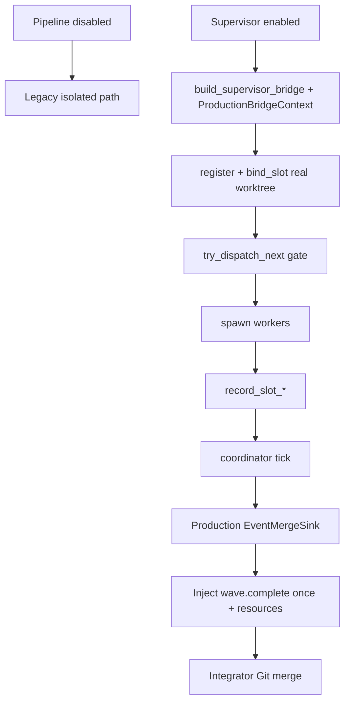

# Supervisor Worktree Dispatch Closure (Rebaseline) - Plan

## Goal Capsule

- Objective: 在 2026-07-22-003 计划部分落地后，基于**当前代码审计**重新闭合 `ce-executor-supervisor` 生产链路：真实 per-slot worktree、store 批准/反压、结果登记、生产 ledger fan-in、协调事件、恢复与终态，并保证 pipeline 零行为变化。
- Authority: 本计划 Product Contract、仓库 HARD RULE、以及下方「基线审计结论」；与旧计划冲突时以**当前代码证据**与本计划为准。旧计划 `docs/plans/2026-07-22-003-fix-supervisor-worktree-dispatch-plan.md` 视为 superseded，不再作为执行清单。
- Execution profile: 严格 `U1 → U2 → … → U10`；每个 Unit 独立完成验收测试、Red、最小实现、Refactor、targeted regression 后才能进入下一 Unit。单个 Unit 必须可由一个 executor subagent 安全闭合；禁止把「跨 crate 表面 + spawn 门控 + permit/FIFO」或「record + production sink + U16」塞进同一 Unit。
- Stop when: Verification Contract 全部通过；生产路径可证明 Exec/Fix 绑定真实 worktree（不是测试专用构造器）；5-slot/cap-4 反压与唯一 `*.wave.complete` 在生产 dispatcher 路径可观察；pipeline 场景保持原行为。
- Tail ownership: U10 统一收口 agent/operator skills、zsh 注释、诊断报告与 CLI 文档漂移。

Product Contract preservation: 不改变 `ce-executor-pipeline` / `ce-executor-pipeline-loop` 产品契约；不吸收 `docs/plans/2026-07-22-001-feat-wave-protocol-suite-default-plan.md` 的默认 wave 重构范围。

---

## Baseline Audit（相对 2026-07-22-003）

> 审计基准：分支 `pittcat-dev`，相关提交 `28a49bbc`（旧 U1）/ `09903aa1`（旧 U2）/ `6b371d92`（旧 U3）/ `71f3926e`（旧 U4）/ `4fd752c2`（拆分文档）。审计日期 2026-07-23。

| 旧 Unit | 宣称完成 | 审计结论 | 证据摘要 |
| --- | --- | --- | --- |
| 旧 U1 pipeline 非干扰 | 已提交 | **通过（保留为回归门禁）** | `wave_supervisor.rs` 有 `bridge_build_invocations` 计数与 disabled 无 `supervisor.db` 断言；pipeline YAML 未改 |
| 旧 U2 默认 supervisor-db + 路径 | 已提交 | **基本通过，有文档/注释残留** | `crates/ralph-cli/Cargo.toml` `default = ["supervisor-db"]`；无 feature fail-closed；`resolve_supervisor_db_path` 避免双 `.ralph`；但 `scripts/ralph-zsh-plugin.zsh` 仍写「Requires `--features supervisor-db`」 |
| 旧 U3 wave consumer concurrency lint | 已提交 | **通过** | `FINDING_SUPERVISOR_WAVE_CONSUMER_LOW_CONCURRENCY`；builtin `worker` / `review-batch-worker` / `fix-worker` 均 `concurrency: 4`；lint 正负例齐全 |
| 旧 U4 生产 bind_slot | 已提交 | **假绿 / 未真正解决问题（本计划 U1 必修）** | `bind_slot` 实现与 `with_context_and_factory` 测试存在，但生产 `build_supervisor_bridge` 仍调用 `from_store`（`context: None`）→ 热路径对 Exec/Fix 返回 `Ok(None)`；dispatcher 把 `None` 当 SharedReadonly 继续 spawn（`cwd: None` = 主工作区）。注释写明 `// wired by the runner in a follow-up unit (U5).` |
| 旧 U5–U13 | 未做 | **全部未闭合** | `SupervisorBridge` 无 `try_dispatch_next` / `max_concurrent_workers`；dispatcher 从不 `record_slot_*` / `tick`；生产 fan-in 仍走 `merge_wave_results_to_events_file`；`run_supervisor_fan_in` 仅出现在注释；真实 fan-in 仅 BDD helper `run_bdd_supervisor_fan_in`；coordinator 一律 `with_in_memory_sink`；U16 无 virtual supervisor 特判；startup recover 已有调用但缺生产闭环证据 |

### 假绿根因（必须写进新 U1）

```text
runner.build_supervisor_bridge
  → CoordinatorSupervisorBridge::from_store(store)   # context = None
  → bind_slot(Exec|Fix) → Ok(None)                   # 测试专用路径才有 context
  → execute_wave_via_supervisor 仍 push WorkerRequest{ cwd: None }
  → worker 在主 workspace 执行                        # 与 R7/R8 目标相反
```

测试用 `production_bridge_with_factory` → `with_context_and_factory` 证明了**能力存在**，但**未证明 runner 生产接线**。这正是旧计划 KTD-9 要禁止的假阳性形态。

### 可复用资产（不要重写）

- `crates/ralph-core/src/supervisor/{mod,memory,rusqlite,worktree_bind,coordinator,recover}.rs` 的 store / binding / tick / recover API
- `CoordinatorSupervisorBridge::{with_context_and_factory, bind_slot, record_slot_*}` 实现体
- U1–U3 既有 characterization / lint / feature 测试
- BDD `run_bdd_supervisor_fan_in` —— **仅作组件场景，禁止当生产 E2E 完成证据**

---

## Product Contract

### 1. 功能目标

#### 业务目标

- 让 `event_loop.supervisor.enabled: true` 成为默认可依赖能力：默认 CLI 带 SQLite，生产路径真实执行 per-slot worktree、全局反压、结果登记与 fan-in。
- 消除「单测/helper 绿、生产 bridge 空转」假阳性，建立 Outside-In 证据链到 Git worktree、主 ledger 与终态事件。
- 保证未启用 supervisor 的 pipeline / pipeline-loop 零行为变化。

#### 本次范围

- **闭合旧 U4 生产接线缺口**：`build_supervisor_bridge` 必须注入 `ProductionBridgeContext`；Exec/Fix 的 `Ok(None)` 在 supervisor 路径 fail-closed。
- 暴露并使用 bridge 层 `max_concurrent_workers` + `try_dispatch_next`；dispatcher 仅在 store 批准后 spawn；permit 释放与跨 wave FIFO。
- 生产路径登记 `record_slot_*`，经生产 `EventMergeSink` 合并业务事件，唯一注入 `*.wave.complete` / `*.wave.failed`（含 branch/worktree payload）。
- 虚拟 `supervisor` consumer 的 U16 特判；rusqlite crash/restart 证据；少量关键 mock E2E。
- 同步 skills / zsh 注释 / 诊断报告 / CLAUDE↔AGENTS。

#### 非目标

- 不改 `presets/en/ce-executor-pipeline.yml` 或 pipeline-loop 拓扑/instructions/schema。
- 不把未启用 supervisor 的 loop 改成 wave/supervisor，也不让其创建 `supervisor.db` / slot worktree。
- 不实现默认 wave「协议六件套」吸收（见 2026-07-22-001）。
- 不新增 builtin preset；不引入跨 loop 全局 worker pool 或远程 DB。
- 不用 live LLM/API 做 CI 验收。

#### 已知约束和假设

- 测试入口：`cargo nextest run` / `./scripts/run-tests.sh`；禁止裸 `cargo test -p ralph-cli`。
- spawn `ralph` 的测试必须 scrub agent-context env（HARD RULE 5）。
- `SupervisorStore` 是 wave/slot 状态 SSOT；禁止旁路 JSON 状态。
- 生产 binding 复用 `worktree_bind` + 现有 `crate::worktree`，不复制 Git 实现。
- `run_bdd_supervisor_fan_in` 与 `MockSupervisorBridge` 不能充当关键生产完成证据。

### Requirements

- R1. `supervisor.enabled: false` 不构建 bridge、不创建 supervisor DB/slot worktree、不改变 pipeline 事件/终态。
- R2. 默认构建含 `supervisor-db`；启用 supervisor 时使用 `RusqliteSupervisorStore`；路径为 `<workspace>/.ralph/supervisor.db`（无双 `.ralph`）。
- R3. 无 `supervisor-db` 的构建对 `enabled: true` 在 worker 前 fail-closed；`enabled: false` 仍可运行。
- R4. supervisor wave consumer 必须 `concurrency > 1`；builtin 三类 consumer 为 `concurrency: 4`（已落地，本计划只作回归）。
- R5. **生产** `build_supervisor_bridge` 注入 loop context；Exec/Fix 每个 slot 获得唯一 worktree/branch/cwd/`RALPH_WAVE_*`；Review 为 SharedReadonly。
- R6. Exec/Fix 在 bind 失败或缺少 binding（`None`）时 fail-closed，不得在主 workspace 无隔离 spawn。
- R7. `try_dispatch_next(max_concurrent_workers)` 决定全局启动资格；有效并发 `min(hat.concurrency, max_concurrent_workers)`；跨 wave FIFO。
- R8. worker 终态后登记 store（成功 hash/count，失败 reason）；重复登记幂等。
- R9. fan-in：生产 sink 按 slot index 去重写入主 ledger → 标记 merged → 唯一注入协调 topic；payload 含稳定排序的成功 slot `branch`/`worktree_path`；sink 失败不标 merged、不发 complete。
- R10. 虚拟 `supervisor` 不产生 `task.resume.misrouted`；普通 hat U16 不变。
- R11. crash/restart 从 SQLite 恢复：不重跑 completed、不重复注入已完成协调事件、pending 续调度。
- R12. 关键主路径：临时 Git + fake backend 证明 5 slots/cap 4/独立 worktree/fan-in/`work.done`/`LOOP_COMPLETE`。
- R13. 文档/skills/zsh/诊断与最终行为一致；`CLAUDE.md`/`AGENTS.md` 字节一致。

### Actors

- A1. Pipeline operator
- A2. Supervisor operator（默认安装即具备 DB）
- A3. Dispatcher hat（单次 batch emit 完整 wave）
- A4. Slot worker（独立 worktree 或 review shared-readonly）
- A5. Supervisor runtime（store/queue/fan-in/协调 topic SSOT）
- A6. Integrator（消费 wave 级 payload 做 Git merge）

### 2. BDD 行为规格

```gherkin
Feature: Supervisor 生产路径真实并行且不影响 pipeline

  Scenario: 未启用 supervisor 的 pipeline 保持原行为
    Given builtin ce-executor-pipeline 且 supervisor.enabled 为 false
    When loop 走完既有 happy/blocked 路径
    Then 不构建 supervisor bridge
    And 不创建 supervisor.db 或 slot worktree
    And 事件拓扑与终态与基线一致

  Scenario: 默认构建具备 SQLite supervisor 且路径唯一
    Given 默认 Cargo features 构建 ralph-cli
    When 启动 supervisor.enabled 为 true 的 isolated preset
    Then 使用 RusqliteSupervisorStore
    And DB 位于 workspace/.ralph/supervisor.db
    And 无 feature-off fallback warning

  Scenario: 无 supervisor-db 构建拒绝 supervisor preset
    Given no-default-features 且无 supervisor-db
    When 启动 supervisor.enabled 为 true
    Then 在任何 worker/worktree 前失败并指出缺少 supervisor-db
    But enabled 为 false 的 pipeline 仍可运行

  Scenario: 生产 runner 为 Exec/Fix 绑定真实 worktree
    Given supervisor.enabled 为 true 且通过 ralph run / loop_runner 构建 bridge
    When dispatcher 处理含两个 exec.unit.ready 的 wave
    Then 每个 slot 的 cwd/branch/worktree_path 非空且互异
    And 主 workspace 在 integrator merge 前不含 slot 写入

  Scenario: Exec/Fix 缺少 binding 或 bind 失败时 fail-closed
    Given 生产 bridge context 缺失或 factory 失败
    When 尝试绑定 Exec 或 Fix slot
    Then 该 slot 不进入 ProductionExecutor
    And WorkerRequest.cwd 不会静默指向主 workspace

  Scenario: 五个 exec slots 受全局 cap 约束
    Given hat.concurrency=4 且 max_concurrent_workers=4
    And dispatcher 一次收到五个 exec.unit.ready
    When supervisor 执行该 wave
    Then 同时运行不超过 4
    And 第五个在前四个之一结束后按 FIFO 启动

  Scenario: slot 结果驱动唯一 fan-in 协调事件
    Given 全部 slots 已 terminal 且事件批次已保留
    When coordinator tick 成功
    Then 主 ledger 含按 slot index 排序的去重业务事件
    And 只注入一次 exec.wave.complete
    And payload 含成功 slot 的 branch 与 worktree_path
    And 不产生 consumer=supervisor 的 task.resume.misrouted

  Scenario: 重复 slot 结果幂等
    Given 某 slot 已 completed
    When 相同结果再次到达
    Then completed_count 不增加
    And 不重复 merge / 不重复 wave.complete

  Scenario: ledger 写失败可恢复
    Given 全部 slots terminal 但生产 sink 首次写入失败
    When tick
    Then merged_to_events 仍为 false 且不注入 complete
    When 重试写入成功
    Then 业务事件与 wave.complete 均只出现一次

  Scenario: 崩溃恢复继续未完成 wave
    Given SQLite 中五 slot wave：2 completed、2 dispatched、1 pending
    When 进程重启并 recover
    Then completed 不双 spawn
    And pending 受全局 cap 续调度
    And 协调事件最多一次

  Scenario: 完整 supervisor 主路径闭环
    Given fake backend + 临时 Git 仓库
    When builtin ce-executor-supervisor 跑到结束
    Then exec/review/fix wave 均经 store 与生产 dispatcher
    And 出现对应 wave.complete、work.done、LOOP_COMPLETE
    And 不以 loop_stale 结束
```

### 3. 验收与测试策略

| Scenario | 验收条件 | 推荐测试层级 | 是否需要 E2E |
| --- | --- | --- | --- |
| Pipeline 零影响 | 无 bridge/db/worktree；事件基线不变 | characterization + BDD | 否 |
| 默认 SQLite + 路径 | default feature；单段 `.ralph` | Cargo contract + CLI integration | install smoke 可选 |
| 无 feature fail-closed | 启动前报错 | feature-matrix integration | 否 |
| 生产 runner 真实 binding | `build_supervisor_bridge` 产出的 bridge 对 Exec 返回 Some | CLI integration（禁测试专用构造器冒充） | 否（U1） |
| bind 失败 / 缺 binding fail-closed | 不 spawn；无主目录写入 | fault-injection integration | 否 |
| 5/cap4/FIFO | max in-flight≤4；FIFO | concurrency integration + barrier | 是（纳入关键路径） |
| 唯一 fan-in | complete once；payload 可合并 | state-machine + EventLoop integration | 是 |
| 幂等 / sink 失败恢复 | 计数与事件 exactly-once | store unit + fault injection | 否 |
| crash/restart | reopen DB 连续 | rusqlite recovery integration | restart smoke |
| 完整主路径 | 终态成功 | mock/replay E2E | 是，仅 1 条关键 |

### 4. 需求—测试追踪矩阵

| 需求 | Scenario | 验收测试 | 单元测试 | 集成/契约 | E2E |
| --- | --- | --- | --- | --- | --- |
| R1 | Pipeline 零影响 | 既有 U1 门禁复跑 | gate predicate | scenarios `ce_executor_pipeline*` | 不需要 |
| R2–R3 | 默认 SQLite / fail-closed | 既有 feature/path 测 + 残留文档 | path resolver | feature matrix | install smoke |
| R4 | concurrency lint | 既有 lint/preset 测 | topic→consumer | preset_lint + presets | 不需要 |
| R5–R6 | 生产 binding | **新建：经 `build_supervisor_bridge` 的 binding** | context 必备断言 | temp Git + runner 接线 | U9 覆盖 |
| R7 | 全局反压 | barrier 5/4 + FIFO | store try_dispatch | U2–U4 dispatcher | U9 |
| R8–R9 | record + sink | store 状态 + ledger/complete | record 幂等；sink 状态机 | EventLoop 最小拓扑 | U9 |
| R10 | U16 | 正反配对 | consumer predicate | handoff nextest | 不需要 |
| R11 | 恢复 | reopen 续跑 | recovery 迁移 | rusqlite reopen | restart smoke |
| R12 | 主路径 | required events + 终态 | 最小必要 | BDD supervisor | U9 |
| R13 | 文档 | drift/fixture | CLAUDE/AGENTS cmp | U10 | 不需要 |

---

## Planning Contract

### Key Technical Decisions

- KTD-1. Pipeline 对照组不可触碰；一切新逻辑门控在 `supervisor.enabled && isolated`。
- KTD-2. **生产接线优先于能力演示**：凡声明「生产 bind/dispatch/fan-in 完成」的验收，必须经 `build_supervisor_bridge` / `execute_wave_via_supervisor` / runner 路径；禁止仅用 `with_context_and_factory` 或 `run_bdd_supervisor_fan_in` 作为完成证据。
- KTD-3. `build_supervisor_bridge` 必须调用 `with_context_and_factory`（或等价注入 `ProductionBridgeContext` + factory），不得再对生产路径使用无 context 的 `from_store`。
- KTD-4. Exec/Fix 在 supervisor 路径上 `Ok(None)` 视为契约违反 → fail-closed（与 Review 的合法 `None` 区分）。
- KTD-5. `SupervisorStore::try_dispatch_next` 为全局许可 SSOT；hat concurrency 只约束单 wave 本地请求构造，有效上限取 min。
- KTD-6. 生产 coordinator 不得使用 `InMemoryMergeSink` 充当主 ledger；sink 成功后才 `merged_to_events` 与注入协调事件。
- KTD-7. 虚拟 supervisor 是 runtime consumer，不是 HatRegistry agent hat。
- KTD-8. 旧计划 U5–U13 的拆分原则保留：单层接线、窄验收、禁止顺手吞下一层。

### High-Level Technical Design



### Outside-In Discovery Order

1. 先证明生产 runner 真正绑定 worktree（修假绿）。
2. 再证明全局批准与反压。
3. 再证明 store 登记与生产 sink/协调事件。
4. 再证明 U16 与 recover。
5. 最后少量 E2E + 文档。

### Risks and Mitigations

| 风险 | 影响 | 缓解 |
| --- | --- | --- |
| 继续用测试构造器冒充生产 | 假绿复发 | U1 验收强制调用 `build_supervisor_bridge` |
| Exec `Ok(None)` 被当 SharedReadonly | 主目录污染 | U1 显式 fail-closed 分支 |
| 并发测用 sleep | flake | barrier/channel；禁止断言侧裸 sleep |
| E2E 用 BDD helper | 假绿 | U9 禁止 `run_bdd_supervisor_fan_in` |
| 单 Unit 过大 | 整包回滚 | 保持 U2–U6 单层拆分 |

---

## Implementation Units

### 5. 严格串行开发单元

> 执行顺序：`U1 → U2 → U3 → U4 → U5 → U6 → U7 → U8 → U9 → U10`。
> 每个 Unit 必须走完：验收测试 → Red（正确原因）→ 最小单测 Red/Green/Refactor → 集成 → 回归 → 完成标准 → 下一 Unit。
> 禁止削弱断言、skip、`.only`、无解释改 golden、mock 掉被测行为、只跑局部就宣称完成。

### U1. 闭合生产 worktree binding 接线（旧 U4 假绿修复）

- **Unit 目标:** 让 `build_supervisor_bridge` 产出的生产 bridge 真正带 `ProductionBridgeContext`；Exec/Fix 获得唯一 worktree；缺 binding / bind 失败 fail-closed，禁止主 workspace 静默执行。
- **对应 Scenario:** 生产 runner 为 Exec/Fix 绑定真实 worktree；Exec/Fix 缺少 binding 或 bind 失败时 fail-closed。
- **外部可观察结果:** 经 runner 构建的 bridge 对 Exec/Fix 返回 `Some(SlotBinding)`；Review 仍 `None`；失败 slot 不进入 `ProductionExecutor`。
- **输入与输出:** 输入 `SupervisorConfig` + `LoopContext`；输出带 context 的 `CoordinatorSupervisorBridge` 与 dispatcher fail-closed 行为。
- **可依赖的已完成能力:** 旧 U1–U3；已有 `with_context_and_factory` / `bind_slot` 实现体；`fail_closed_on_bind_error`。
- **明确禁止依赖的未来能力:** 不实现 `try_dispatch_next` 接线、record、tick、sink、E2E。
- **Files:** `crates/ralph-cli/src/loop_runner/runner.rs`、`crates/ralph-cli/src/loop_runner/wave/supervisor_bridge.rs`、`crates/ralph-cli/src/loop_runner/wave/dispatcher.rs`、`crates/ralph-cli/src/loop_runner/tests/wave_supervisor.rs`。
- **验收测试:**
  1. 调用 `build_supervisor_bridge`（非 `with_context_and_factory`）后对 Exec 两 slot 得到互异 path/branch。
  2. 生产路径对 Exec `Ok(None)`（或强制去掉 context 的负例）不得 spawn。
  3. factory 失败 → Err → 不写主 workspace。
- **需要拆分的单元测试:** context 缺失时 Exec/Fix 策略；Review 仍 None；branch 命名与 env 键。
- **Red 预期失败原因:** 当前 `build_supervisor_bridge` 走 `from_store`，Exec 得 `None` 且仍可被加入 `worker_requests`。
- **最小实现范围:** runner 注入 context+factory；dispatcher 对 Exec/Fix 的 `None` fail-closed；删除/改写「生产 Ok(None) 合法」的错误预期。
- **集成验证:** `cargo nextest run -p ralph-cli --bin ralph -- wave_supervisor`。
- **回归范围:** 旧 U1 pipeline 门禁；旧 U2 path/feature；Review SharedReadonly；legacy WaveTracker。
- **完成标准:** 生产路径不再依赖无 context 的 `from_store`；测试证明经 `build_supervisor_bridge` 的 binding；无跳过测试。
- **风险与注意事项:** 所有 Git 操作必须在 temp repo；清理 worktree/branch；`store()` 若仅供 recover，保持可见性最小。

### U2. 暴露 bridge 层全局 dispatch 批准表面

- **Unit 目标:** `SupervisorBridge` 可读 `max_concurrent_workers` 并转发 `try_dispatch_next`；生产 bridge 持有配置 cap。
- **对应 Scenario / 需求:** R7 接口前置。
- **外部可观察结果:** bridge 返回 cap；`try_dispatch_next` 转发 store 的 `Some`/`None`；legacy/mock 可编译。
- **输入与输出:** 已注册 pending slots 的 store + cap；输出 trait 契约与单测。
- **可依赖的已完成能力:** U1；既有 store `try_dispatch_next`。
- **明确禁止依赖的未来能力:** **禁止**改 dispatcher spawn/JoinSet；禁止 cap4/FIFO 全套；禁止 record/tick。
- **Files:** `crates/ralph-core/src/supervisor/bridge.rs`、`crates/ralph-cli/src/loop_runner/wave/supervisor_bridge.rs`、`crates/ralph-cli/src/loop_runner/runner.rs`（仅 cap 注入）；**不得**为顺手改 `dispatcher.rs` 热路径。
- **验收测试:** 转发 Some/None；cap 可读；default 实现不破坏 mock。
- **需要拆分的单元测试:** trait default vs production override；store error → BridgeError。
- **Red 预期失败原因:** trait 无这些方法；生产 bridge 未持有/未转发 cap。
- **最小实现范围:** trait + 字段/转发；不改 store schema。
- **集成验证:** `cargo nextest run -p ralph-core -- supervisor`；`cargo nextest run -p ralph-cli --bin ralph -- wave_supervisor`。
- **回归范围:** mock bridge、BDD InMemory bridge、pipeline。
- **完成标准:** 表面可被单测调用；dispatcher 尚未依赖也可编译；无未声明生产行为变化。
- **风险与注意事项:** 若必须改 dispatcher 才能编译，停在 trait default（`None` / `u32::MAX`）留给 U3。

### U3. Dispatcher 仅在 store 批准后 spawn

- **Unit 目标:** supervisor 路径每个 slot 先 `try_dispatch_next`，仅匹配 `(wave_id, slot_index)` 才 spawn。
- **对应 Scenario / 需求:** R7 spawn 门控半段。
- **外部可观察结果:** 未获批不调 ProductionExecutor；获批可追溯到一次批准；本地有效上限 `min(hat, bridge.cap)`。
- **输入与输出:** U2 API + 已 bind 的 requests → 仅批准集合。
- **可依赖的已完成能力:** U1–U2。
- **明确禁止依赖的未来能力:** 禁止跨 wave FIFO 全套 barrier（U4）；禁止 record/tick/sink。
- **Files:** 主改 `crates/ralph-cli/src/loop_runner/wave/dispatcher.rs`。
- **验收测试:** store 返回 None → 不 spawn；匹配 pair → 恰好 spawn；不匹配不吞错。
- **需要拆分的单元测试:** min(hat, global)；wave/slot 不匹配。
- **Red 预期失败原因:** 生产仍只按 hat 本地 semaphore spawn，从不调用 `try_dispatch_next`。
- **最小实现范围:** register/bind 之后插入批准门控；不重写 JoinSet 骨架。
- **集成验证:** targeted dispatcher + wave_supervisor。
- **回归范围:** timeout/partial/legacy/pipeline。
- **完成标准:** 每个成功 spawn ≥ 一次 store 批准；无「只打日志的 max_concurrent_workers」。
- **风险与注意事项:** 禁止测试侧裸 sleep；完整 cap 释放留 U4。

### U4. Permit 释放与跨 wave FIFO / cap 验收闭合

- **Unit 目标:** worker 终态后释放 in-flight，使 pending 可再批准；barrier 证明 cap 与 FIFO。
- **对应 Scenario:** 五个 exec slots 受全局 cap 约束。
- **外部可观察结果:** cap=4 最大同时 4；第五个在释放后启动；两 wave FIFO；取消/失败同样释放。
- **输入与输出:** U3 门控路径 → barrier 记录的 max in-flight 与顺序。
- **可依赖的已完成能力:** U1–U3；memory/rusqlite 状态机。
- **明确禁止依赖的未来能力:** 不要求 fan-in/sink/U16/E2E。
- **Files:** `dispatcher.rs` 终态/释放最小补丁；memory/rusqlite differential 与 barrier 测试。
- **验收测试:** 5-slot cap4；两 wave FIFO；cap=1；失败/取消释放；memory↔rusqlite 差分。
- **需要拆分的单元测试:** terminal 后容量回升；重复释放幂等。
- **Red 预期失败原因:** 门控后容量不回升 → 第五个永久 pending；或仅 store 单测无生产 barrier。
- **最小实现范围:** 接线已有状态迁移；不引入 sleep 判并发。
- **集成验证:** supervisor protocol + dispatcher barrier nextest。
- **回归范围:** U2/U3、timeout、pipeline。
- **完成标准:** R7 外部可观察结果由生产 dispatcher+store 证明。
- **风险与注意事项:** 用 channel/barrier，不用时间断言。

### U5. 登记 slot 成功/失败到 SupervisorStore

- **Unit 目标:** worker join 后调用 `record_slot_result` / `record_slot_failure`；保留事件批次/hash 或 reason；幂等。
- **对应 Scenario / 需求:** R8。
- **外部可观察结果:** `completed_count`/failed 正确；重复 record 不增计数。
- **输入与输出:** structured worker outcome → store terminal（尚不要求 ledger/complete）。
- **可依赖的已完成能力:** U1–U4。
- **明确禁止依赖的未来能力:** 禁止 production sink、禁止注入 wave.complete、禁止 U16、禁止 Git merge。
- **Files:** `dispatcher.rs` outcome→record；相关测试。不改 `event_loop` handoff。
- **验收测试:** N 成功 → count=N；含失败 → failed+reason；重复幂等；批次可测。
- **需要拆分的单元测试:** outcome→record 映射；空/非空事件。
- **Red 预期失败原因:** 生产 dispatcher 从不调用 `record_slot_*`，完成后仍只走 `merge_wave_results_to_events_file`。
- **最小实现范围:** 在 structured outcome 边界登记；不重写 coordinator tick。
- **集成验证:** dispatcher/store nextest。
- **回归范围:** U3/U4、legacy merge 不得被误关。
- **完成标准:** 每个 terminal slot 在 store 可查且幂等；可不存在生产 wave.complete。
- **风险与注意事项:** 不要为「看起来完整」调用 tick/inject。

### U6. 生产 ledger sink 与唯一协调事件（含资源 payload）

- **Unit 目标:** fan-in 经生产 sink 按 slot index 合并业务事件到主 ledger，再唯一注入 `*.wave.complete`/`*.wave.failed`；payload 含成功 slot branch/path。
- **对应 Scenario:** slot 结果驱动唯一 fan-in；ledger 写失败可恢复；重复结果幂等（merge 侧）。
- **外部可观察结果:** 主 ledger 非空去重事件；complete once；`from_store`/生产路径不再用 InMemoryMergeSink 冒充主 ledger。
- **输入与输出:** U5 terminal store + 保留事件 → sink 写入 + system-injected 协调事件。
- **可依赖的已完成能力:** U1–U5；`SupervisorCoordinator::tick`；U1 slot resources。
- **明确禁止依赖的未来能力:** 禁止改 U16（U7）；禁止完整 16-hat E2E（U9）；禁止本 Unit 执行 Git merge。
- **Files:** `supervisor_bridge.rs`、`coordinator.rs`（若需）、`dispatcher.rs` tick 边界、必要 EventLoop 测试。
- **验收测试:** N/N → 排序写入 + 单次 complete + payload；全 terminal 含失败 → 契约 complete/failed；重复 tick 幂等；sink 首次失败不 merged/不 complete，重试 exactly-once。
- **需要拆分的单元测试:** 排序/去重；payload 字段；sink 失败状态机；injection dedup。
- **Red 预期失败原因:** 生产仍只 legacy merge；coordinator 交空 Vec；InMemoryMergeSink；无 worktree 资源字段。
- **最小实现范围:** 接生产 sink + tick + payload；实现真正的生产 `run_supervisor_fan_in`（或等价命名）并在 `handle_wave_events` Completed 臂调用——**删除「仅注释承诺」**。
- **集成验证:** dispatcher/coordinator nextest；真实 EventLoop 断言 events（禁止只数 iterations）。
- **回归范围:** origin guard、协调 topic agent 拒收、legacy wave、pipeline。
- **完成标准:** 生产路径无空 batch / 无 in-memory 冒充主 ledger；integrator 仅凭 payload 可列待合并 branch。
- **风险与注意事项:** 顺序固定为 store terminal → sink append → merged_to_events → 协调事件。

### U7. 虚拟 supervisor 的 U16 handoff 特判

- **Unit 目标:** 虚拟 `supervisor` 为内部 consumer；合法 `*.unit.done` 不报 `task.resume.misrouted`；普通 hat 不变。
- **对应 Scenario / 需求:** R10。
- **外部可观察结果:** virtual 正例无 misrouted；缺 trigger 的普通 hat 仍报 U16。
- **输入与输出:** handoff/consumer 判定 → 正反配对诊断。
- **可依赖的已完成能力:** U1–U6（至少有真实 unit.done 流入，可用最小 fixture）。
- **明确禁止依赖的未来能力:** 不放宽普通 hat ACL；不做 E2E 大扫除。
- **Files:** `crates/ralph-core/src/event_loop/mod.rs`（或既有 handoff 模块）、handoff 测试。
- **验收测试:** virtual 正例 + 普通 hat 反例成对。
- **需要拆分的单元测试:** consumer predicate 正反例。
- **Red 预期失败原因:** 把 supervisor 当 HatRegistry 普通 hat 查 triggers。
- **最小实现范围:** 窄特判；不重构整个 U16。
- **集成验证:** handoff/misrouted nextest。
- **回归范围:** 普通 hat U16、task.resume、pipeline。
- **完成标准:** R10 正反例全绿。
- **风险与注意事项:** 按「虚拟 consumer」语义集中判定，避免散落硬编码。

### U8. 真实 rusqlite crash/restart 恢复证据

- **Unit 目标:** 进程中断后从 SQLite 恢复：不重跑 completed、不重复注入已完成协调事件、pending 续调度。
- **对应 Scenario / 需求:** R11。
- **外部可观察结果:** reopen DB 状态连续；complete once。
- **输入与输出:** 中断前 rusqlite 状态 → 恢复后调度/注入。
- **可依赖的已完成能力:** U1–U7；runner 已有 `recover_active_waves_at_startup` 调用点。
- **明确禁止依赖的未来能力:** 不要求完整 16-hat E2E（U9）。
- **Files:** recovery/reopen 测试与必要最小补丁。
- **验收测试:** partial completed 中断；重启只跑剩余；已注入协调事件不重复。
- **需要拆分的单元测试:** recovery 迁移；idempotent inject 键。
- **Red 预期失败原因:** 恢复未与 U3–U6 生产路径闭合，或重启双 dispatch/双 inject。
- **最小实现范围:** 闭合已有 recover API 与生产路径；不大改架构。
- **集成验证:** rusqlite recovery nextest；必要时进程级 smoke。
- **回归范围:** U4 FIFO/cap、U6 exactly-once、pipeline。
- **完成标准:** R11 由真实 DB 文件证据证明，非内存冒充。
- **风险与注意事项:** 临时目录 DB；测后清理；禁止依赖开发仓 `.ralph/supervisor.db`。

### U9. 完整 supervisor 主路径 Outside-In E2E

- **Unit 目标:** 少量关键 E2E 证明 builtin supervisor 从 exec fan-out 到终态真实经过 dispatcher/SQLite/worktree/fan-in。
- **对应 Scenario:** 完整 supervisor 主路径闭环；R12。
- **外部可观察结果:** temp repo 受控 worktree + SQLite；协调事件与业务 handoff；`work.done` + `LOOP_COMPLETE`；无 `loop_stale`。
- **输入与输出:** builtin preset + fake backend + 5-unit plan → Git/events/DB/终态。
- **可依赖的已完成能力:** U1–U8 全部。
- **明确禁止依赖的未来能力:** 不依赖 U10 文档；**禁止** `run_bdd_supervisor_fan_in` 充当关键证明。
- **Files:** `ralph-cli` integration / `ralph-core/tests/scenarios/supervisor/*` / 必要 `ralph-e2e` mock fixture。
- **验收测试:** 5/cap4/worktree 唯一；事件进主 ledger；payload 驱动 integrator；review shared-readonly；关键 fault 出口；无泄漏 worktree/branch。细节边界仍以下层为准。
- **需要拆分的单元测试:** 本 Unit 不堆细碎单测；新缺口回退所属 Unit。
- **Red 预期失败原因:** 下层未闭合或仅 helper 场景绿。
- **最小实现范围:** 测试基础设施与 fixture；生产行为应由 U1–U8 完成。
- **集成验证:** `cargo nextest run -p ralph-core --test scenarios -- supervisor`；对应 cli integration；必要时 `cargo run -p ralph-e2e -- --mock`；HARD RULE 5 污染复跑。
- **回归范围:** supervisor + pipeline scenarios。
- **完成标准:** 关键 E2E 稳定绿且证据链完整。
- **风险与注意事项:** E2E 保持少量。

### U10. 同步文档 / skills / zsh / 诊断报告

- **Unit 目标:** 文档与最终生产行为一致；清除「需手工 `--features supervisor-db`」等过时说明；纠正诊断报告因果链。
- **对应 Scenario / 需求:** R13。
- **外部可观察结果:** finding rubric/fixtures 可查；commands 与 help 一致；zsh 注释不再要求手工 feature；报告 P0 按真实断点排序；`CLAUDE.md`/`AGENTS.md` 一致。
- **输入与输出:** U1–U9 最终行为 → 文档修订。
- **可依赖的已完成能力:** U1–U9。
- **明确禁止依赖的未来能力:** 不把计划编号/事故路径/内部函数写入通用注入 skill。
- **Files:** `crates/ralph-core/data/ralph-tools-wave.md`（若 agent 可见行为变）、`skills/ralph-preset-common/references/{agent-native-model,author-checklist,commands,finding-rubric,patterns}.md`、`skills/ralph-preset-{author,review}/SKILL.md` 与 fixtures、`.cursor/rules/{multi-hat-isolation,feature-flags}.mdc`、`scripts/ralph-zsh-plugin.zsh`、`CLAUDE.md`、`AGENTS.md`、`docs/report/2026-07-22-ce-executor-supervisor-primary-20260722-084810-diagnosis.md`。
- **验收测试:** operator negative fixture 缺 concurrency 报 finding；`scripts/check-cli-doc-drift.sh`；`cmp CLAUDE.md AGENTS.md`；zsh 注释与 default feature 一致。
- **需要拆分的单元测试:** 文档契约/drift；finding ID rubric parity。
- **Red 预期失败原因:** zsh/报告仍写手工 feature；报告仍按旧断点排序；checklist 未反映生产 binding 要求。
- **最小实现范围:** 只同步已实现行为；preset 名未变则不改补全值列表（只改注释）。
- **集成验证:** drift script；preset review fixture；skill 契约。
- **回归范围:** operator fixtures、preset lint/parity、U1 pipeline 门禁。
- **完成标准:** 无文档漂移；报告不再误导；未编辑 runtime 状态文件。
- **风险与注意事项:** 注入 skill 只写 agent 可执行下一步。

---

## Verification Contract

### Unit-level TDD Gate

1. 写或启用本 Unit 验收测试。
2. 确认因目标能力缺失而 Red（排除 fixture/环境误伤）。
3. 拆最小单元/状态机/契约测试。
4. 逐个 Red→Green→Refactor；不削弱断言、不 skip、不加 `.only`、不无解释改 snapshot。
5. 跑本 Unit 集成测试。
6. 跑 pipeline 非干扰门禁 + 所有已完成前置 Unit 回归。
7. 记录可观察证据并满足完成标准。
8. 才能进入下一 Unit。

### Risk-driven Test Selection

- Characterization: 每 Unit 复跑 pipeline 门禁；U1 强制生产路径 characterization。
- Contract: 旧 U2 feature/path；U10 CLI/skills。
- State-machine: U2–U4 dispatch；U5–U6 fan-in。
- Idempotency/Concurrency: U4 FIFO/cap；U5 重复 record；U6 complete once。
- Fault injection: U1 bind 失败；U6 sink 失败；U8 restart。
- Differential: memory↔rusqlite（U4/U6）。
- E2E: 仅 U9 关键路径。

### Required Commands and Gates

| Gate | Command | Timing | Pass condition |
| --- | --- | --- | --- |
| Pipeline characterization | `cargo nextest run -p ralph-core --test scenarios -- ce_executor_pipeline` | 每个 Unit | 全绿 |
| Supervisor targeted | `cargo nextest run -p ralph-cli --bin ralph -- wave_supervisor` | U1–U9 | 全绿 |
| Supervisor core | `cargo nextest run -p ralph-core -- supervisor` | U2–U9 | 全绿 |
| Preset lint CLI/core | `cargo nextest run -p ralph-cli --bin ralph -- preset_lint`；`cargo nextest run -p ralph-core -- preset_lint` | U10（及触及 preset 时） | 全绿 |
| Embedded presets | `cargo nextest run -p ralph-cli --bin ralph -- presets` | U10 | 全绿 |
| BDD supervisor | `cargo nextest run -p ralph-core --test scenarios -- supervisor` | U6–U9 | 真实 EventLoop 场景全绿 |
| Mock E2E | `cargo run -p ralph-e2e -- --mock`（若归属） | U9/最终 | 全绿 |
| Agent env 污染 | 带 `RALPH_CURRENT_HAT` 等跑相关 integration | U9 | scrub 后不变 |
| CLI doc drift | `scripts/check-cli-doc-drift.sh` | U10/最终 | 无新增 drift |
| Formatting | `cargo fmt --all -- --check` | 每个实现 Unit | 无 diff |
| Lint/build | `cargo clippy --all-targets --all-features -- -D warnings` + 默认 feature build | 最终 | 全绿 |
| Full baseline | `./scripts/run-tests.sh` | 最终 | nextest+doctest 全绿；仅竞态 flake 才允许 serial fallback |

### 6. 最终质量门禁

- 所有计划内 Scenario 通过；需求—测试矩阵无空白。
- 所有单元/状态机/契约/集成与少量关键 E2E 通过。
- **经 `build_supervisor_bridge` 的生产 binding 证据存在**（不得仅有测试构造器证据）。
- 真实 temp Git 证明 worktree 隔离、cap=4、FIFO、非空事件 fan-in、payload 驱动合并与 cleanup。
- pipeline/pipeline-loop 既有结构化场景通过，相关 preset 文件无修改。
- preset lint、schema parity、embedded presets、operator fixtures 通过。
- fmt、clippy、build、CLI doc drift、全量 `./scripts/run-tests.sh` 通过。
- 无新增失败/ignored/skipped；无 `.only`；无削弱断言；无用 mock/helper 绕过关键生产边界。
- 无遗留实验代码、临时 worktree/branch/DB/events。
- `CLAUDE.md` 与 `AGENTS.md` 完全一致。
- 未验证内容与剩余风险明确记录；任何 P0/P1 residual 阻止完成。

---

## Definition of Done

- U1–U10 严格串行各自闭合 TDD 与回归；无交替开发或后置测试债务。
- 旧 U4 假绿已消除：生产 runner 路径真实 per-slot worktree，Exec/Fix 不再主目录静默执行。
- 全局反压、结果幂等、生产 ledger fan-in、协调 topic、恢复与关键 E2E 由生产链路证明。
- pipeline 与所有未启用 supervisor 的行为保持不变。
- 文档/skills/zsh/诊断反映最终真实行为；过时「手工 feature」说明已清除。
- 工作树仅含本计划授权的持久改动。

---

## Appendix

### Sources

- `docs/plans/2026-07-22-003-fix-supervisor-worktree-dispatch-plan.md`（superseded；本计划 rebaseline）
- `docs/report/2026-07-22-ce-executor-supervisor-primary-20260722-084810-diagnosis.md`
- `docs/achieved/plan/2026-07-03-001-feat-supervisor-rusqlite-parallel-preset-plan.md`
- 代码证据：`crates/ralph-cli/src/loop_runner/runner.rs`（`build_supervisor_bridge` → `from_store`）、`crates/ralph-cli/src/loop_runner/wave/supervisor_bridge.rs`（`context: None` → `Ok(None)`）、`crates/ralph-cli/src/loop_runner/wave/dispatcher.rs`（无 `try_dispatch_next`/`record_slot_*`/`tick` 热路径调用）、`crates/ralph-core/tests/scenarios.rs`（`run_bdd_supervisor_fan_in`）

### Mapping: 旧计划 → 本计划

| 旧 Unit | 本计划 |
| --- | --- |
| 旧 U1–U3 | 回归门禁（每 Unit 复跑）；不重做 |
| 旧 U4 | **U1 重做生产接线**（能力保留，接线补齐） |
| 旧 U5 | U2 |
| 旧 U6 | U3 |
| 旧 U7 | U4 |
| 旧 U8 | U5 |
| 旧 U9 | U6 |
| 旧 U10 | U7 |
| 旧 U11 | U8 |
| 旧 U12 | U9 |
| 旧 U13 | U10（含 zsh/诊断残留） |
