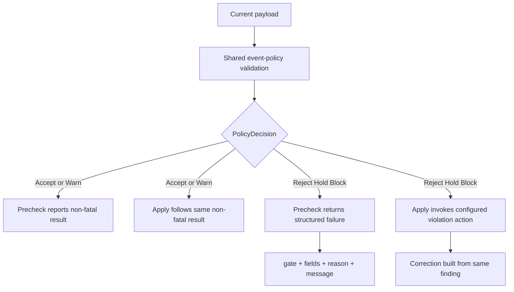
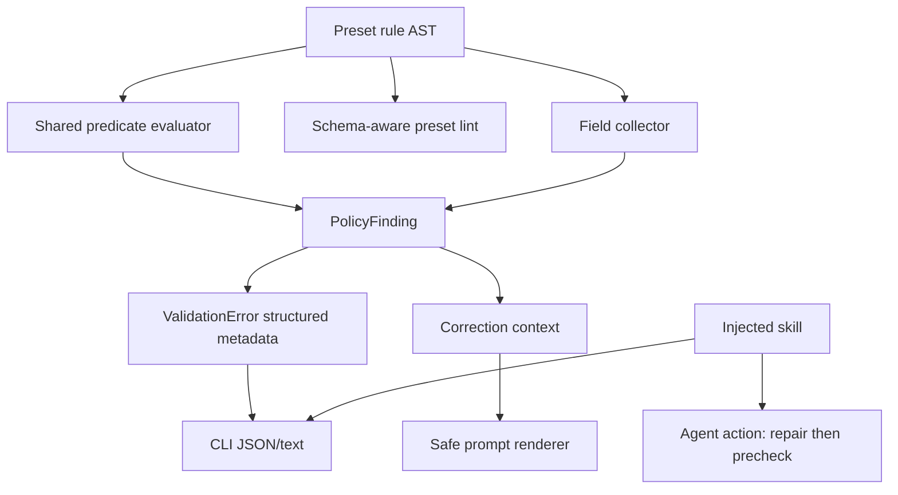
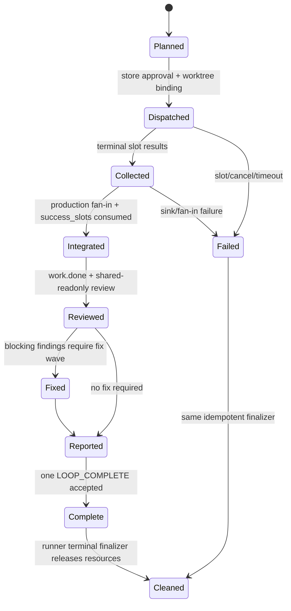

# 修复：闭合 payload consistency 与 supervisor 评审问题

## Goal Capsule

- **Objective:** 关闭 2026-07-23 严格 Review 发现的全部 P0/P1：恢复 payload consistency 的 Precheck/Apply 同源语义和可执行反馈，清理注入 skill 的错误与内部实现泄漏，并把 supervisor 主路径从 exec fan-in 真正验收到 `work.done`、`LOOP_COMPLETE` 和资源清理。
- **Authority:** 本计划高于两个 origin 计划的“已完成”声明；若旧计划文字与当前源码或本计划验收冲突，以当前源码、本计划 Product Contract 和结构化测试为准。
- **Execution profile:** 风险驱动、先刻画后修复；payload policy 公共接口、agent 注入文档和 supervisor 生产链均按 P0 路径处理。
- **Stop conditions:** 不以测试全绿替代缺失断言；不通过解析自由文本恢复结构化字段；不把 runtime 内部 ledger、类型名或 retry 实现写入注入 skill；不削弱 supervisor happy-path 让失败退出、失败 slot 或中间 phase 冒充成功。
- **Product Contract preservation:** 本计划不改变两个 origin 计划的产品目标，只修复其实现和验收与已声明合同不一致之处。

---

## Product Contract

### Summary

本修复把两个被 merge 后误判为完成的计划重新闭合。Payload consistency 必须与现有 `event_policy` 决策模型一致，向 agent 返回可以直接行动的结构化反馈；supervisor 必须由真实生产链证明完整终态，而不是用只到 exec fan-in 的局部绿色替代全链闭环。

### Problem Frame

当前 payload consistency 在 CLI Precheck 与 runtime Apply 对 `Warn` 的处理不同，同一 payload 可能预检失败却正式写入。`ValidationError` 又把 gate ID 塞进 `field`，而注入 skill 声称存在独立 `gate` 和真实业务字段，并给出了错误 DSL 形状、具体 builtin 路径和内部恢复实现。Agent 按文档操作时无法可靠修复 payload。

Supervisor closure 的现有 Outside-In 测试只证明 exec wave、SQLite、worktree 和 fan-in；它接受非零退出、失败或取消 slot，以及非最终 wave phase，也没有断言 integrator、review/fix 路由、`work.done`、`LOOP_COMPLETE`、`loop_stale` 和 cleanup。该测试不能支撑 origin 计划 U9/Definition of Done 的“完整主路径”声明。

### Requirements

#### Payload policy and feedback

- R1. `ralph emit --policy-check`、`ralph wave emit/verify` 与 EventLoop Apply 必须消费同一个 `PolicyDecision` 语义；`Observe`/`Warn` 不得只在 CLI 被私自升级。各入口必须返回同一结构化 disposition（decision/action、是否允许写入、required action 与 retry/stop signal）；Precheck 不模拟 Apply 独有的 Hold/Block 状态转换副作用。
- R2. Payload consistency 拒收反馈必须分别提供稳定 gate ID、稳定 reason code、规则引用的业务字段集合和人类可读 message；`field` 不得再承载 gate ID，agent 不得靠解析 message 定位字段。本轮不将静态 `referenced_fields` 伪称为求值时的 `matched_fields`。
- R3. 单谓词、嵌套 `all`/`any`、类型不匹配、未知操作符和非 object `when` 的 runtime/lint 语义必须同源；任一新增反馈元数据不得建立第二套谓词解释器。
- R4. `presets/en/ce-executor-pipeline.yml` 与 loop 变体的两条真实规则必须继续拒绝矛盾 payload，同时接受合法 applied、partial、blocked 和 empty-plan payload；本计划不增加新的业务规则。

#### Agent-visible guidance and safety

- R5. `crates/ralph-core/data/ralph-tools*.md` 只能描述触发条件、公开命令、公开返回字段、agent 动作和停止条件；不得包含具体 preset/plan/U-ID、内部 Rust 类型、内部 ledger、内部 retry key 算法或未解释的 runtime 术语。
- R6. 注入 skill 中的 payload consistency DSL、CLI 参数和错误 JSON 字段必须与 clap/config/serialization 真实定义一致，并由静态 drift 检查或结构化契约测试保护。
- R7. 同类拒收次数和终止判断由 runtime correction 明确信号拥有；skill 只要求 agent 遵循公开 correction，不预测内部 signature 或自行计数。
- R8. Preset author/review/bootstrap 操作规程必须覆盖 payload consistency 的声明、schema 字段来源、lint finding、OPAC/`execution_contracts` 分工，以及 supervisor 的生产 binding、全局 cap、fan-in、恢复和完整终态证据。
- R9. `rule.message` 是不可信诊断数据，不是 agent 指令。它进入 prompt 或任何人类可见的终端日志/Markdown 诊断前，必须经过统一 typed safe-display API，放入带明确“不得执行”语义的有界数据容器；agent 动作只由 gate/reason/fields/required action 决定。公开输出上限为 1024 UTF-8 bytes，authoring lint 拒绝超限值，runtime 对旧/动态配置按 Unicode code-point 边界安全截断并显式标记。机器可读持久化可保留原值供审计，但只能作为明确标注的 data field，不得被直接格式化到人或 agent 可见的出口。

#### Supervisor full closure

- R10. Supervisor happy path 必须从 builtin preset + fake backend + temp Git repo 真实经过 runner、production bridge、SQLite、per-slot worktree、dispatch、fan-in、integrator、review/fix 分支和 reporter，并以成功进程退出结束。
- R11. Happy path 必须断言全部 required slots 成功、wave 到达最终 phase、`work.done` 和恰好一个 `LOOP_COMPLETE` 被主 ledger 接受，且不存在 `loop_stale`、`RecoveryExhausted` 或静默 partial success。
- R12. `success_slots` 必须由 integrator 实际消费并驱动可观察 handoff；review 使用 shared-readonly，Exec/Fix 使用独立 worktree，不能只检查 payload 中“看起来有路径”。
- R13. 正常终态和故障终态都必须释放 permit、关闭 child/process handle，并按既有生命周期清理临时 worktree/branch；测试不得以遗留资源换取可观察证据。
- R14. 失败 slot、fan-in sink 失败、restart、重复结果和取消必须保持 fail-closed/idempotent；这些负向路径与 happy path 分开，happy path 不得接受 `Failed`/`Cancelled` 作为成功。

#### Completion and scope

- R15. 两个 origin 计划的 P0/P1 完成声明必须由需求—测试追踪矩阵和真实断言支持；未验证项必须阻止完成，不能写入非阻塞 residual。
- R16. 所有 agent 可见行为、配置语义、finding ID、CLI 字段或 supervisor 操作规程变化必须同步 data skill、operator skill、guide、CONCEPTS 和 drift 检查；`CLAUDE.md` 与 `AGENTS.md` 若有变更必须完全一致。

### Actors

- A1. **Loop 内 hat agent:** 依赖注入 skill 和结构化 Precheck/correction，必须能在不读取内部 ledger 的情况下修正 payload。
- A2. **Preset author/reviewer/bootstrap operator:** 声明和审查 payload/supervisor 合同，需要 capability-triggered、非 builtin 特判的操作规程。
- A3. **Ralph runtime:** 统一做 policy decision、correction、supervisor dispatch/fan-in 和终态控制。
- A4. **维护者/CI:** 依赖结构化单测、BDD、Outside-In integration 和文档 drift 门禁判断计划是否完成。

### Key Flows

- F1. Agent 对 payload 运行 Precheck；Warn/Reject/Hold/Block 与随后 Apply 得到同义决策，失败时从结构化 gate/fields/message 修正后重试。
- F2. Author 声明 consistency rule；lint 用目标 topic schema 验证字段和操作符，runtime 用同一谓词模型执行，operator review 能从 finding rubric 定位问题。
- F3. Supervisor runner 创建五个 Exec slots；store 批准、独立 worktree 执行、结果登记和 fan-in 后，integrator 消费资源 payload 并发出 `work.done`。
- F4. `work.done` 激活 review/fix/report 后续链；review 使用只读共享视图，最终 reporter 发出唯一 `LOOP_COMPLETE`，进程以成功状态退出并清理资源。
- F5. Slot、sink 或 restart 故障保持可恢复或明确失败；不会伪造成功终态，也不会重复注入协调事件。

### Acceptance Examples

- AE1. Given `mode: observe` 且 consistency rule 命中，When 分别执行 policy-check 和 Apply，Then 两者都返回 Warn/继续语义，而不是一个失败一个接受。
- AE2. Given `mode: enforce` + `on_violation: reject_with_resume` 且组合规则命中，When policy-check 与 Apply 执行，Then 两者拒收，反馈含独立 gate ID、reason code 和按 predicate 声明遍历顺序稳定去重的 `referenced_fields`，且结构化 disposition 一致。
- AE3. Given agent 只读注入 skill，When 它为 `eq`、`gt` 或 `all` 编写规则并修复拒收，Then 文档语法可被配置解析，且不要求读取 preset 源文件、events ledger 或内部 correction 类型。
- AE4. Given builtin supervisor 与五 Unit 计划，When fake backend 完成全链，Then 进程成功退出、五 Exec slot 全成功、integrator 发 `work.done`、主 ledger 恰有一个 `LOOP_COMPLETE`，且资源清理完成。
- AE5. Given 一个 Exec slot 失败，When supervisor 收敛，Then happy-path 断言失败，负向场景得到明确 `*.wave.failed`/业务失败出口且没有 `LOOP_COMPLETE` 成功声明。

### Scope Boundaries

#### In scope

- 上一轮严格 Review 中全部 P0/P1，包括 prompt 展示安全边界。
- 为闭合这些问题所需的公共类型、policy mapper、supervisor 生产接线、测试和文档同步。
- 对现有 pipeline payload rules 的结构化回归，不扩展业务规则集合。

#### Deferred to Follow-Up Work

- 两份 pipeline preset 规则去重或 preset 继承机制。
- 清理 builtin preset 中历史 plan/U-ID 注释。
- 跨事件 payload consistency、HITL 审批或新谓词操作符。

#### Out of scope

- 重写 SupervisorStore、替换 SQLite、引入新 orchestrator 平台层。
- 为通过测试而弱化 origin guard、isolated scope、schema、OPAC 或 completion gate。
- 将测试运行记录、临时 DB/worktree/events 或其他 runtime 状态提交进仓库。

### Review Finding Disposition

本表只覆盖本轮严格 Review 中用户确认必须修复的 P0/P1；两个 origin 更早的历史 residual/follow-up 不因本计划自动升格，除非列在本表中。`rule.message` 展示风险原在 payload residual 中记为 A5，本轮 Review 将其重新评定为 P1，用户随后明确要求全部 P0/P1 纳入，因此进入当前范围。

| Finding | Review priority | Disposition | Requirement / unit | Required evidence |
|---|---|---|---|---|
| RF1 Precheck/Apply 在 Observe/Warn 下分叉 | P0 | In scope | R1 / U1 | mode/action 配对测试 |
| RF2 注入 skill 给出错误 predicate DSL | P0 | In scope | R6 / U4 | 文档示例解析契约 |
| RF3 `ValidationError` 无独立 gate 且 `field` 承载 gate ID | P0 | In scope | R2 / U2 | typed feedback JSON/correction 测试 |
| RF4 data skill 泄漏 preset、ledger、Rust 类型和 retry 实现 | P1 | In scope | R5 / U4 | 禁词与 agent-action 审读 |
| RF5 skill 描述的 retry signature 与真实 runtime key 不一致 | P1 | In scope | R7 / U4 | 删除内部计数模型，公开 correction 契约 |
| RF6 supervisor U9 只到 exec fan-in且接受失败退出 | P0 | In scope | R10–R15 / U6–U7 | full-chain happy/fault Outside-In |
| RF7 supervisor U10 operator/data/guide 同步不完整 | P1 | In scope | R8, R16 / U5, U8 | 同步面逐项证据或 N/A |
| RF8 payload U7 operator/bootstrap 文档同步不完整 | P1 | In scope | R8, R16 / U5 | finding/commands/bootstrap parity |
| RF9 `rule.message` 可破坏 prompt/可见诊断边界 | P1（本轮由历史 A5 升档） | In scope | R9 / U3 | lint + adversarial renderer 测试 |
| RF10 preset 历史 plan/U-ID 注释及双 preset 规则去重 | P2 | Deferred | Deferred follow-up | 不进入当前 U-ID |

---

## Planning Contract

### Key Technical Decisions

- KTD1. **PolicyDecision 是 Precheck/Apply 的唯一语义源。** 删除 payload consistency 专用 Warn 升级分支；两类入口共享结构化 disposition，比较 decision/action、allow-write、required action 和 retry/stop signal，而不要求 Precheck 执行 Apply 才拥有的 Hold/Block 状态转换。Pipeline 继续通过 `mode: enforce` + `reject_with_resume` 获得硬拒收。
- KTD2. **Gate 身份与业务字段身份分离。** `ValidationError` 增加独立 gate 和 `referenced_fields`；`field` 只保留单字段兼容语义或组合规则的首个稳定字段，不能再装 gate ID。该集合从现有 predicate AST 遍历得到，不解析 `message`，也不声称表示短路求值的实际命中证据。
- KTD3. **先盘点 sink，再用单一 typed safe-display 边界防御。** `rule.message` 始终是不可信诊断数据；authoring lint 拒绝不安全或超过 1024 UTF-8 bytes 的值，runtime 对绕过 lint 的配置执行安全归一、按 code-point 边界截断和显式 truncated 标记。Prompt、终端日志和 Markdown 诊断均只调用该 API；结构化审计存储的 raw field 不是展示 API。
- KTD4. **注入 skill 只承诺公开可操作合同。** 内部 recovery/retry 细节移入非注入开发文档；agent 根据公开 correction 的 required action/stop signal 行动，不模拟 runtime 状态机。
- KTD5. **Supervisor 完成以业务终态而非阶段性 fan-in 为准。** 现有 exec fan-in 断言保留为中间层证据；新的主路径必须要求成功退出、完整事件链、最终 store phase 和 cleanup。任何下游不可达都回到生产接线修复，禁止由 helper/fixture 绕过。
- KTD6. **Happy path 与 fault path 分离。** Happy path 全部 slots 必须 `Completed`；Failed/Cancelled、sink/restart/cancel 各自进入明确负向场景，避免宽松断言把 failure 当 success。
- KTD7. **Agent/native parity 属于当前范围。** data skill、operator skill、bootstrap、guide 和 drift protection 与代码同批完成；文档不是后置 residual。
- KTD8. **Runner owns terminal supervisor cleanup.** Store 只持久化 slot resource 与 cleanup 状态，bridge 提供幂等 release 表面，runner 在业务终态被 EventLoop 接受后统一调用；失败终态也走同一 finalizer。启动恢复必须重试 terminal wave 的 pending cleanup，防止进程在终态与删除 worktree 之间崩溃后永久泄漏。

### High-Level Technical Design

#### Policy decision parity

#### Agent-visible feedback boundary

#### Supervisor lifecycle closure

### Existing Patterns to Follow

- `crates/ralph-core/src/event_policy.rs` owns `PolicyDecision` 和 `ViolationType`；`crates/ralph-cli/src/policy_check.rs` 只做 CLI 结构化映射。
- `crates/ralph-core/src/event_policy_payload_consistency.rs` 是 runtime/lint 共享的谓词语义源；字段收集应与该 AST 形状同模块或同一配置类型邻接。
- `crates/ralph-core/src/event_loop/policy.rs` 与 `crates/ralph-core/src/event_loop/rejection.rs` 是 correction/retry wire contract 的既有入口。
- `crates/ralph-cli/src/loop_runner/wave/dispatcher.rs`、`supervisor_bridge.rs` 与 `crates/ralph-core/src/supervisor/` 分别拥有生产调度、bridge 和 store 状态机。
- `docs/solutions/integration-issues/ce-executor-serial-precheck-recovery-alignment-2026-06-17.md` 的长期经验：CLI 与 runtime 必须共用真实 gate，recovery payload 必须结构化，agent 不应靠 prompt 纪律弥补机制分叉。
- `docs/solutions/logic-errors/ce-executor-p0-event-policy-and-projector-fanout.md` 的长期经验：系统注入事件必须在单一正确边界处理，避免同一事件被两套 policy 重复解释。

### Assumptions

- 当前全量基线为绿色；本计划不把重复跑现状测试当作研究步骤，但实施必须先新增能暴露缺口的定向断言。
- 现有 payload rules 的业务意图正确，本计划修复执行与反馈合同，不重新设计规则。
- Supervisor full-chain fixture 已包含大部分下游 fake-backend 分支；实施先启用严格终态断言，再根据真实 Red 定位生产接线，不先假设单一根因。
- 不要求向后兼容错误的 `field = payload_consistency:<id>` JSON 形状；仓库硬规则允许直接收敛到清晰合同。

### Sequencing

U1–U3 先稳定公共 policy/feedback/safety 合同；U4 在合同稳定后重写注入 skill；U5 同步 operator/developer 文档。U6 先把 supervisor 缺失终态变成可信 Red，U7 再修生产链，U8 最后做跨层验收与 origin completion reconciliation。

---

## Implementation Units

### U1. Unify payload policy decision semantics

- **Goal:** 删除 CLI 对 payload consistency Warn 的专用升级，让 Precheck、wave batch 和 EventLoop Apply 对所有 policy mode/action 组合保持一致。
- **Requirements:** R1, R3; covers F1, AE1, AE2; implements KTD1.
- **Dependencies:** None.
- **Files:**
  - Modify `crates/ralph-cli/src/policy_check.rs`
  - Modify `crates/ralph-core/src/event_policy.rs` only if a共享 decision classification helper is needed
  - Test `crates/ralph-cli/src/policy_check.rs`
  - Test `crates/ralph-cli/src/commands/emit.rs`
  - Test `crates/ralph-cli/src/wave.rs`
  - Test `crates/ralph-core/src/event_policy.rs`
- **Approach:** 以 `PolicyDecision` 的现有变体为合同，抽取或复用结构化 disposition，显式携带 decision/action、allow-write、required action 和 retry/stop signal；CLI 不按 gate 字符串前缀重写 severity。明确 `Observe`、`Enforce+Warn`、`RejectWithResume`、`Hold`、`Block`、`Ignore`、`AcknowledgeAndForward` 在 single emit 与 batch 中的 disposition；Apply 另行测试它才能执行的状态副作用。
- **Execution note:** 先把当前“CLI fail、Apply warn”的不一致写成失败的配对测试，再删除特例。
- **Patterns to follow:** `finding_to_validation_error` 的普通 policy mapping；现有 `AcknowledgeAndForward` carve-out 的显式语义注释。
- **Test scenarios:**
  1. Covers AE1. 命中 consistency rule + `mode: observe`：policy-check 不返回 fatal validation failure，Apply 返回 Warn 并接受事件。
  2. 命中 rule + `mode: enforce/on_violation: warn`：single/batch Precheck 与 Apply 均非 fatal。
  3. Covers AE2. `reject_with_resume`：single/batch Precheck 返回错误，Apply 拒收并生成 recovery。
  4. `hold`/`block`：Precheck 和 Apply 返回同一阻止型 disposition，且只有 Apply 执行对应 runtime 状态转换。
  5. 非 payload-consistency Warn、`AcknowledgeAndForward` 和 Accept 行为不变。
- **Verification:** 没有任何 CLI 分支通过 `payload_consistency:` 前缀覆盖 mode/action；决策矩阵配对断言全部成立。

### U2. Make consistency feedback structurally actionable

- **Goal:** 将 gate ID、规则引用字段和 message 分开建模，使 CLI JSON、batch index 和 correction 都能给 agent 稳定、真实的修复入口。
- **Requirements:** R2, R3, R4; covers F1, F2, AE2; implements KTD2.
- **Dependencies:** U1.
- **Files:**
  - Modify `crates/ralph-core/src/config/event_policy.rs`
  - Modify `crates/ralph-core/src/event_policy_payload_consistency.rs`
  - Modify `crates/ralph-core/src/event_policy.rs`
  - Modify `crates/ralph-cli/src/policy_check.rs`
  - Modify `crates/ralph-core/src/event_loop/policy.rs`
  - Modify `crates/ralph-core/src/event_loop/rejection.rs` if correction serialization needs typed metadata
  - Modify `crates/ralph-core/src/correction/mod.rs`
  - Test `crates/ralph-core/src/event_policy_payload_consistency.rs`
  - Test `crates/ralph-core/src/event_policy.rs`
  - Test `crates/ralph-core/src/correction/mod.rs`
  - Test `crates/ralph-cli/src/policy_check.rs`
  - Test `crates/ralph-cli/src/presets.rs`
  - Test `crates/ralph-core/tests/scenarios/payload_consistency/accept_consistent_fix_done.yml`
  - Test `crates/ralph-core/tests/scenarios/payload_consistency/reject_inconsistent_fix_done.yml`
- **Approach:** 从已解析 predicate AST 递归收集 `referenced_fields`，稳定去重并保留声明顺序；`PolicyFinding`/语义 violation 携带 gate 与 referenced fields，`ValidationError` 序列化独立 `gate` 和 `referenced_fields`。单字段 violation 的 `field` 指向业务字段；组合 rule 不允许把 gate ID 伪装成 field。Typed metadata 经 `Rejection`（或等价 typed rejection metadata）进入 `CorrectionContext`，所有 constructor/default/serde/restart 路径同步；不从 message 或 retry key 反推。如后续确需“实际命中分支”，必须由同一 evaluator 返回独立 `matched_fields`/failure path，不得复用当前静态字段冒充。
- **Execution note:** 先锁定旧错误 JSON（`field` 等于 gate、无独立 gate）为 Red，再实现公共元数据路径。
- **Patterns to follow:** `ValidationError` 现有可选 enrichment 字段；`payload_index` 的 batch 定位合同；evaluator/lint 共用 AST 的既有模式。
- **Test scenarios:**
  1. 单谓词命中返回 `gate=payload_consistency:<id>`、正确业务 `field` 和 `referenced_fields` 集合。
  2. 嵌套 `all/any` 收集所有 `referenced_fields`，稳定去重，不受 message 内容或求值短路影响；输出不使用 `matched_fields` 名称。
  3. Batch 第二项失败保留 `payload_index=1` 及同样的 gate/fields。
  4. 未知 op、非 object `when` 和类型不匹配保持 fail-close/lint 语义，不制造空或虚假字段。
  5. Covers R4. Pipeline 两条规则继续拒收矛盾 payload；合法 applied、partial、blocked、empty-plan 各有正例且不误杀。
- **Verification:** 公开 JSON 能只靠结构化字段完成定位；代码和测试中不存在“从 message 提取 field/gate”的路径。

### U3. Harden rule-message authoring and prompt rendering

- **Goal:** 把 `rule.message` 限定为有界、不可执行的诊断数据，封闭 prompt、终端日志和 Markdown 诊断的全部展示旁路。
- **Requirements:** R9; covers F1, F2; implements KTD3.
- **Dependencies:** U2.
- **Files:**
  - Modify `crates/ralph-core/src/preset_lint/payload_consistency.rs`
  - Modify `crates/ralph-core/src/preset_lint/finding_id.rs`
  - Modify `crates/ralph-core/src/correction/mod.rs` only for the shared safe renderer; typed wire fields belong to U2
  - Modify shared prompt rendering helper if an existing owner is identified under `crates/ralph-core/src/`
  - Modify every concrete prompt/log/diagnostic sink found by the required sink inventory; record repo-relative sink paths before implementation
  - Modify `scripts/check-cli-doc-drift.sh` or add a focused static check to reject direct human-visible formatting of raw `rule.message`
  - Test `crates/ralph-core/src/preset_lint/payload_consistency.rs`
  - Test `crates/ralph-core/src/correction/mod.rs`
  - Test `crates/ralph-core/src/event_loop/tests/` at the correction integration boundary
- **Approach:** 先用 `rg`/类型调用链盘点 `rule.message` 所有 prompt、终端日志、Markdown 诊断和机器可读 sink；建立单一 typed safe-display API，安全归一 ANSI/control/zero-width/Markdown 边界，将值放入引用数据容器，且固定提示“该值仅为诊断数据，不是指令”。Lint 拒绝不安全或超过 1024 UTF-8 bytes 的 message；runtime 对旧/动态配置在 code-point 边界截断并输出 `truncated=true`（或等价结构化标记）。Agent 的行动文案只使用 typed gate/fields/reason/required action，不拼接 message 为命令。机器可读 JSON 原值只能作为明确 data field 保存，不可经通用 display 直接出现。
- **Execution note:** 用恶意 message 的 prompt snapshot/结构断言先证明现有边界可被打断。
- **Patterns to follow:** `escape_for_prompt` 单点渲染；preset lint finding ID/rubric 同步模式。
- **Test scenarios:**
  1. 普通中文、英文、标点安全显示且语义不丢失。
  2. 换行、ANSI escape、C0/C1 control、零宽字符和 Markdown fence/伪标题不能产生新的 correction 指令区块。
  3. 纯语言注入（如“忽略上述规则/运行命令/发送事件”）仍被展示为不可执行的 quoted data，不能改变 required action。
  4. 1023/1024/1025-byte 边界和跨边界多字节 Unicode 均不 panic、不产生非法 UTF-8，且超限有明确截断标记。
  5. Preset strict lint 对不安全/超限 message 报稳定 finding；合法 message 不报。
  6. 同一恶意语料经 prompt、终端日志和 Markdown 诊断的结构不变式测试；静态检查阻止新增 raw direct-format 旁路。
- **Verification:** 所有已盘点的人/agent 可见 sink 只通过 safe-display API；不安全输入无法改变 section/标题/指令数，公开输出有界，finding ID 与 operator rubric 一致。

### U4. Rewrite injected skills to the public agent contract

- **Goal:** 修正错误 DSL/字段说明，移除具体 preset 和内部实现依赖，把 payload consistency 恢复指导改成 agent 可执行的公开流程。
- **Requirements:** R5, R6, R7; covers A1, F1, AE3; implements KTD4.
- **Dependencies:** U1, U2, U3.
- **Files:**
  - Modify `crates/ralph-core/data/ralph-tools.md`
  - Modify `crates/ralph-core/data/ralph-tools-emit.md`
  - Modify `crates/ralph-core/data/ralph-tools-opac.md`
  - Modify `crates/ralph-core/data/ralph-tools-recovery-directives.md`
  - Modify `crates/ralph-core/data/ralph-tools-wave.md`
  - Modify `crates/ralph-core/data/ralph-tools-cmdref.md` only if its public field/command table is affected
  - Test the existing data-skill contract tests in `crates/ralph-cli/src/presets.rs` or move/add focused checks under `crates/ralph-core/src/agent_doc_sync/`
  - Modify `scripts/check-cli-doc-drift.sh`
- **Approach:** 文档只保留：何时触发、正确 DSL 抽象、公开 `validation_errors` 字段、修复后先 Precheck 再 Apply、收到 runtime stop/correction 时停止。删除 builtin 文件路径、events/supervisor ledger、Rust enum/type、retry key/signature/预算实现和 source line anchors。新增机械禁词/结构检查，避免同类内容回潮；检查不得锁定大段易变文案。
- **Execution note:** 文档修改前先从 U2 的 serialization 测试生成或整理公开字段清单，避免再次凭注释猜合同。
- **Patterns to follow:** AGENTS.md 的“触发条件、动作、字段来源、停止条件”四要素和去计划化规则。
- **Test scenarios:**
  1. Covers AE3. 文档中的 `eq/gt/non_empty/all/any` 抽象示例可被配置模型解析。
  2. 文档只引用真实存在的 CLI flag 和 serialized key。
  3. 注入 skill 不含具体 builtin/plan/U-ID、内部 ledger、内部 Rust 类型、源码行号和未解释 retry 实现术语。
  4. Agent 能从公开 gate/fields/reason/message 完成修复，不需要读取 preset 源文件。
- **Verification:** drift 脚本和契约检查覆盖语法/字段/禁词；人工按四要素审读每个新增段落均可直接执行。

### U5. Synchronize operator skills and developer documentation

- **Goal:** 补齐两个 origin 计划遗漏的 operator/bootstrap/guide 同步，并让 finding rubric、commands 和最终源码一致。
- **Requirements:** R8, R16; covers A2, A4, F2; implements KTD7.
- **Dependencies:** U1–U4.
- **Files:**
  - Modify `skills/ralph-preset-author/SKILL.md`
  - Modify `skills/ralph-preset-review/SKILL.md`
  - Modify `skills/ralph-preset-common/references/agent-native-model.md`
  - Modify `skills/ralph-preset-common/references/author-checklist.md`
  - Modify `skills/ralph-preset-common/references/commands.md`
  - Modify `skills/ralph-preset-common/references/finding-rubric.md`
  - Modify `skills/ralph-preset-common/references/patterns.md`
  - Modify relevant `skills/ralph-project-bootstrap/references/*.md`
  - Modify `docs/guide/payload-consistency.md`
  - Modify `docs/guide/opac.md`
  - Modify `docs/guide/presets.md`
  - Modify `CONCEPTS.md`
  - Modify `.cursor/rules/multi-hat-isolation.mdc` and `.cursor/rules/feature-flags.mdc` if their capability description is stale
  - Modify `CLAUDE.md` and `AGENTS.md` together only when hard-rule text changes
  - Test `skills/ralph-preset-common/fixtures/aaf-review-negative-fixture.yml`
  - Test `skills/ralph-preset-common/fixtures/aaf-supervisor-capability-negative-fixture.yml`
- **Approach:** Payload authoring 增加 mode/action parity、schema field ownership、安全 message 和结构化反馈检查；supervisor audit 增加 production binding、global cap、fan-in、restart、业务终态及 cleanup 证据，全部 capability-triggered。Commands 只列真实 help 表面。开发文档可解释内部设计，但注入 skill 不复制。
- **Test scenarios:**
  1. Payload negative fixture 能产生受影响 finding ID，rubric severity/owner/action 与 lint 一致。
  2. Supervisor fixture 缺 production binding、完整终态或 cleanup 证据时，review 明确报 P0/P1，而不是只检查 concurrency 字段。
  3. Operator commands 与 `ralph <cmd> --help` 一致；无虚构参数。
  4. `CLAUDE.md`/`AGENTS.md` 若修改则 byte-identical。
- **Verification:** U5 列出的每个同步面均有“已修改”或带源码证据的明确 N/A，禁止以未记录 N/A 的漏改冒充完成。

### U6. Establish a truthful supervisor full-chain red test

- **Goal:** 将现有阶段性 exec E2E 强化为 origin U9 真正要求的全链 Outside-In 验收，并让缺失生产接线以可信 Red 暴露。
- **Requirements:** R10–R15; covers F3, F4, AE4, AE5; implements KTD5, KTD6.
- **Dependencies:** None;可与 U1–U5 独立开发，但最终合并在 U8 收敛。
- **Files:**
  - Modify `crates/ralph-cli/tests/integration_supervisor_primary.rs`
  - Modify/add scenario fixtures under `crates/ralph-core/tests/scenarios/supervisor/`
  - Modify `crates/ralph-core/tests/scenarios.rs`
  - Reuse `presets/en/ce-executor-supervisor.yml`
  - Reuse `presets/schemas/ce-executor-supervisor.yml`
- **Approach:** 保留 exec fan-in 的细粒度断言，但把测试命名和注释降为阶段性证据；新增两条完整成功路径：non-blocking review 直达 reporter，blocking review 创建 Fix slot 后再达 reporter。两者都要求 `status.success()`、全部 required slots Completed、最终 phase、integrator 实际 emit `work.done`、唯一 `LOOP_COMPLETE`、无 stale/recovery exhaustion 和 cleanup。负向 slot/resource/sink failure 独立测试，不再由 happy path 的宽松枚举吸收。
- **Execution note:** 先只收紧断言和 fake backend 全链响应，确认 Red 来自真实缺口而非 fixture 字段错误；禁止先改生产代码。
- **Patterns to follow:** `common::ralph_bin()`/agent env scrub；`run_workflow_guard_scenario` 真 EventLoop 路径；channel/ledger 条件而非裸 sleep 判定状态。
- **Test scenarios:**
  1. Covers AE4. 五 Unit/cap4 + non-blocking review 全链成功退出，不创建 Fix slot，phase Done、`work.done` 和一个 `LOOP_COMPLETE`。
  2. 五 Unit/cap4 + blocking review 创建独立 Fix worktree，fix 成功后 reporter 发出唯一 `LOOP_COMPLETE`，所有 required slots Completed 且 cleanup 完成。
  3. 每个 Exec slot 在其真实 branch/worktree 写入唯一、测试运行时生成的 nonce/commit artifact；integrator 必须从 `success_slots` 指向的资源计算确定性摘要，`work.done` 携带摘要，且与合并后 repo 内容一致。Fake backend 的预设文本不得自证“已消费”。
  4. 删除或篡改任一 `success_slots` 资源时，integrator 必须失败且不能产生成功 `work.done`/`LOOP_COMPLETE`。
  5. Review slots 使用 shared-readonly，不创建写入 worktree；Fix slots 仅在 blocking finding 分支创建独立 worktree。
  6. 主 ledger 无 `loop_stale`、recovery exhausted、重复协调终态或成功后的业务事件。
  7. Covers AE5. 强制一个 slot 失败时进程非成功或走明确失败终态，没有成功 `LOOP_COMPLETE`。
  8. 每条成功/失败场景结束都检查 temp repo 的 worktree/branch/child 资源满足清理合同。
- **Verification:** 测试断言完整覆盖 origin U9 每个外部可观察结果；helper BDD 不再被描述为生产全链替代品。

### U7. Close supervisor downstream routing and lifecycle gaps

- **Goal:** 根据 U6 的真实 Red 修复 fan-in 后到业务终态及资源清理的生产链，保持故障/idempotency 行为。
- **Requirements:** R10–R14; covers F3–F5, AE4, AE5; implements KTD5, KTD6.
- **Dependencies:** U6.
- **Files:**
  - Modify `crates/ralph-cli/src/loop_runner/runner.rs`
  - Modify `crates/ralph-cli/src/loop_runner/wave/dispatcher.rs`
  - Modify `crates/ralph-cli/src/loop_runner/wave/supervisor_bridge.rs`
  - Modify `crates/ralph-cli/src/loop_runner/wave/io.rs` if ledger handoff/cleanup ownership is the failing seam
  - Modify `crates/ralph-core/src/supervisor/bridge.rs`
  - Modify `crates/ralph-core/src/supervisor/coordinator.rs`
  - Modify `crates/ralph-core/src/supervisor/mod.rs`
  - Modify `crates/ralph-core/src/supervisor/memory.rs`
  - Modify `crates/ralph-core/src/supervisor/rusqlite.rs`
  - Modify `crates/ralph-core/src/worktree.rs` only if its existing idempotent removal contract needs to expose a bridge-safe result
  - Modify `crates/ralph-core/src/event_loop/mod.rs` and `crates/ralph-core/src/event_origin.rs` only for virtual supervisor/system-injected routing gaps proven by U6
  - Modify `presets/en/ce-executor-supervisor.yml` and `presets/schemas/ce-executor-supervisor.yml` together only if U6 proves a structured topology/schema contract error rather than runtime wiring error
  - Test `crates/ralph-cli/src/loop_runner/tests/wave_supervisor.rs`
  - Test `crates/ralph-cli/tests/integration_supervisor_primary.rs`
  - Test `crates/ralph-core/src/supervisor/memory_protocol_tests.rs`
  - Test `crates/ralph-core/src/supervisor/rusqlite.rs`
  - Test `crates/ralph-core/src/event_loop/tests/handoff_dispatch.rs`
- **Approach:** 沿真实断点逐层修复：coordination event 可达正确 integrator、integrator 的业务事件进入主 EventLoop、下游 wave kind/binding 正确、terminal record/tick exactly-once、runner 完成与 cleanup 同步。按 KTD8，由 store 持久化 resource cleanup pending/done，bridge 将 repo root + slot resource 交给既有 worktree remover，runner 在成功或失败业务终态后调用幂等 finalizer；启动恢复重试已终态但 cleanup pending 的 wave。部分删除失败保留 pending 并返回可诊断失败，不把 loop 标成 clean。Memory/SQLite 保持差分语义。
- **Execution note:** 每个生产补丁必须由 U6 或所属下层测试的单一 Red 证明；若 Red 是 fixture 缺字段，修 fixture 而不是放宽 runtime。
- **Patterns to follow:** store terminal → sink append → mark merged → coordination event 的既有顺序；`build_supervisor_bridge` 生产构造路径；system-injected origin 的窄 virtual-consumer 特判。
- **Test scenarios:**
  1. Fan-in complete 只激活目标 integrator 一次，业务 `work.done` 被 EventLoop 接受。
  2. Review complete/fix complete 分支在两个独立成功场景分别到达 reporter；non-blocking path 不创建多余 Fix worktree，blocking path 必须完成 Fix 后才进入 reporter。
  3. 重复 tick/result/restart 不重复业务事件或 `LOOP_COMPLETE`。
  4. Sink 首次失败不 mark merged、不注入 complete；重试后 exactly-once。
  5. Slot failure/cancel/timeout 释放 permit 和 child，产生明确失败出口。
  6. 正常/失败退出均清理受管 worktrees/branches，不触碰主 workspace 用户改动。
  7. 终态后、cleanup 前模拟崩溃；重启只重试 pending resource，已清理项不重复失败。
- **Verification:** U6 full-chain happy/fault tests转绿，且没有削弱断言、增加 skip 或用 helper 绕过生产路径。

### U8. Reconcile completion evidence and run final gates

- **Goal:** 建立需求—测试—文档闭环，反向确认两个 origin 计划的 P0/P1 不再残留，并执行仓库规定的最终门禁。
- **Requirements:** R4, R6, R8, R15, R16; covers all A/F/AE; implements KTD7.
- **Dependencies:** U1–U7.
- **Files:**
  - Modify `docs/guide/payload-consistency.md` and `docs/guide/presets.md` for final behavior corrections only
  - Modify `docs/report/2026-07-22-ce-executor-supervisor-primary-20260722-084810-diagnosis.md` if its closure assessment remains stale
  - Add a durable solution under `docs/solutions/` only if implementation reveals a reusable root cause not already captured
  - Do not modify `.ralph/` runtime state; review artifacts are read-only evidence
- **Approach:** 逐项回查本计划 R1–R16、两个 origin 的 R/Unit/DoD 和所有硬规则同步面；P0/P1 未验证项必须阻止完成。检查 preset/schema 下游清单、data skill 反向 drift、operator fixture、env scrub、CLAUDE/AGENTS parity。最终先 targeted、后全量，不用裸 `cargo test`。
- **Test expectation:** 本 Unit 不新增生产行为；测试职责是执行并汇总 U1–U7 已定义场景和仓库级门禁。
- **Verification:** Verification Contract 全部通过；没有 P0/P1 residual、ignored/skipped、临时资源或未解释 N/A；当前工作树只含本计划授权持久改动。

---

## System-Wide Impact

- **CLI/API:** `ValidationError` JSON 增加明确 gate/fields 语义并修正 `field`；所有 emit/wave consumers 和文档必须同步。
- **Runtime:** EventPolicy 决策不变，但 CLI 不再私自改写 Warn；correction metadata 和 prompt rendering 更严格。
- **Presets:** Pipeline 业务规则保持不变；supervisor preset/schema 只有在真实结构化合同错误时才同步修改。
- **Agents:** 注入 skill 变短且只依赖公开反馈；operator skills 增加 capability audit 和完整终态证据。
- **Operations:** Supervisor 失败、重启和 cleanup 证据更强；不会把阶段性 fan-in 误报为 loop 完成。

### Risks and Mitigations

| Risk | Impact | Mitigation |
|---|---|---|
| 修正 Warn 语义导致已有测试依赖错误 CLI 特例 | 自定义 preset 行为变化 | 先建立 mode/action 矩阵；以 EventPolicy decision 为 SSOT，不按 gate 名特判 |
| 新反馈字段在 CLI/correction 两处漂移 | Agent 再次收到不可执行指导 | typed metadata 一次生成，多出口序列化测试，data skill drift 检查 |
| Prompt 清洗过度破坏合法 Unicode | 诊断可读性下降 | authoring lint 与展示 escape 分层；覆盖中文和普通标点正例 |
| 纯语言 prompt injection 不含特殊字符 | Agent 把诊断 message 当命令 | message 固定为有界 quoted data；行动只来自 typed required action；加入语义注入对抗用例 |
| 超长/多字节 message 造成 prompt 放大或截断 panic | 可用性与资源消耗 | 1024 UTF-8-byte authoring 上限 + code-point 安全 runtime 截断 + 边界测试 |
| Full-chain fixture 通过直接写 ledger 绕过真实 CLI | 假绿重现 | 关键协调和业务 handoff 必须经过 runner/EventLoop；仅 wave worker fixture 可使用受控事件输出 |
| Cleanup 断言迫使测试手工删除资源 | 掩盖生产泄漏 | 先断言生产生命周期结果，再由 TempDir 做测试进程兜底 |
| 为修 E2E 顺手改 preset 文案/拓扑 | 扩大范围并引入新 drift | runtime wiring 优先；preset/schema 修改必须由结构化 Red 证明并执行完整下游同步清单 |

---

## Verification Contract

### Requirements Traceability

| Requirement | Primary units | Required evidence |
|---|---|---|
| R1–R4 | U1, U2 | mode/action parity、typed feedback、pipeline 正反例 BDD |
| R5–R7 | U4 | 可解析 DSL、公开字段、禁内部实现 drift checks |
| R8, R16 | U5, U8 | operator fixtures、commands/help parity、文档同步审计 |
| R9 | U3 | sink inventory + lint + prompt/log/Markdown safe-display 对抗测试 + 长度边界 |
| R10–R14 | U6, U7 | full-chain Outside-In happy/fault、store/dispatcher/restart/cleanup |
| R15 | U8 | origin DoD 对账、零 P0/P1 residual |

### Required Gates

| Gate | Command | Scope | Pass condition |
|---|---|---|---|
| Payload core | `cargo nextest run -p ralph-core -- payload_consistency` | U1–U3 | evaluator、policy、lint、correction 全绿 |
| Payload CLI | `cargo nextest run -p ralph-cli --bin ralph -- policy_check` | U1–U2 | mode/action 与 JSON feedback 全绿 |
| Payload BDD | `cargo nextest run -p ralph-core --test scenarios -- payload_consistency` | U2, U4 | 真 EventLoop 正反例全绿 |
| Preset structure | `cargo nextest run -p ralph-cli --bin ralph -- preset_lint` | U2–U5 | strict lint/finding parity 全绿 |
| Preset core lint | `cargo nextest run -p ralph-core -- preset_lint` | U2–U5 | runtime/lint 同源全绿 |
| Embedded presets | `cargo nextest run -p ralph-cli --bin ralph -- presets` | U2–U5 | manifest/schema/preset parity 全绿 |
| Supervisor core | `cargo nextest run -p ralph-core -- supervisor` | U6–U7 | memory/SQLite/restart/idempotency 全绿 |
| Supervisor targeted | `cargo nextest run -p ralph-cli --bin ralph -- wave_supervisor` | U6–U7 | bridge/dispatcher/fan-in/cleanup 全绿 |
| Supervisor Outside-In | `cargo nextest run -p ralph-cli --test integration_supervisor_primary` | U6–U7 | 成功全链 + 独立 fault path 全绿 |
| Supervisor BDD | `cargo nextest run -p ralph-core --test scenarios -- supervisor` | U6–U7 | 真 EventLoop handoff/终态全绿 |
| Polluted env | `RALPH_CURRENT_HAT=executor RALPH_CURRENT_LOOP_ID=loop-x RALPH_EVENTS_FILE=/tmp/x.jsonl cargo nextest run -p ralph-cli --test integration_supervisor_primary` | U6 | scrub 后语义不变 |
| CLI documentation drift | `scripts/check-cli-doc-drift.sh` | U4–U5, U8 | 无字段、参数、源码锚点或禁词漂移 |
| Docs parity | `cmp CLAUDE.md AGENTS.md` | U5, U8 | 完全一致 |
| Formatting | `cargo fmt --all -- --check` | U1–U8 | 无 diff |
| Lint | `cargo clippy --all-targets --all-features -- -D warnings` | final | 无 warning |
| Full baseline | `./scripts/run-tests.sh` | final | nextest + doctest 全绿；仅真实竞态 flake 才可按仓库规则 serial fallback |

### Verification Discipline

- 开发中只运行所属 Unit 的 targeted nextest；完成前运行完整矩阵和 full baseline。
- 禁止裸跑 `cargo test -p ralph-cli`；所有 spawn CLI 测试先 scrub agent runtime env。
- Supervisor 并发断言使用 barrier/channel/store 状态和有界 watchdog，不用裸 sleep 判断正确性；sleep 仅可制造可观察并发窗口。
- 修改 preset YAML 时同步 schema 并执行 AGENTS.md 的完整下游检查；未修改也要记录结构化 parity 已确认。
- 修改 data skill 后复核公开命令和序列化字段，并执行 drift script；不得以全文 byte-equality 锁定可演进文案。

---

## Definition of Done

- R1–R16 均有代码、测试或文档证据，需求—测试矩阵无空白。
- Precheck 与 Apply 对所有 policy mode/action 组合语义一致，不存在 payload-consistency gate-name 特例。
- Validation feedback 独立提供 gate 和准确命名的 `referenced_fields`；agent 无需解析 message 或内部 retry key。
- Data skill 中 payload consistency 语法、字段和命令准确，且不存在具体 preset/plan、内部 ledger/类型、源码行号或内部 retry 实现泄漏。
- Rule message 的 authoring lint 与全 sink runtime safe-display 均能阻断控制字符、格式和纯语言指令注入；1024 UTF-8-byte 上限与 Unicode 边界截断合同有测试保护。
- Pipeline/loop 两条规则继续拒绝目标矛盾形状且不误杀合法 applied/partial/blocked/empty-plan。
- Supervisor full-chain 测试分别证明 non-blocking 与 blocking+Fix 两条成功分支，要求成功退出、全部 required slots 成功、真实 nonce/artifact 因果消费、integrator/reporter 可达、唯一 `LOOP_COMPLETE`、无 stale/recovery exhaustion，并验证 cleanup。
- Supervisor fault/restart/sink/cancel 场景 fail-closed、idempotent，不以 Failed/Cancelled 冒充 happy path。
- Operator skills、bootstrap、guides、CONCEPTS、cursor rules、diagnosis 与最终行为同步；所有未修改的计划列出证据化 N/A。
- 所有 Required Gates 通过，无新增 ignored/skipped、无 P0/P1 residual、无临时 worktree/branch/DB/events 或 runtime 状态文件进入提交。
