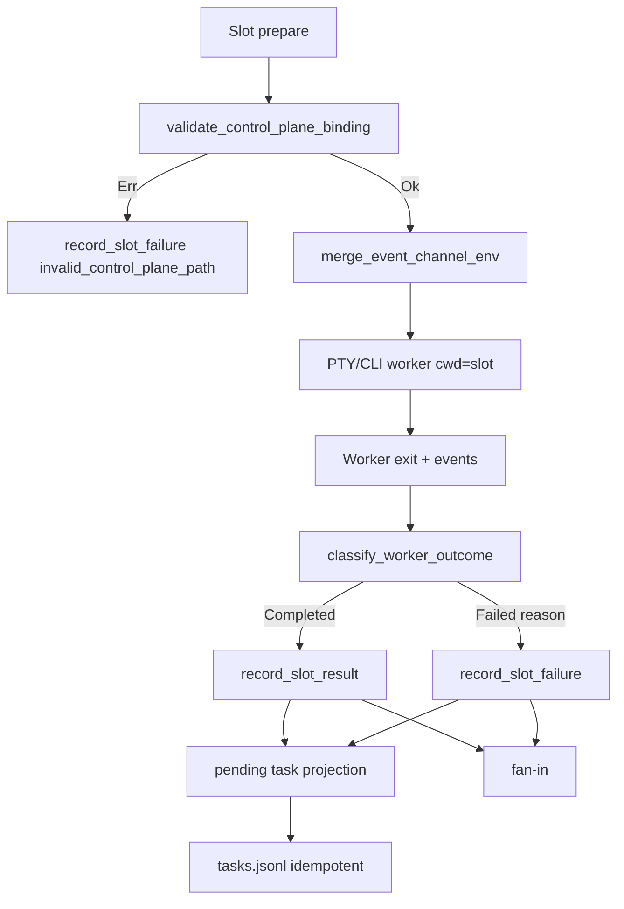

# 闭合 Supervisor P0 生产接线与 task 投影

## Goal Capsule

Plan `2026-07-23-004` 已落地库层契约（`control_plane`、`worker_outcome`、store `AlreadyTerminal`、`wave_id_for_idempotency_key`），但 **未接入** 生产 dispatcher / spawn env / task 投影；空事件 worker 仍可 `record_slot_result` 伪成功。本计划只闭合接线与剩余缺陷，使真实 worker 路径满足：控制面绝对路由、非空单终态 fail-close、slot/task 可恢复一致、可审计的 wave 失败，并翻转固化旧语义的测试。

Authority：以本文件 Product Contract 为准；004 中已完成且仍正确的库层能力视为前置依赖，不重写。

Stop when：所有 Scenario 通过、生产路径调用分类器与控制面校验、空批成功断言已删除/翻转、task 与 slot 终态一致、agent guide 同步、targeted + 全量回归绿。

---

## Product Contract

### Summary

闭合 004 的生产接线缺口：把已有 validator/classifier 接到 dispatcher，对称强化 `record_slot_failure`，实现 slot→task 可恢复投影，并用真实 runner 路径验收；不改 preset，不重做 U2 映射。

Product Contract preservation: 继承 004 的 R-A1/R-A3/R-A4/R-A6 公开契约；本计划新增 R-W* 仅描述「必须在生产路径生效」的接线要求。不改变 004 已冻结的 failure reason 集合与 public wave ID 语义。

### Requirements

- R-W1. Supervisor worker spawn 时必须经 `validate_control_plane_binding` 校验绝对 per-worker channel，并经 `merge_event_channel_env`（或等价 SSOT）注入 `RALPH_WORKSPACE_ROOT` + 经验证的 `RALPH_EVENTS_FILE`；非法路径不 spawn 或以稳定 `invalid_control_plane_path` 失败。
- R-W2. Dispatcher 记录 slot 终态前必须调用 `classify_worker_outcome`；`event_count=0`、无合法终态、timeout、cancel 不得 `record_slot_result` 为 completed。
- R-W3. `record_slot_failure` 与 `record_slot_result` 对称遵守 first-terminal-wins：已 Completed 不可被 failure 覆盖；同内容幂等。
- R-W4. Cancel 分类优先于输出分类：`WorkerExit::Cancelled` 一律映射 `worker_cancelled`（不得因已有 Done marker 落成 Completed）。
- R-W5. Slot 实际开始后 task 进入 started；slot 合法 done/failed/timeout/cancel 后 task 最终一致闭合为 done/failed；store pending projection + 重启重放；worker 不双写 task。
- R-W6. 集成夹具与验收测试必须 exercise 真实 inject/dispatcher 边界，不得仅手写 env 冒充 runner。
- R-W7. 受影响 agent guide（wave/emit/tasks）同步可执行说明；禁止泄漏内部 ledger/函数名/计划编号。

### Actors

- A1. Supervisor dispatcher / bridge（生产写者）
- A2. Wave worker 进程（emit 消费者视角）
- A3. Operator / 后续 hat（`ralph tools task list` 读者）

### Key Flows

- F1. Spawn → 校验控制面 → 注入 env → worker 在 slot cwd 改代码、向主控制面 per-worker channel emit
- F2. Worker 退出 → classify → record_slot_result | record_slot_failure → fan-in
- F3. Slot 开始/终态 → pending projection → tasks.jsonl → 可查询

### Acceptance Examples

- AE1. exit 0 + 0 events → slot failed `empty_worker_result`，不 completed
- AE2. 深层 slot cwd + 合法终态 → 主控制面 channel 有事件，slot 子树无嵌套 `.ralph/events.jsonl`
- AE3. 污染外层 hat env → worker 仍见当前 loop 的绝对 binding
- AE4. Completed 后再 `record_slot_failure` → AlreadyTerminal / 状态不变
- AE5. Slot 失败后 `ralph tools task list` 显示对应 task failed（reason 对齐）
- AE6. 原 `test_dispatcher_records_empty_batch_stable_hash` 不再断言空批成功

### Scope Boundaries

**In scope**

- `crates/ralph-cli/src/loop_runner/wave/dispatcher.rs` 生产 outcome 分支与 spawn env
- `crates/ralph-cli/src/loop_runner/execution.rs`（仅当需要为 inject 增加 workspace root 钩子且不破坏现有调用方）
- `crates/ralph-core/src/control_plane.rs` / `supervisor/worker_outcome.rs` 小修（cancel 语义、注释对齐）
- `crates/ralph-core/src/supervisor/{memory,rusqlite,mod,bridge}.rs`：`record_slot_failure` 守卫 + pending projection 存储
- task 投影写路径（复用 `task_store` API；新 projector 模块或 supervisor 内 projector）
- `crates/ralph-cli/tests/integration_supervisor_runtime_p0.rs`、`loop_runner/tests/wave_supervisor.rs`
- `crates/ralph-core/data/ralph-tools-{wave,emit,tasks}.md`

**Out of scope / Deferred**

- 不修改任何 preset YAML / schema / preset_lint finding
- 不重做 004 U2 public/store 映射（已落地）
- 不把 per-worker channel 强行改写为 main `events.jsonl`（会破坏 `read_worker_events`；见 KTD1）
- 不实施 005 并发 pipeline 拓扑
- 不迁移历史 orphan 文件
- Aggregate FIFO 虚拟时钟深化：若本计划接线后门禁已绿，剩余竞态强化可 follow-up（004 A5 深化）

### Deferred to Follow-Up Work

- 与 005 合并后的发布级 supervisor 全链 E2E
- `plan.blocked → reporter → LOOP_COMPLETE` 的 registry/CLI 非零语义（若本计划 E2E 未覆盖，记 residual）

---

## Planning Contract

### Key Technical Decisions

- KTD1. **保留主 workspace 下的 per-worker JSONL channel**（现有 `wave_dir/wave-{id}-{index}.jsonl`），不改为单一 main ledger。Channel 必须绝对路径、位于 `workspace_root` 下、且不在 slot worktree 子树。`(session-settled: user-approved — 功能可用优先，避免破坏 worker 读回路径)`
- KTD2. **`merge_event_channel_env` 是 spawn 侧 SSOT** 写入 `RALPH_WORKSPACE_ROOT` + 校验后的 `RALPH_EVENTS_FILE`；`inject_hat_execution_env` 可保留 hat 上下文，但不得覆盖已校验的 events/workspace binding。
- KTD3. **`classify_worker_outcome` 是 dispatcher 记录前的唯一真值表**；Legacy `record_outcome` 可抽共享 helper，但 supervisor 路径不得绕过。
- KTD4. **Task 投影：supervisor store 为 slot 事实源**；同一 store mutation 提交 slot 终态 + pending projection；随后幂等写 `tasks.jsonl`；失败/崩溃由 recover 重放。不新增业务 topic、不改 preset。`(session-settled: user-directed — 含完整 A4 投影以确保功能正常使用)`
- KTD5. **翻转而非跳过** `test_dispatcher_records_empty_batch_stable_hash`：空批必须失败。`(session-settled: user-approved — 无合理替代)`

### Assumptions

- 004 已合入分支上的 `control_plane` / `worker_outcome` / `AlreadyTerminal(record_slot_result)` / `wave_id_for_idempotency_key` 可用，本计划不重写。
- Per-worker channel 父目录已由现有 wave 准备逻辑创建；校验器对「可创建父目录」路径放行。
- Task identity（`task_id` / `task_key`）已存在于 wave/slot payload 或可从现有 bind 上下文取得；若缺失则 fail-close 并诊断，不猜测。

### High-Level Technical Design



### Strict Serial Sequencing

```text
Unit 1 → Unit 2 → Unit 3 → Unit 4 → Unit 5
```

前一 Unit 的 Red→Green→Refactor、集成与受影响回归全部通过后，才可进入下一 Unit。

### Patterns to Follow

- Legacy empty fail-close 思路：`dispatcher.rs` `record_outcome`（`success || !events.is_empty()`）— supervisor 路径改为完整真值表而非部分条件
- Bind fail-close：`bind_slot` Err → skip spawn（同目录既有模式）
- Task 写入：`task_store::{start,close,fail}` + exclusive lock；禁止 hat 双写（`hat_command_policy` projector SSOT）
- Orphan 路径既有解法：`docs/solutions/integration-issues/emit-workspace-root-cwd-drift.md`
- 测试：`common::ralph_bin()` / scrub agent env（HARD RULE 5）

### File Ownership

可修改：

- `crates/ralph-cli/src/loop_runner/wave/dispatcher.rs`
- `crates/ralph-cli/src/loop_runner/execution.rs`（仅 hook 需要时）
- `crates/ralph-cli/src/loop_runner/wave/supervisor_bridge.rs`（仅投影回调需要时）
- `crates/ralph-core/src/control_plane.rs`
- `crates/ralph-core/src/supervisor/worker_outcome.rs`
- `crates/ralph-core/src/supervisor/{mod,memory,rusqlite,bridge,recover}.rs`
- 新建必要时的 `crates/ralph-core/src/supervisor/task_projection.rs`（或等价模块）
- `crates/ralph-cli/tests/integration_supervisor_runtime_p0.rs`
- `crates/ralph-cli/src/loop_runner/tests/wave_supervisor.rs`
- `crates/ralph-core/tests/integration_supervisor_p0_deadline.rs`（仅投影/parity 扩展）
- `crates/ralph-core/data/ralph-tools-{wave,emit,tasks}.md`
- `crates/ralph-cli/src/loop_runner/tests/hard_gate_payload_contract.rs`（workspace root 断言）

禁止修改：

- `presets/en/*`、`presets/schemas/*`、`presets/manifest.yml`
- `crates/ralph-cli/tests/integration_supervisor_primary.rs`（除非为修复假绿所必需；优先扩展 `integration_supervisor_runtime_p0`）
- preset operator skills（本计划不改 preset 契约）

---

## 1. 功能目标

### 业务目标

- Supervisor 对真实 worker 的成功/失败判断可信（无空结果伪成功）。
- Worker 始终绑定主控制面绝对路径 + `RALPH_WORKSPACE_ROOT`；slot worktree 只改代码。
- Slot 与 task 生命周期对外一致，operator/后续 hat 可依赖 `ralph tools task list`。
- 测试与文档反映真实生产行为，不再固化旧伪成功语义。

### 本次范围

见 Product Contract Requirements R-W1–R-W7 与 File Ownership。

### 非目标

见 Scope Boundaries Out of scope。

### 已知约束和假设

见 Planning Contract Assumptions + KTD1–KTD5。
测试入口必须 `cargo nextest run`；禁止裸 `cargo test -p ralph-cli`。

---

## 2. BDD 行为规格

### Feature W1：Worker 结果分类在生产路径生效

```gherkin
Feature: Dispatcher 只接受合法非空单终态

  Scenario: 进程成功但零事件
    Given supervisor worker 以 exit 0 返回
    And accepted event_count 等于 0
    When dispatcher 记录 slot 结果
    Then slot 为 failed
    And reason 为 empty_worker_result
    And 不调用成功态 record_slot_result

  Scenario: 有事件但无允许终态
    Given worker 产生至少一个被接纳的非终态事件
    And 无 *.unit.done / *.unit.failed
    When worker 正常退出
    Then slot 为 failed
    And reason 为 missing_worker_terminal

  Scenario: 取消优先于输出
    Given worker 被取消
    And 事件流中出现 Done marker
    When classify_worker_outcome 运行
    Then slot 为 failed
    And reason 为 worker_cancelled
```

### Feature W2：控制面 spawn 绑定

```gherkin
Feature: Spawn 使用校验后的主控制面 binding

  Scenario: 合法绝对 channel
    Given per-worker events 路径位于主 workspace 且不在 slot 子树
    When dispatcher 准备 worker
    Then RALPH_WORKSPACE_ROOT 为主 workspace 绝对路径
    And RALPH_EVENTS_FILE 为校验后的绝对 channel
    And worker cwd 为 slot worktree

  Scenario: channel 落在 slot 子树
    Given events 路径指向 slot worktree 内
    When dispatcher 校验
    Then worker 不启动或其结果为 failed
    And reason 为 invalid_control_plane_path

  Scenario: 外层污染 env
    Given 测试进程带有另一 loop 的 RALPH_EVENTS_FILE 与 RALPH_WORKSPACE_ROOT
    When supervisor spawn worker
    Then worker 环境为当前 loop 显式 binding
```

### Feature W3：Failure 写入对称 first-terminal-wins

```gherkin
Feature: 已完成 slot 不被 failure 覆盖

  Scenario: Completed 后晚到 failure
    Given slot 已 Completed
    When record_slot_failure 到达
    Then 返回 AlreadyTerminal 或等价拒绝
    And slot 仍为 Completed
```

### Feature W4：Task 可恢复投影

```gherkin
Feature: Slot 生命周期投影到 task

  Scenario: 正常闭合
    Given task 为 open
    When slot 实际开始执行
    Then task 变为 started
    When slot 接受合法 done
    Then task 变为 done

  Scenario: 失败闭合
    Given task 为 started
    When slot 以 empty_worker_result 失败
    Then task 变为 failed

  Scenario: 投影中断后恢复
    Given pending projection 已提交但 tasks.jsonl 写入失败
    When recover 重放
    Then task 终态最终一致
    And 重复投影是幂等 no-op
```

### Feature W5：夹具与回归诚实性

```gherkin
Feature: 验收测真实边界

  Scenario: 空批测试语义翻转
    Given 曾断言 empty batch record_slot_result 成功的测试
    When 本计划完成后再次运行
    Then 该测试断言 failure / empty_worker_result

  Scenario: 夹具使用真实 inject 路径
    Given integration_supervisor_runtime_p0 启动 recording worker
    When 捕获 env
    Then env 来自生产 inject/merge 路径而非仅手写 HashMap
```

---

## 3. 验收与测试策略

| Scenario | 验收条件 | 推荐测试层级 | 是否需要 E2E |
| --- | --- | --- | --- |
| W1 零事件 | slot failed + empty_worker_result | 单元（classifier）+ dispatcher 集成 | 是，1 条代表 |
| W1 无终态 | missing_worker_terminal | 单元 | 否 |
| W1 cancel 优先 | worker_cancelled | 单元 | 否 |
| W2 合法 binding | WORKSPACE_ROOT + 绝对 channel | dispatcher/fixture 集成 | 否 |
| W2 slot 子树 | invalid_control_plane_path 不 spawn | 单元 + 集成 | 否 |
| W2 污染 env | 显式 binding 胜出 | 集成（scrub + 污染） | 否 |
| W3 failure 覆盖 | AlreadyTerminal | Memory/SQLite 单元 | 否 |
| W4 task 闭合 | task list 与 slot 一致 | 集成 | 是，失败主路径 |
| W4 投影恢复 | 重放幂等 | 故障注入 + Differential | 否 |
| W5 空批翻转 | 旧成功断言消失 | wave_supervisor 测试 | 否 |
| W5 真实 inject | fixture 不手写冒充 | integration_supervisor_runtime_p0 | 否 |
| Deep-cwd emit | 主 channel 有事件、无 nested orphan | CLI 集成 | 是，1 条 |

---

## 4. 需求—测试追踪矩阵

| 需求 | Scenario | 验收测试 | 单元测试 | 集成/契约 | E2E |
| --- | --- | --- | --- | --- | --- |
| R-W2/R-W4 | W1 | wave_supervisor empty/cancel cases | worker_outcome cancel/empty | dispatcher JoinSet 路径 | empty-result |
| R-W1 | W2 | integration_supervisor_runtime_p0 routing | control_plane | spawn env capture | deep-cwd |
| R-W3 | W3 | memory/rusqlite AlreadyTerminal on failure | record_slot_failure 守卫 | — | 否 |
| R-W5 | W4 | task list after slot terminal | pending projection API | Memory/SQLite + recover | partial failure |
| R-W6/R-W7 | W5 | fixture + guide smoke | — | doc drift | 否 |

---

## Implementation Units

### U1. 生产路径接入 classify_worker_outcome（空结果 fail-close）

- **Unit 目标**：`dispatch_wave_inner` 在 `record_slot_*` 前强制分类；空事件不再 completed。
- **对应 Scenario**：W1；AE1；AE6。
- **Requirements**：R-W2。
- **Dependencies**：无（依赖 004 已有 `worker_outcome`）。
- **外部可观察结果**：exit 0 + 0 events → `record_slot_failure(empty_worker_result)`；空批成功测试翻转后变绿。
- **输入与输出**：输入 worker `Result<(events, duration, success)>`；输出 validated store mutation。
- **可依赖的已完成能力**：`classify_worker_outcome`、`REASON_*`、U5RecordingBridge。
- **明确禁止依赖的未来能力**：不依赖 U2 控制面、U4 task 投影。
- **Files**：
  - modify: `crates/ralph-cli/src/loop_runner/wave/dispatcher.rs`
  - modify: `crates/ralph-cli/src/loop_runner/tests/wave_supervisor.rs`
  - test: 同上 + 既有 `crates/ralph-core/src/supervisor/worker_outcome.rs` 单测
- **Approach**：在 JoinSet 成功分支用事件流提取 `TerminalMarker`，映射 `WorkerExit`，调用 classifier；Completed → `record_slot_result`，Failed → `record_slot_failure(reason)`。翻转 `test_dispatcher_records_empty_batch_stable_hash`。
- **Execution note**：先启用/修改验收测试确认以「仍无条件 success」为正确 Red，再接线；禁止删断言混绿。
- **验收测试**：`test_dispatcher_records_empty_batch_stable_hash`（翻转后）；必要时新增 missing-terminal case。
- **需要拆分的单元测试**：exit×events×terminal 矩阵已在 worker_outcome；补 dispatcher 级 empty success。
- **Red 预期失败原因**：当前 L2363 `Ok(..., true)` 无条件 `record_slot_result`。
- **最小实现范围**：仅 outcome 记录分支；不改 spawn env。
- **集成验证**：`cargo nextest run -p ralph-cli --bin ralph -- wave_supervisor`
- **回归范围**：既有 U5 record 成功/失败/幂等测试；U6 fan-in。
- **完成标准**：空批断言失败语义；成功路径仍记录合法终态；Memory/SQLite 不受本 Unit 破坏。
- **风险与注意事项**：区分 timeout-with-events（仍失败 timeout）与 post-event linger（见 solutions 假失败文档）；`event_count` 只计被接纳事件。

### U2. Spawn 控制面校验与 RALPH_WORKSPACE_ROOT 注入

- **Unit 目标**：supervisor slot 准备路径调用 `validate_control_plane_binding` + `merge_event_channel_env`。
- **对应 Scenario**：W2；AE2；AE3。
- **Requirements**：R-W1、R-W6。
- **Dependencies**：U1。
- **外部可观察结果**：worker env 含主 workspace 绝对 root 与校验后绝对 channel；slot 子树非法路径 fail-close。
- **输入与输出**：输入 `repo_root`、per-worker events path、slot cwd；输出 env map 或 spawn 拒绝。
- **可依赖的已完成能力**：`control_plane.rs`；`ProductionBridgeContext.repo_root`。
- **明确禁止依赖的未来能力**：不依赖 task 投影。
- **Files**：
  - modify: `crates/ralph-cli/src/loop_runner/wave/dispatcher.rs`
  - modify: `crates/ralph-cli/src/loop_runner/execution.rs`（仅必要时）
  - modify: `crates/ralph-cli/tests/integration_supervisor_runtime_p0.rs`
  - modify: `crates/ralph-cli/src/loop_runner/tests/hard_gate_payload_contract.rs`
  - test: control_plane 既有单测
- **Approach**：在 supervisor slot prep（约 L1491+）校验 channel；失败则不 spawn 并 `record_slot_failure(invalid_control_plane_path)`。合并 env 时覆盖污染值。夹具改为调用真实 inject/merge，去掉纯手写冒充。
- **Execution note**：污染 env 集成测必须 scrub 后再显式注入外层脏值。
- **验收测试**：fixture routing + polluted env；relative/slot-subtree rejection（可保留库测并补 dispatcher 级）。
- **需要拆分的单元测试**：binding merge precedence；symlink escape（若平台可测）。
- **Red 预期失败原因**：`inject_hat_execution_env` 不设 `RALPH_WORKSPACE_ROOT`；夹具手写 env 掩盖缺口。
- **最小实现范围**：supervisor 路径优先；legacy WaveTracker 路径可选对齐但不阻塞。
- **集成验证**：`cargo nextest run -p ralph-cli --test integration_supervisor_runtime_p0`
- **回归范围**：human emit、orphan fail-closed、worktree bind。
- **完成标准**：合法 spawn 环境断言绿；非法不 spawn；扫描无 nested orphan。
- **风险与注意事项**：KTD1 — 勿把 channel 改成 main `events.jsonl`；保持 `read_worker_events(worker_events_path)` 一致。

### U3. record_slot_failure 对称守卫与 cancel 分类修复

- **Unit 目标**：failure 写入遵守 first-terminal-wins；cancel 不再被 Done marker 抬成 Completed。
- **对应 Scenario**：W1 cancel；W3；AE4。
- **Requirements**：R-W3、R-W4。
- **Dependencies**：U1（分类器已在生产路径）。
- **外部可观察结果**：Completed 后 failure 被拒；Cancelled 恒为 `worker_cancelled`。
- **输入与输出**：输入已有终态 slot + 新 failure/cancel；输出 AlreadyTerminal 或 Failed。
- **可依赖的已完成能力**：`record_slot_result` AlreadyTerminal 模式。
- **明确禁止依赖的未来能力**：不依赖 task 投影完成。
- **Files**：
  - modify: `crates/ralph-core/src/supervisor/memory.rs`
  - modify: `crates/ralph-core/src/supervisor/rusqlite.rs`
  - modify: `crates/ralph-core/src/supervisor/worker_outcome.rs`
  - modify: `crates/ralph-cli/tests/integration_supervisor_runtime_p0.rs`
  - test: `memory_protocol_tests.rs` / rusqlite tests
- **Approach**：复制 `record_slot_result` 的 terminal 检查到 `record_slot_failure`；修正 `classify_worker_outcome` 使 cancel 无条件返回 cancelled；对齐模块注释真值表与实现。
- **Execution note**：Memory/SQLite differential 同一 transition trace。
- **验收测试**：Completed→failure 拒绝；cancel+Done → worker_cancelled。
- **需要拆分的单元测试**：idempotent failure same reason；conflict after completed。
- **Red 预期失败原因**：`record_slot_failure` 无条件覆写；cancel 分支要求 empty terminals。
- **最小实现范围**：store + classifier；不改 fan-in。
- **集成验证**：`cargo nextest run -p ralph-core -- supervisor`；runtime_p0 conflict case。
- **回归范围**：cancel_wave、recover、fan-in idempotency。
- **完成标准**：两后端行为一致；冲突诊断可观测。
- **风险与注意事项**：Cancelled pending slots 与 Running→Failed 语义保持现有 R-B3/B4。

### U4. Slot→Task 可恢复 pending 投影

- **Unit 目标**：dispatch 开始与 slot 终态投影到 `tasks.jsonl`，崩溃可重放。
- **对应 Scenario**：W4；AE5。
- **Requirements**：R-W5。
- **Dependencies**：U1、U3（终态写入稳定）。
- **外部可观察结果**：slot started→task started；slot done/failed→task done/failed；重启后无分叉。
- **输入与输出**：输入 slot transition + task identity；输出 pending 行 + tasks.jsonl 更新确认。
- **可依赖的已完成能力**：`TaskStore::{start,close,fail}`；supervisor store 事务。
- **明确禁止依赖的未来能力**：不依赖 U5 guide/E2E 文案；不新增 preset topic。
- **Files**：
  - create/modify: `crates/ralph-core/src/supervisor/task_projection.rs`（或等价）
  - modify: `crates/ralph-core/src/supervisor/{mod,memory,rusqlite,recover}.rs`
  - modify: dispatcher 或 bridge（触发投影确认）
  - test: 新集成测于 `integration_supervisor_runtime_p0.rs` 或 core supervisor 测试
- **Approach**：slot transition 与 pending projection 同 store mutation；projector 幂等写 task；成功后 ack；recover 重放未 ack 项。Runtime 唯一写者。
- **Execution note**：Characterization：先证明当前 slot 终态后 task 仍 open/started；再实现投影。
- **验收测试**：正常闭合、失败闭合、写失败注入、重启重放、幂等二次投影。
- **需要拆分的单元测试**：identity mismatch fail-close；pending 队列 FIFO；Memory/SQLite parity。
- **Red 预期失败原因**：无 pending projection 字段/表；dispatcher 不触达 TaskStore。
- **最小实现范围**：不引入新业务 event topic；若缺 task_id 则结构化诊断并失败 slot。
- **集成验证**：task API view + store snapshot differential。
- **回归范围**：state_projector 既有 work.ready/done 路径不得被破坏；hat 仍禁止直接 ensure。
- **完成标准**：AE5 绿；无 done/failed 分叉；重复 fan-in 不重复关闭计数异常。
- **风险与注意事项**：JSONL 不在 SQLite 事务内 — 靠 durable pending + ack；参考 `docs/solutions/logic-errors/ce-executor-p0-event-policy-and-projector-fanout.md` 避免双行 task_id。

### U5. 纵向验收、夹具诚实化、guide 同步与全量回归

- **Unit 目标**：证明生产路径闭环；文档可执行；全量门禁绿。
- **对应 Scenario**：全部 W1–W5；deep-cwd；AE2。
- **Requirements**：R-W6、R-W7。
- **Dependencies**：U1–U4。
- **外部可观察结果**：成功波无 orphan；失败波确定终止；task 闭合；guide 与 CLI 行为一致。
- **输入与输出**：真实 CLI/fake backend；主 channel、task view、进程退出码。
- **可依赖的已完成能力**：U1–U4。
- **明确禁止依赖的未来能力**：不依赖 005 preset 重构。
- **Files**：
  - modify: `crates/ralph-cli/tests/integration_supervisor_runtime_p0.rs`
  - modify: `crates/ralph-core/data/ralph-tools-wave.md`
  - modify: `crates/ralph-core/data/ralph-tools-emit.md`
  - modify: `crates/ralph-core/data/ralph-tools-tasks.md`
  - test: 补缺口 only
- **Approach**：补 deep-cwd emit、污染 env、empty-result、partial failure、投影恢复验收；同步 guide（通用规则，禁计划编号）；跑 drift + full suite。
- **Execution note**：先 targeted nextest，再 `./scripts/run-tests.sh`；flake 才用 `RALPH_BASELINE_SERIAL=1`。
- **验收测试**：见 Verification Contract。
- **需要拆分的单元测试**：本 Unit 原则上不新增业务逻辑。
- **Red 预期失败原因**：若纵向失败，定位为 U1–U4 漏接线，禁止在 E2E 里 mock 掉。
- **最小实现范围**：接线修补 + 文档；不改 preset。
- **集成验证**：见下节质量门禁。
- **回归范围**：`ralph-core -- supervisor`、`ralph-cli -- wave_supervisor`、runtime_p0、doc drift、全量。
- **完成标准**：DoD 全勾选；residuals 显式记录。
- **风险与注意事项**：guide HARD RULE：可读、去计划化、反向核对行号引用。

---

## Verification Contract

### Targeted commands（实现期）

- `cargo nextest run -p ralph-cli --bin ralph -- wave_supervisor`
- `cargo nextest run -p ralph-cli --test integration_supervisor_runtime_p0`
- `cargo nextest run -p ralph-core -- supervisor`
- 污染复跑：`RALPH_CURRENT_HAT=executor RALPH_EVENTS_FILE=/tmp/x.jsonl cargo nextest run -p ralph-cli --test integration_supervisor_runtime_p0`
- `scripts/check-cli-doc-drift.sh`

### Final gate

- `./scripts/run-tests.sh`
- `cargo fmt --check`、`cargo clippy`、`cargo build`

### Risk-driven extras

- Characterization：U1 空批旧语义 / U4 task 未投影
- State-machine：slot/task 终态表
- Idempotency/Concurrency：重复终态、投影重放
- Fault Injection：tasks.jsonl 写失败、进程在 ack 前崩溃
- Differential：Memory vs SQLite 同 transition trace

### Test discipline

- 禁止删断言 / skip / `.only` / 无解释改 golden
- 禁止 mock 掉 classify 或 validate
- BDD/集成走真实 runner/store 路径
- spawn CLI 必须 scrub

---

## Definition of Done

- R-W1–R-W7 全部有对应用例通过
- 生产 dispatcher 调用 `classify_worker_outcome`；spawn 调用控制面校验/merge
- `event_count=0` 永不 completed；空批成功测试已翻转
- `record_slot_failure` 不能覆盖 Completed
- Cancel → `worker_cancelled`
- Slot/task 无终态分叉；pending 可恢复
- 无 nested orphan ledger（新执行）
- Agent guide 已同步且通过 drift check
- `./scripts/run-tests.sh` 绿；无新增 ignore/skip
- 未验证项写入 residuals（如与 005 联合 E2E、`plan.blocked` CLI 语义若未覆盖）

---

## 6. 最终质量门禁

- 所有计划内 Scenario 通过
- 所有新增及受影响单元测试通过
- 必要的集成/契约测试通过（含 Memory/SQLite）
- 关键 E2E（empty-result、deep-cwd、partial failure/task 闭合）通过
- Lint / Clippy / Build 通过
- 没有新增失败或跳过测试
- 未验证内容与剩余风险已明确记录

---

## Appendix

### Sources & Research

- 前序计划：`docs/plans/2026-07-23-004-fix-supervisor-p0-runtime-contracts-plan.md`
- 诊断：`docs/report/2026-07-23-ce-executor-supervisor-primary-20260723-082003-diagnosis.md`
- Review 结论（2026-07-23）：库层已落地、dispatcher 未接线；`test_dispatcher_records_empty_batch_stable_hash` 固化伪成功
- Solutions：`docs/solutions/integration-issues/emit-workspace-root-cwd-drift.md`；`docs/solutions/architecture-patterns/2026-07-23-002-u8-closure-reconciliation.md`；`docs/solutions/logic-errors/ce-executor-p0-event-policy-and-projector-fanout.md`
- 代码锚点：`dispatcher.rs` JoinSet 记录分支；`execution.rs` `inject_hat_execution_env`；`control_plane.rs`；`worker_outcome.rs`；`task_store.rs`

### Open Questions（deferred, non-blocking）

- Legacy WaveTracker 路径是否在本计划强制对齐 `RALPH_WORKSPACE_ROOT`（默认：supervisor 路径必须；legacy 尽力对齐）
- `plan.blocked → LOOP_COMPLETE` 非零退出若超出本计划 E2E 预算，记入 follow-up
