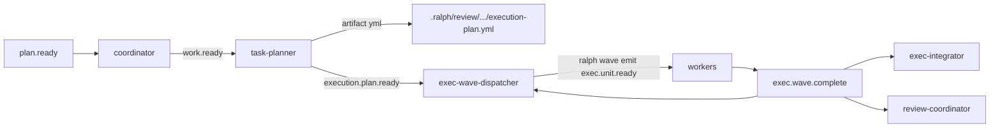

# 闭合 Supervisor 三 plan 合并残留（拓扑 · E2E · recover · inspect）

## Goal Capsule

- Objective: 让 `ce-executor-supervisor` 在三份 plan（001 / 005 / 007）合并后的代码上：主链可激活、静态 lint 绿、Outside-In E2E 对齐新拓扑、slot→task 崩溃可重放、默认 wave 可观测与幂等文档一致，并让 `./scripts/run-tests.sh` 恢复可宣称完成。
- Authority: 本文件 Product Contract + KTDs。与 005「happy path 零 emit」冲突时，以本计划 KTD1（显式 handoff）为准。与 007 recover residual、001 inspect/sidecar residual 冲突时，以本计划闭合为准。
- Sequencing: **U1 → U2 → U3 → U4 → U5 → U6 → U7** 严格串行；前一 Unit 的 Red→Green→Refactor、受影响回归全部绿后才能进入下一 Unit。
- Stop when: Verification Contract 全绿；Definition of Done 勾选；未验证项写入 residuals。
- Out of scope reminder: 不重做 001/005/007 已交付的库能力；不改 `ce-executor-pipeline.yml`；不引入新 WaveKind；不把补偿做成真实 cleanup 命令（保持 001 最小接线）。

Product Contract preservation: 继承 005 的 DAG/artifact、Review SharedReadonly、唯一 Fix 链、reporter 单一 owner；**变更** 005 task-planner happy path「零业务 emit」→「成功后恰好一条 `execution.plan.ready` handoff」（见 KTD1）。继承 007 热路径投影；**闭合** recover 启动接线。继承 001 默认 wave store；**闭合** inspect 默认可观测与 skill 幂等 SSoT 文案。

---

## 1. 功能目标

### 业务目标

- Operator 用 `builtin:ce-executor-supervisor` 跑 plan 时，主链不再因「task-planner 永不激活 / dispatcher 抢先消费 `work.ready` / AmbiguousRouting」在启动或中段卡死。
- Outside-In E2E 证明：Exec wave 进 store、全链可达 `LOOP_COMPLETE`、故障路径不静默成功。
- 崩溃重启后 supervisor slot 与 `tasks.jsonl` 终态可重放一致。
- 默认 wave 路径下 `ralph inspect loop` 能看到 active waves；agent guide 对幂等权威描述正确。

### 本次范围

- 固化工作区未提交的路由/schema/`tasks_path`/lint 豁免（或等价干净实现）。
- 接通 `work.ready → task-planner → execution.plan.ready → exec-wave-dispatcher`。
- 重写 `integration_supervisor_primary` 假 backend 与 fault 链。
- 接线 `recover_pending_projections`。
- 放宽/修正 inspect 的 `supervisor.enabled` 门控，使「有 ledger」也可摘要。
- 同步 `ralph-tools-wave.md` 幂等 SSoT + sidecar 弃用说明（不强制本计划删除 sidecar 文件写入）。

### 非目标

- 不重写 SupervisorStore / wave_verify_gate / classify_worker_outcome 已落地逻辑。
- 不删除 CLI `.idempotency.jsonl` sidecar 写路径（仅文档与契约对齐；物理删除留给 follow-up）。
- 不实现真实 compensation cleanup 命令。
- 不改 pipeline 主 preset 拓扑。
- 不新增 Turso / 跨 loop worker pool / DAG UI。

### 已知约束和假设

- 测试入口必须 `cargo nextest run`；禁止裸 `cargo test -p ralph-cli`。
- spawn CLI 测必须 scrub hat env（HARD RULE 5）。
- preset yml 改动必须同步 schema 并跑 preset_lint + embedded presets 校验。
- Hat instructions 视角（HARD RULE 4）；skill 引用不复述。
- isolated 单业务事件预算：task-planner 成功路径只能 emit 一条 handoff，失败路径只能 emit 一条 `plan.blocked`。
- 假设工作区 WIP（AmbiguousRouting / schema / EXEMPT / tasks_path）意图正确，U1 应落成 committed 状态而非长期悬空。
- 假设 `execution.plan.ready` 为新业务 topic，需进 `event_policy.schemas` + `business_topics` + mechanism.flow allowed_emits（若 lint 要求）。

---

## Product Contract

### Summary

闭合三 plan 合并残留：生产拓扑因果链、静态门禁、E2E 假 backend、task 投影恢复、默认可观测与幂等文档。

### Requirements

- R1. `task-planner` 必须声明 `triggers` 含 `work.ready`；`exec-wave-dispatcher` 首次激活不得再单独抢占 `work.ready`（首次由 handoff 唤醒）。
- R2. task-planner 在成功写入 execution-plan artifact 后，必须 emit 恰好一条 `execution.plan.ready`（必填：`plan_name`、`plan_path`、`execution_plan_path`、`source_plan_hash`，以及三字段 `task_id`/`task_key`/`step` 若该 preset 三字段规则适用）；失败只发 `plan.blocked`。
- R3. `exec-wave-dispatcher` 必须 `triggers` 含 `execution.plan.ready` 与 `exec.wave.complete`；不得再依赖 `work.ready` 作为首次 fan-out 触发（可从 triggers 删除 `work.ready`）。
- R4. 所有订阅 `exec.wave.complete` 的 hats 必须全部 opt-in `trigger_multi_consumer_topics`；`fix.done` 不得被多个 hat 无 opt-in 双认领（alignment 为唯一成功消费者；coordinator 不再 trigger `fix.done`）。
- R5. Schema / business_topics 不得保留已删除 hat 专用 topic（`fix.applied` / `fix.exhausted` / `review.start`）；`execution-plan.artifact` 不得作为 emit event schema。
- R6. `integration_supervisor_primary` 假 backend：task-planner 不得直写 `exec.unit.ready`；必须模拟 artifact + handoff；`exec.unit.ready` 仅由 `exec-wave-dispatcher` 经 wave 路径产生；fault 路径不得依赖已删 `fixer`/`fix.exhausted`。
- R7. Loop 启动 recover 在 `recover_active_waves_at_startup` 之后必须调用 `recover_pending_projections`（enabled 与默认 wave 两条开店路径均覆盖）。
- R8. 当存在可打开的 supervisor ledger（`db_path` 存在或本 loop 已懒开店）时，`ralph inspect loop` JSON 必须包含 `supervisor` 摘要块，即使 `supervisor.enabled: false`。
- R9. `ralph-tools-wave.md` 必须声明幂等权威为 SupervisorStore，sidecar 为过渡兼容并带弃用语义；禁止泄漏内部函数名/计划编号。
- R10. 全量门禁 `./scripts/run-tests.sh` 绿；无新增 ignore/skip；未验证项有 residuals。

### Actors

- A1. Operator（跑 preset / inspect / 读 task list）
- A2. task-planner / exec-wave-dispatcher / review-coordinator / reporter（isolated hats）
- A3. Outside-In E2E 假 backend（模拟 hat 输出）

### Key Flows

- F1. `plan.ready` → coordinator → `work.ready` → task-planner → artifact + `execution.plan.ready` → exec-wave-dispatcher → `exec.unit.ready` wave
- F2. `exec.wave.complete` 多消费者：dispatcher（下一 ready wave）+ integrator + review-coordinator（均已 opt-in）
- F3. 崩溃重启 → recover waves → recover_pending_projections → task list 与 slot 一致
- F4. Fault：slot 失败 → 既有 failure handler / `work.failed` → reporter → 失败报告 + 唯一 `LOOP_COMPLETE`（无 fixer）

### Acceptance Examples

- AE1. Preset validate 无 AmbiguousRouting；strict topology lint 无禁止 finding
- AE2. Embedded preset 加载后：`work.ready` 的唯一 trigger 消费者为 `task-planner`；`execution.plan.ready` 的唯一消费者为 `exec-wave-dispatcher`
- AE3. `supervisor_primary_path_exec_wave_completes_with_schema_payload` 绿（store 有 Exec wave）
- AE4. 两条 full-chain E2E 绿；fault 路径无静默 `LOOP_COMPLETE` 成功语义（按测试契约）
- AE5. 注入 pending projection 未 ack 场景，启动 recover 后 task 终态闭合
- AE6. `supervisor.enabled: false` + 存在 `supervisor.db` 时 inspect 仍输出 supervisor 块
- AE7. `./scripts/run-tests.sh` 绿

### Scope Boundaries

**In scope**

- `presets/en/ce-executor-supervisor.yml`、`presets/schemas/ce-executor-supervisor.yml`
- `crates/ralph-cli/src/presets.rs`（EXEMPT 若仍需要）
- `crates/ralph-cli/src/loop_runner/wave/dispatcher.rs`（tasks_path）
- `crates/ralph-cli/src/loop_runner/runner.rs`（recover 接线）
- `crates/ralph-cli/src/loop_runner/wave/task_projection.rs`（去掉 dead_code allow，若接线后）
- `crates/ralph-cli/src/commands/inspect.rs`
- `crates/ralph-cli/tests/integration_supervisor_primary.rs`
- `crates/ralph-core/tests/scenarios/supervisor/*.yml`（U2/U3 与新 handoff 对齐）
- `crates/ralph-core/data/ralph-tools-wave.md`
- 必要的 CLAUDE.md / AGENTS.md 一句同步（hat 计数/handoff）；`cp` 保持一致

**Out of scope / Deferred**

- 物理删除 `.idempotency.jsonl` 写路径
- 真实 compensation cleanup 命令
- 005 full BDD 矩阵中未覆盖的全部失败组合（本计划以 primary E2E + 关键 BDD 为主）
- `plan.blocked` CLI 非零 exit 语义深化（007 Deferred，若 E2E 未覆盖则 residual）

### Deferred to Follow-Up Work

- 删除 wave CLI sidecar 文件
- 补偿 job 真实执行器
- 005 U4–U7 全矩阵 BDD 补齐（非本修复阻塞全量门禁的最小集之外）

---

## Planning Contract

### Key Technical Decisions

- KTD1. **显式 handoff topic `execution.plan.ready`**（session-settled: user-approved — 相对 `work.ready` 多消费者更稳，无 artifact 竞态）。task-planner 成功路径恰好一条业务 emit；失败仍仅 `plan.blocked`。这修正 005「happy path 零 emit」设计洞。
- KTD2. **`work.ready` 单消费者 = task-planner**；从 `exec-wave-dispatcher.triggers` 移除 `work.ready`。dispatcher 首次只订 `execution.plan.ready`，后续迭代订 `exec.wave.complete`。
- KTD3. **U1 先固化静态门禁 WIP**（AmbiguousRouting / schema / empty_terminal 豁免 / tasks_path），再改拓扑 handoff，避免在红门禁上叠加第二套路由 diff。
- KTD4. **E2E 假 backend Outside-In 对齐拓扑**（session-settled: user-directed — 拓扑与 E2E 都修）：禁止再让 task-planner append `exec.unit.ready`；fault 改走无 fixer 的失败链。
- KTD5. **`recover_pending_projections` 挂在两处 `recover_active_waves_at_startup` 成功之后**（enabled + default-path），复用已有 `tasks_path` 推导；不新建 pending SQL 表（007 已用 store snapshot 重放）。
- KTD6. **Inspect 门控改为「ledger 可用则摘要」**：`supervisor.enabled` 仍表示全量 supervisor preset 语义，但有 DB/懒开店证据时不得因 enabled=false 隐藏摘要（闭合 001 R10）。
- KTD7. **Sidecar：本计划只文档 + 契约说明**；保留 deprecate stderr，不删写路径（降低回归面）。

### Assumptions

- WIP 中 `empty_terminal_events` 豁免对 task-planner / exec-wave-dispatcher 仍必要（handoff 后 task-planner 有 emit，**可能**需要更新 terminal_events 为 `execution.plan.ready` / `plan.blocked`，从而缩小或删除豁免——U2 验收时以「strict lint 无未解释 error」为准，优先给 task-planner 正确 `terminal_events` 而非扩大豁免）。
- `execution.plan.ready` 三字段规则与其它业务 topic 一致；夹具从 `ralph tools task list` / coordinator 已注册 task 取 id。
- primary E2E 假 backend 可用文件 touch + 结构化 JSONL append 模拟 handoff，而不必真跑 agent；但 **wave fan-out 必须走可被 supervisor 检测的路径**（与现有 primary 测如何检测 wave 的方式对齐，执行期以 Red 失败信息为准调整）。

### High-Level Technical Design



```text
Strict serial:
U1 static gate WIP
→ U2 topology handoff + schema/BDD
→ U3 recover_pending wiring
→ U4 inspect ledger-aware summary
→ U5 wave skill idempotency docs
→ U6 primary E2E fake backend rewrite
→ U7 full gate + residuals
```

### Patterns to Follow

- Multi-consumer opt-in：`trigger_multi_consumer_topics` 全员 listing（`ralph_config.rs` validate）
- Artifact-first：事件只带路径与 hash（CONCEPTS.md）
- Isolated pending：勿抽干 multi-consumer pending（`docs/solutions/logic-errors/isolated-ralph-must-not-drain-multi-consumer-pending.md`）
- Wave 单次 batch emit（`docs/solutions/integration-issues/ce-executor-wave-emission-must-batch-in-single-emit-2026-06-09.md`）
- Emit 控制面：`RALPH_WORKSPACE_ROOT` + 绝对 `RALPH_EVENTS_FILE`（emit-workspace-root solution）
- 测试：`common::ralph_bin()` / scrub；禁止裸 cargo test ralph-cli

### File Ownership

可修改：见 Scope Boundaries In scope。

禁止修改：`presets/en/ce-executor-pipeline.yml`；无关 crate 大重构；新建平行账本。

### Strict Serial Sequencing

```text
Unit 1 → Unit 2 → Unit 3 → Unit 4 → Unit 5 → Unit 6 → Unit 7
```

---

## 2. BDD 行为规格

### Feature C1：静态路由与 schema 门禁

```gherkin
Feature: Supervisor preset validates without AmbiguousRouting

  Scenario: exec.wave.complete multi-consumer opt-in complete
    Given review-coordinator, exec-integrator, and exec-wave-dispatcher all trigger exec.wave.complete
    And each lists exec.wave.complete in trigger_multi_consumer_topics
    When RalphConfig::validate runs
    Then no AmbiguousRouting error

  Scenario: fix.done has a single owner
    Given alignment triggers fix.done
    And coordinator does not trigger fix.done
    When validate runs
    Then no AmbiguousRouting on fix.done

  Scenario: deleted-hat topics absent from schema
    Given schemas for fix.applied, fix.exhausted, review.start
    When embedded preset strict lint runs
    Then those topics are not required event schemas
```

### Feature C2：execution-plan handoff 因果链

```gherkin
Feature: task-planner hands off to exec-wave-dispatcher via execution.plan.ready

  Scenario: Happy path handoff
    Given coordinator emitted work.ready
    When task-planner writes a valid execution-plan artifact
    Then it emits exactly one execution.plan.ready
    And exec-wave-dispatcher is the sole trigger consumer of that topic
    And exec-wave-dispatcher does not trigger on work.ready

  Scenario: Invalid plan
    Given work.ready activated task-planner
    When the plan DAG is invalid
    Then task-planner emits plan.blocked
    And it does not emit execution.plan.ready

  Scenario: No double wake on work.ready
    Given work.ready is in the ledger
    Then only task-planner is activated for work.ready
```

### Feature C3：slot→task recover

```gherkin
Feature: Pending task projection recovers on startup

  Scenario: Crash after slot terminal before tasks.jsonl ack
    Given supervisor store shows slot Completed
    And tasks.jsonl still shows the projected task as started or open
    When recover_active_waves_at_startup then recover_pending_projections run
    Then the task is done
    And a second recover is idempotent
```

### Feature C4：inspect 默认可观测

```gherkin
Feature: inspect shows supervisor summary when ledger exists

  Scenario: enabled false but db present
    Given supervisor.enabled is false
    And .ralph/supervisor.db exists with at least one wave row
    When ralph inspect loop --format json
    Then the JSON includes a supervisor object with active_waves or equivalent fields
```

### Feature C5：E2E 对齐新拓扑

```gherkin
Feature: Outside-In supervisor primary path

  Scenario: Primary exec wave persists
    Given fake backend follows work.ready → artifact+handoff → dispatcher wave emit
    When the primary path test runs
    Then supervisor store contains an Exec wave
    And schema payloads for unit.done and wave.complete are present

  Scenario: Full chain reaches LOOP_COMPLETE
    Given non-blocking and blocking review variants
    When full-chain tests run
    Then process exits successfully with exactly one LOOP_COMPLETE

  Scenario: Fault path does not use deleted fixer
    Given one slot failure
    When fault path test runs
    Then no fixer or fix.exhausted appears in the fake backend contract
    And LOOP_COMPLETE semantics match the test's failure assertion
```

### Feature C6：幂等文档

```gherkin
Feature: Agent guide describes store as idempotency SSoT

  Scenario: Skill text
    Given ralph-tools-wave.md
    When an agent reads the idempotency section
    Then it learns SupervisorStore is authoritative
    And sidecar is described as transitional deprecation only
```

---

## 3. 验收与测试策略

| Scenario | 验收条件 | 推荐测试层级 | 是否需要 E2E |
| --- | --- | --- | --- |
| C1 AmbiguousRouting | validate Ok | 单元 `ce_executor_supervisor_yaml_passes_strict_ambiguous_routing_check` | 否 |
| C1 schema 清理 | strict lint / embedded presets | 单元 + preset_lint | 否 |
| C2 handoff 拓扑 | triggers/publishes 结构断言 | 单元 preset_lint + BDD scenario | 否 |
| C2 invalid plan | plan.blocked only | BDD `u3_task_planner_*` 更新 | 否 |
| C3 recover | task 终态闭合 | 单元 task_projection + runner 集成轻测 | 否 |
| C4 inspect | JSON 含 supervisor | CLI 单元/集成 inspect | 否 |
| C5 primary / full-chain / fault | 现有 5 测绿 | Outside-In E2E | **是** |
| C6 skill | 文案与行为一致 | doc drift / 人工+脚本 | 否 |
| 全量 | run-tests.sh | 回归门禁 | 含 |

---

## 4. 需求—测试追踪矩阵

| 需求 | Scenario | 验收测试 | 单元测试 | 集成/契约 | E2E |
| --- | --- | --- | --- | --- | --- |
| R1–R3 | C2 | updated U2/U3 BDD + topology lint | hat triggers parse | scenarios | — |
| R4–R5 | C1 | ambiguous_routing + strict topology | ralph_config validate | presets embedded | — |
| R6 | C5 | integration_supervisor_primary | — | — | 5 tests |
| R7 | C3 | recover projection test | task_projection | runner hook | — |
| R8 | C4 | inspect JSON | inspect 单测 | — | — |
| R9 | C6 | ralph-tools-wave 审阅 + drift | — | check-cli-doc-drift | — |
| R10 | all | run-tests.sh | — | — | full |

---

## Implementation Units

### U1. 固化静态门禁 WIP（AmbiguousRouting / schema / tasks_path / 豁免）

- **Unit 目标**：工作树未提交的静态修复成为可验证的 committed 行为；`AmbiguousRouting` 与 embedded strict lint 在**当前拓扑**下绿（尚未引入 handoff topic）。
- **对应 Scenario**：C1。
- **Requirements**：R4、R5（部分）、R7 的 tasks_path 前置。
- **Dependencies**：无。
- **外部可观察结果**：`ce_executor_supervisor_yaml_passes_strict_ambiguous_routing_check` 绿；`test_all_embedded_presets_pass_strict_lint` 绿（含必要 EXEMPT 或更小豁免）；dispatcher lazy bridge 带 `tasks_path`。
- **输入与输出**：输入现有 WIP diff；输出可回归的 preset/schema/presets.rs/dispatcher 行为。
- **可依赖的已完成能力**：005 hat 删除；007 classify/控制面。
- **明确禁止依赖的未来能力**：不依赖 U2 handoff topic；不改 E2E mock。
- **Files**：
  - modify: `presets/en/ce-executor-supervisor.yml`
  - modify: `presets/schemas/ce-executor-supervisor.yml`
  - modify: `crates/ralph-cli/src/presets.rs`
  - modify: `crates/ralph-cli/src/loop_runner/wave/dispatcher.rs`
  - test: `crates/ralph-core/src/preset_lint/supervisor_preset_test.rs`（既有）
- **Approach**：落地 review-coordinator multi-consumer；coordinator 去掉 `fix.done` trigger（同步清理 instructions/event_filter 漂移）；删除死 schema；保留或收紧 `empty_terminal_events` 豁免注释；dispatcher `tasks_path` 与 runner 推导一致。
- **Execution note**：先跑 Red 证明 HEAD 无 WIP 时 AmbiguousRouting 红，再应用修复。
- **验收测试**：`ce_executor_supervisor_yaml_passes_strict_ambiguous_routing_check`；`test_all_embedded_presets_pass_strict_lint`；`ce_executor_supervisor_yaml_passes_strict_topology_lint`。
- **需要拆分的单元测试**：一般不新加；若 event_filter 与 triggers 不一致导致新 lint，补结构断言。
- **Red 预期失败原因**：HEAD 上 review-coordinator 缺 multi-consumer；coordinator+alignment 双认领 `fix.done`。
- **最小实现范围**：仅静态门禁与 tasks_path；不改 hat 激活边。
- **集成验证**：`cargo nextest run -p ralph-core -- ce_executor_supervisor_yaml_passes_strict`；`cargo nextest run -p ralph-cli --bin ralph -- test_all_embedded_presets_pass_strict_lint`。
- **回归范围**：`cargo nextest run -p ralph-core -- preset_lint`；`cargo nextest run -p ralph-cli --bin ralph -- presets`。
- **完成标准**：上述绿；coordinator instructions 不再教 agent 在本 hat 处理 `fix.done`（或明确「不会被该 trigger 激活」）。
- **风险与注意事项**：只删 triggers 留 event_filter/`fix.done` 文案会造成 agent 困惑——本 Unit 必须清干净。

### U2. 接通 `execution.plan.ready` handoff 拓扑 + schema/BDD

- **Unit 目标**：生产因果链 `work.ready → task-planner → execution.plan.ready → exec-wave-dispatcher` 结构正确且可 lint。
- **对应 Scenario**：C2。
- **Requirements**：R1、R2、R3、R5（handoff schema）。
- **Dependencies**：U1。
- **外部可观察结果**：解析 preset 后 triggers 映射满足 AE2；U2/U3 BDD 与 preset 一致；task-planner `terminal_events` 优先声明 `execution.plan.ready`/`plan.blocked`（尽量取消 empty_terminal 豁免）。
- **输入与输出**：输入 U1 绿树；输出新 topic 全链路声明（yml/schema/mechanism.flow/business_topics/instructions）。
- **可依赖的已完成能力**：U1 静态门禁；005 artifact 指令文案。
- **明确禁止依赖的未来能力**：不依赖 E2E mock 重写（U6）；不依赖 recover（U3）。
- **Files**：
  - modify: `presets/en/ce-executor-supervisor.yml`
  - modify: `presets/schemas/ce-executor-supervisor.yml`
  - modify: `crates/ralph-core/tests/scenarios/supervisor/u2_task_planner_artifact_happy_path.yml`
  - modify: `crates/ralph-core/tests/scenarios/supervisor/u3_task_planner_rejects_invalid_dag.yml`
  - modify: `crates/ralph-core/tests/scenarios.rs`（若断言 absent_events 需允许 handoff）
  - modify: `crates/ralph-cli/src/presets.rs`（若豁免变化）
  - optional: `CLAUDE.md` / `AGENTS.md` 一句拓扑描述
- **Approach**：
  1. `task-planner.triggers: [work.ready]`；`publishes` 增加 `execution.plan.ready`；更新 instructions：成功写 artifact 后 OPAC emit handoff（先 `--policy-check`）。
  2. `exec-wave-dispatcher.triggers`：移除 `work.ready`，增加 `execution.plan.ready`，保留 `exec.wave.complete`。
  3. Schema：`execution.plan.ready` required_fields；business_topics 列入；mechanism.flow `unit_loop` allowed_emits 增加。
  4. BDD：happy path 期望出现 `execution.plan.ready`；仍 absent `exec.unit.ready`（planner 不发 wave）。
- **Execution note**：Outside-In——先写/改 BDD 与 topology 结构测试为 Red，再改 YAML。
- **验收测试**：更新后的 `test_u2_task_planner_*` / `test_u3_task_planner_*`；ambiguous routing 仍绿；新增或扩展「`work.ready` 单消费者」结构断言（可放 supervisor_preset_test）。
- **需要拆分的单元测试**：topic 必填字段 schema parity（若有既有 schema_parity 模式则跟）。
- **Red 预期失败原因**：BDD 仍假设 planner 无 handoff emit；dispatcher 仍订 `work.ready`。
- **最小实现范围**：拓扑与文档化 instructions；不改 runtime inject 特殊逻辑。
- **集成验证**：`cargo nextest run -p ralph-core --test scenarios -- test_u2_task_planner`；`test_u3_task_planner`；preset_lint 套件。
- **回归范围**：`ce_executor_supervisor_preset_*` 全组；embedded presets。
- **完成标准**：AE2；planner 不再 empty_terminal（或豁免缩小且有注释）；header 注释与「16+progress-steward」陈旧文案清理。
- **风险与注意事项**：handoff 与 `plan.blocked` 同属业务事件——instructions 必须强调互斥单发；origin guard / publishes 必须包含 handoff。

### U3. 接线 `recover_pending_projections`

- **Unit 目标**：启动恢复后 slot 与 task 终态一致。
- **对应 Scenario**：C3。
- **Requirements**：R7。
- **Dependencies**：U1（tasks_path 可用）。
- **外部可观察结果**：recover 路径调用投影重放；`#[allow(dead_code)]` 移除；既有投影测仍绿。
- **输入与输出**：输入 store snapshots + tasks_path；输出幂等 task 终态。
- **可依赖的已完成能力**：`project_slot` / `recover_pending_projections` 原语；`recover_active_waves_at_startup`。
- **明确禁止依赖的未来能力**：不依赖 U6 E2E。
- **Files**：
  - modify: `crates/ralph-cli/src/loop_runner/runner.rs`
  - modify: `crates/ralph-cli/src/loop_runner/wave/task_projection.rs`
  - test: `crates/ralph-cli/src/loop_runner/tests/wave_supervisor.rs` 或 runner 级测
- **Approach**：在 enabled 与 default-path 两处 recover 成功后调用 `recover_pending_projections(&tasks_path, &loop_id, store.as_ref())`；tasks_path 与 U1 dispatcher 推导一致。
- **Execution note**：Characterization：先证明 recover 后 task 仍分叉（若可构造），再接线。
- **验收测试**：新增或扩展「store Completed + task started → recover → task done」；二次 recover 幂等。
- **需要拆分的单元测试**：已有 `project_slot` 测保留；补 recover 编排测。
- **Red 预期失败原因**：函数 dead_code 未调用；task 保持 started。
- **最小实现范围**：仅启动接线；不改投影键格式。
- **集成验证**：`cargo nextest run -p ralph-cli --bin ralph -- wave_supervisor`；`cargo nextest run -p ralph-cli --test integration_supervisor_runtime_p0`。
- **回归范围**：supervisor recover 单测（ralph-core）。
- **完成标准**：AE5 类断言绿；注释不再写「NOT wired」。
- **风险与注意事项**：与并发 `project_slot` 的 exclusive lock 已存在——recover 仅启动单线程调用。

### U4. Inspect ledger-aware supervisor 摘要

- **Unit 目标**：默认 wave / enabled=false 但有 DB 时，inspect 仍输出 supervisor 块。
- **对应 Scenario**：C4。
- **Requirements**：R8。
- **Dependencies**：U1（不强制 U2/U3，但串行上已完成）。
- **外部可观察结果**：`build_supervisor_summary` 不再纯 `if !enabled { return None }`。
- **输入与输出**：输入 config + db 路径存在性；输出 `Option<SupervisorInspectSummary>`。
- **可依赖的已完成能力**：既有 `SupervisorInspectSummary` 填充逻辑。
- **明确禁止依赖的未来能力**：不改 hat 读 inspect 作业务输入（仍诊断用途）。
- **Files**：
  - modify: `crates/ralph-cli/src/commands/inspect.rs`
  - test: inspect 相关单测（同文件或 `crates/ralph-cli/tests/` 既有 inspect 测）
- **Approach**：门控改为：`enabled == true` **或** `db_path` 指向的文件可打开/存在（与 001 R10 一致）；无 ledger 时仍可省略块（保持 pipeline 安静）。
- **Execution note**：先写 failing 测：enabled false + temp db → JSON 含 supervisor。
- **验收测试**：上述新测；enabled true 路径不回归。
- **需要拆分的单元测试**：门控布尔表（enabled×db_exists）。
- **Red 预期失败原因**：硬 `enabled` 早退。
- **最小实现范围**：inspect 摘要门控；不扩展新字段。
- **集成验证**：targeted inspect 测。
- **回归范围**：diagnose/inspect 邻近测。
- **完成标准**：AE6。
- **风险与注意事项**：避免在无 DetectedWave 的纯 pipeline 上误开空 summary 噪音——以「db 文件存在」为信号与 001 懒开店一致。

### U5. 同步 wave 幂等 skill 文档

- **Unit 目标**：agent 可见指南与 store SSoT / sidecar deprecate 一致。
- **对应 Scenario**：C6。
- **Requirements**：R9。
- **Dependencies**：无强依赖（串行在 U4 后以降低并行冲突）。
- **外部可观察结果**：`ralph-tools-wave.md` 幂等节更新；`scripts/check-cli-doc-drift.sh` 不因本改引入失败。
- **输入与输出**：文档段落。
- **可依赖的已完成能力**：`wave.rs` sidecar deprecation warn。
- **明确禁止依赖的未来能力**：不删 sidecar 写路径。
- **Files**：
  - modify: `crates/ralph-core/data/ralph-tools-wave.md`
- **Approach**：写清：权威去重在 SupervisorStore；sidecar 过渡；agent 仍传 `--idempotency-key`；禁止计划编号与内部模块名。
- **Execution note**：文档 Unit；用 drift 脚本验收。
- **验收测试**：drift script；人工对照 `wave.rs` append_idempotency_record 注释。
- **需要拆分的单元测试**：`Test expectation: none -- documentation-only unit`（行为由既有 wave 测覆盖）。
- **Red 预期失败原因**：文案仍暗示 sidecar 为 SSoT。
- **最小实现范围**：仅 skill 文档。
- **集成验证**：`scripts/check-cli-doc-drift.sh`。
- **回归范围**：无代码回归。
- **完成标准**：R9。
- **风险与注意事项**：HARD RULE 可读性/去计划化。

### U6. 重写 `integration_supervisor_primary` 假 backend（Outside-In）

- **Unit 目标**：五条 Outside-In E2E 对齐 U2 拓扑与无 fixer fault 链。
- **对应 Scenario**：C5。
- **Requirements**：R6、R10（部分）。
- **Dependencies**：U2（拓扑）、建议 U3（投影路径真实）。
- **外部可观察结果**：5 个失败测转绿；注释不再提 shipper/fixer 为存活 hat。
- **输入与输出**：假 backend shell 脚本按 hat 分支产出合法事件/artifact。
- **可依赖的已完成能力**：U2 handoff；supervisor primary 既有断言骨架。
- **明确禁止依赖的未来能力**：不在本 Unit 改产品拓扑（应已在 U2 完成）。
- **Files**：
  - modify: `crates/ralph-cli/tests/integration_supervisor_primary.rs`
- **Approach**：
  1. `task-planner` 分支：写 minimal execution-plan.yml（或测夹具约定路径）+ append **一条** `execution.plan.ready`（合法字段）；**禁止**循环写 `exec.unit.ready`。
  2. `exec-wave-dispatcher` 分支：对 ready set 做**单次** wave 批量 `exec.unit.ready`（或现测可识别的等价写入，使 supervisor 真正 register Exec wave——以 Red 信息为准，优先走与生产一致的 wave detect 输入）。
  3. Fault：删除 `fixer`/`fix.exhausted` 分支；对齐 `exec-failure-handler` / `work.failed` / reporter。
  4. 更新文件头注释中的拓扑与 plan 引用。
- **Execution note**：严格 TDD——一次只转绿一条 E2E 也可，但 Unit 完成标准是五条全绿；禁止 skip。
- **验收测试**：`supervisor_primary_path_*`、`supervisor_full_chain_*`、`supervisor_fault_path_*`、`plan_complete_activates_*`。
- **需要拆分的单元测试**：无（E2E Unit）。
- **Red 预期失败原因**：store 无 Exec wave；full-chain 非 success；fault 仍出现 LOOP_COMPLETE 契约不符。
- **最小实现范围**：仅该集成测文件与必需的夹具文件写入。
- **集成验证**：`cargo nextest run -p ralph-cli --test integration_supervisor_primary`；污染 env 复跑一条。
- **回归范围**：`integration_supervisor_runtime_p0` 必须仍绿。
- **完成标准**：AE3、AE4；无 shipper/fixer 存活假设。
- **风险与注意事项**：假 backend 直写 JSONL 可能绕过 wave ACL——若因此无法进 supervisor store，应改为调用真实 `ralph wave emit`（带 verify ticket）或复用测内已有 wave helper；以「store 有 Exec wave」为北星，不 mock 掉 store 断言。参考 multi-consumer pending solution：全链测勿破坏 isolated pending 语义。

### U7. 全量门禁、文档同步与 residuals

- **Unit 目标**：仓库级 DoD；显式 residuals。
- **对应 Scenario**：全部 + R10。
- **Requirements**：R10。
- **Dependencies**：U1–U6。
- **外部可观察结果**：`./scripts/run-tests.sh` 绿；fmt/clippy/build；residuals 文件。
- **输入与输出**：门禁日志 + `.ralph/review/2026-07-24-001-fix-supervisor-merge-closure-plan/residuals.md`（或 docs 下等价路径，执行期按仓惯例）。
- **可依赖的已完成能力**：U1–U6。
- **明确禁止依赖的未来能力**：无。
- **Files**：
  - modify: `CLAUDE.md` / `AGENTS.md`（若拓扑描述仍旧）
  - create: residuals 文档
- **Approach**：targeted 全绿后跑全量；flake 仅用 `RALPH_BASELINE_SERIAL=1` 兜底一次；记录未删 sidecar、未做真实 compensation、未覆盖的 005 BDD 矩阵为 residual。
- **Execution note**：禁止用删断言混绿。
- **验收测试**：全量脚本。
- **需要拆分的单元测试**：无。
- **Red 预期失败原因**：遗漏同步或 E2E 环境污染。
- **最小实现范围**：门禁 + 文档/residuals。
- **集成验证**：全量。
- **回归范围**：workspace。
- **完成标准**：AE7；DoD 勾选。
- **风险与注意事项**：hourly `cargo clean` 竞态——门禁期间避免并行 clean。

---

## Verification Contract

### Targeted（按 Unit）

- U1: `cargo nextest run -p ralph-core -- ce_executor_supervisor_yaml_passes_strict`；`cargo nextest run -p ralph-cli --bin ralph -- test_all_embedded_presets_pass_strict_lint`
- U2: `cargo nextest run -p ralph-core --test scenarios -- test_u2_task_planner`；`test_u3_task_planner`；preset_lint supervisor
- U3: `cargo nextest run -p ralph-cli --bin ralph -- wave_supervisor`；`cargo nextest run -p ralph-cli --test integration_supervisor_runtime_p0`
- U4: inspect 相关 nextest 过滤
- U5: `scripts/check-cli-doc-drift.sh`
- U6: `cargo nextest run -p ralph-cli --test integration_supervisor_primary`；污染 env 复跑
- U7: `./scripts/run-tests.sh`；`cargo fmt --check`；`cargo clippy`；`cargo build`

### Final gate

- `./scripts/run-tests.sh`
- 无新增 `#[ignore]` / skip / `.only`
- Residuals 已写

### Risk-driven extras

- Characterization：U1 HEAD AmbiguousRouting；U6 旧 mock 直写 `exec.unit.ready`
- State-machine：handoff vs plan.blocked 互斥
- Idempotency：recover 二次投影
- Fault injection：tasks.jsonl 延迟写（U3）
- Regression：`integration_supervisor_runtime_p0` 全程保绿

---

## Definition of Done

- R1–R10 均有对应用例通过
- 生产拓扑：`work.ready`→task-planner→`execution.plan.ready`→exec-wave-dispatcher
- 五条 `integration_supervisor_primary` 绿
- recover_pending 已接线且测绿
- inspect 在 ledger 存在时可见 supervisor 摘要
- ralph-tools-wave 幂等 SSoT 文案已更新
- `./scripts/run-tests.sh` 绿
- Residuals 列出：sidecar 物理删除、真实 compensation、005 扩展 BDD 矩阵、`plan.blocked` CLI 非零（若仍未证）
- 三份上游 plan 可标注「合并残留由 2026-07-24-001 闭合」但不强制本 Unit 移动归档（归档可 follow-up）

---

## 6. 最终质量门禁

- 所有计划内 Scenario 通过
- 所有相关单元测试通过
- 所有必要集成/契约测试通过
- 关键 E2E（integration_supervisor_primary）通过
- Lint（preset_lint + clippy）、Typecheck/Build 通过
- 没有新增失败或跳过测试
- 未验证内容与剩余风险已写入 residuals

---

## Appendix: 研究摘要

- 激活缺口：`task-planner` 无 `triggers`；`work.ready` 被 `exec-wave-dispatcher` 独占（`presets/en/ce-executor-supervisor.yml`）。
- BDD 已假设 `task-planner.subscribes_to: [work.ready]`（`u2_task_planner_artifact_happy_path.yml`）。
- E2E：`integration_supervisor_primary.rs` 的 `task-planner)` 分支循环写 `exec.unit.ready`；fault 仍含 `fixer`/`fix.exhausted`。
- 007：`recover_pending_projections` 标明未接线（`task_projection.rs`）。
- 001：`inspect.rs` `if !supervisor_enabled { return None }`；`wave.rs` sidecar deprecate；skill 未对齐。
- Solutions 约束：multi-consumer pending 不可抽干；wave 必须单次 batch emit；禁止 control plane 解析 plan markdown。

---

## Sources & Research

- Review 会话结论 + subagent 完成度/失败定位
- `docs/plans/2026-07-22-001-*.md` / `2026-07-23-005-*.md` / `2026-07-23-007-*.md`
- `docs/solutions/logic-errors/isolated-ralph-must-not-drain-multi-consumer-pending.md`
- `docs/solutions/integration-issues/ce-executor-wave-emission-must-batch-in-single-emit-2026-06-09.md`
- `docs/solutions/integration-issues/emit-workspace-root-cwd-drift.md`
