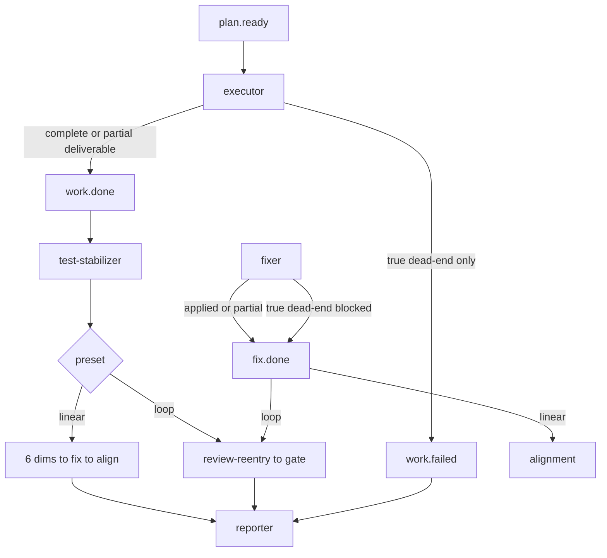

# 提高 work.failed / fixer-blocked 门槛并让 partial 走完主链

## Goal Capsule

把 `ce-executor-pipeline` 与 `ce-executor-pipeline-loop` 的执行/修复终态语义从「部分失败或验证非绿就 `work.failed` / fixer `blocked` 短路 reporter」改为：**只要有可审计交付，就发 `work.done` / `fix.done`（带 residual 账单），继续走完 test → review → fix →（loop 则 reentry/gate）→ alignment → report**；`work.failed` 与 fixer `fix_status=blocked` 只留给真正整盘死路。

**权威顺序：** 本计划 Product Contract > 两份 preset YAML + 对应 schema SSOT > 现有 BDD 期望（需随契约翻转）> 诊断报告描述。

**停止条件：** 出现必须改 `event_loop` / `runner` `check_default_publishes` / 注入 `task.resume` 才能成立的需求时，停止并向 operator 回报，不擅自扩机制。

**Product Contract preservation：** 无上游 brainstorm；本文件为 `ce-plan-bootstrap` 完整契约。

---

## Product Contract

### Summary

诊断显示 executor 0-emit 会经 `default_publishes` 注入 `work.failed` 并直接 reporter；同时 preset 指令与 BDD 把「任一 U parked / 验证回归 >0」也路由到 `work.failed`，砍掉下游链。产品目标是抬高失败门槛、让问题进账单并走完主链；**不**引入 runtime `task.resume`；再进 loop 靠 instruction 读 checkpoint/git 续跑。

### Requirements

- R1. 部分 Implementation Unit 在 3-retry 后仍失败，但已有 ≥1 个可交付 unit commit 时，executor **必须**发 `work.done`（含完整 unit 账单），**禁止**因此发 `work.failed`。
- R2. `new_business_regressions_count` / `flaky_or_environmental_count` > 0 **允许**出现在 `work.done`（写入 verification delta）；不得仅凭该条件强制 `work.failed`。
- R3. `work.failed` 仅当 true dead-end：无任何可交付 commit，或无法产出验证交接产物，或外部不可达 blocker。
- R4. `work.done` 触发后，线性 preset 必须继续 test-stabilizer → 六维 → synthesizer → fix-planner → fixer → alignment → reporter；loop preset 必须继续 test-stabilizer → review-reentry → … → review-gate（再按 gate 路由）。
- R5. fixer 与 executor 同精神：走完 planned fix units 后优先 `fix.done`（`applied` / `partial`）；`fix_status=blocked` 仅 true dead-end；`fix.done` 仍走现有下游（linear→alignment；loop→review-reentry）。
- R6. reporter 在存在 verification regressions 或 residual units 且非 dead-end trigger 时，默认 `pass_with_residuals`，不得仅因 `new_business_regressions_count > 0` 判 `blocked`。
- R7. 再进入同一 worktree/loop 时，executor/fixer instructions 必须要求先对账 `decisions.md` checkpoint 与 `git log <DIFF_BASE>..HEAD`，只跑 remaining units；**不**新增 runtime `task.resume`。
- R8. `presets/en/ce-executor-pipeline.yml` 与 `presets/en/ce-executor-pipeline-loop.yml`（及 pipeline schema SSOT）语义同步；禁止只改一份。
- R9. 不改 hat 拓扑 triggers（除文档澄清外）、不改 `default_publishes: work.failed` 作为 0-emit 安全网、不改 runner/event_loop 机制。

### Actors

- A1. Operator：启动/复用 worktree 再跑 loop。
- A2. Executor hat：整 plan 执行与终态 emit。
- A3. Fixer hat：按 fix plan 修复与终态 emit。
- A4. Downstream hats：test-stabilizer、六维、synthesizer、fix-planner、alignment、review-reentry、review-gate、reporter。
- A5. Runtime：isolated emit / schema policy / `default_publishes` 兜底（本计划只消费，不改造）。

### Key Flows

- F1. Partial unit failure → `work.done` + bill → 主链继续 → reporter `pass_with_residuals`。
- F2. Verification regressions on deliverable → `work.done`（red/delta）→ stabilizer/review/fix 处理 → reporter 非 blocked（除非其它 dead-end）。
- F3. True dead-end → `work.failed` → reporter `blocked`（短路径保留）。
- F4. Fixer partial → `fix.done{fix_status:partial}` → 下游继续；仅 dead-end 用 `blocked`。
- F5. Operator 再进：instruction 驱动从 checkpoint/git 续跑 remaining。

### Acceptance Examples

- AE1. U1 完成、U2 三退仍失败、U3 独立完成 → 事件含 `work.done`（`failed_units` 含 U2）且含 `stabilization.done`（或等价下游），**不含**因 U2 产生的 `work.failed`。
- AE2. `work.done` 带 `new_business_regressions_count: 1` 且 `post_verification_status: red` → policy-check 通过；reporter 最终非「仅因该计数」的 `blocked`。
- AE3. 无 completed commit 且无法跑验证 → `work.failed` → `report.done{verdict:blocked}`。
- AE4. fixer 修完部分 fix units → `fix.done{fix_status:partial}` → linear 进 alignment；loop 进 review-reentry。
- AE5. pipeline 与 pipeline-loop 对 R1–R3 / R5–R6 的 schema fill_rule 与 terminal 指令语义一致（loop 在 review-reentry 处分叉除外）。

### Scope Boundaries

**In scope**

- `presets/schemas/ce-executor-pipeline.yml` 的 `work.done` / `work.failed` / `fix.done` 相关 fill_rules 与 required_fields。
- `presets/en/ce-executor-pipeline.yml`、`presets/en/ce-executor-pipeline-loop.yml` 的同主题 schema 块与 executor/fixer/reporter/test-stabilizer instructions。
- BDD：`ce_executor_pipeline_executor_fail_stop.yml`、`ce_executor_pipeline_blocked.yml` 收窄、loop 新增 partial `work.done` 场景；`scenarios.rs` 注册/注释。
- `presets/en/ce-executor-pipeline-preset-author-notes.md` 与 `skills/ralph-preset-common/references/patterns.md` 中过时二分描述（若存在）。

**Out of scope / non-goals**

- `task.resume` / runner `check_default_publishes` 前注入续跑。
- 修改 `event_loop`、`hard_gate`、supervisor/wave。
- 修改 `ce-executor-supervisor`。
- 把 `work.failed` 改成也走 review 链（失败仍 short-circuit reporter）。
- 放宽 `payload_consistency` 的「`post_verification_status=green` 且 regressions>0」矛盾拒绝（诚实 red 路径仍合法）。
- 向 `crates/ralph-core/data/ralph-tools*.md` 写入本计划/preset 专名细节。

**Deferred**

- 0-emit 有磁盘进度时的 runtime 自动续跑（已否决；仅 instruction）。
- diagnostics 增强以区分 crash vs 静默退出。

### 已知约束和假设

- Isolated 单业务事件预算不变：每 activation 仍只发一个 `work.done` 或 `work.failed`。
- `executor.default_publishes: work.failed` 保留：真 0-emit 仍 fail-closed（安全网）。
- loop 的 `work.done`/`work.failed` schema 主要在 inline YAML（loop schema 不含完整 work.* SSOT）——必须与 pipeline SSOT **手工 parity**。
- Alignment 已按 `completed_units ⊂ planned_units` 标 residual；test-stabilizer 已按 `completed_units` scope——需在 instructions 写清 partial 语义，不一定改 triggers。

---

## Planning Contract

### Key Technical Decisions

- KTD1. `work.done` 增加与 `work.failed` 对齐的 unit 账单字段：`attempted_units` / `failed_units` / `blocked_units` / `skipped_units` / `decisions_file`，并增加 `execution_status: complete|partial`（对称 `fix_status`）。`(session-settled: user-directed — chosen over 仅靠 completed⊂planned 隐式 residual: 需要显式账单)`
- KTD2. 验证回归计数变为 report-only：fill_rule 删除「>0 → emit work.failed」；允许 `work.done` + red/delta。`(session-settled: user-directed — chosen over 保留 =0 硬门槛: 让下游链处理回归)`
- KTD3. 不做 runtime `task.resume`；续跑只写 instructions。`(session-settled: user-directed — chosen over 0-emit 磁盘进度注入 task.resume)`
- KTD4. 改动面限制在 preset/schema/BDD/operator skill 文案；机制不动。`(session-settled: user-directed — chosen over runner 扩展)`
- KTD5. fixer `blocked` 与 executor `work.failed` 同门槛：几乎干不成才 blocked。`(session-settled: user-directed — chosen over 仅改 executor)`
- KTD6. reporter：去掉「`new_business_regressions_count > 0` → blocked」分支，并入 `pass_with_residuals`（除非 `review_verdict==blocked` 或 dead-end trigger）。
- KTD7. 新增 `payload_consistency` 规则 `work-done-green-with-regressions`，与现有 `fix-done-green-with-regressions` 对称：禁止 `post_verification_status=green` 且 `new_business_regressions_count>0`；诚实 red/partial 不受影响。
- KTD8. partial `work.done` **不**要求 `report_input_file`；reporter Branch A 继续消费 verification artifacts + 事件 payload。`report_input_file` 仍仅 `work.failed` 死路包。
- KTD9. `skipped_units` 仅表示「已有 commit / 依赖 blocked 未 dispatch」等结算结果；emit 前必须完成 remaining 独立 U 的 full walk，禁止未走完就 `work.done`。
- KTD10. 保留现有 `ce_executor_pipeline_loop_fixer_fail_stop.yml` 作 characterization 对照时可改名注释；**另增** `loop_fixer_partial_continue`（或等价）覆盖「F2 失败后独立 F3 仍 applied → `fix_status=partial`」。

### High-Level Technical Design



### Assumptions

- 现有 `payload_consistency` 规则 `fix-done-green-with-regressions` 继续阻止「声称 green 却带 regressions」；本计划只允许 **诚实 red/partial**。
- 0-emit 仍注入 `work.failed` 可接受：本次不改机制；靠抬高 agent 主动 emit 门槛 + 续跑 instruction 降低复发。
- `execution_status` 与 `fix_status` 命名对称，避免引入第三套枚举。

### 并发执行说明（给 Coding Agent）

- **硬串行依赖：** U1 必须先于 U2/U3（schema fill_rule 不先改，partial `work.done` policy-check 会红）。
- **U1 Green 之后：** U2（instructions）与 U3（BDD）**可以并行**。
- **U2 内部：** pipeline 与 pipeline-loop 的 instructions 镜像改动可由两名 agent 并行，但合并前必须做语义 diff 对账。
- 单 agent 执行时仍建议 U1 → U2 → U3 线性，避免冲突。

### Alternative Approaches Considered

| 方案 | 为何不用 |
|---|---|
| `work.failed` 仍发但改路由走 review | 与 Q1=A 不符；双语义混淆 |
| runtime 0-emit + checkpoint → `task.resume` | 用户明确拒绝 |
| 仅改 instructions 不改 schema | fill_rule 仍会拒 honest red / 缺账单字段 |

---

## 1. 功能目标（Spec-First 摘要）

### 业务目标

尽量把计划执行完、测完、审完、修完；问题记进账单与报告，而不是半路 `work.failed` / blocked 收工。

### 本次范围

两份 pipeline preset（+ pipeline schema SSOT）的 `work.done`/`work.failed`/`fix.done` 契约与 executor/fixer/reporter/stabilizer 指令；对应 BDD 翻转与最小文档同步。

### 非目标

runtime 续跑机制、supervisor、改 `work.failed` 消费者拓扑、假成功 `default_publishes: work.done`。

### 已知约束和假设

见 Product Contract「已知约束和假设」与 KTD3–KTD4。

---

## 2. BDD 行为规格

### Feature B1：Executor partial 继续主链

```gherkin
Feature: Partial unit failure still continues the pipeline chain

  Scenario: Independent units continue and work.done carries the bill
    Given a plan with units U1, U2, U3 where U3 does not depend on U2
    And U1 completed with a commit
    And U2 failed after its 3-retry budget
    And U3 completed with a commit
    When the executor finishes the remaining-unit walk
    Then it emits work.done with execution_status=partial
    And failed_units contains U2
    And completed_units contains U1 and U3
    And it does not emit work.failed
    And test-stabilizer activates on work.done

  Scenario: Verification regressions do not force work.failed
    Given the executor has at least one completed unit commit
    And final verification reports new_business_regressions_count > 0
    And post_verification_status is red
    When the executor emits its terminal event
    Then the event is work.done
    And verification_delta_file documents the regressions
    And work.failed is not emitted for that reason alone

  Scenario: True dead-end still uses work.failed
    Given the executor produced zero completed unit commits
    And it cannot produce a verification handoff artifact
    When the activation ends
    Then it emits work.failed with a dead-end reason
    And reporter produces verdict=blocked
    And stabilization and review topics are absent
```

### Feature B2：Fixer 高门槛 blocked

```gherkin
Feature: Fixer prefers fix.done partial over blocked

  Scenario: Partial fixes continue downstream
    Given a fix plan with units F1, F2, F3
    And F1 applied, F2 failed after retries, F3 independent and applied
    When the fixer finishes the remaining-fix walk
    Then it emits fix.done with fix_status=partial
    And the linear preset activates alignment
    And the loop preset activates review-reentry

  Scenario: Fixer blocked only on true dead-end
    Given no fix unit could be applied and no auditable progress remains
    When the fixer terminates
    Then fix_status is blocked with failure_reason
    And the event is still fix.done not a silent stop
```

### Feature B3：Reporter residuals

```gherkin
Feature: Reporter maps residuals without premature blocked

  Scenario: Regressions map to pass_with_residuals
    Given align.done arrives after a chain that included work.done with regressions
    When reporter computes verdict
    Then verdict is pass_with_residuals unless review_verdict is blocked
    And verdict is not blocked solely because new_business_regressions_count > 0
```

### Feature B4：Instruction 续跑（无 runtime）

```gherkin
Feature: Re-entry continues from checkpoint via instructions

  Scenario: Executor skips completed units on re-activation
    Given decisions.md contains executor checkpoint lines for U1
    And git log DIFF_BASE..HEAD contains the U1 commit
    And plan.ready triggers executor again on a reused worktree
    When the executor observes checkpoints and git
    Then it does not re-implement U1
    And it only dispatches remaining units
```

### Feature B5：两 preset 同步

```gherkin
Feature: pipeline and pipeline-loop share terminal semantics

  Scenario: Schema fill_rules agree on work.done partial and dead-end work.failed
    Given both presets and the pipeline schema SSOT
    When strict preset lint and schema parity run
    Then work.done bill fields and softened regression fill_rules match
    And work.failed dead-end semantics match
```

---

## 3. 验收与测试策略

| Scenario | 验收条件 | 推荐测试层级 | 是否需要 E2E |
|---|---|---|---|
| B1 partial → work.done 续链 | 事件序含 work.done + stabilization；absent work.failed | BDD `run_workflow_guard_scenario` | 否 |
| B1 regressions 可 work.done | policy-check 接受 red work.done；无 work.failed | 契约/集成（emit policy）+ BDD | 否 |
| B1 dead-end work.failed | work.failed → report.done blocked；无下游链 | BDD（收窄 blocked fixture） | 否 |
| B2 fixer partial | fix.done partial → alignment 或 review-reentry | BDD（扩展现有 fixer fail-stop 注释/断言） | 否 |
| B3 reporter residuals | 短链：含 regressions 的 work.done → … → report.done{verdict:pass_with_residuals} | BDD workflow guard（最短合法 mock 链） | 否 |
| B4 续跑 instruction | 不测 runtime；checklist：instructions 含 checkpoint/git 对账硬规则 | 人工/preset review（禁止文案 byte-lock 测试） | 否 |
| B5 双 preset parity | preset_lint + schema parity + presets 数组测试绿 | 集成 lint | 否 |

---

## 4. 需求—测试追踪矩阵

| 需求 | Scenario | 验收测试 | 单元测试 | 集成/契约测试 | E2E |
|---|---|---|---|---|---|
| R1 | B1 partial | 重写 `ce_executor_pipeline_executor_fail_stop.yml` | 无（agent 语义） | workflow guard | 否 |
| R2 | B1 regressions | 新/改 scenario + schema example | payload_consistency 非误杀 red | `ralph emit --policy-check` 样例 | 否 |
| R3 | B1 dead-end | 收窄 `ce_executor_pipeline_blocked.yml` | 无 | workflow guard | 否 |
| R4 | B1 续链 | fail_stop 期望含 stabilization | 无 | workflow guard | 否 |
| R5 | B2 | loop fixer fail-stop 保持/微调断言 | 无 | workflow guard | 否 |
| R6 | B3 | reporter residuals BDD 短链 | 无 | workflow guard | 否 |
| R7 | B4 | instructions 审查 | 禁止文本锁测试 | 否 | 否 |
| R8 | B5 | lint 三联 | schema_parity | preset_lint + presets | 否 |
| R9 | — | diff 不含 runner/event_loop | 文件 ownership 检查 | 否 | 否 |

---

## Implementation Units

### U1. Schema：work.done 账单 + 放宽回归 fill_rule + 收窄 work.failed

- **Unit 目标：** 让 policy/schema 接受「partial / honest red 的 `work.done`」与「仅 dead-end 的 `work.failed`」，并同步 `fix.done` 的 regressions fill_rule 与 partial 路径一致。
- **对应 Scenario：** B1 regressions、B1 dead-end 字段、B5、B2 schema 侧。
- **Requirements：** R1–R3, R5, R8, R9。
- **Dependencies：** 无。
- **Files：**
  - `presets/schemas/ce-executor-pipeline.yml`
  - `presets/en/ce-executor-pipeline.yml`（inline `event_policy.schemas` 块）
  - `presets/en/ce-executor-pipeline-loop.yml`（inline work.* / fix.done 块）
  - 必要时 `crates/ralph-cli/src/presets.rs` 中依赖旧 fill_rule/示例字段的结构化测试
- **Approach：**
  1. 在 `work.done.required_fields` 增加：`attempted_units`, `failed_units`, `blocked_units`, `skipped_units`, `decisions_file`, `execution_status`。
  2. `execution_status` fill_rule：`complete` 当全部 planned 绿；`partial` 当有 failed/blocked/skipped 或 completed⊂planned。
  3. 结算规则（写进 field_docs）：`planned_units` = disjoint union(`completed_units`,`failed_units`,`blocked_units`,`skipped_units`)；`failed_units ⊆ attempted_units`；emit 前必须 full walk（KTD9）。
  4. 改 `new_business_regressions_count` / `flaky_or_environmental_count` fill_rule：report-only，写入 delta；**删除**「>0 → emit work.failed」。
  5. 改 `tests_passed` fill_rule：允许 `tests_passed < tests_run` 当 delta 已记录 regressions/flaky（与 R2 一致）；禁止暗示「必须减到全绿才可 work.done」。
  6. `work.failed.reason` fill_rule 收窄为 dead-end 前缀（保留 `unreachable` 等；去掉「任意 unit parked 即可」的暗示）。
  7. `fix.done`：regressions/flaky 改为 report-only；**删除**「regressions>0 → 必须 `review_verdict=blocked`」类暗示；`fix_status=blocked` 仅 true dead-end，与 `review_verdict` 解耦（KTD5）。
  8. 在两 preset 的 `payload_consistency.rules` 增加 `work-done-green-with-regressions`（KTD7）；保留现有 fix.done 规则。
  9. 更新 examples：一份 complete、一份 partial+red。
  10. **loop inline 必须复制 SSOT 的 `field_docs`/`fill_rule` 整段语义**（不只 required_fields 列表）；与 pipeline SSOT 做字段级对账表。
- **Execution note：** 先用 `ralph emit --policy-check` + `presets.rs` 结构化测试对样例 payload Red→Green；不要 byte-lock instructions。
- **Patterns to follow：** fixer 已有 `fix_status` + bill；`docs/guide/payload-consistency.md`；`skills/ralph-preset-common/references/patterns.md`。
- **可依赖的已完成能力：** 现有 schema merge、preset_lint schema_parity、payload_consistency 引擎、fix.done green+regressions 测试（约 `presets.rs` L1137+）。
- **明确禁止依赖的未来能力：** U2 instructions 文案、U3 BDD 事件期望（可用最小 policy-check fixture 自测）。
- **验收测试：**
  - partial `work.done`（含账单 + regressions>0 + post_verification_status=red）`--policy-check` 通过。
  - `post_verification_status=green` + regressions>0 的 `work.done` **与** `fix.done` 均被 consistency 拒绝。
  - dead-end `work.failed` 最小字段仍通过。
- **需要拆分的单元测试：** 在 `crates/ralph-cli/src/presets.rs` mirror fix.done 增加 honest-red `work.done` accept / green+regressions reject；更新任何硬编码旧 `work.done` required_fields 列表。
- **Red 预期失败原因：** 当前 fill_rule 拒绝 regressions>0 的 work.done；required_fields 缺少账单字段；无 work.done green+regressions 规则。
- **最小实现范围：** schema/YAML、payload_consistency 规则、直接失败的结构化测试；不改 hat instructions 大段（除非 example JSON 内嵌）。
- **集成验证：** `cargo nextest run -p ralph-cli --bin ralph -- preset_lint`；`cargo nextest run -p ralph-core -- preset_lint`；`cargo nextest run -p ralph-cli --bin ralph -- presets`。
- **回归范围：** 全部 embedded preset strict lint；WAC 含 pipeline。
- **完成标准：** 两 preset + SSOT 的 required_fields **与 fill_rule** 对齐；上述 lint 绿；policy-check 样例绿。
- **风险与注意事项：** loop 手工 parity 易漏；inline override 覆盖 SSOT 时勿留下旧 fill_rule。

### U2. Instructions：executor / fixer / reporter / stabilizer 终态与续跑

- **Unit 目标：** 把 agent 可见规则改成「尽量 `work.done`/`fix.done` 续链；dead-end 才失败；再进对账续跑」。
- **对应 Scenario：** B1–B4。
- **Requirements：** R1–R7, R8。
- **Dependencies：** U1。
- **Files：**
  - `presets/en/ce-executor-pipeline.yml`（executor / fixer / test-stabilizer / reporter）
  - `presets/en/ce-executor-pipeline-loop.yml`（同上 + 不破坏 review-reentry 语义）
  - 可选：`presets/en/ce-executor-pipeline-preset-author-notes.md`
- **Approach：**
  1. **Executor terminal：** 走完 remaining 独立 U 后，若 `completed_units` 非空 → 必须 `work.done` + `execution_status` + 账单；仅 completed 为空且无法交接 → `work.failed`。
  2. **必须清扫的矛盾段（pipeline；loop 镜像搜索同句）：**
     - ~1910–1927：任一 parked → `work.failed`
     - ~1924–1926 / ~2148–2149：final event 必须 `work.failed` unless every U green
     - ~1934–1940：baseline-aware DoD 暗示「no new business regressions」才可 `work.done`（与 R2 冲突）
     - ~2209–2268：Full-suite / repair 终止仍 force `work.failed`
     - ~2356–2389：emit 示例与结算说明
  3. **Full-suite repair：** 修不绿也允许 `work.done`+red/delta，交给 stabilizer/fix；不要因此 `work.failed`。
  4. **再进续跑 HARD RULE：** 激活后先读 `.ralph/agent/decisions.md` 的 `executor checkpoint:` 与 `git log <DIFF_BASE>..HEAD`；已 commit 的 U 跳过；只 dispatch remaining；禁止为「续跑」去调不存在的 runtime API。U2 DoD checklist 必须含：checkpoint 行格式、DIFF_BASE 来源（plan_baseline_sha / loop_start_sha）。
  5. **Fixer：** 镜像 executor——优先 `fix_status=partial`；`blocked` 仅 true dead-end；保持 per-unit walk + bill；独立 fix unit 在失败 unit 之后仍须尝试。
  6. **test-stabilizer：** 明确 trigger 可含 partial `work.done`；scope=`completed_units`；未完成 U 写入 exclusions。
  7. **reporter Branch A：** 删除「`new_business_regressions_count > 0` → blocked」（约 L4704）；并入 `pass_with_residuals`；Branch B 保留给 `work.failed`/`plan.blocked` 等 dead-end。
  8. 顶部注释/author-notes 中「work.done 或 work.failed 二分」改为新语义。
- **Execution note：** 禁止新增「instructions 必须包含某句原文」的测试；用 BDD 事件行为证明。
- **Patterns to follow：** HARD RULE 4 hat 视角；引用 skill 不复制；fixer settlement 段作模板。
- **可依赖：** U1 schema 字段名。
- **禁止依赖：** U3 场景文件最终 Green（可并行起草；**最终合并顺序 U2 先于 U3 关单**）。
- **验收测试：** preset_lint / presets 仍绿；人工对照 checklist：两 preset executor/fixer/reporter 关键规则一致 + 续跑 checklist。
- **单元测试：** 无。
- **Red 预期：** 若 U1 未合并，example emit JSON 缺字段会红——故必须 U1 先 Green。
- **最小实现范围：** instructions + 必要注释；不改 triggers 列表。
- **集成验证：** 同 U1 lint 三联。
- **回归范围：** 其它 hat instructions 不顺手大改。
- **完成标准：** 四处 hat 规则与 KTD 一致；上列矛盾行段已清除；pipeline↔loop 对账无矛盾。
- **风险：** loop reporter/gate 文案与 linear 复制不同步；合并时做一次语义 diff。
- **并发：** 本 Unit 可与 U3 **起草**并行；关单前 U2 应先合入。

### U3. BDD 翻转 + 文档/patterns 同步 + 门禁

- **Unit 目标：** 用真实 EventLoop scenario 锁定新行为；清掉旧 fail-stop 契约；同步 operator 文案。
- **对应 Scenario：** B1–B3, B5。
- **Requirements：** R1–R6, R8。
- **Dependencies：** U1（payload 合法）；U2 建议已合入（否则 mock 与真实 instructions 短期漂移可接受，但 DoD 要求三者一致）。
- **Files：**
  - `crates/ralph-core/tests/scenarios/ce_executor_pipeline_executor_fail_stop.yml`（重写或改名语义为 partial_continue）
  - `crates/ralph-core/tests/scenarios/ce_executor_pipeline_blocked.yml`（收窄为 dead-end；可保留简化 hat 拓扑，勿误改生产 triggers）
  - 新增 `crates/ralph-core/tests/scenarios/ce_executor_pipeline_loop_executor_partial_done.yml`（或等价名）
  - 新增 `crates/ralph-core/tests/scenarios/ce_executor_pipeline_loop_fixer_partial_continue.yml`（KTD10；独立 F3 继续）
  - 新增短链 reporter residuals scenario（B3）：最终 `report.done` verdict=`pass_with_residuals`
  - `crates/ralph-core/tests/scenarios.rs`（注册与注释；`test_pipeline_work_failed_payload_minimal` 若假设旧语义则更新）
  - `skills/ralph-preset-common/references/patterns.md`
  - `skills/ralph-preset-common/references/author-checklist.md` / `finding-rubric.md`（若 terminal/fill_rule 变更影响 AAF 评审则同步）
  - 可选 author-notes；可选 `docs/guide/payload-consistency.md` 一句同步
- **Approach：**
  1. **Outside-in：** 先改 fail_stop fixture：executor mock 改为 `work.done` partial bill → 后续 hats 用最小合法 mock 走到 report（linear）；`absent_events` 改为 absent `work.failed`（因 U2 parked）。
  2. blocked fixture：只保留无交付 dead-end；断言仍无 stabilizer/review。
  3. loop：新增 partial `work.done` → stabilizer → review-reentry 的短链（不必跑满六维若成本高，但至少证明不进 reporter via work.failed）。
  4. **Fixer：** 保留旧 `loop_fixer_fail_stop` 作对照或改注释；**新增** partial_continue：F2 failed 后独立 F3 applied → `fix_status=partial`，不得因 F2 单独 premature blocked。
  5. **Reporter residuals：** 最短 mock 链证明 regressions 不导致 `verdict=blocked`。
  6. **必须** `run_workflow_guard_scenario`，禁止 stub `run_scenario`。
  7. patterns / author-checklist / finding-rubric / payload-consistency guide 按需一句同步。
- **Execution note：** TDD——先让旧 fail_stop 在新契约下失败（期望事件不对），再改 fixture 至 Green；**最终 Green 前 U2 必须已合入**。
- **Patterns：** 现有 `ce_executor_pipeline.yml` happy path；`ce_executor_pipeline_loop_fixer_fail_stop.yml`。
- **验收测试：** `cargo nextest run -p ralph-core --test scenarios -- ce_executor_pipeline`。
- **单元测试：** 无新业务单测。
- **Red 预期：** 旧 fail_stop 仍期望 `work.failed` 且 absent `work.done`。
- **最小实现范围：** scenario YAML + scenarios.rs + 必要 patterns/checklist 行。
- **集成验证：** scenarios 子集 → lint 三联 → `./scripts/run-tests.sh`（DoD）。
- **回归范围：** 其它 pipeline scenarios（plan_blocked、stabilization_blocked、loop_max_round 等）不得被误改。
- **完成标准：** 计划内 Scenario 全绿；无新增 ignore/skip；R9 diff 无 runner/core event_loop。
- **风险：** 长链 mock 脆弱——优先最短能证明「不 short-circuit」的事件前缀 + 关键 absent/present。
- **并发：** 可与 U2 **起草**并行；关单顺序 U2 → U3。

---

## 5. 严格串行 / 并发开发单元（执行视图）

```text
U1 (schema) ──必须先完成──► ┌─ U2 (instructions)  ─┐
                            │   pipeline ‖ loop    │──► 全量门禁
                            └─ U3 (BDD+docs)      ─┘
```

单 agent：U1 → U2 → U3。  
多 agent：U1 完成后 U2∥U3。

每个 Unit 的 TDD 闭环（强制）：

1. 写/改验收测试或 policy-check 样例  
2. 确认以正确原因 Red  
3. 最小实现  
4. Green → 小 refactor  
5. Unit 集成（lint 或 scenarios）  
6. 受影响回归  
7. 满足完成标准再进入下一 Unit / 合并并行分支  

禁止：删断言、skip、`.only`、无解释更新 golden、mock 掉待验行为、只跑局部就宣称完成。

---

## Verification Contract

### 风险驱动测试

- Characterization：重写前保留旧 fail_stop 期望作 Red 对照（提交前替换）。
- Contract：`work.done`/`work.failed`/`fix.done` schema + payload_consistency。
- State-machine：linear vs loop 下游分叉用 BDD 事件序。
- 不做：runtime fault injection、task.resume 测试。

### 命令门禁（实现时）

- `cargo nextest run -p ralph-cli --bin ralph -- preset_lint`
- `cargo nextest run -p ralph-core -- preset_lint`
- `cargo nextest run -p ralph-cli --bin ralph -- presets`
- `cargo nextest run -p ralph-core --test scenarios -- ce_executor_pipeline`
- 最终：`./scripts/run-tests.sh`
- `cargo fmt` / `cargo clippy`（workspace 惯例）

### Outside-In 顺序

1. U1 契约（policy-check）  
2. U3 BDD 事件行为（可与 U2 并行起草）  
3. U2 agent 规则与契约对齐  
4. 全量回归  

---

## Definition of Done

- R1–R9 均有对应绿测或显式不可测项（R7 instruction-only）说明。
- pipeline 与 pipeline-loop 对 `work.done` partial / `work.failed` dead-end / fixer partial 语义一致。
- 旧「U2 fail → work.failed → 跳过整链」BDD 已翻转。
- reporter 不再仅因 regressions>0 判 blocked。
- 无 runner/event_loop/`task.resume` 改动。
- `./scripts/run-tests.sh` 通过；无新增失败/跳过测试。
- 未验证：真实 agent 0-emit 复发率（机制未改）；标为剩余风险。

---

## Risks & Dependencies

| 风险 | 缓解 |
|---|---|
| loop schema 手工漂移 | U1 完成标准含字段级对账表 |
| honest red 被其它 consistency 规则误杀 | U1 显式测 red 通过、green+regressions 仍拒 |
| BDD 长链过脆 | 最短前缀断言 + absent work.failed |
| 0-emit 仍易 blocked | 接受为安全网；R7 instruction 降低半程丢失 |

**依赖：** 无其它未合并计划硬依赖。

---

## Sources & Research

- 诊断：`docs/report/2026-07-24-ce-executor-pipeline-20260723-005-refactor-supervisor-concurrent-pipeline-plan-tidy-aspen-diagnosis.md`
- 模式：`skills/ralph-preset-common/references/patterns.md`、`docs/guide/payload-consistency.md`
- 假成功约束：`docs/solutions/developer-experience/agent-execution-contract-gates-2026-06-03.md`
- 勿 runtime 解析业务：`docs/solutions/logic-errors/base-runtime-must-not-parse-business-markdown.md`
- `pass_with_residuals`：`docs/solutions/integration-issues/ce-executor-serial-mechanism-close-loop-2026-06-23.md`

外部调研：未跑（本地契约与 BDD 模式充分）。
