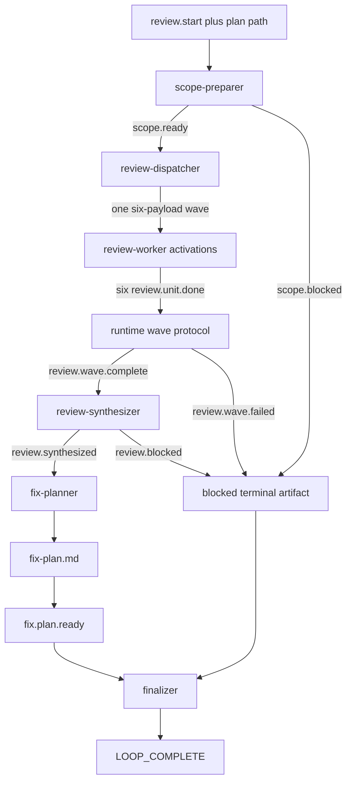
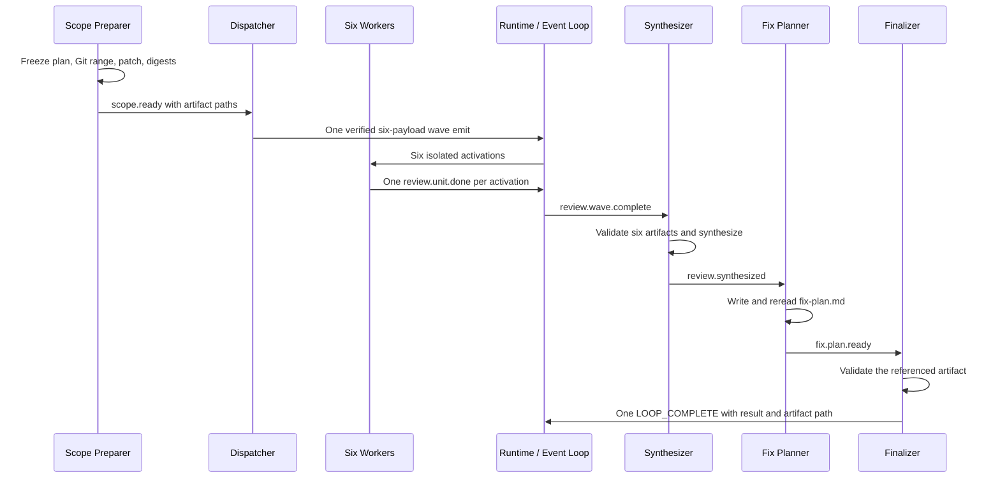

# Implementation Review Builtin Preset - Plan

## Goal Capsule

新增公开 builtin preset `implementation-review`：操作者提供一个已经完成实现的开发计划，preset 冻结该计划对应的 Git 审查范围，以一次 wave 并行执行六个相互独立的只读维度 review，汇总 P0–P3 findings，并在六维综合成功后生成一份可审计、可继续执行的 fix plan；阻塞路径生成可审计 block artifact。

**权威顺序：** 本计划 Product Contract > `presets/schemas/implementation-review.yml` > `presets/en/implementation-review.yml` > author notes 与下游文档。

**执行边界：** 只修改 preset、schema、builtin 注册、文档与测试；不新增 runtime 协议，不启用 supervisor execution model，不执行修复，不允许 reviewer 修改 tracked source。

**停止条件：** 如果默认 wave protocol suite 无法在不设置 `event_loop.supervisor.enabled: true`、不创建 worktree 的条件下形成六槽 SharedReadonly fan-out/fan-in，或现有 state projection 无法让 synthesizer取得冻结 scope identity，则停止并提交机制缺口，不扩 runtime payload。

**Product Contract preservation：** 无上游 brainstorm；本文件承接本次会话已确认的完整意图。

---

## Product Contract

### Summary

`implementation-review` 面向“开发计划已经实现，现在需要多维审查并产出修复计划”的场景。它以原计划和已提交 Git 历史为事实源，先冻结唯一审查范围，再让六个 reviewer 独立审查同一份 patch，最后去重、定级并生成 fix plan；六维综合成功时始终生成 fix plan，阻塞时只生成 block artifact，代码始终只读。

### Problem Frame

现有 `ce-executor-pipeline` 包含六维 review、综合与 fix-plan 阶段，但同时承担计划预审、实现、测试稳定化、修复、alignment 和报告，无法作为轻量的 post-implementation review 入口。直接复制其串行维度链会浪费并行能力；直接复制 `ce-executor-supervisor` 又会错误引入 supervisor database、worktree slot 和执行/fix 编排。

新 preset 必须把“审查范围”变成可恢复、可审计的数据面。任何 reviewer 自行重算 baseline、HEAD 或 diff 都可能看到不同代码，导致综合结果失真；因此首个 hat 必须唯一解析首个实现 commit，冻结 `baseline..HEAD` patch 与 digest，后续所有 hats 只消费冻结产物。

### Requirements

#### Scope discovery and freeze

- R1. 操作者通过 `--plan <plan.md>` 提供原开发计划；`scope-preparer` 必须读取计划与 Git 证据，唯一识别首个实现 commit `C`，同时记录 `first_implementation_commit_sha=C` 与能包含该提交的 `resolved_baseline_sha=C^`。
- R2. baseline 判断必须写入候选、采用证据、排除理由与置信结论；存在多个同等可信候选、根提交无父提交、无法安全解释的 merge parent 或 Git 对象不可读时，必须写阻塞 artifact 并停止。
- R3. 成功路径必须把 `plan_path`、baseline、冻结 `review_head_sha`、提交列表、changed files、binary diff patch 与 patch digest 写入 `.ralph/review/<plan>/`，后续 hats 不得重算这些值。
- R4. dirty 判定必须遵循确定程序：使用 NUL-delimited Git status，统一为 repo-relative paths，rename同时检查源/目标；相关路径集合为冻结 diff touched paths、计划文件自身与计划明确声明文件路径之并集。staged、unstaged 或 untracked dirty path 命中集合，或 source/test/config dirty无法分类时必须阻塞；`.ralph/review/`和仓库已知ignored build/cache paths不参与交集。
- R5. dispatcher 发 wave 前及 synthesizer 汇总前必须验证 `HEAD == review_head_sha`，并验证 tracked tree/write-set 与冻结证据一致；审查期间发生 tracked 漂移时必须阻塞。

#### Independent wave review

- R6. 六个维度固定为 `goal-alignment`、`correctness`、`testing`、`maintainability`、`project-standards`、`adversarial`，每个维度必须由独立 isolated activation 审查。
- R7. `review-dispatcher` 必须以一次批量 wave 发射恰好六个 `review.unit.ready` payload；不得逐维调用 wave，不得启用 supervisor，不得创建 worktree。
- R8. 六个 payload 必须携带相同的 plan、baseline、HEAD、patch path、patch digest 与 scope digest；每个维度值和 slot index 唯一，并使用稳定 idempotency key。active authoritative store内同key同payload必须dedup，同key不同payload必须冲突；跨进程恢复只在runtime持久store保留该wave时保证复用。
- R9. `review-worker` 一次 activation 只处理一个维度，只能读取 tracked code 和冻结 artifacts，并只写 `.ralph/review/<plan>/dimensions/<dimension>.md`；preset必须使用现有tool/write-path约束与modification audit阻止tracked source写入，worker不得wave emit或发布coordination topic。
- R10. testing 维度只审查 patch 中的测试覆盖、断言质量、遗漏场景与已有可见测试证据；所有 reviewer 都不得运行项目测试、构建或静态检查，避免越过已确认的只读 artifact-only 边界。
- R11. 每个维度无论是否发现问题都必须写完整 findings artifact；clean 使用 `findings_count: 0`，不得制造占位 finding。

#### Fan-in, synthesis, and fix plan

- R12. runtime 必须在同一 wave 的六个结果完整到齐后注入现有形状的 `review.wave.complete{wave_id, completed_dimensions, aggregate_timeout}`；worker terminal failure/timeout走现有`review.wave.failed`。store open、merge sink等更底层runtime I/O失败保持runtime失败，不伪称能由preset finalizer收尾。
- R13. `scope.ready` 必须通过 `state_projection` 把canonical scope manifest path、plan key和scope digest保留到后续orchestrator context；`review-synthesizer`从该可见投影和`completed_dimensions`推导六个canonical artifact paths，读取文件并验证dimension、counts、scope/patch digests，再去重、合并冲突证据并统一定级为 P0–P3。
- R14. `fix-planner` 必须把 P0–P2 转成依赖有序、文件范围明确、带验收测试与验证条件的 Implementation Units；P3 只进入 residual/后续建议。
- R15. 当六维 findings 全为 0 时，仍必须生成结构完整、明确写明无需修复且 actionable unit 数为 0 的空 `fix-plan.md`。
- R16. 完整结果和证据必须 artifact-first 落盘；event payload 仅携带短状态、计数、路径、digest、必要身份与路由字段。
- R17. agent-authored scope、artifact或fix-plan路径只发布一个带artifact的成功/阻塞handoff；独立`finalizer`验证该artifact。对runtime-authored`review.wave.failed`，finalizer从其payload创建`wave-blocked.md`。finalizer独占唯一`LOOP_COMPLETE`，其payload携带result与最终fix plan或block artifact路径。
- R18. 最终结果枚举固定为 `clean`、`residual_only`、`fixes_required`、`blocked`；发现 P0–P2 表示成功交付了一份待执行 fix plan，而不是 preset 执行失败。

#### Builtin and operator contract

- R19. preset 必须作为 public builtin 出现在 manifest、embedded registry、index 与 zsh completion 中，并在 `CLAUDE.md`、`AGENTS.md` 和相关规则文档的 builtin 列表中同步。
- R20. builtin schema 以 `presets/schemas/implementation-review.yml` 为 SSOT，由 build merge 注入；不得使用 `schema_file`，不得创建旧式 `crates/ralph-cli/presets/` 手工镜像。
- R21. 每个 hat 都必须通过 AAF 五问与 Payload Contract 审核；所有 path、digest、dimension、count、verdict 和 reason 字段必须有 agent-facing `field_docs`、安全 examples 与必要的 `trigger_context`。
- R22. 行为验证必须走结构化 lint、policy-check 和真实 EventLoop/wave 路径；禁止新增 prompt 文案包含断言、YAML 全文 byte equality 或 `run_scenario` stub。

### Actors

- A1. Operator：提供原开发计划，读取最终 fix plan，遇到 baseline 歧义时在外部澄清后重跑。
- A2. Scope Preparer：唯一拥有 baseline 解析、dirty 判定和冻结 patch 的 hat。
- A3. Review Dispatcher：唯一拥有六槽 wave fan-out 的 hat。
- A4. Review Worker：一个可并发 hat，每次 activation 只负责一个维度。
- A5. Review Synthesizer：唯一拥有六维完整性检查、去重和统一定级的 hat。
- A6. Fix Planner：唯一拥有 `fix-plan.md` 与 `fix.plan.ready` 的 hat。
- A7. Finalizer：消费所有成功/阻塞 handoff，验证对应artifact，并独占唯一 `LOOP_COMPLETE`。
- A8. Runtime wave protocol suite：在未启用supervisor execution model时，使用lazy SupervisorBridge/Store与SharedReadonly review slots调度worker，并注入wave complete/failed coordination events；不创建worktree。

### Key Flows

- F1. 唯一 baseline + clean relevant scope → 冻结 patch → 一次六槽 wave → 六维完整 fan-in → synthesized review → 非空 fix plan → completion。
- F2. 六维全部 clean → synthesized review 的 P0–P3 均为 0 → 空 fix plan → completion。
- F3. baseline 有多个等价候选 → 写候选与证据 → blocked，且不 dispatch wave。
- F4. 相关 dirty 或审查期间 HEAD/tree 漂移 → 写 block artifact → blocked，不生成可信综合结果。
- F5. 任一 wave slot 失败、超时、重复或 artifact 不一致 → fan-in fail-close → blocked，不生成部分 fix plan。
- F6. dispatcher在同一authoritative store生命周期内用同一idempotency key和相同payload重入 → 复用既有wave；同key不同payload → 硬冲突。crash后只有持久store仍含该wave时可恢复复用，InMemory store丢失时必须停止旧loop并由operator重跑。
- F7. 任一成功或阻塞 handoff → finalizer验证对应artifact → `LOOP_COMPLETE{result, artifact_path}`，不存在悬挂或多个hat争抢completion。

### Acceptance Examples

- AE1. 首个实现 commit 为 `C` 且 `C` 有一个父提交时，冻结 diff 使用 `C^..HEAD`，patch 包含 `C` 的修改。
- AE2. 两个同等可信首提交候选存在时，输出 `scope-analysis.md` 列出候选与证据，事件流不含 `review.unit.ready`。
- AE3. 六个 worker 收到相同 scope digest，各自产出唯一 dimension artifact 后，runtime 只注入一个 `review.wave.complete`。
- AE4. 五份结果成功、一份超时或缺文件时，synthesizer 不发布 `review.synthesized`，终态为 blocked。
- AE5. 所有 findings count 为 0 时，最终仍存在 `synthesized-review.md` 与无 actionable units 的 `fix-plan.md`。
- AE6. 混合 P0–P3 时，P0–P2 映射到 fix units，P3 只出现在 residual，且每个 unit 可追溯到 finding IDs。
- AE7. reviewer 修改 tracked 文件后，即使其 findings event 合法，后置 write-set gate 仍阻止成功综合。

### Scope Boundaries

**In scope**

- 新 public builtin preset、schema SSOT 和 preset author notes。
- 默认 wave protocol suite 的六维 SharedReadonly review fan-out/fan-in。
- baseline/dirty/scope freeze 合同、artifact-first handoff、空/非空 fix plan。
- builtin 注册、补全、项目说明、operator skill 反向检查和真实 runtime tests。

**Out of scope**

- 自动执行 fix plan 或修改被审查代码。
- 自动让用户从多个 baseline 候选中选择并恢复同一 loop。
- supervisor execution mode、slot worktree或merge/fix waves；默认wave protocol内部选择SupervisorStore（包括可用时的SQLite）不属于本preset新增能力。
- 增加安全/性能等第七、第八维。
- 对未提交实现进行 review。
- reviewer 读取 `.ralph/events.jsonl`、`.ralph/loops.json` 或 `.ralph/supervisor.db`。

**Deferred to Follow-Up Work**

- operator 在 blocked 后通过显式 baseline override 继续同一 workflow。
- 将 fix plan 自动交给另一个 builtin preset 执行。

---

## Planning Contract

### Key Technical Decisions

- KTD1. 使用 `implementation-review` 作为 builtin 名称。`(session-settled: user-directed — chosen over ce-review-to-fix-plan and longer workflow names: the public name should be concise and should not carry the ce prefix)`
- KTD2. 使用 `wave` 执行六维并行 review，不设置`event_loop.supervisor.enabled: true`；runtime内部仍复用默认lazy SupervisorBridge/Store与SharedReadonly slots，但不创建worktree。`(session-settled: user-directed — chosen over single-chain, supervisor, and supervisor+wave: independent review dimensions benefit from bounded fan-out without worktree orchestration)`
- KTD3. 代码保持只读，只允许写 review artifacts 和 fix plan。`(session-settled: user-directed — chosen over allowing reviewers to apply small fixes: review and repair authority must remain separate)`
- KTD4. baseline 无法唯一确定时 fail-close，并输出候选与证据。`(session-settled: user-directed — chosen over selecting the strongest candidate automatically: an incorrect range would invalidate every downstream finding)`
- KTD5. 只审查已提交实现；相关未提交修改阻塞。`(session-settled: user-directed — chosen over folding working-tree changes into the patch: the review must be replayable against immutable Git objects)`
- KTD6. 保留 `ce-executor-pipeline` 的六个维度。`(session-settled: user-directed — chosen over adding security/performance dimensions or merging project standards: the existing six provide the desired review breadth at bounded cost)`
- KTD7. P0–P2 生成 actionable fix units，P3 进入 residual；零 findings 仍生成空 plan。`(session-settled: user-directed — chosen over dropping lower-priority findings or omitting the fix-plan artifact: every run needs one auditable terminal deliverable)`
- KTD8. 拓扑采用六个 hat：`scope-preparer → review-dispatcher → review-worker(concurrency >= 6) → review-synthesizer → fix-planner → finalizer`；worker 复用同一 hat id，以 payload dimension 区分 activation，finalizer统一消费成功与阻塞 handoff。
- KTD9. `review.wave.complete` 由 runtime 注入，agent 不得发布；schema 必须以 `crates/ralph-cli/src/loop_runner/wave/dispatcher.rs` 实际构造字段为准，不为 coordination event 发明 runtime 不会填的字段。
- KTD10. scope identity 使用 canonical manifest 内容的 digest，至少绑定 plan path、first implementation commit、baseline、review HEAD、commit set、changed paths、patch path 与 patch digest；所有下游 payload 传递同一 digest。
- KTD11. dirty 相关性采用确定集合交集，不交给自然语言判断；无法可靠提取计划声明文件时，dirty workspace fail-close。
- KTD12. 六个 payload 先落盘成一个不可变 JSONL artifact，使用相同字节做 wave precheck/verify 与真实 emit，避免验证内容和实际派发内容漂移。
- KTD13. write-set gate比较 HEAD、tracked status 与内容树证据，忽略本 preset 自有 `.ralph/review/<plan>/` artifacts；仅 hash 路径列表不足以证明代码未变。
- KTD14. finalizer只发布`LOOP_COMPLETE`；不增加preset专用required event或双终态例外，其它hats每次activation只发一个成功或阻塞handoff。
- KTD15. fix plan成功结果分为`clean`、`residual_only`、`fixes_required`；agent可观察的范围、artifact、worker或写入失败为`blocked`，更底层runtime基础设施错误由loop runtime报告。
- KTD16. `scope.ready` 的state projection是跨wave数据面索引：synthesizer不从`review.wave.complete`索取其不存在的scope字段，也不读internal ledger，而是从orchestrator context取得scope manifest并按canonical dimension paths读取完整结果。
- KTD17. preset只承诺将agent/policy可观察的blocked handoff与现有`review.wave.failed`交给finalizer；底层store/merge/runtime I/O错误由loop runtime报告，不扩大本计划修改`dispatcher.rs`的范围。
- KTD18. 对runtime-authored`review.wave.failed`，finalizer是`wave-blocked.md`的创建者；该路径不要求上游先提供不存在的业务artifact。
- KTD19. idempotency按store生命周期分级：active store内强dedup；持久store重启后可恢复；InMemory store丢失后的旧loop不得承诺恢复，operator重跑会建立新scope/wave。

### High-Level Technical Design





### Output Structure

```text
presets/
├── en/
│   ├── implementation-review.yml
│   └── implementation-review-preset-author-notes.md
└── schemas/
    └── implementation-review.yml
```

### Assumptions

- 计划中“明确文件路径”可以从现有 plan formats 中保守提取；提取失败且 workspace clean 时仍可继续，因为冻结 diff touched paths 已确定审查范围。
- 默认wave热路径在`event_loop.supervisor.enabled: false`时仍会lazy创建SupervisorBridge并打开默认SupervisorStore；store可能是SQLite或InMemory，这属于wave实现细节，不把preset升级为supervisor execution model。
- reviewer不运行测试、构建或静态检查，只写各自allowlisted review artifact。
- `presets/index.json` 使用现有最接近的 development/workflow 分类，不新增 category enum。

### Alternative Approaches Considered

| 方案 | 不采用原因 |
|---|---|
| 复用完整 `ce-executor-pipeline` 并跳过 executor | 会保留大量无关 hats、串行 review 与修复/报告语义 |
| 六个独立 reviewer hat 串行触发 | 无法满足用户选择的 wave 并行模型 |
| 启用 supervisor execution model | 纯 review复用默认wave coordination与SharedReadonly slots，不需要preset显式启用supervisor、worktree和merge |
| reviewer 各自计算 diff | HEAD 或 baseline 漂移会导致六份结果不可比较 |
| dispatcher 收齐 worker events 后自行 emit complete | coordination topic 属于 runtime authority，agent emit 会被 origin guard 拒绝 |

---

## Implementation Units

### U1. 固定事件拓扑、schema SSOT 与 runtime wave 契约

**Goal:** 建立可被 runtime、lint 和每个 isolated hat共同理解的六-hat topic graph、字段合同与终态合同。

**Requirements:** R6–R9, R12, R16–R22；KTD8–KTD10, KTD14–KTD15。

**Dependencies:** none。

**Files:**

- `presets/en/implementation-review.yml`
- `presets/schemas/implementation-review.yml`
- `presets/en/implementation-review-preset-author-notes.md`
- `crates/ralph-core/src/preset_lint/` 下受现有通用规则影响的测试文件（仅在结构化覆盖不足时）

**Approach:**

1. 先核对`handle_wave_events`、`execute_wave_via_supervisor_with_executor`、`run_supervisor_fan_in`和`build_wave_complete_payload`，冻结默认wave热路径与runtime实际提供的`review.wave.complete`/failed字段。
2. 定义成功 topics：`scope.ready`、`review.unit.ready`、`review.unit.done`、`review.synthesized`、`fix.plan.ready`；为 scope、wave、artifact、fix-plan 定义各自阻塞 handoff，全部由 finalizer 消费，确保每个 trigger 有合法 producer/consumer。
3. 配置 `execution_mode: isolated`，不出现 `event_loop.supervisor.enabled: true`；为 `review-worker` 设置足以容纳六槽的 concurrency。
4. 在 schema SSOT 为 agent-authored topics声明 required fields、allowed values、`field_docs`、safe examples 和 trigger context；runtime coordination schema只声明 runtime真实可构造字段；`scope.ready`的state projection保存canonical manifest path、plan key和scope digest。
5. 在 author notes首部写入本计划确认的 Preset Intent Confirmation，并为六个 hats逐一完成 AAF 五问、每 topic Payload Contract、wave hard questions和 Artifact-First hard questions。
6. 配置 `completion_promise: LOOP_COMPLETE`，不设置额外required event；只有finalizer发布completion。

**Patterns to follow:**

- `presets/en/ce-executor-supervisor.yml` 的generic review dispatcher/worker合同，仅抽取wave能力，不复制supervisor execution配置。
- `presets/en/ce-executor-pipeline.yml` 与 `presets/schemas/ce-executor-pipeline.yml` 的 artifact-first dimension/synthesis/fix-plan字段。
- `skills/ralph-preset-common/references/{agent-native-model,author-checklist,patterns,finding-rubric}.md`。

**Test scenarios:**

- 六个 hats 的 publisher/consumer/terminal 路径通过 WAC、ownership、topic format和multi-hat isolated lint。
- `review-worker.concurrency` 可让同一 topic 的六个 payload被检测为一个 wave。
- agent尝试 emit `review.wave.complete` 被 origin contract拒绝，而 runtime注入形状通过 schema。
- finalizer只发布一次`LOOP_COMPLETE`；fix-planner仅发布`fix.plan.ready`，其它hats无completion authority。
- 每个 schema path字段的 metadata能指导 agent先写 artifact再填路径，不允许伪造固定路径。

**Verification:** 三组 targeted preset lint/presets tests通过；`ralph preset check` 对新 preset无 error；author notes预审无空项。

### U2. 实现 scope freeze、baseline 歧义与 dirty fail-close

**Goal:** 让 scope-preparer以可审计、可重放的方式唯一确定完整 `C^..HEAD` 审查范围，并在输入不可信时停止。

**Requirements:** R1–R5, R16；F1–F4；AE1–AE2。

**Dependencies:** U1。

**Files:**

- `presets/en/implementation-review.yml`
- `presets/schemas/implementation-review.yml`
- `presets/en/implementation-review-preset-author-notes.md`
- `crates/ralph-core/tests/scenarios/implementation_review_scope.yml`
- `crates/ralph-core/tests/scenarios.rs`

**Approach:**

1. scope-preparer从 runtime可见 plan path读取计划，再用 Git提交、diff、commit message和计划文件历史形成候选集合；候选必须有可复核证据，不能仅靠时间接近。
2. 将 `first_implementation_commit_sha` 与 `resolved_baseline_sha` 分开；普通单 parent提交取父提交作为 baseline，merge/root/ambiguous shapes按 R2 fail-close。
3. 写 `scope-analysis.md`、`review-context.md`、binary `review.diff.patch` 和必要结构化 manifest；重新打开文件并计算 patch/scope digests后才 policy-check/emit。
4. 按R4的NUL-delimited、repo-relative与rename双端规则计算dirty path交集并记录命中集合；无法分类时阻塞。成功冻结后通过event与state projection交接artifact paths和digest。
5. 阻塞路径也先写完整 block artifact，event只携带短 reason code、候选数和artifact path。

**Patterns to follow:**

- `ce-executor-pipeline` plan-reviewer 的 baseline reconciliation思想，但不读取 runtime internal ledger。
- Artifact-first emitter顺序：写文件、复读、policy-check、真实 emit。

**Test scenarios:**

- 单一首实现 commit `C` 生成包含 `C` 的 `C^..HEAD` patch。
- 两个等价候选、root commit、无法解释的 merge parent分别阻塞并列出证据。
- 计划文件不存在、不可读或不含可识别目标时阻塞。
- staged、unstaged、untracked相关路径分别阻塞；明确不相交 dirty path被记录但不污染patch。
- binary文件、rename和delete出现在冻结patch与changed-file manifest中。
- emit前HEAD变化或patch digest复算不一致时阻塞。

**Verification:** 真实 workflow guard scope scenarios证明成功只发布一次 `scope.ready`，失败只走 blocked路径且无 `review.unit.ready`。

### U3. 实现一次批量六维 wave fan-out 与只读 workers

**Goal:** 从冻结 scope以一个可重入的 wave并行运行六个独立reviewer，并为每个维度保存完整证据。

**Requirements:** R5–R11, R16, R20；F1, F6；AE3, AE7。

**Dependencies:** U1, U2。

**Files:**

- `presets/en/implementation-review.yml`
- `presets/schemas/implementation-review.yml`
- `presets/en/implementation-review-preset-author-notes.md`
- `crates/ralph-core/tests/scenarios/implementation_review_wave.yml`
- `crates/ralph-core/tests/scenarios.rs`
- `crates/ralph-cli/src/loop_runner/tests/wave_supervisor.rs` 或现有dispatcher integration test归属文件

**Approach:**

1. dispatcher读取 scope artifacts并在派发前复核HEAD、tree状态和digests。
2. 一次生成六行不可变payload artifact，每行包含唯一dimension/slot与共享scope identity；同一文件先做wave policy/verify，再以相同字节真实emit。
3. 使用稳定idempotency key；同一active store内相同key+相同payload接受dedup，相同key+不同payload fail-close；分别验证持久store重启恢复与InMemory store丢失后的停止/重跑边界。
4. review-worker只从 trigger context取得自己的dimension和artifact路径，读完整plan/patch/code后审查，写唯一dimension文件，再policy-check/emit `review.unit.done`。
5. testing维度只审查测试diff、覆盖边界、断言强度、缺失场景与计划/提交中已有的测试证据；不得执行测试、构建或静态检查。
6. 为worker配置现有write-path allowlist与modification audit，只允许各自dimension artifact；worker收尾仍复核tracked状态，发现变化时以失败结果交给fan-in，不自行清理或revert。

**Patterns to follow:**

- `docs/solutions/integration-issues/ce-executor-wave-emission-must-batch-in-single-emit-2026-06-09.md`。
- `crates/ralph-core/data/ralph-tools-wave.md` 与 `ralph-tools-emit.md` 的当前语法和OPAC顺序。
- `presets/en/ce-executor-pipeline.yml` 六个dimension职责。

**Test scenarios:**

- 一个batch产生同一wave id、`wave_total=6`和六个唯一slot，而不是六个`wave_total=1`。
- 六个worker收到完全相同scope digest与patch digest。
- active store内同key同payload重入不重复派发；同key不同payload被拒；持久store重启可恢复，InMemory store丢失不承诺跨进程dedup。
- worker只能发布`review.unit.done`，不能wave emit或伪造coordination topic。
- 每个clean reviewer写artifact并发`findings_count:0`。
- testing worker产出测试质量与覆盖审查artifact；所有workers均未执行测试或构建。
- worker对tracked code写入后，write-set gate使该slot失败。

**Verification:** CLI dispatcher integration证明真实六槽SharedReadonly fan-out/fan-in；EventLoop scenario只证明topic/schema/终态链与单business event预算。

### U4. 实现完整 fan-in、综合定级、fix plan 与统一收尾

**Goal:** 只有在六份可信结果完整到齐时生成统一review和fix plan，并让零finding、混合severity和所有阻塞路径都通过finalizer可靠收尾。

**Requirements:** R5, R11–R17, R20；F1–F5；AE4–AE7。

**Dependencies:** U1, U3。

**Files:**

- `presets/en/implementation-review.yml`
- `presets/schemas/implementation-review.yml`
- `presets/en/implementation-review-preset-author-notes.md`
- `crates/ralph-core/tests/scenarios/implementation_review_fan_in.yml`
- `crates/ralph-core/tests/scenarios.rs`

**Approach:**

1. synthesizer只触发于runtime `review.wave.complete`；从completed dimensions与orchestrator context中的scope projection推导canonical artifact paths，重新验证HEAD/tree、六个唯一dimensions、统一scope/patch digest、artifact存在可读以及文件内counts一致。
2. 读取六份完整文件，按稳定finding id去重；冲突结论保留双方证据并由severity/risk理由裁决，不使用多数票。
3. 写并复读`synthesized-review.md`后才发布`review.synthesized`；任何完整性失败先写blocked artifact并走失败终态。
4. fix-planner只从synthesized artifact生成`fix-plan.md`。P0–P2一finding或一组同根因finding映射到可执行units；P3集中到residual并保留来源。
5. 空计划仍包含scope identity、六维clean摘要、0 counts、无需修复结论和空Implementation Units。
6. fix-planner复读最终文件并policy-check后只发`fix.plan.ready`，result取`clean`、`residual_only`或`fixes_required`。
7. finalizer消费`fix.plan.ready`及所有blocked handoff，验证agent-authored artifact与摘要计数；收到runtime `review.wave.failed`时先写并复读`wave-blocked.md`。随后只发布一次`LOOP_COMPLETE`，payload直接指向`fix-plan.md`或对应block artifact；成功handoff缺文件或计数不一致时以`blocked`收尾。

**Patterns to follow:**

- `ce-executor-pipeline` review-synthesizer与fix-planner的artifact消费模式。
- 当前统一plan的U-ID稳定性、Files/Dependencies/Test scenarios/Verification字段，但fix plan只保留执行所需内容。

**Test scenarios:**

- 六份合法结果生成一个synthesized artifact和一个fix plan。
- 5/6、重复dimension、错误wave id、错误scope digest、缺失/不可读artifact、count不一致分别blocked。
- 六维0 findings生成空fix plan并成功completion。
- 混合P0–P3时P0–P2形成units、P3只进入residual。
- 两个维度报告同一根因时去重但保留全部source finding ids。
- synthesizer前HEAD或tracked tree漂移时blocked。
- finalizer没有收到合法成功/阻塞handoff时不得完成；合法handoff只产生一次`LOOP_COMPLETE`。
- scope、`review.wave.failed`、artifact与fix-plan写入失败都能经finalizer完成`blocked`终态；store/merge等runtime基础设施错误不在此合同内。
- 非空fix plan使用`fixes_required`成功结果；仅P3使用`residual_only`，不误报blocked。

**Verification:** workflow guard scenarios断言完整事件序、artifact消费和absent events；不得使用stub runner。

### U5. 注册 public builtin并同步 agent/operator 文档

**Goal:** 让操作者能够发现、补全和运行`builtin:implementation-review`，并确保所有面向agent的指南仍与实际命令和preset合同一致。

**Requirements:** R18–R20。

**Dependencies:** U1–U4。

**Files:**

- `presets/manifest.yml`
- `crates/ralph-cli/src/presets.rs`
- `presets/index.json`
- `scripts/ralph-zsh-plugin.zsh`
- `CLAUDE.md`
- `AGENTS.md`
- `.cursor/rules/multi-hat-isolation.mdc`
- `crates/ralph-core/data/ralph-tools-wave.md`
- `crates/ralph-core/data/ralph-tools-emit.md`
- `skills/ralph-preset-common/references/{agent-native-model,author-checklist,commands,finding-rubric,patterns}.md`
- `.agents/skills/ralph-preset-author/` 与 `.agents/skills/ralph-preset-review/` 的同步副本（若仓库同步机制要求）

**Approach:**

1. 将preset加入manifest、public `PRESETS`、index与zsh `compadd`列表，保持现有builtin描述风格。
2. 更新`CLAUDE.md` builtin列表后复制同步`AGENTS.md`，并更新multi-hat规则中的可见列表；最终断言两文件完全一致。
3. 反向检查agent skill guides：本功能未新增CLI语法时，保持`ralph-tools*.md`不变并记录no-op rationale；若现有wave文档与实际`--payloads-stdin`/verify/idempotency合同漂移，则按通用语义修正，禁止写preset专名。
4. 反向检查preset author/review skills的wave、trigger context、artifact-first和finding映射；通用规则已覆盖时记录no-op rationale，不能为本preset写过窄规则。
5. 安装更新后的zsh plugin到当前用户路径并验证completion加载。

**Patterns to follow:**

- `presets/manifest.yml` + `crates/ralph-cli/build.rs` 当前embedded SSOT流程。
- `scripts/ralph-zsh-plugin.zsh` 对含冒号builtin值使用`compadd`。

**Test scenarios:**

- builtin list、get、index和zsh completion都精确包含`implementation-review`。
- build将schema SSOT merge进embedded preset，且manifest/PRESETS parity通过。
- `CLAUDE.md`与`AGENTS.md`字节一致。
- CLI docs drift脚本无新增漂移；任何`ralph-tools*.md`源码引用仍有效。
- operator negative fixture的AAF/review说明仍成立。

**Verification:** embedded preset tests、doc drift、zsh加载验证通过；无旧mirror或ephemeral文件进入diff。

### U6. 汇总结构化验收、严格 lint 与全量回归

**Goal:** 整合并补齐U2–U4已有fixtures，用真实runtime行为而非prompt文本锁定跨阶段成功、空结果、阻塞和重入合同。

**Requirements:** R1–R22；AE1–AE7。

**Dependencies:** U2–U5。

**Files:**

- `crates/ralph-core/tests/scenarios/implementation_review_scope.yml`
- `crates/ralph-core/tests/scenarios/implementation_review_wave.yml`
- `crates/ralph-core/tests/scenarios/implementation_review_fan_in.yml`
- `crates/ralph-core/tests/scenarios.rs`
- `crates/ralph-cli/src/presets.rs`
- 必要的wave fixture文件，放在现有`crates/ralph-core/tests/fixtures/`约定目录

**Approach:**

1. 整合U2–U4的`run_workflow_guard_scenario` fixtures，仅覆盖topic/schema/终态链；禁止把mock scenario声称为真实wave证据，禁止重复实现同一fixture或使用`run_scenario`。
2. 结构化测试覆盖schema metadata、allowed values、topic ownership、origin、single-event budget、trigger context和manifest parity。
3. 在`ralph-cli` dispatcher integration补真实一次batch、六槽SharedReadonly、payload builder和fan-in行为；不要把preset YAML或instructions全文锁进断言。
4. 在带`RALPH_CURRENT_HAT`等污染环境下复跑任何会spawn `ralph`的新增集成测试，确保human CLI fixture完成scrub。
5. targeted tests全部通过后运行全workspace入口；出现时序flake才使用允许的serial fallback，不能把fallback当默认门禁。

**Patterns to follow:**

- `crates/ralph-core/tests/scenarios/`现有workflow guard fixtures。
- `crates/ralph-core/tests/fixtures/wave-isolated-dimension-done/`的wave结构证据，但使用本preset六维合同。

**Test scenarios:**

- scope唯一、ambiguous、related dirty、unrelated dirty和review-time drift。
- 六槽单wave、dedup重入、payload冲突、worker越权和tracked write。
- 6/6 success、5/6 timeout、duplicate dimension、digest mismatch和missing artifact。
- all-clean空plan与混合P0–P3非空plan。
- completion ownership及各失败路径的absent events。
- embedded builtin discovery、strict lint和schema/preset parity。

**Verification:** Verification Contract中的全部门禁通过，最终全量测试无新增skip/ignore/flake。

---

## Verification Contract

| Gate | Coverage | Done signal |
|---|---|---|
| `cargo nextest run -p ralph-cli --bin ralph -- preset_lint` | CLI builtin strict lint、schema merge、ownership | 新preset无error |
| `cargo nextest run -p ralph-core -- preset_lint` | core WAC、AAF相关结构、topic graph | 所有相关lint绿色 |
| `cargo nextest run -p ralph-cli --bin ralph -- presets` | manifest/PRESETS/embedded/index/completion | public builtin parity绿色 |
| `cargo nextest run -p ralph-core --test scenarios -- implementation_review` | topic/schema链、scope/fix-plan handoff与终态 | workflow guard scenarios绿色 |
| `cargo nextest run -p ralph-cli --bin ralph -- wave`及对应dispatcher integration subset | 一次六payload、SharedReadonly slots、review complete/failed payload builder与fan-in | 默认wave热路径结构化测试绿色 |
| 污染agent env下的相关CLI integration subset | human CLI env scrub | 与clean env结果一致 |
| `scripts/check-cli-doc-drift.sh` | agent skill command/source references | 无drift |
| zsh completion安装与加载检查 | `builtin:implementation-review`可发现 | 当前用户completion返回新值 |
| `./scripts/run-tests.sh` | workspace nextest + doctest最终基线 | 全量绿色 |

若默认全量基线出现明确竞态/时序flake，允许用`RALPH_BASELINE_SERIAL=1 ./scripts/run-tests.sh`诊断恢复；serial仍失败视为真实失败。不得裸跑`cargo test -p ralph-cli`。

---

## Definition of Done

- `builtin:implementation-review`可从CLI列表、index和zsh completion发现并运行。
- 六-hat isolated拓扑在不启用supervisor execution model或创建worktree的情况下，复用默认wave protocol suite完成一次六槽SharedReadonly wave、runtime fan-in与统一finalizer收尾。
- 首个实现commit不会从patch中漏失；baseline歧义、相关dirty和Git异常均fail-close并留下证据。
- 六个reviewers共享同一冻结scope，互不读取彼此结论，且没有tracked source修改。
- 每个维度都有完整artifact；clean用0 finding表示，且任何reviewer都未执行测试、构建或静态检查。
- fan-in对缺失、重复、超时、错误digest、不可读artifact和review期间漂移全部fail-close。
- P0–P2生成可执行fix units，P3进入residual；全clean仍生成空fix plan。
- event payload仅承载控制面；所有重要内容先落盘且有消费方和生命周期责任。
- author notes含六个hats完整AAF/Payload Contract与wave/artifact-first hard questions，无空项。
- preset/schema/builtin/docs/operator skills同步检查完成；no-op项有明确理由。
- 不存在prompt文本锁测试、YAML全文byte equality测试、stub scenario、旧embedded mirror或ephemeral文件。
- targeted门禁、CLI doc drift、zsh验证和`./scripts/run-tests.sh`全部通过。
- `CLAUDE.md`与`AGENTS.md`完全一致。
- 所有放弃方案或实验性内容从最终diff清理，不遗留死配置和无消费者topic。

---

## Risks & Dependencies

| Risk | Mitigation |
|---|---|
| 将首个实现commit自身当baseline导致漏审 | 同时记录`C`与`C^`，AE1和scope scenario固定语义 |
| 从supervisor preset复制出worktree/持久化DB依赖 | KTD2禁止supervisor execution配置；只复用默认wave protocol |
| 六个payload被逐条emit成六个单槽wave | dispatcher一次批量emit，runtime test断言同一wave id与total=6 |
| runtime coordination schema与实际payload漂移 | U1直接核对payload builder并做结构化测试 |
| “相关dirty”由agent主观判断 | KTD11集合交集算法与无法分类fail-close |
| review期间外部进程修改代码 | dispatch前、worker后、synth前HEAD/tree/write-set三重门禁 |
| review误执行测试并产生副作用 | R10禁止所有reviewers运行测试、构建和静态检查 |
| wave 5/6结果诱导部分综合 | runtime failed/timeout路径与synthesizer六维完整性双门禁 |
| 同key不同payload被悄悄换key重发 | 将其定义为scope drift硬冲突并停止 |
| builtin同步漏项 | U5逐项注册与通用parity tests，最终全量入口 |

**Dependencies:** 依赖现有default wave protocol suite（lazy SupervisorBridge/default SupervisorStore + SharedReadonly slots）、event origin guard、state projection、schema merge、trigger context、modification audit、artifact-first operator规则和workflow guard runner；不依赖新runtime能力。

---

## Sources & Research

- `presets/en/ce-executor-pipeline.yml`
- `presets/schemas/ce-executor-pipeline.yml`
- `presets/en/ce-executor-pipeline-preset-author-notes.md`
- `presets/en/ce-executor-supervisor.yml`
- `crates/ralph-core/src/wave_detection.rs`
- `crates/ralph-cli/src/loop_runner/wave/dispatcher.rs`
- `crates/ralph-core/src/event_origin.rs`
- `crates/ralph-core/src/preset_lint/`
- `docs/solutions/integration-issues/ce-executor-wave-emission-must-batch-in-single-emit-2026-06-09.md`
- `docs/solutions/2026-06-16-isolated-wave-stability-and-progress-steward.md`
- `docs/solutions/integration-issues/ce-executor-isolated-preset-dispatch-gap-plan-gate-executor-2026-06-12.md`
- `docs/solutions/developer-experience/agent-execution-contract-gates-2026-06-03.md`
- `docs/solutions/tooling-decisions/ralph-preset-embedded-compilation-2026-05-26.md`（仅作历史对照；其双目录同步方案已被当前build manifest取代）
- `skills/ralph-preset-common/references/{agent-native-model,author-checklist,commands,finding-rubric,patterns}.md`

外部研究未运行：本功能完全由仓库内runtime和preset合同决定，现有源码、测试与durable learnings已提供直接模式。
