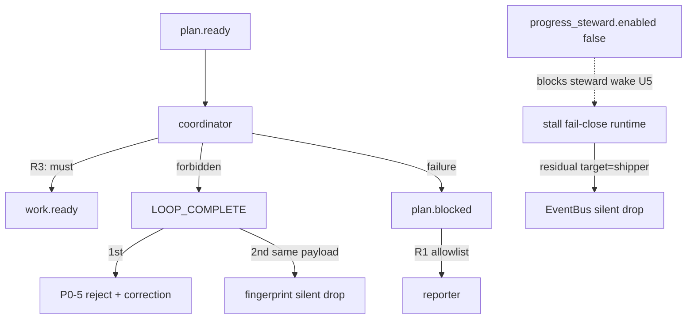

# 最小化闭合 supervisor P0/P1（preset allowlist · steward 钉死 · coordinator 硬约束 · P0-5 reject dedup）

## Goal Capsule

- Objective: 用**最小改动**闭合诊断报告中的 P0（M1/M2/M3）与 P1（M5）：preset 侧让 `plan.blocked` 可过 policy、钉死 progress_steward、收紧 coordinator 禁止抢发终态；机制侧**仅一处例外**——P0-5 拒收路径对重复 `LOOP_COMPLETE` 做跨 iter fingerprint dedup。
- Authority: 本文件 Product Contract + KTDs；与诊断 §6.3 长期机制债冲突时，以本计划「不做底座重构」为准。
- Sequencing: **U1 → U2 → U3 → U4**（U1–U3 可并行准备，合入顺序仍建议 allowlist 先于 instructions；U4 独立机制例外）。
- Stop when: Verification Contract 全绿；Definition of Done 勾选；已知残留（runtime fail-close → `target=shipper`）写入 residuals，不假装已根治。
- Out of scope reminder: **不改** U5/fail-close 的 `HatId::new("shipper")`；不做 registry lookup；不做 task lifecycle ↔ event bus 语义统一（M4）；不恢复 `shipper` / `progress-steward` hat；不改 `config_resolution` 全局默认。

Product Contract preservation: 无上游 brainstorm；本计划自举。Product Contract unchanged after bootstrap confirmation（用户确认：preset-only for M1–M3；P1/M5 唯一机制例外）。

---

## Product Contract

### Summary

针对 `primary-20260724-020630` 链路 collapse：coordinator 抢发 `LOOP_COMPLETE`、`plan.blocked` 不在 event_policy allowlist、progress_steward overlay 触发 U5 escalation 打向已删 shipper、同终态跨 iter 重复拒收。本计划用 preset 三刀 + 一处 reject dedup 机制例外做最小化闭合；**接受**「disabled steward 仍会 fail-close 向 shipper 发 `plan.blocked`」为已知残留。

### Requirements

- R1. `ce-executor-supervisor` 的 `event_policy.terminal_topics` 与 `business_topics` 均包含 `plan.blocked`，使 hat/CLI `--policy-check` 与 loop ingest 不再因 allowlist 自拒该 topic。
- R2. preset 显式钉死 `event_loop.progress_steward.enabled: false`，覆盖 operator overlay 把 steward 打开的路径，避免「未注册 steward → 计数 → U5 escalation」诊断主链。
- R3. coordinator 在 `plan.ready` activation 中**禁止**直接 emit `LOOP_COMPLETE` / `plan.complete`；必须先走 §1 `work.ready`（或合法的 `plan.blocked` 失败路径）。
- R4. P0-5 拒收 `LOOP_COMPLETE`（缺 required events）时：仍不写入 accepted 事件流；对**相同 payload** 的跨 iteration 重复 emit **静默 drop**（不再二次 correction / 二次 reject 噪音）。
- R5. 不恢复已删 hat；不改 shipper hardcode target（用户约束 A）。

### Actors

- A1. Operator — 跑 `builtin:ce-executor-supervisor`，可能带 `progress_steward.enabled: true` overlay。
- A2. Coordinator hat agent — `plan.ready` 后的首个激活方。
- A3. Reporter hat — `plan.blocked` / `plan.complete` / `work.failed` 的单一终态 owner。
- A4. Runtime event_loop — P0-5 gate 与 stall fail-close 合成 emit。

### Key Flows

- F1. Happy path 不变：`plan.ready` → coordinator → `work.ready` → … → reporter → `LOOP_COMPLETE`。
- F2. 失败/卡住（hat 侧）：某 hat 合法 emit `plan.blocked`（过 policy）→ reporter 消费 → `LOOP_COMPLETE`。
- F3. 抢发终态：coordinator 误 emit `LOOP_COMPLETE` → P0-5 reject；同 payload 再 emit → dedup 静默 drop（R4）。
- F4. Steward overlay 复发：preset 钉死 `enabled: false` 后，U5 steward 计数 escalation 分支不再因「未注册 steward」被唤醒（R2）；**残差**见 Scope。

### Acceptance Examples

- AE1. 对改后的 embedded preset 跑 strict preset_lint：无新 error；`plan.blocked` 出现在 terminal + business allowlist。
- AE2. 模拟：缺 `work.done` 时两次相同 payload 的 `LOOP_COMPLETE` ingest——仅第一次走 P0-5 reject/correction；第二次被 fingerprint 静默丢弃，且两次都不进入 accepted 流。
- AE3. coordinator instructions 文本含硬约束：`plan.ready` 激活禁止直发 `LOOP_COMPLETE`（结构化断言或 lint 友好的稳定锚点句，避免全文件 byte-lock）。

### Scope Boundaries

**In scope**

- `presets/en/ce-executor-supervisor.yml` 的 event_policy、progress_steward、coordinator instructions
- 嵌入式 preset 同步（manifest / build embed 既有管道）
- `crates/ralph-core` 内 P0-5 reject 路径的 fingerprint dedup（及对应单测）

**Deferred for later / residual**

- Runtime stall fail-close / U5 仍 `.with_target(shipper)` → EventBus 静默 drop（机制层，用户约束 A 明确不做）
- M4 task ledger 与 event bus 语义统一
- `max_steward_iterations` 调大推迟 fail-close（可选战术，非本计划必做；见 Assumptions）
- U5 合成 payload 缺 schema 五字段（机制合成路径；本计划不改）

**Outside this product's identity**

- 恢复 `shipper` / `progress-steward` hat
- 全局把 `plan.blocked` 塞进所有 preset 的默认 `config_resolution`
- orphan emit / cwd drift 家族

### Success Criteria

- 同场景下：agent/CLI 发出的 `plan.blocked` 不再因 allowlist 被拒；reporter 可被 hat 路由唤醒。
- coordinator 指令面明确禁止抢发终态。
- 重复 `LOOP_COMPLETE` 拒收噪音降为一次。
- 已知 shipper hardcode 残留写进报告/residuals，不宣称 M1 机制根因已闭合。

---

## Planning Contract

### Assumptions

- Ass1. 诊断报告称 reject 仍 `accepted_log_events.push`——**与当前源码不符**（reject 分支已 `continue` 且注释声明不写入）。M5 实现焦点改为：**跨 iter fingerprint**，而非「删掉不存在的 push」。
- Ass2. `RALPH_PROGRESS_STEWARD_ENABLED` 环境变量**无代码实现**；钉死必须靠 YAML `progress_steward.enabled: false`，并提醒 operator overlay 勿再打开。
- Ass3. `presets/schemas/ce-executor-supervisor.yml` 已有 `plan.blocked` payload schema；M2 **通常只改 preset YAML allowlist**，schema 文件无需为 allowlist 改动。
- Ass4. 对照 `ce-executor-pipeline` 仅把 `plan.blocked` 放在 `business_topics`；本计划按诊断与用户确认，**terminal + business 都加**（失败终态信号双栏可见）。
- Ass5. 不调整 `max_steward_iterations` 作为必做项：disabled 路径仍会在阈值后向 shipper fail-close；调大只能推迟，不能根治。若实现时发现 overlay 仍强制 enabled，优先保证 preset 显式 false 的合并优先级文档/测试。

### Key Technical Decisions

- KTD1. **Allowlist 双加**：`plan.blocked` 同时进入 `terminal_topics` 与 `business_topics`，与「reporter 终态消费 + hat 失败 emit」双角色对齐；不做全局 config_resolution 默认。
- KTD2. **M1 = 钉死 steward，不改 target**：显式 `progress_steward.enabled: false` 切断「未注册 steward 计数 → U5」诊断主链；**书面接受** disabled fail-close 仍 `target=shipper` 的残留。
- KTD3. **M3 = instructions 硬约束，不删 publishes**：保留 coordinator `publishes` 含 `LOOP_COMPLETE`（避免超范围改拓扑声明）；用 hat 视角 HARD RULE 约束 `plan.ready` 激活行为，并引用 skill 章节而非复述。
- KTD4. **M5 = 拒收指纹，复用现有 helper 语义**：在 P0-5 reject 分支记录/查询与 `is_review_complete_duplicate` 同族的 payload hash（或在 reject 前对 `LOOP_COMPLETE` 调用等价逻辑），使跨 iter 相同 payload 静默 drop；**不**改变「第一次拒收仍 inject correction」行为；**不**把拒收事件写入 accepted 流。
- KTD5. **测试纪律**：不新增锁定整份 preset YAML 文案的 byte-equality 测试；instructions 用稳定锚点句或结构化配置断言；机制测放在 `completion_honored`（或同目录）做跨 iter 行为断言。

### High-Level Technical Design



### Alternative Approaches Considered

| 方案 | 为何不选 |
|------|----------|
| 改 `mod.rs` shipper→reporter | 用户约束 A：M1 不碰机制 |
| 恢复薄 shipper hat | 与 005/U8 删除决策回退；禁止 |
| 只加 business_topics（对齐 pipeline） | 诊断与用户确认要求 terminal 也加，避免「终态分类」歧义 |
| 改 M5 为「reject 时清 completion_requested」 | 会破坏 stale-breaker / correction 路径；只做 fingerprint |

### Risks & Dependencies

| 风险 | 缓解 |
|------|------|
| Operator overlay 再开 `progress_steward.enabled: true` | preset 显式 false + 注释警告；文档写清勿开 |
| Fail-close 仍 silent drop | residuals 诚实记录；依赖 hat 侧 `plan.blocked`（M2）作可达终态 |
| Instructions 无法约束 LLM（M3） | 与 R4 叠加：抢发终态至少不再刷屏；完整防呆需未来机制禁止（Deferred） |
| Fingerprint 误伤「同 payload 合法重试」 | 仅作用于 P0-5 **已判定缺失 required** 的 `LOOP_COMPLETE`；payload 变化不 dedup |

---

## Implementation Units

### U1. event_policy 补齐 `plan.blocked` allowlist

**Goal:** 闭合 M2——hat/CLI 发 `plan.blocked` 不再被 topic allowlist 自拒。

**Requirements:** R1, AE1

**Dependencies:** 无

**Files:**

- modify: `presets/en/ce-executor-supervisor.yml`
- verify via: `crates/ralph-cli/src/presets.rs`（embedded strict lint）
- verify via: `crates/ralph-core/src/preset_lint/supervisor_preset_test.rs`（若需补结构化断言可加，禁止全文锁定）

**Approach:**

- 在 `event_loop.event_policy.terminal_topics` 增加 `"plan.blocked"`。
- 在 `business_topics` 增加 `"plan.blocked"`。
- 确认 `presets/schemas/ce-executor-supervisor.yml` 已有 schema 定义；无字段变更则不改 schema。
- 跑 preset 下游校验清单中的 lint / presets 子集（见 Verification Contract）。

**Patterns to follow:** `presets/en/ce-executor-pipeline.yml` 已含 business 侧 `plan.blocked`；本 preset 额外进 terminal（KTD1）。

**Test scenarios:**

- Happy: parse 后的 `RalphConfig` 中 terminal/business 均含 `plan.blocked`。
- Integration: `test_all_embedded_presets_pass_strict_lint` 仍绿。
- Edge: `ralph emit plan.blocked --policy-check` 在 fixture 配置下不再因 topic 不在 allowlist 失败（若已有 emit gate 测，扩展一条；否则用 config 级断言即可）。

**Verification:** embedded preset 与磁盘 YAML 同步；strict lint 绿；无新 schema parity error。

---

### U2. 显式钉死 `progress_steward.enabled: false`

**Goal:** 闭合 M1 的 **preset 可达部分**——阻止 overlay 打开 steward 后的「未注册 → 计数 → U5」路径。

**Requirements:** R2, R5

**Dependencies:** 无（可与 U1 同 PR）

**Files:**

- modify: `presets/en/ce-executor-supervisor.yml`（`event_loop.progress_steward` 块）
- optional note: `docs/guide/configuration.md` 仅当现有文案与「supervisor 必须 false」冲突时补一句（非必须）

**Approach:**

- 增加显式：

```yaml
progress_steward:
  enabled: false
```

- 紧邻注释（作者视角，可短）：supervisor 已删 progress-steward/shipper；打开 enabled 会触发打向已删 shipper 的 fail-close/U5，事件静默丢失。
- **不**把 `progress-steward` 加回 `hats:`（lint 会红）。
- **不**改 `mod.rs` target。
- 在计划 residuals / 实现备注中写明：`enabled: false` 时 `consecutive_no_progress_turns >= max_steward_iterations` 仍会合成 `plan.blocked`→shipper（已知残留）。

**Patterns to follow:** `ProgressStewardConfig` 默认已是 false；本 Unit 是**显式钉死**对抗 overlay。

**Test scenarios:**

- Happy: 解析后 `event_loop.progress_steward.enabled == false`。
- Regression: `deleted_progress_steward_in_hats_is_error` 类 lint 仍绿。
- Test expectation: 不要求证明 fail-close 不再发 shipper（那是机制残留，本 Unit 不声称）。

**Verification:** preset 解析断言 + strict lint；注释不引入 hat-instructions 视角违规（该注释在 event_loop 配置区，不是 hat instructions）。

---

### U3. coordinator instructions：禁止 `plan.ready` 抢发终态

**Goal:** 闭合 M3——降低 LLM 跳过 §1 直接 `LOOP_COMPLETE` 的概率。

**Requirements:** R3, AE3

**Dependencies:** U1（失败路径应能合法 `plan.blocked`）

**Files:**

- modify: `presets/en/ce-executor-supervisor.yml`（`hats.coordinator.instructions`）

**Approach:**

- 在 §1（`plan.ready`）顶部或紧接 ONE-emit 规则处增加 HARD RULE（hat 视角）：
  - 本 activation **禁止** emit `LOOP_COMPLETE` / `plan.complete`。
  - 唯一成功业务 emit：`work.ready`（保持现有 §1）。
  - 计划不可用时 emit **恰好一条** `plan.blocked`（引用 `ralph-tools` §5 policy-check 与 tasks 三字段规则，**不复述** skill 正文）。
- §3 禁止项补一条同义约束，避免只看禁止清单时漏读。
- **不**从 `publishes` / `terminal_events` 删除 `LOOP_COMPLETE`（KTD3）。
- 遵守 HARD RULE 4：不写 origin guard / shipper / 拓扑说教。

**Patterns to follow:** 现有 §0/§1 结构；引用 skill 章节名而非复制。

**Test scenarios:**

- 稳定锚点：配置解析后 instructions 含约定关键字句（例如 `plan.ready` + `禁止`/`MUST NOT` + `LOOP_COMPLETE`）——若团队禁止文案测，则改用「仅人工 review + AE3 清单」并在 Verification 写明。
- Prefer: 不新增全文 contains 锁；若必须，只锁一行锚点且注释写明例外理由（HARD RULE Preset 测试规则）。

**Verification:** instructions 可读性人工过一遍；strict lint 绿。

---

### U4. P0-5 reject 路径跨 iter fingerprint dedup（唯一机制例外）

**Goal:** 闭合 P1/M5——同 payload `LOOP_COMPLETE` 在缺 required events 时只产生一次拒收噪音。

**Requirements:** R4, AE2

**Dependencies:** 无（可与 U1–U3 并行开发，单独合入亦可）

**Files:**

- modify: `crates/ralph-core/src/event_loop/mod.rs`（JSONL ingest P0-5 reject 分支）
- modify（如需抽出）: `crates/ralph-core/src/event_loop/loop_state.rs`（复用/扩展 `is_review_complete_duplicate` 或新增 `note_rejected_completion_fingerprint`）
- test: `crates/ralph-core/src/event_loop/tests/completion_honored.rs`（或同目录新测）

**Approach:**

- 在 P0-5 `mark_completion_requested` 失败分支、`inject_completion_correction` **之前或之中**：
  - 若该 `LOOP_COMPLETE` payload 已在「拒收指纹」集合中见过 → **静默 `continue`**（不二次 correction）。
  - 若首次拒收 → 记录指纹，再走现有 correction + `completion_requested = true` + `continue`。
- 复用 `terminal_adjacent_seen_payload_hash` **或** 独立 `rejected_completion_payload_hash`，避免与「已接受终态后的 post-terminal dedup」语义搅浑——优先独立字段若实现时发现共用有歧义。
- 空 payload 不 dedup（与现有 helper 一致）。
- **确认**拒收路径继续不 `accepted_log_events.push`（当前已是；测试钉死）。
- 不改 shipper target；不改 stall detector。

**Execution note:** 先写跨 iter 重复拒收的失败表征测试，再改 reject 分支。

**Patterns to follow:** `is_review_complete_duplicate`；`test_loop_complete_rejected_before_report_done`；`test_loop_complete_payload_dedup`。

**Test scenarios:**

- Happy/error: 缺 required 时第一次 `LOOP_COMPLETE` → reject + correction 一次；accepted 流无该事件。
- Edge: 第二次相同 payload → 静默 drop；无第二次 correction（或 correction 计数不增）。
- Edge: 不同 payload 的第二次 `LOOP_COMPLETE` → 仍可再次 reject（不误伤）。
- Integration: `completion_honored` / stale_breaker 现有测仍绿。

**Verification:** `cargo nextest run -p ralph-core -- completion_honored`（及触及子集）绿；全量入口见下。

---

## Verification Contract

- Targeted: `cargo nextest run -p ralph-core -- completion_honored`
- Targeted: `cargo nextest run -p ralph-core -- progress_steward`
- Targeted: `cargo nextest run -p ralph-cli --bin ralph -- preset_lint`
- Targeted: `cargo nextest run -p ralph-core -- preset_lint`
- Targeted: `cargo nextest run -p ralph-cli --bin ralph -- presets`
- Final before LOOP_COMPLETE claim: `./scripts/run-tests.sh`
- Preset HARD RULE: 改 yml 后确认 schema 无需同步；跑上述 lint/presets 子集。

---

## Definition of Done

- [ ] U1–U4 均按 Verification 绿
- [ ] `plan.blocked` 在 supervisor preset 的 terminal + business allowlist 可见
- [ ] `progress_steward.enabled: false` 显式写入 preset
- [ ] coordinator instructions 含 plan.ready 禁终态硬约束
- [ ] 跨 iter 重复 LOOP_COMPLETE 拒收有测试钉死
- [ ] residuals 记录：runtime fail-close/U5 → shipper 静默 drop **未**在本计划修复
- [ ] 未改 shipper hardcode；未恢复已删 hat；未做 M4
- [ ] 若改动触及 agent 可见 emit 行为，按仓库规则检查是否需更新 `crates/ralph-core/data/*.md`（本计划预期 **无需**——未改 CLI 契约）；preset operator skills 仅当新增 lint finding 时同步（本计划预期 **无需**）

### Deferred to Follow-Up Work

- 机制：stall/U5 `target=shipper` → `reporter` 或 registry lookup（诊断 6.2.2 / 6.3.3）
- 机制：M4 task lifecycle 与事件流统一
- 机制：supervisor 模式下 runtime 禁止 coordinator 直发 `LOOP_COMPLETE`（比 instructions 更硬）
- Operator 文档：overlay 打开 progress_steward 的明确反例

---

## Appendix

### 诊断映射

| 诊断 ID | 本计划 Unit | 闭合程度 |
|---------|-------------|---------|
| M1 | U2 | 部分（preset 钉死；shipper target 残留） |
| M2 | U1 | 完整（allowlist） |
| M3 | U3 | 尽力（instructions；非机制强制） |
| M4 | — | 明确不做 |
| M5/P1 | U4 | 完整（按 Ass1 重释为 fingerprint） |

### 关键源码锚点（实现时复核，勿当永久行号契约）

- P0-5 reject: `crates/ralph-core/src/event_loop/mod.rs`（`mark_completion_requested` 失败 → `continue`）
- Dedup helper: `crates/ralph-core/src/event_loop/loop_state.rs` → `is_review_complete_duplicate`
- Stall fail-close / U5 shipper: 同 `mod.rs` `run_stall_detector_on_state`
- Preset: `presets/en/ce-executor-supervisor.yml` event_policy + coordinator hat
- Origin: `docs/report/2026-07-24-ce-executor-supervisor-primary-20260724-020630-diagnosis.md`
