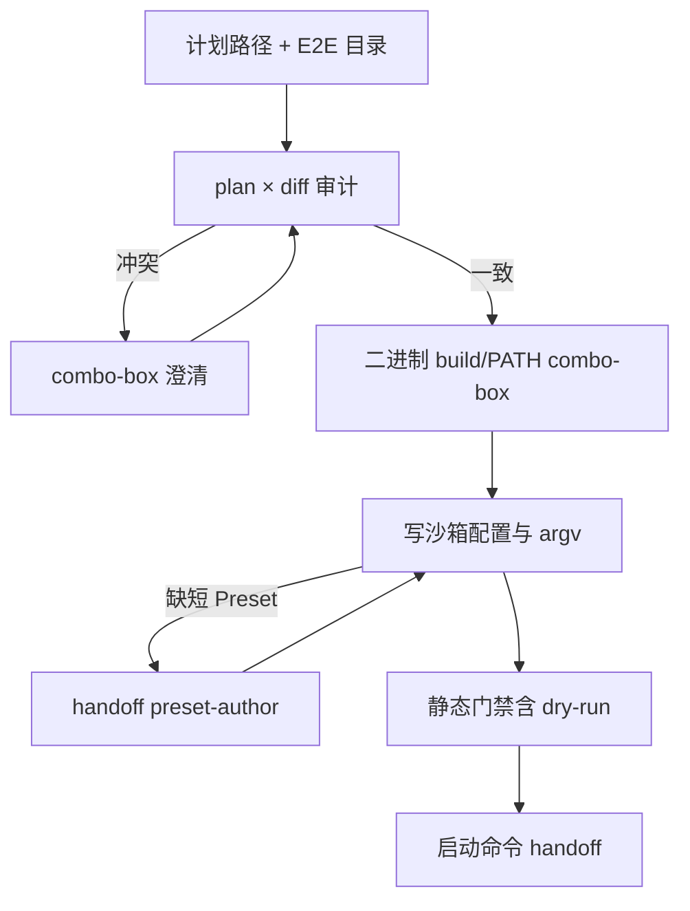
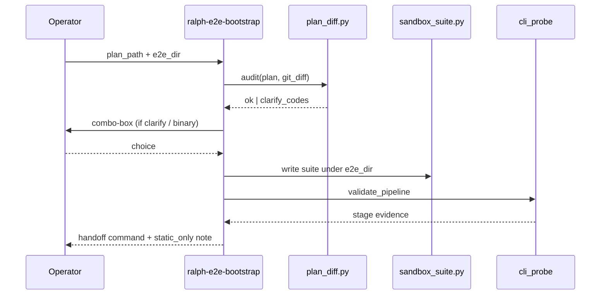

# Ralph E2E Bootstrap Skill - Plan

## Goal Capsule

- Objective: 交付可安装的 loop 外 Skill `ralph-e2e-bootstrap`，使 Operator 在给出开发计划路径与 E2E 沙箱目录后，经 **combo-box 交互**完成 plan×diff 澄清、最新二进制 build/PATH、沙箱配置与启动参数生成，通过与 `ralph-project-bootstrap` 同构的静态门禁（含 `ralph run --dry-run`），并交出可复制启动命令。
- Authority: 本文件 Product Contract + Planning Contract KTDs；与 `ralph-project-bootstrap` / `ralph-preset-author` / `ralph-run-diagnosis` 冲突时以本文件边界为准。
- Sequencing: **U1 → U2 → U3 → U4 → U5 → U6** 严格串行；禁止交替。
- Stop when: Verification Contract 全绿；Definition of Done 勾选。
- Out of scope reminder: **不改任何 Rust / crates 生产代码**；不写 Preset；不默认 live `ralph run`；不做跑后诊断；不在 E2E 沙箱内重写开发计划文件；不把 `ralph-project-bootstrap` 撑成万能入口。允许且欢迎 skill 内 Python helpers。

Product Contract preservation: 自 brainstorm 重建（磁盘上 requirements-only 已佚失）。相对 brainstorm：**changed: +R12 — combo-box；+R14 — 零 Rust 改动**；明确排除「Skill 重写 E2E 内 plan」——该「重写」仅适用于本 ce-plan 文档。

---

## Product Contract

### Summary

新建 Skill `ralph-e2e-bootstrap`：输入开发计划 + Operator 指定的 E2E 沙箱目录；交叉核对计划意图与 Git diff；关键决策一律 combo-box（带建议的阻塞单选）；交互处理最新 `ralph` 二进制与沙箱配置/argv；静态门禁通过后交出启动命令。短测试 Preset 硬 handoff `ralph-preset-author`。

### Problem Frame

计划落地或改完 orchestrator 代码后，要在独立 E2E 沙箱用最新二进制验证。今天最烦的是手工改配置与拼启动参数。`ralph-project-bootstrap` 入口是「任意项目 + 已有 Preset」，不以「计划 × diff → dogfood 沙箱能验这次改动」为主路径。

### Key Decisions

- **新建独立 Skill，不扩写 project-bootstrap 为主入口** `(session-settled: user-approved — chosen over enriching ralph-project-bootstrap)`
- **主交付：配置 + argv + 静态门禁 + 启动命令 + build/PATH 交互** `(session-settled: user-directed — chosen over runtime 验收 Preset / 套娃 live run)`
- **变更范围 = 计划 × Git diff 交叉；不一致 combo-box 澄清** `(session-settled: user-directed)`
- **短 Preset 硬 handoff author** `(session-settled: user-directed)`
- **「搭好了」= 静态含 dry-run 通过并交出命令** `(session-settled: user-directed)`
- **关键决策必须 combo-box 交互（有建议、有推荐默认）** `(session-settled: user-directed — chosen over 开放题为主)`
- **本实现计划整份重写；Skill 不重写 E2E 沙箱内 plan 文件** `(session-settled: user-directed — chosen over Skill 改编沙箱 plan)`
- **零 Rust 改动：交付物仅限 skill / 文档 / skill 内 Python / 对应 pytest** `(session-settled: user-directed — chosen over 任何 crates/* 或 CLI 新能力)`

### Actors

- A1. Operator（Ralph 维护者）
- A2. `ralph-e2e-bootstrap` Skill
- A3. `ralph-preset-author`（短 Preset handoff）
- A4. `ralph-run-diagnosis`（跑后，范围外）

### Key Flows

- F1. 标准搭建（plan×diff 一致 → 套件 → 门禁 → 命令）
- F2. plan×diff 冲突 → combo-box 澄清后再继续
- F3. 缺短 Preset → 硬 handoff author → 回跳继续
- F4. 二进制不可用 → combo-box 选择 build/PATH/绝对路径策略



### Requirements

**Inputs**

- R1. Skill 名 `ralph-e2e-bootstrap`；loop 外操作规程；可经 `skills/install.py` 安装。
- R2. 必填输入：开发计划路径、E2E 沙箱目录；变更分析默认交叉计划意图与 Git diff。
- R3. E2E 目录由 Operator 指定（可在 orchestrator 仓外）；≠ 必须等于 `crates/ralph-e2e` harness。

**Interaction**

- R12. 凡影响验收意图、二进制选择、Preset 来源、写盘冲突、继续/暂停的用户决策，必须用 combo-box：2–4 互斥选项、推荐项第一并一句后果说明、允许 custom、分轮提问；有平台阻塞工具则用之，否则编号列表并等待。禁止仅用开放题完成这些决策。

**Change analysis**

- R4. 同时读计划与相关 Git diff；不一致时必须 combo-box 澄清，禁止静默单侧继续。

**Suite and binary**

- R5. 可在 E2E 目录创建/更新运行套件（配置、PROMPT、plan/prompt 引用、启动参数）；**不**写/改 Preset 定义；缺短 Preset 时硬 handoff `ralph-preset-author`。
- R6. 必须 combo-box 交互处理最新 `ralph`：build、PATH、或绝对路径；后续门禁与 handoff 使用同一二进制。
- R13. **不**在 E2E 沙箱内重写/伪造开发计划文件；启动命令通过 `--plan <Operator 提供的计划路径>`（或等价）引用已有计划。

**Validation and handoff**

- R7. 宣称可用前必须：capability → `preset check --strict` → `preflight --strict` → `ralph run --dry-run`（可 `--strict`）；green dry-run 仅证静态加载。
- R8. 成功 handoff：可复制命令、二进制假设、配置与 Preset 源、计划路径、未决前置条件；明确「静态通过 ≠ loop 闭环」。
- R9. 短 Preset handoff 必须可执行（缺口、建议意图、回跳入口）。

**Non-goals**

- R10. 默认不发起 live `ralph run`；成功不依赖 live smoke。
- R11. 不产出跑后诊断报告。
- R14. 本需求**禁止**修改 `crates/**`、Rust 源码、或为该 Skill 新增 CLI subcommand；实现仅限 `skills/ralph-e2e-bootstrap/**`、catalog/安装面、`skills/tests/**`、以及必要的 `docs/` / `CONCEPTS.md`。逻辑缺口用 skill 内 Python scripts（stdlib 优先，对齐 project-bootstrap）补齐；复用已有 `ralph` CLI（含 `--dry-run`）而非改 runtime。

### Acceptance Examples

- AE1. 一致路径：门禁绿、交出命令、未改 Preset、未改沙箱内 plan 文件内容（仅引用）。
- AE2. plan×diff 冲突：写盘前 combo-box；不得静默继续。
- AE3. 缺短 Preset：硬 handoff；未宣称对「正确 Preset」门禁已过。
- AE4. dry-run：不 spawn backend；handoff 不得称 E2E 已跑通。
- AE5. 关键决策若只用开放题而无 combo-box，视为违反 R12（技能契约测试/清单可检）。
- AE6. 合并 diff 不含 `crates/**` 或 `.rs` 生产改动；新增逻辑若存在，仅在 `skills/ralph-e2e-bootstrap/scripts/`（及测试）。

### Success Criteria

- Operator 给计划 + E2E 目录 + 回答 combo-box，即可得到同一二进制下的静态门禁结果与可粘贴命令。
- 与 `ralph-project-bootstrap` 分工在 SKILL 描述中一眼可辨。
- 交互契约与 `ralph-preset-author` Workflow 0 同族（推荐项优先）。

### Scope Boundaries

**In scope:** 新 Skill、scripts/fixtures/tests、catalog 三联（`install.py` / marketplace / install 测试）、可选 `docs/guide/e2e-bootstrap.md`、`CONCEPTS.md` 词条。

**Deferred:** 多场景场景包；默认授权 live smoke；抽 `skills/ralph-bootstrap-common/`；跑后诊断串联自动化。

**Outside identity:** 运行时验收 Preset；套娃 live pipeline；取代 project-bootstrap / preset-author / run-diagnosis；任何「为方便 e2e-bootstrap 而改 Ralph runtime」的诱惑。

### Dependencies / Assumptions

- CLI 已有 `--dry-run` 与 strict preset/preflight。
- 可对齐复用 `skills/ralph-project-bootstrap/scripts/cli_probe.py` 的四阶段语义（v1 允许复制适配，抽取公共包延后）。
- Orchestrator 根与 E2E 根可为两个目录。

---

## Planning Contract

### Key Technical Decisions

- KTD1. **镜像 project-bootstrap 目录形态**（`SKILL.md` + `references/` + `scripts/` + `fixtures/` + `agents/openai.yaml`），不复用其「任意项目审计」主路径。
- KTD2. **v1 复制/适配 `cli_probe.validate_pipeline`，不抽公共包** — 降低跨 skill 重构面；漂移风险记入 Risks。
- KTD3. **combo-box 契约照抄 `ralph-preset-author` Workflow 0 交互段**，写入本 SKILL；用结构化 blocker codes + 合约测试锁定「必须提问的决策点」，因运行时无法强制 IDE 弹出控件。
- KTD4. **plan×diff 审计用新 `scripts/plan_diff.py`**（无先例）；输出 `AuditDecision` + clarify codes，驱动 combo-box，不在 Rust runtime 解析 plan 业务语义。
- KTD5. **沙箱套件文件命名对齐 preset-bound 惯例**（`ralph.<stem>.yml` + `PROMPT.<stem>.md`），argv 强制显式 `-c`/`-H`；历史 `ralph.pipeline.yml` 仅作兼容说明，不作为新默认 owned 名。
- KTD6. **外部沙箱绝对路径**：在 Operator combo-box 确认后允许；路径 containment 与 project-bootstrap 单根假设分离实现。
- KTD7. **执行方向：每个 feature-bearing Unit 严格 TDD**（验收测试先红 → 最小实现 → 重构 → 回归）；全计划 Unit 严格串行。
- KTD8. **实现面零 Rust** `(session-settled: user-directed)` — Executor 若发现「必须改 Rust 才能完成 R*」应 stop 并回报，不得擅自改 `crates/**`；改用现有 CLI + Python helpers 或降级为文档/交互 handoff。

### Assumptions

- A-plan1. 「combo-box」= 阻塞式单选菜单（AskUserQuestion / 编号选项），不是 Web UI 组件。
- A-plan2. Operator 提供的开发计划文件已存在且可读；Skill 只引用，不改写其内容。

### High-Level Technical Design



### Alternative Approaches Considered

- 扩写 `ralph-project-bootstrap`：拒绝（入口与边界不同）。
- 仅清单无脚本：拒绝（配置/argv 痛点需要可测 helpers）。
- 先抽 bootstrap-common：延后（v1 复制适配）。

---

## 1. 功能目标（执行摘要）

- **业务目标:** dogfood 时快速把「计划 + 沙箱」搭到可静态验证并交出启动命令。
- **本次范围:** `skills/ralph-e2e-bootstrap/**`、catalog 同步、合约/e2e fake 测试、CONCEPTS/可选 guide。
- **非目标:** 写 Preset、live run、诊断报告、改写沙箱内 plan 文件、抽公共 bootstrap 包、**任何 Rust/crates 改动**。
- **约束:** 串行 Unit；combo-box；静态门禁同构；测试入口对 Python 用 `.venv`；不引入套娃 ralph run；Python scripts 欢迎（对齐 project-bootstrap stdlib 风格）。

---

## 2. BDD 行为规格

```gherkin
Feature: ralph-e2e-bootstrap dogfood 沙箱搭建
  作为 Ralph 维护者
  我想根据开发计划与代码变更把 E2E 沙箱配置与启动参数准备好
  以便用最新二进制做静态验证并拿到可运行命令

  Scenario: S1 计划与 diff 一致且 Preset 已存在
    Given Operator 提供可读的开发计划路径与可写 E2E 目录
    And 计划意图与相关 Git diff 一致
    And 目标 Preset 源已存在（builtin 或 file）
    When 执行 ralph-e2e-bootstrap 主流程
    Then 沙箱内生成或更新 owned 套件文件
    And 静态门禁四阶段全部通过
    And handoff 给出可复制启动命令并声明 static_only
    And 未修改任何 Preset 定义文件
    And 未重写开发计划文件内容

  Scenario: S2 计划与 diff 冲突
    Given 计划意图与 Git diff 不一致
    When 进入变更分析
    Then Skill 发出 combo-box 澄清（含推荐项）
    And 在 Operator 选择之前不写盘宣称可用

  Scenario: S3 缺少短测试 Preset
    Given 交叉核对判定现有 Preset 不足覆盖验收意图
    When Skill 检测到 Preset 缺口
    Then 输出指向 ralph-preset-author 的硬 handoff
    And 在 Preset 就绪前不以该缺口 Preset 宣称门禁成功

  Scenario: S4 二进制不可用
    Given 当前 PATH 无可用 ralph 或不满足 feature 需求
    When 进入二进制解析
    Then 以 combo-box 提供 build / PATH / 绝对路径等选项（推荐项明确）
    And 后续门禁使用选定二进制

  Scenario: S5 dry-run 不启动 backend
    Given 套件已写好
    When 执行 dry-run 阶段
    Then 不 spawn 配置的 agent backend
    And handoff 不得声称 loop 已闭环

  Scenario: S6 非法输入
    Given 计划路径不存在或 E2E 目录不可写
    When 启动 Skill 流程
    Then 以 blocked handoff 失败并说明原因
    And 不部分写盘为“成功”

  Scenario: S7 关键决策缺少 combo-box（契约）
    Given SKILL 工作流到达用户决策点
    When 检查交互契约
    Then 该决策点文档化要求 combo-box（2–4 选项、推荐第一）
```

---

## 3. 验收与测试策略

| Scenario | 验收条件 | 推荐测试层级 | 需要 E2E |
|---|---|---|---|
| S1 | 套件文件 + 四阶段绿 + handoff 字段完整 | 合约单测 + fake 管线集成 | 否（fake CLI） |
| S2 | clarify codes 非空且阻止写盘成功宣称 | 单元 + 合约 | 否 |
| S3 | handoff 含 author 指引与回跳 | 单元 + 合约 | 否 |
| S4 | 二进制选择结果注入后续 argv | 单元 + 合约 | 可选 real_cli |
| S5 | dry-run argv 含 `--dry-run` 且 runner 不进 live | 合约（fixture green） | 否 |
| S6 | missing plan / unwritable dir → blocked | 单元 | 否 |
| S7 | SKILL.md / references 含交互契约关键字与决策点清单 | 合约（文档锚点） | 否 |

---

## 4. 需求—测试追踪矩阵

| 需求 | Scenario | 验收测试 | 单元测试 | 集成/契约 | E2E |
|---|---|---|---|---|---|
| R1 | S1 | install catalog 含名 | — | `test_install` | 否 |
| R2,R4 | S1,S2 | plan_diff 合约 | `plan_diff` cases | `test_e2e_bootstrap_contract` | 否 |
| R3,R6,KTD6 | S4,S6 | 双根路径 + binary | path/binary helpers | contract | 可选 real_cli |
| R5,R9,R13 | S1,S3 | suite 不写 preset/plan 正文 | sandbox_suite | contract | 否 |
| R7,R8,R10,R11 | S1,S5 | validate_pipeline + handoff | — | contract + fake e2e | 否 |
| R12 | S2,S4,S7 | 交互契约锚点 | — | contract 文档断言 | 否 |
| R14 | AE6 | diff 无 crates | — | DoD / review 检查 | 否 |

---

## Implementation Units

> **执行铁律:** Unit N 的实现、测试、重构、回归全部完成前，禁止开始 Unit N+1。每个 feature-bearing Unit 必须 TDD：先写/启用验收测试并确认以正确原因失败 → 最小实现 → 重构 → 相关集成 → 回归。

### U1. Skill 脚手架 + Catalog + Combo-box 契约文档

- **Unit 目标:** 仓库内存在可发现的 `ralph-e2e-bootstrap`，边界与 combo-box 交互契约可测。
- **对应 Scenario:** S7（及 S1 的可发现性）
- **外部可观察结果:** `skills/ralph-e2e-bootstrap/SKILL.md` 存在；`PUBLIC_SKILLS` / marketplace / install 测试认识该名；交互契约段落可被合约测试锚定。
- **输入 / 输出:** 无运行时输入；输出 skill 树与 catalog 条目。
- **可依赖:** 现有 `skills/install.py`、`ralph-preset-author` 交互文案模式、`ralph-project-bootstrap` 目录惯例。
- **禁止依赖:** U2+ 的 plan_diff / suite / cli_probe 行为。
- **验收测试:** `skills/tests/test_install.py` catalog parity；新建 `test_e2e_bootstrap_contract.py` 中「SKILL 含 combo-box / AskUserQuestion / 推荐项第一 / 边界：不写 preset、不 live run、不 rewrite plan」锚点断言。Equivalently covered by `skills/tests/test_e2e_bootstrap_contract.py` + `skills/tests/test_e2e_bootstrap_e2e.py`; the new `test_install.py` extension is therefore not required.
- **拆分单元测试:** 无业务逻辑则 `Test expectation: none -- 本 Unit 为脚手架与文档契约`；安装 catalog 断言即验收。
- **Red 预期失败原因:** catalog 无新名；合约测试找不到契约关键字。
- **最小实现范围:** `skills/ralph-e2e-bootstrap/{SKILL.md,agents/openai.yaml,references/interaction.md}`；更新 `skills/install.py`、`.claude-plugin/marketplace.json`、`skills/README.md`；`CONCEPTS.md` 词条。
- **集成验证:** `python -m pytest skills/tests/test_install.py -k e2e_bootstrap`（或全 install 测）。
- **回归范围:** `test_install.py` 全文件；确认既有 PUBLIC_SKILLS 仍安装。
- **完成标准:** 安装 catalog 绿；契约锚点绿；SKILL 边界与 R12 可见。
- **风险:** 漏改 marketplace / README 导致发现面不一致。
- **Requirements:** R1, R12, R10, R11, R13
- **Files:**
  - create: `skills/ralph-e2e-bootstrap/SKILL.md`
  - create: `skills/ralph-e2e-bootstrap/agents/openai.yaml`
  - create: `skills/ralph-e2e-bootstrap/references/interaction.md`
  - modify: `skills/install.py`
  - modify: `.claude-plugin/marketplace.json`
  - modify: `skills/README.md`
  - modify: `CONCEPTS.md`
  - create: `skills/tests/test_e2e_bootstrap_contract.py`
  - modify: `skills/tests/test_install.py`
- **Execution note:** 先写失败的 catalog/契约测试，再补文件与 catalog。
- **Patterns to follow:** `skills/ralph-project-bootstrap/` 布局；`skills/ralph-preset-author/SKILL.md` Workflow 0 交互段。

### U2. plan×diff 审计 + clarify codes

- **Unit 目标:** 给定计划路径与 diff 文本/范围，产出 `ok` 或结构化 clarify codes，供 combo-box 使用。
- **对应 Scenario:** S2, S6（计划不可读）
- **外部可观察结果:** `plan_diff.audit(...)` 可测 API；冲突时不返回静默 ok。
- **输入 / 输出:** plan 路径 + git diff（或 fixture）→ `AuditDecision`。
- **可依赖:** U1 目录存在。
- **禁止依赖:** 沙箱写盘、cli_probe、真实 git 网络。
- **验收测试:** contract 用例：一致 → ok；意图字段与 diff 路径集冲突 → clarify；缺 plan 文件 → blocked。
- **拆分单元测试:** 路径集合提取、冲突判定纯函数。
- **Red 预期失败原因:** 模块不存在或冲突仍返回 ok。
- **最小实现范围:** `scripts/plan_diff.py`、`references/plan-diff-audit.md`、`fixtures/plans/*`。
- **集成验证:** contract 加载 scripts（扩展 `conftest.py` 若需要）。
- **回归范围:** U1 契约测试。
- **完成标准:** S2/S6 相关断言绿；无写盘副作用。
- **风险:** 过度解析 plan 业务语义——只做意图锚点/路径/标题级启发式，细则交 combo-box。
- **Requirements:** R2, R4, R12
- **Files:**
  - create: `skills/ralph-e2e-bootstrap/scripts/plan_diff.py`
  - create: `skills/ralph-e2e-bootstrap/references/plan-diff-audit.md`
  - create: `skills/ralph-e2e-bootstrap/fixtures/plans/`
  - modify: `skills/tests/conftest.py`（如需注入新 scripts）
  - modify: `skills/tests/test_e2e_bootstrap_contract.py`
- **Execution note:** 以 fixture diff 表征测试驱动，不依赖开发机脏工作区。

### U3. 二进制解析（build / PATH / 绝对路径）

- **Unit 目标:** combo-box 可选策略落地为可测的二进制解析结果，供后续 argv 使用。
- **对应 Scenario:** S4
- **外部可观察结果:** `resolve_ralph_binary(...)` 返回可执行路径或明确 blocked。
- **输入 / 输出:** orchestrator 根、Operator 选择、可选 env `RALPH_BINARY` → 绝对路径。
- **可依赖:** U1。
- **禁止依赖:** 真实长时间 release build（单测用 stub/which fixture）；U4 写盘。
- **验收测试:** PATH hit；`RALPH_BINARY` 优先；无效路径 blocked；选择「需要 build」时返回建议命令而非假装已 build（实际 build 由 Operator/会话执行，脚本记录选择）。
- **拆分单元测试:** 优先级：显式路径 > env > PATH > 建议 build。
- **Red 预期失败原因:** 无模块或优先级错误。
- **最小实现范围:** `scripts/binary_resolve.py`、`references/binary-resolution.md`。
- **集成验证:** contract。
- **回归:** U1–U2。
- **完成标准:** S4 断言绿。
- **Requirements:** R6, R12
- **Files:**
  - create: `skills/ralph-e2e-bootstrap/scripts/binary_resolve.py`
  - create: `skills/ralph-e2e-bootstrap/references/binary-resolution.md`
  - modify: `skills/tests/test_e2e_bootstrap_contract.py`
- **Execution note:** 测试禁止依赖本机 PATH 偶然命中；注入 fake which。

### U4. 沙箱套件生成（配置 / PROMPT / argv 形状）

- **Unit 目标:** 在 E2E 目录写入 owned 套件，生成显式 `-c`/`-H`/`--plan` 的命令形状；不写 Preset、不改写 plan 文件。
- **对应 Scenario:** S1, S3, S6（目录不可写）
- **外部可观察结果:** `ralph.<stem>.yml` + `PROMPT.<stem>.md`（或文档声明的 owned 集）出现；plan 文件 hash 不变。
- **输入 / 输出:** e2e_dir、preset 源、plan_path、binary → 套件文件 + command template。
- **可依赖:** U1；可选用 U3 的路径字符串。
- **禁止依赖:** 真实 ralph 二进制执行（本 Unit 只生成文件）。
- **验收测试:** 写盘内容含 prompt/plan 引用；拒绝写入 `presets/`；plan 文件字节不变；不可写目录 → blocked。
- **拆分单元测试:** stem 推导、owned 路径、marker/ownership 冲突。
- **Red 预期失败原因:** 无 writer 或误改 plan。
- **最小实现范围:** `scripts/sandbox_suite.py`、`assets/` baseline、`references/sandbox-suite.md`、`fixtures/sandbox/`。
- **Patterns:** `pipeline_suite.py` / preset-bound 两文件惯例；`docs/guide/project-bootstrap.md`。
- **集成验证:** contract + tmpdir fixture。
- **回归:** U1–U3。
- **完成标准:** S1 写盘断言与 R13 绿。
- **Requirements:** R5, R8, R9, R13
- **Files:**
  - create: `skills/ralph-e2e-bootstrap/scripts/sandbox_suite.py`
  - create: `skills/ralph-e2e-bootstrap/assets/`
  - create: `skills/ralph-e2e-bootstrap/references/sandbox-suite.md`
  - create: `skills/ralph-e2e-bootstrap/fixtures/sandbox/`
  - modify: `skills/tests/test_e2e_bootstrap_contract.py`

### U5. 静态门禁 + Handoff

- **Unit 目标:** 对已生成套件跑四阶段静态门禁，产出 `incomplete_static_only`（或 blocked）handoff，永不默认 live。
- **对应 Scenario:** S1, S5
- **外部可观察结果:** fake runner 下四阶段绿；handoff JSON/文本含命令与 static_only；dry-run argv 含 `--dry-run`。
- **输入 / 输出:** suite paths + binary → `StageDecision` 链 + handoff。
- **可依赖:** U4 产物形状；复制适配 `cli_probe`。
- **禁止依赖:** 真 agent backend；U6 文档。
- **验收测试:** 复用/改编 `fixtures/cli/green` 思路；断言阶段顺序；失败分类 blocked_*。
- **拆分单元测试:** argv 构造必须带 `-c`/`-H`。
- **Red 预期失败原因:** 无 validate 封装或跳过 dry-run。
- **最小实现范围:** `scripts/cli_probe.py`（适配）、`scripts/handoff.py`、`references/validation.md`、`references/handoff.md`。
- **集成验证:** `skills/tests/test_e2e_bootstrap_e2e.py` fake 管线。
- **回归:** U1–U4；抽样 `test_project_bootstrap_contract` 确认未误改共享假设（若仅复制则无）。
- **完成标准:** S1/S5 绿。
- **Requirements:** R7, R8, R10
- **Files:**
  - create: `skills/ralph-e2e-bootstrap/scripts/gate.py`（原 `scripts/cli_probe.py`；通过 `spec_from_file_location` 重用 `ralph-project-bootstrap/scripts/cli_probe.py`）
  - create: `skills/ralph-e2e-bootstrap/scripts/e2e_handoff.py`（原 `scripts/handoff.py`）
  - create: `skills/ralph-e2e-bootstrap/references/validation.md`
  - create: `skills/ralph-e2e-bootstrap/references/handoff.md`
  - create: `skills/ralph-e2e-bootstrap/fixtures/cli/`（或文档化复用路径）
  - create: `skills/tests/test_e2e_bootstrap_e2e.py`
  - modify: `skills/tests/test_e2e_bootstrap_contract.py`
- **Execution note:** Plan U5 KTD2 (reuse `ralph-project-bootstrap/scripts/cli_probe.py`) resolved as **re-import via spec_from_file_location** — gate.py imports the sibling probe rather than duplicating its surface. Trade-off: production import now depends on `cli_probe.py` being present at `<skills>/ralph-project-bootstrap/scripts/`, which is the case in any Ralph release tarball.
- **Execution note:** Prefer smoke/runtime style for gate wiring with fake runner; optional later `test_e2e_bootstrap_real_cli.py` 不阻塞本 Unit Done。

### U6. 端到端工作流编排进 SKILL + 指南

- **Unit 目标:** SKILL.md 工作流串起 U2–U5，含 combo-box 决策点清单与 author/diagnosis 边界；可选 guide。
- **对应 Scenario:** S1–S7 文档级闭合
- **外部可观察结果:** 按 SKILL 逐步可读可执行；合约测试覆盖工作流标题/决策点表。
- **可依赖:** U1–U5 全部完成。
- **禁止依赖:** 未来场景包 / live smoke。
- **验收测试:** 扩展 contract：工作流步骤顺序、决策点表含 plan_diff/binary/preset_gap/write_conflict；guide 若存在则路径引用有效。
- **拆分单元测试:** 无。
- **Red 预期失败原因:** SKILL 步骤缺失或决策点未列 combo-box。
- **最小实现范围:** 完善 `SKILL.md`；可选 `docs/guide/e2e-bootstrap.md`；更新 `skills/README.md` 描述一行。
- **集成验证:** 全 `test_e2e_bootstrap_*` + `test_install`。
- **回归:** 全部本计划测试；`pytest skills/tests/test_project_bootstrap_contract.py -q` 抽样确认无串改。
- **完成标准:** 矩阵 Scenario 文档与测试锚点对齐；DoD 可勾选。
- **Requirements:** 全部 R*
- **Files:**
  - modify: `skills/ralph-e2e-bootstrap/SKILL.md`
  - create (optional): `docs/guide/e2e-bootstrap.md`
  - modify: `skills/tests/test_e2e_bootstrap_contract.py`

---

## Deferred references & fixtures

以下 11 项 Files 条目未随 v1 交付，原因见各行说明。均不阻塞 Skill 核心功能，延后至后续计划处理。

| File | 延期原因 |
|------|---------|
| `docs/guide/e2e-bootstrap.md` | 原 spec 标记为 optional；SKILL.md + `references/interaction.md` 已覆盖全部必要操作规程 |
| `skills/ralph-e2e-bootstrap/references/plan-diff-audit.md` | doc-only 伴随；`scripts/plan_diff.py` 内联 docstring 已充分说明行为 |
| `skills/ralph-e2e-bootstrap/references/binary-resolution.md` | doc-only 伴随；`scripts/binary_resolve.py` 内联 docstring 已充分说明优先级与异常路径 |
| `skills/ralph-e2e-bootstrap/references/sandbox-suite.md` | doc-only 伴随；`scripts/sandbox_suite.py` 内联 docstring 已充分说明写盘语义与冲突处理 |
| `skills/ralph-e2e-bootstrap/references/validation.md` | doc-only 伴随；四阶段语义由 `gate.py` + `cli_probe.py` 的 `validate_pipeline` 直接提供 |
| `skills/ralph-e2e-bootstrap/references/handoff.md` | doc-only 伴随；`scripts/e2e_handoff.py` 内联 docstring 已充分说明 static_only/blocked 分支 |
| `skills/ralph-e2e-bootstrap/fixtures/plans/` | 维护成本高；测试套件已通过内联 tmpdir fixture 覆盖 plan×diff 审计全部场景 |
| `skills/ralph-e2e-bootstrap/fixtures/sandbox/` | 维护成本高；测试套件已通过内联 tmpdir fixture 覆盖 sandbox_suite 全部场景 |
| `skills/ralph-e2e-bootstrap/fixtures/cli/` | 维护成本高；测试套件已通过 `_probe_runner_common.py` 共享工厂覆盖 gate/handoff 全部场景 |
| `skills/ralph-e2e-bootstrap/assets/` | 原 U4 规划为 baseline 配置目录；实际 `sandbox_suite.py` 的 `_render_payloads` 动态生成全部内容，无需静态资产 |
| `skills/ralph-e2e-bootstrap/scripts/cli_probe.py` | KTD2 resolved as re-import via `spec_from_file_location`（见 U5 Execution note）；未独立新建同名文件 |

---

## Verification Contract

在仓库根、使用项目 `.venv`：

1. `python -m pytest skills/tests/test_install.py skills/tests/test_e2e_bootstrap_contract.py skills/tests/test_e2e_bootstrap_e2e.py -q`
2. （可选）`RALPH_BINARY=target/debug/ralph python -m pytest skills/tests/test_e2e_bootstrap_real_cli.py -q` — 不阻塞 v1 DoD，除非 Unit 显式纳入。
3. 文档锚点：SKILL 含边界与 combo-box 契约；`CONCEPTS.md` 含 `ralph-e2e-bootstrap`。
4. 回归：既有 `test_project_bootstrap_*` 与 `test_install` 全绿。
5. 不新增 skip/xfail 充当完成。

---

## Definition of Done

- [ ] U1→U6 严格串行完成，每 Unit 有先红后绿证据（会话或 CI 日志）
- [ ] S1–S7 对应测试或文档契约通过
- [ ] PUBLIC_SKILLS / marketplace / install 测试含 `ralph-e2e-bootstrap`
- [ ] 无 Preset 写盘；无沙箱 plan 文件重写；无默认 live run
- [ ] **diff 无 `crates/**` / 生产 `.rs` 变更**（R14 / AE6）
- [ ] Handoff 始终区分 static_only vs loop closed
- [ ] 未验证项（real_cli 可选、bootstrap-common 抽取）已写入 Remaining risks
- [ ] 11 plan-Files items deferred to follow-up plan: see `## Deferred references & fixtures` below.

---

## Risks & Dependencies

| 风险 | 缓解 |
|---|---|
| `cli_probe` 双份漂移 | KTD2；references 注明上游；follow-up 再抽公共包 |
| plan×diff 启发式误判 | 冲突时强制 combo-box，不自动选边 |
| 外部绝对路径安全 | Operator 确认 + 显式 allow；拒绝模糊相对路径逃逸 |
| combo-box 无法运行时强制 | 决策点清单 + 合约锚点 + 结构化 clarify codes |
| 命名与历史 `ralph.pipeline.yml` 混淆 | SKILL 明确 owned 文件名与兼容说明 |
| 误以为要改 Rust CLI | R14/KTD8 硬闸；Executor 遇阻 stop 回报 |

---

## Open Questions

**Deferred to implementation**

- stem 与历史 sandbox 文件名的兼容迁移策略细节（保留读取旧名 vs 只写新名）。
- 是否在 v1 末尾追加 `test_e2e_bootstrap_real_cli.py`（默认可选）。

**No Resolve-Before-Planning blockers.**

---

## Sources & Research

- `skills/ralph-project-bootstrap/` — 套件、validation、handoff、cli_probe、测试 harness
- `skills/ralph-preset-author/SKILL.md` — Workflow 0 combo-box 交互
- `skills/install.py` — PUBLIC_SKILLS catalog
- `docs/guide/project-bootstrap.md` — dry-run ≠ loop closed
- `crates/ralph-cli/src/commands/run.rs` — `--dry-run`
- brainstorm 会话决议 + 用户确认：combo-box；实现计划重写 ≠ Skill 重写 E2E plan
