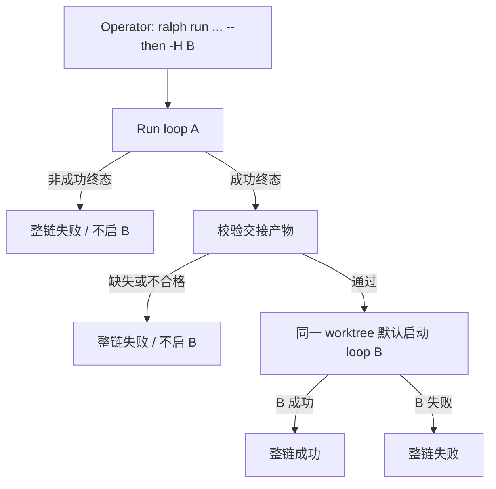

# Cross-Loop Follow-On - Plan

## Goal Capsule

- Objective: 让 operator 能声明「第一环 `ralph run` 终态成功且交接校验通过后，再启动第二环独立 `ralph run`」，覆盖「pipeline 完成后再跑测试 preset」这类跨 loop 串联。
- Product authority: 本文件 Product Contract；与现有 `auto_merge → merge-loop` follow-on、`post.loop.complete` hooks 的边界以本文件 Scope Boundaries 为准。
- Open blockers: 无（技术落点见 Deferred to Planning）。

## Product Contract

### Summary

提供一等公民的两环 follow-on：第一环（如 `-H builtin:ce-executor-pipeline`）以成功终态结束后，校验强制交接产物，通过后在默认同一 worktree 启动第二环（如 `-H builtin:<test-preset>`）。CLI `--then …` 与 config 中的 next 声明语义一致。

### Problem Frame

今天只能跑完一个 loop 再手工敲第二条 `ralph run`，或靠 hook 脚本自己拼第二环。仓库已有 worktree 成功后的 `auto_merge → merge-loop` follow-on，以及 `post.loop.complete` 外部脚本钩子，但没有「用户指定下一环 preset/config」的产品面。Operator 需要的是：第一条链真正完成并发出成功信号后，自动接上另一条独立链，而不是把测试塞进同一条 preset。

### Key Decisions

- **方案 A：通用成功后 follow-on（类 merge-loop），不做独立 chain 编排文件** `(session-settled: user-approved — chosen over 独立 ralph chain 文件 / 仅 hook 约定: 两环够用且复用已有 spawn 心智)`
- **主 CLI 效果为 `--then -H <next>`（亦可配 `-c`）** `(session-settled: user-directed — chosen over 只声明 -c 串联: 日常用法以 -H builtin:… 为主)`
- **v1 同时要 CLI 与 config 声明，且要静态 next + 动态交接** `(session-settled: user-directed — chosen over 只做静态或只做动态)`
- **交接缺失或校验失败则失败关闭：不启动第二环，整链失败** `(session-settled: user-directed — chosen over 警告仍启动 / 仅声明时才强制)`
- **v1 锁两环、仅成功才接、交接先约定路径+必填字段、默认复用 worktree** `(session-settled: user-approved — chosen over N 环/失败分支/复杂合同 DSL: 最小仍有价值)`

### Actors

- A1. Operator — 声明并启动两环串联的人。
- A2. Loop A（第一环）— 独立 `ralph run`；其最后 hat 必须写出可校验交接。
- A3. Loop B（第二环）— 另一独立 `ralph run`；消费交接后执行自己的 preset。
- A4. Follow-on 编排 — 判定 A 成功、校验交接、决定是否 spawn B（对 operator 表现为 CLI/config 行为，不暴露为 hat）。

### Key Flows

- F1. CLI 两环成功路径
  - **Trigger:** Operator 执行带 `--then -H <B>`（或等价 `-c`）的 `ralph run`。
  - **Actors:** A1, A2, A3, A4
  - **Steps:** 跑完 A → 确认成功终态 → 校验交接 → 默认同 worktree 启动 B → B 结束。
  - **Outcome:** 仅当 A 与 B 都成功时整链成功。
  - **Covered by:** R1, R2, R4, R5, R6, R8

- F2. 交接失败关闭
  - **Trigger:** A 已成功终态，但交接缺失或校验失败。
  - **Actors:** A2, A4
  - **Steps:** 不 spawn B；整链以失败结束并对 operator 可见。
  - **Outcome:** B 零启动。
  - **Covered by:** R3, R7

- F3. Config 声明等价于 CLI
  - **Trigger:** A 的 config 声明 next（第二环的 `-H` / `-c` 等），且 CLI 未矛盾覆盖。
  - **Actors:** A1, A4
  - **Steps:** 行为与显式 `--then` 一致（成功门禁 + 交接门禁 + 默认 worktree）。
  - **Outcome:** 可复用流水线无需每次手写 `--then`。
  - **Covered by:** R1, R9

### Requirements

**声明与入口**

- R1. Operator 可用 CLI 声明两环串联；主示意为 `ralph run … -H <preset-A> … --then -H <preset-B>`，第二环也可改用 `-c`。
- R9. A 的配置可声明 next（第二环的 hats/config 等），与 CLI `--then` 语义一致；二者冲突时的优先级留给规划，但产品上不得出现「静默忽略一侧」而无可见失败。

**门禁**

- R2. 仅当第一环以成功终态结束时才考虑启动第二环；取消、阻塞、错误等非成功终态不得启动 B。
- R3. 启动 B 前必须存在可校验的交接产物；缺失或不合格则不启动 B，整链失败。
- R7. 失败关闭必须对 operator 可观测（退出语义与诊断信息足以区分「A 失败」与「A 成功但交接失败」）。

**交接与上下文**

- R4. 交接由 A 侧在成功路径写出；B 启动时能获得交接位置（或等价注入），并按约定字段消费。
- R5. 若 A 在 worktree 中成功，B 默认在同一 worktree 启动；Operator 可显式关闭复用。
- R8. 每一环的 preset/hats 由该环自己的 `-H` / `-c` 决定；`--then` 不隐式改写第一环 preset。

**范围形状**

- R6. v1 只支持恰好两环（A→B），不要求 N 环、分支或失败改道。
- R10. 本能力是跨 loop 的 follow-on，不是把 B 的职责合并进 A 的同一 preset hat 链。

### Acceptance Examples

- AE1. Pipeline 后再测
  - **Covers:** R1, R2, R4, R5, R8
  - **Given:** Operator 运行 `ralph run --worktree --reuse-worktree -H builtin:ce-executor-pipeline --plan <plan> --then -H builtin:<test-preset>`，且 A 写出合格交接。
  - **When:** A 终态成功。
  - **Then:** 在同一 worktree 启动测试 preset 的第二环；`--then` 不改变第一环仍为 pipeline。

- AE2. 交接缺失
  - **Covers:** R3, R7
  - **Given:** A 发出成功终态，但交接文件缺失或校验失败。
  - **When:** follow-on 门禁运行。
  - **Then:** 不启动 B；整链失败，且可区分于「A 未成功」。

- AE3. A 未成功
  - **Covers:** R2
  - **Given:** A 以阻塞/错误/取消等非成功终态结束。
  - **When:** 会话结束。
  - **Then:** 不启动 B。

- AE4. Config next
  - **Covers:** R9, R1
  - **Given:** A 的 config 声明 next 指向 B 的 hats/config，CLI 未给矛盾的 `--then`。
  - **When:** A 成功且交接合格。
  - **Then:** 行为与显式 `--then -H B` 等价。

### Scope Boundaries

**Deferred for later**

- N 环串联、DAG、失败改走另一环
- 复杂合同 DSL / 富交互合同编辑器
- 独立 `ralph chain` 编排文件形态（方案 B）

**Outside this product's identity**

- 仅文档化 hook 脚本约定、不提供一等公民 CLI/config（方案 C）
- 把「跑测试」硬塞进 `ce-executor-pipeline` 同一条 hat 链以替代跨 loop follow-on
- 替换或取消现有 `auto_merge → merge-loop`（可并存；交互优先级见规划）

### Dependencies / Assumptions

- 成功终态与现有 loop 成功语义对齐（规划需钉死与 `CompletionPromise` 等成功路径的对应关系）。
- 第二环是另一次完整 `ralph run`，不是同一 event loop 内换 hat 拓扑。
- 交接字段集合在规划期约定；v1 要求「可校验 + 失败关闭」，不要求通用合同语言。

### Outstanding Questions

**Resolve Before Planning**

- （无）

**Deferred to Planning**

- CLI 标志最终命名与 argv 形状（对话示意 `--then`，实现可等价命名）。
- Config `next` 字段形状，以及与 CLI 同时出现时的覆盖规则。
- 交接产物的约定路径、必填字段、校验规则，以及如何注入给 B。
- 与 `auto_merge` / merge-loop 同时开启时的顺序与互斥策略。
- 第二环是否默认继承 `--plan` / prompt，或必须自行声明。

### Sources / Research

- 无跨 preset 的 `--then` / `--chain` CLI（claim verified）。
- 近亲：`auto_merge` 入队 + primary `CompletionPromise` 时 spawn `builtin:merge-loop`（`loop_completion` / `loop_runner` / `merge_queue`）。
- `post.loop.complete` hooks 可跑外部命令，但非用户声明的下一环 preset。
- `ce-executor-pipeline-loop` 是 preset 内 review/fix 环，不是跨 loop 编排。
- Grounding dossier（会话 scratch）：`/tmp/compound-engineering-501/ce-brainstorm/loop-chain-20260724/grounding.md`
