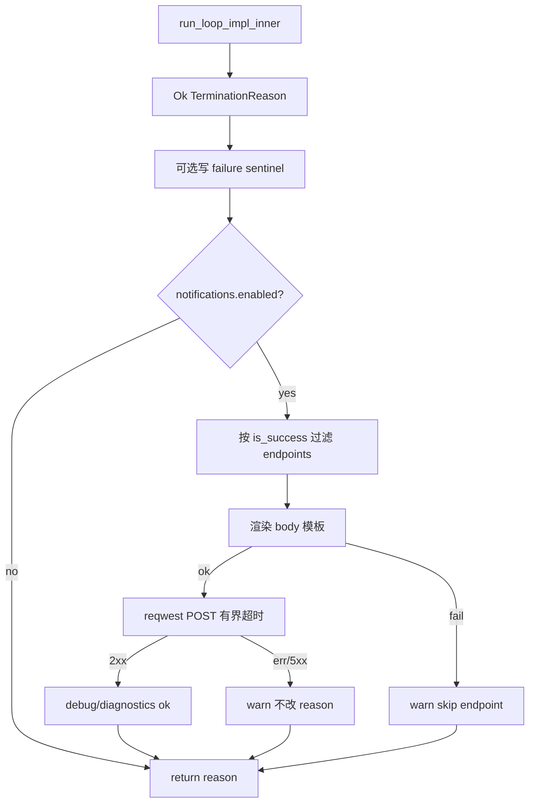
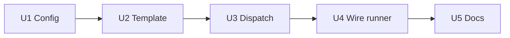

# feat: Loop 完成后可配置 Webhook 通知

## Goal Capsule

**Objective.** 当 Ralph loop 以成功或失败/阻塞类原因终止时，按项目级 `ralph*.yml`（如 `ralph.pipeline.yml` / `ralph.merge.yml`）中的独立 `notifications` 配置，向外发送一次（或多次）HTTP Webhook；默认支持飞书自定义机器人 JSON 正文，也支持任意通用 Webhook URL。发送失败只记录、不改变 loop 退出结果。

**Authority.** 会话已确认的 Product Contract 优先；实现细节服从本计划 Key Technical Decisions；与现有 lifecycle `hooks` 并存但不复用其 block/suspend 语义。

**Stop conditions.** 配置可解析校验；成功/失败终止各能按模板发 POST；Webhook 故障不改 `TerminationReason` / exit code；preset YAML 零改动；计划内 Scenario 与回归门禁通过。

---

## Product Contract

### Summary

在项目 `ralph*.yml` 增加可选 `notifications` 段：loop 终止时 best-effort HTTP 通知，自定义 body 模板，飞书友好；不进编译 preset，不做双向机器人。

Product Contract preservation: N/A（ce-plan-bootstrap，无上游 brainstorm 文件）。

### Problem Frame

Operator 需要在 pipeline / merge 等长时间 loop 结束后立刻在飞书（或其它 Webhook）收到结果，而不必盯终端。现有 lifecycle hooks 只能跑本地命令，且 hooks v1 把 remote webhook 列为 non-goal；仓库也已删除 Telegram 通道。需要原生、可配置、非阻塞的完成通知。

### Requirements

- R1. Operator 可在项目级 `ralph.pipeline.yml` / `ralph.merge.yml` / `ralph.yml`（及 `-c` / `RALPH_CONFIG` 指向的任意 RalphConfig YAML）配置 Webhook，**不得**写入 `presets/en/*.yml` 或 embedded preset。
- R2. 默认关闭：省略 `notifications` 或 `enabled: false` 时行为与今日完全一致（零网络、零副作用）。
- R3. Loop **成功终止**（`TerminationReason::is_success()`，即 `CompletionPromise` / `LOOP_COMPLETE` 路径）与 **非成功终止**（限额、恢复耗尽、取消、中断、契约失败等）均可通知，且可用不同模板/不同 endpoint 过滤。
- R4. 支持自定义 HTTP body 模板（字符串插值），足以直接写出飞书 `msg_type`/`content` JSON，也足以对接其它通用 Webhook。
- R5. Webhook 发送为 **best-effort**：超时、DNS 失败、非 2xx、渲染错误只 warn/log（及可选 diagnostics），**不得**改变已得出的 `TerminationReason`，不得阻塞 CLI 退出语义，不得触发 hooks 的 block/suspend。
- R6. 触发依据是 **loop 终止边界上的 `TerminationReason`**，不是环内业务事件 `plan.blocked`（`plan.blocked` 可多次出现且不等于终止）。
- R7. 与现有 `hooks.events.post.loop.complete` / `post.loop.error` 可并存；文档说明可能重复通知。

### Actors

- A1. Operator — 编辑项目 `ralph*.yml`、运行 `ralph run -c ...`、在飞书群查看消息。
- A2. Orchestrator runtime — 在 loop 终止统一出口派发通知。

### Key Flows

- F1. 成功完成 → 匹配 `on: success`（或等价开关）的 endpoint → 渲染模板 → HTTP POST → loop 正常成功退出。
- F2. 失败/阻塞类终止 → 匹配 `on: failure` 的 endpoint → 同上 → loop 仍按原失败原因退出。
- F3. 未启用或无匹配 endpoint → 不发起 HTTP。
- F4. HTTP/模板失败 → 记录警告 → 退出结果不变。

### Acceptance Examples

- AE1. `notifications.enabled: true` 且配飞书 URL + text JSON 模板；mock loop 以 `CompletionPromise` 结束；本地接收端收到 POST，body 含渲染后的 loop_id / status。
- AE2. 同配置下 mock 以 `RecoveryExhausted`（或任一 `!is_success()`）结束；failure 模板 endpoint 收到 POST，success-only endpoint 不收到。
- AE3. Webhook 端返回 500 / 超时；`run_loop_impl` 仍返回原 `TerminationReason`，exit 语义不变。
- AE4. 无 `notifications` 段的现有 `ralph.pipeline.yml` 解析与运行路径无回归。

### Scope Boundaries

**In scope**

- 顶层 `notifications` 配置、轻量 `{{var}}` 模板、reqwest POST、终止统一出口挂载、单元/集成测试、用户指南示例。

**Out of scope / Deferred for later**

- 飞书签名校验（timestamp/sign）。
- 双向机器人 / 会话交互 / 按钮回调。
- 环内 `plan.blocked` 即时推送。
- 自动重试队列、死信、多渠道抽象（Slack SDK 等）。
- 把 webhook 塞进 `hooks:` 命令模型。
- 修改任何 builtin preset YAML。

**Outside this product's identity**

- 不是聊天运维平台；orchestrator 仍是薄协调层，只在终止边界发信号。

### BDD 行为规格

```gherkin
Feature: Loop completion webhook notifications
  作为 Operator
  我想在项目 ralph*.yml 配置完成后 Webhook
  以便在飞书或其他系统收到成功/失败结果

  Scenario: S1 成功终止发送 success Webhook
    Given notifications 已启用且存在 on=success 的 endpoint 与 body 模板
    And loop 以 CompletionPromise 终止
    When runtime 完成终止收尾
    Then 对该 endpoint 发起一次 HTTP POST
    And body 为模板渲染结果
    And 返回的 TerminationReason 仍为成功

  Scenario: S2 失败终止发送 failure Webhook
    Given notifications 已启用且存在 on=failure 的 endpoint
    And loop 以非成功 TerminationReason 终止
    When runtime 完成终止收尾
    Then 对该 endpoint 发起一次 HTTP POST
    And success-only endpoint 未被调用
    And 返回的 TerminationReason 不变

  Scenario: S3 默认关闭零副作用
    Given 配置未包含 notifications 或 enabled=false
    When loop 以任意原因终止
    Then 不发起任何 HTTP 请求

  Scenario: S4 非法配置在 validate 失败
    Given notifications.enabled=true 但 endpoint 缺少 url
    Or timeout_seconds=0
    Or on 过滤器非法
    When 解析并 validate RalphConfig
    Then 返回 ConfigError（硬失败）
    And 指出字段路径

  Scenario: S5 Webhook 故障不阻断退出
    Given notifications 已启用
    And 目标 URL 超时或返回 5xx
    When 发送 Webhook
    Then 记录 warn/diagnostics
    And loop 退出原因与未配置通知时一致

  Scenario: S6 自定义飞书 JSON 模板可渲染
    Given body 模板为飞书 text JSON 且含 {{loop_id}} {{status}} {{termination_reason}}
    When 渲染模板
    Then 输出为合法 JSON 字符串（就结构而言由模板作者保证）
    And 占位符被替换为终止上下文值

  Scenario: S7 跳过 hooks 的终止路径仍通知
    Given notifications 已启用
    And 终止走 runner 中未派发 termination hooks 的捷径（如 RecoveryExhausted / Cancelled 等）
    When run_loop_impl 返回 Ok(reason)
    Then 仍恰好尝试派发一次通知（按配置过滤）

  Scenario: S8 未知模板变量的处理
    Given body 含未声明变量 {{unknown}}
    When 渲染模板
    Then 按计划约定失败或保留原文（见 KTD-5）
    And 该失败不改变 TerminationReason
```

---

## Planning Contract

### Assumptions

- A-assump1. 「失败/阻塞」在实现上等于 `!TerminationReason::is_success()`，不单独订阅 `plan.blocked` topic。
- A-assump2. 项目文件名无魔法：`ralph.merge.yml` / `ralph.pipeline.yml` 均通过 `-c` / `RALPH_CONFIG` / 默认发现路径加载，与现有 `ConfigSource::File` 一致。
- A-assump3. v1 不实现飞书签名；需要签名的群用 hooks 脚本或后续计划。
- A-assump4. v1 URL 字段为字面量字符串；环境变量展开（如 `${FEISHU_WEBHOOK_URL}`）列为后续增强，本计划不实现。

### Open Questions

- Q1. **Deferred:** URL / header 的环境变量展开语法是否在 follow-up 实现（本计划 v1 用字面量 URL）。
- Q2. **Deferred:** 是否增加 `ralph notifications validate` CLI（可用文档 + `RalphConfig::validate` 覆盖 v1）。

### Key Technical Decisions

- KTD-1. 顶层配置键为 `notifications:`（独立段，镜像 `telemetry` / `hooks`），不进 preset。`(session-settled: user-directed — chosen over 挂在 lifecycle hooks: hooks v1 将 remote webhook 列为 non-goal，且 on_error 可 block/suspend)`
- KTD-2. 成功与失败都可通知，用 endpoint 级 `on: [success, failure]`（或布尔对）过滤。`(session-settled: user-directed — chosen over 仅成功)`
- KTD-3. 发送语义永远 best-effort：短超时、错误只记日志、不改退出码。`(session-settled: user-directed — chosen over 严格阻断)`
- KTD-4. 挂载点选 `run_loop_impl` 在 `run_loop_impl_inner` 返回之后（写 sentinel 前后均可，但须在返回 `result` 之前 await 有界发送或 spawn+join 有界超时），以覆盖未走 termination hooks 的捷径退出。`(session-settled: user-approved — research: runner 内至少 4 条路径跳过 hooks)`
- KTD-5. 模板为轻量 `{{name}}` 字符串替换（无新模板引擎依赖）；未知变量 → **渲染失败并 skip 该 endpoint（warn）**，不抛崩进程。变量集对齐终止上下文：`loop_id`, `status`（`success`|`failure`）, `termination_reason`, `workspace`, `repo_root`, `iteration_current`, `iteration_max`, `active_hat`（可空则空串）。`(session-settled: user-directed — chosen over 仅内置固定正文: 自定义 body/模板)`
- KTD-6. HTTP 使用 workspace `reqwest 0.12`（rustls+json）；可测性通过 `WebhookTransport` trait（或等价注入）+ 本地 loopback server；测试 Client **必须** `.no_proxy()`（见 `docs/solutions/test-failures/reqwest-no-proxy-loopback-test-failures.md`）。
- KTD-7. 日志与 diagnostics 对 URL query/token、Authorization header 做 redact；不把完整 webhook URL 明文打到 info 默认日志。
- KTD-8. **不**修改 `crates/ralph-core/data/ralph-tools*.md`（非 in-loop agent API）；更新 `docs/guide/configuration.md`（及必要时 `docs/guide/project-usage.md`）即可。

### Suggested config shape（定向，非实现规格）

```yaml
notifications:
  enabled: true
  timeout_seconds: 5
  endpoints:
    - name: feishu-success
      url: "https://open.feishu.cn/open-apis/bot/v2/hook/********"
      on: [success]
      headers:
        Content-Type: application/json
      body: |
        {"msg_type":"text","content":{"text":"Ralph OK {{loop_id}} ({{termination_reason}})"}}
    - name: feishu-failure
      url: "https://open.feishu.cn/open-apis/bot/v2/hook/********"
      on: [failure]
      body: |
        {"msg_type":"text","content":{"text":"Ralph FAIL {{loop_id}}: {{termination_reason}}"}}
```

### High-Level Technical Design



### 验收与测试策略

| Scenario | 验收条件 | 推荐测试层级 | 是否需要 E2E |
|---|---|---|---|
| S1 成功通知 | success endpoint 收到 1 次 POST，reason 仍成功 | 集成（本地 HTTP） | 否（mock 终止即可） |
| S2 失败通知 | failure endpoint 收到；success-only 不收 | 集成 + 单元（路由） | 否 |
| S3 默认关闭 | 零 HTTP | 单元 + 集成 | 否 |
| S4 非法配置 | `RalphConfig::validate` 硬错误 | 单元（config boundary） | 否 |
| S5 故障不阻断 | 5xx/超时后仍 Ok(原 reason) | 集成（Fault Injection） | 否 |
| S6 飞书模板 | 占位符替换；可解析为 JSON 对象（测试用固定模板） | 单元 | 否 |
| S7 捷径路径 | 包装层仍派发 | 集成/表征（针对 wrapper） | 否 |
| S8 未知变量 | skip endpoint + warn，进程不崩 | 单元 | 否 |

### 需求—测试追踪矩阵

| 需求 | Scenario | 验收测试 | 单元测试 | 集成/契约 | E2E |
|---|---|---|---|---|---|
| R1 项目 yml 配置 | S4 | config parse fixture | `notifications_config_boundary` | CLI 加载 `-c` 可选 | — |
| R2 默认关闭 | S3 | enabled=false / 缺省 | default 断言 | wrapper 零调用 Fake | — |
| R3 成功+失败 | S1 S2 | 路由表 | `status_for_reason` / filter | 双 endpoint 本地 server | — |
| R4 自定义模板 | S6 S8 | 渲染用例 | template 模块 | POST body 断言 | — |
| R5 best-effort | S5 | 超时/5xx | transport Fake err | 退出 reason 不变 | — |
| R6 非 plan.blocked | — | 文档 + 单测映射表 | `is_success` 映射 | — | — |
| R7 与 hooks 并存 | — | 文档说明 | — | 可选：hooks+notifications 同开不 panic | — |
| AE/S7 捷径覆盖 | S7 | wrapper 单测 | — | 模拟捷径 return | — |

### Alternative Approaches Considered

| 方案 | 为何不采用 |
|---|---|
| 扩展 `hooks` 增加 `type: webhook` | hooks v1 non-goal；block/suspend 语义冲突；用户已选独立段 |
| 仅文档教人用 curl hook | 无模板/校验/统一挂载；捷径路径仍漏 |
| 监听 `plan.blocked` | 环内噪声与 silent-success 陷阱；用户要的是「做完」 |

### Risks & Dependencies

| 风险 | 缓解 |
|---|---|
| 只挂 post-hook 漏 4 条捷径 | KTD-4 统一挂 `run_loop_impl` |
| HTTP_PROXY 污染 loopback 测试 | Client `.no_proxy()` + 文档引用 solution |
| 模板写出非法 JSON | 文档示例；渲染层不做 JSON schema；失败 skip |
| 与 hooks 脚本重复通知 | 文档明示 |
| URL 泄露 | redact（KTD-7） |

### Sources & Research

- 仓库：`crates/ralph-core/src/config/{telemetry,hooks,ralph_config}.rs`；`crates/ralph-cli/src/loop_runner/{runner,hooks/termination,payload_inputs}.rs`
- Hooks 规格：`specs/add-hooks-to-ralph-orchestrator-lifecycle/requirements.md`（webhook non-goal）
- 测试：`docs/solutions/test-failures/reqwest-no-proxy-loopback-test-failures.md`
- 飞书：自定义机器人 Webhook POST + `msg_type`/`content` JSON（[开放平台文档](https://open.feishu.cn/document/ukTMukTMukTM/ucTM5YjL3ETO24yNxkjN)）
- External research load-bearing: 飞书依赖**自定义 JSON body**，支撑 KTD-5 模板决策。

---

## Implementation Units

> **执行纪律（全 Unit 强制）**  
> 严格串行：U1 → U2 → U3 → U4 → U5。前一 Unit 的实现、测试、重构、回归全部完成后才能开始下一 Unit。  
> 每个 Unit 闭环：验收测试 Red → 最小单测 Red→Green→Refactor → 集成 → 回归 → 完成标准。  
> 禁止：删断言、skip、`.only`、无解释更新 snapshot、Mock 掉被测行为、只跑局部就宣称完成。

### U1. Notifications 配置解析与校验

**Goal:** 在 `RalphConfig` 增加可缺省的 `notifications` 段；非法配置硬失败；缺省零行为。

**Requirements:** R1, R2, R4（字段存在）, S4, S3

**Dependencies:** 无

**Files:**

- Create: `crates/ralph-core/src/config/notifications.rs`
- Modify: `crates/ralph-core/src/config/mod.rs`, `crates/ralph-core/src/config/ralph_config.rs`, `crates/ralph-core/src/config/error.rs`（若需新变体）
- Test: `crates/ralph-core/tests/notifications_config_boundary.rs`（或同目录既有 `*_config_boundary` 风格）

**Approach:** 镜像 `TelemetryConfig`：`#[serde(default)]`、`enabled` 默认 false、`timeout_seconds` 默认 5、`endpoints: Vec`；`enabled=true` 时每个 endpoint 必填非空 `url`、`body`（或允许空 body？**约定必填非空 body**）、`on` 非空且仅 `success`|`failure`；`timeout_seconds > 0`。禁止改 preset。

**Patterns to follow:** `crates/ralph-core/src/config/telemetry.rs`；`crates/ralph-core/tests/hooks_config_boundary.rs`

**Execution note:** ATDD/TDD — 先写 config boundary 验收测试并确认 Red（缺字段），再实现 struct + validate。

**验收测试:**

1. 缺省 YAML → `notifications.enabled == false` 且 endpoints 空。
2. `enabled: true` 无 endpoints / 缺 url / timeout 0 → `validate` Err。
3. 合法双 endpoint 飞书样例 → Ok。

**需要拆分的单元测试:** `NotificationsConfig::validate` 各错误分支；serde round-trip。

**Red 预期失败原因:** `RalphConfig` 尚无 `notifications` 字段或 validate 未实现。

**最小实现范围:** 仅配置类型 + 挂到 `RalphConfig` + validate 钩子；无 HTTP、无 runner。

**集成验证:** `RalphConfig::parse_yaml` / `from_file` 读临时 yml。

**回归范围:** `cargo nextest run -p ralph-core -- notifications_config` 与既有 `hooks_config` / `telemetry` 子集。

**完成标准:** S3/S4 配置侧通过；无网络代码；preset 文件零 diff。

**风险与注意事项:** 用户/项目 YAML 数组合并是整表替换——文档后续说明；本 Unit 只保证结构正确。

---

### U2. `{{var}}` 模板渲染

**Goal:** 给定终止上下文字典，渲染 body 字符串；未知变量按 KTD-5 失败。

**Requirements:** R4, S6, S8

**Dependencies:** U1（可复用变量名字约定；本 Unit 可不依赖完整 Config）

**Files:**

- Create: `crates/ralph-core/src/notifications/template.rs`（或 `crates/ralph-cli/...` 若坚持 CLI 侧；**推荐 core** 便于单测无 tokio）
- Modify: `crates/ralph-core/src/lib.rs` / `notifications/mod.rs` 导出
- Test: `crates/ralph-core/src/notifications/template.rs` 内 `#[cfg(test)]` 或 `tests/notifications_template.rs`

**Approach:** 只替换 `{{ident}}`；不支持条件/循环；值做**最小**转义策略：**默认不 HTML escape**（飞书 JSON 由作者保证），但对替换值中的 `\` 与 `"` 提供可选 `json_string_escape` 助手或文档要求作者把变量放在 JSON 字符串内并自行避免破坏——**决策：替换值做 JSON string escape（`"` `\` 控制字符），以便飞书 text 模板安全**。未知 `{{x}}` → `Err(UnknownVariable)`。

**Execution note:** 纯函数 TDD；Property：对任意无 `{{` 的 body，render 恒等。

**验收测试:**

1. 飞书 text 模板 + 已知变量 → 可 `serde_json::from_str`。
2. `{{unknown}}` → Err。
3. 值含引号 → 转义后仍是合法 JSON 字符串内容。

**Red 预期失败原因:** 模块不存在。

**最小实现范围:** 模板模块 only。

**集成验证:** 无 HTTP。

**回归范围:** `cargo nextest run -p ralph-core -- notifications_template`

**完成标准:** S6/S8 单元通过。

**风险与注意事项:** 不要引入 handlebars/tera；保持零新依赖。

---

### U3. Webhook 派发器 + Transport（Fake）与 best-effort 语义

**Goal:** 根据 `TerminationReason` + `NotificationsConfig` 选择 endpoint、渲染、调用 Transport；错误吞掉为 warn。

**Requirements:** R3, R5, R6, S1, S2, S5（逻辑层）, S8

**Dependencies:** U1, U2

**Files:**

- Create: `crates/ralph-core/src/notifications/{mod,dispatch,transport}.rs`（transport trait + reqwest impl 可放 core 或 cli；若 core 已有 reqwest 则放 core）
- Test: Fake transport 记录调用；故障 Fake 断言 dispatch 仍 Ok

**Approach:**

```text
dispatch(config, ctx, reason) -> ()
  if !enabled return
  status = success if reason.is_success() else failure
  for ep in endpoints where ep.on contains status:
    render body; on err warn continue
    transport.post(url, headers, body, timeout); on err warn continue
```

禁止改 exit code。多 endpoint **顺序**发送（简单、可测）；总时间受 per-request timeout 约束。

**Execution note:** 先用 Fake 写 S1/S2/S5 逻辑测试 Red，再接真实 reqwest impl（真实 impl 的 loopback 测放到 U4）。

**验收测试:**

1. Fake：success reason → 仅 success endpoints 各 1 次。
2. Fake：failure reason → 仅 failure endpoints。
3. Fake：transport Err → dispatch 返回 Ok(())，调用次数仍尝试后续 endpoint。
4. Fake：render Err → 该 ep skip，其它继续。

**Red 预期失败原因:** dispatcher 不存在。

**最小实现范围:** 不改 runner。

**集成验证:** 模块内 Fake only。

**回归范围:** `cargo nextest run -p ralph-core -- notifications`

**完成标准:** 路由与 best-effort 逻辑单测全绿。

**风险与注意事项:** Fault Injection 在 Fake 层完成即可；真实超时在 U4。

---

### U4. 挂载 `run_loop_impl` + 本地 HTTP 集成测试

**Goal:** 所有 `Ok(TerminationReason)` 退出路径触发一次 dispatch；真实 HTTP 对 loopback 验证；故障不改返回值。

**Requirements:** R3, R5, AE1–AE3, S1, S2, S5, S7

**Dependencies:** U3

**Files:**

- Modify: `crates/ralph-cli/src/loop_runner/runner.rs`（`run_loop_impl` 包装层）
- Create: `crates/ralph-cli/src/loop_runner/notifications.rs`（若需从 LoopContext 组 ctx；调用 core dispatch）
- Modify: `crates/ralph-cli/src/loop_runner/mod.rs`
- Test: `crates/ralph-cli/src/loop_runner/tests/notifications.rs` — 本地 `TcpListener`/`axum` 或手工 HTTP/1.1；Client `.no_proxy()`
- 可选：抽取可测的 `notify_loop_termination(config, ctx, reason)` 供单测直接调用，避免跑完整 event loop

**Approach:** 在 `run_loop_impl` 取得 `Ok(reason)` 后调用 notifier；需要 `config` 在 inner 之后仍可用 → **在调用 inner 前 `notifications` clone**（或 clone 整份关心字段），因 `config` 会 move 进 inner。上下文字段尽量复用 `build_loop_termination_payload_input` 同源信息；若包装层拿不到 iteration/hat，允许 v1 对缺失字段填空或从 sentinel/workspace 读最小集（`loop_id`/`workspace`/`termination_reason` 必须有）。**优先**：在 move 前保存 `Arc`/clone 的通知所需快照由 inner 经返回值扩展——若侵入过大，v1 最小集：`loop_id`（从 `loop_context`）、`workspace`、`repo_root`、`termination_reason`、`status`；iteration/hat 有则填无则空。记录该降级为明确假设，测试覆盖最小集。

**Execution note:** Outside-In：先写「调用 notify_loop_termination + 本地 server 收到 POST」集成测 Red，再改 `run_loop_impl`。另写表征测试确认捷径路径也会进包装层（不必重跑全 loop：测 `run_loop_impl` 对 stub/inner 的包装，或测公开的 notify 在 runner 源码中于 return 前被调用的结构约束——优先可执行行为测而非字符串搜）。

**验收测试:**

1. 启用配置 + 本地 server：模拟 success 调用 notify → 1 POST，JSON 字段正确。
2. failure 同理。
3. server 不 accept / 返回 500 → notify 后仍得到原 reason（包装函数返回值）。
4. enabled=false → server 计数 0。

**Red 预期失败原因:** `run_loop_impl` 未调用 notifier。

**最小实现范围:** 挂载 + 集成测；不改 preset；不强制改用户仓库里的 `ralph.pipeline.yml`（示例放文档/examples）。

**集成验证:** `cargo nextest run -p ralph-cli --bin ralph -- notifications`（及 loop_runner notifications 子集）

**回归范围:** `cargo nextest run -p ralph-cli --bin ralph -- hooks`（termination hooks 未破坏）；`cargo nextest run -p ralph-core -- notifications`

**完成标准:** S1/S2/S5/S7 行为在集成层证明；HARD RULE 5：若 spawn CLI，使用 `common::ralph_bin()` scrub。

**风险与注意事项:** `config` move 导致 clone 遗漏是编译期问题；异步 runtime 已在 runner；避免无界 `await` 挂死——必须 timeout。

---

### U5. Operator 文档与示例（无 secret）

**Goal:** 文档说明如何在 `ralph.pipeline.yml` / `ralph.merge.yml` 配置飞书；与 hooks 差异；安全与代理注意。

**Requirements:** R1, R7, AE4（文档层）

**Dependencies:** U1–U4

**Files:**

- Modify: `docs/guide/configuration.md`
- Optional Create: `examples/notifications/feishu.ralph.yml`（假 URL / 占位符，无真实 secret）
- **禁止**修改 `presets/**`；**禁止**把真实 webhook URL 写入仓库

**Approach:** 增加 `notifications` 小节；示例用占位 `********`；指向飞书开放文档；说明 success/failure、`{{var}}` 列表、best-effort、与 hooks 可并存、数组 merge 覆盖语义。

**Execution note:** 无行为代码则 `Test expectation: none -- 文档与示例 only`；人工核对链接与字段名与 U1 schema 一致。

**验收测试:** 无自动化行为测；完成标准为字段表与代码一致（对照 `NotificationsConfig`）。

**回归范围:** 无需；可选 `scripts/check-cli-doc-drift.sh` 若未涉及 CLI 可跳过。

**完成标准:** Operator 仅读文档即可在项目 yml 配通；preset 零 diff。

**风险与注意事项:** 不要更新 `ralph-tools*.md`（KTD-8）。

---

## Verification Contract

### Per-unit gates

| Unit | 命令意图（outcome，非死记脚本） |
|---|---|
| U1 | ralph-core notifications config 测试全绿 |
| U2 | template 测试全绿 |
| U3 | dispatch + Fake 测试全绿 |
| U4 | ralph-cli notifications 集成 + hooks 回归子集绿 |
| U5 | 文档字段与代码一致 |

### Final gate（准备宣布完成前）

- 计划内 Scenario S1–S8 均有对应自动化或明示文档验收
- `cargo nextest run -p ralph-core -- notifications`
- `cargo nextest run -p ralph-cli --bin ralph -- notifications`
- hooks / config 相关回归子集通过
- `cargo clippy` / `cargo fmt` 无新增问题
- 全量建议：`./scripts/run-tests.sh`（LOOP_COMPLETE 前）
- **无**新增 ignore/skip 测试
- preset / embedded preset **零**业务改动

### 最终质量门禁（清单）

- [ ] 所有计划内 Scenario 通过或有等价自动化
- [ ] 所有新增单元测试通过
- [ ] 必要集成测试通过（含 Fault Injection：5xx/超时）
- [ ] 无强制 live Feishu E2E；关键路径由本地 HTTP 覆盖
- [ ] Lint / Format / Build 通过
- [ ] 无新增失败或跳过测试
- [ ] 未验证：飞书签名、真实公网飞书投递、环内 plan.blocked 推送 — 记入剩余风险

---

## Definition of Done

- Product：R1–R7 满足；AE1–AE4 可演示（本地 mock）。
- 工程：U1→U5 串行完成且每 Unit 完成标准勾选。
- 文档：`docs/guide/configuration.md` 含 `notifications`；无 secret 入库。
- 回归：通知相关与 hooks 子集绿；宣布整体完成前跑 `./scripts/run-tests.sh`。
- 残留显式：飞书 sign、双向机器人、plan.blocked 推送、重试队列 — 不在本计划。

---

## Appendix

### 串行依赖图



### 实现者必读

- `specs/add-hooks-to-ralph-orchestrator-lifecycle/requirements.md`（webhook non-goal）
- `docs/solutions/test-failures/reqwest-no-proxy-loopback-test-failures.md`
- `docs/api/security.md`（输出/token 处理）
- `crates/ralph-cli/src/loop_runner/hooks/termination.rs` + `runner.rs` `run_loop_impl`

### Deferred implementation notes

- 精确 helper 函数名以实现时模块风格为准。
- 若 `run_loop_impl` 拿不到 iteration/hat，v1 允许空串（U4 已记）。
- 是否增加 `ralph notifications validate` CLI：非必须；可用 `ralph hooks validate` 类比后续再加。
