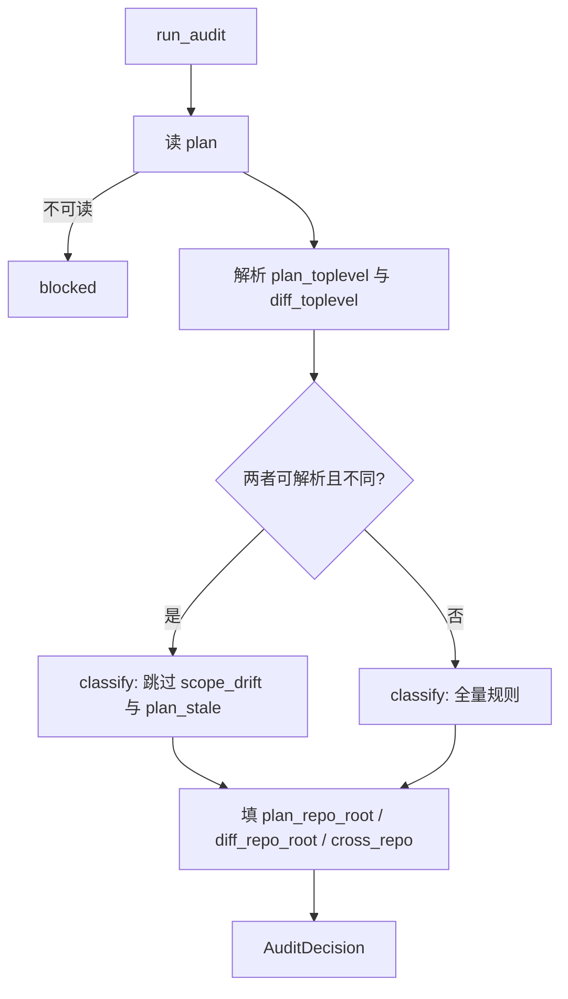

# fix: e2e-bootstrap cross-repo plan×diff 误报

## Goal Capsule

- Objective: 让 `ralph-e2e-bootstrap` 的 `plan_diff` audit 把「plan 与 sandbox 跨 git 仓」识别为合法 pattern：`ok=True`、不弹 combo-box、不误报 `scope_drift` / `plan_stale`；`AuditDecision` 暴露 `plan_repo_root` / `diff_repo_root` / `cross_repo` 供 handoff evidence。
- Authority: 本文件 Product Contract + Planning Contract；与 origin brainstorm 冲突时以本文件已拍板决策为准。
- Sequencing: **U1 → U2 → U3** 串行。
- Stop when: Verification Contract 全绿；Definition of Done 勾选。
- Out of scope reminder: 不改 Rust/crates；不改 sandbox suite argv 行为；不新增 combo-box 决策点；不引入 live run / diagnosis；不改 `SKILL.md` 主干 Boundaries/Workflow/Static Gates/Guardrails。

Product Contract preservation: 自 legacy brainstorm 提炼；**changed:** 放弃 brainstorm N10 的「新增 `CLARIFY_CROSS_REPO_INTENT` + combo-box」——会话拍板为直接放行（选项 1）；N7 用 audit 字段满足，不新增阻塞 clarify 码。

---

## Product Contract

### Summary

修复 `skills/ralph-e2e-bootstrap/scripts/plan_diff.py`：当 plan 所在 git toplevel 与 `repo_root`（diff 仓）不同时，跳过 scope/stale 误报并放行；同仓 happy path 与现有 clarify 语义不变。

### Problem Frame

Skill goal 是把 plan + E2E sandbox 接到已有 preset 并交出静态启动命令。合法 dogfood 形态常是：plan 在 ralph-orchestrator，sandbox 是独立产品仓。当前 `_classify` 用 sandbox diff 路径与 plan intent 做 depth-2 前缀比较，跨仓必出 `scope_drift`；sandbox 空 diff 则出 `plan_stale`。Caller 只能硬选「接受 plan intent」闯关，没有跨仓证据字段。

### Requirements

- R1. 跨仓合法场景下 audit **识别**为合法 pattern，不 emit `scope_drift` / `plan_stale`。(origin N1, N5, N6)
- R2. 同仓 happy path 行为不变；现有 T2.1–T2.5 与 contract/e2e/install 锚继续绿。(origin N2, N13)
- R3. sandbox 产物路径 / argv 行为不变；不改 `sandbox_suite.py` 生成逻辑。(origin N3)
- R4. 不引入 live run；不写 crates/presets；实现仅限 skill + tests。(origin N4, N14)
- R5. 跨仓时 `ok=True`（在无其它阻塞 clarify 的前提下），**不** raise combo-box；不新增决策点。(session: 选项 1)
- R6. `AuditDecision` 暴露 `plan_repo_root` / `diff_repo_root` / `cross_repo`。(origin N7, N9)
- R7. Caller API 形状不变：`plan_path` + 可选 `repo_root` + 可选 `diff_provider`。(origin N8)
- R8. 跨仓判定：比较 plan 路径与 `repo_root` 各自的 git toplevel；两者皆可解析且路径不同 ⇒ `cross_repo=True`。(session call-out 1)
- R9. 跨仓时仍 emit `unit_missing` / `intent_undeclared` / `diff_unavailable`；仅抑制 `scope_drift` 与 `plan_stale`。(session call-out 2)
- R10. `SKILL.md` 主干不动；`references/interaction.md` 仅追加「跨仓自动放行」说明（非新决策点）。(origin N14, 适配 R5)
- R11. 至少 2 个跨仓测试：(a) 跨仓 + diff 非空；(b) 跨仓 + diff 空。(origin N12)

### Scope Boundaries

**In scope**

- `plan_diff.py`：toplevel 解析、跨仓短路径、`AuditDecision` 字段
- `test_plan_diff_edge_cases.py`（及必要时 contract 断言扩展）
- `interaction.md` 一段说明性补充

**Out of scope**

- `sandbox_suite.py` / gate / binary_resolve / e2e_handoff 行为变更（字段若已有 audit 输入可被 handoff 透传则属最小接线，非重构）
- 新增 `CLARIFY_CROSS_REPO_INTENT` 阻塞码或 combo-box
- 解析 events.jsonl / supervisor.db；新建 preset；清理 sandbox 错产物
- 改写 caller 的业务 plan 文件本身

**Deferred**

- handoff markdown 强制打印 cross-repo 块（若现有 evidence 通道已能塞字段则 U2 顺带透传；否则留给 follow-up）
- plan 仓自身有 diff、sandbox 仓无 diff 时是否另做「plan 仓 stale」审计（origin O5 的扩展解读）——本计划明确：跨仓只看 diff 仓，且不因此标 `plan_stale`

### Acceptance Examples

- AE1. plan 在仓 A、`repo_root` 为仓 B、diff 含 sandbox 产物路径、plan intent 含 `crates/` → `ok=True`，`cross_repo=True`，无 `scope_drift`。
- AE2. 同上但 diff 为空 → `ok=True`（plan 有 U-ID + intent），无 `plan_stale`。
- AE3. 同仓 + intent/diff 前缀不一致 → 仍 `scope_drift`，`cross_repo=False`。
- AE4. 同仓 + 空 diff + 有 U-ID → 仍 `plan_stale`。
- AE5. 跨仓但 plan 无 path token → 仍 `intent_undeclared`，`ok=False`。
- AE6. 跨仓但 `diff_unavailable=True` → 仍 `diff_unavailable`，`ok=False`。

---

## Planning Contract

### Key Technical Decisions

- KTD1. **跨仓 = 直接放行，不用 clarify 码阻塞。** Rationale: 跨仓是 dogfood 常态；combo-box 会把合法 pattern 当故障。证据字段足够满足 audit trail。
- KTD2. **判定用 `git rev-parse --show-toplevel`，比较规范化绝对路径。** Rationale: 与 `_git_diff_paths` 同属 git 边界；不依赖 caller 声明第二套 API。任一端解析失败 ⇒ 不宣称 `cross_repo`，走同仓 classify。
- KTD3. **跨仓短路径只跳过 `scope_drift` 与 `plan_stale`。** Rationale: 其它码描述 plan 质量或 git 故障，与仓边界无关。
- KTD4. **不新增 `CLARIFY_CROSS_REPO_INTENT`。** Rationale: 会话否决 combo-box；布尔/`repo_root` 字段覆盖 N7。
- KTD5. **默认 `repo_root` 语义不变**（缺省回退 `plan_path.parent`）。跨仓 caller 必须显式传 sandbox 仓根——与现状一致，不扩 API。
- KTD6. **`diff_provider` 测试注入优先；跨仓 fixture 用两个真实 `git init` tmp 仓** 验证 toplevel 路径，diff 内容仍可用 fake provider，避免依赖工作树脏状态。

### Assumptions

- Caller 在跨仓场景会显式传入 sandbox 的 `repo_root`（与实测轨迹一致）。
- `_git_toplevel` 允许在 `run_audit` 内 subprocess（与现有 `_git_diff_paths` 同级）；import 时仍无副作用。
- frozen `AuditDecision` 增字段对现有构造点需全量补齐；测试若用位置构造需同步。

### High-Level Technical Design

Directional: `_classify` 增加 `cross_repo: bool` 参数；或在 `run_audit` 于 classify 之后过滤两个码。优先在 classify 入口短路，避免先 append 再删。

---

## Implementation Units

### U1. AuditDecision 字段 + git toplevel 检测

**Goal:** `run_audit` 能判定 `cross_repo` 并在决策对象上暴露两个 repo root。

**Requirements:** R6, R7, R8

**Dependencies:** 无

**Files:**

- Modify: `skills/ralph-e2e-bootstrap/scripts/plan_diff.py`
- Test: `skills/tests/test_plan_diff_edge_cases.py`

**Approach:**

- 为 `AuditDecision` 增加字段：`plan_repo_root: str | None`、`diff_repo_root: str | None`、`cross_repo: bool`（默认 `False`）。
- 新增私有 `_git_toplevel(path) -> Path | None`：`git -C <path> rev-parse --show-toplevel`，失败/超时返回 `None`（超时预算与 `_git_diff_paths` 同量级）。
- `run_audit`：解析 `plan_toplevel`（对 `plan_path` 的 parent 或已存在路径）、`diff_toplevel`（对 `repo_root_path`）；两者非空且 resolve 后不等 ⇒ `cross_repo=True`。
- blocked（plan 不可读）路径也尽量填已知 root 字段；`cross_repo=False`。
- 导出 `__all__` 不变即可（字段挂在 dataclass 上）。

**Patterns to follow:** `_git_diff_paths` 的 subprocess / timeout / 失败语义；`diff_provider` 可注入、默认走 git。

**Test scenarios:**

- Happy: 两个 `git init` tmp 仓，plan 在 A、`repo_root`=B → `cross_repo is True`，两 root 字符串指向对应 toplevel。
- Same-repo: plan 与 `repo_root` 同仓 → `cross_repo is False`。
- Unresolvable: 非 git 目录作 `repo_root` → `cross_repo is False`，不抛异常。

**Verification:** 新测绿；现有 contract 中构造 `AuditDecision` 的断言仍编译运行（若有直接构造需补默认字段——当前测试走 `run_audit`）。

---

### U2. 跨仓 classify 抑制 scope_drift / plan_stale

**Goal:** 跨仓时消除误报并在无其它 clarify 时 `ok=True`。

**Requirements:** R1, R5, R9

**Dependencies:** U1

**Files:**

- Modify: `skills/ralph-e2e-bootstrap/scripts/plan_diff.py`
- Modify: `skills/ralph-e2e-bootstrap/references/interaction.md`
- Test: `skills/tests/test_plan_diff_edge_cases.py`

**Approach:**

- `_classify(..., cross_repo: bool = False)`：当 `cross_repo` 时跳过 drift 前缀比较与「有 U-ID 且空 diff → stale」分支；`diff_unavailable` / `unit_missing` / `intent_undeclared` 逻辑保持。
- `ok = not issues and not clarify` 语义不变。
- `interaction.md` 的 `plan_diff_clarify` 节追加短注：当 audit 报告 `cross_repo=True` 时 skill **不**触发该决策点，直接进入后续阶段；不新增决策点行（遵守 R12「一次一个」且不增加决策面）。
- **不**改 `SKILL.md` 决策表（origin N14）。

**Patterns to follow:** 现有 clarify 常量与 `plan_diff_clarify` 文案风格。

**Test scenarios:**

- Covers AE1: 跨仓 + diff 非空且与 intent 前缀无关 → 无 `scope_drift`，`ok=True`（plan 含 U-ID + intent）。
- Covers AE2: 跨仓 + 空 diff → 无 `plan_stale`，`ok=True`。
- Covers AE5: 跨仓 + 无 intent paths → 仍有 `intent_undeclared`。
- Covers AE6: 跨仓 + provider 返回 unavailable → 仍有 `diff_unavailable`。
- Regression: 同仓 drift / stale 用例行为不变（可依赖现有 contract + T2.*）。

**Verification:** 跨仓两测 + 同仓回归绿。

---

### U3. 回归锚与文档闭合

**Goal:** 证明 contract/e2e/install 未破；文档与实现一致。

**Requirements:** R2, R3, R4, R10, R11

**Dependencies:** U1, U2

**Files:**

- Test: `skills/tests/test_e2e_bootstrap_contract.py`（仅当需显式断言新字段时小改；否则只跑）
- Test: `skills/tests/test_plan_diff_edge_cases.py`
- Modify: `skills/ralph-e2e-bootstrap/references/interaction.md`（若 U2 未写完）

**Approach:**

- 跑 skill 测集：`test_plan_diff_edge_cases`、`test_e2e_bootstrap_contract`、`test_e2e_bootstrap_e2e`、`test_install`（及 brainstorm 提到的 project-bootstrap contract 188 锚——确认本改动未误伤）。
- 可选：contract 对同仓 `ok=True` 路径断言 `cross_repo is False`（防回归）。
- 确认未改 `sandbox_suite.py` / `SKILL.md` 主干。

**Test expectation:** 以跑通既有套件 + U1/U2 新测为主；本 unit 可不新增行为测。

**Verification:** 上述 pytest 目标全绿；`git diff` 不含 `crates/`。

---

## Verification Contract

- 子任务验证：对 `skills/tests/test_plan_diff_edge_cases.py` 与相关 e2e-bootstrap contract 用例跑 pytest（项目既有 skill 测试入口 / `.venv`）。
- 回归：`test_e2e_bootstrap_contract`、`test_e2e_bootstrap_e2e`、`test_install` 保持绿。
- 不要求 `./scripts/run-tests.sh` 全量 Rust 基线（本计划零 Rust 改动）；若执行环境顺手可跑，失败且与 skill 无关则记为环境噪声而非本计划阻断。

---

## Definition of Done

- [ ] 跨仓 + 非空/空 diff 两测绿，且不出现 `scope_drift` / `plan_stale`
- [ ] 同仓 T2.1–T2.5 与 contract drift/stale 锚仍绿
- [ ] `AuditDecision` 可读取 `cross_repo` / 两个 repo root
- [ ] 无新 combo-box 决策点；`interaction.md` 有跨仓自动放行说明
- [ ] `SKILL.md` 主干未改；无 `crates/` 改动
- [ ] U1→U3 完成

---

## Sources & Research

- Origin: `docs/brainstorms/2026-07-25-e2e-bootstrap-cross-repo-intent-requirements.md`
- Parent skill plan: `docs/plans/2026-07-24-006-feat-ralph-e2e-bootstrap-skill-plan.md`
- Code: `skills/ralph-e2e-bootstrap/scripts/plan_diff.py`、`references/interaction.md`、`skills/tests/test_plan_diff_edge_cases.py`、`skills/tests/test_e2e_bootstrap_contract.py`
- Session decisions: 跨仓直接放行；toplevel 比较；仅抑制 drift/stale
