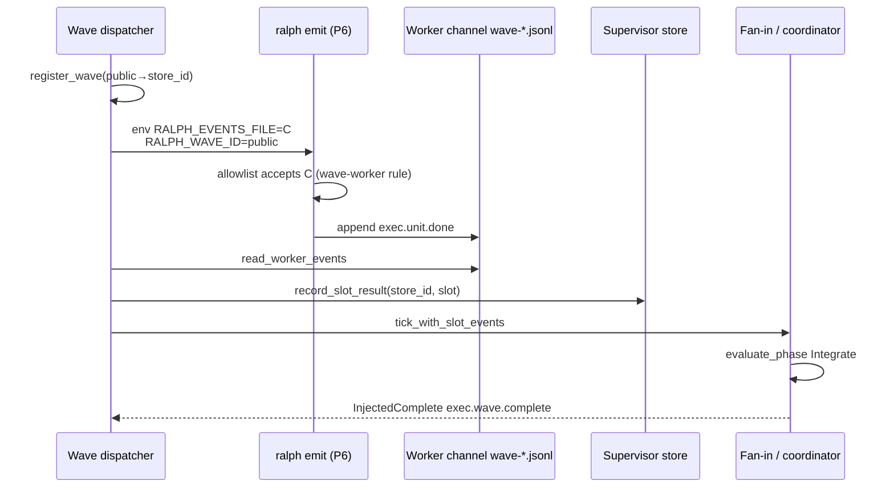

# fix: supervisor wave worker emit 通道与 store 结果对账

## Goal Capsule

让 supervisor exec wave 的 worker 通过 `ralph emit` 写入的 `exec.unit.done` **落在 dispatcher 事后读取的同一 JSONL 通道**，并在 supervisor store 中记为 `Completed`，从而使 fan-in 在真实成功 slot 上注入 `exec.wave.complete`（或仅对真正失败的 slot 注入 `exec.wave.failed` + 精确 `blocking_slots`）。

**证据 run**：`ralph-e2e` loop `primary-20260725-130345`；`.ralph/supervisor.db` 中 `w-2`（idempotency=`w-rs-1`）五槽全 `failed`（1× timeout + 4× `empty_worker_result`），而 main events 已有 3 条 live `exec.unit.done`。

---

## 1. 功能目标

### 业务目标

- supervisor 并行 exec wave 在 worker 业务成功时，自动编排路径能闭合到 `exec.wave.complete`（或仅阻塞真实失败 slot），不再因「emit 写到了 main、classifier 读到空文件」假失败。

### 本次范围

- 打通 **worker `ralph emit` 写盘路径** 与 **`read_worker_events` / `classify_slot_result` / `record_slot_*`** 的同一通道契约。
- 纠正 worker 可见的 `RALPH_WAVE_ID`（public）与 store 内部 id 的混淆。
- 对齐 WaveTracker「results 计数」与 classifier 终态，避免日志 `results=4 failures=1` 掩盖 store 全失败。
- 同步 `crates/ralph-core/data/ralph-tools-emit.md` 中 wave worker 通道说明（去计划化、可执行）。

### 非目标

- 不改 agent 业务代码 / sorts e2e 内容。
- 不放宽 FlowStepScope 对 operator 事后补发 `exec.unit.done` 的门禁（诊断报告 P1，属正确 fail-closed）。
- 不在本计划内重做 aggregate timeout 数值调优（slot0 真超时可保留为独立容量问题）。
- 不把 supervisor.db 暴露为 hat 可读业务 API。

### 已知约束和假设

- **假设（已用 DB + events 时间线验证）**：dispatcher 注入的 `RALPH_EVENTS_FILE=.ralph/wave-<public>-<slot>.jsonl` **不在** P6 emit allowlist（仅 `current-events` / `current-candidate-events` / `current-hat-events` / 默认 `events.jsonl`）。
- **假设**：main 上带 `wave_id=w-2`、`hat=worker` 的 `exec.unit.done` 来自 agent 绕过/改写通道后写入 allowlisted main，而非 fan-in merge（`fail_wave` 故意不 merge；且 merge 会 stamp `completed.wave_id=w-rs-1`）。
- **约束**：HARD RULE 1 测试入口用 `cargo nextest`；改 skill 文档须遵守可读性/去计划化规则。
- **约束**：Unit 严格串行；每个 Unit 独立可测。

---

## 2. BDD 行为规格

```gherkin
Feature: Supervisor wave worker emit channel closes to store Completed
  Supervisor exec waves must treat ralph emit success as slot success
  when the worker wrote a terminal unit.done into the dispatcher-owned channel.

  Background:
    Given supervisor.enabled is true
    And an exec wave is registered with public_wave_id "w-rs-1" and expected_total 2
    And the dispatcher injects per-slot RALPH_EVENTS_FILE under workspace .ralph/

  Scenario: Happy path — ralph emit to injected channel records Completed
    Given slot 0 worker env has RALPH_WAVE_WORKER=1
    And RALPH_EVENTS_FILE points at the dispatcher per-slot wave channel
    And RALPH_WAVE_ID equals the public wave id "w-rs-1"
    When the worker runs `ralph emit exec.unit.done` with a valid terminal payload
    And the worker process exits 0
    Then resolve_emit_path accepts the injected channel
    And read_worker_events on that channel returns the exec.unit.done event
    And classify_slot_result yields Completed(Done)
    And supervisor store slot 0 status is completed
    And a later fan-in with both slots completed injects exec.wave.complete

  Scenario: Illegal input — non-allowlisted arbitrary path still rejected
    Given RALPH_WAVE_WORKER=1
    When ralph emit sets RALPH_EVENTS_FILE to a path outside the wave/allowlist contract
      (e.g. /tmp/evil.jsonl or another worktree events file)
    Then emit fails with an allowlist / path rejection
    And no row is appended to the supervisor wave channel

  Scenario: Boundary — exit 0 with empty channel is empty_worker_result
    Given the worker exits 0 without any accepted events on its channel
    When classify_slot_result runs
    Then the store records failed with reason empty_worker_result
    And WaveTracker must NOT count the slot as a successful result

  Scenario: State restriction — timeout without events stays worker_timeout
    Given the worker hits the per-worker timeout with an empty channel
    When classify_slot_result runs
    Then the store records failed with a timeout reason
    And blocking_slots for exec.wave.failed includes only Failed/Cancelled indices

  Scenario: Failure recovery — partial success does not mark completed slots blocking
    Given slot 0 timed out with empty channel
    And slot 1 emitted exec.unit.done into its channel and was recorded Completed
    When fan-in evaluates the wave
    Then exec.wave.failed reason is required_slot_failure or timeout as appropriate
    And blocking_slots equals [0]
    And blocking_slots does not include 1
```

---

## 3. 验收与测试策略

| Scenario | 验收条件 | 推荐测试层级 | 是否需要 E2E |
|---|---|---|---|
| Happy path emit→Completed | emit 写入 injected channel；store `completed`；可 Integrate | 集成（cli wave_supervisor + emit_path） | 否（可选 1 条 mock supervisor smoke） |
| Illegal path rejected | 非契约路径仍被拒 | 单元（emit_path） | 否 |
| Exit0 empty → empty_worker_result | store failed + WaveTracker failure 计数 | 单元（classify + record_outcome） | 否 |
| Timeout empty → timeout reason | store failure_reason 含 timeout；非 empty | 单元 / 既有 worker_outcome 表 | 否 |
| Partial success blocking_slots | `blocking_slots ==` 真实 Failed 集 | 单元（phase.rs 已有 U4）+ 集成 fan-in | 否 |

---

## 4. 需求—测试追踪矩阵

| 需求 | Scenario | 验收测试 | 单元测试 | 集成/契约测试 | E2E |
|---|---|---|---|---|---|
| R1 emit 通道与 classifier 同源 | Happy path | ATDD：emit 后 read_worker_events 非空且 store Completed | `emit_path` 允许 wave channel | `wave_supervisor` 真 bridge + 真 emit 或写盘模拟 | 可选 mock |
| R2 非法路径仍拒 | Illegal | ATDD：/tmp 路径拒收 | `resolve_emit_path` 负例 | — | 否 |
| R3 空成功不假绿 | Boundary | ATDD：exit0+empty → failed；tracker failures+=1 | `classify_slot_result` + `record_outcome` | — | 否 |
| R4 timeout 语义保留 | Timeout | ATDD：timeout reason 稳定 | `worker_outcome` 真值表 | — | 否 |
| R5 blocking_slots 精确 | Partial | ATDD：仅失败槽 | `phase.rs` U4 回归 | fan-in InjectedFailed payload | 否 |
| R6 public wave_id 一致 | Happy（env） | ATDD：worker env `RALPH_WAVE_ID==public` | bind env 断言 | supervisor env capture 测试扩展 | 否 |
| R7 skill 文档同步 | — | 文档与行为一致 | `scripts/check-cli-doc-drift.sh` 相关 | — | 否 |

---

## Key Technical Decisions

1. **通道修复选 A（allowlist 承认 dispatcher 签发的 per-slot wave channel）**，而不是把所有 worker 改写到单一 `current-events`。并行 slot 必须隔离文件；fan-in 已按 per-slot 文件/`WaveResult` 设计。
2. **Allowlist 规则要窄**：仅当 `RALPH_WAVE_WORKER=1`（或等价显式 wave-worker 上下文）且路径为 `workspace_root/.ralph/wave-<id>-<index>.jsonl`（绝对路径、落在 workspace `.ralph/`、非 slot worktree 子树）时接纳。禁止借此写任意路径。
3. **`RALPH_WAVE_ID` 对 worker 始终为 public id**（emit envelope / 业务对账）；store 的 `w-{seq}` 只用于 `register_wave` / `record_slot_*` / `tick` 的 bridge 参数，不得再经 `bind_slot` env 覆盖 worker 可见值。
4. **WaveTracker 与 classifier 同判定**：`success && events.is_empty()` 必须走 failure（与 `empty_worker_result` 一致），禁止再出现 `results=4` 而 store 全 failed。
5. **不在本计划放宽 fail_wave 的「失败不 merge」语义**；修好通道后成功路径走 `merge_and_complete`，失败路径仍只注 `*.wave.failed`。若需「失败时保留已完成 slot 业务事件」，单列 follow-up。

---

## High-Level Technical Design



**现状断裂点**：`E` 因 allowlist 拒写 `C` → agent 改写到 main → `read_worker_events(C)` 为空 → `empty_worker_result` → `InjectedFailed`。

---

## 5. 严格串行开发单元

### U1. Characterization：钉死 allowlist 拒收 per-slot wave channel

- **Unit 目标**：用失败测试证明「dispatcher 注入的 `wave-*.jsonl` 在现有 P6 allowlist 下被拒」——这是 P0 的可复现根因闸门。
- **对应 Scenario**：Illegal 的对偶（契约通道本应合法却被拒）+ 为 Happy path 立 Red。
- **外部可观察结果**：新测试在修复前以「allowlist 拒绝 wave channel」失败；修复后该表征转为「接受」。
- **输入与输出**：输入：`workspace_root` + `current-events` marker + `RALPH_EVENTS_FILE=.ralph/wave-w-test-0.jsonl` + `RALPH_WAVE_WORKER=1`；输出：`resolve_emit_path` Ok(path)（目标行为）/ 当前 Err。
- **可依赖**：现有 `crates/ralph-cli/src/cli/emit_path.rs` 与 emit 单测 fixture。
- **禁止依赖**：后续 allowlist 实现细节、supervisor DB、fan-in。
- **验收测试**：在 `emit_path` / `commands/emit` 测试中新增「wave-worker channel 必须被接受」用例（先 Red）。
- **需要拆分的单元测试**：纯 `resolve_emit_path` 表驱动：worker=1 + `.ralph/wave-x-0.jsonl`；worker 未设 + 同路径仍拒；`/tmp/x.jsonl` 仍拒。
- **Red 预期失败原因**：当前 allowlist 不含 wave channel → bail `not in this loop's events allowlist`。
- **最小实现范围**：**本 Unit 只加测试，不改生产代码**（characterization / ATDD Red）。
- **集成验证**：`cargo nextest run -p ralph-cli -- emit_path`（或对应用例名）。
- **回归范围**：既有 emit allowlist 负例不得被削弱。
- **完成标准**：Red 稳定；用例名清楚表达 bug。
- **风险**：不要把表征测试写成「断言永远拒绝」——目标行为是接受合法 wave channel。

### U2. 最小修复：P6 allowlist 接纳 dispatcher 签发的 wave-worker channel

- **Unit 目标**：实现窄规则，使 U1 测试变绿，且非法路径仍红。
- **对应 Scenario**：Happy（emit 接受）+ Illegal。
- **外部可观察结果**：`RALPH_WAVE_WORKER=1` + `.ralph/wave-<id>-<idx>.jsonl`（绝对路径、workspace 内、非 slot subtree）→ emit 可写；其它显式路径仍拒。
- **输入与输出**：同上；输出写入目标文件一行 JSONL。
- **可依赖**：U1 红测试。
- **禁止依赖**：store / fan-in / wave_id 公共性修复。
- **验收测试**：U1 用例转绿；保留 `/tmp` 与跨 worktree 负例。
- **需要拆分的单元测试**：路径规范化（相对→绝对）、macOS `/var` 等价、slot-subtree 仍拒（control_plane 已有则复用组合）。
- **Red→Green**：只改 `emit_path.rs`（及必要的 helper）；不改 dispatcher 注入策略（仍注入 per-slot 文件）。
- **集成验证**：可选：spawn 式 `ralph emit` 集成测写 wave channel。
- **回归范围**：`cargo nextest run -p ralph-cli -- emit`；orphan/cwd_drift 用例。
- **完成标准**：U1 绿；非法路径测试仍绿；无削弱断言。
- **风险**：规则过宽会打开任意 `.ralph/*.jsonl` 写入——必须绑定 `wave-` 前缀 + index 形态 + wave-worker 上下文。

### U3. Outside-In 集成：emit → read_worker_events → record_slot_result → Completed

- **Unit 目标**：在 supervisor 测试桥上证明完整因果链：写 channel → classifier Completed → store `completed`。
- **对应 Scenario**：Happy path。
- **外部可观察结果**：`wave_slots.status=completed` 且 `worker_results` 有行；`failed_count` 不含该槽。
- **输入与输出**：输入：临时 workspace、真/内存 store、写入合法 `exec.unit.done`；输出：store snapshot。
- **可依赖**：U2。
- **禁止依赖**：U4 public wave_id（可用同一 id）；完整 5 槽 e2e。
- **验收测试**：扩展 `crates/ralph-cli/src/loop_runner/tests/wave_supervisor.rs`（或邻近）——不要 mock 掉 `classify_slot_result` / `record_slot_result`。
- **需要拆分的单元测试**：若需，补 `classify_slot_result` 对 `exec.unit.done` topic 后缀识别的锁定（已有逻辑则 characterization）。
- **Red 预期**：在仅有 U1/U2 前，若仍直接写 main 而不写 channel，本测失败；实现后绿。
- **最小实现范围**：若 U2 已足够，本 Unit 可能零生产改动，只加集成断言；若发现 `read_worker_events` 解析缺口再最小修补。
- **集成验证**：`cargo nextest run -p ralph-cli -- wave_supervisor`。
- **回归范围**：既有 empty_batch → `empty_worker_result` 用例必须仍绿。
- **完成标准**：至少 1 槽 Completed 可查询；与 empty 负例并存。
- **风险**：测试用 `cat > file` 绕过 emit 只能做半截——至少一条路径必须走 `ralph emit` 或 `resolve_emit_path`+写盘。

### U4. 纠正 worker 可见 `RALPH_WAVE_ID` = public id

- **Unit 目标**：消除 envelope `w-2` vs public `w-rs-1` 的诊断噪音与对账歧义。
- **对应 Scenario**：Happy（env）+ 报告中的 DEV-002。
- **外部可观察结果**：捕获的 worker env 中 `RALPH_WAVE_ID == DetectedWave.wave_id`（public）；bridge `record_slot_*` 仍使用 store id。
- **输入与输出**：env map / store 行。
- **可依赖**：U3。
- **禁止依赖**：文档 Unit。
- **验收测试**：扩展 `test_u2_workspace_root_and_channel_injected_into_worker_env`（或并列用例）断言 public id；并断言 store 注册映射 `idempotency_key=public`。
- **需要拆分的单元测试**：`bind_slot` / dispatcher merge env 顺序——last-write-wins 不得用 store id 覆盖 public。
- **Red 预期**：当前 `supervisor_bridge.bind_slot` 写入 store id → 断言失败。
- **最小实现范围**：`dispatcher.rs` / `supervisor_bridge.rs` 中注入 env 时传 public id；record API 继续用 `store_wave_id`。
- **集成验证**：同上 env capture 测试。
- **回归范围**：fan-in `register_wave_if_absent` 仍解析到同一 store 行。
- **完成标准**：新 emit 的 envelope `wave_id` 为 public；DB `waves.idempotency_key` 仍为 public。
- **风险**：勿把 store id 写进业务 payload 契约；payload 内业务 `wave_id` 仍由 agent/plan 约定（可另案收敛）。

### U5. WaveTracker 与 classifier 同判定（防假 results 计数）

- **Unit 目标**：`exit0 + empty events` 在 WaveTracker 记 failure，日志不再 `results=N` 掩盖 store 全失败。
- **对应 Scenario**：Boundary。
- **外部可观察结果**：`CompletedWave.results` 不含空成功；`failures` 含该槽；与 store `empty_worker_result` 一致。
- **输入与输出**：`record_outcome` 输入 Ok(([], _, true)) → failure。
- **可依赖**：U3（语义对齐）。
- **禁止依赖**：文档。
- **验收测试**：dispatcher `record_outcome` 单测或 wave_supervisor 断言。
- **需要拆分的单元测试**：直接测 `success && events.is_empty()` 分支。
- **Red 预期**：当前 `if success || !events.is_empty()` 把空成功算 result。
- **最小实现范围**：`dispatcher.rs` `record_outcome` 一处条件收紧；同步注释。
- **集成验证**：相关 wave 测试。
- **回归范围**：`success=false` 但有 partial events 的 timeout-with-events 契约不得破坏（PTY partial）。
- **完成标准**：空成功 → failures；有 terminal events → results。
- **风险**：勿把「非零退出但有 Done」从 Completed 打成 failure（classifier 已允许 Completed）。

### U6. Fan-in 失败载荷可诊断性（per-slot reason）

- **Unit 目标**：`exec.wave.failed` 在保留 `blocking_slots` 精确集合的前提下，暴露每槽 `failure_reason`（timeout vs empty_worker_result），避免运营商只能看到 `[0,1,2,3,4]`。
- **对应 Scenario**：Partial + Timeout。
- **外部可观察结果**：payload 含 `blocking_slots`（仅 Failed/Cancelled）及可选 `slot_failures: [{slot_index, reason}, ...]`（若 schema 允许）；或写入 diagnostics 而不扩 schema——**优先查 schema `required_fields`，能加字段则加，否则 diagnostics artifact**。
- **输入与输出**：`build_wave_failed_payload` / schema。
- **可依赖**：U3–U5。
- **禁止依赖**：preset 大改拓扑。
- **验收测试**：payload 快照或字段断言；`presets/schemas/ce-executor-supervisor.yml` 同步（若增字段）。
- **需要拆分的单元测试**：payload builder。
- **Red 预期**：当前 payload 仅 `reason` + `blocking_slots` + `wave_id`。
- **最小实现范围**：builder + schema/lint 同步；必要时 preset_lint schema_parity。
- **集成验证**：`cargo nextest run -p ralph-cli --bin ralph -- preset_lint` + core preset_lint（若改 schema）。
- **回归范围**：既有 `required_slot_failure` 消费者（exec-failure-handler instructions）——增字段须后向兼容（额外字段可忽略）。
- **完成标准**：仅失败槽出现在 blocking；reason 可区分 timeout/empty。
- **风险**：改 schema 必跑 HARD RULE 下游清单；若不想动 schema，本 Unit 可降级为只写 diagnostics log 结构化字段并在完成标准中声明。

### U7. Skill 文档同步（ralph-tools-emit wave worker 通道）

- **Unit 目标**：注入 skill 与真实契约一致：worker 必须保留 runner 注入的 `RALPH_EVENTS_FILE`（per-slot wave channel），该通道在 wave-worker 上下文合法；禁止指引「写 candidate-events / 不要设置 RALPH_EVENTS_FILE」而与 dispatcher 冲突。
- **对应 Scenario**：文档即行为规格。
- **外部可观察结果**：`crates/ralph-core/data/ralph-tools-emit.md`（及必要的 `ralph-tools-wave.md` 交叉引用）更新；无计划号/事故路径；`scripts/check-cli-doc-drift.sh` 通过。
- **输入与输出**：文档 diff。
- **可依赖**：U2–U4 行为已定。
- **禁止依赖**：新功能。
- **验收测试**：人工对照 + drift 脚本。
- **需要拆分的单元测试**：无。
- **Red**：N/A（文档）。
- **最小实现范围**：只改 data skill；不改 `.claude/skills` symlink 目标以外文件。
- **集成验证**：`scripts/check-cli-doc-drift.sh`。
- **回归范围**：其它 emit 红线不变。
- **完成标准**：agent 按文档操作时通道与 U2 一致。
- **风险**：违反去计划化——禁止写入本 loop_id / 本报告路径。

---

## 6. 最终质量门禁

- [ ] 所有计划内 Scenario 有对应测试且通过
- [ ] `cargo nextest run -p ralph-cli -- emit` / `emit_path` / `wave_supervisor` 相关子集通过
- [ ] 若改 schema：`cargo nextest run -p ralph-cli --bin ralph -- preset_lint` + `cargo nextest run -p ralph-core -- preset_lint` + `cargo nextest run -p ralph-cli --bin ralph -- presets`
- [ ] `cargo fmt` / `cargo clippy`（涉及包）通过
- [ ] 无新增 ignore/skip；无无解释 golden 更新
- [ ] skill 文档已同步且 drift 检查通过
- [ ] **未验证 / 剩余风险**：
  - 真实多模型 backend 下 300s worker timeout 导致的真失败（容量问题，非本 P0）
  - payload 内业务 `wave_id`（如 `w-246cb4afef33`）与 public id 是否强制合一（本计划仅修 envelope/env）
  - 失败路径是否应 merge 已完成槽业务事件（follow-up）
  - 全量 `./scripts/run-tests.sh` 留待实现末段执行

---

## Assumptions

- 根因以 `ralph-e2e/.ralph/supervisor.db` + events 时间线为准：空 channel → `empty_worker_result` 是 P0 机制根因；wave id 双轨是加重诊断噪音的并列缺陷。
- Coding Agent 不得用「删除断言 / mock 掉 record_slot_result」让测试变绿。

## Open Questions（deferred）

- 是否在 `exec.wave.failed` schema 增加 `slot_failures`（U6 二选一）；实现时先读 schema 再决定。
- 是否需要一条 `ralph-e2e --mock` 级回归（成本高；默认用 cli 集成测满足）。

## Definition of Done

1. U1→U7 严格串行完成且各自完成标准满足。
2. 复现实验：worker `ralph emit` 写入 injected channel 后，store 对应槽为 `completed`，两槽成功时 fan-in 为 `InjectedComplete`。
3. 回归：empty / timeout / 非法路径 / blocking_slots 精确性均绿。
4. 文档与代码一致。
