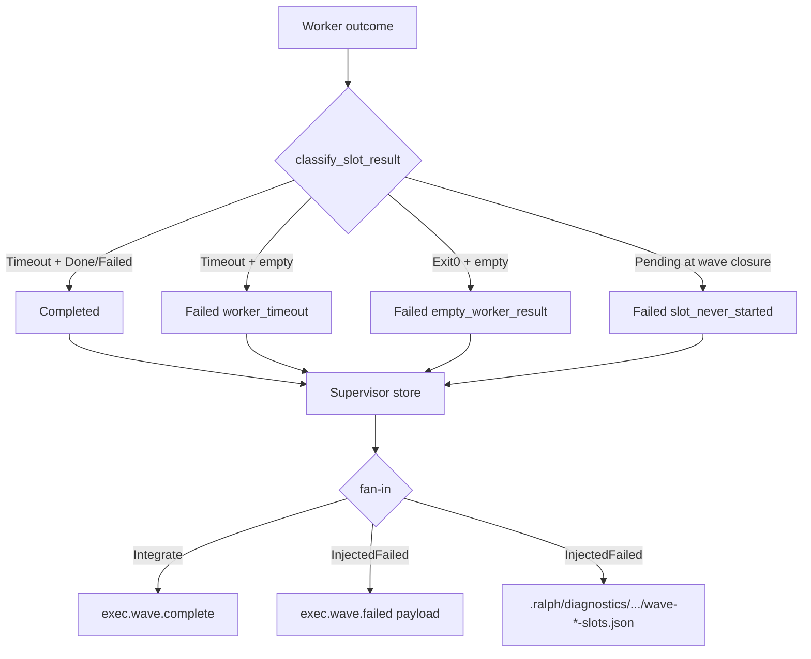

# fix: supervisor wave timeout 分类、never_started 与失败诊断

## Goal Capsule

让 supervisor / wave 在 **租约到期** 与 **从未开跑** 之间可区分，并在 wave fail 时产出 **机读 JSON 诊断**（不 merge 主账本）。

- **权威**：本文件 Product Contract + KTDs；与 `docs/plans/2026-07-25-003-fix-supervisor-wave-worker-emit-channel-plan.md` 正交——003 修 emit 通道；本计划修 **分类语义 + 归因可观测**。
- **停止条件**：Verification Contract 全绿；Definition of Done 勾选；未宣称「能判断 agent 是否还在想」。
- **Product Contract preservation**：ce-plan-bootstrap；用户已确认默认（Timeout+Done/Failed → Completed；诊断用 JSON）。

---

## Product Contract

### Summary

在 003 通道假失败之外，运维仍难回答「这个 slot 是真超时、还是从未开跑、还是已交卷被误杀」。本计划做三刀小改：（1）把 timeout 分类与真值表对齐并接到生产路径；（2）引入稳定 `slot_never_started`；（3）InjectedFailed 时写 per-slot JSON 诊断。不做 progress 续租、不调超时数值、不做 fail_wave merge。

### Requirements

- R1. `WorkerExit::Timeout` + 至少一个 Done/Failed terminal → `SlotOutcome::Completed`（与 Done/Failed 对称）。
- R2. `WorkerExit::Timeout` + **零 accepted events** → 稳定 reason `worker_timeout`（不是 `empty_worker_result`，不是自由文案）。Timeout + 有 events 但无 terminal marker → `missing_worker_terminal`。
- R3. 生产 `classify_slot_result` 必须能表达 Timeout（不得把空超时 Err 长期伪装成 Dynamic + Cancelled 壳）；凡 `timed_out` 优先映射 `WorkerExit::Timeout`。
- R4. 波次失败/取消闭合时，**从未进入 `Dispatched` / `Running`**（仍为 `Pending`）的 slot 记稳定 reason `slot_never_started`（见 KTD；代码 `SlotStatus` 无 InFlight 名）。
- R5. 已进入 `Dispatched`/`Running` 后租约到期仍用 `worker_timeout`（或既有等价路径），不得与 `slot_never_started` 混用。
- R6. `exec.wave.failed` / InjectedFailed 旁路写入 JSON 诊断 artifact（每槽 status/reason/duration 等），**不**扩 `exec.wave.failed` schema required_fields（避免与 003 U6 双轨抢 schema）。
- R7. `blocking_slots` 仍只含 Failed/Cancelled；Completed 不得进入；本计划不削弱既有 F-003 表征。

### Actors

- A1. Wave dispatcher / classifier（机制）
- A2. Supervisor store / fan-in coordinator（机制）
- A3. Operator / diagnosis skill（消费诊断 JSON）

### Key Flows

- F1. Worker lease 到期且 channel 已有 `*.unit.done` → slot Completed → 不进 blocking。
- F2. Worker lease 到期且 channel 空 → store/`record_slot_failure` reason=`worker_timeout`。
- F3. Aggregate/round 结束或 cancel 闭合时仍为 `Pending` 的 slot → reason=`slot_never_started`。
- F4. Fan-in InjectedFailed → 写 diagnostics JSON；主 events 仅现有 failed payload。

### Acceptance Examples

- AE1. Timeout + Done marker → Completed(Done)；不出现 `worker_timeout`。
- AE2. Timeout + Failed marker → Completed(Failed)。
- AE3. Timeout + 0 events → Failed reason=`worker_timeout`。
- AE4. 五槽 wave、仅 spawn 4、第 5 槽从未 Dispatched、波次失败 → 第 5 槽 reason=`slot_never_started`；已跑超时槽为 `worker_timeout`（或既有 timeout 路径），二者不同。
- AE5. InjectedFailed 后存在可读 JSON，含每槽 `slot_index` + `status` + `reason`（可空）。
- AE6. 回归：exit0+空 events 仍为 `empty_worker_result`；cancel 仍为 `worker_cancelled`；Completed ∉ blocking_slots。

### Scope Boundaries

**在范围内**

- `worker_outcome` 真值表与测试对齐
- `classify_slot_result` Timeout 接线
- `slot_never_started` frozen reason + store/synthetic 路径最小接线
- wave fail JSON diagnostics（旁路文件）

**非目标**

- 调 `aggregate_timeout_secs` / `max_concurrent_workers` 数值
- progress 心跳续租 / 读心「是否还在干活」
- fail_wave merge 已完成事件进 main events
- supervisor 专属 recovery API / 放宽 FlowStepScope
- handoff Remaining 投影、业务 payload `wave_id` 合一
- 003 emit allowlist / WaveTracker results 假绿（属 003 U2/U5）
- 扩 `exec.wave.failed` schema 增加 `slot_failures`（留给 003 U6；本计划用 diagnostics 文件满足可观测）

### Deferred to Follow-Up Work

- 003 U6 schema `slot_failures`（若落地，诊断 JSON 字段可与之对齐，本计划不抢做）
- aggregate 时钟从 per-slot start 起算（容量公平）
- abort Drop 补齐 `failure_reason`
- progress 证据字段（`alive_at_deadline` / `last_progress_age`）

---

## Planning Contract

### Key Technical Decisions

- KTD1. **Timeout+terminal → Completed**（session-settled: user-directed — chosen over 一律 `worker_timeout`：避免误杀已交卷）。对齐模块表头注释；改写钉死旧语义的测试。
- KTD2. **Failed terminal 与 Done 对称 Completed**（session-settled: user-directed）。
- KTD3. **诊断形态 = JSON 文件**（session-settled: user-directed — chosen over Markdown-only）。不扩 schema required_fields。
- KTD4. **生产 Timeout 接线**：`WaveWorkerOutcome` / worker 结果必须能区分「租约到期」与「普通非零退出」。空超时不得长期依赖 Dynamic 自由文案 + Cancelled 壳（今日 `classify_slot_result` Err 臂）。优先：超时 Ok 路径带 Timeout exit；空超时 Err 映射 frozen `worker_timeout`。
- KTD5. **`slot_never_started`**：用于「失败或 cancel 闭合时 status 仍为 `Pending`」；「已 `Dispatched`/`Running` 但未 report」用 `worker_timeout`（或既有映射），禁止同一字符串糊弄两种语义。
- KTD6. **与 003 边界**：本计划不实现 emit allowlist；若 003 U6 已写 `slot_failures` 进 payload，本计划 diagnostics JSON 仍独立存在（人/机读均可），字段命名尽量与 store `failure_reason` 同源，避免第三套文案。
- KTD7. **诚实边界**：本计划只改善 **租约/调度归因**，不声称能判定 LLM 是否「还在思考」。
- KTD8. **U3 接线深度（planner default）**：凡 `timed_out` 结果一律映射 `WorkerExit::Timeout`（typed 优先；Err 文案匹配仅 fallback），以便全面启用 U2。
- KTD9. **Timeout + 有 events + 无 terminal marker** → `missing_worker_terminal`；**仅** Timeout + 零 accepted events → `worker_timeout`。

### Assumptions

- 调研结论：今日 timeout+有 events 常经 `success=false` → `ExitNonZero` 已能 Completed；`WorkerExit::Timeout` 在生产几乎未接线。本计划仍修 Timeout 分支与接线，避免未来接线时把「有 terminal 的超时」打成失败，并把空超时稳定为 `worker_timeout`。
- `REASON_CONFLICTING_WORKER_TERMINAL` 仍可保持未使用（不在范围）。
- Hat instructions 不依赖精确匹配 slot frozen reason 字符串；新增常量安全。
- 诊断 JSON 中 `duration` **可选**（缺失不失败反序列化契约）。
- U2 必须同步改写 `worker_outcome.rs` 模块表头 timeout 相关行，使其与 R1/R2/KTD9 一致。

### High-Level Technical Design



### BDD 行为规格

```gherkin
Feature: Supervisor wave timeout and never-started attribution
  Wave slot failures must distinguish lease timeout from never-started,
  and must not fail slots that already emitted a terminal unit event.

  Scenario: Happy — timeout with unit.done completes
    Given a wave worker exits as Timeout
    And the worker channel contains one exec.unit.done event
    When classify_worker_outcome / classify_slot_result runs
    Then the slot outcome is Completed(Done)
    And the failure reason is absent

  Scenario: Happy — timeout with unit.failed completes as Failed terminal
    Given a wave worker exits as Timeout
    And the worker channel contains one exec.unit.failed event
    When classification runs
    Then the slot outcome is Completed(Failed)

  Scenario: Boundary — timeout with empty channel is worker_timeout
    Given a wave worker exits as Timeout with zero accepted events
    When classification runs
    Then the slot is Failed with reason worker_timeout
    And the reason is not empty_worker_result

  Scenario: Illegal / state — never dispatched slot is slot_never_started
    Given a supervisor wave with expected_total 2
    And only slot 0 reached Dispatched or Running
    And slot 1 remained Pending until wave failure or cancel closure
    When fan-in / failure recording closes the wave
    Then slot 1 failure_reason is slot_never_started
    And slot 0 if lease-expired without terminal is worker_timeout or its prior terminal outcome

  Scenario: Failure recovery observability — InjectedFailed writes JSON diagnostics
    Given supervisor fan-in decides InjectedFailed with at least one Failed slot
    When the failed wave event is appended
    Then a JSON diagnostics file exists under the run diagnostics tree
    And it lists each slot_index with status and reason fields

  Scenario: Regression — exit0 empty stays empty_worker_result
    Given WorkerExit Exit0 and zero events
    When classification runs
    Then reason is empty_worker_result

  Scenario: Regression — Completed slots stay out of blocking_slots
    Given one Completed and one Failed slot
    When evaluate_phase / blocking_slot_indices runs
    Then blocking_slots contains only the Failed index
```

### 验收与测试策略

| Scenario | 验收条件 | 推荐测试层级 | 是否需要 E2E |
|---|---|---|---|
| Timeout + Done → Completed | SlotOutcome::Completed(Done) | 单元 `worker_outcome` + dispatcher classify | 否 |
| Timeout + Failed → Completed | Completed(Failed) | 单元 | 否 |
| Timeout + empty → worker_timeout | frozen reason 精确匹配 | 单元 + classify_slot_result | 否 |
| never_started | store/snapshot reason 精确 | 单元/集成 wave_supervisor | 否 |
| InjectedFailed JSON | 文件存在且可反序列化关键字段 | 集成 wave_supervisor / fan-in | 否 |
| exit0 empty 回归 | empty_worker_result | 既有单测 | 否 |
| blocking_slots 回归 | Completed ∉ blocking | phase 既有 U4 | 否 |

### 需求—测试追踪矩阵

| 需求 | Scenario | 验收测试 | 单元测试 | 集成/契约 | E2E |
|---|---|---|---|---|---|
| R1 | Timeout+Done | AE1 | `worker_outcome` | classify_slot_result | 否 |
| R1/R2 对称 | Timeout+Failed | AE2 | 同上 | U3 classify_slot_result 必测 | 否 |
| R2/R3 | Timeout empty | AE3 | 同上 | Err/Timeout 接线测 | 否 |
| R4/R5 | never_started | AE4 | reason 常量 + store 记录 | wave_supervisor 一轮 | 否 |
| R6 | diagnostics JSON | AE5 | builder 可选 | InjectedFailed 后读文件 | 否 |
| R7/AE6 | 回归 | Regression 两则 | 既有 | 既有 | 否 |

---

## Implementation Units

> **严格串行**：U1 → U2 → …；前一 Unit 完成标准满足后方可进入下一 Unit。  
> **Execution note（全局）**：每个 Unit 先写/改验收测试 → Red → 最小实现 → Green → 相关集成 → 回归；禁止删断言 / skip / 无解释改 golden。

### U1. Characterization：钉死今日 timeout / Err 分类路径

- **Unit 目标**：用测试记录「Timeout 死码分支 vs ExitNonZero 有 events vs Err 空超时」的现状，作为后续改动的对照锚。
- **Requirements**：支撑 R1–R3 的安全改造；对应调研结论。
- **Dependencies**：无。
- **对应 Scenario**：Regression 基线；为 U2/U3 Red 提供对照。
- **Files**：
  - modify: `crates/ralph-core/src/supervisor/worker_outcome.rs`（仅测试/注释澄清，或新增 `#[cfg(test)]` 表征用例）
  - modify: `crates/ralph-cli/src/loop_runner/tests/wave_supervisor.rs` 或 dispatcher 邻近测（若需锁 Err 动态串行为）
- **Approach**：不改生产行为。U1 **只补生产路径表征**（Err 空超时 Dynamic+Cancelled 壳；Ok+`success=false`+Done → Completed via ExitNonZero）。`table_a3_4` 已覆盖 Timeout 枚举旧语义，勿在 U1 重复锁死；标明 `_char_u1_pre_u3` 后缀用例将在 U2/U3 翻转。
- **Execution note**：Characterization first；本 Unit 结束后行为与 main 一致。
- **验收测试**：表征用例在未改生产代码时全绿。
- **需要拆分的单元测试**：生产 Err 空超时路径；生产 Ok 超时有 Done；Exit0 空 → empty（若尚无覆盖）。
- **Red 预期失败原因**：本 Unit 无 Red 生产改动。
- **最小实现范围**：仅测试/注释。
- **集成验证**：`cargo nextest run -p ralph-core -- worker_outcome`（及触及的 cli 测子集）。
- **回归范围**：既有 worker_outcome / wave_supervisor。
- **完成标准**：文档化「生产空超时走 Err Dynamic」与「Timeout 枚举未接线」；后续 Unit 引用这些用例名。
- **风险**：勿把表征写成永久断言旧错误语义——用例名/注释标明「U2 将翻转」。

### U2. 真值表：Timeout + terminal → Completed；空 Timeout → worker_timeout

- **Unit 目标**：修正 `classify_worker_outcome` 使 Timeout 分支符合 R1/R2 与模块表头。
- **Requirements**：R1, R2；AE1–AE3。
- **Dependencies**：U1。
- **对应 Scenario**：Happy timeout+Done/Failed；Boundary timeout empty。
- **Files**：
  - modify: `crates/ralph-core/src/supervisor/worker_outcome.rs`
  - test: 同文件 `mod tests`（翻转 `table_a3_4_timeout_partial_evidence_still_fails_timeout`）
- **Approach**：Timeout 且 Done/Failed markers 非空 → `Completed(from_events)`；Timeout 且 accepted_event_count==0 → `Failed { worker_timeout }`；Timeout 且有 events 但无 terminal marker → `missing_worker_terminal`（KTD9）。同步表头四行 timeout 注释。Cancel 仍优先。
- **Execution note**：先改测试期望为新语义（Red）再改实现（Green）。
- **验收测试**：AE1–AE3 单元断言。
- **需要拆分的单元测试**：Timeout+Done、Timeout+Failed、Timeout+空、Cancel 仍赢。
- **Red 预期失败原因**：旧实现 Timeout 一律 Failed。
- **最小实现范围**：仅 `classify_worker_outcome` + 测试 + 注释。
- **集成验证**：`cargo nextest run -p ralph-core -- worker_outcome`。
- **回归范围**：cancel / empty_worker_result / missing_terminal 用例。
- **完成标准**：AE1–AE3 绿；表头与代码一致。
- **风险**：仅改 core 时生产仍可能不传入 `WorkerExit::Timeout`——由 U3 接线；U2 单独可测。

### U3. Outside-In：`classify_slot_result` 接线 Timeout / 空超时 frozen reason

- **Unit 目标**：生产分类路径真正使用 Timeout 语义；空超时写入稳定 `worker_timeout`。
- **Requirements**：R3；AE3 在 dispatcher 路径成立。
- **Dependencies**：U2。
- **对应 Scenario**：Boundary timeout empty；Happy timeout+Done（经真实 classify_slot_result）。
- **Files**：
  - modify: `crates/ralph-cli/src/loop_runner/wave/dispatcher.rs`（`classify_slot_result`）
  - modify: `crates/ralph-cli/src/loop_runner/wave/worker.rs`（若需把 timed_out 信号传出，使 Ok/Err 可区分 Timeout）
  - test: `crates/ralph-cli/src/loop_runner/tests/wave_supervisor.rs` 或 dispatcher 单测
- **Approach**（KTD8）：凡 `timed_out` 一律映射 `WorkerExit::Timeout`（typed 信号优先；Err「Worker timed out…」文案仅 fallback）。依赖 U2：Timeout+Done/Failed → Completed；Timeout+零 events → Static `worker_timeout`（去掉 Cancelled 壳）；Timeout+有 events 无 terminal → `missing_worker_terminal`。非超时 Err 仍保留 Dynamic 原文字案。
- **Execution note**：集成测优先证明「空超时 reason == worker_timeout」；有 Done 的超时仍 Completed。
- **验收测试**：构造 WaveWorkerOutcome 超时空 / 超时+done，断言 ClassifiedSlot。
- **需要拆分的单元测试**：Err 超时文案 → worker_timeout；非超时 Err 仍保留 Dynamic（崩溃文案）策略在测试中写清。
- **Red 预期失败原因**：Err 臂仍 Cancelled 壳 + Dynamic。
- **最小实现范围**：classifier 接线 + 必要的 worker 信号；不改 fan-in 算法。
- **集成验证**：`cargo nextest run -p ralph-cli -- wave_supervisor`（及相关 classify 测）。
- **回归范围**：cancel、empty_worker_result、非超时 Err。
- **完成标准**：生产路径上 AE1/AE3 可观测；U1 中标注将翻转的表征已更新。
- **风险**：过度把所有 Err 当成 timeout——必须用明确超时信号/文案前缀收窄。

### U4. Frozen reason：`slot_never_started` 与从未 Dispatched 槽闭合

- **Unit 目标**：波次失败闭合时，从未 Dispatched/InFlight 的槽使用稳定 `slot_never_started`。
- **Requirements**：R4, R5；AE4。
- **Dependencies**：功能上不依赖 U3；串行排在 U3 之后仅为降低同文件 merge 冲突。Harness 可用 `max_concurrent_workers` 限流 + `expected_total≥2` 制造 Pending 槽。
- **对应 Scenario**：Illegal/state never dispatched。
- **Files**：
  - modify: `crates/ralph-core/src/supervisor/worker_outcome.rs`（新增 `REASON_SLOT_NEVER_STARTED`）
  - modify: supervisor store 闭合路径与/或 dispatcher 在 supervisor round 中对 Pending 槽 `record_slot_failure` 的调用点（`rusqlite`/`memory`/`dispatcher`）
  - test: store/phase 测；`wave_supervisor.rs`（断言 store `failure_reason`）
- **Approach**：谓词「never started」= 失败或 cancel 闭合瞬间 status 仍为 `Pending`。对该集合写入 `REASON_SLOT_NEVER_STARTED`。**不要**把已 `Dispatched`/`Running` 未 report 标成 never_started。WaveTracker 自由文案可保留；**store failure_reason** 必须稳定。
- **Execution note**：State-machine / store 状态测优先。
- **验收测试**：AE4（含 cancel 闭合路径至少一条）。
- **需要拆分的单元测试**：Pending→never_started；Running 超时≠never_started。
- **Red 预期失败原因**：Pending 槽无 reason 或被 cancel 吞掉且无区分。
- **最小实现范围**：常量 + 一处权威 record 路径 + 测试；避免大扫所有 synthetic 文案。
- **集成验证**：supervisor bridge/fan-in 相关 nextest 子集。
- **回归范围**：`blocking_slot_indices`、cancel-wins、`worker_cancelled`。
- **完成标准**：AE4 绿；文档注释写清谓词。
- **风险**：与 `cancel_wave` 时序——须在状态翻转为 Cancelled 前写入 reason，或 Cancelled 仍保留可诊断 reason 字段。

### U5. InjectedFailed → per-slot JSON diagnostics artifact

- **Unit 目标**：fan-in InjectedFailed 时写 JSON 诊断，满足 R6/AE5。
- **Requirements**：R6；AE5。
- **Dependencies**：U4（诊断应能展示 never_started vs worker_timeout）。
- **对应 Scenario**：Failure recovery observability。
- **Files**：
  - modify: `crates/ralph-cli/src/loop_runner/wave/dispatcher.rs`（`run_supervisor_fan_in` / InjectedFailed 臂，`build_wave_failed_payload` 旁）
  - 可选 modify: 小 helper 模块同目录
  - test: `crates/ralph-cli/src/loop_runner/tests/wave_supervisor.rs`
- **Approach**：从 WaveSnapshot / store 读每槽 status+failure_reason（`duration` 可选），序列化为 JSON。落盘路径钉死为 workspace 控制面：`.ralph/diagnostics/wave-<wave_id>-slots.json`（与现有 `.ralph/diagnostics/` 树同级约定；若运行时已有 timestamp session 子目录且 collector 强制写入该处，则写在该 session 目录下同名文件，并在实现注释写明实际相对路径）。必须写 **workspace root** diagnostics，禁止落入 slot worktree。写盘失败 best-effort + warn，不得阻断 InjectedFailed。**不**改 schema required_fields。若集成测会 spawn `ralph`，遵守 HARD RULE 5 scrub agent env。
- **Execution note**：集成测断言文件存在与关键字段；不要求 E2E。
- **验收测试**：AE5。
- **需要拆分的单元测试**：JSON shape builder（纯函数更佳）。
- **Red 预期失败原因**：InjectedFailed 后无文件。
- **最小实现范围**：写文件 + 测试；不 merge events。
- **集成验证**：wave_supervisor fan-in failed 路径。
- **回归范围**：成功 Integrate 路径不写误报文件（或仅 failed 写）。
- **完成标准**：AE5 绿；与 003 U6 无 schema 冲突说明写入计划 Assumptions。
- **风险**：路径落在 worktree vs workspace root——必须写 **control plane workspace** 的 diagnostics，避免 slot worktree 孤儿文件。

---

## Verification Contract

- 所有计划内 Scenario / AE1–AE6 有对应测试且通过。
- `cargo nextest run -p ralph-core -- worker_outcome`
- `cargo nextest run -p ralph-core -- phase`（或 blocking_slots 相关）
- `cargo nextest run -p ralph-cli -- wave_supervisor`（及本计划新增测名）
- 若改 schema（本计划默认不改）：才跑 preset_lint；默认跳过。
- `cargo fmt` / `cargo clippy`（涉及包）通过。
- 无新增 ignore/skip；无无解释 golden 更新。
- **不要求**全量 `./scripts/run-tests.sh` 作为每 Unit 门禁；合并前或 LOOP_COMPLETE 前再跑。

---

## Definition of Done

1. U1→U5 严格串行完成且各自完成标准满足。
2. Timeout+Done/Failed → Completed；Timeout 空 → `worker_timeout`；从未 Dispatched → `slot_never_started`。
3. InjectedFailed 产生可读 JSON 诊断；主账本不因本计划 merge 完成事件。
4. AE6 回归绿。
5. 剩余风险写明：仍不能判定「agent 是否在思考」；容量数值调优与 003 通道修复分属其他计划。

---

## Risks & Dependencies

| 风险 | 缓解 |
|---|---|
| 与 003 并行改 dispatcher 冲突 | 本计划避开 emit_path；协调同一文件时串行 merge；U6 schema 让给 003 |
| Timeout 接线过宽误伤非超时 Err | 超时信号/文案白名单 |
| Pending→Cancelled 丢失 never_started | U4 明确时序与字段保留 |
| 诊断写到错误目录 | 钉死 workspace diagnostics 根 |

**依赖**：无硬依赖 003 完成；003 未合入时 empty channel 假失败仍可能存在——诊断会更清晰标出 `empty_worker_result`/`worker_timeout`，但不替代通道修复。

---

## Open Questions（deferred，非阻塞）

- 诊断 JSON 是否同时 symlink/copy 到固定 `latest` 路径（实现时按现有 diagnostics 习惯二选一）。
- WaveTracker 自由文案是否在 follow-up 全部改为 frozen codes（本计划只保证 store/诊断可读稳定码）。

---

## Sources & Research

- `crates/ralph-core/src/supervisor/worker_outcome.rs` — 真值表注释与 Timeout 实现矛盾；`table_a3_4` 钉死旧失败语义；U2 须同步表头 L17–19 过时行。
- `crates/ralph-cli/src/loop_runner/wave/dispatcher.rs` — `classify_slot_result` 无 Timeout；Err 臂 Cancelled 壳；`inject_synthetic_failures` 自由文案。
- `crates/ralph-cli/src/loop_runner/wave/worker.rs` — 超时空→Err；超时有 events→Ok success=false。
- `docs/plans/2026-07-25-003-fix-supervisor-wave-worker-emit-channel-plan.md` — 通道 P0；U6 与本计划诊断重叠边界。
- `docs/report/2026-07-25-ce-executor-supervisor-primary-20260725-130345-diagnosis.md` — per-slot reason / diagnostics 建议。
