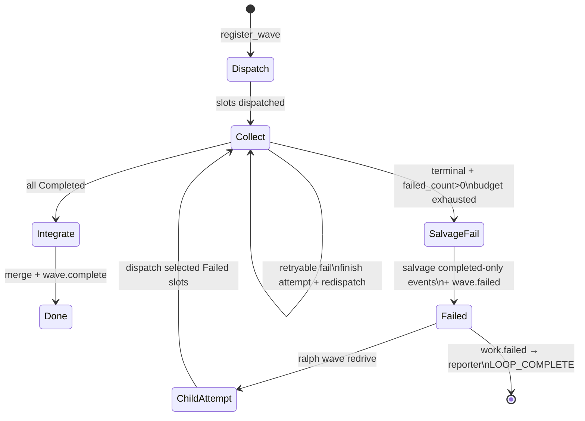
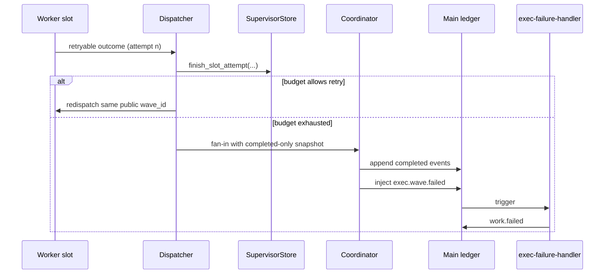

# fix: supervisor slot activity 重试、salvage merge 与 operator redrive

## Goal Capsule

把 supervisor wave slot 做成可对账的 durable activity：每个 slot 都有明确 attempt 生命周期、可重试失败只在同一 public wave_id 内重派、预算耗尽后先 salvage 已完成业务事件再失败、失败类以结构化 payload 交给 reporter，operator redrive 则以新 child attempt wave 的方式恢复失败槽，不能靠手工补 `exec.unit.done` 绕过 FlowStepScope。

**权威**：本文件 Product Contract + KTDs。003/004 必须先落地。  
**停止条件**：Verification Contract 全绿，Definition of Done 勾选。  
**产品边界**：本计划只修 exec/fix 类 supervisor slot 行为，不把 review 路径的既有 salvage 误判成缺失，也不把 operator redrive 写成旧 wave 原地回滚。

---

## Product Contract

### Summary

在 003（emit 通道对账）与 004（timeout/never_started 诊断）之上，补齐 exec/fix supervisor 的 durable activity 缺口：slot attempt 原子结算、波内自动 retry、失败波次 salvage merge、结构化失败 payload、以及 FlowStepScope 合规的 operator redrive。

### Requirements

- R1. 可重试 slot 失败在记入永久 Failed 前，于同一 public wave_id 内自动重派，默认允许 1 次重试，最大 2 次 attempt。
- R2. 仅 retryable reason 触发自动重试；永久失败 reason 立即终态。
- R3. 自动重试耗尽且 wave 仍 Failed 时：先 salvage 所有 Completed 槽业务事件进主 ledger，再注入 `*.wave.failed`。
- R4. `*.wave.failed` payload 必须携带 `wave_id`、`reason`、`blocking_slots`、`salvaged_slots`、`redrive_slots`、`slot_failures`。
- R5. `Completed` 永不进入 `blocking_slots`。
- R6. `exec-failure-handler` 结构化消费失败 payload，恰好发一条 `work.failed` 并带上 `failure_class` / `redrive_slots` / `salvaged_slots`，reporter 以此终结 loop。
- R7. `failure_class` 至少覆盖 `timeout`、`orphan_or_empty_result`、`identity_mismatch`、`required_slot_failure`、`cancelled`，并映射到白名单 `work.failed.reason`。
- R8. `ralph wave redrive` 只恢复指定 Failed 槽，不重开整个 plan，不要求人工 emit `exec.unit.done`。
- R9. FlowStepScope 对 hand-patched `exec.unit.done` 继续 fail-closed。
- R10. 本计划不削弱 003/004 契约，相关回归必须显式保留。

### Actors

- A1. Wave dispatcher / classifier
- A2. Supervisor store / coordinator
- A3. `exec-failure-handler` / `reporter`
- A4. Operator

### Key Flows

- F1. retryable 失败在同一 slot 内重新派发，attempt 递增，但 public wave_id 不变。
- F2. retry 预算耗尽后，Completed 槽事件先被 salvage，再注入 `exec.wave.failed`。
- F3. `exec.wave.failed` 触发 `work.failed`，reporter 发 `LOOP_COMPLETE`。
- F4. `ralph wave redrive` 只重开 Failed 槽，且会创建新的 child attempt wave。
- F5. 手工补发 `exec.unit.done` 仍然被 FlowStepScope 拒收。

### Acceptance Examples

- AE1. 两槽 wave：slot0 第一次 empty，第二次 done，最终 `exec.wave.complete`。
- AE2. slot0 两次 timeout，slot1 Completed；主 ledger 保留 slot1 业务事件，`blocking_slots == [0]`，`salvaged_slots == [1]`。
- AE3. `slot_failures` 记录每个 slot 的 frozen reason。
- AE4. `work.failed.reason` 只取白名单值，reporter 发 `LOOP_COMPLETE`。
- AE5. `ralph wave redrive --wave-id <public>` 只恢复 Failed 槽，且新 child wave 能继续完成。
- AE6. 手工 patch `exec.unit.done` 仍拒收。
- AE7. 003/004 的 happy path 回归仍绿。

### Scope Boundaries

**在范围内**

- Store attempt 计数与原子结算 API
- Dispatcher 自动 retry
- Coordinator salvage-then-fail
- `*.wave.failed` / `work.failed` payload 与 preset 同步
- `ralph wave redrive` CLI
- BDD / 集成 / 表征测试
- 相关 skill guide 更新

**非目标**

- 重做 003 emit allowlist / 004 timeout 真值表
- 调默认 `aggregate_timeout_secs`
- 主 loop 的 heartbeat 续租
- 放宽 FlowStepScope 接受手工补发
- 跨 loop 的自动续跑

---

## Planning Contract

### 严格串行

```text
U1 → U2 → … → U12
```

前一 Unit 的实现、测试、重构与回归全部完成后再开下一 Unit。

### Key Technical Decisions

- KTD1. **depends_on 003+004**，避免双轨冲突。
- KTD2. **失败波次 salvage merge**，但仍注入 `*.wave.failed`，不是 silent partial complete。
- KTD3. **波内自动 retry 默认 1、最大 2 attempt**。
- KTD4. **Retryable reasons**：`worker_timeout`、`empty_worker_result`、`missing_worker_terminal`、`slot_never_started`；**Non-retryable**：`conflicting_worker_terminal`、`invalid_control_plane_path`、`worker_cancelled`、cancel/aggregate 波级失败。
- KTD5. **重试落点**：dispatcher 不暴露 `Failed -> Pending` 的可见回滚，而是一次原子结算里判断重派还是永久失败；同一 public wave_id 不拆。
- KTD6. **Salvage 动作**：completed-only 事件 append 成功后再标记 wave Failed；可复用 `merged_to_events` 或新增 `salvage_merged`，但 recovery 不能 double-merge。
- KTD7. **failure_class 映射**：波级 `timeout` → `timeout`；empty/orphan → `orphan_or_empty_result`；identity 拒收 → `identity_mismatch`；required slot failure → `required_slot_failure`；`cancelled` → `cancel`。
- KTD8. **Operator redrive**：`ralph wave redrive` 不能把旧 Failed wave 改回 Collect；必须以 `parent_wave_id + attempt_epoch` 创建新的 child attempt wave，只复用 Failed 槽和已有 salvage 事实，旧 ledger 保持不可变。
- KTD9. **FlowStepScope 保持 fail-closed**。
- KTD10. **Fix wave 同构**：store / coordinator API 不能 Exec-only hardcode。
- KTD11. **配置**：`SupervisorConfig.slot_retry_budget` 默认 1，允许 `0..=2`，`>2` 配置校验失败；`0` 表示关闭自动重试。

### High-Level Technical Design





### Patterns to Follow

- 纯函数 + coordinator 写 phase：`crates/ralph-core/src/supervisor/phase.rs`、`coordinator.rs`
- Frozen reason：`worker_outcome.rs`
- Fan-in 单点注入：`run_supervisor_fan_in` / `build_wave_failed_payload`
- Bridge 契约：`plan_b_contract.rs`、`wave_supervisor.rs`
- CLI 扩展：`crates/ralph-cli/src/wave.rs`

---

## 1. 功能目标

### 业务目标

- 部分槽失败时，波次仍能无人值守收敛或给出可行动终态。
- 已成功槽的业务结果不因 sibling 失败而丢失。
- Operator 有合规 redrive 入口，不必手工补事件。

### 本次范围

见 Product Contract Requirements R1–R10。

### 非目标

见 Scope Boundaries。

### 已知约束和假设

- 必须使用 nextest。
- Hat env 需要 scrub。
- preset / schema / skill guide 要同步。
- 先 003 通道，再做 salvage。

---

## 2. BDD 行为规格

```gherkin
Feature: Supervisor slot activity retry, salvage, and redrive
  Supervisor exec waves treat each slot as a durable activity with
  bounded automatic retry, salvage merge on wave failure, and an
  operator redrive path that does not bypass FlowStepScope.

  Background:
    Given plans 003 and 004 behaviors are available
    And supervisor.enabled is true
    And slot_retry_budget is 1

  Scenario: S1 Happy — retryable failure then success closes wave
    Given an exec wave with 1 slot
    And the first worker attempt ends with empty_worker_result
    When the dispatcher applies automatic retry
    And the second attempt emits exec.unit.done on the worker channel
    Then the store slot is Completed
    And fan-in injects exec.wave.complete

  Scenario: S2 Illegal — non-retryable failure is permanent immediately
    Given a slot fails with conflicting_worker_terminal
    When classify/record runs
    Then the slot is Failed with no automatic redispatch

  Scenario: S3 Boundary — budget exhausted stops retry
    Given slot_retry_budget is 1
    And two consecutive worker_timeout outcomes on the same slot
    When the second failure is recorded
    Then the slot is permanently Failed
    And no third automatic dispatch occurs

  Scenario: S4 State — Completed never appears in blocking_slots
    Given slot 0 Completed and slot 1 permanently Failed
    When fan-in evaluates the wave
    Then blocking_slots equals [1]
    And salvaged_slots equals [0]

  Scenario: S5 Salvage — Completed business events reach main ledger on wave.failed
    Given S4 preconditions
    When coordinator takes the salvage-and-fail path
    Then main ledger contains slot 0 exec.unit.done
    And exec.wave.failed is injected once

  Scenario: S6 Failure class — structured work.failed reaches reporter
    Given exec.wave.failed with reason required_slot_failure and slot_failures
    When exec-failure-handler runs
    Then it emits exactly one work.failed with failure_class and redrive_slots
    And reporter consumes work.failed and emits LOOP_COMPLETE

  Scenario: S7 Operator redrive — failed slots only
    Given a Failed wave with salvaged_slots=[0] and redrive_slots=[1]
    When the operator runs ralph wave redrive for that public wave_id
    Then only slot 1 returns to Pending/Collect
    And slot 0 remains Completed
    And the new child attempt wave can continue independently

  Scenario: S8 Recovery — hand-patched exec.unit.done still rejected
    Given the loop is on exec_wave after wave.failed
    When an operator emits exec.unit.done outside the worker channel/system path
    Then FlowStepScope or policy rejects it with flow_unknown_emit or equivalent

  Scenario: S9 Config — budget 0 disables automatic retry
    Given slot_retry_budget is 0
    And a retryable empty_worker_result occurs
    When record runs
    Then the slot is permanently Failed without redispatch
```

---

## 3. 验收与测试策略

| Scenario | 验收条件 | 推荐测试层级 | 是否需要 E2E |
|---|---|---|---|
| S1 retry→complete | 第 2 次 attempt Completed + wave.complete | 集成 `wave_supervisor` | 否 |
| S2 non-retryable | 无 redispatch | 单元 classify/retry policy | 否 |
| S3 budget exhaust | 恰 1 次 retry | 单元 + 集成 | 否 |
| S4 blocking_slots | `==` Failed 集 | 单元 phase + fan-in | 否 |
| S5 salvage merge | main 有 Completed 事件 + failed coord | 集成 fan-in + merge sink | 否 |
| S6 work.failed→reporter | 结构化字段 + LOOP_COMPLETE | BDD scenario supervisor | 可选 1 条 mock |
| S7 redrive CLI | 仅 Failed 重开 | 集成 CLI `wave` + store | 否 |
| S8 hand-patch 拒收 | 表征仍红/绿按契约 | 单元/集成 FlowStepScope | 否 |
| S9 budget 0 | 无自动 retry | 单元 | 否 |

---

## 4. 需求—测试追踪矩阵

| 需求 | Scenario | 验收测试 | 单元测试 | 集成/契约测试 | E2E |
|---|---|---|---|---|---|
| R1 auto retry | S1,S3 | ATDD wave_supervisor | attempt_count / finish API | fan-in after retry | 否 |
| R2 retryable set | S2,S9 | ATDD policy table | `is_retryable_slot_reason` | — | 否 |
| R3 salvage | S5 | ATDD ledger 含 unit.done | coordinator SalvagedAndFailed | run_supervisor_fan_in | 否 |
| R4 payload | S4,S5 | ATDD JSON 字段 | build_wave_failed_payload | plan_b_contract | 否 |
| R5 blocking | S4 | 表征 | phase blocking_slot_indices | — | 否 |
| R6 handler/reporter | S6 | BDD expected.events | — | scenarios/supervisor | 可选 |
| R7 failure_class | S6 | schema + mapping 测 | map_failure_class | preset_lint | 否 |
| R8 redrive CLI | S7 | CLI 集成 | child-wave reopen | wave.rs | 否 |
| R9 FlowStepScope | S8 | 表征 | flow_step_scope | — | 否 |
| R10 003/004 回归 | AE7 | 既有测名全绿 | — | wave_supervisor 子集 | 否 |

---

## Implementation Units

### U1. 现状基线：先钉死 exec/fix partial failure 的真实行为，再单独区分 review 路径

- **Unit 目标**：只给 exec/fix 波次写 characterization，证明当前 HEAD 在 `run_supervisor_fan_in` / `build_wave_failed_payload` 的 partial failure 路径不会把 Completed 槽的业务事件 salvage 回主 ledger；review 既有 salvage helper 是另一路径，不拿来混写。
- **对应 Scenario**：S5 的 Red 前置。
- **外部可观察结果**：修复前，exec/fix partial failure 断言“主 ledger 里没有 Completed 槽的 `exec.unit.done`”仍然成立；再加一条 review-path 现状断言，防止误把 review 改坏。
- **输入与输出**：两槽 fixture；slot0 先产出 Completed 事件，slot1 进入永久 Failed；fan-in 后检查主 ledger、blocking 集合和 failed payload。
- **可依赖**：003/004，`wave_supervisor.rs` 既有 partial failure 测。
- **禁止依赖**：retry API、redrive CLI、review salvage helper 的实现细节。
- **Files**：`crates/ralph-cli/src/loop_runner/tests/wave_supervisor.rs`。
- **验收测试**：新增用例名显式含 `salvage`；review 路径保持现状绿。
- **需要拆分的单元测试**：一条 exec/fix partial failure；一条 review salvage helper 现状。
- **Red 预期失败原因**：exec/fix 路径当前跳过 completed-only salvage。
- **最小实现范围**：只加测试，不改生产代码。
- **集成验证**：`cargo nextest run -p ralph-cli -- wave_supervisor -- salvage` 或等价命中。
- **回归范围**：既有 partial_failure 断言“无 complete”必须仍成立。
- **完成标准**：baseline 证据明确区分 exec/fix 缺口与 review 已有能力。
- **风险**：不要在本 Unit 里偷偷修生产代码。

### U2. Store：把 slot attempt 做成原子结算，不再通过可见的 `Failed -> Pending` 回滚

- **Unit 目标**：SupervisorStore 记录每个 slot 的 attempt、当前 attempt token 与终态，提供一次性结算接口：同一轮 worker 结果要么转入“还能重派”，要么转入“永久失败”，中间不暴露可见的 `Failed -> Pending` 回滚。
- **对应 Scenario**：S1、S3。
- **外部可观察结果**：`attempt_count` / 当前 attempt token 可读；旧 attempt completion 不能覆盖新 attempt。
- **输入与输出**：`wave_id`、`slot_index`、当前 attempt token、预算、worker outcome。
- **可依赖**：U1；`record_slot_failure` first-terminal-wins。
- **禁止依赖**：dispatcher 自动接线、salvage、redrive CLI。
- **Files**：`crates/ralph-core/src/supervisor/{mod,memory,rusqlite,migrations,bridge}.rs`；`crates/ralph-cli/src/loop_runner/wave/supervisor_bridge.rs`。
- **验收测试**：memory / rusqlite 各自单测，覆盖 attempt 递增、状态落盘、stale completion 拒收。
- **需要拆分的单元测试**：reset 拒绝 Completed；retry 超出预算直接永久失败；重复结算同一 attempt 幂等；旧 completion 不覆盖新 attempt。
- **Red 预期**：当前无原子 attempt 结算 API 或缺少对应列/字段。
- **最小实现范围**：trait + memory + rusqlite migration + bridge 透传；不要在 dispatcher 里写两次独立状态转换。
- **集成验证**：`cargo nextest run -p ralph-core -- supervisor`；补一条针对 attempt 重放的断言。
- **回归范围**：first-terminal-wins、cancel 特例、已完成 slot 不可再重试。
- **完成标准**：API 单测绿，migration 可向前、可回放，stale attempt 被明确拒绝。
- **风险**：如果仍允许先写 Failed 再回滚，后续 stale completion 会踩新 attempt。

### U3. 纯函数：冻结 retryable reason 表与 budget 判定顺序

- **Unit 目标**：把“什么能重试、什么直接终态、什么遇到未知值要 fail-closed”收敛成一个纯函数，避免 dispatcher 里散落 if/else。
- **对应 Scenario**：S2、S3、S9。
- **外部可观察结果**：表驱动测试锁定 KTD4/KTD11；未知 reason 默认不进入自动重派。
- **输入与输出**：`(reason, attempt_count, budget) -> Retry | PermanentFailure`。
- **可依赖**：U2 的 attempt 语义。
- **禁止依赖**：I/O、dispatcher、CLI。
- **验收测试**：新模块或 `worker_outcome.rs` 旁的表驱动单测。
- **需要拆分的单元测试**：`worker_timeout`、`empty_worker_result`、`missing_worker_terminal`、`slot_never_started`、`cancelled`、`conflicting_worker_terminal` 各自断言。
- **Red 预期**：函数不存在或不能区分 retryable / non-retryable。
- **最小实现范围**：纯函数 + 单测；不接线。
- **集成验证**：单元即可。
- **回归范围**：既有 `REASON_*` 字符串不变；新增未知 reason 时必须 fail-closed。
- **完成标准**：table 全绿，retryable 表与 KTD4 一致。
- **风险**：不要把 `conflicting_worker_terminal` 或 cancel 类错误混入自动 retry。

### U4. Config：把 slot retry budget 变成显式约束，而不是默默吞值

- **Unit 目标**：YAML 可配 `SupervisorConfig.slot_retry_budget`，默认 1，允许 `0..=2`；值域外直接配置校验失败，避免 operator 误以为系统只会重试某个固定次数。
- **对应 Scenario**：S9。
- **外部可观察结果**：parse 测可读出数值；超界值在配置加载期就失败，而不是运行时“悄悄修正”。
- **输入与输出**：YAML → `SupervisorConfig`。
- **可依赖**：U2/U3；KTD11。
- **禁止依赖**：dispatcher 行为、preset 大改。
- **Files**：`crates/ralph-core/src/config/loop_config.rs` 及 config 单测模块。
- **验收测试**：默认值、0、1、2、>2 四条都要有断言。
- **需要拆分的单元测试**：默认、合法边界、非法边界、旧 supervisor YAML 仍可加载。
- **Red 预期**：字段不存在或仍是 silent clamp。
- **最小实现范围**：`SupervisorConfig` + serde + 验证逻辑 + 测试。
- **集成验证**：config parse 测。
- **回归范围**：既有 supervisor YAML fixtures。
- **完成标准**：默认 1；0 关闭自动 retry；3 直接报配置错误。
- **风险**：如果这里只做 silent clamp，排障会难以判断真实预算。

### U5. Dispatcher：在 worker 结果出口处完成“判定 + 重新派发”闭环

- **Unit 目标**：worker 结束后，dispatcher 先把结果和 attempt token 一起落进 store，再依据 retry 纯函数决定是重派还是永久失败；不要让 worker outcome 先进入一个可见的 `Failed` 中间态再回滚。
- **对应 Scenario**：S1、S3、S9。
- **外部可观察结果**：第二次 spawn 可在日志和测试里被看见；预算耗尽时只会产生永久失败路径。
- **输入与输出**：`WaveWorkerOutcome`、attempt token、slot snapshot、`slot_retry_budget`。
- **可依赖**：U2、U3、U4；003 的 per-slot channel 规则。
- **禁止依赖**：salvage、redrive CLI。
- **Files**：`crates/ralph-cli/src/loop_runner/wave/dispatcher.rs`；`crates/ralph-cli/src/loop_runner/tests/wave_supervisor.rs`。
- **验收测试**：`empty_worker_result -> retry -> done`、`worker_timeout -> retry -> timeout -> permanent failed`、budget 0 无重派。
- **需要拆分的单元测试**：retryable / non-retryable / budget exhausted / stale completion ignored。
- **Red 预期**：今日实现是一次终态。
- **最小实现范围**：`dispatcher.rs` 的完成路径 + `slot_retry_budget` 读取。
- **集成验证**：`cargo nextest run -p ralph-cli -- wave_supervisor`。
- **回归范围**：non-retryable、cancel、dimension-retry 路径。
- **完成标准**：S1/S3/S9 对应测绿，且 retry 不改变 public wave_id 身份。
- **风险**：重试必须复用同一 public wave_id 与同一 slot 身份。

### U6. Coordinator：只对 Completed-only 片段做 salvage，然后再失败

- **Unit 目标**：实现 `SalvagedAndFailed` 语义：确认 wave 只能失败之后，先把已 Completed 槽的业务事件按原顺序 append 到主 ledger，再把 wave 标为 Failed 并注入 failed payload。
- **对应 Scenario**：S4、S5。
- **外部可观察结果**：merge sink 里能看到 completed-only 事件；最终 wave phase 是 Failed，而不是 complete。
- **输入与输出**：snapshot、slot_events、当前 wave phase、salvage marker。
- **可依赖**：U1 Red。
- **禁止依赖**：CLI redrive。
- **Files**：`crates/ralph-core/src/supervisor/coordinator.rs`；必要时 `merge_sink.rs`。
- **验收测试**：coordinator 单测 + U1 ATDD 由红转绿。
- **需要拆分的单元测试**：无 Completed 时 salvage 为空但仍注入 failed；merge append 失败时不能打 salvage 标记；恢复路径必须跳过已 salvage 的 wave。
- **Red 预期**：U1 先红。
- **最小实现范围**：`coordinator.rs` + `CoordinatorAction` 变体；`run_supervisor_fan_in` 的接线可放到 U7。
- **集成验证**：core supervisor 测。
- **回归范围**：纯 `InjectedFailed`、无 completed events 的路径。
- **完成标准**：U1 变绿且不会再误注入 `exec.wave.complete`。
- **风险**：`merged_to_events` / `salvage_merged` 语义要说清楚，否则 recovery 可能 double-merge。

### U7. Fan-in 接线：把 salvage 事实和失败事实一起写进 failed payload

- **Unit 目标**：`run_supervisor_fan_in` 在 partial failure 时走 salvage 分支，并把 `salvaged_slots`、`redrive_slots`、`slot_failures` 写进 `build_wave_failed_payload` 的结构化字段。
- **对应 Scenario**：S4、S5、S6。
- **外部可观察结果**：系统注入的 JSON 负载能稳定读出新字段，且字段排序可预期。
- **输入与输出**：CompletedWave、store snapshot、salvage 结果。
- **可依赖**：U6。
- **禁止依赖**：preset hat 文案大改（那是 U9）。
- **Files**：`crates/ralph-cli/src/loop_runner/wave/dispatcher.rs`；`crates/ralph-core/src/supervisor/plan_b_contract.rs`。
- **验收测试**：`wave_supervisor` partial failure 扩展断言；`plan_b_contract` 的 payload 结构单测。
- **需要拆分的单元测试**：`build_wave_failed_payload` 表驱动：无失败、单失败、多失败、全部失败、混合 salvage/failed。
- **Red 预期**：payload 现在缺字段或字段为空时无稳定语义。
- **最小实现范围**：payload builder + fan-in 分支。
- **集成验证**：fan-in 集成测。
- **回归范围**：review wave 的 `missing_dimensions` 路径不能被这次改动误伤。
- **完成标准**：Exec/Fix 的 failed payload 含扩展字段；Review 若不走同一路径则保持现状。
- **风险**：schema 如果先改成 required，会把旧 injector / fixture 一起打穿；先把生产路径写稳，再升约束。

### U8. Schema + preset_lint：把新字段和新 payload 约束同步到 SSOT

- **Unit 目标**：更新 `presets/schemas/ce-executor-supervisor.yml`、对应 `presets/en/ce-executor-supervisor.yml`，让 strict lint、preset parity、fixture 回归一起覆盖新字段。
- **对应 Scenario**：S6。
- **外部可观察结果**：`ralph preset check -H builtin:ce-executor-supervisor --strict` 和 `ralph presets` 都能对上；字段存在且结构化断言稳定。
- **输入与输出**：schema、preset YAML、必要时 CLI 预置文档。
- **可依赖**：U7 字段名稳定。
- **禁止依赖**：redrive CLI 实现细节。
- **Files**：`presets/schemas/ce-executor-supervisor.yml`、`presets/en/ce-executor-supervisor.yml`，若嵌入物或索引有同步差异，再动 `crates/ralph-cli/src/presets.rs` / `presets/manifest.yml` / `presets/index.json`。
- **验收测试**：`preset_lint`、`presets` parity、schema parse required_fields 的组合测试。
- **需要拆分的单元测试**：字段存在、字段默认、字段缺失、strict lint 的明确报错。
- **Red 预期**：缺字段 lint / 契约失败。
- **最小实现范围**：先让新字段成为可解析但不过度强制的契约，再按测试需要决定是否升为 required。
- **集成验证**：preset_lint 全量相关。
- **回归范围**：其它 builtin preset 不误伤。
- **完成标准**：strict lint 绿，相关下游清单在计划中有明确勾选。
- **风险**：CLI inspect / 诊断可能会读这些字段，所以结构要一致。

### U9. Preset：让 failure-handler 和 reporter 按结构化失败字段工作

- **Unit 目标**：更新 `exec-failure-handler` 与 `reporter` 的 hat instructions，明确它们如何读取 `failure_class`、`redrive_slots`、`salvaged_slots` 和 `slot_failures`，并把 `work.failed` 视为唯一失败终态。
- **对应 Scenario**：S6。
- **外部可观察结果**：BDD `expected.events` 含 `work.failed` + `LOOP_COMPLETE`，且不会因为结构化失败再额外发一条 `plan.blocked`。
- **输入与输出**：preset YAML instructions，写法必须站在 hat 视角，不引用内部函数名。
- **可依赖**：U8。
- **禁止依赖**：让 hat 读取内部 store 路径或 supervisor.db。
- **验收测试**：`crates/ralph-core/tests/scenarios/supervisor/*.yml` 的新场景或扩场景；`run_workflow_guard_scenario` 必须真的跑 runtime。
- **需要拆分的单元测试**：不做文案锁测；只做结构化事件断言。
- **Red 预期**：场景缺事件或 reporter 没有把 `work.failed` 当终态。
- **最小实现范围**：preset instructions + 必要时 schema 示例字段；禁止把 plan id、诊断路径写进 `ralph-tools*.md`。
- **集成验证**：scenarios nextest。
- **回归范围**：成功路径 `exec.wave.complete` 场景。
- **完成标准**：S6 BDD 绿，且 handler 只发一条结构化失败事件。
- **风险**：单事件预算要保住，否则会把 reporter 的职责打散成多事件竞态。

### U10. `failure_class` 映射纯函数：把波级原因和槽级原因对齐到白名单

- **Unit 目标**：集中映射波级 / 槽级 reason 到 `failure_class` 和 `work.failed.reason` 白名单值，避免不同模块各写一套字符串约定。
- **对应 Scenario**：S6。
- **外部可观察结果**：单测锁定映射表；新 reason 不能悄悄落到一个未定义的自由文本里。
- **输入与输出**：`(FailedReason, &[slot_reason]) -> FailureClass`，外加 `work.failed.reason` 白名单结果。
- **可依赖**：U7、U9。
- **禁止依赖**：CLI。
- **验收测试**：core 单测；如果涉及 `shipper_reason`，补白名单测。
- **需要拆分的单元测试**：每种 `failure_class` 一条；`cancelled`、`timeout`、`orphan_or_empty_result`、`identity_mismatch`、`required_slot_failure` 各自覆盖。
- **Red 预期**：当前没有统一映射或映射表不完整。
- **最小实现范围**：小模块 + dispatcher / handler 文档化字段填充。
- **集成验证**：payload 测。
- **回归范围**：既有 plan.blocked reason 白名单。
- **完成标准**：映射表与 KTD7 一致，且未知值 fail-closed。
- **风险**：不要把自由文本 reason 当可恢复信号，也不要让未知 reason 直接变成“可重试”。

### U11. CLI：`ralph wave redrive` 只创建新 attempt wave，不重写旧账本

- **Unit 目标**：实现 `ralph wave redrive` 的操作边界：先 inspect，再按选中的 Failed 槽创建新的 child attempt wave；旧 wave 只是父本，不能被改回 Collect，也不能被重放成“同一个 wave 的第二次人生”。
- **对应 Scenario**：S7。
- **外部可观察结果**：`ralph wave redrive --help` 说明清楚参数和拒绝条件；成功后能看到新的 attempt wave 身份和其 parent 追溯关系。
- **输入与输出**：`--wave-id`、可选 `--slots`、`--config`、store 中的 parent/attempt 元数据。
- **可依赖**：U2 的 attempt 语义、U6/U7 的 failed 波次状态。
- **禁止依赖**：放宽 FlowStepScope 或手工补 `exec.unit.done`。
- **Files**：`crates/ralph-cli/src/wave.rs`；相关 CLI 集成测（继续沿用 `common::ralph_bin` 和 env scrub）。
- **验收测试**：临时 store fixture 下的 CLI 集成测，检查 selected failed slots 被重开、新 child wave 被创建、Completed 槽不动。
- **需要拆分的单元测试**：参数校验（空 id、slot 非 Failed、重复 redrive、父 wave 已进入最终报告后拒绝）。
- **Red 预期**：子命令不存在或仍只是旧 wave 原地回滚。
- **最小实现范围**：`wave.rs` 新子命令；复用 store/bridge；不调用 agent emit `exec.unit.done`。
- **集成验证**：nextest `-p ralph-cli -- wave`。
- **回归范围**：inspect / emit / verify。
- **完成标准**：CLI 能安全创建 focused child run，并明确拒绝历史已封账的 wave。
- **风险**：redrive 和自动 retry 的边界必须写在帮助文本和测试里，否则 operator 会把两者混为一谈。

### U12. 交付门禁：把回归矩阵、最终测试和文档同步一次性收口

- **Unit 目标**：把 003/004/005 的回归矩阵跑通，并把新字段、新命令和新失败语义同步到技能文档，避免实现落地后文档继续漂移。
- **对应 Scenario**：全部。
- **外部可观察结果**：每个关键行为都有命令级门禁；文档和 CLI help 一致。
- **输入与输出**：本计划的测试矩阵、preset schema、CLI help、skill docs。
- **可依赖**：U1–U11。
- **禁止依赖**：新行为。
- **Files**：`crates/ralph-core/data/ralph-tools-wave.md`、`skills/ralph-preset-common/references/commands.md`、必要时 `skills/ralph-preset-common/references/patterns.md`、`CONCEPTS.md`。
- **验收测试**：`cargo nextest run` 子集 + 最终 `./scripts/run-tests.sh`。
- **需要拆分的单元测试**：无。
- **Red 预期**：文档 drift、CLI help drift、preset lint 任一红。
- **最小实现范围**：补文档、补测试、补命令帮助。
- **集成验证**：`cargo nextest run -p ralph-cli -- wave_supervisor`、`cargo nextest run -p ralph-core -- supervisor`、`cargo nextest run -p ralph-cli --bin ralph -- preset_lint`、`cargo nextest run -p ralph-cli --bin ralph -- presets`、最后 `./scripts/run-tests.sh`。
- **回归范围**：003/004 happy path、review salvage helper、worker timeout。
- **完成标准**：Definition of Done 勾选且测试矩阵有证据。
- **风险**：不要把 plan-only 内容写进 `crates/ralph-core/data/*.md`。

---

## Verification Contract

- `cargo nextest run -p ralph-core -- supervisor`
- `cargo nextest run -p ralph-cli -- wave_supervisor`
- `cargo nextest run -p ralph-cli --bin ralph -- preset_lint`
- `cargo nextest run -p ralph-cli --bin ralph -- presets`
- 污染复跑：`RALPH_CURRENT_HAT=executor RALPH_CURRENT_LOOP_ID=loop-x RALPH_EVENTS_FILE=/tmp/x.jsonl cargo nextest run -p ralph-cli -- wave_supervisor`
- 最终：`./scripts/run-tests.sh`
- 必要时补 `cargo fmt` / `cargo clippy`

## Definition of Done

- [ ] 005 的 characterization、store、retry、salvage、payload、redrive、preset、skill guide 全部同步完成
- [ ] `blocking_slots` 不再包含 Completed
- [ ] operator redrive 不再重写旧 wave ledger
- [ ] 003/004 相关回归保持绿
- [ ] `./scripts/run-tests.sh` 通过
