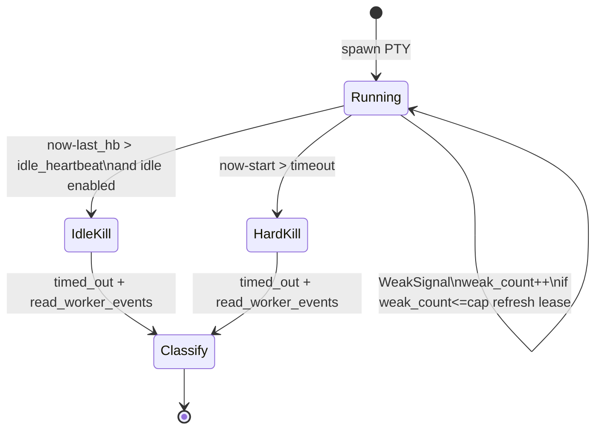
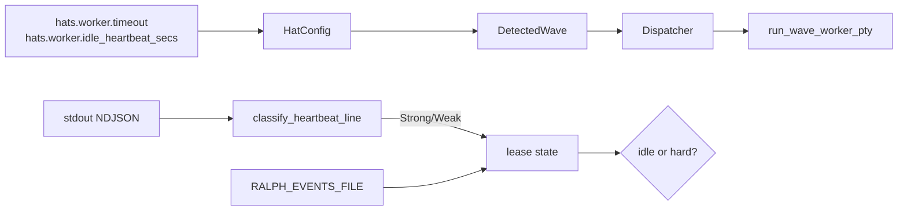

# feat: wave worker idle 心跳续租（双时钟）

## Goal Capsule

把 wave worker（Claude Code / Pi headless PTY 路径）从“spawn 起墙钟到期就杀”改成双时钟：`hat.timeout` 作为 StartToClose 硬顶，`hat.idle_heartbeat_secs` 作为 HeartbeatTimeout 静默窗口。只要工作环还有合格进度信号，worker 就应继续活；只有静默超窗或硬顶到达时才 kill。模型不需要显式调用 heartbeat API。

**权威**：本文件 Product Contract + KTDs。  
**停止条件**：Verification Contract 全绿，Definition of Done 勾选。  
**产品边界**：本计划只改 wave worker PTY 路径，不把主 loop 的 `PtyExecutor` 产品语义一起改掉。

---

## Product Contract

### Summary

长任务合法跑很久时，如果工作环仍在输出可观测进度，就不应被固定墙钟误杀；但如果进程假活、没有进度，仍应在短静默窗内失败。相关字段挂在 hat 级 preset YAML，与 `timeout` 并列。

### Requirements

- R1. `hats.<id>.timeout` 语义固定为 StartToClose：自 worker spawn 起的硬顶，到期必须 kill。
- R2. 新增 `hats.<id>.idle_heartbeat_secs: u32`：自上次合格心跳起静默超过该值则 kill；`0` 或省略表示关闭 idle 模式。
- R3. 新增 `hats.<id>.idle_weak_signal_cap: u32`：连续仅靠弱信号续租的次数上限；超过后若仍无强信号，视同静默耗尽。
- R4. 强信号包括 Claude `ToolUse` / `ToolResult`、Pi `ToolExecutionStart` / `ToolExecutionEnd`、Cursor agent 等价 tool 事件、`RALPH_EVENTS_FILE` 行数或 mtime 增长。
- R5. 弱信号包括 assistant `Text` / `Thinking`、Pi `TextDelta`。
- R6. 双时钟同时武装时，先触达者生效；kill 后继续走既有 `timed_out` → `read_worker_events` → 004 分类。
- R7. 范围仅 wave worker PTY 路径；不改造主 loop 的产品语义。
- R8. `DetectedWave` / dispatcher 把 idle 配置传到 worker；`ce-executor-supervisor` 的 `worker` / `fix-worker` / `review-batch-worker` 显式写出推荐值。
- R9. 不要求 agent prompt 刷 heartbeat；skill 文档只说明 orchestrator 观察 stream。
- R10. 与 003/004/005 正交，不改 emit 通道、timeout 归因表或 slot retry。

### Actors

- A1. Wave worker runtime
- A2. Preset 作者 / operator
- A3. Claude / Pi / agent stream

### Key Flows

- F1. tool 事件持续出现，worker 可超过旧墙钟且最终成功。
- F2. spawn 后静默超过 idle 窗，worker 被 kill。
- F3. 只有弱 text 连续出现，达到 cap 后仍会被 kill。
- F4. StartToClose 硬顶优先于心跳。
- F5. idle 字段缺省或为 0 时，行为与今天一致。

### Acceptance Examples

- AE1. idle=120、timeout=600，每 30s 注入 tool 事件，worker 存活至完成。
- AE2. idle=2、无信号，约 2s 后 kill，`timed_out=true`。
- AE3. 仅 text delta，cap=2，第三次弱续租被拒绝。
- AE4. idle=120 但 timeout=5，持续 tool 仍在 5s 左右被硬顶 kill。
- AE5. 缺省 idle 字段与现有 timeout 旧测试同族。
- AE6. `idle_heartbeat_secs: 90` 能从 YAML 进入运行时。

### Scope Boundaries

**在范围内**

- `HatConfig` 新字段
- `DetectedWave` 有效值解析
- `run_wave_worker_pty` 双时钟 loop
- 强/弱信号分类
- events 文件增长作为强信号
- `ce-executor-supervisor` 三 worker hat 显式配置
- 测试、CONCEPTS、必要时 skill/preset-author 说明

**非目标**

- 主 loop `PtyExecutor` 全面换双时钟语义
- Tool 内“start 后无 end”专项子超时
- 改默认 `aggregate_timeout_secs`
- 模型显式 `ralph heartbeat` 命令作唯一活信号
- worktree watcher
- 005 slot retry / 003 emit / 004 归因重写

### Deferred to Follow-Up Work

- Tool-level silence
- worktree fs/git 变更强信号
- 主 loop 与 wave idle 语义完全统一
- 按 unit 复杂度分档默认值

---

## Planning Contract

### 严格串行

```text
U1 → U2 → … → U12
```

### Key Technical Decisions

- KTD1. `timeout` = StartToClose，`idle_heartbeat_secs` = HeartbeatTimeout。
- KTD2. `idle_heartbeat_secs: 0` 或 `None` = 关闭 idle，仅墙钟。
- KTD3. 弱信号可以续租，但受 `idle_weak_signal_cap` 限制；cap 用尽后，弱信号不再延长租约，必须等待强信号或硬顶到达。
- KTD4. 仅 wave worker PTY 路径。
- KTD5. Tool 内专项静默留到后续。
- KTD6. 配置挂 hat 级 `hats.<id>.idle_heartbeat_secs` / `idle_weak_signal_cap`，不进 `SupervisorConfig`。
- KTD7. 推荐默认：`worker` / `fix-worker` 使用 `timeout: 1800`、`idle_heartbeat_secs: 120`、`idle_weak_signal_cap: 8`；`review-batch-worker` 使用 `timeout: 900`、`idle_heartbeat_secs: 90`、`idle_weak_signal_cap: 8`。
- KTD8. 实现模式采用 `last_activity` + 剩余 idle 计算，外层仍保留 StartToClose 检查；不要用单层 `tokio::time::timeout(whole_stream)`。
- KTD9. 心跳分类做成纯函数，可单测。
- KTD10. 错误文案区分 `idle heartbeat exceeded` 与 `start-to-close exceeded`，但 downstream timeout family 仍对齐 004。

### Assumptions

- Claude / Pi 的流式输出会持续产生日志行或 tool 事件。
- 003 通道修复后，events 文件增长可作为强信号；即使没有，它也不影响 stream 事件续租。
- `HatConfig` 没有 `deny_unknown_fields`，新字段可解析。

### High-Level Technical Design





### Patterns to Follow

- Idle 滑动窗：`crates/ralph-adapters/src/pty_executor.rs`
- 配置解析：`DetectedWave::per_worker_timeout_secs`、`wave_detection.rs`
- Stream 分类：`extract_readable_delta` / `ClaudeStreamEvent` / `PiStreamEvent`
- 现有墙钟测：`loop_runner/tests/wave.rs` 的 partial_timeout 族

---

## 1. 功能目标

### 业务目标

- 合法长跑的 Claude/Pi worker 不被固定墙钟误杀。
- 无进度静默仍快速失败。
- Operator / preset 作者可在 YAML 中配置 idle 窗口。

### 本次范围

见 Requirements R1–R10。

### 非目标

见 Scope Boundaries。

### 已知约束和假设

- 必须使用 nextest。
- preset 改动后需要 schema / lint / 下游同步。
- skill guide 需要同步，不能只改 runtime。

---

## 2. BDD 行为规格

```gherkin
Feature: Wave worker idle heartbeat lease
  Wave workers use a dual clock: StartToClose hard cap and an
  optional idle heartbeat window refreshed by work-loop signals
  from Claude/Pi stream-json and events-file growth.

  Background:
    Given a wave worker hat with timeout 600 and idle_heartbeat_secs 120
    And idle_weak_signal_cap is 8

  Scenario: S1 Happy — strong tool signals keep the lease alive past old wall clock
    Given the worker would previously die at 300s wall clock
    And the PTY emits ToolUse or ToolExecutionStart at least every 60s
    When the worker runs for 400s and then completes with unit.done
    Then the process is not killed for idle
    And the slot can complete successfully before StartToClose

  Scenario: S2 Illegal — idle_heartbeat_secs zero disables idle mode
    Given idle_heartbeat_secs is 0 or omitted
    And timeout is 1
    When the worker sleeps past 1s without exiting
    Then StartToClose kills the worker as today

  Scenario: S3 Boundary — silence exceeds idle window
    Given idle_heartbeat_secs is 2
    And no stdout signals after spawn
    When 2s elapse
    Then the worker is killed for idle heartbeat exceeded

  Scenario: S4 Boundary — weak-only signals hit cap
    Given idle_weak_signal_cap is 2
    And only Text/Thinking deltas arrive
    When the third consecutive weak-only renewal would be needed
    Then the worker is killed for idle

  Scenario: S5 State — StartToClose wins over healthy heartbeat
    Given timeout is 5 and idle_heartbeat_secs is 120
    And strong signals arrive every second
    When 5s elapse since spawn
    Then the worker is killed for start-to-close exceeded

  Scenario: S6 Config — preset field reaches runtime
    Given hats.worker.idle_heartbeat_secs is 90 in YAML
    When RalphConfig parses and DetectedWave is built
    Then idle_heartbeat_secs effective value is 90
    And run_wave_worker_pty receives that duration

  Scenario: S7 Recovery — timeout with terminal still classifies per 004
    Given idle kill after the channel already has exec.unit.done
    When classify_slot_result runs
    Then the slot is Completed when terminal present
    And empty idle kill remains worker_timeout family
```

---

## 3. 验收与测试策略

| Scenario | 验收条件 | 推荐测试层级 | 是否需要 E2E |
|---|---|---|---|
| S1 强信号续租 | > 旧墙钟仍存活至完成 | 集成 wave fixture | 否 |
| S2 idle 关闭 | 与 legacy timeout 同族 | 回归既有 partial_timeout / 新表征 | 否 |
| S3 静默 idle kill | ≤ idle+ε kill | 单元 / 集成 fake stream | 否 |
| S4 弱信号封顶 | cap 后 kill | 单元 classify + 集成 | 否 |
| S5 硬顶优先 | timeout 到必杀 | 集成 | 否 |
| S6 preset 解析 | YAML→HatConfig→DetectedWave | 单元 config + wave_detection | 否 |
| S7 与 004 分类 | terminal/empty 路径 | 单元 classify（依赖 004） | 否 |

---

## 4. 需求—测试追踪矩阵

| 需求 | Scenario | 验收测试 | 单元测试 | 集成/契约 | E2E |
|---|---|---|---|---|---|
| R1 StartToClose | S5 | ATDD hard kill | deadline 计算 | wave worker fixture | 否 |
| R2 idle 字段 | S2,S3,S6 | ATDD parse + kill | HatConfig / DetectedWave | preset parse | 否 |
| R3 weak cap | S4 | ATDD | classify + counter | wave fixture | 否 |
| R4 强信号 | S1 | ATDD | HeartbeatKind::Strong | stream 行注入 | 否 |
| R5 弱信号 | S4 | ATDD | HeartbeatKind::Weak | — | 否 |
| R6 双时钟 | S3,S5 | ATDD | select 决策纯函数 | worker loop | 否 |
| R7 仅 wave | — | 代码审查 / 不改主 loop 语义 | — | — | 否 |
| R8 supervisor preset | S6 | preset 含字段 + lint | — | preset_lint | 否 |
| R9 无模型心跳义务 | — | skill 无“必须刷 progress 续命” | — | drift | 否 |
| R10 正交 | S7 | 004 分类测仍绿 | — | worker_outcome | 否 |

---

## Implementation Units

### U1. 现状基线：钉死今天的单层 wall-clock timeout 行为

- **Unit 目标**：先用 characterization 证明当前 `run_wave_worker_pty` 还是“整段 stream 套单层 `timeout(wave_timeout, stream)`”；idle 关闭时的新实现必须保持这条基线不变。
- **对应 Scenario**：S2 基线。
- **外部可观察结果**：既有 `timeout: 1` + sleep fixture 仍会超时，且测试注释明确说明这是当前 wall-clock 行为，不是 idle 行为。
- **输入与输出**：`make_test_wave_with_timeout(1)` 或现有 partial_timeout fixture。
- **可依赖**：`crates/ralph-cli/src/loop_runner/tests/wave.rs` 中现有 timeout 族。
- **禁止依赖**：idle 实现、preset 大改。
- **Files**：`crates/ralph-cli/src/loop_runner/tests/wave.rs`。
- **验收测试**：保留一条 legacy timeout 测并补一条说明性 characterization。
- **需要拆分的单元测试**：无。
- **Execution note**：characterization-first；先运行并确认既有墙钟超时表征，再只补足行为证据。
- **Red 预期**：本 Unit 不要求 Red，characterization 保绿即可。
- **最小实现范围**：文档化基线，尽量不动生产代码。
- **集成验证**：`cargo nextest run -p ralph-cli -- partial_timeout_events_visible`（phase2 隔离入口注意串行）。
- **回归范围**：三件套 timeout 可见性测。
- **完成标准**：旧行为被稳定钉住。
- **风险**：不要在本 Unit 误改生产 timeout 语义。

### U2. Config：新增 HatConfig 字段并把默认值说清楚

- **Unit 目标**：让 YAML 可以解析 `idle_heartbeat_secs` 和 `idle_weak_signal_cap`；`timeout` 仍表示总时长上限，idle 字段只控制静默窗口。
- **对应 Scenario**：S6。
- **外部可观察结果**：parse 测能读出数值；旧 preset 没有这些字段也能继续加载。
- **输入与输出**：YAML 片段 → `HatConfig`。
- **可依赖**：U1。
- **禁止依赖**：worker loop。
- **Files**：`crates/ralph-core/src/config/hat.rs`。
- **验收测试**：`timeout`、`idle_heartbeat_secs`、`idle_weak_signal_cap` 同 hat 解析；`idle_heartbeat_secs: 0` 保留为关闭态。
- **需要拆分的单元测试**：缺省为 `None`；cap 缺省走 `default_idle_weak_signal_cap()`；旧配置不因新增字段报错。
- **Execution note**：test-first；先新增字段缺失、缺省和 `0` 关闭态测试，再实现最小 serde 字段与默认值。
- **Red 预期**：字段不存在。
- **最小实现范围**：struct 字段 + serde + 注释，明确 StartToClose / HeartbeatTimeout 语义。
- **同步**：更新 `HatConfig::timeout` 注释，避免继续把它读成 idle。
- **集成验证**：`cargo nextest run -p ralph-core -- hat` / config parse。
- **回归范围**：既有 hat YAML fixtures。
- **完成标准**：S6 解析部分绿。
- **风险**：勿把这两个字段塞进错误的 config 层级。

### U3. DetectedWave：把 hat 配置变成运行时有效值

- **Unit 目标**：`DetectedWave` 提供 `idle_heartbeat_secs()`、`idle_weak_signal_cap()`、`idle_enabled()` 等访问器，让 dispatcher 和 worker 看到的都是有效值，不是 raw YAML。
- **对应 Scenario**：S2、S6。
- **外部可观察结果**：`None/0` → disabled；`>0` → enabled。
- **输入与输出**：`DetectedWave` + `HatConfig`。
- **可依赖**：U2。
- **禁止依赖**：PTY。
- **Files**：`crates/ralph-core/src/wave_detection.rs`。
- **验收测试**：表驱动访问器单测。
- **需要拆分的单元测试**：默认 300 timeout 不变；idle 独立；cap 默认值不影响 timeout 解析。
- **Execution note**：test-first；先新增访问器的 `None/0/>0` 表驱动测试，再实现有效值解析。
- **Red 预期**：方法不存在。
- **最小实现范围**：accessor only。
- **集成验证**：core 单测。
- **回归范围**：`per_worker_timeout_secs` / aggregate 优先级。
- **完成标准**：访问器绿且不会把 idle 错接到 aggregate timeout。
- **风险**：不要让 dispatcher 再去读 raw config。

### U4. 纯函数：`classify_heartbeat_line` / `HeartbeatKind`

- **Unit 目标**：把一行 stdout 归类成 `Strong | Weak | None`，并把 backend 细节留在纯函数里，而不是散落在 worker loop。
- **对应 Scenario**：S1、S4。
- **外部可观察结果**：表驱动能稳定钉死 Claude / Pi / Cursor / Text / Thinking / malformed JSON 的分类。
- **输入与输出**：`(BackendOutputFormat, &str) -> HeartbeatKind`。
- **可依赖**：既有 parsers 或 `extract_readable_delta`。
- **禁止依赖**：kill 逻辑。
- **Files**：建议 `crates/ralph-cli/src/loop_runner/wave/heartbeat.rs`，或 `io.rs` 旁新模块。
- **验收测试**：ToolUse → Strong；Text → Weak；无关 JSON → None；malformed 行不能误判为 Strong。
- **需要拆分的单元测试**：每个 backend 至少 2 个强例、2 个弱例、1 个 None 例。
- **Red 预期**：模块不存在。
- **最小实现范围**：纯函数 + 测试。
- **集成验证**：单元即可。
- **回归范围**：`extract_readable_delta` 现有行为不变。
- **完成标准**：S1/S4 的信号分类绿。
- **风险**：Thinking 必须是 Weak，不是 Strong。

### U5. 纯函数：lease 决策（idle vs hard vs continue）

- **Unit 目标**：把 `start`、`last_hb`、`now`、`weak_count`、配置和 cap 变成一个纯决策函数，输出 `Continue | IdleKill | HardKill`。
- **对应 Scenario**：S3、S4、S5。
- **外部可观察结果**：数值测试能钉住 hard 优先、idle disabled 不触发 IdleKill、弱信号 cap 失效后不再续租。
- **输入与输出**：`LeaseSnapshot` → decision enum。
- **可依赖**：U3。
- **禁止依赖**：tokio / PTY。
- **Files**：同 `heartbeat.rs`。
- **验收测试**：S3/S4/S5 以毫秒级数据表覆盖。
- **需要拆分的单元测试**：idle disabled；weak cap=0；hard 与 idle 同时到达时 hard 优先。
- **Red 预期**：函数不存在。
- **最小实现范围**：纯状态机。
- **集成验证**：单元。
- **回归范围**：无。
- **完成标准**：状态机绿。
- **风险**：不要让弱信号在 cap 用尽后继续无限续命。

### U6. Outside-In：把 `run_wave_worker_pty` 改成 `select!` 驱动的双时钟循环

- **Unit 目标**：重构 worker 主循环，去掉“整段 `timeout(wave_timeout, stream)`”的单层模型，改成 `tokio::select!` / 轮询式循环，分别处理 hard deadline、idle deadline、stdout 行、events-file 进度和 child exit。
- **对应 Scenario**：S2、S3、S5。
- **外部可观察结果**：idle disabled 时和今天一致；开启 idle 后，静默会提前 kill；硬顶仍按总时长到期。
- **输入与输出**：`wave_timeout`、`idle_heartbeat`、cap、stdout line、events file stat。
- **可依赖**：U3、U5；U4 可以先接 None。
- **禁止依赖**：preset 大改。
- **Files**：`crates/ralph-cli/src/loop_runner/wave/worker.rs`；dispatcher 传参处。
- **验收测试**：S2 / partial_timeout 回归；idle 开启后新增短秒测试。
- **需要拆分的单元测试**：无强制，集成为主。
- **Red 预期**：若误改语义，legacy timeout 测会红。
- **最小实现范围**：worker + `WorkerRequest` / `run_wave_worker` 签名扩展。
- **Execution note**：先保 idle=0 路径与旧行为差分最小，再开 U7。
- **集成验证**：`cargo nextest run -p ralph-cli -- wave`。
- **回归范围**：spawn failure、partial timeout 三件套。
- **完成标准**：idle disabled 全绿。
- **风险**：cleanup 必须在所有退出分支只执行一次。

### U7. 接线：stdout 行驱动租约刷新

- **Unit 目标**：每次收到 stdout 行就调用 `classify_heartbeat_line`；Strong / Weak 更新 `last_hb` 和 `weak_count`，并驱动 idle kill 判断。
- **对应 Scenario**：S1、S3、S4。
- **外部可观察结果**：短秒 fixture 中，持续 tool 行能续租；只有静默时会 idle kill；只有弱 text 且 cap 耗尽时也会 kill。
- **输入与输出**：假后端脚本打印 JSON 行或文本行。
- **可依赖**：U4、U5、U6。
- **禁止依赖**：events 文件（U8）。
- **Files**：`worker.rs`；`tests/wave.rs` 新用例。
- **验收测试**：S3 静默；S4 弱封顶；S1 的缩时版。
- **需要拆分的单元测试**：已在 U4 / U5。
- **Red 预期**：无刷新则 S1 缩时版失败。
- **最小实现范围**：loop 内刷新；kill 原因字符串至少含 `idle heartbeat`。
- **集成验证**：wave 测。
- **回归范围**：U6 的 idle disabled 路径。
- **完成标准**：S1/S3/S4 绿。
- **风险**：测试不要依赖真 Claude / Pi，改用可控 fixture。

### U8. 强信号：把 `RALPH_EVENTS_FILE` 增长接到租约里

- **Unit 目标**：周期性或按节拍检查 events 文件 len / mtime / identity，增长就视为 Strong，重置 weak_count。
- **对应 Scenario**：S1 的增强路径。
- **外部可观察结果**：stdout 静默但 events file 增长时，worker 仍能续租。
- **输入与输出**：worker events path。
- **可依赖**：U7。
- **禁止依赖**：git watcher。
- **Files**：`worker.rs`。
- **验收测试**：后台写 events 文件、stdout 静默的 fixture 仍不应在 idle 窗内被 kill。
- **需要拆分的单元测试**：`events_file_progress(prev, next) -> bool`；不存在文件时返回无进度而不是错误。
- **Red 预期**：未接线则静默 kill。
- **最小实现范围**：轻量 stat，避免热循环昂贵 IO。
- **集成验证**：wave 测。
- **回归范围**：结束时 `read_worker_events` 仍正确。
- **完成标准**：events 增长续租测绿。
- **风险**：文件不存在只能算无进度，不应变成运行时错误。

### U9. Stop reason：把 idle / hard 的终止原因显式化

- **Unit 目标**：把终止原因拆成结构化值，至少能区分 `idle heartbeat exceeded`、`start-to-close exceeded`、child exit、channel close；downstream 仍能把它们映射回 004 的 timeout family。
- **对应 Scenario**：S5、S7。
- **外部可观察结果**：Err / 日志里能 grep 到明确终止原因；下游 `timed_out` 语义不变。
- **输入与输出**：kill reason enum 或字符串。
- **可依赖**：U7。
- **禁止依赖**：改 004 的 reason 常量，除非只是补 detail。
- **Files**：`worker.rs`；可选 diagnostics。
- **验收测试**：S5；S7 若 004 已合入则联跑 classify。
- **需要拆分的单元测试**：reason 文案稳定。
- **Red 预期**：没有区分文案。
- **最小实现范围**：reason enum + 测试。
- **集成验证**：wave + worker_outcome（若可用）。
- **回归范围**：004 的 `worker_timeout` 映射。
- **完成标准**：S5 绿，且终止原因可 grep。
- **风险**：不要把新 reason 挂成新的 store failure_reason，优先保留日志/Err detail。

### U10. Preset：把推荐值写进 `ce-executor-supervisor`

- **Unit 目标**：按 KTD7 把 `worker` / `fix-worker` / `review-batch-worker` 的 `timeout`、`idle_heartbeat_secs`、`idle_weak_signal_cap` 写入 preset。
- **对应 Scenario**：S6。
- **外部可观察结果**：YAML 可读；`RalphConfig::parse` 和 preset lint 都绿。
- **输入与输出**：`presets/en/ce-executor-supervisor.yml`。
- **可依赖**：U2。
- **禁止依赖**：改 triggers / publishes 拓扑。
- **Files**：`presets/en/ce-executor-supervisor.yml`；同步刷新 `presets/schemas/ce-executor-supervisor.yml`（SSOT；event schema 字段、`required_fields`、`execution_contracts` 一致性约束）；`crates/ralph-cli/src/presets.rs` 的 `PRESETS` 数组；`presets/manifest.yml` 的 `embedded:` 列表；`presets/index.json`；`scripts/ralph-zsh-plugin.zsh` 的 `ralph run -H builtin:` 补全；CLAUDE.md「Presets & Hats System」段 builtin preset 列表（HARD RULE「preset/schema 改动后的下游同步清单」）。
- **验收测试**：`preset_lint` + `presets` parity；对三 hat 字段做结构化断言。
- **需要拆分的单元测试**：解析三值。
- **Red 预期**：字段缺失断言红。
- **最小实现范围**：只补 timeout / idle 相关键，注释用 hat 视角说明“静默窗口”和“总时长上限”。
- **集成验证**：`cargo nextest run -p ralph-cli --bin ralph -- preset_lint` 和 `presets`。
- **回归范围**：strict lint 全 embedded。
- **完成标准**：KTD7 数值落盘。
- **风险**：instructions 里不要复述实现细节。

### U11. CONCEPTS + skill/preset-author 同步

- **Unit 目标**：把“idle heartbeat lease / StartToClose / HeartbeatTimeout”写进共享词汇表，同时让 preset-author / preset-review 相关引用知道这些 hat 字段和约束。
- **对应 Scenario**：横切 R9。
- **外部可观察结果**：CONCEPTS 有词条；相关 skill / references 里的描述不再只写老墙钟语义。
- **输入与输出**：`CONCEPTS.md`；`skills/ralph-preset-common/references/commands.md`；必要时 `skills/ralph-preset-common/references/patterns.md`；`crates/ralph-core/data/ralph-tools-wave.md`。
- **可依赖**：U10。
- **禁止依赖**：写入 plan id / 事故路径。
- **Files**：如上。
- **验收测试**：`scripts/check-cli-doc-drift.sh`；若涉及 CLI help 变更则补 `--help` 冒烟。
- **需要拆分的单元测试**：无。
- **Red 预期**：文档 drift。
- **最小实现范围**：短词条 + 配置表一行。
- **集成验证**：文档检查。
- **回归范围**：无行为。
- **完成标准**：R9 满足。
- **风险**：skill 可读性 HARD RULE 仍然适用。

### U12. 回归门禁与差分说明

- **Unit 目标**：把整个双时钟改动的回归矩阵收口，明确哪些测试证明旧行为不变、哪些测试证明新 idle 行为生效。
- **对应 Scenario**：全部。
- **外部可观察结果**：所有关键行为都有命令级门禁；最终 `./scripts/run-tests.sh` 通过。
- **输入与输出**：本计划的测试矩阵、preset schema、CLI help。
- **可依赖**：U1–U11。
- **禁止依赖**：新行为。
- **Files**：无或仅测试注释。
- **验收测试**：`cargo nextest run -p ralph-core -- wave_detection`、`cargo nextest run -p ralph-cli -- wave`、`cargo nextest run -p ralph-cli --bin ralph -- preset_lint`、`cargo nextest run -p ralph-cli --bin ralph -- presets`、`./scripts/run-tests.sh`。
- **需要拆分的单元测试**：无。
- **Red 预期**：文档 drift / CLI help drift / preset lint 任一红。
- **最小实现范围**：补文档、补测试、补命令帮助。
- **集成验证**：相关 nextest 子集 + 最终 run-tests。
- **回归范围**：partial_timeout phase2、worker timeout、preset lint。
- **完成标准**：Definition of Done 勾选且测试矩阵有证据。
- **风险**：不要把 plan-only 内容写进 `crates/ralph-core/data/*.md`。

---

## Verification Contract

- `cargo nextest run -p ralph-core -- wave_detection`
- `cargo nextest run -p ralph-cli -- wave`
- `cargo nextest run -p ralph-cli --bin ralph -- preset_lint`
- `cargo nextest run -p ralph-cli --bin ralph -- presets`
- 污染复跑：`RALPH_CURRENT_HAT=worker RALPH_CURRENT_LOOP_ID=loop-x RALPH_EVENTS_FILE=/tmp/x.jsonl cargo nextest run -p ralph-cli -- wave`
- 最终：`./scripts/run-tests.sh`
- 必要时补 `cargo fmt` / `cargo clippy`

## Definition of Done

- [ ] 006 的 config、classifier、lease、select loop、events-file、preset、skill doc 全部同步完成
- [ ] idle 开启时能续租，idle 关闭时保持 legacy 行为
- [ ] hard timeout 仍然优先
- [ ] 004 的 timeout family 分类仍绿
- [ ] `./scripts/run-tests.sh` 通过
