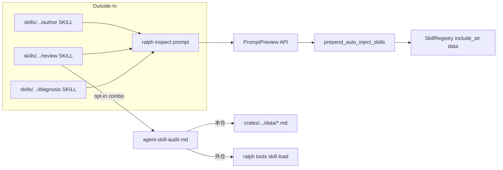

# feat: Prompt 可见性 CLI + skills/ 三规程 + 注入 skill 可选审计

## Goal Capsule

一个计划关掉三个缺口：

1. **author / review / diagnose** 必须能证明「某 hat 这一轮真正看见什么」（isolated prompt 栈 + auto-inject vs on-demand skill）。
2. **外仓**写/审 local preset 不依赖翻 `ralph-orchestrator` 源码树。
3. **review 可选审**注入 skill 文档：默认不审；启动时强制弹 combo；用户显式选「审」才审。

手段：同源 CLI `ralph inspect prompt` + 只改 `skills/` 下三 skill 规程 + Python 合同测锁规程锚点。

**权威**：本文件。  
**停止条件**：§6 最终质量门禁全绿。  
**Product Contract preservation**：路径纠正 — 编辑目标从错误的 `.claude/skills` 改为 `skills/`（用户纠错）。

**硬约束（编辑边界）**

| 允许 | 禁止 |
|------|------|
| `skills/ralph-preset-author/SKILL.md` | `.claude/skills/**` 任意文件 |
| `skills/ralph-preset-review/SKILL.md` | 把 common 写成「用户入口」 |
| `skills/ralph-run-diagnosis/SKILL.md` + `skills/ralph-run-diagnosis/references/**` | 改默认 runtime auto-inject 集合 |
| `skills/ralph-preset-common/references/**`（author/review 的 `references` symlink 指向此处） | |
| `skills/ralph-preset-common/fixtures/**`（若需负向样例说明） | |
| `skills/tests/**`（合同测） | |
| `crates/ralph-core/**`、`crates/ralph-cli/**`（inspect prompt） | |
| `crates/ralph-core/data/ralph-tools*.md`（仅当 CLI 对 agent 可见需同步） | |

`skills/README.md` 已说明：本地 `.claude/skills/<name>` 应是指向 `skills/<name>` 的 symlink；**实现时不要编辑安装副本**。

---

## 1. 功能目标

### 业务目标

- 操作者（人或跑 operator skill 的 agent）能用一条只读命令，看到与真跑 loop **同源**的 hat prompt 可见性。
- 在外仓只带 local preset YAML 时，同样能看到（内容来自已安装 `ralph` 二进制内嵌 skill + 该 YAML）。
- 写 preset / 审 preset / 跑后诊断三条规程都强制用该可见性证据，不再猜。
- 审 preset 时默认不审 `data/*.md`；弹窗可选审；选审后有可执行审计规程与 finding_id。

### 本次范围

- `ralph inspect prompt`（挂在现有 `ralph inspect` 命名空间）。
- core 只读 preview API（复用 `build_prompt` / `prepend_auto_inject_skills`，禁止第二套猜注入表）。
- 更新 `skills/ralph-preset-author`、`skills/ralph-preset-review`、`skills/ralph-run-diagnosis`。
- 共享规程落在 `skills/ralph-preset-common/references/`（因 author/review 的 `references` → symlink）。
- diagnose 自有 `references/` 下可放同名或交叉引用文件。
- `skills/tests/` 合同测锁定规程锚点（对齐 `test_execution_model_contract.py` 模式）。

### 非目标

- 修改 `.claude/skills/**`。
- 改变默认 auto-inject 名单或门控公式。
- 重写全部 builtin hat `instructions`。
- 新独立 marketplace skill「ralph-agent-skills-review」。
- Ralph TUI 原生 GUI combo（skill 层用 AskUserQuestion / 编号菜单即可）。
- CI 每次 PR 强制审 `data/*.md`。

### 已知约束和假设

- Embedded skills SSOT：`crates/ralph-core/src/skill_registry.rs` 的 `include_str!("../data/…")`。
- Auto-inject 门控（现状）：`memories.enabled || tasks.enabled` → `ralph-tools` / `ralph-tools-opac`；tasks → `ralph-tools-tasks`；memories → `ralph-tools-memories`；`ralph-tools-emit` / `wave` / `cmdref` 等默认 **on_demand**。
- `ralph inspect` 已有 `profiles` / `loop` 只读先例：`crates/ralph-cli/src/commands/inspect.rs`。
- Operator skill 合同测先例：`skills/tests/test_execution_model_contract.py`。
- 外仓无 `crates/ralph-core/data/` 时，审注入内容 = `ralph tools skill load <name>` / inspect 输出的 **当前二进制内嵌**内容，报告须注明来源。
- session-settled：一个计划覆盖三问题；data 审计默认关、弹窗可选开。

---

## 2. BDD 行为规格

```gherkin
Feature: Prompt 可见性检查（本仓与外仓）
  作为 preset 作者 / 审核人 / 诊断人
  我希望用 ralph inspect prompt 看到某 hat 真实可见内容
  以便写 instructions 和做 AAF 时不猜注入

  Scenario: S1 默认 config 下列出 auto-inject skill
    Given 一份 minimal isolated preset，memories 或 tasks 至少一个 enabled
    And hat "worker" 存在
    When 运行 `ralph inspect prompt -c <preset> --hat worker --format json`
    Then 退出码为 0
    And JSON 含 auto_inject 列表，至少包含 "ralph-tools"
    And JSON 将 "ralph-tools-emit" 标为 on_demand（或不在 auto_inject 中）

  Scenario: S2 关闭 tasks 与 memories 时不自动注入 ralph-tools
    Given 同一 preset 但 tasks.enabled=false 且 memories.enabled=false
    When 运行 inspect prompt --hat worker --format json
    Then auto_inject 不含 "ralph-tools"
    And 输出标明门控快照 tasks=false memories=false

  Scenario: S3 human 格式打印块标题顺序
    Given S1 的 preset 与 hat
    When 运行 inspect prompt --format human（默认）
    Then stdout 含块级清单（至少 HAT IDENTITY / instructions / skills 相关信息可识别）
    And 不启动 loop、不写 events.jsonl

  Scenario: S4 未知 hat 失败
    Given 合法 preset
    When 运行 inspect prompt --hat does-not-exist
    Then 退出码非 0
    And stderr 说明 hat 不存在

  Scenario: S5 外仓无 crates/ 仍可 inspect
    Given 临时目录仅有一份 local preset YAML（无 crates/、无 presets/en）
    And PATH 上有可用 ralph 二进制
    When 在该目录运行 inspect prompt -c ./local.yml --hat <id>
    Then 退出码为 0
    And 输出含该 hat instructions 可识别片段

  Scenario: S6 污染 agent env 下 human-CLI 语义仍正确
    Given 环境变量 RALPH_CURRENT_HAT / RALPH_EVENTS_FILE 已污染
    When 集成测试经 scrub 后调用 inspect prompt
    Then 行为与未污染一致（不因外层 hat 错绑）

Feature: Operator skill 规程强制可见性证据
  作为跑 ralph-preset-author / review / diagnose 的 agent
  我必须按 skills/ 下规程使用 inspect prompt
  以便 Visible context 有证据

  Scenario: S7 author 规程要求 inspect 证据
    Given skills/ralph-preset-author/SKILL.md 与 references/prompt-visibility.md
    When 合同测试读取规程
    Then SKILL 明确要求起草/改 instructions 前对照 inspect prompt
    And 禁止把 on_demand skill 写成「已自动注入」
    And 规程路径在 skills/ 下，不要求编辑 .claude/skills

  Scenario: S8 review AAF Visible context 必须以 inspect 为准
    Given skills/ralph-preset-review/SKILL.md
    When 合同测试读取规程
    Then Per-hat AAF「Visible context」步骤引用 inspect prompt 或 prompt-visibility 规程

  Scenario: S9 diagnose 对账引用 inspect
    Given skills/ralph-run-diagnosis/SKILL.md 与其 references
    When 合同测试读取规程
    Then 存在「用 inspect prompt 对账 skill/Confirm 可见性」的强制步骤或 checklist 项

Feature: Review 注入 skill 可选审计闸门
  作为审核人
  我希望默认只审 preset YAML
  并在需要时通过弹窗选择审注入 skill

  Scenario: S10 review 启动强制弹窗且默认不审
    Given 用户启动 ralph-preset-review
    When agent 执行 Workflow 第 0 步
    Then 必须弹出交互选择菜单（AskUserQuestion / combo / 编号选项）
    And 推荐项为「仅审查 preset YAML（默认）」
    And 第二项为「同时审查注入 skill 文档」
    And 用户选推荐项或未改默认时，不审 data/*.md
    And preset-review-report.md 记录 agent_skill_audit: skipped

  Scenario: S11 用户选择同时审查时执行审计规程
    Given 用户在弹窗选择「同时审查注入 skill」
    When review 继续
    Then 执行 agent-skill-audit 规程
    And 本仓优先审 crates/ralph-core/data/*.md
    And 外仓无该目录时审 ralph tools skill load dump，并注明「二进制内嵌」
    And 报告记录 agent_skill_audit: performed
    And 可读性/泄漏内部实现/假称已注入等命中对应 agent_skill.* finding_id

  Scenario: S12 finding_id 族已登记
    Given skills/ralph-preset-common/references/finding-rubric.md
    When 合同测试读取
    Then 存在 Agent skill audit 段与至少三个 agent_skill.* finding_id
```

---

## 3. 验收与测试策略

| Scenario | 验收条件 | 推荐测试层级 | 是否需要 E2E |
|----------|----------|--------------|--------------|
| S1 | json auto_inject 含 ralph-tools；emit 非 auto | core 单测 + CLI 集成 | 否 |
| S2 | 双关后无 ralph-tools | core 单测 + CLI 集成 | 否 |
| S3 | human 块清单；无 loop 副作用 | CLI 集成 | 否 |
| S4 | 未知 hat 非 0 | CLI 集成 | 否 |
| S5 | tempfile 仅 YAML 成功 | CLI 集成（tempdir） | 否（轻量跨目录即足够） |
| S6 | scrub 后行为正确 | CLI 集成（HARD RULE 5） | 否 |
| S7 | author SKILL/refs 锚点存在 | skills/tests Python 合同测 | 否 |
| S8 | review SKILL 锚点存在 | Python 合同测 | 否 |
| S9 | diagnose 锚点存在 | Python 合同测 | 否 |
| S10 | 弹窗默认跳过文案+报告字段规程存在 | Python 合同测 | 否 |
| S11 | audit 规程+外仓来源说明存在 | Python 合同测 | 否 |
| S12 | finding_id 登记 | Python 合同测 | 否 |

**风险驱动补充**

- 改 `build_prompt` 周边：先 **Characterization**（U1）锁现网注入集合，再抽 preview。
- CLI 输出 JSON：**契约字段**锁死（字段名稳定）。
- 禁止用 mock 掉 `prepend_auto_inject_skills` 来「证明」注入集合。

---

## 4. 需求—测试追踪矩阵

| 需求 | Scenario | 验收测试 | 单元测试 | 集成/契约 | E2E |
|------|----------|----------|----------|-----------|-----|
| R1 inspect prompt 命令 | S1–S4 | CLI 集成 | preview API | CLI | — |
| R2 块清单+skill 分类 | S1,S3 | JSON/human 断言 | 块解析/分类 | CLI | — |
| R3 同源不猜 | S1,S2 | preview vs inject 一致 | characterization + preview | — | — |
| R4 外仓可用 | S5 | tempdir CLI | — | CLI | — |
| R5 author 规程 | S7 | Python 合同 | — | skills/tests | — |
| R6 review 可见性 | S8 | Python 合同 | — | skills/tests | — |
| R7 diagnose 对账 | S9 | Python 合同 | — | skills/tests | — |
| R8 弹窗默认不审 | S10 | Python 合同 | — | skills/tests | — |
| R9 选审后审计 | S11,S12 | Python 合同 | — | skills/tests | — |
| R10 只改 skills/ | S7–S12 | 合同测路径断言 `skills/` | — | — | — |
| R11 CLI 文档同步 | （U10） | drift script / cmdref | — | — | — |
| R12 不改默认注入 | S1,S2 | characterization 回归 | core | — | — |
| R13 env scrub | S6 | CLI 集成 | — | CLI | — |

---

## Planning Contract（执行顺序）

### 严格串行

```text
U1 → U2 → U3 → U4 → U5 → U6 → U7 → U8 → U9 → U10 → U11 → U12
```

前一 Unit 的实现、测试、重构、回归全部完成，才允许进入下一 Unit。禁止并行交替改 CLI 与 skill 规程冒充「一起完成」。

### Key Technical Decisions

- KTD1. **编辑目标仅 `skills/`**（session-settled: 用户纠错）。`.claude/skills` 禁止写入。
- KTD2. **共享规程写入 `skills/ralph-preset-common/references/`**，因 author/review 的 `references` symlink 指向此处；用户入口仍是各 skill 的 `SKILL.md`，common **不是** marketplace 入口。
- KTD3. **`ralph inspect prompt` 同源 preview**（复用 inject 路径；允许 preview 跳过 handoff/guidance 副作用，但 auto-inject 集合必须一致）。
- KTD4. **data 审计默认关 + Workflow 第 0 步强制 combo**（session-settled）。
- KTD5. **外仓审计内容源 = 当前 ralph 二进制内嵌**；报告必须写明。
- KTD6. **规程锚点用 `skills/tests` Python 合同测锁定**（对齐 `test_execution_model_contract.py`），不引入 LLM judge 测。
- KTD7. **默认 human = 块清单 + skill 表；`--full` 才打全文**（避免刷屏）。

---

## 5. 严格串行开发单元

### U1. Characterization：现行 auto-inject 集合

- **Unit 目标**：在改任何预览 API 前，用测试钉死「默认门控」与「双关门控」下的 auto-inject 名集合。
- **对应 Scenario**：S1（部分）、S2、R12
- **外部可观察结果**：失败则证明现状与文档假设不符，须先修正假设再前进。
- **输入与输出**：minimal `RalphConfig` YAML fixture → `prepend_auto_inject_skills` / `build_prompt` 结果中的 skill 标记。
- **可依赖**：现有 `EventLoop`、`skill_registry`、`event_loop/tests/build_prompt.rs`
- **禁止依赖**：inspect CLI、skills 规程、PromptPreview 新类型
- **验收测试**：core 测试断言默认含 `ralph-tools`；双关不含；`ralph-tools-emit` 不在 auto 集合
- **需要拆分的单元测试**：门控真值表（memories/tasks 四种组合中至少覆盖默认与双关）
- **Red 预期失败原因**：若直接写「preview API」测试会失败——本 Unit 只加 characterization，先绿在**现行为**上
- **最小实现范围**：仅测试（必要时极小 test helper）；不改产品行为
- **集成验证**：`cargo nextest run -p ralph-core -- build_prompt`（或本 Unit 测试名）
- **回归范围**：既有 build_prompt / skill inject 测试
- **完成标准**：characterization 绿；文档附录「注入速查」与测试一致
- **风险与注意事项**：不要把 coordinator/solo 路径与 isolated 路径混用；钉 isolated 主路径

### U2. PromptPreview 同源结构化 API（core）

- **Unit 目标**：提供只读结构化结果：hat_id、gates、auto_inject[]、on_demand[]、block_titles[]（或等价），与 U1 集合一致。
- **对应 Scenario**：S1、S2、R1–R3
- **外部可观察结果**：库 API / 测试可拿到 JSON-serializable 结构（不必先有 CLI）
- **输入与输出**：`RalphConfig` + hat id → `PromptPreview`
- **可依赖**：U1
- **禁止依赖**：CLI、skills 文档
- **验收测试**：preview.auto_inject == U1 characterization；emit 在 on_demand
- **单元测试**：块标题非空；未知 hat → Err
- **Red 预期**：`PromptPreview` / 入口函数尚不存在 → 编译失败或测失败
- **最小实现范围**：`crates/ralph-core` 内新模块或 `event_loop` 方法；副作用跳过须单测证明 inject 集合仍一致
- **集成验证**：core nextest 本子集
- **回归范围**：U1 + 既有 build_prompt
- **完成标准**：S1/S2 在 core 层可证
- **风险**：preview 若 new EventLoop，注意 initialize 最小路径；勿写盘

### U3. `ralph inspect prompt` human 输出

- **Unit 目标**：CLI 子命令 human 格式打印预览；只读。
- **对应 Scenario**：S3、S4（可先做存在 hat）
- **外部可观察结果**：`ralph inspect prompt -c … --hat …` stdout 可读
- **输入与输出**：CLI args → stdout
- **可依赖**：U2；`inspect.rs` 既有 Profiles/Loop 模式
- **禁止依赖**：skills 规程；json 契约可下一 Unit
- **验收测试**：`crates/ralph-cli/tests/` 新集成测，**必须** `common::ralph_bin()` + scrub
- **单元测试**：clap 解析含 Prompt 子命令（可放 inspect 模块测）
- **Red**：子命令不存在 → clap/进程失败
- **最小实现范围**：`InspectCommands::Prompt` + execute；默认 human
- **集成验证**：CLI nextest 子集
- **回归范围**：既有 `inspect loop` / `profiles` 测
- **完成标准**：S3 绿；不创建 loop 状态文件
- **风险**：config 解析对齐 `ralph run` 的 -c / hats source 惯例

### U4. JSON 格式 + 未知 hat 错误

- **Unit 目标**：`--format json` 稳定字段；未知 hat 非 0 + 清晰 stderr
- **对应 Scenario**：S1、S4
- **可依赖**：U3
- **禁止依赖**：外仓 tempfile（U5）、skills
- **验收测试**：JSON 反序列化断言字段；未知 hat exit ≠ 0
- **Red**：无 json 分支 / 未知 hat 仍 0
- **最小实现范围**：format 枚举复用 inspect 既有 ValueEnum 风格
- **完成标准**：S1、S4 在 CLI 层绿
- **风险**：字段命名一经发布勿随意改（合同）

### U5. 外仓 tempfile + env scrub 回归

- **Unit 目标**：无 `crates/` 的临时工程可 inspect；污染 env 下仍正确
- **对应 Scenario**：S5、S6、R4、R13
- **可依赖**：U3–U4
- **禁止依赖**：skills 规程
- **验收测试**：tempdir 写 minimal YAML；断言 exit 0 + instructions 片段；另测 scrub
- **Red**：错误依赖 workspace 内 presets/en 路径
- **最小实现范围**：仅测试 + 若 CLI 误用 repo-relative 硬编码则修解析
- **完成标准**：S5、S6 绿
- **风险**：workspace_root / config 相对路径

### U6. CLI 帮助与 agent cmdref 同步（若需要）

- **Unit 目标**：`ralph inspect prompt --help` 与 `crates/ralph-core/data/ralph-tools-cmdref.md`（若列 inspect）无漂移
- **对应 Scenario**：R11
- **可依赖**：U3–U5
- **禁止依赖**：operator skills 正文大改（可并行阅读但本 Unit 只动 CLI 文档）
- **验收测试**：`scripts/check-cli-doc-drift.sh`；必要时 cmdref 增一行
- **Test expectation**：若决定 agent 不可见 inspect（loop 外工具），可仅 --help + 操作规程，不写 data — 须在本 Unit 明确选择并记录
- **完成标准**：drift 绿或显式「data 不列 inspect」决策写入附录
- **风险**：违反 HARD RULE「agent 该知道的能力要同步」——若 author skill 要求 agent 跑 inspect，则 cmdref/tools 应可见或规程写清「loop 外命令」

### U7. 共享 `prompt-visibility.md` + author SKILL 挂钩

- **Unit 目标**：在 `skills/ralph-preset-common/references/prompt-visibility.md` 写清：何时跑、命令模板、auto vs on_demand、外仓注意；`skills/ralph-preset-author/SKILL.md` Workflow 强制对照
- **对应 Scenario**：S7、R5、R10
- **可依赖**：U3（命令名已稳定）
- **禁止依赖**：review 弹窗（U9）、diagnose（U11）；**禁止写 `.claude/skills`**
- **验收测试**：新建 `skills/tests/test_prompt_visibility_contract.py`（或扩现有）断言：
  - 文件存在于 `skills/ralph-preset-common/references/prompt-visibility.md`
  - author SKILL 含 `inspect prompt` 与 `prompt-visibility`
  - author SKILL **不含**「编辑 `.claude/skills`」作为步骤
- **Red**：文件/锚点缺失
- **最小实现范围**：仅 skills 文档 + 合同测
- **完成标准**：S7 绿
- **风险**：author/review 经 symlink 读到同一文件 — 只改 common 一处

### U8. review SKILL：Visible context 绑定 inspect

- **Unit 目标**：`skills/ralph-preset-review/SKILL.md` 的 Per-hat AAF Visible context 强制引用 prompt-visibility / inspect
- **对应 Scenario**：S8、R6
- **可依赖**：U7
- **禁止依赖**：弹窗闸门全文（可一句「见下一步」但不实现 S10）
- **验收测试**：合同测断言 review SKILL 含锚点
- **完成标准**：S8 绿
- **风险**：勿把整份 emit skill 粘进 SKILL

### U9. review 弹窗闸门（默认不审）

- **Unit 目标**：Workflow **最前**插入强制 combo；推荐/默认 = 仅 YAML；报告元数据 `agent_skill_audit: skipped|…`
- **对应 Scenario**：S10、R8
- **可依赖**：U8
- **禁止依赖**：完整 audit 规程正文可 U10；本 Unit 必须写清默认跳过路径完整可执行
- **验收测试**：合同测断言：
  - 存在「仅审查 preset YAML（推荐」或等价默认文案
  - 存在「同时审查注入 skill」选项
  - 存在 `agent_skill_audit` 记录要求
  - 明确默认不审 `data` / 注入 skill
- **Red**：无弹窗步骤或默认改成强制审
- **最小实现范围**：`skills/ralph-preset-review/SKILL.md` + 可选 checklist 一句
- **完成标准**：S10 绿
- **风险**：用户要求 combo — 规程必须写 AskUserQuestion / 平台等价 / 编号回退，与 author Intent 菜单同模式

### U10. agent-skill-audit 规程 + finding_id 族

- **Unit 目标**：`skills/ralph-preset-common/references/agent-skill-audit.md`；`finding-rubric.md` 增加 Agent skill audit 段与 `agent_skill.*` ids；用户选审时执行
- **对应 Scenario**：S11、S12、R9
- **可依赖**：U9
- **禁止依赖**：diagnose
- **验收测试**：合同测断言文件存在、至少 3 个 finding_id（建议：`agent_skill.leaks_internals`、`agent_skill.unreadable`、`agent_skill.inject_claim_false`）、外仓「二进制内嵌」来源句
- **可选 fixture**：`skills/ralph-preset-common/fixtures/` 下 markdown 负向样例说明（非必须跑 LLM）
- **完成标准**：S11、S12 绿
- **风险**：审计标准对齐 CLAUDE.md AI skill guide 硬规则，但 **finding 文案写 agent 可读问题**，不要把 CLAUDE 内部路径当 agent 必读

### U11. diagnose skill 对账挂钩

- **Unit 目标**：更新 `skills/ralph-run-diagnosis/SKILL.md` + `skills/ralph-run-diagnosis/references/`（可引用 common 的 prompt-visibility，或自备短文指向 `ralph inspect prompt`）
- **对应 Scenario**：S9、R7
- **可依赖**：U7（命令与共享概念已定）
- **禁止依赖**：无
- **验收测试**：合同测断言 diagnose SKILL/checklist 含 inspect prompt 对账锚点；路径在 `skills/ralph-run-diagnosis/`
- **完成标准**：S9 绿
- **风险**：diagnose 的 references **不是** symlink 到 common — 不要误改成只写 common 却不改 diagnose 入口

### U12. author-checklist / commands.md + 全量回归

- **Unit 目标**：`skills/ralph-preset-common/references/author-checklist.md`、`commands.md` 增加 inspect 条目；跑 skills pytest 相关 + ralph nextest 相关 + `./scripts/run-tests.sh`
- **对应 Scenario**：全矩阵收口、R11
- **可依赖**：U1–U11
- **禁止依赖**：范围外重构
- **验收测试**：合同测扩 checklist/commands 锚点；全量门禁
- **完成标准**：§6 全绿
- **风险**：zsh 补全若列 `inspect` 子命令，按需更新 `scripts/ralph-zsh-plugin.zsh`（仅当现有补全已枚举子命令）

---

## 弹窗文案（产品口径，写入 U9）

```text
本次 preset review 是否同时审查「注入给 agent 的 skill 文档」？
（本仓：crates/ralph-core/data/*.md；外仓：当前 ralph 二进制内嵌，经 skill load / inspect）

1. 仅审查 preset YAML（推荐，默认）— 更快；不审注入 skill
2. 同时审查注入 skill 文档 — 怀疑 data 被改坏 / agent 看不懂时再选
```

---

## 6. 最终质量门禁

- [ ] 计划内 Scenario S1–S12 均有对应用例且通过
- [ ] `cargo nextest run -p ralph-core -- <preview/characterization>` 通过
- [ ] `cargo nextest run -p ralph-cli -- inspect_prompt`（实现名）通过
- [ ] `cd skills && python -m pytest tests/test_prompt_visibility_contract.py tests/test_execution_model_contract.py -q`（及本计划新增合同测）通过
- [ ] `scripts/check-cli-doc-drift.sh` 通过（或 U6 显式豁免已记录）
- [ ] `./scripts/run-tests.sh` 全绿
- [ ] `cargo fmt` / `cargo clippy` 无新增失败
- [ ] **无**对 `.claude/skills/**` 的 diff
- [ ] 无新增 skip/ignore 测；无削弱断言
- [ ] 剩余风险已记录：LLM 实际是否遵守弹窗属规程执行问题，由合同测锁「规程存在」而非锁模型服从

### 未验证 / 剩余风险

- 真实 Claude/Cursor 会话是否每次都弹出 AskUserQuestion：合同测无法驱动 GUI；靠 SKILL 硬步骤 + 人工抽查。
- `--full` 超大 prompt 性能：非本计划门禁。
- getaLawyer 安装树若不是 symlink 而是旧副本：用户侧需重装/同步 skill；本计划不自动改 `.claude`。

---

## Appendix

### 三问题映射

| 用户问题 | 单元 |
|----------|------|
| 三 skill 不懂注入 | U1–U4, U7–U8, U11–U12 |
| 外仓 | U5, U7, U10（来源说明） |
| data 可选审 | U9–U10 |

### 注入机制面包屑（实现者，勿写入 agent 注入 skill）

- `EventLoop::build_prompt` → `prepend_auto_inject_skills`（`crates/ralph-core/src/event_loop/mod.rs`）
- `SkillRegistry` embedded：`crates/ralph-core/src/skill_registry.rs`
- Inspect 先例：`crates/ralph-cli/src/commands/inspect.rs`
- Skill dump：`ralph tools skill load|list`
- Operator 合同测先例：`skills/tests/test_execution_model_contract.py`
- Symlink 说明：`skills/README.md`

### High-Level Technical Design


