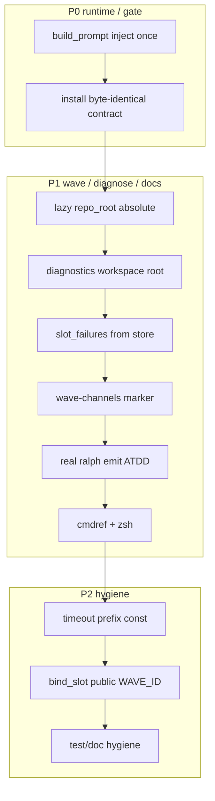

# fix: 闭合 003/004/001 Review 全部发现

## Goal Capsule

把三份已合入 plan 的 Review 残留（P0–P2）一次收干净：消除 custom `auto_inject` 双注入回归；把 install 合同测对齐物理拷贝语义；用 dispatcher 签发的 wave-channel marker 堵住 env 伪造；诊断 JSON / `slot_failures` / lazy `repo_root` 与 store 同源；补齐 outside-in emit、cmdref/zsh 与测试卫生。

- **权威**：本文件 Product Contract + KTDs；上游三 plan 行为契约保留，本计划只修缺陷与测试缺口。
- **停止条件**：Verification Contract 全绿；Definition of Done 勾选；无新增 skip/ignore。
- **Product Contract preservation**：ce-plan-bootstrap；用户已确认三项决策（见 KTD1–KTD3）。

---

## Product Contract

### Summary

Review 已证明：主路径 nextest 绿，但存在运行时双注入、§6 pytest 红、allowlist 可伪造、诊断写 CWD、`slot_failures` 与 store 不同源、生产 InjectedFailed 写盘无测、cmdref/zsh 漏 `inspect prompt` 等问题。本计划按严格串行 Unit 全部修复，不做新功能。

### Requirements

- R1. 任意 `skills.overrides.<name>.auto_inject: true` 的 skill，在 `build_prompt` / `prompt_body` 中对应 `<name-skill>` 开标签与正文 marker **恰好出现 1 次**。
- R2. `skills/tests` 安装树合同测与 `skills/install.py` 物理拷贝契约一致：允许 `.claude/skills/**` 副本，但与 `skills/` 源 **byte-identical**；禁止再断言「不得存在副本」。
- R3. lazy supervisor bridge 的 `repo_root` 必须为绝对 workspace 根；不得硬编码 `"."` 导致 spawn 前 RelativePath fail-closed。
- R4. InjectedFailed 诊断 JSON 写在 **workspace** `.ralph/diagnostics/`（由 events 路径推导），不得依赖进程 CWD；生产 `run_supervisor_fan_in` 路径必须有断言文件存在的测试。
- R5. `exec.wave.failed` 的 `slot_failures` 与 `blocking_slots` **同源**（supervisor store failure_reason），index 集合一致；reason 为稳定码（如 `worker_timeout` / `empty_worker_result` / `slot_never_started`），非 tracker 自由文案。
- R6. wave-worker emit 通道验收改为：**dispatcher 签发的磁盘 marker** 列出合法 per-slot 绝对路径；仅 marker 内路径可写。仅靠进程自报 `RALPH_WAVE_*` env 不得放行任意 `.ralph/wave-*.jsonl`。
- R7. 至少一条集成测：真实 `ralph emit` 二进制（`common::ralph_bin` + HARD RULE 5 scrub）写入 injected channel → `read_worker_events` 非空 → store `Completed`。
- R8. `RALPH_WAVE_ID` 对 worker 可见值在源头即为 public id：`bind_slot` 不得再往 `binding.env` 写入 store id；dispatcher 侧 filter hack 可删除或降为防御性断言。
- R9. `ralph-tools-cmdref.md` / `ralph-tools.md`（若列 inspect）与 zsh `_RALPH_INSPECT_CMDS` 登记 `inspect prompt`；`ralph-tools-wave.md` 去掉「改写 RALPH_EVENTS_FILE」与「禁止改写」的矛盾。
- R10. Timeout Err 文案与 classifier 前缀共用一个 `pub(crate)` 常量；改文案不得静默退回 `worker_cancelled`。
- R11. 清理 Review 指出的测试卫生：重复 timeout 用例、过时 U1 注释、空 registry 的 disabled-skills 假绿、S5 软断言对齐 `--full`。
- R12. preview / live 对 `memories.enabled=false` 时 `ralph-tools-memories` 可见性一致（不得在 preview 标 on_demand 而 live registry 已 remove）。

### Actors

- A1. Wave dispatcher / emit allowlist（机制）
- A2. EventLoop skill inject / PromptPreview（机制）
- A3. Operator skill 安装树与合同测（开发者）
- A4. Operator / diagnosis（消费诊断 JSON 与 inspect）

### Key Flows

- F1. custom auto_inject skill → 单次注入 → agent prompt 无重复块。
- F2. `./skills/install.py --force` → `.claude` 副本与源 byte-identical → pytest 绿。
- F3. lazy bridge wave → 绝对 `repo_root` → spawn 成功 → channel 可写。
- F4. InjectedFailed → workspace diagnostics JSON → fan-in 测试可观测。
- F5. dispatcher 写 marker → worker emit 合法路径 → store Completed；伪造 env 指向未签发路径 → 拒收。

### Acceptance Examples

- AE1. preset 含 `custom-dup` auto_inject；`inspect prompt --full` 中 marker 与开标签 count == 1。
- AE2. 改合同测后，本地存在 `.claude` 副本时：内容与源一致则绿；故意改坏副本则红。
- AE3. lazy bridge 路径下至少 spawn 1 slot（或 merge_event_channel_env 不再因 RelativePath 全失败）。
- AE4. `run_supervisor_fan_in` → InjectedFailed 后，temp workspace 下 diagnostics JSON 存在且含 `slot_index`/`status`/`reason`。
- AE5. failed payload 的 `slot_failures[].reason` 为 frozen 码；`slot_failures` index 集合 == `blocking_slots`。
- AE6. 无 marker / marker 不含该路径时，即使 env 自报匹配的 wave_id/index，emit 仍拒收。
- AE7. 有 marker + 合法路径 + 真实 `ralph emit` → channel 有一行 → store completed。
- AE8. cmdref/zsh 含 `inspect prompt`；wave skill 无矛盾指引。

### Scope Boundaries

**在范围内**

- 上述 R1–R12 全部修复
- 相关 nextest / pytest / drift / zsh 脚本
- skill 注入文档仅当 agent 可见契约变化时同步（cmdref/tools；不改默认 auto-inject 门控公式）

**非目标**

- 调 `aggregate_timeout_secs` / 容量数值
- progress 心跳续租 / 「agent 是否在思考」
- fail_wave merge 已完成事件进 main
- 把 `install.py` 改成默认 symlink（已否决）
- 重写 builtin hat instructions / 新 marketplace skill
- 全量重做 003/004/001 功能

### Deferred to Follow-Up Work

- Windows 无 symlink 时 install 以外的开发布局文档细化（本计划只锁拷贝合同）
- `missing_worker_terminal` 与 WaveTracker results 计数完全合一（本计划只保证 empty-success 与 slot_failures 同源；tracker 全量改 SSOT 可另案）
- Proof / CI 强制审 `data/*.md`（001 非目标保留）

---

## Planning Contract

### Key Technical Decisions

- KTD1. **安装合同 = 物理拷贝 + byte-identical**（session-settled: user-directed — chosen over 改 install.py 为 symlink / 混合平台：`install.py` 已是 SSOT 物理拷贝；合同测应验证拷贝正确性，而非禁止副本）。
- KTD2. **wave allowlist = dispatcher 磁盘 marker**（session-settled: user-directed — chosen over 仅文档诚实边界：env 自报不是签名；复用 P6 `current-*` marker 模式，agent 不可写 marker）。
- KTD3. **纳入 lazy bridge `repo_root` 修复**（session-settled: user-directed — chosen over 另开 plan：与 003 通道同一 spawn 路径，不修则 carve-out 在非 supervisor wave 不可达）。
- KTD4. **双注入修法**：`inject_memories_and_tools_skill` 只注入 `gated`；`registry_auto` / custom 仍由 `inject_custom_auto_skills` 独占（或反过来合并为单一注入点——优先最小 diff：只 chain `gated`）。
- KTD5. **诊断 root**：从 `main_events_file` 推导 workspace（parent 的 parent 若 events 在 `.ralph/`，或既有 LoopContext/workspace API）；禁止 `Path::new(".")`。
- KTD6. **`slot_failures`**：复用 InjectedFailed 臂已算好的 store `reasons` map，按 `blocking_slots` 过滤；不再读 `completed.failures` 自由文案作为权威。
- KTD7. **marker 文件形态（定向）**：dispatcher spawn 前写入 workspace `.ralph/current-wave-channels`（每行一个绝对 channel 路径，复用既有 `current-events` / `current-candidate-events` 的「orchestrator 写、agent 不可伪造文件内容作为签发」模式）；`resolve_emit_path` 在 wave-worker 分支除路径形状外，要求 candidate 落在该清单（canonicalize / macOS `/var` 等价后比较）。清理时机：wave 结束或 fail-closed 时 best-effort 删除本 wave 对应行；崩溃残留行不授予写权，除非路径仍被某 live dispatcher 重新列入（精确路径匹配，禁止前缀通配）。
- KTD8. **全部 P2 纳入本计划**（用户要求全部修复），但串行排在 P0/P1 之后，避免阻塞关键路径。

### Assumptions

- `skills/install.py` 物理拷贝语义不改为 symlink。
- `.claude/` 被 gitignore；合同测必须能在「已安装副本」环境下绿，且能检测漂移。
- 003/004/001 已合入 `pittcat-dev`；本计划在其上增量修复。
- HARD RULE 1：测试入口 `cargo nextest`；HARD RULE 5：spawn `ralph` 必须 scrub。
- Marker 路径必须落在 workspace `.ralph/`，受既有 orphan/slot-subtree 守卫保护。

### High-Level Technical Design



### BDD 行为规格

```gherkin
Feature: Review findings closure for 003/004/001
  Runtime inject, install contract, wave allowlist, and diagnostics
  must match the settled review fixes without regressing green paths.

  Scenario: Happy — custom auto_inject skill appears once
    Given a local preset with skills.overrides.custom-dup.auto_inject true
    And a skill body containing UNIQUE_DUP_MARKER
    When ralph inspect prompt --hat worker --format json --full runs
    Then auto_inject lists custom-dup
    And prompt_body contains UNIQUE_DUP_MARKER exactly once
    And prompt_body contains "<custom-dup-skill>" exactly once

  Scenario: Illegal — forged wave env without marker is rejected
    Given RALPH_WAVE_WORKER=1 and matching RALPH_WAVE_ID/INDEX
    And RALPH_EVENTS_FILE points at .ralph/wave-<id>-<idx>.jsonl
    And .ralph/current-wave-channels does not list that absolute path
    When ralph emit writes a terminal unit.done
    Then resolve_emit_path / emit fails with allowlist rejection
    And the channel file is not appended

  Scenario: Happy — marker-listed channel accepts real ralph emit
    Given dispatcher wrote the per-slot absolute path into current-wave-channels
    And wave-worker env points at that channel
    When ralph emit exec.unit.done succeeds
    Then the channel JSONL has one accepted event
    And classify_slot_result / store records Completed for that slot

  Scenario: Boundary — lazy bridge uses absolute repo_root
    Given supervisor bridge is constructed on the default/lazy path
    When merge_event_channel_env runs for a slot
    Then RALPH_WORKSPACE_ROOT is absolute
    And RelativePath rejection does not fire solely due to repo_root="."

  Scenario: Failure recovery — InjectedFailed writes workspace diagnostics
    Given fan-in evaluates to Failed with at least one Failed slot
    When run_supervisor_fan_in injects exec.wave.failed
    Then .ralph/diagnostics/wave-<id>-slots.json exists under the workspace root
    And each slot entry has slot_index, status, and reason fields

  Scenario: State — slot_failures matches blocking_slots from store
    Given store has mixed Completed and Failed slots with frozen reasons
    When build_wave_failed_payload runs
    Then blocking_slots equals the Failed/Cancelled indices
    And slot_failures index set equals blocking_slots
    And each reason is a frozen code from the store

  Scenario: Install contract — drifted copy fails, identical copy passes
    Given .claude/skills/ralph-preset-author/references/prompt-visibility.md exists as a physical copy
    When the contract test compares it to skills/ralph-preset-common/references/prompt-visibility.md
    Then identical bytes pass
    And a mutated copy fails

  Scenario: Regression — empty success still empty_worker_result
    Given exit 0 with zero channel events
    When classify / record_outcome runs
    Then reason is empty_worker_result
    And WaveTracker counts a failure not a result

  Scenario: Docs — inspect prompt is discoverable
    Given ralph-tools-cmdref and zsh inspect completions
    When an operator looks up inspect subcommands
    Then inspect prompt is listed with format/hat hints
```

### 验收与测试策略

| Scenario | 验收条件 | 推荐测试层级 | 是否需要 E2E |
|---|---|---|---|
| 双注入一次 | marker/tag count==1 | core 单元 + CLI inspect | 否 |
| 伪造 env 拒收 | 无 marker → emit 失败 | emit_path / emit 单元 | 否 |
| marker + 真 emit | channel 有行 + store Completed | CLI 集成 | 否 |
| lazy repo_root | 绝对路径；可 spawn | wave_supervisor 集成 | 否 |
| InjectedFailed JSON | 生产臂写盘 | dispatcher 集成 | 否 |
| slot_failures 同源 | index 集合相等 + frozen reason | 单元 + wave_supervisor | 否 |
| install byte-identical | 一致绿/漂移红 | skills pytest | 否 |
| empty_worker_result 回归 | 既有断言仍绿 | 既有单元 | 否 |
| cmdref/zsh | 字符串锚点 + help | 文档/脚本 + 可选 drift | 否 |

### 需求—测试追踪矩阵

| 需求 | Scenario | 验收测试 | 单元 | 集成/契约 | E2E |
|---|---|---|---|---|---|
| R1 | 双注入一次 | AE1 | preview_api count | inspect_prompt | 否 |
| R2 | install 合同 | AE2 | — | test_prompt_visibility_contract | 否 |
| R3 | lazy repo_root | AE3 | — | wave_supervisor | 否 |
| R4 | diagnostics | AE4 | writer helper | fan-in 真路径 | 否 |
| R5 | slot_failures | AE5 | payload builder | wave_supervisor u6 | 否 |
| R6 | marker 拒收 | AE6 | emit_path | emit 负例 | 否 |
| R7 | 真 emit | AE7 | — | ralph_bin 集成 | 否 |
| R8 | bind_slot | env 断言 | — | wave_supervisor u4 | 否 |
| R9 | docs/zsh | AE8 | — | 合同/脚本 | 否 |
| R10 | timeout 前缀 | 共享常量测 | worker+classify | — | 否 |
| R11 | 测试卫生 | 重复测删除后仍绿 | worker_outcome | — | 否 |
| R12 | preview 同源 | memories off 一致性 | preview_api | — | 否 |

---

## Implementation Units

> **严格串行**：U1 → U2 → …；前一 Unit 完成标准满足后方可进入下一 Unit。  
> **Execution note（全局）**：每个 Unit 先写/改验收测试 → Red → 最小实现 → Green → 相关集成 → 回归；禁止删断言 / skip / 无解释改 golden / mock 掉被测行为。

### U1. P0：custom auto_inject 双注入 — 表征 + 修复

- **Unit 目标**：`build_prompt` / `--full` prompt_body 中 registry auto_inject skill 只出现一次。
- **Requirements**：R1, R12（若同路径可一并修 preview/live registry 一致性；否则 R12 留 U10）。
- **Dependencies**：无。
- **对应 Scenario**：Happy — custom auto_inject skill appears once。
- **Files**：
  - modify: `crates/ralph-core/src/event_loop/mod.rs`（`inject_memories_and_tools_skill` 只注入 `gated`）
  - modify: `crates/ralph-core/src/event_loop/tests/preview_api.rs`（count 断言 + custom auto_inject fixture）
  - optional test: `crates/ralph-cli/tests/inspect_prompt.rs`（CLI 复现 AE1）
- **Approach**：先加失败测试：`prompt.matches("<custom-dup-skill>").count() == 1` 与 marker count==1（当前期望失败为 2）。再改 `gated.into_iter().chain(registry_auto)` 为仅 `gated`。保留 `inject_custom_auto_skills` 负责 registry_auto。
- **Execution note**：Characterization/ATDD 先 Red；最小 diff 优先于合并两个 inject 函数。
- **验收测试**：AE1。
- **需要拆分的单元测试**：fixture 含 `skills.dirs` + overrides auto_inject；HashSet 等价测改为/并加 count。
- **Red 预期失败原因**：现状 count==2。
- **最小实现范围**：一处注入循环 + 测试；不改门控公式。
- **集成验证**：`cargo nextest run -p ralph-core -- preview_api`；可选 `inspect_prompt`。
- **回归范围**：preview_characterization、build_prompt。
- **完成标准**：AE1 绿；gated builtin 仍各 1 次。
- **风险**：勿把 gated builtin 从 `inject_custom_auto_skills` 排除清单误删导致 0 次注入。

### U2. P0：安装树合同测对齐物理拷贝（byte-identical）

- **Unit 目标**：pytest 与 `install.py` 契约一致；存在副本且内容正确则绿。
- **Requirements**：R2；KTD1。
- **Dependencies**：无（可与 U1 串行，不依赖其产物）。
- **对应 Scenario**：Install contract。
- **Files**：
  - modify: `skills/tests/test_prompt_visibility_contract.py`（替换 `test_install_tree_does_not_contain_prompt_visibility_copy`）
  - optional modify: `skills/README.md`（一句：install 为物理拷贝；合同测校验一致性）
  - 不修改：`skills/install.py` 拷贝语义
- **Approach**：若 `.claude/skills/.../prompt-visibility.md`（及 agent-skill-audit）存在，则 `filecmp`/hash 与 `skills/ralph-preset-common/references/` 对应文件；不存在则 skip 或仅测「源文件存在」。另加临时目录：copy 后 mutate → 断言失败辅助函数可测。
- **Execution note**：先改测试期望使当前「有副本且 identical」转绿；再补漂移负例。
- **验收测试**：AE2。
- **Red 预期失败原因**：旧测试在「存在副本」时强制 fail。
- **最小实现范围**：仅合同测（+ README 一句）；不删用户机器上的 `.claude` 副本（gitignore）。
- **集成验证**：`cd skills && python -m pytest tests/test_prompt_visibility_contract.py -q`。
- **回归范围**：`test_install.py` 物理拷贝契约。
- **完成标准**：本地已安装树下全绿；漂移用例红。
- **风险**：勿改回「禁止副本」断言；勿要求编辑 `.claude` 进 git。

### U3. P1：lazy bridge `repo_root` 绝对化

- **Unit 目标**：默认/lazy supervisor bridge 使用真实绝对 workspace 根。
- **Requirements**：R3；KTD3。
- **Dependencies**：无。
- **对应 Scenario**：Boundary — lazy bridge。
- **Files**：
  - modify: `crates/ralph-cli/src/loop_runner/wave/dispatcher.rs`（`ProductionBridgeContext.repo_root`）
  - test: `crates/ralph-cli/src/loop_runner/tests/wave_supervisor.rs`
- **Approach**：用已有 `ctx` / `main_events_file` / LoopContext 的绝对 workspace（与 `tasks_path` 派生同级证据）；禁止 `PathBuf::from(".")`。测试：lazy 路径构造后 `bridge.repo_root().is_absolute()`，且 `merge_event_channel_env` 不因 RelativePath 失败。
- **Execution note**：Outside-in：先写失败测再改构造点。
- **验收测试**：AE3。
- **Red 预期**：当前为 `"."` 或 RelativePath。
- **最小实现范围**：一处赋值 + 测试；不改 store 选型。
- **集成验证**：`cargo nextest run -p ralph-cli --bin ralph -- wave_supervisor`。
- **回归范围**：既有 production bridge / bind_slot。
- **完成标准**：AE3 绿。
- **风险**：相对 cwd 测试夹具需 canonicalize；macOS `/var` 等价。

### U4. P1：诊断 JSON 钉 workspace + 生产 InjectedFailed 写盘测

- **Unit 目标**：诊断落盘根正确；`run_supervisor_fan_in` 真路径可测。
- **Requirements**：R4。
- **Dependencies**：U3（workspace 根可信后更好测）。
- **对应 Scenario**：Failure recovery — InjectedFailed diagnostics。
- **Files**：
  - modify: `crates/ralph-cli/src/loop_runner/wave/dispatcher.rs`（`write_wave_diagnostics_json` 调用点；doc）
  - test: 同文件 `#[cfg(test)]` / `wave_supervisor.rs`
- **Approach**：root = 从 `main_events_file` 推导的 workspace（注释写明相对路径 `.ralph/diagnostics/wave-<id>-slots.json`）。新测：构造 Failed wave，调用 `run_supervisor_fan_in`，断言文件存在且可反序列化；成功 Integrate 路径不写误报。删除/改写仅复刻 helper 却声称集成的测试，或降级为 builder 单测并改名。
- **Execution note**：ATDD 必须打到生产臂；禁止再手工 copy 循环冒充集成。
- **验收测试**：AE4。
- **Red 预期**：当前写 `"."`；删生产臂旧「集成」测仍绿。
- **最小实现范围**：调用点参数 + 真集成测。
- **集成验证**：wave_supervisor / dispatcher u5 子集。
- **回归范围**：成功 fan-in。
- **完成标准**：AE4 绿；删生产臂会红。
- **风险**：tempdir 必须注入为 events 父树，避免污染仓库 CWD。

### U5. P1：`slot_failures` 与 store / `blocking_slots` 同源

- **Unit 目标**：failed payload 可机读区分 timeout vs empty vs never_started。
- **Requirements**：R5。
- **Dependencies**：U4（reasons map 已在 InjectedFailed 臂计算）。
- **对应 Scenario**：State — slot_failures matches blocking_slots。
- **Files**：
  - modify: `crates/ralph-cli/src/loop_runner/wave/dispatcher.rs`（`build_wave_failed_payload`）
  - test: `wave_supervisor.rs`（扩展 u6）
- **Approach**：把 store `reasons`（或等价）传入 builder；按 `blocking_slots` 过滤；断言集合相等与 frozen reason。保留字段可选、不改 schema required_fields。
- **Execution note**：先改测试期望（自由文案/空数组不再可接受）再改实现。
- **验收测试**：AE5。
- **Red 预期**：当前取 `completed.failures` 自由文案。
- **最小实现范围**：payload builder + 测试；不扩 schema。
- **集成验证**：`cargo nextest run -p ralph-cli --bin ralph -- u6_failed_payload`。
- **回归范围**：blocking_slots / phase。
- **完成标准**：AE5 绿。
- **风险**：Review 臂 payload 形状不同，勿误改 Review 字段。

### U6. P1：wave-channel marker allowlist（防 env 伪造）

- **Unit 目标**：只有 dispatcher 签发清单内的 per-slot 路径可写。
- **Requirements**：R6；KTD2。
- **Dependencies**：U3（绝对 workspace 后 marker 路径才稳定）。
- **对应 Scenario**：Illegal forged env；Happy marker accept（本 Unit 可用 resolve_emit_path 级；真二进制放 U7）。
- **Files**：
  - modify: `crates/ralph-cli/src/cli/emit_path.rs`
  - modify: `crates/ralph-cli/src/commands/emit.rs`（传入 marker 解析所需上下文）
  - modify: `crates/ralph-cli/src/loop_runner/wave/dispatcher.rs`（spawn 前写 marker）
  - test: `commands/emit.rs` / `emit_path` / `wave_supervisor`
  - docs: `crates/ralph-core/data/ralph-tools-emit.md`（通用规则：保留 runner 注入路径；通道合法性由 runtime 签发——去计划化）
- **Approach**：
  1. Characterization：无 marker 时，仅 env 自报匹配 → 应失败（先 Red 出目标行为）。
  2. Dispatcher 在注入 `RALPH_EVENTS_FILE` 前，把绝对 channel 路径追加进 `.ralph/current-wave-channels`（或等价）。
  3. `is_wave_channel_path` / allowlist 分支：形状检查 + **候选路径 ∈ marker 清单**；env wave_id/index 可作为辅助一致性检查，但不可单独放行。
  4. 负例：`/tmp`、跨 worktree、未列入 marker、错误 index 仍拒。
- **Execution note**：安全敏感；先 Red 伪造场景再 Green。参考 `docs/solutions/integration-issues/emit-workspace-root-cwd-drift.md`。
- **验收测试**：AE6（本 Unit）；AE7 接口留给 U7。
- **Red 预期**：现状仅靠 env 可通过。
- **最小实现范围**：marker 读写 + allowlist；不做复杂 TTL API。
- **集成验证**：emit + wave_supervisor 子集；`scripts/check-cli-doc-drift.sh` 若动 skill。
- **回归范围**：既有 wave-worker 接受测、mismatched id/index、非 isolated 拒收。
- **完成标准**：AE6 绿；合法 marker 路径仍可 resolve Ok。
- **风险**：规则过宽打开任意 `.ralph/*.jsonl`；必须绑定清单。并发 wave 共用清单时用追加+精确行匹配，避免误删他波路径。

### U7. P1：Outside-in — 真实 `ralph emit` → channel → store Completed

- **Unit 目标**：闭合 003 U3 缺口：真二进制写通道。
- **Requirements**：R7。
- **Dependencies**：U6。
- **对应 Scenario**：Happy — marker-listed channel accepts real ralph emit。
- **Files**：
  - modify/create: `crates/ralph-cli/tests/` 集成测（或扩展 `wave_supervisor` 若能 spawn bin）
  - 必须：`common::ralph_bin()` + `scrub_agent_runtime_env`，再显式设 wave-worker env
- **Approach**：temp workspace；写 marker + channel 路径；跑 `ralph emit`；读文件；可选走 classify/record 断言 Completed。禁止 `std::fs::write` 冒充 emit。
- **Execution note**：HARD RULE 5 污染复跑验收。
- **验收测试**：AE7。
- **Red 预期**：无 marker/实现缺口时失败。
- **最小实现范围**：一条垂直切片集成测 + 必要 glue。
- **集成验证**：该测 + emit 负例。
- **回归范围**：empty_worker_result。
- **完成标准**：AE7 绿；污染 env 下仍绿。
- **风险**：policy-check / schema 可能挡 emit——测用合法 unit.done payload。

### U8. P1/P2：`bind_slot` 源头 public `RALPH_WAVE_ID` + timeout 前缀常量

- **Unit 目标**：去掉 store id 污染源；timeout 字符串与 classifier 编译期绑定。
- **Requirements**：R8, R10。
- **Dependencies**：U7（env 契约已测）。
- **对应 Scenario**：回归 public wave id；timeout empty → worker_timeout。
- **Files**：
  - modify: `crates/ralph-cli/src/loop_runner/wave/supervisor_bridge.rs` / core `worktree_bind`（停止写入 store id，或写入 public id）
  - modify: `crates/ralph-cli/src/loop_runner/wave/dispatcher.rs`（可删 filter hack 或改为 assert）
  - modify: `crates/ralph-cli/src/loop_runner/wave/worker.rs` + dispatcher `TIMEOUT_PREFIX` → 共享常量
  - test: wave_supervisor u4；classify_slot_result 用 worker 真实 format 字符串
- **Approach**：bind API 增加 public_wave_id 或不再放 `RALPH_WAVE_ID`；dispatcher 已注入 public。导出 `WORKER_TIMEOUT_ERR_PREFIX`，worker format / classifier starts_with 共用。
- **Execution note**：先测「binding.env 不含 store id」再改。
- **验收测试**：既有 u4 + 新前缀耦合测。
- **最小实现范围**：env + 常量；不改 store 内部 id。
- **集成验证**：wave_supervisor u4 / u3 classify。
- **回归范围**：register_wave 映射。
- **完成标准**：R8/R10 可观测。
- **风险**：遗漏其它 bind 调用点。

### U9. P1：cmdref / tools / zsh 登记 `inspect prompt` + wave.md 矛盾

- **Unit 目标**：操作者与 agent 文档可发现 inspect prompt；wave skill 无矛盾。
- **Requirements**：R9。
- **Dependencies**：无（文档可后置，但串行排在功能后）。
- **对应 Scenario**：Docs — inspect prompt is discoverable。
- **Files**：
  - modify: `crates/ralph-core/data/ralph-tools-cmdref.md`
  - modify: `crates/ralph-core/data/ralph-tools.md`（inspect 行）
  - modify: `scripts/ralph-zsh-plugin.zsh`（`_RALPH_INSPECT_CMDS` + prompt args）
  - modify: `crates/ralph-core/data/ralph-tools-wave.md`（165–166 vs 禁止改写）
  - optional: `--policy-check` 是否覆盖路径——若本 Unit 不改代码，则文档写明预检不含落点 allowlist（诚实边界）
- **Approach**：补 `inspect prompt` 描述（loop 外只读）；zsh 补 `--hat`/`--format`/`--full`；wave.md 删「改写 RALPH_EVENTS_FILE」建议。安装：`cp scripts/ralph-zsh-plugin.zsh ~/.oh-my-zsh/plugins/ralph/ralph.plugin.zsh` 由执行者验证。
- **Execution note**：改 data skill 遵守可读性/去计划化；跑 drift。
- **验收测试**：AE8；字符串锚点可加 skills 合同测一行。
- **最小实现范围**：文档+zsh；可不改 clap。
- **集成验证**：`scripts/check-cli-doc-drift.sh`；`ralph inspect prompt --help`。
- **回归范围**：既有 inspect profiles/loop 补全。
- **完成标准**：AE8 绿。
- **风险**：cmdref 过长——一行足够。

### U10. P2：测试卫生 + preview memories 同源（R11/R12）

- **Unit 目标**：去掉误导注释/重复测/假绿；preview 与 live registry 一致。
- **Requirements**：R11, R12。
- **Dependencies**：U1（注入 SSOT 已稳）。
- **对应 Scenario**：Regression 与 preview 一致性。
- **Files**：
  - modify: `crates/ralph-core/src/supervisor/worker_outcome.rs`（删重复测/修过时注释）
  - modify: `crates/ralph-core/src/event_loop/tests/preview_api.rs`（disabled_skills 用 from_config；memories off 断言）
  - modify: `crates/ralph-cli/tests/inspect_prompt.rs`（S5 用 `--full` 断言 instructions 片段）
  - optional: `phase.rs` 测试内 never_started helper——删除假覆盖或提升生产 API（选最小）
- **Approach**：保留带 AE/U 前缀的 timeout 测一份；`plan_auto_inject_with_disabled_skills` 使用含 builtin 的 registry；`prompt_preview` 优先用 `self.skill_registry` 或与 `EventLoop::new` 相同的 remove memories 规则。
- **Execution note**：纯卫生 Unit，禁止夹带行为变更（除非 R12 必需）。
- **验收测试**：相关 nextest 绿；R12 单测。
- **最小实现范围**：测+小 API 对齐。
- **集成验证**：preview_* / worker_outcome / inspect_prompt。
- **回归范围**：U1–U9。
- **完成标准**：无重复测；无过时「将翻转」注释；disabled 短路删了会红。
- **风险**：提升 phase helper 可能超范围——默认删除测试内死副本。

### U11. 最终质量门禁与回归收口

- **Unit 目标**：整包验证；记录剩余风险。
- **Requirements**：全部。
- **Dependencies**：U1–U10。
- **对应 Scenario**：全矩阵。
- **Files**：无必须生产改动；若门禁失败回对应 Unit。
- **Approach**：跑 Verification Contract 命令集；确认无新增 ignore；污染 env 复跑 emit/inspect 相关集成。
- **Execution note**：合并前跑全量 `./scripts/run-tests.sh`；flake 仅允许 `RALPH_BASELINE_SERIAL=1` 兜底且须记录。
- **验收测试**：§ Verification Contract。
- **Test expectation**：门禁 Unit — 无新功能。
- **完成标准**：DoD 全部满足。
- **风险**：partial_timeout 须走两阶段脚本，勿裸 `cargo nextest run --workspace`。

---

## Verification Contract

- `cargo nextest run -p ralph-core -- preview_api preview_characterization worker_outcome`
- `cargo nextest run -p ralph-cli -- inspect_prompt`
- `cargo nextest run -p ralph-cli --bin ralph -- emit_path emit_wave_worker wave_supervisor u3_ u4_ u5_ u6_ classify_slot`
- `cd skills && python -m pytest tests/test_prompt_visibility_contract.py tests/test_install.py -q`
- `scripts/check-cli-doc-drift.sh`
- `cargo fmt` / `cargo clippy`（涉及包）
- 合并前：`./scripts/run-tests.sh`
- 污染复跑示例：`RALPH_CURRENT_HAT=executor RALPH_EVENTS_FILE=/tmp/x.jsonl cargo nextest run -p ralph-cli --test inspect_prompt`
- 无新增 ignore/skip；无无解释 golden 更新

---

## Definition of Done

1. U1→U11 严格串行完成且各自完成标准满足。
2. AE1–AE8 全绿；R1–R12 可追踪到测试。
3. Review P0/P1/P2 清单无未勾项（含文档/zsh/卫生）。
4. `install.py` 仍为物理拷贝；合同测验证 byte-identical。
5. 剩余风险写明：marker 清理策略在极端崩溃下可能残留清单行（下轮 wave 应用精确匹配仍安全）；tracker 与 classifier 在 `missing_worker_terminal` 上的分叉若未全消，记入 Deferred。

---

## Risks & Dependencies

| 风险 | 缓解 |
|---|---|
| marker 与并行 wave 互相覆盖 | 追加行 + 按绝对路径匹配；结束时精确删除本 wave 行 |
| 双注入修复漏 gated | 表征测锁定 4 个 builtin 各 1 次 |
| 诊断路径推导错误 | 单测用 temp events 树；断言相对 `.ralph/diagnostics/` |
| skill 文档 drift | 改完跑 check-cli-doc-drift |
| 与后续 supervisor 改动冲突 | 本计划避开改 schema required_fields |

**依赖**：无硬依赖未合入分支；基于当前已含 003/004/001 的树。

---

## Open Questions（deferred，非阻塞）

- marker 文件用纯文本行 vs 小 JSON（实现选最小可测；默认文本行）。
- `--policy-check` 是否在后续 plan 中真正跑 `resolve_emit_path`（本计划文档诚实即可）。

---

## Sources & Research

- Review 会话结论 + 实跑：双注入 MARKER×2；pytest install-tree 红；wave_supervisor 65 绿。
- `skills/install.py` `copy_skill` — 物理拷贝 SSOT。
- `crates/ralph-core/src/event_loop/mod.rs` — `plan_auto_inject` / 双 inject 调用链。
- `crates/ralph-cli/src/cli/emit_path.rs` — `current-*` marker 先例与 wave carve-out。
- `crates/ralph-cli/src/loop_runner/wave/dispatcher.rs` — lazy `repo_root`、`write_wave_diagnostics_json(Path::new("."))`、`slot_failures`。
- `docs/solutions/integration-issues/emit-workspace-root-cwd-drift.md`
- 上游 plan：`docs/plans/2026-07-25-003-…`、`2026-07-25-004-…`、`2026-07-26-001-…`
