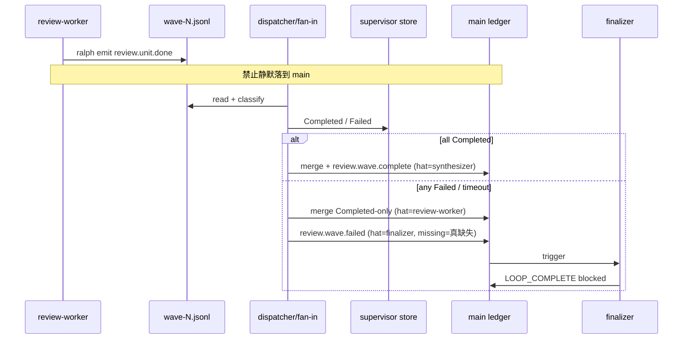
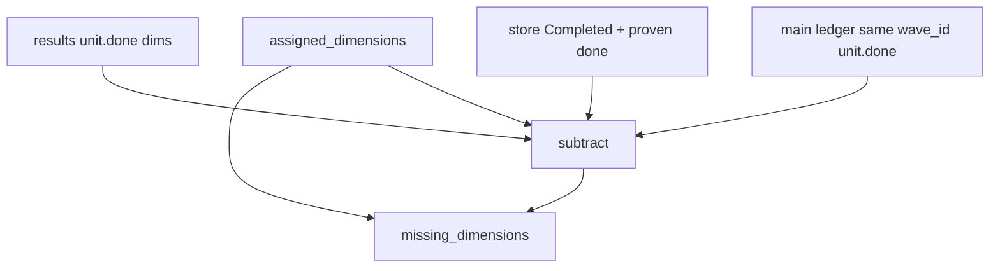

# fix: review wave 失败路径收敛（finalizer 归因、账本对账、emit 通道）

## Goal Capsule

把 `implementation-review`（及同构 Review 波次）的 **失败收敛** 修到可无人值守：`review.wave.failed` 正确唤醒 **finalizer** → 写出 `wave-blocked.md` → `LOOP_COMPLETE`；`missing_dimensions` 与 main ledger / store Completed 语义一致；worker 业务事件走 per-slot wave 通道，不再出现「main 已有 unit.done、store 却记 empty_worker_result」的双账本倒置。

**权威**：本文件 Product Contract + KTDs。  
**停止条件**：Verification Contract 全绿；Definition of Done 勾选；未宣称「能判断 LLM 是否还在思考」。  
**Product Contract preservation**：ce-plan-bootstrap；session-settled：归因用 finalizer（不新增 hat）；深修双账本；不做 Review 自动 retry（005 负责）。

**术语澄清（给人类）**：下文「失败载荷 / missing 列表」指 runtime 注入的 `review.wave.failed.payload.missing_dimensions` 与 `wave-*-slots.json`，**不是** `docs/report/*-diagnosis.md`。

---

## Product Contract

### Summary

事故 `primary-20260726-010305` 显示：六维文件已落盘、3 条 `review.unit.done` 已在 main，但 fan-in 注入的 `review.wave.failed` 把这 3 个维度标成 missing；协调事件 `hat=review-synthesizer`；synthesizer 被拉起并 CLI 重发 → `flow_unknown_emit`；finalizer 未写出 `wave-blocked.md`；约 5 分钟后人工 Quit。

根因链（源码已核对）：

1. **归因错误**：`append_supervisor_coord_event` 对一切 `review.wave.*` 硬编码 `review-synthesizer`；preset 却把 `review.wave.failed` 订给 `finalizer`。
2. **通道分裂**：`ralph emit` 未命中 per-slot wave 文件时落到 main；store/classify 读空槽文件 → `empty_worker_result`；`build_wave_failed_payload(Review)` 只看 `CompletedWave.results`，把已在 main 的维度报成 missing。
3. **失败不 merge**：`coordinator::fail_wave` 跳过 merge_sink；Completed 槽业务事件在 supervisor 路径上不会在 fail 时进 main（与 005 要做的 Exec salvage 同族缺口；本计划只修 Review 收敛，不抢 005 的 retry/redrive）。

### Requirements

- R1. `review.wave.failed` 系统注入记录的 `hat`/`source` **必须是 `finalizer`**（本 preset 唯一订户）；不得归因 `review-synthesizer`。不新增 hat。
- R2. `missing_dimensions` **不得**包含：同一 `wave_id` 下 main ledger 已有合格 `review.unit.done` 的维度，或 store 已 `Completed` 且 results 含合格 `review.unit.done` 的维度。
- R3. Review wave worker 在 isolated + `RALPH_WAVE_WORKER=1` 下，`ralph emit review.unit.done` **必须**写入 per-slot `wave-<id>-<idx>.jsonl`；若回落 main，必须留下可诊断信号（结构化 warn / recovery），不得静默。
- R4. Review 波次走 InjectedFailed 前，须把 **Completed 槽** 的业务事件（`completed.results` 内 `review.unit.done`）以 `hat=review-worker` merge 进 main；Failed 槽不得伪造成功 merge。仍注入 `review.wave.failed`（fail-closed，非 silent partial complete）。
- R5. finalizer 在收到 `review.wave.failed` 后写出 `wave-blocked.md` 并发恰好一条 `LOOP_COMPLETE{result:blocked,...}`；不得要求 synthesizer CLI emit 协调 topic。
- R6. 本计划 **不**实现 Review 自动 slot retry / `ralph wave redrive`（归 005）；**不**放宽 FlowStepScope 对手工 `unit.done` 的拒收。
- R7. 改 `build_wave_failed_payload` 时 **只动 `WaveKind::Review` 臂**；Exec/Fix 臂保持与 005 可并行合并（005 声明「review 仍用 missing_dimensions，勿破坏」）。
- R8. BDD 必须用真 EventLoop（`run_workflow_guard_scenario`），断言 events + 终态产物路径字段；禁止文案锁测 hat instructions。

### Actors

- A1. Wave dispatcher / fan-in（机制）
- A2. `ralph emit` 路径解析（机制）
- A3. `finalizer`（preset hat，失败终态 owner）
- A4. `review-worker` / `review-synthesizer`（不得成为 failed 协调事件的归因 hat）

### Key Flows

- F1. Partial / timeout → InjectedFailed → ledger 有 `review.wave.failed`（hat=finalizer）→ finalizer → `wave-blocked.md` + `LOOP_COMPLETE`。
- F2. Worker emit → per-slot 文件 → classify Completed → results 含 unit.done；不得在成功 emit 后记 `empty_worker_result`。
- F3. Fail 前 merge Completed-only → main 可见成功槽 unit.done；`missing_dimensions` 仅含真正缺失维度。
- F4. synthesizer 仅订 `review.wave.complete`；失败路径不得被拉起去 CLI emit `review.wave.failed`。

### Acceptance Examples

- AE1. Review fan-in InjectedFailed：JSONL 行 `hat`/`source` == `finalizer`，`system_injected` == true。
- AE2. 三槽 fixture：slot0/1 main 已有 unit.done（或 store Completed+results），slot2 Failed → `missing_dimensions` 仅含 slot2 维度。
- AE3. emit 环境对齐时 unit.done 写入 `wave-<id>-<idx>.jsonl`；故意错配 env 时不静默，有诊断。
- AE4. InjectedFailed 后 main 含 Completed 槽 unit.done（hat=review-worker），且仍有恰好一条 `review.wave.failed`。
- AE5. BDD：`review.wave.failed` → finalizer → `LOOP_COMPLETE`；`absent_events` 含 `review.wave.complete` / `review.synthesized`。
- AE6. 回归：Exec `build_wave_failed_payload` 既有断言仍绿；003/004 相关测名不红。

### Scope Boundaries

**在范围内**

- `append_supervisor_coord_event` Review failed 归因
- Review `missing_dimensions` 对账（store + results + 可选 main 回扫）
- Review worker emit → wave channel（003 残留缺口）
- Review InjectedFailed 前 Completed-only merge（dispatcher/fan-in 层，不抢 005 Exec SalvagedAndFailed 命名权）
- BDD + 表征测试 + preset/schema 仅当契约字段变更时同步
- finalizer instructions 中过时「默认归因 synthesizer」表述的同步（agent 视角：读 trigger，不复述内部函数名）

**非目标**

- Review/Exec 自动 retry、`attempt_count`、`ralph wave redrive`（005）
- 新增 `review-failure-handler` hat
- 放宽 FlowStepScope / 允许 hand-patch unit.done
- 调 `aggregate_timeout_secs` / worker timeout 默认值
- 改 synthesizer 成功路径聚合逻辑（除防止误激活 failed）

### Deferred to Follow-Up Work

- Review 与 Exec 完全同构的 coordinator `SalvagedAndFailed`（待 005 落地后迁移本计划 U5 的 dispatcher 层 merge）
- `task_resume_ttl_seconds` 对超长 wave 的 wave-scoped 豁免（本计划 U7 先表征决策）
- `fix.wave.failed` 误归因 `exec-failure-handler` 的独立清理（可在 U2 顺手修，若不触及本事故可 defer）

---

## Planning Contract

### 严格串行

```text
Unit 1 → Unit 2 → … → Unit 8
```

前一 Unit 的实现、测试、重构与回归全部完成后再开下一 Unit。禁止交替开发。

### Key Technical Decisions

- KTD1. **失败归因用 `finalizer`，不新增 hat**（session-settled: user-directed — chosen over `review-failure-handler`：preset 已订 failed，改动面更小）。
- KTD2. **深修双账本，不只改 missing 文案**（session-settled: user-directed — chosen over「只改 payload」：通道分裂不修会复发）。
- KTD3. **不做 Review 自动 retry**（session-settled: user-directed — chosen over「本计划含 retry」：005 已在做）。
- KTD4. **`append_supervisor_coord_event`：`review.wave.failed` → `finalizer`；`review.wave.complete` 仍 → `review-synthesizer`**。禁止继续用「整前缀 review.wave.* → synthesizer」。
- KTD5. **`missing_dimensions` 真相源**：`assigned_dimensions − (results 合格维度 ∪ store Completed 且可证明有 unit.done 的维度 ∪ 同 wave_id main 已有 unit.done 的维度)`。优先纯函数 + 传入 snapshot/ledger 视图；禁止只信空的 `completed.results`。
- KTD6. **emit 通道**：以 003 的 `is_wave_channel_path` / `resolve_emit_path` 为 SSOT；本计划补齐 Review worker 残留缺口 + **fallthrough 可观测**（structured diagnostic），不重写 003 已绿契约。
- KTD7. **Review fail 前 merge**：在 `run_supervisor_fan_in` InjectedFailed 臂（或紧邻）对 `WaveKind::Review` 将 `completed.results` 中合格事件 append 到 main，`hat`/`source`=`review-worker`；**不**引入 005 的 `SalvagedAndFailed` 枚举名（避免双轨）；005 落地后可迁移。
- KTD8. **FlowStepScope 保持 fail-closed**；协调 topic 仅系统注入。
- KTD9. **测试**：特征化先 Red；feature-bearing 用 `wave_supervisor` 集成 + scenarios BDD；禁止 hat instructions 文案锁测。
- KTD10. **depends_on 003/004；coordinates_with 005**：Review 臂与 Exec 臂编辑冲突时 Review 优先保 `missing_dimensions` 语义，Exec 字段扩展留给 005。

### Assumptions

- `implementation-review` 虽 `supervisor.enabled: false`，lazy bridge 仍会建 `supervisor.db` 并走 `run_supervisor_fan_in`（runner U3 / KTD-2）；本计划按 **supervisor fan-in 真路径** 验收，不假装 legacy `merge_wave_results_to_events_file` 是主路径。
- finalizer `event_filter` 已含 `review.wave.failed`；归因改对后调度应能唤醒 finalizer（若仍不唤醒，在 U2 加深 hat selection，不得静默降级）。
- 003 主体已合或本分支可依赖其 allowlist；本计划只补残留。

### High-Level Technical Design





### Alternative Approaches Considered

| 方案 | 结论 |
|---|---|
| 新增 `review-failure-handler` hat | 拒（用户选 A）：preset 已有 finalizer |
| 只改 hat 字符串、不修通道 | 拒：双账本会复发 |
| 本计划含 Review 自动 retry | 拒：005 在做 |
| fail 时 main 全量回扫替代 emit 修复 | 拒作唯一手段：可作 U4 加固，不能替代 U3 |
| 等 005 SalvagedAndFailed 再修 Review merge | 部分采纳：本计划用 dispatcher 层最小 merge；005 后可迁移 |

### Patterns to Follow

- Fan-in：`crates/ralph-cli/src/loop_runner/wave/dispatcher.rs` `run_supervisor_fan_in` / `append_supervisor_coord_event` / `build_wave_failed_payload`
- Emit 通道：`crates/ralph-cli/src/cli/emit_path.rs` `is_wave_channel_path`；`commands/emit.rs` wave worker env
- Classify：`crates/ralph-core/src/supervisor/worker_outcome.rs`
- Merge sink：`crates/ralph-core/src/supervisor/merge_sink.rs` `FileEventMergeSink`
- 测试 fixture：`crates/ralph-cli/src/loop_runner/tests/wave_supervisor.rs` `make_u6_completed` 旁新增 Review helper
- BDD：`crates/ralph-core/tests/scenarios/implementation_review_fan_in.yml` 扩展或新 `implementation_review_wave_failed.yml` + `run_workflow_guard_scenario`

---

## 1. 功能目标

### 业务目标

- Review 波次失败后无人值守收敛到 `LOOP_COMPLETE(blocked)`。
- Operator / 下游看到的 `missing_dimensions` 与真实完成情况一致。
- 成功维度的业务事件在失败波次后仍可在 main 对账。

### 本次范围

见 Product Contract Requirements R1–R8。

### 非目标

见 Scope Boundaries。

### 已知约束和假设

- HARD RULE：`cargo nextest`；hat env scrub；preset/schema 下游清单；skill 去计划化；禁止 instructions 文案锁测。
- lazy supervisor bridge 对 `implementation-review` 生效。
- 005 并行：勿改 Exec payload 扩展语义。

---

## 2. BDD 行为规格

```gherkin
Feature: Review wave failure converges to finalizer
  Review waves must fail-closed with correct ledger attribution,
  truthful missing_dimensions, and Completed-slot salvage into main.

  Background:
    Given builtin implementation-review topology
    And supervisor fan-in path is active for waves
    And review-worker concurrency is 6

  Scenario: S1 Happy — failed wave wakes finalizer not synthesizer
    Given a review wave reaches InjectedFailed
    When the runtime appends review.wave.failed
    Then the ledger record has hat=finalizer and source=finalizer
    And system_injected is true
    And finalizer activates and emits LOOP_COMPLETE with result blocked
    And review-synthesizer does not CLI-emit review.wave.failed

  Scenario: S2 Illegal — missing_dimensions omits already-done dimensions
    Given wave_id W with assigned six dimensions
    And main ledger already has review.unit.done for goal-alignment and correctness
    And store marks maintainability Failed empty_worker_result
    When build_wave_failed_payload Review runs
    Then missing_dimensions does not include goal-alignment or correctness

  Scenario: S3 Boundary — emit hits wave channel when env aligned
    Given RALPH_WAVE_WORKER=1 and matching WAVE_ID/INDEX and isolated hat
    When review-worker emits review.unit.done
    Then the event is appended to .ralph/wave-<id>-<idx>.jsonl
    And classify does not record empty_worker_result solely due to main fallthrough

  Scenario: S4 Illegal — emit fallthrough is observable
    Given wave env signals are misaligned
    When emit would fall through to main events file
    Then a structured diagnostic is recorded naming which signal missed
    And the fallthrough is not silent

  Scenario: S5 State — Completed slots merge before failed coord event
    Given slot 2 Completed with review.unit.done in results
    And slot 0 Failed
    When fan-in takes InjectedFailed for Review
    Then main ledger contains slot 2 review.unit.done with hat=review-worker
    And exactly one review.wave.failed is appended
    And review.wave.complete is absent

  Scenario: S6 Recovery — FlowStepScope still rejects hand-patched unit.done
    Given the loop is after review.wave.failed
    When an operator CLI-emits review.unit.done outside worker/system path
    Then FlowStepScope or policy rejects with flow_unknown_emit or equivalent

  Scenario: S7 Outside-In — BDD wave failed to LOOP_COMPLETE
    Given mock chain that injects review.wave.failed with missing_dimensions
    When the workflow guard scenario runs
    Then expected.events include review.wave.failed and LOOP_COMPLETE
    And wave-blocked artifact_path is present on LOOP_COMPLETE payload
    And review.synthesized is absent
```

---

## 3. 验收与测试策略

| Scenario | 验收条件 | 推荐测试层级 | 是否需要 E2E |
|---|---|---|---|
| S1 Happy finalizer 归因 | hat/source=finalizer；无 synthesizer CLI failed | 集成 `wave_supervisor` | 否 |
| S2 missing 对账 | 已 done 维度 ∉ missing | 单元 `build_wave_failed_payload` + 集成 | 否 |
| S3 emit 通道 | 写入 per-slot 文件 | 集成 emit_path / emit | 否 |
| S4 fallthrough 可观测 | diagnostic 含 miss 原因 | 单元/集成 | 否 |
| S5 Completed merge | main 有 unit.done + failed coord | 集成 fan-in | 否 |
| S6 FlowStepScope | 拒收手补 | 既有表征 + 可选提示 | 否 |
| S7 BDD Outside-In | events 序列 + LOOP_COMPLETE | BDD `run_workflow_guard_scenario` | 否 |

---

## 4. 需求—测试追踪矩阵

| 需求 | Scenario | 验收测试 | 单元测试 | 集成/契约测试 | E2E |
|---|---|---|---|---|---|
| R1 归因 finalizer | S1 | ATDD fan-in ledger | append hat 表驱动 | wave_supervisor | 否 |
| R2 missing 对账 | S2 | ATDD payload | build_wave_failed_payload Review | fan-in | 否 |
| R3 emit 通道 | S3 | ATDD channel file | is_wave_channel_path | emit 集成 | 否 |
| R3/R 诊断 | S4 | diagnostic 断言 | resolve_emit_path | emit | 否 |
| R4 fail 前 merge | S5 | ledger + failed | — | run_supervisor_fan_in | 否 |
| R5 finalizer 收敛 | S1,S7 | BDD + 集成 | — | scenarios | 否 |
| R6 不抢 005 | — | 无 retry API 新增 | — | diff 审查 | 否 |
| R7 只动 Review 臂 | AE6 | Exec 臂既有测绿 | Exec payload 测 | — | 否 |
| R8 BDD 真 runner | S7 | workflow_guard | — | scenarios | 否 |
| R FlowStepScope | S6 | 表征 | flow_step_scope | — | 否 |

---

## Implementation Units

### U1. Characterization：钉死今日 Review failed 归因与 missing 倒置

- **Unit 目标**：用失败测试证明 (a) `review.wave.failed` 今日 `hat=review-synthesizer`；(b) results 空但 main/assigned 已有 done 时 missing 仍含该维。
- **对应 Scenario**：S1/S2 的 Red 前置。
- **外部可观察结果**：新测在修复前 Red，名称含 `review_wave_failed` / `missing_dimensions`。
- **输入与输出**：Review-kind `CompletedWave` fixture（`assigned_dimensions` 填满）；临时 main ledger。
- **可依赖**：既有 `make_u6_completed` 模式；003/004 测基础设施。
- **禁止依赖**：生产归因修改、payload 修改、005 API。
- **Files**：`crates/ralph-cli/src/loop_runner/tests/wave_supervisor.rs`（新增 `make_review_completed` + 测）；必要时 `dispatcher.rs` 旁 `#[cfg(test)]` 表驱动。
- **验收测试**：ATDD 两则（归因 + missing）。
- **需要拆分的单元测试**：无（本 Unit 纯表征 Red）。
- **Red 预期失败原因**：硬编码 synthesizer；missing = assigned − results（忽略 main）。
- **最小实现范围**：只加测试 + Review fixture helper。
- **集成验证**：`cargo nextest run -p ralph-cli -- review_wave_failed`（或全名）。
- **回归范围**：既有 Exec fan-in 测仍绿。
- **完成标准**：Red 稳定可复现。
- **风险**：fixture 必须走 `run_supervisor_fan_in` 真路径，避免假绿。
- **Execution note**：characterization-first；先提交 Red。

### U2. 归因：`review.wave.failed` → `finalizer`

- **Unit 目标**：实现 KTD4；翻转 U1 归因断言。
- **对应 Scenario**：S1。
- **外部可观察结果**：InjectedFailed 写入的 JSONL `hat`/`source` == `finalizer`。
- **输入与输出**：topic 字符串 → hat 字符串。
- **可依赖**：U1 Red。
- **禁止依赖**：missing 算法、emit 通道、005。
- **Files**：`crates/ralph-cli/src/loop_runner/wave/dispatcher.rs`（`append_supervisor_coord_event`）；U1 测试转绿；同步 `presets/en/implementation-review.yml` finalizer Step 0 中「默认归因 synthesizer」过时表述（agent 视角：说明 trigger 来自 runtime，**不要**写内部函数名）。
- **验收测试**：U1 归因测转绿；表驱动 complete→synthesizer / failed→finalizer。
- **需要拆分的单元测试**：topic→hat 纯函数若抽出则单测。
- **Red 预期**：U1。
- **最小实现范围**：拆分 `review.wave.complete` vs `review.wave.failed` 分支；可选顺手修 `fix.wave.failed` 误指向（若改动 ≤5 行且有测）；否则记 Deferred。
- **集成验证**：wave_supervisor Review failed。
- **回归范围**：Exec/Fix 归因测；complete 路径 synthesizer 不变。
- **完成标准**：AE1 绿；若 finalizer 仍不激活，加深 hat selection 证据并修到激活（不得只改字符串假装完成）。
- **风险**：`system_injected` 已绕过 scope；若调度仍偏 source hat，需查 EventBus / hat 选择，而不是再改 preset 加 hat。

### U3. Emit 通道：Review worker 写入 per-slot + fallthrough 可观测

- **Unit 目标**：堵住「成功写 main、槽文件空 → empty_worker_result」的根因（KTD2/KTD6）；实现 S3/S4。
- **对应 Scenario**：S3, S4。
- **外部可观察结果**：对齐 env 时事件在 `wave-*.jsonl`；错配时 recovery/日志可指出 miss 信号。
- **输入与输出**：emit path 解析；worker env。
- **可依赖**：003 已有 `is_wave_channel_path`；U1/U2。
- **禁止依赖**：missing 公式、fail merge、005 retry。
- **Files**：`crates/ralph-cli/src/cli/emit_path.rs`；`crates/ralph-cli/src/commands/emit.rs`；相关集成测（`common::ralph_bin` scrub）；dispatcher 设 env 与 path 一致性检查（若缺口在派发侧）。
- **验收测试**：emit 集成：对齐 → channel 文件非空；错配 → diagnostic。
- **需要拆分的单元测试**：`is_wave_channel_path` 真值表补行（id/idx/父目录/isolated/hat）。
- **Red 预期**：今日错配静默落 main 或 Review worker 仍 miss channel。
- **最小实现范围**：修残留对齐 + 结构化诊断；**不**重写 003 allowlist 成功契约。
- **集成验证**：`cargo nextest run -p ralph-cli -- emit` / wave channel 相关。
- **回归范围**：003 既有 emit channel 测全绿；污染复跑 scrub。
- **完成标准**：AE3；人为制造「只写 main」路径在测试中要么不可能、要么必有诊断。
- **风险**：worktree / `Path::new(".")` diagnostics 根；emit 与 fan-in 的 workspace_root 必须一致。

### U4. `missing_dimensions` 对账（Review 臂 only）

- **Unit 目标**：实现 KTD5；翻转 U1 missing 断言。
- **对应 Scenario**：S2。
- **外部可观察结果**：payload.missing_dimensions 与「真缺失」一致。
- **输入与输出**：`CompletedWave` + store snapshot + 可选 main ledger 视图 → JSON。
- **可依赖**：U1, U3（通道修好后 results 更可信；main 回扫仍作加固）。
- **禁止依赖**：005 Exec 字段；改 Exec/Fix 臂。
- **Files**：`crates/ralph-cli/src/loop_runner/wave/dispatcher.rs`（`build_wave_failed_payload` Review 臂；InjectedFailed 臂传入 snapshot）；纯函数可抽到同文件或小模块；单元表驱动。
- **验收测试**：U1 missing 测转绿；表驱动：results-only / store-Completed / main-backscan / 组合。
- **需要拆分的单元测试**：`compute_missing_dimensions(...)` 纯函数。
- **Red 预期**：U1 missing。
- **最小实现范围**：只改 Review 臂；Exec 臂 byte-level 行为不变（既有测钉死）。
- **集成验证**：fan-in Review partial failure。
- **回归范围**：`u6_build_wave_failed_payload_exec_*`；005 若已合的 Exec 扩展断言。
- **完成标准**：AE2；同 wave_id 已 done 维度永不进 missing。
- **风险**：main 回扫须限定 wave_id + topic + dimension，避免跨波污染；性能：单次失败路径可读尾部/索引，禁止全库盲扫。

### U5. Review InjectedFailed 前 Completed-only merge

- **Unit 目标**：实现 R4/KTD7；失败波次 main 仍可见成功槽。
- **对应 Scenario**：S5。
- **外部可观察结果**：InjectedFailed 后 main 有 Completed 槽 `review.unit.done`（hat=review-worker）；仍有 failed coord；无 complete。
- **输入与输出**：`completed.results` → merge_sink / 文件 append。
- **可依赖**：U3（results 非空）、U4。
- **禁止依赖**：005 `SalvagedAndFailed` 枚举、retry、redrive。
- **Files**：`crates/ralph-cli/src/loop_runner/wave/dispatcher.rs`（`run_supervisor_fan_in` InjectedFailed 臂 Review 分支）；必要时复用 `FileEventMergeSink` 或安全 append helper；`wave_supervisor.rs` ATDD。
- **验收测试**：partial failure：Completed 事件在 failed 之前或同批可见；hat=review-worker；无 double-append（幂等或 mark）。
- **需要拆分的单元测试**：过滤 Completed-only 事件列表纯函数。
- **Red 预期**：今日 `fail_wave` 跳过 merge，main 无 Completed 事件（当事件仅在 results 时）。
- **最小实现范围**：Review-kind only；Failed 槽不 merge 伪造成功。
- **集成验证**：wave_supervisor Review salvage-before-fail。
- **回归范围**：Exec partial failure 既有「无 complete」断言仍成立；不破坏 005 将加的 Exec salvage 测。
- **完成标准**：AE4。
- **风险**：与 005 U6 合并冲突 —— 本 Unit 注释标明「dispatcher 层临时；005 SalvagedAndFailed 后迁移」；merge 归因禁止 `review-dispatcher`。

### U6. BDD Outside-In：`review.wave.failed` → finalizer → `LOOP_COMPLETE`

- **Unit 目标**：真 EventLoop 锁定 F1/S7。
- **对应 Scenario**：S7。
- **外部可观察结果**：`expected.events` 序列；`LOOP_COMPLETE`；无 synthesizer 成功链。
- **输入与输出**：`crates/ralph-core/tests/scenarios/implementation_review_wave_failed.yml`（或扩展 fan_in）；`scenarios.rs` 注册。
- **可依赖**：U2–U5。
- **禁止依赖**：live API；`run_scenario` stub。
- **Files**：scenarios yml + `scenarios.rs`；scenario 内 `event_policy.schemas` 补 `review.wave.failed` 若缺失。
- **验收测试**：`cargo nextest run -p ralph-core --test scenarios -- implementation_review_wave_failed`（名以注册为准）。
- **需要拆分的单元测试**：无。
- **Red 预期**：缺 failed→finalizer 链或归因错误。
- **最小实现范围**：一条 Outside-In 场景；mock 走真实 fan-in/注入语义。
- **集成验证**：scenarios。
- **回归范围**：既有 `implementation_review_*` 三场景。
- **完成标准**：AE5；HARD RULE：`run_workflow_guard_scenario`。
- **风险**：假绿 mock；必须断言 events 而非 iterations。

### U7. TTL / 超长 wave 与 rejection recovery 表征决策

- **Unit 目标**：钉死「wave > `task_resume_ttl_seconds` 时早期槽 rejection 的 task.resume 不可达」；记录产品决策（保持 / wave-scoped 豁免）。
- **对应 Scenario**：边界（与 S4/S5 相关的恢复路径）。
- **外部可观察结果**：表征测或文档决策写入本 plan Appendix / solutions 短文；若选豁免则最小实现 + 测。
- **输入与输出**：rejection ts vs ttl。
- **可依赖**：U2–U5 行为稳定。
- **禁止依赖**：放宽 FlowStepScope。
- **Files**：`crates/ralph-core/src/event_loop/mod.rs`（`is_rejection_stale` 调用点）——仅当决策为改行为时改；否则只加测/文档。
- **验收测试**：ttl 边界表驱动或集成。
- **需要拆分的单元测试**：`is_rejection_stale` 已有则扩展。
- **Red 预期**：若改行为，先 Red。
- **最小实现范围**：默认倾向 **保持 300s + 文档化**（失败收敛已不依赖 stale resume）；仅当 U2 后仍依赖 resume 才改豁免。
- **集成验证**：相关 event_loop 测。
- **回归范围**：isolated TTL 既有测。
- **完成标准**：决策写明；无隐式假设。
- **风险**：不要为修 resume 而放宽 scope。

### U8. 回归门禁 + skill/preset 漂移同步

- **Unit 目标**：全量门禁；instructions/schema 与行为一致；无计划号泄漏进 `ralph-tools*.md`。
- **对应 Scenario**：横切。
- **外部可观察结果**：`./scripts/run-tests.sh` 绿；preset_lint 相关绿；`scripts/check-cli-doc-drift.sh` 若触及 CLI。
- **输入与输出**：preset/schema 仅必要同步；solutions 可选短文记录「review failed 归因 finalizer」。
- **可依赖**：U1–U7。
- **禁止依赖**：新功能。
- **Files**：`presets/en/implementation-review.yml` / `presets/schemas/implementation-review.yml`（若字段变更）；测试；可选 `docs/solutions/...`。
- **验收测试**：全量脚本；`cargo nextest run -p ralph-cli --bin ralph -- preset_lint` + presets；`cargo nextest run -p ralph-core -- preset_lint`。
- **需要拆分的单元测试**：无。
- **Red 预期**：漂移则修。
- **最小实现范围**：同步清单勾选；删除临时 scratch。
- **集成验证**：`./scripts/run-tests.sh`。
- **回归范围**：003/004/005 相关测；partial_timeout phase2。
- **完成标准**：DoD 全局勾选；剩余风险写入报告。
- **风险**：勿把 plan id 写入注入 skill。

---

## Verification Contract

- 子集（开发中）：
  - `cargo nextest run -p ralph-cli -- review_wave_failed`
  - `cargo nextest run -p ralph-cli -- wave_supervisor`
  - `cargo nextest run -p ralph-cli -- emit`
  - `cargo nextest run -p ralph-core --test scenarios -- implementation_review`
  - `cargo nextest run -p ralph-cli --bin ralph -- preset_lint`
  - `cargo nextest run -p ralph-core -- preset_lint`
- 污染复跑（改 CLI spawn 测后）：`RALPH_CURRENT_HAT=review-worker RALPH_EVENTS_FILE=/tmp/x.jsonl cargo nextest run -p ralph-cli --test <related>`
- 最终：`./scripts/run-tests.sh`（禁止裸 `cargo nextest run --workspace` 替代）
- Lint/format：`cargo fmt`；`cargo clippy`（工作区惯例）

---

## Definition of Done

### 全局

- [ ] Scenario S1–S7 有对应用例且绿
- [ ] AE1–AE6 满足
- [ ] 003/004 回归不红；Exec `build_wave_failed_payload` 既有断言绿
- [ ] 未新增 Review 自动 retry / redrive（005 边界）
- [ ] 未新增 hat
- [ ] `./scripts/run-tests.sh` 绿
- [ ] 无新增 ignore/skip；无削弱断言换绿
- [ ] 未验证项与剩余风险已记录（005 迁移 SalvagedAndFailed、TTL 豁免）

### 每 Unit

- [ ] ATDD/单元 Red→Green→Refactor 完成
- [ ] 集成与回归范围已跑
- [ ] 完成标准勾选后才进入下一 Unit

---

## System-Wide Impact

- **Runtime**：所有走 supervisor fan-in 的 Review 波次（含 lazy bridge 的 `implementation-review`）。
- **Preset**：`implementation-review` finalizer 文案；schema 仅当 required_fields 变更。
- **005 并行**：Review 臂与 Exec 臂分离编辑；dispatcher 层 merge 标注临时。

## Risk Analysis & Mitigation

| 风险 | 缓解 |
|---|---|
| 只改 hat 不修通道 → 复发 | U3 强制；U4 双重对账 |
| 与 005 合并冲突 | KTD10；只动 Review 臂；U5 不抢枚举名 |
| finalizer 仍不激活 | U2 完成标准含激活证据 |
| main 回扫误伤跨 wave | 强制 wave_id+topic+dimension |
| 假绿 BDD | 禁止 stub runner |
| synthesizer 仍被误激活 | 归因 + BDD absent_events |

## Sources & Research

- 诊断：`docs/report/2026-07-26-implementation-review-primary-20260726-010305-diagnosis.md`
- 源码：`dispatcher.rs` `append_supervisor_coord_event` / `build_wave_failed_payload` / `run_supervisor_fan_in`；`emit_path.rs`；`coordinator::fail_wave`；`worker_outcome.rs`
- 计划：003 emit channel；004 timeout diagnostics；005 salvage/redrive（Review retry Deferred）
- 对抗审核结论：P0 = 错归因 + 通道分裂导致 missing 倒置；FlowStepScope 拒的是 synthesizer CLI 重发，不是系统注入本身

## Execution Direction

各 feature-bearing Unit **characterization / test-first**。U1 先 Red。涉及 legacy fan-in 时先表征再改行为。严格串行 U1→U8。

---

## Appendix：与人类确认的范围（session）

- 归因：**finalizer**（不新增 hat）
- 「报告」澄清：指 `missing_dimensions` 失败载荷，不是诊断 markdown
- 自动 retry：**不做**（005 已在做）
- 深度：通道 + 对账 + fail 前 merge + 终态收敛
