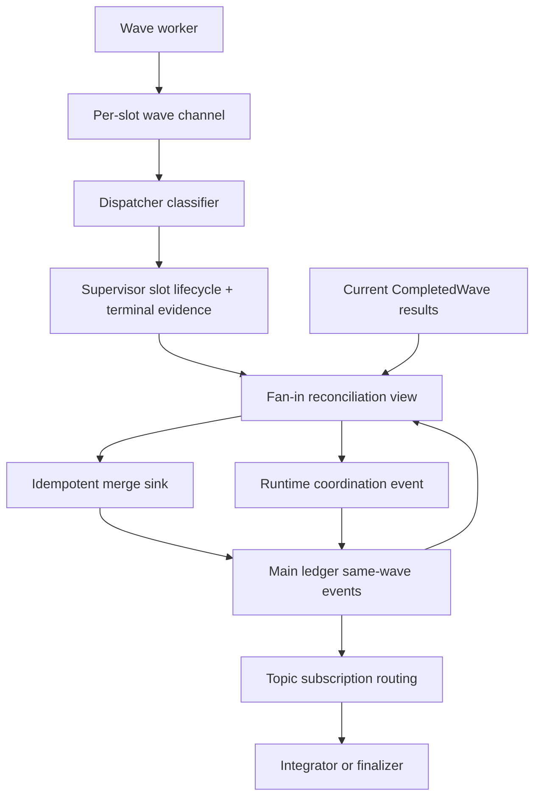
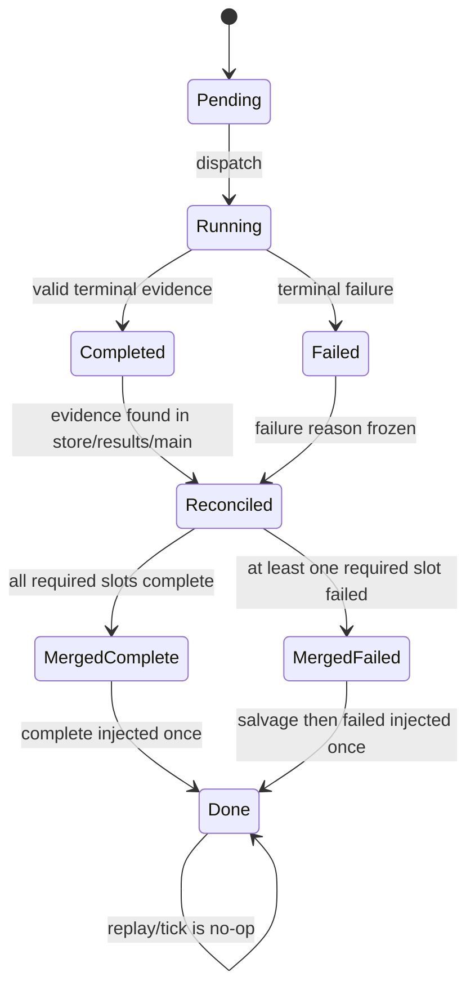
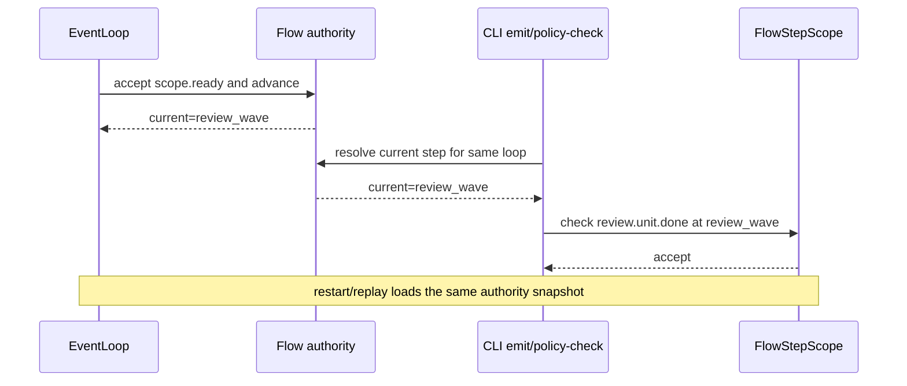

# fix: Supervisor/Wave 统一账本、事件归属与 Flow Authority 闭环

## Goal Capsule

- **目标：**先从通用机制层闭合 Supervisor/Wave 的失败 fan-in、事件 provenance 和 flow step authority，再让 `implementation-review` preset 使用该机制并以真实 runtime 场景证明失败波次可无人值守收敛。
- **权威顺序：**本文件 Product Contract 与 Key Technical Decisions > 来源诊断报告 > 既有 003/004/005 计划中未被当前源码证明的实现描述。
- **执行方式：**严格串行 `U1 → U2 → … → U10`；每个 Unit 完成 Red → Green → Refactor、集成验证和受影响回归后才能进入下一 Unit。
- **停止条件：**Verification Contract 全绿；main ledger、Supervisor store 与 fan-in 输出可对账；worker 事件不再错误归因 dispatcher；EventLoop 与 CLI policy-check 对同一 loop 使用同一 flow step；`implementation-review` 失败主路径产生真实 `LOOP_COMPLETE(result=blocked)`。
- **Product Contract preservation：**直接由本轮讨论建立。用户明确要求先修通用机制，再让 `implementation-review` preset 跟进使用；不接受只修 preset 或只改 payload 文案。

---

## Product Contract

### Summary

当前 Supervisor/Wave 已具备并发调度、slot 状态、fan-in、main ledger、系统协调事件和 FlowStepScope 等骨架，但复杂失败路径存在三套未闭合的契约：

1. `CompletedWave.results`、Supervisor store 与 main ledger 分别持有部分完成事实，`run_supervisor_fan_in` 生产路径仍把 `ReviewDoneHints` 传为 `None`，使 `missing_dimensions` 虚高。
2. worker 业务事件进入或回读 main ledger 时可能缺失真实 `hat/source`，随后继承当前 `review-dispatcher` activation，触发错误的 `isolated_scope_violation`。
3. 主 EventLoop 已有 `advance_plan_step`，但 CLI emit/policy-check 或重建的 gate context 可能重新使用首 step，导致路由已进入 `review_wave` 而 FlowStepScope 仍按 `scope_freeze` 拒收。

本计划把这些问题视为通用机制缺口。`implementation-review` 只负责声明业务拓扑和消费机制输出，不承担账本对账、runtime 事件生产或 flow 状态补丁。

### Problem Frame

事故 `primary-20260726-033717` 中，main ledger 已有四条 `review.unit.done`，fan-in 却只认出一个 Completed result，并将五个维度写入 `missing_dimensions`。两条缺少稳定 provenance 的 worker 事件在 dispatcher activation 中被归到 `review-dispatcher`，受到 isolated scope 拒绝。另有两条 worker 事件和 runtime 注入的 `review.wave.failed` 被 FlowStepScope 以 `flow_unknown_emit` 拒绝，尽管 `scope.ready` 已经唤醒 review dispatcher。最终 synthesizer、fix planner 和 finalizer 没有形成可靠闭环。

### Requirements

**Mechanism truth and fan-in**

- R1. Review fan-in 必须通过一个统一 reconciliation 视图计算完成维度，输入至少覆盖当前 `CompletedWave.results`、Supervisor store 的 slot terminal 状态与可验证事件证据、同一 `wave_id` 的 main ledger 业务事件。
- R2. `missing_dimensions` 必须等于已分配维度减去可证明完成的维度；仅有 `Completed` 状态但无合格 terminal event 证据不得被当作完成，已在 main ledger 的合格事件不得再次算 missing。
- R3. failed/salvage fan-in 必须先幂等合并真实 Completed 槽事件，再追加恰好一条 `*.wave.failed`；重放、重启或重复 tick 不得重复业务事件或协调事件。

**Event provenance and routing**

- R4. 业务事件的 `hat/source` 必须始终表示真实生产者。wave channel、Supervisor store、merge sink 和 main-ledger replay 不得用当前 dispatcher 或下游消费者覆盖 producer provenance。
- R5. runtime 生成的 `*.wave.complete` / `*.wave.failed` 必须明确区分系统生产者与目标消费者。消费者由 topic、trigger 与 event filter 路由，不得通过伪装成消费者发布事件来满足权限检查。
- R6. isolated scope 对普通 agent 业务事件继续 fail-closed；`system_injected` 只允许受控的 runtime coordination topic，不能成为任意业务事件绕过 publishes 的通道。

**Flow authority**

- R7. 同一 loop 的当前 flow step 必须有单一、可恢复的 authority。主 EventLoop、JSONL replay、CLI emit apply 和 CLI `--policy-check` 必须读取相同 step 语义，不能各自从 flow 首 step 初始化。
- R8. flow transition 必须由已接受的声明事件驱动，并满足幂等、顺序与重启恢复约束；不允许用扩大 `allowed_emits` 或新增临时 bypass 掩盖 step 漂移。

**Preset adoption**

- R9. `implementation-review` 必须只声明 `scope_freeze → review_wave → synth_await/finalize` 业务拓扑、hat triggers/publishes 和 schema；不得承担 runtime coordination event 的 producer 权限。
- R10. `implementation-review` 的失败路径必须在真实 EventLoop + Supervisor fan-in 场景中完成：保留已完成维度、仅报告真实缺失维度、唤醒 finalizer、写 blocked artifact，并产生恰好一条 `LOOP_COMPLETE(result=blocked)`。
- R11. 所有机制和 preset 变更必须同步 agent 可见 skill guide、preset operator skills 与静态 drift 校验；文档必须描述 agent 可执行动作，不泄漏内部账本路径或实现函数。

### Actors

- A1. Wave worker：产生 slot-scoped 业务 terminal event。
- A2. Wave dispatcher / Supervisor bridge：登记、收集和 fan-in。
- A3. Supervisor store：保存 slot lifecycle 与可验证 terminal evidence。
- A4. Main event ledger / merge sink：保存已发布业务事件与 runtime coordination event。
- A5. EventLoop / FlowStepScope / CLI policy-check：使用同一个 flow authority 判定当前 step。
- A6. `implementation-review` hats：dispatcher、worker、synthesizer、finalizer，作为机制消费者。
- A7. Operator：通过诊断与最终 artifact 判断真实完成或阻塞状态。

### Key Flows

- F1. Worker terminal → wave channel → Supervisor terminal evidence → reconciliation → main merge → complete/failed coordination event。
- F2. 部分 Completed + 部分 Failed → Completed-only salvage → truthful `missing_dimensions` → finalizer → blocked artifact → `LOOP_COMPLETE`。
- F3. `scope.ready` 被接受 → flow authority 推进到 `review_wave` → 后续 worker 和 coordination event 在 EventLoop、replay 与 CLI policy-check 中得到一致判定。
- F4. 重放或重复 fan-in → reconciliation 得到相同结果 → merge/injection no-op → main ledger 不产生重复。
- F5. 非 runtime 调用方伪造 `system_injected` 或 worker 手工跨 step emit → origin/scope gate 拒绝并留下结构化诊断。

### Acceptance Examples

- AE1. 六维 Review wave 中 main 已有四个合格 done、store 有一个相同证据、一个槽真实失败，最终 `missing_dimensions` 只包含失败槽维度。
- AE2. worker event 缺显式 `hat/source` 进入 wave merge 前被补为实际 target worker；回读时不继承 `review-dispatcher`。
- AE3. runtime 注入 `review.wave.failed` 时记录系统 producer 与 `target_hat=finalizer` 的等价信息；finalizer 无需在 `publishes` 中声明 `review.wave.failed`。
- AE4. `scope.ready` 后，独立 CLI policy-check 对 `review.unit.done` 的 step 判定与常驻 EventLoop 一致；重启恢复后仍一致。
- AE5. 同一 failed fan-in 连续执行两次，main ledger 的 Completed 业务事件和 `review.wave.failed` 均只有一份。
- AE6. 真实 `implementation-review` 失败场景不出现 `isolated_scope_violation` / `flow_unknown_emit`，产生 `wave-blocked.md` 和单一 blocked 终态。

### Scope Boundaries

**本次范围**

- Review、Exec、Fix 共用的 fan-in evidence/reconciliation、merge 幂等与 coordination provenance 基础契约。
- 当前 Supervisor store/bridge 上满足该契约所需的最小持久化或查询能力，包括 memory 与 rusqlite 实现的 parity。
- flow step authority 在 EventLoop、JSONL ingest/replay、CLI emit apply/policy-check 之间的一致读取与恢复。
- `implementation-review` preset/schema 对新机制契约的接入。
- 真实 runtime BDD、state-machine、idempotency、contract 和 regression 测试。
- agent skill guide、preset author/review operator skill 与 drift 文档同步。

**非目标**

- 修改 Review 维度数量或评审内容。
- 调整 worker/aggregate timeout 数值。
- 新增 `review-failure-handler`。
- 允许 operator 手工补写 `review.unit.done`。
- 重做整个 EventBus、HatRegistry 或 isolated execution model。
- 在本计划内新增 UI、dashboard 或跨 loop 自动续跑。

### Deferred to Follow-Up Work

- 跨 loop 的 operator redrive UX 和 dashboard 可视化。
- 历史 main ledger 的离线迁移或批量修复；本计划只保证新写入与当前 loop 恢复。
- 与本事故无关的 stale `task.resume` TTL 策略调整。

---

## Planning Contract

### Key Technical Decisions

- KTD1. **机制优先、preset 后接入。**（session-settled: user-directed — chosen over 只修 `implementation-review`：当前缺口属于 Supervisor/Wave 通用失败路径，preset 补丁会在其他 wave 复发。）
- KTD2. **统一 reconciliation，不把 main ledger 或 store 单独升级为万能账本。** Store 权威描述 slot lifecycle 与 terminal evidence，main ledger 权威描述已发布事件；fan-in 通过确定性视图对账，避免再造第四套持久状态。
- KTD3. **Completed 必须有事件证据。** Store 的 `Completed` 状态只有在关联 terminal evidence 可验证时才参与业务完成集合；仅凭状态位不得制造 silent success。
- KTD4. **producer 与 consumer 分离。** `hat/source` 保留 producer provenance；runtime coordination event 使用明确的系统来源，并以独立 target metadata 或既有 topic subscription 表达消费者。禁止继续把 consumer hat 当 producer。
- KTD5. **单一 flow authority。** 优先复用并扩展已有 flow lifecycle/state snapshot 能力，不新增只服务 `implementation-review` 的 step 文件或环境变量。CLI policy-check 在无法取得 live/recovered authority 时必须明确失败或返回不可判定，不得静默回到首 step。
- KTD6. **失败路径与成功路径共享 merge/idempotency 语义。** Review 的 dispatcher 层临时 Completed-only merge 应迁入或复用 Supervisor coordinator/merge sink 的通用能力，避免 Review、Exec、Fix 三套分支长期漂移。
- KTD7. **权限保持 fail-closed。** 不给 `finalizer.publishes` 增加 `review.wave.failed`，不扩大 `scope_freeze.allowed_emits`，不增加事故专用 `DEFENSIVE_BYPASS`。
- KTD8. **Outside-In 测试必须穿过生产调用点。** 纯 helper 测试只能补充规则，不能作为 fan-in、flow transition 或 preset 收敛的唯一证明。
- KTD9. **先 characterization 后替换。** 旧路径已有多轮事故和临时兼容逻辑，任何重构前先钉死当前正确行为与本次错误行为，替换时使用 memory/rusqlite differential tests。

### High-Level Technical Design







### Assumptions

- 已有 `SupervisorBridge::fan_in_status`、memory/rusqlite stores、merge sink、`current_plan_step`、`advance_plan_step` 和 flow lifecycle 可作为扩展起点；Executor 必须先复核接口，不得凭计划中的概念名直接创建平行实现。
- 计划 005 若已提供 `SalvagedAndFailed` 或等价 coordinator 能力，应迁移 Review 临时分支到该能力；若尚未完成，只实现本计划所需的最小通用纵向切片，不重复实现 retry/redrive。
- coordination event 的最终字段形状须结合 `ralph_proto::Event` 当前兼容面确定；计划要求语义分离，不预写具体字段或破坏性迁移方案。
- 外部研究不会改变本计划方向；仓内已有足够的 Supervisor、Wave、FlowStepScope 和事故复盘模式，因此不引入外部框架或新依赖。

### Patterns to Follow

- Supervisor state and bridge：`crates/ralph-core/src/supervisor/mod.rs`、`crates/ralph-core/src/supervisor/bridge.rs`、`crates/ralph-core/src/supervisor/memory.rs`、`crates/ralph-core/src/supervisor/rusqlite.rs`
- Coordinator and merge：`crates/ralph-core/src/supervisor/coordinator.rs`、`crates/ralph-core/src/supervisor/merge_sink.rs`
- Wave fan-in：`crates/ralph-cli/src/loop_runner/wave/dispatcher.rs`、`crates/ralph-cli/src/loop_runner/wave/supervisor_bridge.rs`
- Event authority and gates：`crates/ralph-core/src/event_loop/mod.rs`、`crates/ralph-core/src/event_loop/types.rs`、`crates/ralph-core/src/event_loop/stages/flow_step_scope_stage.rs`
- CLI emit contract：`crates/ralph-cli/src/commands/emit.rs`、`crates/ralph-cli/src/policy_check.rs`
- Preset contract：`presets/en/implementation-review.yml`、`presets/schemas/implementation-review.yml`
- Existing real runner scenarios：`crates/ralph-core/tests/scenarios.rs`、`crates/ralph-core/tests/scenarios/implementation_review_fan_in.yml`、`crates/ralph-core/tests/scenarios/implementation_review_wave_failed.yml`

---

## 1. 功能目标

### 业务目标

- Supervisor/Wave 在部分完成、失败、重放和重启路径上给出可验证、可对账、可恢复的结果。
- Event provenance 与 isolated publishes 契约一致，不再把 worker 事件误归到 dispatcher 或把 runtime 事件伪装成消费者发布。
- flow step 在所有 emit/check/replay 表面一致，避免业务拓扑前进而门禁仍停在旧 step。
- `implementation-review` 使用通用机制完成失败收敛，不保留事故专用例外。

### 本次范围

覆盖 R1–R11，并严格分成“机制闭环”和“preset 接入”两个串行阶段。

### 非目标

遵循 Scope Boundaries 的非目标与 Deferred 项，不将 timeout 调参、review 内容变更或 UI 工作混入本计划。

### 已知约束和假设

- 所有测试使用 `cargo nextest run` 或 `./scripts/run-tests.sh`；禁止裸跑 `cargo test -p ralph-cli`。
- 会 spawn `ralph` 的测试必须使用 `common::ralph_bin()` 或先 scrub agent runtime env，并增加污染环境复跑。
- preset YAML 改动必须检查 schema、runtime、lint、BDD、manifest/index、文档与补全下游；没有语义变化的项必须明确记录 N/A。
- `crates/ralph-core/data/*.md` 只写 agent 可执行行为，不写内部函数、账本路径、计划号或事故背景。
- `CLAUDE.md` 与 `AGENTS.md` 若需修改必须保持完全一致。

---

## 2. BDD 行为规格

```gherkin
Feature: Supervisor/Wave contract closure and implementation-review adoption
  Supervisor/Wave must reconcile terminal evidence, preserve producer
  provenance, and enforce one recoverable flow authority before a preset
  consumes complete or failed coordination events.

  Background:
    Given an isolated loop with a declared multi-step flow
    And a Supervisor-backed wave with stable public wave_id and slot indexes
    And main-ledger writes pass through the production merge and replay paths

  Scenario: S1 正常流程——所有槽完成后只产生一次 complete
    Given every assigned slot has valid terminal evidence
    When fan-in reconciles results, store evidence, and main-ledger events
    Then every assigned slot is complete
    And business events are merged once with their worker producer
    And exactly one matching wave.complete is system-injected

  Scenario: S2 部分失败——missing 只包含真实未完成维度
    Given six review dimensions are assigned
    And four valid review.unit.done events already exist in main
    And one valid Completed terminal evidence exists only in the Supervisor path
    And one slot is terminally Failed
    When failed fan-in reconciles the wave
    Then missing_dimensions contains only the Failed slot dimension
    And the five completed dimensions are not reported missing

  Scenario: S3 非法状态——Completed 无 terminal evidence 不得算成功
    Given a Supervisor slot state says Completed
    But no valid terminal event evidence can be found
    When fan-in reconciles the wave
    Then the slot is not included in the completed business set
    And the wave fails closed with a diagnosable evidence-missing reason

  Scenario: S4 归属——worker 事件跨 merge/replay 保留 producer
    Given review-worker emits review.unit.done through its slot channel
    When the event is stored, merged, and replayed during review-dispatcher activation
    Then hat and source remain review-worker
    And no isolated_scope_violation attributes the event to review-dispatcher

  Scenario: S5 权限——runtime coordination 不冒充 consumer publish
    Given fan-in must emit review.wave.failed
    When the runtime creates the coordination event
    Then its producer is identified as runtime/system
    And routing targets finalizer through the declared subscription contract
    And finalizer does not need review.wave.failed in publishes

  Scenario: S6 非法输入——伪造 system_injected 不能绕过权限
    Given an agent-originated business event marks itself system_injected
    When origin and scope gates evaluate it
    Then the event is rejected
    And a structured non-retryable diagnostic identifies the origin violation

  Scenario: S7 Flow 正常推进——EventLoop 与 CLI 看见相同 step
    Given the loop starts at scope_freeze
    And scope.ready is accepted
    When EventLoop ingest and CLI policy-check evaluate review.unit.done
    Then both resolve current step as review_wave
    And both admit the topic under review_wave.allowed_emits

  Scenario: S8 Flow 恢复——重启后不回到首 step
    Given the loop advanced to review_wave before restart
    When the EventLoop and CLI policy-check recover the loop
    Then both restore review_wave
    And a scope_freeze-only emit remains rejected

  Scenario: S9 幂等边界——重复 failed fan-in 不重复写账
    Given a mixed Completed and Failed wave has already been salvaged and failed
    When fan-in is retried or replayed
    Then no duplicate business event is appended
    And no duplicate wave.failed is appended
    And the terminal payload remains byte-equivalent or semantically equivalent

  Scenario: S10 Preset 失败恢复——implementation-review 无人值守 blocked 收敛
    Given builtin implementation-review runs a six-dimension review wave
    And one worker fails while the other five provide valid terminal evidence
    When production fan-in closes the wave
    Then main ledger preserves the five review.unit.done events
    And review.wave.failed reports only the failed dimension
    And finalizer writes the blocked artifact
    And exactly one LOOP_COMPLETE with result blocked is accepted
    And review-synthesizer and fix-planner are not activated

  Scenario: S11 Regression——手工跨 step/跨 hat emit 继续拒收
    Given an operator or unrelated hat manually emits review.unit.done
    When the event does not carry a valid worker channel and flow authority
    Then FlowStepScope or isolated scope rejects it
    And the mechanism does not convert it into Completed evidence
```

---

## 3. 验收与测试策略

| Scenario | 验收条件 | 推荐测试层级 | 是否需要 E2E |
|---|---|---|---|
| S1 | 全 Completed 时业务事件与 complete 各写一次，producer 正确 | Supervisor 集成 + fan-in 契约测试 | 否 |
| S2 | 三来源合并后只剩真实失败维度 | fan-in 集成测试，使用 memory store 与真实临时 main ledger | 否 |
| S3 | Completed 无证据时 fail-closed 且有稳定 reason | store/reconciliation 单元 + 集成测试 | 否 |
| S4 | slot channel → store → merge → replay 后仍为 worker provenance | 跨模块集成测试 | 否 |
| S5 | runtime producer 与 finalizer consumer 分离，路由成功 | origin/isolated contract + EventBus 集成测试 | 否 |
| S6 | agent 伪造 `system_injected` 被拒并诊断 | origin guard 单元 + CLI 集成测试 | 否 |
| S7 | `scope.ready` 后 EventLoop 与 CLI policy-check 均见 `review_wave` | EventLoop/CLI 集成契约测试 | 否 |
| S8 | 重启恢复当前 step，旧 step topic 仍拒收 | state-machine + persistence 集成测试 | 否 |
| S9 | 重复 tick/replay 不重复 merge/inject | idempotency + memory/rusqlite differential test | 否 |
| S10 | 真实 preset 失败路径产生 blocked artifact 与单一终态 | `run_workflow_guard_scenario` BDD + 1 条 mock E2E | 是，1 条 |
| S11 | 手工非法 emit 不形成 Completed evidence | FlowStepScope/isolated regression | 否 |

风险驱动补充：

- 旧 fan-in 和 flow 状态代码先加 Characterization Test。
- Supervisor memory/rusqlite 使用 Differential Test 保证状态与幂等行为一致。
- flow lifecycle 使用 State-Machine Test 覆盖推进、重放、重启和非法回退。
- fan-in 使用 Idempotency Test；SQLite 写入增加必要的并发/锁故障注入，但不扩大为压力测试项目。
- event envelope/parser 若新增或调整序列化字段，使用 round-trip/property-based 测试覆盖缺失字段、旧记录与未知字段。

---

## 4. 需求—测试追踪矩阵

| 需求 | Scenario | 验收测试 | 单元测试 | 集成/契约测试 | E2E |
|---|---|---|---|---|---|
| R1, R2 | S2, S3 | 真实 `run_supervisor_fan_in` 对账断言 | evidence 分类、维度集合 | memory store + main ledger fan-in | 否 |
| R3 | S1, S9 | 重复 tick 后行数与 topic 数不变 | merge key/idempotency 决策 | coordinator + merge sink differential | 否 |
| R4 | S4 | replay 后 `hat/source=review-worker` | provenance normalization | channel/store/merge/replay | 否 |
| R5 | S5 | system producer + finalizer routing | coordination envelope/origin | EventBus/isolated contract | 否 |
| R6 | S6, S11 | 伪造与手工 emit 均拒收 | origin/scope gate | CLI emit 污染环境集成 | 否 |
| R7, R8 | S7, S8 | EventLoop 与 CLI 返回相同 step decision | transition state machine | persistence/restart contract | 否 |
| R9 | S5, S10 | preset 不扩大 publishes 且路由成功 | preset structured lint | schema/preset parity | 否 |
| R10 | S10 | blocked artifact + 单一 `LOOP_COMPLETE` | payload/terminal rule | 真 EventLoop BDD | 是 |
| R11 | S10, S11 | skill drift 与 operator review fixture 通过 | N/A | drift/preset review smoke | 否 |

---

## Implementation Units

### U1. Outside-In Characterization：复现三类机制漂移

- **Unit 目标：**建立一个不依赖 helper 直调的生产路径 Red 基线，分别证明双账本 missing 虚高、worker provenance 错归 dispatcher、flow authority 在 EventLoop/CLI 间不一致。
- **对应 Scenario：**S2、S4、S7。
- **外部可观察结果：**测试从 `run_supervisor_fan_in`、main-ledger replay 和 CLI policy-check 表面失败，错误分别指向 `missing_dimensions`、`isolated_scope_violation`、`flow_unknown_emit`，而不是 fixture/schema 拼写错误。
- **输入与输出：**输入为临时 workspace、真实 `InMemoryCoordinatorBridge`、同 wave main events、declared flow 与 scrubbed CLI env；输出为 fan-in JSONL、gate decision 和 recovery diagnostics。
- **可依赖的已完成能力：**现有 Supervisor bridge、`run_supervisor_fan_in`、`common::ralph_bin()`、`implementation-review` flow declaration。
- **明确禁止依赖的未来能力：**不得调用尚不存在的 reconciliation API、flow snapshot API 或新 provenance 字段；不得通过修改 preset 放行使 Red 消失。
- **验收测试：**在 `crates/ralph-cli/src/loop_runner/wave/dispatcher.rs` 的现有 fan-in 测试区增加生产调用点测试；在 `crates/ralph-cli/tests/` 增加 CLI policy-check 跨 step 集成 fixture；必要时在 `crates/ralph-core/src/event_loop/tests/` 增加 replay provenance 表征。
- **需要拆分的单元测试：**无生产规则单测；本 Unit 只建立行为表征和 fixture builder，避免提前实现。
- **Red 预期失败原因：**Review payload 调用仍传 `None`；无 provenance 的 main event 回退到当前 isolated hat；CLI/gate 使用首 step 或与 EventLoop 不同的 step 来源。
- **最小实现范围：**仅测试、fixture 和必要的只读测试 seam；不得改生产行为。
- **集成验证：**三个 targeted nextest 测试分别以预期断言失败，并保存简短 Red 证据到计划执行记录而非计划文件。
- **回归范围：**运行现有 fan-in、origin guard、FlowStepScope targeted tests，确认新增 fixture 没有破坏既有绿测。
- **完成标准：**三个 Red 均可稳定复现；任何一个无法复现必须先更新根因说明和后续 Unit，不得按假设继续。
- **风险与注意事项：**测试不得锁定 prompt 文案或源码字符串；必须走真实调用点，避免重复 003“helper 绿、生产未接线”。

### U2. Supervisor Terminal Evidence：为 Completed 状态建立可验证证据

- **Unit 目标：**让 Supervisor slot 的 Completed 状态可关联到真实 terminal event evidence，并在 memory/rusqlite 两种 store 中保持同构。
- **对应 Scenario：**S1、S3。
- **外部可观察结果：**查询 Completed slot 时可判断 terminal evidence 是否存在且与 wave/slot/topic 身份一致；无证据 Completed 被明确识别为不完整状态。
- **输入与输出：**输入为 slot terminal events、public/store wave identity、slot index 和现有 fingerprint/count；输出为可由 bridge 读取的 terminal evidence 或稳定的 evidence-missing 结果。
- **可依赖的已完成能力：**U1 characterization；现有 `record_slot_result`、`fan_in_status`、worker outcome 分类与 store migration 模式。
- **明确禁止依赖的未来能力：**不得依赖 U3 reconciliation、U4 merge 或 U5 provenance routing；不得把 main ledger 路径存进 store。
- **验收测试：**memory 与 rusqlite 分别覆盖写入、读取、重复相同 evidence、相同 slot 冲突 evidence、旧记录无 evidence。
- **需要拆分的单元测试：**terminal evidence 身份校验；序列化 round-trip；冲突幂等规则；旧 schema/default 行为。
- **Red 预期失败原因：**当前 store 只保存 slot 状态、hash/count 等摘要，无法证明业务 terminal event 内容。
- **最小实现范围：**扩展既有 Supervisor store/bridge 契约及其两种实现；具体采用完整 envelope 或足以恢复/验证的持久 evidence，由 Executor 根据现有 schema 模式选择，但必须满足 R2/R3。
- **集成验证：**同一 contract test suite 对 memory/rusqlite 均通过；SQLite migration 从现有 fixture 可打开并读取为“无 evidence”而非误判成功。
- **回归范围：**Supervisor store、bridge、retry/redrive、fan-in status 和 SQLite migration targeted suites。
- **完成标准：**任何 Completed slot 都能区分“有有效 evidence”与“legacy/缺 evidence”；两种 store 行为一致。
- **风险与注意事项：**避免将大体积 agent 输出无界写入 DB；只保存 fan-in 所需 terminal event evidence，并遵守现有 payload 大小与序列化约束。

### U3. Reconciliation View：统一 results、store 与 main 的完成事实

- **Unit 目标：**实现确定性的 fan-in reconciliation 视图，替代 Review payload helper 接收可选但生产永远为 `None` 的半接线状态。
- **对应 Scenario：**S2、S3。
- **外部可观察结果：**给定相同 wave 的三来源事实，输出稳定的 completed、failed、missing、conflict 集合；来源顺序不改变结果。
- **输入与输出：**输入为 assigned slots/dimensions、当前 results、U2 terminal evidence、同 wave main events；输出为只读 reconciliation result，供 complete/failed payload 与 merge 共用。
- **可依赖的已完成能力：**U2 evidence contract；现有 main event parser、`CompletedWave.assigned_dimensions` 和 failure reasons。
- **明确禁止依赖的未来能力：**不得依赖 U4 幂等 merge、U5 coordination routing、U8 preset；不得在此 Unit 写 main ledger。
- **验收测试：**三来源各自单独完成、来源交集、store Completed 无 evidence、main malformed/wrong wave/wrong topic、同 slot 冲突、稳定排序。
- **需要拆分的单元测试：**evidence validity；main same-wave extraction；dimension/slot identity mapping；conflict precedence；deterministic ordering。
- **Red 预期失败原因：**当前 `ReviewDoneHints` 没有生产 builder，且 store Completed 与 main 回扫没有统一有效性判定。
- **最小实现范围：**在 Supervisor/fan-in 边界增加纯 reconciliation 能力，并让 `run_supervisor_fan_in` 构造真实输入；移除或收敛误导性 `Option<&ReviewDoneHints>` 兼容形状，避免调用者继续选择 `None`。
- **集成验证：**翻转 U1 的 missing Red；通过真实 `run_supervisor_fan_in` 断言只剩真实失败维度。
- **回归范围：**Review、Exec、Fix payload tests；003/004/005 中 fan-in、blocking slots 与 diagnostics 回归。
- **完成标准：**生产路径不再存在 Review cross-source reconciliation 的空接线；helper 与 production 使用同一规则。
- **风险与注意事项：**main 回扫必须按 `wave_id` 和 terminal identity 有界过滤；不能把其他 wave、无 wave id 或 malformed event 当完成。

### U4. 通用 Salvage Merge 与 Fan-In 幂等闭环

- **Unit 目标：**使 failed fan-in 与 complete fan-in 共享通用 merge/idempotency 语义，Completed 业务事件先合并、协调事件后注入，重复执行为 no-op。
- **对应 Scenario：**S1、S9。
- **外部可观察结果：**首次 failed fan-in 按 slot 顺序写入真实 Completed 事件并注入一次 failed；第二次 tick/replay 不增加行数。
- **输入与输出：**输入为 U3 reconciliation result、terminal evidence 与现有 merge sink；输出为 merge outcome 和单一 coordination decision。
- **可依赖的已完成能力：**U3 reconciliation；现有 coordinator、merge sink、`merged_to_events` 或计划 005 已落地的等价 salvage 状态。
- **明确禁止依赖的未来能力：**不得依赖 U5 新 provenance 模型、U7 flow authority 或 U8 preset；可用现有 envelope 完成行为。
- **验收测试：**全成功、混合失败、merge sink 第一次失败后重试、重复 tick、restart 后 replay、Failed 槽携带 stale event 不得 merge。
- **需要拆分的单元测试：**merge candidate selection；dedup key；coord injection eligibility；merge failure 保持可重试；terminal replay no-op。
- **Red 预期失败原因：**Review 仍有 dispatcher 层临时 merge，失败与成功走不同所有权；coord event append 与业务 merge 的幂等边界分离。
- **最小实现范围：**复用或扩展 coordinator/merge sink 通用能力，将 Review 临时 Completed-only merge 收敛到统一路径；不实现新 retry/redrive 产品行为。
- **集成验证：**memory 与 rusqlite bridge 各跑一次 mixed wave；U1 fan-in 表征中的重复写断言转绿。
- **回归范围：**Supervisor coordinator、merge sink、dispatcher fan-in、005 salvage/redrive 已有测试。
- **完成标准：**success/failed 两条路径都有明确且一致的 merge owner；重放不会 double-merge 或 double-inject。
- **风险与注意事项：**merge 成功而 coord append 失败时必须可恢复且不能重复业务事件；不得用单一布尔值模糊“已 salvage”和“已 complete”而不补状态语义测试。

### U5. Event Provenance：producer 与 coordination target 分离

- **Unit 目标：**统一 wave channel、store、merge 与 replay 的 producer provenance，并使 runtime coordination event 不再借用 consumer hat 作为 producer。
- **对应 Scenario：**S4、S5、S6。
- **外部可观察结果：**worker event 始终归属 worker；runtime coordination event 可被 finalizer/integrator 路由，但不会触发“consumer 未授权发布该 topic”的语义冲突；伪造 system event 被拒。
- **输入与输出：**输入为 worker target hat、原始 event envelope、runtime coordination decision 和 topic subscription；输出为规范化业务 event 与受信 runtime coordination event。
- **可依赖的已完成能力：**U4 fan-in/merge owner；现有 `Event.system_injected`、origin guard、HatRegistry trigger/publish 模型。
- **明确禁止依赖的未来能力：**不得依赖 U7 flow authority 或修改 U8 preset publishes；不得用 `finalizer.publishes += review.wave.failed` 获得绿测。
- **验收测试：**缺 provenance worker event 在受信 merge seam 补为实际 worker；错误自报 hat 被实际 target 覆盖或拒绝；runtime coordination routing；agent 伪造 `system_injected`；旧 JSONL 兼容读取。
- **需要拆分的单元测试：**producer normalization；trusted system origin 判定；target routing metadata round-trip；legacy envelope compatibility。
- **Red 预期失败原因：**无 hat worker events 回读时继承 current isolated hat；coordination helper 把 finalizer/synthesizer 写进 `hat/source`。
- **最小实现范围：**调整 event envelope/merge/origin/routing 的最小语义面；若新增 target metadata，必须同步 `ralph-proto` round-trip 与旧记录兼容测试。
- **集成验证：**翻转 U1 provenance Red；在 `review-dispatcher` activation replay worker events，不产生 isolated violation；finalizer 仍能收到 failed trigger。
- **回归范围：**origin guard、isolated publish scope、EventBus routing、wave IO、proto serialization、worker channel tests。
- **完成标准：**任何 accepted 业务事件都能回答“谁生产”；任何 runtime coord event 都能回答“由 runtime 生产、路由给谁”，两个答案不复用同一字段。
- **风险与注意事项：**`system_injected` 不能仅靠 JSON 字段自证可信，必须结合受控写入路径或 origin context；避免破坏历史事件 replay。

### U6. Flow Authority State Machine：单一推进与恢复规则

- **Unit 目标：**把声明式 flow 的当前 step 推进、非法回退与恢复规则收敛为一个可测试的 state-machine authority。
- **对应 Scenario：**S7、S8、S11。
- **外部可观察结果：**接受 transition event 后 authority 原子推进；重复 transition 幂等；非法跳步/回退拒绝；恢复得到相同 current step。
- **输入与输出：**输入为 flow declaration、当前 snapshot、accepted event；输出为 next/current step 或稳定 reject/no-op decision。
- **可依赖的已完成能力：**现有 `advance_plan_step`、flow declaration、flow lifecycle/state snapshot；U1 flow Red。
- **明确禁止依赖的未来能力：**不得依赖 U7 CLI 接线或 U8 preset；不得添加 `implementation-review` 专用分支或事故 topic bypass。
- **验收测试：**`scope_freeze + scope.ready → review_wave`；unit events保持当前 step；complete/failed 分支进入声明的后继；重复事件；restart restore；undeclared/retrograde transition。
- **需要拆分的单元测试：**transition selection；non-transition topic；branching `on_any_of`；snapshot serialize/restore；invalid current step fail-closed。
- **Red 预期失败原因：**当前推进规则含硬编码 non-transition topic 与多个 step 概念，恢复/CLI 共享合同没有统一证明。
- **最小实现范围：**复用现有 state/lifecycle 类型形成单一 authority；不在本 Unit 接 CLI，也不删除兼容 bypass，删除工作留到 U7 证明所有表面接入后。
- **集成验证：**EventLoop 内接受 `scope.ready` 后 authority snapshot 为 `review_wave`；重建 EventLoop 恢复一致。
- **回归范围：**flow lifecycle、FlowStepScope、phase authority、step-close obligation、现有 `advance_plan_step` tests。
- **完成标准：**所有 step 变化由同一 state machine 决策并可恢复；不存在第二个独立推进算法。
- **风险与注意事项：**必须区分 plan-mode flow 与 wave/phase lifecycle 的既有职责；若它们语义不同，应定义一个 authority facade 而不是强行合并状态。

### U7. Flow Authority 接线：EventLoop、Replay 与 CLI Policy-Check 一致

- **Unit 目标：**让所有 emit/check 表面读取 U6 的同一 current-step authority，并移除首 step 静默回退造成的误判。
- **对应 Scenario：**S7、S8、S11。
- **外部可观察结果：**同一 loop、同一 event 在 EventLoop ingest、JSONL replay、CLI apply 和 `--policy-check` 得到相同 FlowStepScope decision；authority 不可用时返回明确错误或不可判定。
- **输入与输出：**输入为 loop identity/config、authority snapshot 和待检查 event；输出为一致 gate decision 与结构化失败原因。
- **可依赖的已完成能力：**U6 authority；现有 emit config resolution、EventLoop stage context、CLI integration test helpers。
- **明确禁止依赖的未来能力：**不得依赖 U8 preset 变更；不得扩大 allowed_emits、publishes 或 DEFENSIVE_BYPASS。
- **验收测试：**四表面 decision matrix；CLI 子进程 scrubbed env；污染 agent env；snapshot 缺失/过期；不同 loop snapshot 隔离；重启后 policy-check。
- **需要拆分的单元测试：**authority resolution precedence；loop identity mismatch；missing snapshot fail mode；stage context construction。
- **Red 预期失败原因：**CLI 或重建 gate 从 flow 首 step 初始化，和常驻 EventLoop 的内存 `current_plan_step` 不一致。
- **最小实现范围：**接线和错误语义；若需要持久 snapshot，必须通过现有 loop/state API 管理，禁止 agent 手工编辑 runtime 状态文件。
- **集成验证：**翻转 U1 flow Red；使用 `common::ralph_bin()` 跑 CLI apply/policy-check；污染环境复跑仍绿。
- **回归范围：**`crates/ralph-cli/src/commands/emit.rs` 单元/集成、EventLoop emit gate、runtime state injection、replay integration。
- **完成标准：**decision matrix 全部一致；不再出现路由已推进但 CLI FlowStepScope 停在首 step。
- **风险与注意事项：**显式 dry-run `--policy-check` 不得写事件，但可以只读 authority；跨进程读写需防止竞态和读到其他 loop 状态。

### U8. Mechanism Contract Regression：Review/Exec/Fix 与双 Store 对齐

- **Unit 目标：**在接 preset 前证明通用机制对 Review、Exec、Fix 以及 memory/rusqlite 不产生分支漂移。
- **对应 Scenario：**S1、S2、S3、S5、S9。
- **外部可观察结果：**三种 WaveKind 共享 evidence、merge、idempotency 和 coordination origin 规则，只在业务 payload schema 上不同。
- **输入与输出：**输入为统一的成功、混合失败、evidence-missing、重复 replay fixture；输出为各 WaveKind 对应 coordination payload。
- **可依赖的已完成能力：**U2–U7 全部机制能力。
- **明确禁止依赖的未来能力：**不得依赖 U9/U10 的 preset 或文档变更。
- **验收测试：**contract table 对三 WaveKind × 两 store 执行；比较 phase、merged slots、producer、重复 tick、payload required fields。
- **需要拆分的单元测试：**仅补充 WaveKind-specific payload mapping；共享机制不得复制测试实现。
- **Red 预期失败原因：**现有 Review 有 dispatcher 临时 merge与 `missing_dimensions` 特例，Exec/Fix 使用不同 failure payload/handler attribution。
- **最小实现范围：**收敛剩余机制分支和测试 fixture；不改变 preset 业务 topology。
- **集成验证：**Supervisor bridge contract、dispatcher fan-in 和 proto/event origin tests 全绿。
- **回归范围：**计划 003/004/005 的 targeted nextest suites、partial timeout phase 2 tests、Supervisor SQLite tests。
- **完成标准：**同一机制 invariant 在三 WaveKind 和两 store 上均由同一 contract suite 证明。
- **风险与注意事项：**不强求三种 payload 字段完全相同；只统一生命周期、证据、provenance 与幂等语义。

### U9. Preset Adoption：implementation-review 接入通用机制

- **Unit 目标：**让 `implementation-review` 的 flow、hat、event policy 与 schema 明确消费 U8 机制，不保留错误 producer/publishes 建模或临时放行。
- **对应 Scenario：**S5、S10、S11。
- **外部可观察结果：**preset strict lint 通过；finalizer 只发布 `LOOP_COMPLETE`；review worker 只发布 `review.unit.done`；runtime coordination topics 由机制提供；flow steps 与 authority transition 一致。
- **输入与输出：**输入为现有 `implementation-review` preset/schema 与 U8 coordination contract；输出为同步后的结构化 preset/schema。
- **可依赖的已完成能力：**U8 完整机制 contract。
- **明确禁止依赖的未来能力：**不得依赖 U10 BDD/文档兜底；不得添加文案测试、额外 failure hat 或 scope bypass。
- **验收测试：**`RalphConfig::parse_yaml`、strict preset lint、schema parity、workflow activation、ownership/topic-format/state-projection 结构化测试。
- **需要拆分的单元测试：**仅针对真实结构语义变化增加 lint/parse 测试；不锁定 instructions 文案。
- **Red 预期失败原因：**若机制 contract 改变 coordination provenance/target 字段或 flow authority 声明，现有 schema/preset 尚未表达或 lint 尚未识别 runtime producer。
- **最小实现范围：**`presets/en/implementation-review.yml` 与 `presets/schemas/implementation-review.yml`；按硬规则逐项检查 runtime event loop、preset_lint、CLI preset manifest/index、CLAUDE/AGENTS 和 zsh 补全，未变化项记录 N/A。
- **集成验证：**运行 ralph-cli/core preset_lint 与 embedded presets parity targeted suites。
- **回归范围：**所有 builtin preset strict lint；特别验证 `ce-executor-supervisor` 未因 runtime coordination contract 改动失配。
- **完成标准：**preset 没有把 runtime event 声明为 finalizer publish；所有 topic ownership、triggers、schemas 和 flow steps 结构一致。
- **风险与注意事项：**若修改 builtin preset 内容但不增删/重命名 preset，manifest/index/zsh 通常可能 N/A；Executor 必须显式核对，不能机械改动。

### U10. Outside-In Closure：真实 BDD、E2E、Skill 与全量门禁

- **Unit 目标：**以真实 runtime 证明 `implementation-review` 失败收敛，并同步 agent/operator 文档后完成全量回归。
- **对应 Scenario：**S10、S11，回归 S1–S9。
- **外部可观察结果：**五槽完成、一槽失败时，main 有五条 worker-owned done，failed 只列一个 missing，finalizer 写 blocked artifact，恰好一条 blocked `LOOP_COMPLETE`，无 synthesizer/fix-planner 激活和三类机制 violation。
- **输入与输出：**输入为 mock backend 的 builtin `implementation-review` 真实 workflow；输出为 events、blocked artifact、diagnostics 和 terminal event。
- **可依赖的已完成能力：**U9 preset adoption 与所有机制 Units。
- **明确禁止依赖的未来能力：**不得 mock 掉 fan-in、EventLoop、FlowStepScope、isolated scope 或 finalizer；不得用 `run_scenario` stub。
- **验收测试：**扩展或重写 `crates/ralph-core/tests/scenarios/implementation_review_wave_failed.yml`，由 `run_workflow_guard_scenario` 驱动；增加一条最低成本 mock E2E 覆盖真实 dispatcher/Supervisor bridge；断言 absent events 与 diagnostics absence。
- **需要拆分的单元测试：**本 Unit 不新增机制单测；发现机制缺口必须回到所属 Unit 修复并重跑串行闭环，不能在 scenario 中绕过。
- **Red 预期失败原因：**在 U1 时该场景会出现 missing 虚高、错误 attribution 或 flow rejection；完成 U2–U9 后应转绿。
- **最小实现范围：**BDD/E2E fixture、agent skill guide 与 preset operator skills 同步、drift 校验、必要的通用诊断说明；不再改核心行为，除非测试暴露前置 Unit 未闭合。
- **集成验证：**真实 scenario、mock E2E、污染 env CLI 测、preset review negative fixture 流程。
- **回归范围：**`scripts/check-cli-doc-drift.sh`、preset targeted suites、全量 `./scripts/run-tests.sh`；若并发竞态 flake，按规则仅用 `RALPH_BASELINE_SERIAL=1` 兜底确认。
- **完成标准：**S1–S11 全部通过；所有文档与 CLI 行为一致；全量测试、doctest、fmt、clippy/build 门禁通过；无 skip/ignore/弱化断言。
- **风险与注意事项：**`crates/ralph-core/data/*.md` 只说明 agent 在何种触发下执行什么命令、字段来源和停止条件；内部 reconciliation、DB、函数名与事故路径放在开发文档，不注入 prompt。

---

## 5. 严格串行开发单元

执行顺序固定为：

```text
U1 Characterization
→ U2 Terminal Evidence
→ U3 Reconciliation View
→ U4 Salvage/Idempotency
→ U5 Provenance
→ U6 Flow Authority State Machine
→ U7 Authority Wiring
→ U8 Mechanism Contract Regression
→ U9 Preset Adoption
→ U10 Outside-In Closure
```

每个 Unit 必须执行以下闭环后才能关闭：

1. 编写或启用当前 Unit 的验收测试。
2. 用 targeted `cargo nextest run` 确认测试以计划列明的正确原因失败。
3. 将缺失规则拆成最小单元测试。
4. 逐个完成 Red → Green → Refactor。
5. 运行当前 Unit 的集成/契约测试。
6. 运行当前 Unit 列明的受影响回归。
7. 核对完成标准、文档影响和未验证风险。
8. 关闭当前 Unit 后才进入下一 Unit。

禁止通过删除/削弱断言、skip/ignore、`.only`、无解释更新 snapshot/golden、mock 掉生产 seam 或只跑局部测试宣称全局完成。

---

## Verification Contract

| Gate | 适用 Unit | 命令 | 通过标准 |
|---|---|---|---|
| Supervisor core targeted | U2–U4、U8 | `cargo nextest run -p ralph-core -- supervisor` | memory/rusqlite、coordinator、merge、idempotency 全绿 |
| Wave dispatcher targeted | U1、U3–U5、U8 | `cargo nextest run -p ralph-cli -- wave_supervisor` | 生产 fan-in 调用点与 provenance contract 全绿 |
| Flow authority targeted | U1、U6、U7 | `cargo nextest run -p ralph-core -- flow` | state-machine、FlowStepScope、replay/restore 全绿 |
| CLI emit targeted | U7 | `cargo nextest run -p ralph-cli -- emit` | apply/policy-check decision matrix 全绿 |
| 污染环境 CLI | U7、U10 | `RALPH_CURRENT_HAT=executor RALPH_CURRENT_LOOP_ID=loop-x RALPH_EVENTS_FILE=/tmp/x.jsonl cargo nextest run -p ralph-cli --test <related-test>` | human/explicit agent fixture 均不受外层残留污染 |
| Preset lint CLI | U9、U10 | `cargo nextest run -p ralph-cli --bin ralph -- preset_lint` | strict lint 与 schema parity 全绿 |
| Preset lint core | U9、U10 | `cargo nextest run -p ralph-core -- preset_lint` | ownership/workflow/flow/schema findings 符合契约 |
| Embedded presets | U9、U10 | `cargo nextest run -p ralph-cli --bin ralph -- presets` | manifest/embedded/strict parity 全绿 |
| Real BDD | U10 | `cargo nextest run -p ralph-core --test scenarios -- implementation_review` | 使用 `run_workflow_guard_scenario`，事件与 artifact 断言全绿 |
| CLI doc drift | U10 | `scripts/check-cli-doc-drift.sh` | skill 中命令、参数与行为无 drift |
| Formatting/lint/build | U10 | `cargo fmt --check`、`cargo clippy`、`cargo build` | 无新增格式、lint、编译问题 |
| Final baseline | U10 | `./scripts/run-tests.sh` | 两阶段 nextest + doctest 全绿 |

若最终基线仅出现竞态/时序 flake，可按仓库规则使用 `RALPH_BASELINE_SERIAL=1 ./scripts/run-tests.sh` 判断；serial 仍失败视为真实失败，必须回到所属 Unit 修复。

---

## 6. 最终质量门禁

- 所有计划内 Scenario S1–S11 通过。
- 所有新增和受影响单元测试通过。
- Supervisor memory/rusqlite differential contract 通过。
- fan-in、origin/isolated、flow authority、CLI policy-check 集成测试通过。
- `implementation-review` 真实 EventLoop BDD 与最低成本 mock E2E 通过。
- preset/schema strict lint、embedded parity 与 workflow activation/ownership 检查通过。
- agent skill guide、preset operator skill、CLI help 与 drift script 一致。
- `cargo fmt --check`、`cargo clippy`、`cargo build` 通过。
- `./scripts/run-tests.sh` 全量通过，没有新增失败、skip、ignore、`.only` 或弱化断言。
- 未提交 `.ralph/review/<plan-id>/scratch/`、residual、draft 或其他 ephemeral 文件。
- 删除执行过程中废弃的临时 helper、重复状态和 dead-end 兼容分支，不把失败尝试留在最终 diff。
- 未验证内容必须明确列出：历史 ledger 离线迁移、跨 loop redrive、dashboard 可视化不属于本计划完成声明。
- 剩余风险必须明确列出：旧 JSONL 无 provenance/evidence 的兼容策略、SQLite migration 与重启窗口、coordination target 字段的下游兼容面。

---

## Definition of Done

### 全局

- [ ] R1–R11 均有通过的测试证据。
- [ ] S1–S11 均可从测试名和断言追溯。
- [ ] 通用机制先于 preset 接入完成，U9/U10 未承载机制补丁。
- [ ] main ledger、Supervisor store 与 fan-in reconciliation 在 mixed failure fixture 上可对账。
- [ ] producer/consumer 语义分离，finalizer publishes 未被错误扩大。
- [ ] EventLoop、replay、CLI apply/policy-check 使用同一 flow authority。
- [ ] 全量质量门禁通过，未验证范围与剩余风险已记录。

### 每 Unit

- [ ] 验收测试先 Red 且失败原因正确。
- [ ] 最小单元测试完成 Red → Green → Refactor。
- [ ] 当前 Unit 集成与回归范围通过。
- [ ] 没有依赖未来 Unit 获得绿测。
- [ ] 完成标准满足后才进入下一 Unit。

---

## System-Wide Impact

- **Runtime：**Supervisor store/bridge、coordinator、merge sink、wave dispatcher、event origin 与 flow authority 均受影响。
- **Persistence：**rusqlite store 可能需要向前兼容 migration；旧记录必须 fail-closed 或明确标记 evidence unavailable。
- **CLI：**`ralph emit` apply/policy-check 的 flow 判定来源改变，但命令语法原则上不变；若用户可见错误码变化需同步 cmdref/emit skill。
- **Presets：**`implementation-review` 是首个完整采用者；`ce-executor-supervisor`、Fix wave 与其他 Supervisor preset 通过 U8 contract regression 防回归。
- **Operators：**诊断中的 missing、slot completion、scope violation 将更可信；不再要求 operator 通过扩大 publishes 或手补 event 修复运行。
- **Agents：**agent 仍只使用公开 wave/emit 命令；内部 reconciliation 和 authority 不进入 prompt。

---

## Risk Analysis & Mitigation

| 风险 | 缓解 |
|---|---|
| Store evidence 扩大 SQLite 写入与 migration 风险 | 只保存 bounded terminal evidence；memory/rusqlite contract + migration fixture |
| main ledger 回扫误吃其他 wave/legacy event | 强制 wave/slot/topic identity；malformed 与无 wave id fail-closed |
| merge 成功、coord append 失败造成半终态 | U4 明确两阶段幂等与重试测试 |
| `system_injected` 被 agent 伪造 | U5 将信任绑定受控 runtime seam，不仅检查 JSON bool |
| producer/target 字段变化破坏旧 replay | proto round-trip、旧 JSONL compatibility 和 EventBus contract tests |
| flow authority 持久化引入跨 loop 串台 | loop identity namespace、污染 env 测试、restart/different-loop matrix |
| 删除 bypass 暴露隐藏依赖 | U6/U7 先接齐所有表面；仅在回归证明后删除不再需要的 bypass |
| 新计划与 005 salvage/retry 重叠 | 复用已落地 coordinator 能力；本计划只拥有 evidence/reconciliation/provenance/authority 与 Review adoption |
| BDD fixture 假绿 | 必须 `run_workflow_guard_scenario`，禁止 stub，且保留一条真实 dispatcher/Supervisor mock E2E |

---

## Sources & Research

- `docs/report/2026-07-26-implementation-review-primary-20260726-033717-diagnosis.md`：本次双账本、scope attribution 与 flow rejection 证据。
- `docs/plans/2026-07-26-003-fix-review-wave-failed-convergence-plan.md`：已完成的 Review helper、临时 merge 与失败终态方向；生产 hints 接线仍残缺。
- `docs/plans/2026-07-25-005-fix-supervisor-slot-activity-salvage-redrive-plan.md`：Supervisor activity、salvage、retry/redrive 边界；本计划不重复其产品功能。
- `docs/solutions/2026-06-16-isolated-wave-stability-and-progress-steward.md`：历史 provenance、wave budget 与 stale recovery 事故经验。
- `docs/solutions/architecture-patterns/2026-07-23-002-u8-closure-reconciliation.md`：计划完成对账必须以真实集成证据为准，不能把 residual 当闭环。
- 当前源码：`crates/ralph-cli/src/loop_runner/wave/dispatcher.rs` 生产 `ReviewDoneHints=None`；`crates/ralph-core/src/event_loop/mod.rs` 的 `current_plan_step`/`advance_plan_step` 接线；`presets/en/implementation-review.yml` 的 declared flow 与 finalizer contract。

外部研究未运行：仓库内已有直接机制实现、事故证据和测试模式，且本计划不引入外部技术或依赖。
