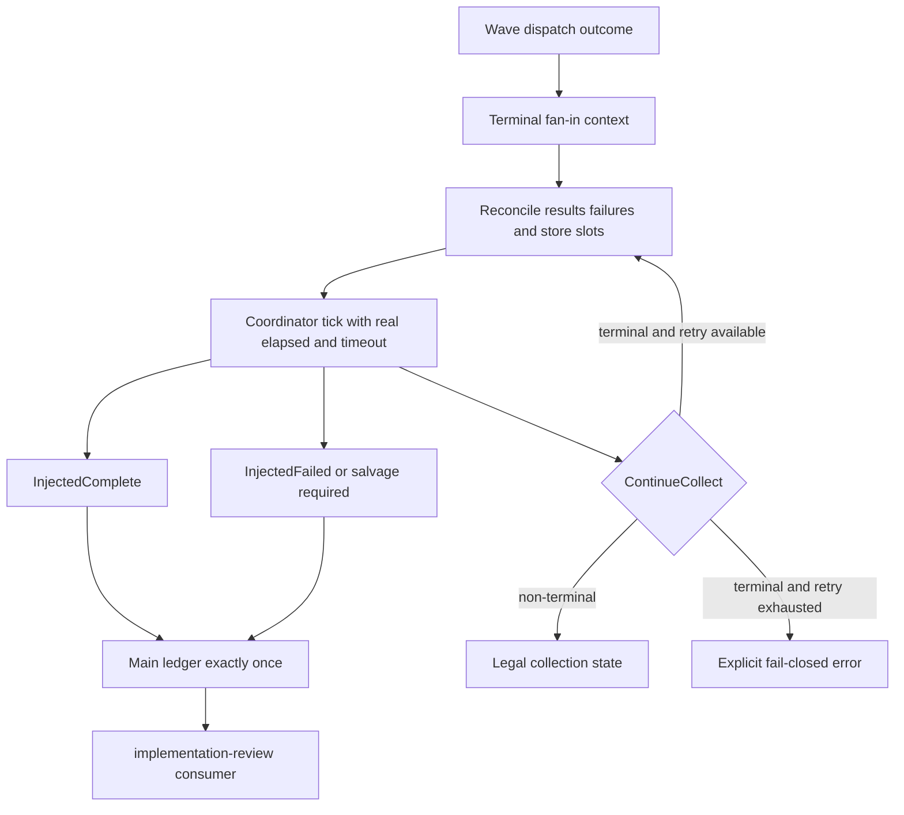

# fix: Wave 终态 fan-in 与 implementation-review 收敛补强

## Goal Capsule

- **目标：**补齐当前 Wave/Supervisor 已有机制中的最后一段终态收敛契约，使已经返回 `Completed`、`Partial` 或 `AggregateDeadlineExceeded` 的 wave 不会因 coordinator 返回 `ContinueCollect` 而悬停，并让 `implementation-review` preset 准确消费该契约。
- **范围：**只处理 fan-in 终态上下文、有限收敛和 `implementation-review` preset/schema/真实场景，不重构 Supervisor，不重做 Wave 调度，不扩展其他 preset。
- **执行顺序：**严格串行 `U1 → U2`。每个 Unit 必须独立完成验收测试、Red → Green → Refactor、相关集成与回归后才能进入下一 Unit。
- **停止条件：**终态 wave 必然产生恰好一个 complete/failed 协调事件或明确的持久化错误；`implementation-review` 成功与失败路径均自然终止；全量质量门禁通过。
- **Product Contract preservation：**本轮直接建立。保留用户确认的“机制层 + preset 层都修改、只做小范围打磨”约束。

---

## Product Contract

### Summary

当前主干已经实现 Supervisor slot lifecycle、terminal evidence、memory/rusqlite store parity、salvage merge、协调事件 origin、main-ledger reconciliation 和真实 `implementation-review` BDD，整体机制已经相当完备。
诊断报告暴露的剩余 P0 不是架构缺失，而是终态边界没有闭合：dispatcher 将 `WaveDispatchOutcome` 解构后只把 `CompletedWave` 传给 fan-in，丢失了 `Completed`、`Partial`、`AggregateDeadlineExceeded` 的分类与真实 elapsed/timeout 语义；`run_supervisor_fan_in` 又固定使用 `elapsed_secs: 0`，并且调用点只执行一次。
当 store 中仍有 `Pending` 或 `Running` slot 时，coordinator 合法返回 `ContinueCollect`，但所谓“下一 tick 重试”并不存在，最终不会注入 `review.wave.complete/failed`。

### Problem Frame

报告对应的运行中六个 worker 均产生了评审 artifact，但 main ledger 没有 `review.wave.complete/failed`，下游 synthesizer、fix-planner、finalizer 全未激活。
当前分支在该运行之后已经落地旧计划的大部分修复，因此本计划不能再次实现 evidence、reconciliation、salvage 或 flow authority。
本计划只新增一个明确不变量：**dispatcher 已判定 wave dispatch 结束后，fan-in 不得以无后续调度所有者的 `ContinueCollect` 作为最终结果。**

### Requirements

**Mechanism**

- R1. `Completed`、`Partial`、`AggregateDeadlineExceeded` 进入 fan-in 时必须保留其终态分类及计算 coordinator 决策所需的 elapsed/timeout 上下文。
- R2. 终态 fan-in 必须先将 worker 已完成、失败和未能进入终态的 slot 与 Supervisor store 对账，再由 coordinator 产生 complete 或 failed；不得绕过 terminal evidence、salvage 或 coordinator 直接伪造成功事件。
- R3. 对一个终态 wave，`ContinueCollect` 只能是有限内部过渡，不能作为调用点的最终无动作结果。有限重试后仍无法收敛时必须返回明确错误或失败结果，不能悬停。
- R4. complete/failed 业务事件、salvage merge 和协调事件保持现有幂等语义；重复 tick、重放和恢复不得重复写入。
- R5. 非终态 wave 仍允许 `ContinueCollect`；本计划不得把正常收集状态误判为失败。

**Preset**

- R6. `implementation-review` 必须声明并消费真实 runtime 终态契约：成功唤醒 synthesizer，失败唤醒 finalizer，不依赖 review-dispatcher 收到无效 `task.resume` 后重新派发同一 wave。
- R7. preset instructions 必须从各 hat 视角说明可执行动作、字段来源和停止条件，不得要求 agent 手工 emit runtime coordination topic 或读取内部 ledger。
- R8. preset/schema 的成功和失败拓扑必须由真实 EventLoop + production fan-in seam 的场景验证，禁止使用只断言 YAML/prompt 文案或由 mock hat 直接伪造 coordination event 的测试代替。
- R9. 变更不得扩大 `review-worker`、`review-dispatcher`、synthesizer 或 finalizer 的业务权限来掩盖机制失败。

### Scope Boundaries

**本次范围**

- Wave dispatch outcome 到 Supervisor fan-in 的终态上下文传递。
- 终态 slot 对账、有限 coordinator 驱动和不可收敛时的明确失败。
- `implementation-review` preset/schema 的终态消费契约、说明与真实运行场景。
- 受影响的 agent skill guide、preset operator skill 和 drift 校验，仅在行为或命令契约实际变化时同步。

**非目标**

- 重构整个 Supervisor coordinator、store 或 WaveTracker。
- 重新实现旧计划已经完成的 terminal evidence、salvage merge、provenance、flow authority。
- 新增跨 loop redrive、dashboard、operator UI 或新的 recovery hat。
- 调整六维评审内容、worker 数、timeout 数值或幂等键策略。
- 为所有 builtin preset 做迁移；其他 Review/Exec/Fix wave 只做机制回归。

### Acceptance Examples

- AE1. 六个 slot 全部带有效 terminal evidence 时，终态 fan-in 注入恰好一个 `review.wave.complete`，再次执行为 no-op。
- AE2. 部分 slot 完成、部分失败时，真实 Completed 事件先幂等 salvage，随后注入恰好一个 `review.wave.failed`，payload 只报告真实缺失维度。
- AE3. aggregate deadline 到达且 store 尚有 Pending/Running slot 时，fan-in 使用真实 timeout 上下文收敛到 failed，不返回无人负责的 `ContinueCollect`。
- AE4. 非终态 snapshot 进入普通 coordinator tick 时仍返回 `ContinueCollect`，不会被本计划强制终止。
- AE5. `implementation-review` 成功路径唤醒 synthesizer，失败路径直接唤醒 finalizer 并产生单一 blocked `LOOP_COMPLETE`；两条路径均无需 dispatcher 响应 `task.resume`。

---

## Planning Contract

### Key Technical Decisions

- KTD1. **补强现有终态 seam，不新建第二套 fan-in。**（session-settled: user-directed — chosen over 大规模重构 Supervisor/Wave：当前骨架和旧闭环已经完备，缺口集中在终态上下文与一次性调用边界。）
- KTD2. **保留 dispatch outcome，而不是从 `CompletedWave` 猜终态。** `Completed`、`Partial`、`AggregateDeadlineExceeded` 是 dispatcher 已知事实，应显式传到 fan-in；不得再用 `elapsed_secs: 0` 抹掉 timeout。
- KTD3. **coordinator 仍是协调事件 authority。** dispatcher 可以补齐 store 的终态记录并进行有限重试，但不能在 `ContinueCollect` 分支直接拼装一个成功事件绕过 evidence、salvage 和幂等门禁。
- KTD4. **终态 `ContinueCollect` 是可检测的不变量违例。** 在终态上下文中先对账并有限重试；若仍返回 `ContinueCollect`，暴露结构化错误并 fail-close。非终态 tick 的 `ContinueCollect` 保持合法。
- KTD5. **preset 不承担 runtime 恢复。** 不把 `task.resume` 简单加入 review-dispatcher triggers，因为该 activation 缺少原始 `scope.ready` 上下文，而且幂等重发不能驱动 fan-in。preset 只消费 complete/failed，并清除对无效重派的暗示。
- KTD6. **Outside-In 从生产调用点证明。** helper 单测覆盖决策规则，CLI dispatcher 集成测试覆盖真实 outcome → store → coordinator → main ledger；preset BDD 必须走 `run_workflow_guard_scenario` 或现有可承载 production fan-in 的真实 runner，不能由 stand-in hat 直接 emit coordination topic。

### Current Code Baseline and Verified Gap

| 当前位置 | 已有行为 | 仍存缺口 | 本计划处理 |
|---|---|---|---|
| `handle_wave_events` in `crates/ralph-cli/src/loop_runner/wave/dispatcher.rs` | 区分 `Completed`、`Partial`、`AggregateDeadlineExceeded` 并记录 timeout diagnosis | 三个分支在进入 fan-in 前合并为同一个 `CompletedWave`，终态分类只剩局部 `timeout_reason`，未进入 coordinator 输入 | U1 保留最小 terminal context，并从此调用点传入 fan-in |
| `HandleWaveOutcome` 与 `crates/ralph-cli/src/loop_runner/runner.rs` | 只向 runner 上报 `global_deadline_exceeded`，runner 可映射为 `MaxRuntime` | fan-in `StoreError`/`MergeFailed` 没有 typed propagation，当前只能记录日志，无法保证 run 停止 | U1 扩展最小失败信号并接入统一 termination flow；不得冒充 `MaxRuntime` |
| `run_supervisor_fan_in` in `crates/ralph-cli/src/loop_runner/wave/dispatcher.rs` | 注册同一 store wave、收集/排序/dedup slot events、调用 `tick_with_slot_events`、构造 complete/failed payload | `PhaseInputs.elapsed_secs` 固定为 `0`；`ContinueCollect` 和 `SalvageNotMerged` 都直接返回，注释假设存在“下一 tick”但调用方仅调用一次 | U1 让 terminal context 驱动有限收敛；普通非终态 tick 不变 |
| `evaluate_phase` in `crates/ralph-core/src/supervisor/phase.rs` | cancel/timeout 优先；全部 terminal 时 Integrate/Failed；否则 ContinueCollect | 逻辑本身合理，但只有收到真实 elapsed 或所有 slot 已 terminal 才能离开 Collect | U1 原则上不改规则，只补输入与 store 终态；只有测试证明规则缺口时才做最小调整 |
| `SupervisorCoordinator::tick_with_slot_events` | evidence 完整才 Integrate；失败走 salvage 门禁；merge/idempotency 已存在 | 无法知道 dispatcher 已经结束；收到 `elapsed=0` 且 store 有 Pending/Running 时只能合法 ContinueCollect | U1 不绕过 coordinator，通过 terminal context 让其获得可判定 snapshot/inputs |
| `SupervisorBridge::record_never_started_failures` | 可把 `Pending` 幂等记录为 `slot_never_started` | 只处理 `Pending`，不应错误改写仍 `Running` 或已 terminal 的 slot；当前只在 `InjectedFailed` 后调用，时机过晚，无法帮助第一次 tick 离开 Collect | U1 先按 dispatch outcome 与既有 worker classification 对账，再 tick；不得无差别调用 |
| `implementation_review_wave*.yml` | 通过真实 EventLoop 验证 downstream routing | `wave-runtime` stand-in 由 mock response 直接 emit complete/failed，只证明消费路由，不证明 production fan-in | U2 保留 routing coverage，同时增加/改造成 production fan-in 驱动的成功和 timeout/partial 场景 |
| `presets/en/implementation-review.yml` | 正确禁止 agent emit coordination topic；synthesizer/finalizer triggers 正确 | 注释承诺 runtime 注入，但未表达“dispatcher 停止后 runtime 必须自行收敛”；stall `task.resume` 也不是有效 redrive | U2 明确 dispatcher 停止条件和 runtime-owned convergence，不增加无效 trigger |

### Terminal Fan-In Decision Matrix

| Dispatch context | Store snapshot | 期望 coordinator 输入/准备 | 允许最终结果 | 禁止结果 |
|---|---|---|---|---|
| `Completed` | 全部 Completed 且 evidence 有效 | 实际 elapsed；按 slot 排序的 events | `InjectedComplete` / replay 时 `AlreadyDone` | `ContinueCollect`、`InjectedFailed` |
| `Completed` | Completed 但 evidence 缺失 | 保持 fail-closed，由既有 incomplete-evidence 规则决定 | `InjectedFailed` 或明确 store/evidence error | 伪造 complete |
| `Partial` | Completed + Failed | 失败 reason 已冻结；Completed-only salvage | `InjectedFailed` / replay 时 `AlreadyDone` | `InjectedComplete`、最终 `ContinueCollect` |
| `Partial` | 仍有 Pending | 仅对确认 never-started 的 Pending 记录既有稳定 reason，再 tick | `InjectedFailed` 或明确 store error | 无界等待 |
| `AggregateDeadlineExceeded` | Pending/Running 尚存 | 传入真实 elapsed，使 timeout decision 优先；必要的 slot reason/diagnostic 由既有失败路径补齐 | `InjectedFailed` / replay 时 `AlreadyDone` | `elapsed=0`、最终 `ContinueCollect` |
| 非终态普通 tick | Pending/Running 尚存 | 保持当前 inputs 与 snapshot | `ContinueCollect` | 被强制 failed |
| 任一终态 | merge sink 一次失败后恢复 | 不重复 business merge，有限重试同一 coordinator seam | complete/failed/AlreadyDone | duplicate event |
| 任一终态 | store/merge 持续失败 | 耗尽有界尝试，向 loop runner 返回 typed infrastructure failure | runner 明确报错并停止 | 伪造业务 failed、静默悬停 |

### High-Level Technical Design



### Existing Patterns to Follow

- Dispatch outcome 与 production fan-in：`crates/ralph-cli/src/loop_runner/wave/dispatcher.rs`
- Bridge 与 production store 接线：`crates/ralph-cli/src/loop_runner/wave/supervisor_bridge.rs`
- Coordinator 决策与 evidence/salvage 门禁：`crates/ralph-core/src/supervisor/coordinator.rs`
- Phase state-machine：`crates/ralph-core/src/supervisor/phase.rs`
- Bridge contract 与 memory/rusqlite parity：`crates/ralph-core/src/supervisor/bridge.rs`、`crates/ralph-core/src/supervisor/memory.rs`、`crates/ralph-core/src/supervisor/rusqlite.rs`
- Preset 与 schema：`presets/en/implementation-review.yml`、`presets/schemas/implementation-review.yml`
- 真实 scenario runner：`crates/ralph-core/tests/scenarios.rs`
- 既有相关场景：`crates/ralph-core/tests/scenarios/implementation_review_wave.yml`、`crates/ralph-core/tests/scenarios/implementation_review_wave_failed.yml`

### Sequencing

严格执行 `U1 → U2`。
U1 完成机制不变量和 production seam 后，U2 才能修改 preset 并将真实 runtime 结果接入场景。
不得先用 preset 兜底获得绿测，再回头补机制。

### Change Surface

| 文件 | 计划动作 | 不应发生的动作 |
|---|---|---|
| `crates/ralph-cli/src/loop_runner/wave/dispatcher.rs` | 保留 terminal outcome context；调整 fan-in 调用和 outcome handling；新增 production-seam tests | 不复制 coordinator state-machine，不直接伪造 complete |
| `crates/ralph-cli/src/loop_runner/runner.rs` | 将 U1 新增的 terminal fan-in infrastructure/invariant failure 映射到现有统一终止流程，并补 runner regression | 不复用错误的 `MaxRuntime` 原因，不静默继续 post-wave phases |
| `crates/ralph-cli/src/loop_runner/wave/supervisor_bridge.rs` | 仅当现有 trait 无法表达 U1 最小查询/失败时扩展 production bridge，并补 mock/contract | 不增加第二套 store，不把 retry 状态放进 bridge 私有内存 |
| `crates/ralph-core/src/supervisor/bridge.rs` | 仅在需要通用、可测试的 terminalization/query seam 时做最小 trait 变更 | 不加入 preset-specific topic/dimension |
| `crates/ralph-core/src/supervisor/coordinator.rs` | 优先只补测试；仅当 U1 Red 证明 coordinator 无法消费正确输入时最小修改 | 不接受 dispatcher 绕过 evidence/salvage |
| `crates/ralph-core/src/supervisor/phase.rs` | 增加 state-machine regression；默认保持现有决策优先级 | 不把所有 ContinueCollect 改成 Failed |
| `presets/en/implementation-review.yml` | 修正 runtime-owned convergence、dispatcher 停止条件和失败消费说明 | 不新增 agent coordination publisher，不简单加入 `task.resume` trigger |
| `presets/schemas/implementation-review.yml` | 对照 complete/failed payload；仅语义字段变化时同步 | 不为适配测试弱化 required fields |
| `crates/ralph-core/tests/scenarios.rs` | 注册/强化 production fan-in 场景 | 不使用 `run_scenario` stub |
| `crates/ralph-core/tests/scenarios/implementation_review_wave.yml` | 保留消费路由或迁移为 production-backed success fixture | 不把 stand-in 当作机制验收 |
| `crates/ralph-core/tests/scenarios/implementation_review_wave_failed.yml` | 保留失败消费路由或迁移为 production-backed timeout/partial fixture | 不由 agent mock 伪造 runtime topic作为唯一证明 |
| `crates/ralph-core/data/ralph-tools-wave.md` | 只有 agent 可见的 Confirm/失败行为变化时更新 | 不记录内部函数、store 路径或本计划编号 |
| `skills/ralph-preset-common/references/*.md` | 只有 author/reviewer 应检查的新契约时更新相关 checklist/rubric | 不做无行为价值的文案同步 |

---

## 1. 功能目标

### 业务目标

- 已结束的 wave 必须自然收敛为 complete 或 failed，不再出现无终态事件的悬停第三态。
- `implementation-review` 只负责业务编排和消费 runtime 输出，不承担 Supervisor/Wave 内部恢复。

### 本次范围

- R1–R9。
- 两个严格串行开发单元：机制终态闭环、preset 接入与真实验收。

### 非目标

- Scope Boundaries 中列出的重构、redrive、UI、timeout 调参和其他 preset 迁移。

### 已知约束和假设

- 当前主干已经包含 `2026-07-26-004` 的 terminal evidence、reconciliation、salvage、provenance、flow authority 与真实 BDD 修复；Executor 必须先以源码和 git 历史复核，不得重复实现。
- `CompletedWave` 中已有 results/failures/assigned dimensions 等对账输入；若实现时发现缺少最小终态上下文，优先扩展现有调用参数或小型上下文类型，不新增持久化账本。
- 所有测试使用 `cargo nextest run` 或 `./scripts/run-tests.sh`；禁止裸跑 `cargo test -p ralph-cli`。
- 会 spawn `ralph` 的测试必须 scrub 外层 agent runtime env。
- preset YAML 变更后必须检查 schema、runtime、lint、BDD、manifest/index、文档和补全下游；不受影响项明确记为 N/A。

---

## 2. BDD 行为规格

```gherkin
Feature: Wave terminal fan-in convergence
  已完成调度的 wave 必须通过 Supervisor coordinator 生成唯一终态，
  implementation-review 必须消费该终态并自然结束。

  Background:
    Given 一个使用 Supervisor store 的 wave
    And worker 结果通过 production dispatcher 收集
    And coordination topic 只能由 runtime 注入

  Scenario: S1 全部 slot 成功
    Given 所有 slot 都是 Completed 且有有效 terminal evidence
    When dispatcher 以 Completed outcome 执行最终 fan-in
    Then coordinator 注入恰好一个 review.wave.complete
    And 所有 review.unit.done 按 slot 顺序幂等写入 main ledger
    And 重复 fan-in 不产生重复事件

  Scenario: S2 部分成功、部分失败
    Given 部分 slot 是 Completed 且有有效 evidence
    And 其余 slot 已记录稳定失败原因
    When dispatcher 以 Partial outcome 执行最终 fan-in
    Then Completed slot 的业务事件先完成 salvage
    And coordinator 注入恰好一个 review.wave.failed
    And missing_dimensions 只包含真实失败维度

  Scenario: S3 aggregate deadline 后仍有非终态 slot
    Given wave dispatch 已返回 AggregateDeadlineExceeded
    And store 中仍有 Pending 或 Running slot
    When dispatcher 执行最终 fan-in
    Then timeout 上下文不会被重置为零
    And 非终态 slot 被按既有稳定原因收敛或明确判为失败
    And 最终产生 review.wave.failed 而不是无人负责的 ContinueCollect

  Scenario: S4 非终态 wave 继续收集
    Given wave 尚未达到 dispatch 终态
    And store 中仍有合法 in-flight slot
    When coordinator 执行普通 tick
    Then 返回 ContinueCollect
    And 不写 complete 或 failed 协调事件

  Scenario: S5 merge 或 store 无法收敛
    Given dispatcher 已持有终态 outcome
    And merge sink 或 store 在有限重试后仍失败
    When 最终 fan-in 结束
    Then 返回明确的结构化错误并由 loop runner 终止当前运行
    And 不伪造 complete
    And 不进入无限重试或静默悬停

  Scenario: S6 implementation-review 成功消费
    Given 六个 review worker 均成功完成
    When production fan-in 注入 review.wave.complete
    Then review-synthesizer 被激活
    And fix-planner 被后续 review.synthesized 激活
    And finalizer 产生恰好一个成功 LOOP_COMPLETE

  Scenario: S7 implementation-review 失败消费
    Given 至少一个 review worker 超时或失败
    When production fan-in 注入 review.wave.failed
    Then review-synthesizer 不被激活
    And finalizer 写入 blocked artifact
    And finalizer 产生恰好一个 blocked LOOP_COMPLETE
    And review-dispatcher 不依赖 task.resume 重新派发同一 wave
```

---

## 3. 验收与测试策略

| Scenario | 验收条件 | 推荐测试层级 | 是否需要 E2E |
|---|---|---|---|
| S1 全成功 | 单一 complete、业务事件有序且重放幂等 | coordinator 单元 + dispatcher 集成 | 否 |
| S2 部分失败 | salvage 在 failed 前完成，missing 真实 | state-machine 单元 + dispatcher 集成 | 否 |
| S3 timeout 非终态 slot | 真实 elapsed/timeout 生效，最终 failed，无终态 ContinueCollect | dispatcher production-seam 集成 | 否 |
| S4 合法收集 | 非终态仍返回 ContinueCollect 且零协调事件 | phase/coordinator 单元 | 否 |
| S5 基础设施失败 | 有界失败、无伪成功、无无限重试 | fault-injection 单元/集成 | 否 |
| S6 preset 成功 | complete 唤醒 synth → fix → finalizer | 真实 EventLoop BDD | 是，最低成本 mock backend |
| S7 preset 失败 | failed 直达 finalizer，单一 blocked 终态 | 真实 EventLoop BDD | 是，最低成本 mock backend |

风险驱动补充：

- **State-Machine：**覆盖 dispatch outcome、store snapshot、coordinator action 的组合矩阵。
- **Idempotency：**同一终态 wave 重复 fan-in 和恢复重放均不重复写入。
- **Fault Injection：**merge sink/store 第一次失败与持续失败分开验证。
- **Differential：**memory 与 rusqlite store 对相同终态 fixture 给出一致 coordinator action。
- **Characterization：**修改 production seam 前先钉死“终态 outcome + store 非终态 → 当前返回 ContinueCollect”的现状。

---

## 4. 需求—测试追踪矩阵

| 需求 | Scenario | 验收测试 | 单元测试 | 集成/契约测试 | E2E |
|---|---|---|---|---|---|
| R1 | S1–S3 | outcome 上下文保持 | terminal context matrix | dispatcher seam | 否 |
| R2 | S1–S3 | store slot 全部可判定 | reconciliation/terminalization | memory/rusqlite contract | 否 |
| R3 | S3、S5 | 终态无悬停 | bounded action transition | production fan-in | 否 |
| R4 | S1、S2 | complete/failed 恰好一次 | dedup/state transition | ledger replay | 否 |
| R5 | S4 | 合法 ContinueCollect 保留 | phase decision | coordinator bridge | 否 |
| R6 | S6、S7 | preset 只消费 runtime 终态 | trigger/ownership lint | real EventLoop scenario | 是 |
| R7 | S6、S7 | hat 动作、字段、停止条件可执行 | OPAC lint | preset review fixture | 否 |
| R8 | S6、S7 | coordination event 来自 production seam | N/A | scenario contract | 是 |
| R9 | S6、S7 | 无 publishes/ACL 扩权 | ownership lint | strict preset lint | 否 |

---

## Implementation Units

**5. 严格串行开发单元**

### U1. 终态 fan-in 必然收敛

- **Unit 目标：**保留 dispatch 终态上下文，闭合 outcome → store → coordinator → main ledger 的 production seam，使终态 wave 不再以无人负责的 `ContinueCollect` 返回。
- **对应 Scenario：**S1–S5。
- **外部可观察结果：**全成功产生唯一 complete；部分失败和 aggregate timeout 产生唯一 failed；非终态仍可 ContinueCollect；基础设施持续失败返回结构化错误并由 loop runner 终止，而不是继续空转。
- **输入与输出：**输入为结构化 `WaveDispatchOutcome`、`CompletedWave`、真实 elapsed/timeout、Supervisor snapshot 和 slot events；输出为 `InjectedComplete`、`InjectedFailed`、合法非终态 `ContinueCollect`、`AlreadyDone` 或明确错误。
- **可依赖的已完成能力：**既有 terminal evidence、`fan_in_status`、`record_slot_failure`、`record_never_started_failures`、salvage mark、merge sink、coordination payload builders、memory/rusqlite store。
- **明确禁止依赖的未来能力：**不得依赖 U2 preset 改动；不得通过 agent 重派、扩大 publishes 或手工 append coordination event 获得绿测。
- **Files：**
  - 修改 `crates/ralph-cli/src/loop_runner/wave/dispatcher.rs`：terminal context、调用点、fan-in outcome 和本模块 production tests。
  - 修改 `crates/ralph-cli/src/loop_runner/runner.rs`：消费扩展后的 `HandleWaveOutcome`，为 terminal fan-in 不可收敛设置准确的终止原因并跳过错误的 post-wave success phases。
  - 条件修改 `crates/ralph-cli/src/loop_runner/wave/supervisor_bridge.rs`：仅补 production bridge 对新增通用 seam 的实现与 mock contract。
  - 条件修改 `crates/ralph-core/src/supervisor/bridge.rs`：仅当 dispatcher 无法通过现有 `fan_in_status`/record API 完成对账时增加最小通用能力。
  - 默认只补测试 `crates/ralph-core/src/supervisor/phase.rs`、`crates/ralph-core/src/supervisor/coordinator.rs`；只有测试证明正确输入仍无法收敛时才改生产规则。
  - 条件修改 `crates/ralph-core/src/supervisor/memory.rs`、`crates/ralph-core/src/supervisor/rusqlite.rs`：仅当 bridge contract 必须扩展时保持 differential parity。
- **验收测试：**先在 `crates/ralph-cli/src/loop_runner/wave/dispatcher.rs` 的 production fan-in 测试区新增 characterization：`AggregateDeadlineExceeded + Pending/Running store slot` 当前返回 `ContinueCollect` 且 main ledger 无 coordination event；再将其翻转为唯一 failed。补全全成功、partial、重复执行、持续 store/merge 失败和合法非终态矩阵。
- **需要拆分的单元测试：**
  - dispatch outcome 到 terminal fan-in context 的分类和 elapsed/timeout 保真；
  - terminal context 下待处理 slot 的稳定失败原因选择；
  - terminal `ContinueCollect` 的有限重试与耗尽规则；
  - 非终态 `ContinueCollect` 保留；
  - duplicate tick/replay 的 `AlreadyDone` 幂等；
  - memory/rusqlite 相同 fixture 的 differential contract。
- **Red 预期失败原因：**当前调用点解构并丢弃 `WaveDispatchOutcome` 分类；fan-in 固定传 `elapsed_secs: 0`；`ContinueCollect` 直接返回且没有下一调度者。
- **Red 测试清单：**
  1. `terminal_aggregate_deadline_does_not_end_as_continue_collect`：构造 store 中一部分 Completed+evidence、一部分 Pending/Running，传入 aggregate-deadline 终态；修复前得到 `ContinueCollect` 且 main 无 failed。
  2. `terminal_partial_with_pending_slot_converges_to_failed`：`CompletedWave.partial=true` 且至少一个 Pending；修复前第一次 tick 仍 Collect。
  3. `terminal_context_preserves_elapsed_timeout_relation`：断言 coordinator 收到 `elapsed_secs > aggregate_timeout_secs`；修复前观察值为 `0`。
  4. `non_terminal_tick_remains_continue_collect`：作为保护性绿基线，确保方案不会把普通收集强制失败。
  5. `terminal_fan_in_persistent_store_error_is_not_silent`：注入持续 store error；修复前调用方只记录 log/继续，修复后 `HandleWaveOutcome` 携带 typed failure。
  6. `runner_terminates_on_terminal_fan_in_failure`：给 runner 一个 fan-in failure outcome，断言进入统一 termination flow、不会执行 default-publish/missing-event 等 post-wave success phases，且 reason 不是 `MaxRuntime`。
- **Green 行为分解：**
  1. 在 `handle_wave_events` 解构前生成只包含必要事实的 terminal context：dispatch class、elapsed、aggregate timeout、是否 cancel/global-deadline、稳定 failure classification。不要把整个 event-loop state 塞入 context。
  2. 调整 `run_supervisor_fan_in` 或其紧邻 wrapper，使其同时接收 terminal context 和 `CompletedWave`。普通 coordinator tick 若仍有独立调用者，保留可表达 non-terminal 的入口，避免把函数语义全局改成“必终止”。
  3. 在第一次 coordinator tick 前对照 `CompletedWave.results/failures` 与 `fan_in_status`。已由 worker join path 成功写入的 terminal 状态保持不变；明确没有启动的 Pending 复用 `slot_never_started`；aggregate timeout 通过真实 elapsed 触发 coordinator timeout；不得把未知 Running 直接改成 Completed。
  4. 第一次 action 为 `InjectedComplete`、`InjectedFailed`、`AlreadyDone` 时沿用现有 payload、salvage、diagnostics 和幂等路径。
  5. 第一次 action 为 `SalvageNotMerged` 时完成现有 Completed-only salvage/mark，再进行一次确定性的 coordinator tick；不能仅把它重命名为 `ContinueCollect` 返回。
  6. 第一次 action 为 terminal `ContinueCollect` 时重新读取 snapshot，验证是“store 写入刚完成、需要再评估”还是不变量违例。只允许固定次数的同步再评估；每次必须有可观察状态推进，状态未变化则立即耗尽。
  7. 耗尽后返回新的或扩展后的 typed infrastructure/invariant outcome；扩展 `HandleWaveOutcome` 把它交给 runner。runner 使用现有统一 termination framework 收尾，但需要新增准确映射，因为当前 outcome 只有 `global_deadline_exceeded`。不得只 `warn!` 后设置 `any_success=true`，也不得把此错误伪装成 `MaxRuntime`。
  8. `MergeFailed` 只在既有幂等 merge seam 上做有界重试。写入成功后重放必须观察 `AlreadyDone`，持续失败必须退出，不能转换成业务成功或伪造 failed coordination。
- **Refactor 约束：**
  - 将 action 驱动循环限制在一个小型 helper，负责“tick → 判断是否允许再 tick”；payload builders、salvage merge 和 diagnostics 继续由现有函数拥有。
  - terminal context 只表达 dispatcher 已知事实，不复制 `WaveSnapshot` 或 `PhaseDecision`。
  - 删除修复后失真的“next tick retries”注释；任何保留的 retry 注释必须能指向真实调用 owner。
  - 不顺手重命名大量 U 编号注释、不搬迁整个 dispatcher 模块、不清理与本行为无关的 legacy compatibility。
- **最小实现范围：**
  - 在现有 dispatcher/fan-in 边界传递最小终态上下文，不新增账本；
  - 在 coordinator tick 前补齐该 outcome 明确要求的 terminal store 状态；
  - 对 terminal `ContinueCollect` 做有界、可观测的最终驱动；
  - 持续不可收敛时返回明确错误，扩展 dispatcher→runner outcome，并让统一 termination flow 结束当前运行；保留现有 coordinator/evidence/salvage authority。
- **集成验证：**
  1. 使用真实 `CoordinatorSupervisorBridge` 或现有 production-equivalent bridge，贯穿 register、slot terminal record、coordinator、merge sink、coord append 和 main-ledger reread。
  2. 成功 fixture 断言每个 `review.unit.done` 与 `review.wave.complete` 的数量、顺序、`system_injected`/producer 语义。
  3. partial/timeout fixture 断言 Completed-only business events 先于唯一 `review.wave.failed`，并核对 `missing_dimensions`。
  4. 相同 fixture 在 memory/rusqlite store 上得到相同 action 和 ledger 结果。
  5. 重复调用、模拟 restart 后再调用，ledger 行数保持不变。
- **回归范围及顺序：**
  1. `ralph-core` phase/coordinator targeted tests。
  2. memory/rusqlite/bridge contract tests。
  3. `ralph-cli` wave dispatcher 的 Completed/Partial/AggregateDeadlineExceeded targeted tests。
  4. salvage、merge failure、coordination payload、idempotency 与 existing `wave_supervisor` tests。
  5. runner termination、post-wave phase skip、max-runtime reason 保真 tests。
  6. U1 结束前运行受影响 crate 的完整 nextest；不得等 U2 才发现机制回归。
- **完成标准：**
  - S1–S5 全部通过；
  - 终态调用点不存在无后续 owner 的 `ContinueCollect`；
  - 非终态行为无变化；
  - 当前 Unit targeted nextest 与受影响 crate 回归通过；
  - 完成 Red → Green → Refactor 后才能进入 U2。
- **风险与注意事项：**
  - 不得把所有 Pending slot 无差别标成 success；
  - timeout、never-started、cancelled、empty-result 等稳定 reason 必须复用既有枚举/分类；
  - `MergeFailed` 与 `StoreError` 不能被吞成 failed coordination event，避免账本与实际 merge 状态矛盾；
  - 有限重试必须在单次终态处理内可证明有界，不依赖不会到来的下一 wave detection。

### U2. implementation-review 使用真实终态契约

- **Unit 目标：**让 preset/schema/instructions 准确消费 U1 的 complete/failed 契约，并以真实 EventLoop 主路径证明成功和失败都自然收敛。
- **对应 Scenario：**S6、S7。
- **外部可观察结果：**成功路径进入 synthesizer、fix-planner、finalizer；失败路径绕过 synthesizer 直达 finalizer；两者都产生单一 `LOOP_COMPLETE`，dispatcher 不靠 `task.resume` 重派。
- **输入与输出：**输入为 scope-ready 后的六槽 review wave 和 U1 runtime coordination event；输出为 synthesized/fix plan/成功终态，或 blocked artifact/失败终态。
- **可依赖的已完成能力：**仅依赖已完成并验证的 U1，以及现有 `implementation-review` hats、schema、origin guard、flow declaration、finalizer blocked artifact 契约。
- **明确禁止依赖的未来能力：**无后续 Unit；不得新增 recovery hat、跨 loop redrive 或 mock coordination producer。
- **Files：**
  - 修改 `presets/en/implementation-review.yml`：runtime-owned terminal contract、review-dispatcher 停止条件、synthesizer/finalizer 输入与失败停止条件。
  - 核对并条件修改 `presets/schemas/implementation-review.yml`：只有 coordination payload 字段/required-fields 实际变化才修改。
  - 修改 `crates/ralph-core/tests/scenarios/implementation_review_wave.yml`：区分“下游路由场景”和“真实 fan-in 场景”，不得继续把 stand-in 当主验收。
  - 修改 `crates/ralph-core/tests/scenarios/implementation_review_wave_failed.yml`：用 U1 timeout/partial 结果驱动 finalizer 主路径。
  - 条件新增一个专门的 production-backed scenario YAML；若现有 scenario harness 无法承载 Supervisor bridge，则在 `crates/ralph-cli/src/loop_runner/wave/dispatcher.rs` 建机制集成、在 scenario 保留下游消费，二者组成明确 contract pair，不伪称单个 scenario 已端到端。
  - 修改 `crates/ralph-core/tests/scenarios.rs`：只注册真实 runner 测试和断言，不新增 `run_scenario` stub 路径。
  - 条件修改 `crates/ralph-core/data/ralph-tools-wave.md`、`skills/ralph-preset-common/references/author-checklist.md`、`skills/ralph-preset-common/references/finding-rubric.md`。
- **验收测试：**
  - 将成功场景接到 production fan-in seam，断言 `review.wave.complete → review.synthesized → fix.plan.ready → LOOP_COMPLETE`；
  - 将 timeout/partial 场景接到 production fan-in seam，断言 `review.wave.failed → blocked artifact → LOOP_COMPLETE(result=blocked)`，并断言无 `review.wave.complete`、`review.synthesized`、`fix.plan.ready`；
  - 断言 agent 伪造 coordination topic 仍被 origin guard 拒绝；
  - 断言 preset 不通过新增 dispatcher `task.resume` 重派或扩大 publishes 获得收敛。
- **需要拆分的单元测试：**
  - preset structured parse、trigger/publishes/ownership 和 schema parity；
  - success/failed coordination required fields；
  - runtime-only topic provenance；
  - 若 instructions 行为调整触发 OPAC lint，覆盖字段来源、动作和停止条件，不断言整段文案。
- **Red 预期失败原因：**现有部分 scenario 仍由 `wave-runtime` stand-in 直接 emit coordination event，无法证明真实 fan-in；preset 注释声称 runtime 必然注入，但没有覆盖 U1 的终态不变量。
- **Red 测试清单：**
  1. `implementation_review_success_uses_runtime_fan_in`：删除/绕开 `wave-runtime` stand-in 后，修复前没有 coordination event，证明旧测试只覆盖消费路由。
  2. `implementation_review_timeout_reaches_finalizer_without_task_resume_redrive`：真实 aggregate-timeout fixture 中必须出现 failed 和 blocked terminal；修复前链路停在 unit ready/done。
  3. `implementation_review_runtime_topics_remain_agent_denied`：dispatcher/worker 伪造 complete/failed 继续被 origin guard 拒绝。
  4. `implementation_review_dispatcher_contract_has_no_resume_redrive`：使用结构化 trigger/publishes/flow lint 证明 dispatcher 不订阅 `task.resume` 且不拥有 coordination topic；不得断言 prompt 完整文本。
- **Preset 逐段修改要求：**
  1. 顶部 execution-model 注释：说明 default wave hot path 可使用 Supervisor ledger，但 dispatch 终态的 complete/failed 由 runtime 自行收敛；agent 不负责 redrive。
  2. `review-dispatcher.instructions` Step 5：成功 wave emit 或 deduplicated 后立即停止；之后只等待 runtime terminal event，由下游 hat 消费。若 dispatch 前 scope drift，保持现有 blocked artifact/no-emit 规则，不借 `task.resume` 重派。
  3. `review-worker.instructions`：保持“一 slot 一 terminal business event”；不得增加 worker emit coordination topic 的兜底。
  4. `review-synthesizer.instructions`：只接受 `review.wave.complete`，字段来自 runtime payload；维度不完整继续走 `review.blocked`，不自行推断 failed。
  5. `finalizer.instructions`：`review.wave.failed` 继续写 `wave-blocked.md` 并发单一 blocked terminal；对 missing/reason/artifact 字段的来源和失败停止条件与 schema 对齐。
  6. `event_policy`、`mechanism.flow`、ownership：complete/failed 保持 runtime-owned，不能为了 lint 绿把它们加入 agent publishes。
- **Schema 决策门：**
  - 如果 U1 沿用现有 complete/failed payload builders，`presets/schemas/implementation-review.yml` 预期为核对后 N/A，不做无意义 diff。
  - 如果 U1 为明确终态错误增加用户可见 payload 字段，先检查现有 schema 是否已允许；只有 agent/consumer 必须读取的新 required field 才同步 required-fields。
  - 禁止删除 `wave_id`、`completed_dimensions`、`missing_dimensions`、`reason` 等现有核心约束来适配 fixture。
- **Green 行为分解：**
  1. 先保留现有 stand-in scenario 作为“coordination topic 被消费后如何路由”的低层 contract，并重命名注释使其不再声称覆盖 production fan-in；或在不丢失该价值的前提下迁移。
  2. 增加 production-backed success proof，必须消费 U1 实际写入 main ledger 的 `review.wave.complete`。
  3. 增加 production-backed partial/timeout proof，必须消费 U1 实际写入的 `review.wave.failed`，核对 completed/missing dimensions 和 blocked artifact。
  4. 用 builtin preset parse/strict lint 验证真实 triggers/publishes/schema，而不是在 scenario 中复制一套更宽松的 YAML 后宣称 preset 正确。
  5. 更新 instructions 后运行 preset OPAC lint；发现可读性问题只修动作、字段来源、停止条件，不添加事故背景、内部函数或计划编号。
  6. 完成 agent skill/operator skill 反向检查并记录逐项结论：行为变更则同步，内部-only 则 N/A。
- **Refactor 约束：**
  - 复用现有 scenario builders、mock backend 和 artifact fixture，不创建第二套 implementation-review mini runtime。
  - 将“机制证明”和“下游消费证明”命名清楚；若技术上必须分成两个测试，追踪矩阵必须显示二者共同覆盖 S6/S7。
  - 删除被替代的误导性 stand-in 注释，但不要删除仍有价值的 origin/routing regression。
- **最小实现范围：**
  - 更新 `presets/en/implementation-review.yml` 中 runtime 终态说明、dispatcher 停止条件及失败消费契约；
  - 检查并仅在字段/required-fields/flow 语义变化时同步 `presets/schemas/implementation-review.yml`；
  - 改造或新增最少量真实 runtime scenario，复用既有 fixture；
  - 反向检查 `crates/ralph-core/data/ralph-tools-wave.md`、preset author/review operator skills；仅在 agent 可见行为变化时更新。
- **集成验证：**
  1. `run_workflow_guard_scenario` 验证 success downstream chain 和 failed direct-to-finalizer chain。
  2. production fan-in integration 验证 coordination event 确实由 U1 runtime seam 写入，不来自 mock hat。
  3. builtin preset strict parse 验证测试 fixture 与真实 `presets/en/implementation-review.yml` 的 trigger/publish/schema contract 一致。
  4. 最低成本 mock-backend E2E 覆盖一条最关键 timeout/partial 主路径；禁止 live API。
  5. 带污染的 agent env 复跑任何 spawn `ralph` 的新增集成测试。
- **回归范围及顺序：**
  1. `implementation_review_wave`、`implementation_review_wave_failed`、`implementation_review_fan_in` targeted scenarios。
  2. origin guard、runtime coordination topic、ownership、workflow activation 和 OPAC lint。
  3. CLI/core preset lint 与 embedded presets parity。
  4. `scripts/check-cli-doc-drift.sh` 和必要 skill fixture review。
  5. `cargo fmt --check`、`cargo clippy`、`cargo build`。
  6. 最后运行 `./scripts/run-tests.sh`；只有最终基线 flake 才使用仓库规定的 serial fallback。
- **完成标准：**
  - S6、S7 全部通过；
  - preset/schema 与 U1 runtime 行为一致；
  - 没有 stand-in agent 伪造 coordination event 来证明主路径；
  - 没有新增无效 `task.resume` trigger、业务权限扩大或 prompt 文案锁定测试；
  - targeted、preset 回归和全量门禁全部通过。
- **风险与注意事项：**
  - `task.resume` 是通用 correction 通道，不等于 wave fan-in redrive；不要让 dispatcher 在缺少原始 trigger context 时重新构造 batch；
  - preset instructions 必须保持 hat 视角和 agent 可执行性，不能泄漏内部 store/ledger/函数名；
  - preset event 拓扑变化时必须逐项检查 runtime、lint、BDD、config、manifest/index、文档和补全下游，未变化项明确 N/A。

### 每个 Unit 的 TDD 闭环

每个 Unit 严格执行以下顺序：

1. 编写或启用当前行为的验收测试。
2. 运行测试并确认以计划描述的正确原因失败。
3. 将缺失能力拆成该 Unit 列出的最小单元测试。
4. 逐个完成 Red → Green → Refactor。
5. 运行当前 Unit 的相关集成测试。
6. 运行受影响范围的回归测试。
7. 满足完成标准并清理 dead-end 实现后关闭当前 Unit。
8. 仅在当前 Unit 全部完成后进入下一 Unit。

禁止删除或削弱断言、skip/ignore、`.only`、无解释更新 snapshot/golden、mock 掉 production seam，或只运行局部测试便声明完成。

---

## Verification Contract

| Gate | 适用 Unit | 命令 | 通过标准 |
|---|---|---|---|
| Supervisor state-machine | U1 | `cargo nextest run -p ralph-core -- supervisor` | phase/coordinator、memory/rusqlite、evidence/salvage 全绿 |
| Wave dispatcher | U1 | `cargo nextest run -p ralph-cli -- wave_supervisor` | outcome → fan-in production seam、timeout、幂等、fault injection 全绿 |
| Runner termination | U1 | `cargo nextest run -p ralph-cli --bin ralph -- loop_runner` | typed fan-in failure 进入统一终止流程；不冒充 MaxRuntime；不执行 post-wave success phases |
| Partial timeout 隔离 | U1 | 使用 `./scripts/run-tests.sh` 的既有 phase 2 隔离入口 | 三个 race-sensitive 测试按仓库规则串行通过 |
| implementation-review BDD | U2 | `cargo nextest run -p ralph-core --test scenarios -- implementation_review` | success/failed 均走真实 EventLoop，事件和 artifact 断言全绿 |
| Preset lint CLI | U2 | `cargo nextest run -p ralph-cli --bin ralph -- preset_lint` | strict lint、workflow、ownership、schema parity 全绿 |
| Preset lint core | U2 | `cargo nextest run -p ralph-core -- preset_lint` | finding 与 runtime contract 一致 |
| Embedded presets | U2 | `cargo nextest run -p ralph-cli --bin ralph -- presets` | manifest/embedded/strict parity 全绿 |
| CLI doc drift | U2 | `scripts/check-cli-doc-drift.sh` | agent skill 命令与行为无 drift |
| Format/lint/build | U2 | `cargo fmt --check`、`cargo clippy`、`cargo build` | 无新增格式、lint、编译问题 |
| Final baseline | U2 | `./scripts/run-tests.sh` | 两阶段 nextest + doctest 全绿 |

若默认全量仅出现竞态/时序 flake，按仓库规则使用 `RALPH_BASELINE_SERIAL=1 ./scripts/run-tests.sh` 复核；serial 仍失败视为真实失败，必须回到所属 Unit 修复。

---

## 6. 最终质量门禁

- 所有计划内 Scenario S1–S7 通过。
- 所有新增单元测试、state-machine、idempotency、fault-injection 和 differential 测试通过。
- production dispatcher → Supervisor store → coordinator → main ledger 集成路径通过。
- `implementation-review` 成功与失败关键路径通过真实 EventLoop BDD；最低成本 mock-backend E2E 通过。
- agent 伪造 `review.wave.complete/failed` 仍被拒绝。
- preset/schema strict lint、workflow activation、ownership 和 embedded parity 通过。
- 必要的 agent skill guide、preset operator skill 与 CLI drift 检查一致；未变化项明确 N/A。
- `cargo fmt --check`、`cargo clippy`、`cargo build` 和 `./scripts/run-tests.sh` 通过。
- 没有新增失败、skip、ignore、`.only`、弱化断言或只锁定 preset prompt 文案的测试。
- 未提交 `.ralph/review/<plan-id>/scratch/`、residual、draft 或其他 ephemeral 文件。
- 删除执行过程中废弃的重试 helper、平行状态和 dead-end 尝试。
- 未验证内容和剩余风险明确记录：跨 loop redrive、operator UI、其他 preset 迁移不属于本计划。

---

## Definition of Done

### 全局

- [ ] R1–R9 均有可追溯的通过测试。
- [ ] S1–S7 均从 production seam 或真实 EventLoop 得到证明。
- [ ] 终态 wave 不再存在无人负责的 `ContinueCollect`。
- [ ] fan-in 基础设施/不变量失败通过 `HandleWaveOutcome` 到达 runner 并以准确原因终止。
- [ ] 非终态 `ContinueCollect` 行为保持不变。
- [ ] complete/failed、salvage 和 replay 仍满足 exactly-once/idempotency。
- [ ] `implementation-review` 不依赖 dispatcher `task.resume` 重派。
- [ ] 两个 Unit 严格串行完成，全量质量门禁通过。

### 每 Unit

- [ ] 验收测试先 Red，且失败原因与计划一致。
- [ ] 最小单元测试完成 Red → Green → Refactor。
- [ ] 当前 Unit 的集成和回归范围通过。
- [ ] 当前 Unit 不依赖未来 Unit 获得绿测。
- [ ] abandoned/dead-end 代码和临时 fixture 已清理。

---

## Risks & Dependencies

| 风险 | 缓解 |
|---|---|
| 把 timeout Pending slot 直接当成功，制造 silent success | coordinator/evidence 继续作为成功 authority，只允许补失败终态或明确错误 |
| 为消灭 ContinueCollect 引入无限循环 | 重试次数固定有界，并有耗尽测试 |
| merge/store 错误被错误转换为业务 failed | fault-injection 分别断言基础设施错误与业务失败，不混用 |
| preset 用 task.resume 重派掩盖机制问题 | U2 明确禁止，真实 BDD 从 production fan-in 注入 coordination event |
| 重复旧 004 计划的大规模工作 | Executor 开始 U1 前复核当前 HEAD；evidence/reconciliation/salvage/flow authority 视为现有依赖 |
| race-sensitive timeout 回归 | 使用仓库两阶段 test runner，最终按既有 phase 2 单线程隔离 |
