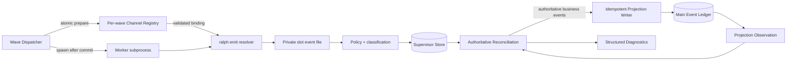
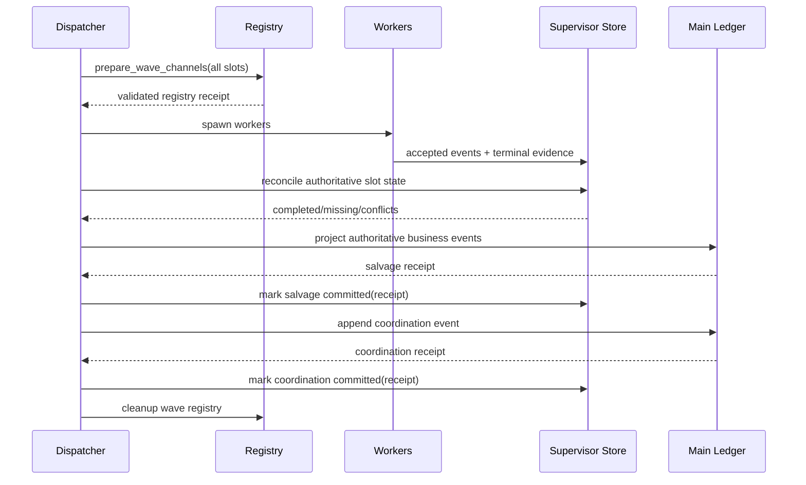
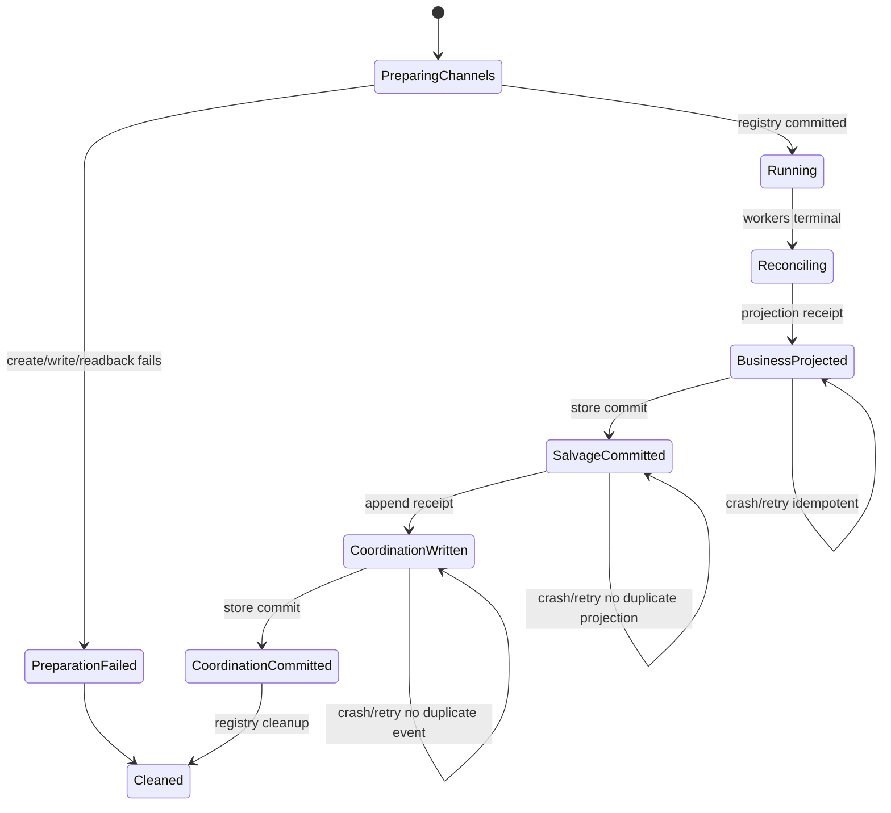

# 修复 Wave 私有通道、终态证据与失败收敛一致性

## Goal Capsule

在不引入 preset 特例和兼容分支的前提下，消除 implementation-review 事故仍暴露的 P0/P1 根因：dispatcher 必须在启动 worker 前完成可验证的私有事件通道注册；Supervisor 中经过策略校验并持久化的 slot 终态证据必须成为 wave 完成性的唯一权威；main event ledger 退化为可重建投影和诊断输入；失败收敛必须严格遵循“业务事件投影 → salvage 提交 → coordination 事件写入 → coordination 提交”的可恢复顺序。

完成后，即使 worker 环境变量丢失、通道注册失败、main ledger 出现孤儿事件、进程在任一提交窗口崩溃，系统也不能把失败误判为成功、不能把私有事件静默写入 main、不能产生无法解释的部分成功，并能通过结构化诊断说明 store 与投影之间的差异。

## Product Contract

### Summary

本计划修复的是 wave runtime 的通用一致性机制，不是 implementation-review 的局部绕过。受影响的主要行为链路为：

1. dispatcher 为每个 slot 分配私有事件文件；
2. `ralph emit` 验证调用者是否被 dispatcher 授权写入该通道；
3. worker 事件经过读取、策略校验和分类后写入 Supervisor store；
4. fan-in 依据持久化终态证据判断完成或失败；
5. store 中的权威业务事件幂等投影到 main ledger；
6. coordination 终态事件在投影提交后写入并持久化提交状态。

### Problem Frame

当前实现存在三组互相放大的缺陷：

- `resolve_emit_path` 已要求私有通道出现在 `.ralph/current-wave-channels`，但 supervisor dispatcher 路径没有注册该通道；legacy 路径注册失败也只告警后继续启动 worker。因此合法 worker 可能被拒绝 emit，随后被错误归类为 `empty_worker_result`。
- `build_review_done_hints` 同时采信 main ledger backscan 和 Supervisor store。main 中未经 slot 终态校验的 `review.dimension.done` 可以减少 `missing_dimensions`，造成“store 中 6 个失败，但 main 中 5 条孤儿 done 导致只缺 1 个维度”的双账本错误。
- `run_supervisor_fan_in` 可以在业务事件实际投影前直接调用 `mark_salvage_merged`；`append_supervisor_coord_event` 和 merge 函数吞掉写入错误，而 coordinator 又可能提前设置 `merged_to_events`。崩溃或 I/O 失败后，持久化状态可能宣称已经完成一个实际未完成的提交步骤。

### Requirements

- **R1**：每个 worker 私有通道必须绑定 `loop_id + wave_id + slot_index + canonical_path`，且只能由对应 slot 使用。
- **R2**：通道授权必须在任何 worker spawn 之前原子提交；授权失败时 fail-close，worker executor 调用次数必须为零。
- **R3**：通道授权记录必须按 wave 隔离、可幂等清理，不允许全局 append-only 文件让并发 wave、旧 wave 或不同 loop 互相授权。
- **R4**：`ralph emit` 必须拒绝缺失、损坏、跨 slot、跨 wave、跨 loop、非 canonical 或失效的私有通道绑定；wave worker 不得回退到 main ledger。
- **R5**：Supervisor store 中 `SlotStatus::Completed` 且通过 topic、dimension、slot assignment 与 payload fingerprint 校验的 `TerminalEvidence` 是 review wave 完成性的唯一权威。
- **R6**：main ledger backscan 只用于投影一致性检查，不得增加已完成维度或减少 `missing_dimensions`。
- **R7**：store 与 main 不一致必须显式分类为 orphan projection、missing projection 或 payload conflict；不能返回部分成功。
- **R8**：失败 payload 保持既有公共契约，仅要求 `wave_id`、`missing_dimensions`、`reason`；详细 slot 和投影冲突写入结构化诊断。
- **R9**：失败收敛顺序固定为业务事件投影成功、salvage 提交成功、coordination 事件写入成功、coordination 提交成功；任一步失败都不得越级标记后续步骤。
- **R10**：业务投影和 coordination 写入必须幂等，进程在任一提交窗口崩溃并恢复时不得重复 main 事件。
- **R11**：零 completed slot 的失败 wave 允许提交“空 salvage”，但必须由权威 snapshot 证明 completed 集合为空，不能由调用方跳过 merge 后直接置位。
- **R12**：memory 与 rusqlite Supervisor store 必须遵守同一状态转换、证据校验和恢复契约。
- **R13**：真实子进程测试必须覆盖 dispatcher → worker → `ralph emit` → 私有文件 → policy/classification → Supervisor store → main projection 的完整路径；仅构造已接受事件的 BDD helper 不能作为 P0 验收证据。
- **R14**：测试必须覆盖失败注入、并发隔离、环境污染、超时/取消及全部崩溃窗口，并对“不发生 spawn、不写 main、不误发 complete、不重复投影”等负向结果做强断言。
- **R15**：改动不得引入 implementation-review 名称判断、main backscan 兼容完成逻辑或隐式降级。

### Actors and Key Flows

- **Dispatcher**：创建 wave 级通道注册表，注册全部 slot 后才允许启动 worker。
- **Wave worker**：从注入环境取得 loop/wave/slot 和私有路径，通过 `ralph emit` 写入。
- **Emit resolver**：校验 worker 身份与注册表绑定，返回唯一私有路径或明确拒绝。
- **Supervisor store/coordinator**：保存 slot 状态与终态证据，产生权威 reconciliation 和 fan-in 决策。
- **Projection writer**：把权威 completed slot 的业务事件幂等投影到 main ledger。
- **Operator/diagnostics consumer**：从结构化诊断读取 slot 权威状态、投影差异和失败阶段。

关键成功流：

1. dispatcher 原子注册全部 slot；
2. worker 只写自己的私有通道；
3. 事件通过策略并形成 terminal evidence；
4. reconciliation 得到完整 authoritative completed 集合；
5. 业务事件投影并提交；
6. 发出唯一 coordination complete，提交 coordination；
7. 清理本 wave 注册表。

关键失败流：

1. 注册失败则零 spawn 并产生稳定 preparation failure；
2. worker 失败或证据无效则 reconciliation 保留对应 missing；
3. main 中孤儿 done 只进入 conflict diagnostics，不改变 missing；
4. 权威 completed 业务事件先 salvage 投影；
5. 再发出唯一 failed coordination；
6. 任一写入失败均停留在可恢复阶段，重启后幂等继续。

### Scope Boundaries

包含：

- wave 私有通道授权模型和生命周期；
- legacy 与 supervisor 两条 dispatcher 路径的统一准备门禁；
- Supervisor terminal evidence reconciliation；
- salvage / coordination 提交协议及持久化状态；
- 结构化 diagnostics；
- memory/rusqlite contract tests、真实子进程集成测试和相关文档同步。

不包含：

- 已由 `2026-07-27-001` 解决的 terminal fan-in convergence 和 `wave_runtime` virtual consumer；
- 修改 implementation-review 的维度数量、业务拓扑或 synthesis 逻辑；
- 扩大 `review.wave.failed` 的 required fields；
- 依靠 main ledger 补偿缺失 store 状态；
- 兼容 `.ralph/current-wave-channels` 旧格式；本仓库明确不要求向后兼容。

## Planning Contract

### Key Technical Decisions

#### KTD-1：用每 wave 原子注册表替代全局 append-only marker

**Governs R1–R4, R15。**

新增 wave channel registry，由 dispatcher 一次性写入一个 wave 的完整 slot 绑定。磁盘布局固定为 `.ralph/wave-channels/<encoded-loop-id>/<encoded-wave-id>.json`，内容带 schema version、loop ID、wave ID 和按 slot 排序的 canonical path。dispatcher 先以 create-new 方式创建每个私有事件文件，再 canonicalize 已存在的文件；注册表写入采用同目录临时文件、`sync_all`、原子 rename 和父目录 `sync_all`；读取时严格校验身份与路径。

拒绝继续扩展 `.ralph/current-wave-channels`，因为它没有 loop/wave/slot 边界、无法安全清理，也不能表达授权记录是否完整。

#### KTD-2：注册表准备是 spawn 前事务门禁

**Governs R2–R4, R14。**

legacy 与 supervisor dispatcher 必须调用同一个 `prepare_wave_channels`。只有所有目录创建、canonicalization、完整注册表写入和回读校验成功后，才创建 worker futures。任一失败返回 typed preparation outcome；不得“warn and continue”。

#### KTD-3：权威完成性只来自 store terminal evidence

**Governs R5–R8, R12, R15。**

引入共享 `ReviewReconciliation`。completed dimension 只能来自 `Completed` slot 的有效 terminal evidence；main ledger scan 生成 projection observations，仅用于发现 orphan、missing 和 fingerprint conflict。对事故形态“6 个 Failed slot + main 中 5 条 done”，结果必须是 6 个 missing 和 5 个 orphan projection。

#### KTD-4：以显式 receipt 驱动四阶段提交

**Governs R9–R12。**

merge 和 append 函数不再吞错或返回 `()`，而是返回带幂等键、写入计数和 fingerprint 的 receipt。状态只在 receipt 产生后推进：

`Collecting/Terminal → BusinessProjected → SalvageCommitted → CoordinationWritten → CoordinationCommitted`

该序列不扩展负责业务生命周期的 `WavePhase`，而是新增正交的 `WaveDeliveryState` 和两个可选 receipt 摘要字段。`WaveSnapshot` 同时暴露 phase 与 delivery state；memory `WaveRow` 和 rusqlite `waves` 表同构持久化。现有 `salvage_merged`、`merged_to_events` 布尔值在同一变更中删除，不保留双写兼容层。`SupervisorCoordinator` 只计算下一条 coordination intent，不再在 intent 返回前修改 delivery state；实际写入成功后由显式 commit API 推进。

#### KTD-5：公共失败事件保持最小，详细证据进入 diagnostics

**Governs R7–R8。**

`review.wave.failed` 保持三个 required fields。`reason` 使用稳定分类，例如 `wave_evidence_conflict`、`wave_channel_registration_failed` 或现有终态原因；逐 slot 状态、evidence 校验结果、orphan/missing projection 和恢复阶段写入结构化 JSON diagnostics，避免把内部实现细节扩散到 preset 事件契约。

#### KTD-6：以 outside-in 真实通道测试作为 P0 门禁

**Governs R13–R14。**

单元测试验证纯状态机和边界矩阵；store contract tests 同时运行 memory/rusqlite；真实 fake-backend 子进程测试验证实际 `ralph emit`、环境注入和私有文件。BDD 场景继续验证 preset 路由，但不替代真实通道测试。

### High-Level Technical Design

以下图用于固定所有权与提交边界，不限定具体 Rust 类型拆分。

### Implementation Units

#### U1 — 建立事故刻画测试与不变量矩阵

**Traces:** R2, R5–R7, R9, R13–R15  
**Depends on:** none

**Files**

- `crates/ralph-cli/src/loop_runner/wave/dispatcher.rs`
- `crates/ralph-cli/src/loop_runner/tests/wave_supervisor.rs`
- `crates/ralph-cli/src/commands/emit.rs`
- 新增或扩展 `crates/ralph-cli/tests/` 下的 wave runtime 集成测试

**Function-level changes**

- 在现有 dispatcher 测试模块为 `execute_wave_via_supervisor_with_executor` 增加“合法私有路径未注册”的回归刻画，证明当前 executor 会启动而 emit 被拒绝。
- 为 `execute_wave_structured` 增加 `append_wave_channel_to_marker` 写入失败仍 spawn 的刻画。
- 为 `build_review_done_hints`、`build_wave_failed_payload` 增加事故精确样本：6 个 `Failed` slot，main backscan 包含 5 个不同 dimension 的 `review.dimension.done`。
- 为 `run_supervisor_fan_in`、`emit_injected_failed_coord` 增加写入失败/崩溃阶段可观察性测试，证明当前存在 salvage 或 coordination 提前置位。

**Test scenarios**

- 注册文件父目录只读或被同名普通文件占用：executor 调用次数应在修复后为 0。
- supervisor 路径正确注入 `RALPH_EVENTS_FILE` 但没有授权：修复前稳定复现 emit 拒绝，修复后由 U2/U3 转绿。
- 6 Failed + 5 main done：期望 `missing_dimensions` 包含全部 6 个；main 的 5 条记录全部进入 orphan diagnostics。
- main 有重复、错误 wave ID、错误 topic、错误 dimension、非对象 payload：均不得改变 completed。
- main append 第 N 次失败：store 不得宣称对应步骤已提交。

**Acceptance**

- 每个 P0/P1 根因至少有一个先红后绿的测试，测试名称直接描述不变量。
- 测试断言包含负向副作用：spawn count、main 文件内容、store flags、coordination event 数量，不只断言返回错误字符串。
- 不使用 source-text assertion，不使用 ignored test，不把真实路径问题降级为 helper-only BDD。

#### U2 — 实现每 wave 私有通道注册表

**Traces:** R1, R3, R4, R15  
**Depends on:** U1

**Files**

- 新增 `crates/ralph-cli/src/loop_runner/wave/channel_registry.rs`
- `crates/ralph-cli/src/loop_runner/wave/mod.rs`
- `crates/ralph-cli/src/cli/emit_path.rs`
- `crates/ralph-cli/src/commands/emit.rs`

**Function-level changes**

- 新增 `WaveChannelRegistry::prepare(workspace, loop_id, wave_id, bindings) -> Result<WaveChannelRegistryGuard, ChannelRegistryError>`：
  - 校验 ID 和 slot 唯一性；
  - 创建 wave 私有目录，并以 create-new 方式预创建每个 channel 文件；
  - canonicalize workspace、registry 目录和已经存在的每个 channel 文件；
  - 拒绝 channel 越出该 wave 目录；
  - 对完整 JSON 进行临时文件写入、flush、`sync_all`、rename 和回读校验；
  - 返回持有 registry identity 的 guard。
- 新增 `WaveChannelRegistry::resolve(workspace, loop_id, wave_id, slot_index, requested_path) -> Result<PathBuf, ChannelRegistryError>`，执行精确四元组匹配，不接受仅“路径形状正确”。
- 新增 `WaveChannelRegistryGuard::cleanup()` 与 `Drop` best-effort 清理；显式 cleanup 返回错误供 diagnostics 使用，Drop 仅作为最后保险。
- 删除 `append_wave_channel_to_marker` 及 `.ralph/current-wave-channels` 读取逻辑。
- 修改 `commands/emit.rs::execute_emit`：仅在 `RALPH_WAVE_WORKER=1` 时读取并要求 `RALPH_CURRENT_LOOP_ID`、`RALPH_WAVE_ID`、`RALPH_WAVE_INDEX`；任一缺失或格式错误均 fail-close。
- 修改 `resolve_emit_path`：新增 loop ID 入参，wave worker 必须同时提供 loop ID、wave ID、slot index 和 path；调用 registry resolver；任何校验失败都返回明确错误且禁止 main fallback。
- 把 `commands/emit.rs` 中围绕旧 marker 的测试迁移为 registry fixture。

**Test scenarios**

- 一个 loop 的两个并发 wave、两个 loop 的同名 wave、相同 path 不同 slot：只有精确绑定成功。
- registry JSON 截断、未知 schema version、重复 slot、缺 slot、绑定 path 为相对路径、path 含 `..`、symlink 指向 wave 目录外：全部拒绝。
- 原子替换期间并发 reader 只能看到旧完整版本或新完整版本，不能看到部分 JSON。
- 显式 cleanup 调用两次、Drop 再调用、文件已不存在：幂等成功。
- 上次崩溃遗留 registry 不得授权新 loop；相同 identity 恢复时必须回读并验证 bindings 完全一致，否则拒绝覆盖。
- 缺失或伪造 `RALPH_CURRENT_LOOP_ID`：即使 wave ID、slot 和 path 都匹配也拒绝。
- 外层污染 `RALPH_CURRENT_HAT`、`RALPH_CURRENT_LOOP_ID`、`RALPH_EVENTS_FILE`、`RALPH_WAVE_WORKER` 后，测试 fixture 先 scrub，再显式构造目标身份。

**Acceptance**

- 仓库运行时代码不再读取或写入 `.ralph/current-wave-channels`。
- registry 中每个授权可追溯到唯一 loop/wave/slot；跨边界测试全部 fail-close。
- 文件故障不会留下可被 resolver 接受的半成品 registry。

#### U3 — 统一 dispatcher 的 spawn 前准备门禁

**Traces:** R2–R4, R14  
**Depends on:** U2

**Files**

- `crates/ralph-cli/src/loop_runner/wave/dispatcher.rs`
- `crates/ralph-cli/src/loop_runner/wave/worker.rs`
- `crates/ralph-cli/src/loop_runner/wave/supervisor_bridge.rs`
- `crates/ralph-core/src/supervisor/worker_outcome.rs`
- `crates/ralph-cli/src/loop_runner/tests/wave_supervisor.rs`

**Function-level changes**

- 新增共享 `prepare_wave_worker_channels(...) -> Result<WaveChannelRegistryGuard, WavePreparationFailure>`，一次性接收所有 slot descriptor；legacy 与 supervisor 路径不得各自拼装授权。
- 修改 `execute_wave_structured`：在构建/spawn worker futures 前调用共享准备函数，删除 warning-and-continue 分支。
- 修改 `execute_wave_via_supervisor_with_executor`：在 `executor` 首次调用前完成同一准备门禁；准备失败时把所有尚未启动 slot 记录为统一 preparation failure，随后进入可诊断的 wave failed 收敛。
- 扩展 `WaveDispatchOutcome` 增加 typed `PreparationFailed`，携带稳定 reason、wave identity 和 source error；不得伪装成 `SpawnFailed` 或 `empty_worker_result`。
- 在 `worker_outcome.rs` 定义稳定原因 `wave_channel_registration_failed`，明确其是 pre-spawn infrastructure failure；同一 dispatch 不重试单个 slot，wave-level retry 必须重新执行完整原子准备。
- 确保所有 return、timeout、cancel 和 panic unwind 路径持有 registry guard；正常完成显式 cleanup，cleanup 失败写 diagnostics 但不倒转已经提交的业务终态。

**Test scenarios**

- legacy/supervisor 两条路径分别注入 mkdir、temp write、sync、rename、readback 失败：executor count 恒为 0。
- 6 slot 中任一 binding 非法：全部零 spawn，不能先启动前 5 个再失败。
- preparation failure 后 main ledger 无 worker 业务事件、无 `empty_worker_result`，最终失败原因稳定。
- wave-level retry 重新生成完整 registry，旧 registry 不被增量复用。
- timeout、取消、worker panic、global deadline、正常 complete、failed coordination 后 registry 均清理。
- cleanup 自身失败时保留诊断，已写成功 coordination 不重复发送。

**Acceptance**

- 所有 worker spawn 点在控制流上都由同一 validated registry receipt 支配。
- 注册失败可由 operator 从稳定 reason 和 diagnostics 区分于 worker 自身空输出。
- 两条 dispatcher 路径的准备失败语义与测试完全一致。

#### U4 — 建立 Supervisor 终态证据唯一权威的 reconciliation

**Traces:** R5–R8, R12, R15  
**Depends on:** U1

**Files**

- 新增 `crates/ralph-core/src/supervisor/reconciliation.rs`
- `crates/ralph-core/src/supervisor/mod.rs`
- `crates/ralph-core/src/supervisor/memory.rs`
- `crates/ralph-core/src/supervisor/rusqlite.rs`
- `crates/ralph-cli/src/loop_runner/wave/dispatcher.rs`

**Function-level changes**

- 新增纯函数 `reconcile_review_wave(snapshot, expected_dimensions, projection_observations) -> ReviewReconciliation`。
- `ReviewReconciliation` 至少包含：
  - `authoritative_completed`;
  - `missing_dimensions`;
  - `blocking_slots`;
  - `orphan_projections`;
  - `missing_projections`;
  - `payload_conflicts`;
  - 每个 evidence 的 validation result。
- 新增 `validate_terminal_evidence(slot, expected_assignment)`：
  - slot 必须为 `Completed`；
  - topic 必须等于预期终态 topic；
  - evidence dimension 必须等于 slot assignment；
  - payload 解码后的 dimension 与 evidence 一致；
  - fingerprint 与保存的 accepted payload 一致。
- 将 `build_review_done_hints` 拆成 `scan_review_projection_observations` 和基于 store 的 reconciliation；删除 `ReviewDoneHints.main_backscan` 参与完成性计算的能力。
- 修改 `compute_review_missing_dimensions` 只接收 authoritative completed，或直接由 reconciliation 生成 missing。
- 修改 `build_wave_failed_payload` 使用 reconciliation 的 missing；发生 store/main 差异时 reason 使用稳定 conflict 分类，但公共字段不扩展。

**Test scenarios**

- 对 memory 和 rusqlite 使用同一 contract test suite：
  - Completed + 完整有效 evidence → completed；
  - Completed 但缺 evidence、错误 topic、错误 dimension、错误 fingerprint → missing + blocking；
  - Failed/Pending/Running + main done → missing + orphan；
  - 一个 slot 多条 accepted event、重复 terminal evidence、错误 slot assignment → fail-close；
  - DB 重启后 reconciliation 与重启前完全一致。
- projection observation 矩阵：正确、缺失、重复、错误 wave、错误 topic、错误 dimension、对象/字符串 payload、无 dimension、fingerprint 冲突。
- 事故固定回归：6 Failed + 5 main done → `authoritative_completed=[]`、6 missing、5 orphan、绝不产生 `review.wave.complete`。
- completed evidence 完整但 main 缺投影 → completion authority 仍为 completed，同时列为 missing projection，交给 U5 修复投影。
- 输出排序按预期 dimension/slot 固定，确保 diagnostics 和 payload 可重复。

**Acceptance**

- main ledger 中的任何事件都不能单独让 slot 或 dimension completed。
- memory/rusqlite 的表驱动结果逐字段相等。
- 事故样本和所有证据损坏样本均 fail-close，且能给出确定性差异分类。

#### U5 — 把 salvage 与 coordination 改为可恢复的显式提交协议

**Traces:** R9–R12  
**Depends on:** U4

**Files**

- `crates/ralph-cli/src/loop_runner/wave/dispatcher.rs`
- `crates/ralph-cli/src/loop_runner/wave/supervisor_bridge.rs`
- `crates/ralph-core/src/supervisor/bridge.rs`
- `crates/ralph-core/src/supervisor/coordinator.rs`
- `crates/ralph-core/src/supervisor/mod.rs`
- `crates/ralph-core/src/supervisor/memory.rs`
- `crates/ralph-core/src/supervisor/rusqlite.rs`
- `crates/ralph-core/src/supervisor/migrations.rs`

**Function-level changes**

- 新增 `ProjectionReceipt`，包含 wave ID、投影 kind、按 slot 的幂等 key/fingerprint、写入/已存在计数。
- 新增 `WaveDeliveryState::{Pending, BusinessProjected, SalvageCommitted, CoordinationWritten, CoordinationCommitted}`，以及 `ProjectionReceiptSummary`、`CoordinationReceiptSummary`；替换 `WaveSnapshot.salvage_merged` 与 `WaveSnapshot.merged_to_events`。
- 修改 `memory.rs::WaveRow`、`rusqlite.rs::fan_in_status`、waves 表建表与 `migrations.rs`：持久化 delivery state 和 receipt 摘要；旧布尔列不再参与运行时判断。迁移测试从旧 schema 打开后必须得到确定的初始 `Pending`，不能根据旧 main ledger 猜测更高阶段。
- 修改 `merge_completed_review_slots_to_main` 和 `merge_completed_exec_fix_slots_to_main` 返回 `Result<ProjectionReceipt, ProjectionError>`；禁止内部仅 log 后返回成功。
- 幂等 key 使用 `wave_id + slot_index + terminal_evidence.payload_fingerprint + projection_kind`；写 main 前扫描/索引同 key，已存在且 fingerprint 相同视为成功，key 相同但 payload 不同视为 conflict。
- 删除 `mark_salvage_merged`，新增 `commit_salvage_projection(wave_id, receipt)`；只有 merge receipt 成功后可调用。
- 删除 `run_supervisor_fan_in` 的 `SalvageNotMerged`、terminal `ContinueCollect` 等分支中直接 `mark_salvage_merged` 的调用。
- 对零 completed slot 新增 `project_empty_salvage(snapshot) -> ProjectionReceipt`：必须验证 snapshot 中不存在 Completed slot，生成显式空 receipt 后才能提交 salvage。
- 修改 `append_supervisor_coord_event` 返回 `Result<CoordinationReceipt, ProjectionError>`；写失败向上传播。
- 调整 `SupervisorCoordinator::fail_wave`、`merge_and_complete` 及 bridge/store API：decision 阶段仅返回 `CoordinationIntent`，不得预先设置业务 `WavePhase` 或 delivery state；新增 `record_coordination_written(wave_id, receipt)` 和 `commit_coordination_event(wave_id, receipt)`，后者在核对同一 receipt 后原子设置最终 `WavePhase::{Done,Failed}` 与 `CoordinationCommitted`。
- `run_supervisor_fan_in` 与 `emit_injected_failed_coord` 按四阶段状态恢复：先读取 snapshot 判断已完成阶段，再执行第一个未提交阶段。

**Test scenarios**

- memory/rusqlite 共享状态转换测试：任何阶段都不能跳级，重复 commit 同 receipt 幂等，不同 receipt 冲突。
- 旧 rusqlite schema migration：旧布尔组合为 00、10、11、非法 01 时均按定义处理；其中无法由 receipt 证明的旧置位不得直接升级为 committed，非法组合明确拒绝并诊断。
- 故障注入窗口：
  1. 业务投影前崩溃；
  2. 业务 append 成功、salvage commit 前崩溃；
  3. salvage commit 成功、coordination append 前崩溃；
  4. coordination append 成功、coordination commit 前崩溃；
  5. coordination commit 后 cleanup 前崩溃。
- 每个窗口重启后断言：业务事件恰好一次、coordination 恰好一次、store flags 单调推进、最终 phase 正确。
- main append 返回 partial/error、磁盘满、权限错误、截断 JSONL 尾部：不得设置后续 flag；可恢复错误保留诊断。
- 零 completed、部分 completed、全部 completed 三类失败/成功路径均验证 receipt。
- exec/fix 与 review merge 使用同一协议，防止只修 review 分支。

**Acceptance**

- 旧 `mark_salvage_merged`、`mark_merge_to_events` 和两个布尔字段已删除；所有 delivery commit 调用点都有成功 receipt 作为前置证据。
- merge/append 错误不再被日志吞掉。
- 五个崩溃窗口在 memory/rusqlite 和真实文件投影测试中都能幂等恢复，无重复、无越级、无部分成功。

#### U6 — 完善结构化诊断和 agent/operator 文档

**Traces:** R7, R8, R14  
**Depends on:** U3, U4, U5

**Files**

- `crates/ralph-cli/src/loop_runner/wave/dispatcher.rs` 中现有 wave diagnostics writer
- `crates/ralph-core/data/ralph-tools-emit.md`
- `crates/ralph-core/data/ralph-tools-wave.md`
- `crates/ralph-core/data/ralph-tools.md`（仅当入口索引需同步）
- `presets/en/implementation-review.yml`
- `presets/schemas/implementation-review.yml`
- `skills/ralph-preset-common/references/` 与 `skills/ralph-preset-{author,review}/SKILL.md`（审计后按触发规则决定是否修改）
- `CONCEPTS.md`

**Function/document-level changes**

- 扩展 diagnostics writer，使每个 wave 记录：
  - registry preparation/cleanup 状态；
  - authoritative slot status；
  - terminal evidence validation；
  - authoritative completed/missing；
  - orphan/missing projection 与 fingerprint conflict；
  - projection/salvage/coordination 的当前提交阶段和 receipt 摘要；
  -稳定 failure reason。
- diagnostics 写入失败必须附加到现有运行诊断通道，不得改变已经权威确定的 wave 结果。
- `review.wave.failed` 仍只要求 `wave_id`、`missing_dimensions`、`reason`；同步澄清 `missing_dimensions` 来自 Supervisor terminal evidence，不来自 main backscan。
- 更新 agent 注入指南时只写 agent 可执行动作：何时发现通道注册失败、应停止什么、从当前命令输出取得哪些字段、何时不应重试 emit；不得写内部函数名、内部 ledger 路径或本计划编号。
- 审计 preset author/review skills：若 CLI 参数、finding ID、event required fields 均未改变，记录为 N/A；若语义说明会影响 AAF review，则同步 checklist/rubric 和 fixture。
- 在 `CONCEPTS.md` 增加通用词汇“wave channel registry”“authoritative terminal evidence”“projection observation”，避免后续再次混用账本与权威状态。

**Test scenarios**

- diagnostics golden structure 使用字段级反序列化断言，不锁定整段文本。
- registry preparation failure、事故双账本冲突、每个崩溃窗口均生成可区分的结构化字段。
- diagnostics writer 自身失败不产生 complete、不覆盖根因。
- preset schema parity、strict lint、真实 runtime BDD 保持通过。
- skill 文档中的命令与 `ralph emit --help`、`ralph wave --help` 一致，drift scan 无新增错误。

**Acceptance**

- operator 不读 main JSONL 也能判断哪个 slot、哪条证据、哪个提交阶段失败。
- preset 公共 required fields 未扩张；schema 和 inline preset 同步。
- 注入指南符合“触发条件、动作、字段来源、停止条件”四项可执行性规则，无计划化或内部实现泄漏。

#### U7 — 建立 outside-in 全链路与高覆盖收敛门禁

**Traces:** R1–R15  
**Depends on:** U3, U4, U5, U6

**Files**

- 新增 `crates/ralph-cli/tests/integration_wave_channel_convergence.rs`，或并入已有真实 fake-backend 集成测试文件
- `crates/ralph-cli/tests/common/mod.rs`
- `crates/ralph-cli/src/loop_runner/tests/wave_supervisor.rs`
- `crates/ralph-core/tests/scenarios/implementation_review_wave_runtime_fan_in.yml`
- `crates/ralph-core/tests/scenarios/implementation_review_wave_runtime_failed_fan_in.yml`
- `crates/ralph-core/tests/scenarios.rs`

**Function-level test harness changes**

- 统一通过 `common::ralph_bin()` 启动 human CLI，并调用 `scrub_agent_runtime_env`；需要模拟 worker 时先 scrub 再显式设置所有 agent context env。
- fake backend 必须实际启动子进程并执行 `ralph emit`，不能直接把 `AcceptedEvent` 塞给 fan-in helper。
- 增加可控 fault injector：registry I/O 阶段、worker unset env、worker 错误 slot、main append 阶段、store commit 阶段、进程 restart checkpoint。
- BDD 场景必须继续使用 `run_workflow_guard_scenario` 真 EventLoop runner；只用于验证 complete/failed 后续路由，不把它当作私有通道证明。

**Required scenario matrix**

| 场景 | 必须断言 |
|---|---|
| 6 个 review worker 全成功 | 6 条 worker-owned done、权威 evidence 完整、业务投影各一次、唯一 complete、synthesis 被激活 |
| 1 个 worker unset `RALPH_EVENTS_FILE` | emit 明确拒绝、main 无该 worker 孤儿事件、该维度 missing、绝不 complete |
| registry 准备失败 | 0 spawn、typed preparation failure、main 无业务事件、registry 无可用半成品 |
| 6 个 store Failed + 人工注入 5 条 main done | 6 missing、5 orphan diagnostics、唯一 failed、绝不 complete |
| 部分成功 + 多种失败原因 | 只 salvage 权威 completed；failed payload 顺序确定；slot reason 不被 `empty_worker_result` 覆盖 |
| 两个并发 wave / 同名不同 loop | 无交叉授权、无交叉证据、无交叉 main projection |
| timeout、cancel、global deadline、worker panic | registry 清理、store 终态明确、coordination 恰好一次 |
| 五个 crash window 逐一重启 | 业务/coordination 事件均恰好一次，状态单调恢复 |
| 外层 hat env 全污染 | human CLI fixture scrub 后结果与干净环境相同 |
| diagnostics 写失败 | 根因仍可从返回/主诊断读取，不误 complete、不重复重试 |

**Coverage quality gates**

- 每个场景同时断言返回值、store snapshot、私有文件、main ledger、diagnostics 和 executor/spawn count 中适用的至少三层。
- 对成功数量、事件 topic、wave ID、slot index、dimension、fingerprint 和 occurrence count 做精确断言。
- 禁止仅用 `contains("error")` 作为核心断言；稳定 reason 必须精确匹配。
- 禁止 sleep 驱动测试；使用事件轮询加有界 deadline。
- race-sensitive 测试如确需隔离，应加入项目既有 phase-2 机制，不得恢复整包串行。

**Acceptance**

- 至少一个真实测试覆盖完整 subprocess/private-channel/runtime/store/projection 链路。
- P0 事故样本、全部 I/O 故障点、全部 crash window、并发隔离、env 污染在开发阶段已有自动化门禁。
- 新增测试在默认 nextest 并发下稳定；相关子集连续运行 3 次无 flake。

### System-Wide Impact

- **CLI emit**：授权来源从无身份的全局 marker 变为精确 registry；错误信息和测试 fixture 需同步。
- **Wave dispatcher**：legacy/supervisor 共享准备事务；所有退出路径承担 registry 生命周期。
- **Supervisor API/store**：增加 reconciliation 和 delivery receipt/commit 状态；memory/rusqlite 必须同步。
- **Main ledger**：不再作为完成性来源，只承载业务投影、coordination 和诊断对照。
- **Recovery**：从基于布尔 flag 的隐式顺序升级为可重放阶段；旧不完整状态无需兼容，但同一版本崩溃恢复必须可靠。
- **Preset/BDD**：event required fields 不变；missing 语义更严格，路由断言需覆盖孤儿 main 不激活 synthesis。
- **Agent parity**：worker 和人类调用同一个 `ralph emit` resolver；无隐藏的人类专用绕过。失败结果必须向 agent 提供可执行停止条件。

### Risks and Mitigations

- **Rusqlite migration风险**：新增 delivery state 可能遇到旧 DB。由于无需向后兼容，启动时应明确拒绝不匹配 schema 或使用现有受控 migration，不得默默猜测状态；用重启测试验证。
- **JSONL 幂等检索性能**：扫描 main ledger 可能随文件增长。先沿用现有 bounded scan/索引模式并记录性能基线；不要在本计划中引入独立数据库平台。
- **registry 清理竞态**：cleanup 过早会让仍运行 worker emit 失败。guard 生命周期必须覆盖 join/cancel 完成，测试并发 emit 与 cleanup 交错。
- **投影 fingerprint 漂移**：序列化顺序可能导致同语义 payload 不同 fingerprint。复用 terminal evidence 已保存 fingerprint 和规范化 payload，不在投影阶段重新随意序列化。
- **测试自身 flake**：不使用固定 sleep；fake backend 通过事件/文件条件轮询和有界超时；遵守 nextest process isolation 与 phase-2 规则。
- **过度扩大事件契约**：所有内部证据留在 diagnostics/receipt，preset required fields 不扩展。

### Verification Contract

实现过程中按单元顺序执行 targeted gates；以下命令均从仓库根目录运行，禁止裸跑 `cargo test -p ralph-cli`。

| Gate | Command | Observable acceptance |
|---|---|---|
| 通道 registry 单元测试 | `cargo nextest run -p ralph-cli --bin ralph -- channel_registry` | identity、原子性、损坏输入、并发和 cleanup 矩阵全绿 |
| emit resolver | `cargo nextest run -p ralph-cli --bin ralph -- resolve_emit_path` | 无旧 marker fallback；跨 slot/wave/loop 全拒绝 |
| supervisor reconciliation | `cargo nextest run -p ralph-core -- reconciliation` | memory/rusqlite contract 同结果；6 Failed + 5 orphan 样本全量 missing |
| dispatcher/fan-in | `cargo nextest run -p ralph-cli --bin ralph -- supervisor_fan_in` | preparation fail-close、receipt 顺序和 coordination exactly-once |
| wave supervisor 集成单测 | `cargo nextest run -p ralph-cli --bin ralph -- wave_supervisor` | legacy/supervisor、部分失败、恢复路径全绿 |
| 真实子进程链路 | `cargo nextest run -p ralph-cli --test integration_wave_channel_convergence` | 实际 `ralph emit` 私有通道链路和场景矩阵全绿 |
| 污染环境复跑 | `RALPH_CURRENT_HAT=executor RALPH_CURRENT_LOOP_ID=outer-loop RALPH_EVENTS_FILE=/tmp/outer.jsonl RALPH_WAVE_WORKER=1 cargo nextest run -p ralph-cli --test integration_wave_channel_convergence` | fixture scrub 生效，结果与干净环境相同 |
| 相关子集稳定性 | 连续 3 次运行上述真实子进程测试 | 3 次均通过，无 sleep/race flake |
| BDD 真 runner | `cargo nextest run -p ralph-core --test scenarios -- implementation_review_wave_runtime` | complete/failed 路由基于真实 EventLoop 事件断言 |
| preset CLI lint | `cargo nextest run -p ralph-cli --bin ralph -- preset_lint` | strict lint 全绿 |
| core preset lint | `cargo nextest run -p ralph-core -- preset_lint` | schema parity、ownership、workflow activation 全绿 |
| embedded presets | `cargo nextest run -p ralph-cli --bin ralph -- presets` | manifest/embedded/strict lint 结构化校验全绿 |
| CLI 文档冒烟 | `cargo run -p ralph-cli -- emit --help` 与 `cargo run -p ralph-cli -- wave --help` | 指南中的命令、参数和失败语义一致 |
| 文档 drift | `scripts/check-cli-doc-drift.sh` | 无新增 drift |
| 格式 | `cargo fmt --all -- --check` | 无格式差异 |
| lint | `cargo clippy --workspace --all-targets --all-features -- -D warnings` | 无 warning/error |
| build | `cargo build --workspace --all-targets` | 全 workspace 构建成功 |
| 最终全量 | `./scripts/run-tests.sh` | 两阶段 nextest + doctest 全绿 |
| flake 兜底（仅全量出现竞态/时序 flake） | `RALPH_BASELINE_SERIAL=1 ./scripts/run-tests.sh` | serial 仍失败则视为真实失败，禁止交付 |

### Definition of Done

- [ ] U1–U7 全部完成，且每个 Requirement 至少被一个实现单元和一个可观察验收覆盖。
- [ ] `.ralph/current-wave-channels` 运行时代码和测试 fixture 全部删除。
- [ ] 两条 dispatcher 路径都在任何 spawn 前完成同一原子 registry 准备；失败时 spawn count 为零。
- [ ] `resolve_emit_path` 对 wave worker 永不回退 main，并严格验证 loop/wave/slot/path。
- [ ] review completion 与 `missing_dimensions` 只由 store 中有效 terminal evidence 决定。
- [ ] 事故回归“6 Failed + 5 main done”稳定得到 6 missing、5 orphan、唯一 failed、零 complete。
- [ ] 业务投影、salvage、coordination write、coordination commit 的状态顺序不可跳级。
- [ ] memory 与 rusqlite 在状态转换、证据校验、幂等恢复上通过同一 contract suite。
- [ ] 五个 crash window 重启后业务事件和 coordination 事件均 exactly-once。
- [ ] 真实 fake-backend 子进程测试覆盖实际 `ralph emit` 私有通道，不以 helper-only BDD 替代。
- [ ] 并发 wave、跨 loop、timeout、cancel、panic、I/O 失败、env 污染、diagnostics 失败均有自动化测试。
- [ ] 所有新增测试使用 nextest 入口，无 ignored、弱文本断言、固定 sleep 或裸 `cargo test -p ralph-cli`。
- [ ] preset/schema、BDD、AI skill guide、operator skills 和 `CONCEPTS.md` 已按触发规则审计并同步。
- [ ] `scripts/check-cli-doc-drift.sh`、targeted gates、3 次稳定性复跑和 `./scripts/run-tests.sh` 全部通过。
- [ ] 未提交 `.ralph/review/<plan-id>/scratch/`、`draft/`、`residuals*.md` 等过程文件。

## Sources and Research

### Primary evidence

- `docs/report/2026-07-27-implementation-review-primary-20260727-051801-diagnosis.md`
- `crates/ralph-cli/src/cli/emit_path.rs`
- `crates/ralph-cli/src/loop_runner/wave/dispatcher.rs`
- `crates/ralph-cli/src/loop_runner/wave/worker.rs`
- `crates/ralph-cli/src/loop_runner/wave/supervisor_bridge.rs`
- `crates/ralph-core/src/supervisor/{mod,bridge,coordinator,memory,rusqlite,worker_outcome}.rs`
- `crates/ralph-cli/src/loop_runner/tests/wave_supervisor.rs`
- `crates/ralph-core/tests/scenarios/implementation_review_wave_runtime_{fan_in,failed_fan_in}.yml`

### Recent-history context

- `e752f046`：引入 supervisor fan-in runtime seam。
- `afaa5ec9`：修复 terminal fan-in exhaustion。
- `ed96850f`：合入 salvage/redrive。
- `ec636dc4`：修复 `wave_runtime` virtual consumer/config。
- `39d3fc72`：禁止 wave worker 在私有通道缺失时静默落到 main；同时使 dispatcher 注册缺口成为必须修复的 fail-close 前置条件。
- `83df2a2c`：提交本计划所依据的 diagnosis 报告。

### Prior plans and durable learnings

- `docs/plans/2026-07-25-003-fix-supervisor-wave-worker-emit-channel-plan.md`
- `docs/plans/2026-07-26-004-fix-supervisor-wave-contract-closure-plan.md`
- `docs/plans/2026-07-27-001-fix-wave-terminal-fan-in-convergence-plan.md`
- `docs/solutions/architecture-patterns/orchestrator-expected-event-ledger-ssot.md`：运行时 ledger/authority 必须是单一事实源，不能让 agent 文本或投影反推权威状态。
- `docs/solutions/2026-06-16-isolated-wave-stability-and-progress-steward.md`：私有事件来源、事件预算和 wave 进度必须可追溯，不能用隐式 fallback 掩盖来源错误。

### Research boundary

未使用外部资料。本问题的契约、事故证据、近期提交和双 store 实现均在仓库内，且项目已有明确的 SSOT、isolated wave、nextest 和 agent-context 环境隔离约束；外部通用资料不会比当前源码和事故记录更具决定性。
