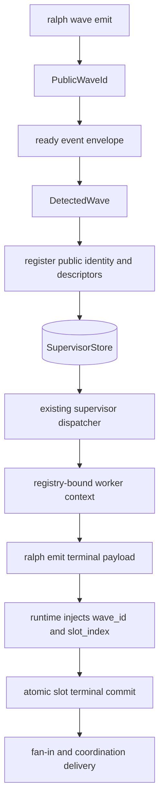
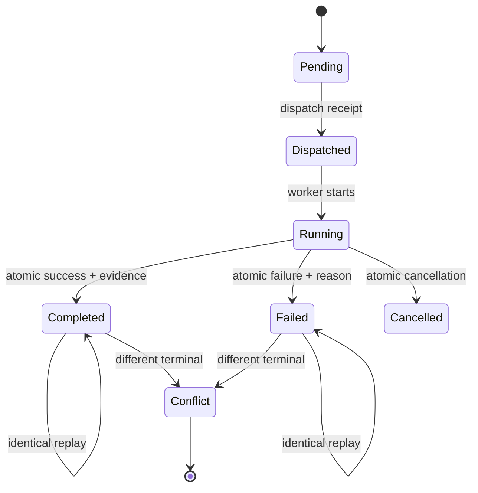
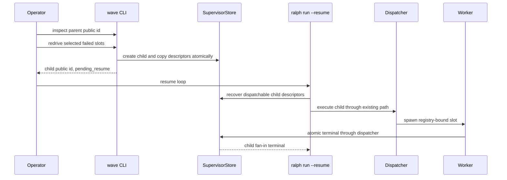

# fix: Supervisor Wave 单一身份、原子终态与可执行恢复闭环

## 0. 计划状态

**READY**

- **代码基线：** `1577108c3a9e4c83350d005e099202b37ae27e64`
- **调查范围：** wave emit/inspect/redrive CLI、SupervisorStore 双实现、SQLite schema v1-v8、bridge、dispatcher、worker emit 路径、fan-in/reconciliation、`ce-executor-supervisor` preset/schema、BDD/E2E、注入 skill 文档、Git 历史与相关计划。
- **已执行验证：** 源码调用链搜索、类型/SQL/测试静态核对、Git 历史核对、既有计划与 `docs/solutions/` 对照。
- **尚未执行验证：** 按 `ce-plan` 边界未运行构建或测试；执行期必须先得到各 Unit 规定的真实 Red，再依序 Green。
- **阻塞项：** 无。所有实施关键决策均达到 0.85。
- **工作树说明：** 调查时已有无关未跟踪文件 `docs/report/2026-07-27-implementation-review-primary-20260727-111552-diagnosis.md`；Executor 必须保留且不得纳入本计划提交。

---

## Goal Capsule

- **目标：** 让 `builtin:ce-executor-supervisor` 的 wave 从 emit、dispatch、worker terminal、fan-in、coordination delivery 到 operator redrive 始终使用一个公开身份，slot 终态只通过一个原子权威写入，并让 redrive 真正重新执行失败 slot。
- **权威顺序：** 本计划 Product Contract 与 KTD > 当前代码注释 > 既有 003/005/004/003 计划中未被当前源码兑现的描述。
- **执行方式：** 严格按 U1 → U2 → U3 → U4 → U5 → U6；每个 Unit 独立完成 Acceptance Red、Unit Red、Green、Refactor、Integration、Regression、Close。
- **停止条件：** Red 原因不符、发现新公开调用方、需要新依赖、变更超出已列文件边界、关键决策置信度降至 0.85 以下。
- **尾部责任：** U6 负责 preset/schema/skill 文档同步、真实 E2E、CLI 文档 drift、全量 nextest 门禁；不得把失败留为 residual 或降级断言。

---

## 1. 功能目标

业务目标是让 supervisor 主路径无需 Agent 猜测系统身份即可完成五槽执行、精确失败收敛和可恢复 redrive。调用方、当前/目标行为、输入输出、状态变化、错误语义、兼容性、性能、安全、范围与约束均由紧随其后的 `Product Contract` 规范性定义；R1-R20 是实施和验收的唯一需求基线。

---

## Product Contract

### Summary

本计划收敛过去数轮针对 supervisor 接缝的补丁：公开 `wave_id` 成为所有外部行为和恢复操作的唯一身份；内部数据库键保持不可见且持久映射；worker 的系统关联字段由 runtime 注入；slot 终态以单事务记录；redrive 在 resume 后通过原始 activation descriptor 重新走真实 dispatcher。

### Problem Frame

`primary-20260725-130345` 同时出现 envelope `w-rs-1`、worker envelope `w-2` 与 payload `w-<hash>`，完成事件无法闭合到五个 slot，最终所有 slot 被列为 blocking。报告之后代码增加了 public/store 映射、terminal evidence、salvage、redrive child row、channel registry、reconciliation 和四阶段 delivery commit，但这些补丁仍由多个事实源拼接。

当前主路径 E2E 在 `CoordinationCommitted` 未达成时不失败，而是只打印诊断；fake backend 直接写 JSONL，并在 payload 中手填 `wave_id`/`slot_index`。因此测试可以绕过 `ralph emit`、schema、runtime 注入和真实 coordination commit，无法证明 preset 的自动路径可运行。

当前 `ralph wave redrive` 只调用 `create_redrive_wave` 写 child wave/slot 行。child slot 没有原始 activation payload，CLI 也不启动 worker；文档所称“dispatcher 自动调度”没有对应消费调用链。

### Actors

- A1. Dispatcher hat：通过 `ralph wave emit` 创建公开 wave。
- A2. Loop runtime：检测 wave、注册 supervisor、spawn worker、驱动 fan-in。
- A3. Worker：提交业务结果，不负责生成系统关联字段。
- A4. SupervisorStore/Coordinator：持久化身份、activation、slot 终态和 delivery state。
- A5. Operator：inspect 并 redrive 失败 slot，随后 resume loop。
- A6. Preset 作者与 Coding Agent：依赖 schema、CLI help 和注入 skill 的公开契约。

### Requirements

#### Wave identity

- R1. `ralph wave emit` 返回的 public wave ID 是 event envelope、worker activation、业务 payload、inspect、coordination event、redrive parent/child 关系中唯一可见的 wave 身份。
- R2. SupervisorStore 可以保留内部数据库键，但必须以持久化唯一映射关联 public wave ID；任何公开 API、env、payload、diagnostic 或 task key 不得暴露内部键。
- R3. 同一 public wave ID 的重复注册必须校验 kind、slot count 和 activation digest；完全一致时幂等返回，冲突时 fail-closed。
- R4. 进程重启后不依赖 bridge 内存 `HashMap` 仍能通过 public wave ID 找到同一 store row。

#### Runtime-owned system fields

- R5. wave worker 调用 `ralph emit` 时，runtime 从经 channel registry 验证的 activation context 注入 payload `wave_id` 与 `slot_index`；Agent 不得手填。
- R6. Agent payload 若显式提供与 runtime context 冲突的 `wave_id` 或 `slot_index`，policy-check 与 apply 必须以相同稳定错误拒绝，且不得写任何事件。
- R7. 非 wave worker 不获得自动注入；普通 hat 现有 payload 语义保持不变。

#### Atomic slot terminal authority

- R8. Completed、Failed、Cancelled 每个 slot 终态通过一个 store 原子操作同时提交状态、failure reason 或 terminal evidence、content hash、event count 与 dispatch capacity release。
- R9. 同一终态证据的重复提交是幂等 no-op；冲突终态或不同 fingerprint 必须 fail-closed，原记录不变。
- R10. fan-in、reconciliation、blocking slots、salvage 和 task projection 只读取原子 slot terminal record，不再组合 `release_slot_dispatch`、`record_slot_result`、`record_slot_terminal_evidence` 的部分状态。

#### Executable redrive

- R11. 原始 dispatch 注册时持久化每个 slot 的 bounded activation descriptor：topic、payload、原 public slot index、kind、payload digest；不得持久化 prompt、agent stdout 或凭据。
- R12. `ralph wave redrive` 只为 Failed/Cancelled slot 创建 child attempt，并原子复制所选 activation descriptor；Completed slot 不得被选择。
- R13. redrive 重复请求按 parent public ID、原 slot index、attempt epoch 幂等返回同一 child public ID。
- R14. `ralph run --resume` 启动时发现 pending redrive child 后，必须用现有 supervisor dispatcher/worker executor 重新执行 descriptor；不得伪造 `exec.unit.done` 或绕过 FlowStepScope。
- R15. redrive child 成功后走正常 fan-in 与 coordination delivery；父 wave 历史状态和已 salvage 事件保持不变。
- R16. 没有可用 descriptor、store 损坏、descriptor digest 不匹配或 loop/preset 不匹配时 fail-closed，并由 inspect 输出可执行停止原因。

#### Proof and observability

- R17. 五槽 exec happy path 必须真实调用 `ralph emit`，最终五条 `exec.unit.done` 使用同一 public wave ID，store 达到 `CoordinationCommitted`，主 ledger 恰好一条 `exec.wave.complete`。
- R18. 一槽失败、四槽成功时，只失败槽进入 blocking/redrive 集合，成功槽业务事件完成 salvage，主 ledger 恰好一条 `exec.wave.failed`。
- R19. restart/redrive E2E 必须证明 child wave 真正 spawn worker 并完成，不以“child row 存在”代替执行成功。
- R20. 严禁根据失败路径条件削弱 E2E 断言、只打印诊断、直接拼 JSONL 或留下预期失败测试。

### Key Flows

- F1. Dispatcher emit：Agent payload → CLI 分配 public wave ID → envelope 写盘 → runtime 检测 → store 按 public ID 注册 descriptor。
- F2. Worker terminal：registry-bound activation → runtime 注入系统字段 → CLI schema/policy → private channel → dispatcher classification → 原子 terminal commit。
- F3. Successful fan-in：所有 slot 原子 Completed → business projection → salvage receipt → coordination write → coordination commit → `exec.wave.complete`。
- F4. Failed fan-in：至少一个原子 Failed → Completed-only salvage → per-slot reason → coordination commit → `exec.wave.failed`。
- F5. Redrive：operator inspect → redrive request/child descriptor → `ralph run --resume` → startup recovery → existing dispatcher spawn → child fan-in。

### Scope Boundaries

**本次范围**

- SupervisorStore identity 与 terminal API。
- SQLite migration 与 InMemory/Rusqlite differential contract。
- emit payload enrichment 与冲突校验。
- redrive descriptor、startup resume dispatch、inspect 输出。
- `ce-executor-supervisor` exec/fix/review 共用协议的 preset/schema/skill 文档。
- primary success、partial failure、restart/redrive 的真实 CLI E2E。

**非目标**

- 不重写通用 EventLoop、EventBus 或 Hat selection。
- 不新增 Web Dashboard UI。
- 不支持 Agent 在 loop 内调用 operator redrive。
- 不保留 Agent 手填系统字段的旧行为。
- 不自动 redrive 永久代码失败；operator 显式操作仍是恢复授权边界。
- 不修改无关 builtin preset 文案。

### Inputs, Outputs, State, and Errors

- **输入：** `ralph wave emit` payloads、public wave ID、registry-bound worker env、worker terminal payload、`ralph wave redrive --wave-id/--slots`、`ralph run --resume`。
- **输出：** public wave ID、schema-compliant worker terminal event、`*.wave.complete/failed`、inspect/redrive JSON、稳定 reason code。
- **状态变化：** emission reservation → runtime wave registration → slot activation → atomic terminal → delivery state；redrive parent → child attempt → resumed terminal/delivery。
- **错误语义：** identity conflict、activation conflict、system field conflict、terminal conflict、descriptor unavailable/corrupt、redrive invalid transition、store unavailable 均 fail-closed，无业务事件写入或部分终态覆盖。
- **兼容性：** 不兼容 Agent 手填系统字段；SQLite 既有 row 通过 migration 建立 public mapping，无法证明映射或 descriptor 的旧 redrive row 标记为不可恢复，不猜测。
- **性能：** 每次 worker terminal 最多一个 SQLite 写事务；identity lookup 使用唯一索引；descriptor 大小受 payload 上限约束，不增加 agent stdout 持久化。
- **安全/权限：** public ID 不泄漏 store path/key；descriptor 不含 prompt/secret；redrive 继续是 operator-only；channel registry 仍是 worker context 的授权来源。
- **已确认假设：** runtime registration 的 `idempotency_key` 当前就是 detected public wave ID；现有 emission row 已持久化 public ID；current worker env 已有 public ID 与 slot index。
- **待验证假设：** 无实施阻塞假设。执行期只能验证计划中已定义的 Red，不得新增架构选择。

---

## 2. 代码库现状与证据

### 2.1 当前实现入口

- **外部入口：** `crates/ralph-cli/src/wave.rs` 的 `WaveCommands::{Emit,Inspect,Redrive}`；worker terminal 入口为 `crates/ralph-cli/src/commands/emit.rs`。
- **主调用链：** `wave emit` → events JSONL → `crates/ralph-core/src/wave_detection.rs::DetectedWave` → `crates/ralph-cli/src/loop_runner/wave/dispatcher.rs::execute_wave_via_supervisor_with_executor` → `CoordinatorSupervisorBridge` → `SupervisorStore` → worker → `run_supervisor_fan_in`。
- **核心模块：** `crates/ralph-core/src/supervisor/{mod,memory,rusqlite,coordinator,reconciliation,recover}.rs`；CLI bridge/dispatcher/channel registry 位于 `crates/ralph-cli/src/loop_runner/wave/`。
- **数据边界：** `.ralph/supervisor.db` schema v1-v8；main events JSONL；per-wave private channel registry；task projection。
- **外部依赖：** SQLite/rusqlite、git worktree、backend adapter/PTY；本计划不新增 crate。
- **现有测试：** `crates/ralph-cli/tests/integration_supervisor_primary.rs`、`integration_wave_protocol_closure.rs`、`integration_supervisor_runtime_p0.rs`、`crates/ralph-cli/src/loop_runner/tests/wave_supervisor.rs`、supervisor unit tests、`crates/ralph-core/tests/scenarios/`。
- **构建验证：** 项目强制 nextest；最终入口 `./scripts/run-tests.sh`，禁止裸跑 `cargo test -p ralph-cli`。

### 2.2 Evidence Ledger

| Evidence ID | 来源 | 观察结果 | 对计划的影响 | 可靠性 |
| --- | --- | --- | --- | --- |
| E1 | `docs/report/2026-07-25-ce-executor-supervisor-primary-20260725-130345-diagnosis.md` | 同一 wave 出现三个 ID，五槽未闭合，operator 手工收尾 | 计划必须治理 identity 与恢复机制，不做单点补丁 | 高 |
| E2 | `CoordinatorSupervisorBridge::registered` | 内存 `HashMap` 把 dispatcher ID 映射到 store `w-{seq}` | 重启后映射不持久，U1 必须落库 | 高 |
| E3 | `RusqliteSupervisorStore::register_wave` | store 另行通过 `wave_id_seq` 分配 `w-{seq}` | public/store 双身份是当前设计事实 | 高 |
| E4 | `SupervisorStore::register_wave` 调用方 | bridge 把 detected public wave ID 当 `idempotency_key` 传入 | migration 可可靠回填 public mapping | 高 |
| E5 | `wave_emissions.public_wave_id` / `reserve_emission` | emit 已有持久 public ID 和唯一约束 | 不需要新增第三套 ID allocator | 高 |
| E6 | `commands/emit.rs` worker env handling | envelope 已从 env 写 `wave_id/wave_index`，payload 未注入 | U2 在现有 CLI normalization 边界扩展 | 高 |
| E7 | `presets/schemas/ce-executor-supervisor.yml` | `exec/fix.unit.done/failed` 要求 payload `wave_id/slot_index` | schema/preset 必须和 runtime-owned fields 同步 | 高 |
| E8 | `ce-executor-supervisor.yml` dispatcher instruction | Agent 被要求手工生成 payload `wave_id`，同时 CLI 另返回 wave ID | instruction 继续制造双真相 | 高 |
| E9 | `TerminalEvidence` 与 SupervisorStore trait | terminal status、result、evidence、release 是分开的写方法 | U3 需要单一原子 terminal operation | 高 |
| E10 | `migrations/v4.sql`、`wave_slots` | evidence 已与 slot row 共表 | 原子提交无需新表，可扩展现有 row/事务 | 高 |
| E11 | `run_supervisor_fan_in` | fan-in 包含 reconciliation、salvage、重 tick、delivery commit | U3 应简化读取权威，不能再加旁路 | 高 |
| E12 | `create_redrive_wave` 双实现 | 只创建 child wave/slot，未复制原 activation | 当前 redrive 无法重放真实工作 | 高 |
| E13 | `wave.rs::execute_redrive` | CLI 只调用 store API 并打印 child ID，不触发 dispatcher | 文档“自动调度”与代码不符，U4 必须补消费链 | 高 |
| E14 | `recover_active_waves_at_startup` / `recover_pending_projections` | startup 只恢复 snapshot/projection，没有构造 worker activation | redrive 执行应扩展 startup recovery seam | 高 |
| E15 | `integration_supervisor_primary.rs::fake_backend_script` | worker 和 dispatcher 直接拼 JSONL，payload 手填系统字段 | U5 必须改为真实 CLI emit | 高 |
| E16 | `integration_supervisor_primary.rs` fan-in 断言 | `CoordinationCommitted` 失败时进入 else 打印诊断而不 fail | U5 第一个 Red 必须恢复严格断言 | 高 |
| E17 | 同文件注释 | 历史 full-chain/fault 测试因脆弱被删除 | 新 E2E 只覆盖本计划关键链路，使用 replay/fake backend，不模拟所有 hat | 高 |
| E18 | `docs/solutions/supervisor-redrive/redrive-cli.md` | 文档声称 child 由 dispatcher 自动调度 | U4 完成前文档是错误公开契约 | 高 |
| E19 | migrations v1-v8 | 已有 additive migration runner 与并发打开保护 | U1/U4 应增加 v9/v10 migration，不新建存储系统 | 高 |
| E20 | Git 2026-07-25 至 2026-07-27 历史 | 多轮提交分别修 identity leak、timeout、reconciliation、channel、delivery | 计划以机制收敛和删除旁路为目标 | 高 |
| E21 | `AGENTS.md` HARD RULE 5 | spawn ralph 的测试必须 scrub 外层 hat env | 所有新 CLI/E2E 必须用 `common::ralph_bin()` | 高 |
| E22 | `AGENTS.md` skill/preset 同步规则 | CLI/event/preset 变更必须同步 data skills、operator skills、schema 并跑 drift | U6 文件和门禁不可省略 | 高 |

### 2.3 受影响范围

- **生产模块：** supervisor trait/store/migrations/coordinator/reconciliation/recovery；CLI wave/emit；loop runner bridge/dispatcher/channel registry/task projection。
- **测试模块：** supervisor unit/differential tests、wave supervisor tests、CLI wave integration、primary supervisor E2E、真实 runtime BDD。
- **配置/preset：** `presets/en/ce-executor-supervisor.yml`、`presets/schemas/ce-executor-supervisor.yml`。
- **数据：** `supervisor.db` 新 migration、wave/slot/descriptor/redrive rows。
- **CLI：** `ralph wave inspect`、`ralph wave redrive`、wave-worker `ralph emit`。
- **Agent 文档：** `crates/ralph-core/data/ralph-tools-{emit,wave,cmdref}.md`；preset operator references。
- **调用方：** dispatcher、worker、integrator/failure-handler、operator、resume startup。
- **构建目标：** `ralph-core`、`ralph-cli`、`ralph-e2e`；workspace full gate。
- **UI/外部服务：** 无。

---

## Planning Contract

## 3. 决策记录与置信度

| Decision ID | 决策问题 | 候选方案 | 最终选择 | 支持证据 | 排除其他方案的原因 | 置信度 |
| --- | --- | --- | --- | --- | --- | --- |
| D1 | 如何消除 public/store 身份漂移 | 删除内部键；只加内存映射；持久 public→internal 映射并类型隔离 | 持久唯一映射 + `PublicWaveId`/`StoreWaveKey` 新类型；公开 trait 只收 public ID（session-settled: user-approved — 选择机制级单一身份权威，不继续调用点补丁） | E2-E5、E19 | 删除内部键扩大所有 FK migration；内存映射已被事故否定 | 0.94 |
| D2 | 重复 runtime 注册语义 | DuplicateKey 错误；无条件复用；比较契约后幂等 | 同 public ID 且 kind/total/digest 一致时复用，否则 conflict | E3-E5 | 纯错误破坏 fan-in re-entry；无条件复用隐藏 payload drift | 0.93 |
| D3 | 系统字段由谁生成 | Agent 手填；dispatcher 改 payload；worker CLI 基于 registry context 注入 | worker CLI 在 policy/schema 前注入并拒绝冲突 | E6-E8 | Agent 手填是根因；dispatcher 无法覆盖 worker terminal payload | 0.95 |
| D4 | slot 终态存储边界 | 继续多方法补偿；新增 side table；单事务更新现有 slot row | 新增 typed `commit_slot_terminal`，双 store 同契约 | E9-E11 | 多方法可部分成功；side table制造新事实源 | 0.95 |
| D5 | redrive 如何获得原工作 | 从主 ledger 猜；要求 operator 重输 payload；注册时持久 bounded descriptor | 持久 descriptor，child 原子复制 | E12-E14 | ledger 可能已 rotate/salvage；人工重输不可审计 | 0.92 |
| D6 | redrive 如何真正 spawn | CLI 自建 executor；伪造 ready/done；resume startup 复用 dispatcher | `redrive` 创建 pending child，`ralph run --resume` 消费 descriptor 并复用现有 dispatcher（session-settled: user-approved — recovery 必须成为正式控制面） | E12-E14 | CLI 缺 backend/loop authority；伪造事件绕过 FlowStepScope | 0.90 |
| D7 | 真实验收边界 | 单元 mock；直接 JSONL fake；fake backend 调真实 CLI + SQLite/worktree/runtime | 后者，限制到 exec success/failure/redrive 三条主链 | E15-E17 | 前两者无法验证事故接口；完整 12-hat 模拟历史上脆弱 | 0.94 |
| D8 | 旧系统字段兼容 | 接受手填且覆盖；接受一致值；完全拒绝显式系统字段 | wave worker 显式字段一律与注入值比较：一致也拒绝并提示删除（session-settled: user-approved — 无兼容保留） | 用户确认、E7-E8 | 接受一致值继续把协议责任留给 Agent | 0.88 |
| D9 | 新依赖 | 新 transaction/event-sourcing crate；复用 serde/rusqlite/sha2 | 不新增依赖 | E5、E10、E19 | 仓库已有所需能力，新依赖无收益 | 0.96 |

### High-Level Technical Design

#### Identity and dispatch data flow



#### Slot terminal state machine



#### Redrive sequence



### Implementation Constraints

- 不新增平行 ledger、sidecar 或第二套 dispatcher。
- internal store key 只能存在于 store 实现内部；trait DTO/CLI JSON 禁止携带。
- descriptor 必须有大小上限并复用现有 event payload 上限。
- `--policy-check` 与 apply 使用同一个 payload normalization 函数。
- terminal commit 在 SQLite 中是一个事务，在 InMemory 中是一次锁内更新。
- redrive 不自动启动新进程；CLI 明确返回 `pending_resume`，operator 执行 `ralph run --resume`。
- 不为旧 redrive child 的空 descriptor 猜测 payload；inspect 标记 `descriptor_unavailable`。

---

## 4. BDD 行为规格

```gherkin
Feature: Supervisor wave 使用单一公开身份

  Background:
    Given supervisor 已启用且 wave 通过 ralph wave emit 创建

  Scenario S1: 五槽 wave 在 emit、worker、store 和 coordination 中使用同一 public wave ID
    Given dispatcher 发出五个 exec.unit.ready
    When 五个 worker 通过 ralph emit 提交完成
    Then 每个 ready/done envelope 与 payload 都包含 emit 返回的 public wave ID
    And inspect 通过该 ID 返回五个 Completed slot
    And 内部 store key 不出现在事件、任务或 CLI JSON

  Scenario S2: 重启后相同 public wave ID 解析到同一 store row
    Given wave 已注册且进程内 bridge mapping 已丢失
    When 新进程执行 inspect 或 fan-in re-entry
    Then 它从持久 mapping 找到原 row
    And 不创建第二个 runtime wave

  Scenario S3: 同 public wave ID 携带不同 activation contract
    Given store 已注册 kind=exec total=5 的 public wave
    When runtime 以相同 ID 注册 kind=exec total=4 或不同 digest
    Then 注册失败为 identity_contract_conflict
    And 原 wave 和 slot 不变化
```

```gherkin
Feature: Worker 系统关联字段由 runtime 注入

  Scenario S4: worker 只提供业务字段也能通过 schema
    Given registry 验证了 public wave ID 和 slot index
    When worker 执行 ralph emit exec.unit.done 且 payload 只有 content_hash
    Then CLI 在 schema 校验前注入 wave_id 与 slot_index
    And private channel 只写一条完整 terminal event

  Scenario S5: worker 尝试手填系统字段
    Given worker 的可信 context 是 wave W slot 2
    When payload 显式包含 wave_id 或 slot_index
    Then policy-check 与 apply 都拒绝 system_field_owned_by_runtime
    And events file 不新增记录

  Scenario S6: 普通 hat emit
    Given RALPH_WAVE_WORKER 未设置
    When普通 hat 提交非 wave 业务事件
    Then payload 不被添加 wave_id 或 slot_index
```

```gherkin
Feature: Slot terminal 是单一原子事实

  Scenario S7: 成功终态原子提交
    Given slot 正在 Running
    When dispatcher 提交 Completed terminal record
    Then status、evidence、content hash、event count 和 capacity release 同时可见
    And fan-in 不可能观察到 Completed 但 evidence 缺失

  Scenario S8: terminal persistence 中途失败
    Given SQLite 在 terminal transaction commit 前失败
    When dispatcher 提交终态
    Then slot 保持原状态
    And 不存在部分 result/evidence/release

  Scenario S9: 重复和冲突终态
    Given slot 已以 fingerprint A Completed
    When相同 record 重放
    Then返回幂等成功
    When不同 fingerprint 或 Failed record 重放
    Then返回 terminal_conflict 且原记录不变

  Scenario S10: 部分失败 fan-in
    Given四槽 Completed 且一槽 Failed
    When fan-in 收敛
    Then blocking_slots 只包含失败槽
    And四个完成事件完成 salvage
    And恰好一条 exec.wave.failed 达到 CoordinationCommitted
```

```gherkin
Feature: Operator redrive 真正重新执行失败 slot

  Scenario S11: 创建并 resume child redrive
    Given父 wave 有一个 Failed slot 且 descriptor 完整
    When operator redrive 该 slot 并执行 ralph run --resume
    Then child wave 复制原 descriptor 并 spawn 一个 worker
    And worker 通过正常 terminal/fan-in 路径完成
    And父 wave 历史不变化

  Scenario S12: 重复 redrive
    Given同一 parent/slot/epoch 已创建 child
    When并发或重复提交相同 redrive
    Then返回同一 child public ID
    And只存在一个 child descriptor 和一次 worker dispatch

  Scenario S13: descriptor 不可用或损坏
    Given旧 wave 没有 descriptor 或 digest 不匹配
    When operator redrive 或 resume
    Then命令 fail-closed 并返回 descriptor_unavailable 或 descriptor_conflict
    And不得 spawn worker

  Scenario S14: Completed slot 被选择
    Given父 wave 的 slot 已 Completed
    When operator 指定该 slot redrive
    Then命令拒绝 rejected_terminal
    And父子 wave 均不变化
```

---

## 5. 验收与测试策略

| Scenario | 验收条件 | 测试入口 | 推荐测试层级 | 风险补充测试 | 是否需要 E2E |
| --- | --- | --- | --- | --- | --- |
| S1 | 所有外部记录同 public ID，internal key 不泄漏 | `integration_supervisor_primary` | CLI/runtime 集成 | Differential 双 store | 是 |
| S2 | reopen 后同 row、无 duplicate | supervisor store tests | SQLite 集成 | Restart/Idempotency | 否 |
| S3 | contract drift fail-closed | store protocol tests | 单元+SQLite | Property 组合 | 否 |
| S4 | payload 仅业务字段仍通过 | emit tests + primary E2E | CLI 集成 | Contract | 是 |
| S5 | policy/apply 同拒绝且零写 | emit tests | 单元+CLI | Security negative | 否 |
| S6 | 非 worker 不注入 | emit tests | 单元 | Characterization | 否 |
| S7 | terminal fields 同时可见 | memory/rusqlite differential | 单元+SQLite | State-machine | 否 |
| S8 | transaction fault 零部分写 | rusqlite tests | SQLite fault injection | Fault Injection | 否 |
| S9 | replay no-op、conflict 拒绝 | store protocol tests | 单元+SQLite | Idempotency | 否 |
| S10 | blocking/salvage/failed 精确 | wave supervisor + primary fault | 集成 | State-machine | 是 |
| S11 | child 真 spawn 且完成 | primary redrive E2E | runtime E2E | Restart | 是 |
| S12 | child/dispatch 恰好一次 | redrive store + E2E | Concurrency 集成 | Concurrency | 是 |
| S13 | 缺失/腐坏 descriptor fail-closed | wave CLI + startup recovery | 集成 | Fault Injection | 否 |
| S14 | Completed 不可 redrive | redrive tests | 单元+CLI | Negative contract | 否 |

每个测试必须同时断言业务结果、副作用与不变量：主 ledger 事件计数、store phase/delivery state、slot 集合、父 wave 不变、无内部 key 泄漏。选择最低层级证明纯规则，只有 S1/S4/S10/S11/S12 使用真实进程 E2E。

---

## 6. 需求—测试追踪矩阵

| Requirement ID | 需求 | Scenario | 验收测试 | 单元测试 | 集成/契约测试 | E2E | Evidence |
| --- | --- | --- | --- | --- | --- | --- | --- |
| R1-R4 | 单一 public identity | S1-S3 | public ID closure | newtype/registration | 双 store/reopen | primary success | E2-E5 |
| R5-R7 | runtime-owned fields | S4-S6 | emit contract | normalization/conflict | policy/apply parity | primary success | E6-E8 |
| R8-R10 | atomic terminal | S7-S10 | terminal closure | state/replay | SQLite fault/fan-in | partial failure | E9-E11 |
| R11-R16 | executable redrive | S11-S14 | redrive resume | descriptor/selection | store/CLI/startup | restart/redrive | E12-E14 |
| R17-R20 | strict proof | S1,S4,S10-S12 | strict E2E | no conditional pass | real CLI/store/worktree | 三条 | E15-E17 |

---

## 7. 严格串行开发单元

```text
U1
  ↓ 全部测试、重构和回归完成
U2
  ↓ 全部测试、重构和回归完成
U3
  ↓ 全部测试、重构和回归完成
U4
  ↓ 全部测试、重构和回归完成
U5
  ↓ 全部测试、重构和回归完成
U6
```

### U1. PublicWaveId 成为持久身份权威

#### 1. Unit 目标

进程重启前后，所有 store/bridge/runtime 入口都以同一个 public wave ID 定位同一 wave，内部数据库键不再进入公开协议。

#### 2. 对应需求与 Scenario

- Requirements：R1-R4。
- Scenarios：S1-S3。
- Decisions：D1、D2、D9。
- Evidence：E2-E5、E19。

#### 3. 外部可观察结果

`ralph wave inspect <emit-returned-id>` 直接返回 runtime slot snapshot；E2E 不再枚举 `w-1..w-31` 猜 store ID；reopen 后结果不变；CLI JSON、events、task keys 没有 internal key。

#### 4. 当前行为基线

`RusqliteSupervisorStore::register_wave` 分配 `w-{seq}`；bridge 用进程内 map 保存 public→store；primary E2E 的 `store_snapshots` 枚举 internal ID。新增 acceptance test 必须先证明 reopen 后 bridge 无法用 public ID直接 fan-in/inspect。

#### 5. 输入与输出

- 输入：public ID、kind、expected total、activation digest、retry budget。
- 输出：typed wave handle/snapshot，公开字段只含 public ID。
- 错误：`identity_contract_conflict`。
- 状态：migration 建立 unique public mapping。
- 不变量：internal key 不改变现有 FK；同 public ID 只对应一 row。

#### 6. 修改位置

- `crates/ralph-core/src/supervisor/mod.rs`：新增 `PublicWaveId`、内部 `StoreWaveKey`、注册契约 DTO。
- `crates/ralph-core/src/supervisor/{memory,rusqlite}.rs`：public lookup、幂等 contract compare。
- `crates/ralph-core/src/supervisor/migrations.rs` 与计划新增 `crates/ralph-core/src/supervisor/migrations/v9.sql`：public mapping、unique index、backfill。
- `crates/ralph-core/src/supervisor/bridge.rs`、`crates/ralph-cli/src/loop_runner/wave/supervisor_bridge.rs`：删除进程内 authoritative map，bridge 只传 public ID。
- `crates/ralph-cli/src/loop_runner/wave/dispatcher.rs`：不再 re-derive store ID。
- `crates/ralph-cli/src/wave.rs`：inspect runtime snapshot 优先，再回退 emission-only state。
- 测试：现有 supervisor memory/rusqlite/protocol、`wave_supervisor.rs`、`integration_supervisor_primary.rs`。

不修改 worker payload、terminal API、redrive dispatch。

#### 7. 可依赖能力

现有 `wave_emissions.public_wave_id`、SQLite migration runner、SHA-256 digest、双 store differential tests。

#### 8. 禁止依赖的未来能力

不得提前实现 payload 注入、atomic terminal 或 descriptor。

#### 9. 验收测试

- 名称：`public_wave_id_survives_store_reopen_and_drives_fan_in`。
- 层级：SQLite integration。
- 前置：emit/runtime registration 后关闭并重开 store。
- 动作：仅用 public ID inspect、record/fan-in。
- 断言：同一 row、slot count 不变、无 duplicate、snapshot.wave_id=public。
- 副作用：waves row 数不增加。
- 不变量：internal key 不序列化。
- 命令：`cargo nextest run -p ralph-core -- supervisor`；`cargo nextest run -p ralph-cli -- wave_supervisor`。

#### 10. Acceptance Red

先运行新增 reopen test；预期 `UnknownWave(public-id)` 或 bridge 需要内存 map。编译错误、DB fixture 未创建、错误测试过滤器不是有效 Red。

#### 11. 单元测试拆分

- `PublicWaveId` 拒绝空白、允许当前 `w-*` 公开格式。
- 同 public/kind/total/digest 重注册返回同 handle。
- 同 public 不同 total/kind/digest 返回 conflict。
- memory 与 SQLite 返回相同结果。
- migration backfill 后 public lookup 成功。
- 不 mock SQLite migration 和 reopen。

#### 12. Red → Green → Refactor 顺序

reopen acceptance Red → public mapping migration/lookup Green → contract-conflict unit Red → typed registration Green → bridge/fan-in Red → 删除内存 map并 Green → Refactor 所有 string 参数 → integration/regression。

#### 13. 最小实现范围

新增类型、持久 mapping、幂等 contract compare、公开 lookup；保留内部 FK key但隔离；删除 bridge authoritative map和 internal ID日志。不得改变 phase/delivery 算法。

#### 14. 集成验证

真实 Rusqlite reopen、bridge registration、fan-in status；InMemory 仅用于 differential。运行本 Unit 两条 nextest 命令。

#### 15. 风险驱动测试

- Migration：v8 DB backfill、fresh v9 DB、并发相同 public ID。
- Property：kind/total/digest 任一变化必冲突。
- Security：inspect JSON 不含 internal/store/db path。

#### 16. 回归范围

emission reservation、inspect、backpressure、recovery、redrive parent lookup、task projection、review/exec/fix store tests；它们都使用 wave lookup。

#### 17. 预期文件变更

| 位置 | 变更类型 | 变更原因 | Evidence |
| --- | --- | --- | --- |
| `crates/ralph-core/src/supervisor/mod.rs` | 修改生产文件 | typed identity/API | E3-E5 |
| `crates/ralph-core/src/supervisor/memory.rs` | 修改生产文件 | differential mapping | E3 |
| `crates/ralph-core/src/supervisor/rusqlite.rs` | 修改生产文件 | persistent mapping | E3 |
| `crates/ralph-core/src/supervisor/migrations.rs` | 修改生产文件 | schema version | E19 |
| `crates/ralph-core/src/supervisor/migrations/v9.sql` | 新增 migration | public mapping | E19 |
| bridge/dispatcher/wave files | 修改生产文件 | 删除内存权威 | E2 |
| existing supervisor/wave tests | 修改测试 | strict public contract | E15-E16 |

#### 18. 完成标准

Scenario S1-S3 全绿；双 store/reopen/并发测试绿；build/clippy/fmt 与相关回归绿；无 skip/弱化断言；Evidence/Decision 未下降；可独立提交。

#### 19. 停止条件

发现 runtime registration 的 idempotency key 不等于 public ID、存在未列外部 store consumer、migration 不能无损回填 active wave，立即停止并按“新证据→影响分析→重新决策→重算置信度”修订计划。

#### 20. 风险与注意事项

风险是 string/newtype 扩散与 migration FK 误写；通过保留内部键、增加 unique mapping、双 store differential 和 reopen test控制。剩余风险仅是旧 redrive child 无 descriptor，U4明确 fail-closed。

### U2. Wave worker payload 系统字段由 runtime 注入

#### 1. Unit 目标

worker 只提交业务字段即可形成 schema-compliant terminal event；Agent 手填 `wave_id/slot_index` 被一致拒绝。

#### 2. 对应需求与 Scenario

R5-R7；S4-S6；D3、D8；E6-E8。

#### 3. 外部可观察结果

`ralph emit exec.unit.done --json '{"content_hash":"h"}'` 在可信 worker context 下成功；事件 payload 自动含 public ID和原 slot；显式系统字段返回 `system_field_owned_by_runtime` 且零写。

#### 4. 当前行为基线

CLI 只给 envelope 加 `wave_id/wave_index`；schema 要求 payload字段；preset让 Agent手填。新增 policy-check test 首先因 missing required fields 失败。

#### 5. 输入与输出

输入是 Agent JSON payload与 registry-bound env；输出是 normalized payload；错误为 context incomplete/system field owned；非 worker不变化。

#### 6. 修改位置

- `crates/ralph-cli/src/commands/emit.rs`：在 dimension/schema/policy 共用前加入纯 normalization。
- `crates/ralph-cli/src/cli/emit_path.rs`、`loop_runner/wave/channel_registry.rs`：复用已验证 context，不新增信任来源。
- `crates/ralph-cli/src/policy_check.rs` 或现有 payload contract入口：policy/apply共用 normalized payload。
- `presets/en/ce-executor-supervisor.yml`、schema：Agent payload contract去掉系统字段手填说明，最终 event schema仍验证注入后字段。
- emit unit/integration tests。

不修改 slot terminal persistence或 redrive。

#### 7. 可依赖能力

U1 public ID、现有 atomic registry binding、`RALPH_WAVE_WORKER/ID/INDEX/LOOP_ID`完整性门禁。

#### 8. 禁止依赖的未来能力

不得调用 U3 terminal API，不持久 descriptor。

#### 9. 验收测试

policy-check与apply各一条 success和conflict；断言最终payload、envelope、文件行数；命令 `cargo nextest run -p ralph-cli --bin ralph -- emit` 与污染环境相关 integration。

#### 10. Acceptance Red

仅业务字段的 policy-check 当前因 schema missing `wave_id/slot_index` 失败；这是有效 Red。配置缺失、env不完整不是有效 Red。

#### 11. 单元测试拆分

纯对象注入、显式字段拒绝、非 object payload拒绝、非 worker passthrough、policy/apply differential、slot index边界。不得 mock registry授权判断。

#### 12. Red → Green → Refactor 顺序

policy-check Red → normalization Green → apply Red →复用同 helper Green → conflict tests Red/Green → non-worker characterization → preset/schema refactor → integration/regression。

#### 13. 最小实现范围

只注入 `wave_id/slot_index`；不注入业务 `content_hash/reason/dimension`；不接受显式字段；不改变 envelope。

#### 14. 集成验证

真实 `common::ralph_bin()`、真实 registry fixture、真实events file；不允许直接调用写文件helper代替 CLI。

#### 15. 风险驱动测试

Security negative：伪造env无registry、跨slot、显式冲突；Contract：schema view与最终 normalized event一致。

#### 16. 回归范围

普通hat emit、`--policy-check` ticket、dimension assignment、step handoff、origin guard、P6 allowlist。

#### 17. 预期文件变更

| 位置 | 变更类型 | 变更原因 | Evidence |
| --- | --- | --- | --- |
| `crates/ralph-cli/src/commands/emit.rs` | 修改生产文件 | payload normalization | E6 |
| `crates/ralph-cli/src/cli/emit_path.rs` | 修改生产文件 | trusted context reuse | E6 |
| `presets/en/ce-executor-supervisor.yml` | 修改 preset | 删除手填要求 | E8 |
| `presets/schemas/ce-executor-supervisor.yml` | 修改 schema | runtime-owned contract | E7 |
| existing emit tests | 修改/新增测试 | policy/apply parity | E6 |

#### 18. 完成标准

S4-S6、emit与preset targeted tests、build/clippy/fmt通过；无Agent手填示例残留；Unit可独立提交。

#### 19. 停止条件

发现 schema校验无法共享normalized payload、registry不在CLI可验证边界或需要新权限来源时停止重决策。

#### 20. 风险与注意事项

最大风险是 policy-check与apply漂移；强制一个纯helper和differential test。剩余风险是旧外部脚本手填字段，按确认范围不兼容并给稳定错误。

### U3. Slot terminal 原子提交成为唯一完成事实

#### 1. Unit 目标

dispatcher提交一次 terminal record 后，slot状态、证据、result和capacity同时成功或同时失败。

#### 2. 对应需求与 Scenario

R8-R10；S7-S10；D4；E9-E11。

#### 3. 外部可观察结果

fan-in不能再观察到 Completed但无evidence；blocking slots精确；冲突重放不覆盖；SQLite故障无半写。

#### 4. 当前行为基线

trait分开暴露release/result/evidence/failure；dispatcher多步调用；reconciliation为部分状态补偿。

#### 5. 输入与输出

typed `SlotTerminalRecord`；返回Committed/Idempotent；错误Conflict/Unknown/Invalid；单事务状态变化。

#### 6. 修改位置

`supervisor/mod.rs` trait和record；memory/rusqlite双实现；coordinator/reconciliation；core bridge和CLI bridge；dispatcher outcome classifier/record path；store tests与wave supervisor tests。

不改变delivery四阶段协议或redrive。

#### 7. 可依赖能力

U1 identity；现有TerminalEvidence/fingerprint/first-terminal-wins；现有SQLite transaction。

#### 8. 禁止依赖的未来能力

不得实现descriptor或resume dispatch。

#### 9. 验收测试

双store contract：commit后一次snapshot读到完整字段；fault injection后全无；fan-in partial failure只列失败slot。命令 `cargo nextest run -p ralph-core -- supervisor`、`cargo nextest run -p ralph-cli -- wave_supervisor`。

#### 10. Acceptance Red

新增“在release后、evidence前注入错误”测试当前观察到部分状态；有效Red必须命中真实transaction seam，不是mock panic。

#### 11. 单元测试拆分

Completed必含evidence/result；Failed必含reason且无success evidence；Cancelled reason；identical replay；fingerprint conflict；status conflict；SQLite rollback；memory differential。

#### 12. Red → Green → Refactor 顺序

fault Red → SQLite transaction Green → memory differential Red/Green → replay/conflict Red/Green → dispatcher切换 Red/Green → 删除旧写调用 → fan-in regression。

#### 13. 最小实现范围

新增一个authoritative mutation；旧细粒度trait方法降为内部或测试迁移后删除；reconciliation只处理ledger projection，不修store半状态。

#### 14. 集成验证

真实dispatcher classification→bridge→Rusqlite→fan-in；merge sink可Fake，terminal store不可Mock。

#### 15. 风险驱动测试

State-machine、Fault Injection、Idempotency、Concurrency；风险来自重复worker终态和SQLite commit失败。

#### 16. 回归范围

retry classifier、timeout/cancel、review dimension evidence、salvage、delivery commit、backpressure capacity、task projection。

#### 17. 预期文件变更

| 位置 | 变更类型 | 变更原因 | Evidence |
| --- | --- | --- | --- |
| supervisor trait/store/coordinator/reconciliation | 修改生产文件 | atomic authority | E9-E11 |
| core/CLI bridge | 修改生产文件 | single API | E9 |
| dispatcher | 修改生产文件 | single commit caller | E11 |
| supervisor/wave tests | 修改/新增测试 | state/fault proof | E9-E10 |

#### 18. 完成标准

S7-S10全绿；旧分步生产调用为零；双store/fault/fan-in回归绿；Unit独立提交。

#### 19. 停止条件

发现某调用方必须在terminal前释放capacity或事务跨外部I/O时停止；重新划分“store原子状态”与“外部projection”但不得恢复多事实源。

#### 20. 风险与注意事项

锁持有时间必须仅覆盖内存/SQL写，不包JSONL或git I/O。通过transaction边界和并发测试检测。

### U4. Redrive 持久化 descriptor 并由 resume 真正派发

#### 1. Unit 目标

operator创建redrive child后，`ralph run --resume` 能通过现有dispatcher真实重跑选定失败slot。

#### 2. 对应需求与 Scenario

R11-R16；S11-S14；D5、D6；E12-E14、E18。

#### 3. 外部可观察结果

redrive JSON返回child public ID和`pending_resume`；resume后inspect显示dispatch→terminal；worker实际启动；父wave不变。

#### 4. 当前行为基线

`execute_redrive`只写child行；child slot按0重新编号且无原payload；startup recovery只做snapshot/projection。新增CLI integration首先应看到child永久Pending且无worker。

#### 5. 输入与输出

原activation descriptor、选择的原slot、parent public ID、epoch；child descriptor保留原slot identity；错误descriptor unavailable/conflict/preset mismatch。

#### 6. 修改位置

- `supervisor/mod.rs` descriptor/redrive/recovery DTO和trait。
- memory/rusqlite + migration runner与计划新增 `crates/ralph-core/src/supervisor/migrations/v10.sql`。
- `wave.rs::execute_redrive` JSON/text状态和拒绝语义。
- `supervisor/recover.rs`、CLI runner startup、wave dispatcher：消费dispatchable descriptor并复用existing executor。
- `task_projection.rs`：child slot task状态。
- redrive/core/CLI integration tests。

不新增CLI自有executor，不自动启动resume进程。

#### 7. 可依赖能力

U1 public identity、U3 atomic terminal、现有DetectedWave/CompletedWave/dispatcher executor、startup store wiring。

#### 8. 禁止依赖的未来能力

不得依赖U5 E2E脚本；本Unit必须用较低层CLI/runtime integration证明spawn seam。

#### 9. 验收测试

临时git repo/store、失败parent descriptor、CLI redrive、resume runner；断言backend marker被触发、child terminal、parentsnapshot字节等价。运行 `cargo nextest run -p ralph-core -- redrive`、`cargo nextest run -p ralph-cli -- wave_redrive`（新增测试名过滤）。

#### 10. Acceptance Red

当前redrive后child只有Pending row且backend marker不存在；这证明缺少消费链。UnknownWave或fixture backend失败不是有效Red。

#### 11. 单元测试拆分

descriptor roundtrip/digest/size；选择Failed/Cancelled；拒绝Completed；child复制原slot index；并发幂等；旧无descriptor拒绝；startup只消费pending child一次；preset/kind mismatch。

#### 12. Red → Green → Refactor 顺序

descriptor store Red/Green → child copy Red/Green → startup recovery DTO Red/Green → spawn integration Red/Green → concurrent idempotency → inspect/output Refactor → regression。

#### 13. 最小实现范围

持久bounded descriptor；redrive transaction创建child+descriptors；resume调用existing dispatcher；稳定输出。不得自动修代码失败、不得改父ledger。

#### 14. 集成验证

必须真实使用Rusqlite、resume startup、worker executor；backend内容可Fake，store/dispatcher不可Mock。

#### 15. 风险驱动测试

Restart、Concurrency、Fault Injection、size/parse negative。风险是duplicate spawn、descriptor泄密、slot重编号。

#### 16. 回归范围

recover active waves、task projection、backpressure、worktree binding、channel registry、redrive idempotency、inspect、loop resume。

#### 17. 预期文件变更

| 位置 | 变更类型 | 变更原因 | Evidence |
| --- | --- | --- | --- |
| supervisor trait/store/recover | 修改生产文件 | descriptor + recovery | E12-E14 |
| `crates/ralph-core/src/supervisor/migrations/v10.sql` | 新增 migration | durable descriptors | E19 |
| `crates/ralph-cli/src/wave.rs` | 修改CLI | truthful redrive state | E13,E18 |
| runner/dispatcher/task projection | 修改生产文件 | resume dispatch | E14 |
| redrive tests | 修改/新增测试 | real execution | E12 |

#### 18. 完成标准

S11-S14全部通过；child真spawn；并发恰好一次；父不变；无descriptor fail-closed；Unit独立提交。

#### 19. 停止条件

descriptor包含无法安全持久化的数据、resume无法获得同preset/backend、existing dispatcher不能接受恢复DTO时停止重新决策；不得在wave CLI复制executor。

#### 20. 风险与注意事项

descriptor仅保存原ready event payload与必要元数据；沿用payload上限和digest。操作员必须显式resume，避免CLI暗中启动长进程。

### U5. 真实 CLI 主路径门禁必须拒绝任何未闭合执行

#### 1. Unit 目标

建立一个可观察行为：真实 CLI 主路径中任一预期 coordination 未提交时，测试进程必定非零失败；三类 fixture 只是对同一门禁机制的参数化输入。

#### 2. 对应需求与 Scenario

R17-R20；S1、S4、S10-S12；D7；E15-E17。

#### 3. 外部可观察结果

测试门禁只接受完整终态：五槽成功必须有一条 complete；部分失败必须有一条 failed 且 blocking 精确；redrive child 必须真实完成。任一条件缺失都导致测试失败，测试不直接写 JSONL。

#### 4. 当前行为基线

primary fake backend直接append；coordination失败时conditional pass；full fault测试被删除。第一步恢复严格断言应在当前代码因delivery未committed失败。

#### 5. 输入与输出

temp git repo、builtin preset、fake backend调用真实ralph CLI、5-slot plan；输出events/store/worktree/backend markers。

#### 6. 修改位置

仅修改 `crates/ralph-cli/tests/integration_supervisor_primary.rs`：在该文件现有 fake backend script/helper 内改为调用同一测试 binary 的真实 `ralph emit`，并加入参数化 fault-injection fixture。不得新增 source-only scenario 或修改生产文件。

不修改生产逻辑；若测试暴露生产缺陷，立即停止、记录新证据并修订计划，不得回跳修改已关闭 Unit，也不得在 U5 临时补生产补丁。

#### 7. 可依赖能力

U1-U4全部已验证。

#### 8. 禁止依赖的未来能力

不得依赖U6文档或全量门禁；不得新增宽松fallback。

#### 9. 验收测试

- `supervisor_primary_success_uses_one_public_id_and_commits_coordination`
- `supervisor_primary_partial_failure_salvages_only_completed_slots`
- `supervisor_primary_redrive_resume_executes_failed_slot_once`
- 真实`common::ralph_bin()`；worker/backend内部调用同binary的`emit --policy-check`再apply。
- 命令：`cargo nextest run -p ralph-cli --test integration_supervisor_primary`。

#### 10. Acceptance Red

先恢复无条件断言并删除 conditional else。为保证在 U1-U4 已修复后仍能证明门禁有效，使用现有测试 fixture 的显式 fault-injection seam，在不提交的 Red 验证中分别阻断 coordination commit、制造错误 blocking 集合、阻断 child worker spawn；对应参数化测试必须因目标断言失败。随后撤销 fault 注入再进入 Green。测试没走 worker CLI、仅因 shell PATH/fixture/超时配置失败，或 fault 没到达目标断言，都不是有效 Red。

#### 11. 单元测试拆分

本Unit不新增纯单元逻辑；拆分为三个独立integration test，每条只验证一个主行为。helpers只做fixture/读取，不决定pass。

#### 12. Red → Green → Refactor 顺序

coordination-loss mutation Red →撤销 mutation→success Green → blocking-set mutation Red →撤销 mutation→partial-failure Green → child-spawn mutation Red →撤销 mutation→redrive Green →提取不决定 pass/fail 的 fixture helper →三测重复运行→回归。

#### 13. 最小实现范围

仅测试门禁和 fixture 改造；生产文件零变更。真实 Red 暴露生产缺陷时触发停止条件并修订计划，禁止把“已由 U1-U4 授权”解释为跨 Unit 追加修改。

#### 14. 集成验证

SQLite、git worktree、registry、CLI emit、backend subprocess、fan-in、resume均真实；仅LLM backend内容用确定性脚本替代。

#### 15. 风险驱动测试

E2E、Restart、Idempotency；每测60秒有界watchdog，不靠扩大timeout解决。

#### 16. 回归范围

integration_supervisor_runtime_p0、integration_wave_protocol_closure、wave_supervisor、supervisor primary污染env复跑。

#### 17. 预期文件变更

| 位置 | 变更类型 | 变更原因 | Evidence |
| --- | --- | --- | --- |
| `crates/ralph-cli/tests/integration_supervisor_primary.rs` | 修改测试 | 删除silent pass、真实CLI | E15-E17 |

#### 18. 完成标准

三条E2E独立和整文件全绿；无条件分支弱化；无直接JSONL写业务事件；连续三次 targeted run 通过；Unit独立提交。

#### 19. 停止条件

真实Red落在U1-U4未规划机制、需要模拟全部12 hats或测试超过原子范围时停止修订，不在测试中绕过。

#### 20. 风险与注意事项

fake backend必须调用构建中的同一ralph binary并scrub/显式设置agent env；避免PATH误用系统binary。剩余风险是CI时序，使用事件轮询和有界timeout。

### U6. Preset、schema、skill 与全量门禁收口

#### 1. Unit 目标

公开instruction、schema、CLI help和注入skill准确描述runtime-owned identity与redrive resume，并让全部结构化/全量门禁通过。

#### 2. 对应需求与 Scenario

全部Requirements/Scenarios；D1-D9；E7-E8、E18、E21-E22。

#### 3. 外部可观察结果

dispatcher/worker不再被要求生成系统字段；operator知道redrive后必须resume；help/docs无虚假“自动调度”；preset strict lint和doc drift全绿。

#### 4. 当前行为基线

preset要求payload wave_id；skill把redrive描述为dispatcher自动调度；schema要求Agent不可知字段；项目同步规则要求反向检查。

#### 5. 输入与输出

最终CLI/schema/runtime契约→preset与skills；无运行状态变化。

#### 6. 修改位置

- `presets/en/ce-executor-supervisor.yml` 与 schema。
- `crates/ralph-core/data/ralph-tools-{emit,wave,cmdref}.md`。
- `skills/ralph-preset-common/references/{commands,patterns,author-checklist}.md`：同步 system-owned payload 与 redrive/resume 操作契约。
- `skills/ralph-preset-common/references/finding-rubric.md`：只执行受影响 finding ID 映射核对；本计划不新增/删除 finding ID，因此预期零内容变更，若核对不成立则触发停止条件。
- `skills/ralph-preset-{author,review}/SKILL.md`：workflow 与 guardrail 不变，明确不修改。
- `docs/solutions/supervisor-redrive/redrive-cli.md`。
- `CLAUDE.md` / `AGENTS.md`：现有硬规则不变，明确不修改。

#### 7. 可依赖能力

U1-U5已验证公开行为。

#### 8. 禁止依赖的未来能力

不得在文档承诺未实现的自动恢复、UI或Agent权限。

#### 9. 验收测试

preset/schema structured lint、CLI help smoke、doc drift、三条E2E、workspace全量。

#### 10. Acceptance Red

先跑`./scripts/check-cli-doc-drift.sh`与preset lint；预期旧字段/命令语义漂移。若仅Markdown格式错误不是完整behavior Red，仍需结构化schema/preset test命中。

#### 11. 单元测试拆分

不新增prompt文本contains测试；只断言schema required/system-owned metadata、hat publishes/triggers、CLI structured output与lint findings。

#### 12. Red → Green → Refactor 顺序

drift/lint Red →schema/preset docs Green →injected skills同步→CLI help smoke→targeted矩阵→full gate→删除临时产物。

#### 13. 最小实现范围

只同步本计划公开契约；不写计划ID/事故路径进注入skill；术语首次解释；失败时给Agent/Operator可执行停止条件。

#### 14. 集成验证

见Verification Contract；任何失败不允许进入下一步。

#### 15. 风险驱动测试

Contract drift和Agent-native parity；不做Snapshot/Golden。

#### 16. 回归范围

所有builtin presets、preset lint、wave/emit CLI、skills drift、ralph-core/cli/e2e、doctest。

#### 17. 预期文件变更

| 位置 | 变更类型 | 变更原因 | Evidence |
| --- | --- | --- | --- |
| preset/schema | 修改配置 | runtime-owned fields | E7-E8 |
| data skills | 修改Agent文档 | CLI/event行为变化 | E22 |
| preset operator refs | 修改操作规程 | lint/contract变化 | E22 |
| redrive solution | 修改文档 |纠正虚假自动调度 | E18 |

#### 18. 完成标准

全部Scenario、矩阵、build/clippy/fmt/doc drift/全量tests通过；无skip/only/弱断言；无ephemeral files；Evidence/Decision仍有效；Unit独立提交。

#### 19. 停止条件

任何full gate真实失败、文档与help冲突、preset schema需新增未规划字段、AGENTS/CLAUDE不同步时停止修订。

#### 20. 风险与注意事项

注入skill不得写内部函数/DB路径/计划编号；preset测试不得锁prompt文本。剩余风险通过真实E2E和结构化lint覆盖。

---

## 8. Unit 串行依赖图

```text
U1 Public identity
  ↓ 提供持久 public lookup
U2 Runtime-owned fields
  ↓ 提供可信 terminal payload
U3 Atomic terminal
  ↓ 提供可恢复 slot 权威
U4 Executable redrive
  ↓ 提供 child resume 能力
U5 Strict real E2E
  ↓ 提供跨层证明
U6 Contract and full gate
```

- U2需要U1的public identity，不能反序。
- U3需要U1/U2形成稳定terminal identity，避免原子记录错误字段。
- U4需要U3提供可靠Failed选择和child terminal。
- U5只验收已完成机制，不允许边测边设计。
- U6根据最终行为同步公开契约；提前写会再次漂移。

---

## Verification Contract

## 9. 执行命令清单

| 命令 | 运行时机 | 验证目的 | 预期结果 | 失败后继续 |
| --- | --- | --- | --- | --- |
| `cargo nextest run -p ralph-core -- supervisor` | U1/U3/U4 | 双store、phase、terminal、redrive | 全绿 | 否 |
| `cargo nextest run -p ralph-cli -- wave_supervisor` | U1/U3 | bridge/dispatcher/fan-in | 全绿 | 否 |
| `cargo nextest run -p ralph-cli --bin ralph -- emit` | U2 | emit normalization/policy parity | 全绿 | 否 |
| `cargo nextest run -p ralph-cli -- wave_redrive` | U4 | CLI+resume redrive | 全绿 | 否 |
| `cargo nextest run -p ralph-cli --test integration_supervisor_primary` | U5/U6 | 三条真实主链 | 全绿，重复3次 | 否 |
| `RALPH_CURRENT_HAT=executor RALPH_CURRENT_LOOP_ID=loop-x RALPH_EVENTS_FILE=/tmp/x.jsonl cargo nextest run -p ralph-cli --test integration_supervisor_primary` | U5 | 外层hat env污染 | 全绿 | 否 |
| `cargo nextest run -p ralph-cli --test integration_wave_protocol_closure` | U5 | emit/idempotency/store contract | 全绿 | 否 |
| `cargo nextest run -p ralph-cli --test integration_supervisor_runtime_p0` | U5 | supervisor production wiring | 全绿 | 否 |
| `cargo nextest run -p ralph-cli --bin ralph -- preset_lint` | preset修改后 | CLI preset lint | 全绿 | 否 |
| `cargo nextest run -p ralph-core -- preset_lint` | preset修改后 | core lint | 全绿 | 否 |
| `cargo nextest run -p ralph-cli --bin ralph -- presets` | preset修改后 | manifest/embed/parity | 全绿 | 否 |
| `scripts/check-cli-doc-drift.sh` | U6 | CLI与skill docs | 退出0 | 否 |
| `cargo fmt --all -- --check` | 每Unit关闭 | 格式 | 零diff | 否 |
| `cargo clippy --workspace --all-targets --all-features -- -D warnings` | 每Unit关闭/最终 | lint/typecheck | 零warning | 否 |
| `cargo build --workspace --all-targets --all-features` | 每Unit关闭/最终 | build | 成功 | 否 |
| `./scripts/run-tests.sh` | U6最终 | workspace nextest+doctest | 全绿 | 否 |

严禁使用裸 `cargo test -p ralph-cli`。只有 doctest由全量脚本按项目例外执行。

---

## 10. 最终质量门禁

- [ ] S1-S14 全部通过并可追踪到U1-U6。
- [ ] R1-R20至少有一个可执行测试。
- [ ] 双store differential、migration/reopen、atomic terminal fault tests通过。
- [ ] primary success/partial failure/redrive E2E无条件通过。
- [ ] E2E fake backend使用真实CLI，不直接写业务JSONL。
- [ ] public/internal identity隔离与不泄漏测试通过。
- [ ] policy-check/apply normalization differential通过。
- [ ] redrive并发幂等、restart、descriptor fault tests通过。
- [ ] preset/schema/operator skills/data skills同步。
- [ ] CLI help smoke与`check-cli-doc-drift.sh`通过。
- [ ] build、clippy、fmt通过。
- [ ] `./scripts/run-tests.sh`通过。
- [ ] 无新增失败、skip、ignore、`.only`、条件放水或无解释Golden/Snapshot。
- [ ] 无削弱断言；删除现有conditional E2E pass。
- [ ] 无未处理BLOCKED决策；D1-D9均不低于0.85。
- [ ] 无超范围UI/EventLoop重写/无关preset变更。
- [ ] 每Unit形成完整TDD闭环并独立提交。
- [ ] 不提交`.ralph/review/*/{residuals*,scratch,draft}`或其它ephemeral文件。
- [ ] 不纳入调查前已存在的无关未跟踪报告。

---

## Definition of Done

- 每个Unit的Acceptance Red原因与计划一致并有执行记录。
- 每个Unit的unit/integration/regression/build/lint门禁全部通过后才进入下一个。
- runtime只暴露public wave ID；store mapping可跨重启恢复。
- worker不再手填系统字段。
- slot terminal不存在部分写可见状态。
- redrive child可由resume真实执行并正常fan-in。
- success/failure/redrive真实E2E严格通过。
- 已废弃的内存authoritative map、分步terminal生产调用、虚假redrive文档和E2E降级分支删除。
- 放弃尝试产生的死代码、测试fixture和注释清理完毕。

---

## 11. 最终计划自检

| 检查项 | 结果 | 证据或说明 |
| --- | --- | --- |
| 这是实施计划而不是Roadmap吗 | 是 | U1-U6均为可观察纵向行为 |
| Executor是否仍需做关键设计决策 | 否 | D1-D9已确定边界、接口层与错误语义 |
| 所有文件和接口是否有代码库证据 | 是 | E1-E22；新增v9/v10明确标记计划新增 |
| 所有关键决策置信度是否≥0.85 | 是 | 最低D8=0.88 |
| 是否存在未处理的低置信度假设 | 否 | 无阻塞假设 |
| 每个Unit是否只有一个可观察行为 | 是 | identity、inject、terminal、redrive、E2E proof、contract各一项 |
| 每个Unit是否可以独立验证 | 是 | 每Unit列出acceptance与targeted命令 |
| 每个Unit是否有真实Red | 是 | 当前源码缺口对应具体失败 |
| 每个Unit是否包含回归范围 | 是 | 每Unit第16节 |
| 是否存在未来Unit依赖 | 否 | 只依赖已完成前置Unit |
| 是否存在泛化任务描述 | 否 | 均指定行为、入口、文件、断言和错误 |
| 所有Scenario是否可追踪到测试和Unit | 是 | 测试策略、矩阵、Unit引用 |
| 所有关键决策是否有Evidence | 是 | D1-D9均引用E-ID |
| 计划是否可以严格串行执行 | 是 | U1→U6线性依赖 |
