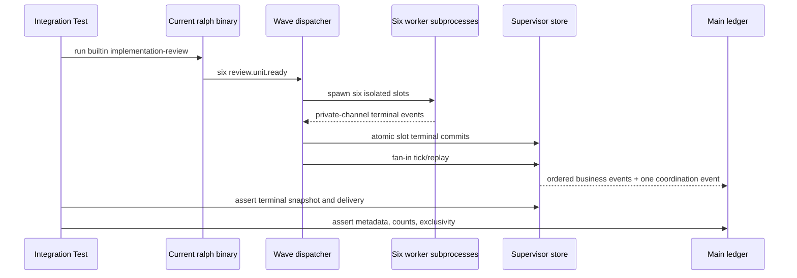
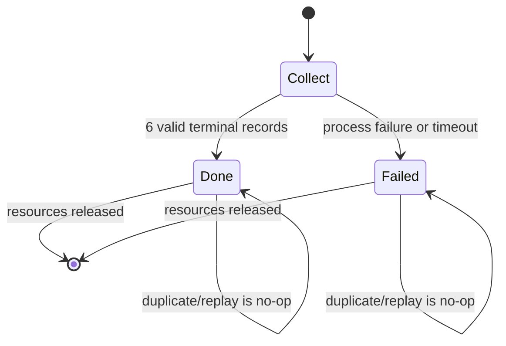
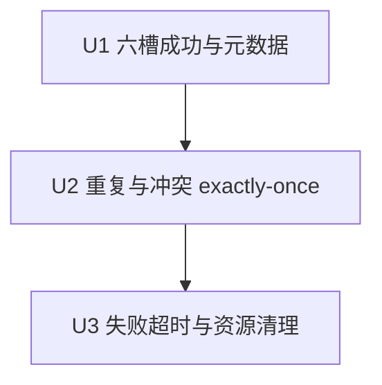

# fix: 坐稳 implementation-review 六槽并发主链

## 0. 计划状态

- **状态：READY。** 所有实施关键决策置信度均不低于 0.85；没有阻塞项。
- **代码库基线：** `3c5ce389`（`pittcat-dev`，调查时与 `origin/pittcat-dev` 一致）。
- **调查范围：** `implementation-review` preset、wave detection/dispatcher/worker、Supervisor store/coordinator/reconciliation/merge sink、真实 CLI fake-backend 测试、production fan-in BDD、两阶段 nextest 入口、最近四份 wave/supervisor closure 计划及其落地提交。
- **已执行的验证：**只读检查当前源码、测试、运行产物、Git 历史与文档；确认 2026-07-27 目标运行最终在 21 分 44 秒内完成；确认当前源码已在合并时使用完整 `CompletedWave.wave_total` 重写 worker 事件；确认 complete/failed replay、partial、timeout、cancel、panic、crash window 已有下层测试。
- **尚未执行的验证：**本 skill 只写计划，不运行测试、构建或 mutation；所有命令列入 Verification Contract，由 Executor 严格串行执行。
- **阻塞项：**无。若 U1 的未改源码基线与 E1–E12 冲突，按 Unit 停止条件将计划降为 BLOCKED，不允许临场扩大生产修改。

## Goal Capsule

- **目标：**用当前构建出的 `ralph`、真实 `builtin:implementation-review` 编排和六个确定性 worker 子进程，锁定成功、重复终态、部分失败三条并发主路径，使发布门禁能证明 wave 元数据一致、fan-in 恰好一次、失败有界收敛且无资源残留。
- **权威顺序：**本计划的 R-ID 行为契约 → KTD 实现决策 → U1→U2→U3 串行单元 → 仓库硬规则与现有测试入口。
- **执行姿态：**test-first；先用可撤销 mutation 证明新增断言会真实失败，再恢复当前实现并使门禁 Green。不得为了制造 Red 永久修改生产行为。
- **停止条件：**发现需要新增并发框架、账本、公开 CLI/config 字段、preset topic/schema 或新依赖；发现当前调用链与 Evidence Ledger 冲突；任何关键决策置信度降至 0.85 以下。
- **收尾所有者：**U3 完成全量 `./scripts/run-tests.sh`、文档反向检查和范围审计后，才允许声明计划完成。

---

## 1. 功能目标（Product Contract）

### Summary

本计划把已经实现的 wave/supervisor 并发机制变成 `implementation-review` 的发布级验收契约。
它不重写调度器，而是补上当前测试分层之间的最后空隙：现有 BDD 经过真实 EventLoop/fan-in 但不启动真实 worker 子进程，现有 subprocess convergence 测试又明确不驱动完整 dispatcher seam。
最终门禁必须使用本次构建出的同一个 `ralph` binary，真实产生六槽并发、主账本事件和 Supervisor 终态，并对成功、重复、失败路径作跨层断言。

### Problem Frame

2026-07-27 的目标运行最终成功，证明六槽 fan-out、fan-in、synthesizer、fix-planner 和 finalizer 已可闭环。
同一运行的主账本曾观察到 `review.unit.ready.wave_total=6`，但六条 `review.unit.done` 显示 `wave_total=1`；当前源码在 merge 时会用完整 `CompletedWave.wave_total` 重写该字段，因此该现象更像旧 binary/旧路径证据，不能直接驱动又一轮生产重构。
真正缺失的是一个基于当前 binary 的 outside-in 门禁：若当前源码正确，它应稳定证明正确；若未来有人删掉 normalization、terminal latch 或 cleanup，它必须在 CI 中立即失败。

### Actors

- A1. Preset operator：运行 `builtin:implementation-review` 并要求六维评审在有界时间内形成唯一终态。
- A2. Wave dispatcher/runtime：检测六条 `review.unit.ready`，启动 worker、收集私有通道结果并驱动 Supervisor fan-in。
- A3. Review worker：在 runtime 注入的 wave 上下文中写本槽 `review.unit.done`。
- A4. Supervisor store/coordinator：持久化 slot 终态证据，决定唯一 complete 或 failed，并保证 replay 幂等。
- A5. CI/Executor：运行真实 CLI 集成门禁和 nextest 回归，不使用 live LLM。

### Requirements

#### 成功路径

- R1. 六个 review worker 必须在一个可观察重叠窗口内启动，六个 slot 都以唯一 `review.unit.done` 进入主账本。
- R2. 同一 wave 的 ready/done 事件必须共享非空 `wave_id`，`wave_total` 必须恒为 6，且 `wave_index` 集合必须恰好等于 `{0,1,2,3,4,5}`。
- R3. 六槽全成功必须产生恰好一条 runtime 注入的 `review.wave.complete`，Supervisor snapshot 必须为六槽 Completed 且 delivery 至少到 `CoordinationCommitted`。

#### 幂等路径

- R4. 同一 slot 的相同终态被重复提交，或终态 fan-in 被 replay 时，主账本中的业务事件和 coordination event 都不得增加。
- R5. 同一 slot 的冲突终态不得覆盖首个权威终态；必须保留可诊断拒绝证据，且不得误注入第二个 complete/failed。

#### 失败与清理

- R6. 一个 worker 明确失败时，其余成功槽可按现有 salvage 契约进入主账本，但 wave 必须形成恰好一条 `review.wave.failed`，不得出现 `review.wave.complete`、`review.synthesized` 或 `fix.plan.ready`。
- R7. 一个 worker 达到测试用短 StartToClose 后，必须走与 R6 相同的失败终态；测试必须有外层有界 watchdog，不得靠扩大 timeout 获得 Green。
- R8. complete/failed 之后，Supervisor 不得保留 Pending/Running slot；worker 子进程必须退出，progress reporter/permit 必须释放，loop 必须终止且 `loop.lock` 不得保持有效持锁状态。

#### 验收纪律

- R9. 所有新增集成测试必须使用 `common::ralph_bin()`，先 scrub 外层 hat env，再显式注入 worker context；禁止依赖 PATH 中的旧 `ralph`。
- R10. 测试必须穿过真实 CLI、preset resolution、dispatcher、worker subprocess、private channel、SQLite store、fan-in 和 main ledger；只允许 LLM backend 内容由确定性脚本替代。
- R11. 新增门禁不得修改 builtin preset 的生产 timeout、topic、schema 或 agent instructions；测试用 timeout 只通过现有 operator overlay/fixture 边界缩短。
- R12. 本计划不改变 agent 可调用的 wave 命令或字段语义；实现后必须反向检查 `crates/ralph-core/data/ralph-tools-wave.md` 与 preset operator skills，确认无需更新并记录结论。

### Scope Boundaries

#### In Scope

- 新增一个 `implementation-review` 专属真实 CLI/fake-backend 集成测试文件及其确定性 fixture/helper。
- 六槽成功路径的并发重叠、主账本元数据、Supervisor snapshot 与唯一 coordination 断言。
- 重复相同终态、冲突终态和 fan-in replay 的幂等断言。
- 单槽进程失败、测试用短 timeout、失败 coordination、资源清理和 loop 终止断言。
- 必要的测试选择命名，使 race-sensitive timeout 场景进入现有 phase 2 串行隔离。

#### Deferred to Follow-Up Work

- 诊断报告的 UTC/本地时区归一化。
- reviewer 严重度、scope/actionability 和中文输出质量。
- 20–50 次 live LLM 压测、真实 API 成本与模型供应商差异。
- 其他 builtin preset 的同类 outside-in 门禁。

#### Outside this plan

- 新建第二套 wave/supervisor 状态机、账本或幂等机制。
- 修改 `implementation-review` 的六个维度、并发数、生产 timeout、event topology 或 schema。
- 修改公开 CLI/API、数据库 schema、feature flag、权限模型或兼容层。
- 把 BDD mock response 或 helper 直塞 `AcceptedEvent` 当作真实并发主路径证明。

### Inputs and Outputs

- **输入：**临时 git workspace、当前构建的 `ralph`、`builtin:implementation-review`、确定性 fake backend、六槽 payload、可选重复/失败/延迟故障开关。
- **输出：**进程退出状态、main JSONL、`supervisor.db` snapshot、slot 私有通道、结构化 diagnostics、loop termination/handoff 状态。
- **状态变化：**wave 由 registered/dispatch/collect 进入 done 或 failed；slot 由 Pending/Running 进入唯一 terminal；delivery 进入 committed；loop 最终释放 lock。
- **错误语义：**worker 失败/timeout 是 wave failed，不得伪装 complete；基础设施或证据矛盾导致测试失败并输出跨层诊断，不得条件通过。

### Compatibility, Performance, Security

- **兼容性：**不改变公开格式和旧配置；只增加测试门禁。测试 helper 必须兼容 macOS/Linux 的现有 Unix 测试约束。
- **性能：**成功测试外层预算不超过 60 秒，正常目标小于 15 秒；timeout 场景使用 1 秒测试覆盖并进入 phase 2 串行隔离；所有等待使用事件轮询，不使用无界 sleep。
- **安全/权限：**临时 HOME/XDG 目录隔离；fake backend 不读取凭证、不访问网络；worker 只能写 runtime 指定私有通道；测试不得泄露内部 DB 路径给 agent prompt。

### Confirmed and Unconfirmed Assumptions

#### 已确认事实

- 当前 merge 路径用 `CompletedWave.wave_total` 重写业务事件的 wave 元数据。
- 当前 wave detection 拒绝 total=0、total 超限、同 wave total 不一致和 `wave_index >= wave_total`。
- 当前 Supervisor store 有原子 terminal record、first-terminal-wins、replay idempotency 和 delivery commit。
- 当前 dispatcher 已有 partial、aggregate deadline、global deadline、cancel、panic、crash-window 和 cleanup 的下层测试。
- operator config 与 preset 通过既有深合并入口组合，可在测试 workspace 覆盖 hat budget，不必改 builtin YAML。

#### 待验证假设

- 无。U1–U3 的运行结果属于实施验收，不是未决架构假设；若未改源码不能满足预期，触发停止条件并回到计划修订。

### Acceptance Examples

- AE1. 六个 worker 同时处理不同 dimension，主账本得到六条 index 0–5、total=6 的 done 和一条 complete。
- AE2. slot 2 重复提交相同 done 并 replay fan-in，主账本计数不变，store 保持首个 terminal。
- AE3. slot 2 先提交 done 后再提交冲突 failure，冲突被拒绝，complete/failed 不会双写。
- AE4. slot 5 进程退出非零，其余五槽成功，主账本只有五条 salvage done 和一条 failed，loop 释放资源。
- AE5. slot 5 超过测试用 StartToClose，其余五槽成功，结果与 AE4 的终态和清理不变量一致。

---

## 2. 代码库现状与证据

### 2.1 当前实现入口

- **外部入口：**`ralph run --no-tui --skip-preflight -H builtin:implementation-review -P <plan>`，测试通过 `crates/ralph-cli/tests/common/mod.rs::ralph_bin()` 启动当前测试 binary。
- **调用链：**preset 产生 `review.unit.ready` → `crates/ralph-core/src/wave_detection.rs` 识别 wave → `crates/ralph-cli/src/loop_runner/wave/dispatcher.rs` 调度 worker → `worker.rs` 执行 backend → `io.rs::merge_wave_results_to_events_file` 规范化并合并业务事件 → Supervisor bridge/store/coordinator/reconciliation/merge sink → `review.wave.complete|failed` 写主账本 → EventLoop 激活下游。
- **数据边界：**每槽私有 events channel、主 events JSONL、`supervisor.db`、diagnostics 和 loop lifecycle 文件。
- **外部依赖：**无网络；fake backend 为测试仓库内 shell 脚本；真实依赖为 git、PTY、SQLite 和当前 `ralph` binary。
- **现有测试：**`integration_supervisor_primary.rs` 提供真实 CLI/fake-backend/SQLite/worktree 模式；`integration_wave_channel_convergence.rs` 覆盖通道与 crash matrix；`wave_supervisor.rs` 覆盖 fan-in/timeout/idempotency；`scenarios.rs` 覆盖真实 EventLoop 的 implementation-review complete/failed routing。
- **构建验证：**仓库强制 `cargo nextest run`；全量必须使用 `./scripts/run-tests.sh` 的两阶段入口。

### 2.2 Evidence Ledger

| Evidence ID | 来源 | 观察结果 | 对计划的影响 | 可靠性 |
|---|---|---|---|---|
| E1 | `presets/en/implementation-review.yml` | `review-worker.concurrency=6`、`timeout=900`，成功/失败 coordination 由 runtime 注入 | 测试必须保持六槽拓扑，测试 timeout 不得改 builtin | 高 |
| E2 | `crates/ralph-core/src/wave_detection.rs` | 同 wave 的 total/index 已有结构化拒绝规则 | 不新增第二套 detector；U1 验收 merge 后的外部一致性 | 高 |
| E3 | `crates/ralph-core/src/wave_tracker.rs` | `CompletedWave.wave_total` 保存 expected total，partial 也保留 | U1 以 expected total 为唯一 merge stamp 来源 | 高 |
| E4 | `crates/ralph-cli/src/loop_runner/wave/dispatcher.rs` | batched round 完成后把 `completed.wave_total` 归一到完整 wave total | 当前源码应满足 total=6；计划以门禁防回归，不先改生产代码 | 高 |
| E5 | `crates/ralph-cli/src/loop_runner/wave/io.rs::merge_wave_results_to_events_file` | 合并时统一写 `wave_id/index/total`，并报告 missing/duplicate index | U1 直接断言主账本结果；禁止信任 worker 自报 total | 高 |
| E6 | `crates/ralph-core/src/supervisor/u3_atomic_terminal_tests.rs` | 双 store 的 terminal commit 已覆盖 first-terminal-wins、replay、conflict | U2 复用机制，在真实 preset 主路径验证，不重写 store | 高 |
| E7 | `crates/ralph-core/src/supervisor/coordinator.rs` | complete/failed delivery latch 后 replay 返回 `AlreadyDone` | U2 必须从 main ledger 证明 exactly-once | 高 |
| E8 | `crates/ralph-cli/src/loop_runner/tests/wave_supervisor.rs` | 已覆盖 partial、timeout、blocking slots、failed replay、diagnostics 和合法 ContinueCollect | U3 不再增加大量 helper 单测，只补真实 subprocess 跨层证据 | 高 |
| E9 | `crates/ralph-cli/tests/integration_supervisor_primary.rs` | 已有确定性 fake backend、current binary、bounded wait、ledger/store/debug helper | 新测试沿用该模式，避免另造 E2E 框架 | 高 |
| E10 | `crates/ralph-cli/tests/integration_wave_channel_convergence.rs` | 文件明确说明 scenario 01 不驱动真实 dispatcher seam；其他场景覆盖通道/故障矩阵 | 现有 subprocess 测试不能替代本计划门禁 | 高 |
| E11 | `crates/ralph-core/tests/scenarios/implementation_review_wave*_runtime_fan_in.yml` | 经过真实 EventLoop/fan-in，但 worker 结果由 mock response 注入 | BDD 保留为路由合同；新测试补真实 worker 并发，不复制 BDD | 高 |
| E12 | `scripts/run-tests.sh` | phase 2 通过 `partial_timeout_events_visible` 名称过滤 race-sensitive 测试并 `-j 1` | U3 timeout 测试沿用该命名，无需新增测试入口 | 高 |
| E13 | `docs/plans/2026-07-27-001-*`、`003-*`、`004-*` 与 Git `afaa5ec9`、`07788aa2`、`7c7b5c65` | terminal convergence、channel registry、原子 terminal、delivery closure 已实施 | 本计划只能做最终主路径门禁，不得重复其生产范围 | 高 |
| E14 | loop `primary-20260727-143713` 最终 events/history/log | 六槽成功、fan-in 成功、LOOP_COMPLETE；总时长 21m44s；旧运行主账本出现 done total=1 | 事故不支持再造 P0，但支持用当前 binary 锁定 total 一致性 | 中 |
| E15 | `crates/ralph-core/data/ralph-tools-wave.md` | 已说明 shared wave_id/total、runtime-owned fields、worker private channel 和 Confirm | 测试加固不改变 agent 行为，默认无需更新注入 skill | 高 |
| E16 | `skills/ralph-preset-common/references/patterns.md` | operator skill 只描述通用 topology/prompt 模式，不承载 runtime 测试门禁 | 默认无需更新 preset operator skills | 高 |

### 2.3 受影响范围

- **生产模块：**预期不修改。若 mutation 恢复后当前源码仍不能 Green，停止计划；不得直接编辑生产模块。
- **测试模块：**新增 `crates/ralph-cli/tests/integration_implementation_review_wave_stability.rs`。
- **测试入口：**现有 `scripts/run-tests.sh` 通过测试名自动把 timeout 场景纳入 phase 2；除非实际过滤未命中，否则不修改脚本。
- **配置/preset/schema：**不修改生产配置、builtin preset 或 schema。测试 workspace 使用现有 operator overlay。
- **数据/API/CLI/UI/外部服务：**无公开变更；仅临时测试 workspace 产生 `.ralph` 数据。
- **调用方：**CI、开发者和后续修改 wave/supervisor 的 Coding Agent。
- **构建目标：**`ralph-cli` 集成测试、`ralph-core` scenario/supervisor 回归、workspace build/clippy/full tests。

---

## Planning Contract

## 3. 决策记录与置信度

| Decision ID | 决策问题 | 候选方案 | 最终选择 | 支持证据 | 排除其他方案的原因 | 置信度 |
|---|---|---|---|---|---|---|
| D1 | 加固生产机制还是补最终门禁 | 重写 dispatcher/store；新增通用 harness；补 implementation-review 专属真实 CLI 门禁 | 补专属门禁 | E4–E13 | 生产机制刚完成 closure，重复修改风险高；通用 harness 会扩大范围 | 0.96 |
| D2 | 用哪种执行证明 | live LLM；BDD mock；helper；真实 CLI + deterministic backend | 真实 CLI + deterministic backend | E9–E11 | live 不稳定且有成本；BDD/helper 都缺一层真实边界 | 0.97 |
| D3 | wave 元数据 authority | worker 自报；ready event；`CompletedWave` expected total | merge 时统一使用 `CompletedWave` | E2–E5 | worker 输入不可信；ready 不是 terminal merge owner | 0.96 |
| D4 | exactly-once authority | JSONL 行数去重；新锁；现有 atomic terminal + delivery latch | 复用现有 store/latch并从 ledger 验证 | E6–E8、E13 | 新锁/新状态会产生双 authority；只看 JSONL 不能证明 store | 0.95 |
| D5 | timeout 测试如何有界 | 改 builtin timeout；等待 900 秒；测试 workspace overlay 到 1 秒 | 仅测试 overlay + 外层 watchdog | E1、E12、`preflight.rs::merge_operator_hat_field_overlays` | 改 builtin 违反范围；900 秒不可作为 CI 门禁 | 0.91 |
| D6 | 测试是否分文件 | 扩大 `integration_supervisor_primary.rs`；扩 BDD；新增专属文件 | 新增专属集成文件，复用 helper 模式 | E9–E11 | 两个现有文件分别属于其他 preset/测试层，混入会削弱职责 | 0.92 |
| D7 | 如何获得真实 Red | 假造当前缺陷；永久改生产；临时 mutation 后恢复 | 对关键 contract 点做可撤销 mutation，证明新增断言敏感 | E4–E8，用户 TDD 要求 | 当前源码预计已 Green，凭空声称自然 Red 不诚实；mutation 可验证测试强度 | 0.90 |
| D8 | 是否更新 agent/operator 文档 | 无条件更新；完全忽略；反向检查后只在行为变化时更新 | 反向检查并记录无需更新 | E15–E16、仓库 hard rules | 纯测试门禁不改变 agent 下一步动作；无意义改文档会制造漂移 | 0.94 |

### Session-Settled Decisions

- KTD1. **小而硬，只坐稳关键并发契约。**（session-settled: user-approved — chosen over 全面重构与大范围稳定性计划：用户确认先把并发主链做实，其余问题后置。）
- KTD2. **沿用现有 wave/supervisor 架构。**（session-settled: user-approved — chosen over 新建并发机制：当前六槽成功路径已实际跑通，风险集中在缺少最终门禁。）

### High-Level Technical Design





### Outside-In 分层

operator 可观察的 loop 终态与账本
→ 真实 `ralph run` 入口
→ builtin preset 与 config resolution
→ dispatcher/worker subprocess/private channel
→ atomic terminal/store/coordinator
→ main ledger 与 cleanup。

测试必须从左向右进入并从 ledger/store/process 三层断言；不得从 helper 直接跳到 coordinator。

### Implementation Constraints

- 不复制 `integration_supervisor_primary.rs` 的长 helper；提取共享 helper 只有在两个测试文件都需要且不改变行为时才允许，并必须保持 U1 原子性。默认在新文件内保留最小专属 helper。
- 不断言 prompt 文案或完整 preset YAML bytes。
- 不读取或修改手工运行中的 `.ralph`；所有测试状态位于 `TempDir`。
- 不使用裸 `cargo test`。
- 不增加依赖、feature、migration、公开参数。

### Deterministic Fixture Contract

fake backend 必须按当前 hat 身份走完 builtin 的真实拓扑，不得由测试 helper 代替 EventLoop 发业务事件：

- `scope-preparer`：在临时 workspace 写出可读的 `scope-manifest.json` 与 patch artifact；所有字段、digest 算法和路径以 `presets/schemas/implementation-review.yml::scope.ready` 为唯一权威，然后 emit 一条合法 `scope.ready`。
- `review-dispatcher`：从 `scope.ready` 原样携带 scope identity，emit 六条 dimension 各异、`wave_index={0,1,2,3,4,5}`、`wave_total=6` 的 `review.unit.ready`；测试不得直接调用 detector/tracker helper。
- `review-worker`：仅从 runtime 注入的 hat/wave 环境读取 slot identity，在对应 dimension artifact 写最小 clean 结果，并把 `review.unit.done` 写入 runtime 指定的私有 channel；成功模式六槽一致，U2/U3 只通过 fixture 故障开关改变指定 slot。
- `review-synthesizer`：只在真实 `review.wave.complete` 后写最小 `synthesized-review.md` 并 emit `review.synthesized`；若收到 failed 路径则不得运行。
- `fix-planner`：写一个 `actionable_unit_count=0` 的最小 `fix-plan.md` 并 emit `fix.plan.ready`。
- `finalizer`：校验 trigger 指向的 artifact 可读后输出 `LOOP_COMPLETE`；成功路径为 `clean`，failed 路径使用 schema 规定的 block artifact/result。
- 每一条事件 payload 都从触发事件与 runtime env 取值，并按 `presets/schemas/implementation-review.yml` 填齐 `required_fields`；禁止在计划或测试中复制一份长期维护的 schema。

---

## 4. BDD 行为规格

```gherkin
Feature: implementation-review 六槽并发稳定性

  Background:
    Given 一个临时 git workspace
    And 当前构建的 ralph binary
    And builtin implementation-review
    And 一个按 hat 和 wave slot 返回确定性事件的 fake backend

  Scenario: S1 六槽并发成功且元数据一致
    Given 六个 review worker 都返回合法 review.unit.done
    When operator 运行 implementation-review
    Then 六个 worker 在可观察窗口内重叠执行
    And 主账本恰有六条 review.unit.done
    And 所有 ready/done 共享一个 wave_id 和 wave_total 6
    And wave_index 集合恰为 0 到 5
    And 恰有一条 system-injected review.wave.complete
    And Supervisor 六槽全部 Completed 且 coordination 已提交

  Scenario: S2 重复相同终态与 fan-in replay 不重复写入
    Given slot 2 对同一 wave 重复提交完全相同的 terminal
    When runtime 完成并 replay 同一 fan-in
    Then store 保留一个 slot 2 terminal
    And 主账本仍只有六条 review.unit.done
    And 主账本仍只有一条 review.wave.complete
    And 不产生 review.wave.failed

  Scenario: S3 冲突终态不能覆盖首个终态
    Given slot 2 已提交合法 review.unit.done
    When 同一 slot 再提交内容冲突的 terminal
    Then 冲突被拒绝并保留结构化诊断
    And store 的首个 terminal evidence 不变
    And coordination event 不会双写

  Scenario: S4 单槽进程失败有界收敛
    Given slot 5 进程退出非零且其他五槽成功
    When runtime 执行最终 fan-in
    Then 主账本保留五条成功槽业务事件
    And 恰有一条 review.wave.failed
    And 不存在 review.wave.complete 或成功下游事件
    And store 不含 Pending 或 Running slot
    And loop 与 worker 进程在 watchdog 内退出

  Scenario: S5 单槽 StartToClose 超时有界收敛
    Given slot 5 超过测试用 1 秒 StartToClose 且其他五槽成功
    When runtime 到达 worker deadline
    Then slot 5 以 worker_timeout 终态失败
    And 结果满足 S4 的 failed、排他性和资源清理不变量
```

---

## 5. 验收与测试策略

| Scenario | 验收条件 | 测试入口 | 推荐层级 | 风险补充测试 | E2E |
|---|---|---|---|---|---|
| S1 | 6 done、total/index 一致、1 complete、store committed、并发重叠 | 新增 `integration_implementation_review_wave_stability` | 真实 CLI 集成 | Concurrency + mutation | 是，CI-safe fake backend |
| S2 | 重复 terminal/replay 后 ledger/store 计数不变 | 同一新集成文件 | 集成 + Idempotency | latch mutation | 是 |
| S3 | 冲突拒绝、first-terminal-wins、无双 coordination | 新集成 + 现有 atomic terminal contract | 集成/契约 | Conflict injection | 否，真实 CLI 集成足够 |
| S4 | 5 salvage + 1 failed、无 success downstream、零活动 slot/child | 新集成文件 | 真实 CLI fault injection | Process-exit fault | 是 |
| S5 | 1 秒 timeout、worker_timeout、S4 清理不变量 | 新集成文件，phase 2 串行 | 真实 CLI timeout fault injection | Bounded watchdog | 是 |

所有测试共同断言：

- **具体断言：**topic 数量、wave metadata、slot 状态、delivery state、退出码/termination reason。
- **副作用断言：**无重复 JSONL、无成功/失败双写、无有效 loop lock、无活动 child/slot。
- **不变量：**同一 wave identity、first-terminal-wins、coordination exactly-once、所有等待有界。
- **运行方式：**只用 Verification Contract 中的 nextest/run-tests 命令。
- **层级理由：**风险跨越 CLI、进程、文件、SQLite 和状态机，helper 单测不能证明；fake backend 保留真实 runtime 边界且避免 live API。

### Mutation Red 规则

每个 Unit 的 Acceptance Red 使用临时、未提交 mutation：

1. mutation 只作用于当前 Unit 要保护的单一生产不变量；
2. 先确认新增测试因目标断言失败；
3. 立即恢复 mutation；
4. `git diff` 必须只剩计划允许的测试变更；
5. mutation 导致编译失败、fixture 失败或无关断言失败都不算有效 Red。

---

## 6. 需求—测试追踪矩阵

| Requirement ID | 需求 | Scenario | 验收测试 | 单元/契约测试 | 集成测试 | E2E | Evidence | Unit |
|---|---|---|---|---|---|---|---|---|
| R1 | 六槽真实并发与六终态 | S1 | success gate | wave tracker existing | new stability test | 是 | E1/E3/E9 | U1 |
| R2 | metadata 一致 | S1 | metadata assertions | detection existing | new stability test | 是 | E2–E5/E14 | U1 |
| R3 | 唯一 complete + committed | S1 | ledger/store assertions | coordinator existing | new stability test | 是 | E7–E9 | U1 |
| R4 | 重复/replay no-op | S2 | repeat counts | atomic/coordinator existing | new stability test | 是 | E6–E8 | U2 |
| R5 | conflict first-wins | S3 | conflict diagnostics | atomic terminal existing | new stability test | 否 | E6 | U2 |
| R6 | 进程失败收敛 | S4 | failed exclusivity | fan-in existing | new stability test | 是 | E8/E11 | U3 |
| R7 | timeout 收敛 | S5 | timeout failure | timeout existing | new phase-2 test | 是 | E8/E12 | U3 |
| R8 | 资源清理 | S4/S5 | slot/process/lock assertions | cleanup existing | new stability test | 是 | E8–E10 | U3 |
| R9 | current binary + env scrub | S1–S5 | harness construction | common helper existing | all new tests | 是 | E9/E10 | U1 |
| R10 | 真实跨层路径 | S1/S4/S5 | negative-space assertions | N/A | all new tests | 是 | E9–E11 | U1/U3 |
| R11 | 不改生产 preset | S5 | diff/preset parity | preset lint existing | regression | 否 | E1 | U3 |
| R12 | 文档反查 | S1–S5 | final audit | drift checker | full gate | 否 | E15/E16 | U3 |

---

## 7. 严格串行开发单元（Implementation Units）

### U1. 六槽成功主链与 wave 元数据门禁

#### 1. Unit 目标

新增一个真实 CLI/fake-backend 验收测试，使当前 `implementation-review` 六槽成功运行可观察为并发重叠、六个规范化 done、唯一 complete 和 committed Supervisor snapshot。

#### 2. 对应需求与 Scenario

- Requirements：R1、R2、R3、R9、R10。
- Scenario：S1。
- Decisions：D1、D2、D3、D6、D7。
- Evidence：E1–E5、E9–E11、E14。

#### 3. 外部可观察结果

CI 使用当前 binary 跑一次 builtin preset，能从 main ledger、SQLite snapshot 和并发 marker 同时证明六槽主链成立；任何 `wave_total=1`、缺槽、重复 coordination 或伪串行都会失败。

#### 4. 当前行为基线

当前源码按 E3–E5 应把 done 统一为 total=6；现有 BDD 与 subprocess 测试分别缺少真实 worker 或完整 dispatcher seam，因此没有一个测试同时证明全部层次。

#### 5. 输入与输出

- 输入：临时 git repo、最小 plan/AGENTS、builtin preset、按 hat 分支的 fake backend、六槽并发 marker。
- 输出：退出状态、events JSONL、Supervisor snapshot、worker marker。
- 错误：外层 watchdog、JSON 解析失败、缺 topic、metadata 不一致、store 非终态均使测试失败。
- 副作用：仅 TempDir 内 `.ralph`、marker 和 git fixture。
- 不变量：同一 current binary；六槽 identity 唯一；无网络/live LLM。

#### 6. 修改位置

- **新增** `crates/ralph-cli/tests/integration_implementation_review_wave_stability.rs`：承载专属 harness、成功测试和后续 U2/U3 场景。
- **复用模式** `crates/ralph-cli/tests/integration_supervisor_primary.rs`：`common::ralph_bin()`、TempDir git repo、fake backend、bounded wait、ledger/store/debug helpers。
- **不修改** `presets/en/implementation-review.yml`、schema、dispatcher、worker、store。

#### 7. 可依赖能力

- `common::ralph_bin()` 与 agent env scrub。
- current config/preset merge。
- dispatcher private channel registry。
- Supervisor SQLite、atomic terminal、fan-in/merge/delivery。

#### 8. 禁止依赖的未来能力

不得提前加入 U2 的重复/conflict 开关或 U3 的 failure/timeout 分支；U1 backend 只表达成功主链。

#### 9. 验收测试

- 名称：`implementation_review_six_worker_success_metadata_consistent`。
- 层级：Unix-only 真实 CLI 集成。
- 前置：六槽 backend 每槽记录 active marker、短暂重叠、向 runtime channel 返回本 dimension done。
- 动作：运行 builtin preset，等待有界退出。
- 断言：至少两个 active marker 同时存在；ready/done total=6；index=0..5；wave_id 单一；done=6；complete=1；failed=0；snapshot 六 Completed；delivery committed。
- 副作用断言：所有 worker marker closed；无第二个 events ledger 中的重复 topic。
- 命令：`cargo nextest run -p ralph-cli --test integration_implementation_review_wave_stability -- implementation_review_six_worker_success_metadata_consistent`。

#### 10. Acceptance Red

临时 mutation `io.rs` 的 merged business event total stamp，使其不再取完整 `CompletedWave.wave_total`。
预期测试在 metadata 断言失败并显示 observed total；编译失败、backend 未启动、preset lint 失败不算有效 Red。
恢复 mutation 后再进入 Green。

#### 11. 单元测试拆分

1. ledger parser：输入多 events 文件，只选择 current run 并按 topic 过滤。
2. wave metadata assertion：输入六条 JSON value，要求单一 id、total=6、index 完整无重复。
3. concurrency marker assertion：输入每槽观测计数，至少一个值大于 1。
4. store assertion：输入 snapshot，要求 expected=6、六 Completed、delivery committed。

helper 允许纯函数单测；不得 Mock `ralph run`、SQLite 或 worker subprocess。

#### 12. Red → Green → Refactor 顺序

metadata helper Red/Green
→ success harness test落地
→ total-stamp mutation Red
→ 恢复 mutation
→ 当前生产路径 Green
→ 提取仅服务本文件的 ledger/store diagnostics helper
→ targeted regression。

#### 13. 最小实现范围

只新增成功路径测试及最小 fixture/helper；不修生产代码、不复制完整 supervisor-primary preset、不走下游 review 内容质量断言。

#### 14. 集成验证

真实联合 CLI、preset resolution、PTY worker、private channel、dispatcher、SQLite、fan-in 和 main ledger；仅 backend 文本由脚本替代。

#### 15. 风险驱动测试

- Characterization：固定当前六槽成功基线。
- Concurrency：active marker 证明不是顺序六次。
- Mutation：证明 total/index/count 断言能捕获回归。
- Contract：ledger 和 store 双证据一致。

#### 16. 回归范围

- `cargo nextest run -p ralph-cli -- wave_supervisor`
- `cargo nextest run -p ralph-core --test scenarios -- implementation_review_wave_runtime_fan_in`
- `cargo nextest run -p ralph-cli --test integration_supervisor_primary`

这些测试共享 dispatcher、Supervisor 和 fake-backend模式。

#### 17. 预期文件变更

| 位置 | 变更类型 | 变更原因 | Evidence |
|---|---|---|---|
| `crates/ralph-cli/tests/integration_implementation_review_wave_stability.rs` | 新增测试 | 补真实六槽主链门禁 | E9–E11 |

#### 18. 完成标准

- S1 验收、helper 单测、集成与回归全部通过。
- mutation 产生正确 Red 并已完全恢复。
- build/clippy 对相关目标通过。
- 无 skip/only/断言削弱。
- Unit 可独立提交，diff 只有新增测试文件。

#### 19. 停止条件

若恢复 mutation 后 S1 仍失败，或必须改生产代码/preset 才能 Green，停止并记录 ledger/store/child 证据，重新评估 D1/D3；不得进入 U2。

#### 20. 风险与注意事项

- 触发：fake backend 模拟过多下游 hat 导致脆弱。
- 检测：失败发生在 fan-in 验收之后的无关阶段。
- 缓解：在完成 coordination contract 后用现有合法终态最短收尾；不复刻整份业务 artifact。
- 剩余风险：fake backend 不能代表 live LLM 输出质量，已明确排除。

### U2. 重复与冲突终态的恰好一次门禁

#### 1. Unit 目标

在 U1 真实主链上增加重复相同 terminal、冲突 terminal 和 fan-in replay，证明业务事件和 coordination event 恰好一次且首终态不被覆盖。

#### 2. 对应需求与 Scenario

- Requirements：R4、R5、R9、R10。
- Scenarios：S2、S3。
- Decisions：D2、D4、D7。
- Evidence：E6–E10、U1。

#### 3. 外部可观察结果

同一 slot 的重复或冲突输出不会让 operator 看到七条 done、complete/failed 双写或 store terminal 改写。

#### 4. 当前行为基线

atomic terminal 与 coordinator 下层测试已证明 first-terminal-wins 和 `AlreadyDone`；真实 implementation-review subprocess 主链尚未把 store/ledger 两层同时锁住。

#### 5. 输入与输出

- 输入：U1 harness；slot 2 重复相同 terminal 或追加冲突 terminal；显式 replay 同一收尾路径。
- 输出：稳定 ledger 计数、store terminal evidence、冲突诊断。
- 错误：duplicate 增行、conflict 覆盖、complete/failed 双写。
- 不变量：其他五槽结果不变；重复不是第二次业务成功。

#### 6. 修改位置

- 修改 `crates/ralph-cli/tests/integration_implementation_review_wave_stability.rs`：增加 backend 故障开关、S2/S3 测试和诊断读取。
- 不修改 store/coordinator；现有生产实现是被测对象。

#### 7. 可依赖能力

U1 已验证 harness、成功主链、ledger/store helpers；现有 atomic terminal 和 delivery latch。

#### 8. 禁止依赖的未来能力

不得加入 U3 的进程失败、timeout 或 cleanup 分支。

#### 9. 验收测试

- `implementation_review_duplicate_terminal_and_replay_exactly_once`：相同 terminal 重复 + replay；断言 done=6、complete=1、failed=0、slot 2 terminal 唯一。
- `implementation_review_conflicting_terminal_first_wins`：合法 done 后冲突 failure；断言首证据不变、冲突诊断存在、coordination 唯一。
- 运行命令：`cargo nextest run -p ralph-cli --test integration_implementation_review_wave_stability -- implementation_review_duplicate` 与 `-- implementation_review_conflicting`。

#### 10. Acceptance Red

临时 mutation coordinator/delivery latch 的 terminal no-op 分支，使 replay 再次注入 coordination。
预期 exactly-once 测试因 complete 数为 2 失败；若失败来自 fixture 写两份原始 ready 或 JSON 解析，不算有效 Red。
恢复 mutation 后 Green。

#### 11. 单元测试拆分

1. topic count invariant：重复输入应检测 count>expected。
2. terminal evidence comparison：首 evidence 与最终 snapshot 相同。
3. exclusivity：complete 与 failed 计数不能同时非零。
4. diagnostics selector：只接受稳定 conflict reason，不用模糊 contains error。

不得 Mock store 或 main ledger。

#### 12. Red → Green → Refactor 顺序

count/exclusivity helper Red/Green
→ duplicate scenario
→ latch mutation Red
→ 恢复 mutation Green
→ conflict scenario
→ first-terminal evidence mutation Red
→ 恢复 mutation Green
→ 去除重复 fixture setup
→ targeted regression。

#### 13. 最小实现范围

只扩展测试 backend 的 per-slot 输出模式和两个验收测试；不新增 retry/redrive 行为，不改变冲突错误类型。

#### 14. 集成验证

真实执行 worker channel → terminal commit → coordinator → ledger；replay 必须走生产 latch，不得直接手写第二个 coordination event。

#### 15. 风险驱动测试

- Idempotency：相同 terminal/replay。
- Concurrency：重复发生在相邻 worker completion 窗口。
- Conflict：同 slot 不同 fingerprint。
- Mutation：破坏 latch/first-wins 时测试必须 Red。

#### 16. 回归范围

- U1 成功门禁。
- `cargo nextest run -p ralph-core -- supervisor`
- `cargo nextest run -p ralph-cli -- wave_supervisor`
- `cargo nextest run -p ralph-cli --test integration_wave_channel_convergence -- scenario_08`

#### 17. 预期文件变更

| 位置 | 变更类型 | 变更原因 | Evidence |
|---|---|---|---|
| `crates/ralph-cli/tests/integration_implementation_review_wave_stability.rs` | 修改测试 | 增加真实主链幂等/冲突门禁 | E6–E10 |

#### 18. 完成标准

- S2/S3、U1 和相关 supervisor/idempotency 回归通过。
- 两类 mutation 均产生目标 Red 并恢复。
- ledger/store/diagnostics 三层一致。
- 无生产 diff、skip、only 或 timeout 放宽。

#### 19. 停止条件

若必须改变 public conflict semantics、store schema 或 redrive 才能完成，停止并修订计划；不得把恢复功能塞入 U2。

#### 20. 风险与注意事项

- 触发：测试通过直接追加主 ledger 伪造 replay。
- 检测：store delivery state/terminal attempt 没变化。
- 缓解：replay 从生产 fan-in seam 发起并同时检查 store。
- 剩余风险：进程 crash 中点已由 E10/E13 覆盖，本 Unit 不重复全部 crash matrix。

### U3. 单槽失败/超时的有界收敛与清理门禁

#### 1. Unit 目标

在同一真实主链上证明一个 worker 进程失败或 StartToClose 超时时，五个成功槽被保留、wave 唯一 failed、成功下游不激活，所有 slot/child/lock 有界清理。

#### 2. 对应需求与 Scenario

- Requirements：R6、R7、R8、R9–R12。
- Scenarios：S4、S5。
- Decisions：D1、D2、D5–D8。
- Evidence：E1、E8–E13、E15–E16、U1/U2。

#### 3. 外部可观察结果

operator 不会看到 5/6 后永久等待，也不会看到 partial 被伪装 complete；测试在 60 秒内给出 failed、清理证据或明确失败诊断。

#### 4. 当前行为基线

下层 dispatcher/BDD 已覆盖 partial/timeout 收敛，但没有当前 builtin + 六个真实 subprocess + main ledger/store/process cleanup 的单一门禁。

#### 5. 输入与输出

- 输入：U1 harness；slot 5 非零退出或超过测试 overlay 的 1 秒 timeout；其他五槽正常。
- 输出：五条 done、一条 failed、failed snapshot、termination reason、零活动资源。
- 错误：complete 出现、failed 缺失、成功下游激活、slot 非 terminal、child/lock 残留、watchdog 超时。
- 不变量：成功槽按 slot 排序并只写一次；失败 reason 精确；complete/failed 互斥。

#### 6. 修改位置

- 修改 `crates/ralph-cli/tests/integration_implementation_review_wave_stability.rs`：增加 fail-slot/slow-slot 模式、process/store/lock cleanup helpers 与 S4/S5。
- 测试名包含 `partial_timeout_events_visible`，复用 `scripts/run-tests.sh` 既有 phase 2 过滤；仅当 nextest 实际未选中时才停止并修订计划，不先改脚本。
- 反向检查 `crates/ralph-core/data/ralph-tools-wave.md`、`skills/ralph-preset-{author,review}/SKILL.md` 和 `skills/ralph-preset-common/references/`；预计不修改。

#### 7. 可依赖能力

U1 harness/metadata，U2 exactly-once/exclusivity，现有 worker hard deadline、abort/drain、Supervisor terminal closure 和 finalizer failed route。

#### 8. 禁止依赖的未来能力

无未来 Unit。不得引入 live LLM 压测、诊断时区修复或其他 preset 迁移。

#### 9. 验收测试

- `implementation_review_one_worker_exit_converges_failed_and_cleans_up`：slot 5 exit 1；断言 5 salvage done、1 failed、0 complete/synthesized/fix-ready、全部 slot terminal、无存活 worker、lock 释放。
- `implementation_review_partial_timeout_events_visible_and_cleans_up`：slot 5 超过 1 秒测试 budget；断言 reason=`worker_timeout`，其余与上条一致。
- 外层 watchdog：每测 60 秒；事件轮询 100ms 或现有 helper cadence；不得无界等待。
- 命令：targeted nextest；timeout 单测再用 `-j 1`；最终由 `./scripts/run-tests.sh` phase 2 自动覆盖。

#### 10. Acceptance Red

分别临时 mutation：

1. 禁用非零 worker exit 到 slot failure 的分类，预期 S4 因无 failed/残留 Running 而 Red。
2. 禁用 timeout 后 worker abort/drain 或 terminal record 的关键单点，预期 S5 因 watchdog/活动 slot/child 而 Red。

mutation 后必须立即恢复；扩大 timeout、降低清理断言或只断言进程退出不算 Green。

#### 11. 单元测试拆分

1. failed ledger invariant：5 done、1 failed、0 complete/success downstream。
2. snapshot invariant：completed=5、failed=1、pending=0、in_flight=0。
3. process cleanup：记录 child pid/marker，结束后不存在活动 worker。
4. lock cleanup：lock 为空/无有效 owner，history 有 terminal。
5. timeout reason：精确 `worker_timeout`，不能混成 `slot_never_started`。

不得 Mock PTY child、SQLite、main ledger 或 loop lifecycle。

#### 12. Red → Green → Refactor 顺序

process-failure scenario
→ classification mutation Red
→ 恢复 Green
→ cleanup helpers
→ timeout scenario
→ abort/terminal mutation Red
→ 恢复 Green
→ phase-2 单线程验证
→ U1/U2 回归
→ full suite。

#### 13. 最小实现范围

只增加两个 fault 模式和清理断言；不改变生产 timeout、重试预算、redrive、diagnostics schema 或 finalizer payload。

#### 14. 集成验证

必须真实联合当前 binary、PTY worker、deadline、JoinSet drain、channel registry cleanup、SQLite terminal、salvage、failed coordination、EventLoop finalizer 和 lock release。

#### 15. 风险驱动测试

- Fault Injection：exit 1 与 slow worker。
- Timeout：1 秒 test-only StartToClose + 60 秒外层 watchdog。
- State-Machine：所有 slot terminal，complete/failed 互斥。
- Resource Leak：child、permit/progress、registry/lock。
- Regression：success/duplicate 不受 fault fixture 影响。

#### 16. 回归范围

- U1/U2 全部新测试。
- `cargo nextest run -p ralph-cli -- wave_supervisor`
- `cargo nextest run -p ralph-cli --test integration_wave_channel_convergence`
- `cargo nextest run -p ralph-core -- supervisor`
- `cargo nextest run -p ralph-core --test scenarios -- implementation_review_wave`
- preset/schema/lint 三条硬规则命令。
- `cargo build`、`cargo clippy`、`cargo fmt --check`。
- 最终 `./scripts/run-tests.sh`。

#### 17. 预期文件变更

| 位置 | 变更类型 | 变更原因 | Evidence |
|---|---|---|---|
| `crates/ralph-cli/tests/integration_implementation_review_wave_stability.rs` | 修改测试 | 增加失败/timeout/cleanup 门禁 | E8–E13 |

#### 18. 完成标准

- S4/S5、U1/U2、相关回归和全量测试全部通过。
- timeout 测试被 phase 2 实际选中并单线程执行。
- mutation Red 有记录且无 mutation 残留。
- build、clippy、fmt、preset lint、scenario、full suite 通过。
- `git diff` 无 builtin preset/schema/data skill/operator skill 变更；反向检查结论记录在执行证据中。
- 无 child、lock、TempDir、测试 marker 或 ephemeral 文件残留。
- Unit 可独立提交。

#### 19. 停止条件

发现 operator overlay 不能安全缩短 test timeout、phase 2 未选中、真实 failure 需要新公开配置/schema、或全量回归范围扩大到其他 preset 时，停止并更新 Evidence/Decision/计划；禁止用 sleep/timeout 放宽绕过。

#### 20. 风险与注意事项

- **CI 调度抖动：**1 秒 deadline 可能在饱和 runner 上误伤；通过现有 phase 2 `-j 1` 隔离，不扩大阈值。
- **子进程泄漏：**测试 panic 可能留下 child；harness 必须持有 kill-on-drop/有界 cleanup。
- **旧 binary 污染：**必须使用 `common::ralph_bin()`；禁止 PATH fallback。
- **fixture 过重：**只模拟到 failed finalizer 收尾，不生成真实 review 内容。
- **剩余风险：**live backend 输出/供应商差异未覆盖，但不影响 runtime 并发协议门禁。

### 每 Unit TDD 闭环

每个 Unit 都必须完成：

Acceptance mutation Red
→ helper Unit Red/Green
→ 当前源码 Integration Green
→ Refactor
→ targeted Regression
→ build/clippy/fmt
→ Evidence/Decision 复核
→ Unit Close。

任何一步未完成不得进入下一个 Unit。

---

## 8. Unit 串行依赖图



- **U1 → U2：**U2 复用 U1 已验证的真实 CLI harness、ledger/store parser 和成功基线；先有可信成功基线，重复计数才有权威参照。
- **U2 → U3：**U3 复用 U2 的 complete/failed 排他性与 exactly-once 断言；失败 cleanup 必须建立在 terminal 不重复的前提上。
- **不可交换：**若先做 fault path，fixture/ledger 问题会与并发机制失败混在一起；若 U3 提前实现 U2 helper，会破坏 Unit 原子性。
- **禁止并行：**同一新增测试文件与 fake backend fixture 是共享写入面，三个 Unit 必须顺序提交。

---

## Verification Contract

## 9. 执行命令清单

| 时机 | 命令 | 验证目的 | 预期结果 | 失败后可继续 |
|---|---|---|---|---|
| 环境 | `cargo nextest --version` | 确认 pinned nextest 可用 | `0.9.140` | 否 |
| U1 | `cargo nextest run -p ralph-cli --test integration_implementation_review_wave_stability -- implementation_review_six_worker_success_metadata_consistent` | 六槽成功/metadata/current binary | 1 test passed | 否 |
| U1 回归 | `cargo nextest run -p ralph-cli --test integration_supervisor_primary` | fake-backend/Supervisor E2E pattern | 全绿 | 否 |
| U2 | `cargo nextest run -p ralph-cli --test integration_implementation_review_wave_stability -- implementation_review_duplicate` | duplicate/replay | 全绿 | 否 |
| U2 | `cargo nextest run -p ralph-cli --test integration_implementation_review_wave_stability -- implementation_review_conflicting` | first-terminal-wins | 全绿 | 否 |
| U2 回归 | `cargo nextest run -p ralph-core -- supervisor` | 双 store/atomic/coordinator | 全绿 | 否 |
| U3 | `cargo nextest run -p ralph-cli --test integration_implementation_review_wave_stability -- implementation_review_one_worker_exit` | 单槽进程失败 | 全绿 | 否 |
| U3 timeout | `cargo nextest run -p ralph-cli --test integration_implementation_review_wave_stability -j 1 -- implementation_review_partial_timeout_events_visible` | timeout/cleanup，安静 CPU | 全绿 | 否 |
| 通道回归 | `cargo nextest run -p ralph-cli --test integration_wave_channel_convergence` | registry/crash/diagnostics | 全绿 | 否 |
| dispatcher 回归 | `cargo nextest run -p ralph-cli -- wave_supervisor` | partial/fan-in/idempotency | 全绿 | 否 |
| BDD | `cargo nextest run -p ralph-core --test scenarios -- implementation_review_wave` | real EventLoop complete/failed 路由 | 全绿 | 否 |
| preset lint | `cargo nextest run -p ralph-cli --bin ralph -- preset_lint` | CLI preset lint | 全绿 | 否 |
| core lint tests | `cargo nextest run -p ralph-core -- preset_lint` | core schema/lint | 全绿 | 否 |
| embedded preset | `cargo nextest run -p ralph-cli --bin ralph -- presets` | manifest/strict lint/parity | 全绿 | 否 |
| 文档 drift | `scripts/check-cli-doc-drift.sh` | agent CLI 文档没有漂移 | exit 0 | 否 |
| 格式 | `cargo fmt --all -- --check` | Rust 格式 | exit 0 | 否 |
| lint | `cargo clippy --workspace --all-targets` | workspace lint | exit 0 | 否 |
| build | `cargo build --workspace` | workspace build | exit 0 | 否 |
| 最终 | `./scripts/run-tests.sh` | 两阶段 nextest + doctest 全量门禁 | 全绿，timeout 测试在 phase 2 | 否 |

禁止裸跑 `cargo test -p ralph-cli`。

## 10. 最终质量门禁

- [ ] S1–S5 全部通过并可追踪到 R1–R12 与 U1–U3。
- [ ] 每个 Unit 的 mutation Red 因目标行为断言失败，不是环境/fixture/编译失败。
- [ ] 六槽成功 metadata 为单一 wave_id、total=6、index 0..5。
- [ ] duplicate/replay/conflict 保持 exactly-once 与 first-terminal-wins。
- [ ] process failure/timeout 形成唯一 failed，成功下游完全缺席。
- [ ] 所有 slot terminal、worker 退出、lock 释放、无临时残留。
- [ ] Characterization、Concurrency、Idempotency、Fault Injection、State-Machine、resource-leak 检查通过。
- [ ] preset lint、schema parity、BDD、相关集成、build、clippy、fmt、全量测试通过。
- [ ] 没有新增失败/skip/only、没有削弱断言、没有扩大 timeout。
- [ ] 没有无解释 snapshot/golden 变化。
- [ ] 没有未处理 BLOCKED 决策，关键决策置信度均不低于 0.85。
- [ ] 实际 diff 仅在计划声明的测试范围内；无生产/preset/schema/skill 文档行为变更。
- [ ] U1→U2→U3 严格串行且每 Unit 可独立提交。

---

## Definition of Done

### 全局

- `implementation-review` 六槽成功、duplicate/conflict、process failure、timeout 五个场景均由当前 binary 的真实 CLI 主路径自动化证明。
- main ledger、Supervisor snapshot、process/lock 三层证据一致。
- 正常与失败路径都在 60 秒外层 watchdog 内结束；没有 orphan worker 或活动 slot。
- 新测试默认进入 nextest；race-sensitive timeout 进入 phase 2 串行隔离。
- 全量门禁通过，mutation 和临时 fixture 均未进入最终 diff。
- abandoned/dead-end 测试 helper 和调试输出已删除；失败时保留的 diagnostics 只服务可执行定位。

### 每 Unit

- 当前 Scenario 验收、helper 单测、集成、相关回归、build/lint/format 全绿。
- 没有提前实现未来 Unit，没有无关重构，没有断言降级。
- Evidence/Decision 仍与代码一致；若不一致已停止而非猜测。
- Unit diff 可独立提交。

---

## Risks & Dependencies

| 风险 | 触发条件 | 检测 | 缓解 | 剩余风险 |
|---|---|---|---|---|
| fake backend fixture 脆弱 | 模拟完整 review 内容/所有下游 hat | 失败集中在非并发阶段 | 最短合法终态，只断言 runtime protocol | live 内容质量不覆盖 |
| timeout flake | CI CPU 饱和 | phase 1/2 归属和耗时 | 命名进入 phase 2、`-j 1`、事件轮询 | 极端宿主停顿 |
| 测试误用旧 binary | PATH fallback | event/commit 行为与源码不符 | 只用 `common::ralph_bin()` | 手工 E2E 仍需 bootstrap freshness |
| mutation 残留 | Red 后未恢复 | `git diff`/fmt/build | 每次 mutation 后立即恢复并审计 | 人为操作错误 |
| 测试重复现有低层覆盖 | 只测 helper/store | negative-space review | 强制真实 CLI/subprocess/ledger/store | 运行时间增加 |
| 测试计划膨胀成生产重构 | 当前 Green 不稳定 | Unit 停止条件 | 停止、补证据、重写计划 | 可能暴露新真实 P0 |

### Dependencies

- 已落地的 `2026-07-27-001`、`003`、`004` wave/supervisor closure。
- `cargo-nextest 0.9.140` 和 `./scripts/run-tests.sh` 两阶段入口。
- Unix shell/PTY/git/SQLite；测试文件按 `#![cfg(unix)]` 与现有 E2E 模式对齐。

---

## 11. 最终计划自检

| 检查项 | 结果 | 证据或说明 |
|---|---|---|
| 这是实施计划而不是 Roadmap 吗 | 是 | U1–U3 均为可观察行为纵向切片 |
| Executor 是否仍需做关键设计决策 | 否 | D1–D8 已决定入口、authority、测试层级、timeout 和文档边界 |
| 所有文件和接口是否有代码库证据 | 是 | E1–E16；新增文件明确标记新增 |
| 所有关键决策置信度是否 ≥ 0.85 | 是 | 最低 D7=0.90 |
| 是否存在未处理的低置信度假设 | 否 | 待验证假设为空；运行失败进入停止条件 |
| 每个 Unit 是否只有一个可观察行为 | 是 | 成功、幂等、失败清理各一单元 |
| 每个 Unit 是否可以独立验证 | 是 | 每单元有 targeted nextest 与回归 |
| 每个 Unit 是否有真实 Red | 是 | 可撤销 contract mutation，明确目标失败 |
| 每个 Unit 是否包含回归范围 | 是 | 各 Unit §16 |
| 是否存在未来 Unit 依赖 | 否 | 只有后 Unit 依赖已完成前 Unit |
| 是否存在泛化任务描述 | 否 | 目标、入口、断言、命令、停止条件均具体 |
| 所有 Scenario 是否可追踪到测试和 Unit | 是 | §6 矩阵 |
| 所有关键决策是否有 Evidence | 是 | D1–D8 支持证据列 |
| 计划是否可以严格串行执行 | 是 | U1→U2→U3 |
