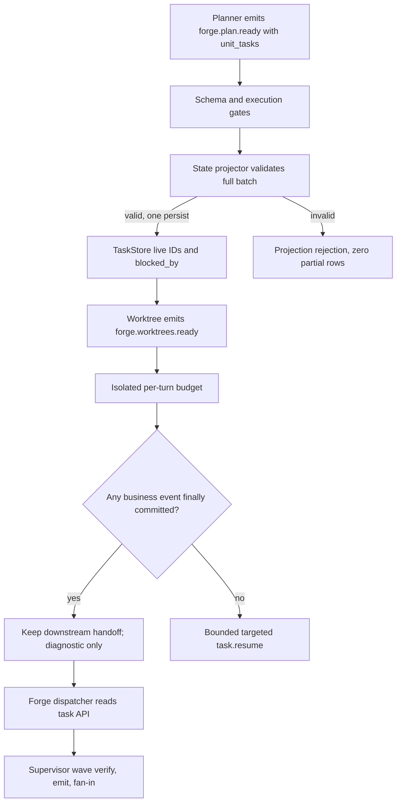
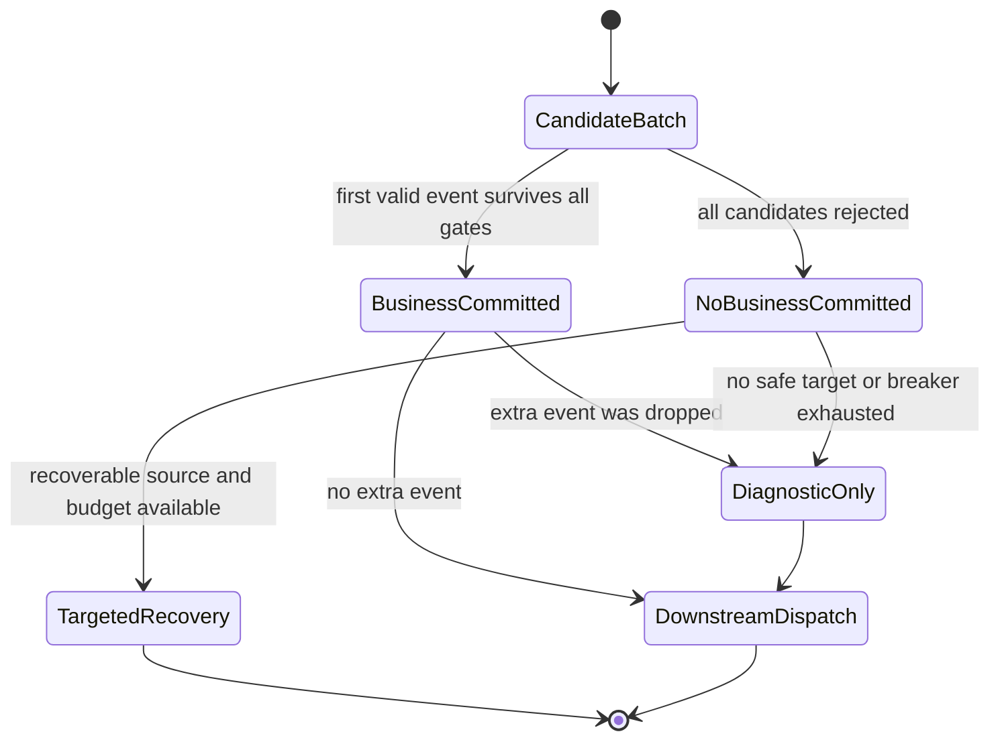
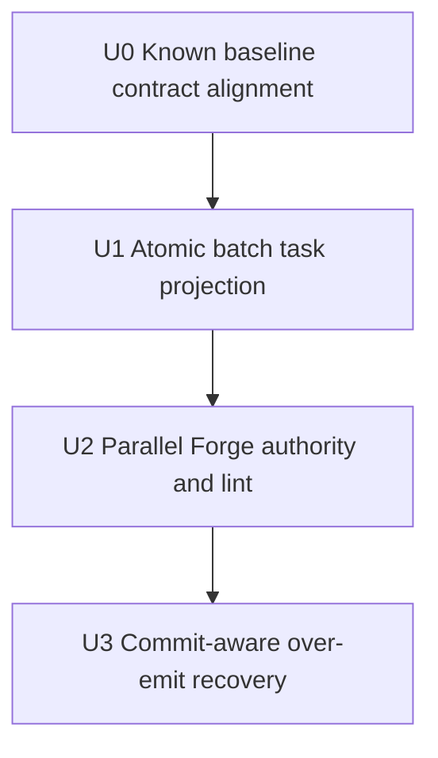

# Parallel Forge Dispatch Contract 根因修复计划

## Goal Capsule

- **目标：** 从机制层消除 `parallel-forge` 在 planner task 注册与 isolated over-emit 恢复上的协议冲突，保证合法 `forge.worktrees.ready` 已提交后 `forge-dispatcher` 必须获得下一次有效调度并能基于完整 task DAG 发出 supervisor wave。
- **权威顺序：** 仓库 `AGENTS.md` / `CLAUDE.md` 硬规则 → 本计划的 Product Contract → KTD → 串行 U-ID → 当前源码与测试；若计划与硬规则或已验证源码冲突，按停止条件回到计划修订，不得覆盖硬规则。
- **执行方式：** 严格按 U0 → U1 → U2 → U3；U0 先消除已知红色基线，之后每个 Unit 独立完成 Acceptance Red、Unit Red、Green、Refactor、集成、回归和提交边界后才能进入下一个 Unit。
- **停止条件：** 真实调用链与 Evidence 冲突、预期 Red 未触达目标逻辑、需要新增未计划的公开接口或依赖、任一关键决策置信度降到 0.85 以下。
- **完成归属：** U2 在 task authority 切片内完成 task-to-wave 验收，U3 在 recovery 切片内完成重复 handoff 的最终组合验收、文档同步和全量门禁；不设置“以后补测试”的独立 Unit。

---

## Product Contract

### 0. 计划状态

**READY，修订后复审通过。** 本次修订已经把原评审指出的六项`plan_unusable`缺口全部转换为下文的强制实施契约，并完成一致性、可实施性、范围守卫与对抗性复审；没有剩余实施设计 blocker。Executor可以从U0开始，但U0 targeted baseline未绿前不得进入U1。

- **代码基线：** `adb518043f5cf8061ae3e90f0a18af2feb525213`。
- **工作区基线：** 修订完成时已有五项与本计划无关的未跟踪用户改动：`presets/en/red-team-attack.yml`、`presets/schemas/red-team-attack.yml`、`presets/templates/red-team-attack/`、`ralph.red-team-attack.yml`、`red-team-attack-preset-design.md`。Executor 必须保留它们，且不得把它们计入本计划 diff、提交或范围门禁结果。
- **调查范围：** `parallel-forge` preset/schema、task CLI ACL、state projector、isolated per-turn budget、EventBus 调度、supervisor fan-in、preset lint、BDD/E2E、agent skill guide、operator preset skills、相关 git 历史与 `docs/solutions/`。
- **已执行验证：** 源码、配置、测试和 git 历史调查；`./scripts/run-tests.sh` 的 Phase 2（23/23）与 doctest（19 passed、4 ignored）通过，Phase 1 在 `implementation_review_dispatcher_contract_has_no_resume_redrive` 处确定性失败；单独 nextest 复跑得到相同失败（E17）。
- **尚未执行验证：** 本计划功能的 Acceptance Red/Green、mock E2E、lint、build、clippy 和 doc drift由 U0-U3 执行。
- **启动门禁：** 本修订版已复审通过，可启动U0；进入U1的硬门禁是U0 targeted nextest绿色。E17不豁免、不记入allowlist、不等待外部所有者。
- **最终门禁：** `./scripts/run-tests.sh` 必须全绿；任何已知红色均不得以“与本计划无关”为理由放行。
- **阻塞项处置：** 原`plan_unusable: implementation-ready contract leaves persistence observability, migration approval, runtime fixture design, and external baseline gating unresolved`已由KTD8-KTD13、实施契约4.1-4.6和U0-U3明确闭合并经复审确认。

### 1. 功能目标

#### 业务目标

让 preset 作者和 loop operator 可以依赖一个确定契约：一个规划事件原子建立全部 Unit tasks；一个已提交的 handoff 不会被同 activation 的多余事件恢复抢占；配置在启动前即可拒绝 agent 指令与 task authority 不一致。

#### 用户或调用方

- `parallel-forge` operator：期望 planner → tasks → worktrees → dispatcher → supervisor wave 自动推进。
- preset 作者和 reviewer：期望 `ralph preset check --strict` 在运行前发现不可执行的 task mutation 指令。
- EventLoop 调用方：期望 over-emit backpressure 不破坏已经提交的业务事件和下游 pending。
- executor hats：通过公开 task API 读取 projector 创建的 live `task_id`、`task_key` 和依赖状态。

#### 当前行为

1. `parallel-forge` planner instructions 要求直接执行 `ralph tools task add`，但 planner 不在 `tasks.coordinator_hats`，命令会被 `HatCommandPolicy` 拒绝。
2. `parallel-forge` 没有 `event_loop.state_projection` 的 task action；顶部 `state_projection` 仅是状态字段映射，不能创建 `.ralph/agent/tasks.jsonl`。
3. isolated per-turn budget 在保留第一条业务事件、丢弃第二条时立即向原 hat 注入 targeted `task.resume`。
4. `next_hat` 明确让 targeted event 抢占合法 handoff priority，因此 worktree recovery 可压过已排队的 `forge-dispatcher`。
5. 现有 BDD 用 dummy hats 直接构造事件，未覆盖 task ACL、projector task materialization 与 over-emit/dispatch 组合。

#### 目标行为与行为差异

- `forge.plan.ready` 携带完整、结构化 Unit task specs；preset 声明的 state projection 在一次持久化中创建或复用全部 tasks，并解析 task-key 依赖为 live task IDs。
- 批量 payload 缺字段、计数不一致、重复 key、未知依赖或持久化失败时，整批拒绝且 task ledger 不出现部分写入。
- planner 不再调用 task mutation CLI；dispatcher 只读 task API 并使用 projector 生成的 live IDs。
- over-emit feedback 在最终 commit 结果可知后决定：至少一条业务事件已提交时只记录诊断，不注入 publisher-targeted recovery；零业务事件提交时保留有界 targeted recovery。
- strict preset lint 拒绝“instructions 要求 agent task add/ensure，但 hat authority 或 projector ownership 不允许”的配置。
- 真实 EventLoop 验收证明重复 `forge.worktrees.ready` 不会阻止 dispatcher，且 task DAG 能进入 supervisor wave。

#### 输入、输出与状态变化

- **输入：** `forge.plan.ready` JSON payload，包含 `unit_count` 与非空 `unit_tasks[]`；isolated activation 的候选事件批；preset YAML。
- **输出：** 原子更新的 `.ralph/agent/tasks.jsonl`；结构化 `event.isolation.boundary_violation` 诊断；必要时才产生的 targeted `task.resume`；合法 dispatcher/wave events。
- **状态变化：** task rows 从不存在变为 `open`，依赖转成 `blocked_by` live IDs；业务 handoff pending 保持可调度；rejection breaker 只对真正需要恢复的 turn 计数。
- **错误语义：** batch projection 任一 item 无效则 `event.state_projection.rejected` 并零部分写；lint 发现不可执行指令则 `Error`；over-emit 始终丢弃多余业务事件但不撤销首个已提交事件。

#### 兼容、性能、安全与约束

- **兼容：** 不维护错误 preset 行为的向后兼容；现有单 task `ensure_task`、fix-unit 特例、human CLI 和 projector-disabled preset 行为必须保持。
- **性能：** N 个 Unit 只加载和持久化 task ledger 一次；不得退化为 N 次 CLI 进程或 N 次全文件写。
- **边界：** `unit_count` 必须等于 `unit_tasks` 长度且至少为 1；不引入仓库中没有依据的任意最大 Unit 数，有限 JSON payload 继续受现有事件读取边界约束。
- **权限：** 不把 planner 加入 coordinator allowlist，不放宽 agent task ACL；projector 继续是声明启用后的唯一 task writer。
- **持久化：** 不新增数据库或 ledger 路径；使用现有 `TaskStore` 和 `.ralph/agent/tasks.jsonl`。
- **依赖：** 不新增 crate。
- **测试入口：** 严禁裸跑 `cargo test -p ralph-cli`；按 `AGENTS.md` 使用 nextest 和两阶段全量脚本。

#### 本次范围

- 通用批量 task state-projection action 与 action-key 驱动的 topic 选择。
- commit-aware isolated over-emit recovery。
- 通用 preset lint 预防 task mutation authority 漂移。
- `parallel-forge` preset/schema/BDD/mock E2E 与相关 agent/operator 文档同步。

#### 非目标

- 不重构 `SupervisorStore`、worker PTY、wave identity 或 worktree 生命周期。
- 不改变所有 targeted recovery 的全局最高优先级；只修复不应创建 targeted recovery 的 over-emit 分支。
- 不把 execution-plan artifact 内容读取逻辑硬编码进 EventLoop。
- 不依赖 prompt 文案“exactly once”作为正确性机制。
- 不添加外部依赖、数据库迁移、CLI 子命令或 feature flag。

#### 已确认事实、假设与未确认假设

- **已确认事实：** Evidence Ledger E1-E23。
- **已确认假设：** `unit_tasks[]` 可以作为 `forge.plan.ready` 的事件事实输入；其 task identity 和依赖足以投影 runtime tasks，execution-plan artifact 继续拥有代码范围与集成顺序等静态规划信息。
- **待验证假设：** 无 launch-blocking 设计假设；4.1-4.6 已固定 seam、集合、fixture DSL、E2E 协议、基线处置和文件范围。各 Unit 的 Red/Green 只验证实现是否满足这些契约，不再授权 Executor 重新设计契约。

### Requirements

#### Task projection 与 authority

- R1. 一个启用 state projection 的事件必须能通过声明式 batch action 原子创建或幂等复用 N 个 task，并解析 batch 内依赖。
- R2. batch 任一 item 不合法时不得写入任何新 task row，并必须产生可观察的 projection rejection。
- R3. projector 实际处理的 topics 由启用配置中的 `actions` / `actions_chain` keys 决定，不再要求为每个新 topic修改 Rust 常量白名单。
- R4. `parallel-forge` planner 不得直接 mutation task ledger；`forge.plan.ready` 是 Unit task materialization 的唯一业务事实。
- R5. dispatcher 必须从公开 task API 取得 live IDs 和状态，并在 task 集合为空或与 `unit_count` 不一致时 fail closed，不得误报 development done。

#### Isolated recovery

- R6. 一个 isolated activation 至少有一条业务事件最终提交时，多余事件只产生诊断，不得生成抢占合法下游 handoff 的 targeted recovery。
- R7. 一个 isolated activation 的所有业务候选都未提交时，runtime 必须保留有界、定向、可操作的 recovery，且该 turn 不被误判为空进展。

#### Preset 防漂移与组合验收

- R8. strict preset lint 必须拒绝 agent instructions 中不可执行的 `task add` / plain `task ensure`，同时允许 human-only 文档、只读 task 命令和合法 fix-unit mint。
- R9. 真实组合验收必须证明 planner payload 建立 tasks、重复 worktree handoff 只提交一次、dispatcher 在 recovery 之前激活并进入 supervisor fan-out。
- R10. 所有受影响的 preset schema、injected agent skill guides、preset operator skills 和 CLI drift 文档必须与新契约一致。

#### 可观察性、迁移与 test harness

- R11. 取消 `PROJECTED_TOPICS` 硬编码门禁前，必须枚举仓库内全部 builtin、fixture 与示例配置的 `actions` / `actions_chain` topic，形成旧门禁与新 action-key 权威的迁移审计；任何旧实现中 inert、变更后会激活的 topic 都必须逐项确认并有回归测试。
- R12. commit-aware over-emit 语义必须通过一个不依赖 `parallel-forge` topic、task projector 或 supervisor 的通用 isolated preset fixture 验证，证明该机制对其他 isolated preset 的 committed-first、zero-commit、terminal/default-publish 与 handoff 路径不造成回归。
- R13. “64 项批次只持久化一次”必须通过 `TaskStore` 成功原子替换边界上的 path-scoped 测试观察器直接计数；唯一通过断言是该批次对应 ledger path 的成功持久化计数增量恰好为 `1`，不得用行数、锁次数或 helper 调用次数替代。
- R14. action-key 迁移的权威集合固定为：旧兼容集合 `{work.ready, work.done, queue.advance, plan.complete, review.dimensions.complete}`，本计划批准的新 builtin 激活集合恰好为 `{forge.plan.ready}`；测试专用自定义 topic 不进入生产批准集合。
- R15. scenario harness 必须能够从真实 `TaskStore` 断言 ledger 行数、按 `task_key` 定位的 status、由 live ID 反解后的 blocker keys、精确 ready task-key 集，以及事件 payload 中的 live `task_id` 引用；不得把非确定性 task ID 写死在 fixture。
- R16. mock E2E 必须使用按 activation 分组、带持久游标且支持 `{{task_id:<task_key>}}` 运行时替换的 cassette；旧的无分组 cassette 保持原有整段回放行为，游标耗尽或 task key 不存在时 fail closed。

#### 基线与范围治理

- R17. E17 红色基线纳入本计划 U0：只修正过时测试契约，使其断言 dispatcher 的两个互斥可发布 topic `{review.unit.ready, dispatch.blocked}`，继续禁止 `task.resume` redrive；不修改 `implementation-review` preset 生产行为，不设豁免。
- R18. 本计划的允许改动文件以 4.6 的逐文件清单为唯一范围；实现发现必须增加未列文件、公开接口或依赖时立即停止并修订计划，禁止以目录级或“如有需要”描述自行扩面。

### BDD 行为规格

```gherkin
Feature: Parallel Forge task materialization and dispatch

  Background:
    Given an isolated loop with tasks enabled and state projection configured
    And the planner is not a task coordinator

  Scenario S1: Planning handoff atomically creates a task DAG
    Given forge.plan.ready declares two unit task specs where U2 depends on U1
    When the event is accepted
    Then exactly two open task rows exist
    And U2 blocked_by contains U1's live task id
    And no agent task mutation command is required

  Scenario S2: Invalid batch leaves no partial task state
    Given forge.plan.ready contains one valid unit and one unit with an unknown dependency
    When state projection applies the batch
    Then the event is rejected with event.state_projection.rejected
    And neither unit is persisted

  Scenario S3: Replaying the same planning handoff is idempotent
    Given a valid forge.plan.ready batch was already projected
    When the identical event is replayed
    Then no duplicate task row or task id is created
    And the dependency graph is unchanged

  Scenario S4: A committed handoff survives an extra emit
    Given worktree emits forge.worktrees.ready twice in one activation
    When the first event commits and the second exceeds the single-event budget
    Then one forge.worktrees.ready reaches forge-dispatcher
    And no task.resume targets worktree
    And forge-dispatcher is the next eligible business consumer

  Scenario S5: A turn with no committed business event receives recovery
    Given every business event in an isolated activation is rejected before commit
    When post-commit feedback is resolved
    Then exactly one bounded task.resume targets the source hat
    And the turn is not counted as silent no-progress

  Scenario S6: Strict lint rejects impossible task mutation instructions
    Given a non-coordinator hat instruction tells the agent to run task add
    When the preset is checked strictly
    Then an Error finding identifies the task authority contradiction

  Scenario S7: Projector ownership rejects coordinator mutation instructions
    Given state projection owns task creation
    And a coordinator hat instruction tells the agent to run plain task ensure
    When the preset is checked strictly
    Then an Error finding identifies the projector single-writer contradiction

  Scenario S8: Parallel Forge reaches supervisor fan-out
    Given planner projected a two-unit DAG and worktrees are ready
    When dispatcher observes the task list
    Then it emits ready payloads with live task ids for the dependency-ready units
    And supervisor records the expected slots
    And completion of the first wave makes the dependent unit ready

  Scenario S9: Configured projection topics migrate without accidental activation
    Given every repository builtin, fixture and example state-projection config is inventoried
    When action keys replace the hard-coded projected-topic gate
    Then every newly activated topic is explicitly approved and covered
    And a topic with no configured action remains inert

  Scenario S10: Generic isolated presets preserve recovery semantics
    Given an isolated fixture with generic producer and consumer hats
    When the producer commits one handoff and over-emits another business event
    Then the consumer receives the committed handoff before any recovery
    And when all business candidates fail before commit the producer receives one bounded recovery
    And terminal and default-publish behavior remains unchanged

  Scenario S11: A finite batch crosses the persistence boundary once
    Given a unique temporary task ledger and a valid 64-item task batch
    When the projector commits the batch
    Then the successful atomic replacement count for that exact ledger path increases by exactly one
    And reloading the ledger returns all 64 tasks and their resolved dependencies

  Scenario S12: Runtime fixtures assert live task identity
    Given a two-task planning fixture where U2 depends on U1 by task key
    When the real workflow scenario runs
    Then the task ledger contains exactly the declared keys and blocker-key graph
    And exec.unit.ready references the live task id resolved from U1's ledger row
    And the supervisor fan-in status matches the declared wave expectation

  Scenario S13: Mock E2E consumes one response group per activation
    Given an activation-grouped parallel-forge cassette with task-id placeholders
    When the real E2E runner invokes the mock backend repeatedly
    Then each invocation consumes exactly the next response group
    And placeholders resolve from the scenario workspace task ledger
    And cursor exhaustion or an unresolved task key fails the scenario
```

---

## Planning Contract

### 2. 代码库现状与证据

#### 2.1 当前实现入口

- **外部入口：** `ralph run -H builtin:parallel-forge --plan <path>` 加载 embedded preset；agent 使用 `ralph emit`、`ralph wave emit` 和 `ralph tools task list`。
- **task mutation 调用链：** `crates/ralph-cli/src/task_cli.rs` → `HatCommandPolicy::check_task_with_config` → coordinator ACL → projector single-writer gate → `TaskStore`。
- **projection 调用链：** EventLoop 接受候选事件 → execution contract commit → `StateProjector::apply` → `StateProjectionAction` dispatch → `state_projector/task.rs` → `TaskStore` 持久化。
- **over-emit 调用链：** `EventLoop::process_events_from_jsonl` → isolated per-turn budget → 当前立即 publish targeted `task.resume` → `EventLoop::next_hat` targeted fast path → 合法 handoff priority。
- **wave 调用链：** `forge-dispatcher` → `ralph wave verify/emit` → loop runner supervisor bridge → slot worker → `SupervisorCoordinator` fan-in。
- **数据边界：** main events ledger、`.ralph/agent/tasks.jsonl`、execution-plan artifact、`.ralph/supervisor.db`；本计划只修改 task ledger 写入协议和事件调度反馈，不直接读写 supervisor DB。
- **现有测试：** state projector unit tests、hat command policy tests、next-hat preemption tests、isolated complex regression、preset lint、`run_workflow_guard_scenario` BDD、loop runner supervisor tests、`ralph-e2e --mock`。
- **构建验证：** `cargo fmt --check`、`cargo clippy --workspace --all-targets`、`cargo build --workspace`、targeted nextest、`./scripts/run-tests.sh`。

#### 2.2 Evidence Ledger

| Evidence ID | 来源 | 观察结果 | 对计划的影响 | 可靠性 |
|---|---|---|---|---|
| E1 | `presets/en/parallel-forge.yml` planner instructions | planner 被要求逐 Unit 执行 `ralph tools task add` | 必须删除 agent 直接写 task 的协议 | 高 |
| E2 | `presets/en/parallel-forge.yml` `tasks.coordinator_hats` | allowlist 只有 `forge-dispatcher` | planner 的 `task add` 必然被 ACL 拒绝 | 高 |
| E3 | `crates/ralph-cli/src/hat_command_policy.rs::check_task` | `Add` / `Ensure` 是 coordinator-only | 不得把失败归因成 agent 偶然漏做 | 高 |
| E4 | `crates/ralph-cli/src/hat_command_policy.rs::check_projector_task_create` | projection enabled 时 agent `task add` / plain `ensure` 即使是 coordinator 也被拒绝 | 选择 projector 单写者，不能靠扩大 coordinator_hats 修复 | 高 |
| E5 | `crates/ralph-core/src/config/state_projection.rs` | action enum 只有单 task ensure/close 等动作 | 需要新增通用 batch action | 高 |
| E6 | `crates/ralph-core/src/state_projector/mod.rs::PROJECTED_TOPICS` | 硬编码 topic whitelist，配置 action key 仍可能被静默跳过 | 用 action keys 作为显式 opt-in 权威，避免未来 topic 特判 | 高 |
| E7 | `crates/ralph-core/src/state_projector/task.rs::project_ensure_task` | projector 已使用 `TaskStore`、loop ID、owner、R4 与幂等 key | batch action 应复用这些不变量并单次持久化 | 高 |
| E8 | `crates/ralph-core/src/task_store.rs` 与 task model | task 依赖以 live task ID 存在 `blocked_by`；`with_exclusive_lock` 在闭包结束后序列化并调用一次 `write_jsonl_atomic` | batch 必须在同一排他锁内解析 stable keys 到 live IDs，并在成功 rename 边界直接观测持久化次数 | 高 |
| E9 | `crates/ralph-core/src/event_loop/mod.rs` isolated budget | 首事件保留、额外事件被丢弃后立即注入 targeted resume | feedback 决策发生得过早 | 高 |
| E10 | `crates/ralph-core/src/event_loop/mod.rs::next_hat` 与 `next_hat_topic_preemption.rs` | targeted pending 明确强于 handoff priority | 不修改通用 target 优先级；应避免在 committed-first 场景制造错误 target | 高 |
| E11 | `isolated_complex_regression.rs::isolated_extra_business_event_drop_injects_targeted_recovery_resume` | 旧测试把“首事件已提交仍必须 resume”锁成契约 | U3 必须先建立 characterization，再按 commit-aware 语义替换断言 | 高 |
| E12 | `docs/solutions/logic-errors/isolated-ralph-must-not-drain-multi-consumer-pending.md` | 已有先例要求 recovery 在合法 peer pending 时让路 | 支持 committed handoff 优先于恢复 | 中高 |
| E13 | `presets/schemas/parallel-forge.yml` | `forge.plan.ready` 只有路径、count、plan_key，没有 task specs | schema/preset 必须同时新增结构化 task specs | 高 |
| E14 | `parallel_forge_declared_flow_runtime.yml` | dummy hats 直接构造 unit events，不走 task ACL 或 task materialization | 必须新增真实组合 fixture，不能只延长现有拓扑测试 | 高 |
| E15 | git commits `535eebf4`、`42833354`、`99ef6a71`、`0a80e5ce` | preset 和拓扑测试近期连续修订但 task authority 冲突自初版保留 | 需要通用 lint 和组合验收防止再次漂移 | 高 |
| E16 | 诊断报告 `docs/report/2026-07-28-parallel-forge-primary-20260728-003922-diagnosis.md` | tasks 缺失、worktree 双 emit、dispatcher 未启动在同一 run 同时出现 | 计划必须同时修 task ownership 和 recovery starvation | 中高 |
| E17 | `./scripts/run-tests.sh`；`cargo nextest run -p ralph-core --test scenarios -- implementation_review_dispatcher_contract_has_no_resume_redrive` | 测试仍要求一个 publish，但当前 `implementation-review` dispatcher 合法声明互斥结果 `review.unit.ready` 与 `dispatch.blocked`；全量与 targeted 均确定性失败 | 纳入 U0 修正过时测试断言，不改 preset，不豁免红色基线 | 高 |
| E18 | `crates/ralph-core/tests/scenarios.rs::ExpectedYaml` 与 `run_workflow_guard_scenario` | harness 目前能断言 event/payload/state，但不能读取 task ledger、反解 blocker key 或检查 supervisor fan-in | 必须先扩展结构化 fixture DSL，再声称 task-to-wave 组合验收成立 | 高 |
| E19 | `crates/ralph-cli/src/loop_runner/wave/task_projection.rs` 与 `wave_supervisor.rs` | wave slot 终态到 task close 的生产投影位于 CLI loop runner，不在 core scenario 的 in-memory bridge 内 | core BDD 与 CLI wave test 分层：前者证明 ledger/live ID/事件/wave 注册，后者证明 slot 终态关闭 task 并释放下一依赖 | 高 |
| E20 | `crates/ralph-e2e/src/mock_cli.rs`、`mock.rs`、`runner.rs` | 当前每次 backend invocation 都回放完整 cassette，无法表达多 activation 的不同输出，也无法引用运行时生成的 task ID | E2E 必须新增显式 activation 分组、workspace cursor 和 task-key placeholder；否则 fixture 设计不封闭 | 高 |
| E21 | `crates/ralph-cli/build.rs` 与 `presets/schemas/parallel-forge.yml` | embedded schema 的 `state_projection` 会合并到 runtime `event_loop.state_projection`；authoring preset 顶层同名状态映射不是 typed task projector 配置 | `forge.plan.ready` 的 batch action 必须写入 schema SSOT，并用 embedded preset semantic test证明生效 | 高 |
| E22 | 仓库内 typed state-projection 配置与 `PROJECTED_TOPICS` 审计 | 旧 Rust 门禁集合为五个 topic；本次 builtin 唯一需要从 inert 变 active 的 action key 是 `forge.plan.ready` | 把旧兼容集合和新增批准集合写死为迁移契约，其他新增 topic 一律测试失败 | 高 |
| E23 | `TaskStore::write_jsonl_atomic` | 真正的 durable 边界是临时文件写入、sync、rename 成功；ledger 行数不能证明调用次数 | test-only 观察器应在成功 rename 后按规范化 path 计数，且不得改变生产 wire/API | 高 |

#### 2.3 受影响范围

- **唯一权威范围：** 见 4.6 的逐文件清单。各 Unit 的文件表只是归属视图，不能扩大 4.6。
- **不受影响：** UI、网络服务、公开 RPC、数据库 schema、外部服务。
- **明确不改：** `implementation-review` preset、`presets/manifest.yml`、`presets/index.json`、zsh completion、`AGENTS.md`、`CLAUDE.md`、`skills/ralph-preset-{author,review}/SKILL.md`、`Cargo.toml` 和 `Cargo.lock`。若实施证据表明其中任一必须改变，停止并重新修订/评审计划。

### 3. 决策记录与置信度

| Decision ID | 决策问题 | 候选方案 | 最终选择 | 支持证据 | 排除其他方案的原因 | 置信度 |
|---|---|---|---|---|---|---|
| KTD1 | 谁创建 Unit tasks | planner CLI；dispatcher CLI；projector batch | `forge.plan.ready` 驱动 projector batch | E1-E8 | planner/dispatcher CLI 会与 ACL 或单写者冲突并形成双写 | 0.96 |
| KTD2 | batch 数据来自哪里 | runtime 读取 artifact；payload `unit_tasks[]`；硬编码 forge parser | payload `unit_tasks[]` | E5-E8、E13 | EventLoop 读取 artifact 会把 preset 文件格式耦合进基座；payload 是已验证事件事实 | 0.90 |
| KTD3 | batch 持久化语义 | 每 item 写一次；best effort；全批原子 | 预验证、解析依赖、单次 persist；任一失败零新增 | E7-E8 | 部分 task ledger 会让 dispatcher 得到虚假 ready set | 0.94 |
| KTD4 | projector topic 权威 | 扩大 Rust whitelist；通配所有事件；配置 action keys | enabled action keys 即显式 allowlist | E5-E6 | topic 特判会重复本次漂移；无 action 的事件仍保持 inert | 0.91 |
| KTD5 | over-emit 何时恢复 | 始终立即 resume；修改 next_hat 优先级；commit 后条件恢复 | 最终 commit 后：有业务 commit 则 diagnostic-only，零 commit 才 targeted resume | E9-E12 | 降低所有 targeted event 优先级会破坏真实 rejection recovery | 0.95 |
| KTD6 | 如何防止 preset 再次写出不可执行指令 | 只修本 preset；prompt 精确文案测试；通用 lint | typed config + raw instructions 的 strict lint | E1-E4、现有 `instructions_opac` 模式 | 单 preset 修复不能阻止复发；精确 prompt 测试违反 preset 测试规则 | 0.90 |
| KTD7 | 最高层验收 | 只做 unit；只做 BDD；BDD + loop runner + mock E2E | 分层验收，关键组合至少一个真实 EventLoop 与一个 mock E2E | E14-E16 | 单层测试无法同时证明配置、调度和 supervisor 集成 | 0.89 |
| KTD8 | 如何证明一次持久化 | 通过结果行数推断；mock helper；真实原子边界观察器 | `write_jsonl_atomic` 成功 rename 后按 ledger path 计数的 `cfg(test)` 观察器 | E8、E23 | 行数只能证明结果，mock 只能证明调用意图；路径隔离可在并行测试中直接观测真实 durable 边界 | 0.96 |
| KTD9 | action-key 迁移批准边界 | 任意配置 key 自动激活；继续维护 Rust whitelist；显式差集 | 保留五个 legacy topic，批准新增 builtin 恰好 `{forge.plan.ready}` | E6、E21-E22 | 任意激活不可审计；继续双重 whitelist 会保留漂移根因 | 0.97 |
| KTD10 | scenario 如何断言 task-to-wave | 写死 task ID；只断言 event topic；扩展结构化 DSL | ledger key/依赖/ready 集、payload live-ID 引用、fan-in 三类精确断言 | E18-E19 | ID 非确定；只看 topic 无法证明账本和 wave 使用同一 task identity | 0.94 |
| KTD11 | 多 activation mock E2E | 每次重放完整 cassette；为每步写独立 scenario；带游标的分组 cassette | activation 分组 + workspace 原子游标 + task-key placeholder | E20 | 完整重放会重复事件；拆 scenario 不能证明单 loop 顺序；动态 ID 必须在运行时解析 | 0.92 |
| KTD12 | 已知红色基线如何处置 | 豁免；外部阻塞；纳入前置修复 | U0 仅修过时测试断言并先跑绿 | E17 | 最终全绿与豁免矛盾；等待外部所有者让计划不可执行；生产契约已明确是两个互斥 topic | 0.98 |
| KTD13 | 修改范围如何封闭 | 目录级描述；条件式补文档；逐文件白名单 | 4.6 列出全部 37 个允许文件，新增文件必须重修计划 | 用户阻塞反馈、E18-E23 | Executor 不应承担临场范围设计；显式清单可审计且能阻止顺手扩面 | 0.95 |

KTD1、KTD5、KTD7-KTD13 均为 `(session-settled: user-directed — chosen over 局部 prompt/去重补丁、不可观察断言和组件级测试：用户要求先把实施契约闭合、详细修订并重新评审)`。

### 4. 六项实施契约闭合

#### 4.1 TaskStore 单次持久化可观察契约

**生产路径最小扩展：** 现有 `TaskStore::with_exclusive_lock` 无论闭包返回什么值都会写盘，不能满足 invalid batch 零持久化。必须在同文件增加 crate-private `try_with_exclusive_lock`，签名语义固定为 `FnOnce(&mut TaskStore) -> Result<T, String>`：取得排他锁并reload，保存reloaded tasks快照，再执行闭包；闭包`Ok(T)`才序列化并调用一次`write_jsonl_atomic`；闭包`Err(reason)`、序列化失败或atomic write失败均恢复内存tasks快照，且不把部分状态同步给caller/cache。既有`with_exclusive_lock`的public签名和调用方不改。batch action在`try_with_exclusive_lock`的同一闭包内完成全批校验、existing-key兼容性判断、新ID分配、key→live-ID映射和`blocked_by`写入；helper成功返回后直接以`store.all().to_vec()`同步`ctx.tasks_cache`/ledger snapshot，禁止再调用现有`persist()`造成第二次`save`。不得在item循环中调用`save`、`ensure`或CLI。

**测试 seam：**

- 在 `crates/ralph-core/src/task_store.rs` 增加仅 `cfg(test)` 编译的 path-scoped 成功写观察器；key 是该 `TaskStore` 的规范化/绝对 tasks file path，value 是成功原子替换次数。
- 计数点固定在 temp file `sync_all` 成功且 `rename` 成功之后；失败写不计成功次数。
- 暴露给同 crate 测试的 helper 仅允许 `reset_successful_persist_count(path)` 和 `successful_persist_count(path)`，可见性为 `pub(crate)`；不得成为公开 API、不得改变 JSONL wire format。
- 每个测试使用独立 tempdir/path，避免 process 内并发测试共享全局计数。观察器即使内部使用同步 map，也必须按 path 隔离并在测试结束清理对应 entry。
- `try_with_exclusive_lock` 另有直接回归：闭包 `Err` 时成功计数增量 `0`、原 bytes 不变；闭包 `Ok` 时增量 `1`。这用于证明事务 helper 本身，不替代64项 projector验收。

**唯一证明断言：**

```text
after_successful_persist_count - before_successful_persist_count == 1
```

该断言在一个真实 `StateProjector::apply` 的 64-item valid batch 上执行。辅助断言必须 reload ledger 并验证 64 行、唯一 ID 和依赖图，但这些不能替代上面的 `== 1`。invalid batch 的对应断言是增量 `== 0` 且原文件 bytes 不变。相同 batch replay 可以再次产生一次完整原子持久化，但 task IDs/行数/依赖必须不变；本计划不要求通过跳过相同内容写来实现幂等。

#### 4.2 action-key 迁移权威清单

| 集合 | 精确 topic | 迁移规则 |
|---|---|---|
| legacy 已激活集合 | `work.ready`、`work.done`、`queue.advance`、`plan.complete`、`review.dimensions.complete` | 移除 `PROJECTED_TOPICS` 后仍允许在配置 action key 存在时激活 |
| 本计划批准的新 builtin 集合 | `forge.plan.ready` | 必须由 `presets/schemas/parallel-forge.yml` 的 typed state-projection batch action显式配置并有行为测试 |
| 测试专用集合 | unit test 内生成的 custom topic | 只证明 action-key 通用性，不计入 builtin 生产批准集合 |
| 禁止隐式激活 | 以上集合之外的任何 builtin action key | audit test fail，先修订计划后才能加入 |

迁移前权威清单（以本计划基线源码扫描并由测试固化）：

| 来源层 | 迁移前 typed action keys | 处置 |
|---|---|---|
| embedded builtin preset/schema | 空；`parallel-forge.yml` 顶层 `state_projection.actions[].on/set` 是状态字段映射，不是 `event_loop.state_projection` typed action | U2新增`forge.plan.ready`后，差集必须只多这一项 |
| core/CLI active test fixtures与programmatic configs | `work.ready`、`work.done`、`queue.advance`、`plan.complete`、`review.dimensions.complete`及synthetic custom key | 五个legacy key保持行为；synthetic key只证明通用性 |
| archived report/plan markdown示例 | 非runtime输入 | 不纳入激活集合，不修改归档 |
| 无action key的任意event topic | inert | 移除Rust门禁后仍必须inert |

权威 audit 位于 `crates/ralph-cli/src/presets.rs`：解析全部 embedded presets，收集 typed `event_loop.state_projection.actions` 与 `actions_chain` 的 key，计算 `configured_keys - legacy_set`，并精确断言等于 `{forge.plan.ready}`。`crates/ralph-core/src/state_projector/tests.rs` 固定五项 legacy 行为、synthetic configured topic active、unconfigured topic inert；现有 preset_lint/runtime fixture继续覆盖`work.done` chain和四项常用legacy keys。Rust unit fixture中的synthetic key不参与builtin清单。仓库外custom preset因action key变成真正opt-in的兼容性变化写入`CHANGELOG.md`和`docs/guide/configuration.md`。

#### 4.3 batch payload 与 task identity 契约

`forge.plan.ready` 在原有字段之外新增 required `unit_tasks`：

```yaml
unit_tasks:
  - unit_id: U1
    task_key: forge:<plan_key>:U1
    title: <non-empty title>
    depends_on_task_keys: []
```

- `unit_count`必须是非负JSON integer，且`unit_count == unit_tasks.length >= 1`；string、fraction、negative、overflow全部rejection。
- `unit_id` 和 `task_key` 在 batch 内各自唯一；`task_key` 必须精确匹配 `forge:<plan_key>:<unit_id>`。
- `depends_on_task_keys` 去重，引用同一 batch 的 task key，不允许 self edge、未知 edge 或 cycle。
- 新task固定`open`并按payload顺序追加，沿用现有默认priority、非fix-unit owner=`executor`和current loop规则；payload不引入第二套status/priority/owner authority。每个新row调用现有ID generator，并在现有store+本batch已分配ID中检查冲突；每项最多重试256次，耗尽则整批rejection。
- 相同`(loop_id, task_key)`已存在时，title、owner和由live ID反解后的blocker-key图兼容才复用其live ID；冲突、blocker指向batch外row或无法反解均整批rejection、零写。兼容row的status、started/completed timestamps、priority和ID原样保留，不把closed/failed/in-progress任务重新打开。
- 先为 existing/new rows 建完整 `task_key → live task_id` map，再一次性把 blocker keys 转为 `blocked_by` IDs。
- ID mint循环封装为`state_projector/task.rs`私有helper，测试通过deterministic candidate generator先返回冲突ID再返回唯一ID，并另测连续256次冲突触发整批rejection；不得增加production config或公开注入点。

typed action 的字段映射固定为：`kind: ensure_task_batch`、`items: unit_tasks`、`count: unit_count`、`key: task_key`、`title: title`、`blocked_by_keys: depends_on_task_keys`。字段名若实现时无法由现有 serde 结构表达，必须停止修订计划，不得自行换协议。

`presets/schemas/parallel-forge.yml`的SSOT形状固定为：

```yaml
state_projection:
  enabled: true
  actions:
    forge.plan.ready:
      kind: ensure_task_batch
      items: unit_tasks
      count: unit_count
      key: task_key
      title: title
      blocked_by_keys: depends_on_task_keys
```

同文件`schemas.forge.plan.ready.required_fields`必须加入`unit_tasks`，`field_docs.unit_tasks`必须说明上面四个item字段、key格式、依赖key语义和“planner只emit、不调用task mutation CLI”。`build.rs`现有schema merge把该顶层block合并到embedded runtime的`event_loop.state_projection`，不在`presets/en/parallel-forge.yml`再维护第二份typed action。

#### 4.4 task-to-wave scenario harness 契约

在 `crates/ralph-core/tests/scenarios.rs` 扩展 fixture DSL：

```yaml
expected:
  task_ledger:
    row_count: 2
    rows:
      - task_key: forge:p:U1
        status: open
        blocked_by_keys: []
      - task_key: forge:p:U2
        status: open
        blocked_by_keys: [forge:p:U1]
    ready_task_keys: [forge:p:U1]
  payload_task_refs:
    - topic: exec.unit.ready
      occurrence: 1
      payload_field: task_id
      task_key: forge:p:U1
  supervisor_waves:
    - wave_id: forge-p-wave-1
      kind: execution
      expected_total: 1
      completed_count: 0
      failed_count: 0
      phase: running
```

执行语义固定如下：

- `task_ledger` 从 scenario temp workspace 的真实 `TaskStore` reload；先建立 key→ID 与 ID→key map，再比较精确 row count、唯一 key、status、按 actual live ID 反解后的 blocker-key 集和 ready-key 集。未知 blocker ID、重复 key 或额外 row 均失败。
- blocker-key与ready-key按去重后字典序比较，fixture中的重复expected key直接失败，避免顺序掩盖集合差异。
- `payload_task_refs.occurrence`是从1开始的accepted-event序号，`payload_field`仅允许payload JSON object的顶层field名，不引入通用JSON查询语言；取指定topic/occurrence后与`task_key`对应actual live ID精确相等，缺topic/field/key、非string值或额外匹配均失败。
- `supervisor_waves` 使用当前scenario的`InMemoryCoordinatorBridge.store().fan_in_status(wave_id)`比较kind、总数、完成/失败数和phase，并用`list_wave_ids()`精确比较预期wave-id集合；额外/缺少wave均失败。
- `MockResponseYaml` 新增 fixture-only token `{{task_id:<task_key>}}`；在交给 `EventParser` 前从真实 TaskStore 解析替换。缺失、重复或尚未 materialize 的 key 直接使 scenario 失败，禁止回退空字符串。

新增 `parallel_forge_task_dispatch_runtime.yml` 只覆盖无 duplicate 的主路径：plan.ready 建两 task → worktree ready 一次 → dispatcher 的 `exec.unit.ready` 引用 U1 live ID → supervisor 注册第一 wave。core harness 不伪造 CLI task close；`wave_supervisor.rs` 负责证明真实 slot terminal projection 将 U1 close、U2 变 ready、第二 wave 使用 U2 live ID。两个测试合起来才满足 S8，任一单独通过不算完成。

#### 4.5 isolated runtime 与 mock E2E 封闭契约

**通用 runtime fixture：** 新建 `crates/ralph-core/src/event_loop/tests/isolated_over_emit_commit.rs` 并在 `tests/mod.rs` 显式注册。使用最小 producer/consumer、`generic.handoff` 与 `generic.extra`，不启用 forge、task projector或 supervisor：

1. committed-first：同 activation 输出 handoff+extra；accepted handoff 恰一条、boundary diagnostic 恰一条、producer-target `task.resume` 为零、next hat 是 consumer。
2. zero-commit：所有业务候选在 origin/schema/contract gate 前后均未成功 commit；producer-target `task.resume` 恰一条、breaker 只增一次、turn `had_events=true`。
3. terminal/default：terminal event + extra 不改变终态；default publish 不被误算 over-emit；现有 targeted priority 契约保持。

测试函数名固定以`generic_isolated_`开头：`generic_isolated_committed_first_keeps_handoff`、`generic_isolated_zero_commit_injects_one_resume`、`generic_isolated_terminal_and_default_publish_unchanged`，确保执行清单的nextest substring会选中完整三例而非空跑。

**core 组合 fixture：** `parallel_forge_duplicate_handoff_runtime.yml` 在 U2 fixture 上让 worktree 同 activation 输出两条 ready；断言 accepted `forge.worktrees.ready==1`、boundary diagnostic `==1`、worktree-target resume `==0`，并继续检查 live-ID payload 和 wave 状态。

**E2E cassette 协议：**

- 新增 `cassettes/e2e/parallel-forge-dispatch-contract.jsonl`，marker的wire shape固定为`{"ts":<u64>,"event":"_meta.activation","data":{"index":<u64>}}`；一个group从该marker之后开始，到下一marker之前结束，index必须从0连续递增且每组至少有一条`ux.terminal.write`。每次backend invocation只消费cursor指定的一组，marker本身不交给`SessionPlayer`。
- `MockCli` 新增scenario harness参数`--activation-cursor <workspace-path>`、`--task-ledger <workspace/.ralph/agent/tasks.jsonl>`与`--ralph-bin <resolved-local-binary>`。cursor初值0；每次调用使用已有`ralph_core::FileLock`对cursor sibling lock file取排他锁，选中当前group并成功生成输出后，以同目录temp+rename原子写入下一index，再释放锁；group缺失、重复、越界或cursor文件损坏均非零退出。不得新增锁依赖。
- `mock.rs` 增加只读cassette mode inspection：无marker返回`Legacy`；有marker时验证4.5的连续分组并返回group count及是否含task placeholder。`runner::configure_mock_mode`依据该结果给marker cassette注入固定workspace-local cursor路径`.ralph/e2e-mock/<scenario-id>-<backend>.cursor`；存在placeholder时再注入显式task-ledger参数。该函数从`Result<(), _>`收窄为返回`Result<Option<MockReplayExpectation>, _>`，expectation只含cursor path与expected group count。scenario执行结束后、workspace cleanup前，runner读取cursor并精确断言`consumed_group_count == expected_group_count`，不相等就把该scenario标成失败。placeholder出现在legacy cassette、marker与cursor参数不成对、或ledger路径越出scenario workspace时，mock setup直接失败。不得按scenario ID硬编码分支。
- 仅marker cassette启用分组语义；现有无marker cassette继续整段replay，保证已有mock E2E不漂移。group的terminal output成功flush且允许的commands全部成功后才推进cursor；失败不推进。
- 传入`--task-ledger`时，在terminal bytes解码及`bus.publish.data.command`解析之前，把`{{task_id:forge:<plan_key>:U1}}`替换为该显式ledger中的真实TaskStore row ID；不存在/重复key、路径不匹配workspace或placeholder语法不闭合均非零退出。此能力仅在`ralph-e2e` mock harness，不能进入生产adapter/EventLoop API。
- marker group中的`bus.publish.data.command`只允许三类无shell命令：`ralph emit`、`ralph wave verify`、`ralph wave emit`。mock-cli把首token`ralph`替换为显式`--ralph-bin`路径后用`Command`执行；任何其它program/verb、未白名单命令或非零exit均使group失败且cursor不推进。legacy cassette继续使用现有`--allow`与warning语义，避免改变既有fixture。
- scenario ID 固定 `parallel-forge-dispatch-contract`，在 `scenarios/mod.rs`、`lib.rs`、`main.rs::get_all_scenarios` 注册。setup 写入 plan/execution-plan 所需 fixture，使用 builtin `parallel-forge` 和真实 `RalphExecutor`、EventLoop、projector、EventBus、SupervisorCoordinator；不得 mock 这些组件。
- runner 从真实 events/task ledgers与公开进程结果精确断言：两 task/key/依赖正确；accepted worktree ready一条；worktree-target resume零条；第一条ready后的业务consumer是dispatcher；两个execution wave事件各使用相应live task ID；U1 terminal后U2才ready；`development.done`恰一条；cassette cursor恰好耗尽全部声明groups。E2E不得直接读取`.ralph/supervisor.db`；真实fan-in store状态由4.4的core bridge断言和CLI `wave_supervisor` production-path测试负责。

**E2E activation group 事件序列：**

| index | activated hat / trigger | group内严格命令结果 | 关键fixture值 |
|---:|---|---|---|
| 0 | inspector / `forge.start` | `ralph emit forge.plan.inspected` | `plan_usable=true`，真实`plan_path`/`inspection_report_path`，`plan_key=e2e-parallel-forge` |
| 1 | planner / `forge.plan.inspected` | `ralph emit forge.plan.ready` | `unit_count=2`，4.3的U1/U2 `unit_tasks`，真实development/execution plan paths |
| 2 | guardian / `forge.plan.ready` | `ralph emit forge.concurrency.approved` | `approved=true`，真实approval artifact |
| 3 | worktree / `forge.concurrency.approved` | 连续两次相同`ralph emit forge.worktrees.ready` | 真实worktree map、integration branch、40-char base SHA；用于触发over-emit |
| 4 | forge-dispatcher / accepted worktree ready | 先`ralph wave verify exec.unit.ready --payloads <U1-json>`，再同bytes `ralph wave emit` | `wave_id=e2e-wave-u1`、slot0、`task_id={{task_id:forge:e2e-parallel-forge:U1}}` |
| 5 | executor / U1 `exec.unit.ready` | `ralph emit exec.unit.done` | wave/slot/unit原样，真实U1 report path与固定content hash |
| 6 | forge-dispatcher / runtime `exec.wave.complete` | verify+emit U2 payload | `wave_id=e2e-wave-u2`、slot0、U2 live task placeholder |
| 7 | executor / U2 `exec.unit.ready` | `ralph emit exec.unit.done` | U2 wave/slot/unit与真实report path |
| 8 | forge-dispatcher / second `exec.wave.complete` | `ralph emit forge.exec.development.done` | completed=2、failed=0、plan key/path一致 |
| 9 | reviewer / development done | `ralph emit forge.units.reviewed` | `all_approved=true`、真实summary artifact |
| 10 | integrator / units reviewed | `ralph emit forge.integration.done` | units=2、complete/linear=true、真实log/commit-map |
| 11 | verifier / integration done | `ralph emit forge.incremental.verified` | last=U2、passed=true、真实verification artifact |
| 12 | tester / incremental verified | `ralph emit forge.full.verified` | all_required_passed=true、真实full report |
| 13 | auditor / full verified | `ralph emit forge.audit.done` | verdict=ACCEPTED、真实audit report |
| 14 | reporter / audit done | 先`ralph emit forge.report.done`，再`ralph emit LOOP_COMPLETE` | 同一真实report_path；满足preset收尾双终态窄例外 |

setup必须预建表中所有artifact、两个unit worktree目录/映射与最小有效git基线；所有payload除表中fixture值外必须逐项满足`presets/schemas/parallel-forge.yml`当时的`required_fields`，禁止在cassette复制一套弱化schema。每组至少包含一条terminal write用于agent输出，真正状态变更只由上表严格命令产生。

#### 4.6 封闭文件清单

以下37个文件是本计划允许修改/新增的完整集合；不允许目录通配或条件式追加：

| # | 文件 | 动作 | Unit |
|---:|---|---|---|
| 1 | `crates/ralph-core/tests/scenarios.rs` | 修改 U0 过时基线断言、扩展 fixture DSL 与注册两场景 | U0/U2/U3 |
| 2 | `crates/ralph-core/src/config/state_projection.rs` | 修改 batch action serde | U1 |
| 3 | `crates/ralph-core/src/state_projector/mod.rs` | 修改 action-key authority/dispatch | U1 |
| 4 | `crates/ralph-core/src/state_projector/task.rs` | 修改 batch validation/materialization | U1 |
| 5 | `crates/ralph-core/src/task_store.rs` | 修改 test-only persist observer，复用原子写路径 | U1 |
| 6 | `crates/ralph-core/src/state_projector/tests.rs` | 修改 batch/atomic/idempotency 测试 | U1 |
| 7 | `presets/en/parallel-forge.yml` | 修改 planner/dispatcher 指令与 payload | U2 |
| 8 | `presets/schemas/parallel-forge.yml` | 修改 schema SSOT、required fields、batch action | U2 |
| 9 | `crates/ralph-core/src/preset_lint/instructions_opac.rs` | 修改 task authority lint | U2 |
| 10 | `crates/ralph-core/src/preset_lint/finding_id.rs` | 修改 finding ID | U2 |
| 11 | `crates/ralph-core/src/preset_lint/mod.rs` | 修改 lint wiring/tests | U2 |
| 12 | `crates/ralph-cli/src/presets.rs` | 修改 embedded semantic/migration audit | U2 |
| 13 | `crates/ralph-core/tests/scenarios/parallel_forge_task_dispatch_runtime.yml` | 新增无 duplicate 真实场景 | U2 |
| 14 | `crates/ralph-cli/src/loop_runner/tests/wave_supervisor.rs` | 修改 task-close/next-ready 两波断言 | U2 |
| 15 | `crates/ralph-core/src/event_loop/mod.rs` | 修改 post-commit recovery 结算 | U3 |
| 16 | `crates/ralph-core/src/event_loop/tests/isolated_complex_regression.rs` | 修改旧契约回归 | U3 |
| 17 | `crates/ralph-core/src/event_loop/tests/next_hat_topic_preemption.rs` | 修改 handoff/target 组合回归 | U3 |
| 18 | `crates/ralph-core/src/event_loop/tests/isolated_over_emit_commit.rs` | 新增通用 fixture tests | U3 |
| 19 | `crates/ralph-core/src/event_loop/tests/mod.rs` | 注册新 test module | U3 |
| 20 | `crates/ralph-core/tests/scenarios/parallel_forge_duplicate_handoff_runtime.yml` | 新增 duplicate 组合场景 | U3 |
| 21 | `crates/ralph-e2e/src/scenarios/parallel_forge.rs` | 新增 mock E2E scenario | U3 |
| 22 | `crates/ralph-e2e/src/scenarios/mod.rs` | 注册 scenario module | U3 |
| 23 | `crates/ralph-e2e/src/lib.rs` | 导出 scenario | U3 |
| 24 | `crates/ralph-e2e/src/main.rs` | 注册 scenario 与 MockCli 参数 | U3 |
| 25 | `crates/ralph-e2e/src/mock_cli.rs` | 修改 activation group/cursor/interpolation | U3 |
| 26 | `crates/ralph-e2e/src/mock.rs` | 修改 marker cassette 解析/兼容测试 | U3 |
| 27 | `crates/ralph-e2e/src/runner.rs` | 修改 workspace cursor 参数注入/耗尽断言 | U3 |
| 28 | `cassettes/e2e/parallel-forge-dispatch-contract.jsonl` | 新增分组 cassette | U3 |
| 29 | `crates/ralph-core/data/ralph-tools-tasks.md` | 修改 projection-owned task 操作指南 | U2 |
| 30 | `crates/ralph-core/data/ralph-tools-emit.md` | 修改 over-emit recovery 指南 | U3 |
| 31 | `docs/guide/configuration.md` | 修改 action-key opt-in/兼容说明 | U1 |
| 32 | `CHANGELOG.md` | 披露 custom preset action-key 激活语义 | U1 |
| 33 | `skills/ralph-preset-common/references/finding-rubric.md` | 修改 finding 映射 | U2 |
| 34 | `skills/ralph-preset-common/references/author-checklist.md` | 修改 task ownership 检查 | U2 |
| 35 | `skills/ralph-preset-common/references/patterns.md` | 修改合法 projector pattern | U2 |
| 36 | `skills/ralph-preset-common/references/agent-native-model.md` | 修改Q3/Q5：projection batch是runtime单写者，agent只读live task identity | U2 |
| 37 | `cassettes/e2e/README.md` | 修改activation marker、strict grouped command与legacy兼容说明 | U3 |

计划文件本身不计入实施diff。无需更新`ralph-tools.md`/`ralph-tools-cmdref.md`或operator skill的`commands.md`，因为面向loop agent的`ralph`生产CLI语法不变；新增的只是`ralph-e2e mock-cli`测试harness参数，其格式契约必须同步到`cassettes/e2e/README.md`与该subcommand自身help/doc comment。

### High-Level Technical Design





### Outside-In 调用链

operator 可观察 loop 推进 → embedded preset/schema → EventLoop admission/commit → state projector batch → TaskStore → dispatcher public task query → supervisor bridge/store。U1 从 task materialization 行为切入；U2 把 preset、lint 与无重复 handoff 的真实 task-to-wave 主路径接到该能力；U3 修复 admission/commit 后的 recovery，并在同一切片用 duplicate handoff 组合路径封口。

### 风险与系统影响

| 风险 | 触发条件 | 检测 | 缓解 | 剩余风险 |
|---|---|---|---|---|
| batch 生成 task ID 冲突 | 同一微秒批量 mint | unit/property-style 多 item 测试 | 对 store + batch 已分配 IDs 做有界重试；保持现有格式 | 极低 |
| dependency key 无法解析 | payload 缺少被依赖 Unit | projection rejection + 零写断言 | 全批预验证，错误携带 item/key | 低 |
| recovery 被过度抑制 | 首候选早期通过 budget、后续 gate 拒绝 | post-commit zero-business scenario | 决策必须依据最终 published/accepted business set，不依据早期 `accepted` | 中低 |
| lint 误报文档示例 | instructions 只描述禁止命令或 human CLI | positive/negative lint matrix | 识别 executable imperative 与否定上下文；finding 只对 agent hat instructions | 中 |
| action-key 切换意外激活旧配置 | builtin、fixture、示例或外部 preset 已声明非 whitelist topic | 仓库配置迁移审计 + newly-activated topic matrix | 逐项确认旧 inert topic；无 action topic 保持 inert；变更说明披露外部 preset 行为变化 | 中 |
| recovery 修复只对 forge 成立 | 测试依赖 forge topic、task projector 或 supervisor 才通过 | generic isolated fixture 的 commit-first/zero-commit 双向回归 | 用最小 producer/consumer preset 覆盖通用 EventLoop，不复用 forge 特例 | 中低 |
| preset/schema 漂移 | 只改一侧 | schema parity + embedded preset tests | 同 Unit 修改并跑三组 preset 校验 | 低 |
| 测试再次只验证 dummy events | fixture 不触达 task ledger | 明确 tasks file、next hat、wave slot 断言 | U2/U3 禁止 mock 掉 projector、EventBus、SupervisorCoordinator | 低 |

---

## Verification Contract

### 5. 验收与测试策略

| Scenario | 验收条件 | 测试入口 | 层级 | 风险补充 | E2E |
|---|---|---|---|---|---|
| S1 | 两 task、live IDs、blocked_by 正确、一次写入 | `state_projector` tests | unit + integration | idempotency | 否 |
| S2 | rejection 且 task ledger 零部分新增 | `state_projector` tests | unit | fault/atomicity | 否 |
| S3 | replay 后行数、IDs、依赖不变 | `state_projector` tests | unit | idempotency | 否 |
| S4 | dispatcher pending 保留、无 worktree-target resume | event-loop regression | state-machine integration | concurrency/priority | 否 |
| S5 | 零 commit 时恰一条 bounded resume | event-loop regression | state-machine integration | fault injection | 否 |
| S6 | strict lint Error，稳定 finding_id | preset lint | unit + CLI integration | mutation-style negative matrix | 否 |
| S7 | projection ownership 下 plain ensure 被 lint 拒绝 | preset lint | unit | authorization | 否 |
| S8 | tasks → ready set → supervisor slots → dependent next wave | workflow scenario + loop runner | BDD/integration | replay + fan-in | 是，mock |
| S9 | action-key 迁移清单完整、无意外 topic 激活、无 action 仍 inert | projector migration audit tests | unit + config integration | compatibility | 否 |
| S10 | generic committed-first 让路、zero-commit 恢复、terminal/default-publish 不变 | event-loop generic isolated regression | state-machine integration | cross-preset compatibility | 否 |
| S11 | 64项 batch 的真实成功 rename 计数增量恰好1 | TaskStore observer + state projector test | integration | persistence observability | 否 |
| S12 | ledger key/依赖/ready、payload live ID、fan-in状态精确一致 | workflow scenario + CLI wave test | BDD + integration | identity/ledger consistency | 否 |
| S13 | 每activation只消费一组、动态ID解析、cursor恰好耗尽 | mock-cli unit + ralph-e2e scenario | harness + E2E | replay determinism | 是 |

每项断言同时检查副作用：没有重复 task、没有错误 targeted recovery、没有伪造 development done、没有 partial ledger、没有额外 wave slot。

### 6. 需求—测试追踪矩阵

| Requirement | Scenario | 验收测试 | 单元测试 | 集成/契约 | E2E | Evidence | Unit |
|---|---|---|---|---|---|---|---|
| R1 | S1 | batch creates DAG | batch validate/mint/resolve | projector apply | — | E5-E8 | U1 |
| R2 | S2 | invalid batch atomic reject | validation matrix | projection rejection | — | E7-E8 | U1 |
| R3 | S1 | configured nonlegacy topic projects | action-key selection | config parse/apply | — | E6 | U1 |
| R4 | S1/S8 | planner event materializes tasks | payload/schema parse | embedded preset | mock | E1-E4/E13 | U2 |
| R5 | S8 | dispatcher uses live IDs/fails empty | ready-set cases | supervisor bridge | mock | E13-E14 | U2 |
| R6 | S4 | committed handoff no resume | commit-aware helper | EventLoop/next_hat | mock | E9-E12 | U3 |
| R7 | S5 | zero commit bounded resume | breaker/recovery cases | EventLoop | — | E9-E11 | U3 |
| R8 | S6/S7 | impossible preset fails strict lint | lint matrix | preset check | — | E1-E4/E15 | U2 |
| R9 | S8 | full composition reaches wave | — | BDD + loop runner | mock | E14-E16 | U2（无重复 handoff）/U3（含重复 handoff） |
| R10 | S6/S8 | docs/schema/operator rules aligned | drift assertions | preset parity | — | E13/E15 | U2/U3 |
| R11 | S9 | repository action-key migration audit | topic inventory + inert matrix | projector config/apply + embedded audit | — | E6/E21-E22 | U1/U2 |
| R12 | S10 | generic isolated recovery compatibility | commit decision table | EventLoop generic fixture | — | E9-E12 | U3 |
| R13 | S11 | 64项成功persist增量恰好1 | path-scoped observer | real TaskStore/projector | — | E8/E23 | U1 |
| R14 | S9 | newly-active builtin精确为forge.plan.ready | set difference | embedded preset parse | — | E21-E22 | U1/U2 |
| R15 | S12 | task graph/live-ID/fan-in精确断言 | harness evaluator | core BDD + CLI wave | — | E18-E19 | U2 |
| R16 | S13 | activation groups/cursor/task placeholder | mock-cli parser/cursor | runner compatibility | mock | E20 | U3 |
| R17 | — | baseline test精确topic set且no resume | scenario contract test | targeted nextest | — | E17 | U0 |
| R18 | — | actual diff路径均属于4.6 | `git diff --name-only`审计 | Unit/最终门禁 | — | 用户阻塞反馈 | U0-U3 |

---

## Implementation Units

### 7. 严格串行开发单元

### U0. 已知红色基线契约对齐

1. **Unit 目标：** 在任何生产实现前恢复 `implementation_review_dispatcher_contract_has_no_resume_redrive` 绿色，使最终全量门禁不存在外部豁免。
2. **对应：** R17；KTD12；E17。
3. **唯一修改：** `crates/ralph-core/tests/scenarios.rs` 中该测试；不得修改 `implementation-review` preset、schema 或 dispatcher instructions。
4. **精确断言：** dispatcher 的显式 `publishes` 集合恰好等于 `{review.unit.ready, dispatch.blocked}`；两者代表同一 activation 的互斥成功/阻塞结果，而不是要求 runtime 同时发出。继续断言集合不含 `task.resume`，且不存在 resume redrive/default publish 的旧路径。
5. **Acceptance Red：** 原断言 `publishes.len()==1` 在当前源码上确定性失败，必须先复现同一失败；其他失败不是有效 Red。
6. **Green：** 只更新过时的结构化契约断言，不放宽为 `contains`、不删除 no-resume 断言、不改生产行为。
7. **命令：** `cargo nextest run -p ralph-core --test scenarios -- implementation_review_dispatcher_contract_has_no_resume_redrive`，必须 1/1 通过。
8. **停止条件：** 若实际 publishes 集合不是精确两个 topic，或 targeted test 还有其他失败，停止并重新评审；不得把失败标记为 baseline allowlist。
9. **完成标准：** targeted 绿色、diff 仅为该测试断言、可独立提交；之后才允许进入 U1。

### U1. 原子批量 task projection

1. **Unit 目标：** 一个声明式事件把 `unit_tasks[]` 原子投影为带 live ID 和依赖的 task DAG。
2. **对应：** R1-R3、R11；S1-S3、S9；KTD1-KTD4；E5-E8。
3. **外部可观察结果：** 接受事件后 task API 返回完整 DAG；非法 batch 后 task ledger 无新增。
4. **当前行为基线：** projector 只支持单 task action，并用 `PROJECTED_TOPICS` 跳过非白名单 topic。
5. **输入输出：** 输入非空 JSON array、key/title/dependency/count pointers；输出 N 个 task rows或一个 projection rejection；空数组、计数不一致、重复 key、未知依赖均拒绝；单次 persist；replay 幂等。
6. **修改位置：**
   - `crates/ralph-core/src/config/state_projection.rs`：新增 batch action 配置；不改变其他 action wire format。
   - `crates/ralph-core/src/state_projector/mod.rs`：按配置 action keys 选择 topic并 dispatch batch；不修改 event policy。
   - `crates/ralph-core/src/state_projector/task.rs`：全批预验证、ID/key 解析、依赖绑定、单次 persist；不读取 execution-plan 文件。
   - `crates/ralph-core/src/task_store.rs`：增加 4.1 定义的 path-scoped `cfg(test)` 成功 persist 观察器，计数点在成功 rename 后。
   - `crates/ralph-core/src/state_projector/tests.rs`：新增 batch、atomicity、idempotency、configured-topic 覆盖。
   - `docs/guide/configuration.md` 与 `CHANGELOG.md`：披露 action-key opt-in 与仓库外 custom preset 行为变化。
7. **可依赖能力：** `TaskStore::load/ensure`、`Task::generate_id`、loop ID/owner 规则、projection rejection。
8. **禁止依赖未来能力：** 不依赖 `parallel-forge` preset 修改、commit-aware recovery 或新 lint。
9. **验收测试：**
   - valid two-item DAG → 两行、唯一 IDs、U2 blocked_by=U1 live ID。
   - empty batch、duplicate key、missing key/title、unknown dependency、count mismatch → rejection 且原文件 byte/content 不变。
   - 64-item finite batch → 对该 ledger path 的 successful persist count 增量精确 `==1`，reload 后依赖解析正确；不人为发明最大 Unit 数。
   - identical replay → 行数和 IDs 不变。
   - configured custom topic with batch action → 被处理；无 action topic → inert。
   - core tests 固定 legacy set 与4.2完全一致，custom topic只证明通用能力，无action topic保持inert；U2在schema引入`forge.plan.ready`后完成embedded差集审计。
   - U2 audit若发现第二个 newly-active builtin topic必须Red并停工，不得现场批准。
   - 命令：`cargo nextest run -p ralph-core -- state_projector`。
10. **Acceptance Red：** 先增加 custom-topic batch integration；预期 config enum无法解析或 projector 不生成 tasks。编译环境、fixture path 或命令错误不是有效 Red。
11. **单元测试拆分：** payload array解析；batch key uniqueness；dependency resolution；existing-key reuse；generated-ID uniqueness；transactional persist failure。
12. **TDD 顺序：** config parse Red → enum Green → batch validation Red → validation Green → dependency/ID Red → DAG Green → atomic persistence Red → single-persist Green → replay Red/Green → Refactor。
13. **最小实现：** 只新增通用 batch action、action-key topic opt-in、4.1定义的crate-private `try_with_exclusive_lock`和test observer；错误必须指出batch item/key；不改变既有public method签名，不新增文件格式或依赖。
14. **集成验证：** 使用真实 `StateProjector`、临时 task file和 `TaskStore` reload；不得 mock `TaskStore` 持久化。
15. **风险驱动测试：** idempotency、fault injection、state-machine atomicity、旧 whitelist → action-key topic 激活差异；依据 E6-E8。
16. **回归：** 单 task ensure/close、fix-unit ID、projector disabled、empty action、progress projection、全部仓库内 projection 配置的 topic 迁移审计。
17. **预期文件变更：**

| 位置 | 类型 | 原因 | Evidence |
|---|---|---|---|
| `crates/ralph-core/src/config/state_projection.rs` | 修改生产 | batch action schema | E5 |
| `crates/ralph-core/src/state_projector/mod.rs` | 修改生产/测试 | action-key topic authority与dispatch | E6 |
| `crates/ralph-core/src/state_projector/task.rs` | 修改生产/测试 | 原子 DAG materialization | E7-E8 |
| `crates/ralph-core/src/task_store.rs` | 修改 test seam | 直接观测成功原子持久化次数 | E23 |
| `crates/ralph-core/src/state_projector/tests.rs` | 修改测试 | 64项唯一计数断言与迁移回归 | E22-E23 |
| `docs/guide/configuration.md`、`CHANGELOG.md` | 修改文档 | action-key 兼容语义披露 | E22 |

18. **完成标准：** S1-S3、S11与S9的core选择语义全绿；64项唯一计数断言为真实successful rename增量`==1`；legacy集合固定且custom/no-action行为清楚；U2负责在新增schema action后完成newly-active builtin精确差集；targeted nextest、fmt、clippy相关target通过；无partial writes；可独立提交。
19. **停止条件：** `try_with_exclusive_lock` 无法在单锁/`Err`零写/`Ok`单persist下保持现有幂等语义，或task dependency不是live ID；记录证据并重做KTD3/KTD8。
20. **风险：** batch ID collision和旧 task复用；通过唯一性与 replay测试检测。

### U2. Parallel Forge task authority 与静态防漂移

1. **Unit 目标：** strict-valid `parallel-forge` 通过 `forge.plan.ready` 唯一创建 tasks，任何不可执行 agent task mutation 指令在 preset check 阶段失败。
2. **对应：** R4-R5、R8-R10、R14-R15；S6-S9、S12（无重复 handoff 基线）；KTD1、KTD2、KTD6-KTD7、KTD9-KTD10；E1-E4、E13-E22。
3. **外部结果：** planner emit 后 tasks存在；planner instructions 无 task mutation；strict lint 对同类错误给稳定 finding；无重复 handoff 的两 Unit DAG 按依赖进入两轮 supervisor wave。
4. **基线：** 当前 planner task add 与 coordinator/projector authority矛盾，lint 未发现。
5. **输入输出：** 4.3 精确定义的 `forge.plan.ready.unit_tasks[]` 与 batch action；projection action；lint Error finding；dispatcher fail-closed empty/count mismatch。
   - 新finding常量固定为`FINDING_INSTRUCTIONS_TASK_MUTATION_AUTHORITY_CONFLICT`，wire ID固定为`preset.instructions_task_mutation_authority_conflict`，severity固定`Error`。
   - 同一ID覆盖两种message reason：`non_coordinator_task_mutation`（hat不在`tasks.coordinator_hats`却要求`task add`/plain ensure）与`projector_single_writer_conflict`（typed task projection启用时任何agent instructions要求同一类create mutation）。finding必须带`hat`和可执行修复hint。
   - 扫描面固定为每个hat的`instructions`与`extra_instructions`；命中exact command shape`ralph tools task add`、`ralph task add`、`ralph tools task ensure`、`ralph task ensure`。同句明确否定词`do not`/`never`/`禁止`/`不要`/`不得`不报；`list`/`show`/`verify`不属于mutation；唯一ensure例外是已有合法`--for-fix-unit`模板。preset外human文档不在扫描面。
6. **修改位置：**
   - `presets/en/parallel-forge.yml` 与 `presets/schemas/parallel-forge.yml`：payload、projection、planner/dispatcher instructions和 required fields。
   - `crates/ralph-core/src/preset_lint/instructions_opac.rs`、`finding_id.rs`、`mod.rs`：通用 feasibility lint及 wiring。
   - `crates/ralph-cli/src/presets.rs`：只增加结构化 semantic assertions，不锁 prompt全文。
   - `crates/ralph-core/tests/scenarios/parallel_forge_task_dispatch_runtime.yml`（计划新增）与 `crates/ralph-core/tests/scenarios.rs`：实现 4.4 的 `task_ledger`、`payload_task_refs`、`supervisor_waves` 与 `{{task_id:...}}`，通过 `run_workflow_guard_scenario` 走真实 EventLoop/projector。
   - `crates/ralph-cli/src/loop_runner/tests/wave_supervisor.rs`：用生产 `task_projection` 路径断言 U1 slot terminal 后 ledger 关闭 U1、U2 成为唯一 ready task、第二 wave payload 使用 U2 live ID。
   - `skills/ralph-preset-common/references/{finding-rubric,author-checklist,patterns,agent-native-model}.md`。
   - `crates/ralph-core/data/ralph-tools-tasks.md`：解释 projection-owned task creation被拒时停止，不建议重试/双写。
7. **可依赖：** U1 batch action、现有 raw instructions OPAC lint、schema merge/parity。
8. **禁止未来依赖：** 不依赖 U3 recovery变化；本 Unit 的主路径 fixture 只发一次 `forge.worktrees.ready`，不得提前实现或断言 duplicate recovery。
9. **验收：** noncoordinator add、projection-owned coordinator plain ensure均 Error；只读 list/show、否定说明、fix-unit合法模板不报；embedded preset strict lint通过；`unit_count==2` 的 plan.ready 产生精确两行且 U2 blocker key反解为U1；accepted `exec.unit.ready.task_id` 精确等于 ledger U1 live ID；core in-memory wave状态符合 fixture；CLI production projection关闭U1后唯一 ready key为U2，并用U2 live ID发第二 wave；最终 development done恰一次；embedded migration audit 的新增激活集合精确 `{forge.plan.ready}`。
10. **Acceptance Red：** 对当前 preset运行新增 lint fixture应发现矛盾；修复前 strict preset测试失败。误报只读/否定样例不是有效 Red。
11. **单测：** authority matrix；projection enabled/disabled；extra_instructions；finding ID severity；batch schema required fields。
12. **TDD：** lint Red →最小 lint Green → false-positive Red/Green → preset semantic Red → schema/preset Green → task-to-wave BDD Red → dispatcher/supervisor最小修改 Green → docs drift Green → Refactor。
13. **最小实现：** 不扩大 coordinator_hats；严格使用4.3字段和校验；dispatcher空/不一致走 `forge.plan.blocked`/既有失败所有者，不得 development done；harness只新增4.4列出的四种能力，不演化为通用查询语言。
14. **集成：** `cargo run -p ralph-cli --bin ralph -- preset check -H builtin:parallel-forge --strict`、三组 preset nextest、`cargo nextest run -p ralph-core --test scenarios -- parallel_forge_task_dispatch_runtime`、`cargo nextest run -p ralph-cli --bin ralph -- supervisor`、`scripts/check-cli-doc-drift.sh`。
15. **风险测试：** contract matrix与 mutation-style negative cases；防止 lint仅匹配当前 hat名。
16. **回归：** 所有 builtin strict lint、fix-unit mint lint、schema parity、prompt visibility。
17. **文件变更：**

| 位置 | 类型 | 原因 | Evidence |
|---|---|---|---|
| `presets/en/parallel-forge.yml` | 修改配置 | 唯一 task handoff 协议 | E1-E2 |
| `presets/schemas/parallel-forge.yml` | 修改 schema | payload/projection SSOT | E13 |
| `crates/ralph-core/src/preset_lint/{instructions_opac,finding_id,mod}.rs` | 修改生产/测试 | 启动前阻断不可执行指令 | E15 |
| `crates/ralph-cli/src/presets.rs` | 修改测试 | embedded semantic parity | E14 |
| `crates/ralph-core/tests/scenarios/parallel_forge_task_dispatch_runtime.yml` | 新增 fixture | 真实 task-to-wave 主路径 | E14-E16 |
| `crates/ralph-core/tests/scenarios.rs` | 修改测试注册 | `run_workflow_guard_scenario` 入口 | E14 |
| `crates/ralph-cli/src/loop_runner/tests/wave_supervisor.rs` | 修改测试 | supervisor bridge/fan-in 组合断言 | E14-E16 |
| `crates/ralph-core/data/ralph-tools-tasks.md` | 修改 agent guide | agent可执行规则同步 | E3-E4 |
| `skills/ralph-preset-common/references/{finding-rubric,author-checklist,patterns,agent-native-model}.md` | 修改 operator guide | lint映射、Q3/Q5单写者模型与评审同步 | E15 |

18. **完成：** S6-S9、S12 的无重复 handoff 主路径、preset lint/parity/doc drift全绿；task ledger/live-ID/fan-in断言均为精确断言；CLI wave test补足core harness不执行的task-close路径；无精确 prompt文本测试；没有把 recovery 测试留到以后；独立提交。
19. **停止：** schema merge后 `event_loop.state_projection` 未生效或 lint无法区分 agent command与说明文字；补 Characterization 后重决策。
20. **风险：** raw-text lint误报；用命令上下文矩阵和 structured config交叉约束。

### U3. Commit-aware isolated over-emit recovery

1. **Unit 目标：** over-emit recovery只在零业务 commit时定向重试；已提交 handoff永不被本分支抢占。
2. **对应：** R6-R7、R9-R10、R12、R16；S4-S5、S8（重复 handoff 终态）、S10、S13；KTD5、KTD7、KTD11；E9-E20。
3. **外部结果：** duplicate ready产生一条业务事件、一条诊断、零 publisher resume；dispatcher 继续两轮 wave；全拒绝 turn仍有一条 resume。
4. **基线：** 现有测试明确锁定“首事件已接受仍 targeted resume”，并由 next_hat保证它抢占 handoff。
5. **输入输出：** early over-emit candidate + final committed business set；输出 diagnostic-only或 bounded resume。
6. **修改位置：**
   - `crates/ralph-core/src/event_loop/mod.rs`：把 over-emit recovery intent延迟到最终 validation/publish结果后结算；保留早期 drop和诊断。
   - `crates/ralph-core/src/event_loop/tests/isolated_complex_regression.rs`：替换旧契约并增加零 commit回归。
   - `crates/ralph-core/src/event_loop/tests/next_hat_topic_preemption.rs`：保留通用 targeted优先级，新增 committed handoff不制造target的组合测试。
   - 新增 `crates/ralph-core/src/event_loop/tests/isolated_over_emit_commit.rs`，并修改 `tests/mod.rs` 注册：严格按4.5三类 case，只使用 producer/consumer、`generic.handoff`、`generic.extra` 和最小 schema。
   - `crates/ralph-core/tests/scenarios/parallel_forge_duplicate_handoff_runtime.yml`（计划新增）与 `crates/ralph-core/tests/scenarios.rs`：在 U2 主路径上加入 duplicate handoff，真实断言 dispatcher、task 与 wave 状态。
   - `crates/ralph-e2e/src/scenarios/parallel_forge.rs`（计划新增）、`scenarios/mod.rs`、`lib.rs`、`main.rs`：注册 ID 为 `parallel-forge-dispatch-contract` 的 CI-safe mock scenario。
   - `crates/ralph-e2e/src/mock_cli.rs`、`mock.rs`、`runner.rs`、新增cassette与`cassettes/e2e/README.md`：实现4.5的activation marker、workspace cursor、strict command、task-ID interpolation、旧cassette兼容、耗尽断言与格式说明；不得mock projector、EventBus或`SupervisorCoordinator`。
   - `crates/ralph-core/data/ralph-tools-emit.md`：更新“何时会收到 resume”，说明已成功事件后停止重发。
7. **可依赖：** accepted/pending publish集合、rejection breaker、targeted event与handoff priority。
8. **禁止未来依赖：** 不修改 `next_hat` 全局优先级；不得设置独立的“后续补组合测试” Unit。
9. **验收：** first commit+extra drop；first候选后续schema/contract reject导致零 commit；breaker exhaustion；no safe target；diagnostic payload；generic isolated fixture 逐项精确满足4.5；duplicate core fixture产生一条accepted ready、一条boundary diagnostic、零worktree-target resume；mock E2E逐activation消费全部groups，动态live IDs正确、两轮wave和一条development.done。
10. **Acceptance Red：** duplicate worktrees-ready测试当前看到 worktree-target resume并选择worktree；这是正确 Red。若只失败于测试hat未注册则无效。
11. **单测：** post-commit decision table；business/control分类；breaker仅在恢复分支计数；had_events/no-progress。
12. **TDD：** characterization Green →新 committed-first断言 Red → deferred feedback Green → zero-commit Red/Green → breaker Red/Green → generic fixture全绿 → duplicate-handoff BDD Red/Green → marker parser/cursor/interpolation unit Red/Green →旧cassette兼容 Green → mock E2E Red/Green → Refactor。
13. **最小实现：** 保存结构化 feedback intent，最终基于真实 committed business events结算；不撤销首事件、不改变所有 targeted事件语义。
14. **集成：** 真实 EventLoop/EventBus、`run_workflow_guard_scenario`、真实 `SupervisorCoordinator` 与 mock backend；不得 mock next_hat、bus pending、projector 或 supervisor store。
15. **风险测试：** state-machine、fault injection、priority interaction；依据 E9-E12。
16. **回归：** generic non-forge isolated committed-first/zero-commit、origin/contract rejection recovery、terminal priority、default publishes、stall detector、handoff priority、U2 无重复主路径、supervisor minimal/full-chain、所有既有无marker cassettes、mock E2E、所有 crates 与 doctest。
17. **文件变更：**

| 位置 | 类型 | 原因 | Evidence |
|---|---|---|---|
| `crates/ralph-core/src/event_loop/mod.rs` | 修改生产 | post-commit feedback | E9-E10 |
| `crates/ralph-core/src/event_loop/tests/isolated_complex_regression.rs` | 修改/新增测试 | 新旧恢复边界 | E11 |
| `crates/ralph-core/src/event_loop/tests/next_hat_topic_preemption.rs` | 新增组合测试 | 合法handoff不可饥饿 | E10 |
| `crates/ralph-core/src/event_loop/tests/isolated_over_emit_commit.rs`、`tests/mod.rs` | 新增/修改测试 | 跨 preset 的 commit-first/zero-commit 兼容门禁 | E9-E12 |
| `crates/ralph-core/tests/scenarios/parallel_forge_duplicate_handoff_runtime.yml` | 新增 fixture | duplicate handoff 真实组合验收 | E14-E16 |
| `crates/ralph-core/tests/scenarios.rs` | 修改测试注册 | real EventLoop 入口 | E14 |
| `crates/ralph-e2e/src/scenarios/parallel_forge.rs` | 新增测试 scenario | CI-safe mock E2E | E16 |
| `crates/ralph-e2e/src/scenarios/mod.rs`、`crates/ralph-e2e/src/lib.rs`、`crates/ralph-e2e/src/main.rs` | 修改测试注册 | 暴露并注册现有 `TestScenario` harness | E16 |
| `crates/ralph-e2e/src/mock_cli.rs`、`mock.rs`、`runner.rs` | 修改测试基础设施 | activation groups、cursor、task ID interpolation与旧格式兼容 | E20 |
| `cassettes/e2e/parallel-forge-dispatch-contract.jsonl` | 新增 fixture | 封闭的多activation事件序列 | E20 |
| `cassettes/e2e/README.md` | 修改文档 | marker/strict grouped command/legacy格式契约 | E20 |
| `crates/ralph-core/data/ralph-tools-emit.md` | 修改 agent guide | 恢复语义同步 | E9 |

18. **完成：** S4-S5、S10、S13及含 duplicate 的 S8 全绿，generic fixture 不依赖 forge/projector/supervisor，既有真正 rejection recovery不回归，E2E cursor恰好耗尽且旧cassette兼容，mock E2E、doc drift、build/clippy/fmt、`./scripts/run-tests.sh` 全绿；无skip/only/弱化断言；可独立提交。
19. **停止：** 最终 committed集合在当前函数边界不可可靠获得；不得用 early accepted近似，需重画调用链。
20. **风险：** had_events与stall detector顺序，以及 fixture 误走 dummy 路径；通过 zero-commit/commit-first 双向测试并断言 task file 与 supervisor 真实状态检测。

---

## Definition of Done

### 8. Unit 串行依赖图



- U0 是硬启动门禁：它不改变生产代码，只使当前确定性红色测试与既有两结果契约一致；U0 未绿时禁止进入 U1。
- U2 使用 U1 的 batch action；没有 U1，preset无法从事件创建 tasks。
- U3 使用 U2 已通过无重复主路径验证的 task-to-wave 能力，再把 duplicate handoff 加入同一真实组合；交换顺序会让 Red 同时混入 task 缺失与 recovery starvation。
- U2/U3 各自在所属行为切片内完成最高层验收，禁止把必要测试推迟到串行链末尾。

### 9. 执行命令清单

| 时机 | 命令 | 目的 | 通过要求 |
|---|---|---|---|
| U0 baseline | `cargo nextest run -p ralph-core --test scenarios -- implementation_review_dispatcher_contract_has_no_resume_redrive` | 消除确定性红色基线 | 1/1通过才能开始U1 |
| U1 Red/Green | `cargo nextest run -p ralph-core -- state_projector` | batch projection | 必须通过才能进U2 |
| U2 lint | `cargo nextest run -p ralph-core -- preset_lint` | lint rules | 必须通过 |
| U2 preset | `cargo nextest run -p ralph-cli --bin ralph -- preset_lint` | CLI embedded lint | 必须通过 |
| U2 preset parity | `cargo nextest run -p ralph-cli --bin ralph -- presets` | manifest/schema/embedded | 必须通过 |
| U2 smoke | `cargo run -p ralph-cli --bin ralph -- preset check -H builtin:parallel-forge --strict` | operator入口 | 退出0 |
| U2 BDD | `cargo nextest run -p ralph-core --test scenarios -- parallel_forge_task_dispatch_runtime` | task-to-wave real EventLoop | 必须通过 |
| U2 supervisor | `cargo nextest run -p ralph-cli --bin ralph -- supervisor` | bridge/fan-in | 必须通过 |
| U2/U3 docs | `scripts/check-cli-doc-drift.sh` | agent CLI guide drift | 必须通过 |
| U3 recovery | `cargo nextest run -p ralph-core -- isolated_extra_business_event` | recovery边界 | 必须通过 |
| U3 routing | `cargo nextest run -p ralph-core -- next_hat` | priority回归 | 必须通过 |
| U3 generic compatibility | `cargo nextest run -p ralph-core -- generic_isolated` | 非 forge 的 commit-first/zero-commit 与 terminal/default-publish 回归 | 必须通过 |
| U3 mock harness | `cargo nextest run -p ralph-e2e -- mock_cli` | activation marker/cursor/interpolation/旧cassette兼容 | 必须通过 |
| U3 mock CLI help | `cargo run -p ralph-e2e -- mock-cli --help` | 测试harness参数与README一致 | 显示cassette/cursor/task-ledger/ralph-bin参数 |
| U3 BDD | `cargo nextest run -p ralph-core --test scenarios -- parallel_forge_duplicate_handoff_runtime` | duplicate handoff real EventLoop | 必须通过 |
| U3 mock E2E | `cargo run -p ralph-e2e -- --mock --filter parallel-forge-dispatch-contract --keep-workspace` | CI-safe主路径与可审计产物 | 必须通过且cursor恰好耗尽 |
| 每Unit格式 | `cargo fmt --all -- --check` | 格式 | 必须通过 |
| 每Unit范围 | `git diff --name-only <unit-start>...HEAD` 并与4.6白名单逐项比对 | 防范围漂移 | 出现未列路径立即停止 |
| 最终构建 | `cargo build --workspace` | build/typecheck | 必须通过 |
| 最终lint | `cargo clippy --workspace --all-targets` | lint | 必须通过 |
| 最终全量 | `./scripts/run-tests.sh` | nextest两阶段+doctest | 必须通过 |
| flake兜底 | `RALPH_BASELINE_SERIAL=1 ./scripts/run-tests.sh` | 仅竞态flake恢复 | serial仍失败则真失败 |

测试若带外层 hat env，涉及 spawn `ralph` 的 fixture 必须用 `common::ralph_bin()` 或 `scrub_agent_runtime_env`；新增测试还要用污染环境复跑相关 integration target。

### 10. 最终质量门禁

- S1-S13 全部通过且每个 R1-R18 均可追踪到可执行测试或范围门禁。
- U0 targeted baseline 已先恢复绿色；没有 baseline allowlist、skip 或外部所有者前置条件。
- batch atomicity、idempotency、dependency resolution和持久化失败覆盖。
- 64项 batch 对唯一 ledger path 的 successful atomic rename 计数增量精确 `==1`；invalid batch增量`==0`。
- 仓库内全部 projection action keys 已完成旧 whitelist → 新 action-key 权威迁移审计；legacy set固定五项，newly-active builtin精确为 `{forge.plan.ready}`；外部 preset兼容性变化已披露。
- commit-first与zero-commit recovery双向覆盖，targeted priority原有契约不回归。
- 非 `parallel-forge` 的 generic isolated fixture 已证明其他 preset 的 terminal/default-publish/handoff 主路径不回归。
- strict lint positive/negative matrix通过，finding rubric同步。
- parallel-forge preset/schema/embedded parity通过。
- 真实 EventLoop、supervisor integration和mock E2E通过。
- scenario harness 已精确断言 ledger rows、blocker keys、ready set、payload live ID与fan-in；E2E activation cursor恰好耗尽，旧cassette回归通过。
- `cargo fmt --check`、build、clippy、targeted nextest、`./scripts/run-tests.sh` 全绿。
- 未新增 skipped/ignored/`.only`；未削弱断言；无无解释 snapshot/golden变化。
- `scripts/check-cli-doc-drift.sh` 通过；命令行为变化已跑对应 `--help` 或 smoke。
- `crates/ralph-core/data/*.md` 与 preset operator skills反向审计完成。
- 实际变更未触及 supervisor DB/worker模型等非目标。
- `git diff --name-only` 中实施文件全部属于4.6的37项白名单，没有目录级或条件式扩面。
- 每个 Unit 独立提交边界，没有“最后统一补测试”的 Unit。
- 所有关键 Decision 置信度仍≥0.85；无 BLOCKED。
- 删除实验性和失败方案代码；不提交 `.ralph/review/<plan-id>/scratch/` 等过程产物。

### 11. 最终计划自检

| 检查项 | 结果 | 证据或说明 |
|---|---|---|
| 这是实施计划而不是 Roadmap 吗 | 是 | U0-U3均绑定行为、代码入口、Red/Green和完成门 |
| Executor 是否仍需做关键设计决策 | 否 | KTD1-KTD13与4.1-4.6已选择task owner、持久化seam、迁移集合、harness DSL、E2E协议、基线和范围 |
| 所有文件和接口是否有代码库证据 | 是 | E1-E23；新增fixture/scenario/seam均有现有注册点或调用边界 |
| 所有关键决策置信度是否 ≥0.85 | 是 | 最低KTD7=0.89 |
| 是否存在未处理的低置信度假设 | 否 | 无 launch blocker |
| 每个 Unit 是否只有一个可观察行为 | 是 | U0基线、U1 batch projection、U2 task authority主路径、U3 commit-aware recovery各一项 |
| 每个 Unit 是否可以独立验证 | 是 | 各自有targeted nextest和完成门 |
| 每个 Unit 是否有真实 Red | 是 | 各Unit列明当前失败机制和无效Red |
| 每个 Unit 是否包含回归范围 | 是 | 各Unit第16项 |
| 是否存在未来 Unit 依赖 | 否 | 仅依赖已完成前置Unit |
| 是否存在泛化任务描述 | 否 | 所有动作绑定符号、文件、断言和命令 |
| 所有 Scenario 是否可追踪到测试和 Unit | 是 | 追踪矩阵 |
| 所有关键决策是否有 Evidence | 是 | KTD表 |
| 修改范围是否封闭 | 是 | 4.6逐文件列出37项；新增路径触发停止和重评审 |
| 已知红色基线是否与最终门禁一致 | 是 | E17纳入U0，无豁免，U0绿后才开始U1 |
| 计划是否可以严格串行执行 | 是 | U0→U1→U2→U3 |
