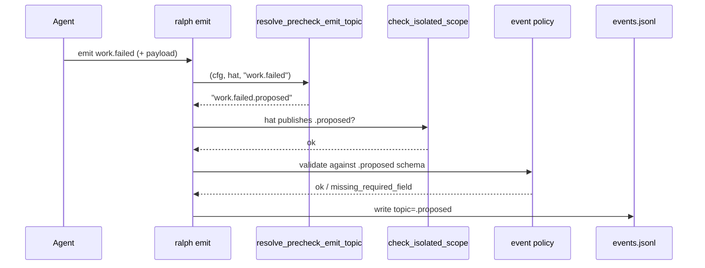

# fix: Precheck desugar emit transparency + HatConfig rewrite ownership

## Goal Capsule

启用 `event_loop.precheck` 后，`ce-executor-pipeline` 的 producer（executor/fixer）
能按 hat instructions 继续 `ralph emit <X>`；CLI 在 isolated scope 前将 topic
透明改写为 `<X>.proposed`；`.proposed` schema 继承 guarded topic 的
`required_fields`+`payload`；desugar 的 emit 侧字段改写由
`HatConfig::rewrite_emit_topics` 单一拥有，避免再漏字段。

**权威层级：** 本计划 Product Contract → 基线 `ed0f4810` 已修 lint 假阳性行为
（不得回退）→ 代码证据 E1–E13。

**停止条件：** Evidence 与代码冲突；发现未列入 emit 侧的字段；需要接线 wave
emit；Decision 置信度降至 0.85 以下；回归面扩大到非本 plan 范围。

---

## 0. 计划状态

| 项 | 值 |
|---|---|
| 状态 | **READY**（全部关键决策置信度 ≥ 0.85） |
| 基线 | `ed0f4810`（`fix(precheck): 修复 precheck desugar 导致的 preset 启动误报`） |
| 分支 | `pittcat-dev` |
| 调查范围 | desugar / emit / isolated scope / origin / schema inject / skill 文档 / wave emit |
| 已执行验证 | 会话内实测：`ralph emit work.failed` → `origin:out_of_scope`；`ralph emit work.failed.proposed --policy-check` → Accept；`ed0f4810` 前全量 `./scripts/run-tests.sh` 已绿 |
| 尚未执行 | 本 plan 落地后的新验收测试（执行期由 Executor 补） |
| 阻塞项 | 无 |

体量：**Medium**（约 1 聚焦日）。严格串行 U1→U5；禁止并行；禁止裸
`cargo test -p ralph-cli`（HARD RULE 1）；CLI 集成测必须
`common::ralph_bin()` scrub agent env（HARD RULE 5）。

---

## 1. 功能目标

| 项 | 内容 |
|---|---|
| 业务目标 | precheck 启用时 producer 按文档发 bare `X` 即可通过；gate 仍消费 `.proposed`；缺必填字段在 emit 阶段被拦；desugar 再加 emit 字段不再漏改写 |
| 调用方 | loop 内 agent（`RALPH_CURRENT_HAT`）；`ralph emit` / `--policy-check`；preset 作者（文档契约） |
| 当前行为 | desugar 把 `publishes` 改成只允许 `<X>.proposed`；CLI **无** `X→X.proposed` 映射；bare `X` 被 origin/scope 拒绝；`.proposed` schema 无 `required_fields`（E1–E5） |
| 目标行为 | producer 发 bare `X` → CLI 在 scope 前改写为 `<X>.proposed` → scope/policy 通过；`.proposed` 继承 guarded topic 的 `required_fields`+`payload`；emit 侧字段改写由 `HatConfig` 单一 API 拥有 |
| 行为差异 | bare emit：Reject → Accept（写盘 topic 为 `.proposed`）；缺字段：`.proposed` 路径上 Reject；desugar：字段列表从「手写」→「HatConfig API」 |
| 本次范围 | U1–U5：结构 API → 纯函数 rewrite → emit 接线 → schema 继承 → 文档 |
| 非目标 | 手写合成 hat；改 `ralph.pipeline.yml`；改 consumer 侧字段；wave emit 透明 rewrite；新增 preset_lint finding id；复制 `allowed_values`/`field_docs`/`element_constraints` 到 `.proposed` |
| 输入 | normalize 后的 `RalphConfig`；`ralph emit <topic>` + hat env + payload |
| 输出 | events.jsonl 中 topic=`<X>.proposed`；`--policy-check` Accept/Reject |
| 状态变化 | 无 DB；仅 config 内存视图 + 可选写 events.jsonl |
| 错误语义 | 非 producer / 未启用 precheck：保持现有 Reject；缺 `required_fields`：`missing_required_field`；手发已是 `.proposed`：idempotent Accept |
| 兼容 | `precheck.enabled=false` / `RALPH_PRECHECK_MODE=off` 行为不变；无 precheck preset 零行为变化 |
| 性能 | O(规则数 × hat 数) 改写；emit 路径一次 O(1) 查找 |
| 安全/权限 | 不扩大 publishes 面：仅当 hat **已** publishes `<X>.proposed` 且 rules 守护 `X` 时才改写 |
| 已知约束 | HARD RULE：测试用 nextest；spawn ralph 须 scrub agent env |
| 已确认假设 | A1：pipeline fail-gate 经 `ralph emit` 非 `ralph wave emit`（E6） |
| 待验证假设 | **无** |

### Product Contract（Requirements）

- **R1.** desugar 对 producer emit 侧字段的改写必须经由
  `HatConfig::rewrite_emit_topics`，覆盖 publishes / terminal_events /
  default_publishes / exempt_topics / obligations.*；不得改 triggers /
  on_trigger / event_filter / phase_triggers。
- **R2.** 启用 precheck 且 hat 已 publishes `<X>.proposed` 时，
  `ralph emit <X>`（含 `--policy-check`）在 isolated scope 前将 topic
  透明改写为 `<X>.proposed`；已是 `.proposed` 则幂等不双重后缀。
- **R3.** `inject_precheck_event_schemas` 为新建的 `.proposed` 条目复制
  guarded topic 的 `payload` + `required_fields`；已存在条目不覆盖；
  `.rejected` 保持 `failed_checks`+`reason`。
- **R4.** `precheck.enabled=false` 或 `RALPH_PRECHECK_MODE=off` 时
  resolve/desugar 不改写 topic。
- **R5.** skill / guide / preset 注释与 R2–R3 一致；以代码为准消除
  「手 emit `.proposed` 必被拒」等错误陈述。
- **R6.** `test_all_embedded_presets_pass_strict_lint(_after_normalize)`
  与 `ed0f4810` 既有 precheck/hat_scope/origin 测不回退。

---

## 2. 代码库现状与证据

### 2.1 当前实现入口

```
ralph emit
  → emit_command_with_root_and_hats (crates/ralph-cli/src/commands/emit.rs)
  → config 经 normalize() → apply_precheck_desugar
  → check_isolated_scope(hat, topic, cfg)   // 精确匹配 publishes
  → policy / origin
  → 写 events.jsonl

apply_precheck_desugar (crates/ralph-core/src/config/ralph_config.rs)
  → 手写 rewrite publishes/terminal/exempt/obligations
  → 合成 precheck-<X> hat
  → inject_precheck_event_schemas  // .proposed = 空 JsonObject
```

### 2.2 Evidence Ledger

| ID | 来源 | 观察结果 | 对计划影响 | 可靠性 |
|---|---|---|---|---|
| E1 | `ralph_config.rs::apply_precheck_desugar` + `rewrite_emit_topic` | desugar 手写改写 publishes/terminal/exempt/obligations；`default_publishes` 单独改 | U1 收敛到 HatConfig API | 高 |
| E2 | `event_origin.rs::u7_precheck_desugar_origin_allows...` | desugar 后 producer **不能** `can_publish(bare X)`，**能** publish `.proposed` | 透明 rewrite 必须在 CLI 改 topic 后再做 scope；origin 仍看最终 topic | 高 |
| E3 | 会话实测 `ralph emit work.failed`（executor + precheck） | `origin:out_of_scope` Reject | U3 Acceptance Red 基线 | 高 |
| E4 | 同配置 `ralph emit work.failed.proposed --policy-check` | Accept | 手发 `.proposed` 必须保持合法（idempotent） | 高 |
| E5 | `precheck.rs::inject_precheck_event_schemas` | `.proposed` 仅 `JsonObject`，不复制 `required_fields` | U4 schema 继承 | 高 |
| E6 | `ce-executor-pipeline.yml` + skill；`wave.rs` | fail-gate 走 `ralph emit`；wave 无透明 rewrite | wave 标非目标 | 高 |
| E7 | `emit.rs` isolated scope 块（约 L1287–1316） | `check_isolated_scope` 在写盘前，且不依赖 `--policy-check` | rewrite 必须插在此调用之前 | 高 |
| E8 | `policy_check.rs` + `integration_emit_policy.rs` | 单元测在 policy_check；集成测在 ralph-cli/tests | U3 测试落点 | 高 |
| E9 | `ralph-tools-precheck.md` | 声称 CLI 映射到 `.proposed`，又声称手 emit `.proposed` 被拒 | 与 E3/E4 矛盾；U5 以代码为准 | 高 |
| E10 | `ed0f4810` + `test_all_embedded_presets_pass_strict_lint_after_normalize` | lint 假阳性已修；normalize 后门禁存在 | 回归必须保留 | 高 |
| E11 | `HatConfig`（hat.rs） | emit 侧：publishes, terminal_events, default_publishes, exempt_topics, obligations.* | API 只覆盖 emit 侧 | 高 |
| E12 | `EventSchema`（loop_config.rs） | payload, required_fields, allowed_values, … | U4 只继承 payload+required_fields | 高 |
| E13 | `crates/ralph-cli/tests/common/mod.rs::ralph_bin` | 集成测必须 scrub agent env | 新 CLI 测必须用 `common::ralph_bin` | 高 |

### 2.3 受影响范围（已确认）

- **生产：** `crates/ralph-core/src/config/hat.rs`、`ralph_config.rs`、`precheck.rs`；`crates/ralph-cli/src/commands/emit.rs`
- **测试：** 上述模块 `#[cfg(test)]`；扩展 `crates/ralph-cli/tests/integration_emit_policy.rs` 或新增 `integration_emit_precheck.rs`（进入 U3 时 Glob 二选一）
- **文档：** `crates/ralph-core/data/ralph-tools-precheck.md`、`docs/guide/precheck-gates.md`、`presets/en/ce-executor-pipeline.yml` 注释
- **不改：** wave emit、preset YAML 拓扑、schemas SSOT 文件（运行时 inject 即可）

---

## 3. 决策记录与置信度

### D1 — HatConfig 拥有 emit 侧改写 API

| 项 | 内容 |
|---|---|
| 问题 | desugar 继续手写字段，还是 `HatConfig::rewrite_emit_topics`？ |
| 候选 | A) 继续手写 B) owned `rewrite_emit_topics(&mut self, from, to) -> bool` C) 裸 `&mut Iterator` |
| 选择 | **B** |
| 证据 | E1, E11 |
| 排除 | A 已漏字段；C 与 `Option<String>`+嵌套 obligations 不契合 |
| 置信度 | **0.93** |

### D2 — 透明 rewrite 位置

| 项 | 内容 |
|---|---|
| 问题 | 在哪把 bare `X` 变成 `X.proposed`？ |
| 候选 | A) CLI emit 在 `check_isolated_scope` 前 B) `check_isolated_scope` 内部 C) origin guard D) agent 改 instructions |
| 选择 | **A**：`ralph_core::config::precheck::resolve_precheck_emit_topic` + `emit.rs` 在 scope 检查前改写 `topic` |
| 证据 | E2, E3, E7；文档契约 E9 |
| 排除 | B 隐藏副作用；C 改晚；D 违背透明契约 |
| 置信度 | **0.95** |

### D3 — `.proposed` schema 继承范围

| 项 | 内容 |
|---|---|
| 候选 | A) 仅 required_fields+payload B) 全量 EventSchema 深拷贝 C) 不继承 |
| 选择 | **A**；已存在的 `.proposed` 不覆盖 |
| 证据 | E5, E12 |
| 置信度 | **0.90** |

### D4 — `default_publishes` 归属

| 项 | 内容 |
|---|---|
| 选择 | **纳入** `rewrite_emit_topics` |
| 证据 | E1 |
| 置信度 | **0.94** |

### D5 — wave emit

| 项 | 内容 |
|---|---|
| 选择 | **本 plan 非目标** |
| 证据 | E6 |
| 置信度 | **0.90** |

### D6 — 测试落点

| 项 | 内容 |
|---|---|
| 选择 | 纯函数测放 `precheck.rs` / `hat.rs`；CLI 验收放 `ralph-cli` 集成测（`common::ralph_bin`）；保留 normalize lint 门禁 |
| 证据 | E8, E10, E13 |
| 置信度 | **0.92** |

无低于 0.85 的决策。

---

## High-Level Technical Design



Desugar（normalize 时）：

```text
for each precheck rule guarding X:
  for each hat that publishes|terminal|default X:
    hat.rewrite_emit_topics(X, X.proposed)  // U1
  synthesize precheck-X hat
  inject schemas: X.proposed inherits required_fields+payload  // U4
```

---

## 4. BDD 行为规格

```gherkin
Feature: Precheck emit transparency and desugar ownership
  Background:
    Given a RalphConfig with event_loop.precheck.enabled=true
    And a rule guarding topic "work.failed"
    And hat "executor" publishes "work.failed" before normalize
    And config.normalize() has run

  Scenario: S1 producer emit bare guarded topic is rewritten to proposed
    Given RALPH_CURRENT_HAT=executor
    When the agent runs `ralph emit work.failed --policy-check --json <valid-payload>`
    Then the policy check is accepted
    And the effective topic under validation is "work.failed.proposed"
    And the hat's publishes still does not list bare "work.failed"

  Scenario: S2 already-proposed topic is idempotent
    Given RALPH_CURRENT_HAT=executor
    When the agent runs `ralph emit work.failed.proposed --policy-check --json <valid-payload>`
    Then the policy check is accepted
    And the topic is not rewritten to "work.failed.proposed.proposed"

  Scenario: S3 missing required field fails on proposed path
    Given schemas["work.failed"].required_fields includes "dead_end_confidence"
    And after normalize schemas["work.failed.proposed"] inherits that list
    When the agent emits work.failed with JSON missing dead_end_confidence
    Then policy-check rejects with missing_required_field

  Scenario: S4 precheck disabled leaves bare emit unchanged
    Given precheck.enabled=false OR RALPH_PRECHECK_MODE=off
    When normalize runs
    Then no precheck-* hat is synthesized
    And resolve_precheck_emit_topic returns the input topic unchanged

  Scenario: S5 non-producer hat cannot use rewrite to expand scope
    Given hat "reporter" does not publish work.failed.proposed
    When resolve_precheck_emit_topic(config, Some("reporter"), "work.failed")
    Then the returned topic is still "work.failed"
    And isolated scope still rejects if work.failed not in publishes

  Scenario: S6 desugar emit-side fields stay in sync via HatConfig API
    Given a producer with publishes, terminal_events, default_publishes,
          exempt_topics, and obligations referencing work.failed
    When normalize applies desugar
    Then every emit-side slot that named work.failed now names work.failed.proposed
    And triggers / on_trigger still name bare work.failed when they did

  Scenario: S7 lint gate remains green after normalize
    When test_all_embedded_presets_pass_strict_lint_after_normalize runs
    Then it passes with zero findings for ce-executor-pipeline
```

---

## 5. 验收与测试策略

| Scenario | 验收 | 入口 | 层级 | 风险补充 | E2E |
|---|---|---|---|---|---|
| S1 | Accept + effective topic `.proposed` | CLI 集成测 | 集成 | Characterization：修前 Reject（E3） | 否 |
| S2 | Accept；无双重后缀 | 纯函数 + CLI | 单元+集成 | — | 否 |
| S3 | missing_required_field | inject + CLI | 单元+集成 | — | 否 |
| S4 | topic 原样 | resolve + kill-switch 既有测 | 单元 | 既有 kill-switch 回归 | 否 |
| S5 | 不扩大 scope | resolve | 单元 | — | 否 |
| S6 | 字段同步 | HatConfig + desugar 既有测 | 单元 | — | 否 |
| S7 | 门禁绿 | presets.rs 既有测 | 回归 | — | 否 |

---

## 6. 需求—测试追踪矩阵

| Req | Scenario | 验收测 | 单元测 | Evidence |
|---|---|---|---|---|
| R1 | S6 | desugar 后字段断言 | `rewrite_emit_topics` | E1 E11 |
| R2 | S1 S2 S5 | CLI Accept | `resolve_precheck_emit_topic` | E2 E3 E4 E7 |
| R3 | S3 | 缺字段 Reject | `inject_precheck_event_schemas` | E5 E12 |
| R4 | S4 | 既有+新 | kill-switch | E1 |
| R5 | — | 人工 diff skill/guide | — | E9 |
| R6 | S7 | normalize lint 门禁 | — | E10 |

---

## 7. 严格串行开发单元

```
Unit 1 (行为保持：HatConfig API)
  ↓
Unit 2 (纯函数：resolve_precheck_emit_topic)
  ↓
Unit 3 (接线：emit 透明 rewrite — P0)
  ↓
Unit 4 (schema 继承 — P1)
  ↓
Unit 5 (文档对齐 + 全量回归门禁)
```

---

### U1. HatConfig::rewrite_emit_topics（行为保持重构）

**Goal:** desugar 对 producer emit 侧字段的改写改为调用 `HatConfig` 方法；外部可观察行为不变。

**Requirements:** R1 · **Scenarios:** S6 · **Decisions:** D1 D4 · **Evidence:** E1 E11

**Dependencies:** 无

**Files:**
- 修改：`crates/ralph-core/src/config/hat.rs`
- 修改：`crates/ralph-core/src/config/ralph_config.rs`
- 测试：同文件既有 precheck desugar 测 + 新增字段覆盖断言

**Approach:**
- 新增 `HatConfig::rewrite_emit_topics(&mut self, from: &str, to: &str) -> bool`
- 覆盖：publishes、terminal_events、default_publishes、exempt_topics、
  obligations.must_emit_any_of、conditional_must_emit、conditional_forbid_topics
- `apply_precheck_desugar` 仅在 hat 为真正 producer（publishes|terminal|default
  命中 guarded topic）时调用；保留合成 gate hat 构造逻辑不动
- **不改** triggers / on_trigger / event_filter / phase_triggers

**Execution note:** 先确认既有 desugar 测绿，再抽 API（characterization-first）。

**Test scenarios:**
- Happy：假 hat 各 emit 列表含 `work.failed` → 一次调用后均为 `work.failed.proposed`
- Edge：不匹配 topic → no-op，返回 false
- Edge：idempotent 二次调用不破坏
- Regression：`precheck_desugar_carries_hat_scope_fields`、
  `precheck_desugar_rewrites_producer_obligations` 仍绿

**Acceptance Red:** 若先删手写改写却未接 API → 既有测失败（字段仍为 bare）。

**Red → Green → Refactor:**
1. 跑既有 precheck_desugar 测（绿）
2. 新增 `rewrite_emit_topics` 单测（Red：方法不存在）
3. 实现方法 → Green
4. desugar 改调用 → 既有测仍绿
5. 删除散落 `rewrite_emit_topic` 若已无其它调用方

**最小实现范围:** 仅 emit 侧；不碰合成 hat；不实现透明 emit；不改 schema。

**禁止依赖的未来能力:** U2–U5 全部。

**集成验证:** `cargo nextest run -p ralph-core -- precheck_desugar`

**回归:** `precheck`、`hat_scope`、
`test_all_embedded_presets_pass_strict_lint(_after_normalize)`

**完成标准:** 上述测绿；无行为 diff；可独立提交
`refactor(precheck): HatConfig owns emit-topic rewrite`

**停止条件:** 发现未列入 E11 的 emit 字段 → 停、更新 Evidence。

**风险:** 漏迁 `default_publishes` → U1 单测钉死。

---

### U2. resolve_precheck_emit_topic 纯函数

**Goal:** 给定 config/hat/topic，返回应校验/写盘的 topic（可能改写为 `.proposed`）。

**Requirements:** R2 R4 · **Scenarios:** S2 S4 S5 · **Decisions:** D2 · **Evidence:** E2 E6

**Dependencies:** U1

**Files:**
- 修改：`crates/ralph-core/src/config/precheck.rs`（新增 pub fn + 单测）
- 按需：模块 re-export

**Approach — 规则锁死（Executor 不得改）:**
1. 若 `!precheck_runtime_enabled()` 或 precheck 未启用/无 rules → 返回原 topic
2. 若 `hat_id` 为 None → 返回原 topic
3. 若 `topic` 已以 `.proposed` 结尾 → 返回原 topic（idempotent）
4. 若 rules **不**含 `topic` → 返回原 topic
5. 若 hat 的 `publishes` **不含** `{topic}.proposed` → 返回原 topic（防扩大 scope）
6. 否则返回 `{topic}.proposed`

**Execution note:** 表驱动单测；本 Unit **不**改 emit.rs。

**Test scenarios:**
- S2：已是 `.proposed` → 原样
- S4：precheck off / kill-switch → 原样
- S5：非 producer → 原样
- Happy：normalize 后 executor + `work.failed` → `work.failed.proposed`

**Acceptance Red:** 函数不存在编译失败 / 返回恒等导致断言失败。

**禁止:** 不改 emit.rs；不改 schema。

**集成验证:** `cargo nextest run -p ralph-core -- resolve_precheck`

**完成标准:** 表驱动测绿；可提交
`feat(precheck): resolve transparent emit topic`

---

### U3. CLI emit 接线（P0 可观察修复）

**Goal:** `RALPH_CURRENT_HAT=executor` 时
`ralph emit work.failed --policy-check` **Accept**（effective topic `.proposed`）。

**Requirements:** R2 · **Scenarios:** S1 S2 · **Decisions:** D2 · **Evidence:** E3 E4 E7 E13

**Dependencies:** U1, U2

**Files:**
- 修改：`crates/ralph-cli/src/commands/emit.rs`
- 测试：优先扩展 `crates/ralph-cli/tests/integration_emit_policy.rs`；
  若不宜混入则 **新增** `crates/ralph-cli/tests/integration_emit_precheck.rs`
  （进入本 Unit 时 Glob 确认二选一，不得编造第三路径）
- 必须：`common::ralph_bin()`

**Approach — 接线点锁死:**
在 `emit_command_with_root_and_hats` 中，解析出 `topic` 且加载 `config` 之后、
**第一次** `check_isolated_scope`（约 L1301）及后续 policy/origin **之前**，将
topic 替换为 `resolve_precheck_emit_topic(cfg, hat.as_deref(), topic)`。
此后全部下游（写盘、recovery envelope、policy）使用改写后值。

**Execution note:** Start with failing integration test matching E3 Reject shape.

**Test scenarios:**
- Happy（S1）：normalize+precheck fixture → `emit work.failed --policy-check` exit 0
- Idempotent（S2）：`emit work.failed.proposed` exit 0
- Regression：无 precheck 时既有 isolated scope 测仍绿
- Invariant：`event_origin` u7 仍断言 registry 层 bare 不可 publish（E2）

**Acceptance Red:** 先加集成测 → 见 `origin:out_of_scope` 或 scope violation
（与 E3 同形）→ 再接线。

**最小实现范围:** 仅 topic 改写接线；不改 provenance；不改 schema 继承；不改 wave。

**禁止依赖的未来能力:** U4 schema 继承文案不得提前实现为「削弱缺字段断言」。

**集成验证:**
```bash
cargo nextest run -p ralph-cli --test integration_emit_policy -- <filter>
# 或确认后的新 test binary
cargo nextest run -p ralph-cli --bin ralph -- test_all_embedded_presets_pass_strict_lint
```

**回归:** `integration_emit_policy`、`u1_isolated_scope_*`、`precheck`、
`event_origin` u7、normalize lint 门禁

**完成标准:** S1/S2 绿；E2 仍成立；可提交
`fix(precheck): transparent X to X.proposed on ralph emit`

**停止条件:** policy 管线在改写前已缓存 topic → 停并更新 Evidence。

**风险:** 双重后缀 → U2 idempotent 规则；扩大 scope → U2 规则 5。

---

### U4. `.proposed` 继承 required_fields+payload（P1）

**Goal:** normalize 后
`schemas[X.proposed].required_fields == schemas[X].required_fields`
（当 X 已有 schema）；缺字段在透明 rewrite 路径上 Reject。

**Requirements:** R3 · **Scenarios:** S3 · **Decisions:** D3 · **Evidence:** E5 E12

**Dependencies:** U3

**Files:**
- 修改：`crates/ralph-core/src/config/precheck.rs`（`inject_precheck_event_schemas`）
- 测试：同文件单测 + CLI 缺字段测（依赖 U3 接线）

**Approach:**
- 构造 `.proposed` 时若 `schemas.get(topic)` 存在则复制 `payload`+`required_fields`
- `.rejected` 不变
- 已存在 `.proposed` 不覆盖（保持 `or_insert` 幂等）
- **不复制** allowed_values / hat_allowed_values / element_constraints / field_docs

**Test scenarios:**
- Happy：guarded 有 required_fields → proposed 继承
- Edge：手写已存在 proposed → 不覆盖
- Error（S3）：缺 `dead_end_confidence` 的 `emit work.failed --policy-check` Reject

**Acceptance Red:** 断言继承 → 当前空壳导致断言失败；或缺字段却 Accept。

**回归:** `desugared_precheck_gate_publishes_have_schemas`、schema_parity、
ce-executor-pipeline fail-gate scenarios

**完成标准:** S3 绿；可提交
`fix(precheck): proposed schema inherits required_fields`

---

### U5. 文档对齐 + 全量门禁

**Goal:** skill/guide/preset 注释与 U3/U4 行为一致；全量绿。

**Requirements:** R5 R6 · **Evidence:** E9 E10

**Dependencies:** U1–U4

**Files:**
- 修改：`crates/ralph-core/data/ralph-tools-precheck.md`
- 修改：`docs/guide/precheck-gates.md`
- 修改：`presets/en/ce-executor-pipeline.yml`（仅注释）

**Approach:**
- 写明：CLI 在 isolated scope 前改写 bare `X` → `X.proposed`
- 删除/改正：「手 emit `.proposed` 必被 origin 拒」（与 E4 矛盾）
- 注明：`.proposed` 继承 guarded `required_fields`+`payload`
- 注明：wave emit 透明 rewrite **不在本变更**（D5）

**Test expectation:** none for prose — verification is full gate + manual skill diff.

**验证命令:**
```bash
cargo nextest run -p ralph-core -- precheck hat_scope
cargo nextest run -p ralph-cli --bin ralph -- test_all_embedded_presets_pass_strict_lint
# 实测（scrub env 后）: ralph emit work.failed --policy-check → Accept
./scripts/run-tests.sh
```

**禁止:** 改 CLAUDE builtin 列表；改无关 skill；削弱断言。

**完成标准:** 文档无漂移；全量通过；可提交
`docs(precheck): align transparency contract with emit rewrite`

---

## 8. Unit 串行依赖图

```
U1 → U2 → U3 → U4 → U5
```

| 边 | 后 Unit 使用前 Unit 的已验证能力 | 不可交换原因 |
|---|---|---|
| U1→U2 | normalize 后 publishes 含 `.proposed` | resolve 依赖正确 desugar |
| U2→U3 | 纯函数可测的 rewrite 规则 | 先测纯函数再接线，Red 可定位 |
| U3→U4 | 透明 rewrite 已把校验落到 `.proposed` schema | 先 schema 后接线会测错缺字段形态 |
| U4→U5 | 最终行为已稳定 | 先文档会再漂移 |

---

## 9. 执行命令清单

| 时机 | 命令 | 目的 | 失败可否继续 |
|---|---|---|---|
| 每 Unit Red/Green | `cargo nextest run -p ralph-core -- <filter>` | 单元 | 否 |
| U3 | `cargo nextest run -p ralph-cli --test integration_emit_policy -- <filter>`（或确认后的新 test bin） | CLI 验收 | 否 |
| U1/U3/U4 后 | `cargo nextest run -p ralph-cli --bin ralph -- test_all_embedded_presets_pass_strict_lint` | lint 回归 | 否 |
| U5 | `./scripts/run-tests.sh` | 全量 | 否 |
| 可选 | `cargo clippy` / `cargo fmt --check`（仅改动文件） | 风格 | 否 |

禁止裸 `cargo test -p ralph-cli`。

---

## 10. 最终质量门禁 / Verification Contract

- [ ] S1–S7 对应测试全绿
- [ ] R1–R6 均有测试或文档覆盖
- [ ] `ed0f4810` 既有 precheck/hat_scope/origin/normalize-lint 测不回退
- [ ] `ce-executor-pipeline` strict preset check PASS
- [ ] 实测 bare `work.failed` policy-check Accept；缺字段 Reject
- [ ] `./scripts/run-tests.sh` PASS
- [ ] 无 `.skip` / 削弱断言 / 无解释 snapshot
- [ ] 无 BLOCKED 决策；未改 wave；未改 operator overlay

### Definition of Done

每个 Unit 完成：Acceptance Red → Unit Red → Green → Refactor → Integration →
Regression → Close；严格 U1→U5 顺序；每个 Unit 可独立提交；无提前实现后续行为。

---

## 11. 最终计划自检

| 检查项 | 结果 | 证据或说明 |
|---|---|---|
| 实施计划而非 Roadmap | 是 | Unit 含入口/Red/回归 |
| Executor 仍需关键设计决策 | 否 | D1–D6 锁死 |
| 所有文件和接口有代码库证据 | 是 | E1–E13 |
| 所有关键决策置信度 ≥ 0.85 | 是 | 最低 0.90 |
| 存在未处理的低置信度假设 | 否 | |
| 每个 Unit 只有一个可观察行为 | 是 | |
| 每个 Unit 可以独立验证 | 是 | |
| 每个 Unit 有真实 Red | 是 | E3 已证 P0 Red |
| 每个 Unit 包含回归范围 | 是 | |
| 存在未来 Unit 依赖 | 否 | |
| 存在泛化任务描述 | 否 | |
| 所有 Scenario 可追踪到测试和 Unit | 是 | |
| 所有关键决策有 Evidence | 是 | |
| 计划可以严格串行执行 | 是 | |

---

## Scope Boundaries

### In scope

R1–R6；U1–U5；`ralph emit` 透明 rewrite；`.proposed` schema 最小继承；文档对齐。

### Deferred to Follow-Up Work

- wave emit 透明 rewrite（D5）
- `.proposed` 继承 allowed_values / field_docs / element_constraints
- 新增 preset_lint finding 专门检测「文档声称透明但未接线」

### Out of scope

手写合成 hat；改 `ralph.pipeline.yml`；改 consumer 侧字段；削弱 origin 单测 E2。

---

## Assumptions

- A1（已确认）：pipeline fail-gate 经 `ralph emit` 非 wave（E6）。
- Product Contract 由本 bootstrap 定义；无上游 requirements-only 统一计划。

---

## Risks & Mitigations

| 风险 | 触发 | 检测 | 缓解 |
|---|---|---|---|
| 双重 `.proposed` 后缀 | 幂等规则漏 | S2 单测 | U2 规则 3 |
| 扩大非 producer scope | 未检查 publishes | S5 | U2 规则 5 |
| schema 继承过严导致合法 payload 挂 | 复制多余约束 | S3 + pipeline 测 | D3 只复制两字段 |
| U1 漏字段 | 新 obligations 变体 | S6 + 字段表测 | HatConfig 单一 API |
| 文档再漂移 | 只改代码不改 skill | U5 人工 diff | HARD RULE skill 同步 |

---

## Sources & Research

- 基线 commit `ed0f4810`
- `crates/ralph-core/src/config/{ralph_config,precheck,hat}.rs`
- `crates/ralph-cli/src/commands/emit.rs`、`policy_check.rs`
- `crates/ralph-core/data/ralph-tools-precheck.md`
- 会话实测 E3/E4（bare Reject / `.proposed` Accept）
)
