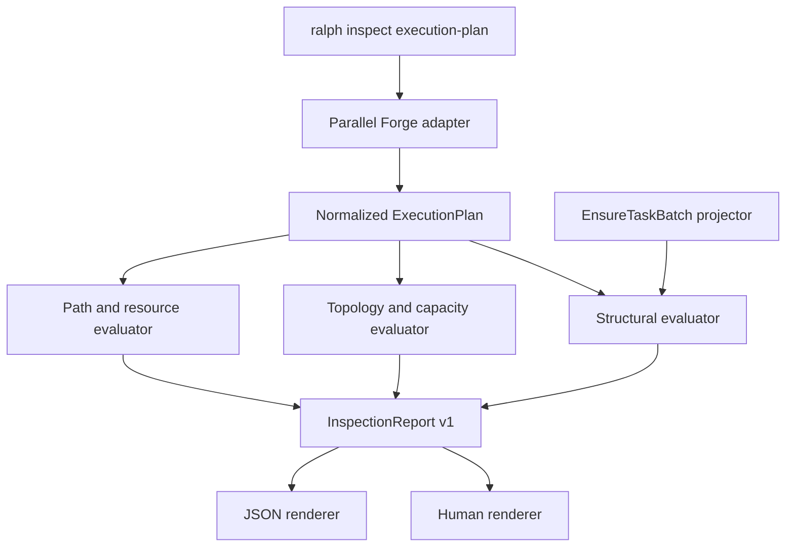
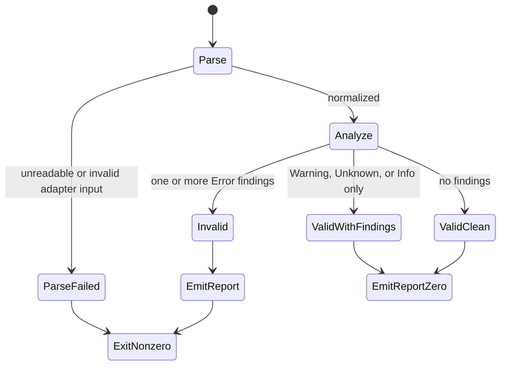
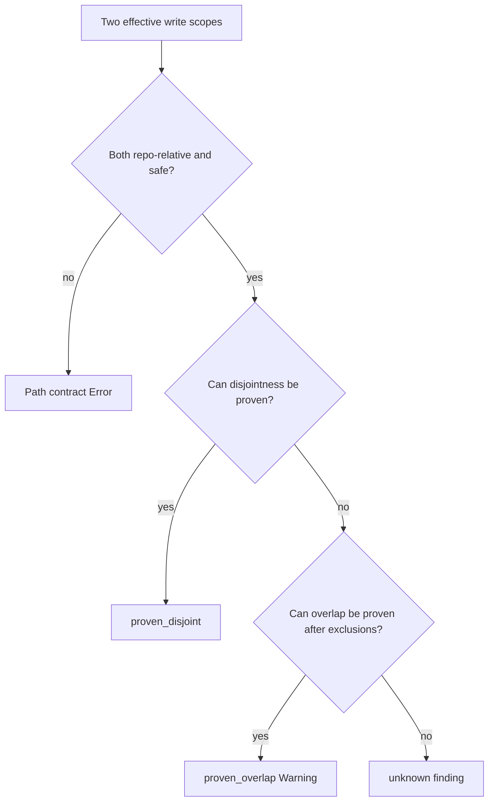
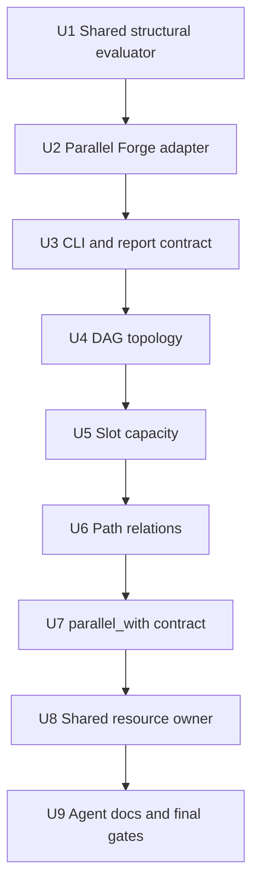

# 可复用 Execution Plan Inspector 与 Parallel Forge 适配 - Plan

## 0. 计划状态

- **状态：READY。** 所有实施关键决策置信度均不低于 0.85，没有依赖其他计划完成状态的前置合同。
- **代码基线：** `3f77952a3068fc973132e6e21df0ed57fce76297`。
- **调查范围：** `ralph inspect` CLI 解析、human/JSON 输出、`EnsureTaskBatch` DAG 与静态 schedule 校验、Parallel Forge execution-plan 模板与 Guardian 合同、路径范围与共享资源字段、CLI 集成测试、agent guide、preset operator skill、相关 Git 历史和 `docs/solutions/`。
- **已执行的验证：**
  - 静态读取并比对 `crates/ralph-cli/src/commands/inspect.rs`、`crates/ralph-cli/src/main.rs` 与 `crates/ralph-cli/tests/inspect_prompt.rs`。
  - 静态读取并比对 `crates/ralph-core/src/state_projector/task.rs` 与 `crates/ralph-core/src/state_projector/tests.rs`。
  - 静态读取 `presets/templates/parallel-forge/execution-plan.template.yml`、`unit.template.yml`、`development-plan.template.md`、`presets/en/parallel-forge.yml` 和 `presets/schemas/parallel-forge.yml`。
  - 检查提交 `33e4532b`（静态 schedule 校验）、`1278c7d8`（`ralph inspect profiles`）及 Parallel Forge 模板相关历史。
  - 搜索 Cargo workspace 依赖，确认没有现成 glob 交集库。
  - 搜索 `docs/solutions/`，读取 runtime 不解析业务 Markdown、state projection 和分层门禁相关模式。
- **尚未执行的验证：** 本计划阶段没有运行测试、构建、lint、CLI help smoke 或全量门禁；这些操作属于实施阶段，已固定在各 Unit 和 Verification Contract 中。
- **阻塞项：** 无。
- **工作区说明：** 计划文件是本次唯一预期新增文件；实施时仍须重新读取 `git status` 并保留届时存在的所有无关用户变更。

---

## Goal Capsule

- **目标：** 提供一个只读、确定性、可复用的 execution-plan 静态检测器，让操作者在启动 loop 前验证计划的 DAG、逻辑分组、执行顺序、路径边界、共享资源和容量解释；Parallel Forge 是首个输入适配器。
- **外部入口：** `ralph inspect execution-plan <path> --adapter parallel-forge [--slots <N>] [--format human|json]`。
- **权威顺序：** 输入文件的结构化字段 → `ralph-core` 通用规范化模型 → 单一 DAG/schedule evaluator → 派生解释与风险 evaluator → CLI human/JSON renderer。
- **判定边界：** 可由结构化事实严格证明的违规是 Error 并导致非零退出；确定性风险是 Warning；纯解释是 Info；复杂 glob 无法证明相交或不相交时必须显式 Unknown，不得伪装安全。
- **复用策略：** `ralph-core` 拥有 preset-agnostic 规范化模型、finding 和 evaluator；Parallel Forge YAML 解析留在输入适配层。首版不为只有一个实现的适配器提前引入动态注册表或插件系统。
- **停止条件：** 实际模板字段与 Evidence 不符、现有 projector 行为无法通过同源 evaluator 保持、需要新增第三方 glob 依赖、需要读取业务 Markdown/源码才能判断、或任一关键决策置信度降到 0.85 以下。

---

## Product Contract

### Summary

操作者可以把 execution-plan 文件交给 `ralph inspect execution-plan`，在不启动 Agent、EventLoop、supervisor 或 worktree 的情况下得到稳定的人类报告或 JSON 报告。报告既能拒绝结构上不可能正确执行的计划，也能解释合法计划的 logical waves、最长依赖链、下游影响和 slot 容量，并保守提示并行写路径及共享资源风险。

### Problem Frame

Parallel Forge 的 Planner 已在 execution-plan 中写入 `depends_on`、`execution_wave`、`integration_order`、`allowed_paths`、`forbidden_paths`、`shared_contracts` 和 `owned_resources`。Runtime 目前只在 `forge.plan.ready` 投影为 tasks 时校验 DAG 和部分 schedule，这个时点已经进入运行流程，而且只返回首个拒绝原因。

Guardian 的 prompt 要求审计 DAG、路径隔离和共享资源唯一 owner，但结论主要写入自然语言 artifact。操作者缺少一个运行前、可重复、机器可消费的静态 Observe 工具，也无法快速看清一个合法计划会形成哪些逻辑 wave、关键依赖链和容量批次。

该缺口不应通过新增 Agent 或让 runtime 解析业务 Markdown 解决。应把已有结构化事实规范化为通用模型，用确定性规则分析，并让 Parallel Forge 通过适配器映射到该模型。

### Actors

- **A1 操作者：** 在启动 `ralph run` 前检查 execution plan，消费 human 报告和退出码。
- **A2 自动化调用方：** 消费版本化 JSON，按 `valid`、finding severity/code 和 summary 做后续决策。
- **A3 Parallel Forge Planner/Guardian：** 继续生产和审阅原有 execution-plan；Inspector 不替代其业务判断。
- **A4 State projector：** 继续在 `EnsureTaskBatch` apply 前执行硬 schedule 门禁，但改为复用通用 evaluator。
- **A5 Agent/preset 作者与评审者：** 从注入 guide/operator skill 获得准确命令、字段来源和停止条件。

### Requirements

#### 通用分析合同

- R1. `ralph-core` 必须定义 preset-agnostic 的规范化 execution-plan 模型，至少表达 Unit identity、依赖、逻辑 group、全局 order、执行模式、路径范围、共享资源与 owner 声明；模型不得包含 Parallel Forge topic、hat 或 artifact 路径知识。
- R2. 通用 evaluator 必须是纯函数、无文件 I/O、无环境变量读取、无 runtime ledger 访问，并返回稳定 finding code、severity、相关 Unit 和结构化 details。
- R3. DAG 硬校验必须覆盖空/重复 Unit ID、未知依赖、自依赖、重复依赖和环；任一命中都使报告 `valid=false`。
- R4. Schedule 硬校验必须覆盖 group/order 非正数、group 缺号、order 重复/缺号、依赖未处于严格更早 group、依赖 order 未严格更小；规则必须与现有 `EnsureTaskBatch` 行为同源。
- R5. Inspector 必须收集所有能够安全继续计算的 findings，而不是只报告第一个错误；存在 DAG 环时必须停止依赖派生指标，但仍保留此前完成的格式和局部校验结果。

#### Parallel Forge 适配

- R6. Parallel Forge adapter 必须解析 `version: 1` execution-plan，并把 `units[]` 的 `id`、`title`、`depends_on`、`execution_wave`、`integration_order`、`execution_mode`、`parallel_with`、`allowed_paths`、`forbidden_paths`、`shared_contracts`、`owned_resources` 映射到通用模型。
- R7. 缺少根级 `version`/`plan_key`/`units`、空 `units`、字段类型错误、未知 enum 或不支持的 version 必须以清晰解析错误非零退出；不得用默认值把缺失的硬合同伪装成合法计划。
- R8. CLI 必须公开 `--adapter parallel-forge`，首版默认值为 `parallel-forge`，并在 JSON 报告中回显 adapter；未来新增 adapter 不得改变现有默认行为。

#### 执行解释

- R9. 合法 DAG 必须输出按 group 排序的 Unit 列表、边数、group 数和基于依赖边数的最长依赖链；字段名称必须明确它不是工期预测。
- R10. 每个 Unit 必须输出传递后继数量，使操作者能识别结构性影响最大的节点；并列结果按 Unit ID 稳定排序。
- R11. 传入 `--slots N` 时，`N` 必须大于零；每个 logical group 输出 `ceil(unit_count/N)` 的最少 slot occupancy batches，但不得把一个 logical group 改写成多个 settlement waves。
- R12. Planner 声明的 group 晚于其最早合法 group 时输出 Info；只要依赖顺序仍合法，不得自动重排或拒绝。

#### 路径与共享资源风险

- R13. 路径合同必须拒绝绝对路径、父目录穿越和空路径；接受 repo-relative literal、目录 subtree 和现有模板中的 wildcard 表达。
- R14. 同 group Unit 的路径比较必须区分 `proven_overlap`、`proven_disjoint` 和 `unknown`；只有可以从模式严格证明时才使用前两种，任何复杂 wildcard 不确定性必须显式报告 Unknown。
- R15. `forbidden_paths` 是对 `allowed_paths` 的排除，不得把二者有包含关系本身当成错误；只有两个 Unit 的有效写集合仍能证明相交时才报告确定重叠，否则保守降级为 Unknown。
- R16. 两个或更多 Unit（不论 group）共享同名 `shared_contracts` 时必须报告 Warning；在全计划 `owned_resources` 中零 owner 或多 owner 必须报告 Error，恰好一个 owner 时在 finding details 中给出 owner。
- R17. `parallel_with` 指向不存在 Unit、依赖相关 Unit或不同 group Unit时必须报告 Error；非对称声明报告 Warning，不擅自补全。

#### CLI、输出与只读性

- R18. CLI 必须提供 human/JSON 两种同源输出；JSON schema 固定为 `execution_plan_inspect.v1`，至少包含 `schema_version`、`adapter`、`source`、`valid`、`summary`、`groups` 和 `findings`。
- R19. 无 Error 时退出 0，包括只有 Warning/Info/Unknown；存在 Error、文件不可读或解析失败时退出非零。已成功解析并完成分析的无效计划必须先把完整报告写到 stdout，再在 stderr 给出短失败摘要。
- R20. Inspector 必须只读：不得创建 `.ralph/`、不得修改输入文件、不得启动 loop、不得读取内部 ledger；被外层 hat env 污染时行为必须与普通 human CLI 一致。
- R21. Human 输出必须从同一 report 结构渲染，不得单独重新计算规则；默认按 Error、Warning、Unknown、Info 和稳定 finding code 排序。
- R22. 新命令和 JSON 合同必须同步到 `crates/ralph-core/data/ralph-tools*.md` 与 preset operator commands/reference；文档必须说明字段来源、可执行命令、非零停止条件和 Unknown 的含义。

### Key Flows

- F1. **合法计划检查**
  - **Trigger：** 操作者传入可读的 Parallel Forge execution-plan。
  - **Actors：** A1、A2。
  - **Steps：** adapter 解析 → 规范化 → 硬校验 → 派生指标 → 风险分析 → 渲染。
  - **Outcome：** human/JSON 报告 `valid=true`，退出 0，输入与 workspace 不变。
- F2. **结构错误拒绝**
  - **Trigger：** 计划包含未知依赖、环或非法 schedule。
  - **Actors：** A1、A2、A4。
  - **Steps：** 同源 evaluator 产生稳定 Error findings；可安全计算的其他 findings 一并保留。
  - **Outcome：** stdout 有完整报告，stderr 有短摘要，退出非零；projector 仍以同一规则拒绝并保持零 task 副作用。
- F3. **并行风险解释**
  - **Trigger：** 同一 group 存在路径或共享资源关系。
  - **Actors：** A1、A3。
  - **Steps：** 路径 evaluator 尝试证明相交/不相交；复杂表达保持 Unknown；资源 evaluator 核对 owner。
  - **Outcome：** 确定性错误与审查提示分层展示，不用启发式分数阻止执行。
- F4. **容量预览**
  - **Trigger：** 操作者传入 `--slots N`。
  - **Actors：** A1。
  - **Steps：** 对每个 logical group 计算最少 occupancy batches。
  - **Outcome：** 报告解释容量限制，不改变 group identity 或计划文件。

### Acceptance Examples

- AE1（Covers R3–R5）：给定 `U1 → U2 → U3 → U1`，报告包含 cycle Error、`valid=false`、无最长依赖链，退出非零，文件不变。
- AE2（Covers R4）：给定 `U2 depends_on U1` 且两者同 group，Inspector 和 `EnsureTaskBatch` 都拒绝同一条 schedule 语义。
- AE3（Covers R9–R12）：给定 `U1 → {U2,U3} → U4`，输出三个 logical groups、代表链含 3 个 Unit、`longest_dependency_edge_count=2`；若 U3 合法地延迟一组，输出 Info 而不修改计划。
- AE4（Covers R13–R15）：给定同 group 的 `src/core/**` 与 `src/core/config.rs`，报告 proven overlap；给定无法安全求交的复杂 wildcard，报告 Unknown，不报告 proven disjoint。
- AE5（Covers R16）：两个 Unit 声明同一 shared contract 且无 owner 时为 Error；恰好一个 Unit 在 `owned_resources` 声明同名资源时保留 Warning 并回显 owner。
- AE6（Covers R11）：group 有 5 个 Unit、`--slots 2` 时输出最少 3 个 occupancy batches，但 group 数不变。
- AE7（Covers R18–R21）：human 与 JSON 的 valid、summary、groups 和 finding code 集合一致；只有 Warning/Info/Unknown 时退出 0。
- AE8（Covers R20）：在污染的 agent env 下运行命令，不创建 `.ralph/`，不触发 ACL 分支，输出与 scrub 后相同。

### Scope Boundaries

#### 本次范围

- 通用规范化 execution-plan 模型和确定性 evaluator。
- 现有 projector DAG/schedule 校验提取与行为等价接线。
- Parallel Forge version 1 YAML adapter。
- `ralph inspect execution-plan` human/JSON CLI。
- 拓扑、最长依赖链、下游影响和 slot capacity 解释。
- 保守路径重叠与共享资源 owner 分析。
- 单元、projector regression、CLI 集成、help/doc drift、agent/operator 文档。

#### 非目标

- 不自动接入 `ralph run` preflight。
- 不修改、重排或生成 execution-plan。
- 不读取 development-plan Markdown、业务源码、Git diff 或 runtime ledger。
- 不调用 Agent 或 LLM 判断业务语义。
- 不预测 Unit 工时、成本或真实 wall-clock。
- 不求解任意 glob 语言的完备集合交集。
- 不替代 Guardian 对 acceptance criteria、业务意图和语义冲突的审查。
- 不为 adapter 建立插件加载、动态注册或外部扩展 ABI。
- 不新增数据库、迁移、配置字段或 Feature Flag。

#### Deferred to Follow-Up Work

- Inspector 自动作为 `ralph run` 的可选 preflight gate。
- 第二种真实 execution-plan 格式出现后的 adapter registry 抽象。
- 基于实际 repository file inventory 的精确 glob 展开模式。
- 图形化 UI、Web Dashboard 或 Mermaid 导出。

### Compatibility, Performance, and Security

- **兼容：** `EnsureTaskBatch` 对合法/非法 payload 的接受语义和零副作用合同必须保持；新增 CLI 不改变现有 `inspect profiles|loop|prompt`。
- **性能：** DAG/schedule/指标为 `O(V+E)`；同 group 路径两两比较为 `O(P²)`，其中 P 是该 group 的路径声明数。首版不扫描仓库文件系统，因此性能不随仓库文件数增长。
- **安全：** 输入是不可信 YAML；解析必须有明确类型和版本边界，不执行其中命令、不跟随其中 artifact 路径、不写盘。输出不得包含 runtime 内部 ledger 路径。

---

## 1. 功能目标

### 1.1 业务目标

把 execution plan 从“Agent 写完后直接交给 runtime”的黑盒 artifact，变成运行前可解释、可机器检查的结构化合同。操作者应在付出 Agent、worktree 和 supervisor 成本前发现确定性错误，并对合法计划的并行风险和执行形状建立共同理解。

### 1.2 用户或调用方

- 直接运行 CLI 的操作者。
- 在脚本或 CI 中读取 JSON 的自动化调用方。
- Parallel Forge 的 Planner、Guardian、preset 作者和 reviewer。
- 继续消费 schedule evaluator 的 state projector。

### 1.3 当前行为

1. `ralph inspect` 仅有 `profiles`、`loop`、`prompt`。
2. Parallel Forge execution-plan 模板已经携带本功能所需结构化字段。
3. `EnsureTaskBatch` 在 apply 内部先解析 payload，再用私有函数拒绝 DAG cycle 和非法 static schedule；它只返回首个错误。
4. Guardian prompt 要求审查并行路径和 shared-resource owner，但没有同源机械检测器。
5. 没有通用 execution-plan Rust 类型或 JSON inspect schema。

### 1.4 目标行为与行为差异

- **新增：** 通用只读 Inspector、Parallel Forge adapter、稳定报告与退出语义。
- **重构但不改行为：** projector 的 DAG/schedule 硬校验改用公开的通用 evaluator。
- **保持：** 原 preset、schema、event topology、task projection、runtime 终态和 worktree 行为。

### 1.5 输入

- 必填 execution-plan YAML 路径。
- adapter，首版 enum 只有 `parallel-forge` 且为默认值。
- output format：`human|json`。
- 可选正整数 slot capacity。

### 1.6 输出

- stdout：human 报告或 `execution_plan_inspect.v1` JSON。
- stderr：文件/解析错误，或已输出无效报告后的短失败摘要。
- 退出码：无 Error 为 0；Error 或无法分析为非零。

### 1.7 状态变化与副作用

除 stdout/stderr 和进程退出状态外无状态变化。不得创建缓存、cursor、diagnostics、`.ralph/` 或修复后的 plan。

### 1.8 错误语义

- **I/O/parse error：** 无法构造 report，stderr 给出 source 与原因，非零。
- **unsupported version/invalid root contract：** adapter error，非零。
- **analysis Error finding：** stdout 完整 report，`valid=false`，stderr 短摘要，非零。
- **Warning/Unknown/Info：** report 保留，`valid=true`，退出 0。

### 1.9 已知约束与假设

#### 已确认事实

- Parallel Forge 模板 version 为 1，`units[]` 是机器可读 SSOT。
- `serde_yaml`、`serde`、`serde_json` 已是 core/CLI 依赖。
- 当前 workspace 没有 glob 交集依赖。
- `InspectProfilesFormat` 已提供 human/JSON CLI enum 和 renderer precedent。
- Human CLI 集成测试必须使用 `common::ralph_bin()` scrub agent env。

#### 已确认假设

- `shared_contracts` 与 `owned_resources` 使用相同字符串时表示同一共享资源的 owner 合同；这一解释来自 Guardian 的“shared-resource single owner”和模板共享资源所有权表。
- 复杂 wildcard 不要求完备求交；Unknown 是首版可接受且安全的产品结果。

#### 待验证假设

无实施阻塞假设。若实施发现模板中 owner 名称存在独立映射而非同名约定，必须触发 U5 停止条件并回到规划，不允许 Executor临时发明映射规则。

---

## 2. 代码库现状与证据

### 2.1 当前实现入口

#### 外部入口与调用链

```text
ralph CLI
  → main.rs::Commands::Inspect
  → commands/inspect.rs::execute
  → InspectCommands::<subcommand>
  → command-specific read-only builder
  → shared view
  → human | JSON renderer
```

`InspectCommands` 目前包含 `Profiles`、`Loop`、`Prompt`。每个子命令定义自己的 args，JSON view 使用 `serde::Serialize`，human renderer 消费同一 view。

#### 现有 schedule 调用链

```text
accepted forge.plan.ready
  → StateProjector::apply
  → project_ensure_task_batch
  → payload pointers → BatchSpec[]
  → unknown/self/duplicate/cycle checks
  → validate_wave_schedule
  → TaskStore exclusive transaction
```

硬校验发生在 TaskStore 写事务之前，因此失败保持零 task 副作用。`BatchSpec`、`reject_dependency_cycles` 和 `validate_wave_schedule` 当前均为 `task.rs` 私有实现。

#### 数据边界

- 输入 plan：普通用户指定 YAML 文件。
- 通用 analyzer：内存中的规范化 Rust 结构。
- projector：event payload 映射为相同的最小 schedule 结构。
- 输出：stdout/stderr；无持久化边界和外部服务。

#### 现有测试

- `crates/ralph-core/src/state_projector/tests.rs::u2_schedule_validation`：真实 projector apply、合法 DAG、wave gap、同 wave、逆 wave、duplicate/inverse order、digest、replay、legacy 和 pointer mismatch。
- `crates/ralph-cli/src/commands/inspect.rs` 内单元测试：clap 解析、view serialization、human renderer。
- `crates/ralph-cli/tests/inspect_prompt.rs`：真实 binary、临时目录、JSON shape、unknown hat、无 side effect 和污染 env。
- `crates/ralph-cli/tests/common/mod.rs`：`ralph_bin()` 和 agent env scrub。

#### 构建和验证

- Targeted test 使用 `cargo nextest run`。
- CLI 语法变更需运行实际 `ralph <cmd> --help` 和 `scripts/check-cli-doc-drift.sh`。
- 最终必须运行 `./scripts/run-tests.sh`，不得用裸 `cargo test -p ralph-cli`。

### 2.2 Evidence Ledger

| Evidence ID | 来源 | 观察结果 | 对计划的影响 | 可靠性 |
|---|---|---|---|---|
| E1 | `crates/ralph-cli/src/commands/inspect.rs::InspectCommands` | 现有命令是 read-only namespace，三个子命令各有 args，但统一 human/JSON 模式 | 新入口归属 `inspect`，不新建顶级 command | 高 |
| E2 | `crates/ralph-cli/src/commands/inspect.rs::emit_view` 与 `LoopInspectView` | JSON 使用版本化/结构化 view，human 从同一 view 渲染 | `execution_plan_inspect.v1` 必须是输出 SSOT | 高 |
| E3 | `crates/ralph-cli/tests/inspect_prompt.rs` | Binary 集成测覆盖临时目录、JSON、help、side effect、污染 env | 新命令沿用独立 integration test 与 `common::ralph_bin()` | 高 |
| E4 | `crates/ralph-core/src/state_projector/task.rs::project_ensure_task_batch` | DAG 与 schedule 在 TaskStore 写入前校验 | 提取 evaluator 时必须保留零副作用顺序 | 高 |
| E5 | `crates/ralph-core/src/state_projector/task.rs::validate_wave_schedule` | 已有 8 条 static schedule 规则，复杂度 `O(V+E)`，但函数私有且只返回首错 | 通用 evaluator 是规则 SSOT，projector 适配首错字符串 | 高 |
| E6 | `crates/ralph-core/src/state_projector/task.rs::reject_dependency_cycles` | DFS cycle 检查也是私有实现 | DAG evaluator 必须一并提取，避免 CLI 复制 | 高 |
| E7 | `crates/ralph-core/src/state_projector/tests.rs::u2_schedule_validation` | 已有真实 projector acceptance/regression | U1 先做 characterization/parity，再重构 | 高 |
| E8 | `presets/templates/parallel-forge/execution-plan.template.yml` | 根级 version 1、plan_key、units SSOT、verified base 等字段存在 | adapter 严格读取结构字段但忽略 runtime-only metadata | 高 |
| E9 | `presets/templates/parallel-forge/unit.template.yml` | Unit 已含依赖、wave、order、mode、parallel_with、路径、shared/owned resources | 不新增 plan 格式；adapter 只做映射 | 高 |
| E10 | `presets/en/parallel-forge.yml` Guardian instructions | 明确要求 DAG 无环、同 wave 写路径不相交、共享模块唯一 owner、foundation 顺序 | 路径/owner findings 有产品合同依据 | 高 |
| E11 | `presets/templates/parallel-forge/development-plan.template.md` | 共享资源所有权表规定每个资源唯一 Owner | owner 零/多 owner 可作为 Error | 高 |
| E12 | Cargo workspace manifests | `serde_yaml` 已存在；没有 glob 交集 crate | 不加依赖；采用可证明/Unknown 三态 | 高 |
| E13 | `docs/solutions/logic-errors/base-runtime-must-not-parse-business-markdown.md` | Runtime 不应解析业务 Markdown，结构化 schema/event 才是机器合同 | Inspector 只读 execution-plan YAML，不读 development-plan | 高 |
| E14 | `docs/solutions/developer-experience/wac-rollout-tiered-gates-2026-06-12.md` | 静态机制应区分确定错误与假阳性，先语义再接线 | 路径启发式不得升级为阻塞 Error | 中高 |
| E15 | commit `33e4532b` | static schedule 校验与 projector tests 同批落地 | 提取必须保持历史行为和 tests | 高 |
| E16 | commit `1278c7d8` | `ralph inspect profiles` 建立 namespace、解析和 read-only preview 模式 | 新命令沿用相邻实现模式 | 高 |
| E17 | `crates/ralph-core/data/ralph-tools.md` 与 `ralph-tools-cmdref.md` | CLI 能力会进入 agent prompt | 新命令必须同步 agent guide，且按“下一步能执行什么”书写 | 高 |
| E18 | `skills/ralph-preset-common/references/commands.md` | Operator review 命令表已有 inspect/preset/capability 入口 | 新 Inspector 必须加入机械审查流程 | 高 |
| E19 | AGENTS.md HARD RULE 5 | Spawn `ralph` 的 human CLI 测试必须 scrub agent env | CLI integration tests 使用 `common::ralph_bin()` | 高 |
| E20 | AGENTS.md test hard rules | 所有测试默认 nextest；最终走 `./scripts/run-tests.sh` | Verification Contract 固定 nextest 命令 | 高 |
| E21 | 本轮用户确认 | 用户接受可复用 inspect 检测器并要求适配 Parallel Forge；确认不做 mock E2E、LLM 判断或依赖其他计划的方案 | 通用核心、确定性只读 CLI、PF 首适配和独立交付是需求合同，不是 Planner 推测 | 高 |

### 2.3 受影响范围

#### 生产模块

- `crates/ralph-core/src/lib.rs`：公开通用 execution-plan inspection 模块。
- `crates/ralph-core/src/state_projector/task.rs`：把现有 DAG/schedule 检查接到通用 evaluator；保留 payload 解析和 TaskStore 写事务。
- `crates/ralph-cli/src/commands/inspect.rs`：新增 subcommand args、Parallel Forge adapter、report emit 与 human renderer。
- `crates/ralph-cli/src/main.rs`：顶层 clap 解析测试和 command 接线的既有位置。

#### 计划新增模块与测试

- `crates/ralph-core/src/execution_plan_inspector.rs`：计划新增，拥有规范化模型、findings、结构/指标/路径/资源 evaluator。
- `crates/ralph-cli/tests/inspect_execution_plan.rs`：计划新增，真实 CLI acceptance 与 side-effect tests。

#### 现有测试模块

- `crates/ralph-core/src/state_projector/tests.rs`。
- `crates/ralph-cli/src/commands/inspect.rs` 的 `#[cfg(test)]` 模块。

#### 文档与 Agent Surface

- `crates/ralph-core/data/ralph-tools.md`。
- `crates/ralph-core/data/ralph-tools-cmdref.md`。
- `skills/ralph-preset-common/references/commands.md`。
- `skills/ralph-preset-common/references/author-checklist.md`。
- `skills/ralph-preset-common/references/finding-rubric.md`：只在 review finding 映射需要新条目时修改；不虚构 preset_lint finding ID。

#### 明确不受影响

- `presets/en/parallel-forge.yml`、`presets/schemas/parallel-forge.yml` 和 event topology。
- supervisor store、worktree、task schema、数据库和 Web Dashboard。
- `scripts/ralph-zsh-plugin.zsh`，因为不新增或重命名 builtin preset。
- `CLAUDE.md`/`AGENTS.md`，因为不改变硬规则或 builtin 列表。

---

## Planning Contract

### 3. 决策记录与置信度

| Decision ID | 决策问题 | 候选方案 | 最终选择 | 支持证据 | 排除其他方案的原因 | 置信度 |
|---|---|---|---|---|---|---:|
| KTD1 | 分析能力放在哪一层 | CLI 私有；`ralph-core` 通用模块；preset lint | `ralph-core` 通用纯模块 | E1、E4–E7 | CLI 私有会复制 runtime 规则；preset lint 面向 preset config，不拥有 execution-plan artifact | 0.98 |
| KTD2 | projector 如何复用 | 保留私有校验并复制；调用通用 evaluator；让 CLI 调 projector | projector 与 CLI 都适配通用 evaluator | E4–E7、E15 | 复制产生双权威；CLI 调 projector 会耦合 TaskStore 和副作用 | 0.99 |
| KTD3 | 输入通用性边界 | 通用 YAML schema；动态 adapter registry；通用模型 + PF 显式 adapter | 通用模型，CLI `--adapter parallel-forge`，首版 enum | E8–E9、E21 | 单一通用 YAML 会强迫其他格式迁移；动态 registry 在单消费者时平台化 | 0.94 |
| KTD4 | 路径交集算法 | 新增 glob 库；枚举仓库文件；有限证明 + Unknown | 无新依赖的三态保守 evaluator | E10–E14、E21 | glob 库仍不直接提供完整交集；枚举使结果依赖 checkout 且把静态分析变成 I/O | 0.93 |
| KTD5 | finding 严重度 | 所有风险 fail-close；总分阈值；Error/Warning/Unknown/Info | 结构错误 Error，确定风险 Warning，不确定性 Unknown，解释 Info | E10、E13–E14、E21 | 全阻塞会制造假阳性；分数无法覆盖硬不变量 | 0.96 |
| KTD6 | JSON 合同 | 复用 loop schema；无版本 JSON；独立版本化 schema | `execution_plan_inspect.v1` | E2、E16 | loop schema 是 live state；无版本会让调用方无法安全演进 | 0.97 |
| KTD7 | 非法 plan 输出 | 首错 stderr；始终 exit 0；完整 report 后非零 | parse 成功则完整 report + 非零，parse 失败仅 stderr + 非零 | E2–E5 | 首错不利于修计划；始终 0 无法用于自动化门禁 | 0.94 |
| KTD8 | 适配器默认行为 | 必填 adapter；自动猜测；默认 PF 并回显 | `--adapter` 可选，默认 `parallel-forge`，report 回显 | E8–E9、E21 | 必填降低当前可用性；字段猜测在出现第二格式后歧义 | 0.90 |
| KTD9 | 最长路径含义 | 工期关键路径；依赖层最长链；不提供 | 依赖边数最长链并明确非工期预测 | E8–E10 | 没有 duration 数据，工期预测会伪造事实；完全不提供丢失结构解释价值 | 0.96 |
| KTD10 | slot 容量是否改变 wave | 重分 wave；只解释 occupancy batches；不支持 | 只解释 `ceil(group_size/slots)` | E8–E10、E21 | 重分会创建第二调度权威；不支持会丢失容量解释 | 0.97 |
| KTD11 | 是否自动接入 run | 默认硬门；opt-in preflight；本次只读手动命令 | 本次不接 run | E1、E21、薄协调层原则 | 自动门禁改变主路径和兼容语义，应该由独立产品决策授权 | 0.99 |
| KTD12 | agent surface | 仅 human CLI；同时写 guide；新增 agent tool | 同一 CLI + agent/operator docs | E17–E18 | 仅 human 会造成能力不可见；新增工具重复 CLI 原语 | 0.97 |

KTD1、KTD3、KTD4、KTD5、KTD11 属于 `(session-settled: user-approved — chosen over Parallel Forge 一次性检测器、LLM 判断和自动 run 门禁：用户确认通用核心、确定性、只读且首版适配 Parallel Forge)`。

### High-Level Technical Design

#### 组件与数据流



#### 判定状态



#### 路径关系决策



### 事实、假设与已确定决策分离

- **已确认事实：** 见 Evidence Ledger E1–E21。
- **已确定决策：** KTD1–KTD12，全部 ≥0.90。
- **待验证假设：** 无阻塞假设；owner 同名映射是唯一需要实施时以 fixture 再确认的合同，若不成立则停而不猜。

### Outside-In 分解

```text
操作者命令与退出码
  → CLI adapter 与 report renderer
  → 通用 InspectionReport 用例边界
  → DAG/schedule/metrics/path/resource 纯领域规则
  → YAML 文件读取与 stdout/stderr 基础设施
```

### Agent-Native 适用性

- **Now：** Agent 可调用与 human 相同的只读 CLI，并从 JSON 获得结构化 context parity。
- **Later：** 自动在 Planner/Guardian activation 中调用 Inspector，需另行决定是否形成门禁。
- **Never：** Inspector 不代表 Agent 判断 acceptance criteria、业务语义或真实写冲突。

---

## 4. BDD 行为规格

```gherkin
Feature: 在启动执行前检查并解释 execution plan
  为了在付出 Agent、worktree 和 supervisor 成本前发现结构错误
  作为 Ralph 操作者或自动化调用方
  我希望用一个只读命令获得确定性、版本化的计划检查报告

  Background:
    Given 当前 workspace 中没有运行 Inspector 创建的状态文件
    And 输入使用 Parallel Forge version 1 execution-plan 结构

  Scenario S1: 合法 Parallel Forge 计划输出稳定报告
    Given 一个无环、schedule 合法且路径安全的 execution plan
    When 以 human 格式检查该文件
    Then 命令退出 0
    And 报告列出全部 logical groups 和 Unit
    And 输入文件与 workspace 状态不变

  Scenario S2: JSON 与 human 使用同一分析事实
    Given 一个包含 Warning 和 Info 但没有 Error 的合法计划
    When 分别以 human 和 JSON 格式检查
    Then 两种输出的 valid、summary、groups 和 finding code 集合一致
    And JSON schema_version 等于 execution_plan_inspect.v1
    And 两次命令都退出 0

  Scenario S3: 非法 DAG 汇总硬错误并拒绝
    Given 一个包含未知依赖、自依赖、重复依赖或环的计划
    When 检查该文件
    Then 报告包含对应稳定 Error finding
    And valid 为 false
    And 命令非零退出
    And 不产生最长依赖链伪结果

  Scenario S4: 非法静态 schedule 与 projector 同源拒绝
    Given 一个同 group 依赖、wave 缺号或 integration order 逆依赖的计划
    When Inspector 分析规范化模型
    Then 它报告与通用 schedule evaluator 对应的 Error
    And EnsureTaskBatch 对等价 payload 仍在写 task 前拒绝

  Scenario S5: 输入文件或 adapter 合同非法时失败
    Given 文件不存在、YAML 损坏、version 不支持、units 为空或必填字段类型错误
    When 检查该路径
    Then stderr 标明 source 和失败类别
    And 命令非零退出
    And 不创建 report artifact 或 .ralph 目录

  Scenario S6: 合法保守延迟只产生解释
    Given 一个 Unit 的 declared group 晚于依赖推导的 earliest group
    And 所有依赖仍位于严格更早 group
    When 检查该计划
    Then 报告包含 delayed_group Info
    And 不修改 execution_wave
    And 命令退出 0

  Scenario S7: 拓扑指标稳定可解释
    Given DAG 为 U1 到 U2 和 U3，再到 U4
    When 检查该计划
    Then 报告给出三个 logical groups
    And longest_dependency_chain 使用稳定 Unit ID 路径
    And 每个 Unit 的 transitive_successor_count 正确

  Scenario S8: slot capacity 只解释占用批次
    Given 一个 logical group 有五个 Unit
    When 使用 --slots 2 检查
    Then 该 group 的 minimum_occupancy_batches 为 3
    And logical group 数和 Unit membership 不变
    And --slots 0 被 CLI 拒绝

  Scenario S9: 可证明的并行路径交集产生 Warning
    Given 同 group 两个 Unit 的有效写范围分别为 src/core/** 和 src/core/config.rs
    When 检查计划
    Then finding relation 为 proven_overlap
    And finding 标出两个 Unit 和证据路径
    And 仅该 Warning 不导致非零退出

  Scenario S10: 复杂 wildcard 保持 Unknown
    Given 同 group 路径包含无法由有限规则证明关系的 wildcard
    When 检查计划
    Then finding relation 为 unknown
    And 报告不得声称 proven_disjoint
    And 命令退出 0

  Scenario S11: 不安全路径合同被拒绝
    Given Unit 的路径为空、为绝对路径或包含父目录穿越
    When 检查计划
    Then 报告包含 unsafe_path Error 和原字段位置
    And 命令非零退出
    And 不读取该路径指向的文件

  Scenario S12: 共享资源必须有唯一 owner
    Given 多个 Unit 使用同名 shared contract
    When 没有 owner 或有多个 owner
    Then 报告 owner_missing 或 owner_multiple Error
    When 恰好一个 Unit 声明同名 owned resource
    Then 报告回显唯一 owner 且不产生 owner Error

  Scenario S13: parallel_with 必须引用真实且可并行的同组 Unit
    Given 一个 Unit 的 parallel_with 指向不存在、不同 group 或存在直接或传递依赖关系的 Unit
    When 检查计划
    Then 报告包含对应 parallel_with Error
    And 非对称但其余合法的声明只产生 Warning
    And Inspector 不修改或补全原声明

  Scenario S14: 污染 Agent 环境不改变只读行为
    Given 外层设置 RALPH_CURRENT_HAT、RALPH_EVENTS_FILE 和 RALPH_CONFIG
    When human CLI 检查临时目录中的 execution plan
    Then 输出与 scrub 环境的分析事实一致
    And 临时目录中没有新增 .ralph 或 events 文件

  Scenario S15: Agent 和 preset reviewer 能发现并正确解释命令
    Given execution-plan Inspector 已实现
    When Agent 或 preset reviewer 查阅现有命令指南
    Then 指南给出真实命令、输入字段来源和 Error 停止条件
    And 指南说明 Unknown 不代表安全且不单独导致非零退出
    And 命令文本与实际 --help 一致
```

---

## 5. 验收与测试策略

| Scenario | 验收条件与具体断言 | 测试入口 | 推荐层级 | 风险补充测试 | E2E |
|---|---|---|---|---|---|
| S1 | exit 0；groups/units 完整；输入 bytes 与目录清单不变 | `crates/ralph-cli/tests/inspect_execution_plan.rs` | CLI integration | Side-effect characterization | 否 |
| S2 | JSON schema/version 与 human finding code 集合一致 | 同上 + renderer unit tests | CLI integration + unit | Contract test | 否 |
| S3 | 每类 DAG Error code；cycle 时 metrics 为 unavailable | `crates/ralph-core/src/execution_plan_inspector.rs` tests | Unit | Table-driven + mutation-style cases | 否 |
| S4 | Inspector 与 projector 对同一规范化 schedule 同判；projector 零写入 | core analyzer tests + `state_projector/tests.rs` | Unit + integration | Differential/characterization | 否 |
| S5 | missing/invalid/version/empty 分别非零；无文件副作用 | CLI integration | CLI integration | Malformed YAML table | 否 |
| S6 | delayed group 仅 Info；原 group 保持 | core analyzer tests | Unit | Boundary group cases | 否 |
| S7 | group/edge/chain/successor 精确值且排序稳定 | core analyzer tests | Unit | Property-style DAG tables | 否 |
| S8 | 5/2=3；slots 0 clap/validation fail；membership 不变 | core unit + CLI integration | Unit + CLI | Boundary `1`、大于 group size | 否 |
| S9 | literal/subtree proven overlap，Warning 不改 valid | core path analyzer tests | Unit | Symmetry table | 否 |
| S10 | 复杂 wildcard Unknown，永不误报 disjoint | core path analyzer tests | Unit | Adversarial wildcard corpus | 否 |
| S11 | 空/绝对/父目录穿越分别为 Error；不访问目标路径 | core path tests + CLI integration | Unit + CLI | Untrusted-input table | 否 |
| S12 | owner 0/1/2 三态精确；同名匹配稳定 | core resource tests | Unit | Duplicate declaration idempotence | 否 |
| S13 | unknown/cross-group/dependency 为 Error；asymmetry 为 Warning；原声明不变 | core reference tests + CLI integration | Unit + CLI | Transitive dependency table | 否 |
| S14 | 污染与 scrub JSON 核心字段相同；无 `.ralph/` | CLI integration，使用 `common::ralph_bin()` | CLI integration | Hat-env pollution | 否 |
| S15 | help、agent guide、operator reference 的命令与停止语义一致 | 真实 help + doc drift + 人工可读性审计 | Documentation contract | Operator fixture review | 否 |

所有测试均使用真实 serde 解析、真实 analyzer 和真实 CLI binary。仅文件系统隔离使用 `tempfile`；不得 Mock DAG、report renderer 或退出状态。

---

## 6. 需求—测试追踪矩阵

| Requirement ID | 需求 | Scenario | 验收测试 | 单元测试 | 集成/契约测试 | E2E | Evidence |
|---|---|---|---|---|---|---|---|
| R1–R2 | 通用纯模型与 findings | S1–S3 | valid/invalid report | model/evaluator tables | CLI adapter contract | 否 | E4–E9 |
| R3–R5 | DAG 与全量 findings | S3–S4 | DAG rejection | cycle/dependency tests | projector parity | 否 | E4–E7 |
| R6–R8 | PF adapter 与版本 | S1、S5 | parse/adapter CLI | serde adapter tests | binary parse tests | 否 | E8–E9 |
| R9–R12 | 拓扑、关键链、容量 | S6–S8 | summary assertions | graph metrics tests | CLI JSON contract | 否 | E8–E10 |
| R13–R15 | 路径安全与三态关系 | S9–S11 | finding assertions | path corpus | CLI warning/error exit | 否 | E9–E14 |
| R16 | shared contract owner | S12 | owner report | resource tests | CLI invalid report | 否 | E10–E11 |
| R17 | parallel_with 引用合同 | S13 | reference report | graph/reference tests | CLI warning/error exit | 否 | E9–E10 |
| R18–R21 | 输出、退出、只读 | S1–S2、S5、S14 | binary behavior | renderer/schema tests | integration + env scrub | 否 | E1–E3、E19 |
| R22 | agent/operator 文档 | S15 | help/doc drift | doc reference static checks | CLI help smoke | 否 | E17–E18 |

---

## 7. 严格串行开发单元

```text
Unit 1：通用 DAG/schedule evaluator 与 projector parity
  ↓ 全部测试、重构、回归和证据更新完成
Unit 2：Parallel Forge version 1 adapter
  ↓ 全部测试、重构、回归和证据更新完成
Unit 3：execution-plan CLI 与版本化报告
  ↓ 全部测试、重构、回归和证据更新完成
Unit 4：DAG 拓扑解释
  ↓ 全部测试、重构、回归和证据更新完成
Unit 5：slot capacity 解释
  ↓ 全部测试、重构、回归和证据更新完成
Unit 6：并行写路径关系
  ↓ 全部测试、重构、回归和证据更新完成
Unit 7：parallel_with 引用合同
  ↓ 全部测试、重构、回归和证据更新完成
Unit 8：共享资源唯一 owner
  ↓ 全部测试、重构、回归和证据更新完成
Unit 9：Agent/operator 可发现性与最终门禁
```

不得并行、交替开发或提前实现后续 Unit。

---

## Implementation Units

### U1. 提取通用 DAG/schedule evaluator 并保持 projector 行为

#### 1. Unit 目标

让调用方可以对规范化 Unit 列表获得稳定 DAG/schedule findings，同时现有 `EnsureTaskBatch` 对所有合法与非法 payload 的接受、拒绝和零副作用行为保持不变。

#### 2. 对应需求与 Scenario

- Requirements：R1–R5。
- Scenarios：S3、S4。
- Decisions：KTD1、KTD2、KTD5。
- Evidence：E4–E7、E15。

#### 3. 外部可观察结果

- `ralph-core` 暴露 preset-agnostic 分析 API。
- projector regression 对同样 payload 产生同样 accept/reject 结果。
- 一个输入可返回多个稳定 findings；projector 仍使用确定性首个 Error 形成既有 rejection。

#### 4. 当前行为基线

`BatchSpec`、cycle DFS 和 `validate_wave_schedule` 均在 `state_projector/task.rs` 私有；`u2_schedule_validation` 已覆盖主要 runtime 行为。U1 第一项工作是补充缺失的 characterization：固定现有错误排序、合法 replay 和零 task 写入，之后才允许移动逻辑。

#### 5. 输入与输出

- **输入：** 规范化 Unit ID、dependencies、group、order。
- **输出：** 排序稳定的 structural findings。
- **错误：** findings 表达，不 panic。
- **状态：** analyzer 无状态；projector 只在无 Error 后进入现有事务。
- **不变量：** `O(V+E)`；legacy 未声明 schedule pointers 的路径不启用 schedule 校验。

#### 6. 修改位置

| 位置 | 当前职责 | 修改原因与边界 | 不修改 |
|---|---|---|---|
| `crates/ralph-core/src/execution_plan_inspector.rs`（新增） | 无 | 定义规范化最小结构、severity/finding、DAG/schedule evaluator | 不含 YAML、CLI、路径风险和 runtime ledger |
| `crates/ralph-core/src/lib.rs` | core module/export registry | 公开新模块和必要类型 | 不重排无关 exports |
| `crates/ralph-core/src/state_projector/task.rs` | payload 解析、task projection、事务 | 删除私有 cycle/schedule 重复逻辑，映射 `BatchSpec` 到 evaluator | 不改变 pointer 解析、digest 校验、TaskStore 事务 |
| `crates/ralph-core/src/state_projector/tests.rs` | projector integration tests | 增加 parity/错误顺序/零副作用 characterization | 不锁定无关 prompt 文案 |

#### 7. 可依赖能力

- `serde`/`serde_json`。
- 现有 `BatchSpec` 解析结果。
- 现有 `u2_schedule_validation` fixtures。
- 标准库 map/set/DFS。

#### 8. 禁止依赖的未来能力

- 不依赖 U2 YAML adapter、U3 CLI 或 U4–U8 派生解释/风险能力。
- 不提前加入 report schema 或 renderer。

#### 9. 验收测试

- `valid_four_layer_schedule_has_no_errors`：8 Unit fixture，无 findings。
- `cycle_reports_stable_code_and_members`：cycle code、成员稳定，不计算拓扑。
- `unknown_self_duplicate_dependencies_are_distinct_findings`：每类 code 不混淆。
- `wave_gap_same_wave_and_inverse_order_are_errors`：schedule codes 精确。
- `projector_and_analyzer_accept_same_valid_schedule`：真实 `StateProjector::apply` applied=1。
- `projector_rejects_before_task_write_with_shared_evaluator`：rejections=1，TaskStore 空。
- 运行：`cargo nextest run -p ralph-core -- execution_plan_inspector` 与 `cargo nextest run -p ralph-core -- u2_schedule_validation`。

#### 10. Acceptance Red

先新增 core analyzer 测试；当前因模块/类型不存在而编译失败，这是有效 Red。随后为 projector 增加“同源 finding code 可映射且零写入”的 characterization；若失败原因是 fixture 或命令错误，不算 Red。

#### 11. 单元测试拆分

1. ID/依赖 shape：empty、duplicate、self、duplicate edge、unknown。
2. Cycle：单环、多环、无环 diamond。
3. Group：0、gap、dependency same/later、delayed legal。
4. Order：0、duplicate、gap、inverse edge。
5. Stable ordering：输入排列变化不改变 finding code + unit IDs 顺序。

不得 Mock graph traversal 或 projector transaction。

#### 12. Red → Green → Refactor 顺序

Graph shape Red → 最小 finding/model → Green → cycle Red → DFS/topological evaluator → Green → schedule Red → 提取现有规则 → Green → projector parity Red → adapter mapping → Green → 删除私有重复逻辑 → 全部 regression。

#### 13. 最小实现范围

只实现结构和 schedule。Finding details 只放规则所需标量/Unit IDs；不加入 human 文案层、YAML、metrics、path 或 owner。

#### 14. 集成验证

真实 `StateProjector`、真实临时 TaskStore、真实 `EnsureTaskBatch` config。合法 payload 写入 tasks；非法 payload 零写入。Digest pointer 仍由 projector 自己验证，不移入通用模型。

#### 15. 风险驱动测试

- **Characterization/Differential：** 新 evaluator 接线前后对现有 table fixtures 同判，防止重构改变 runtime。
- **Mutation-style：** 将 `<` 边界构造为相等，确保 same-wave/same-order 断言能杀死错误实现。

#### 16. 回归范围

- `state_projector` 全部 tests，因为公共 apply 路径改变。
- `ralph-core` build/clippy，因为新增公开类型。
- legacy no-pointer fixture，防止非 Parallel Forge preset 被意外启用 schedule gate。

#### 17. 预期文件变更

| 位置 | 变更类型 | 原因 | Evidence |
|---|---|---|---|
| `crates/ralph-core/src/execution_plan_inspector.rs` | 新增生产模块 | 通用 evaluator SSOT | E4–E7 |
| `crates/ralph-core/src/lib.rs` | 修改生产文件 | 公开模块 | E1、E4 |
| `crates/ralph-core/src/state_projector/task.rs` | 修改生产文件 | projector 复用 SSOT | E4–E6 |
| `crates/ralph-core/src/state_projector/tests.rs` | 修改测试 | parity 与 regression | E7 |

#### 18. 完成标准

S3/S4 对应 tests、targeted nextest、build、clippy 通过；无 skip/弱化；legacy 和零副作用不变量保持；Evidence/KTD 未下降；可独立提交。

#### 19. 停止条件

若现有 projector 对同一类非法 schedule 的顺序依赖无法由稳定 findings 保持，或通用 evaluator 需要读取 payload pointer/digest 才能成立，停止并更新 KTD2，不得在 CLI 复制规则。

#### 20. 风险与注意事项

- **风险：** 多 finding 改变 projector 首错文本。
- **触发：** 现有 tests/调用方按字符串匹配。
- **检测：** characterization 固定当前首错类别与关键文本。
- **缓解：** projector wrapper 按既有规则优先级选第一个 Error。
- **剩余风险：** 未知外部字符串消费者；不改变稳定核心短语。

### U2. 解析并规范化 Parallel Forge version 1 execution plan

#### 1. Unit 目标

把真实 Parallel Forge YAML 严格转换为 U1 通用模型，并在根合同或字段 shape 不合法时 fail-loud。

#### 2. 对应需求与 Scenario

- Requirements：R6–R8。
- Scenarios：S1、S5。
- Decisions：KTD3、KTD8。
- Evidence：E8–E9、E12。

#### 3. 外部可观察结果

给定模板兼容 YAML，adapter 返回带 `adapter=parallel-forge` 的规范化 plan；version、units 或 enum 错误得到定位明确的 adapter error。

#### 4. 当前行为基线

当前没有 production Rust 类型读取 execution-plan；模板由 Agent 填写，runtime 通过 event payload 消费 subset。必须先用真实模板字段建立 adapter acceptance Red。

#### 5. 输入与输出

- **输入：** YAML bytes 与 source label。
- **输出：** U1 normalized model 和 adapter metadata。
- **错误：** YAML syntax、root shape、unsupported version、empty units、field type/enum。
- **副作用：** 无。
- **不变量：** 忽略 `verified_base_commit` 等非分析 metadata，但不得接受未知 version。

#### 6. 修改位置

| 位置 | 当前职责 | 修改边界 | 不修改 |
|---|---|---|---|
| `crates/ralph-cli/src/commands/inspect.rs` | inspect args/command/view | 增加 adapter enum 和 PF serde DTO→normalized model 纯函数 | 不读取 development plan，不接 runtime config |
| `crates/ralph-cli/src/commands/inspect.rs` tests | inspect 单元测试 | parser/adapter table tests | 不启动 binary |

Adapter DTO 留在 CLI 层，因为它属于具体 artifact 格式；不得把 `plan_key` 或 PF enum 泄漏到 core 通用模型。

#### 7. 可依赖能力

- U1 normalized model。
- `serde_yaml` 与 clap `ValueEnum`。
- 真实模板字段 E8/E9。

#### 8. 禁止依赖的未来能力

- 不依赖 U3 renderer/exit 或 U4–U8 派生解释/风险能力。
- 不建立动态 adapter registry。

#### 9. 验收测试

- `parallel_forge_template_shape_normalizes_all_contract_fields`。
- `parallel_forge_rejects_missing_plan_key_and_empty_units`。
- `parallel_forge_rejects_version_zero_or_two`。
- `parallel_forge_rejects_unknown_execution_mode`。
- `parallel_forge_preserves_complex_wildcards_as_data`。
- 运行：`cargo nextest run -p ralph-cli --bin ralph -- parallel_forge_execution_plan_adapter`。

#### 10. Acceptance Red

新增从 fixture string 调 adapter 的测试；当前因 adapter/args 不存在而 Red。缺少磁盘模板不是有效 Red，测试必须内联最小结构或从确认存在的 repo template 构造。

#### 11. 单元测试拆分

1. 根 version/plan_key/units。
2. Unit required fields。
3. enum serial/parallel。
4. vectors 默认：仅对模板明确允许空列表的字段使用 `default`；不得给 wave/order/id 默认。
5. metadata 忽略且不进入 normalized model。

#### 12. Red → Green → Refactor 顺序

Root parse Red → DTO → Green → Unit fields Red → 映射 → Green → enum/version errors Red → typed errors → Green → template-shape regression → Refactor adapter boundary。

#### 13. 最小实现范围

只做 bytes→model，不读取文件、不输出 report。Error 保留 source field path；不实现 schema migration 或兼容未知版本。

#### 14. 集成验证

Adapter 结果直接交给 U1 evaluator；合法最小 plan 无 structural Error，非法 schedule 由 U1 报告，不由 adapter 重复判断。

#### 15. 风险驱动测试

- **Contract：** 用模板所有分析字段构造 fixture，防止模板/adapter drift。
- **Malformed input：** 截断 YAML、错误 scalar/list、unknown enum。

#### 16. 回归范围

`inspect` clap tests、`ralph-cli` build/clippy；不触及 preset embed/build.rs，因为 adapter 读取用户文件，不内嵌新模板。

#### 17. 预期文件变更

| 位置 | 变更类型 | 原因 | Evidence |
|---|---|---|---|
| `crates/ralph-cli/src/commands/inspect.rs` | 修改生产文件与单元测试 | PF adapter 与 adapter enum | E1–E2、E8–E9 |

#### 18. 完成标准

S1/S5 adapter tests 全绿；invalid version/shape fail-loud；无默认掩盖；targeted/build/clippy 通过；可独立提交。

#### 19. 停止条件

若实际 execution-plan 允许多种 version 1 field alias、owner 独立映射或从 development-plan 补字段，停止并补证；不得静默兼容猜测。

#### 20. 风险与注意事项

- **风险：** serde default 过宽。
- **检测：** missing-field table。
- **缓解：** 只有明确可空 vector 使用 default。
- **剩余风险：** 手写旧 artifact 若不符合 version 1 模板会被拒绝；本项目明确不要求 backwards compatibility。

### U3. 提供 execution-plan CLI、版本化报告和退出合同

#### 1. Unit 目标

操作者可以运行新命令得到 human/JSON 同源报告；Error 与 parse failure 非零，Warning/Unknown/Info 仍为零，且命令严格只读。

#### 2. 对应需求与 Scenario

- Requirements：R18–R21。
- Scenarios：S1、S2、S5、S14。
- Decisions：KTD6–KTD8、KTD11。
- Evidence：E1–E3、E16、E19。

#### 3. 外部可观察结果

`ralph inspect --help` 列出 `execution-plan`；JSON schema 稳定；human 与 JSON 同事实；污染 env 不影响输出；无 `.ralph/` 副作用。

#### 4. 当前行为基线

`InspectCommands` 没有该 variant；现有 `inspect prompt` integration tests 是 read-only binary 模式。先新增 help/unknown command acceptance Red。

#### 5. 输入与输出

- **输入：** path、adapter、format；slots 参数由 U5 在交付容量行为时新增。
- **输出：** 基础 report：schema、adapter、source、valid、structural summary/groups/findings。
- **错误/退出：** R19。
- **副作用：** 仅 stdout/stderr。

#### 6. 修改位置

| 位置 | 当前职责 | 修改边界 | 不修改 |
|---|---|---|---|
| `crates/ralph-cli/src/commands/inspect.rs` | inspect namespace | args、dispatch、file read、report view、render/exit | 不加载 RalphConfig，不启动 loop |
| `crates/ralph-cli/src/main.rs` | top-level CLI 与 parser tests | 新 variant parsing test | 不改其他 commands |
| `crates/ralph-cli/tests/inspect_execution_plan.rs`（新增） | 无 | binary acceptance、JSON、side effect、env scrub | 不使用 live Agent |

#### 7. 可依赖能力

- U1 evaluator。
- U2 adapter。
- `InspectProfilesFormat`。
- `common::ralph_bin()`。

#### 8. 禁止依赖的未来能力

- 不依赖 U4–U8 的 topology/capacity/path/reference/owner findings。
- 不同步最终 agent docs（U9）。

#### 9. 验收测试

- `help_lists_execution_plan_path_adapter_and_format`。
- `valid_plan_human_exits_zero_without_side_effects`。
- `valid_plan_json_has_v1_schema_and_adapter`。
- `invalid_analyzed_plan_emits_report_then_exits_nonzero`。
- `unreadable_and_malformed_input_exit_nonzero_on_stderr`。
- `warning_only_report_exits_zero`。
- `polluted_hat_env_matches_scrubbed_core_report`。
- 运行：`cargo nextest run -p ralph-cli --test inspect_execution_plan` 与 `cargo nextest run -p ralph-cli --bin ralph -- inspect_execution_plan`。

#### 10. Acceptance Red

首先运行 help integration test；当前 clap 报 unknown subcommand，这是正确 Red。随后 JSON test 当前无法解析 schema。因缺 fixture、binary 或错误命令导致的失败不算 Red。

#### 11. 单元测试拆分

1. args defaults/explicit adapter/format。
2. report serialization field set与 schema version。
3. stable finding ordering。
4. human renderer uses report，不重算。
5. command outcome→exit/error mapping。

#### 12. Red → Green → Refactor 顺序

Help Red → clap variant → Green → JSON Red → report/renderer → Green → invalid exit Red → outcome mapping → Green → read-only/env Red → file boundary hardening → Green → Refactor common output helpers。

#### 13. 最小实现范围

只交付基础结构报告。U3 不新增 `--slots`，不实现 critical path、successor、capacity、path overlap、parallel reference 或 owner；report 字段为后续 additions 预留集合字段但不得填假数据。

#### 14. 集成验证

使用真实 `CARGO_BIN_EXE_ralph`、真实临时 YAML、真实 stdout/stderr/status。测试命令前由 `common::ralph_bin()` scrub；污染 case 先 scrub 再显式 `.env(...)`。

#### 15. 风险驱动测试

- **Contract：** JSON 字段集/schema version。
- **Idempotency/side effect：** 同一文件连续运行输出核心 JSON 相等，输入 hash 和目录树不变。
- **Env pollution：** HARD RULE 5。

#### 16. 回归范围

现有 `inspect prompt/profiles/loop` parser/unit tests，因为 enum 与 execute match 改变；CLI help；`ralph-cli` build/clippy。

#### 17. 预期文件变更

| 位置 | 变更类型 | 原因 | Evidence |
|---|---|---|---|
| `crates/ralph-cli/src/commands/inspect.rs` | 修改生产文件/测试 | command、report、renderer | E1–E2 |
| `crates/ralph-cli/src/main.rs` | 修改测试/接线 | 顶层 parse | E1、E16 |
| `crates/ralph-cli/tests/inspect_execution_plan.rs` | 新增测试 | 真实 binary acceptance | E3、E19 |

#### 18. 完成标准

S1/S2/S5/S14 全绿；退出/只读合同准确；help 与 JSON 稳定；targeted/build/clippy 通过；不提前实现 U4–U8；可独立提交。

#### 19. 停止条件

若主 CLI 错误处理无法在输出 report 后稳定非零而不调用 `process::exit`，停止并调查 `main` Result/exit contract，更新 KTD7 后再继续。

#### 20. 风险与注意事项

- **风险：** anyhow error 在 stderr 追加冗长链。
- **检测：** integration test 分别断言 stdout report 和 stderr 短摘要。
- **缓解：** command outcome 使用现有 main error boundary，不在 library 深处退出进程。
- **剩余风险：** shell 调用方必须同时读取 stdout 和 exit status，文档明确说明。

### U4. 输出稳定的 DAG 拓扑解释

#### 1. Unit 目标

对合法 DAG 输出 logical groups、边数、稳定代表最长依赖链和每个 Unit 的传递后继数；合法延迟只产生 Info。

#### 2. 对应需求与 Scenario

- Requirements：R9、R10、R12。
- Scenarios：S6、S7。
- Decisions：KTD9。
- Evidence：E5、E8–E10。

#### 3. 外部可观察结果

Human/JSON 显示相同拓扑事实；diamond fixture 的代表链含 3 个 Unit、边数为 2；输入顺序不改变结果。

#### 4. 当前行为基线

U1 只返回结构 findings，U3 基础 report 没有拓扑指标；S6/S7 首次运行应因字段缺失或为空而失败。

#### 5. 输入与输出

- **输入：** 无 DAG Error 的 normalized plan。
- **输出：** group/edge counts、稳定 groups、最长链 Unit IDs 与 edge count、transitive successor counts、earliest group/延迟 Info。
- **错误：** DAG invalid 时指标显式 unavailable。
- **不变量：** 不修改 declared group/order；不声称工期。

#### 6. 修改位置

| 位置 | 当前职责 | 修改边界 | 不修改 |
|---|---|---|---|
| `crates/ralph-core/src/execution_plan_inspector.rs` | structural evaluator | 增加纯 topology evaluator | 不做 capacity/path/resource |
| `crates/ralph-cli/src/commands/inspect.rs` | report renderer | 展示已有 metrics | 不重算 |
| `crates/ralph-cli/tests/inspect_execution_plan.rs` | CLI acceptance | topology human/JSON assertions | 不检查 slots/path |

#### 7. 可依赖能力

U1 的 verified DAG 与 U3 的 report/output。

#### 8. 禁止依赖的未来能力

不得依赖 U5–U8；不加入 duration、repo scan 或调度重排。

#### 9. 验收测试

`diamond_dag_has_stable_longest_dependency_chain`、`successor_counts_include_transitive_descendants_once`、`delayed_group_is_info_and_preserves_declared_group`、`invalid_dag_marks_metrics_unavailable`，并运行 `cargo nextest run -p ralph-core -- execution_plan_inspector` 和 CLI integration。

#### 10. Acceptance Red

先对 U3 JSON 跑 S7，拓扑字段缺失/为空是正确 Red；adapter parse 或 fixture 失败不是有效 Red。

#### 11. 单元测试拆分

单节点、chain、diamond、同长度多链字典序 tie-break、successor diamond 去重、delayed group、输入排列不变性；不得 Mock graph traversal。

#### 12. Red → Green → Refactor 顺序

Group/edge Red → topo order → Green → chain Red → DP/tie-break → Green → successor Red → reverse traversal → Green → delayed Info Red → earliest-group calculation → Green → renderer parity → Refactor shared sorted indices。

#### 13. 最小实现范围

只实现拓扑解释；`longest_dependency_edge_count` 按边计数，链字段保留 Unit IDs；不输出 tie count 等可选扩展。

#### 14. 集成验证

真实 PF adapter → core metrics → CLI report；human/JSON 消费同一字段，projector 仍只消费 structural evaluator。

#### 15. 风险驱动测试

Property-style 输入排列、Mutation-style tie-break/successor dedup、invalid DAG unavailable，风险来自稳定机器输出和环上伪指标。

#### 16. 回归范围

U1 analyzer、U3 CLI contract、projector schedule tests、core/CLI build 与 clippy。

#### 17. 预期文件变更

| 位置 | 变更类型 | 原因 | Evidence |
|---|---|---|---|
| `crates/ralph-core/src/execution_plan_inspector.rs` | 修改生产/测试 | topology metrics | E5、E8 |
| `crates/ralph-cli/src/commands/inspect.rs` | 修改 renderer | 展示 metrics | E2 |
| `crates/ralph-cli/tests/inspect_execution_plan.rs` | 修改测试 | CLI acceptance | E3 |

#### 18. 完成标准

S6/S7、targeted、build、clippy 全绿；字段明确非工期且排序稳定；无 U5+ 行为；可独立提交。

#### 19. 停止条件

若指标需要 duration/integration 语义或无法在 invalid DAG 上明确 unavailable，停止并更新 KTD9。

#### 20. 风险与注意事项

- **风险：** “最长链”被误读为工期关键路径。
- **检测：** 字段名、basis 与验收断言。
- **缓解：** 同时输出链和 edge count，固定 `basis=dependency_edges`。
- **剩余风险：** 同长度只展示一个稳定代表链。

### U5. 用 slot capacity 解释逻辑组占用批次

#### 1. Unit 目标

传入正整数 slots 时，为每个 logical group 输出最少 occupancy batches，同时保持 group identity 和 membership 不变。

#### 2. 对应需求与 Scenario

- Requirement：R11。
- Scenario：S8。
- Decision：KTD10。
- Evidence：E8–E10。

#### 3. 外部可观察结果

5 个 Unit、2 slots 输出 3 batches；`--slots 0` 被拒绝；不拆分或重编号 logical group。

#### 4. 当前行为基线

U4 已输出 groups，但 CLI 尚无 `--slots` 且 report 尚无 capacity 字段；S8 先因未知参数而 Red。

#### 5. 输入与输出

- **输入：** U4 groups 与可选正整数 slots。
- **输出：** 每组 `minimum_occupancy_batches`。
- **错误：** 0 在 clap/parser boundary 非零。
- **不变量：** 无 slots 时字段明确 absent；不写回 plan。

#### 6. 修改位置

| 位置 | 当前职责 | 修改边界 | 不修改 |
|---|---|---|---|
| `crates/ralph-core/src/execution_plan_inspector.rs` | topology metrics | 增加整数 ceiling 计算 | 不重排 group |
| `crates/ralph-cli/src/commands/inspect.rs` | args/report | 校验 slots 并展示字段 | 不创建 runtime slots config |
| `crates/ralph-cli/tests/inspect_execution_plan.rs` | CLI acceptance | slots 边界与 membership | 不检查 path/resource |

#### 7. 可依赖能力

U3 的参数/report 与 U4 的 group summary。

#### 8. 禁止依赖的未来能力

不得依赖 U6–U8；不得创建 settlement wave、运行 worker 或估算耗时。

#### 9. 验收测试

`slot_capacity_ceiling_does_not_split_logical_group`、slots 1/equal/greater-than-size/最大可接受值/0；运行 core targeted 与 CLI integration。

#### 10. Acceptance Red

先运行 S8 CLI fixture；`minimum_occupancy_batches` 缺失是正确 Red，若 `--slots` 尚不能解析则先只完成参数 Red→Green 再回到行为 Red。

#### 11. 单元测试拆分

整数 ceiling 的 1、整除、余数、大于组大小和上界；不 Mock groups。

#### 12. Red → Green → Refactor 顺序

Slots parse Red → 正整数 parser → Green → batches Red → overflow-safe ceiling → Green → membership invariant Red → renderer assertion → Green → Refactor。

#### 13. 最小实现范围

只增加容量解释字段；不重新调度、不添加配置、不持久化。

#### 14. 集成验证

真实 CLI 对同一 YAML 分别无 slots/slots=2 执行，比较 group IDs 和 Unit membership 完全相同。

#### 15. 风险驱动测试

Boundary/overflow 测试，风险来自 `unit_count + slots - 1` 溢出和把容量误当新 wave。

#### 16. 回归范围

U3 args/help、U4 topology、CLI JSON contract、core/CLI build 与 clippy。

#### 17. 预期文件变更

| 位置 | 变更类型 | 原因 | Evidence |
|---|---|---|---|
| `crates/ralph-core/src/execution_plan_inspector.rs` | 修改生产/测试 | capacity calculation | E5 |
| `crates/ralph-cli/src/commands/inspect.rs` | 修改 args/renderer | slots contract | E1–E2 |
| `crates/ralph-cli/tests/inspect_execution_plan.rs` | 修改测试 | S8 acceptance | E3 |

#### 18. 完成标准

S8、targeted、build、clippy 全绿；group 不变；无 U6+ 行为；可独立提交。

#### 19. 停止条件

若 runtime 的 slots 语义会改变静态 group identity，停止并重新决策，不得在 Inspector 中发明第二调度权威。

#### 20. 风险与注意事项

- **风险：** 用户把 occupancy batches 当真实 settlement waves。
- **检测：** 字段名和 human 文案契约测试。
- **缓解：** 固定使用 “minimum occupancy batches”，显式写 logical group unchanged。
- **剩余风险：** 实际 worker 时长不均，数字不是 wall-clock 预测。

### U6. 保守判断并行写路径关系

#### 1. Unit 目标

对同 group Unit 的结构化写范围输出 proven overlap、proven disjoint 或 Unknown，并拒绝不安全路径而不访问文件系统。

#### 2. 对应需求与 Scenario

- Requirements：R13–R15。
- Scenarios：S9–S11。
- Decisions：KTD4、KTD5。
- Evidence：E9–E14。

#### 3. 外部可观察结果

确定交集为 Warning，复杂 wildcard 为 Unknown，空/绝对/父穿越路径为 Error；Unknown 与 Warning 单独存在时退出 0。

#### 4. 当前行为基线

U2 只保存原始 path strings；当前没有机械关系 evaluator。先用模板 literal、`/**` 和 `build/global-config.*` 建立 Red。

#### 5. 输入与输出

- **输入：** 同 group 的 allowed/forbidden path strings。
- **输出：** relation findings、Unit 对、原始 patterns、reason code。
- **错误：** unsafe path。
- **不变量：** 不读取路径；allowed/forbidden 包含关系本身合法；Unknown 不降 valid。

#### 6. 修改位置

| 位置 | 当前职责 | 修改边界 | 不修改 |
|---|---|---|---|
| `crates/ralph-core/src/execution_plan_inspector.rs` | normalized evaluator | path safety/effective-scope/relation | 不访问 repo |
| `crates/ralph-cli/src/commands/inspect.rs` | adapter/render | 映射与展示已有结果 | 不实现关系算法 |
| `crates/ralph-cli/tests/inspect_execution_plan.rs` | acceptance | warning/error/unknown exit | 不启动 Guardian |

#### 7. 可依赖能力

U2 raw mapping、U3 report、U4 groups 和标准库 path component。

#### 8. 禁止依赖的未来能力

不得新增 glob crate、扫描 repo/Git、读取 development plan，或实现 U7/U8。

#### 9. 验收测试

unsafe 三类；literal/literal；subtree/literal；subtree prefix；不同固定顶层 disjoint；复杂 wildcard Unknown；可证明 exclusion；Warning/Unknown 退出 0、unsafe 非零。

#### 10. Acceptance Red

先运行 path relation table；当前无 path API 的编译失败是正确 Red；新依赖缺失不是允许的 Red。

#### 11. 单元测试拆分

`validate_repo_relative_pattern`、对称 relation table、effective scope/exclusion、same-group pair aggregation/dedup；不得用 checkout 文件集合代替语义。

#### 12. Red → Green → Refactor 顺序

Safety Red → validator → Green → literal/subtree Red → classifier → Green → wildcard Unknown Red → fixed-prefix proof → Green → exclusion Red → conservative scope → Green → CLI parity → Refactor。

#### 13. 最小实现范围

仅支持能安全证明的 pattern categories；其他一律 Unknown。不得输出总分或“已安全”结论。

#### 14. 集成验证

真实 PF YAML 经 adapter→core→report；运行前后输入 hash 和目录树一致。

#### 15. 风险驱动测试

Adversarial wildcard corpus、relation symmetry、Mutation-style Unknown→disjoint；风险依据是假安全比 Unknown 更严重。

#### 16. 回归范围

U1–U5 core/CLI tests、PF adapter parse、无 Cargo dependency/lock 变化、build/clippy。

#### 17. 预期文件变更

| 位置 | 变更类型 | 原因 | Evidence |
|---|---|---|---|
| `crates/ralph-core/src/execution_plan_inspector.rs` | 修改生产/测试 | path evaluator | E9–E14 |
| `crates/ralph-cli/src/commands/inspect.rs` | 修改 adapter/render | path report | E1–E2、E9 |
| `crates/ralph-cli/tests/inspect_execution_plan.rs` | 修改测试 | S9–S11 | E3 |

#### 18. 完成标准

S9–S11、targeted、build、clippy 全绿；无假安全/新依赖；无 U7/U8；可独立提交。

#### 19. 停止条件

若只有扫描 checkout 才能满足验收，或复杂 glob 被要求成为硬门，停止并回到 KTD4/KTD5。

#### 20. 风险与注意事项

- **风险：** Unknown 数量高。
- **检测：** template/adversarial fixtures。
- **缓解：** 输出 pattern 和人工审查动作。
- **剩余风险：** 静态声明仍可能与代码真实写集合不一致。

### U7. 校验 parallel_with 引用合同

#### 1. Unit 目标

对每个 `parallel_with` 引用验证目标存在、同 group、无直接或传递依赖关系，并把非对称声明作为 Warning。

#### 2. 对应需求与 Scenario

- Requirement：R17。
- Scenario：S13。
- Decisions：KTD5。
- Evidence：E9–E10。

#### 3. 外部可观察结果

未知、跨 group、依赖相关引用产生稳定 Error；非对称引用产生 Warning；输入列表不被补全。

#### 4. 当前行为基线

U2 已映射字段，U1 DAG 提供 reachability 基础，但尚无 `parallel_with` finding。

#### 5. 输入与输出

- **输入：** Unit IDs、groups、DAG、parallel_with。
- **输出：** reference findings。
- **错误：** unknown/cross-group/dependency-related。
- **不变量：** asymmetry 不降 valid；不修改声明。

#### 6. 修改位置

| 位置 | 当前职责 | 修改边界 | 不修改 |
|---|---|---|---|
| `crates/ralph-core/src/execution_plan_inspector.rs` | graph evaluator | parallel reference rules | 不做 path/owner |
| `crates/ralph-cli/src/commands/inspect.rs` | renderer | 展示已有 finding | 不补全引用 |
| `crates/ralph-cli/tests/inspect_execution_plan.rs` | acceptance | exit/immutability | 不测 owner |

#### 7. 可依赖能力

U1 DAG/reachability、U2 mapping、U3 report、U4 groups。

#### 8. 禁止依赖的未来能力

不得依赖 U8 owner 或修改 execution_mode/wave。

#### 9. 验收测试

unknown、cross-group、direct dependency、transitive dependency、symmetric valid、asymmetric Warning、duplicate declaration stable dedup；运行 core 与 CLI targeted。

#### 10. Acceptance Red

先运行 S13 table；当前无 reference findings 是正确 Red，若 plan 先被无关 schedule fixture 拒绝则不是有效 Red。

#### 11. 单元测试拆分

目标解析、same-group、reachability 两向检查、symmetry、stable dedup；不得 Mock DAG closure。

#### 12. Red → Green → Refactor 顺序

Unknown Red → lookup → Green → group Red → group compare → Green → dependency Red → closure query → Green → asymmetry Red → pair normalization → Green → CLI parity → Refactor。

#### 13. 最小实现范围

只判断结构可并行性；不验证业务语义、不自动补全、不改变 execution_mode。

#### 14. 集成验证

真实 PF YAML 的引用经 adapter→core→report；分别断言 Error 非零、asymmetry 退出 0 和源文件不变。

#### 15. 风险驱动测试

Transitive-dependency 和 pair-order property tests，风险来自只检查直接边造成假并行。

#### 16. 回归范围

U1 graph、U4 topology、U6 path、CLI finding order、build/clippy。

#### 17. 预期文件变更

| 位置 | 变更类型 | 原因 | Evidence |
|---|---|---|---|
| `crates/ralph-core/src/execution_plan_inspector.rs` | 修改生产/测试 | parallel reference evaluator | E9–E10 |
| `crates/ralph-cli/src/commands/inspect.rs` | 修改 renderer | finding display | E2 |
| `crates/ralph-cli/tests/inspect_execution_plan.rs` | 修改测试 | S13 | E3 |

#### 18. 完成标准

S13、targeted、build、clippy 全绿；不修改输入/调度；无 U8；可独立提交。

#### 19. 停止条件

若模板把 `parallel_with` 定义为跨 wave 提示而非同组并发合同，停止并重新评估 R17，不得自行兼容。

#### 20. 风险与注意事项

- **风险：** 仅直接边检查漏掉祖先关系。
- **检测：** 三层链 transitive fixture。
- **缓解：** 复用 DAG closure/后继能力。
- **剩余风险：** 无结构依赖不代表业务上可安全并行。

### U8. 校验共享资源唯一 owner

#### 1. Unit 目标

对全计划共享同名 contract 的 Unit 集合验证恰好一个同名 owned resource owner。

#### 2. 对应需求与 Scenario

- Requirement：R16。
- Scenario：S12。
- Decisions：KTD5。
- Evidence：E10–E11。

#### 3. 外部可观察结果

共享 contract 总是产生 Warning；零或多个 owner 追加 Error；唯一 owner 被结构化回显。

#### 4. 当前行为基线

U2 已映射 strings，U6/U7 不解释资源；当前只有 Guardian 自然语言检查。

#### 5. 输入与输出

- **输入：** shared_contracts、owned_resources、group membership。
- **输出：** shared-contract Warning、owner_missing/owner_multiple Error、唯一 owner details。
- **错误：** owner 数不等于 1。
- **不变量：** exact string matching；不读取 development plan。

#### 6. 修改位置

| 位置 | 当前职责 | 修改边界 | 不修改 |
|---|---|---|---|
| `crates/ralph-core/src/execution_plan_inspector.rs` | risk evaluators | resource aggregation/owner count | 不做语义 alias |
| `crates/ralph-cli/src/commands/inspect.rs` | renderer | 展示 resource findings | 不解析 Markdown owner table |
| `crates/ralph-cli/tests/inspect_execution_plan.rs` | acceptance | owner exit/details | 不测 path |

#### 7. 可依赖能力

U2 resource mapping、U3 report、U4 group membership。

#### 8. 禁止依赖的未来能力

不得引入 owner alias/config、读取 development-plan 或自动选 owner。

#### 9. 验收测试

0/1/2 owner、owner 在不同 group、重复声明 dedup、多个共享 contract 独立聚合、唯一 owner Warning-only 退出 0。

#### 10. Acceptance Red

先运行 S12 owner table；当前无 resource findings 是正确 Red；因名称 fixture 不一致而没有进入规则不是有效 Red。

#### 11. 单元测试拆分

shared consumer aggregation、全计划 owner aggregation、0/1/2 count、stable exact-name ordering、duplicate declaration idempotence。

#### 12. Red → Green → Refactor 顺序

Shared Warning Red → consumer aggregation → Green → missing Red → owner lookup → Green → multiple Red → count/details → Green → unique owner Red → stable report → Green → CLI parity → Refactor。

#### 13. 最小实现范围

只对“全计划至少两个消费者共享同名 contract”的资源发起唯一 owner 检查；owner 搜索覆盖全计划。不得推断别名或 ownership 语义。

#### 14. 集成验证

真实 PF YAML 0/1/2 owner fixtures 经全链，断言 stdout details、exit status 和输入不变。

#### 15. 风险驱动测试

Duplicate/idempotency 与 exact-name tests；风险来自重复声明被误算多 owner或跨 group owner 被漏掉。

#### 16. 回归范围

U2 adapter、U3 report、U4 group、U6/U7 finding order、core/CLI build/clippy。

#### 17. 预期文件变更

| 位置 | 变更类型 | 原因 | Evidence |
|---|---|---|---|
| `crates/ralph-core/src/execution_plan_inspector.rs` | 修改生产/测试 | owner evaluator | E10–E11 |
| `crates/ralph-cli/src/commands/inspect.rs` | 修改 renderer | owner details | E2 |
| `crates/ralph-cli/tests/inspect_execution_plan.rs` | 修改测试 | S12 | E3 |

#### 18. 完成标准

S12、targeted、build、clippy 全绿；0/1/2 语义精确；不发明映射；可独立提交。

#### 19. 停止条件

若真实 owner 合同不是同名字符串，或唯一 owner 只存在于 Markdown，停止并回到 KTD/R16，禁止 Executor 临时发明映射。

#### 20. 风险与注意事项

- **风险：** shared contract 名与 owned resource 名并非同一命名域。
- **检测：** template/Guardian fixture 与实施中真实样本。
- **缓解：** exact-name 合同和停止条件。
- **剩余风险：** Inspector 不能验证 owner 实际修改是否服从声明。

### U9. 同步 Agent/operator 入口并完成全量门禁

#### 1. Unit 目标

Agent、preset 作者和 reviewer 能从现有指南准确发现、运行和解释 Inspector，并且 help、文档与全量 gate 一致。

#### 2. 对应需求与 Scenario

- Requirement：R22，以及 R18–R20 的可发现性。
- Scenario：S15；回归 S1、S5、S14。
- Decision：KTD12。
- Evidence：E17–E20。

#### 3. 外部可观察结果

指南给出触发条件、命令、字段来源、Error/Unknown 和停止语义；真实 help、doc drift 和全量测试通过。

#### 4. 当前行为基线

现有 agent/operator docs 没有该命令；先以 help/docs diff 固定缺失，不新增锁定 prompt 文案的 Rust 测试。

#### 5. 输入与输出

- **输入：** U3–U8 已验证 CLI。
- **输出：** 更新的 agent guide/operator references。
- **错误：** help/doc 不一致即失败。
- **状态：** 仅文档；不改 runtime topology。

#### 6. 修改位置

| 位置 | 当前职责 | 修改边界 | 不修改 |
|---|---|---|---|
| `crates/ralph-core/data/ralph-tools.md` | agent 共享入口 | 加触发条件与 on-demand 指针 | 不写内部实现/ledger |
| `crates/ralph-core/data/ralph-tools-cmdref.md` | 命令速查 | 加完整命令、字段、停止条件 | 不复制算法 |
| `skills/ralph-preset-common/references/commands.md` | operator 命令 SSOT | 加 author/review/JSON 用法 | 不改无关命令 |
| `skills/ralph-preset-common/references/author-checklist.md` | author checklist | 加 inspect 时机 | 不把 Warning 当硬失败 |
| `skills/ralph-preset-common/references/finding-rubric.md` | finding mapping | 条件增加 Inspector code 处理映射 | 不新增 preset_lint ID |

#### 7. 可依赖能力

U3 完整 CLI/help 和 U4–U8 完整字段/findings。

#### 8. 禁止依赖的未来能力

不改 preset/schema/event topology，不接 run，不新增 zsh builtin completion。

#### 9. 验收测试

真实 `--help`、`scripts/check-cli-doc-drift.sh`、agent/operator 可读性审计、operator negative fixture 流程复核、U1–U8 targeted、fmt/clippy/build、`./scripts/run-tests.sh`。

#### 10. Acceptance Red

实际 help 已有命令而 docs 缺入口是正确 Red；精确 prompt 字符串测试不是有效 Red。

#### 11. 单元测试拆分

本 Unit 无新增生产单测；文档合同由 help smoke、doc drift、既有 CLI integration 和人工规则审计验证。

#### 12. Red → Green → Refactor 顺序

Help/doc diff Red → cmdref/commands → drift Green → readability audit Red → ralph-tools → Green → checklist/rubric → fixture review → targeted → fmt/clippy/build → full gate。

#### 13. 最小实现范围

只写 Agent 下一步动作：何时检查、path/slots 来源、如何读 Error/Unknown、何时停止；不写内部函数、行号、ledger、计划编号或一次性事故。

#### 14. 集成验证

真实二进制 help、真实 CLI fixture、静态 doc drift 与 operator fixture；无需 Agent E2E。

#### 15. 风险驱动测试

Documentation contract、S14 hat-env regression、full baseline；风险来自 CLI/注入指南漂移。

#### 16. 回归范围

U1–U8 targeted、core/CLI tests、doc drift、operator references、fmt/clippy/build、最终全量。

#### 17. 预期文件变更

| 位置 | 变更类型 | 原因 | Evidence |
|---|---|---|---|
| `crates/ralph-core/data/ralph-tools.md` | 修改文档 | agent 入口 | E17 |
| `crates/ralph-core/data/ralph-tools-cmdref.md` | 修改文档 | 命令合同 | E17 |
| `skills/ralph-preset-common/references/commands.md` | 修改文档 | operator 入口 | E18 |
| `skills/ralph-preset-common/references/author-checklist.md` | 修改文档 | author 时机 | E18 |
| `skills/ralph-preset-common/references/finding-rubric.md` | 条件修改文档 | finding 处理映射 | E18 |

#### 18. 完成标准

S15、help/doc drift/targeted/fmt/clippy/build/full gate 全绿；文档可执行、无内部泄漏；可独立提交。

#### 19. 停止条件

若 help 与计划参数不同、drift 要求额外命令表，或全量扩大影响范围，停止并更新 Evidence/计划。

#### 20. 风险与注意事项

- **风险：** guide 写成内部实现说明。
- **检测：** 对照可读性/去计划化硬规则。
- **缓解：** 只保留触发、动作、字段来源、停止条件。
- **剩余风险：** 命令仍需被 Agent/操作者主动调用；自动门禁继续 deferred。

---

## 8. Unit 串行依赖图



- **U1 → U2：** U2 映射到已经验证的通用模型；反序会迫使 adapter 自己定义规则。
- **U2 → U3：** CLI 必须先有真实 adapter 才能形成端到端报告；避免用 stub plan。
- **U3 → U4：** metrics 通过已稳定的 report contract 对外暴露；避免同时设计入口和指标。
- **U4 → U5：** capacity 使用已验证的 logical groups；反序会重复 group 推导。
- **U5 → U6：** 先封闭纯结构解释，再引入保守三态风险，避免把 Unknown 与基础指标混在同一 Red。
- **U6 → U7：** path 和 reference 是独立规则；固定 finding/report 顺序后再加入引用 findings。
- **U7 → U8：** owner 聚合使用已稳定的 Unit/group/reference 表示，但不依赖未来文档。
- **U8 → U9：** 文档必须依据最终字段、finding code 和 help；提前写会漂移。
- 每个 Unit 完成前不得修改后续 Unit 专属 fields/tests；git 提交边界按该线性关系保持。

---

## 9. 执行命令清单

| 运行时机 | 命令 | 验证目的 | 预期结果 | 失败后能否继续 |
|---|---|---|---|---|
| U1 Red/Green | `cargo nextest run -p ralph-core -- execution_plan_inspector` | 通用 analyzer | 目标 tests 从正确 Red 到全绿 | 否 |
| U1 parity | `cargo nextest run -p ralph-core -- u2_schedule_validation` | projector 行为不变 | 全绿，非法 case 零副作用 | 否 |
| U2 | `cargo nextest run -p ralph-cli --bin ralph -- parallel_forge_execution_plan_adapter` | adapter contract | 全绿 | 否 |
| U3–U8 | `cargo nextest run -p ralph-cli --test inspect_execution_plan` | 真实 CLI acceptance | 全绿 | 否 |
| 每 Unit core regression | `cargo nextest run -p ralph-core -- state_projector` | 相邻 projection | 全绿 | 否 |
| U9 help | `cargo run -p ralph-cli -- inspect execution-plan --help` | 真实 CLI 语法 | exit 0，参数与计划一致 | 否 |
| U9 doc drift | `scripts/check-cli-doc-drift.sh` | 命令文档一致 | exit 0 | 否 |
| 每 Unit format | `cargo fmt --check` | Rust 格式 | exit 0 | 否 |
| 每 Unit build | `cargo build --workspace` | workspace 编译 | exit 0 | 否 |
| U9 lint | `cargo clippy` | 仓库标准 lint（workspace 已配置 pedantic） | exit 0 | 否 |
| 最终 preset/core regression | `cargo nextest run -p ralph-cli --bin ralph -- preset_lint` | CLI preset 邻接面 | 全绿 | 否 |
| 最终 core preset regression | `cargo nextest run -p ralph-core -- preset_lint` | core lint 邻接面 | 全绿 | 否 |
| 最终全量 | `./scripts/run-tests.sh` | nextest 两阶段 + doctest | exit 0 | 否 |

禁止使用裸 `cargo test -p ralph-cli`。若全量出现竞态/时序 flake，才允许按仓库规则用 `RALPH_BASELINE_SERIAL=1 ./scripts/run-tests.sh` 兜底；serial 仍失败即为真实失败。

---

## Verification Contract

### ATDD 与层级选择

- 纯 graph/path/resource 规则在 `ralph-core` 单元测试完成，成本最低且不 Mock 真行为。
- projector 同源性用真实 `StateProjector` 集成测试完成。
- YAML adapter 用 CLI 模块单元/contract tests。
- 公开命令、退出、stdout/stderr、side effect 和 env scrub 用真实 binary integration tests。
- 不需要 E2E：功能不跨 Agent、网络、数据库或长期状态，E2E 会重复 CLI integration 而不增加可信度。

### 每 Unit 强制闭环

每个 Unit 严格执行 Acceptance Red → Unit Red →最小 Green →保护下 Refactor → Integration Verification → Regression → Build/Lint → Evidence/KTD 更新 → Unit Close。任何 Red 若来自环境、命令、fixture 或无关 baseline，必须修正测试入口后重新建立真实 Red。

### 回归与不变量

- 现有 `inspect profiles|loop|prompt` 行为不变。
- `EnsureTaskBatch` legacy/no-pointer、合法 schedule、非法 schedule、replay 与零副作用不变。
- Human/JSON 永远来自同一 report。
- Warning/Unknown/Info 不得使 `valid=false`。
- Inspector 不创建 `.ralph/`。
- 无新依赖、数据库、配置或 preset topology。

---

## 10. 最终质量门禁

- [ ] S1–S15 全部通过。
- [ ] R1–R22 均有 Scenario、测试和 Unit 追踪。
- [ ] U1–U9 按顺序完成各自真实 Red、Green、Refactor、集成和回归。
- [ ] Core analyzer、projector parity、adapter、CLI integration 全绿。
- [ ] JSON schema/version 和 human parity 通过。
- [ ] Path Unknown 不被误判为安全。
- [ ] Agent-env 污染与只读 side-effect tests 通过。
- [ ] `cargo fmt --check` 通过。
- [ ] `cargo clippy` 通过。
- [ ] `cargo build --workspace` 通过。
- [ ] `scripts/check-cli-doc-drift.sh` 通过。
- [ ] `./scripts/run-tests.sh` 通过。
- [ ] 没有新增失败、skip、ignore、`.only` 或弱化断言。
- [ ] 没有无解释 Snapshot/Golden 更新。
- [ ] 没有未处理 BLOCKED 决策，所有 KTD ≥0.85。
- [ ] 实际变更未触及 preset/schema/event topology、数据库、Web 或自动 run preflight。
- [ ] 每个 Unit 可独立提交且未包含用户的无关工作区变更。

---

## Definition of Done

1. `ralph inspect execution-plan` 能对 Parallel Forge version 1 plan 产生稳定 human/JSON 报告。
2. DAG/schedule Error 与 projector 使用同一 evaluator，现有 runtime 行为和零副作用保持。
3. 合法计划得到 logical groups、最长依赖链、后继影响和可选 slot capacity 解释。
4. Path/resource findings 按 Error/Warning/Unknown/Info 分层，无假安全。
5. Error 非零、非阻塞 findings 为零、命令只读且不受 agent env 污染。
6. Agent guide/operator skill 与 help/JSON 合同同步。
7. Verification Contract 和最终质量门禁全部通过。

---

## 11. 最终计划自检

| 检查项 | 结果 | 证据或说明 |
|---|---|---|
| 这是实施计划而不是 Roadmap 吗 | 是 | U1–U9 均以可观察行为、真实入口和 TDD 闭环定义 |
| Executor 是否仍需做关键设计决策 | 否 | KTD1–KTD12 已固定层次、adapter、规则、输出和退出语义 |
| 所有文件和接口是否有代码库证据 | 是 | 现有路径见 E1–E20；需求边界见 E21；两个新增文件明确标记“计划新增” |
| 所有关键决策置信度是否 ≥0.85 | 是 | 最低 KTD8=0.90 |
| 是否存在未处理的低置信度假设 | 否 | owner 映射有直接模板/Guardian 证据并设停止条件 |
| 每个 Unit 是否只有一个可观察行为 | 是 | structural evaluator、adapter、CLI、topology、capacity、path、reference、owner、docs 分别独立 |
| 每个 Unit 是否可以独立验证 | 是 | 每 Unit 有 targeted tests/commands/完成标准 |
| 每个 Unit 是否有真实 Red | 是 | 每 Unit 指定当前缺失能力导致的 Red 和无效 Red |
| 每个 Unit 是否包含回归范围 | 是 | 各 Unit §16 |
| 是否存在未来 Unit 依赖 | 否 | 每 Unit 明确禁止依赖未来能力 |
| 是否存在泛化任务描述 | 否 | 无“完善/优化/视情况”等无对象任务 |
| 所有 Scenario 是否可追踪到测试和 Unit | 是 | §5、§6 与各 Unit §2/§9 |
| 所有关键决策是否有 Evidence | 是 | KTD 表逐项引用 E-ID |
| 计划是否可以严格串行执行 | 是 | §7、§8 固定 U1→U9 |
| 是否需要关键 E2E | 否 | 纯只读单进程 CLI，真实 binary integration 已覆盖边界 |
| 是否改变 Agent 可见能力 | 是，已计划同步 | U9 覆盖 `ralph-tools` 与 operator references |
| 是否依赖其他 plans 完成 | 否 | 只依赖当前已存在源码、模板和测试 |
