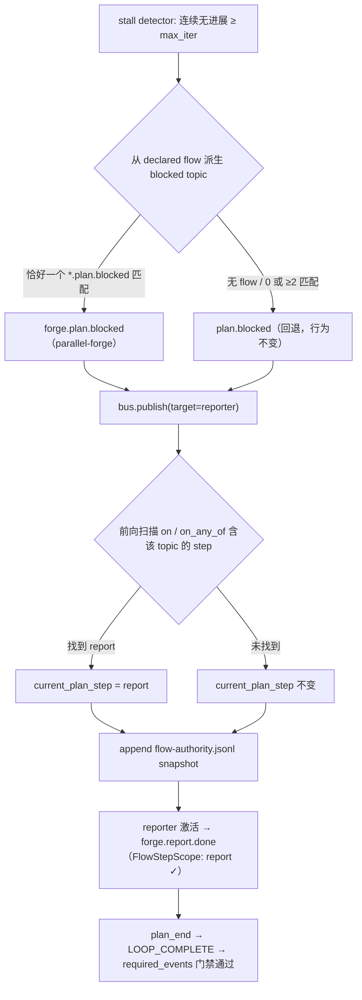

# fix: parallel-forge fail-close 双根因 — blocked topic 命名空间派生 + flow-authority 推进

## Summary

修复诊断报告（origin）确认的 P0 compound 双根因与 2 个 P1：runtime fail-close（stall detector，`progress_steward.enabled: false` 且连续无进展 ≥ `max_steward_iterations` 时）发射 blocked 事件后，(α) 不推进 flow-authority，(β) 发射的 topic 是内建 `plan.blocked` 而非 preset 协议的 `forge.plan.blocked`。修复方式是：发射前从 preset declared flow 派生 blocked topic（无 flow / 无匹配时回退 `plan.blocked`，行为不变），发射后显式推进 resident `current_plan_step` 并追加 `.ralph/flow-authority.jsonl` snapshot；同时新增 parallel-forge fail-close BDD scenario 关闭覆盖缺漏，并加固 reporter hat instructions（`forge.report.done` 被拒时禁止直接 emit `LOOP_COMPLETE`）。

---

## Problem Frame

Loop `primary-20260730-094057`（`builtin:parallel-forge`）在 `forge.worktrees.ready` 后进入 development_loop，forge-dispatcher 连续 3 轮 hat-channel 空产出触发 fail-close。runtime 经 `EventBus::publish` 直发 `plan.blocked`（target=reporter）：reporter 被激活后，其 `forge.report.done` emit 被 CLI `--policy-check` 的 `FlowStepScopeStage` 以 `flow_unknown_emit` 拒收——因为 flow-authority 仍停在 `development_loop`（该 step 的 `allowed_emits` 不含 `forge.report.done`，且 `transition_emits` 不含任何 blocked topic）。reporter 随后单边写出 27KB BLOCKED 报告并直接 emit `LOOP_COMPLETE`，被 `required_events: [forge.report.done]` 门禁连续拒收 2 次；fail-close 又循环 3 次，最终用户 TUI Quit 强杀。业务终态未达成。

诊断报告 §6.2 建议的修法 A（runtime 写死 `forge.plan.blocked`）经本会话核实**不可行**：`plan.blocked` 是通用内建协议，ce-executor-pipeline（reporter 是 `plan.blocked` 唯一消费者）与 ce-executor-supervisor（declared flow `allowed_emits` 含 `plan.blocked`）均依赖它，硬编码 forge 前缀会破坏这两个 preset（见 Evidence E6/E7）。

---

## Requirements

- R1. fail-close 发射 blocked 事件后，`.ralph/flow-authority.jsonl` 必须追加一条 snapshot；当 preset declared flow 中存在由该 blocked topic 经 `on` / `on_any_of` 进入的前向 step 时，resident `current_plan_step` 必须推进到该 step（parallel-forge：`development_loop` → `report`），使 reporter 的 `forge.report.done` 能通过 CLI `--policy-check` 与 runtime 双侧 FlowStepScope。（对应 origin DEV-001/DEV-002，P0-α）
- R2. fail-close 发射的 blocked topic 必须与当前 preset 的 blocked 协议命名空间一致：parallel-forge → `forge.plan.blocked`；ce-executor-supervisor → `plan.blocked`；无 declared flow 的 preset（ce-executor-pipeline 等）→ `plan.blocked`（行为不变）。（对应 origin DEV-013，P0-β）
- R3. parallel-forge fail-close 路径（`consecutive_no_progress ≥ 3` → blocked → reporter → `forge.report.done` → `LOOP_COMPLETE`）必须有 BDD scenario 覆盖，且使用真 EventLoop runner（`run_scenario_with_snapshots` 系），断言 events 与 flow-authority 落盘。（对应 origin DEV-015，P1）
- R4. reporter hat instructions 必须明确：`ralph emit forge.report.done` 的 `--policy-check` 失败或正式 emit 被拒时，禁止 emit `LOOP_COMPLETE`；trigger 为 `forge.plan.blocked` 且 payload 缺 `plan_key` / `context_artifact_path` 时给出可执行的兜底解析路径。（对应 origin DEV-014，P1）
- R5. 回归不变量：无 declared flow 的 preset 的 fail-close 行为逐字节不变（topic、payload、target、counters reset）；steward-enabled 的 U5 escalation 分支语义不变（仅 topic 同样走派生）。

---

## Scope Boundaries

- 不采用诊断报告 §6.2 修法 A（runtime 写死 `forge.plan.blocked`）——破坏 ce-executor-pipeline / ce-executor-supervisor（Evidence E6/E7）。
- 不采用修法 B（preset 14+ 处 `forge.plan.blocked` 改为 `plan.blocked`）——破坏 schema SSOT `presets/schemas/parallel-forge.yml` 的 `forge.plan.blocked` 契约，报告本身已否决。
- 不改 fail-close 的 payload（仍为 `{"reason":"loop_stalled_max_iterations"}`）与 target（`reporter`）；payload 不回填 `plan_key` 等字段（见 Open Questions）。
- 不改其余 mechanism `plan.blocked` 发射点（`crates/ralph-core/src/event_loop/mod.rs` 的 review 收敛、repair budget、phase-violation、P1-1、step-handoff、wave 六处）——它们走不同 preset 上下文，需各自独立验证。
- 不改 `presets/schemas/parallel-forge.yml`（本计划无 event 拓扑 / 字段变化）。
- 不处理 origin 的 P2/§7 项：DEV-016（repair_budget 计数异常，55）、DEV-017（task owner_hat_id 错配，60）、DEV-007（hat_lifecycle key 失配，60）、DEV-011（loops.json 残留，60）、DEV-005（repair_sink topic 格式，40）。

### Deferred to Follow-Up Work

- 其余六处 mechanism `plan.blocked` 发射点的命名空间 / flow-authority 对齐：独立 plan，逐点建立 Characterization Test 后评估（其中 P1-1 / repair-budget 路径与 DEV-016 合并调查）。
- DEV-016 repair_budget 触发次数异常的源码定位（origin §7，需先补 `repair_budget` 实施点 file:line 证据）。
- DEV-017 `tasks.coordinator_hats` 与 `owner_hat_id` 写入链修复（origin §6.6，需先定位 `crates/ralph-core/src/task/` 写入逻辑）。
- MINIMAL 诊断模式补 `agent-output.jsonl` 写盘（origin §6.4，observability 改进）。

---

## Context & Research

### Relevant Code and Patterns

- fail-close 发射点：`crates/ralph-core/src/event_loop/mod.rs` 的 `run_stall_detector_on_state`（ steward disabled 分支 emit `plan.blocked` + `with_target("reporter")` + `bus.publish`；同函数 U5 escalation 分支（steward enabled 且唤醒耗尽）亦 emit `plan.blocked`）。
- 两个调用点均在 `EventLoop` 方法内：`mod.rs` 的「空 turn 早退」路径与「post-validation」路径各调一次 `run_stall_detector_on_state`。
- flow-authority 写入：`apply_phase_authority_on_accepted`（accept 路径统一调用 `advance_plan_step` + `append_flow_authority_snapshot`，注释明确 "Rejected events never reach this method"）；CLI 侧 `crates/ralph-cli/src/policy_check.rs` 的 `check_cli_flow_step_scope` 通过 `load_flow_authority_current_step` 读同一 ledger——**补 snapshot 即同时修复 CLI precheck 与 restart 恢复两条路径**。
- step 推进语义：`advance_plan_step`（`mod.rs`）——`transition_emits` 非空时未列名 topic 不推进；前向 declared 匹配（`j > idx` 且 `candidate.on / on_any_of` 含 topic）优先于 positional fallback。parallel-forge `development_loop.transition_emits: [forge.exec.development.done, work.failed]`，故即使 accept 路径收到 `forge.plan.blocked` 也不会推进——fail-close 需要**显式 escape 解析**而非复用 `advance_plan_step`。
- 投递语义：`ralph-proto/src/event_bus.rs` `publish`——`target` 命中已注册 hat 时直接入其 pending 队列（绕过订阅匹配与 stage pipeline），reporter 必然被激活；mechanism 发射不经 stage pipeline 是既有惯例（`mod.rs` P1-1 注释："reuses the same `bus.publish` path as the three existing `plan.blocked` emitters … without re-entering the stage pipeline"）。
- `effective_mechanism_config`（`mod.rs`）：合并顶层 `mechanism:`（preset SSOT）与 `event_loop.mechanism`，topic 派生必须复用同一入口，与 `advance_plan_step` / `initial_current_plan_step` 保持一致。
- BDD 基建：`crates/ralph-core/tests/scenarios.rs` 的 `run_scenario_with_snapshots` 返回 `TempDir`（可读后断言 `.ralph/flow-authority.jsonl`）；`run_workflow_guard_scenario` 是其薄封装（丢弃 TempDir）；scenario 支持 `config.event_loop.mechanism`（先例 `crates/ralph-core/tests/scenarios/mechanism/foundation/flow_unknown_emit_rejected.yml`）；空事件的 mock response 会产生空 turn 触发 stall detector（「空 turn 早退」路径）。

### Evidence Ledger（本会话核实，file:line 级）

| Evidence ID | 来源 | 观察结果 | 对计划的影响 | 可靠性 |
|---|---|---|---|---|
| E1 | `crates/ralph-core/src/event_loop/mod.rs:14586-14607` | fail-close 分支 `Event::new("plan.blocked", …).with_target("reporter")` 后 `bus.publish`，无 accept / snapshot 调用 | R1/R2 修复锚点 | 高 |
| E2 | `crates/ralph-core/src/event_loop/mod.rs:14212-14227, 14282-14327` | `apply_phase_authority_on_accepted` 是 advance + `append_flow_authority_snapshot` 的统一入口；fail-close 绕开它 | R1 采用「显式 advance + append」而非重路由 accept | 高 |
| E3 | `crates/ralph-cli/src/policy_check.rs:1079-1144`（`check_cli_flow_step_scope` + `:1111`） | CLI `--policy-check` 读 `.ralph/flow-authority.jsonl` 恢复 current step | R1 的 ledger 追加即修复 reporter precheck 拒收 | 高 |
| E4 | `presets/en/parallel-forge.yml:86-138` | `development_loop.transition_emits=[forge.exec.development.done, work.failed]`；`report.on_any_of=[forge.audit.done, forge.plan.blocked, work.failed]`；`plan_end.on=forge.report.done`；`allowed_emits` 链完整 | escape 解析目标 = `report`；验证了 R1 后 reporter 双终态可通 | 高 |
| E5 | `presets/en/parallel-forge.yml:58-196`（14+ 处）、`crates/ralph-core/src/event_loop/mod.rs:14600` | preset blocked 协议全部 `forge.plan.blocked`；runtime 发射 `plan.blocked` | R2 命名空间错配成立 | 高 |
| E6 | `presets/en/ce-executor-pipeline.yml:40, 127, 56-59` | reporter 是 `plan.blocked` 唯一消费者；该 preset **无** `mechanism.flow`（FlowStepScope 跳过） | 否决修法 A；派生规则必须对无 flow preset 回退 `plan.blocked` | 高 |
| E7 | `presets/en/ce-executor-supervisor.yml:44-107`（declared flow，`:55` 含 `plan.blocked`）；`presets/en/autoresearch.yml`（`experiment.blocked`）；`presets/en/debug.yml` / `implementation-review.yml`（无 `*.plan.blocked`） | 5 个 declared-flow preset 中：supervisor → `plan.blocked`；parallel-forge → `forge.plan.blocked`；其余 3 个无 `*.plan.blocked` 匹配 | 派生规则「恰好一个匹配采用，否则回退 `plan.blocked`」覆盖全部现状 | 高 |
| E8 | `crates/ralph-proto/src/event_bus.rs:108-119` | target 命中已注册 hat 即直投 pending，绕过订阅匹配 | 仅改 topic 字符串不影响 reporter 激活；BDD 中 reporter hat id 必须是字面 `reporter` | 高 |
| E9 | `crates/ralph-core/src/event_loop/tests/progress_steward_disabled.rs:100-147`、`progress_steward.rs:192-267` | 现有测试断言 fail-close emit `plan.blocked` ×1；fixture 均无 declared flow | 派生回退保证这些测试不变绿→红；R5 回归锚点 | 高 |
| E10 | `crates/ralph-core/tests/scenarios/parallel_forge_*.yml`（9 个文件） | 均无 `config.mechanism` 块、无 fail-close 覆盖；`parallel_forge_declared_flow_failed_runtime.yml` 提供 hats/mock/expected 建模样板 | R3 新 scenario 的模板与缺口证据 | 高 |
| E11 | `presets/en/parallel-forge.yml:1137-1146`（reporter §步骤 4）、`:1108-1121`（§步骤 1） | instructions 已写「先 `forge.report.done` 再 `LOOP_COMPLETE`」，但无「被拒时禁止 LOOP_COMPLETE」hard rule，无 plan_key 缺失兜底 | R4 的修改锚点（注：origin 标注 yml:1110-1115，实际内容在 1137-1146，以代码为准） | 高 |
| E12 | `crates/ralph-core/src/event_loop/mod.rs:15028-15051` | `transition_emits` 门先于前向 declared 匹配；`forge.plan.blocked` 在 `development_loop` 永不推进 | R1 不能用 `advance_plan_step`，需独立 escape 解析 | 高 |

### Institutional Learnings

- `AGENTS.md` HARD RULE：测试入口一律 `cargo nextest run` 系列（禁裸 `cargo test`）；BDD 必须走真 runtime 路径（`run_workflow_guard_scenario` 系，禁 `run_scenario` stub）；preset yml 改动后必须跑 preset_lint + presets parity 校验；hat instructions 必须保持 hat 视角、引用 `crates/ralph-core/data/*.md` skill 而非复述其内容。

---

## Key Technical Decisions

- **D1 — blocked topic 从 declared flow 派生，不硬编码**：扫描 `effective_mechanism_config(config).flow.steps[*].allowed_emits`，收集 `== "plan.blocked"` 或以 `.plan.blocked` 结尾的 topic；**恰好一个去重匹配 → 采用；0 个或 ≥2 个不同匹配 → 回退 `"plan.blocked"`**。否决报告修法 A（破坏 E6/E7）；否决修法 B（破坏 schema SSOT）。置信度 0.92（E1/E4/E5/E6/E7）。
- **D2 — 保持 `bus.publish` 直发，不重路由 accept / stage pipeline**：fail-close payload 仅含 `reason`，而 preset schema 对 `forge.plan.blocked` 要求 5 个 required_fields，走 accept 会被 emit-schema gate 拒收导致 fail-close 彻底失声；且 mechanism 直发是既有惯例。置信度 0.9（E2 + P1-1 惯例注释）。
- **D3 — escape step 解析独立于 `advance_plan_step`**：从当前 step 起前向扫描 `steps[j > idx]`，找 `on == topic` 或 `on_any_of` 含 topic 的第一个 step；找到则设置 resident `current_plan_step`；无论是否找到都追加 flow-authority snapshot（`topic` = blocked topic，`step` = 推进后或原 step）。不复用 `advance_plan_step` 是因为 `transition_emits` 门会拦截（E12），而 fail-close 语义是「终态逃生舱」，不受 in-loop transition 收窄约束。置信度 0.88（E4/E12）。
- **D4 — 实现形态：`run_stall_detector_on_state` 参数化 + EventLoop 私有包装**：free 函数新增 `blocked_topic: &str` 入参（两个分支共用），返回值改为「本 turn 是否触发了 blocked 发射」；两个调用点收口到一个 `EventLoop` 私有方法，在函数返回后（借用已结束）统一做 D3 解析 + `append_flow_authority_snapshot`。U5 escalation 分支随同一参数覆盖（用户已确认）。置信度 0.88（E1/E2）。
- **D5 — reporter instructions 只改文本，不动 schema / 拓扑**：新增「`forge.report.done` 被拒 → 禁止 `LOOP_COMPLETE`」hard rule 与 plan_key 兜底指引；无 event/required_fields 变化，故 `presets/schemas/parallel-forge.yml`、`presets/manifest.yml`、`crates/ralph-cli/src/presets.rs`、zsh 补全、`AGENTS.md` 均无需同步；但必须跑 preset_lint + presets parity 校验。置信度 0.87（E11）。

---

## Open Questions

### Resolved During Planning

- 报告修法 A 是否可行？→ 不可行，E6/E7 证明 `plan.blocked` 是多 preset 共享内建协议；改为 D1 派生。
- fail-close 是否应改走 accept 路径以「自动」推进 flow-authority？→ 否，D2（schema gate 会拒收 minimal payload）；采用显式 escape 解析。
- BDD 如何断言 flow-authority？→ `run_scenario_with_snapshots` 返回 `TempDir`，新测试函数直接调用它并读 `.ralph/flow-authority.jsonl`（不丢 TempDir 的封装）。

### Deferred to Implementation

- fail-close payload 是否可回填 `plan_key`（若执行期发现 `LoopState` 持有可靠 plan_key 来源，可补充进 payload；不作为本计划完成标准——reporter 侧由 R4 的 instructions 兜底覆盖缺失情形）。
- 新 BDD scenario 中「空 turn」mock response 的确切写法（`text` 不含 `<event>` 块即可产生空 turn；executor 在 Red 阶段用一次最小运行确认 harness 行为，若 harness 对空响应有特殊处理则以实际为准调整 fixture 写法，不改变被测行为）。

---

## High-Level Technical Design

> *以下流程图仅表达意图方向，供 review 用，不是实现规格。*

---

## Implementation Units

### U1. fail-close blocked topic 派生 + flow-authority escape 推进（含 BDD 验收）

**Goal:** parallel-forge fail-close 后，reporter 能完成 `forge.report.done → LOOP_COMPLETE`  accepted 终态；无 declared flow 的 preset 行为不变。

**Requirements:** R1, R2, R3, R5

**Dependencies:** None

**Files:**
- Modify: `crates/ralph-core/src/event_loop/mod.rs`（`run_stall_detector_on_state` 签名与两个调用点收口；新增 topic 派生与 escape 解析 helper）
- Test: `crates/ralph-core/src/event_loop/tests/progress_steward.rs`、`crates/ralph-core/src/event_loop/tests/progress_steward_disabled.rs`（保持绿；按需补派生相关断言）
- Test（新增单测，位置随既有 event_loop 测试布局）：`crates/ralph-core/src/event_loop/tests/` 下新增或并入现有文件的派生 / escape 解析单测
- Create: `crates/ralph-core/tests/scenarios/parallel_forge_fail_close_runtime.yml`
- Modify: `crates/ralph-core/tests/scenarios.rs`（新增 `test_parallel_forge_fail_close_runtime`，直接调 `run_scenario_with_snapshots` 以断言 flow-authority 落盘）

**Approach:**
- 新增两个私有 helper（与 `advance_plan_step` 同区域，复用 `effective_mechanism_config`）：① blocked-topic 派生（D1 规则）；② escape step 解析（D3 规则）。
- `run_stall_detector_on_state` 增加 `blocked_topic: &str` 入参，steward-disabled fail-close 分支与 U5 escalation 分支均以该参数构造事件（payload / target / counters reset 逻辑不变）；函数返回是否触发 blocked 发射。
- 两个调用点收口为一个 `EventLoop` 私有包装方法：先解析 topic → 调 free 函数 → 若触发了发射，则做 escape 解析、按需设置 `current_plan_step`、追加 `append_flow_authority_snapshot(topic)`。
- BDD scenario 设计（模板：E10 的 `parallel_forge_declared_flow_failed_runtime.yml`）：
  - `config.event_loop`：`execution_mode: isolated`、`progress_steward: {enabled: false, max_steward_iterations: 3}`、`required_events: [forge.report.done]`、`starting_event: forge.start`、`completion_promise: LOOP_COMPLETE`、`max_iterations` ≥ 9。
  - `config.event_loop.mechanism.flow`：精简复制 parallel-forge steps（`planning → plan_authoring → concurrency_review → worktree_setup → development_loop（含 transition_emits）→ report（on_any_of）→ plan_end`）。
  - hats：真实 hat id（`inspector / planner / guardian / worktree / reporter`——`reporter` 必须字面命名，E8）；reporter 订阅 `forge.plan.blocked`、`work.failed`，publishes `forge.report.done`、`LOOP_COMPLETE`。
  - mock_responses：4 个 planning 链 handoff（iter 1-4）→ 3 个空事件响应（iter 5-7，触发 fail-close）→ reporter `forge.report.done`（iter 8）→ reporter `LOOP_COMPLETE`（iter 9）。
  - expected：`events` 含 `forge.report.done`、`LOOP_COMPLETE`；`completion: true`；测试函数末尾读 TempDir 的 `.ralph/flow-authority.jsonl`，**按行反向扫描**，断言最后一个 `topic == "forge.plan.blocked"` 的 snapshot 行 `step == "report"`（注意：reporter 的 `forge.report.done` / `LOOP_COMPLETE` 被 accept 后会各自再追加 snapshot——E2 的 accept 路径对每个 accepted 事件无条件写 ledger——故 fail-close 行**不是**全文件末行，禁止断言末行）。

**Execution note:** Test-first。先落 BDD scenario 与派生 / escape 单测并确认 Red（BDD 的失败必须是 `forge.report.done` 在 `development_loop` 被 FlowStepScope 拒收导致 `expected.events` 断言失败 / `completion` 为 false；单测的失败必须是 helper 不存在导致的编译错误或断言失败），再做最小实现转 Green。

**Patterns to follow:**
- `advance_plan_step` / `recover_current_plan_step`（`crates/ralph-core/src/event_loop/mod.rs`）的 `effective_mechanism_config` 用法与前向扫描写法
- `crates/ralph-core/src/event_loop/tests/progress_steward_disabled.rs` 的 bus observer + `process_events_from_jsonl` 驱动模式
- `crates/ralph-core/tests/scenarios/parallel_forge_declared_flow_failed_runtime.yml` 的 hats / mock_responses / expected 结构
- `crates/ralph-core/tests/scenarios/mechanism/foundation/flow_unknown_emit_rejected.yml` 的 `config.event_loop.mechanism` 内联写法

**Test scenarios:**
- Happy path（单测·派生）：flow steps 的 `allowed_emits` 仅含 `forge.plan.blocked` 一个匹配 → 返回 `forge.plan.blocked`；仅含 `plan.blocked` → 返回 `plan.blocked`。
- Edge case（单测·派生）：无 `mechanism.flow` → `plan.blocked`；flow 无 blocked topic（autoresearch / debug 形态）→ `plan.blocked`；≥2 个不同 `*.plan.blocked` → 回退 `plan.blocked`。
- Happy path（单测·escape）：current=`development_loop`、topic=`forge.plan.blocked` → `Some("report")`；current=`report`、topic=`forge.plan.blocked` → `None`（不前向）；supervisor 形态 flow（无 on/on_any_of 匹配）→ `None`。
- Integration（EventLoop 级）：带 parallel-forge 形态 flow 的 loop，预置 `consecutive_no_progress_turns = max` 后跑空 turn → bus 观察到 `forge.plan.blocked` ×1（无 `plan.blocked`）、`current_plan_step == "report"`、`.ralph/flow-authority.jsonl` 末行 `step=report / topic=forge.plan.blocked`。
- Integration（回归·无 flow）：现有 `progress_steward_disabled` / `progress_steward` fixture（无 flow）→ 仍 emit `plan.blocked` ×1；追加断言 flow-authority 有 snapshot 且 step 为空字符串（与 accept 路径一致行为）。
- Integration（U5 分支）：steward enabled 且唤醒耗尽的 loop（带 forge 形态 flow）→ escalation 事件 topic 同为 `forge.plan.blocked`，snapshot 追加。
- Acceptance（BDD）：上述 scenario 全链通过——`forge.report.done` / `LOOP_COMPLETE` 均 accepted、`completion: true`、flow-authority 包含行断言成立（反向扫描最后一个 `topic == "forge.plan.blocked"` 行其 `step == "report"`，非全文末行）。

**Verification:**
- 新 BDD 与全部新增单测通过；`progress_steward*` 既有测试无修改或通过且断言未被削弱。
- `cargo nextest run -p ralph-core -- progress_steward`、`cargo nextest run -p ralph-core --test scenarios`、`cargo nextest run -p ralph-core -- event_loop` 全绿；`cargo clippy` 无新增告警。
- 手工对照：BDD 在未实现修复时按预期原因失败（Red 证据留存在提交说明或 PR 描述中）。

---

### U2. reporter hat instructions 加固（forge.report.done 拒收 hard rule + plan_key 兜底）

**Goal:** reporter 在 `forge.report.done` emit 被拒时不再跳过它直接 emit `LOOP_COMPLETE`；trigger payload 缺 `plan_key` 时有明确兜底解析路径。

**Requirements:** R4

**Dependencies:** U1（runtime 行为先固定，instructions 描述的拒收语义才与真实门禁一致）

**Files:**
- Modify: `presets/en/parallel-forge.yml`（reporter hat `instructions:` §步骤 1 与 §步骤 4，锚点 E11）

**Approach:**
- §步骤 4 追加 hard rule：`ralph emit forge.report.done` 的 `--policy-check` 失败或正式 emit 被 runtime 拒收（如 `flow_unknown_emit`）时，**禁止** emit `LOOP_COMPLETE` 或任何其他业务事件；将拒收原因与当前触发上下文写入报告附录后停止本轮（遵守单业务事件预算与 Resume 规则）。
- §步骤 1 追加：trigger 为 `forge.plan.blocked` 且 payload 缺 `plan_key` / `context_artifact_path` 时，从 `.ralph/forge/` 下唯一子目录名解析 `plan_key` 并读取对应 `worktree-map.yml` / `execution-plan.yml`；无法解析则在报告写「信息缺失，无法确认」且 `status=BLOCKED / final_audit=BLOCKED`。
- 文本保持 hat 视角（只说该 hat 能直接观察 / 调用的东西），命令语法引用 `ralph-tools-emit` / `ralph-tools` skill 章节，不复述其内容；不引入框架级实现细节（禁止出现 `FlowStepScopeStage`、ledger 路径等 runtime 内部名词——`flow_unknown_emit` 作为 CLI 可见拒收原因码除外）。

**Patterns to follow:**
- 同文件其他 hat 的 instructions 写法（如 auditor 的 blocked 分支，`presets/en/parallel-forge.yml` auditor 段）
- `AGENTS.md` HARD RULE 4（hat 视角）与 HARD RULE 8（引用 skill doc 不复述）

**Test scenarios:**
- Test expectation: none —— 纯 instructions 文本变更，不新增文本锁定类测试（AGENTS.md Preset 测试 HARD RULE 禁止锁定 prompt 文案）；以结构校验代替：preset_lint strict 全绿 + embedded preset parity 测试全绿。

**Verification:**
- `cargo nextest run -p ralph-cli --bin ralph -- preset_lint`、`cargo nextest run -p ralph-core -- preset_lint`、`cargo nextest run -p ralph-cli --bin ralph -- presets` 全绿。
- 人工 diff 确认仅 instructions 段变化：`mechanism:` / `event_policy:` / `state_projection:` / schemas 引用零变化（故 `presets/schemas/parallel-forge.yml` 无需同步）。

---

## System-Wide Impact

- **Interaction graph:** fail-close 的两个调用点（空 turn 早退 / post-validation）行为改变；`EventBus` observer（session recorder / TUI）将观察到 `forge.plan.blocked`（parallel-forge 下）替代原 `plan.blocked`——诊断 / TUI 若按字面 topic 过滤需注意（已核：诊断聚合按 recovery envelope，不按该 topic 字面匹配）。
- **Error propagation:** reporter 的 `forge.report.done` 拒收路径（CLI precheck + runtime stage）在修复后不再触发；U2 让残留拒收场景以「报告附录 + 停止」收尾而非假终态。
- **State lifecycle risks:** `.ralph/flow-authority.jsonl` 新增一类「mechanism blocked」snapshot 行；`load_flow_authority_current_step` 只读 `step` 字段，格式与 accept 路径一致（E2/E3），restart 恢复语义不变；无 flow preset 追加空 step 行，与 accept 路径既有行为一致。
- **API surface parity:** `run_stall_detector_on_state` 为 crate 私有 free 函数，仅两处内部调用，无公开 API 变化；`ralph emit` / `--policy-check` CLI 契约不变。
- **Integration coverage:** BDD（U1）覆盖「fail-close → escape 推进 → reporter 双终态 accepted」全链，是单测无法证明的跨层行为。
- **Unchanged invariants:** 无 flow preset 的 fail-close（topic / payload / target / counters）；`advance_plan_step` 的 `transition_emits` / NON_TRANSITION 语义；其余六处 mechanism `plan.blocked` 发射点；`presets/schemas/parallel-forge.yml`；`ce-executor-supervisor` 的 fail-close 表现（topic 不变，仅多一行 snapshot）。

---

## Risks & Dependencies

| Risk | Mitigation |
|------|------------|
| 派生规则对未来「声明了多个不同 `*.plan.blocked`」的 preset 误判 | 规则即回退 `plan.blocked`（保守、现状行为）；单测锁定多匹配回退 |
| BDD 空 turn fixture 写法与 harness 行为不符，Red 原因偏离预期 | Red 阶段先验证空响应确实触发 stall 计数（失败信息必须指向 FlowStepScope 拒收而非 fixture 错误）；偏离时停止并按停止条件回报 |
| escape 推进与 hat 侧业务 `forge.plan.blocked`（reviewer / failure-handler 在 development_loop 内发射）语义混淆 | 本计划只改 mechanism fail-close 发射，业务 emit 的 transition 语义（E12）一字未动；BDD `absent_events` 可补断言业务路径不受影响 |
| `append_flow_authority_snapshot` 写盘失败（IO） | 沿用现有实现：warn 日志、不 panic（E2 既有行为），fail-close 投递不受影响 |
| U5 escalation 分支随修引入 steward-enabled preset 回归 | 该分支仅 topic 参数化；现有 `progress_steward.rs` 测试（无 flow → 回退 `plan.blocked`）锁定行为不变 |

---

## Documentation / Operational Notes

- `AGENTS.md` / `CLAUDE.md` 的 builtin preset 列表无结构变化，无需同步；zsh 补全无需同步。
- `crates/ralph-core/data/*.md`：无 CLI / event / 配置字段变化，无需同步（fail-close 是 runtime 内部行为，agent 不可见）。
- 修复落地后，origin 报告 §6.1 的 operator 残留处置（F1 worktree commit `87dc029b`、27KB BLOCKED 报告、`ralph loops clean`）仍由操作者手工执行，不在本计划。

---

## Sources & References

- **Origin document:** [docs/report/2026-07-30-parallel-forge-primary-20260730-094057-diagnosis.md](../report/2026-07-30-parallel-forge-primary-20260730-094057-diagnosis.md)（P0 compound 78 / P1 ×3；本计划覆盖其 P0、DEV-013、DEV-014、DEV-015）
- Related code: `crates/ralph-core/src/event_loop/mod.rs`（`run_stall_detector_on_state`、`apply_phase_authority_on_accepted`、`append_flow_authority_snapshot`、`advance_plan_step`、`effective_mechanism_config`）、`crates/ralph-cli/src/policy_check.rs`（`check_cli_flow_step_scope`）、`crates/ralph-proto/src/event_bus.rs`（`publish` target 路由）
- Related presets: `presets/en/parallel-forge.yml`、`presets/en/ce-executor-pipeline.yml`、`presets/en/ce-executor-supervisor.yml`
- Related tests: `crates/ralph-core/src/event_loop/tests/progress_steward{,_disabled}.rs`、`crates/ralph-core/tests/scenarios/parallel_forge_declared_flow_failed_runtime.yml`、`crates/ralph-core/tests/scenarios/mechanism/foundation/flow_unknown_emit_rejected.yml`
