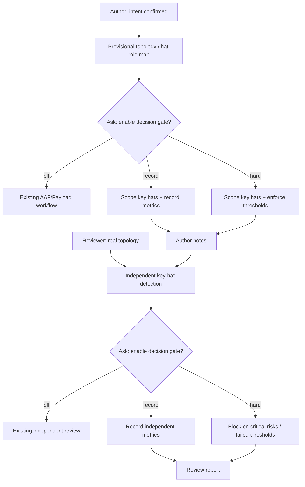

# feat: 为 preset author/review 增加关键 hat 决策置信门禁

## Goal Capsule

- **Objective:** 为 `ralph-preset-author` 和 `ralph-preset-review` 增加按关键 hat 触发的、用户可选的决策置信门禁。Author 先识别需要审查的关键 hat 和适用指标；Reviewer 独立重算范围与指标，并决定是否放行。
- **Product authority:** 本计划确认的范围与规则来自本轮用户讨论；现有两个 skill 的 workflow、现有 capability-triggered 原则和现有结构化 skill 测试是实现约束。
- **Scope boundary:** 只修改两个 skill 的 `SKILL.md`、两个 skill 的调用元数据和已有 skill contract 测试；不修改 `ralph-preset-common`、preset YAML/schema、Rust runtime、CLI、finding registry、注入给 loop agent 的 `crates/ralph-core/data/*.md`。
- **Stop conditions:** 若实现中发现需要共享 reference 才能避免 author/reviewer 规则漂移、需要新增 runtime finding、或需要改变 preset YAML/CLI 行为，停止当前 Unit，更新 Evidence Ledger 和 Decision Record，不由 Executor 临时扩展范围。
- **Execution profile:** 严格按 U1 → U2 → U3 → U4 执行，每个 Unit 完成自己的测试、回归和证据更新后才能进入下一 Unit。

## Product Contract

### 0. 计划状态

- **状态：READY**
- **基线：** 当前 git HEAD `5668b635`，分支 `pittcat-dev`，日期 2026-08-02。
- **调查范围：** `skills/ralph-preset-author/SKILL.md`、`skills/ralph-preset-review/SKILL.md`、两个 skill 的 `agents/openai.yaml`、`skills/tests/test_execution_model_contract.py`、`skills/ralph-preset-common/references/commands.md`、当前 skill fixtures/test inventory、相关 git history、仓库测试入口和 `AGENTS.md` 约束。
- **已执行的验证命令：** `rg --files`/`rg -n` 检查入口、调用规程、测试和 capability-triggered 规则；`sed` 读取目标 skill、测试和命令 reference；`git log -- skills/ralph-preset-author/SKILL.md skills/ralph-preset-review/SKILL.md skills/tests/test_execution_model_contract.py` 检查相邻变更历史；读取 `.venv` 存在性和今日计划序号。
- **尚未执行的验证：** 本计划阶段不运行 Python 测试、CLI smoke、Rust build 或 workspace nextest；这些属于 U4/最终执行验证。
- **阻塞项：** 无。计划内关键决策置信度均不低于 0.85。

### 1. 功能目标

#### 业务目标

降低 preset 编排中“结论很有把握但证据不足”的风险，同时避免把所有 preset、所有 hat 都变成评分填表流程。

#### 用户或调用方

- 创建或修改 preset 的 operator，以及执行 `ralph-preset-author` 的 agent。
- 审查 preset 的 operator，以及执行 `ralph-preset-review` 的 agent。

#### 当前行为

- Author 在 Discovery 中确认 intent、execution model、AAF 和 Payload Contract，但没有统一判断哪些 hat 属于高风险决策 hat。
- Reviewer 对每个 hat 做 AAF、Payload Audit、Handoff Audit，并已有 finding confidence 校准，但没有一套按关键 hat 选择指标、由用户启用、且 author/reviewer 分别询问的决策门禁。
- 现有 review 的 capability-triggered 规则按 capability 而非 preset 名称触发；新增能力必须保持这一原则。

#### 目标行为

- Author 在形成 provisional topology 后，按 hat 的职责和权限识别关键 hat，并为每个关键 hat 选择必要指标。
- Author 询问用户是否启用本次门禁：`启用硬门禁`、`仅记录不阻塞`、`不启用`。
- 启用后，Author 评估六项核心指标：`Confidence`、`Evidence Coverage`、`Unverified Assumptions`、`Critical Ambiguities`、`Verifiability`、`Impact Certainty`。
- `Critical Ambiguities` 和 `Critical Unverified Assumptions` 是关键 hat 的结构化检查项，不能被 agent 自由关闭；“不启用”只表示整套新增门禁不运行，不表示在门禁已启用后可以关闭这两个检查。
- Reviewer 在读取真实 YAML topology 后独立重新识别关键 hat、独立选择适用指标，并再次询问用户是否启用，不继承 author 的分数或范围作为证据。
- 硬门禁下，关键歧义或关键未验证假设阻塞；其余阈值未达标也阻塞。仅记录模式只写报告/notes，不阻塞既有 author/review 流程。

#### 行为差异

新增的是 loop 外 operator skill 的交互和报告行为；不改变 preset 运行时、事件、状态投影、CLI 参数、schema、持久化或 agent-facing runtime skill。

#### 本次范围

- 关键 hat 识别规则：终态 authority、生产/测试/配置 mutation authority、阶段/分支/重试/阻塞决策、跨 hat 汇总、关键 artifact 生产、关键 handoff 发布。
- 六项指标的定义、按职责触发的适用矩阵、用户 opt-in 三选一交互和 hard/record/off 语义。
- Author 的初评和 notes 记录。
- Reviewer 的独立复核、范围漂移检查和 review report 记录。
- 结构化 skill contract 测试、元数据 prompt 更新和既有测试回归。

#### 非目标

- 不要求每个 preset 使用门禁。
- 不要求每个 hat 使用门禁。
- 不让用户手工为每个 hat 选择指标；skill 根据职责选择，用户只选择是否启用以及启用模式。
- 不把分数写入 preset YAML、schema、事件 payload、runtime ledger 或持久化数据库。
- 不新增 `ralph preset check` lint finding，不修改 `finding-rubric.md`，不新增 common reference。
- 不实现真实 LLM judge，不用静态测试声称模型实际评分正确。

#### 输入、输出与状态

- **输入：** Author 的用户 intent、目标 preset/现有 YAML、provisional topology、hat 职责和 capability 信号；Reviewer 的真实 YAML topology、hat instructions、已有 author notes 和既有 review evidence。
- **输出：** Author 在 `preset-author-notes.md` 中记录 gate mode、关键 hat 范围、适用指标、六项结果、证据、阻塞项和作者假设；Reviewer 在既有 `preset-review-report.md` 的 Executive Summary/Per-Hat 区域记录独立范围、指标、证据、差异和最终 gate decision。
- **状态变化：** 仅改变 operator skill 的工作流和审查产物；不改变 runtime 状态。
- **错误语义：** 硬门禁中 `Critical Ambiguities > 0` 或 `Critical Unverified Assumptions > 0` 必须停止/阻塞；证据不足不能通过提高 Confidence 数字绕过；reviewer 发现 author 漏掉关键 hat 时必须记录范围缺口。

#### 阈值与指标定义

| 指标 | 通俗定义 | 硬门禁阈值/规则 |
|---|---|---|
| `Confidence` | 对当前结论正确性的把握 | `>= 85%` |
| `Evidence Coverage` | 关键判断有多少得到源码、测试、配置、文档或运行证据支持 | `>= 80%` |
| `Unverified Assumptions` | 所有尚未验证的假设数量 | 必须报告；关键子集必须为 0 |
| `Critical Ambiguities` | 会改变目标、权限、失败行为、终态或 handoff 的关键歧义数量 | `= 0` |
| `Verifiability` | 完成后能否用现有验证手段明确判断对错 | `>= 80%` |
| `Impact Certainty` | 是否明确影响的 hat、事件、配置、artifact、测试和历史行为 | `>= 75%` |
| `Critical Unverified Assumptions` | 尚未验证且会改变放行结论的假设数量 | `= 0`，作为结构化子集检查 |

#### 兼容、性能与安全约束

- 旧 preset 和不启用门禁的 author/review 流程继续按现有规则工作。
- 不增加 runtime 性能成本；只增加 operator 阶段的文本判断和现有只读 CLI 证据。
- 继续遵守现有禁止读取内部 ledger、禁止伪造 live identity、禁止把 preset 当 artifact owner 的规则。

#### 已确认假设

- 用户同意采用 Author + Reviewer 双阶段，但每个阶段都必须单独询问是否启用。
- 用户同意六项核心指标，但关键 hat 范围由 skill 根据能力判断，而不是每个 preset 全量启用。
- `Critical Ambiguities` 与 `Critical Unverified Assumptions` 在门禁启用后始终保留为结构化检查。
- common 不在本次修改范围内。

#### 待验证假设

无影响当前计划结构的待验证假设。实现时仍需用 U4 的真实 skill contract 测试和命令 smoke 验证文本入口未破坏。

### 2. BDD 行为规格

#### Feature: 关键 hat 的可选决策置信门禁

  Background:
    Given 一个待创建或待修改的 Ralph preset
    And author 或 reviewer 能看到该 preset 的 hat 职责、触发/发布关系和现有可见性证据

  Scenario: 普通转发 hat 不被强制纳入门禁
    Given 某 hat 只读取输入并做无决策的格式转发
    When skill 识别关键 hat
    Then 该 hat 不进入置信门禁范围
    And skill 不要求该 hat 填写六项指标

  Scenario: 终态 authority hat 被纳入门禁
    Given 某 hat 能发布成功、失败或阻塞终态
    When skill 识别关键 hat
    Then 该 hat 进入门禁范围
    And 至少适用 `Confidence`、`Evidence Coverage`、`Verifiability`
    And `Critical Ambiguities` 与 `Critical Unverified Assumptions` 被结构化检查

  Scenario: 生产修改 hat 获得影响和验证指标
    Given 某 hat 能修改生产代码、测试或配置
    When author 生成适用指标矩阵
    Then 该 hat 至少适用 `Evidence Coverage`、`Verifiability`、`Impact Certainty`

  Scenario: 用户关闭新增门禁
    Given 用户选择“不启用”
    When author 或 reviewer 继续工作流
    Then 不计算新增六项指标
    And 不因新增门禁阻塞既有 author/review 流程
    And 既有 AAF、Payload、Handoff 和 mechanical lint 规则仍然执行

  Scenario: 用户选择仅记录
    Given 用户选择“仅记录，不阻塞”
    When 某关键 hat 的指标低于建议阈值
    Then notes 或 review report 记录指标、证据和风险
    And skill 不因这些新增指标停止既有流程
    And `Critical Ambiguities` 与 `Critical Unverified Assumptions` 仍必须列出

  Scenario: 硬门禁拒绝关键歧义
    Given 用户选择“启用硬门禁"
    And 某关键 hat 存在至少一个 `Critical Ambiguities`
    When author 尝试进入 YAML/instructions drafting，或 reviewer 尝试输出通过结论
    Then author 必须返回用户确认或补证据
    And reviewer 必须输出阻塞结论

  Scenario: 硬门禁拒绝关键未验证假设
    Given 用户选择“启用硬门禁"
    And 某关键 hat 存在至少一个 `Critical Unverified Assumptions`
    When skill 计算 gate decision
    Then gate decision 必须为 block
    And 记录假设内容、验证动作和失败影响

  Scenario: reviewer 独立发现 author 漏掉关键 hat
    Given author notes 未将一个终态 authority hat 纳入门禁
    When reviewer 从真实 topology 独立识别关键 hat
    Then reviewer 记录 scope gap
    And 不得把 author 的 gate matrix 当作完整范围证据

  Scenario: reviewer 保持 capability-triggered 而非名称触发
    Given 两个不同名称的 hat 具有相同的终态或 mutation capability
    When reviewer 评估门禁范围
    Then两者按 capability 得到相同适用规则
    And 规则不得依赖 preset 或 hat 名称前缀

### 3. 需求—测试追踪矩阵

| Requirement ID | 需求 | Scenario | 验收测试 | Unit | Evidence |
|---|---|---|---|---|---|
| R1 | 仅关键 hat 进入门禁 | 普通转发、终态 authority、生产修改 | author/review scope contract tests | U1/U2 | E1,E2,E3 |
| R2 | 用户可分别决定 hard/record/off | 关闭、仅记录、硬门禁 | opt-in contract tests | U1/U2 | E4,E5 |
| R3 | 六项指标按职责选择 | 终态 authority、生产修改 | metric applicability contract tests | U1/U2 | E1,E2,E3 |
| R4 | 两个关键结构化检查不可被单独关闭 | 两个硬门禁拒绝场景 | critical-check wording/ordering tests | U1/U2 | E4,E5 |
| R5 | reviewer 独立重算范围和结果 | reviewer 漏掉关键 hat | reviewer independence contract test | U2 | E2,E6 |
| R6 | 不改变现有 skill 和 runtime 行为 | 关闭门禁、既有流程回归 | existing execution-model contract suite + skill smoke | U3/U4 | E7,E8 |
| R7 | 不按名称前缀触发 | capability-triggered 场景 | no-name-gate regression test | U3 | E1,E7 |

## Planning Contract

### 4. 代码库现状与证据

#### 4.1 当前实现入口

- Author 入口是 `skills/ralph-preset-author/SKILL.md` 的 Workflow 0 Discovery/user-confirmation gate；执行模型菜单、Intent Confirmation、topology phase、capability discovery、AAF/Payload Contract 和 pre-review gate 均在同一文件内。
- Reviewer 入口是 `skills/ralph-preset-review/SKILL.md` 的 Workflow 0a 用户选择、Workflow 1 topology-only discovery、3a/3a.5 capability audit、4 Per-Hat AAF、5 Payload Audit、8 Confidence calibration 和固定 report structure。
- 两个 skill 的可调用提示分别位于 `skills/ralph-preset-author/agents/openai.yaml` 与 `skills/ralph-preset-review/agents/openai.yaml`。
- 现有结构化契约测试集中在 `skills/tests/test_execution_model_contract.py`，测试对象包括两个 SKILL、common references、fixtures 和诊断 skill；本计划只扩展该已有测试文件，不新增 common 文件。
- 现有 operator command reference 已确认可用入口包括 `ralph preset check --strict`、`ralph capability inventory --format json`、`ralph inspect prompt --hat ... --format json` 和 nextest 子集；skill 文档明确这些命令只提供结构/topology/visibility 证据，不替代 AAF 语义判断。

#### 4.2 Evidence Ledger

| Evidence ID | 来源 | 观察结果 | 对计划的影响 | 可靠性 |
|---|---|---|---|---|
| E1 | `skills/ralph-preset-author/SKILL.md` Workflow 0、1、2.5、5 | Author 已有 intent confirmation、作者假设、capability discovery、每 hat AAF/Payload Contract 和 pre-review stop gate。 | 新门禁应插在 intent 已确认、provisional topology 可识别之后，并在 pre-review 前复核，而不是替换已有 AAF。 | 高 |
| E2 | `skills/ralph-preset-review/SKILL.md` Workflow 0a、1、3a.5、4、5、8 | Reviewer 已要求独立重做 AAF/payload audit，按 capability 触发 wave/supervisor 检查，并按 confidence 校准 finding。 | Reviewer 适合独立重算关键 hat 范围；新指标应进入 report，而不是信任 author 分数。 | 高 |
| E3 | `skills/tests/test_execution_model_contract.py` 顶部说明及 U2/U5/U8 测试 | 现有测试是结构/词汇 contract，不运行真实 LLM judge，并锁定 capability-triggered、禁止 preset-name gate 等稳定行为。 | 新测试应验证入口、字段、规则和反名称门禁，不声称能证明模型评分质量。 | 高 |
| E4 | 用户本轮确认的六项指标和用户启用要求 | 用户确认六项核心指标，并要求 author/reviewer 在各自阶段询问是否启用。 | 采用三模式 `hard / record / off`；不让用户逐 hat 手选指标。 | 高 |
| E5 | 用户本轮确认的关键结构化检查要求 | 用户要求 `Critical Ambiguities` 与 `Critical Unverified Assumptions` 不能由模型自由关闭。 | 这两个检查仅在整套新增门禁启用后仍是强制字段；硬门禁下值必须为 0。 | 高 |
| E6 | `skills/ralph-preset-review/SKILL.md` “Do not trust author notes” 与 independent AAF 规则 | Reviewer 不应把 author notes 作为事实。 | reviewer 必须独立识别关键 hat、独立计算指标，author/reviewer 的差异本身要可报告。 | 高 |
| E7 | `skills/ralph-preset-review/SKILL.md` 3a.5、3d、3e 与 `skills/tests/test_execution_model_contract.py` U5/U8 | 现有 capability audit 不按 preset 名称前缀触发。 | 新关键 hat 识别也必须按 authority/mutation/decision/handoff capability 触发。 | 高 |
| E8 | `AGENTS.md` Build & Test、Skill guide 同步和中文输出规则 | Python 测试必须使用 `.venv`；声明完成前必须走 nextest；skill 相关文档需保持准确且面向 agent 下一步动作。 | U4 使用 `.venv/bin/python` 跑 skills tests，并在最终执行阶段使用项目规定的 nextest 入口；本计划不修改 injected data。 | 高 |
| E9 | `skills/ralph-preset-author/agents/openai.yaml`、`skills/ralph-preset-review/agents/openai.yaml` | 两个默认 prompt 只描述 AAF/Payload 或 AAF/Payload/Handoff，不提示关键 hat scope 和 opt-in。 | 两个元数据文件必须同步更新，否则隐式调用仍可能遗漏新能力。 | 高 |
| E10 | `skills/ralph-preset-common/references/commands.md` | 已有 CLI 能观察 preset topology、prompt visibility、capability inventory 和 policy-check 边界。 | 不新增命令；计划中的验证复用真实命令，新增门禁仍是 skill-level判断。 | 高 |
| E11 | Git history：2026-07-22 至 2026-07-29 的 execution-model、capability-triggered、prompt-visibility 相关提交 | 两个 skill 最近持续以“流程文档 + 结构化契约测试”方式演进。 | 沿用现有单文件 workflow 和测试契约，不引入 runtime 或 shared reference 重构。 | 中 |
| E12 | `skills/tests` inventory 与 `.venv` 检查 | 当前有可执行 Python skill tests，仓库根 `.venv` 存在。 | U3/U4 可增加既有测试文件中的 contract cases，并用 `.venv/bin/python` 执行。 | 高 |

#### 4.3 受影响范围

- **生产/运行代码：** 无。
- **Operator skill：** `skills/ralph-preset-author/SKILL.md`、`skills/ralph-preset-review/SKILL.md`。
- **Skill metadata：** `skills/ralph-preset-author/agents/openai.yaml`、`skills/ralph-preset-review/agents/openai.yaml`。
- **测试：** `skills/tests/test_execution_model_contract.py`。
- **不受影响：** `skills/ralph-preset-common/**`、`presets/**`、`crates/**`、`scripts/**`、`CLAUDE.md`、`AGENTS.md`、CLI、runtime ledger、数据库、网络服务。

### 5. Decision Records

| Decision ID | 决策问题 | 候选方案 | 最终选择 | 支持证据 | 排除其他方案的原因 | 置信度 |
|---|---|---|---|---|---|---|
| D1 | 指标按什么粒度触发？ | 每个 preset 全量；每个 hat 全量；按关键 hat capability | 按关键 hat capability 触发，普通转发/纯读取 hat 默认不纳入 | E1,E2,E7 | 全量会造成流程负担；按名称会与现有 capability-triggered 原则冲突 | 0.98 |
| D2 | 谁决定关键 hat 范围？ | 用户手选；author 单独决定；skill 识别后 reviewer 复核 | skill 根据职责识别，author 初评，reviewer 独立复核；用户不手选 hat/指标 | E2,E4,E6 | 用户难以稳定判断内部 hat 风险；author 单独决定失去独立性 | 0.96 |
| D3 | 用户如何启用？ | 默认开启；每个 preset 配置；每个 author/reviewer 阶段询问 | author 和 reviewer 各自询问三模式：hard / record / off；不写 YAML 配置 | E4,E9 | 默认开启违反用户明确 opt-in；YAML 配置扩大 runtime/config scope | 0.98 |
| D4 | 六项指标如何分配？ | 每个关键 hat 六项全填；用户逐项选择；按 hat capability 选择 | 按职责选择：终态/分支/汇总偏 Confidence/Evidence；mutation 偏 Evidence/Verifiability/Impact；无法验证的关键假设与歧义对所有 scoped hat 结构化保留 | E1,E2,E4,E5 | 全量填表过重；用户逐项选择把专业判断转回用户；只选分数会漏掉关键风险 | 0.94 |
| D5 | 门禁阈值是什么？ | 无阈值；平均分；独立 hard gates | `Confidence>=85`、`Evidence Coverage>=80`、`Verifiability>=80`、`Impact Certainty>=75`；`Critical Ambiguities=0`、`Critical Unverified Assumptions=0`；不做平均分 | E4,E5 | 平均分会掩盖关键风险；用户给出的阈值模型明确要求独立门禁 | 0.93 |
| D6 | Reviewer 是否复用 author 结果？ | 直接复用；只复核低分项；独立重算 | 独立重算关键 hat scope、适用指标和证据；author 结果只作为对比输入 | E2,E6 | 直接复用无法发现遗漏范围和自我确认偏差 | 0.98 |
| D7 | 规则放在哪里？ | common reference；Rust lint；两个 SKILL 本地定义 | 只修改两个 SKILL 与其 metadata，测试文件锁定两边字段和规则；不改 common | E3,E8,E9 | 用户明确排除 common；Rust lint 会扩大实现范围；新 shared contract 不在本次范围 | 0.95 |
| D8 | 如何验证？ | 全文 snapshot；真实 LLM judge；结构化 contract + CLI smoke + existing regression | 结构化 contract 测试验证稳定规则，现有 CLI 命令验证入口可用，既有 skill tests 做回归；不锁全文 prompt，不声称验证 LLM 判断质量 | E3,E10,E12 | 全文锁定会抑制文案演进；真实 judge 不在现有测试能力内 | 0.98 |

### 6. High-Level Technical Design



关键 hat 识别只看能力信号，不看名称。满足任一条件即进入候选：拥有成功/失败/阻塞终态 authority；能修改生产代码、测试或配置；决定阶段转移、重试、修复、回滚或停止；汇总多 hat 结果；生产下游关键 artifact；发布关键 handoff。纯读取、无决策的格式转换和无 authority 的转发 hat 默认排除。

指标适用矩阵的实现规则如下：

- 终态 authority / 分支决策 / 多来源汇总：`Confidence`、`Evidence Coverage`、`Verifiability`。
- 生产代码、测试或配置 mutation：`Evidence Coverage`、`Verifiability`、`Impact Certainty`。
- 关键 handoff / artifact producer：`Evidence Coverage`、`Impact Certainty`、`Verifiability`。
- 所有进入 scope 的关键 hat：报告 `Unverified Assumptions`，并结构化列出 `Critical Unverified Assumptions` 与 `Critical Ambiguities`。
- 不属于关键 hat 的普通 hat：不填新增指标，也不因未填指标被阻塞。

## Implementation Units

### U1. 定义 Author 的关键 hat 识别与 opt-in 门禁

**Goal:** Author 能在 provisional topology 可用后识别关键 hat、生成按职责的指标适用矩阵，并在 drafting 前询问用户是否启用 hard/record/off。

**Requirements:** R1, R2, R3, R4；Scenarios 普通转发、终态 authority、生产修改、关闭、仅记录、硬门禁拒绝。

**Dependencies:** 无。

**Files:**

- `skills/ralph-preset-author/SKILL.md`：在现有 Workflow 0/1 之间增加关键 hat scope 与 opt-in 规程；补充指标定义、阈值、证据要求、notes 输出和停止条件。
- `skills/ralph-preset-author/agents/openai.yaml`：把默认 prompt 从“每 hat AAF”扩展为“先识别关键 hat，再按 scope 做 opt-in 决策置信评估”。
- `skills/tests/test_execution_model_contract.py`：新增 Author scope/opt-in/metric/critical-check 结构化契约测试。

**Approach:**

1. 保留现有 intent confirmation 和 execution-model menu，不把新门禁当成替代确认。
2. 在 target classification 后、正式 topology/instructions drafting 前建立 provisional hat role map；对已有 preset 读取真实 hat roles，对新 preset 使用已确认 intent 中的职责描述。
3. 以 capability 条件识别关键 hat，不使用 preset/hat 名称前缀。
4. 询问三模式；`off` 直接回到原流程，`record` 记录不阻塞，`hard` 应用阈值和 critical checks。
5. 在 `preset-author-notes.md` 的 Intent Confirmation 后增加 Gate Scope 表：hat、触发理由、适用指标、证据、假设、歧义、mode、decision。
6. 若 topology drafting 改变了关键 hat 的 authority/mutation/handoff，进入 pre-review gate 前重新计算 scope；不允许 notes 与 YAML scope 静默不一致。

**Patterns to follow:** 现有 Workflow 0 的用户确认菜单、Workflow 1 的 topology phase、Workflow 2.5 的 capability discovery、Workflow 5 的 fail-closed pre-review gate、现有 AAF/Payload Contract 表。

**Test scenarios:**

- 读取 Author skill 文本，确认关键 hat 触发词覆盖终态、mutation、分支决策、汇总、artifact、handoff，并明确普通转发排除。
- 确认三模式菜单同时包含 hard、record、off，且 off 不阻塞现有流程。
- 确认六项指标名称和阈值出现在 Author workflow，且 `Critical Ambiguities`/`Critical Unverified Assumptions` 被标为启用后不可单独关闭。
- 确认 Author notes 输出包含 per-hat scope、适用指标、证据、假设、歧义和 gate decision，而不是要求所有 hat 全量填表。
- 确认新增规则禁止按 preset/hat 名称前缀触发。

**Acceptance Red:** 先运行新增 Author contract tests；在现状上应因缺少关键 hat scope、opt-in 三模式、阈值和 critical-check 规则而失败。若失败是文件不存在、pytest 未执行、正则本身错误或环境损坏，则不是有效 Red，停止并修正测试入口。

**Unit tests:** 测试对象是 `AUTHOR_SKILL` 文本和 `AUTHOR_METADATA`；输入是规则关键词/段落；期望是关键 rule 存在且禁止名称门禁；不 mock 文件读取，不锁完整 prompt 文本。

**Red → Green → Refactor:** scope trigger contract Red → 添加 capability-triggered 关键 hat 规程 → Green；opt-in/threshold contract Red → 添加三模式和阈值/critical-check 规程 → Green；notes contract Red → 添加输出字段和 drafting 前停止条件 → Green；最后整理与现有 Workflow 编号和术语一致性。

**Minimal implementation:** 只改 Author skill workflow、metadata prompt 和已有 contract tests；不改 common、YAML、schema、runtime 或 finding rubric。

**Integration verification:** 使用现有 `ralph capability inventory --format json`、`ralph inspect prompt --hat ... --format json` 作为 skill 文档引用的真实 CLI 证据；不新增 CLI。

**Risk-driven tests:** 只需 contract/negative wording tests；不需要 E2E、并发、数据库、Fault Injection 或 Property-Based Test，因为本 Unit 没有 runtime 状态或持久化行为。

**Regression:** 运行现有 execution-model author tests、mechanical-edit exception tests、pre-review model branch tests，确认新 gate 不删除单链默认和既有 Intent Confirmation。

**Completion:** Author 能先识别关键 hat，再询问是否启用；hard/record/off 语义、六项指标、critical checks 和 notes 输出均有清晰规程与测试证据。

**Stop conditions:** 若无法在不修改 common 的情况下让 Author 定义清晰且可与 Reviewer 对账的字段，停止 U1，记录冲突，不新增第三个 shared reference。

### U2. 定义 Reviewer 的独立范围复核与放行门禁

**Goal:** Reviewer 能从真实 topology 独立识别关键 hat、独立选择指标、单独询问 opt-in，并在 report 中区分 author 范围、review scope、指标证据和最终 decision。

**Requirements:** R1, R2, R3, R4, R5；Scenarios 硬门禁拒绝、Reviewer 漏掉关键 hat、capability-triggered 非名称触发。

**Dependencies:** U1 已完成并通过全部验证。

**Files:**

- `skills/ralph-preset-review/SKILL.md`：在 topology-only discovery 与 per-hat AAF 之间增加独立 scope/opt-in；扩展 Confidence calibration、Executive Summary、Per-Hat AAF 和 report decision 规则。
- `skills/ralph-preset-review/agents/openai.yaml`：提示 reviewer 先做独立关键 hat scope，再做 AAF/Payload/Handoff。
- `skills/tests/test_execution_model_contract.py`：新增 Reviewer independence、scope gap、report field 和 critical-block contract tests。

**Approach:**

1. 保留 Workflow 0a 的 agent-skill audit prompt；新门禁不替代该已有用户选择。
2. 在 topology-only fields、execution mode、capability audit 完成后，从真实 `hats.*.triggers/publishes`、state_projection、event_policy 和 instructions 权限信号识别关键 hat。
3. 重新询问三模式；不读取 author 选择作为本次 reviewer 的授权。
4. Reviewer 先完成自己的 Gate Scope 表，再进行 Per-Hat AAF/Payload/Handoff；author notes 只能在 scope 建立后用于 mismatch 对比。
5. report 必须写 `decision_gate: skipped|record|hard`、`decision_gate_scope`、per-hat metrics、critical counts、evidence、author/reviewer scope delta 和 `pass|warn|block`。
6. hard 模式下 critical count 非零或普通阈值不满足均 block；record 模式只记录，不替代现有 P0/P1 规则；off 模式不生成新增指标，但既有 review 仍照常执行。

**Patterns to follow:** 现有 `Do not trust preset-author-notes.md`、3a.5 capability-triggered audit、Per-Hat AAF dry-run、Payload/Handoff tables、Confidence calibration 和固定八段 report structure。

**Test scenarios:**

- 确认 Reviewer workflow 在真实 topology 后、Per-Hat AAF 前独立识别关键 hat并询问三模式。
- 确认 Reviewer 明确不能直接继承 author 分数或 scope。
- 确认 report 字段包含 gate mode、scope、适用指标、critical counts、evidence、scope delta 和 decision。
- 确认 hard 模式下 critical ambiguity/critical assumption 非零会 block。
- 确认 record 模式低于阈值只记录，不绕过既有 P0/P1 规则，也不把新增指标当作通过证明。
- 确认 reviewer 规则只使用 capability/authority/mutation/handoff 信号，不使用 preset/hat 名称前缀。

**Acceptance Red:** 先运行新增 Reviewer contract tests；在现状上应因缺少独立 scope、三模式、report fields 和 critical block 规则而失败。与真实 `ralph preset check` 失败、缺少 fixture 或测试未执行无关的错误不算有效 Red。

**Unit tests:** 测试对象是 `REVIEW_SKILL` 文本和 `REVIEW_METADATA`；断言关键 workflow ordering、独立性词句、report contract 和 capability-triggered negative rule；不 mock LLM，也不锁定完整 report 文案。

**Red → Green → Refactor:** reviewer ordering Red → 插入 topology 后独立 scope gate → Green；independence/report Red → 添加 author/reviewer delta 和 report 字段 → Green；threshold/critical block Red → 添加 hard/record/off decision rules → Green；最后与既有 0a/3a.5/4/8 术语对齐。

**Minimal implementation:** 只改 Reviewer skill、metadata 和已有 contract tests；不把新规则变成 Rust lint/finding registry。

**Integration verification:** reviewer 继续使用现有 `ralph preset check --strict`、`ralph capability inventory --format json` 和 `inspect prompt` 作为证据来源；新增门禁不改变这些命令输出。

**Risk-driven tests:** 增加 scope omission 和 name-prefix negative contract tests；不需要 runtime E2E、并发或 persistence tests。

**Regression:** 运行现有 0a/0b agent-skill audit 选择、CE pipeline 3b 保留、wave/supervisor 3d/3e capability gate、finding confidence calibration 相关测试。

**Completion:** Reviewer 能独立重做 scope 和指标，并在 report 中给出可追踪的 hard/record/off decision；author scope 漏项可被识别。

**Stop conditions:** 若 Reviewer 的独立 scope 需要读取 common 新定义才能与 Author 对齐，停止 U2，回到 D7 范围决策，不偷偷修改 common。

### U3. 更新 skill 元数据与结构化回归契约

**Goal:** 两个 skill 的隐式调用入口和已有结构化测试都能发现新能力，并防止规则漂移、名称触发和全量填表回归。

**Requirements:** R3, R6, R7；Scenarios capability-triggered 非名称触发、旧流程兼容。

**Dependencies:** U1、U2 已完成并通过全部验证。

**Files:**

- `skills/ralph-preset-author/agents/openai.yaml`：确认 default prompt 明确“关键 hat scope + opt-in”。
- `skills/ralph-preset-review/agents/openai.yaml`：确认 default prompt 明确“独立关键 hat scope + opt-in”。
- `skills/tests/test_execution_model_contract.py`：补齐 author/reviewer 对称字段、metadata、scope exclusion、threshold 和 no-name-gate 测试。

**Approach:**

1. 只增加稳定的字段/anchor/negative contract，不断言完整 prompt 文案等于某个 snapshot。
2. 测试 author/reviewer 使用相同英文指标标识和 hard/record/off 标识，允许各自 workflow 文案不同。
3. 测试两个 metadata default prompt 都提到关键 hat scope 与独立/初步评估职责。
4. 测试既有 execution-model、CE pipeline 3b、wave/supervisor capability 和 install/test discovery anchor 不被删除。

**Test scenarios:**

- 两个 SKILL 都声明六项指标、三种 gate mode 和两个 critical structured checks。
- Author 文本存在初步 scope；Reviewer 文本存在 independent scope 和 author/reviewer delta。
- 两个 metadata prompt 都保留原 AAF/Payload/Handoff 任务且新增 scope 提示。
- 新规则行不能把 preset-name prefix 当触发条件；允许明确禁止该做法的文字。
- 现有 U2/U5/U8 contract tests 的既有断言继续通过。

**Acceptance Red:** 先运行目标测试文件；在新测试未添加前，新增对称字段和 metadata 断言应失败。若既有测试本身未被收集或 `.venv` 缺失，不算有效 Red。

**Unit tests:** 以文本结构和 metadata YAML 内容为测试对象；不做完整文件 equality，不读取 runtime ledger，不新增 fixtures。

**Red → Green → Refactor:** metadata prompt tests Red → 更新两个 `openai.yaml` → Green；cross-skill parity tests Red → 补齐两个 SKILL 的稳定字段/anchor → Green；name-gate/exclusion regression Red → 修正文档中可能误触发的表达 → Green；整理测试辅助函数，保持测试只锁稳定契约。

**Minimal implementation:** 仅修改两个 skill metadata 和已有 Python contract tests；不修改 common fixtures/reference。

**Integration verification:** 用 `.venv/bin/python` 运行该测试文件；用 skill install/discovery 现有测试确认 metadata 仍可加载。

**Risk-driven tests:** 只做结构性 negative tests；不需要 Mutation/Fuzz/E2E，因为没有解析外部不可信数据或 runtime 状态。

**Regression:** `skills/tests/test_install.py`、`skills/tests/test_execution_model_contract.py` 中既有 execution/capability/fixture README 相关测试和其它可收集 skill tests。

**Completion:** metadata 可加载，新增 contract tests 通过，既有 capability-triggered 和 execution-model 规则保持。

**Stop conditions:** 若新增测试必须修改 common reference/fixture 才能表达稳定契约，停止 U3 并记录范围冲突。

### U4. 最终 CLI smoke、全量 skill 回归与计划范围审计

**Goal:** 证明两个 skill 的新规程引用真实现有命令、没有扩大到 runtime/common/preset 文件，并完成最终质量门禁。

**Requirements:** R6；Scenario 旧流程兼容。

**Dependencies:** U3 已完成并通过全部验证。

**Files:**

- `skills/ralph-preset-author/SKILL.md`：仅在 smoke/审计发现命令或现有 workflow 描述不准确时修正。
- `skills/ralph-preset-review/SKILL.md`：同上。
- `skills/ralph-preset-author/agents/openai.yaml`：仅在 metadata 加载 smoke 发现问题时修正。
- `skills/ralph-preset-review/agents/openai.yaml`：同上。
- `skills/tests/test_execution_model_contract.py`：仅在最终 contract/回归发现测试缺口时修正。

**Approach:**

1. 运行目标 Python contract 测试和全量可收集的 skills tests。
2. 对现有代表性 preset 运行 `ralph capability inventory --format json`、`ralph preset check --strict` 和 `ralph inspect prompt --hat ... --format json`，确认计划引用的命令真实存在、但新增门禁不改变命令输出。
3. 检查 git diff 只包含计划内四类路径；发现 common、Rust、preset、schema 或 runtime 变更立即停止，不扩大计划。
4. 运行项目规定的最终 nextest 入口；由于本次只改 Python/Markdown/YAML metadata，Rust 全量回归仍是仓库完成规则，不把裸 `cargo test` 当入口。
5. 更新计划执行证据只在执行阶段完成；本计划不预写“测试已通过”。

**Test scenarios:**

- 目标 contract tests 全部通过，新增场景均被实际收集。
- 全量 skills Python tests 通过或已有失败被明确区分，不把无关失败当作本计划 Green。
- `ralph capability inventory --format json` 成功输出 JSON，证明现有 capability 入口可调用。
- 对一个真实 preset 的 `ralph preset check --strict` 成功或输出已知 preset finding；skill smoke 不应因为新门禁文本变化而改变 YAML lint 结果。
- 对一个真实 hat 的 `ralph inspect prompt --hat ... --format json` 成功；新 gate 不声称 runtime 自动注入。
- `git diff --name-only` 不包含 `skills/ralph-preset-common/`、`presets/`、`crates/` 或 runtime 文件。

**Acceptance Red:** 本 Unit 的 Red 是在当前修改集上先运行最终命令清单，确认新增 contract tests、metadata smoke 或 scope audit 至少有一个能针对本功能给出缺失证据；命令不可用、环境损坏或 unrelated test failure 不是有效 Red。U1–U3 已经提供功能缺失 Red，U4 不得为了制造 Red 修改无关测试。

**Unit tests:** 使用现有 Python tests、真实 CLI read-only smoke 和 diff scope audit；不 mock CLI 命令，不修改 preset 来伪造通过。

**Red → Green → Refactor:** 运行 contract suite → 修复本计划内文档/metadata/test 漂移 → 运行 targeted suite → 运行 CLI smoke → 运行 skills full suite → 运行 final nextest/build/lint gate → 清理无关改动并关闭 Unit。

**Minimal implementation:** U4 不新增功能，只修复 U1–U3 产生的本计划内验证缺口。

**Integration verification:** CLI 只做现有 read-only 命令；Rust/nextest 只验证仓库整体无回归，不将 runtime 行为归因于新 skill gate。

**Risk-driven tests:** 不适用数据库、并发、Fault Injection、Fuzz、Differential；本 Unit 的真实风险是 skill contract 漂移、metadata 加载失败和范围外改动。

**Regression:** 全量 `skills/tests`、相关 install/discovery tests、项目 `./scripts/run-tests.sh`、`cargo build`、`cargo clippy`，以及 AGENTS 要求的其它最终门禁。

**Completion:** 所有计划内测试和 smoke 通过，diff 范围准确，未改 common/runtime/preset，且文档没有把 off 模式错误描述成默认 hard gate。

**Stop conditions:** 任何 CLI 入口不存在、已有测试出现与文档变化无关的新失败、或最终 diff 超出范围，停止并回到 Evidence/Decision 更新，不得继续声明完成。

## Unit 串行依赖图

```text
U1 Author scope + opt-in
  ↓ Author contract and metadata are verified
U2 Reviewer independent scope + gate
  ↓ Both skill contracts are verified
U3 Cross-skill metadata and structural regression
  ↓ Contract suite and metadata loading are verified
U4 CLI smoke, full skill regression, scope audit
```

U2 不能先于 U1，因为 Reviewer 的独立复核需要对账 Author 的 scope/metric vocabulary，但不继承 Author 的结果。U3 不能先于 U1/U2，因为 parity tests 必须锁定两边已经确定的字段。U4 必须最后执行，因为它验证最终 diff、命令引用和整体回归。

## Verification Contract

### 7. 验收与测试策略

| Scenario | 验收条件 | 测试入口 | 推荐层级 | 风险补充 | E2E |
|---|---|---|---|---|---|
| 关键 hat 识别 | 终态/mutation/决策/汇总/artifact/handoff 进入 scope；纯转发排除 | `skills/tests/test_execution_model_contract.py` | Skill contract test | no-name-gate negative | 否 |
| Author opt-in | 三模式存在；off 不阻塞；hard/record 语义明确 | 同上 + Author workflow smoke | 文档 contract | critical check wording | 否 |
| Reviewer 独立复核 | reviewer 不信任 author notes，报告 scope delta | 同上 + Reviewer workflow smoke | 文档 contract | omission negative | 否 |
| 阈值与 critical checks | 六项指标、阈值、critical zero gate 一致 | 同上 | 结构化 contract | 防止平均分放行 | 否 |
| 现有 CLI 引用 | inventory/preset check/inspect prompt 入口真实存在 | 现有 CLI read-only commands | CLI smoke | 不改变 command output | 否 |
| 兼容回归 | 既有 execution-model/capability/install tests 通过 | `.venv/bin/python -m pytest skills/tests` | Python regression | 只允许计划内修复 | 否 |

每个测试必须断言可观察的文本契约、metadata 可加载、测试实际收集或 CLI 实际返回；不得只断言字符串存在而忽略规则中的 scope/exclusion/negative gate。

### 8. 执行命令清单

| 命令 | 时机 | 目的 | 预期结果 | 失败处理 |
|---|---|---|---|---|
| `.venv/bin/python -m pytest skills/tests/test_execution_model_contract.py` | U1/U2/U3 每次完成后 | 运行目标 skill contract | 新增和既有 contract tests 全部通过 | 停止当前 Unit，确认是有效 Red 还是环境/测试问题 |
| `.venv/bin/python -m pytest skills/tests/test_install.py skills/tests/test_execution_model_contract.py` | U3 后 | 验证 metadata/install/discovery 与新 contract | 通过 | 不得进入 U4 |
| `.venv/bin/python -m pytest skills/tests` | U4 | skills 全量回归 | 无新增失败/跳过 | 区分既有失败；新增失败必须修复或 BLOCKED |
| `ralph capability inventory --format json` | U4 | 验证 capability evidence 入口 | 合法 JSON | 计划引用命令不成立，停止 |
| `ralph preset check -H builtin:debug --strict` | U4 | 验证现有 preset lint 入口未受影响 | 通过或仅有基线 finding，不能由新 skill 文本引入差异 | 停止并检查环境/基线 |
| `ralph -c presets/en/debug.yml inspect prompt --hat debugger --format json` | U4，hat id 需先从 YAML 确认 | 验证 prompt visibility 入口 | 合法 JSON 或记录真实 hat id | 不得编造 hat id；先从 preset 确认再重试 |
| `cargo nextest run -p ralph-cli --bin ralph -- <targeted subset>` | U4/最终 | 遵守仓库 nextest 规则验证受影响 CLI contract | targeted tests 通过 | 不用裸 cargo test；失败阻塞最终完成 |
| `./scripts/run-tests.sh` | 最终 | workspace nextest + doctest 全量门禁 | 全量通过 | 不得声明完成；按 AGENTS 规则处理 flake |
| `cargo build` | 最终 | 构建回归 | 通过 | 阻塞 |
| `cargo clippy` | 最终 | lint 回归 | 通过 | 阻塞 |
| `git diff --name-only` | U4 最后 | 范围审计 | 只包含计划内文件 | 发现 common/runtime/preset 等范围外文件立即停止 |

说明：`ralph inspect prompt` 的 `<hat>` 必须从实际 preset YAML 读取，不能把示例 id 当成事实；执行时若 `debugger` 不存在，先使用 `rg`/`ralph hats show` 确认真实 hat id，再运行命令。

### 9. 最终质量门禁

- 所有 BDD scope/opt-in/critical-check/independence 场景均有 contract test 或真实 CLI smoke 证据。
- Author 和 Reviewer 都询问启用状态，但两者的职责不同：Author 初评，Reviewer 独立复核。
- 关键 hat 按 capability 选择指标；普通 hat 没有被强制评分。
- hard/record/off 语义明确，off 不阻塞既有流程，record 不冒充 pass，hard 的 critical checks 为零门禁。
- 没有新增 common reference、runtime code、Rust finding、preset YAML/schema 或 CLI 参数。
- 没有完整 prompt equality 测试、没有削弱既有断言、没有新增 skip/only。
- `.venv` Python tests、相关 CLI smoke、项目规定的 nextest、build、clippy 和 `./scripts/run-tests.sh` 全部通过。
- 每个 Unit 有真实有效 Red、最小实现边界、Green、Refactor、Integration、Regression 和 Close 证据。
- 实际 diff 仅落在计划文件；未发现低于 0.85 的关键决策或未处理 BLOCKED 项。

## Definition of Done

### 10. Unit 完成标准

每个 Unit 必须同时满足：当前 Scenario 通过；Unit contract tests 通过；相关集成/CLI smoke 通过；回归范围通过；没有新增 skip/only；没有完整文案锁定；Evidence Ledger 已更新；关键 Decision 置信度仍 ≥ 0.85；没有提前实现未来 Unit；可以形成独立提交。

### 11. 计划最终自检

| 检查项 | 结果 | 证据或说明 |
|---|---|---|
| 这是实施计划而不是 Roadmap 吗 | 是 | 已列出真实入口、调用规程、文件边界、BDD、测试命令和 U1–U4。 |
| Executor 是否仍需做关键设计决策 | 否 | D1–D8 已固定粒度、模式、阈值、触发能力和文件范围。 |
| 所有文件和接口是否有代码库证据 | 是 | E1–E12；文件均已在仓库调查中确认。 |
| 所有关键决策是否 ≥ 0.85 | 是 | D1–D8 均为 0.93–0.98。 |
| 是否存在未处理的低置信度假设 | 否 | 没有阻塞假设；执行验证属于 U4，不改变计划决策。 |
| 每个 Unit 是否只有一个可观察行为 | 是 | U1 Author gate、U2 Reviewer gate、U3 contract parity、U4 final validation。 |
| 每个 Unit 是否可以独立验证 | 是 | 每个 Unit 都有入口、Red、测试、回归、完成和停止条件。 |
| 每个 Unit 是否有真实 Red | 是 | 每个 Unit 明确新增 contract 缺失时的预期失败；环境错误不算 Red。 |
| 每个 Unit 是否包含回归范围 | 是 | U1/U2 针对既有 workflow；U3 针对 install/capability；U4 全量。 |
| 是否存在未来 Unit 依赖 | 否 | 依赖只指向已完成前置 Unit，顺序图为严格线性。 |
| 是否存在泛化任务描述 | 否 | 每项均指向具体 SKILL、metadata、测试文件、字段或命令。 |
| 所有 Scenario 是否可追踪到测试和 Unit | 是 | R1–R7 矩阵和每个 Unit 的 Scenario 列表已覆盖。 |
| 所有关键决策是否有 Evidence | 是 | D1–D8 分别引用 E1–E12 或本轮用户确认。 |
| 计划是否可以严格串行执行 | 是 | U1 → U2 → U3 → U4，无并行依赖。 |

### 12. 预期文件变更

| 位置 | 变更类型 | 变更原因 | Evidence |
|---|---|---|---|
| `skills/ralph-preset-author/SKILL.md` | 修改现有 skill 文件 | 增加关键 hat scope、opt-in、指标矩阵、阈值和 notes/stop 规则 | E1,E4,E5 |
| `skills/ralph-preset-author/agents/openai.yaml` | 修改 skill metadata | 让隐式调用提示新 scope-first workflow | E9 |
| `skills/ralph-preset-review/SKILL.md` | 修改现有 skill 文件 | 增加独立 scope、opt-in、report decision、critical block 和 scope delta | E2,E5,E6 |
| `skills/ralph-preset-review/agents/openai.yaml` | 修改 skill metadata | 让隐式调用提示独立关键 hat 评估 | E9 |
| `skills/tests/test_execution_model_contract.py` | 修改现有测试 | 验证稳定结构契约、对称字段、negative name-gate 和兼容回归 | E3,E7,E12 |

明确不变更：`skills/ralph-preset-common/**`、`presets/**`、`crates/**`、`scripts/**`、`AGENTS.md`、`CLAUDE.md`、数据库和 runtime ledger。

## Appendix

### 13. 关键风险与停止规则

| 风险 | 触发条件 | 检测方式 | 缓解措施 | 剩余风险 |
|---|---|---|---|---|
| 指标范围过宽 | 普通 hat 被要求填写六项指标 | contract test 检查 exclusion；review 人工看 scope matrix | 明确 capability trigger 和普通转发排除 | 复杂 preset 仍需 reviewer 判断边界 |
| author/reviewer 规则漂移 | 两个 SKILL 的字段或阈值不同 | parity tests 检查稳定词汇/阈值 | 在同一测试文件锁定两边；不新增 common | 文案解释仍可能局部漂移，review 需看 scope delta |
| 高置信低证据 | Confidence 高但 Evidence Coverage 低 | 独立阈值而非平均分 | hard gate 分别检查阈值 | 人工证据质量判断仍非完全机械 |
| 用户误解 off | off 被写成“所有审查关闭” | wording contract 和既有 review regression | 明确 off 只关闭新增门禁，既有 AAF/lint 不变 | 自然语言执行仍需 reviewer 注意 |
| critical check 被绕过 | 只填总 Unverified Assumptions，不拆 critical 子集 | contract test 检查两个字段和 zero rule | 明确 `Critical Unverified Assumptions` 是强制子集 | 复杂假设分类仍需要判断 |
| 名称前缀回归 | 新规则写成某 preset/hat 名称特例 | no-name-gate negative test | capability-only wording | 既有 CE pipeline 3b 的名称特例继续保留，不能误删 |
| 计划范围扩大 | 修改 common/runtime/preset | `git diff --name-only` | U4 hard stop | Executor 若绕过计划仍可能越界，需 review diff |

### 14. 计划内关键术语

- **关键 hat：** 对终态、生产 mutation、阶段/失败分支、跨 hat 汇总、关键 artifact 或关键 handoff 负有决策或 authority 的 hat。
- **适用指标：** 由关键 hat 的 capability 决定的指标子集，不是每个 preset 的固定全量表。
- **硬门禁：** 指标或 critical check 不满足时停止当前 author/review 流程。
- **仅记录：** 展示指标和证据但不因新增门禁阻塞既有流程。
- **不启用：** 不运行本次新增门禁，但保留现有 author/review 规则。
