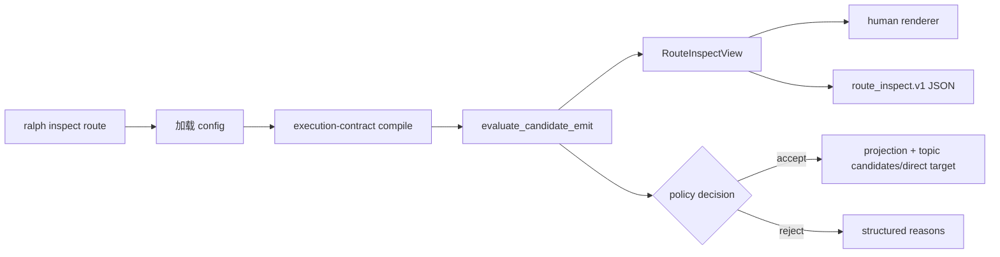

# 增加 inspect route 事件路由解释器 - Plan

## 0. 计划状态

- **状态：READY。** 所有进入实施的关键技术决策置信度均不低于 0.85；没有需要 Executor 临时拍板的产品或架构分叉。
- **代码基线：** 分支 `pittcat-dev`，HEAD `49018a9f`（2026-08-02，`fix: keep precheck proposals deduplicated after pass`）。此前 `crates/ralph-core/src/event_policy.rs` 的 precheck dedup 修改已包含在该提交中；当前工作区仅有本计划文件未跟踪，不存在需要保护的 core dirty diff。
- **调查范围：** `ralph` 顶层 CLI 注册、`commands/inspect.rs`、`evaluate_candidate_emit` 及其策略/拓扑调用链、事件 `triggered` 到 direct target 的转换、现有 inspect CLI 集成测试、测试环境清理 helper、AI skill guide、preset author/review 命令参考及相邻 Git 历史。
- **已执行的验证：** 已读取上述源码、测试、文档和相关提交历史；已确认现有 `inspect prompt --topic --payload` 的真实行为与 JSON 字段；已确认 `triggered` 在事件转换时成为 runtime direct target；已确认现有 CLI 集成测试使用 `common::ralph_bin()` 清理 agent runtime env。
- **尚未执行的验证：** 计划阶段不运行测试、构建或 lint；实施阶段必须按本计划的 Verification Contract 使用 nextest 入口、CLI help smoke、doc drift 和完整回归。
- **阻塞项：** 无。
- **研究能力说明：** 当前工具面没有独立 subagent 调度能力，因此按 skill 规定在主线程完成了仓库研究；本计划中的证据只来自当前代码、测试、文档和 Git 历史，不把本线程的多重推理视为独立佐证。

## Goal Capsule

- **目标：** 增加只读命令 `ralph inspect route`，让操作者在不写事件、不启动 loop 的前提下，确定性回答一个候选事件是否可由当前 hat 发布、经过哪个策略 gate、会投影什么状态、以及下游如何接收。
- **核心价值：** 将已经存在但隐藏在 `inspect prompt --topic` 下的 candidate emit 预演能力，提升为面向 preset 调试的独立入口；避免操作者手工拼接 `preset check`、`inspect prompt`、`hats graph` 和 runtime 行为。
- **权威顺序：** 现有配置解析与 execution-contract compile 边界 → `ralph_core::evaluate_candidate_emit` → route view → human/JSON renderer。不得在 CLI 重新实现 policy、schema 或订阅匹配规则。
- **执行配置：** 无新配置项、无 feature flag、无数据库、无迁移、无外部服务。
- **停止条件：** 如果实际 `evaluate_candidate_emit` 接口、`triggered` direct-target 语义或既有 JSON 行为与本计划冲突，停止当前 Unit，记录新 Evidence 并重新评估决策；不得在 Executor 内引入第二套路由算法。
- **尾部归属：** 实现、测试、文档同步和全量门禁由 `ce-work` 或人工 Executor 按 U1 → U2 → U3 串行完成。

## Product Contract

### Summary

操作者可以传入 preset、当前发布 hat、事件 topic 和 JSON payload，使用 `ralph inspect route` 获得稳定的人类报告或 JSON 报告。命令只解释候选事件，不执行 emit，不写事件文件，不创建 loop 状态。

### Problem Frame

当前 `ralph-core::evaluate_candidate_emit` 已经能预演 candidate emit，但 CLI 入口被放在 `ralph inspect prompt --topic --payload` 下，用户必须先知道 prompt inspect 才能发现它。现有输出也没有把 `triggered` 的 direct target 与无 target 时的 topic subscriber candidates 明确区分。

### Actors

- A1. preset 作者：调试 hat 的 publishes、required fields、policy gate 和下游拓扑。
- A2. loop 操作者：在运行或重发事件前确认候选事件的接受与路由含义。
- A3. 自动化调用方：消费版本化 JSON，判断 `policy_decision`、`reasons` 和 route mode。
- A4. 现有 `inspect prompt` 消费者：继续获得原有 `candidate_emit` 行为，不受新命令破坏。

### Requirements

- R1. CLI 必须新增 `ralph inspect route` 子命令，并要求 `--hat`、`--topic`、`--payload`；`--triggered` 可选；`--format human|json` 可选且默认沿用现有 inspect 输出格式。
- R2. route 命令必须沿用与 `inspect prompt` 相同的配置加载和 execution-contract compile 边界，再调用 `ralph_core::evaluate_candidate_emit`；不得复制 policy、required-fields、topic-format 或 subscriber 匹配逻辑。
- R3. JSON 必须提供稳定 schema `route_inspect.v1`，至少包含 `schema_version`、`hat_id`、`topic`、可选 `triggered`、`route_mode`、`policy_decision`、`reasons`、可选 `projection` 和 `next_hat_candidates`。
- R4. `route_mode=direct_target` 时，报告必须把已验证的 `--triggered` hat 作为唯一明确目标；`route_mode=topic_candidates` 时，报告必须保留现有 `NextHatCandidates` 三态，并明确这是一组候选而非当前 pending queue 下的最终调度选择。
- R5. policy 接受时必须输出下游候选和 projection（若现有 evaluator 产生）；policy 拒绝时必须输出结构化 gate、field、reason_code，并省略 projection 与下游候选中的误导性成功信息。
- R6. human 输出必须从同一个 route view 渲染，至少显示输入身份、policy decision、route mode、拒绝原因、projection 摘要和下游目标/候选；不得通过另一套逻辑重新计算结果。
- R7. 缺少必填 CLI 参数、非法 JSON、未知 hat、无效 `--triggered` 或配置/execution-contract 无法解析时，命令必须非零退出并将原因写入 stderr；这些属于“无法完成解释”。
- R8. 一个合法完成的 route 解释即使 `policy_decision=reject` 也退出 0；拒绝是报告数据，不是命令执行失败。这样脚本可以区分“候选事件被 gate 拒绝”和“inspect 自身无法运行”。
- R9. 命令必须只读：不得写 `.ralph/events.jsonl`、hat channel、diagnostics、task/memory 状态或输入 preset；被 `RALPH_CURRENT_HAT` 等 agent env 污染时，必须与普通 human CLI 一样工作。
- R10. 新命令的用户指南、preset author/review 命令参考和 CLI drift 检查必须同步；文档必须说明字段来源、topic candidates 与 direct target 的区别，以及失败停止条件。

### Key Flows

- F1. **topic candidates 成功解释**：给定无 `--triggered` 的合法 topic/payload，命令通过同源 evaluator，输出 `accept`、projection（若有）和 `verified|mixed|unverified` 候选集。
- F2. **direct target 成功解释**：给定合法 `--triggered <hat>`，命令验证目标存在，输出 `direct_target` 和该目标；不把 topic subscriber 集合冒充最终 direct target。
- F3. **policy 拒绝解释**：给定当前 hat 未发布的 topic 或缺 required field，命令输出 `reject` 和结构化 reasons，退出 0，不写任何状态。
- F4. **CLI/配置错误**：给定缺参数、非法 payload、未知 hat、未知 triggered hat 或 contract compile 失败，命令无 report 或不完整 report，stderr 非零退出。

### Acceptance Examples

- AE1：给定最小 preset 中 `worker` 发布 `work.done`，无 `--triggered` 且 payload 为合法 JSON，JSON 的 `schema_version` 为 `route_inspect.v1`、`policy_decision=accept`、`route_mode=topic_candidates`，并包含 candidate emit 的下游字段。
- AE2：给定 `--triggered worker` 且 worker 已注册，JSON 的 `route_mode=direct_target`、`triggered=worker`；报告不声称这是 pending queue 的最终调度结果。
- AE3：给定当前 hat 未发布 `work.other`，JSON 的 `policy_decision=reject`，包含 `gate=topic_publishes` 和 `reason_code=hat_does_not_publish_topic`，退出码为 0，且不包含 projection 成功结果。
- AE4：给定 schema 要求 `task_key` 但 payload 缺少该字段，JSON 包含 `gate=required_fields` 和 `reason_code=missing_required_field`，退出码为 0。
- AE5：给定未知 `--triggered missing-hat`，命令退出非零，stderr 包含 `triggered_not_in_topology` 或等价稳定错误信息，不创建 `.ralph/events.jsonl`。
- AE6：在污染的 agent runtime env 下执行 route，命令仍按显式 `--hat` 和当前 preset 解析，不读取或修改 agent 事件通道。
- AE7：human 和 JSON 对同一输入表达相同 `policy_decision`、route mode、reason code 和目标集合；human 只是格式不同。
- AE8：既有 `ralph inspect prompt --topic --payload` 的 JSON candidate emit 字段、退出状态和无副作用行为保持不变。

### Scope Boundaries

#### 本次范围

- 新增 `inspect route` CLI surface。
- 复用现有 candidate emit evaluator。
- 新增 route-specific JSON wrapper 和 human renderer。
- 明确 topic candidates、direct target、policy decision、reasons、projection 的外部语义。
- 新增 CLI integration coverage 和既有 inspect prompt regression coverage。
- 同步 `crates/ralph-core/data/*.md` 中相关命令指南及 preset operator 命令参考。

#### 非目标

- 不修改 `ralph_core::evaluate_candidate_emit` 的 policy 算法、gate 顺序或 `NextHatCandidates` 三态。
- 不把 route 命令变成真实 `emit`、replay、loop start、task mutation 或 recovery 操作。
- 不读取 events ledger、pending queue、supervisor DB、task store 或诊断 artifacts。
- 不承诺在无 `--triggered` 时预测 isolated/coordinator 的最终 hat 调度顺序；只报告 topic subscriber candidates。
- 不新增 `--state`、历史事件重放、LLM 根因分析、自动修复 preset、Web/TUI surface 或 MCP tool。
- 不改变 `ralph inspect prompt` 现有参数和 JSON schema。
- 不处理新的 preset 格式或新增配置字段。

### Compatibility, Performance, and Security

- **兼容性：** 复用现有 config loading、execution-contract compile 和 evaluator；原有 `inspect profiles|loop|prompt` 不改变。显式 direct target 只作为报告语义，不修改事件。
- **性能：** 复杂度由现有 evaluator 决定，route 命令不扫描 workspace、不读取 ledger、不启动 backend；单次执行应保持与 `inspect prompt` candidate preview 同量级。
- **安全：** payload 只作为内存中的 JSON 输入参与验证；JSON 输出不得回显完整 payload，避免把可能包含的 secret 扩散到日志。命令不执行 payload 中的内容，不跟随 payload 路径，不写入任何文件。

---

## 1. 代码库现状与证据

### 1.1 当前实现入口

当前 CLI 调用链为：

```text
ralph
  → main.rs::Commands::Inspect
  → commands::inspect::execute
  → InspectCommands::{Profiles, Loop, Prompt}
  → command-specific read-only loader/view/renderer
```

候选事件的现有调用链为：

```text
inspect prompt --topic --payload
  → preflight::load_config_for_preflight
  → execution_contract::compile
  → EventLoop::from_resolved_no_context / prompt preview
  → ralph_core::evaluate_candidate_emit
  → CandidateEmitPreview
  → JSON/human prompt renderer
```

`evaluate_candidate_emit` 已经执行 hat publish scope、topic format、triggered topology、event policy validation、projection preview 和 subscriber lookup。`compute_next_hat_candidates` 使用 `HatRegistry::subscribers`，结果类型固定为 `Verified`、`Unverified`、`Mixed`。

`ralph_proto::Event` 的 `triggered` 会在 `event_reader.rs::From<Event>` 中转换为 `with_target`；`EventLoop::determine_active_hat_ids` 对存在 direct target 的事件优先使用 target，再回退到 topic lookup。因此 route 命令必须把显式 target 与 topic candidates 分开表达。

### 1.2 Evidence Ledger

| Evidence ID | 来源 | 观察结果 | 对计划的影响 | 可靠性 |
|---|---|---|---|---|
| E1 | `crates/ralph-cli/src/main.rs::Commands` | 已注册 `Commands::Inspect(commands::inspect::InspectArgs)`，inspect 是现有只读命名空间。 | 新命令应挂在 `commands/inspect.rs`，不新增顶层命令。 | 高 |
| E2 | `crates/ralph-cli/src/commands/inspect.rs::InspectCommands` | 当前只有 `Profiles`、`Loop`、`Prompt`；每个子命令有独立 args。 | 新增 `Route` 子命令，沿用 inspect namespace 的只读语义。 | 高 |
| E3 | `crates/ralph-cli/src/commands/inspect.rs::inspect_prompt_command` | prompt inspect 先加载 config，再通过 execution-contract compile，随后构造只读 EventLoop。 | route 必须沿用同一配置/合同边界，避免 preview 与 runtime 漂移。 | 高 |
| E4 | `crates/ralph-core/src/event_policy.rs::evaluate_candidate_emit` | 已提供只读 candidate emit evaluation，返回 decision、reasons、projection、next_hat_candidates。 | 不新增第二套 route evaluator；route 只做输入适配和外部 view。 | 高 |
| E5 | `crates/ralph-core/src/event_policy.rs::CandidateEmitPreview` | `policy_decision` 为 accept/reject；reasons 具有 gate/field/reason_code；拒绝时 projection 和 candidates 为空。 | JSON route view 直接复用这些稳定语义，并保持拒绝不产生成功假象。 | 高 |
| E6 | `crates/ralph-core/src/event_policy.rs::NextHatCandidates` | 三态为 verified、unverified、mixed，且 verified 空集合表示可验证的无订阅者。 | route 不把空候选误报成错误；保留 kind discriminator。 | 高 |
| E7 | `crates/ralph-core/src/hat_registry.rs::HatRegistry::subscribers` | subscriber 查询按 topic 返回匹配 hats，BTreeMap 迭代提供稳定顺序。 | 无 direct target 时报告 candidates；不自行选择最终 hat。 | 高 |
| E8 | `crates/ralph-core/src/event_reader.rs::From<Event>` | `triggered` 被转换为 `ralph_proto::Event::with_target`。 | 显式 `--triggered` 必须在外部报告中标为 direct target。 | 高 |
| E9 | `crates/ralph-core/src/event_loop/mod.rs::determine_active_hat_ids` | 有 direct target 时优先 target，否则按 topic lookup。 | 需要 direct_target 与 topic_candidates 两种 route mode。 | 高 |
| E10 | `crates/ralph-cli/tests/inspect_prompt.rs` | 已有真实 binary integration tests，覆盖 JSON shape、candidate emit、help、tempdir、无副作用和污染 env。 | 新 route tests 应放同一测试风格，并使用 `common::ralph_bin()`。 | 高 |
| E11 | `crates/ralph-cli/tests/common/mod.rs` | `ralph_bin()` 会清理 `RALPH_CURRENT_HAT`、`RALPH_EVENTS_FILE`、`RALPH_HATS_SOURCE` 等 agent env。 | route 集成测试必须使用该 helper，避免 human CLI 被外层 hat env 污染。 | 高 |
| E12 | `crates/ralph-core/src/event_loop/tests/preview_api.rs` | 已覆盖 evaluate candidate 的合法 payload、缺 required field、未知 triggered、topic scope、projection 和 next-hat 三态。 | core evaluator 不需要重复实现；route 侧补 CLI contract 与 direct target presentation。 | 高 |
| E13 | `crates/ralph-core/data/ralph-tools-cmdref.md`、`ralph-tools.md` | 当前文档已记录 `inspect prompt --topic --payload` candidate emit 语义和失败停止条件。 | 新命令必须同步入口表、参数、字段来源和停止条件。 | 高 |
| E14 | `skills/ralph-preset-common/references/commands.md` | preset author/review 命令参考已有 candidate emit dry-run 命令。 | 应增加 route 作为更易发现的 operator 入口，并保留旧命令说明。 | 高 |
| E15 | Git 历史 `ddbe81b1`、`604bc5ec`、`4e12ce11`、`5ee6cfb3` | candidate emit 经历了只读 API 抽取、topic scope、三态 JSON 和 preview routing 对齐。 | 新功能必须复用这些已稳定的边界，不重新定义 candidate routing。 | 中高 |
| E16 | `git log -1 --oneline`、当前 `git status` | HEAD `49018a9f` 已提交 `crates/ralph-core/src/event_policy.rs` 的 precheck dedup 修改；当前没有该文件的未提交 diff。 | 将该提交视为实施基线；route 仍不得修改 evaluator 或其策略语义，若实施触及该文件必须重新调查调用关系和回归范围。 | 高 |

### 1.3 受影响范围

| 范围 | 已确认位置 | 影响 |
|---|---|---|
| CLI 生产代码 | `crates/ralph-cli/src/commands/inspect.rs` | 新增 route args、执行入口、view 和 renderer；可能抽取只读 config compile helper。 |
| CLI 注册 | `crates/ralph-cli/src/commands/mod.rs`、`crates/ralph-cli/src/main.rs` | 仅验证现有模块注册链；预计无需新增顶层注册。 |
| Core 生产代码 | `crates/ralph-core/src/event_policy.rs`、`src/lib.rs` | 复用现有 public API；默认不改生产逻辑。若实现暴露出缺失 direct-target 语义，必须停止，不得临时扩展。 |
| CLI 测试 | 新增 `crates/ralph-cli/tests/inspect_route.rs`；回归 `inspect_prompt.rs` | 覆盖真实 binary、JSON/human、错误和无副作用。 |
| Core 测试 | 已有 `event_loop/tests/preview_api.rs` | 作为 evaluator 行为基线，不应因 route 功能新增重复测试。 |
| 注入文档 | `crates/ralph-core/data/ralph-tools.md`、`ralph-tools-cmdref.md` | 新命令、参数、字段和停止条件。 |
| Operator 文档 | `skills/ralph-preset-common/references/commands.md` | preset 作者/reviewer 的推荐调用入口和 candidate/directed 语义。 |
| 配置/数据/外部服务 | 无 | 不新增配置、持久化、迁移或外部依赖。 |

---

## 2. 决策记录与置信度

| Decision ID | 决策问题 | 候选方案 | 最终选择 | 支持证据 | 排除其他方案的原因 | 置信度 |
|---|---|---|---|---|---|---|
| KTD1 | route 逻辑放在哪里？ | 新建 core route evaluator；CLI 自己检查；复用现有 evaluator 并增加 CLI view。 | 复用 `evaluate_candidate_emit`，route 只新增 CLI view/renderer。 | E4、E5、E12、E15 | 新 evaluator 会产生 policy 漂移；CLI 自己检查会绕过 runtime 同源逻辑。 | 0.96 |
| KTD2 | 新命令挂在哪个 namespace？ | 新顶层 `ralph route`；`ralph diagnose route`；`ralph inspect route`。 | `ralph inspect route`。 | E1、E2、E13、用户已确认方向 | 顶层命令破坏 inspect 的只读诊断语义；diagnose 是跑后报告，不适合候选事件 dry-run。 | 0.98 |
| KTD3 | `--triggered` 的输出语义是什么？ | 与 topic candidates 合并；忽略 direct target；单独报告 direct target。 | 单独报告 `route_mode=direct_target` 与 `triggered`；无 target 时为 `topic_candidates`。 | E8、E9 | 合并两者会把候选集合误报为实际 direct target；忽略 target 与 runtime dispatch 不一致。 | 0.94 |
| KTD4 | policy reject 的退出码是什么？ | reject 非零；只要解释完成就 0；增加 `--check` 决定。 | 解释成功但 `policy_decision=reject` 退出 0；输入/配置无法解释才非零。 | E5、E10、现有 inspect preview 是诊断输出 | 立即把诊断数据与 CLI 执行失败混同；`--check` 会扩大首版 surface。 | 0.88 |
| KTD5 | JSON 是否回显 payload？ | 回显完整 payload；仅回显摘要；不回显。 | 不回显完整 payload；输出显式 hat/topic/triggered 和 evaluator 结构化结果。 | E4 的现有输出不含 payload；安全约束；E10 的 JSON contract 模式 | 完整回显可能把业务 secret 写入 CI 日志；摘要会引入新字段规则且不影响 route 判断。 | 0.90 |
| KTD6 | 是否修改 `evaluate_candidate_emit` 以支持 route？ | 扩展 evaluator；新增 wrapper；直接序列化现有 preview。 | CLI wrapper 组合 route identity + 现有 preview；不改 evaluator。 | E4、E5、E12 | evaluator 已包含所有必需 gate；扩展 core 会扩大影响面且当前工作区该文件有用户 diff（E16）。 | 0.95 |
| KTD7 | 是否把 `inspect prompt --topic` 改成 route 的内部实现？ | 删除旧路径；让旧路径调用共享 route helper；保持旧路径原样。 | 抽取最小纯 view/loader helper时保持旧 JSON；旧路径继续执行原有 prompt preview，不改成 route 输出。 | E3、E10、E12 | 删除/改 schema 会破坏现有消费者；过度抽取会扩大 prompt inspect 回归范围。 | 0.87 |

KTD4、KTD5、KTD7 已通过直接源码和相邻测试获得 ≥0.85，不需要额外 planning spike。若实施发现旧 inspect prompt 的实际 reject exit semantics 与调查不符，必须以可执行测试为新证据重算 KTD4，而不是静默改计划。

---

## 3. BDD 行为规格

### Feature: 候选事件路由解释

  Background:

    Given 一个可读的 preset，且其中注册了 `worker` hat

  Scenario: 解释 topic-based candidate route

    Given `worker` 发布 `work.done`
    And payload 是合法 JSON
    And 未提供 `--triggered`
    When 操作者运行 `ralph inspect route --hat worker --topic work.done --payload '<json>' --format json`
    Then 命令返回 0
    And JSON 的 `schema_version` 是 `route_inspect.v1`
    And `route_mode` 是 `topic_candidates`
    And `policy_decision` 是 `accept`
    And 输出包含 evaluator 返回的 `next_hat_candidates`
    And workspace 没有新增事件或 loop 状态文件

  Scenario: 解释显式 direct target

    Given `worker` 和 `reviewer` 都已注册
    And `worker` 发布 `work.done`
    When 操作者传入 `--triggered reviewer`
    Then 命令返回 0
    And JSON 的 `route_mode` 是 `direct_target`
    And `triggered` 是 `reviewer`
    And 报告不把 topic subscriber 集合描述为最终 direct target

  Scenario: 报告 hat 未发布的 topic

    Given `worker` 未发布 `review.done`
    When 操作者用 `work.done` payload 运行 route
    Then 命令返回 0
    And `policy_decision` 是 `reject`
    And reasons 包含 `gate=topic_publishes`
    And reasons 包含 `reason_code=hat_does_not_publish_topic`
    And projection 不存在

  Scenario: 报告 required field 缺失

    Given `work.done` schema 要求 `task_key`
    When payload 缺少 `task_key`
    Then 命令返回 0
    And reasons 包含 `gate=required_fields`
    And reasons 包含 `reason_code=missing_required_field`
    And 不输出成功 projection

  Scenario: 拒绝未知 direct target

    Given preset 中没有 `missing-hat`
    When 操作者传入 `--triggered missing-hat`
    Then 命令返回非零
    And stderr 包含 `triggered_not_in_topology` 或同一稳定错误语义
    And 不创建 `.ralph/events.jsonl`

  Scenario: 拒绝非法输入而不是伪造报告

    Given `--payload` 不是合法 JSON
    When 操作者运行 route
    Then 命令返回非零
    And stderr 指明 `--payload`
    And stdout 不包含看似成功的 route report

  Scenario: agent env 污染不改变 human CLI 语义

    Given 进程带有 `RALPH_CURRENT_HAT`、`RALPH_EVENTS_FILE` 和 `RALPH_HATS_SOURCE`
    When 操作者显式传入 `--hat worker`
    Then route 仍按显式参数和 preset 解析
    And 不写入 agent channel 或 main events

  Scenario: 保持旧 candidate emit 入口

    Given 既有 `inspect prompt --topic --payload` 输入
    When 操作者运行旧命令
    Then 原有 `candidate_emit` JSON 字段仍存在
    And 原有 policy decision、reasons、projection、next_hat_candidates 语义不变
    And 旧命令无新增文件副作用

---

## 4. 验收与测试策略

| Scenario | 验收条件 | 测试入口 | 推荐测试层级 | 风险补充测试 | 是否需要 E2E |
|---|---|---|---|---|---|
| S1 topic candidates | JSON schema、accept、route mode、候选集、无状态文件 | 新增 `crates/ralph-cli/tests/inspect_route.rs` | CLI integration | 真实 binary + tempdir | 否 |
| S2 direct target | `triggered` 被验证并输出 direct mode，不误报 candidate set | `inspect_route.rs` | CLI integration | 与 `event_reader` direct target 语义对照 | 否 |
| S3 topic reject | reject reason exact gate/reason_code，exit 0，无 projection | `inspect_route.rs` + 现有 core evaluator tests | CLI integration + core characterization | 不削弱结构化断言 | 否 |
| S4 required field | 缺字段原因来自 evaluator，不由 CLI 自算 | `inspect_route.rs` | CLI integration | 使用真实 event policy schema | 否 |
| S5 unknown target | stderr、非零、无写盘 | `inspect_route.rs` | CLI integration | env polluted invocation | 否 |
| S6 invalid JSON | 参数错误、非零、无成功 JSON | `inspect_route.rs` | CLI parser/integration | 空值、标量 JSON、截断 JSON | 否 |
| S7 env pollution | `ralph_bin()` scrub 后另行显式污染环境仍结果一致 | `inspect_route.rs` | CLI integration | `RALPH_EVENTS_FILE` 指向不存在路径 | 否 |
| S8 old command | 旧 inspect prompt candidate tests 全通过 | `crates/ralph-cli/tests/inspect_prompt.rs` | Regression integration | JSON shape characterization | 否 |
| Human/JSON parity | 同一输入的 decision、mode、reason code、targets 一致 | `inspect_route.rs` | CLI integration | human 只比较语义字段，不锁定装饰文案 | 否 |

所有 CLI integration 测试必须使用 `common::ralph_bin()`；不得裸跑 `cargo test -p ralph-cli`。route 的 reject 是成功完成解释，因此测试应断言 process success + JSON policy reject；未知 hat/非法 JSON/contract load failure 才断言非零。

---

## 5. 需求—测试追踪矩阵

| Requirement ID | 需求 | Scenario | 验收测试 | 单元测试 | 集成/契约测试 | E2E | Evidence |
|---|---|---|---|---|---|---|---|
| R1 | 新增 route CLI 和参数 | S1、S5、S6 | route binary parser/integration | inspect args parser tests | `inspect_route.rs` | 否 | E1、E2、E10 |
| R2 | 使用同源 evaluator | S1、S3、S4 | accepted/rejected route fixture | existing evaluator tests | route output vs evaluator fields | 否 | E3、E4、E12 |
| R3 | route_inspect.v1 JSON | S1、S2 | schema keys and discriminator | view serialization test | JSON integration | 否 | E5、E10 |
| R4 | direct target 与 topic candidates 分离 | S1、S2 | route_mode/targets assertions | route view mapping test | direct target integration | 否 | E8、E9 |
| R5 | rejection/projection semantics | S3、S4 | reasons and projection absence | existing candidate tests | CLI integration | 否 | E5、E12 |
| R6 | human/JSON 同源渲染 | Human/JSON parity | semantic parity test | renderer view unit test | binary human + JSON | 否 | E10 |
| R7 | 输入/配置错误非零 | S5、S6 | stderr/exit/no report | args validation unit | integration error tests | 否 | E3、E10 |
| R8 | reject report exit 0 | S3、S4 | process status + policy decision | evaluator baseline | integration status test | 否 | E5、E10 |
| R9 | 只读与 env isolation | S1、S5、S7、S8 | no events/diagnostics/task side effects | no-write helper checks | tempdir polluted-env tests | 否 | E10、E11 |
| R10 | 文档与 drift 同步 | 文档验收 | command drift scan + help smoke | 不适用 | CLI help/doc scan | 否 | E13、E14 |

---

## 6. Planning Contract

### 6.1 高层技术设计



设计约束：`evaluate_candidate_emit` 是唯一 policy/routing evaluator；`RouteInspectView` 只增加输入身份和 route mode，不重新判断 topic、schema 或 subscriber。`triggered` 通过现有 `evaluate_candidate_emit` 校验注册性；成功时 view 将其标为 direct target，未提供时保留 evaluator 的 topic candidate 三态。

### 6.2 关键决策

- KTD1–KTD7 见上文，均达到 0.85 阈值。
- 新 JSON 不回显 payload；仅输出 topic、hat、triggered 和 evaluator 结果。
- `route_inspect.v1` 是新命令合同；不修改 `PromptPreview` 或既有 `candidate_emit` schema。
- 只读配置加载必须在 stdout 输出前完成并处理 tracing 污染，沿用现有 inspect prompt 的 suppression 方式或等价现有 helper；Executor 不得让 tracing 行混入 JSON。

### 6.3 已确认假设与待验证项

**已确认假设：** `triggered` 的 runtime 语义是 direct target；无 `triggered` 时 route 只能报告 topic subscriber candidates，不预测带 pending state 的最终调度。

**待验证项：** 实施时需确认抽取共享 config loader 是否能保持 `inspect prompt` 的现有 JSON stdout 清洁性。该项不阻塞计划，因为可以保守复用现有 prompt loader 结构而不改 core。

---

## 7. Implementation Units

### U1. 建立 route JSON 解释入口

**Goal：** 对合法 candidate emit 提供可被脚本消费的 `route_inspect.v1` JSON，并覆盖 topic candidates 与 direct target 两种 route mode。

**Requirements：** R1、R2、R3、R4、R5、R9；Scenarios S1、S2；Decisions KTD1、KTD2、KTD3、KTD6；Evidence E1–E9、E12。

**Dependencies：** 无。

**Files：**

- `crates/ralph-cli/src/commands/inspect.rs`：新增 `InspectCommands::Route`、route args、配置加载/合同 compile 调用、route view 和 JSON serialization；不得改变 `Prompt` 分支的现有字段和行为。
- `crates/ralph-cli/tests/inspect_route.rs`：新增真实 binary integration tests；该文件当前不存在，属于计划新增。

**Approach：**

1. 在 inspect namespace 中新增 `Route` 子命令，要求 `--hat`、`--topic`、`--payload`，复用现有 `InspectProfilesFormat` 的 human/json enum 约定，`--triggered` 为 optional。
2. 沿用 `inspect_prompt_command` 的 config load 与 execution-contract compile 边界，得到只读有效配置。
3. 调用 `ralph_core::evaluate_candidate_emit`，将返回的 `CandidateEmitPreview` 放入 route view；不得在 CLI 重算 gate 或 subscribers。
4. 未提供 `--triggered` 时设置 `route_mode=topic_candidates`；提供且 evaluator 接受时设置 `route_mode=direct_target` 并单独保留 `triggered`。
5. JSON 不包含完整 payload；输出稳定 `route_inspect.v1`、hat/topic/triggered/route_mode 和 evaluator 结果。

**Patterns to follow：** `inspect_prompt_command` 的只读 config 初始化和 tracing stdout 隔离；`emit_prompt_view` 的 human/JSON 同 view 渲染；`CandidateEmitPreview`/`NextHatCandidates` 的 serde contract；`inspect_prompt.rs` 的 `ralph_bin()` tempdir 测试模式。

**Test Scenarios：**

- S1：合法 topic candidates 产生 `route_inspect.v1`、`accept`、`topic_candidates` 和真实 `next_hat_candidates`。
- S2：已注册 `--triggered reviewer` 产生 `direct_target` 和 `triggered=reviewer`，不把 subscriber candidates 冒充 direct target。
- S1 side-effect assertion：命令后 tempdir 不存在 `.ralph/events.jsonl`、diagnostics 或其它 runtime ledger。

**Execution note：** 先写 CLI JSON integration test 使当前命令缺失而 Red，再添加最小 route view；不要先修改 core evaluator。

**Acceptance Red：** 首先运行 `inspect_route.rs` 的 S1；预期 clap 无 `route` 子命令而失败，或 command 返回 unknown subcommand。该 Red 证明测试通过真实 binary 到达了尚不存在的外部入口。编译器损坏、测试未执行、fixture 写失败不算有效 Red。

**Unit Red → Green → Refactor：**

1. S1 JSON happy path Red → 新增 Route args/dispatch/view → S1 Green。
2. S2 direct target Red → 加入 route mode/triggered 映射 → S2 Green。
3. side-effect assertion Red/Green → 保持 loader 为只读并确认无状态文件 → 在现有 renderer 保护下整理重复 view 代码。

**最小实现范围：** 只增加 route CLI 输入、view、JSON 输出和两种 route mode；不改 core policy、不改 event writer、不改 existing prompt schema。

**Integration Verification：** 使用真实 `ralph` binary、临时 preset、真实 `evaluate_candidate_emit` 和真实 serde JSON；只允许用 tempdir 作为 filesystem boundary，不 mock evaluator。

**Risk-driven tests：** Characterization/Regression 由 E12 和 U2/U3 覆盖；不需要新增 fuzz、并发或 fault injection，因为命令无持久化、网络和共享状态。

**Regression：** `inspect_prompt.rs` 全部测试、inspect parser unit tests、`ralph-cli` inspect binary subset；原因是修改共享 inspect enum/dispatch/loader 可能影响旧 prompt/profile/loop 分支。

**预期文件变更：**

| 位置 | 变更类型 | 变更原因 | Evidence |
|---|---|---|---|
| `crates/ralph-cli/src/commands/inspect.rs` | 修改现有生产文件 | 新增 Route command/view/renderer | E1–E5 |
| `crates/ralph-cli/tests/inspect_route.rs` | 新增测试 | 验收 JSON route 行为 | E10、E11 |

**完成标准：** S1/S2 通过；JSON schema、route mode、目标语义和无副作用断言通过；旧 inspect prompt 测试通过；没有因 route 需求改动 `crates/ralph-core/src/event_policy.rs`。

**停止条件：** `evaluate_candidate_emit` 不能表达现有 route 结果、显式 target 与 runtime 不一致、stdout 被 tracing 污染，或发现必须改动 evaluator 时停止并更新 Evidence/KTD。

### U2. 完成拒绝语义、人类输出与输入错误

**Goal：** 让 route 命令能可靠地区分“成功完成解释但候选被拒绝”和“命令无法完成解释”，并让 human 输出与 JSON 保持同源语义。

**Requirements：** R5、R6、R7、R8；Scenarios S3、S4、S5、S6、Human/JSON parity；Decisions KTD4、KTD5；Evidence E4、E5、E10、E12。

**Dependencies：** U1 必须通过。

**Files：**

- `crates/ralph-cli/src/commands/inspect.rs`：补充 route report 状态处理、人类 renderer、payload/arg/config error path；保持 U1 JSON 字段。
- `crates/ralph-cli/tests/inspect_route.rs`：增加 reject、missing field、unknown target、invalid JSON、human/JSON parity tests。

**Approach：**

1. 对 evaluator 返回的 `policy_decision=reject` 仍渲染完整 report 并返回 0；拒绝原因只来自 `CandidateEmitPreview.reasons`。
2. 对 clap 缺参、payload parse error、unknown hat、unknown triggered、config load/contract compile error 返回非零并写 stderr；不输出成功 report。
3. human renderer 消费与 JSON 同一 route view，显示 decision、route mode、reason gate/field/reason_code、projection 摘要和 targets；不锁定颜色或长文案。
4. 仅在 `--triggered` 已通过 evaluator 且 policy accept 时显示 direct target；拒绝的 unknown target 属于命令错误，不伪造 route view。

**Patterns to follow：** `inspect_prompt_command` 对 JSON 参数的 fail-loud 错误；`inspect_prompt.rs` 对 non-zero/stderr 的断言；`CandidateEmitPreview` 对 rejected event 不产生 projection/candidates 的既有 contract。

**Test Scenarios：**

- S3：当前 hat 未发布 topic 时 process success、JSON reject、topic_publishes gate、无 projection。
- S4：schema 缺 required field 时 process success、JSON reject、required_fields gate、无 projection。
- S5：unknown triggered 时 process failure、stderr 含稳定 topology 错误、无 events file。
- S6：非法 JSON、缺 `--payload`、缺 `--topic`、缺 `--hat` 各自非零且 stderr 指向具体参数。
- Human/JSON parity：同一合法输入与同一 reject 输入的 decision、mode、reason code、target 集合一致。
- 无 payload 回显：JSON 与 human 都不能出现完整输入 JSON 中专门设置的 secret value。

**Acceptance Red：** 先增加 S3/S4/S5 测试。S3/S4 在命令存在后若未正确渲染/状态处理应失败；S5 在未实现错误分支时可能返回 0 或错误 stdout。失败必须来自 route 行为，不得接受 clap 编译失败或 fixture 错误作为 Red。

**Unit Red → Green → Refactor：**

1. S3 reject report Red → 直接渲染 evaluator reasons 并保持 exit 0 → Green。
2. S4 missing field Red → 保持 evaluator reason 完整透传 → Green。
3. S5/S6 error boundary Red → 添加 fail-loud arg/config/payload handling → Green。
4. Human/JSON parity Red → human 消费 route view → Green。
5. 在断言稳定后重构 renderer 共用字段格式化，不能改 JSON schema 或原因字段。

**最小实现范围：** 只实现 route 命令错误分类和 human renderer；不新增 `--check`、不修改 emit exit semantics、不修改 evaluator reason code。

**Integration Verification：** 用真实 preset schema 触发 required field gate；用未知 target 和非法 JSON 验证 stderr/exit；用 stdout JSON parse 验证没有 tracing 污染和 payload secret。

**Risk-driven tests：** 输入解析是唯一不可信边界，覆盖空字符串、JSON scalar 和截断 JSON；不新增 property/fuzz，因 CLI parser 的边界已由有限参数和 serde JSON 处理，且首版没有文件/网络资源消耗路径。

**Regression：** U1 tests、`inspect_prompt.rs`、core `preview_api` evaluator tests；原因是 reject/renderer 共用类型可能误改 candidate emit 的原有序列化。

**预期文件变更：** 仅修改 `crates/ralph-cli/src/commands/inspect.rs` 与新增/扩展 `crates/ralph-cli/tests/inspect_route.rs`。

**完成标准：** S3–S6 和 parity 全部通过；reject 与 command error 的退出码边界明确；无 payload secret 回显；U1 回归通过。

**停止条件：** 无法同时满足 reject exit 0 与旧 inspect prompt 行为、human/JSON 需要两套路由判断、或错误路径产生任何 runtime 文件时停止。

### U3. 固化命令合同、文档同步与全量回归

**Goal：** 让新命令成为可发现、可审计、不会漂移的 preset 调试入口，并完成仓库要求的 CLI、skill guide、operator skill 和最终回归门禁。

**Requirements：** R9、R10；Scenarios S7、S8；Evidence E10–E14、E16。

**Dependencies：** U2 必须通过。

**Files：**

- `crates/ralph-cli/tests/inspect_route.rs`：污染 env、help 和 side-effect regression。
- `crates/ralph-cli/tests/inspect_prompt.rs`：只在回归需要时增加 route/旧行为边界断言；不得锁定无关 prompt 文案。
- `crates/ralph-core/data/ralph-tools.md`：共享命令入口/速查表中增加 route。
- `crates/ralph-core/data/ralph-tools-cmdref.md`：增加完整语法、JSON 字段来源、route mode、错误停止条件和 no-side-effect 约束。
- `skills/ralph-preset-common/references/commands.md`：增加 preset author/reviewer 推荐用法；保留 `inspect prompt --topic` 兼容说明。
- `skills/ralph-preset-common/references/author-checklist.md`：仅在现有 checklist 需要新增 route 证据项时修改；若命令参考已足够，不新增重复规则。
- `skills/ralph-preset-author/SKILL.md`、`skills/ralph-preset-review/SKILL.md`：仅在现有 workflow 对命令白名单/可见性造成事实缺口时同步；不得为了宣传新命令大段重写流程。

**Approach：**

1. 先运行 `ralph inspect route --help` 与既有 `inspect prompt --help`，以实际 clap 输出校正文档语法。
2. 文档按 agent 下一步可执行动作书写：触发条件、命令、字段来源、失败停止条件；不泄漏内部函数名、ledger 路径或一次性计划背景到注入 skill。
3. 用 `scripts/check-cli-doc-drift.sh` 检查 `crates/ralph-core/data/*.md` 的命令/参数引用；发现行号或参数漂移立即修正。
4. 在受影响 nextest 子集通过后，执行完整 `./scripts/run-tests.sh`；不使用裸 `cargo test -p ralph-cli`。
5. 实施前后都复核 E16 所对应的基线提交，确认 route 没有改动 evaluator 策略语义；不要把无关变更纳入新功能提交。

**Patterns to follow：** `ralph-tools-cmdref.md` 现有 `inspect prompt` 表项、`commands.md` candidate emit 段、`inspect_prompt.rs::inspect_prompt_help_lists_subcommand` 和 common env scrub helper。

**Test Scenarios：**

- S7：带 `RALPH_CURRENT_HAT`、`RALPH_EVENTS_FILE`、`RALPH_HATS_SOURCE` 污染运行 route，输出与 scrub 后一致且不写事件。
- S8：旧 `inspect prompt --topic --payload` 的 candidate JSON、help、未知 hat、tempdir 和无副作用测试全通过。
- 文档 contract：`ralph inspect route --help` 中出现所有计划参数，doc drift script 通过。

**Acceptance Red：** 在文档更新前运行 drift 检查，预期检测不到 route 入口或命令参考不完整；在 route help 测试中，旧二进制应不包含 `route`。所有 Red 必须来自命令合同缺失，不得把无关工作区状态当测试失败。

**Unit Red → Green → Refactor：**

1. S7 env pollution Red → 使用 `ralph_bin()` 和显式污染 overlay 添加验证 → Green。
2. S8 regression 先运行并确保旧 tests Green；如共享 helper 改动造成失败，先恢复旧语义再继续文档。
3. help/doc drift Red → 同步三类 operator/agent 文档 → Green。
4. 文档完成后做一次术语/参数最小化 refactor，删除重复而非复制完整 route 说明。

**最小实现范围：** 只同步 route 命令的使用、字段、停止条件和测试；不新增 preset YAML/schema、不改 builtin preset、不改 zsh completion。

**Integration Verification：** 跑 route 相关 CLI nextest、`scripts/check-cli-doc-drift.sh`、`ralph inspect route --help`、`ralph inspect prompt --help`，再跑 `./scripts/run-tests.sh`。

**Risk-driven tests：** 重点是 env contamination 和文档 drift；不需要并发/fault injection，因为 route 只读且没有持久状态。

**Regression：** 所有 inspect prompt integration tests、`ralph-cli` command parser/inspect tests、`ralph-core` preview API tests、workspace nextest、doctests 和 clippy/build。

**预期文件变更：** 上述文档和新增测试；不得修改 preset YAML、schema、manifest、`scripts/ralph-zsh-plugin.zsh` 或 `event_policy.rs`，因为本功能不改变 builtin preset topology。

**完成标准：** 文档与 help 一致；S7/S8 通过；doc drift 通过；全量脚本通过；没有新增 skip、弱化断言、临时文件或 plan residual。

**停止条件：** 发现 route 需要修改 preset topology、builtin manifest、zsh completion、core evaluator 或新的配置字段时停止并重新划定范围；不要顺手扩展。

---

## 8. Unit 串行依赖图

```text
U1 建立 route JSON 解释入口
  ↓
U2 完成拒绝语义、人类输出与输入错误
  ↓
U3 固化命令合同、文档同步与全量回归
```

- U2 使用 U1 已验证的 route view、同源 evaluator 调用和 JSON schema，因此不能先做，否则 reject/human 输出会围绕未确定的 view 漂移。
- U3 使用 U2 已验证的参数、退出码和字段名称，因此文档必须后置；否则文档会把未稳定的错误语义写成合同。
- 任一 Unit 未完成其测试、重构、集成和回归，不得进入下一 Unit。

---

## 9. Verification Contract

| 命令 | 时机 | 验证目的 | 预期结果 | 失败处理 |
|---|---|---|---|---|
| `cargo nextest run -p ralph-cli --bin ralph -- inspect` | U1/U2 每次行为切片后 | CLI inspect parser/unit subset | route 与既有 inspect 测试通过 | 不得进入下一 Red/Green 切片，先修当前行为 |
| `cargo nextest run -p ralph-cli --test inspect_route` | U1/U2/U3 | 新 route 真实 binary contract | S1–S7 通过 | 停止当前 Unit |
| `cargo nextest run -p ralph-cli --test inspect_prompt` | U1/U2/U3 | 旧 candidate emit/prompt regression | 现有测试全通过 | 视为共享 inspect 兼容回归失败 |
| `cargo nextest run -p ralph-core -- evaluate_candidate_emit` | U1/U2 | evaluator contract baseline | 现有 candidate emit tests 通过 | 不修改 evaluator 规避失败；调查共享变更 |
| `ralph inspect route --help` | U3 | 实际 clap 参数与 docs 对齐 | 显示 `--hat`、`--topic`、`--payload`、`--triggered`、`--format` | 修文档或 parser，不进入最终门禁 |
| `ralph inspect prompt --help` | U3 | 旧入口无回归 | help 正常 | 停止并调查 inspect dispatch |
| `scripts/check-cli-doc-drift.sh` | U3 | 注入 skill guide CLI drift | 退出 0 | 修正所有参数/命令漂移 |
| `./scripts/run-tests.sh` | 最终 | workspace nextest 两阶段 + doctest 全量门禁 | 全部通过 | 允许按项目 hard rule 走 `RALPH_BASELINE_SERIAL=1 ./scripts/run-tests.sh` 作为 flake 兜底；若仍失败不得宣称完成 |
| `cargo fmt --check` | 最终 | Rust formatting | 退出 0 | 修正格式后重跑受影响测试 |
| `cargo clippy` | 最终 | lint/type-level quality | 退出 0 | 修正新增 warning，不关闭 lint |
| `cargo build` | 最终 | workspace build | 退出 0 | 调查编译错误 |

命令名称和包目标均来自当前仓库 AGENTS/CLAUDE 规则与已确认目录；最终测试入口必须是 nextest 系列或 `./scripts/run-tests.sh`，禁止裸跑 `cargo test -p ralph-cli`。

---

## 10. Definition of Done

- R1–R10 全部有通过的 Scenario 和测试追踪。
- U1、U2、U3 按严格顺序完成，每个 Unit 均完成 Acceptance Red → Unit Red → Green → Refactor → Integration → Regression → Close。
- `ralph inspect route` 支持 human/JSON，JSON schema 为 `route_inspect.v1`，不回显完整 payload。
- topic candidates 与 direct target 语义明确且由真实 runtime 代码证据支撑。
- policy reject 报告返回 0；输入/配置无法解释返回非零；测试精确锁定这一边界。
- route 命令不写事件、diagnostics、task、memory、supervisor 或输入文件。
- `inspect prompt --topic --payload` 现有行为与测试保持通过。
- `ralph-tools*.md`、preset operator 命令参考和 help 没有 drift；只保留通用、计划无关的 agent 指南。
- `cargo nextest` 相关子集、`scripts/check-cli-doc-drift.sh`、`./scripts/run-tests.sh`、`cargo fmt --check`、`cargo clippy`、`cargo build` 全部通过。
- 无新增 skip/only、弱化断言、未解释 snapshot/golden、临时调试文件或 `.ralph/review/<plan-id>/residuals*` 等 plan residual。
- 实施 diff 不应包含 `crates/ralph-core/src/event_policy.rs` 的策略语义变更；`49018a9f` 作为既有基线提交保留，不将无关变更混入 route 提交。
- 每个 Unit 可独立提交，且 Evidence Ledger 已记录实现阶段发现的行为证据。

---

## 11. 风险与注意事项

| 风险 | 触发条件 | 检测方式 | 缓解措施 | 剩余风险 |
|---|---|---|---|---|
| route 与真实 dispatch 漂移 | evaluator 的 topic candidates 被误称为最终选择，或 direct target 被忽略 | 对照 E8/E9 和 route_mode integration assertions | 明确 `topic_candidates` 不是 pending-state final selection；显式 target 单独报告 | 不预测 queue/fair scheduling，属于首版非目标 |
| 旧 inspect prompt 回归 | 抽取共享 loader/view 改动 PromptPreview JSON 或 tracing 行为 | `inspect_prompt.rs` 全量 + JSON parse | 保持旧分支和字段；共享抽取只保留纯加载边界 | inspect.rs 共享文件改动仍有局部回归风险 |
| 基线 core 行为被误改 | Executor 为 route 顺手触及 `event_policy.rs` | U1 前后检查 `git diff -- crates/ralph-core/src/event_policy.rs`，并对照 `49018a9f` | route 只复用 evaluator；发现策略语义变化立即停止并重新评估 | 自动格式化或后续重构仍需人工检查 diff |
| payload secret 泄露 | renderer 直接打印 payload 或错误 message 携带 payload | 测试输入专门 secret，断言 stdout/stderr 不含 | route view 不存 payload；只透传结构化 reason 字段 | runtime evaluator message 的未来变化需继续审查 |
| 文档命令漂移 | 新参数未同步 data skill/operator refs | `ralph ... --help` + `scripts/check-cli-doc-drift.sh` | U3 以实际 help 校文档，最终门禁阻断 | 文档行号变化需后续维护 |
| 错误码语义被误改 | reject 被当成 process failure，或 invalid input 返回 0 | S3/S4/S5/S6 状态断言 | 将“解释失败”和“候选被拒绝”分开定义 | 用户可能期待 `--check` 式非零；首版明确不提供该模式 |

---

## 12. 最终计划自检

| 检查项 | 结果 | 证据或说明 |
|---|---|---|
| 这是实施计划而不是 Roadmap | 是 | 具名到 CLI module、core API、测试文件、输入输出和串行 Unit。 |
| Executor 是否仍需做关键设计决策 | 否 | KTD1–KTD7 已选择并均 ≥0.85。 |
| 所有文件和接口是否有代码库证据 | 是 | E1–E16；新增 `inspect_route.rs` 明确标为计划新增。 |
| 所有关键决策置信度是否 ≥0.85 | 是 | KTD 最低 0.87。 |
| 是否存在未处理的低置信度假设 | 否 | 仅保留实施时验证的共享 loader 清洁性，不阻塞且有保守 fallback。 |
| 每个 Unit 是否只有一个可观察行为 | 是 | U1 JSON route、U2 reject/error/human contract、U3 operator contract/regression。 |
| 每个 Unit 是否可以独立验证 | 是 | 每个 Unit 有 Red、测试入口、集成和回归边界。 |
| 每个 Unit 是否有真实 Red | 是 | 各 Unit 明确指出新 command/behavior 缺失时的真实失败。 |
| 每个 Unit 是否包含回归范围 | 是 | U1/U2/U3 均列出 inspect/core/全量相关回归。 |
| 是否存在未来 Unit 依赖 | 否 | 仅线性依赖 U1 → U2 → U3，后续能力不提前实现。 |
| 是否存在泛化任务描述 | 否 | 文件、符号、字段、退出码、断言和命令均具体。 |
| 所有 Scenario 是否可追踪到测试和 Unit | 是 | S1–S8 在测试策略、矩阵和 Unit 中均有映射。 |
| 所有关键决策是否有 Evidence | 是 | KTD 表逐项列出 E-ID。 |
| 计划是否可以严格串行执行 | 是 | Unit 串行依赖图和每个 Unit 的完成/停止条件已固定。 |

## Product Contract preservation

本计划来自本次会话的 `ce-brainstorm` 结论；产品方向保持不变：采用 `inspect route` 作为高 ROI 的单事件 dry-run 路由解释入口，首版不做万能诊断器。规划阶段仅把 `triggered` direct target、reject exit semantics、JSON schema 和文档同步变成实现合同，没有扩大产品范围。
