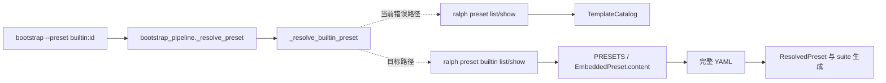
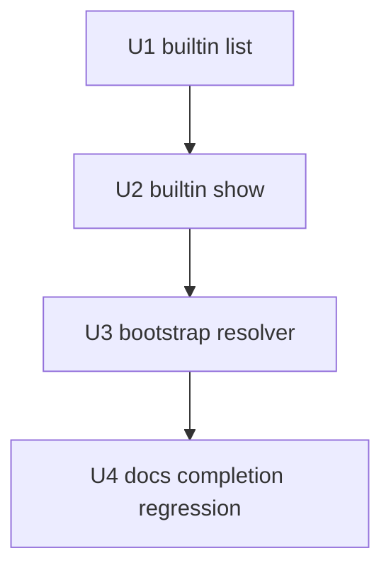

# feat: 为 builtin preset 增加只读 introspection 接口

## Goal Capsule

- **目标：** 为运行时 builtin preset 建立独立的只读 CLI 查询契约，并让 project bootstrap 使用完整 embedded YAML。
- **权威边界：** `EmbeddedPreset` 是 builtin 事实源；`TemplateCatalog` 继续是模板事实源；本计划不改变 preset 业务拓扑。
- **执行顺序：** U1 builtin list → U2 builtin show → U3 bootstrap resolver → U4 operator docs/completion/regression。
- **停止条件：** 真实 CLI contract、resolver typed blocker/no-write、skill parity 或最终全量门禁任一失败时停止，不用重装 binary 或保留错误模板 fallback。
- **交付形态：** implementation-ready code plan；每个 Unit 有验收 Red、最小实现、集成回归和独立完成标准。

## 0. 计划状态

- **状态：READY**。当前实施关键决策均有代码、测试结构或可复现报告证据支持，置信度均不低于 0.85。
- **代码库基线：** 分支 `pittcat-dev`，HEAD `3705a2e5`。
- **调查范围：** `ralph-cli` 的 preset/template 命令与 builtin 数据源、`ralph-project-bootstrap` 的 builtin resolver、Python/Rust 测试入口、zsh 补全、CLI/operator 文档、既有 preset 内嵌机制。
- **已执行的验证命令：** `git rev-parse --show-toplevel`、`rg`/`sed` 源码与测试调查、`git log --oneline --all -- ...` 历史调查。诊断报告中已有 `ralph run -H builtin:parallel-forge --dry-run`、`ralph init --list-presets` 和 binary 校验的运行证据，本计划将其作为运行事实来源。
- **本阶段未执行：** 未构建、未运行测试、未修改生产代码；这是计划阶段的有意边界。
- **研究限制：** 当前工具面没有独立 research subagent，本轮由主线程完成代码、测试、文档和历史调查，未将主线程多次阅读伪装成独立交叉验证。

---

## Product Contract

### 1. 功能目标

### 业务目标

让 operator skill 和其它机器消费者能够以稳定、只读、机器可解析的方式读取 Ralph 二进制中真正可运行的 builtin preset，避免把运行时 builtin 错当成 preset authoring template。

### 用户与调用方

- 直接调用方：使用 `ralph` CLI 查询 builtin preset 的 operator。
- 程序调用方：`skills/ralph-project-bootstrap/scripts/bootstrap_pipeline.py` 的 `_resolve_builtin_preset`。
- 间接受益方：使用 `builtin:parallel-forge`、`builtin:merge-batch`、`builtin:implementation-review` 等非模板 builtin 的项目 bootstrap 流程。

### 当前行为

- `ralph preset list/show` 查询 `TemplateCatalog`，当前模板名由 `TemplateCatalog::template_names()` 返回，仅包括 `minimal-linear`、`debug`、`ce-executor-lite`。
- 运行时 builtin 则来自 `crates/ralph-cli/src/presets.rs` 的 `PRESETS`，通过 `get_preset` 和 `EmbeddedPreset.content` 加载。
- bootstrap 收到 `builtin:<id>` 后调用模板接口，按 manifest 的 `source` 查找模板，再调用模板 `show`。因此 `builtin:parallel-forge` 找不到；`builtin:ce-executor-pipeline` 还可能错误拿到 `ce-executor-lite` 的模板内容。

### 目标行为

- `ralph preset builtin list --format json` 返回 public embedded builtin 的稳定 JSON 清单；每项至少包含 `id`、`source`、`description`、`public=true`。
- `ralph preset builtin show <id> --format yaml` 直接输出对应 `EmbeddedPreset.content` 的完整 YAML，不经过 `TemplateCatalog`，不修改文件或配置；show 允许读取 hidden builtin。
- `ralph-project-bootstrap` 对 `builtin:<id>` 只调用新 builtin 接口，按 builtin ID 查询并读取完整 YAML。
- 原有 `ralph preset list/show` 继续只表示模板接口，行为和输出语义不改变。

### 行为差异

输入 `builtin:parallel-forge` 时，bootstrap 从 `blocked / builtin_source_missing` 变为能够取得完整 preset YAML 并进入后续解析；输入普通模板名时，`ralph preset list/show` 仍保持原行为。

### 输入、输出与状态

- CLI list 输入：`builtin` 子命令、可选 `--format human|json`；输出 stdout，JSON 模式输出 `{"presets":[...]}`；不写磁盘。
- CLI show 输入：builtin ID、可选 `--format human|yaml|json`；YAML 模式 stdout 输出完整嵌入 YAML；未知 ID 返回非零退出码并将错误写入 stderr；不写磁盘。
- bootstrap 输入：`--preset builtin:<id>`；输出现有 `ResolvedPreset`，其中 `text` 是 builtin show 返回的完整 YAML。
- bootstrap 失败语义：保留现有 typed blocker 体系；列表失败、JSON 不可解析、builtin 不存在、show 失败、show 空 body 分别保持可区分的 `builtin_*` code。

### 兼容性要求

- 不改变 `TemplateCatalog`、`ralph preset list/show/new` 的数据源和既有模板命令含义。
- 不改变 `ralph run -H builtin:<id>` 的运行时解析路径。
- `get_preset` 仍支持 `public: false` 的 builtin；新 introspection show 必须能读取 hidden builtin。list 默认保持 public-only，遵守现有用户可见性约定；本次没有证据要求 bootstrap 发现 hidden ID。
- 新 JSON 是新增 CLI 契约，不兼容依赖旧模板 JSON 的调用方；bootstrap 将在同一变更中切换到新契约，不保留双路径运行时猜测。

### 性能、安全与约束

- 查询只读取编译进二进制的静态字符串，不能写入工作区、配置或 preset 文件。
- 不引入依赖、数据库、配置项、环境变量、网络请求或并发控制。
- CLI 错误遵循现有 `anyhow` 非零退出和 stderr 文本模式；bootstrap 负责把外部 CLI 失败归一化为 typed blocker。
- `ralph-project-bootstrap` 的 skill guardrail 仍禁止它修改 `presets/` 和 `crates/ralph-cli/`；本计划修改这些文件属于 orchestrator 代码变更，不是 skill 运行时行为。

### 本次范围

- 增加 `ralph preset builtin list/show`。
- 切换 bootstrap builtin resolver。
- 补 Rust CLI 单元/集成测试、Python resolver contract tests；复用现有 fake runner，不新增 fixture 目录。
- 更新 operator-facing skill、CLI reference、preset guide 和 zsh preset 子命令补全。

### 非目标

- 不把 builtin preset 合并进 `TemplateCatalog`。
- 不为 `ralph init --list-presets` 增加机器格式；该命令继续是人类可读的 builtin 列表。
- 不改变 preset YAML、schema、manifest、PRESETS 注册内容、运行时 hat 加载或 preset lint。
- 不把新 operator CLI 参数写入 `crates/ralph-core/data/ralph-tools*.md`；该接口不是 loop 内 agent 当前 activation 必需能力。
- 不实现远程 preset introspection，不提供写入/安装/升级 builtin 的命令。

### 已确认假设

- `EmbeddedPreset.content` 已经是 build.rs 合并后的完整运行时 YAML，直接输出它能满足 bootstrap 的 backend、prompt、预算和 provenance 需求。
- 公开与隐藏 builtin 都属于同一 `PRESETS` 数据源；list 只投影 `public=true`，show 通过已知 ID 读取 hidden。
- 现有 Rust `clap` 子命令嵌套和集成测试模式足以承载 `preset builtin`，不需要新增 crate 或 CLI framework。

### 待验证假设

- 执行阶段需确认 `PresetShowFormat::Human|Yaml|Json` 复用后生成的 help 文案满足 zsh 和 CLI reference 的预期；验证方法是新增的 CLI help 集成测试和最终 `ralph preset builtin --help` smoke。若不满足，只调整 formatter/help 文案，不改变协议字段。

---

## 2. 代码库现状与证据

### 2.1 当前实现入口

调用链如下：

- CLI 外部入口是 `crates/ralph-cli/src/main.rs` 的 `Commands::Preset`，转发到 `crates/ralph-cli/src/commands/preset.rs::execute`。
- 现有 `PresetCommands::List/Show` 在 `commands/preset.rs` 调用 `TemplateCatalog`。
- builtin 数据源是 `crates/ralph-cli/src/presets.rs` 的 `PRESETS`、`list_presets`、`get_preset`。
- 人类 builtin 列表是 `crates/ralph-cli/src/init.rs::format_preset_list`，没有 JSON 契约。
- bootstrap 解析入口是 `skills/ralph-project-bootstrap/scripts/bootstrap_pipeline.py::_resolve_builtin_preset`，当前调用模板 `list/show`。
- 现有 Python resolver 测试集中在 `skills/tests/test_project_bootstrap_pipeline.py`，使用注入的 fake runner 和 transcript，而不是启动真实 backend。
- 现有 CLI integration binary 获取方式是 `env!("CARGO_BIN_EXE_ralph")`，并通过 `tests/common/mod.rs::ralph_bin` scrub agent runtime env。
- zsh preset 补全在 `scripts/ralph-zsh-plugin.zsh` 的 `_RALPH_PRESET_CMDS`、`_ralph_preset_subcmd` 和 `_RALPH_PRESET_TEMPLATES`。

### 2.2 Evidence Ledger

| Evidence ID | 来源 | 观察结果 | 对计划的影响 | 可靠性 |
|---|---|---|---|---|
| E1 | `crates/ralph-cli/src/preset_templates.rs::TemplateCatalog::template_names` | 模板目录只返回 `minimal-linear`、`debug`、`ce-executor-lite` | `ralph preset list/show` 不能作为运行时 builtin 的事实源 | 高 |
| E2 | `crates/ralph-cli/src/presets.rs::PRESETS`, `get_preset`, `list_presets` | 运行时 builtin 独立存放在 `EmbeddedPreset`，包含 `parallel-forge` 等项目模板目录没有的项 | 新接口必须直接复用该数据源 | 高 |
| E3 | `crates/ralph-cli/src/commands/preset.rs::PresetCommands` 与 `list_templates/show_template` | 现有 preset 命令明确面向 workflow templates | 新接口应使用 `preset builtin` 命名空间，不能扩展旧 list/show 语义 | 高 |
| E4 | `crates/ralph-cli/src/init.rs::format_preset_list` | `init --list-presets` 只能输出人类文本 | 不复用 init 文本作为机器协议 | 高 |
| E5 | `skills/ralph-project-bootstrap/scripts/bootstrap_pipeline.py::_resolve_builtin_preset` | 当前按 `source` 查模板，再用模板名 show；没有 builtin 直读路径 | resolver 必须改为按 builtin ID 调用新接口 | 高 |
| E6 | `skills/tests/test_project_bootstrap_pipeline.py::_builtin_resolver_runner` 与 B3 测试 | 现有测试锁定旧的 `preset list` → `preset show <template>` argv | U3 必须重写 fake runner 和 characterization/contract 断言，避免测试继续保护错误协议 | 高 |
| E7 | `crates/ralph-cli/tests/common/mod.rs`, `integration_preset_materialize_artifacts.rs` | CLI 集成测试使用真实 binary、scrub runtime env，并验证 help/输出 | U1/U2 应加入真实 CLI contract tests；不能只测 formatter 内部 | 高 |
| E8 | `scripts/ralph-zsh-plugin.zsh` | preset 子命令和参数有手工补全；模板名单独维护 | 新增嵌套命令必须同步补全，但 builtin hat value 列表不因本功能变化 | 高 |
| E9 | `skills/README.md`, `skills/ralph-project-bootstrap/SKILL.md` | Python skill 使用 `skills/.venv/bin/python -m pytest`，skill 安装通过 `skills/install.py` 做源码/副本 parity | U3/U4 使用现有 Python 入口并保持 skill 副本同步 | 高 |
| E10 | `docs/solutions/tooling-decisions/ralph-preset-embedded-compilation-2026-05-26.md` | builtin 依赖编译期嵌入内容，不应假定源码目录在运行时存在 | show 必须输出 embedded content，不读取 `presets/` 文件 | 中高 |
| E11 | `docs/report/2026-08-05-ralph-project-bootstrap-builtin-preset-resolution-diagnosis.md` | 已运行证据显示 `parallel-forge` 能被同一 binary dry-run 加载，故障是接口误用 | 不安排 reinstall/编译修复；计划聚焦 CLI + skill 协同 | 中高 |
| E12 | `AGENTS.md` 的 hard rules 与 `crates/ralph-core/data/*.md` 作用域规则 | operator-only CLI 参数不得注入 agent-facing tools 文档；CLI/help/operator docs 应保持同步 | 不修改 `ralph-tools*.md`，改 `docs/guide` 与 skill 文档 | 高 |

### 2.3 受影响范围

- **生产模块：** `crates/ralph-cli/src/commands/preset.rs`；必要时只复用 `crates/ralph-cli/src/presets.rs` 现有公开函数，不修改 builtin 注册数据。
- **Skill 模块：** `skills/ralph-project-bootstrap/SKILL.md`、`scripts/bootstrap_pipeline.py`。
- **测试模块：** `crates/ralph-cli/src/commands/preset.rs` 现有单测、`crates/ralph-cli/tests/integration_preset_materialize_artifacts.rs` 作为相邻 CLI 测试模式、`skills/tests/test_project_bootstrap_pipeline.py`、`skills/tests/test_project_bootstrap_e2e.py`。
- **文档与补全：** `docs/guide/cli-reference.md`、`docs/guide/presets.md`、`scripts/ralph-zsh-plugin.zsh`。
- **安装副本：** 由 `skills/install.py` 复制 `skills/ralph-project-bootstrap`；不手工维护 `.claude/skills` 或 `.agents/skills` 副本。
- **不受影响：** `presets/manifest.yml`、`presets/index.json`、preset YAML/schema、运行时 `ralph-core`、数据库、外部服务。

---

## Planning Contract

### 3. 决策记录与置信度

| Decision ID | 决策问题 | 候选方案 | 最终选择 | 支持证据 | 排除其他方案的原因 | 置信度 |
|---|---|---|---|---|---|---|
| KTD1 | builtin 查询应放在哪个 CLI 入口？ | 改造 `preset list/show`；新增顶层命令；新增 `preset builtin` 嵌套命令 | `ralph preset builtin list/show` | E1、E3、E7 | 改造旧命令会混淆模板和运行时 builtin；顶层命令破坏现有 preset 命令聚合；嵌套命名直接表达数据源边界 | 0.97 |
| KTD2 | builtin 内容从哪里读取？ | 读取仓库 `presets/`；复用 TemplateCatalog；读取 `EmbeddedPreset.content` | 直接读取 `EmbeddedPreset` | E2、E10、E11 | binary-only 安装可能没有源码；TemplateCatalog 不是运行时事实源；EmbeddedPreset 已包含 build.rs 合并后的内容 | 0.98 |
| KTD3 | list JSON 的数据形状和键语义是什么？ | 裸数组；复用 TemplateManifest 字段；稳定 envelope `{presets:[...]}`，项含 `id/source/description/public` | 稳定 envelope；`id` 派生自 `EmbeddedPreset.name` 且是唯一查询键；`source` 严格派生为 `builtin:<id>`；list 项全部 `public=true` | E2、E3、E6 | 裸数组扩展字段和版本信息不清晰；TemplateManifest 会重新引入模板语义；`EmbeddedPreset` 没有原生 source 字段，不能把 source 当存储字段 | 0.97 |
| KTD4 | hidden builtin 是否出现在 builtin list/show？ | list/show 全部；list 仅 public、show 全部；两套命令 | list 仅 public、show 可查全部 ID | E2、E8、现有 `get_preset` | 现有补全和 `public` 约定明确 hidden 是内部 helper；本次没有 bootstrap 必须发现 hidden 的证据；show 仍需支持已知 hidden ID | 0.96 |
| KTD5 | CLI 错误如何建模？ | 新增专用错误码协议；沿用 anyhow 非零 + stderr；静默降级 | CLI 沿用非零 + stderr；bootstrap 保留 typed `builtin_*` blocker | E3、现有 `show_template` 错误模式、E5 | 新错误码未存在于 CLI 体系且会扩大公开契约；静默降级会隐藏 binary 能力问题；bootstrap 已有错误分类层 | 0.90 |
| KTD6 | bootstrap 是否保留旧模板 fallback 和旧 binary 兼容？ | 双路径兼容；仅新 builtin 路径；skill 自己解析 init/dry-run | 仅新 builtin 路径；新命令不支持时返回 `builtin_list_failed`，不回退模板；模板 file preset 路径不变 | E5、E6、E11、`cli_probe.py` 的 never-throws 约定 | 双路径会允许错误数据源再次返回模板 YAML；init/dry-run 没有完整 YAML；现有 capability probe 不表达 nested builtin 子命令，不在本计划扩展为版本门禁 | 0.91 |
| KTD7 | 是否更新 agent-facing `ralph-tools`？ | 增加命令章节；只更新 operator docs/skill；不写任何文档 | 只更新 `SKILL.md`、CLI/preset operator docs 和 zsh | E12、E9 | 命令是 loop 外 operator/skill 入口，不属于当前 activation 的 agent-facing 能力；完全不更新会造成 operator 文档漂移 | 0.96 |

没有低于 0.85 的实施决策，因此不设 BLOCKED 项。

---

### 4. BDD 行为规格

### Feature: 查询编译进 binary 的 builtin preset

  Background:
    Given Ralph binary 已包含 `EmbeddedPreset` builtin 集合
    And `TemplateCatalog` 仍只表示 workflow templates
    And 查询命令为只读命令

  Scenario S1: 列出 public builtin 的机器清单
    Given binary 包含 public builtin `parallel-forge` 和 hidden builtin `merge-loop`
    When operator 执行 `ralph preset builtin list --format json`
    Then 命令退出码为 0
    And stdout 是 JSON object，顶层有 `presets` 数组
    And 数组中存在 `id=parallel-forge`、`source=builtin:parallel-forge`、`public=true`
    And 数组中不存在 `id=merge-loop`
    And 命令不创建或修改任何文件

  Scenario S2: 输出 public builtin 人类清单
    Given binary 包含 `parallel-forge`
    When operator 执行 `ralph preset builtin list --format human`
    Then 命令退出码为 0
    And stdout 明确标识这是 builtin preset 清单
    And stdout 同时显示 builtin ID 和 public 状态

  Scenario S3: 显示 public builtin 的完整 YAML
    Given binary 包含 `parallel-forge`
    When operator 执行 `ralph preset builtin show parallel-forge --format yaml`
    Then 命令退出码为 0
    And stdout 与 `get_preset("parallel-forge").content` 字节一致
    And stdout 可被现有 YAML loader 解析
    And 输出包含 bootstrap 所需的 backend、event_loop prompt、迭代预算和运行时配置

  Scenario S4: 显示 hidden builtin 的完整 YAML
    Given binary 包含 `merge-loop` 且其 `public` 为 false
    When operator 执行 `ralph preset builtin show merge-loop --format yaml`
    Then 命令退出码为 0
    And stdout 返回完整 embedded YAML
    And `public=false` 不阻止内部查询

  Scenario S5: 未知 builtin 返回错误
    Given binary 不包含 `does-not-exist`
    When operator 执行 `ralph preset builtin show does-not-exist --format yaml`
    Then 命令退出码非零
    And stderr 指出 builtin ID 不存在
    And stdout 不输出 preset YAML

  Scenario S12: 旧 template list/show 仍只访问模板数据源
    Given `minimal-linear` 是现有 TemplateCatalog template
    When operator 执行 `ralph preset list` 或 `ralph preset show minimal-linear --format yaml`
    Then 命令继续返回原有 template 清单或 template YAML
    And 输出不因新增 `preset builtin` namespace 而改变

### Feature: bootstrap 使用运行时 builtin 数据源

  Scenario S6: bootstrap 成功解析非模板 builtin
    Given bootstrap 输入 `--preset builtin:parallel-forge`
    And fake runner 的 builtin list 返回 `parallel-forge`
    And fake runner 的 builtin show 返回完整 preset YAML
    When 执行 `run_pipeline`
    Then resolver 调用 `preset builtin list --format json`
    And resolver 调用 `preset builtin show parallel-forge --format yaml`
    And `ResolvedPreset.text` 等于 show 的完整 YAML
    And 后续 suite 生成使用该 YAML 的 backend、prompt 和预算

  Scenario S7: bootstrap 不再把 builtin 映射到 template
    Given builtin list 中存在 `ce-executor-pipeline`
    And `TemplateCatalog` 中存在同名来源映射或 `ce-executor-lite`
    When bootstrap 解析 `builtin:ce-executor-pipeline`
    Then show 参数仍是 builtin ID `ce-executor-pipeline`
    And resolver 不调用 `preset show ce-executor-lite`
    And `ResolvedPreset.text` 不包含 template placeholders

  Scenario S8: builtin list JSON 无法解析时阻断且不写文件
    Given builtin list 返回非 JSON stdout
    When bootstrap 解析 builtin
    Then结果为 `stage=preset_resolution`、`code=builtin_list_unparseable`
    And 不调用 show
    And不生成 suite、prompt 或文档文件

  Scenario S9: builtin show 失败时阻断且不写文件
    Given builtin list 命中目标 ID
    And builtin show 返回非零退出码
    When bootstrap 解析 builtin
    Then结果为 `stage=preset_resolution`、`code=builtin_show_failed`
    And不生成任何 owned artifact

  Scenario S10: builtin show 空 body 时阻断且不写文件
    Given builtin list 命中目标 ID
    And builtin show 返回空 stdout 且退出码为 0
    When bootstrap 解析 builtin
    Then结果为 `stage=preset_resolution`、`code=builtin_show_empty`
    And不生成任何 owned artifact

  Scenario S11: operator surfaces 描述 builtin 与 template 的边界
    Given CLI help、project-bootstrap skill 和 preset guide 已同步
    When operator 查看 `ralph preset builtin --help` 和相关 operator 文档
    Then能找到 `builtin list/show` 的命令形状
    And能看到 builtin ID 与 template name 是不同数据源
    And不会被引导使用旧 template list/show 解析 runtime builtin

---

### 5. 验收与测试策略

| Scenario | 验收条件 | 测试入口 | 推荐测试层级 | 风险补充测试 | 是否需要 E2E |
|---|---|---|---|---|---|
| builtin list JSON | 真实 binary 退出 0；JSON envelope、字段、public-only 过滤和派生 source 均正确；无文件副作用 | 新增 `crates/ralph-cli/tests/integration_preset_builtin.rs` | CLI 集成/契约测试 | JSON round-trip；字段缺失/重复 ID/mismatch source 断言 | 否，CLI integration 已覆盖外部契约 |
| builtin show YAML | 真实 binary 输出完整 embedded YAML，YAML 可解析；精确 content 比较在 crate 内单测完成 | 同上 + `crates/ralph-cli/src/commands/preset.rs` 单测 | CLI 集成 + 单元测试 | public 与 hidden 各一例；未知 ID stderr/exit code | 否 |
| bootstrap happy path | fake runner argv 精确匹配新接口；ResolvedPreset 使用完整 YAML | `skills/tests/test_project_bootstrap_pipeline.py` | Python contract/unit integration | placeholder regression、source mismatch | 否 |
| bootstrap failure paths | list/show 的失败、坏 JSON、空 body 均 typed blocker，且无写入 | 同上 | Python contract test | fault injection via fake runner | 否 |
| 旧模板接口兼容 | `ralph preset list/show` 仍返回 TemplateCatalog 内容和旧参数 | `crates/ralph-cli/src/commands/preset.rs` 现有测试 + CLI help | 回归/契约 | 不允许 builtin 子命令改变模板清单 | 否 |
| skill 文档/安装 parity | 源 skill 与安装副本 byte-identical；stage 2 命令说明与代码一致 | `skills/tests/test_project_bootstrap_pipeline.py::test_project_bootstrap_skill_copies_are_in_sync` 与 CLI doc drift | 安装 parity/static contract | `skills/install.py` custom target 安装 | 否 |
| zsh completion | `ralph preset builtin`、`list/show`、show 的 builtin ID 可补全 | zsh syntax/load smoke，已有脚本测试模式 | shell smoke | 不改 public builtin hat 值列表 | 否 |

测试不 Mock 的行为：Rust CLI list/show 必须读取真实 `PRESETS`；Python resolver 只 fake subprocess 边界，不 fake `_resolve_builtin_preset` 自身；不得通过固定返回值绕过 YAML 解析和 `ResolvedPreset` 字段推导。

---

### 6. 需求—测试追踪矩阵

| Requirement ID | 需求 | Scenario | 验收测试 | 单元测试 | 集成/契约测试 | E2E | Evidence |
|---|---|---|---|---|---|---|---|
| R1 | CLI 必须提供 builtin list JSON envelope | S1 | `builtin_list_json_contains_public_only` | formatter/metadata serialization | `integration_preset_builtin` | 否 | E2、E7 |
| R2 | CLI 必须按 builtin ID 输出完整 YAML | S3、S4 | `builtin_show_yaml_matches_embedded_content` | known/unknown lookup | `integration_preset_builtin` | 否 | E2、E10 |
| R3 | 旧 template list/show 语义保持不变 | S12 | `template_commands_remain_template_only` | 既有 `list_templates/show_template` 测试 | preset CLI help/list/show contract | 否 | E1、E3 |
| R4 | bootstrap 必须使用新 builtin 接口和完整 YAML | S6、S7 | `test_builtin_resolution_uses_builtin_id_and_show` | resolver JSON envelope/parser | `test_project_bootstrap_pipeline.py` | 否 | E5、E6 |
| R5 | resolver 失败必须 typed blocker 且 no-write | S8、S9、S10 | failure-path tests（含 list/show 非零） | parse/empty/error branches | pipeline contract | 否 | E5、E6 |
| R6 | operator 文档与补全必须反映新命令 | S11 | help/doc/completion smoke | operator docs static contract | `check-cli-doc-drift.sh`、skill parity | 否 | E8、E9、E12 |

---

## Implementation Units

### 7. 严格串行开发单元

### U1. 暴露 builtin list 机器清单

#### 1. Unit 目标

让 `ralph preset builtin list --format json` 从真实 `PRESETS` 返回稳定的 public builtin inventory，并保持 hidden builtin 只通过 show 按已知 ID 查询。

#### 2. 对应需求与 Scenario

- Requirements: R1、R3。
- Scenarios: S1、S2、S5、S12。
- Decisions: KTD1、KTD3、KTD4、KTD5。
- Evidence: E1、E2、E3、E7。

#### 3. 外部可观察结果

operator 能区分 `ralph preset builtin list` 与旧模板 `ralph preset list`，机器消费者能解析 `{presets:[...]}`，且不会把 `merge-loop` 当作 user-facing list 项。

#### 4. 当前行为基线

当前 `PresetCommands` 没有 `Builtin` 分支；`preset list --format json` 序列化 `TemplateManifest`，不会返回 `parallel-forge`。先用 CLI integration red 固定该差异，再实现新分支。

#### 5. 输入与输出

- 输入：`preset builtin list`，format 为 human 或 json。
- 输出：json 为稳定 envelope；human 为明确的 builtin inventory；字段来源是 `EmbeddedPreset`。
- 错误：当前没有外部依赖错误；formatter 序列化失败只能返回现有 `anyhow::Result`。
- 状态/副作用：无文件写入、无配置读取、无网络。
- 不变量：旧 `preset list` 的 template 名称集合不变。

#### 6. 修改位置

- `crates/ralph-cli/src/commands/preset.rs`：扩展 `PresetCommands` 的 clap 子命令并增加 builtin list 分派/formatter；不修改 `TemplateCatalog` 的 list 逻辑。
- `crates/ralph-cli/src/presets.rs`：明确复用现有 `list_presets()` 作为 public-only list 数据源；不改变 `PRESETS` 内容和 public filtering。show 使用既有 `get_preset()` 读取 hidden。
- 新增 `crates/ralph-cli/tests/integration_preset_builtin.rs`：真实 binary 契约测试，使用 `tests/common/mod.rs::ralph_bin`。
- `scripts/ralph-zsh-plugin.zsh`：增加 `builtin` preset 子命令及其 `list/show` 补全入口；不改 `_RALPH_BUILTIN_HAT_VALUES`。

#### 7. 可依赖能力

现有 clap `PresetCommands`、`PresetListFormat`、`list_presets`、真实 binary integration test harness。

#### 8. 禁止依赖的未来能力

不实现 YAML show、不改 bootstrap、不更新 skill 文档、不增加 CLI error enum；U1 只完成 list。

#### 9. 验收测试

- `builtin_list_json_contains_public_only`：运行真实 binary；断言 exit 0、JSON envelope、`parallel-forge` public、`merge-loop` 不出现、每项含四字段且 source 严格等于 `builtin:<id>`、工作区无新增文件。
- `builtin_list_human_names_source_and_visibility`：运行 human format；断言 builtin 名称和 public 状态可见。
- `template_list_remains_template_catalog`：运行旧 `preset list --format json`；断言仍只有 TemplateCatalog 模板，不出现 `parallel-forge`。

运行命令：`cargo nextest run -p ralph-cli --test integration_preset_builtin -- list`。

#### 10. Acceptance Red

先运行新增 `builtin_list_json_contains_public_only`。预期失败为 clap 不认识 `preset builtin` 或命令不存在；这证明测试打到了真实 CLI 入口。若失败是 binary 未编译、`CARGO_BIN_EXE_ralph` 缺失或 fixture 环境错误，不算有效 Red，必须先修测试环境。

#### 11. 单元测试拆分

- builtin metadata 投影：输入 public `EmbeddedPreset`，期望 `id=name`、`source=builtin:<id>`、description/public 映射正确。
- JSON envelope：输入 public 项，期望顶层只有稳定 `presets` 容器且字段可反序列化；hidden 不被 list 投影。
- public filtering isolation：确认旧 template list 仍使用 `TemplateCatalog`，不复用 builtin list。
- 不 Mock 的真实行为：集成测试必须从当前 binary 的 `PRESETS` 读取，不能固定写一份 parallel-forge JSON 冒充实现。

#### 12. Red → Green → Refactor 顺序

Acceptance Red：新增真实 CLI list 测试失败。

→ Unit Red：metadata projection 和 envelope 测试在新 helper/enum 不存在时失败。

→ Green：增加最小 `PresetCommands::Builtin` list 分支，复用 `list_presets()` 并将 `source` 从 name 派生。

→ Green：补 human/json formatter 与未知格式的现有 Result 传播。

→ Refactor：抽出仅供 builtin list 使用的 formatter，保持旧 `list_templates` 不变。

→ Integration：真实 binary 运行三条 CLI contract。

→ Regression：运行现有 preset command tests，确认 template 清单未变。

#### 13. 最小实现范围

必须实现 list nested command、稳定 JSON envelope、human 输出、所有 public builtin 可列出、source 派生、无写入；不实现 show、bootstrap 或错误码扩展。

#### 14. 集成验证

真实验证 clap 解析、`PresetCommands` 分派、`PRESETS` 内容投影和 stdout；不需要 fake。仅使用现有 binary test harness 的环境隔离。

#### 15. 风险驱动测试

采用 Characterization：旧 `preset list` 输出语义必须继续通过；采用 Contract Test：新 JSON 字段和 envelope 锁定；不需要并发、持久化或 E2E。

#### 16. 回归范围

直接回归 `crates/ralph-cli/src/commands/preset.rs` 测试和 `integration_preset_materialize_artifacts` 的 preset help；相邻回归 `preset_templates` 与 `presets.rs` builtin parse tests；构建目标为 `ralph-cli` binary。原因是新增 clap 分支和共享 preset 模块可能影响旧 command dispatch 与 help。

#### 17. 预期文件变更

| 位置 | 变更类型 | 变更原因 | Evidence |
|---|---|---|---|
| `crates/ralph-cli/src/commands/preset.rs` | 修改现有生产文件 | 增加 builtin list 子命令 | E3 |
| 无 | 不修改 `crates/ralph-cli/src/presets.rs` | 直接在现有命令模块投影 `list_presets()`/`get_preset()`，保持 builtin 数据源只读 | E2 |
| `crates/ralph-cli/tests/integration_preset_builtin.rs` | 新增测试 | 真实 CLI contract | E7 |
| 无 | 不修改补全 | builtin completion 统一在 U4 的 operator surface 单元中处理，避免 U1 与 U4 交叉提交 | E8 |

#### 18. 完成标准

S1/S2/S5/S12 通过；Rust unit/integration 通过；旧模板 list/show 行为未变；build、clippy、fmt 通过；无跳过/弱化断言；U1 可独立提交。

#### 19. 停止条件

若 `list_presets()` 的 public-only 结果与 CLI 目标不一致，停止并记录新 evidence；若新增子命令破坏旧 `PresetArgs` 解析，停止重新比较 flat vs nested 设计；若真实 CLI 测试没有执行 binary，停止，不接受 formatter-only Green。

#### 20. 风险与注意事项

- 风险：新增命令可能让 zsh 的 `preset <TAB>` 与 clap help 漂移。检测：U4 的 zsh smoke + CLI help；缓解：把补全更新集中在 U4，U1 只交付 list 行为。
- 风险：JSON 字段被误复用模板 `name` 语义。检测：契约测试断言 `id=name` 且 `source=builtin:<id>`；缓解：builtin schema 只使用 builtin 术语。
- 剩余风险：外部旧脚本不会自动知道新接口；这是新增能力，不改变旧接口，文档需明确迁移入口。

### U2. 按 builtin ID 输出完整 YAML

#### 1. Unit 目标

让 `ralph preset builtin show <id> --format yaml` 直接输出对应 `EmbeddedPreset.content`，包括 hidden builtin；未知 ID 以非零错误终止。

#### 2. 对应需求与 Scenario

- Requirements: R2、R3。
- Scenarios: S3、S4、S5。
- Decisions: KTD1、KTD2、KTD4、KTD5。
- Evidence: E2、E3、E7、E10。

#### 3. 外部可观察结果

bootstrap 或 operator 可用 builtin ID 获取运行时完整 YAML，内容不再是带 `{{...}}` 占位符的 template scaffold。

#### 4. 当前行为基线

当前 `preset show` 调用 `TemplateCatalog::get_manifest/raw_template`；`parallel-forge` 会被报告为 template not found，`ce-executor-lite` 则不是 runtime pipeline 内容。旧 template show 必须保持不变。

#### 5. 输入与输出

- 输入：`preset builtin show <id> --format yaml|human|json`。
- YAML 输出：精确输出 `EmbeddedPreset.content`。
- Human/JSON 输出：显示 builtin metadata；JSON 仍表示 builtin metadata，不输出 template manifest。
- 未知 ID：非零退出，stderr 包含明确 builtin ID，stdout 为空。
- 副作用：无写入。

#### 6. 修改位置

- `crates/ralph-cli/src/commands/preset.rs`：增加 builtin show 分派、id lookup、YAML/raw formatter；直接复用现有 `PresetShowFormat` 的 `human|yaml|json` 值集合，因为该枚举只表达输出格式，不携带 template 数据源语义。
- `crates/ralph-cli/tests/integration_preset_builtin.rs`：增加 public、hidden、unknown 三类真实 binary 测试。
- zsh 补全不在 U2 修改；U4 统一增加 `builtin list/show` 的 nested completion。hidden ID 不加入 `ralph run -H builtin:<TAB>` 的 public values；是否提供查询 ID 补全由 U4 按现有 public completion 数据源实现，hidden 仍可手工输入已知 ID。

#### 7. 可依赖能力

U1 的 `preset builtin` namespace、`get_preset`、`EmbeddedPreset.content`、现有 `PresetShowFormat` 和 binary harness。

#### 8. 禁止依赖的未来能力

不改 bootstrap resolver、不修改 Python fixture、不改变 `ralph run`、不添加远程或文件 preset show。

#### 9. 验收测试

- `builtin_show_yaml_matches_embedded_public`：真实 binary 运行 `parallel-forge` exit 0，stdout 非空且 YAML 可解析；`crates/ralph-cli/src/commands/preset.rs` crate 内单测直接将 formatter 输出与 `get_preset("parallel-forge").content` 做字节比较。
- `builtin_show_yaml_allows_hidden`：`merge-loop` exit 0，stdout 非空且可解析。
- `builtin_show_unknown_fails_without_stdout`：未知 ID exit 非零，stderr 含 ID，stdout 为空。
- `template_show_remains_template_show`：旧 `preset show minimal-linear --format yaml` 仍输出 template placeholder 内容。

运行命令：`cargo nextest run -p ralph-cli --test integration_preset_builtin -- show`。

#### 10. Acceptance Red

先运行 `builtin_show_yaml_matches_embedded_public`；预期因 `preset builtin show` 未注册而失败。正确 Red 必须来自真实 CLI 解析/dispatch 缺失，不接受只测试未存在的内部函数。

#### 11. 单元测试拆分

- ID lookup：已知 public/hidden 返回 `EmbeddedPreset`，未知返回 None/现有错误路径。
- raw YAML output：输入 preset content，期望 stdout 不做 YAML reserialization，保留原始字节。
- metadata human/json：不将 template manifest 字段混入 builtin 响应。
- failure output：unknown 不向 stdout 写空行之外的 YAML；stderr/exit 可被集成测试观察。

#### 12. Red → Green → Refactor 顺序

Acceptance Red：真实 `show` 测试失败。

→ Unit Red：lookup、raw output、unknown branch 测试失败。

→ Green：直接接入 `get_preset` 并输出 `content`。

→ Green：补 metadata format 和 unknown error。

→ Refactor：将 builtin list/show metadata 投影和 template formatter 保持物理分隔。

→ Integration：真实 binary 验证 content、hidden、unknown 和旧 template show。

→ Regression：现有 preset command 与 materialize help 测试。

#### 13. 最小实现范围

必须实现 builtin show 的 ID lookup、raw YAML、metadata format、unknown non-zero；不实现 bootstrap 迁移和新的 CLI error code。

#### 14. 集成验证

必须真实调用 binary 并比对内嵌 content；YAML parse 只作为内容可用性断言，不把 YAML 重新序列化作为输出实现。

#### 15. 风险驱动测试

采用 Differential/Characterization：旧 template show 与新 builtin show 分别指向各自数据源；采用边界测试覆盖 hidden/unknown；不需要 fault injection。

#### 16. 回归范围

回归 `commands/preset.rs` 既有 show/list/new/check 测试、`integration_preset_materialize_artifacts` help contract、`presets.rs` embedded parse/manifest parity tests。原因是 show 分派和共享 format enum 可能造成命令路由或输出格式回归。

#### 17. 预期文件变更

| 位置 | 变更类型 | 变更原因 | Evidence |
|---|---|---|---|
| `crates/ralph-cli/src/commands/preset.rs` | 修改现有生产文件 | 增加 builtin show | E2、E3 |
| `crates/ralph-cli/tests/integration_preset_builtin.rs` | 修改测试 | show contract 和 unknown failure | E7 |
| 无 | 不修改补全 | completion 集中在 U4，避免跨 Unit 修改 | E8 |

#### 18. 完成标准

S3/S4/S5 通过；content 精确来源于 `EmbeddedPreset`；未知 ID 非零且无 YAML；build、clippy、fmt 通过；U2 可独立提交并只依赖 U1。

#### 19. 停止条件

若 `EmbeddedPreset.content` 不是完整运行时 YAML，停止并重新检查 build.rs/manifest；若必须读取源码文件才能通过测试，停止并回到 KTD2；若旧 template show 输出改变，停止并隔离 formatter。

#### 20. 风险与注意事项

- 风险：YAML formatter 自动换行或 reserialize 导致 provenance 改变。检测：字节比较；缓解：直接写原始 content。
- 风险：hidden preset 误出现在用户 run 补全。检测：zsh run completion 断言；缓解：查询补全与 run public values 分离。

### U3. 迁移 project-bootstrap builtin resolver

#### 1. Unit 目标

让 `ralph-project-bootstrap` 对 `builtin:<id>` 使用新 CLI builtin list/show，并把完整 YAML 透传到现有 `ResolvedPreset`，同时保持 typed blocker 和 no-write 行为。

#### 2. 对应需求与 Scenario

- Requirements: R4、R5。
- Scenarios: S6、S7、S8、S9、S10。
- Decisions: KTD2、KTD5、KTD6。
- Evidence: E5、E6、E11。

#### 3. 外部可观察结果

运行 bootstrap `--preset builtin:parallel-forge` 不再在 preset_resolution 阶段因 template manifest 缺失而阻断；解析结果含真实 builtin YAML。错误输入仍在写文件前返回既有 blocker。

#### 4. 当前行为基线

当前 `_resolve_builtin_preset` 调用 `[binary,preset,list,--format,json]`，按 `source` 找 template name，再调用 `[binary,preset,show,template,--format,yaml]`；现有 B3 测试和 `_builtin_resolver_runner` 明确锁定这一错误契约。

#### 5. 输入与输出

- 输入：`builtin:<id>`、注入 runner。
- list argv：`[binary, "preset", "builtin", "list", "--format", "json"]`。
- show argv：`[binary, "preset", "builtin", "show", <id>, "--format", "yaml"]`。
- JSON：只接受新 envelope `{presets:[...]}`；不再接受模板裸数组/旧 envelope 作为 builtin 兼容路径，避免回到错误数据源。
- 成功：`ResolvedPreset.template_name` 保存 builtin ID 作为 provenance label，`text` 保存完整 YAML；其余 runtime fields 继续由现有 `_derive_runtime_fields` 推导。
- 失败：`builtin_list_failed`、`builtin_list_unparseable`、`builtin_source_missing`、`builtin_show_failed`、`builtin_show_empty`；所有失败在 generation 前返回且 files_created/files_updated 为空。

#### 6. 修改位置

- `skills/ralph-project-bootstrap/scripts/bootstrap_pipeline.py::_resolve_builtin_preset`：替换两个 argv 和新 envelope/id 查找；保留 typed error normalization、YAML loader、runtime field derivation。
- `skills/tests/test_project_bootstrap_pipeline.py`：更新 transcript、fake runner、旧 B3 测试为新协议；增加 malformed/empty/show failure/no-write tests，并增加 operator skill 文档契约断言所需的现有测试。
- `skills/tests/test_project_bootstrap_e2e.py`：更新已确认硬编码旧 `preset list/show` argv 的 fake runner/断言，使 E2E wiring 使用 builtin namespace；不扩展 live backend 场景。
- 不新增 CLI fixture 目录：现有 resolver 测试已经支持注入 fake runner，新增测试直接用 fake runner 返回新 JSON、坏 JSON、非零和空 body；若实际测试证明 fake runner 无法覆盖既有 pipeline transcript contract，必须在本 Unit 停止并补充与既有 loader 形状一致的 fixture。

#### 7. 可依赖能力

U1/U2 已验证的 CLI contract；现有 `ResolvedPreset`、`_derive_runtime_fields`、pipeline no-write gate、fake runner 注入能力。

#### 8. 禁止依赖的未来能力

不改 generation、static validation、smoke、handoff；不让 file preset 走 CLI；不保留模板 builtin fallback；不增加 binary install/upgrade。

#### 9. 验收测试

- `test_builtin_resolution_uses_builtin_id_and_show`：fake runner 只接受新 argv；`parallel-forge` 成功，`template_name`/backend/budget/prompt 正确。
- `test_builtin_resolution_does_not_use_template_alias`：list 中有 pipeline ID 时，show argv 必须是 pipeline ID，禁止 `ce-executor-lite`。
- `test_builtin_list_unparseable_blocks_before_show_or_write`：坏 JSON → typed blocker、show 次数 0、无 artifacts。
- `test_builtin_show_failed_blocks_before_write`：show 非零 → `builtin_show_failed`、无 artifacts。
- `test_builtin_show_empty_blocks_before_write`：show 空 body → `builtin_show_empty`、无 artifacts。
- `test_builtin_list_failed_blocks_without_template_fallback`：旧 binary/fake runner 对新 list argv 返回非零 → `builtin_list_failed`、不调用 template list/show、无 artifacts。
- `test_builtin_unknown_id_blocks_before_write`：list 无 ID → `builtin_source_missing`、无 show/写入。
- `test_file_preset_resolution_unchanged`：file preset 不调用 subprocess，保持旧路径。

运行命令：`skills/.venv/bin/python -m pytest skills/tests/test_project_bootstrap_pipeline.py -k 'builtin_resolution or builtin_list or builtin_show or file_preset_resolution'`。

#### 10. Acceptance Red

先将 fake runner 改为只接受新 `preset builtin` argv，再运行旧 resolver 测试；预期旧实现因 unexpected argv 失败。这是有效 Red，因为它证明测试捕获了调用链协议，而非只检查最终字段。若失败来自 fixture import 或 Python syntax，不算有效 Red。

#### 11. 单元测试拆分

- 新 envelope 解析：合法 `{presets:[...]}`、缺少 `presets`、非 list、非 JSON。
- ID lookup：只使用 list 项的 `id` 字段作为查询键；`source` 仅在 CLI contract 中校验为 `builtin:<id>`，resolver 不用 source 做第二次匹配；目标缺失 typed blocker。
- list/show failure mapping：list 非零、show 非零、空 body、有效 YAML。
- provenance：`ResolvedPreset.text` 直接等于 show stdout，不能被 template show 替换。
- no-write invariant：每个 resolution blocker 均断言 `files_created/files_updated=()` 且不存在 suite 文件。
- 不 Mock 的真实行为：不 mock `_derive_runtime_fields`，让完整 YAML 经过现有解析。

#### 12. Red → Green → Refactor 顺序

Acceptance Red：新 argv fake runner 拒绝旧 resolver。

→ Unit Red：新 envelope/id/error tests 失败。

→ Green：最小替换 list/show argv 和 envelope parser。

→ Green：增加 show failure/empty/no-write 分支。

→ Green：更新 ResolvedPreset provenance label 和成功字段断言。

→ Refactor：清理旧 template-specific resolver 注释、fixture helper 和测试命名，保留 file preset 代码。

→ Integration：跑 pipeline static-only fixture，确认 resolver 成功后四阶段仍按旧顺序执行。

→ Regression：跑 project-bootstrap pipeline、contract 与 e2e wiring tests。

#### 13. 最小实现范围

只切换 builtin resolver 数据源和测试契约；保留 blocker 名称、pipeline stage、写入原子性、file preset 行为和后续 validation。

#### 14. 集成验证

真实联合 Python resolver、`ResolvedPreset`、`pipeline_suite` 和静态 gate fixture；subprocess 边界可 fake，YAML parsing、field derivation、no-write 必须真实执行。

#### 15. 风险驱动测试

采用 Characterization：先锁旧 file preset/no-write 行为；采用 Contract Test：精确 argv 与 JSON envelope；采用 Fault Injection：list bad JSON、list nonzero、show nonzero、show empty；不需要并发/E2E。

#### 16. 回归范围

直接回归 `test_project_bootstrap_pipeline.py` 全文件和 `test_project_bootstrap_contract.py`；相邻回归 `test_project_bootstrap_e2e.py` 的 install/entry wiring；skill 安装 parity；不运行 live backend。原因是 resolver 位于所有 bootstrap stage 之前，错误会阻断或错误写入整个 pipeline。

#### 17. 预期文件变更

| 位置 | 变更类型 | 变更原因 | Evidence |
|---|---|---|---|
| `skills/ralph-project-bootstrap/scripts/bootstrap_pipeline.py` | 修改现有生产文件 | 切换 builtin 数据源 | E5 |
| `skills/tests/test_project_bootstrap_pipeline.py` | 修改测试 | 新 argv、envelope、失败/no-write 覆盖 | E6 |
| `skills/tests/test_project_bootstrap_e2e.py` | 修改测试 | 更新已确认的旧 list/show argv wiring | E6、代码检索结果 |
| 无 | 不新增 fixture | fake runner 已能隔离 subprocess 边界并覆盖 resolver 错误分支 | E6 |

#### 18. 完成标准

S6–S10 全通过；非模板 builtin 成功解析；template alias 不再调用；所有 resolution failure no-write；file preset regression 通过；Python skill tests、安装 parity、类型/语法检查通过；U3 可独立提交并依赖 U1/U2。

#### 19. 停止条件

若真实 CLI JSON 与计划 envelope 不一致，停止并回到 KTD3；若 bootstrap 需要模板兼容才能通过已有业务测试，停止并检查是否错误修改了 fixture；若 resolver 成功但 `ResolvedPreset` 仍拿到 placeholder，停止并检查 show raw content 和 provenance。

#### 20. 风险与注意事项

- 风险：旧测试 transcript 继续接受模板接口，导致错误实现假绿。检测：fake runner 对旧 argv 显式 `AssertionError`；缓解：先改 runner 再改 production。
- 风险：resolver 错误地把 `source` 当第二个匹配键，或把 hidden 当作 list 发现结果。检测：只断言 `id` lookup、CLI 层断言 `source=builtin:<id>` 且 list 无 `merge-loop`；缓解：list public-only、show known-ID-only。
- 剩余风险：旧安装 binary 不支持新命令会得到 `builtin_list_failed`；这是能力不足的真实 blocker，不自动 reinstall。

### U4. 同步 operator 文档、补全与全量回归契约

#### 1. Unit 目标

让 operator 能在 help、preset guide、project-bootstrap skill 和 zsh completion 中发现并正确使用 builtin introspection，同时证明新接口没有文档漂移或安装副本漂移。

#### 2. 对应需求与 Scenario

- Requirements: R6。
- Scenario: S11。
- Decisions: KTD1、KTD7。
- Evidence: E8、E9、E12。

#### 3. 外部可观察结果

`ralph preset --help`、`ralph preset builtin --help`、operator 文档和 `ralph preset <TAB>` 对新命令一致；`skills/install.py` 安装的 skill 副本包含更新后的 resolver 和 stage 2 说明。

#### 4. 当前行为基线

当前 zsh `_RALPH_PRESET_CMDS` 没有 `builtin`，CLI reference 只描述模板命令，SKILL.md 仍描述旧 `preset list/show` builtin 解析。`ralph-tools` 是 agent-facing 文档，本 Unit 明确不修改它。

#### 5. 输入与输出

- 输入：新 CLI help、operator 文档、zsh completion、skill source。
- 输出：文档说明模板与 builtin 的边界、正确命令、输出字段；zsh 能补全 `builtin list/show` 和查询 ID；安装 parity 保持 byte-identical。
- 错误：发现 help/doc drift 或副本不一致时测试失败，不允许只更新 baseline 掩盖漂移。
- 副作用：按仓库 hard rule，若修改 zsh completion，执行者需将脚本安装到当前用户的 oh-my-zsh plugin 路径并验证加载；该本地安装不作为 git 变更。

#### 6. 修改位置

- `skills/ralph-project-bootstrap/SKILL.md`：stage 2 改为 `ralph preset builtin list/show`，说明 builtin ID 与完整 YAML；保留模板接口边界。
- `docs/guide/cli-reference.md`：新增 `ralph preset builtin` 命令和参数/输出契约。
- `docs/guide/presets.md`：明确 Template 与 Runtime builtin 两套数据源及查询命令。
- `scripts/ralph-zsh-plugin.zsh`：增加 preset builtin nested completion；不改 public run hat 列表。查询 ID 补全只复用现有 public builtin 值，hidden 仍可手工输入已知 ID。
- 不修改 `crates/ralph-core/data/ralph-tools*.md`，不新增文档 drift baseline 例外。

#### 7. 可依赖能力

U1–U3 已验证的命令结构、JSON/YAML contract 和 resolver 文案。

#### 8. 禁止依赖的未来能力

不新增 operator workflow、不改 preset author/review skills、不改 manifest/index、不安装或发布 binary。

#### 9. 验收测试

- `preset_help_lists_builtin_namespace`：真实 help 含 builtin/list/show。
- `builtin_show_help_describes_id_and_formats`：help 明确 ID 和 yaml/human/json format。
- `project_bootstrap_skill_copies_are_in_sync`：现有 parity test 通过，安装副本与 source byte-identical。
- `operator_docs_describe_builtin_introspection`：在现有 Python skill 测试中读取 `SKILL.md`、`docs/guide/cli-reference.md`、`docs/guide/presets.md`，断言三处都描述 `preset builtin list/show`、ID 和 template/builtin 边界。
- `cli_doc_drift_has_no_new_builtin_findings`：执行 `scripts/check-cli-doc-drift.sh --strict`，只把它作为 agent-facing `crates/ralph-core/data` drift 检查；operator docs 由上一条静态契约单独验证。
- zsh load smoke：脚本可加载，`preset builtin list/show` 的 completion function 不报 syntax/function error。

运行命令：Rust CLI help 使用 `cargo nextest run -p ralph-cli --test integration_preset_builtin -- help`；Python operator/parity 使用 `skills/.venv/bin/python -m pytest skills/tests/test_project_bootstrap_pipeline.py -k 'copies_are_in_sync or operator_docs_describe_builtin_introspection'`；doc drift 使用 `scripts/check-cli-doc-drift.sh --strict`。

#### 10. Acceptance Red

先增加 help contract 断言并运行；预期因 `builtin` 未出现在 help 而失败。对 skill doc 使用静态 contract 断言时，Red 必须来自旧命令文字与新契约不一致，而不是文件路径或 import 错误。

#### 11. 单元测试拆分

- clap help contains nested command。
- skill stage 2 contains builtin list/show and no longer instructs template source lookup。
- docs contain template/builtin distinction, exact command forms and ID semantics。
- zsh parser/load sees nested command and ID completion function。
- install parity compares every source/copy byte。

#### 12. Red → Green → Refactor 顺序

Acceptance Red：help/doc/completion contract 失败。

→ Unit Red：逐项锁定 help、skill、docs、zsh、install parity 缺口。

→ Green：同步 operator 文档与 zsh completion。

→ Green：通过 `skills/install.py` 的 source-driven parity 验证。

→ Refactor：删除旧 stage 2 模板解析措辞和不再适用的说明，保持文档简洁。

→ Integration：运行 CLI help、doc drift、skill parity 和 zsh load smoke。

→ Regression：进入最终 CLI/Python 全量门禁。

#### 13. 最小实现范围

只同步公开 operator surfaces；不改 agent-facing tools、preset author/review 规则、运行时和数据。

#### 14. 集成验证

真实读取 CLI help 和 source skill；真实运行安装器到临时目录比较副本；zsh 只验证加载和命令补全定义，不启动交互 shell backend。

#### 15. 风险驱动测试

采用 CLI contract、operator-doc static contract 和 agent-facing drift 检测；不需要数据库、网络或并发测试；E2E wiring 只作为 U3 已确认调用方的回归。

#### 16. 回归范围

回归 `integration_preset_builtin`、`test_project_bootstrap_pipeline.py`、`test_project_bootstrap_contract.py`、`test_project_bootstrap_e2e.py` 的 install/wiring 相关测试、`scripts/check-cli-doc-drift.sh --strict`、`cargo fmt --check`、`cargo clippy`。原因是命令 help、skill 安装副本、文档和 shell completion 是公开接口消费者。

#### 17. 预期文件变更

| 位置 | 变更类型 | 变更原因 | Evidence |
|---|---|---|---|
| `skills/ralph-project-bootstrap/SKILL.md` | 修改文档 | 修正 stage 2 命令契约 | E5、E9 |
| `docs/guide/cli-reference.md` | 修改文档 | 记录公开 CLI | E3、E7 |
| `docs/guide/presets.md` | 修改文档 | 解释两套 preset 数据源 | E1、E2 |
| `scripts/ralph-zsh-plugin.zsh` | 修改补全 | 同步新增 nested command | E8 |
| `skills/tests/test_project_bootstrap_pipeline.py` | 修改测试 | 增加 operator docs contract，补足 `check-cli-doc-drift.sh` 不覆盖 docs/guide 的证据缺口 | E9、代码检索结果 |

#### 18. 完成标准

S11 通过；skill source/install parity 通过；CLI doc drift 无新 finding；zsh 加载 smoke 通过；`AGENTS.md`/`CLAUDE.md` 不需变更；U4 可独立提交并依赖 U1–U3。

#### 19. 停止条件

若 operator docs 与 CLI help 需要修改 agent-facing tools 才能通过，停止并重新检查 E12 scope；若 zsh completion 只能通过改变 public builtin values 才能工作，停止并保留 run/query 可见性边界；若 operator docs contract 需要依赖 `check-cli-doc-drift.sh` 才能证明，停止并保留两套检查；若安装 parity 失败，停止，不手工改安装副本。

#### 20. 风险与注意事项

- 风险：zsh 脚本是手工维护且没有完整运行时测试。检测：shell load/completion smoke；缓解：只添加局部 nested branch，保留现有 compadd 风格。
- 风险：CLI docs drift 脚本会把新 flags 误报为共享文档漂移。检测：先读 strict 输出；缓解：只在确有新、合理 drift 时更新对应 operator docs，不无条件扩大 baseline。

---

## 8. Unit 串行依赖图

- U2 使用 U1 已验证的 `preset builtin` namespace 和 builtin metadata shape；不能先做 show，否则 list/show 的命名和数据契约可能分叉。
- U3 使用 U1/U2 已验证的真实 CLI argv、JSON envelope 和 YAML content；不能先迁移 resolver，否则 fake runner 会继续保护错误接口。
- U4 使用 U1–U3 已稳定的外部命令和错误语义；不能先更新文档，否则文档可能描述尚未实现的契约。
- 每个 Unit 只实现自己的行为，不提前改后续 Unit 的文件或测试边界。

---

## Verification Contract

### 9. 执行命令清单

以下命令按 Unit 严格串行执行；任一当前命令失败都不得进入下一步。

| 时机 | 命令 | 目的 | 预期 | 失败处理 |
|---|---|---|---|---|
| U1 Red/Green | `cargo nextest run -p ralph-cli --test integration_preset_builtin -- list` | 验证 list 外部契约 | 新 list、旧 template list 通过 | 留在 U1，检查真实 binary/argv，不跳过 |
| U1 回归 | `cargo nextest run -p ralph-cli --bin ralph -- preset` | 回归 preset 命令单测 | 相关 preset tests 通过 | 留在 U1 |
| U2 Red/Green | `cargo nextest run -p ralph-cli --test integration_preset_builtin -- show` | 验证 raw YAML/hidden/unknown | show contract 通过 | 留在 U2 |
| U3 Python targeted | `skills/.venv/bin/python -m pytest skills/tests/test_project_bootstrap_pipeline.py -k 'builtin_resolution or builtin_list or builtin_show or file_preset_resolution'` | 验证 resolver 和 no-write | 新 argv、错误码、file regression 通过 | 留在 U3 |
| U3 Python related | `skills/.venv/bin/python -m pytest skills/tests/test_project_bootstrap_pipeline.py skills/tests/test_project_bootstrap_contract.py skills/tests/test_project_bootstrap_e2e.py` | 验证 pipeline、contract、install wiring | 全部通过 | 留在 U3 |
| U4 help/doc | `cargo nextest run -p ralph-cli --test integration_preset_builtin -- help` | 验证公开 help | builtin help 通过 | 留在 U4 |
| U4 parity | `skills/.venv/bin/python -m pytest skills/tests/test_project_bootstrap_pipeline.py -k copies_are_in_sync` | 验证 skill 安装源/副本一致 | 通过 | 留在 U4，不手改副本 |
| U4 drift | `scripts/check-cli-doc-drift.sh --strict` | 验证 CLI/agent docs 无新 drift | exit 0 | 留在 U4；不能随意更新 baseline |
| U4 format/lint | `cargo fmt --check`、`cargo clippy` | Rust format/lint | exit 0 | 留在 U4 |
| 最终 Rust | `./scripts/run-tests.sh` | workspace nextest + doctest 全量门禁 | exit 0 | 先修复真实失败；仅时序 flake 才按 AGENTS 规则使用 serial fallback |
| 最终 Python | `skills/.venv/bin/python -m pytest skills/tests -q` | skill 全量回归 | exit 0 | 修复后重跑，不跳过 |

注意：不得用裸 `cargo test -p ralph-cli`；所有 Rust 测试按仓库 hard rule 使用 `cargo nextest` 或 `./scripts/run-tests.sh`。不安排 live backend、网络请求或 E2E loop。

---

## Definition of Done

### 10. 最终质量门禁

- 所有 BDD scenario S1–S12 均有通过的自动化测试。
- R1–R6 均能在追踪矩阵中找到 Scenario、测试和 Evidence。
- `ralph preset builtin list/show` 的真实 binary contract 通过，旧 template list/show contract 仍通过。
- bootstrap 使用新 argv，完整 YAML 透传，所有 typed blocker/no-write 分支通过。
- `skills/` 全量 pytest、Rust `./scripts/run-tests.sh`、format、clippy、CLI doc drift 均通过。
- 没有新增 skip/only、弱化断言、无解释 snapshot/golden 更新或无关 preset/schema 修改。
- zsh script 已同步；若执行者修改了脚本，按仓库规则复制到当前用户 oh-my-zsh plugin 路径并验证加载。
- `AGENTS.md` 与 `CLAUDE.md` 不因本功能改变；`ralph-tools*.md` 不因本功能改变。
- 所有 KTD 置信度仍 ≥ 0.85，未出现 BLOCKED 决策，U1→U2→U3→U4 严格串行完成。

---

## 11. 最终计划自检

| 检查项 | 结果 | 证据或说明 |
|---|---|---|
| 这是实施计划而不是 Roadmap 吗 | 是 | 有真实入口、调用链、BDD、测试、Unit 边界和完成标准 |
| Executor 是否仍需做关键设计决策 | 否 | KTD1–KTD7 已固定命令、数据源、字段、错误和兼容边界 |
| 所有文件和接口是否有代码库证据 | 是 | E1–E12；新增文件明确标为新增测试/fixture |
| 所有关键决策置信度是否 ≥ 0.85 | 是 | KTD1–KTD7 为 0.90–0.98 |
| 是否存在未处理的低置信度假设 | 否 | 仅有执行阶段 help 文案验证，已给出方法和不改变协议的处理边界 |
| 每个 Unit 是否只有一个可观察行为 | 是 | U1 list、U2 show、U3 resolver、U4 operator surfaces/regression |
| 每个 Unit 是否可以独立验证 | 是 | 每个 Unit 有 Acceptance Red、测试入口、回归和完成标准 |
| 每个 Unit 是否有真实 Red | 是 | U1/U2 真实 CLI 缺命令，U3 fake runner 拒绝旧 argv，U4 help/doc contract 失败 |
| 每个 Unit 是否包含回归范围 | 是 | 每个 Unit 第 16 节明确直接/相邻/公开消费者回归 |
| 是否存在未来 Unit 依赖 | 否 | 依赖图只有已完成前置能力，不提前实现后续行为 |
| 是否存在泛化任务描述 | 否 | 文件、符号、输入、输出、断言和命令均已明确 |
| 所有 Scenario 是否可追踪到测试和 Unit | 是 | 第 5、6、7 节交叉映射 |
| 所有关键决策是否有 Evidence | 是 | 第 3 节每项引用 E-ID |
| 计划是否可以严格串行执行 | 是 | U1→U2→U3→U4，失败即停 |

Product Contract unchanged：本计划由用户已确认的“CLI + skill 协同修复”范围展开，没有改变产品目标或新增 preset 业务行为。
