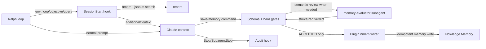

# Ralph 专用 Nowledge 插件生命周期与记忆编排

## Goal Capsule

把现有 `nowledge-mem-ralph` 从“只能手动 search/status 的只读插件”升级为真正服务 headless Ralph hat 的 Claude Code 插件：在一次 loop 的首个 Claude session 中执行一次有界 recall，在后续 hat、retry、supervisor worker 中复用同一份 loop context；任意 hat 都可以在 activation 尚未结束时调用统一的 `save-memory`，由插件用固定格式、证据和质量阈值判断是否保存。

本计划是插件侧的主计划。Nowledge 的 search、Memory 格式、质量评估、去重、保存和错误处理全部由插件拥有；Ralph loop 不新增 Memory 业务适配，只继续提供现有的 loop/hat/wave/attempt 环境信息。插件可以提供 `memory-evaluator` subagent 做语义评估，但保存权限不绑定普通 hat、终态 owner、finalizer、reporter 或 coordinator。

现有 `docs/achieved/plan/2026-08-07-010-feat-nowledge-ralph-plugin-plan.md` 保持为已完成的插件安装与只读能力计划，不原地改写。现有 `docs/achieved/plan/2026-08-07-011-feat-ralph-nowledge-runtime-adapter-plan.md` 中“Rust runtime 直接拥有全部 nmem 生命周期”的设计不作为本计划的实现依据；需要在后续 Ralph 适配实施前按本计划的 bridge contract 重写或替换。

## 0. 计划状态

- 状态：`READY`；本计划基于当前已落地的 010 插件、installer、设计文档和源码 prompt 调查。
- 基线：当前分支 `pittcat-dev`；插件基础版本为 `0.1.0`。
- 调查范围：当前插件与 installer、社区 Nowledge Claude Code 插件、社区 OMP 的 save/distill skill、Claude Code 官方 hook 输入输出、Ralph 的普通 prompt builder、wave worker prompt builder、Claude adapter 和 outer termination lifecycle。
- 已执行验证：只读源码与文档调查；未运行测试、未安装插件、未调用 nmem 写命令、未修改生产代码。
- 外部参考：Claude Code Hooks Reference 说明了 stdin JSON、`SessionStart` 的 `additionalContext` 和 hook 生命周期；社区仓库提供了 hook 后台队列、lease、重试、超时、skill handoff 和 distill 语义参考。
- 产品 Contract preservation：现有“人工会话保留通用插件、Ralph project scope 使用专用插件、不得保存 raw Claude transcript”的决策保持不变；本计划只补齐专用插件之前被排除的 loop-aware lifecycle 能力。

## 1. 问题与目标

### 1.1 当前缺口

- 现有插件的 `search-memory` 只是在 prompt 中告诉 agent 何时手动执行 `nmem --json m search`，不会在 Ralph 首次 activation 时自动 recall。
- 现有插件没有 loop identity、objective、hat、wave、retry 或终态上下文，因此无法区分“本轮共享的历史知识”和“每个 Claude child 的独立会话”。
- 现有插件没有 `save-memory` 入口，也没有判断何时保存、保存什么、什么信息值得长期复用的评估标准。
- Claude Code `SessionStart` / `Stop` / `SubagentStop` 是 child session 边界，不等价于 Ralph loop 终态；直接在 Stop hook 中 `nmem t save` 会重新引入 010 要消除的 raw transcript 噪声，也可能在 `LOOP_COMPLETE` 被 Ralph 拒绝前错误保存。
- Ralph 普通 isolated hat 使用 `EventLoop::build_prompt()`，但 supervisor wave worker 使用独立的 `build_wave_worker_prompt()`；只改普通 prompt 注入会漏掉 worker。

### 1.2 目标行为

```text
Ralph 启动并通过 hard gate
  → Ralph 提供 loop identity/objective/recall query
  → Claude SessionStart hook 执行一次 bounded memory search
  → hook 返回 <knowledge-context> additionalContext
  → 普通 hat / retry / wave worker 复用 loop cache，不重复 search
  → 任意 headless agent 在 activation 内调用统一的 save-memory 命令
  → 插件校验固定 Memory schema、硬门槛和质量指标
  → 必要时调用 memory-evaluator subagent 判断复用价值、稳定性、证据覆盖率和新颖性
  → ACCEPTED 立即由插件保存；REJECTED/NEEDS_REWRITE 返回可执行原因
  → Stop/SubagentStop 只做审计和未保存状态提示，不负责请求 agent 补交
  → Ralph loop 继续按自身 event policy 判断完成，不需要 finalize-loop
```

### 1.3 范围边界

**本计划包含：**

- 专用插件 manifest、hooks、脚本 runtime、commands、skills、插件状态目录和测试。
- loop-scoped recall、共享 cache、固定 Memory schema、质量评估、去重、保存和审计。
- `save-memory` command/skill、`memory-evaluator` subagent、Claude/headless 集成 fixture。
- 插件 README、`.ralph/specs` 稳定设计合同、版本与迁移说明。

**本计划不包含：**

- 修改社区仓库。
- 修改通用 `nowledge-mem@nowledge-community` 插件。
- 让插件读取或保存完整 Claude transcript。
- 把 nmem client、Memory policy 或 evaluator 逻辑搬入 Rust。
- 让每个 hat、每个 retry 或每个 wave worker独立创建 Thread。
- 让 Ralph 判断“是否应该保存 Memory”，或让某个特殊 hat 成为保存权限 owner。
- 让插件决定 Ralph 是否完成；终态仍由 Ralph event policy 和 outer runner 决定。
- 修改 preset 名称、增加 finalizer/coordinator 角色或依赖某个 hat 名称。
- 自动读取 Working Memory；recall 只查询 bounded Memory search。

### Deferred to Follow-Up Work

- 如果实际 Claude adapter 没有传递足够的 loop/hat/wave/attempt 环境信息，再另开最小 Ralph 环境变量适配；不得在 Ralph 中实现评估或保存逻辑。
- 用 MCP/API client 取代插件内部对 `nmem` CLI 的调用。
- 为非 Claude backend 提供等价的插件 lifecycle；本计划先覆盖 Ralph 使用 Claude adapter 的路径。
- 历史 raw Thread 的批量清洗、合并或重蒸馏。

## 2. Requirements

- `R1`：插件必须保留现有 namespaced `search`、`status` 能力，并新增 loop-aware lifecycle 能力；版本升至 `0.2.0`。
- `R2`：只有检测到 Ralph bridge env 且 `RALPH_NOWLEDGE_ENABLED=1` 时，自动 hook 才运行；普通人工 Claude session 没有这些 env 时，插件不自动搜索、不自动保存。
- `R3`：一次 loop 的 recall 以 `loop_id + query_digest` 为幂等键，最多执行一次 `m search`；startup/resume 可以触发，compact 只复用 cache，不重新搜索。
- `R4`：recall query 只能由 repo basename、preset/plan 标识和规范化 objective 组成；不得把 system/developer prompt、完整 agent transcript、所有事件 payload 拼入 query。
- `R5`：recall 结果必须解析为有界、不可信的 `<knowledge-context>`；对 memory id/title/content 做 XML 文本转义并按字符边界截断；空结果、nmem 缺失、非零、超时或非法 JSON 都 fail-open，原始 prompt 继续执行。
- `R6`：任意 headless hat 都可以在 activation 内调用统一的 `save-memory`；保存权限不绑定终态 owner、finalizer、reporter 或 coordinator。
- `R7`：Memory 必须使用固定 schema：`memory_type`、`title`、`claim`、`why_it_matters`、`evidence`、`applies_when`、`scope`、`verification`、质量指标、未验证假设、关键歧义和来源元数据。
- `R8`：硬门槛不通过时禁止保存：结论、证据、适用条件缺失；关键未验证假设或关键歧义存在；内容只是进度、日志、普通命令、原始输出或 transcript。
- `R9`：质量指标至少包括 `confidence`、`evidence_coverage`、`reusability`、`stability`、`scope_clarity`、`verifiability`、`novelty`；阈值不足时返回 `REJECTED` 或 `NEEDS_REWRITE`，不写入 nmem。
- `R10`：`save-memory` 必须先执行确定性 schema/安全/去重检查；需要语义判断时调用插件提供的 `memory-evaluator` subagent，subagent 只能返回结构化评估，不得绕过插件写入。
- `R11`：只有 `ACCEPTED` 的 Memory 才能调用 nmem write；插件记录评估结果、拒绝原因、重写建议和 idempotency digest，重复提交相同 digest 不重复保存。
- `R12`：高价值 Memory 包括架构决策及理由、可复用根因、稳定约束、验证规则、跨 loop 程序性经验；不保存进度、临时 workaround、普通命令和原始输出。
- `R13`：普通 hat、retry 和 supervisor wave worker 都能获得相同的 loop-level recall，也都能调用 `save-memory`；worker 不得因角色被静默禁止保存。
- `R14`：所有 hook、评估和保存 side effect 都必须 bounded、fail-open、可观测；失败不能阻止 Claude 继续，也不能改变 Ralph loop 的终态。
- `R15`：插件只复用 Ralph 已有的 loop/hat/wave/attempt/repo 环境信息；如果现有 headless adapter 已传递这些字段，则 Ralph 不新增 Memory bridge、finalize API 或保存逻辑。
- `R16`：Stop/SubagentStop 只做保存审计和状态提示；不能读取 transcript 猜测 Memory，也不能在 agent 停止后要求 agent 补交信息。

## 3. 现状与证据

### 3.1 Ralph prompt 机制

- `crates/ralph-core/src/event_loop/event_processing.rs::build_prompt` 是普通 hat 的 prompt 入口。
- isolated prompt 先生成 hat instructions、事件上下文、runtime/recovery/trigger blocks，再通过 `prepend_auto_inject_skills` 注入本地 memories、`ralph-tools-*` 和 registry auto-inject skills，最后附加 scratchpad、state files、ready tasks、correction/resume 等内容。
- `SkillInjector::plan_auto_inject` 同时服务 live prompt 和 `ralph inspect prompt` preview；任何 Ralph-facing adapter guide 都必须沿这个 parity 机制接入。
- `crates/ralph-core/src/event_loop/wave_prompt.rs::build_wave_worker_prompt` 是另一条 prompt 组装路径，不自动经过 EventLoop 的 skill injection。
- `crates/ralph-adapters/src/cli_backend.rs` 的 Claude headless backend 使用 `--setting-sources project,local`，最终 prompt 通过 stdin 传给 `claude --print`。
- `crates/ralph-adapters/src/cli_executor.rs` / `pty_executor.rs` 会传递 `RALPH_EVENTS_FILE`、`RALPH_WORKSPACE_ROOT` 等运行时环境；bridge 必须沿现有环境注入方式扩展，不能依赖 Claude user scope。
- `crates/ralph-cli/src/loop_runner/inner.rs` 在 event loop 接受终态后调用 termination hooks；该 outer chokepoint 才能区分“agent 输出了 completion token”和“Ralph 真正接受了终态”。

### 3.2 当前插件与社区参考

- 当前 `plugins/nowledge-mem-ralph/` 只有 manifest、Markdown commands、一个 search skill 和 contract tests，没有 hooks 或 executable runtime。
- 当前插件的无 raw capture 设计必须保留。
- 外部 `community` 仓库中的 `nowledge-mem-claude-code-plugin/` 提供了 `SessionStart` context injection、hook stdin JSON、`CLAUDE_PLUGIN_ROOT` / `CLAUDE_PLUGIN_DATA`、后台 queue/lease、bounded retry 和 transcript fingerprint 的实现参考。
- 社区 OMP 的 `save-thread` 与 `distill-memory` skills 提供了 handoff 章节、Thread 与 Memory 的语义区分、按 durable decision/root cause/procedure 选择 distill 的参考。
- 社区 Claude 通用插件的 `nmem t save --from claude-code` 不可直接复用，因为它保存完整 transcript，且 Stop/SessionEnd 不知道 Ralph loop 是否已接受终态。

### 3.3 外部 hook 合同

Claude Code 官方 hook 合同确认：command hook 从 stdin 接收 JSON；`SessionStart` 可以通过 stdout 或 `hookSpecificOutput.additionalContext` 把上下文放到首个 prompt 前；hook 输出有上限；Stop/SubagentStop 是 session/subagent 生命周期事件，不是外部 orchestrator 的终态事件。实现时必须把这些作为外部协议，而不是假设 hook 能修改 Ralph event ledger。

## 4. Key Technical Decisions

| KTD | 决策 | 选择 | 理由 |
|---|---|---|---|
| `KTD1` | 生命周期所有者 | 插件拥有 Nowledge search、评估、保存和审计；Ralph 不拥有 Memory 业务逻辑 | 所有 hat 都能保存，且不需要特殊终态角色；避免把业务逻辑复制到 Rust |
| `KTD2` | recall 入口 | `SessionStart` hook + loop cache | 官方 hook 可在首个 prompt 前注入 context；避免在每个 Ralph prompt 或每个 worker 中重复搜索 |
| `KTD3` | Stop 行为 | 只做审计和状态提示，不负责保存主路径 | headless agent 停止后不能补交信息；保存必须在 activation 内显式调用 |
| `KTD4` | 保存入口 | agent-facing `save-memory` command/skill；插件内部决定是否调用 nmem | 所有 hat 使用同一入口，避免依赖 owner 或 Ralph finalize |
| `KTD5` | 保存材料 | 固定 Memory schema + 证据 + 评估指标，不读 transcript | 明确定义可复用知识边界，避免原始会话污染 |
| `KTD6` | recall 共享 | loop cache 由 `loop_id + query_digest` 命名，wave worker只读 | 普通 hat 与 `build_wave_worker_prompt` 需要同一份知识，且 worker 数量不应放大 nmem 查询 |
| `KTD7` | 保存权限 | 任意 hat、retry、worker 都可调用，不按 hat 名称或终态角色限制 | builtin preset 的角色拓扑不统一；保存能力应是通用 agent capability |
| `KTD8` | 质量评估 | 确定性硬门槛 + 固定指标 + 可选 `memory-evaluator` subagent | 结构规则保证安全，subagent 补充复用价值、稳定性和新颖性判断 |
| `KTD9` | 写入幂等 | `memory_digest` + source metadata marker；相同 digest 不重复写 | 每个 hat 可独立保存，必须抵抗 retry、worker 和重复调用 |
| `KTD10` | Ralph 适配 | 复用现有环境信息；无新增 Memory bridge/finalize API | plugin hook/command 已足以完成生命周期，Ralph 只负责自身 loop |

## 5. High-Level Technical Design

### 5.1 组件关系



### 5.2 生命周期状态机

```text
DISABLED
  └─ no RALPH_NOWLEDGE_ENABLED → NOOP

ELIGIBLE_SESSION
  ├─ cache hit → RECALL_READY
  ├─ cache miss → SEARCHING → RECALL_READY | RECALL_FAILED_OPEN
  └─ compact/resume with existing cache → RECALL_READY

RECALL_READY
  ├─ agent does not call save-memory → NO_MEMORY_ACTION
  ├─ save-memory schema/security gate fails → REJECTED
  ├─ save-memory needs semantic review → EVALUATING
  ├─ evaluator below threshold → NEEDS_REWRITE | REJECTED
  ├─ evaluator passes → ACCEPTED
  ├─ accepted digest already exists → ALREADY_SAVED
  └─ accepted digest is new → MEMORY_SAVED

STOP_AUDIT
  ├─ no save-memory attempt → NOOP
  ├─ accepted/rejected result exists → AUDIT_RECORDED
  └─ agent stopped during evaluation/write → UNKNOWN_RETAINED
```

### 5.3 Ralph environment contract

插件侧只定义并验证合同，Ralph 适配计划负责接入：

| 方向 | 合同 |
|---|---|
| 环境 | `RALPH_NOWLEDGE_ENABLED=1`、`RALPH_NOWLEDGE_LOOP_ID`、`RALPH_NOWLEDGE_QUERY`、`RALPH_NOWLEDGE_REPO`、`RALPH_NOWLEDGE_PRESET`；值缺失或格式非法时插件 no-op/fail-open |
| session | `RALPH_NOWLEDGE_SESSION_ROLE=primary\|worker`、`RALPH_NOWLEDGE_HAT`、`RALPH_NOWLEDGE_WAVE`、`RALPH_NOWLEDGE_ATTEMPT`；角色只用于 source metadata，不限制保存 |
| shared state | loop cache、accepted/rejected/unknown records 由插件写入 `CLAUDE_PLUGIN_DATA` 或显式 state root，不写 Claude transcript |
| save-memory | headless agent 在 activation 内调用插件 command/skill，插件从现有环境读取 loop/hat/wave/attempt/repo 元数据；写入成功/失败只影响 warning，不改变 Ralph loop |
| prompt parity | 普通 `build_prompt` 和 `build_wave_worker_prompt` 都注入同一个 adapter guide或 recall reference；preview/live 的 adapter 内容必须一致 |

### 5.4 信任边界

- Memory 是历史证据，不是系统指令；recall block 使用明确标签和 XML 转义。
- agent-authored Memory 只作为待评估输入，插件校验固定 schema、大小、敏感字段、质量指标和来源后才进入 nmem write。
- hook stdin 的 `transcript_path`、`last_assistant_message` 只用于识别 session 和诊断；不得读取 transcript 文件，不得把最后回复自动当作 Thread 内容。
- agent 提交的 claim、evidence 和 verification 必须按不可信文本处理并限制长度；插件不接受任意路径读取 repo 外文件。
- `nmem` 命令通过 argv 传递，不经过 shell 拼接；写入调用只能出现在 `save-memory` 的 accepted 分支，不能出现在 search/SessionStart/Stop hook。

## 6. BDD 行为规格

```gherkin
Feature: Ralph loop recall
  Scenario S1: Ralph 首次 session 命中 recall
    Given SessionStart stdin 含 Ralph loop env，且 loop cache 不存在
    When hook 运行
    Then 恰好执行一次 bounded memory search
    And stdout/additionalContext 含有界且标记为历史证据的 knowledge context

  Scenario S2: 同一 loop 的后续 hat 复用 recall
    Given 同一 loop_id + query_digest 已有 cache
    When 第二个 Claude session 或 wave worker 启动
    Then 不再调用 nmem search
    And 返回相同 cache 内容或其有界引用

  Scenario S3: compact 不重复搜索
    Given loop cache 已存在
    When SessionStart source=compact
    Then hook 只读取 cache，不调用 nmem search

  Scenario S4: recall 失败 fail-open
    Given nmem 缺失、超时、非零或非法 JSON
    When SessionStart hook 运行
    Then Claude session 继续启动
    And 不返回伪造的 memory context
    And 状态日志记录可诊断错误
```

```gherkin
Feature: Memory evaluation and saving
  Scenario S5: 任意 hat 提交合法 Memory
    Given 任意 headless hat 在 activation 内产生了稳定、可复用结论
    When agent 调用 save-memory
    Then 插件校验固定 schema、来源和质量指标
    And accepted record 只写入一次 nmem

  Scenario S6: 高置信低证据不得保存
    Given candidate 的 confidence >= 90 且 evidence_coverage < 70
    When agent 调用 save-memory
    Then 返回 REJECTED 或 NEEDS_REWRITE
    And不调用 nmem write

  Scenario S7: 关键假设或歧义阻止确认保存
    Given candidate 存在 critical assumption 或 critical ambiguity
    When plugin policy 评估
    Then不作为 confirmed Memory 保存
    And返回缺失验证条件

  Scenario S8: evaluator subagent 返回结构化 verdict
    Given deterministic schema 和 hard gates 已通过但复用价值存在语义不确定性
    When plugin 调用 memory-evaluator
    Then只接受固定 JSON verdict
    And evaluator 不得直接执行 nmem write

  Scenario S9: 相同 digest 幂等
    Given相同 scope 和 memory_digest 已成功保存
    When任意 hat、retry 或 worker 再次调用 save-memory
    Then返回 ALREADY_SAVED
    And不重复调用 nmem

  Scenario S10: 保存失败 fail-open
    Given nmem 缺失、非零、非法 JSON 或 timeout
    When accepted Memory 进入 writer
    Then返回 FAILED_OPEN 或 UNKNOWN
    And Ralph/Claude 继续运行

  Scenario S11: 普通人工会话不自动保存
    Given Claude session 缺少 Ralph enabled env
    When hook 或 command 运行
    Then lifecycle hook no-op
    And现有手动 search/status 仍可用
```

```gherkin
Feature: Prompt and worker parity
  Scenario S12: 普通 isolated hat 获得 adapter context
    Given plugin enabled 且普通 hat 启动
    When Ralph 构建 prompt并启动 Claude
    Then agent 能看到 search/save-memory 的通用规则和本轮 recall context

  Scenario S13: supervisor worker 复用同一 loop context
    Given parallel-forge 或 ce-executor-supervisor 派发多个 worker
    When worker prompt 构建并启动
    Then每个 worker 获得同一 loop cache
    And worker 可以调用 save-memory，且复用相同 loop cache

  Scenario S14: plugin 未安装或 env 缺失
    Given普通人工 Claude session 或 Ralph 环境信息不完整
    When hooks 运行
    Then插件不自动执行 lifecycle search/save
    And现有手动 search/status 命令仍可用
```

## 7. Implementation Units

### U1. 生命周期 hook runtime 与插件 manifest

**Goal:** 将当前 Markdown-only 插件升级为受控的 Claude Code command hooks，建立 SessionStart recall、Stop staging 和 plugin state root 的基础能力。

**Requirements:** R1、R2、R5、R6、R12；KTD1–KTD4、KTD9。

**Dependencies:** 依赖 010 已完成的 manifest、commands、installer 和 contract test；无 Ralph Rust 代码依赖。

**Files:**

- `plugins/nowledge-mem-ralph/.claude-plugin/plugin.json`
- `plugins/nowledge-mem-ralph/hooks/hooks.json`
- `plugins/nowledge-mem-ralph/scripts/hook_runtime.py`
- `plugins/nowledge-mem-ralph/scripts/README.md`
- `plugins/nowledge-mem-ralph/tests/test_hook_runtime.py`
- `plugins/nowledge-mem-ralph/tests/test_plugin_contract.py`
- `.ralph/specs/nowledge-mem-ralph-plugin-design.md`

**Approach:**

1. Manifest 声明 `SessionStart`、`Stop`、必要时 `SubagentStop` hooks；不要注册 `SessionEnd` transcript capture，也不要把通用插件的 `nmem t save --from claude-code` 复制进来。
2. hook command 通过 stdin 读取 JSON，兼容官方字段命名；所有环境变量从 `CLAUDE_PLUGIN_ROOT`、`CLAUDE_PLUGIN_DATA` 和 Ralph bridge env 读取。
3. 缺失 Ralph env 时所有自动 hook no-op；普通人工 session 不因安装本插件而自动访问或写入 Nowledge。
4. hook runtime 统一处理超时、日志、原子文件写入、错误分类和 exit code；hook 不因 nmem 故障阻塞 Claude。
5. Stop/SubagentStop 只做 activation 结束后的审计分支；Memory 必须由仍在运行的 headless agent 通过 `save-memory` 提交。禁止在 hook runtime 中出现绕过 policy 的 nmem write，也不得从 transcript 反推 Memory。

**Patterns to follow:** 社区 `nmem-hook-save.py` 的 stdin payload 兼容、`CLAUDE_PLUGIN_DATA` 状态目录、queue/lease/timeout 设计；但拒绝其 raw transcript capture 和 Stop 直接保存语义。遵循当前插件的结构化 allow/deny contract tests。

**Test scenarios:**

- SessionStart 缺少 `RALPH_NOWLEDGE_ENABLED` 时不调用 nmem、不写 state。
- SessionStart 读取合法 bridge payload 时只输出结构化 additional context，不把 hook stderr混入 JSON stdout。
- agent 尚未结束 activation 时调用 save-memory，合法内容进入评估路径；不依赖 Stop hook 读取回复。
- Stop/SubagentStop 只记录 save-memory 的成功、拒绝或 unknown 状态；不能向已经停止的 agent 发起补交互。
- hook stdin 非法 JSON、字段类型错误、环境变量缺失时 fail-open。
- hook command 超时或 nmem 不存在时在 bounded 时间内退出并记录 warning。
- contract test 扫描 hooks/scripts，禁止 raw transcript save、Working Memory read 和绕过 policy 的 nmem write path。

**Verification:** `claude plugin validate --strict` 通过；fake hook payload 测试证明没有 Ralph env 时无副作用，所有 hook side effect 都有时间上限且不会修改 Ralph event 文件。

### U2. Loop-scoped recall、cache 与 additionalContext

**Goal:** 在首个 Ralph Claude session 中执行一次有界 search，并让普通 hat、retry、resume 和 wave worker共享同一份 recall。

**Requirements:** R2–R5、R13；KTD2、KTD4、KTD6。

**Dependencies:** U1。

**Files:**

- `plugins/nowledge-mem-ralph/scripts/recall.py`
- `plugins/nowledge-mem-ralph/scripts/hook_runtime.py`
- `plugins/nowledge-mem-ralph/skills/search-memory/SKILL.md`
- `plugins/nowledge-mem-ralph/commands/search.md`
- `plugins/nowledge-mem-ralph/tests/test_recall.py`
- `plugins/nowledge-mem-ralph/tests/fixtures/recall/*.json`
- `plugins/nowledge-mem-ralph/README.md`

**Approach:**

1. 规范化 query：repo basename、preset/plan 标识和 objective；删除空白、控制字符和超长输入，不拼接 transcript 或完整事件。
2. 用 `loop_id + query_digest` 生成 cache key；通过临时文件 + rename 原子落盘，避免并行 worker 读到半个 JSON。
3. cache miss 时只执行一次 `nmem --json m search <query> --limit <bounded-limit>`；同一 loop 的并发 SessionStart 使用 lock/lease，后到者等待 bounded 时间后读取 cache或 fail-open。
4. cache hit、`source=compact`、retry 和 wave worker 不重新 search；只读取已有 cache并重新按当前 prompt budget裁剪。
5. 输出明确标记为 historical evidence/untrusted context，对字段做 XML escape，并在 Unicode 字符边界截断。
6. 手动 `/nowledge-mem-ralph:search` 保留为 agent 在发现具体历史关联时的补充路径；不得把手动 command 和自动 loop recall混成每次 prompt必执行。

**Patterns to follow:** 社区 SessionStart read hook 的 context injection；Ralph 现有 prompt memory budget、`wave_prompt` 的不可信文本 bounded rendering；社区 hook 的 lease/duplicate guard。

**Test scenarios:**

- 首次 startup cache miss 执行一次 search，并将五条以内结果转换成稳定 context。
- 同一 loop 的两个并发启动只有一个 nmem 调用，另一个读取完整 cache。
- query digest变化时生成新 cache，不覆盖旧 loop cache。
- compact、retry、worker和resume路径命中 cache且 nmem 调用次数为零。
- memory id/title/content 含 XML 标签、换行、控制字符和 Unicode 边界时输出安全且不超预算。
- nmem 返回空 memories、非法 JSON、非零、超时或缺失时 hook 继续且不输出伪造 context。
- query 含 secret-like 文本或超长 objective 时只记录 digest/长度，不在日志输出原文。
- worker cache 不存在且 lease 获取失败时 fail-open，不自行执行第二次 search。

**Verification:** fake-nmem 调用日志证明每个 loop/query 组合最多一次 search；普通 prompt 和 wave worker fixture 均能消费相同 cache，且 recall failure 不改变 child 启动结果。

### U3. 固定 Memory schema、save-memory 与质量评估

**Goal:** 让任意 headless hat 都能用同一个 `save-memory` 入口提交结构化 Memory，由插件判断这条信息是否具有长期复用价值；不依赖终态 owner，也不从 transcript 猜测。

**Requirements:** R6–R12、R16；KTD3–KTD9。

**Dependencies:** U1、U2。

**Files:**

- `plugins/nowledge-mem-ralph/skills/save-memory/SKILL.md`
- `plugins/nowledge-mem-ralph/commands/save-memory.md`
- `plugins/nowledge-mem-ralph/agents/memory-evaluator.md`
- `plugins/nowledge-mem-ralph/scripts/memory.py`
- `plugins/nowledge-mem-ralph/scripts/memory_schema.py`
- `plugins/nowledge-mem-ralph/scripts/memory_policy.py`
- `plugins/nowledge-mem-ralph/scripts/memory_dedupe.py`
- `plugins/nowledge-mem-ralph/tests/test_memory.py`
- `plugins/nowledge-mem-ralph/tests/fixtures/memory/*`
- `.ralph/specs/nowledge-mem-ralph-plugin-design.md`

**Approach:**

1. skill 明确 headless agent 只有在发现稳定、可复用结论时才调用 `save-memory`；普通进度、日志、原始输出和临时 workaround 不调用。
2. 固定 schema 必须包含 `memory_type`、`title`、`claim`、`why_it_matters`、`evidence`、`applies_when`、`scope`、`verification`、七项质量指标、未验证假设、关键歧义和来源元数据。
3. `memory_schema.py` 做字段、类型、长度、敏感信息、路径和 Unicode 校验；缺少 claim/evidence/applies_when 时直接拒绝。
4. `memory_policy.py` 执行硬门槛：关键未验证假设或关键歧义不允许作为 confirmed Memory；内容类型属于 progress/log/command/transcript 时拒绝。
5. 质量指标固定为 `confidence`、`evidence_coverage`、`reusability`、`stability`、`scope_clarity`、`verifiability`、`novelty`。插件对阈值做确定性判断；语义不确定时调用 `memory-evaluator` subagent，要求只返回结构化 verdict，不得直接写 nmem。
6. 结果固定为 `ACCEPTED`、`REJECTED`、`NEEDS_REWRITE`、`OBSERVATION`；只有 `ACCEPTED` 进入 nmem write，其他结果返回缺失指标、失败原因和重写建议。
7. `memory_dedupe.py` 以规范化内容 digest、scope 和 source metadata 做幂等；同一 hat、retry 或 worker 重复调用不得重复保存，冲突 Memory 必须标记并返回复核建议。
8. Stop/SubagentStop 只记录调用结果和 unknown 状态；不读取 transcript，不在 agent 停止后发起补交互。

**Patterns to follow:** 社区 OMP `save-thread` 的 Goal/Decisions/Outcome/Risks/Next 手工 handoff 结构；社区 `distill-memory` 的 durable decision、procedure、root cause 和“routine work 不保存”判定；禁止照搬其直接 `m add`。

**Test scenarios:**

- 合法 Memory 通过固定 schema、硬门槛和质量阈值后进入 accepted staging，并调用一次 nmem write。
- 缺少 claim/evidence/applies_when、只有进度摘要、只有代码 diff 或疑似 transcript 时被拒绝。
- confidence 高但 evidence coverage 低时拒绝，不允许高置信幻觉进入 Memory。
- critical assumptions 或 critical ambiguities 不为空时返回 NEEDS_REWRITE/OBSERVATION，不作为 confirmed Memory 保存。
- evaluator subagent 返回非法 JSON、超时或与确定性规则冲突时 fail-closed 于本条保存，不阻塞 agent。
- 同一 digest 重复提交只返回 ALREADY_SAVED，不重复调用 nmem。
- 不同 hat、retry 和 worker 提交相同或冲突 Memory 时能去重、保留来源并生成冲突诊断。
- Stop/SubagentStop 只记录 save-memory 成功、拒绝或 unknown，不读取 transcript、不要求 agent 补交。

**Verification:** fixture matrix 能区分“可复用知识”“普通过程状态”“不可信/敏感内容”；contract scan 保证 save-memory 不读取 raw transcript，且只有 accepted 分支能出现 nmem write。

### U4. 插件 nmem writer、去重与失败语义

**Goal:** 让 `save-memory` 的 accepted 分支安全、幂等地写入 Nowledge，并把评估结果、来源和失败状态留在插件侧。

**Requirements:** R9–R14；KTD1、KTD4、KTD5、KTD7–KTD9。

**Dependencies:** U1、U3。

**Files:**

- `plugins/nowledge-mem-ralph/scripts/memory_writer.py`
- `plugins/nowledge-mem-ralph/scripts/nmem_client.py`
- `plugins/nowledge-mem-ralph/scripts/memory_result.py`
- `plugins/nowledge-mem-ralph/tests/test_memory_writer.py`
- `plugins/nowledge-mem-ralph/tests/fixtures/writer/*.json`
- `.ralph/specs/nowledge-mem-ralph-plugin-design.md`

**Approach:**

1. `memory_writer.py` 只接收 `memory_policy.py` 返回的 `ACCEPTED` record；脚本入口拒绝缺少评估结果、digest、scope 或 source metadata 的直接写入请求。
2. 规范化 title、claim、scope、evidence 和 verification，生成稳定 `memory_digest`；长度、Unicode 边界和敏感字段规则固定。
3. 写入前用 bounded read/search 检查相同 digest 和明显重复内容；相同 digest 返回 `ALREADY_SAVED`，不重复调用 nmem。
4. 新 Memory 通过 argv 调用 nmem；禁止 shell 拼接，禁止把 agent prompt、transcript 或 evaluator 内部上下文写入 nmem。
5. nmem 缺失、非零、非法 JSON 或 timeout 时返回 `FAILED_OPEN`/`UNKNOWN`，保留本地 accepted record 供后续显式重试，不阻塞 agent。
6. 写入结果固定为 `SAVED`、`ALREADY_SAVED`、`REJECTED`、`NEEDS_REWRITE`、`OBSERVATION`、`FAILED_OPEN`、`UNKNOWN`；每个结果都记录 source、digest、评估版本和原因。

**Patterns to follow:** 社区 Claude hook 的 subprocess timeout、lease、dedupe 和 nmem JSON 兼容处理；社区 distill skill 的 durable knowledge 选择标准；禁止照搬 raw transcript 保存。

**Test scenarios:**

- accepted Memory 通过 writer 后只执行一次 nmem write，并保留完整评估结果。
- REJECTED/NEEDS_REWRITE/OBSERVATION 不执行 confirmed Memory write。
- 已有相同 digest 时返回 ALREADY_SAVED，不重复写入。
- 相同内容由不同 hat、retry 或 worker 提交时能按 scope/digest 去重并保留来源。
- confidence 高但 evidence coverage 低、存在关键假设或关键歧义时不写入 confirmed Memory。
- evaluator 返回非法 JSON、超时或与硬门槛冲突时本条保存失败开放，但 agent 继续运行。
- nmem command missing、non-zero、timeout、非法 JSON时保留 accepted record，并返回 FAILED_OPEN/UNKNOWN。
- title、claim、evidence、verification含 Unicode、换行、引号和特殊字符时 argv不经 shell 拼接。

**Verification:** fake-nmem fixture 能精确断言命令次数、argv、顺序、digest和失败状态；重复提交同一 Memory 的结果与第一次写入后的状态一致。

### U5. 插件 subagent、hook 审计与 Ralph 环境复用

**Goal:** 让插件可以提供 `memory-evaluator` subagent 和保存审计 hook，同时验证不需要新增 Ralph Memory bridge。

**Requirements:** R10、R13–R16；KTD1、KTD3、KTD7、KTD8、KTD10。

**Dependencies:** U1、U3、U4。

**Files:**

- `plugins/nowledge-mem-ralph/agents/memory-evaluator.md`
- `plugins/nowledge-mem-ralph/hooks/hooks.json`
- `plugins/nowledge-mem-ralph/scripts/audit_hook.py`
- `plugins/nowledge-mem-ralph/tests/test_memory_evaluator.py`
- `plugins/nowledge-mem-ralph/tests/test_audit_hook.py`
- `plugins/nowledge-mem-ralph/README.md`
- `.ralph/specs/nowledge-mem-ralph-plugin-design.md`

**Approach:**

1. plugin `agents/memory-evaluator.md` 只负责审查 Memory candidate，输出固定 JSON verdict；不直接执行 nmem write，不读取完整 transcript。
2. evaluator 评估未来复用价值、稳定性、范围清晰度、证据覆盖率、新颖性和可验证性；确定性硬门槛仍由 Python policy 执行，subagent 不能降低硬门槛。
3. command hooks 负责 SessionStart recall 和 Stop/SubagentStop 审计；不使用实验性的 agent-based hook 作为唯一保存路径。官方文档将 agent-based hooks 标为 experimental，生产路径优先 command hooks。
4. installer 继续沿用 010 的 scope-aware desired-state 迁移；不再生成 finalize bridge，也不新增 Ralph adapter 调用。
5. 集成测试验证当前 Claude adapter 传入的 loop/hat/wave/attempt/repo 环境足够生成 source metadata；不足时只记录后续最小环境变量适配项。

**Patterns to follow:** 当前 `setup_nowledge_ralph.py` 的 authoritative inventory、canonical projectPath、fake Claude response queue 和 user/other-project deep equality；插件自身的 versioned design contract。

**Test scenarios:**

- evaluator 对高置信低证据、关键假设、关键歧义和低复用价值 candidate 返回拒绝或重写 verdict。
- evaluator 输出非法 JSON、超时或尝试调用 nmem 时，插件拒绝本条保存并记录诊断。
- 任意 hat、retry、worker 都能使用同一个 save-memory command，不因角色被拒绝。
- Stop/SubagentStop 能记录 save-memory 结果，但不读取 transcript、不发起补交互。
- 普通人工 Claude session 缺少 Ralph env 时 hooks no-op，不自动搜索或保存。
- 现有 installer scope 迁移测试保持通过，且没有新增 Ralph finalize/bridge 文件。

**Verification:** fake evaluator、fake hooks 和真实形状 stdin fixture 验证插件 subagent/command hook 合同；现有 installer contract tests 证明 010 迁移语义不回归。

### U6. Prompt/wave 集成合同、端到端 fixture 与文档闭环

**Goal:** 用真实 Claude hook 输入、headless agent save-memory 调用、Ralph prompt fixture 和 fake nmem 证明插件侧能力覆盖普通 hat、retry 与 supervisor worker，而不把插件能力误写成 Ralph Rust 业务逻辑。

**Requirements:** R3、R5–R7、R10、R13、R16；KTD2、KTD4、KTD7、KTD10。

**Dependencies:** U1–U5。

**Files:**

- `plugins/nowledge-mem-ralph/tests/test_ralph_bridge_e2e.py`
- `plugins/nowledge-mem-ralph/tests/fixtures/claude-hooks/session-start.json`
- `plugins/nowledge-mem-ralph/tests/fixtures/claude-hooks/stop-terminal.json`
- `plugins/nowledge-mem-ralph/tests/fixtures/claude-hooks/stop-worker.json`
- `plugins/nowledge-mem-ralph/tests/fixtures/ralph/loop-context.json`
- `plugins/nowledge-mem-ralph/README.md`
- `.ralph/specs/nowledge-mem-ralph-plugin-design.md`
- `docs/achieved/plan/2026-08-08-001-feat-nowledge-plugin-lifecycle-plan.md`

**Approach:**

1. 用普通 isolated hat fixture验证 adapter guide + recall context 的组合语义。
2. 用 wave worker fixture验证 worker复用loop cache、无独立search、且可以调用 save-memory。
3. 用 headless save-memory fixture验证 agent 调用、policy/evaluator/writer 边界；不依赖 Ralph completion 或 finalize。
4. 验证普通 hat 和 wave worker 都能从现有 prompt/env 获得 save-memory 使用说明；如果发现 wave prompt 缺少环境信息，只记录最小适配需求，不把 Memory policy 放进 Rust。
5. README 必须说明自动 search 的触发条件、search skip 条件、固定 Memory schema、指标阈值、save-memory 调用方式、subagent 评估、拒绝/重写结果和手动查询 fallback。

**Patterns to follow:** 当前插件 contract tests 的结构断言；Ralph prompt preview/live parity 测试；Ralph wave worker 的独立 prompt 事实；社区 plugin E2E 和 hook runtime tests。

**Test scenarios:**

- 普通 hat 的 SessionStart → recall → agent save-memory → evaluator → accepted write 全链路成功。
- supervisor worker 的 SessionStart → cache hit → worker save-memory → accepted/rejected write 全链路成功。
- 同一 loop 多 hat + retry + wave worker 的 nmem search 总次数仍为一次，Memory write 按 accepted digest 独立计数。
- completion token 是否被 Ralph 接受不改变已经完成的 save-memory 结果，也不触发额外 finalize。
- finalizer/reporter/coordinator名称变化时，所有 hat 的 save-memory 能力不变。
- plugin disabled、plugin missing、Ralph env 缺失、nmem unavailable或 evaluator unavailable 时现有 Ralph loop可继续，手动 search/status仍可用。
- README、设计文档、hook manifest、bridge schema、tests 对版本和行为合同一致。

**Verification:** 使用 fake Claude hook runner 和 fake nmem 完成真实 subprocess 集成；不使用静态 source-only 测试替代 lifecycle path；文档审查确认没有声称 plugin hook 能决定 Ralph 终态。

## 8. 文件输出结构

```text
plugins/nowledge-mem-ralph/
├── .claude-plugin/plugin.json
├── hooks/hooks.json
├── commands/
│   ├── search.md
│   ├── status.md
│   └── save-memory.md
├── skills/
│   ├── search-memory/SKILL.md
│   └── save-memory/SKILL.md
├── agents/
│   └── memory-evaluator.md
├── scripts/
│   ├── hook_runtime.py
│   ├── recall.py
│   ├── memory.py
│   ├── memory_schema.py
│   ├── memory_policy.py
│   ├── memory_dedupe.py
│   ├── memory_writer.py
│   ├── memory_result.py
│   ├── nmem_client.py
│   └── audit_hook.py
├── tests/
│   ├── test_plugin_contract.py
│   ├── test_hook_runtime.py
│   ├── test_recall.py
│   ├── test_memory.py
│   ├── test_memory_writer.py
│   ├── test_memory_evaluator.py
│   ├── test_audit_hook.py
│   └── test_ralph_bridge_e2e.py
└── README.md
```

## 9. System-Wide Impact

| 系统 | 影响 | 本计划处理方式 |
|---|---|---|
| Claude Code project scope | 从无 hooks变为只识别 Ralph bridge 的 hooks | env gate；人工 session no-op；官方 SessionStart additionalContext |
| Ralph prompt | 需要 adapter guide 和 loop-level recall reference | 后续 Ralph bridge计划接入普通 prompt 与 wave prompt；本计划固定合同和 fixture |
| Ralph termination | 不参与 Memory 保存判断 | Ralph 继续按自身 event policy 运行；Memory write 与 loop 终态解耦 |
| nmem | 从只读 search变为 plugin-owned validated Memory write | 只有 accepted `save-memory` 分支允许写；所有写入 bounded/idempotent |
| installer | 保持 010 的 scope-aware 安装迁移 | 不新增 bridge manifest 或 finalize discovery |
| 用户数据 | 不自动保存 raw child transcript | 只保存固定 schema、证据、范围和来源元数据 |

## 10. Risks & Dependencies

| 风险 | 影响 | 缓解 |
|---|---|---|
| Claude Code hook schema或 output limit变化 | recall无法注入或 hook被忽略 | 官方 schema fixture、plugin validate、fail-open、版本化 bridge schema |
| headless agent 在停止后才尝试保存 | 漏掉有价值信息 | skill 明确 activation 内调用 save-memory；Stop 只审计 |
| 多 worker并发抢占同一 cache | 重复search、半写文件 | lock/lease、原子rename、bounded wait、digest key |
| nmem write timeout不确定 | 重复 Memory | memory_digest、source marker、unknown 状态不盲重试 |
| Memory 被写成 transcript dump | 低价值知识污染 | 固定 schema、硬门槛、敏感信息校验和 evaluator |
| evaluator subagent 不可用或越权 | 保存决策不稳定 | 确定性 hard gates 优先；evaluator fail-closed 于本条，不阻塞 agent |
| 现有 011 被按旧设计实现 | 产生 Rust/plugin 双重生命周期 | 在 011 实施前标记为 superseded；不得恢复 finalize/bridge 方案 |
| local generic plugin仍存在 | Ralph child仍可能触发通用自动捕获 | 保留010的 warning；不越权自动删除 local scope |

## 11. Documentation Plan

- 更新 `.ralph/specs/nowledge-mem-ralph-plugin-design.md`：从“插件永远只读、无 hooks”改为“插件拥有 bounded save-memory lifecycle，但不保存 raw transcript”；补充固定 schema、指标、阈值、评估结果和失败语义。
- 更新 `plugins/nowledge-mem-ralph/README.md`：重写使用选择表，明确自动 recall、手动 search、save-memory 调用、质量评估、拒绝/重写、幂等写入和故障恢复。
- 更新 `plugins/nowledge-mem-ralph/skills/search-memory/SKILL.md`：区分 loop automatic recall 与 agent主动查询，禁止把每次 activation都当作 search触发。
- 新增 `save-memory` skill 和 `memory-evaluator` subagent 文档，内容只面向 agent 下一步动作：触发条件、固定字段、指标填写、调用方式、失败重写条件。
- 只有发现现有 Ralph 环境变量不足时，才同步 `crates/ralph-core/data/ralph-tools-nowledge.md` 或 prompt visibility references；本计划不新增 Ralph Memory 业务文档。

## 12. Verification Contract

- 插件 contract、hook runtime、recall、schema、policy、evaluator、writer、audit hook 和 E2E fixture 都必须有可执行测试。
- fake nmem 必须记录 argv、调用次数、顺序、timeout和返回状态；不得只断言“调用过”。
- fake Claude hook runner 必须通过 stdin 注入真实形状的 SessionStart、Stop、SubagentStop JSON。
- 所有 nmem write 测试都必须证明只有 accepted `save-memory` 分支通过 argv调用，且 search/Stop/audit路径零 write command。
- 必须覆盖 ordinary hat、retry、resume、wave worker、schema rejection、threshold rejection、evaluator failure、missing plugin、missing nmem和重复 save-memory。
- 文档测试只锁定章节、合同字段和禁止能力，不锁定普通 prose 或 prompt 文案的逐字内容。
- 使用仓库要求的 `.venv` 运行 Python 测试；最终执行插件测试与既有 Python 回归。涉及 Ralph Rust 改动时，遵守 `cargo nextest`/`./scripts/run-tests.sh` 硬规则。

## 13. Definition of Done

- [ ] 010 的只读、scope-aware 安装能力没有回归。
- [ ] plugin manifest、hook manifest 和 plugin validate 合法；无 Ralph env 的人工 session不会自动search/save。
- [ ] 一次 loop最多一次 recall；普通 hat、retry、resume和wave worker共享同一 cache。
- [ ] recall context 有界、转义、不可信且失败不阻塞 Claude/Ralph。
- [ ] 任意 hat 都能在 activation 内调用 save-memory，不依赖终态 owner或特殊 preset 角色。
- [ ] 固定 Memory schema、硬门槛、七项指标和结果状态实现并有测试覆盖。
- [ ] 只有 ACCEPTED 分支调用 nmem write；相同 digest 重复调用幂等。
- [ ] evaluator subagent 只返回结构化 verdict，不直接写 nmem；不可用时本条 fail-closed、不阻塞 loop。
- [ ] Stop/SubagentStop 只审计，不读取 transcript、不要求已停止 agent 补交 Memory。
- [ ] Ralph 不新增 finalize-loop、Memory bridge 或 Nowledge 业务逻辑；现有环境信息足够支撑 source metadata。
- [ ] 普通 prompt builder和wave worker路径都有集成fixture与后续适配合同。
- [ ] README、`.ralph/specs`、skills、subagent、hook schema、Memory schema和测试追踪一致。

## 14. Sources & Research

- `docs/achieved/plan/2026-08-07-010-feat-nowledge-ralph-plugin-plan.md`：已完成的插件安装、scope迁移和只读能力基线。
- `plugins/nowledge-mem-ralph/`：当前 manifest、commands、skill、README和contract tests。
- `scripts/setup_nowledge_ralph.py`：现有 authoritative plugin inventory 与迁移状态机。
- `crates/ralph-core/src/event_loop/event_processing.rs`：普通 hat prompt 组装和终态 deliverable contract。
- `crates/ralph-core/src/event_loop/prompt_injection.rs`、`prompt_types.rs`：live/preview auto-inject skill parity。
- `crates/ralph-core/src/event_loop/wave_prompt.rs`：supervisor worker独立 prompt builder。
- `crates/ralph-adapters/src/cli_backend.rs`、`cli_executor.rs`、`pty_executor.rs`：Claude prompt stdin、setting sources和Ralph env传播。
- `crates/ralph-cli/src/loop_runner/inner.rs`：accepted termination后的 outer lifecycle chokepoint。
- 外部 `community/nowledge-mem-claude-code-plugin/`：SessionStart context hook、stdin payload、后台 queue/lease、timeout和幂等 capture参考。
- 外部 `community/nowledge-mem-omp-plugin/skills/save-thread/SKILL.md`：结构化 handoff 与 Thread语义参考。
- 外部 `community/nowledge-mem-omp-plugin/skills/distill-memory/SKILL.md`：高价值 memory 选择与 routine work 排除参考。
- [Claude Code Hooks Reference](https://code.claude.com/docs/en/hooks)：SessionStart、Stop/SubagentStop、stdin JSON、additionalContext和输出限制。
- [Claude Code Plugin Guide](https://code.claude.com/docs/en/plugins)：plugin components、hooks、skills和commands的分发边界。

## 15. Plan-local Traceability

| Requirement | Main scenarios | Owning units |
|---|---|---|
| R1–R2 | S1–S4、S14 | U1、U2、U6 |
| R3–R5 | S1–S4、S12–S14 | U2、U6 |
| R6–R7 | S5–S8、S12–S14 | U1、U3、U6 |
| R8–R10 | S5–S10 | U3、U4 |
| R11–R12 | S5–S10、S14 | U3、U4、U5 |
| R13 | S2、S5、S12–S13 | U2、U3、U6 |
| R14 | S1–S4、S10、S14 | U1、U2、U4、U5 |
| R15–R16 | S5、S11–S14 | U1、U5、U6 |
