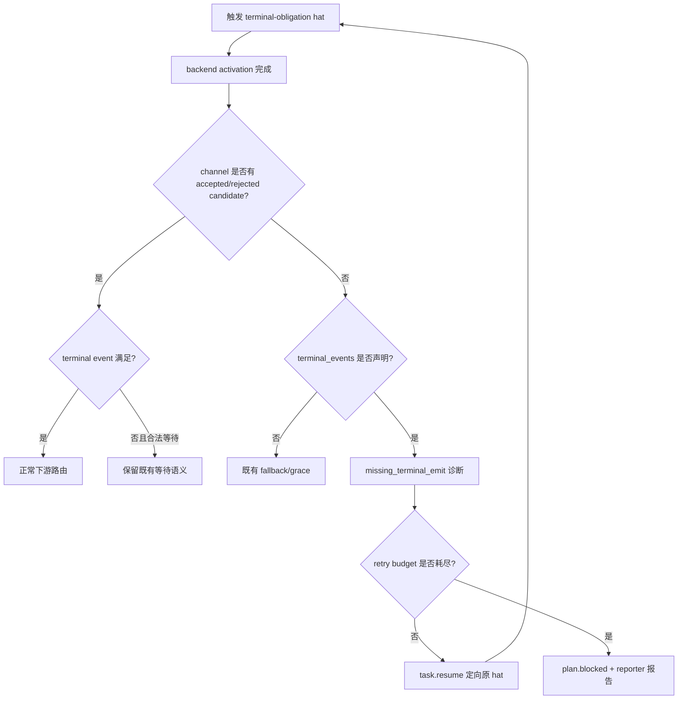

# fix: 空 hat channel 的终态检测与定向重试

## Goal Capsule

- **目标:** isolated hat activation 成功结束但未发布声明的终态事件时，底座立即识别负责 hat，注入结构化恢复信号并定向重试；重试耗尽后以该 hat 的缺失 emit 为根因阻塞，不再伪装成 `ralph` 的 generic stall。
- **权威边界:** 复用现有 `terminal_events`、`MissingEventGate`、`task.resume`、typed retry 和诊断体系；不新增一套独立 retry ledger，不修改 `resume` 的业务语义，不修复与本问题无关的 `default_publishes` 回流。
- **执行 profile:** runtime 保护 + builtin preset emitter 契约 + author/review skill 同步 + 真实 EventLoop/BDD 回归。
- **停止条件:** 终态事件成功写入并被 accepted；或同一 `(loop, activation, hat, trigger, missing-terminal-event)` retry key 达到既有 bounded retry 上限并转为 `plan.blocked`。
- **尾部 owner:** 原责任 hat 负责重试；耗尽后 reporter 负责报告，不能由 `ralph` 代替责任归因。

## Product Contract

### Summary

每个声明了 `terminal_events` 的 isolated hat 都有一项明确的 activation 交付义务。backend 返回成功不等于 activation 成功；只有责任 hat 的终态事件进入事件流，activation 才算完成。

### Problem Frame

当前 runtime 在 activation 结束时会创建并合并 per-hat channel。若 agent 没有 emit，channel 保持空文件。已有 `MissingEventGate` 可以发现缺失事件，但它受 `missing_event_grace_secs` 保护；本次运行在 grace window 内先累计到 `stall-detector` 的 3 轮无进展阈值，因此没有机会把问题打回 `dim:goal-alignment`。

### Requirements

- R1. backend 成功返回且终态 obligation hat 的 channel 为空时，runtime 必须立即生成该 hat-specific 的缺失终态诊断，不得等待通用 stall detector。
- R2. 首次及未耗尽的缺失终态诊断必须把恢复目标固定到原责任 hat，并携带原始 trigger topic/payload，使下一次 activation 回到同一业务上下文。
- R3. 缺失终态重试必须使用现有 bounded retry 语义；同一 retry key 重试耗尽后必须进入已有 fail-closed `plan.blocked` 路径，并保留 `missing_event_gate` 根因。
- R4. 已有业务事件、已被 policy 拒绝但 agent 确实尝试过的事件、wave fan-in 等合法等待状态不得被误判为空 emit。
- R5. builtin preset 中所有需要 emit 的 emitter hat 必须显式加载 on-demand 的 `ralph-tools-emit` skill；只引用 skill 名称不算完成契约。
- R6. `ralph-preset-author` 与 `ralph-preset-review` 必须把“on-demand emit skill 未显式加载”纳入创建检查、可见性审计和负例 fixture，且不能把该 skill 描述成自动注入。
- R7. 回归测试必须覆盖本次真实链路：`stabilization.done -> dim:goal-alignment` 空 channel -> 定向 retry -> `review.goalalign.done`，以及 retry 耗尽后的责任 hat-specific blocked 结果。

### Scope Boundaries

#### In scope

- `crates/ralph-cli` isolated channel 完成后的终态检测与恢复路由。
- 复用和必要修正 `crates/ralph-core` 的 missing-event diagnosis/retry 状态投影。
- builtin preset emitter instructions 的显式 skill-load 契约。
- author/review skill 及其 references、finding rubric、fixture 和验证脚本。
- 真实 runtime/BDD 与 targeted nextest 回归。

#### Out of scope

- 不改变 `default_publishes` 的正常语义。
- 不把所有空 channel 都立即视为失败；没有 `terminal_events` 的长运行或合法 pass-through hat 保持现有 grace/wait 语义。
- 不新增用户可见业务 topic 来承载内部 retry。
- 不扩展到新的 preset 功能或重新设计 isolated 调度模型。

### Success Criteria

- 本次 run 的失败会首先显示为 `dim:goal-alignment` 缺少 `review.goalalign.done`，而不是 `ralph` 连续空转。
- retry 未耗尽时，下一次 activation 的责任 hat、trigger context 和 allowed terminal topics 正确恢复。
- retry 耗尽时只有一个明确的 blocked 终态，且诊断保留同一 retry key 和责任 hat。
- builtin preset 的 emitter instructions 与 prompt visibility 审计一致，author/review 流程能够发现遗漏。

## Planning Contract

### Key Technical Decisions

- KTD1. **以 channel close 时点作为严格终态检测点。** `prepare_hat_channel` 创建空文件是正常初始化；只有 backend 已返回、channel 已 merge 且责任 hat 声明 `terminal_events` 时，空 channel 才构成 `missing_terminal_emit`。这样不会用即时检测打断仍在运行的长任务。
- KTD2. **复用 MissingEventGate retry 管线。** 不创建新计数器或第二套恢复 topic；使用稳定 retry key、结构化 `task.resume`、责任 hat pin、既有 bounded retry 和 blocked escalation。必要改动集中在让 channel-close 证据绕过不适用的 grace delay，并补齐当前调用链的恢复注入。
- KTD3. **业务事件尝试与真正无 emit 分离。** accepted event、contract-rejected event、wave policy rejection 仍属于“agent 尝试过”，不走 missing-terminal retry；只有 channel 没有任何有效或被拒绝的候选事件且 terminal obligation 未满足时才触发。
- KTD4. **preset 契约和 runtime 保护双层落地。** prompt 显式加载 skill 能降低发生率；runtime guard 保证 agent 仍遗漏时可定位、可重试、可收敛。不能只依赖 prompt 文案。

### High-Level Technical Design

检测必须发生在 isolated channel merge 之后、通用 default/stall fallback 之前。检测输入至少包括：责任 hat、触发 topic/payload、`terminal_events`、channel 是否为空、accepted/rejected candidate topics、backend success/timeout 状态和现有 retry state。

### Assumptions

- 现有 `task.resume` 与 `MissingEventGate` 的目标 hat pin、trigger replay、retry key 和 blocked escalation 可以承载该场景；若实现检查发现某个调用路径已删除恢复注入，则只恢复该既有路径，不扩展为新协议。
- builtin preset 的语言版本和嵌入/manifest 同步规则继续沿用仓库现有要求；本计划不改变 preset 名称或拓扑。

### Deferred to Follow-Up Work

- 将所有非终态空 channel 的 observability 统一为更丰富的 activation outcome 分类，除非实现本身需要该分类才能保持错误归因。
- 统一清理历史 preset instructions 中与本问题无关的冗余 emit 说明。

## Implementation Units

### U1. 在 channel-close 时点识别缺失终态并进入现有 retry 管线

- **Goal:** 在 isolated activation 完成后，对声明 `terminal_events` 的 hat 立即判断“无候选事件且终态未满足”，绕过会长达数分钟的普通 grace delay，并把恢复目标固定到责任 hat。
- **Requirements:** R1, R2, R3, R4; KTD1, KTD2, KTD3。
- **Dependencies:** 无。
- **Files:** `crates/ralph-cli/src/loop_runner/inner.rs`, `crates/ralph-cli/src/loop_runner/hat_channel.rs`, `crates/ralph-cli/src/loop_runner/hard_gate.rs`, `crates/ralph-core/src/event_loop/diagnosis*` 或实际承载 recovery envelope/retry state 的模块。
- **Approach:**
  1. 复用 channel merge 后已有的 candidate topic、policy rejection 和 activation outcome 信息，不从主 events 文件反推空 channel。
  2. 仅对 `terminal_events` 非空且 backend activation 已结束的责任 hat启用即时 missing-terminal 判断；保留普通 hat 的 grace/wait 逻辑。
  3. 生成稳定的 `missing_event_gate` retry key，记录责任 hat、原 trigger topic/payload、缺失 terminal topics 和 channel evidence。
  4. 接入现有结构化 recovery/resume 路由，确保下一轮重新激活同一 hat；禁止 fallback 到 `ralph` 或注入相反方向的 `default_publishes`。
  5. retry 未耗尽时跳过本轮 generic no-progress 计数；retry 耗尽时走既有 blocked escalation，并让 reporter 消费责任 hat 诊断。
- **Patterns to follow:** `should_gate_missing_events` 的 obligation precedence、`inject_hard_gate_guidance_with_triggers`/现有 recovery responder 的 target pin、`rejection_retry_count` 与 sibling retry 合并规则。
- **Test scenarios:**
  - backend success + 空 channel + `terminal_events=[review.goalalign.done]` 时，立即产生 `missing_event_gate`，target 为 `dim:goal-alignment`，不等待 `missing_event_grace_secs`。
  - backend success + 空 channel + retry 未耗尽时，产生一次带原 trigger context 的 `task.resume`，下一次 activation 仍选择原 hat。
  - retry 达到既有上限时，不再重新激活 hat，产生 `plan.blocked`，其 reason/diagnosis 保留 `missing_event_gate` 与责任 hat。
  - accepted terminal event、contract-rejected intended event、wave policy rejection 和合法 wave pending 不触发 missing-terminal retry。
  - backend timeout/cancel/error 不被错误归类为“成功但未 emit”；沿用对应 termination/recovery 分类。
- **Verification:** 通过 loop-runner hard-gate/recovery 单测和真实 isolated activation 测试，证明检测、定向 retry、耗尽阻塞三条路径均使用同一 retry key 和责任 hat。

### U2. 为所有 builtin emitter hat 补齐显式 emit-skill 契约

- **Goal:** 消除“只引用 `ralph-tools-emit`、但它实际是 on-demand”的系统性 prompt 缺口。
- **Requirements:** R5; KTD4。
- **Dependencies:** U1 可并行，但应在 U4 之前完成。
- **Files:** 相关 `presets/en/*.yml` emitter hat instructions；对应 `presets/zh/*.yml`（若该 preset 有中文镜像）；必要时 `presets/schemas/*.yml` 不改拓扑，仅在结构契约确有差异时同步；builtin manifest/index 不因本修复改变。
- **Approach:**
  1. 以 `ralph inspect prompt --hat <hat> --format json` 的 `on_demand` 结果为依据，盘点所有含 emit obligation 的 builtin hat。
  2. 在 emitter instructions 的执行顺序中明确：加载 `ralph-tools-emit`，完成 `--policy-check`，再执行唯一允许的真实 emit。
  3. 不把 `ralph-tools-emit` 改成全局 auto-inject，避免扩大所有 agent prompt 上下文和改变 skill visibility 模型。
  4. 保持每 activation 单业务事件、terminal ordering、schema required fields 和 artifact-first 约束不变。
- **Patterns to follow:** 已显式加载的 `implementation-review`、`merge-batch`、`parallel-forge`、`red-team-attack` emitter instructions。
- **Test scenarios:**
  - 每个 builtin emitter hat 的 prompt visibility 仍显示 `ralph-tools-emit` 为 on-demand，且 instructions 明确要求加载后再 emit。
  - 不含 emit obligation 的 precheck/pass-through hat 不被强制添加 emit skill 或终态步骤。
  - English preset 与存在的中文镜像在 emitter obligation、skill-load 语义上保持一致。
- **Verification:** 通过结构化 preset lint、prompt inspection、embedded preset parity 和 builtin preset strict lint；不新增仅锁定完整 prompt 文案的测试。

### U3. 同步 author/review skill 的可见性与 emit-contract 审计

- **Goal:** 让未来生成和评审 preset 时能在运行前发现同类缺口。
- **Requirements:** R6; KTD4。
- **Dependencies:** U2。
- **Files:** `skills/ralph-preset-author/SKILL.md`, `skills/ralph-preset-author/references/author-checklist.md`, `skills/ralph-preset-author/references/finding-rubric.md`, `skills/ralph-preset-author/references/commands.md`, `skills/ralph-preset-review/SKILL.md`, `skills/ralph-preset-review/references/author-checklist.md`, `skills/ralph-preset-review/references/finding-rubric.md`, `skills/ralph-preset-review/references/commands.md`, `skills/ralph-preset-review/references/prompt-visibility.md`, `skills/ralph-preset-review/fixtures/` and associated skill anchors/tests。
- **Approach:**
  1. 在 author checklist 增加 emitter skill-load、prompt visibility 和 terminal emit 顺序检查。
  2. 在 review per-hat AAF 中加入机械证据：inspect prompt JSON 的 `auto_inject`/`on_demand`、instructions 的显式 load、`publishes`/`terminal_events` 的对应关系。
  3. 新增专门 finding，区分“错误声称 auto-inject”和“on-demand 但未显式 load”；默认按会阻塞终态的 P0/P1 规则处理，置信度来自可复核的 prompt JSON。
  4. 增加正负 fixture，验证 emitter 缺 load 会被抓到、显式 load 且终态契约完整不会误报。
  5. 保持 author/review 两份 references 的 finding、命令表和 anchor 同步。
- **Test scenarios:**
  - 负例：instructions 引用 `ralph-tools-emit` 但不要求 load，review 输出对应 finding。
  - 负例：instructions 声称 `ralph-tools-emit` 自动注入，而 prompt JSON 显示 on-demand，review 输出 visibility finding。
  - 正例：显式 load、policy-check、真实 emit 顺序完整，且终态事件在 `terminal_events` 中，review 不产生该 finding。
  - author/review skill anchor parity 与 fixture 流程仍通过。
- **Verification:** 运行 preset author/review 的现有 anchor/fixture 验证和 `ralph preset check`；只更新 agent-facing 文档中的可执行规则，不泄漏 runtime 内部模块名、ledger 路径或一次性事故信息。

### U4. 添加真实 runtime/BDD 回归，覆盖空 channel、retry 和 preset 链路

- **Goal:** 用真实 EventLoop runner 锁住行为，而不是只测试 YAML 或 prompt 文本。
- **Requirements:** R7; KTD1-KTD4。
- **Dependencies:** U1, U2, U3。
- **Files:** `crates/ralph-core/tests/scenarios/*.yml`, `crates/ralph-core/tests/scenarios.rs`, `crates/ralph-cli/src/loop_runner/tests/`, 必要的 `crates/ralph-core/src/event_loop/tests/`。
- **Approach:**
  1. 增加真实 isolated scenario：`stabilization.done` 激活 goal-alignment，第一次 activation 空 channel，recovery 定向回 goal-alignment，第二次 emit `review.goalalign.done` 并继续下游。
  2. 增加 retry exhaustion scenario：责任 hat 连续未 emit，第三次后出现责任 hat-specific blocked，不出现 `ralph` 作为首因的 generic stall。
  3. 增加对照 scenario：candidate event 已被 policy 拒绝、wave 正在等待、terminal event 已接受时不触发错误 retry。
  4. 断言 accepted events、recovery envelope、retry key、target hat 和最终 blocked/report payload，而不是只断言 iteration 数。
- **Test scenarios:**
  - Covers R7: first empty channel is recovered by same hat and produces expected terminal event.
  - Covers R7: bounded retry exhaustion produces exactly one blocked terminal path with missing-event evidence.
  - Covers R4: rejected-at-policy and wave-pending paths do not create false missing-event recovery.
  - Covers R5/R6: representative builtin preset prompt visibility and review fixture remain aligned with runtime contract.
- **Verification:** BDD 使用 `run_workflow_guard_scenario` 等真实 runner；CLI 测试使用 nextest；不使用只匹配 YAML 文案的替代测试。

### U5. 更新诊断与运维可见性，避免错误再次指向 ralph

- **Goal:** 让诊断、TUI/RPC 和 reporter 能明确显示“责任 hat 未完成终态 emit”。
- **Requirements:** R1, R3, Success Criteria。
- **Dependencies:** U1, U4。
- **Files:** `crates/ralph-core/src/diagnosis/`, `crates/ralph-core/src/diagnostics/`, `crates/ralph-cli/src/loop_runner/`, 相关 diagnosis/reporter tests，以及必要的非注入开发文档。
- **Approach:**
  1. 诊断 envelope 使用稳定 reason code（建议 `missing_terminal_emit`）并携带责任 hat、trigger、expected terminal topics、channel evidence 和 retry attempt。
  2. 让 `ralph diagnose`、orchestration audit 和 reporter 读取同一 envelope，不从 generic `plan.blocked` 反推首因。
  3. 保持 `crates/ralph-core/data/*.md` 的 agent-facing 边界；若 agent 需要知道收到的恢复动作，只更新通用 emit/recovery skill，不写 preset 专用事故描述。
- **Test scenarios:**
  - missing-terminal envelope 的 source、target_hat、retry_key、attempt 和 expected action 完整且稳定。
  - retry 成功后诊断状态可恢复；retry 耗尽后诊断显示 failed/blocked，而不重复产生同一恢复事件。
  - reporter 收到 blocked 时能够区分 missing-terminal root cause 与 generic stall consequence。
- **Verification:** diagnosis/recovery unit tests、reporter projection tests 和 replay/smoke 场景通过；诊断字段不会依赖内部 ledger 作为 agent-facing artifact。

## Verification Contract

| Gate | Coverage | Done signal |
|---|---|---|
| Targeted runtime tests | U1, U5 | 空 channel 在 channel-close 时被检测、定向 retry、耗尽阻塞且诊断稳定 |
| BDD workflow scenarios | U4 | 真实 EventLoop 事件链断言成功 retry 与 exhaustion 两条路径 |
| Preset structural validation | U2, U3 | builtin preset strict lint、schema/preset parity、prompt visibility 检查通过 |
| Author/review skill validation | U3 | 两套 skill references、fixtures、anchors 同步，正负例结果符合预期 |
| Workspace regression | U1-U5 | `./scripts/run-tests.sh` 通过，未引入既有 isolated/wave/recovery 回归 |

## System-Wide Impact

- **Runtime:** isolated channel merge、missing-event gate、recovery responder、stall detector 和 termination reporter 的交界面会变化；其它没有 terminal obligation 的 hat 保持旧语义。
- **Preset authors:** 新 emitter preset 必须明确加载 on-demand emit skill，并由 review 通过 prompt visibility 证据审计。
- **Operators:** 空 channel 不再表现为无来源的 `ralph` stall，而显示责任 hat、缺失终态、当前 retry attempt 和最终处置。
- **Compatibility:** 不改变业务 topic schema、preset 名称、completion promise 或默认 fallback 的通用定义；只增加 terminal-obligation activation 的保护。

## Risks and Dependencies

- **R1: 长任务误判。** 通过只在 backend activation 已结束且 channel merge 完成后触发即时检测，并保留非 terminal hat 的 grace 逻辑规避。
- **R2: 重复 retry。** 使用既有 retry key、sibling attempt 合并和 idempotent recovery 记录；不得另建按 iteration 的无界计数。
- **R3: policy rejection 被误判。** candidate topics 必须包含 accepted、contract-rejected 和 wave-policy-rejected 的“已尝试”信号，再判断 terminal obligation。
- **R4: preset 面过大。** 先以 builtin manifest 的 emitter hats 为完整清单，修改仅限 instructions/skill contract，不改无关拓扑。
- **R5: author/review 文档漂移。** 两套 skill 的对应 references、finding rubric、commands 和 fixtures 必须同一变更单元完成，并运行仓库规定的 drift/anchor 校验。

## Definition of Done

- [ ] U1-U5 全部完成，且每个 U-ID 的测试场景有真实证据。
- [ ] 空 channel 的首个诊断责任 hat 为实际未 emit 的 hat，不是 `ralph`。
- [ ] retry 未耗尽时能回到同一 hat 和同一 trigger context；retry 耗尽后 fail-close 且不无限重试。
- [ ] `default_publishes`、合法 wave wait、policy rejection、completion 和 pass-through 路径无回归。
- [ ] 所有 builtin emitter preset 的 prompt contract 与 `ralph-tools-emit` on-demand visibility 一致。
- [ ] `ralph-preset-author` 与 `ralph-preset-review` 的规则、finding、fixture、anchor 同步。
- [ ] `./scripts/run-tests.sh`、preset lint、BDD 和 diagnosis/recovery gates 全部通过。
- [ ] 诊断报告和长期开发文档说明“空 channel 是 activation 未完成 emit 的证据”，不再使用本次已撤回的 `resume/default_publishes` 根因。

## Sources & Research

- `crates/ralph-cli/src/loop_runner/hat_channel.rs`：channel 创建、merge 和空 channel fallback。
- `crates/ralph-cli/src/loop_runner/inner.rs`：isolated activation 后的 channel merge、candidate topics、missing-event/default fallback 顺序。
- `crates/ralph-cli/src/loop_runner/hard_gate.rs`：`should_gate_missing_events`、obligation precedence、grace window 和 wave/pass-through 例外。
- `crates/ralph-core/src/event_loop/event_processing.rs`：terminal obligation 的创建、候选事件与 activation 状态。
- `crates/ralph-core/src/diagnosis/responder.rs` 与 `crates/ralph-core/src/event_loop/rejection.rs`：retry key、bounded retry、targeted recovery 和 blocked escalation。
- `ralph inspect prompt --hat dim:goal-alignment --format json`：`ralph-tools-emit` 为 on-demand，不在 auto-inject 列表。
- 当前运行诊断报告：`docs/report/2026-08-08-ce-executor-pipeline-2026-08-07-003-refactor-emit-module-split-plan-diagnosis.md`。

## 执行与对抗性审查记录

- 已实现 U1：isolated channel 成功 merge 后，非 supervisor agent 的空终态 channel 立即进入责任 hat 定向 `task.resume`；重试耗尽后生成带 `missing_terminal_emit` 根因的 `plan.blocked`。
- 已实现 U2/U3：builtin emitter instructions、author/review 规则及负例 fixture 已同步；runtime prompt builder 也对所有有 publish obligation 的 hat 加入显式 skill-load 保护。
- 已实现 U5：recovery envelope 携带责任 hat、原 trigger、期望终态 topic、retry key 和 attempt。
- U4 使用真实 EventLoop 测试覆盖定向恢复与 bounded exhaustion，并由现有 BDD workflow suite 完成全量回归；没有新增只匹配 YAML 或 prompt 文案的伪测试。
- 对抗性审查修复了两个 P1 边界：merge/channel 不可读或 merge 失败不误判为 agent 缺 emit；supervisor-managed wave 的空 ready-set 不进入普通 agent missing-terminal retry。
- 最终验证：`./scripts/run-tests.sh`：Phase 1 为 7485/7485，Phase 2 为 135/135，doctest 为 19/19；`git diff --check` 与 `scripts/check-cli-doc-drift.sh` 通过。
- `skills/ralph-preset-review/tests/test_skill_anchors.py` 中新增负例通过；该脚本另有两个既存 fixture 的 `key_stage_event_gate_notes_preset_diverge` 预期不一致，未由本次变更引入，也未修改其既有行为。
